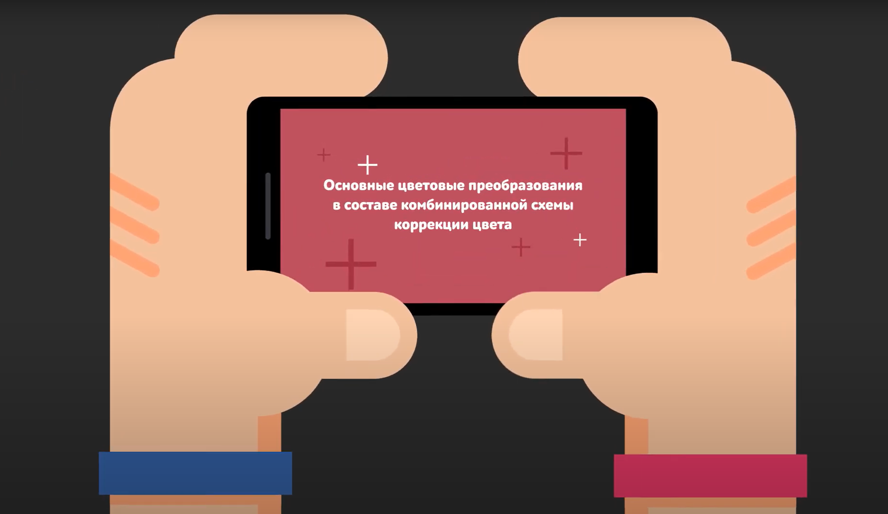
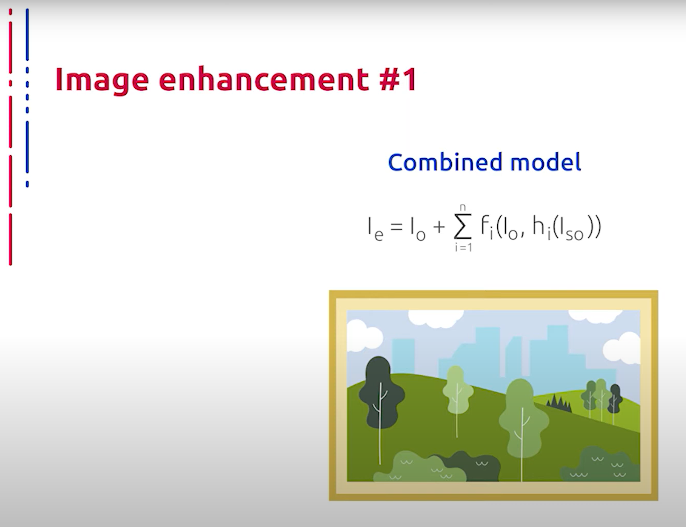
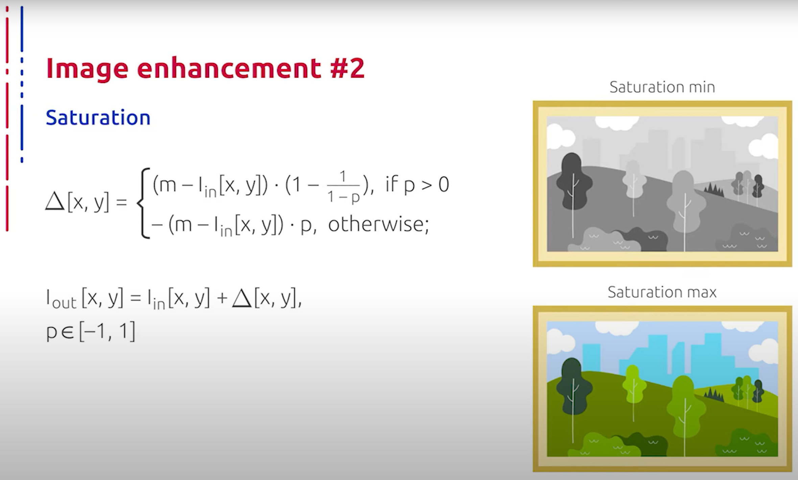
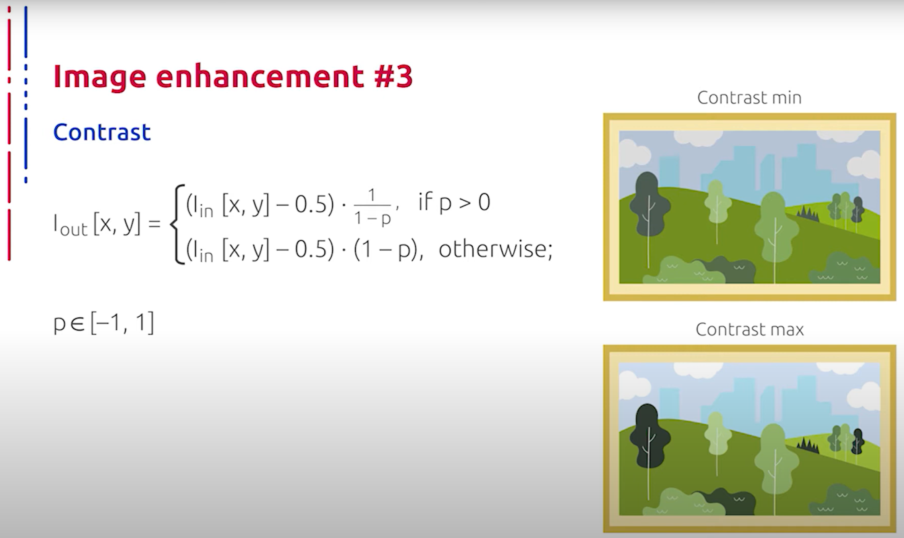
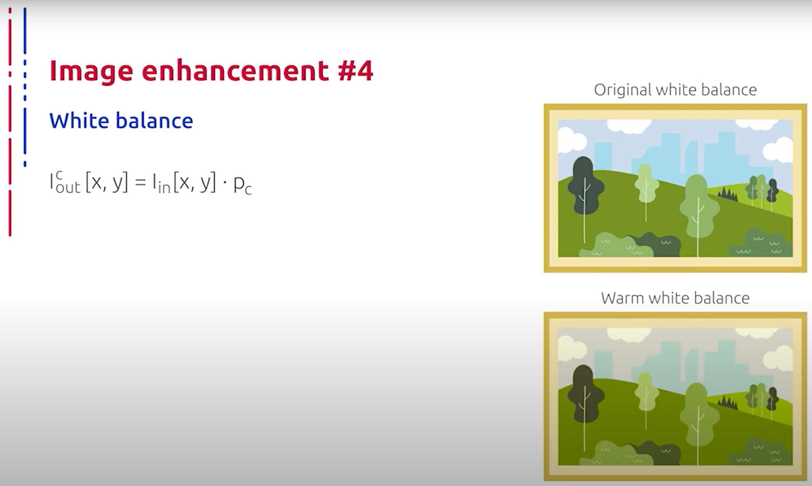
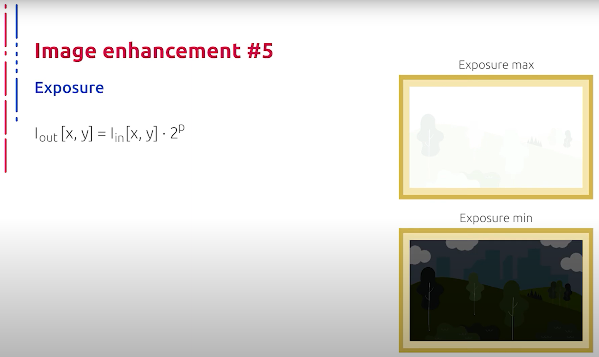

## [MainPage](../../index.md)/[Computer Vision](../README.md)/[Lecture](../Lecture.md)/1-3 RAW

语音识别：Youtube 转文本  
断句与标点：ChatGPT 4o  
翻译：ChatGPT 4o   

<!--  -->

# Основные цветовые преобразования в составе комбинированной схемы коррекции цвета   基本颜色变换作为组合颜色校正方案的一部分

Далее мы рассмотрим общие составляющие компоненты pipeline и улучшения изображения, которые напрямую не связаны с увеличением разрешения и которые, как правило, используются на втором этапе общего процесса предобработки. Все компоненты мы будем рассматривать в качестве составляющих общей комбинированной нейронной сетевой архитектуры, которая представляет собой последовательное применение преобразований к исходным изображениям с оптимально подобранными параметрами, порядком и выраженностью.  
接下来我们将讨论 pipeline 的主要组件及图像增强方法，这些方法不直接与分辨率的提高相关，通常在整体预处理的第二阶段使用。我们将这些组件作为整体组合的神经网络架构的一部分进行讨论，该架构通过一系列对原始图像进行转换的操作，参数、顺序和强度都经过优化。

Насыщенность цвета определяется характером распределения излучения в спектре видимого света. Наиболее насыщенный цвет образуется при существовании пика излучения для него, в то время как более равномерное по спектру излучение будет восприниматься как менее насыщенный цвет. В субтрактивной модели формирования цвета, например, при смешении красок на бумаге, снижение насыщенности будет наблюдаться при добавлении белых, серых, черных красок, а также при добавлении краски дополнительного цвета. Существуют различные способы изменять насыщенность изображения. Одно из таких отображений представлено на данном слайде. Отметим, что параметр, регулирующий данное преобразование, может быть обучаемым, и именно таковым он и является в нашем общем pipeline.  
颜色的饱和度取决于可见光谱中辐射的分布特性。最饱和的颜色在其辐射峰值存在时产生，而光谱分布更均匀的辐射会被视为较不饱和的颜色。在减法色彩模型中，例如在纸上混合颜料时，添加白色、灰色、黑色颜料以及补色颜料会降低饱和度。图像的饱和度可以通过多种方法改变，此处展示的正是其中一种方法。需要注意的是，控制这种转换的参数是可学习的，在我们总体的 pipeline 中正是如此。

Контрастность - это разница в яркости и/или цвете, которая делает объект заметным в изображении. В визуальном восприятии реального мира контрастность определяется разницей в цвете и яркости объекта и других объектов в пределах одного и того же поля зрения. Поскольку человеческая зрительная система более чувствительна к контрасту, чем к абсолютной яркости, мы можем воспринимать мир аналогично независимо от изменения освещения в течение суток или от места к месту. Максимальный контраст изображения зависит от контрастного коэффициента и динамического диапазона. Функция контрастной чувствительности человека показывает типичную форму полосового фильтра с максимумами около четырех циклов на градус с чувствительностью к прерыванию в любую сторону от пика. Это говорит нам о том, что зрительная система человека наиболее чувствительна к обнаружению контрастных изменений, происходящих в четырех циклах на градус. Верхняя граница частоты, то есть пространственная частота, ограничена способностью зрительной системы различать отдельные объекты и составляет, как правило, около 60 циклов на градус. Верхняя граница частоты связана с плотностью упаковки фоторецепторов сетчатки: чем меньше размер пикселя матрицы, тем лучше разрешение. Нижняя частота детекции связана с материальным торможением в ганглиозных клетках сетчатки. Существуют различные способы изменять контрастность изображения, одно из таких отображений представлено на данном слайде. Параметр, регулирующий выраженность данного преобразования, является обучаемым в нашем общем pipeline.  
对比度是指亮度和/或颜色的差异，使得对象在图像中变得显眼。在真实世界的视觉感知中，对比度由同一视野范围内对象的颜色和亮度差异决定。由于人类视觉系统对对比度的敏感度高于对绝对亮度的敏感度，我们可以在一天中的不同光照条件下或不同地点，仍然以类似的方式感知世界。图像的最大对比度取决于对比系数和动态范围。人类的对比敏感度函数表现为带通滤波器的典型形状，峰值在每度大约四个周期的频率处，对于峰值两侧的变化也很敏感。这表明人类视觉系统最敏感于每度四个周期的对比度变化。上限频率，即空间频率，受限于视觉系统分辨单个对象的能力，通常约为每度60个周期。上限频率与视网膜光感受器的排列密度有关：像素尺寸越小，分辨率越高。检测下限频率与视网膜神经节细胞的物理阻滞有关。图像对比度可以通过多种方法改变，此处展示的正是其中一种方法。在我们的总体 pipeline 中，控制这种转换强度的参数是可学习的。

Баланс белого цвета - одна из характеристик метода передачи цветного изображения, определяющая соответствие цветовой гаммы изображения объекту съемки. Объект заведомо белого цвета кажется белым практически при любом освещении, потому что необходимую цветокоррекцию автоматически проводит человеческий глаз, если источник освещения имеет непрерывный спектр тепловой природы. Эту температуру измеряют в кельвинах. Пламя свечи имеет цветовую температуру около 1800 К, лампы накаливания - 2500 К, восход солнца - 2800 К, лампа-вспышка - 5500 К, голубое безоблачное небо в летний день - 11 000 К и выше. Корректное определение цветовой температуры по спектру источника для флуоресцентных, многих ртутных и низкотемпературных газоразрядных ламп невозможно, так как значительная доля излучённой энергии приходится на линейную часть спектра. Глаз человека не имеет эффективных средств адаптации к таким источникам, однако в этих случаях мозг создает ощущение белого цвета для соответствующих объектов. В таких случаях говорят об эффектах визуального сравнения.  
白平衡是彩色图像传输方法的特性之一，决定图像颜色与拍摄对象颜色的匹配度。白色对象在任何照明下看起来都应是白色，因为人眼会自动进行颜色校正，如果光源具有连续的热辐射光谱。这种温度用开尔文（K）表示。蜡烛火焰的色温约为1800K，白炽灯为2500K，日出为2800K，闪光灯为5500K，夏季晴天的蓝天超过11000K。对于荧光灯、汞灯和低温气体放电灯，由于其光谱能量主要集中在某些线段上，无法准确确定其色温。人眼对这些光源缺乏有效的适应能力，但大脑会为相应的物体创造出白色的感觉。在这种情况下，这被称为视觉比较效果。

Наиболее сложная ситуация для баланса белого - это наличие двух и более разных источников с различной цветовой температурой. В этом случае глаз и мозг человека все равно видят правильные цвета предметов, однако пленка, телекамера и цифровой фотоаппарат воспроизводят часть предметов искаженно. Например, если мы выставили баланс белого на дневной свет, та часть кадра, освещенная лампами накаливания, будет выглядеть желтой, а та, что освещена флуоресцентными лампами - зеленой, розовой или фиолетовой, в зависимости от типа ламп. В нашем случае цветокоррекция производится путем преобразования изображения в цветовом пространстве, в результате чего объекты, которые глаз видит как белые, будут показаны белыми на вашем снимке. Баланс белого камеры должен учитывать цветовую температуру источника освещения. Автоматический баланс белого часто создает большие трудности, так как неверный баланс может привести к неестественным оттенкам. Применение баланса белого в традиционной пленочной фотографии означало использование различных оттеночных фильтров для разных условий съемки. В цифровой фотографии это больше не требуется, так как автоматический баланс белого может помочь избежать искажений цвета. На представленном слайде показано преобразование, которое позволяет эмулировать изменение баланса белого. Обучение данного параметра позволяет сделать универсальную подстройку.  
白平衡最复杂的情况是存在两个或更多具有不同色温的光源时。此时，虽然人眼和大脑仍能看到正确的颜色，但胶片、摄像机和数码相机会失真。例如，如果我们设置了日光白平衡，被白炽灯照亮的部分会显得偏黄，而被荧光灯照亮的部分会显得绿色、粉红色或紫色，取决于灯的类型。在我们的例子中，颜色校正通过颜色空间中的图像转换来进行，这样眼睛看起来是白色的对象在照片中也会显得白色。相机的白平衡必须考虑光源的色温。自动白平衡常常遇到很大的困难，因为错误的白平衡会导致不自然的色调。传统胶片摄影中的白平衡需要使用不同的滤色片，而在数码摄影中则不再需要，因为自动白平衡可以帮助避免颜色失真。此处展示的转换允许模拟白平衡的变化。通过学习该参数，可以实现通用的调整。

Экспозиция - это количество светового излучения, получаемого светочувствительным элементом. Она может быть рассчитана как произведение освещенности на выдержку, в течение которой свет воздействует на светочувствительный элемент, то есть матрицу цифровой камеры. Экспозиция выражается в люкс-секундах и также употребляется применительно к самому процессу экспонирования светочувствительного элемента. При экспонировании изменяются физико-химические или электрические свойства светоприемника. Светочувствительные материалы и электронные преобразователи света в электрические сигналы обладают ограниченной фотографической широтой и способны воспроизвести относительно узкий диапазон яркостей объекта съемки. Поэтому для правильного отображения всех участков сцены необходимо точное дозирование количества света. Слишком малая экспозиция приводит к получению темного изображения, в котором отсутствуют детали в темных участках. Слишком большая экспозиция приводит к получению изображения с отсутствующими деталями в светлых местах.  
曝光是指感光元件接收到的光辐射量。可以通过光照强度和快门时间的乘积来计算，即数字相机感光元件的曝光量。曝光以勒克斯秒为单位，亦用于描述曝光过程中的感光元件。曝光过程中感光材料的物理化学或电学特性会发生变化。感光材料和将光转换为电信号的电子转换器具有有限的动态范围，只能重现拍摄对象的相对较窄的亮度范围。因此，为了正确显示场景的所有部分，需要精确控制光量。曝光不足会导致图像变暗，细节丢失；曝光过度则会使图像高光部分细节丢失。

Экспозиция должна быть такой, чтобы позволить фотоматериалу воспроизвести максимальный диапазон важных яркостей. Светочувствительность - это характеристика любого светочувствительного элемента. Чем больше светочувствительность матрицы или пленки, тем меньше требуется экспозиция. В большинстве устройств экспозиция зависит от относительного отверстия объектива и выдержки. При фотосъемке выдержка регулируется затвором, а при киносъемке - обтюратором. Экспозиция регулируется главным образом диафрагмой. В телекамерах экспозиция может регулироваться только диафрагмой, так как выдержка всегда точно соответствовала длительности телевизионного поля. Современные видеокамеры имеют возможность регулировки времени считывания кадра путем изменения выдержки.  
曝光应适当，以使感光材料重现最大范围的重要亮度。感光度是任何感光元件的特性。感光度越高，所需曝光越少。大多数设备的曝光取决于镜头光圈和快门速度。拍照时，快门速度由快门控制，电影拍摄时则由光闸控制。曝光主要通过光圈调节。在电视摄像机中，曝光只能通过光圈调节，因为快门速度总是与电视帧的持续时间相对应。现代摄像机可以通过改变快门速度来调节读取帧的时间。

При фотосъемке экспозиция может регулироваться выдержкой, значение которой может измеряться минутами и часами. Для регулирования освещенности могут применяться светофильтры. В некоторых процессах экспонирования выдержка регулируется временем работы источника излучения. В кино копировальных аппаратах экспозиция задается шириной печатного окна и может регулироваться яркостью источника света и скоростью перемещения пленки. При фотосъемке с электронными вспышками экспозиция регулируется диафрагмой объектива и длительностью импульса. Некоторые современные виды оборудования позволяют регулировать экспозицию для отдельных элементов. В нашем случае мы производим эмуляцию автоматической настройки экспозиции путем обучения специального параметра, представленного на слайде.  
拍照时，曝光可以通过快门速度调节，其时间可以以分钟或小时计，而电影摄像机允许的快门速度不超过1/50秒。光圈也可以用于调节光照强度。在某些曝光过程中，快门速度由光源的工作时间控制。在电影复制机中，曝光由打印窗口的宽度设定，可以通过调整光源亮度和胶片移动速度来调节。拍照时，电子闪光灯的曝光由镜头光圈和闪光持续时间调节。一些现代设备允许单独调节某些元素的曝光。在我们的案例中，我们通过学习特定参数进行曝光自动调整的模拟，该参数在展示的幻灯片中给出。