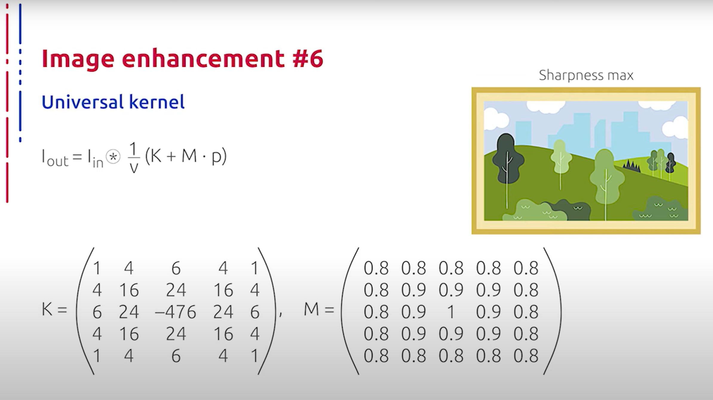
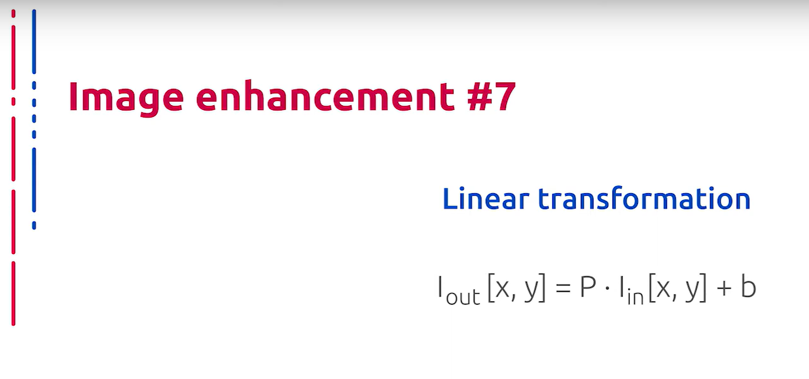
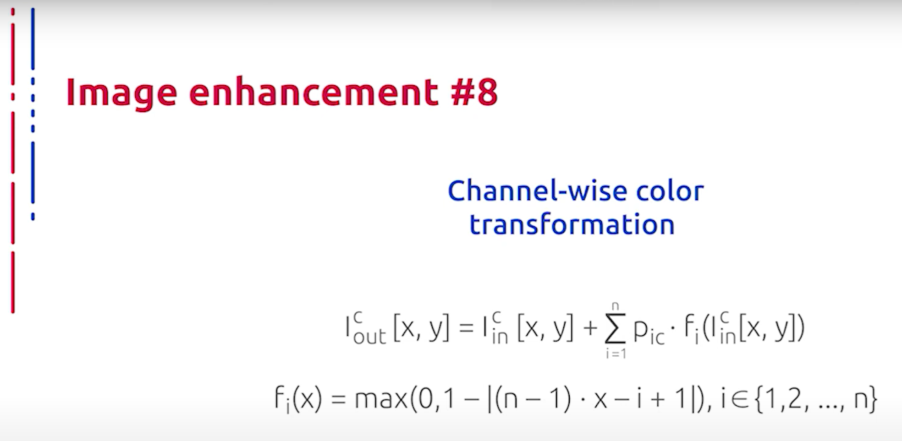
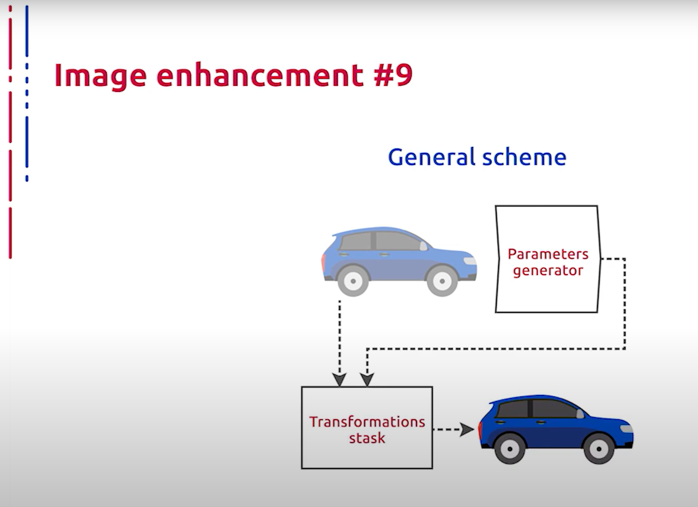

## [MainPage](../../index.md)/[Computer Vision](../README.md)/[Lecture1-4](../Lecture.md)/RAW

语音识别：Sonix.ai  
断句与标点：ChatGPT 4o  
翻译：Google  

# Дополнительные цветовые преобразования в составе комбинированной схемы коррекции цвета   作为组合色彩校正方案一部分的附加色彩变换

Ещё одним преобразованием в нашем стеке является своего рода универсальная свёртка, которая представляет собой свёртку входного изображения с линейной комбинацией специального ядра, которое может регулировать резкость, к примеру, как на слайде. И произведение этого параметра на симметричное окно делает преобразование более выраженным к центру.  
在我们的栈中，另一个转换是一种通用卷积，它是输入图像与特殊核的线性组合的卷积，这种组合可以调节锐度，例如在幻灯片中所示的那样。而将这个参数作用于对称窗口，使得转换在中心更为显著。

Помимо резкости, в данном преобразовании может фигурировать любое другое ядро. Ранее мы рассматривали лишь локальные преобразования. Отметим также, что помимо локальных преобразований в нашем ТЭКе возможно применять и глобальные преобразования. К примеру, выучив целое ядро в пространстве, применяемое сразу ко всему изображению.  
除了锐度之外，该转换中还可以使用任何其他核。此前我们只讨论了局部转换。我们还要指出，除了局部转换外，在我们的TЭК中还可以使用全局转换。例如，学习整个空间中的核，然后将其应用于整个图像。

Также на практике хорошо зарекомендовали себя персональные преобразования следующего вида. Наличие персональных обучаемых параметров позволяет напрямую включить преобразование данного рода в наш план. Таким образом, наш план выглядит согласно следующей схеме: сначала с помощью свёрточного кодировщика мы получаем параметры, после чего применяем все наши преобразования с определёнными параметрами к исходному изображению и получаем улучшенную версию.  
此外，以下类型的个性化转换在实践中表现良好。拥有个性化的可学习参数允许我们直接将这种转换纳入我们的计划。因此，我们的计划如下：首先通过卷积编码器获取参数，然后我们将所有带有特定参数的转换应用于原始图像，并得到改进版本。

Отметим также, что данная комбинированная нейросетевая схема обучается методом градиентного спуска с различными оптимизациями, о которых мы поговорим в следующей лекции.  
我们还要指出，该组合神经网络通过梯度下降法进行训练，并使用各种优化方法，这些我们将在下一次讲座中讨论。

На этом наша сегодняшняя лекция подошла к концу. Спасибо за внимание.  
今天的讲座到此结束。谢谢大家的关注。