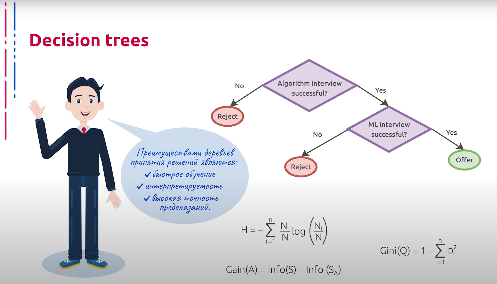
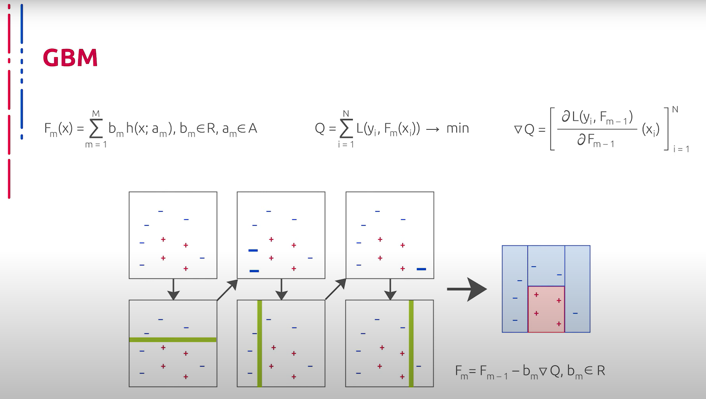
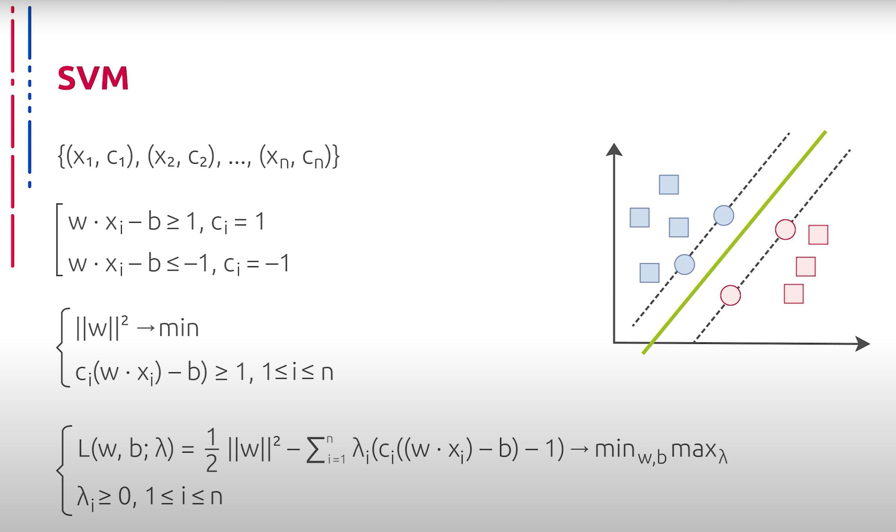
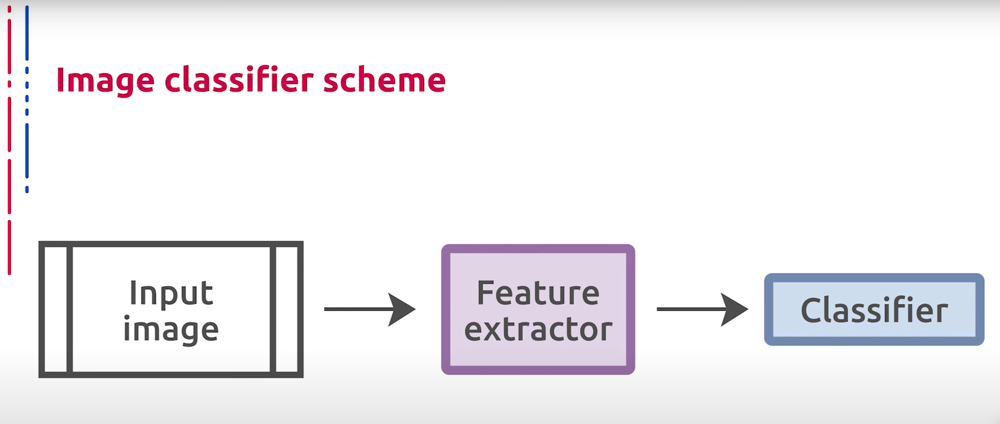

## [MainPage](../../index.md)/[Computer Vision](../README.md)/[Lecture](../Lecture.md)/2-1 RAW

语音识别：科大讯飞  
断句与标点：chatGPT 4o  
翻译：chatGPT 4o  

<!--  -->

# 2.1 Введение. Классические/не нейросетевые/общие методы для классификации изображений  经典/非神经网络/图像分类的通用方法

1 из базовых задач компьютерного зрения является классификация изображений. Обстановка данной задачи предельно проста: входное изображение необходимо отнести к 1 из заданных классов. Рассмотрим далее некоторые классические методы классификации изображений, после чего перейдём к подходам, основанным на глубоком обучении, которые на данный момент демонстрируют наилучшие результаты в этой области.  
计算机视觉的基本任务之一是图像分类。这个任务的设置极其简单：需要将输入图像归入给定的某个类别。接下来，我们将讨论一些经典的图像分类方法，然后转向目前在该领域表现最好的基于深度学习的方法。

Пожалуй, самым простым для понимания подходом классификации являются деревья решений, которые представляют собой древовидные структуры, содержащие в узлах решающие правила, а в листьях — утверждение о принадлежности элемента к одному из классов. Вообще, с помощью деревьев решений можно выполнять задачи и классификации, и регрессии, и даже строить описание объектов. Однако в сегодняшней лекции мы сосредоточимся только на классификации.  
或许，最容易理解的分类方法是决策树。决策树是一种树状结构，在节点中包含决策规则，而在叶子节点中包含元素属于某个类别的声明。实际上，通过决策树可以执行分类、回归甚至构建对象描述的任务。然而，在今天的讲座中，我们只专注于分类。

Обучение деревьев происходит путём рекурсивного разбиения обучающего множества на подмножества согласно принципу построения решающего правила до тех пор, пока в листьях не останется по 1 элементу обучающей выборки либо не будет достигнута предельная глубина дерева или другое условие. В основе принципа построения решающего правила в узле может лежать идея об уменьшении энтропии в подмножествах, порождённых решающим правилом в рассматриваемом узле. На основе этого принято максимизировать прирост упорядоченности, то есть насколько решающее правило уменьшает энтропию исходного множества. В простейшем случае правилом может служить пороговая функция для 1 из численных компонент атрибутов каждого элемента обучающего множества. Для выбора разделяющего признака также часто используется критерий Джини, который демонстрирует расстояние между истинным распределением классов в тестовом наборе и распределением, порождённым полученным локальным классификатором.  
决策树的训练通过递归地将训练集划分为子集来进行，依据的是构建决策规则的原则，直到叶子节点中只剩下一个训练样本，或者达到了树的最大深度或其他条件。决策规则的构建原则可能基于在给定节点中减少子集中的熵的思想。基于这一点，通常会最大化有序性的提升，即决策规则减少原始集合熵的程度。在最简单的情况下，规则可以是某个数值属性的阈值函数。选择分割特征时，还经常使用基尼系数，该系数显示了测试集中类别的真实分布与由获得的局部分类器生成的分布之间的距离。

Преимуществами деревьев принятия решений являются быстрое обучение, интерпретируемость и высокая скорость предсказаний.  
决策树的优点是训练速度快、可解释性强和预测速度高。

Ещё одним важным и чрезвычайно мощным механизмом классификации объектов, каждый из которых представлен набором численных характеристик, является метод градиентного бустинга. Бустинг представляет собой подход к консолидации, когда каждый последующий слабый классификатор учится на ошибках предыдущего. Таким образом строится сильный классификатор. В роли слабых классификаторов часто и довольно успешно используются деревья малой глубины.  
另一个重要且非常强大的对象分类机制是梯度提升法，每个对象都由一组数值特征表示。提升是一种合并方法，每个后续的弱分类器都在前一个分类器的错误上进行学习，从而构建一个强分类器。弱分类器通常并且相当成功地使用浅层树。

На практике градиентный бустинг хорошо показывает себя в качестве классификатора векторных дескрипторов изображений, что позволяет производить классификацию даже там, где кодирующие визуальные признаки не выделяются особо выразительными векторными признаками или дескрипторами.  
在实践中，梯度提升在图像向量描述符的分类方面表现良好，这使得即使在编码的视觉特征不具备特别突出的向量特征或描述符的情况下也能进行分类。 

Метод опорных векторов также является важным представителем семейства не нейросетевых классификаторов. Данный подход предполагает построение разделяющей гиперплоскости между элементами двух классов, представленными точками в многомерном пространстве. Иными словами, искомая гиперплоскость максимизирует зазор между разделяемыми классами.  
支持向量机（SVM）方法也是非神经网络分类器家族中的重要成员。该方法假设在多维空间中构建两个类别元素之间的分隔超平面，换句话说，所求的超平面最大化了分离类别之间的间隔。

Это является одним из базовых принципов метода опорных векторов, то есть вектор нормали к этой гиперплоскости является направлением в признаковом пространстве, вдоль которого мы имеем максимальную разделённость. Таким образом, одной из ключевых идей метода опорных векторов является то, что он пытается определить оптимальное направление разделения признакового пространства. Особенностью данного подхода является быстрота его работы в совокупности с высоким качеством, что позволяет обрабатывать данные высокой размерности. В общем виде в основе метода опорных векторов лежат идеи об отображении исходных данных в пространство, где классы линейно разделимы, и построении разделяющей гиперплоскости, равноудалённой от опорных векторов, грубо говоря, элементов одного класса, максимально приближенных к элементам другого класса. Таким образом, количество обрабатываемых данных существенно уменьшается. Более того, к этому добавляется эвристика ядра, позволяющая моделировать скалярное произведение в пространстве большей размерности с помощью более дешёвого, например, скалярного произведения в исходном пространстве. В результате получается хорошо изученная задача квадратичного программирования. Однако данный метод неустойчив к шуму и не предоставляет общих принципов для построения новых ядер и стремящих пространств в базовой его версии.  
这是支持向量机方法的基本原则之一，即该超平面的法向量是特征空间中的方向，沿此方向我们具有最大的分离度。因此，支持向量机方法的一个关键思想是尝试确定特征空间的最佳分离方向。该方法的特点是高效工作与高质量的结合，这使得它可以处理高维数据。一般来说，支持向量机方法的基础是将原始数据映射到类别线性可分的空间，并构建与支持向量等距离的分隔超平面，粗略地说，这些支持向量是一个类别中最接近另一个类别的元素。因此，处理的数据量显著减少。此外，还增加了核技巧，使得可以在更高维的空间中通过更便宜的方法模拟标量乘积，例如在原始空间中的标量乘积。结果是一个已经研究得很透彻的二次规划问题。然而，该方法对噪声不稳定，并且在其基本版本中不提供构建新核和空间的通用原则。

Вспомним, что общая схема классического классификатора изображений зачастую может быть представлена следующим образом: некоторый кодировщик признаков, который переводит исходное изображение в векторный формат, за которым следует классификатор, который применяется к полученным векторам, например, один из рассмотренных ранее методов. Только что мы рассмотрели способы классификации некоторых векторных представлений объектов. Теперь зададимся вопросом о том, как получить эти векторные представления.  
回顾一下，经典图像分类器的总体框架通常可以表示如下：某种特征编码器将原始图像转换为向量格式，之后是一个应用于这些向量的分类器，例如我们之前讨论的某个方法。刚才我们讨论了一些对象向量表示的分类方法。现在我们要问的是，如何获得这些向量表示。