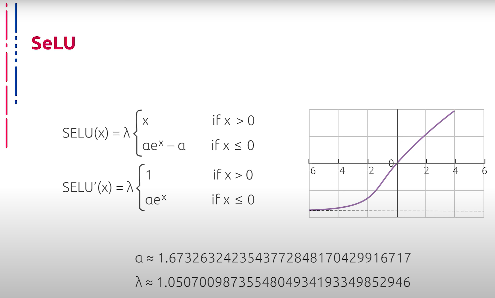

## [MainPage](../../index.md)/[Computer Vision](../README.md)/[Lecture](../Lecture.md)/2-3 RAW

语音识别：Youtube 转文本  
断句与标点：chatGPT 3.5  
翻译：chatGPT 4o  

<!--  -->

# 2.3 Основные конструктивные элементы нейросетевых классификаторов изображений  神经网络图像分类器的基本结构要素

В настоящее время самые эффективные и прогрессивные методы классификации изображений основаны на глубоких сверточных нейронных сетях. Данную картину можно наблюдать с 2012 года. Далее мы рассмотрим наиболее знаковые, часто используемые и эффективные нейросетевые архитектуры, применяемые для классификации изображений, а также их основные конструктивные элементы и принципы построения.  
目前，最有效和先进的图像分类方法基于深度卷积神经网络。自2012年以来，这一趋势一直显而易见。接下来，我们将探讨用于图像分类的最重要、最常用和最有效的神经网络架构，以及它们的主要结构元素和构建原理。

Самым простым для понимания элементом глубоких нейросетевых архитектур, пожалуй, является конструктивный элемент, который был использован в классической архитектуре перцептрона — полносвязанный блок. Часто он применяется в качестве одного из конструктивных элементов. В глубоких нейросетевых архитектурах данные блоки представляют собой искусственные нейроны, распределённые по слоям, где каждый нейрон предшествующего слоя влияет на каждый нейрон текущего. Каждый нейрон текущего слоя, в свою очередь, влияет на каждый нейрон последующего слоя.  
深度神经网络架构中最容易理解的元素可能是全连接层，这一构造元素在经典的感知器架构中已经使用过。全连接层经常作为构造元素之一应用。在深度神经网络架构中，这些层代表人工神经元，分布在各个层中，每个前一层的神经元都会影响当前层的每个神经元。当前层的每个神经元又会影响下一层的每个神经元。

Очевидным недостатком такой конструкции является огромное число весов, возникающее при попытке построить и обучить глубокую нейросетевую архитектуру, способную качественно обрабатывать данные, такие как изображения высокого разрешения. Рассмотрим подробнее принцип работы искусственного нейрона, который является основным элементом архитектуры перцептрона.  
这种结构的明显缺点是，当试图构建和训练能够高质量处理高分辨率图像数据的深度神经网络架构时，会产生大量的权重。接下来，我们将更详细地探讨作为感知器架构基本元素的人工神经元的工作原理。

Конструктивно искусственный нейрон крайне прост и имеет естественное биологическое основание, так как в некотором приближении моделирует работу нейрона из нервной системы человека. Каждая компонента входного сигнала домножается на соответствующий ей вес, после чего к результату скалярного произведения входного вектора и вектора весов применяется функция активации, значение которой передаётся дальше в качестве результата.  
从结构上看，人工神经元非常简单，并且具有自然的生物学基础，因为它在一定程度上模拟了人类神经系统中神经元的工作原理。每个输入信号的分量都乘以相应的权重，然后将输入向量与权重向量的点积结果应用于激活函数，激活函数的值作为结果传递下去。

Веса в данном случае являются обучаемыми параметрами данного элемента модели из предыдущего слоя. Нам становится понятно место функции активации в структуре нашей модели. Каковы же задачи функции активации? В первую очередь, это приведение выходов предшествующих элементов архитектуры к определённому диапазону значений.  
在这种情况下，权重是从前一层模型中学习到的参数。这样一来，我们就可以理解激活函数在我们模型结构中的位置。激活函数的任务是什么呢？首先，它将前一层架构的输出转换到特定的数值范围内。

Отметим, что от конкретных свойств конкретной функции активации в определённом месте нейросетевой архитектуры зачастую зависит как само функционирование модели, так и возможность её обучения. Помимо дифференцируемости, которая позволяет эффективно применять градиентный спуск для решения задачи нахождения оптимальных весов, определённый интерес при исследовании функции активации представляют и другие свойства.  
值得注意的是，具体激活函数在神经网络架构中的具体位置决定了模型的功能和其学习的可能性。除了可微性（这允许有效地应用梯度下降法来找到最优权重），激活函数的其他属性也很有趣。

Нелинейность активации позволяет уже с помощью двухуровневой архитектуры построить универсальный аппроксиматор функций и таким образом существенно повысить мощность рассматриваемого инструмента при решении той или иной задачи. Разумеется, по сравнению с линейными тождественными функциями активации ещё одним важным свойством функции активации является ограниченная область значений, что позволяет избежать проблем в процессе оптимизации.  
非线性激活函数允许通过两层架构构建通用函数逼近器，从而大大提高在解决特定任务时的工具功效。显然，相较于线性恒等激活函数，激活函数的另一个重要属性是有限的数值范围，这可以避免优化过程中的问题。

Помимо вышеупомянутого условия при оптимизации важную роль играет возможность аппроксимировать тождественную функцию в окрестности 0. Если данное условие не выполнено, могут возникнуть проблемы при начальной инициализации весов. Рассмотрим далее распространённые функции активации, их основные свойства и область применения.  
除了优化过程中提到的条件外，逼近0邻域的恒等函数的能力也很重要。如果不满足这一条件，权重的初始值设置可能会出现问题。接下来我们将讨论常见的激活函数及其主要属性和应用领域。

Классическим вариантом функции активации является сигмоид. Он же логистическая регрессия — гладкая монотонно возрастающая нелинейная функция, которая усиливает слабые сигналы и насыщается от сильных. Используется логистическая регрессия в основном в качестве активации для полносвязанных слоёв, в том числе и на выходах глубоких моделей.  
经典的激活函数是Sigmoid，也称为逻辑回归——一种平滑、单调递增的非线性函数，它能增强弱信号，并在强信号时饱和。逻辑回归主要用于全连接层的激活，包括深度模型的输出层。

Несомненными плюсами данной функции являются ограниченная область значений в интервале от 0 до единицы, монотонность и простой аналитический вид производной. Однако нельзя не отметить, что данная функция фактически гладко аппроксимирует ступеньку, что делает результат её применения удобным для использования в качестве выхода в глубокой модели при решении задачи классификации, но одновременно ведёт к проблеме затухающих градиентов при использовании внутри глубоких свёрточных нейронных сетей. Причиной этому служит быстрое насыщение при отдалении от начала координат.  
这种函数的优点包括在0到1范围内的有限值域、单调性和简单的解析导数形式。然而，不得不提的是，该函数实际上平滑地逼近阶跃函数，这使得其在解决分类问题的深度模型输出时非常方便，但在深度卷积编码器中使用时会导致梯度消失问题。这是因为在远离坐标原点时，函数迅速饱和。

Гиперболический тангенс по своим свойствам напоминает сигмоид, он также склонен усиливать слабые сигналы при всей простоте аналитического вида производной и ограниченной области значений. Он также склонен к быстрому насыщению при больших по модулю входных значениях и влечёт затухание градиентов при использовании в качестве активации в глубоких свёрточных нейронных сетях.  
双曲正切函数的性质类似于Sigmoid，它也倾向于增强弱信号，具有简单的解析导数和有限的值域。然而，在输入值绝对值较大时，它也会迅速饱和，并在深度卷积编码器中使用时导致梯度消失问题。

Однако следует отметить безусловное преимущество гиперболического тангенса над сигмоидой — центрированность относительно 0, что позволяет градиентам быть как положительными, так и отрицательными в процессе оптимизации весов, что позволяет избежать нежелательного зигзагообразного эффекта.  
然而，双曲正切函数相对于Sigmoid有一个无可争议的优势，即其以0为中心，这使得在优化权重的过程中梯度既可以为正也可以为负，从而避免了不必要的锯齿效应。

Для использования в качестве функции активации в глубоких кодировщиках часто используется ReLU (Rectified Linear Unit) или линейный выпрямитель. Применение данного типа активации обусловлено отсутствием потребности тратить вычислительные мощности на численное нахождение производной, что существенно повышает скорость обучения. Также отметим, что ReLU нелинеен, что позволяет строить универсальный апроксиматор с его помощью. Однако отметим и очевидные недостатки данного способа активации. ReLU не ограничен сверху, не насыщается, что ведёт к взрыву градиентов. Помимо этого, при отрицательных значениях градиент не корректируется, такая проблема называется "умирающими линейными выпрямителями".  
在深度编码器中，通常使用 ReLU（Rectified Linear Unit）或线性整流单元作为激活函数。这种激活函数的应用不需要消耗计算资源来数值计算导数，从而显著提高了训练速度。此外，ReLU 非线性，这使得它可以用来构建通用逼近器。然而，这种激活方法也有明显的缺点。ReLU 没有上限，不会饱和，这会导致梯度爆炸。此外，对于负值，梯度不会被修正，这种问题被称为“死 ReLU”。

Рассмотрим далее некоторые модификации и улучшения ReLU. Линейный выпрямитель с утечкой (Leaky ReLU) — данная модификация ReLU позволяет избегать проблемы умирания обычных ReLU, что является огромным преимуществом по сравнению с базовым вариантом, так как эмпирические наблюдения показывают, что доля "мёртвых" ReLU в глубоких обученных нейросетях может достигать 40%. Однако проблема взрывающихся градиентов в данной модификации, наоборот, обостряется.  
接下来，我们来看看 ReLU 的一些修改和改进。带泄漏的线性整流单元（Leaky ReLU）是一种 ReLU 的修改版，这种修改可以避免普通 ReLU 死亡的问题，相较于基本版本，这是一个巨大的优势，因为经验观察表明，在深度训练的神经网络中，约有 40% 的 ReLU 会“死亡”。然而，在这种修改中，梯度爆炸的问题反而更加严重。

Ещё одна модификация ReLU называется Exponential Linear Unit (ELU). Параметр альфа здесь обычно принимает значение от 0,1 до 0.3. Данный подход позволяет частично уменьшить риск взрыва градиентов путём асимптотического ограничения на отрицательной полуоси. Однако на положительной полуоси такая проблема не решается. Более того, по сравнению с Leaky ReLU, возникает необходимость вычислять производную, что существенно замедляет процесс обучения нейросети.  
另一种 ReLU 的修改称为指数线性单元（Exponential Linear Unit，ELU）。此处参数 alpha 通常取值在 0.1 到 0.3 之间。这种方法通过在负半轴上的渐近限制，部分减少了梯度爆炸的风险。然而，在正半轴上，这个问题并没有得到解决。更重要的是，与 Leaky ReLU 相比，ELU 需要计算导数，这显著减慢了神经网络的训练过程。

Ещё один примечательный способ активации — Scaled Exponential Linear Unit (SELU). На вид выражение не представляет ничего экстраординарного, однако в основе лежит глубокая идея о самонормализующихся сетях. В оригинальной статье, которая содержит примерно 90 страниц, приводится вычисление констант и обоснование того, что данный способ активации производит некоторую нормализацию выходных значений, что препятствует взрыву градиентов. Однако следует отметить, что в отличие от базового ReLU и Leaky ReLU, здесь появляется необходимость производить несопоставимо больше операций при нахождении численного значения производной, что замедляет процесс обучения.  
另一种值得注意的激活方式是尺度指数线性单元（Scaled Exponential Linear Unit，SELU）。表面上看，其表达式并不特别，但其背后有一个深刻的思想，即自正则化网络。原始论文约有 90 页，详细计算了常数并证明了这种激活方式能够对输出值进行某种正则化，从而防止梯度爆炸。然而，需要注意的是，与基本的 ReLU 和 Leaky ReLU 不同，这里需要进行更多的操作来计算导数的数值，这减慢了训练过程。

Также нельзя не сказать об обобщении сигмоиды на случай нескольких классов. Данная функция активации называется Softmax, или гладкий максимум. Название говорит само за себя. Данный подход позволяет производить выбор из нескольких вариантов. При этом при обучении позволяет использовать оптимизацию с помощью градиентного спуска. Варианты кодируются в one-hot представлении, то есть наиболее вероятный класс представлен ярко выраженным пиком.  
还必须提到的是，多类别情况下的 sigmoid 泛化。这种激活函数称为 Softmax，或平滑最大值。顾名思义，这种方法允许在多个选项中进行选择。在训练时，它可以使用梯度下降进行优化。选项以 one-hot 形式表示，即最可能的类别由一个明显的峰值表示。

Нельзя не сказать об основном элементе сверточных нейронных сетей — свертках. Суть данной концепции заключается в хранении ядер, которые применяются к различным участкам входного изображения. Отступ между соседними позициями применения принято называть страйдом. В итоге свертка применяется ко всему входному тензору и порождает фрагмент результата. Отметим, что ядро содержит несопоставимо меньшее число параметров, чем полносвязанные слои, что позволяет строить глубокие архитектуры и дает возможность их обучать.  
还必须提到卷积神经网络的基本元素——卷积。其概念在于存储核，这些核应用于输入图像的不同部分。相邻应用位置之间的步幅被称为步长。最终，卷积应用于整个输入张量并生成结果的一部分。需要注意的是，与全连接层相比，卷积核的参数数量要少得多，这使得可以构建和训练深度架构。

Ещё один конструктивный элемент сверточных сетей называется пуллингом. В базовой реализации он представляет собой выбор максимального значения из региона. Таким образом производится даунсемплинг. Отметим, что в современных архитектурах пуллинг практически везде замещён свертками с определёнными страйдами.  
另一个卷积网络的构成元素称为池化。在基本实现中，它表示从区域中选择最大值。这种方式进行下采样。需要注意的是，在现代架构中，池化几乎在任何地方都被具有特定步长的卷积所取代。

Рассмотрим теперь один из методов архитектурной регуляризации, предназначенный для уменьшения переобучения сети за счёт предотвращения сложных коадаптаций отдельных нейронов на тренировочных данных. Во время обучения термин Dropout (на русском "выбрасывание" или "исключение") характеризует исключение определённого процента случайных нейронов, находящихся как в скрытых, так и в видимых слоях на разных итерациях или эпохах обучения. Во время обучения нейронной сети это очень эффективный способ усреднения модели внутри нейронной сети. В результате более обученные нейроны получают в сети больший вес. Такой приём значительно увеличивает скорость обучения, качество обучения на тренировочных данных, а также повышает качество предсказаний модели на новых данных, то есть повышает возможность генерализации.  
接下来我们讨论一种架构正则化方法，旨在通过防止单个神经元在训练数据上复杂的协同适应，减少网络的过拟合。在训练期间，Dropout 术语（在俄语中称为“выбрасывание”或“исключение”）表示在不同的迭代或训练时期内，随机选择一定比例的神经元从隐藏层和可见层中排除。在神经网络训练期间，这是一种非常有效的在神经网络内部对模型进行平均的方法。结果是更有训练的神经元在网络中获得更大的权重。这种方法显著提高了训练速度、训练数据上的训练质量，并且提高了模型在新数据上的预测质量，即提高了泛化能力。

Все это для обучения получается с помощью исключения из сети или дропаута нейронов с определённой вероятностью. Исключение нейрона означает, что при любых входных данных или параметрах он возвращает нулевое значение.  
所有这些在训练中都是通过以一定概率从网络中排除神经元或 Dropout 来实现的。排除神经元意味着在任何输入数据或参数下，它返回零值。

Нельзя не поговорить про метод, который позволяет повысить производительность и стабилизировать работу искусственных нейронных сетей. Суть данного метода заключается в том, что некоторым слоям нейронной сети на вход подаются данные, предварительно обработанные и имеющие нулевое математическое ожидание и единичную дисперсию.  
必须讨论一种提高性能和稳定化人工神经网络工作的方法。这种方法的本质在于，一些神经网络层接收预处理过的数据，这些数据具有零的期望值和单位方差。

Нормализация входного слоя нейронной сети обычно выполняется путём масштабирования данных, подаваемых в функции активации. Например, когда есть признаки со значениями от нуля до единицы и некоторые признаки со значениями от единицы до тысячи, то их необходимо нормализовать, чтобы ускорить обучение. Нормализацию данных можно выполнить и в скрытых слоях нейронной сети, что и делает метод пакетной нормализации.  
神经网络输入层的归一化通常通过缩放数据来进行，这些数据被传递给激活函数。例如，当某些特征的取值从 0 到 1，而某些特征的取值从 1 到 1000 时，需要对它们进行归一化以加速训练。数据归一化也可以在神经网络的隐藏层中进行，这就是批量归一化方法所做的。

Помимо всего прочего, пакетная нормализация обладает следующими полезными свойствами: достигается более быстрая сходимость моделей, несмотря на выполнение дополнительных вычислений. Пакетная нормализация позволяет каждому слою сети обучаться более независимо от других слоёв. Становится возможным использование более высокого темпа обучения, так как пакетная нормализация гарантирует, что выходы узлов нейронной сети не будут иметь слишком больших или малых значений. Пакетная нормализация в каком-то смысле также является механизмом реализации. Данный метод привносит в выходы узлов скрытых слоёв некоторый шум, аналогичный дропоуту. Модели становятся менее чувствительны к начальной инициализации весов.  
此外，批量归一化具有以下有用特性：尽管需要进行额外的计算，但可以实现模型的更快收敛。批量归一化允许网络的每一层更独立地进行训练。可以使用更高的学习率，因为批量归一化保证了神经网络节点的输出不会有太大或太小的值。某种程度上，批量归一化也可以看作是一种实现机制。这种方法在隐藏层节点的输出中引入了一些噪声，类似于 Dropout。模型对权重的初始值变得不那么敏感。