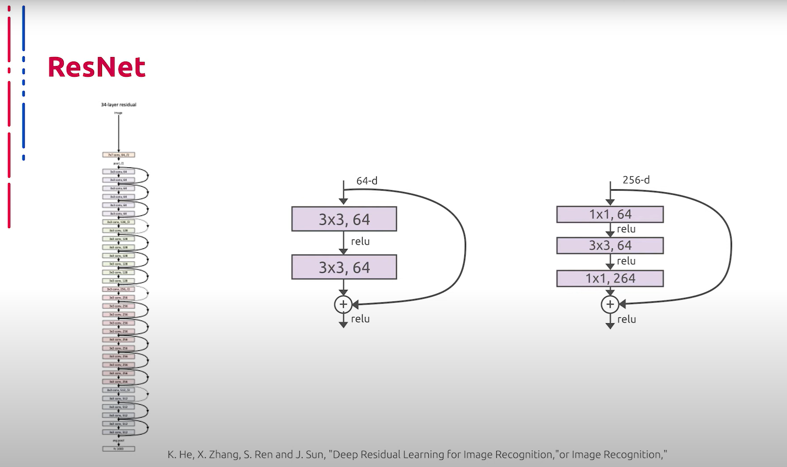

## [MainPage](../../index.md)/[Computer Vision](../README.md)/[Lecture](../Lecture.md)/2-4 RAW

语音识别：Youtube 转文本  
断句与标点：chatGPT 4o  
翻译：chatGPT 4o  

<!--  -->

# 2.4 Современные нейросетевые архитектуры классификации изображений  用于图像分类的现代神经网络架构

Теперь рассмотрим глубокие сверточные архитектуры, применимые для решения задачи классификации изображений. Первое семейство архитектур, которое мы рассмотрим, названо в честь исследовательской группы, которая его разработала – VGG. Данные нейросети представляют собой последовательность сверточных блоков, пуллинга и полносвязных слоев. Несмотря на некоторую архаичность архитектуры, VGG до сих пор активно используется в разных областях компьютерного зрения, например, для выделения признаков. Во многом это обусловлено их способностью генерировать интерпретируемые и предсказуемые карты признаков.  
现在让我们来看看适用于图像分类任务的深度卷积架构。我们将首先讨论以其开发研究团队命名的第一个架构家族——VGG。这些神经网络由一系列卷积块、池化层和全连接层组成。尽管该架构有些过时，但VGG仍然在计算机视觉的各个领域中被广泛使用，例如用于特征提取。这在很大程度上是由于其生成可解释且可预测的特征图的能力。

VGG имеет два серьезных недостатка: большое количество весов и незамысловатая архитектура делают процесс обучения медленным, и вес самой сети громадным по сравнению с более эффективными аналогами.  
VGG有两个严重的缺点：大量的权重和简单的架构使得训练过程缓慢，而与更有效的替代方案相比，网络本身的体积庞大。

Еще одной знаковой нейросетевой архитектурой глубокого обучения является модель Inception, основным конструктивным элементом которой являются Inception-блоки, внутри которых один тензор независимо пропускается через ядра различных размеров, после чего результаты совмещаются в итоговый выходной тензор. Чтобы выровнять размер выходных тензоров, используется свертка 1x1. Помимо этого, свертки 1x1 используются еще и для уменьшения размерности.  
另一种标志性的深度学习神经网络架构是Inception模型，其主要构建单元是Inception块。在这些块中，一个张量独立地通过不同大小的核，然后将结果组合成最终的输出张量。为了统一输出张量的尺寸，使用了1x1卷积。此外，1x1卷积还用于减少维度。

Еще одной примечательной нейросетевой архитектурой стало семейство ResNet. Ключевой идеей при построении данных сетей являются так называемые skip connections или остаточные связи, которые представляют собой пробрасывание значений из предыдущих слоев, минуя некоторые последующие. Данный прием позволяет бороться с затуханием градиентов и строить намного более глубокие нейросетевые архитектуры. Следует также отметить, что последующие исследования показали, что skip connections представляют собой некоторое подобие ансамбля. Именно эта идея позволила строить сети небывалой до той поры глубины, а также высокую эффективность подобных решений. По сей день те или иные модификации данной архитектуры фигурируют в списке самых успешных решений для различных задач классификации.  
另一种显著的神经网络架构是ResNet家族。构建这些网络的核心思想是所谓的跳跃连接（skip connections）或残差连接（residual connections），它们通过跳过某些层传递前一层的值。此方法有助于解决梯度消失问题，并构建更深的神经网络架构。后续研究还表明，跳跃连接类似于一种集成方法。正是这种思想使得构建前所未有深度的网络成为可能，并且这种解决方案效率极高。到目前为止，这种架构的各种改进版本在各种分类任务中都取得了极大的成功。

Прорывной идеей, которая сильно продвинула использование нейросетей на мобильных устройствах, стало применение специального вида сверток – Depthwise Separable Convolutions. Данная технология заключается в аппроксимации тяжелого ядра с помощью произведения тензоров меньшей размерности. Таким образом, количество весов сильно сокращается, а скорость вычислений увеличивается. Руководствуясь данной идеей, было разработано семейство архитектур, открывших дорогу к массовому использованию нейросетей на мобильных платформах. Они получили название MobileNet. Помимо применения Depthwise Separable Convolutions, особенностью этих архитектур стало отсутствие max-pooling слоев. Вместо них для снижения пространственной размерности используются свертки с определенными параметрами stride. Двумя гиперпараметрами архитектуры MobileNet являются α или множитель ширины и ρ – множитель глубины или разрешения. Множитель ширины отвечает за количество каналов в каждом слое, множитель разрешения отвечает за пространственные размеры входных тензоров. Например, оба параметра позволяют варьировать размер сети. Уменьшая α и ρ, снижается точность распознавания, но в то же время увеличивается скорость работы и уменьшается потребляемая память.  
推动神经网络在移动设备上使用的一项突破性思想是应用一种特殊类型的卷积——深度可分离卷积（Depthwise Separable Convolutions）。这种技术通过将复杂的核分解为较小尺寸张量的乘积来实现，从而显著减少了权重数量并提高了计算速度。基于此思想，开发了一系列架构，开创了神经网络在移动平台上大规模应用的道路。这些架构被命名为MobileNet。除了使用深度可分离卷积，这些架构的另一个特点是没有max-pooling层，而是使用具有特定步长参数的卷积来减少空间维度。MobileNet架构的两个超参数是α（宽度因子）和ρ（深度或分辨率因子）。宽度因子控制每层的通道数量，分辨率因子则控制输入张量的空间尺寸。例如，这两个参数允许调整网络的大小。减小α和ρ会降低识别精度，但同时增加了工作速度并减少了内存消耗。

Теперь перейдем к идеям, которые на данный момент позволяют демонстрировать наилучшие результаты при решении задач классификации с помощью глубоких нейронных сетей. Первой такой идеей стало применение AutoML – автоматизированного поиска архитектур, подобных NAS. Суть идеи заключается в конструировании размеров и формы сверточных блоков для достижения лучшей эффективности при решении задачи классификации. Семейство данных архитектур получило название EfficientNet. Размер и форма тензоров промежуточных представлений напрямую влияют на итоговую эффективность классификатора. Увеличение глубины сети повышает способность извлекать более сложные признаки, однако ведет к затуханию градиентов. Увеличение ширины тензоров усложняет извлечение сложных комбинированных признаков, однако увеличивает общий охват изучаемого контекста. Авторы подхода находят закономерности взаимного изменения конструктивных параметров нейросети для достижения максимальной эффективности.  
现在，我们来讨论当前在使用深度神经网络解决分类任务时表现最好的思想。第一个这样的思想是应用AutoML（自动化机器学习）——类似NAS（神经架构搜索）的自动化架构搜索。其核心思想在于构建卷积块的大小和形状，以实现最佳的分类效果。该系列架构被命名为EfficientNet。张量的中间表示的大小和形状直接影响分类器的最终效率。增加网络的深度可以提高提取复杂特征的能力，但会导致梯度消失。增加张量的宽度虽然会使提取复杂的组合特征变得困难，但能增加对研究内容的整体覆盖。作者找到了相互调整神经网络构建参数的规律，以达到最大效率。

В последние годы широкое распространение в компьютерном зрении получила концепция внимания (Attention). Данная идея основана на выделении наиболее значимых областей из входного тензора признаков. Основным конструктивным элементом для реализации этой идеи являются Non-local блоки, которые представляют собой стандартную абстракцию attention. Такие блоки используются в качестве прямых вставок в базовую архитектуру либо для формирования multi-head self-attention блоков, которые впоследствии интегрируются в базовую архитектуру. Подобные модернизации позволяют существенно повысить производительность. Такие архитектуры, наряду с основанными на EfficientNet, на данный момент демонстрируют лучшие результаты при решении ряда задач классификации изображений.  
近年来，注意力机制（Attention）在计算机视觉中得到了广泛应用。这一思想基于从输入特征张量中提取最重要的区域。实现这一思想的主要构建单元是Non-local块，它们是attention的标准抽象。这些块可作为直接插入基础架构的组件，或用于形成多头自注意力（multi-head self-attention）块，后者随后集成到基础架构中。这些改进显著提高了性能。这些架构与基于EfficientNet的架构一起，目前在解决一系列图像分类任务时表现最佳。