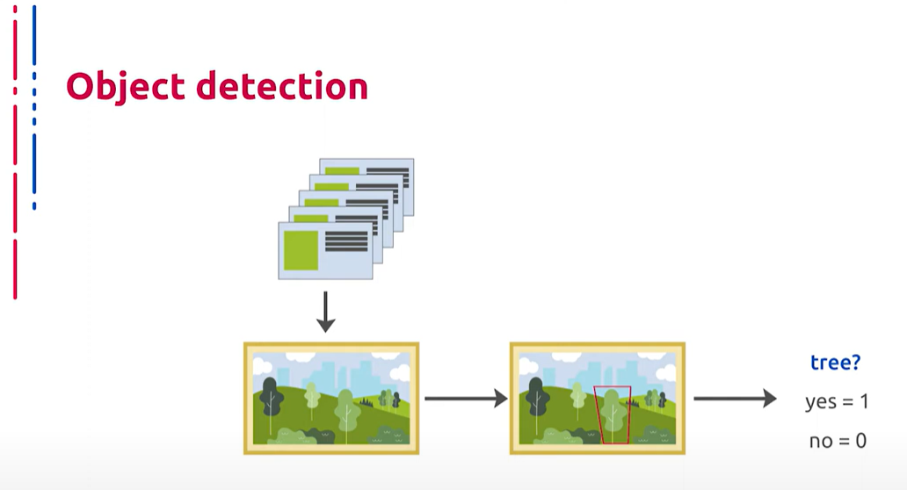
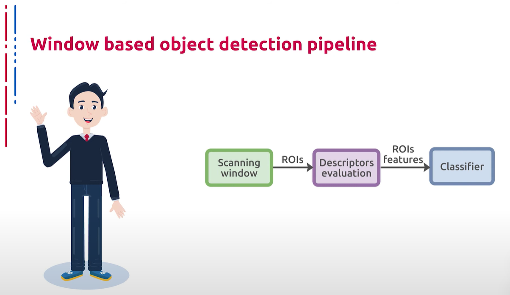
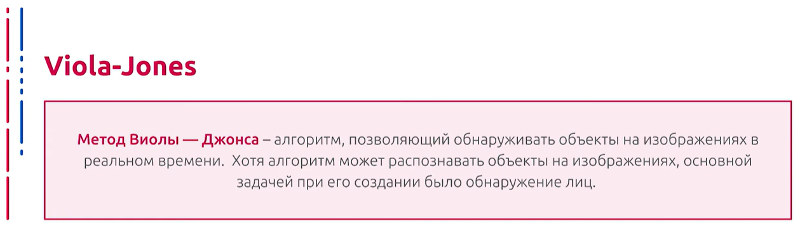
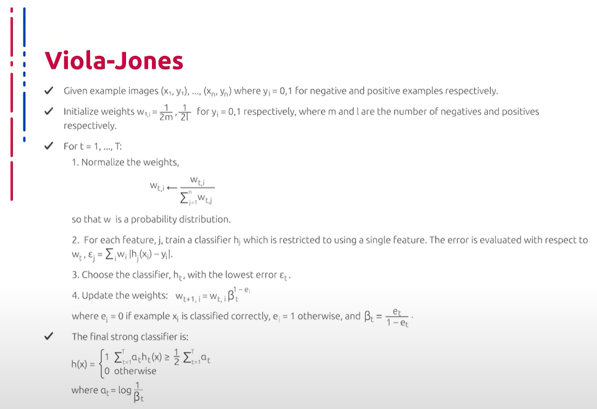
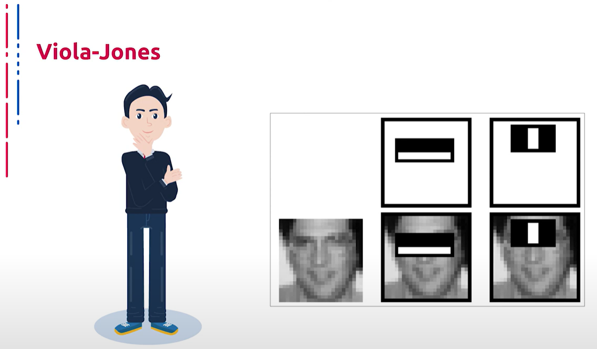

## [MainPage](../../index.md)/[Computer Vision](../README.md)/[Lecture](../Lecture.md)/3-1 RAW

语音识别：Youtube 转文本
断句与标点：chatGPT 4o
翻译：chatGPT 4o

# Введение. Классическая схема сканирующего окна для детектирования объектов  介绍。用于物体检测的经典扫描窗口设计

Сегодня мы рассмотрим базовую задачу компьютерного зрения, которая имеет на данный момент, пожалуй, самый широкий спектр применения в промышленности. В данной лекции мы поговорим о детектировании объектов. Формальная постановка данной задачи выглядит следующим образом: для входной фотографии и некоторого списка детектируемых классов объектов, которые нам заданы набором примеров изображений для каждого класса, нам необходимо определить координаты позиции в пикселах охватывающего прямоугольника для каждого присутствия объекта каждого детектируемого класса на входном изображении.  
今天我们将讨论一个基本的计算机视觉任务，这个任务目前在工业界具有最广泛的应用。在本讲座中，我们将谈论对象检测。这项任务的正式描述如下：对于输入图像和一些被检测的对象类别列表，这些类别由每个类别的示例图像集合给出，我们需要确定每个检测对象在输入图像中的位置坐标（以像素为单位）和包围框。

Сделаем некоторые оговорки насчет постановки. Иногда, помимо самих бокс и классов, требуется выдавать некоторое подобие вероятности уверенности нахождения объекта определенного класса в этом боксе, то есть вещественное число от нуля до единицы. Сделаем вторую оговорку: в большинстве случаев охватывающие прямоугольники параллельны осям координат изображения, однако в некоторых случаях охватывающие четырехугольники могут быть не прямоугольными. Более того, чаще всего примеры объектов каждого класса задаются в формате набора изображений и аннотаций, которые совпадают с идеальным ответом детектора для этого изображения и установленного набора классов.  
我们对任务描述做一些说明。有时，除了包围框和类别之外，还需要给出某种概率表示，即确定某个类别对象在该包围框中的置信度，这个概率值在0到1之间。第二个说明是：大多数情况下，包围框与图像坐标轴平行，但在某些情况下，包围框可能不是矩形的。此外，每个类别的对象示例通常以图像和注释的形式给出，这些注释与检测器对该图像和类别集合的理想答案相符。

До появления глубоких нейронных архитектур в задачах компьютерного зрения все подходы, применяемые при решении реальных задач в промышленности, как правило, сводились к одной и той же схеме. Определялась область наиболее вероятного нахождения объектов с помощью каких-либо эвристик или априорной разметки на этапе калибровки системы. После чего на данные области проходились сканирующим окном различных форм и размеров. Затем на участки изображения, ограниченные окном, запускались классификаторы, определяющие вероятность нахождения объекта определенного класса в данном регионе, ограниченном охватывающим окном. На заключительной стадии производилась некоторая постобработка, в ходе которой происходило объединение, уточнение боксов, а также уточнение списка зафиксированных объектов.  
在深度神经网络架构出现之前，计算机视觉任务中的所有方法通常都遵循相同的方案。在系统校准阶段，通过某些启发式方法或先验标记来确定最有可能出现对象的区域。然后使用各种形状和大小的扫描窗口对这些区域进行扫描。接下来，在由窗口限定的图像区域上运行分类器，确定特定类别对象在该区域内的概率。在最后阶段进行一些后处理，合并和调整包围框，并更新固定对象的列表。

Конечно, классическая схема детектора описана довольно грубо. Активно применялись многочисленные оптимизации, такие как совмещение стадий работы общего алгоритма, а также различные вариации пирамидальной обработки и использования уже полученных результатов классификации на уже обработанных сканирующим окном участках входного изображения. Ввиду не оптимальности и несопоставимости с лучшими результатами работы на открытых наборах данных, особенно в случае многоклассового детектирования, мы не будем долго останавливаться на подходах, не использующих глубокие нейросетевые архитектуры.  
当然，传统的检测器方案描述得比较粗略。实际上，使用了许多优化技术，例如合并通用算法的各个阶段，以及不同的金字塔处理变体，并利用在扫描窗口处理的图像区域中已获得的分类结果。由于传统方法在开放数据集上的表现与最佳结果不相匹配，尤其是在多类别检测的情况下，我们不会详细讨论不使用深度神经网络架构的方法。

Рассмотрим, пожалуй, самый известный классический алгоритм детектирования — Виола-Джонс, который долгое время работал почти во всех цифровых фотоаппаратах, использующих функционал поиска человеческих лиц. Итак, метод Виолы-Джонса позволяет обнаруживать объекты на изображениях в реальном времени. Хотя данный алгоритм может распознавать объекты любой природы, основной задачей при его создании было обнаружение человеческих лиц. В основе алгоритма лежит идея построения сильного классификатора с помощью каскада слабых, каждый из которых основан на использовании специального признака, некоторого подобия ядра свертки. Слабые классификаторы объединяются во взвешенную сумму, общая схема обучается с помощью AdaBoost.  
我们将探讨最著名的经典检测算法——Viola-Jones算法，该算法长期以来在几乎所有使用人脸检测功能的数码相机中工作。Viola-Jones方法可以实时检测图像中的对象。尽管该算法可以识别任何类型的对象，其主要目标是检测人脸。该算法的核心思想是通过级联弱分类器构建强分类器，每个弱分类器都基于某种卷积核特征。弱分类器通过加权和结合，整体方案使用AdaBoost进行训练。

Признаки, используемые алгоритмом, опираются на суммирование пикселов из прямоугольных регионов. Сами признаки несколько напоминают признаки Хаара, которые ранее также использовались для поиска объектов на изображении. Однако признаки из алгоритма Виолы-Джонса содержат более одной прямоугольной области и несколько сложнее. На иллюстрации справа показаны четыре различных типа признаков. Величина каждого признака вычисляется как сумма пикселов в белых прямоугольниках, из которой вычитается сумма пикселов в черных областях. Прямоугольные признаки довольно примитивны, и несмотря на то что они чувствительны к вертикальным и горизонтальным особенностям изображений, результат поиска фрагмента с их помощью довольно груб.  
算法使用的特征基于矩形区域内像素的累加。这些特征有点类似于早期用于对象检测的Haar特征。然而，Viola-Jones算法的特征包含多个矩形区域，结构更复杂。右侧的插图展示了四种不同类型的特征。每个特征的值计算为白色矩形内像素之和减去黑色区域内像素之和。尽管这些矩形特征非常原始，它们对图像的垂直和水平特征敏感，但使用它们进行的碎片搜索结果较为粗糙。

Однако при хранении изображений в интегральном формате, это когда в каждом пикселе изображения записана сумма всех пикселов левее и выше данного, проверка прямоугольного признака на конкретной позиции производится за константное время, что является преимуществом по сравнению с более точными вариантами. Каждая прямоугольная область в используемых признаках всегда смежна с другими прямоугольными областями. Поэтому расчет признака с двумя прямоугольниками состоит из шести обращений в интегральный массив, а для признака с тремя прямоугольниками — из восьми, с четырьмя — из девяти. Высокая скорость обсчета признаков не компенсирует значительное количество различных возможных признаков. К примеру, при стандартном размере признака в 24 на 24 пикселя возможно 162 тысячи различных итоговых комбинаций, и их расчет может занять большое количество времени. Поэтому в подходе, предложенном Виолой и Джонсом, используется вариация алгоритма обучения AdaBoost как для выбора признаков, так и для настройки классификаторов.  
但是，如果图像以积分图形式存储，即每个像素存储的是该像素左侧和上方所有像素的累加和，那么在特定位置检查矩形特征的时间是恒定的，这相比更精确的方法是一个优势。使用的矩形特征中的每个区域始终与其他矩形区域相邻。因此，两个矩形特征的计算涉及六次积分数组访问，三个矩形特征涉及八次访问，四个矩形特征涉及九次访问。尽管特征计算速度很快，但可能的特征组合数量非常大。以24x24像素的标准特征大小为例，可能的特征组合有162000种，计算这些组合可能需要大量时间。因此，Viola-Jones方法中使用了一种AdaBoost算法变体来选择特征并调整分类器。

Минусы AdaBoost заключаются в следующем. Иногда возникает переобучение при наличии значительного уровня шума в данных. Экспоненциальная функция потерь слишком сильно увеличивает веса наиболее трудных объектов, на которых ошибаются многие базовые алгоритмы. Однако именно эти объекты чаще всего оказываются шумовыми. В результате AdaBoost начинает настраиваться на шум, что ведет к переобучению. Проблема решается путем удаления выбросов или применения менее агрессивных функций потерь, в частности, применяется алгоритм GentleBoost. AdaBoost требует достаточно длинных обучающих выборок. Другие методы линейных коррекций, в частности Bagging, способны строить алгоритмы сопоставимого качества по меньшим выборкам данных. Бывает построение не оптимального набора базовых алгоритмов для обучения композиции. Можно периодически возвращаться к ранее построенным алгоритмам и обучать их заново.  
AdaBoost的缺点如下。有时会在数据噪音较高的情况下出现过拟合。指数损失函数会过度增加难分类对象的权重，而这些对象往往是噪音对象。结果，AdaBoost开始对噪音进行调整，导致过拟合。这个问题可以通过删除离群值或使用更不激进的损失函数来解决，例如GentleBoost。AdaBoost需要较长的训练样本。其他线性校正方法，如Bagging，可以在较小的数据集上构建质量相当的算法。有时会构建不理想的基算法集来训练组合算法，可以周期性地返回先前构建的算法并重新训练它们。

Boosting может приводить к построению громоздких композиций, состоящих из сотен алгоритмов. Такие композиции исключают возможность содержательной интерпретации, требуют больших объемов памяти для хранения базовых алгоритмов и существенных временных затрат на вычисления классификаций.  
Boosting可能导致构建庞大的组合算法，这些组合包含数百个算法。这些组合无法进行实质性解释，需要大量内存来存储基算法，并且分类计算需要相当多的时间。