## [MainPage](../../index.md)/[Computer Vision](../README.md)/[Lecture](../Lecture.md)/3-2 RAW

语音识别：Youtube 转文本
断句与标点：chatGPT 4o
翻译：chatGPT 4o

# Глубокие нейросетевые архитектуры для детектирования объектов общего плана  用于检测一般物体的深度神经网络架构

После того как мы рассмотрели пример классической модели детектирования объектов Виолы-Джонса, перейдём теперь к подходам, основанным на глубоком обучении.  
在我们讨论了经典的Viola-Jones对象检测模型的示例之后，现在转向基于深度学习的方法。

1. Рассматриваемый подход полностью соответствует классической и во многом не оптимальной схеме сканирующего окна, но с использованием глубокого нейронного классификатора. Данный метод в своём изначальном виде на сегодняшний момент практически не используется ввиду неоптимальности. Однако он положил начало семейству классификаторов, которые долгое время оставались недосягаемыми по точности для конкурентов при решении задач многопланового детектирования объектов общего плана. Также из плюсов можно выделить высокую кастомизируемость данного семейства классификаторов.  
   所讨论的方法完全符合经典且在很大程度上并不优化的扫描窗口方案，但使用了深度神经分类器。该方法在其原始形式下几乎不再使用，因为它的非优化性。然而，它开创了一系列分类器，这些分类器在解决通用多目标对象检测任务时，其准确性长时间难以匹敌。优点还在于这一系列分类器的高度定制化。

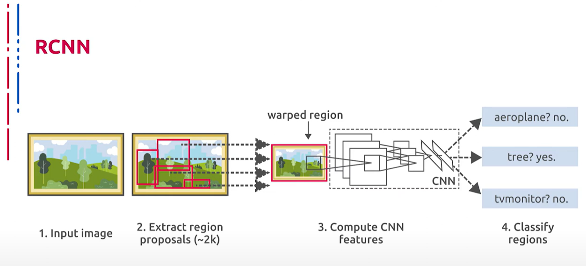

Итак, 1 рассмотренной нами нейросетевой моделью детектора объектов будет R-CNN. В основе R-CNN (она же Region-based Convolutional Neural Network) лежат следующие идеи: нахождение потенциальных объектов на изображении и разбиение их на регионы производится с помощью метода Selective Search. Извлечение признаков каждого полученного региона производится с помощью сверточных нейронных сетей. Классификация обработанных признаков производится с помощью метода опорных векторов, которые мы рассматривали в одной из предыдущих лекций. Уточнение границ регионов производится с помощью линейной регрессии. В итоге получаются отдельные регионы с объектами и их классами. В центре стоят сверточные нейронные сети, которые показывают хорошую точность на примере изображений.  
我们讨论的第一个神经网络对象检测模型是R-CNN。R-CNN（Region-based Convolutional Neural Network）的核心思想是：通过Selective Search方法在图像中找到潜在对象并将其分割成区域。每个得到的区域的特征通过卷积神经网络进行提取。处理后的特征通过支持向量机进行分类，这是我们在之前的一次讲座中讨论过的。区域边界通过线性回归进行精确调整。最终得到包含对象及其类别的独立区域。卷积神经网络在这过程中展示了很好的图像处理准确性。

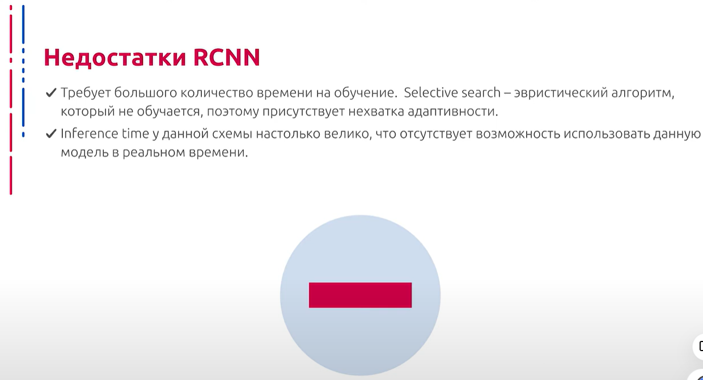

У такой архитектуры есть очевидные недостатки: она требует большого количества времени на обучение. Selective Search является эвристическим алгоритмом, который не обучается и не оптимален с вычислительной точки зрения. Более того, общее время работы у данной архитектуры настолько велико, что отсутствует возможность использовать данную модель в реальном времени. Для исправления недостатков R-CNN авторы данной архитектуры выпустили следующую версию модели, названную Fast R-CNN. Название говорит само за себя — основные усилия были положены на оптимизацию производительности в смысле времени исполнения.  
这种架构存在明显的缺点：训练时间要求较长。Selective Search是启发式算法，无法训练且计算效率低。此外，该架构的整体处理时间过长，无法在实时应用中使用。为了改进R-CNN的缺点，作者发布了下一版本模型，命名为Fast R-CNN。顾名思义，主要努力集中在执行时间的性能优化上。

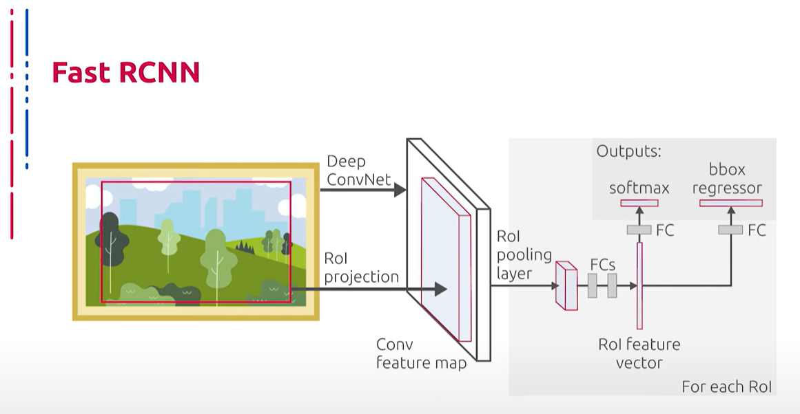

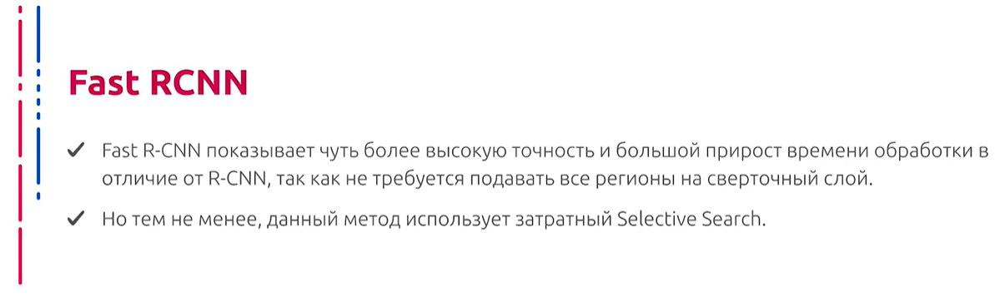

В основе данной архитектуры лежит следующий принцип работы: изображение подается на вход сверточной сети и обрабатывается с помощью Selective Search. В итоге получается карта признаков как результат обработки исходного изображения с помощью сверточного кодировщика, а также регионы потенциальных объектов как результат работы Selective Search поверх исходного изображения. Координаты регионов потенциальных объектов преобразуются в координаты на карте признаков. Полученная карта признаков с регионами передается в слой Region of Interest (RoI) Pooling. Здесь на каждый регион накладывается сетка фиксированного размера, затем применяется Max Pooling для уменьшения размерности каждого региона в сетке. Таким образом, все регионы потенциальных объектов имеют одинаковую фиксированную размерность. Полученные признаки подаются на вход полносвязанному слою, который передает результат своей работы двум другим полносвязанным слоям. Первый слой с функцией активации softmax определяет вероятность принадлежности объекта определенному классу, а второй слой определяет границы региона данного объекта.  
此架构的工作原理如下：图像输入到卷积网络并通过Selective Search进行处理。结果生成特征图，这是通过卷积编码器处理原始图像得到的，同时还得到潜在对象区域，这是Selective Search在原始图像上工作的结果。潜在对象区域的坐标转换为特征图上的坐标。得到的带有区域的特征图传递到Region of Interest (RoI) Pooling层。在这里，每个区域覆盖一个固定大小的网格，然后应用最大池化（Max Pooling）来减少网格中每个区域的维数。因此，所有潜在对象区域具有相同的固定维数。得到的特征传递到全连接层，该层将其结果传递给另外两个全连接层。第一个层使用softmax激活函数确定对象属于特定类别的概率，第二个层确定该对象区域的边界。

Fast R-CNN показывает чуть более высокую точность и значительно больший прирост в скорости обработки по сравнению с R-CNN. Причиной этого является отсутствие необходимости подавать все регионы на сверточный слой. Но тем не менее данный метод использует затратный Selective Search, поэтому авторы сделали еще один шаг и появилась модель Faster R-CNN. Faster R-CNN приблизилась к возможности широкого промышленного применения путем существенной оптимизации скорости работы.  
Fast R-CNN比R-CNN表现出略高的准确性和显著的处理速度提升。原因是无需将所有区域都输入卷积层。然而，该方法仍然使用高成本的Selective Search，因此作者又迈出了进一步的改进步骤，提出了Faster R-CNN模型。Faster R-CNN通过大幅优化速度，接近了广泛工业应用的可能性。

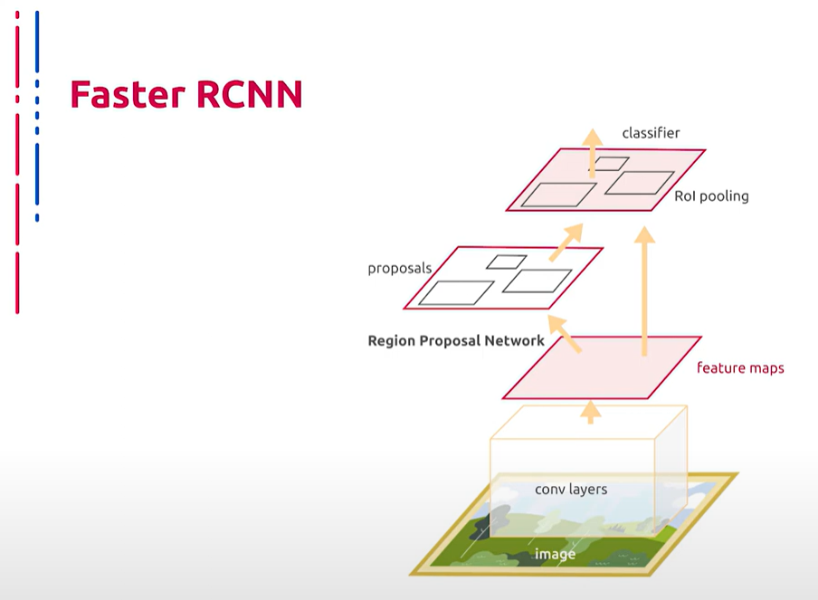

Рассмотрим подробнее устройство. В основе Faster R-CNN лежит новый метод локализации объектов взамен Selective Search. Он получил название Region Proposal Network (RPN). В основе RPN лежит сверточная сеть с системой якорей. Таким образом, общий принцип архитектуры Faster R-CNN выглядит следующим образом: изображение подается на вход сверточной нейронной сети и кодировщику, так формируется карта признаков. Карта признаков обрабатывается слоем RPN, где скользящее окно проходит по карте признаков. Центр скользящего окна связан с центром якоря — области с различными соотношениями сторон и размерами. То есть якорь задает форму и размер окна. Авторы используют три соотношения сторон и три размера. На основе метрики Intersection over Union (IoU) выносится решение о том, есть ли объект в текущем регионе или нет. Далее используется алгоритм Fast R-CNN: карта признаков с полученными объектами передается в слой Region of Interest с последующей обработкой полносвязанными слоями, классификацией и определением положения объекта.  
我们详细讨论其结构。Faster R-CNN的核心是一个新的对象定位方法代替了Selective Search，称为Region Proposal Network (RPN)。RPN的核心是一种带锚点系统的卷积网络。Faster R-CNN的整体架构如下：图像输入卷积神经网络和编码器，形成特征图。特征图通过RPN层处理，其中滑动窗口在特征图上移动。滑动窗口的中心与具有不同纵横比和大小的区域中心锚点相关联。也就是说，锚点定义了窗口的形状和大小。作者使用了三种纵横比和三种大小。基于Intersection over Union (IoU)指标决定当前区域内是否存在对象。然后使用Fast R-CNN算法：带有检测到对象的特征图传递到Region of Interest层，随后由全连接层处理、分类并确定对象的位置。

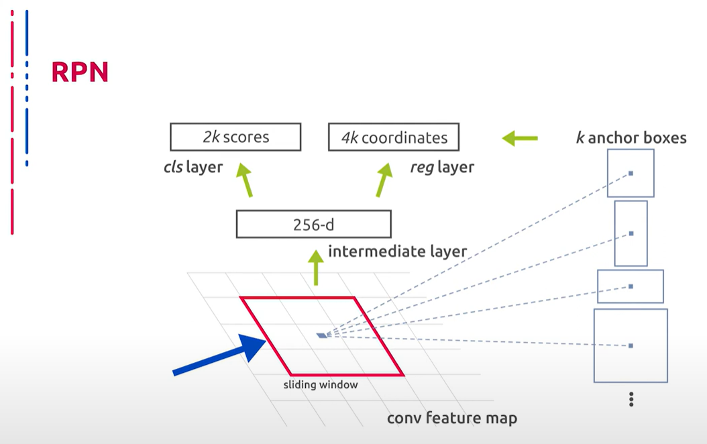

Модель Faster R-CNN справляется немного хуже с локализацией, но работает быстрее Fast R-CNN. Основное и фактически единственное принципиальное отличие Faster R-CNN от Fast R-CNN заключается в замещении алгоритма Selective Search сверточной архитектурой RPN, которая позволяет немного потерять в точности, но существенно повысить скорость работы метода.  
Faster R-CNN在定位上稍逊一筹，但比Fast R-CNN运行更快。Faster R-CNN和Fast R-CNN的主要且唯一的本质区别在于，用卷积架构RPN替代了Selective Search算法，这在准确性上略有损失，但大大提高了方法的运行速度。

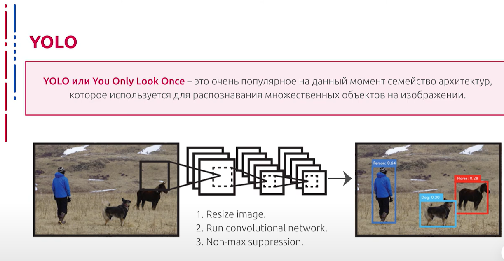

YOLO (You Only Look Once) — это очень популярное на данный момент семейство архитектур, которое используется для распознавания множественных объектов на изображении. Главная особенность этих архитектур по сравнению с другими состоит в том, что большинство систем применяют сверточные сети несколько раз к различным регионам изображения (как, например, семейства R-CNN), тогда как YOLO применяет сверточные сети один раз ко всему изображению сразу. Сеть делит изображение на своеобразную сетку и предсказывает bounding boxes и вероятности того, что в них присутствует искомый объект для каждого участка.  
YOLO（You Only Look Once）是当前非常流行的一系列架构，用于识别图像中的多个对象。与其他架构相比，这些架构的主要特点在于大多数系统对图像的不同区域多次应用卷积网络（例如R-CNN系列），而YOLO对整个图像只应用一次卷积网络。网络将图像划分为一个独特的网格，并预测每个部分的边界框以及其中是否存在目标对象的概率。

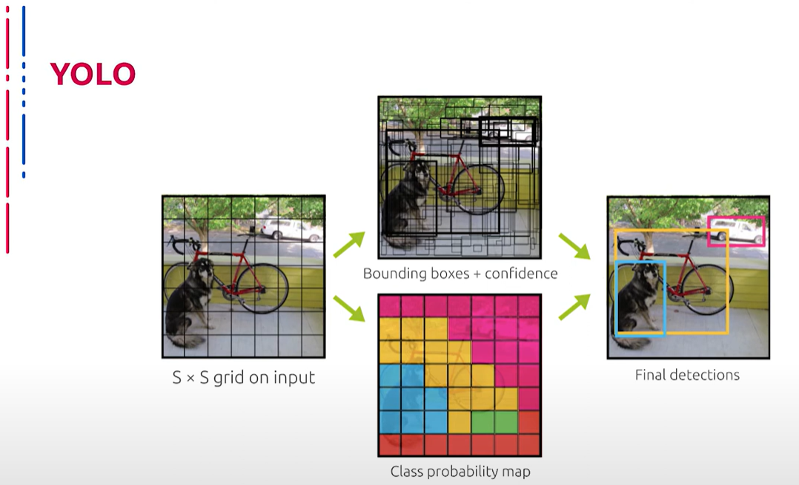

Плюсы данного подхода состоят в том, что сеть смотрит на всё изображение сразу и учитывает контекст при детектировании объектов. Также YOLO примерно в тысячу раз быстрее, чем R-CNN, и примерно в 100 раз быстрее, чем Faster R-CNN. Как уже было сказано, YOLO работает по принципу single shot, то есть архитектура сети устроена так, что за один проход кадра на нём детектируются все объекты.   
这种方法的优点是网络一次性查看整个图像，并在检测对象时考虑上下文。此外，YOLO的速度约为R-CNN的千倍，是Faster R-CNN的百倍。正如之前所述，YOLO遵循单次处理（single shot）原则，即网络结构设计成一次处理帧中的所有对象。

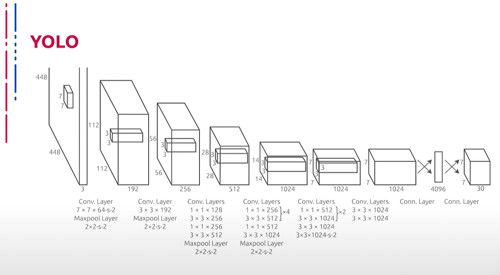
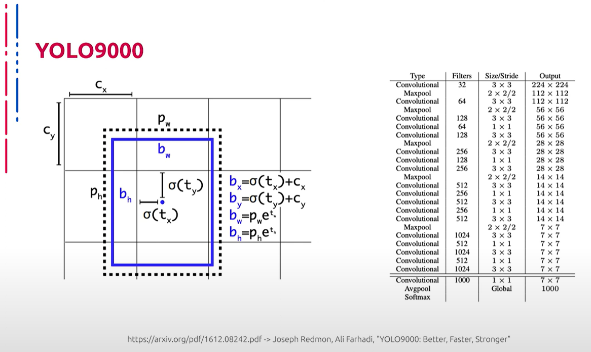

На слайде представлена архитектура YOLO. На вход YOLO подается трёхканальное изображение, у которого изменяется размер до 448 пикселов по стороне квадрата, то есть получается квадратное изображение 448×448 пикселов. Над полученным изображением проводится дальнейшее преобразование. Первое преобразование заключается в прогоне изображения через часть модифицированной архитектуры GoogLeNet. После этого преобразования получаются карты признаков размером 14×14×1024 элемента. Далее применяются две свёртки, после второй свёртки размерность уменьшается до 7×7×1024 элемента. Далее производится ещё одна свёртка, результат дважды прогоняется через полносвязный слой, изменяется до размерности 1470×1 и в итоге трансформируется в тензор размером 7×7×30. Полученная модель применяет процедуру детектирования, на выходе которой получается результирующее детектирование. Тензор представляет собой отображение сетки 7×7 на изображении, где 30 значений несут информацию о ячейке: 10 значений для двух возможных рамок и 20 значений для отношений к каждому из 20 доступных классов. Вся эта информация фильтруется, отфильтрованные данные отображаются.  
幻灯片展示了YOLO的架构。YOLO输入三通道图像，将其尺寸调整为448像素的正方形，即448×448像素。然后对得到的图像进行进一步处理。第一个处理步骤是通过修改后的GoogLeNet架构部分处理图像。经过此处理后，得到14×14×1024元素的特征图。然后应用两次卷积，第二次卷积后尺寸减小到7×7×1024元素。然后进行另一次卷积，结果经过两次全连接层处理，尺寸调整为1470×1，最终变换为7×7×30的张量。所得模型应用检测过程，输出结果检测。张量表示图像上的7×7网格，其中30个值包含关于单元的信息：10个值用于两个可能的边框，20个值用于与20个可用类别的关系。所有这些信息都会过滤并显示过滤后的数据。

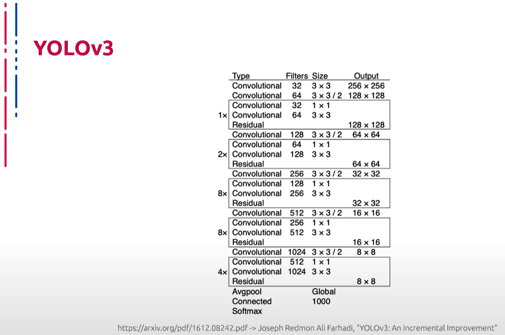

Последующие модификации YOLO были сфокусированы на улучшении регрессии bounding boxes, а также на добавление трехмерных подходов для улучшения детектирования объектов в разных масштабах.  
随后的YOLO修改专注于改进边界框回归，并添加三维方法以改进不同尺度对象的检测。

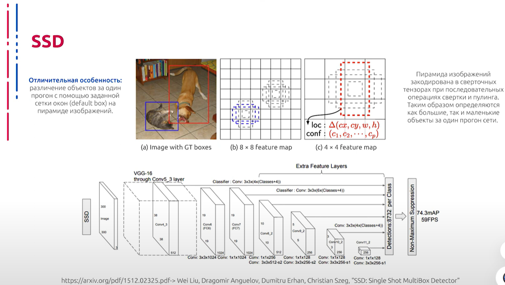

Ещё одной знаковой one-stage архитектурой для детектирования объектов является SSD (Single Shot Detector). Название говорит само за себя: в SSD используется наиболее удачные хаки архитектуры YOLO, например, Max Pooling, и добавляются новые, чтобы нейросеть быстрее и точнее работала. Как следствие из названия, отличительная особенность данной архитектуры от Faster R-CNN подходов и подобных им состоит в том, что детектирование объектов производится за один прогон с помощью заданной сетки окон на пирамиде изображений. Пирамида изображений закодирована в сверточных тензорах при последовательных операциях свертки и pooling. При операции Max Pooling пространственная размерность уменьшается, таким образом определяются как большие, так и маленькие объекты за один прогон сети.  
另一个重要的一阶段（one-stage）对象检测架构是SSD（Single Shot Detector）。顾名思义，SSD使用了YOLO架构中的最佳技巧，如最大池化，并添加了新技巧以使神经网络更快、更准确。顾名思义，这种架构与Faster R-CNN方法及类似方法的不同之处在于，SSD通过图像金字塔上的预定窗口网格进行一次处理来检测对象。图像金字塔通过连续卷积和池化操作编码在卷积张量中。通过最大池化操作，空间尺寸减小，从而在一次网络处理过程中同时确定大对象和小对象。

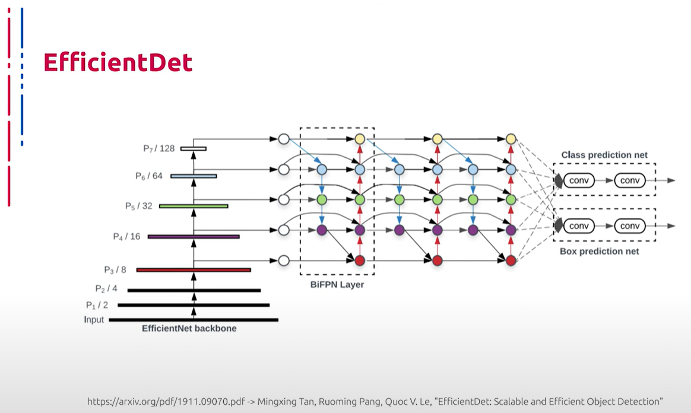

Ещё одна архитектура — EfficientDet. В основе EfficientDet лежит EfficientNet, которую мы рассматривали в лекции про классификацию объектов. После сверточного кодировщика на основе EfficientNet работает слой с пирамидой признаков под названием BiFPN (Bidirectional Feature Pyramid Network), который производит слияние разноуровневых признаков EfficientNet. Далее результат передается в стандартную настройку, вычисляющую класс и рамку объекта.  
另一个架构是EfficientDet。EfficientDet基于EfficientNet，这是我们在对象分类讲座中讨论过的。EfficientNet卷积编码器之后是一个称为BiFPN（双向特征金字塔网络）的特征金字塔层，该层融合了EfficientNet的多层次特征。然后将结果传递到计算对象类别和边框的标准设置。

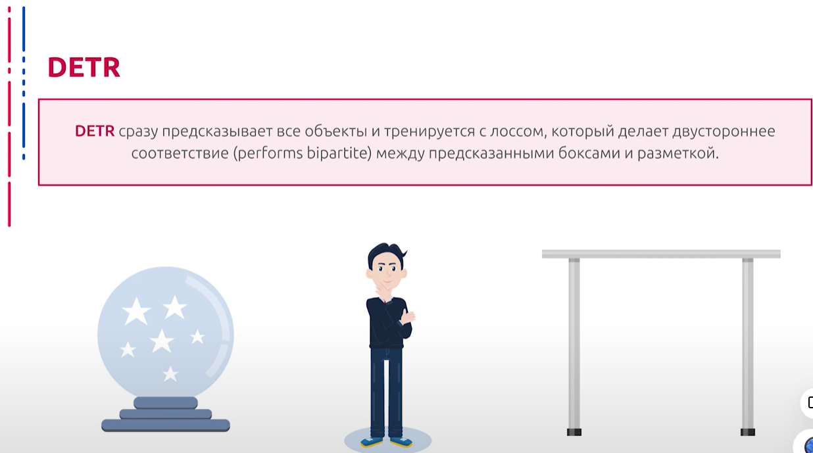

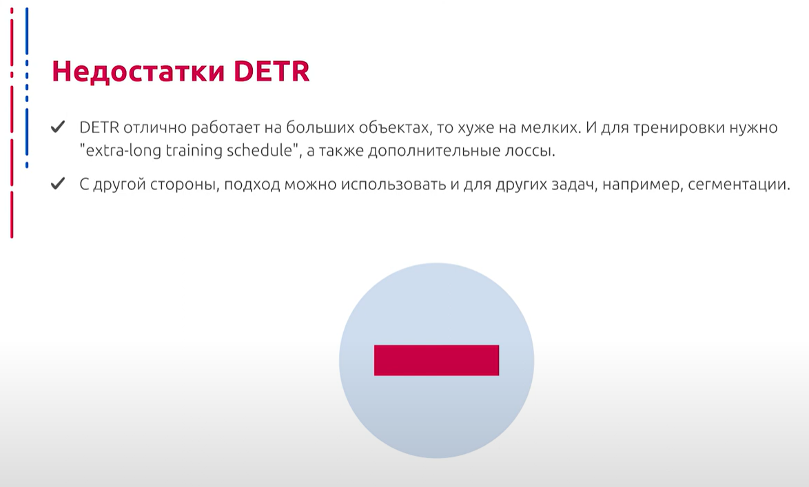

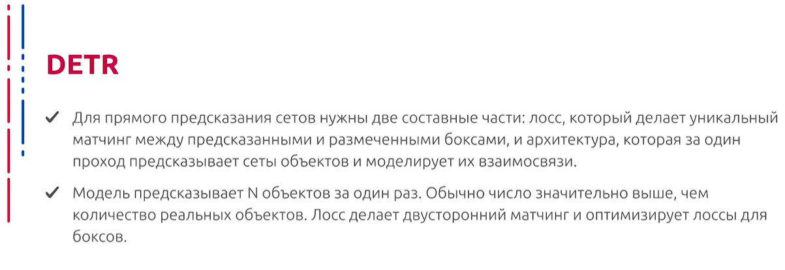

Очень интересное архитектурное решение для реализации детектора объектов предлагают авторы DETR (DEtection TRansformer). Основная суть DETR заключается в том, что данный метод сразу предсказывает все объекты и тренируется с loss, который делает двусторонние соответствия между предсказанными боксами и разметкой. Получается, что отсутствует потребность в якорях и Max Pooling. Но есть один минус: даже авторы данной архитектуры признают, что DETR отлично работает на больших объектах, но хуже на мелких. Более того, для тренировки данной архитектуры требуется как указано в оригинальной статье, достаточно длительный training stage, а также дополнительные loss. Причиной этого является тот факт, что данная архитектура основана на использовании архитектуры трансформера. Отметим, что подобное решение всё чаще используется в современном компьютерном зрении. Плюсом является то, что подобный подход можно использовать сразу для широкого ряда задач, например, сегментации.  
作者提出了一个非常有趣的对象检测架构解决方案，称为DETR（DEtection TRansformer）。DETR的主要思想是，该方法直接预测所有对象，并通过一个loss进行训练，该loss在预测的框和标注之间进行双向匹配。结果是不需要锚点和最大池化。但有一个缺点：即使是该架构的作者也承认，DETR在大对象上表现出色，但在小对象上表现较差。此外，根据原始文章，训练该架构需要相当长的训练阶段，并且需要额外的loss。原因在于该架构基于Transformer架构。值得注意的是，这种解决方案在现代计算机视觉中越来越常用。优点是这种方法可以立即用于广泛的任务，例如分割。

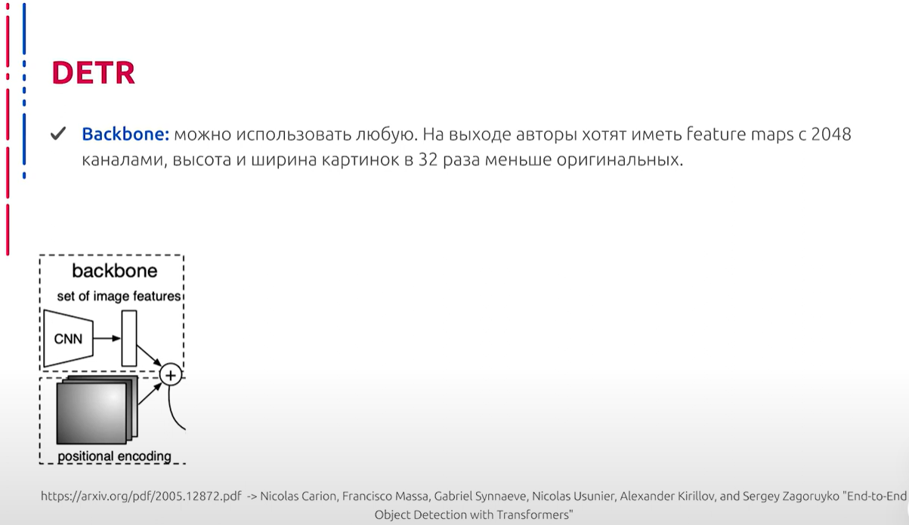

Для прямого предсказания сетов нужны две составные части: loss, который делает уникальный matching между предсказанными и размеченными боксами, и архитектура, которая за один проход предсказывает все объекты и моделирует их взаимосвязи. Модель предсказывает n объектов за один раз, то есть некоторое фиксированное число, обычно оно значительно выше, чем количество реальных объектов, которые могут быть представлены на изображении. Loss делает двусторонние сопоставления и оптимизирует loss для боксов. В качестве feature extractor или backbone можно использовать любую архитектуру, но на выходе авторы хотят иметь карты признаков с 2048 каналами, причём высота и ширина данных карт в 32 раза меньше оригинальных.  
直接预测集需要两部分：一种loss，用于在预测框和标注框之间进行唯一匹配；一种架构，一次性预测所有对象并建模它们之间的关系。模型一次预测n个对象，即某个固定数量，通常远高于图像上可能存在的实际对象数量。loss进行双向匹配并优化框的loss。作为特征提取器或主干，可以使用任何架构，但作者希望输出的特征图具有2048个通道，其高度和宽度比原始图像小32倍。

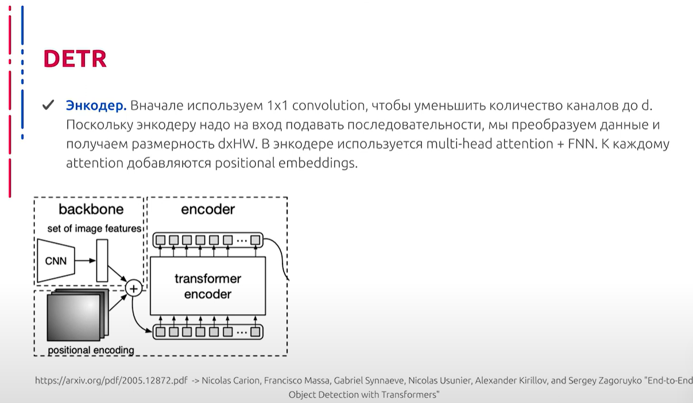

Encoder и Decoder инвариантны перестановке. Рассмотрим Encoder: сначала используется свёртка 1×1, чтобы уменьшить количество каналов до определённого числа. Поскольку в Encoder на вход необходимо подавать последовательности (так как мы имеем дело с архитектурой трансформера), исходные данные преобразуются, чтобы получить размерность G×H×W, где H и W — это высота и ширина, а D — это количество каналов, которые нам необходимы. В Encoder используется Multi-Head Attention, причём каждому Attention добавляется positional encoding.  
编码器和解码器对置换不变。我们来看看编码器：首先使用1×1卷积将通道数量减少到一定数量。由于编码器需要输入序列（因为我们在处理Transformer架构），需要转换原始数据以获得G×H×W的尺寸，其中H和W是高度和宽度，D是我们需要的通道数。编码器使用多头注意力机制，每个注意力机制添加了位置编码。

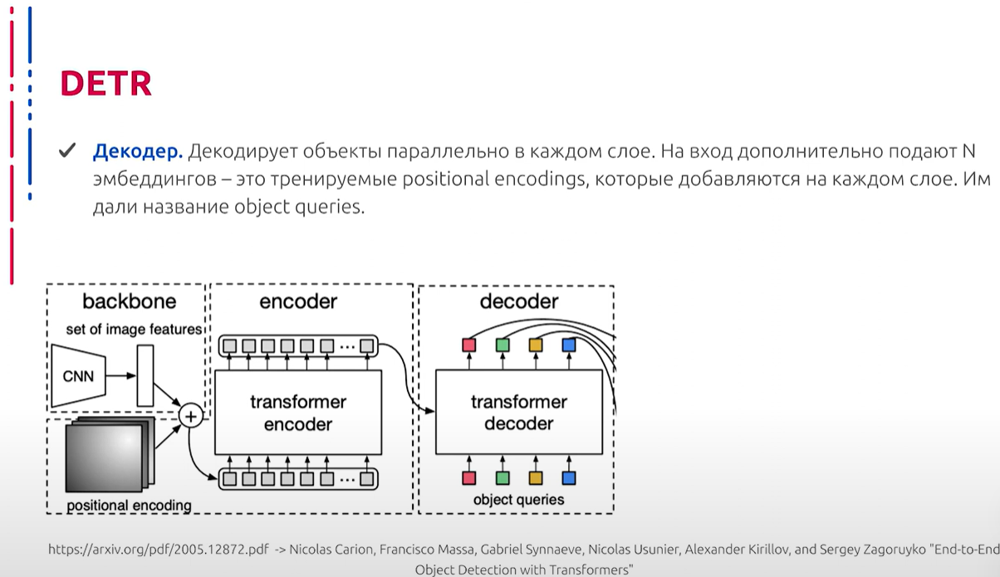

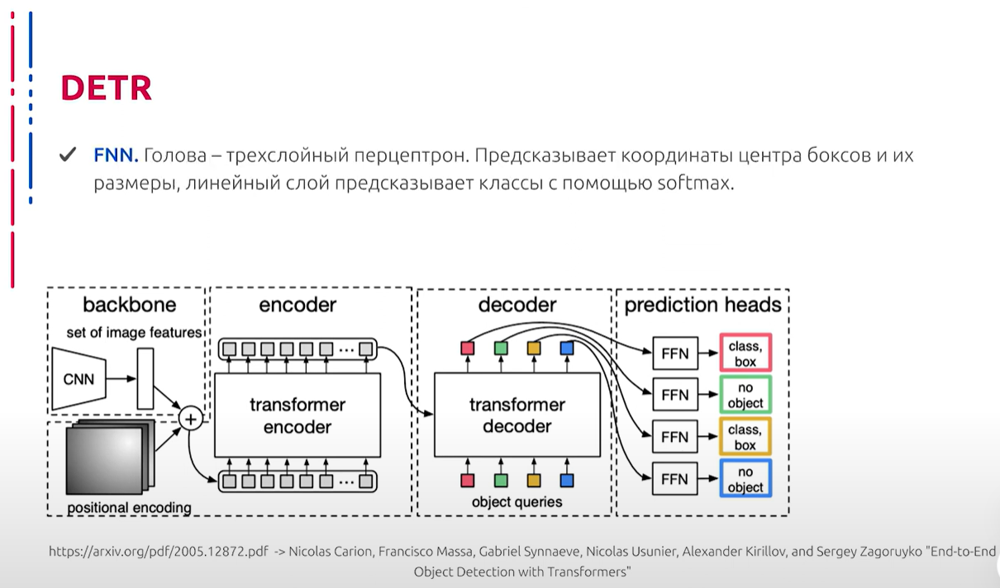

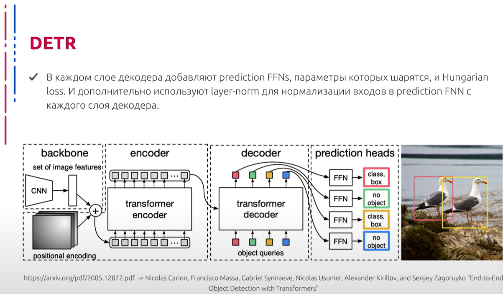

Рассмотрим Decoder: он декодирует объекты параллельно в каждом слое. На вход дополнительно подаются learnable embeddings (тренируемые позиции). На выходе Decoder независимы друг от друга, декодируют координаты боксов и классы. Благодаря Attention, модель может учитывать взаимосвязи между объектами. Рассмотрим далее архитектуру, точнее её составляющую, которая производит преобразование промежуточных представлений в осмысленные выходные данные. Данная "голова" нейросети представляет собой трёхслойный персептрон. С помощью него, как мы уже говорили, предсказываются координаты центра боксов, их размеры. Также с помощью активации softmax можно предсказать класс. В каждом слое Decoder добавляются предсказания, параметры которых делятся между собой, а также применяется Hungarian loss. Также дополнительно используется layer normalization для нормализации входов с каждого слоя Decoder.  
解码器：解码器在每一层中并行解码对象。输入时，额外添加了可学习的嵌入（可训练的位置）。解码器的输出彼此独立，解码框的坐标和类别。通过注意力机制，模型可以考虑对象之间的关系。进一步探讨架构，即将中间表示转换为有意义输出的部分。该网络的“头部”是一个三层感知器。通过它，可以预测框的中心坐标和尺寸。通过softmax激活，可以预测类别。在解码器的每一层中，添加的预测参数彼此共享，同时应用匈牙利loss。还使用层规范化对每个解码器层的输入进行规范化。