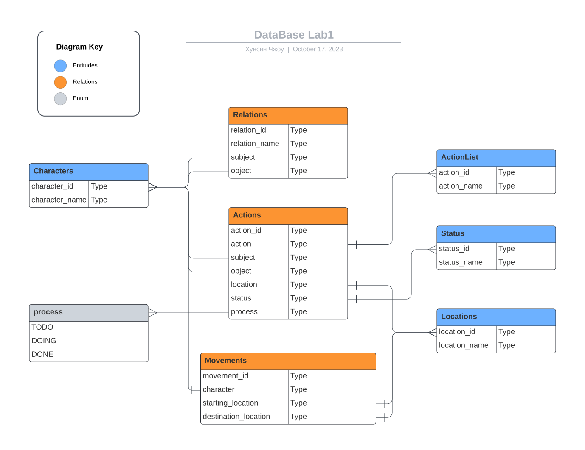

<head>
  <script src="https://cdn.mathjax.org/mathjax/latest/MathJax.js?config=TeX-AMS-MML_HTMLorMML" type="text/javascript"></script>
  <script type="text/x-mathjax-config">
    MathJax.Hub.Config({
      tex2jax: {
      skipTags: ['script', 'noscript', 'style', 'textarea', 'pre'],
      inlineMath: [['$','$']]
      }
    });
  </script>
</head>

## [MainPage](../../index.md)/[DataBase](../README.md)/Lab 1

- [Описаеие работы](#описаеие-работы)
  - [Вариант: 310930](#вариант-310930)
- [Выполнение работы](#выполнение-работы)
  - [DataBase Structure](#database-structure)
  - [DataBase Data](#database-data)
  - [Creation in SQL](#creation-in-sql)

# Описаеие работы

Для выполнения лабораторной работы №1 необходимо:  
要完成实验室工作 1，您必须：

1. На основе предложенной предметной области (текста) составить ее описание. Из полученного описания выделить сущности, их атрибуты и связи.
2. Составить инфологическую модель.
3. Составить даталогическую модель. При описании типов данных для атрибутов должны использоваться типы из СУБД PostgreSQL.
4. Реализовать даталогическую модель в PostgreSQL. При описании и реализации даталогической модели должны учитываться ограничения целостности, которые характерны для полученной предметной области.
5. Заполнить созданные таблицы тестовыми данными.  
>
1. 根据提议的主题领域（文本），撰写其描述。 从生成的描述中选择实体、它们的属性和连接。
2. 创建信息模型。
3. 创建数据逻辑模型。 描述属性的数据类型时，必须使用 PostgreSQL DBMS 中的类型。
4. 在 PostgreSQL 中实现数据逻辑模型。 在描述和实现数据逻辑模型时，必须考虑作为结果主题区域特征的完整性约束。
5. 用测试数据填充创建的表。

Для создания объектов базы данных у каждого студента есть своя схема. Название схемы соответствует имени пользователя в базе studs (sXXXXXX). Команда для подключения к базе studs:  
为了创建数据库对象，每个学生都有自己的模式。 方案的名称对应于 Studs 数据库中的用户名 (sXXXXXX)。 连接 `helios` 数据库的命令：

```
psql -h pg -d studs
```

Каждый студент должен использовать свою схему при работе над лабораторной работой №1 (а также в рамках выполнения 2, 3 и 4 этапа курсовой работы).  
每个学生在进行第 1 号实验作业时（以及课程作业的第 2、3 和 4 阶段）必须使用自己的图表。

Отчёт по лабораторной работе должен содержать:  
实验室报告必须包含：

1. Текст задания.
2. Описание предметной области.
3. Список сущностей и их классификацию (стержневая, ассоциация, характеристика).
4. Инфологическая модель (ER-диаграмма в расширенном виде - с атрибутами, ключами...).
5. Даталогическая модель (должна содержать типы атрибутов, вспомогательные таблицы для отображения связей "многие-ко-многим").
6. Реализация даталогической модели на SQL.
7. Выводы по работе.
>
1. 任务正文。
2. 主题领域的描述。
3. 实体列表及其分类（核心、关联、特征）。
4. 信息模型（扩展形式的 ER 图 - 带有属性、键...）。
5. 数据逻辑模型（必须包含属性类型、用于显示多对多关系的辅助表）。
6. 用 SQL 实现数据逻辑模型。
7. 工作结论。

Темы для подготовки к защите лабораторной работы:  
为实验室工作答辩准备的主题：

1. Архитектура ANSI-SPARC
2. Модель "Сущность-Связь". Классификация сущностей. Виды связей. Ограничения целостности.
3. DDL
4. DML
>
1. ANSI-SPARC架构
2. “实体-关系”模型。 实体的分类。 连接类型。 完整性约束。
3. DDL
4. DML

## Вариант: 310930

**Описание предметной области, по которой должна быть построена доменная модель:**  
**应为其构建领域模型的主题领域的描述：**

> Удобно устроившись перед экраном, Олвин огляделся в поисках своего робота. К его изумлению, тот исчез. Но затем он все-таки обнаружил его -- в маленьком углублении под закругляющимся потолком: робот уютно устроился в этой нише. Он привел Мастера через пространства космоса на Землю, а затем в качестве слуги проследовал за ним в Лиз. Теперь же, словно и не было всех этих минувших эпох, он изготовился снова выполнять свои старые пилотские обязанности.  
> 阿尔文舒适地坐在屏幕前，环顾四周寻找他的机器人。 让他惊讶的是，他竟然消失了。 但后来他终于在弧形天花板下的一个小凹处找到了它：机器人舒适地坐落在这个壁龛中。 他带领主人穿越太空来到地球，然后跟随他来到莉兹作为仆人。 现在，就像所有这些过去的时代从未发生过一样，他准备再次履行他以前的飞行员职责。

# Выполнение работы

## DataBase Structure

  

## DataBase Data

- ### Enum

  - #### PROCESS

    | PROCESS |
    |--------------|
    | TODO         |
    | DOING        |
    | DONE         |

- ### Entitudes

  - #### Characters

    character_id | character_name
    -------------|---------------
    0            | Olvin
    1            | Robot

  - #### Locations
    
    location_id | location_name
    ------------|--------------
    0           | in front of the screen
    1           | in a small recess under the curved ceiling
    2           | space
    3           | to the Earth
    4           | to Liz


  - #### ActionList
    
    action_id | action_name
    ----------|------------
    0         | sit
    1         | find
    2         | feel
    3         | disapear
    4         | found
    5         | lead
    6         | follow
    7         | perform previous duties as a pilot

  - #### Status
    
    status_id | status_name
    ----------|------------
    0         | comfortably
    1         | looking around
    2         | surprised
    3         | finally
    4         | like all these past times never happened

- ### Relationships

  - #### Relations

    relation_id | relation_name | subject | object
    ------------|---------------|---------|-------
    0           | master        | 0       | 1
    1           | servant       | 1       | 0

  - #### Actions

    action_id | action | subject | object | location| status | process
    ----------|--------|---------|--------|---------|--------|--------
    0         | 0      | 0       | null   | 0       | 0      | DOING
    1         | 1      | 0       | 1      | null    | 1      | DOING
    2         | 2      | 0       | null   | null    | 2      | DONE
    3         | 3      | 1       | null   | null    | null   | DONE
    4         | 4      | 0       | 1      | 1       | 3      | DONE
    5         | 0      | 1       | null   | 1       | 0      | DOING
    6         | 5      | 1       | 0      | 3       | null   | DONE
    7         | 6      | 1       | 0      | 4       | null   | DONE
    8         | 7      | 0       | null   | null    | 4      | TODO

  - #### Movements

    movement_id | character | starting_location | destination_location 
    ------------|-----------|-------------------|---------------------
    0           | 1         | 2                 | 3
    1           | 0         | 2                 | 3
    2           | 1         | 3                 | 4
    3           | 0         | 3                 | 4

## Creation in SQL

```sql
-- create enum 'PROCESS'
CREATE TYPE PROCESS AS ENUM (
    'TODO',
    'DOING',
    'DONW'
);

--create table 'Characters'
CREATE TABLE Characters (
    character_id SERIAL PRIMARY KEY,
    character_name VARCHAR(64)
);

--create table 'Locations'
CREATE TABLE Locations (
    location_id SERIAL PRIMARY KEY,
    location_name VARCHAR(64)
);

--create table 'ActionList'
CREATE TABLE ActionList (
    action_id SERIAL PRIMARY KEY,
    action_name VARCHAR(64)
);
```
