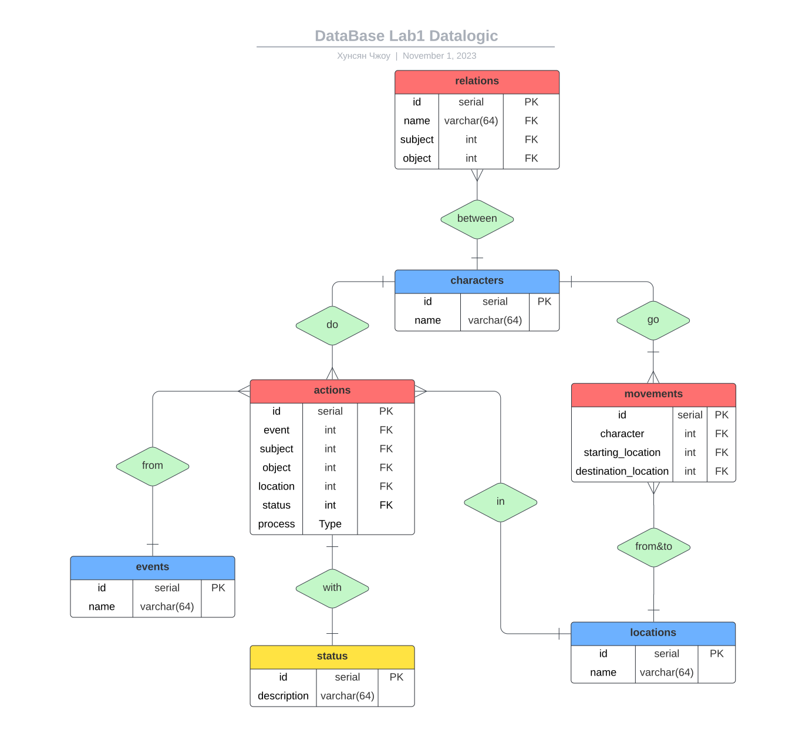
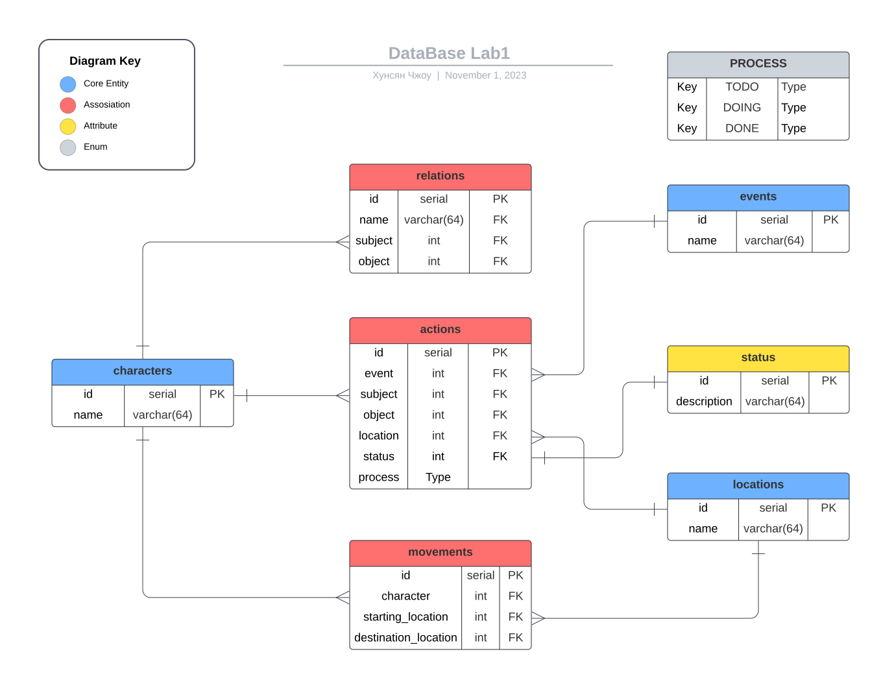

<head>
  <script src="https://cdn.mathjax.org/mathjax/latest/MathJax.js?config=TeX-AMS-MML_HTMLorMML" type="text/javascript"></script>
  <script type="text/x-mathjax-config">
    MathJax.Hub.Config({
      tex2jax: {
      skipTags: ['script', 'noscript', 'style', 'textarea', 'pre'],
      inlineMath: [['$','$']]
      }
    });
  </script>
</head>

## [MainPage](../../../index.md)/[DataBase](../../README.md)/Lab 1

<center>
<p>Университет ИТМО</p>
<p>Факультет ФПИ и КТ</p>
<br><br><br><br><br>
<h2>Отчёт по лабораторной работе 1</h2>
<h1>«Информационная система и база данных»</h1>
<h3>Вариант: 310930</h3>
</center>

<br><br><br><br><br><br><br><br><br><br><br><br>

<div align="right">Студент: Чжоу Хунсян</div>
<div align="right">Группа: P33131</div>
<div align="right">Преподаватель:</div>

- [1 Текст задания.](#1-текст-задания)
- [2 Описание предметной области.](#2-описание-предметной-области)
- [3 Список сущностей и их классификацию](#3-список-сущностей-и-их-классификацию)
- [4 Инфологическая модель](#4-инфологическая-модель)
- [5 Даталогическая модель](#5-даталогическая-модель)
  - [DataBase Data](#database-data)
- [6 Реализация даталогической модели на SQL](#6-реализация-даталогической-модели-на-sql)
  - [Создание таблиц](#создание-таблиц)
  - [Data Insert in SQL](#data-insert-in-sql)
- [7 Вывод по работе](#7-вывод-по-работе)

# 1 Текст задания.

Для выполнения лабораторной работы №1 необходимо:  
要完成实验室工作 1，您必须：

1. На основе предложенной предметной области (текста) составить ее описание. Из полученного описания выделить сущности, их атрибуты и связи.
2. Составить инфологическую модель.
3. Составить даталогическую модель. При описании типов данных для атрибутов должны использоваться типы из СУБД PostgreSQL.
4. Реализовать даталогическую модель в PostgreSQL. При описании и реализации даталогической модели должны учитываться ограничения целостности, которые характерны для полученной предметной области.
5. Заполнить созданные таблицы тестовыми данными.  
>
1. 根据提议的主题领域（文本），撰写其描述。 从生成的描述中选择实体、它们的属性和连接。
2. 创建信息模型。
3. 创建数据逻辑模型。 描述属性的数据类型时，必须使用 PostgreSQL DBMS 中的类型。
4. 在 PostgreSQL 中实现数据逻辑模型。 在描述和实现数据逻辑模型时，必须考虑作为结果主题区域特征的完整性约束。
5. 用测试数据填充创建的表。

Для создания объектов базы данных у каждого студента есть своя схема. Название схемы соответствует имени пользователя в базе studs (sXXXXXX). Команда для подключения к базе studs:  
为了创建数据库对象，每个学生都有自己的模式。 方案的名称对应于 Studs 数据库中的用户名 (sXXXXXX)。 连接 `helios` 数据库的命令：

```
psql -h pg -d studs
```

Каждый студент должен использовать свою схему при работе над лабораторной работой №1 (а также в рамках выполнения 2, 3 и 4 этапа курсовой работы).  
每个学生在进行第 1 号实验作业时（以及课程作业的第 2、3 和 4 阶段）必须使用自己的图表。

Отчёт по лабораторной работе должен содержать:  
实验室报告必须包含：

1. Текст задания.
2. Описание предметной области.
3. Список сущностей и их классификацию (стержневая, ассоциация, характеристика).
4. Инфологическая модель (ER-диаграмма в расширенном виде - с атрибутами, ключами...).
5. Даталогическая модель (должна содержать типы атрибутов, вспомогательные таблицы для отображения связей "многие-ко-многим").
6. Реализация даталогической модели на SQL.
7. Выводы по работе.
>
1. 任务正文。
2. 主题领域的描述。
3. 实体列表及其分类（核心、关联、特征）。
4. 信息模型（扩展形式的 ER 图 - 带有属性、键...）。
5. 数据逻辑模型（必须包含属性类型、用于显示多对多关系的辅助表）。
6. 用 SQL 实现数据逻辑模型。
7. 工作结论。

Темы для подготовки к защите лабораторной работы:  
为实验室工作答辩准备的主题：

1. Архитектура ANSI-SPARC
2. Модель "Сущность-Связь". Классификация сущностей. Виды связей. Ограничения целостности.
3. DDL
4. DML
>
1. ANSI-SPARC架构
2. “实体-关系”模型。 实体的分类。 连接类型。 完整性约束。
3. DDL
4. DML

# 2 Описание предметной области.

**Вариант: 310930**

**Описание предметной области, по которой должна быть построена доменная модель:**  
**应为其构建领域模型的主题领域的描述：**

> Удобно устроившись перед экраном, Олвин огляделся в поисках своего робота. К его изумлению, тот исчез. Но затем он все-таки обнаружил его -- в маленьком углублении под закругляющимся потолком: робот уютно устроился в этой нише. Он привел Мастера через пространства космоса на Землю, а затем в качестве слуги проследовал за ним в Лиз. Теперь же, словно и не было всех этих минувших эпох, он изготовился снова выполнять свои старые пилотские обязанности.  
> 阿尔文舒适地坐在屏幕前，环顾四周寻找他的机器人。 让他惊讶的是，他竟然消失了。 但后来他终于在弧形天花板下的一个小凹处找到了它：机器人舒适地坐落在这个壁龛中。 他带领主人穿越太空来到地球，然后跟随他来到莉兹作为仆人。 现在，就像所有这些过去的时代从未发生过一样，他准备再次履行他以前的飞行员职责。

# 3 Список сущностей и их классификацию

DataBase | Classification
---------|---------------
PROCESS  | enum
character| core entity
actionList| core entity
locations| core entity
relations| assosiation
actions  | assosiation
movement | assosiation
status   | attribute

# 4 Инфологическая модель

  

  [Source](https://lucid.app/lucidchart/6edbd86a-1ef8-45ba-957b-8046df96f354/edit?viewport_loc=-322%2C-474%2C2474%2C2302%2C0_0&invitationId=inv_7bb712dd-866d-43a2-a8f2-8ac4f506e6da)

# 5 Даталогическая модель

  

  [Source](https://lucid.app/lucidchart/237ba2e1-11ed-4a3c-8225-5d98a25779f0/edit?viewport_loc=-116%2C-424%2C1611%2C2177%2C0_0&invitationId=inv_4f533a7b-dc89-4e8b-893a-d96ab4aba409)

## DataBase Data

- ### Enum

  - #### PROCESS

    | PROCESS |
    |--------------|
    | TODO         |
    | DOING        |
    | DONE         |

- ### Entitudes

  - #### Characters

    character_id | character_name
    -------------|---------------
    1            | Olvin
    2            | Robot

  - #### Locations
    
    location_id | location_name
    ------------|--------------
    1           | in front of the screen
    2           | in a small recess under the curved ceiling
    3           | space
    4           | to the Earth
    5           | to Liz


  - #### ActionList
    
    action_id | action_name
    ----------|------------
    1         | sit
    2         | find
    3         | feel
    4         | disapear
    5         | found
    6         | lead
    7         | follow
    8         | perform duties

  - #### Status
    
    status_id | description
    ----------|------------
    1         | comfortably
    2         | looking around
    3         | surprised
    4         | finally
    5         | like all these past times never happened

- ### Relationships

  - #### Relations

    relation_id | relation_name | relation_subject | relation_object
    ------------|---------------|------------------|----------------
    1           | master        | 1                | 2
    2           | servant       | 2                | 1

  - #### Actions

    action_id | action | action_subject | action_object | location | status | process
    ----------|--------|----------------|---------------|----------|--------|--------
    1         | 1      | 1              | null          | 1        | 1      | DOING
    2         | 2      | 1              | 2             | null     | 2      | DOING
    3         | 3      | 1              | null          | null     | 3      | DONE
    4         | 4      | 2              | null          | null     | null   | DONE
    5         | 5      | 1              | 2             | 2        | 4      | DONE
    6         | 1      | 2              | null          | 2        | 1      | DOING
    7         | 6      | 2              | 1             | 4        | null   | DONE
    8         | 7      | 2              | 1             | 5        | null   | DONE
    9         | 8      | 1              | null          | null     | 5      | TODO

  - #### Movements

    movement_id | movement_subject | starting_location | destination_location 
    ------------|------------------|-------------------|---------------------
    1           | 2                | 3                 | 4
    2           | 1                | 3                 | 4
    3           | 2                | 4                 | 5
    4           | 1                | 4                 | 5

# 6 Реализация даталогической модели на SQL

## Создание таблиц

```
ssh -p 2222 s336184@se.ifmo.ru
pgNE,9243
```


```sql
--create enum 'Process'
CREATE TYPE PROCESS AS ENUM (
    'TODO',
    'DOING',
    'DONE'
);

--create table 'Characters'
CREATE TABLE characters (
    id SERIAL PRIMARY KEY,
    name VARCHAR(64) NOT NULL
);

--create table 'Locations'
CREATE TABLE locations (
    id SERIAL PRIMARY KEY,
    name VARCHAR(64) NOT NULL
);

--create table 'ActionList'
CREATE TABLE events (
    id SERIAL PRIMARY KEY,
    name VARCHAR(64) NOT NULL
);

--create table 'Status'
CREATE TABLE status (
    id SERIAL PRIMARY KEY,
    description VARCHAR(64) NOT NULL
);

--create table 'Relations'
CREATE TABLE relations (
    id SERIAL PRIMARY KEY,
    name VARCHAR(64) NOT NULL,
    subject INT NOT NULL,
    FOREIGN KEY (subject) REFERENCES characters(id),
    object INT NOT NULL,
    FOREIGN KEY (object) REFERENCES Characters(id)
);

--create table 'Actions'
CREATE TABLE actions (
    id SERIAL PRIMARY KEY,
    event INT REFERENCES events(id) NOT NULL,
    subject INT NOT NULL,
    FOREIGN KEY (subject) REFERENCES characters(id),
    object INT,
    FOREIGN KEY (object) REFERENCES characters(id),
    location INT,
    FOREIGN KEY (location) REFERENCES locations(id),
    status INT UNIQUE,
    FOREIGN KEY (status) REFERENCES status(id),
    process PROCESS NOT NULL
);

--create table 'Movements'
CREATE TABLE movements (
    id SERIAL PRIMARY KEY,
    subject INT,
    FOREIGN KEY (subject) REFERENCES characters(id),
    starting_location INT,
    FOREIGN KEY (starting_location) REFERENCES locations(id),
    destination_location INT,
    FOREIGN KEY (destination_location) REFERENCES locations(id)
);
```

## Data Insert in SQL

```sql
INSERT INTO characters (name) values
    ('Alvin'),
    ('Robot');

INSERT INTO locations (name) values
    ('in front of the screen'),
    ('in a small recess under the curved ceiling'),
    ('space'),
    ('to the Earth'),
    ('to Liz');

INSERT INTO events (name) values
    ('sit'),
    ('find'),
    ('feel'),
    ('disappear'),
    ('found'),
    ('lead'),
    ('follow'),
    ('perform previous duties as a pilot');

INSERT INTO status (description) values
    ('comfortably'),
    ('looking around'),
    ('surprised'),
    ('snugly'),
    ('finally'),
    ('like all these past times never happened');

INSERT INTO relations (name, subject, object) values
    ('master', 1, 2),
    ('servant', 2, 1);

INSERT INTO actions (event, subject, object, location, status, process) values
    (1, 1, null, 1, 1, 'DOING'),
    (2, 1, 2, null, 2, 'DOING'),
    (3, 1, null, null, 3, 'DONE'),
    (4, 2, null, null, null, 'DONE'),
    (5, 1, 2, 2, 5, 'DONE'),
    (1, 2, null, 2, 4, 'DOING'),
    (6, 2, 1, 4, null, 'DONE'),
    (7, 2, 1, 5, null, 'DONE'),
    (8, 1, null, null, 6, 'TODO');

INSERT INTO movements (subject, starting_location, destination_location) values
    (2, 3, 4),
    (1, 3, 4),
    (2, 4, 5),
    (1, 4, 5);
```

# 7 Вывод по работе

1. Изучил как составать инфологическую модель и даталогическую модель.
2. Изучил как реализовать даталогическую модель в PostgreSQL и заполнить таблицы данными