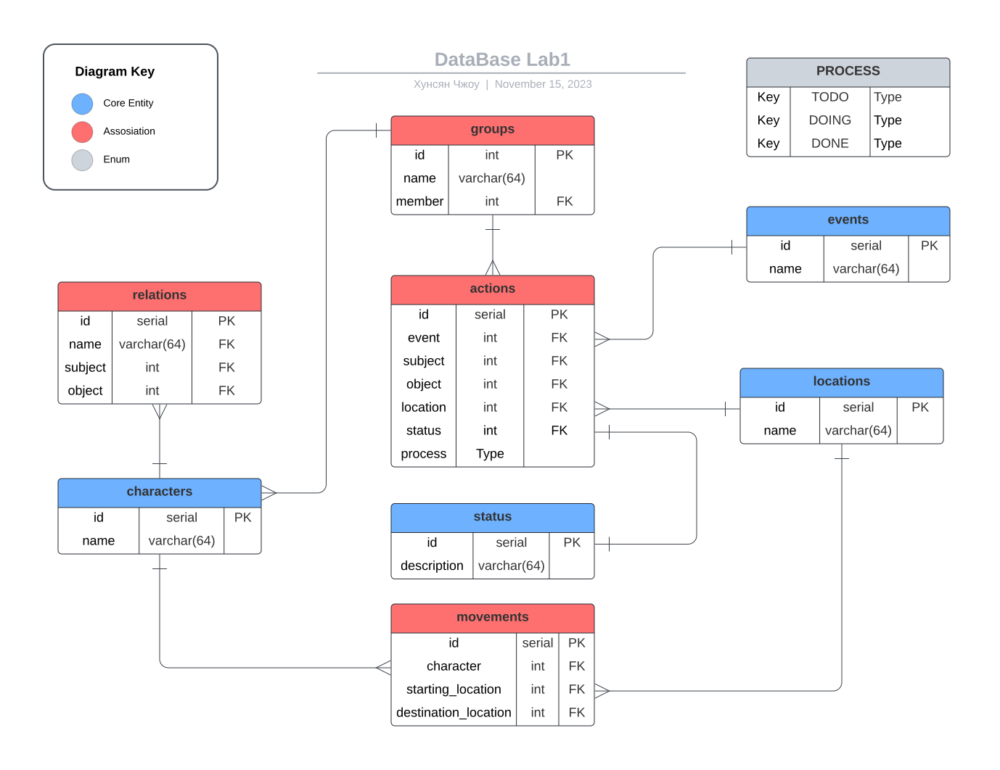
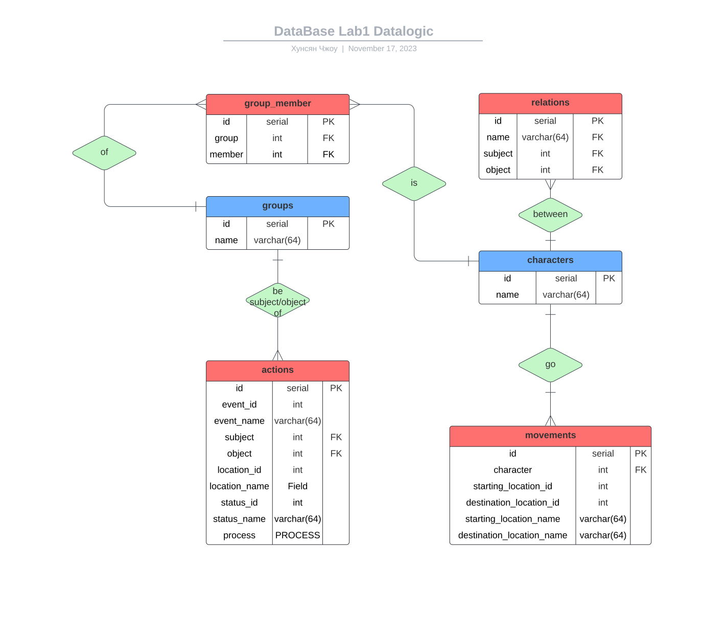

<head>
  
  
</head>

## [MainPage](../../../index.md)/[DataBase](../../README.md)/Lab 2

Университет ИТМО

Факультет ФПИ и КТ

     
<h2>Отчёт по лабораторной работе 2</h2>
<h1>«Информационная система и база данных»</h1>
<h3>Вариант: 310930</h3>

            

Студент: Чжоу Хунсян

Группа: P33131

Преподаватель:

- [1 Текст задания.](#1-текст-задания)
- [2 DataBase](#2-database)
  - [Инфологическая модель](#инфологическая-модель)
  - [Даталогическая модель](#даталогическая-модель)
- [3 Функциональные зависимости для отношений полученной схемы (минимальное множество)](#3-функциональные-зависимости-для-отношений-полученной-схемы-минимальное-множество)
  - [charaters](#charaters)
  - [events](#events)
  - [locations](#locations)
  - [status](#status)
  - [groups](#groups)
  - [group\_member](#group_member)
  - [relations](#relations)
  - [actions](#actions)
  - [movements](#movements)
- [4 Отношения в 3NF.](#4-отношения-в-3nf)
- [5 Отношения в BCNF](#5-отношения-в-bcnf)
- [6 Денормализация](#6-денормализация)
- [7 Выводы](#7-выводы)

# 1 Текст задания.

Для отношений, полученных при построении предметной области из лабораторной работы №1, выполните следующие действия:  
对于从 1 号实验室工作构建主题区域时获得的关系，执行以下步骤：

- опишите функциональные зависимости для отношений полученной схемы (минимальное множество);  
  描述结果图（最小集）关系的函数依赖关系；
- приведите отношения в 3NF (как минимум). Постройте схему на основе NF (как минимум). Постройте схему на основе полученных отношений;  
  将关系带入 3NF（至少）。 （至少）构建一个基于 NF 的电路。 根据产生的关系构建图表；
- опишите изменения в функциональных зависимостях, произошедшие после преобразования в 3NF (как минимум). Постройте схему на основе NF;  
  描述（至少）转换为 3NF 后功能依赖性发生的变化。 基于NF构建电路；
- преобразуйте отношения в BCNF. Докажите, что полученные отношения представлены в BCNF;  
  将关系转换为BCNF。 证明所得关系用 BCNF 表示；
- какие денормализации будут полезны для вашей схемы? Приведите подробное описание;  
  哪些非规范化对您的设计有用？ 提供详细的描述；

# 2 DataBase

## Инфологическая модель

  

  [Source](https://lucid.app/lucidchart/6edbd86a-1ef8-45ba-957b-8046df96f354/edit?viewport_loc=-322%2C-474%2C2474%2C2302%2C0_0&invitationId=inv_7bb712dd-866d-43a2-a8f2-8ac4f506e6da)

## Даталогическая модель

  

  [Source](https://lucid.app/lucidchart/237ba2e1-11ed-4a3c-8225-5d98a25779f0/edit?viewport_loc=-116%2C-424%2C1611%2C2177%2C0_0&invitationId=inv_4f533a7b-dc89-4e8b-893a-d96ab4aba409)

# 3 Функциональные зависимости для отношений полученной схемы (минимальное множество)

Условия чтобы множество функц. зависимостей были минимальными
1. У всех зависимостей – один атрибут в правой части
2. $A_1\rightarrow A_2$ нельзя заменить на $A_3\rightarrow A_2$($A_3$ – подмножество $A_1$)
3. При удалении любой функции. Зависимости из изначального множества не получается эквивалентное множество  функции. Зависимостей

## charaters

key: id

- id -> name
- name -> id

## events

key: id

- id -> name
- name -> id

## locations

key: id

- id -> name
- name -> id

## status

key: id

- id -> name
- name -> id

## groups

key: id

- id -> name
- name -> id

## group_member

key: id

id -> group
id -> member

## relations

key: id

id -> name
id -> subject
id -> object

## actions

key: id

id -> event
id -> subject
id -> object
id -> location
id -> status
id -> process

## movements

key: id

id -> character
id -> starting_location
id -> destination_location

# 4 Отношения в 3NF.

Приведение к 3NF можно разбить в 3 этапа:
1. Убедиться, что сущности приведены к 1NF (привести, если требуется)
   - В таблице не должно быть дублирующих строк
   - В каждой ячейке таблицы хранится атомарное значение (одно не составное значение)
   - В столбце хранятся данные одного типа
   - Отсутствуют массивы и списки в любом виде
2. Убедиться, что сущности приведены к 2NF (привести, если требуется)
   - Таблица должна находиться в первой нормальной форме
   - Таблица должна иметь ключ
   - Все не ключевые столбцы таблицы должны зависеть от полного ключа (в случае, если он составной)
3. Убедиться, что сущности приведены к 3NF (привести, если требуется)
   - Таблица находиться во второй нормальной форме
   - Отсутствие транзитивных зависимостей (зависимость не ключевых столбцов от значений других не ключевых столбцов)

Все имеющиеся таблицы приведены к 1NF. Отношение, на пересечении каждой строки и столбца — одно значение.
Все имеющиеся таблицы приведены к 2NF.  
Все имеющиеся таблицы приведены к 3NF. Нет транзитивных зависимостей.

# 5 Отношения в BCNF

- Все имеющиеся таблицы приведены к 3NF. 
- Все детерминанты — первичные ключи – то есть тоже потенциальные ключи.

# 6 Денормализация

- 3NF -> 2NF -> 1NF

  actions | events | locations | status
  --------|--------|-----------|-------
  id(PK) | id(PK) | id(PK) | id(PK)
  event(FK) | name | name | name
  subject(FK) | 
  object(FK) | 
  location(FK) |
  status(FK) |
  process | 

  actions | events | locations | status 
  --------|--------|-----------|-------
  id -> event | id -> name | id -> name | id -> name
  id -> subject | name -> id | name -> id | name -> id
  id -> object
  id -> location
  id -> status
  id -> process

  |actions|
  |-------|
  |id(PK)|
  |event_id|
  |event_name|
  |subject(FK)|
  |object(FK)|
  |location_id|
  |location_name|
  |status_id|
  |status_name|
  |process|

  |actions|
  |-------|
  |id -> event_id|
  |id -> subject|
  |id -> object|
  |id -> location_id|
  |id -> status_id|
  |id -> process|
  |id -> event_name|
  |id -> location_name|
  |id -> status_name|
  |event_id -> event_name|
  |location_id -> location_name|
  |status_id -> status_name|

  |actions|
  |-------|
  |event_id(key)|
  |event_name|
  |subject(FK)|
  |object(FK)|
  |location_id(key)|
  |location_name|
  |status_id(key)|
  |status_name(key)|
  |process|

  |actions|
  |-------|
  |event_id -> event_name|
  |location_id -> location_name|
  |status_id -> status_name|

  ---

  movements | locations
  ----------|----------
  id(PK) | id(PK)
  character(FK) | name
  starting_location(FK) | 
  destination_location(FK) |

  movements | locations
  ----------|----------
  id -> character | id -> name
  id -> starting_location | name -> id
  id -> destination_location | 

  |movements|
  |---------|
  |id(PK)|
  |character(FK)|
  |starting_location_id|
  |starting_location_name|
  |destination_location_id|
  |destination_location_name|

  |movements|
  |---------|
  |id -> character|
  |id -> starting_location_id|
  |id -> destination_location_id|
  |id -> starting_location_name|
  |id -> destination_location_name|
  |starting_location_id -> starting_location_name|
  |destination_location_id -> destination_location_name|

  

# 7 Выводы

