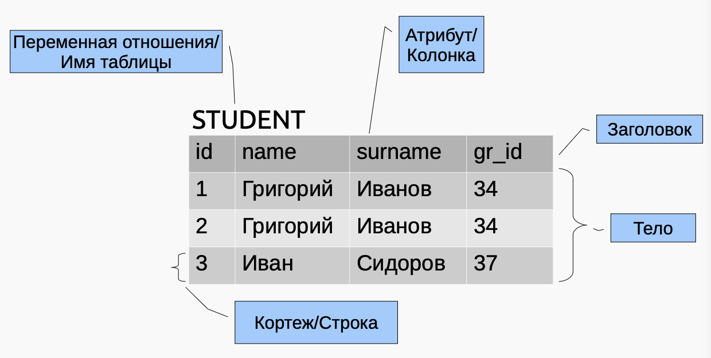
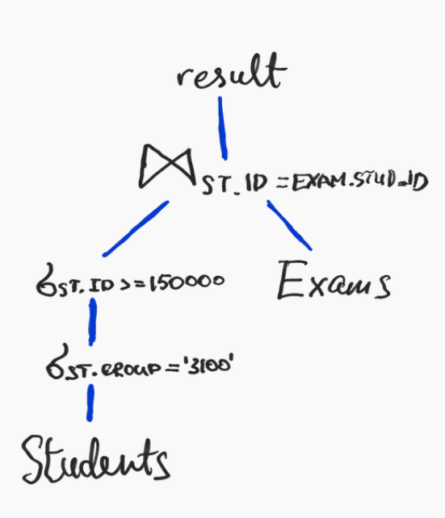
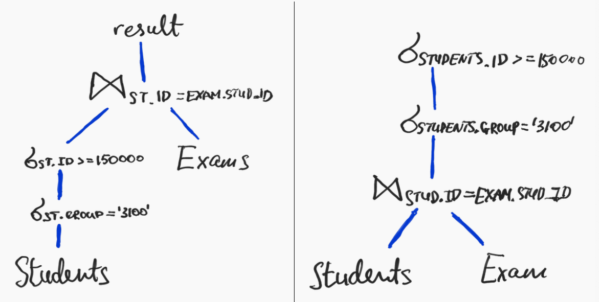
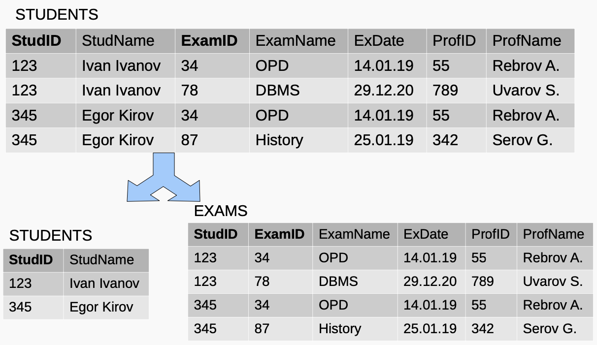
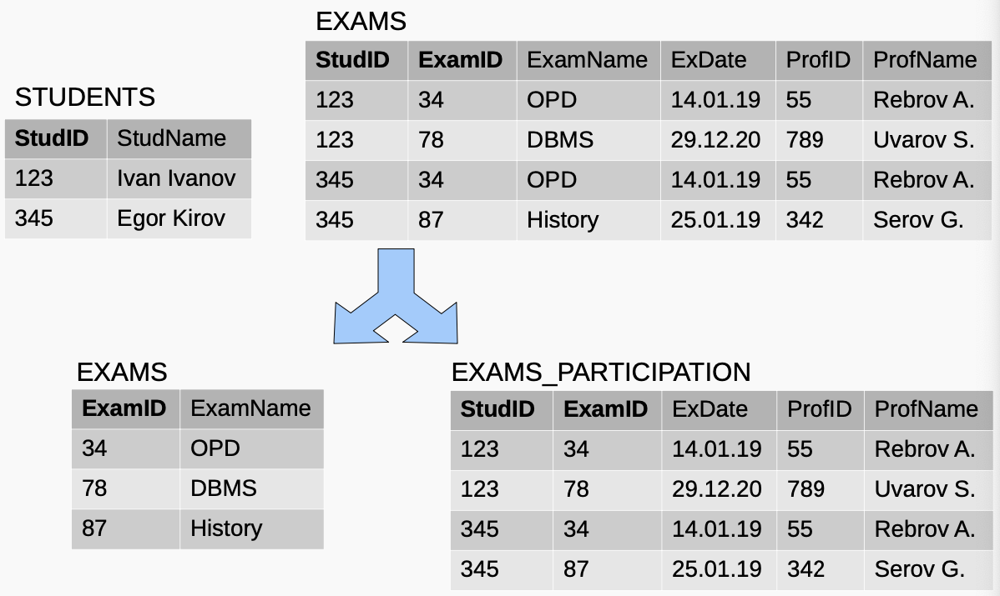
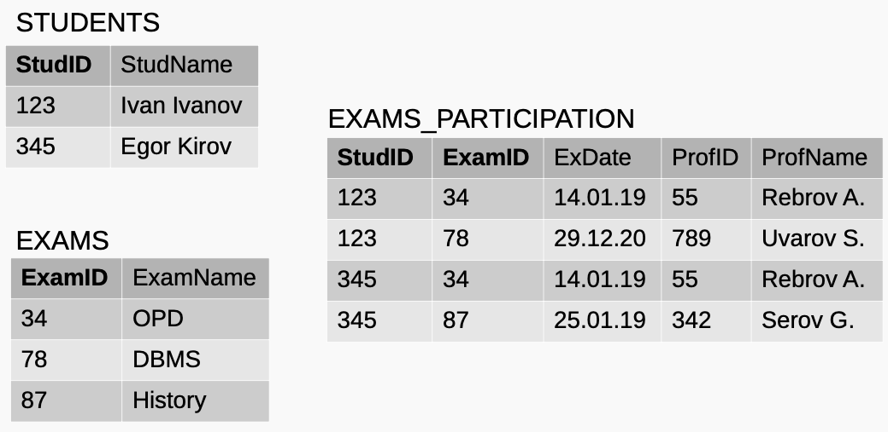
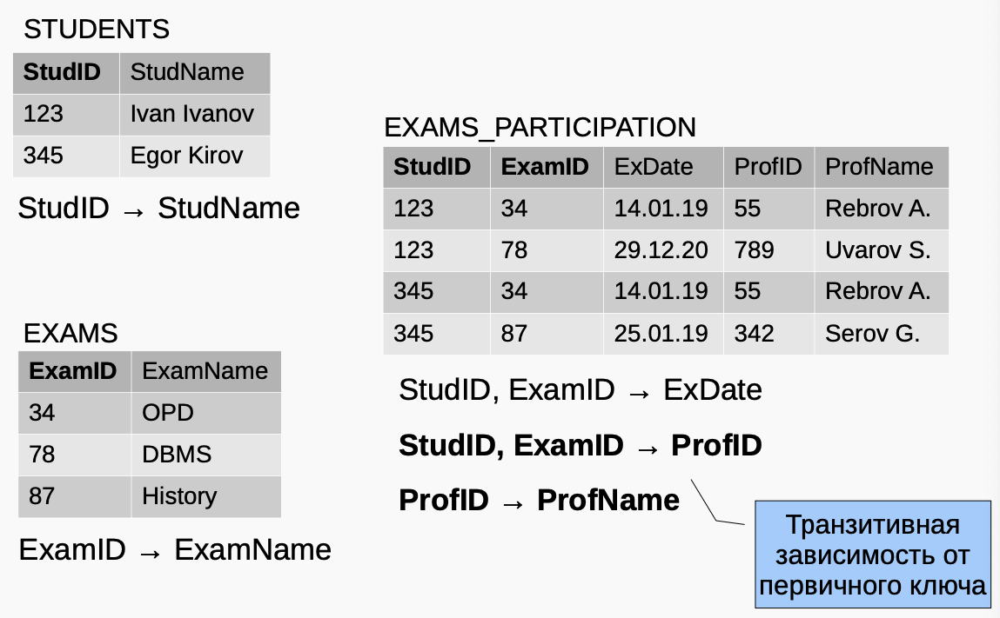
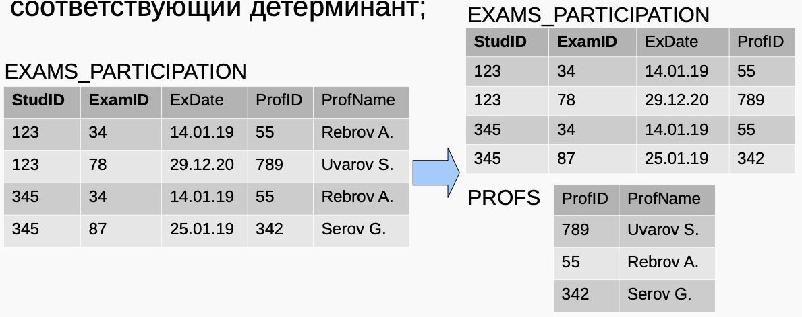
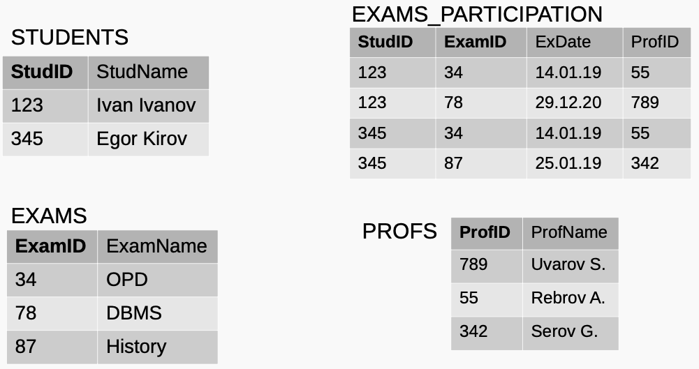

<head>
    <script src="https://cdn.mathjax.org/mathjax/latest/MathJax.js?config=TeX-AMS-MML_HTMLorMML" type="text/javascript"></script>
    <script type="text/x-mathjax-config">
        MathJax.Hub.Config({
            tex2jax: {
            skipTags: ['script', 'noscript', 'style', 'textarea', 'pre'],
            inlineMath: [['$','$']]
            }
        });
    </script>
</head>

## [MainPage](../../index.md)/[Algorithm&DataStructures](../README.md)/Lecture 3

# Лекция 3: нормализация

- [Лекция 3: нормализация](#лекция-3-нормализация)
  - [Реляционное представление](#реляционное-представление)
    - [Реляционная БД](#реляционная-бд)
    - [Домены](#домены)
    - [Основные правила](#основные-правила)
    - [Базовые понятия](#базовые-понятия)
    - [Пример](#пример)
    - [Терминология](#терминология)
    - [Операции реляц. алгебры](#операции-реляц-алгебры)
    - [Операция выборки](#операция-выборки)
    - [Проекция](#проекция)
    - [Соединение](#соединение)
    - [Законы](#законы)
    - [Пример](#пример-1)
    - [Сокращенная запись](#сокращенная-запись)
    - [План выполнения запроса](#план-выполнения-запроса)
    - [Эквивалентные планы](#эквивалентные-планы)
  - [Нормализация](#нормализация)
    - [Аномалии вставки](#аномалии-вставки)
    - [Аномалии удаления](#аномалии-удаления)
    - [Функциональная зависимость](#функциональная-зависимость)
    - [Пример](#пример-2)
    - [Функциональные зависимости](#функциональные-зависимости)
    - [Минимальное множество функц. зависимостей](#минимальное-множество-функц-зависимостей)
    - [Аксиомы Армстронга](#аксиомы-армстронга)
    - [Нормализация](#нормализация-1)
    - [Ненормализованная форма](#ненормализованная-форма)
    - [Процесс нормализации](#процесс-нормализации)
    - [Первая нормальная форма (1НФ)](#первая-нормальная-форма-1нф)
    - [Вторая нормальная форма (2НФ)](#вторая-нормальная-форма-2нф)
    - [Полная функциональная зависимость](#полная-функциональная-зависимость)
    - [Вторая нормальная форма (2НФ)](#вторая-нормальная-форма-2нф-1)
    - [StudID $\\rightarrow$ StudName](#studid-rightarrow-studname)
    - [ExamID $\\rightarrow$ ExamName](#examid-rightarrow-examname)
    - [Вторая нормальная форма](#вторая-нормальная-форма)
    - [Вторая нормальная форма (2НФ)](#вторая-нормальная-форма-2нф-2)
    - [Третья нормальная форма (3НФ)](#третья-нормальная-форма-3нф)
    - [Преобразование в 3НФ](#преобразование-в-3нф)
    - [Третья нормальная форма](#третья-нормальная-форма)
    - [Нормальная форма Бойса-Кодда (НФБК)](#нормальная-форма-бойса-кодда-нфбк)
    - [Нормализация](#нормализация-2)
    - [Денормализация](#денормализация)
  - [Литература](#литература)


## Реляционное представление

### Реляционная БД

Э. Кодд: любое представление данных можно свести к совокупности отношений.

- Отношение (relation) - двумерные таблицы особого вида
- У отношения есть атрибуты (столбцы) и кортежи (строки).
- У каждого атрибута есть имя.

### Домены

- Каждый атрибут определяется некоторым допустимым набором значений
- Домен — множество значений, допустимых в определенном контексте.
- Смысл домена: если значения берутся из одного и того же домена, то они относятся к одному типу — эти значения можно сопоставить (сравнить)

### Основные правила

- Заголовок отношения — состоит из фиксированного множества атрибутов.
- Тело отношения — состоит из меняющегося во времени множества кортежей.
- Каждый кортеж состоит из множества пар атрибут-значение, по одной паре для каждого атрибута из заголовка.
- Для любой заданной пары атрибут(A)-значение(v), v является значением из единственного домена D, который связан с атрибутом A.

### Базовые понятия

- Степень отношения — это число его атрибутов (отношение степени один - унарное, степени два — бинарное, степени n — n-арное).
- Кардинальное число (мощность отношения) — это число его кортежей.

### Пример

ID | Surname | Name | Birthday | Location
---|---------|------|----------|---------
1 | Иванов | Василий | 1980-12-01 | г. Москва
2 | Георгиев | Сергей | 1992-03-12 | г. Санкт-Петербург
3 | Васильев | Андрей | 1987-10-14 | г. Оренбург
7 | Романов | Кирилл | 1991-12-01 | NULL

### Терминология



### Операции реляц. алгебры

Реляционная алгебра — язык для определения новых отношений на основе существующих.

В реляционной алгебре определен ряд операций над отношениями.

Результат операции — новое отношение.

В операциях будут использоваться обозначения:
- $R$, $S$ — отношения (таблицы)
- $\varphi$ — предикат (условие), $\varphi_1 \land \varphi_2$ — составное условие

### Операция выборки

$\sigma_\varphi(R)$ — операция выборки — в результате операции формируется отношение на основе $R$, которое содержит только те строки (кортежи), которые удовлетворяют заданному предикату.

```sql
SELECT * FROM STUDENTS WHERE
STUDENTS.GROUP = '3100' AND
STUDENTS.ID >= 150000;
```

$$\Downarrow$$

$$\sigma_{(STUDENTS.GROUP='3100')\land(STUDENTS.ID>=150000)}(STUDENTS)$$

### Проекция

$\pi_{attr}(R)$ — проекция — в результате операции формируется новое отношение, содержащее только
те атрибуты из $R$, которые были указаны в проекции:

```sql
SELECT name, group FROM STUDENTS;
```

$$\Downarrow$$

$$\pi_{name, group}(STUDENTS)$$

### Соединение

$R \bowtie_\theta S$ — соединение (тета-соединение)

$$R\bowtie_\theta S=\sigma_\theta(R\times S)$$

```sql
SELECT * FROM STUDENTS
JOIN EXAMS ON STUDENTS.ID = EXAMS.STUD_ID;
```

$$\Downarrow$$

$$STUDENTS \bowtie_{STUDENTS.ID=EXAMS.STUD\_ID} EXAMS$$

### Законы
- $R \bowtie_\theta S\equiv S \bowtie\theta R$ (коммутативность)
- $R \bowtie_\theta(S \bowtie_\varphi T)\equiv (R \bowtie_\theta S) \bowtie_\varphi T$ (ассоциативность)
- $\sigma_{\theta\land\varphi}(R)\equiv\sigma\theta(\sigma_\varphi(R))$
- ...

### Пример

```sql
SELECT * FROM STUDENTS
JOIN EXAMS ON STUDENTS.ID = EXAMS.STUD_ID
WHERE
    STUDENTS.GROUP = '3100' AND 
    STUDENTS.ID >= 150000;
```

$$\Downarrow$$

$$\sigma_{STUDENTS.GROUP = '3100'\land STUDENTS.ID >= 150000} (STUDENTS \bowtie_{STUDENTS.ID=EXAMS.STUD_ID} EXAMS)$$

### Сокращенная запись

```sql
SELECT * FROM STUDENTS
JOIN EXAMS ON STUDENTS.ID = EXAMS.STUD_ID 
WHERE
    STUDENTS.GROUP = '3100' AND 
    STUDENTS.ID >= 150000;
```

$$\Downarrow$$

$$\sigma_{STUDENTS.GROUP\land STUDENTS.ID} (STUDENTS \bowtie_{STUDENTS.ID=EXAMS.STUD_ID} EXAMS)$$

### План выполнения запроса



### Эквивалентные планы



## Нормализация

Вопросы к полученной модели:
- корректны ли полученные отношения?
- правильно ли выявлено распределение атрибутов по
отношениям?

Нормализация - формальный метод для проверки/доработки модели на основе ключей и функциональных зависимостей в отношениях.

- Несоответствие смысловых связей реальной предметной
области.
- Избыточность данных:

  STUDENTS

  StudID | StudName | Group | GrMentor
  -------|----------|-------|---------
  1 | Ivan Petrov | P3100 | Egor Kirov
  3 | Vasily Ivanov | P3101 | Roman Ivov
  34 | Gleb Anisimov | P3100 | Egor Kirov

### Аномалии вставки

```sql
INSERT INTO STUDENTS
    VALUES(57, 'Nina Simonova', 'P3100', 'E. Kirov');
INSERT INTO STUDENTS
    VALUES(58, 'Petr Uvarov', 'P3100', 'Egor Lomov');
```

STUDENTS

StudID | StudName | Group | GrMentor
-------|----------|-------|---------
1 | Ivan Petrov | P3100 | Egor Kirov
3 | Vasily Ivanov | P3101 | Roman Ivov
34 | Gleb Anisimov | P3100 | Egor Kirov
57 | Nina Simonova |  P3100 | E.Kirov
58 | Petr Uvarov | P3100 | Egor Lomov

```sql
UPDATE STUDENTS
    SET GrMentor = 'Eugene Lomov'
    WHERE StudName = 'Ivan Petrov';
```

STUTENDS

StudID | StudName | Group | GrMentor
-------|----------|-------|---------
1 | Ivan Petrov | P3100 | Egor Kirov
3 | Vasily Ivanov | P3101 | Roman Ivov
34 | Gleb Anisimov | P3100 | Egor Kirov

### Аномалии удаления
```sql
DELETE FROM STUDENTS
    WHERE StudName = 'Vasily Ivanov';
```

StudID | StudName | Group | GrMentor
-------|----------|-------|---------
1 | Ivan Petrov | P3100 | Egor Kirov
~~3~~ | ~~Vasily Ivanov~~ | ~~P3101~~ | ~~Roman Ivov~~
34 | Gleb Anisimov | P3100 | Egor Kirov

> Данных о группе Р3101 больше нет.

### Функциональная зависимость

Функциональная зависимость — средство для описания связей между атрибутами отношения.

$R$ — отношение
$A_1, A_2$ — атрибуты $R$

Если в $R$ атрибут $A_2$ функционально зависит от атрибута $A_1$, то каждое значение $A_1$ связано с одним значением $A_2$ и определяет его.

$A_1 \rightarrow A_2$
$A_1$ — детерминант функциональной зависимости.
$A_1$ и $A_2$ могут представлять несколько атрибутов.

### Пример
- По StudID можно однозначно определить группу:

  $$StudID \rightarrow Group$$

- Group не зависит от `StudID` — возможен один и тот же Group для разных `StudID`:
  
  $$Group \nrightarrow StudID$$

STUDENTS

StudID | StudName | Group | GrMentor
-------|----------|-------|---------
1 | Ivan Petrov | P3100 | Egor Kirov
3 | Vasily Ivanov | P3101 | Roman Ivov
34 | Gleb Anisimov | P3100 | Egor Kirov

- Функциональная зависимость определяется смысловыми связями, на основе которых строится отношение.
- Текущие данные в отношении не влияют на функциональные зависимости:

STUDENTS

StudID | StudName | Group | GrMentor
-------|----------|-------|---------
12 | Ivan Petrov | P3101 | Egor Kirov
33 | Vasily Ivanov | P3102 | Roman Ivov
34 | Gleb Anisimov | P3103 | Egor Kirov

$$StudID \rightarrow Group$$

### Функциональные зависимости

STUDENTS

StudID | StudName | Group | GrMentor
-------|----------|-------|---------
12 | Ivan Petrov | P3101 | Egor Kirov
33 | Vasily Ivanov | P3102 | Roman Ivov
34 | Gleb Anisimov | P3103 | Egor Kirov

$StudID \rightarrow Group$
$StudID \rightarrow GrMentor$
$Group \rightarrow GrMentor$
$StudID \rightarrow StudName$
$StudID, StudName \rightarrow StudName$

- Тривиальная функциональная зависимость:
  
  $$StudID, StudName \rightarrow StudName$$

- Обычно рассматриваются нетривиальные функциональные зависимости.

### Минимальное множество функц. зависимостей

Множество функциональных зависимостей минимально, если:

- у всех зависимостей — один атрибут в правой части;
- $A_1 \rightarrow A_2$ нельзя заменить на $A_3 \rightarrow A_2$ ($A_3$ — подмножество атрибутов $A_1$);
- при удалении любой функц. зависимости из изначального множества не получается эквивалентное множество функц. зависимостей;

### Аксиомы Армстронга

1. Рефлексивность:
  если $A_2$ — подмножество $A_1$, то $A_1 \rightarrow A_2$
2. Дополнение:
  если $A_1 \rightarrow A_2$, то $A_1,A_3 \rightarrow A_2,A_3$
3. Транзитивность:
  если $(A_1\rightarrow A_2)\land(A_2\rightarrow A_3)$,то $A_1\rightarrow A_3$

### Нормализация

Нормализация - формальный метод для проверки/ доработки модели на основе функциональных зависимостей.

- Выполняется в несколько этапов.
- Приводит отношения в состояние, соответствующее определенному набору правил, которые зависят от выбранной нормальной формы.

### Ненормализованная форма

Если на пересечении строки и столбца встречается несколько значений:

STUDENTS

StudID | StudName | ExamID | ExamName | ExDate | ProfID | ProfName
---|---|---|---|---|---|---
123 | Ivan Ivanov | 34 <br> 78 | OPD <br> DBMS | 14.01.19 <br> 29.12.20 | 55 <br> 789 | Rebrov A. <br> Uvarov S.
345 | Egor Kirov | 34 <br> 87 | OPD <br> History | 14.01.19 <br> 25.01.19 | 55 <br> 342 | Rebrov A. <br> Serov G.

### Процесс нормализации

STUDENTS

StudID | StudName | ExamID | ExamName | ExDate | ProfID | ProfName
---|---|---|---|---|---|---
123 | Ivan Ivanov | 34 <br> 78 | OPD <br> DBMS | 14.01.19 <br> 29.12.20 | 55 <br> 789 | Rebrov A. <br> Uvarov S.
345 | Egor Kirov | 34 <br> 87 | OPD <br> History | 14.01.19 <br> 25.01.19 | 55 <br> 342 | Rebrov A. <br> Serov G.

В дальнейшем при описании нормальных форм предполагается, что в каждом отношении один потенциальный ключ, который является первичным, определения НФ — не строгие.

### Первая нормальная форма (1НФ)

Отношение, на пересечении каждой строки и столбца — одно значение.

Вариант 1: сделать из групп значений отдельные строки.

STUDENTS

StudID | StudName | ExamID | ExamName | ExDate | ProfID | ProfName
---|---|---|---|---|---|---
123 | Ivan Ivanov | 34 | OPD | 14.01.19 | 55 | Rebrov A.
123 | Ivan Ivanov | 78 | DBMS | 29.12.20 | 789 | Uvarov S.
345 | Egor Kirov | 34 | OPD | 14.01.19 | 55 | Rebrov A.
345 | Egor Kirov | 87 | History | 25.01.19 | 342 | Serov G.

Отношение, на пересечении каждой строки и столбца — одно значение.

Вариант 2: разбить на таблицы, чтобы исключить группы

EXAMS

StudID | ExamID | ExamName | ExDate | ProfID | ProfName
---|---|---|---|---|---
123 | 34 | OPD | 14.01.19 | 55 | Rebrov A.
123 | 78 | DBMS | 29.12.20 | 789 | Uvarov S.
345 | 34 | OPD | 14.01.19 | 55 | Rebrov A.
345 | 87 | History | 25.01.19 | 342 | Serov G.

STUDENTS

StudID | StudName
---|---
123 | Ivan Ivanov
345 | Egor Kirov

### Вторая нормальная форма (2НФ)

2НФ — 1) отношение в 1НФ и 2) атрибуты, не входящие в первичный ключ, в полной функциональной зависимости от первичного ключа отношения.

$A_1, A_2$ - атрибуты $R$

Полная функциональная зависимость: $A_2$ в полной функциональной зависимости от $А_1$, если $A_1\rightarrow A_2$, но нет зависимостей вида $A_3\rightarrow A_2$, где $A_3$ — подмножество $A_1$.

### Полная функциональная зависимость

Полная функциональная зависимость: $A_2$ в полной функциональной зависимости от $А_1$, если $A_1 \rightarrow A_2$, но нет зависимостей вида $A_3 \rightarrow A_2$, где $A_3$ — подмножество $A_1$.

Из $А_1$ нельзя удалить атрибут, иначе - потеря функц. зависимости $A_1 \rightarrow A_2$

$StudID, ExamID \rightarrow ExDate$ — полная ф.з.

### Вторая нормальная форма (2НФ)

STUDENTS

StudID | StudName | ExamID | ExamName | ExDate | ProfID | ProfName
---|---|---|---|---|---|---
123 | Ivan Ivanov | 34 | OPD | 14.01.19 | 55 | Rebrov A.
123 | Ivan Ivanov | 78 | DBMS | 29.12.20 | 789 | Uvarov S.
345 | Egor Kirov | 34 | OPD | 14.01.19 | 55 | Rebrov A.
345 | Egor Kirov | 87 | History | 25.01.19 | 342 | Serov G.

Чтобы привести к 2НФ — убрать частичные зависимости от ключа:

1. удалить атрибуты, зависящие от составляющих ключа из $R_1$;
2. новое отношение $R_2$: удаленные атрибуты из $R_1 +$ соответствующий детерминант;

STUDENTS

StudID | StudName | ExamID | ExamName | ExDate | ProfID | ProfName
---|---|---|---|---|---|---
123 | Ivan Ivanov | 34 | OPD | 14.01.19 | 55 | Rebrov A.
123 | Ivan Ivanov | 78 | DBMS | 29.12.20 | 789 | Uvarov S.
345 | Egor Kirov | 34 | OPD | 14.01.19 | 55 | Rebrov A.
345 | Egor Kirov | 87 | History | 25.01.19 | 342 | Serov G.

$StudID, ExamID \rightarrow StudName $
> Частичная функц. зависимость

$StudID, ExamID \rightarrow ExamName$
$StudID, ExamID \rightarrow ExDate$
$StudID, ExamID \rightarrow ProfID$
$ProfID \rightarrow ProfName$

STUDENTS

StudID | StudName | ExamID | ExamName | ExDate | ProfID | ProfName
---|---|---|---|---|---|---
123 | Ivan Ivanov | 34 | OPD | 14.01.19 | 55 | Rebrov A.
123 | Ivan Ivanov | 78 | DBMS | 29.12.20 | 789 | Uvarov S.
345 | Egor Kirov | 34 | OPD | 14.01.19 | 55 | Rebrov A.
345 | Egor Kirov | 87 | History | 25.01.19 | 342 | Serov G.

$StudID, \sout{ExamID} \rightarrow StudName $
> Частичная функц. зависимость

$\sout{StudID}, ExamID \rightarrow ExamName$
$StudID, ExamID \rightarrow ExDate$
$StudID, ExamID \rightarrow ProfID$
$ProfID \rightarrow ProfName$

### StudID $\rightarrow$ StudName



### ExamID $\rightarrow$ ExamName



### Вторая нормальная форма



### Вторая нормальная форма (2НФ)

Нет частичных зависимостей от потенциальных ключей

StudID → StudName
> Частичная функц. зависимость

ExamID → ExamName
StudID, ExamID → ExDate
StudID, ExamID → ProfID
ProfID → ProfName

### Третья нормальная форма (3НФ)

3НФ — отношение в 1) 1НФ и 2НФ и 2) все атрибуты, которые не входят в первичный ключ, не находятся в транзитивной функциональной зависимости от первичного ключа.

$A_1, A_2, A_3$ — атрибуты $R$

Транзитивная функциональная зависимость — если для $A_1, A_2, A_3$ из $R$:

$A_1\rightarrow A_2\land A_2\rightarrow A_3$

то $A_3$ транзитивно зависит от $А_1$ через $A_2$ ($A_1$ функционально независим от $A_2,A_3$).

### Преобразование в 3НФ



Чтобы привести к 3НФ — убрать транзитивные зависимости:

1)удалить из R1 атрибуты, транзитивно-зависимые от первичного ключа;
2)новое отношение R2: атрибуты (удаленные в 1.) + соответствующий детерминант;



### Третья нормальная форма



Нет транзитивных зависимостей от потенциальных ключей:

$StudID, ExamID \rightarrow ExDate$
$StudID, ExamID \rightarrow ProfID$ 
$ProfID \rightarrow ProfName$
> Транзитивная зависимость от первичного ключа

### Нормальная форма Бойса-Кодда (НФБК)

НФБК — отношение в НФБК, когда для всех функциональных зависимостей отношения выполняется условие: детерминант — потенциальный ключ.

$A_1\rightarrow A_2$
$A_1$ — детерминант функциональной зависимости.

### Нормализация

- Обычно процесс останавливается на 3НФ или НФБК (в зависимости от предметной области и требований к БД).
- Существуют 4НФ и 5НФ, но используются редко.

### Денормализация

- Бывает, что для повышения производительности запросов производится денормализация:
  - несколько отношений объединяют в одно;
- В результате:
  - можно повысить эффективность выполнения некоторых запросов (уменьшается число соединений таблиц);
  - увеличивается избыточность данных;
  - требуется больше усилий на поддержание целостности БД;

## Литература

- При подготовке презентации использовались материалы из:
- Введение в реляционные базы данных / В. В. Кириллов, Г. Ю. Громов, Издательство: BHV, 2009 г.
- [Документация PostgreSQL](https://www.postgresql.org/about/licence/)

> PostgreSQL is released under the PostgreSQL License, a liberal Open Source license, similar to the BSD or MIT licenses.
> PostgreSQL Database Management System (formerly known as Postgres, then as Postgres95)
> Portions Copyright © 1996-2020, The PostgreSQL Global Development Group Portions Copyright © 1994, The Regents of the University of California
> Permission to use, copy, modify, and distribute this software and its documentation for any purpose, without fee, and without a written agreement is hereby granted, provided that the above copyright notice and this paragraph and the following two paragraphs appear in all copies.
> IN NO EVENT SHALL THE UNIVERSITY OF CALIFORNIA BE LIABLE TO ANY PARTY FOR DIRECT, INDIRECT, SPECIAL, INCIDENTAL, OR CONSEQUENTIAL DAMAGES, INCLUDING LOST PROFITS, ARISING OUT OF THE USE OF THIS SOFTWARE AND ITS DOCUMENTATION, EVEN IF THE UNIVERSITY OF CALIFORNIA HAS BEEN ADVISED OF THE POSSIBILITY OF SUCH DAMAGE.
> THE UNIVERSITY OF CALIFORNIA SPECIFICALLY DISCLAIMS ANY WARRANTIES, INCLUDING, BUT NOT LIMITED TO, THE IMPLIED WARRANTIES OF MERCHANTABILITY AND FITNESS FOR A PARTICULAR PURPOSE. THE SOFTWARE PROVIDED HEREUNDER IS ON AN "AS IS" BASIS, AND THE UNIVERSITY OF CALIFORNIA HAS NO OBLIGATIONS TO PROVIDE MAINTENANCE, SUPPORT, UPDATES, ENHANCEMENTS, OR MODIFICATIONS.
