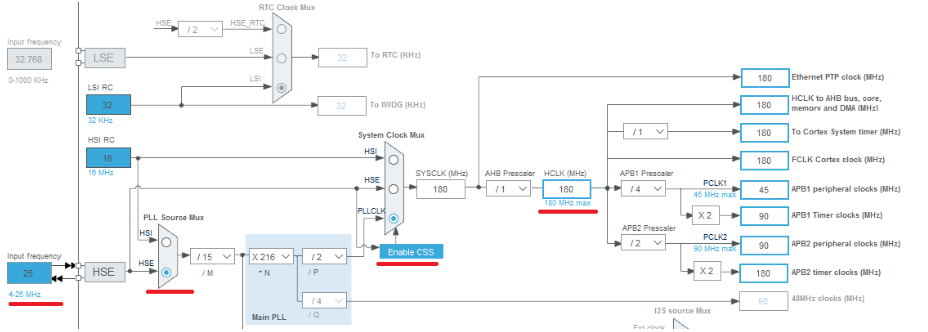
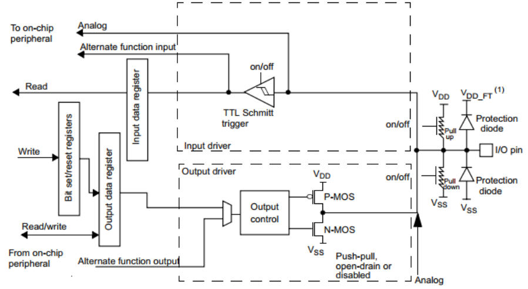
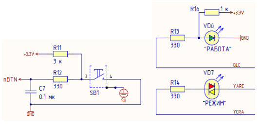
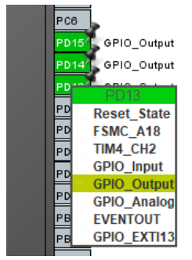
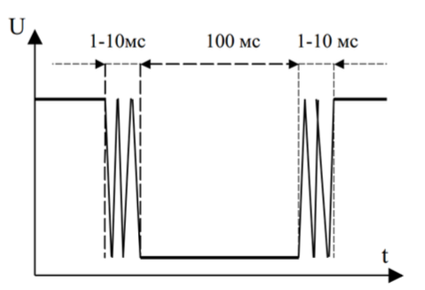
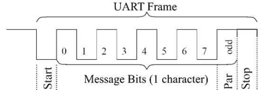
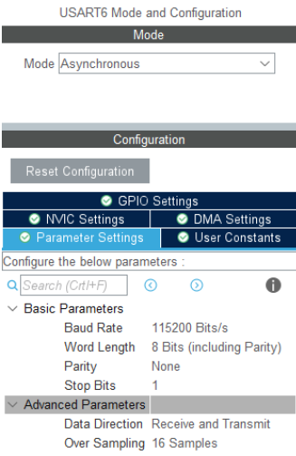
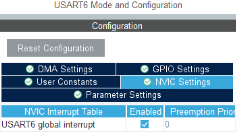

## 1. Основные механизмы встраиваемых систем на примере стенда SDK-1.1M <br> 嵌入式系统的基本机制：以SDK-1.1M为例

В качестве примера в данном разделе будут рассматриваться стенды SDK-1.1M на базе
микроконтроллеров линейки STM32F407/STM32F427, имеющие процессорное ядро с
архитектурой ARM Cortex-M4.  
本节以基于STM32F407/STM32F427微控制器的SDK-1.1M设备为例，这些微控制器具有采用ARM Cortex-M4架构的处理器核心。

Устройство SDK-1.1M описано в главе 3.  
设备SDK-1.1M的描述详见第3章。

### 1.1. Сигналы сброса и синхронизации <br> 复位和同步信号

Общие сведения  
通用信息

Сигнал сброса (reset) возвращает микроконтроллер в начальное состояние. При этом
микроконтроллер начинает исполнять программу с начала. В стенде SDK-1.1M сброс можно выполнить, нажав на кнопку «RESET» на лицевой панели (рис. 37).  
复位信号（reset）将微控制器恢复到初始状态，此时微控制器会从程序的起点开始执行。在SDK-1.1M中，可以通过按下面板上的“RESET”按钮来完成复位（如图37所示）。

Для работы любого микроконтроллера необходимы синхросигналы, которые задают тактовые частоты работы процессорного ядра и других аппаратных блоков. В микроконтроллерах обычно предусмотрены несколько источников синхросигналов (внешних и внутренних, имеющих разную частоту работы) и широкие возможности по настройке их частот.  
微控制器的运行需要同步信号，这些信号设定了处理器核心及其他硬件模块的时钟频率。通常，微控制器支持多种同步信号源（内部和外部），并提供灵活的频率设置选项

Пример настройки синхросигналов в STM32  
STM32的同步信号配置示例

Включить использование внешнего скоростного кварцевого резонатора (System Core → RCC→ High Speed Clock (HSE): выбрать «Crystal/Ceramic Resonator»).  
启用外部高速晶体振荡器：在System Core → RCC → High Speed Clock (HSE)中选择“Crystal/Ceramic Resonator”。

Настроить дерево синхронизации (режим конфигурирования микроконтроллера, вкладка Clock Configuration), на примере STM32F427VI (рис. 2):  
配置同步树（Clock Configuration模式），以STM32F427VI为例（如图2所示）：

- ввести частоту внешнего скоростного кварцевого резонатора (HSE Input frequency): 25 МГц (указана на электрической принципиальной схеме стенда);  
  输入外部高速晶体振荡器的频率（HSE Input frequency）：25MHz（参见电路原理图）。
- выбрать HSE как источник синхросигнала для основного блока подстройки частоты (Main PLL);  
  选择HSE作为主频率调整模块（Main PLL）的信号源。
- выбрать PLLCLK как источник синхросигнала SYSCLK;  
  选择PLLCLK作为SYSCLK的信号源。
- ввести желаемую частоту HCLK (основная частота микроконтроллера), равную максимальной (указана под данным полем), для STM32F427VI – 180 МГц.  
  设置微控制器的主频率HCLK为最高值（STM32F427VI的最高频率为180MHz）。

После этого STM32CubeIDE автоматически рассчитает настройки дерева синхронизации для получения нужных частот с учетом всех ограничений.  
配置完成后，STM32CubeIDE会自动计算同步树的设置，确保满足频率约束。

### 1.2. Интерфейс ввода-вывода общего назначения (GPIO)

Общие сведения о GPIO  
有关 GPIO 的一般信息

Интерфейс ввода-вывода общего назначения (general-purpose input/output, GPIO) – базовый интерфейс взаимодействия компьютерной системы с внешним миром. С его помощью к контактам (ножкам, «пинам») микроконтроллера чаще всего подключаются такие внешние элементы как светодиоды, кнопки, переключатели, осуществляется управление периферийными устройствами и т. д.  
通用输入/输出接口（GPIO）是计算机系统与外界之间的基本接口。在它的帮助下，LED、按钮、开关等外部元件通常连接到微控制器的触点（引脚、“引脚”）、控制外围设备等。

Контакты микроконтроллера внутри подключаются к портам ввода-вывода. Пример организации единичного порта ввода-вывода приведен на рис. 3. Такие порты GPIO обычно объединяются в группы по 8, 16 или 32 порта с общими регистрами управления. Одни и те же порты могут выступать в роли входа или выхода в зависимости от настроек. По умолчанию обычно включен режим входа, чтобы исключить влияние порта на другие части схемы. Для работы в качестве выхода необходимо настроить соответствующий порт на выход при помощи управляющих регистров (описаны в документации микроконтроллера). Каждый контакт настраивается индивидуально – в одной группе портов входы и выходы могут чередоваться в любых комбинациях.  
内部的微控制器引脚连接到I/O端口。图 1 显示了组织单个 I/O 端口的示例。 3. 此类 GPIO 端口通常组合成 8、16 或 32 个端口组，并具有公共控制寄存器。根据设置，相同的端口可以用作输入或输出。默认情况下，通常启用输入模式以防止端口干扰电路的其他部分。要作为输出运行，必须使用控制寄存器（在微控制器文档中描述）将相应的端口配置为输出。每个触点均单独配置 - 在一组端口中，输入和输出可以以任意组合交替。



Рисунок 2 – Настройки дерева синхронизации микроконтроллера STM32F427VI  
图 2 – STM32F427VI 微控制器同步树设置

Также порты ввода-вывода позволяют в качестве «альтернативной функции» подключать к контактам микроконтроллера различные аппаратные блоки – контроллеры интерфейсов ввода вывода, генераторы сигналов и т. п.  
此外，I/O 端口作为“替代功能”，允许将各种硬件单元连接到微控制器触点 - 输入/输出接口控制器、信号发生器等。

В STM32 единичные порты GPIO объединяются в групповые порты по 16 штук, которые называются GPIOA, GPIOB и т. д. Соответствующие им контакты микроконтроллера называются PA1, PA2, …, PB1, PB2, … и т. д.  
在STM32中，单个GPIO端口被组合成16个组端口，称为GPIOA、GPIOB等。对应的单片机引脚称为PA1、PA2、...、PB1、PB2、...等。

В стенде SDK-1.1M с процессорным модулем на базе STM32 на боковой панели имеется одна кнопка, подключённая к контакту PC15, и два управляемых светодиода: зеленый, подключенный к PD13, и двухцветный красный/желтый, подключенный к контактам PD14 и PD15 (рис. 4, 36).  
在侧面板上带有基于 STM32 的处理器模块的 SDK-1.1M 支架中，有一个按钮连接到引脚 PC15，以及两个可控 LED：绿色，连接到 PD13，以及两色红/黄，连接到引脚 PD14和 PD15（图 4、36）。

Пример работы с GPIO в STM32  
在 STM32 中使用 GPIO 的示例

Произведем настройку контактов микроконтроллера в SDK-1.1M. В STM32CubeIDE в режиме конфигурирования микроконтроллера на вкладке Pinouts & Configuration необходимо перевести контакты PD13 – PD15 в режим GPIO_Output (рис. 5).  
让我们在 SDK-1.1M 中配置微控制器触点。在STM32CubeIDE中，在Pinouts & Configuration选项卡上的微控制器配置模式下，您需要将引脚PD13 – PD15切换到GPIO_Output模式（图5）。

После сохранения конфигурации микроконтроллера STM32CubeIDE сгенерирует и добавит в проект код для инициализации микроконтроллера в соответствии с заданными настройками.  
保存微控制器配置后，STM32CubeIDE将生成代码并将其添加到项目中，以按照指定的设置初始化微控制器。

ВНИМАНИЕ: при повторной генерации файлов из них удаляется весь код, добавленный пользователем, кроме кода, который написан между парами комментариев вида /* USER CODE BEGIN ... */, /* USER CODE END ... */.  
注意：重新生成文件时，用户添加的所有代码都将从文件中删除，除了在 /* USER CODE BEGIN ... */, /* USER CODE END ... 形式的注释对之间编写的代码之外。 */。

Для работы с GPIO, как и с другой периферией, на STM32 рекомендуется использовать библиотеку HAL (Hardware Abstraction Layer), поддержка которой встроена в IDE. При генерации проекта STM32CubeIDE добавляет в код функцию MX_GPIO_Init(), инициализирующую порты GPIO в соответствии с настройками:  
要在 STM32 上使用 GPIO 以及其他外设，建议使用 HAL（硬件抽象层）库，IDE 中内置了对其的支持。在生成工程时，STM32CubeIDE在代码中添加MX_GPIO_Init()函数，该函数根据设置初始化GPIO端口：

```
static void MX_GPIO_Init(void)
{
    GPIO_InitTypeDef GPIO_InitStruct = {0};
    __HAL_RCC_GPIOH_CLK_ENABLE();
    __HAL_RCC_GPIOD_CLK_ENABLE();
    __HAL_RCC_GPIOA_CLK_ENABLE();
    __HAL_RCC_GPIOB_CLK_ENABLE();
    HAL_GPIO_WritePin(GPIOD,GPIO_PIN_13|GPIO_PIN_14|GPIO_PIN_15, GPIO_PIN_RESET);
    GPIO_InitStruct.Pin = GPIO_PIN_13|GPIO_PIN_14|GPIO_PIN_15;
    GPIO_InitStruct.Mode = GPIO_MODE_OUTPUT_PP;
    GPIO_InitStruct.Pull = GPIO_NOPULL;
    GPIO_InitStruct.Speed = GPIO_SPEED_FREQ_LOW;
    HAL_GPIO_Init(GPIOD, &GPIO_InitStruct);
}
```



Рисунок 3 – Организация единичного порта ввода-вывода в STM32 [4]



Рисунок 4 – Подключение кнопки и управляемых светодиодов на принципиальной электрической схеме SDK-1.1M



Рисунок 5 – Окно настройки портов GPIO

Для установки значения на выход и чтения входа используются стандартные функции из библиотеки HAL:  
要设置输出值并读取输入，使用 HAL 库中的标准函数：

```
void HAL_GPIO_WritePin(GPIO_TypeDef* GPIOx, uint16_t GPIO_Pin, GPIO_PinState PinState);
GPIO_PinState HAL_GPIO_ReadPin(GPIO_TypeDef* GPIOx, uint16_t GPIO_Pin);
```

Параметры:  
参数：

- *GPIOx – выбор порта; указатель на контекст драйвера конкретного порта; буква «x» соответствует имени порта; для управления светодиодами необходимо использовать порт GPIOD;  
  *GPIOx – 端口选择；指向特定端口驱动程序上下文的指针；字母“x”对应端口名称；要控制 LED，您必须使用 GPIOD 端口；
- GPIO_Pin – номер контакта, например, GPIO_PIN_13;  
  GPIO_Pin – 引脚序号，例如 GPIO_PIN_13；
- PinState – состояние контакта: GPIO_PIN_SET («1») или GPIO_PIN_RESET («0»).  
  PinState – 引脚状态：GPIO_PIN_SET（“1”）或 GPIO_PIN_RESET（“0”）。

Для выполнения задержки на заданное количество миллисекунд (активное ожидание), получения текущего значения миллисекундного счетчика используются следующие функции:  
要延迟指定的毫秒数（主动等待），获取毫秒计数器的当前值，使用以下函数：

```
void HAL_Delay(uint32_t Delay);
uint32_t HAL_GetTick(void);
```

Пример кода, который переключает состояние зеленого светодиода каждые 500 мс:  
每 500 毫秒切换一次绿色 LED 的示例代码：

```
while (1)
{
    HAL_GPIO_WritePin(GPIOD, GPIO_PIN_13, GPIO_PIN_RESET);
    HAL_Delay(500);
    HAL_GPIO_WritePin(GPIOD, GPIO_PIN_13, GPIO_PIN_SET);
    HAL_Delay(500);
}
```

Дребезг механических контактов  
机械接触颤振

Механические контакты подвержены явлению дребезга. Его суть в том, что при замыкании контакта нажатием на кнопку напряжение устанавливается не сразу, а в течение некоторого времени (десятки миллисекунд) «скачет», пока контакт надежно не замкнется. После того, как кнопка будет отпущена, напряжение также «скачет», пока не установится на нужном уровне (рис. 6). Такое многократное замыкание/размыкание контактов вызвано тем, что контакты пружинят, обгорают и т. п.  
机械接触会出现颤振现象。其本质是，当按下按钮闭合触点时，电压并不是立即建立，而是“跳跃”一段时间（几十毫秒），直到触点可靠闭合。释放按钮后，电压也会“跳跃”，直到达到所需水平（图 6）。这种触点的反复闭合/断开是由触点弹起、烧毁等引起的。



Рисунок 6 – Пример временной диаграммы напряжения цепи при нажатии кнопки с дребезгом контактов  
图 6 – 按下带有触点弹跳的按钮时电路电压的时间图示例

Поскольку процессор реагирует на события очень быстро, то он может воспринять эти скачки напряжения за несколько нажатий. Решить данную проблему можно как аппаратно с помощью RS-триггера или триггера Шмитта, так и программно посредством отслеживания временных интервалов между замыканием и размыканием контактов.  
由于处理器对事件的反应非常快，因此只需点击几下就可以感知到这些电涌。这个问题可以通过使用 RS 触发器或施密特触发器的硬件来解决，也可以通过监视闭合和打开触点之间的时间间隔来通过软件来解决。

Например, можно использовать небольшую задержку перед следующим опросом кнопки после фиксации замыкания. Задержка подбирается такой, чтобы дребезг успел прекратиться к ее окончанию. Если второй опроса также показал, что контакт замкнут, можно считать, что кнопка нажата.  
例如，您可以在提交短路后下次轮询按钮之前使用短暂的延迟。选择延迟以使颤振有时间在延迟结束时停止。如果第二次轮询也显示联系人已关闭，我们可以假设按钮已按下。

Использование сигнала от кнопки как внешнего прерывания из-за дребезга требует реализации специальных механизмов ожидания и использования таймеров, поэтому является более сложным. Еще одним вариантом является постоянный периодический опрос состояния сигнала кнопки по прерыванию от таймера (будет рассмотрено в следующих разделах).  
使用按钮信号作为外部反弹中断需要实现特殊的等待机制并使用定时器，因此比较复杂。另一种选择是通过定时器中断持续定期轮询按钮信号状态（将在以下部分中讨论）。

В SDK-1.1M аппаратная защита от дребезга не реализована, поэтому необходимо предусматривать один из вариантов программной защиты.  
在SDK-1.1M中，没有实现硬件反弹保护，因此有必要提供软件保护选项之一。

### 1.3. Прерывания

Общие сведения о прерываниях  
了解中断

Прерывание – процесс переключения процессорного ядра с одной программы на другую по внешнему сигналу с сохранением информации для последующего возобновления прерванной программы.  
中断是通过外部信号将处理器核心从一个程序切换到另一个程序的过程，为后续恢复被中断的程序保存信息。

Основная роль механизма прерываний в процессорном ядре – реализация асинхронного режима работы программ и распараллеливания работы отдельных устройств вычислительного комплекса. Механизм прерываний реализуется аппаратными и программными средствами: контроллером прерываний и обработчиками прерываний.  
处理器核心中中断机制的主要作用是实现程序的异步运行方式以及并行化计算复合体各个设备的运行。中断机制通过硬件和软件实现：中断控制器和中断处理程序。

Каждое событие, требующее прерывания, сопровождается сигналом («запросом») прерывания, оповещающим об этом вычислительную машину.  
每个需要中断的事件都伴随着一个中断信号（“请求”），通知计算机这一点。

Обработка прерывания выполняется в три основных этапа:  
中断处理分三个主要阶段进行：

1. Прекращение выполнения текущей программы. Для корректного возврата к выполнению программы после обработки прерывания необходимо предварительно сохранить в специальном стеке контекст программы – содержимое регистров микроконтроллера (счетчик команд и др.).  
   终止当前程序。为了在处理中断后正确返回程序执行，必须首先将程序上下文保存在特殊的堆栈中 - 微控制器寄存器（程序计数器等）的内容。

2. Переход к выполнению программы обработчика. Определяется приоритетный источник прерывания и соответствующий вектор прерывания. Адрес вектора прерывания записывается в регистр счетчика команд. После этого осуществляется переход к программе-обработчику прерывания и ее выполнение.  
   转移到处理程序的执行。确定优先级中断源和对应的中断向量。中断向量地址被写入程序计数器寄存器。此后，转移到中断处理程序并执行。
3. Возврат управления прерванной программе. Для корректного возврата управления необходимо восстановить контекст программы из стека. Последней командой программы обработки прерывания должна быть команда, которая осуществляет возврат в основную программу и восстановление предварительно сохраненного контекста.  
   将控制权返回给被中断的程序。为了正确地返回控制权，需要从堆栈中恢复程序上下文。中断例程的最后一条指令必须是返回主程序并恢复先前保存的上下文的指令。

Обработчик прерывания предназначен для быстрого реагирования на события, и в программе может быть определено множество обработчиков. В связи с этим время исполнения каждого из них должно быть максимально коротким, чтобы не задерживать обработку других прерываний. Крайне нежелательно выполнение в обработчике прерывания таких долгих операций, как обмен данными по опросу (с ожиданием конца обмена), задержка на определенное время и пр. Такие операции необходимо перекладывать на основной поток управления (главный цикл), который может быть прерван в любой момент.  
中断处理程序旨在快速响应事件，并且可以在程序中定义许多处理程序。对此，它们各自的执行时间应尽可能短，以免耽误其他中断的处理。在中断处理程序中进行诸如轮询数据交换（等待交换结束）、延迟一定时间等长时间操作是极其不可取的。此类操作必须转移到主控制线程（主循环）中，可以随时中断。

Вектор прерывания – вектор начального состояния обработчика прерывания. Содержит всю необходимую информацию для перехода к обработчику, в том числе его начальный адрес. Каждому типу прерываний соответствует свой вектор прерывания, который инициализирует выполнение соответствующего обработчика. Обычно векторы прерывания хранятся в специально выделенных фиксированных ячейках памяти с короткими адресами, представляющих собой таблицу векторов прерываний. Для перехода к соответствующей прерывающей программе процессор должен располагать вектором прерывания и адресом этого вектора. По этому адресу, как правило, находится команда безусловного перехода к подпрограмме обработки прерывания.  
中断向量是中断处理程序的初始状态的向量。包含导航到处理程序的所有必要信息，包括其起始地址。每个中断类型都有自己的中断向量，该向量启动相应处理程序的执行。通常，中断向量存储在专门分配的具有短地址的固定存储器位置中，其表示中断向量表。为了跳转到适当的中断程序，处理器必须有一个中断向量和这个向量的地址。通常，在该地址处有一个到中断处理子例程的无条件跳转命令。

Приоритеты прерываний – это механизм, позволяющий установить определенный порядок обработки запросов прерываний. При наличии нескольких запросов прерываний, поступивших одновременно, приоритет прерывания будет определять, какой из поступивших запросов будет обработан в первую очередь.  
中断优先级是一种允许您设置处理中断请求的特定顺序的机制。如果有多个中断请求同时到达，则中断的优先级将决定首先处理哪个传入请求。

Вложенные прерывания – механизм, позволяющий осуществлять обработку поступившего запроса прерывания во время обработки другого прерывания. Если во время обработки прерывания поступает запрос на прерывание с более высоким уровнем приоритета, управление передается обработчику прерывания более высокого приоритета, при этом работа обработчика прерывания с более низким уровнем приоритета приостанавливается. Максимальное число обработчиков, которые могут приостанавливать друг друга, называется глубиной прерываний.  
嵌套中断是一种允许您在处理另一个中断的同时处理传入中断请求的机制。如果在处理中断时接收到较高优先级的中断请求，则控制权将转移到较高优先级的中断处理程序，而较低优先级的中断处理程序将被挂起。可以互相挂起的处理程序的最大数量称为中断深度。

Более подробная информация об устройстве подсистемы прерываний и применении прерываний доступна в пособии [5], раздел 1.2.4 и пособии [6], раздел 2.3.  
有关中断子系统设计和中断使用的更多详细信息，请参阅手册 [5] 第 1.2.4 节和手册 [6] 第 2.3 节。

Критические секции  
关键部分

В некоторых случаях нельзя допускать, чтобы какой-либо участок программы был прерван другим процессом (например, вызовом прерывания). В таком случае, на время выполнения этого участка программы прерывания запрещаются (можно запрещать все прерывания или только те, которые в данном случае нежелательны). Такие участки программ называются критическими секциями.  
在某些情况下，您不能允许程序的任何部分被另一个进程中断（例如，通过调用中断）。在这种情况下，在程序的这一部分的持续时间内禁用中断（您可以禁用所有中断或仅禁用在这种情况下不需要的中断）。程序的此类部分称为关键部分。

В STM32 запрет и возобновление обработки всех прерываний можно выполнять следующим образом. В начале критической секции необходимо запомнить текущее значение глобального флага разрешения прерываний, и только после этого вызвать функцию запрета прерываний:  
在STM32中，可以按如下方式禁用和恢复所有中断的处理。在临界区的开始，您需要记住全局中断使能标志的当前值，然后才调用中断禁用函数：

```
uint32_t pmask = __get_PRIMASK();
__disable_irq();
```

Запоминать текущее значение требуется, поскольку прерывания могут быть уже запрещены.  
需要记住当前值，因为中断可能已被禁用。

В конце критической секции восстанавливаем значение флага:  
在临界区结束时，我们恢复标志值：

```
__set_PRIMASK(pmask);
```

Такой подход позволяет, в том числе, корректно создавать вложенные критические секции (например, если в критической секции вызывается функция, которая тоже содержит критическую секцию).  
除其他外，此方法允许正确创建嵌套关键部分（例如，如果在关键部分中调用也包含关键部分的函数）。

### 1.4. Последовательный интерфейс UART

Общие сведения об UART  
有关 UART 的一般信息

Интерфейс UART (USART) широко применяется в вычислительной технике для связи между цифровыми устройствами и фактически является стандартом «де-факто» для подключения различных периферийных устройств (самый распространённый пример – беспроводные модемы).  
UART 接口 (USART) 广泛应用于计算数字设备之间的通信，实际上是连接各种外围设备的事实上的标准（最常见的例子是无线调制解调器）。

Непосредственно с помощью UART соединяются отдельные физически близко расположенные микросхемы (как правило, микросхемы на одной плате) способом точка-точка. Для передачи сигналов между конструктивно самостоятельными устройствами и на большие расстояния сигналы UART необходимо пропустить через приёмопередатчик, преобразующий их в сигналы таких стандартов физического уровня, как RS-232 или RS-485 (см. табл. 1).  
直接使用 UART，以点对点的方式连接物理上位置接近的独立微电路（通常是同一板上的微电路）。为了在结构独立的设备之间长距离传输信号，UART信号必须通过收发器传递，收发器将其转换为物理层标准的信号，例如RS-232或RS-485（见表1）。

Таблица 1 – Сравнение интерфейсов RS-232 и RS-485

| Характеристика          | RS-232                                                         | RS-485                                                            |
|-------------------------|----------------------------------------------------------------|-------------------------------------------------------------------|
| Топология               | Точка-точка                                                    | Общая шина                                                        |
| Способ связи            | Полнодуплексный                                                | Полудуплексный                                                    |
| Уровни напряжений       | «0» - от +5 до +15 В «1» - от -5 до -15 В                      | От -7 до +12 В отн. земли (дифференциальные сигналы)              |
| Максимальное расстояние | До 15 м на скорости 115200 бит/с, больше при снижении скорости | До 1200 м на скорости 62,5 кбит/с, меньше при увеличении скорости |
| Кабель                  | Плоский шлейф                                                  | Витая пара                                                        |

Интерфейс UART является дуплексным каналом передачи данных. Вообще обмен данными бывает:  
UART接口是全双工数据传输通道。一般来说，数据交换发生在：
- дуплексный (полнодуплексный) – одновременный прием и передача данных;  
  双工（全双工）——同时接收和传输数据；
- полудуплексный – данные передаются в одном направлении с возможностью смены направления;  
  半双工——数据沿一个方向传输，并且可以改变方向；
- симплексный – данные передаются только в одном направлении.  
  单工——数据仅在一个方向上传输。

Современные микроконтроллеры практически всегда имеют в своём составе один или несколько отдельных функциональных блоков – контроллеров ввода-вывода UART (USART), аппаратно реализующих обмен данными по данному интерфейсу. USART отличается от UART наличием синхронного режима обмена данными. Контроллеры ввода-вывода самостоятельно переключают соответствующие входы и выходы микроконтроллера, формируют и считывают сигналы. Управление контроллером ввода-вывода со стороны процессорного ядра осуществляется путем записи и чтения управляющих регистров, подключённых к системной шине микроконтроллера.  
现代微控制器几乎总是包含一个或多个独立的功能块 - UART 输入/输出控制器 (USART)，它通过硬件中的该接口实现数据交换。 USART 与 UART 的不同之处在于存在同步数据交换模式。 I/O控制器独立地切换微控制器相应的输入和输出，生成和读取信号。 I/O 控制器由处理器内核通过写入和读取连接到微控制器系统总线的控制寄存器进行控制。

UART – последовательный интерфейс передачи данных. Это предполагает по одной сигнальной линии (проводу, проводнику на плате) для передачи данных в каждом направлении. Информационные биты передаются последовательно друг за другом.  
UART——串行数据传输接口。这涉及一根信号线（电线、板上的导体）在每个方向上传输数据。信息位被一个接一个地顺序传输。

Стандарт UART является чисто асинхронным интерфейсом, но реализующий его контроллер, как правило, может настраиваться в широких пределах и функционировать как в синхронном (USART), так и асинхронном (UART) режимах.  
UART标准是一个纯粹的异步接口，但实现它的控制器通常可以高度定制，并且可以在同步（USART）和异步（UART）模式下运行。

Синхронный режим предполагает наличие средств синхронизации передатчика и приемника. Как правило, для синхронизации используют специальную линию для передачи тактовых импульсов (синхросигналов). Информация с линии данных считывается приемником только по синхросигналу.  
同步模式假定存在用于同步发射机和接收机的装置。通常，使用专用线进行同步以传输时钟脉冲（同步信号）。接收器仅使用时钟信号读取来自数据线的信息。

В асинхронном режиме при отсутствии передачи на линии данных установлена логическая «1». Перед очередным байтом информации передается специальный старт-бит, сигнализирующий о начале передачи (логический «0»). Затем следуют биты данных (их обычно восемь), за которыми может следовать дополнительный бит (его наличие зависит от режима передачи, обычно этот бит выполняет функцию контроля четности – «parity bit»). Завершается посылка стоп-битом (логическая «1»), длина которого (длительность единичного состояния линии) может соответствовать длительности передачи 1, 1,5 («полтора стоп-бита») или 2 бит. Стоп-бит гарантирует некоторую выдержку между соседними посылками, при этом пауза между ними может быть сколь угодно долгой (без учета «тайм-аута»). Если на линии данных долгое время находится логический «0», это считается ошибкой («break»). Пример посылки показан на рис. 7.  
在异步模式下，当没有传输时，数据线设置为逻辑“1”。在下一个信息字节之前，传输一个特殊的起始位，表示传输开始（逻辑“0”）。然后是数据位（通常是八个），后面可能有一个附加位（它的存在取决于传输模式；通常该位执行奇偶校验功能）。发送以停止位（逻辑“1”）结束，其长度（单个线路状态的持续时间）可以对应1、1.5（“一个半停止位”）或2位的传输持续时间。停止位保证相邻消息之间有一定的延迟，而它们之间的暂停可以根据需要长（不考虑“超时”）。如果数据线上长时间出现逻辑“0”，则视为错误（“break”）。包裹的示例如图 1 所示。 7.



Рисунок 7 – Временная диаграмма передачи сообщения через UART  
图 7 – 通过 UART 发送消息的时序图

Для асинхронного режима предусмотрен ряд стандартных скоростей обмена: 50, 75, 110, 150, 300, 600, 1200, 2400, 4800, 9600, 19200, 38400, 57600 и 115200 бод. В бодах (baud) измеряется скорость изменения передатчиком состояния сигнальной линии за одну секунду. В простейшем случае (как в UART) в линии имеется всего два состояния сигнала – «0» и «1», т. е. одним состоянием кодируется один бит. Если все они несут полезную информацию, скорость изменения состояния в бодах совпадает со скоростью передачи двоичной информации, бит/с (bps, bit per second). Однако при использовании других методов модуляции возможны несколько состояний сигнала, что позволяет одним состоянием кодировать сразу несколько передаваемых бит, и здесь скорость передачи данных бит/с превышает скорость изменения сигнала в бодах. В UART фактическая скорость обмена полезными данными будет ниже бодовой частоты из-за накладных расходов на старт- и стоп-биты, биты четности, паузы.  
对于异步模式，有多种标准波特率可用：50、75、110、150、300、600、1200、2400、4800、9600、19200、38400、57600 和 115200 波特率。波特率测量发送器在一秒内改变信号线状态的速率。在最简单的情况下（如 UART），线路上只有两种信号状态 - “0”和“1”，即一位由一种状态编码。如果它们都携带有用的信息，则以波特为单位的状态变化率与二进制信息的传输率（bit/s）一致。然而，当使用其他调制方法时，可能有多种信号状态，这允许同时用一种状态对多个传输比特进行编码，并且这里比特/秒的数据速率超过信号的波特率。在UART中，由于起始位、停止位、奇偶校验位和暂停的开销，有用数据的实际交换速率将低于波特率。

Особенности реализации отладочного интерфейса UART в SDK-1.1M  
SDK-1.1M中UART调试接口的实现特点

Для взаимодействия стенда SDK-1.1M с персональным компьютером выделен один канал UART, который подключен к встроенному программатору-отладчику. Он обеспечивает преобразование сигналов интерфейса UART в виртуальный последовательный канал поверх USB, поэтому обмен данными физически осуществляется по тому же кабелю USB, через который происходит программирование. При подключении стенда к компьютеру в операционной системе должен определяться виртуальный COM-порт, номер которого можно узнать с помощью Диспетчера устройств в Windows или аналогичных средств в других операционных системах. Имя устройства – «Dual RS232 (Interface 1)», «RS232 (Interface 1)» или «SDK 1.1M Debugger (Interface 1)» (имя может незначительно отличаться, см. имя нового устройства, которое появляется в диспетчере устройств при подключении стенда к компьютеру).  
为了实现SDK-1.1M支架与个人电脑的交互，分配了1个UART通道，连接到内置编程器调试器。它将 UART 信号转换为 USB 上的虚拟串行通道，因此数据可以通过编程时所用的同一 USB 电缆进行物理交换。将支架连接到计算机时，操作系统必须检测虚拟 COM 端口，可以使用 Windows 中的设备管理器或其他操作系统中的类似工具找到虚拟 COM 端口的数量。设备名称 – “Dual RS232（接口 1）”、“RS232（接口 1）”或“SDK 1.1M 调试器（接口 1）”（名称可能略有不同，请参阅设备管理器中出现的新设备的名称将支架连接到计算机时）。

Для отправки и получения данных через COM-порт инструментального компьютера, необходима установить на него программу-терминал. Можно использовать бесплатные терминальные программы PuTTY, Tera Term, Minicom или аналогичные. При открытии терминала необходимо корректно установить параметры обмена (скорость и пр.), чтобы их значения совпадали со значениями данных параметров, которые установлены для приемопередатчика UART в микроконтроллере.  
要通过仪器计算机的COM口发送和接收数据，需要在仪器计算机上安装终端程序。您可以使用免费的终端程序 PuTTY、Tera Term、Minicom 或类似程序。打开终端时，需要正确设置交换参数（速度等），使其值与微控制器中为UART收发器设置的这些参数的值一致。

Пример работы с UART в STM32  
在 STM32 中使用 UART 的示例

Произведем настройку UART для стенда SDK-1.1M. UART/USART подключается в режиме конфигурирования микроконтроллера на вкладке Pinouts & Configuration в разделе Connectivity. Для STM32F407VG (или STM32F427VI) выберем USART6, так как к отладочному разъему SDK-1.1M подключены сигналы «USART1/6_TX/VBUS» и «USART1/6_RX». Порты PC6 и PC7 необходимо настроить в режим сигналов USART6, если они не настроились автоматически. (Также можно использовать USART1 с выводом на PA9, PA10, но это не рекомендуется делать, так как основное назначение USART1 – работа на контактах PB6, PB7). Полный список вариантов назначения альтернативных функций портов микроконтроллера приведен в его листе данных (datasheet).  
让我们为 SDK-1.1M 支架配置 UART。 UART/USART 在“连接”部分的“引脚布局和配置”选项卡上以微控制器配置模式进行连接。对于STM32F407VG（或STM32F427VI），我们将选择USART6，因为“USART1/6_TX/VBUS”和“USART1/6_RX”信号连接到SDK-1.1M调试连接器。如果 PC6 和 PC7 端口未自动配置，则必须将其配置为 USART6 信号模式。 （您也可以使用 USART1 输出到 PA9、PA10，但不建议这样做，因为 USART1 的主要用途是在引脚 PB6、PB7 上工作）。其数据表中给出了为微控制器端口分配替代功能的选项的完整列表。

Установить следующие параметры USART6 (рис. 8):  
设置以下 USART6 参数（图 8）：

- Mode (режим) – Asynchronous (асинхронный);  
  模式 – 异步；
- Baud Rate (скорость обмена) – 115200 бит/с;  
  Baud Rate（波特率） – 115200 bps；
- Word Length (длина сообщения) – 8 бит;  
  字长（消息长度） – 8 位；
- Parity (контроль четности) – None;  
  奇偶校验（奇偶校验控制） – 无；
- Stop Bits (количество стоп-битов) – 1;  
  Stop Bits（停止位数量） – 1；
- Data direction (направление передачи)   
  数据方向（传输方向）
- Receive and Transmit (прием и передача).  
  Receive and Transmit（接收和传输）。

При генерации проекта STM32CubeIDE создает функцию MX_UART6_Init(), инициализирующую USART6 в соответствии с настройками:  
生成工程时，STM32CubeIDE 会创建一个函数 MX_UART6_Init()，根据设置初始化 USART6：

```
static void MX_USART6_UART_Init(void)
{
    huart6.Instance = USART6;
    huart6.Init.BaudRate = 115200;
    huart6.Init.WordLength = UART_WORDLENGTH_8B;
    huart6.Init.StopBits = UART_STOPBITS_1;
    huart6.Init.Parity = UART_PARITY_NONE;
    huart6.Init.Mode = UART_MODE_TX_RX;
    huart6.Init.HwFlowCtl = UART_HWCONTROL_NONE;
    huart6.Init.OverSampling = UART_OVERSAMPLING_16;
    if (HAL_UART_Init(&huart6) != HAL_OK)
    {
        Error_Handler();
    }
}
```



Рисунок 8 – Окно настройки UART  
图 8 – UART 设置窗口

В библиотеке HAL существует две стандартных функции, отвечающих за прием и передачу данных:  
HAL库中有两个标准函数负责接收和发送数据：

```
HAL_StatusTypeDef HAL_UART_Receive(
  UART_HandleTypeDef *huart,
  uint8_t *pData,
  uint16_t Size,
  uint32_t Timeout);
HAL_StatusTypeDef HAL_UART_Transmit(…);
```

Параметры:  
参数：

- \*huart – указатель на структуру, которая содержит контекст драйвера конкретного контроллера UART;  
  \*huart – 指向包含特定 UART 控制器的驱动程序上下文的结构的指针；
- \*pData – указатель на буфер данных;  
  \*pData – 指向数据缓冲区的指针；
- Size – количество байт, которые будут переданы или приняты;  
  Size – 将发送或接收的字节数；
- Timeout – максимальное время обмена;  
  Timeout – 最大交换时间；

Возвращаемое значение – статус приема/передачи.  
返回值是接收/发送状态。
Пример простейшей программы, которая каждую секунду выводит в консоль строку «Hello world!»:  
每秒将“Hello world!”行打印到控制台的简单程序示例：

```
char s[] = "Hello world!\n";
while (1)
{
    HAL_UART_Transmit( &huart6, (uint8_t *) s, sizeof( s ), 10 );
    HAL_Delay( 1000 );
}
```

Для того, чтобы узнать, был ли принят символ, функция приема данных HAL_UART_Receive() постоянно опрашивает состояние контроллера UART в течение времени тайм-аута. Поэтому такой режим работы называется работой «по опросу» (polling).  
要了解是否已接收到字符，数据接收函数 HAL_UART_Receive() 在超时时间内不断轮询 UART 控制器的状态。因此，这种工作方式称为“轮询”工作。

При опросе процессорное время тратится непродуктивно. Чтобы этого избежать, используется режим работы по прерыванию.  
轮询时，CPU 时间会被无益地浪费。为了避免这种情况，使用中断模式。

Для использования прерываний необходимо в меню настройки блока USART6 перейти на вкладку «NVIC Settings» (настройки контроллера прерываний) и отметить опцию «USART6 global interrupt» (рис. 9).  
要使用中断，请在 USART6 模块配置菜单中，转到“NVIC 设置”选项卡（中断控制器设置）并选中“USART6 全局中断”选项（图 9）。



Рисунок 9 – Включение прерываний USART6  
图 9 – 启用 USART6 中断

В код функции MX_UART6_Init() будет добавлено включение прерывания, а в код функции MX_UART6_DeInit() – выключение. Также, в файл stm32f4xx_it.c будет добавлен обработчик данного прерывания:  
启用中断将添加到 MX_UART6_Init() 函数代码中，禁用中断将添加到 MX_UART6_DeInit() 函数代码中。此外，该中断的处理程序将添加到 stm32f4xx_it.c 文件中：

```
void USART6_IRQHandler(void)
{
    HAL_UART_IRQHandler(&huart6);
}
```

Этот обработчик привязан именно к UART6 и вызывает стандартный библиотечный обработчик прерываний UART, который использует контекст драйвера для обработки текущих заданий по обмену данными. Прерывание может инициироваться разными событиями, связанными с UART (прием байта, окончание отправки байта, ошибка приема и т. п.). По флагам прерываний библиотечный обработчик определяет причину вызова и выполняет необходимые действия.  
该处理程序专门与 UART6 绑定，并调用标准库 UART 中断处理程序，该处理程序使用驱动程序上下文来处理当前数据交换任务。中断可由各种 UART 相关事件（接收字节、发送字节结束、接收错误等）触发。根据中断标志，库处理程序确定调用的原因并执行必要的操作。

В режиме прерываний можно использовать функции приема/передачи данных по прерыванию: `HAL_UART_Receive_IT()`, `HAL_UART_Transmit_IT()` и др. Эти функции не «ждут» конца обмена, а только инициализируют обмен и обработку прерываний по факту окончания приема/передачи. Сам обмен происходит «в фоне» относительно главного цикла. Когда обмен будет завершен, библиотечный обработчик прерывания вызовет callback-функцию `HAL_UART_RxCpltCallback()` или `HAL_UART_TxCpltCallback()`, которую можно переопределить для выполнения пользовательских действий. Например, поместить принятые данные в очередь или проверить, нет ли новых данных в очереди на передачу.  
在中断模式下，可以使用通过中断方式接收/发送数据的函数：`HAL_UART_Receive_IT()`、`HAL_UART_Transmit_IT()` 等。这些函数不会“等待”交换结束，而只是初始化接收/传输完成后的交换和中断处理。交换本身发生在相对于主周期的“后台”。交换完成后，库中断处理程序将调用回调函数`HAL_UART_RxCpltCallback()` 或 `HAL_UART_TxCpltCallback()`，可以覆盖该函数以执行自定义操作。例如，将接收到的数据放入队列或检查传输队列中是否有新数据。

ВНИМАНИЕ: если вызывать функции, работающие в режиме прерывания (такие как `HAL_UART_Receive_IT()`), когда прерывания выключены, можно получить ситуацию, в которой драйвер окажется занятым навсегда (так как таймаута на такие операции нет). Даже если функция была вызвана до запрета прерываний, но обмен не был завершен в момент запрета, это тоже приводит к тому, что завершить его становится невозможно. Например, вызвана функция `HAL_UART_Receive_IT()`, данные так и не были приняты, и прерывания запрещаются. Драйвер занят, так как ждет прерывания по окончанию приема, но прерываний уже не будет – они запрещены. На вызовы функции `HAL_UART_Receive()` всегда будет возвращаться результат «драйвер занят». Чтобы избежать такой ситуации, перед запретом прерываний необходимо дождаться завершения всех операций (и освобождения драйвера) или принудительно завершить их функцией `HAL_UART_Abort()`.  
警告：如果在禁用中断时调用在中断模式下运行的函数（例如“HAL_UART_Receive_IT()”），则可能会出现驱动程序永远忙碌的情况（因为此类操作没有超时）。即使在禁止中断之前调用了该函数，但在禁止时交换还没有完成，这也导致变得无法完成。例如，调用“HAL_UART_Receive_IT()”函数，永远不会接收数据，并且禁用中断。驱动程序很忙，因为它正在等待接收结束时的中断，但不会再有中断 - 它们被禁用。调用“HAL_UART_Receive()”函数将始终返回“驱动程序忙”结果。为了避免这种情况，在禁用中断之前，必须等待所有操作完成（并且驱动程序被释放）或使用“HAL_UART_Abort()”函数强制终止。

В некоторых случаях функции стандартных драйверов библиотеки HAL являются недостаточно гибкими и не обеспечивают удобного приема и передачи данных. В таком случае необходимо разработать собственный вариант драйвера UART или расширить имеющийся. В частности, можно заменить вызов библиотечного обработчика в файле stm32f4xx_it.c на собственную функцию.  
在某些情况下，标准HAL库驱动的功能不够灵活，不能提供方便的数据接收和传输。在这种情况下，您需要开发自己的 UART 驱动程序版本或扩展现有版本。特别是，您可以用您自己的函数替换 stm32f4xx_it.c 文件中对库处理程序的调用。

Пример организации буфера данных  
组织数据缓冲区的示例

Буферизация данных необходима для временного хранения данных, которые ждут своей очереди на передачу, или принятых данных, которые ждут своей очереди на обработку. Источник данных записывает в очередь, а приемник – вычитывает из нее. Один из простейших вариантов такого буфера – очередь типа FIFO, организованная с использованием статически выделенного массива фиксированного размера и двух переменных.  
数据缓冲对于临时存储等待发送的数据或接收等待处理的数据是必要的。数据源写入队列，接收者从中读取。这种缓冲区最简单的选择之一是 FIFO 队列，它使用固定大小和两个变量的静态分配数组进行组织。

Для организации буфера объявим массив элементов фиксированного размера N и две переменные: указатель и счетчик (можно также использовать два указателя и флаг заполненности массива; это требует трех переменных, но несколько меньшего количества вычислений). N будет максимальным количеством элементов в очереди и должно выбираться исходя из требований к взаимодействию процессов. Указатель содержит номер элемента массива, в который будет записан новый элемент, добавляемый в очередь. Изначально указатель равен 0 и при каждой записи увеличивается, пока не достигнет N – 1, а затем снова сбрасывается в 0, «бегая по кругу». Счетчик также вначале равен 0 и увеличивается при каждой записи в очередь. Его максимальное значение равно N. При попытке записи в очередь, в которой уже N элементов, новые данные либо должны быть отброшены без модификации указателя, либо должны заменить самые старые сохраненные в очереди данные (при выводе текстовых данных логично отбрасывать данные, которые не удается записать, и возвращать код ошибки). При чтении данных из очереди указатель не меняется, а только уменьшается счетчик, пока не достигнет 0. Номер элемента массива для считывания данных вычисляется из значений указателя и счетчика. В нормальном режиме работы не должно происходить переполнений очереди с потерей данных. Если это все-таки происходит, это означает, что неверно выбран размер очереди или допущены более серьезные ошибки проектирования программы.  
为了组织缓冲区，我们声明一个固定大小 N 的元素数组和两个变量：一个指针和一个计数器（您也可以使用两个指针和一个数组满标志；这需要三个变量，但计算量略少）。 N 将是队列中元素的最大数量，应根据进程通信要求进行选择。该指针包含添加到队列的新元素将写入的数组元素的编号。最初，指针为 0，并随着每次写入而增加，直到达到 N-1，然后再次重置为 0，“绕圈运行”。计数器也从 0 开始，并随着队列中的每个条目而递增。它的最大值是N。当尝试写入已经有N个元素的队列时，新数据要么应该被丢弃而不修改指针，要么应该替换队列中存储的最旧的数据（当输出文本数据时，逻辑上是丢弃无法写入的数据，并返回错误码）。从队列中读取数据时，指针不会改变，只是计数器递减，直到为0。读取数据的数组元素个数是根据指针和计数器的值计算出来的。在正常操作期间，不应出现队列溢出导致数据丢失的情况。如果确实发生这种情况，则意味着队列大小选择不正确或者存在更严重的程序设计错误。

Для удобства доступа к такому буферу разрабатываются специальные функции, которые скрывают манипуляции с указателями, а также реализуют защиту от гонок при доступе к ним. Гонки могут возникать, если два процесса, передающие данные через очередь, являются асинхронными (например, один является главным циклом программы, а второй – это обработчик прерывания). В таком случае один процесс в любом месте может прервать другой процесс и нарушить целостность общих данных, работа с которыми выполняется не атомарно. В нашем примере при добавлении элемента в очередь значения указателя и счетчика сначала анализируются, а затем изменяются. Это занимает несколько ассемблерных команд. Если эта последовательность команд будет прервана вызовом другого процесса, который извлекает данные из очереди, то значение счетчика в результате может оказаться некорректным: первый процесс прочитает переменную и начнет ее инкрементировать, а второй процесс в это время запишет уже уменьшенное значение. В результате инкрементировано будет «старое» значение, а «новое» потеряется, и уменьшение фактически не произойдет. В итоге, в буфере «появятся» «лишние» данные.  
为了便于访问此类缓冲区，开发了特殊函数来隐藏指针操作，并在访问它们时实现针对竞争的保护。如果通过队列传递数据的两个进程是异步的（例如，一个是程序的主循环，另一个是中断处理程序），则可能会发生竞争。在这种情况下，任何地方的一个进程都可以中断另一个进程并破坏共享数据的完整性，而共享数据不会被原子处理。在我们的例子中，当一个元素被添加到队列中时，首先解析指针和计数器值，然后修改。这需要几条汇编指令。如果此命令序列被从队列中检索数据的另一个进程的调用中断，则生成的计数器值可能不正确：第一个进程将读取变量并开始递增它，而第二个进程将写入已经减少的变量价值。结果，“旧”值将增加，而“新”值将丢失，并且实际上不会发生减少。结果，“额外”数据将“出现”在缓冲区中。

В общем случае несогласованное состояние переменных может приводить к потерям данных или появлению «лишних» данных, утечкам памяти и обращению к памяти за пределами массива. Для обеспечения атомарности в случае, когда один или оба процесса работают по прерыванию, необходимо создавать критическую секцию (см. соответствующий раздел про прерывания), запрещая соответствующие прерывания или все прерывания на время выполнения операций с общими данными.  
一般来说，变量状态不一致可能会导致数据丢失或出现“额外”数据、内存泄漏以及数组外部的内存访问。为了保证一个或两个进程在中断上运行时的原子性，需要创建一个临界区（参见相应的中断部分），在执行共享数据操作时禁用相应的中断或所有中断。

Все переменные и массивы, относящиеся к очереди, удобно объединять в структуру, указатель на которую передавать функциям манипуляции очередью. Тогда функции работы с очередью можно выделить в повторно используемый программный модуль, и использовать в программе одновременно несколько очередей, просто объявляя для каждой из них свой экземпляр структуры.  
将与队列相关的所有变量和数组组合到一个结构中很方便，该结构的指针将传递给队列操作函数。然后，可以将使用队列的功能分成可重用的程序模块，并且可以在程序中同时使用多个队列，只需为每个队列声明自己的结构实例即可。

Пример набора функций, необходимых для работы с очередью:  
使用队列所需的一组函数的示例：
- очистка очереди;  
  清理队列；
- помещение элемента в очередь;  
  将一个元素放入队列中；
- проверка наличия элементов в очереди;  
  检查队列中元素的存在；
- чтение элемента из очереди.  
  从队列中读取一个元素。

Пример использования очередей в драйвере UART  
在 UART 驱动程序中使用队列的示例

В драйвере UART, работающем по прерыванию, необходимо использовать очереди передаваемых и принимаемых данных, чтобы помещать туда данные, не дожидаясь готовности процесса-приемника их обработать.  
中断驱动的 UART 驱动程序必须使用发送和接收队列来放置数据，而无需等待接收进程对其进行处理。

Для очереди на передачу процесс-приемник реализуется обработчиком прерывания по окончанию передачи данных, а процесс-источник – это главный цикл программы и другие процессы, которые могут записывать в данную очередь. Для очереди принятых данных процессом-приемником является главный цикл программы, а процесс-источник реализуется обработчиком прерывания по окончанию приема данных. С точки зрения главного цикла программы ввод-вывод идет «фоновым» процессом.  
对于传输队列，接收进程由数据传输完成后的中断处理程序实现，源进程是主程序循环和其他可以写入该队列的进程。对于接收数据的队列，接收进程是主程序循环，源进程在数据接收完成后由中断处理程序实现。从主程序循环的角度来看，I/O 作为“后台”进程发生。

У процесса передачи данных имеется внутреннее состояние – идет ли постоянная выборка данных из очереди с их последующей пересылкой в контроллер ввода-вывода. Когда главный цикл записывает данные в очередь, он проверяет, в каком состоянии находится процесс. Если передача идет, то ничего предпринимать не требуется: только что записанные данные будут переданы, когда до них дойдет очередь. Если же передача не идет, ее необходимо начать. Передача останавливается автоматически, когда в очереди заканчиваются данные.  
数据传输过程有一个内部状态——数据是否不断地从队列中取出，然后发送到I/O控制器。当主循环将数据写入队列时，它会检查进程处于什么状态。如果传输正在进行中，则无需执行任何操作：刚写入的数据将在到达时传输。如果传输没有发生，则必须开始传输。当队列中的数据用完时，传输会自动停止。

Использование форматного вывода (printf)  
使用格式输出（printf）

С использованием функций последовательного ввода-вывода в UART можно реализовать поддержку привычных функций форматного ввода-вывода. Это можно сделать разными способами.  
使用 UART 中的串行 I/O 功能，您可以实现对熟悉的格式化 I/O 功能的支持。这可以通过不同的方式来完成。

Можно вначале подготавливать отформатированную строку, а затем выводить ее в UART:  
您可以先准备一个格式化字符串，然后将其输出到UART：

```
char buf[128];
sprintf( buf, "Number: %d\n", 123 );
HAL_UART_Transmit( &huart6, (uint8_t *) buf, strlen( buf ), 100 );
```

Другой вариант – переопределение функций низкоуровневого ввода-вывода, используемых стандартными функциями printf(), scanf() и т. д. Для использования функции printf() достаточно переопределить функцию _write():  
另一种选择是覆盖标准函数 printf()、scanf() 等使用的低级 I/O 函数。要使用 printf() 函数，只需覆盖 _write() 函数：

```
int _write(int file, char *ptr, int len )
{
    return HAL_UART_Transmit( &huart6, (uint8_t *) ptr, len, 100 );
}
```

Данное определение должно быть размещено в каком-либо файле исходных текстов программы, например, main.c. Если используется ввод-вывод по прерыванию, функция должна быть соответственно изменена.  
该定义必须放置在程序的某个源文件中，例如 main.c。如果使用中断I/O，则必须相应修改该功能。


### 4.1. Подключение стенда к компьютеру

Стенд SDK-1.1M подключается к персональному компьютеру через разъем «DBG USB» (см. рис. 36) кабелем с разъемом USB 2.0 Micro-B (входит в комплект поставки стенда). После подключения на лицевой панели стенда должен загореться светодиодный индикатор «VTGT».

Через разъем «DBG USB» обеспечивается электропитание стенда, а также подключение компьютера к встроенному программатору-отладчику стенда. Программатор-отладчик предназначен для загрузки программ в стенд и их отладки. Он обеспечивает подключение к вычислителю процессорного модуля по интерфейсам JTAG и UART (в режиме виртуального COM-порта). Через JTAG происходит взаимодействие с отладочной инфраструктурой вычислителя, а UART можно использовать для организации пользовательского отладочного ввода-вывода.

Для выключения стенда необходимо отключить его от компьютера.

ВНИМАНИЕ: когда стенд не используется, рекомендуется отключать USB-кабель от стенда во избежание случайного механического повреждения USB-разъема.

4.2. Установка драйверов встроенного программатора-отладчика 

Встроенный программатор-отладчик SDK-1.1M построен с применением универсальной микросхемы-конвертера интерфейса USB фирмы FTDI [31]. Подключение с инструментального компьютера к программатору-отладчику выполняется с использованием специального драйвера USB и открытого фреймворка OpenOCD.

При первом использовании SDK-1.1M требуется установить на компьютер необходимые драйверы, как указано ниже.

Процедура установки драйверов для macOS
Установка драйверов для macOS не требуется.

4.3. Инструментальные средства разработки для микроконтроллеров STM32

Для разработки и отладки программ для микроконтроллеров семейства STM32 рекомендуется использовать среду разработки STM32CubeIDE [21], которая доступна для скачивания с сайта производителя [34].

STM32CubeIDE – это интегрированная среда разработки (IDE), которая включает:
– графический конфигуратор STM32CubeMX (Micro eXplorer; также доступен в виде отдельного приложения), позволяющий выбирать желаемую конфигурацию блоков микроконтроллера STM32 и генерировать шаблоны проектов с необходимым кодом инициализации на языке C или C++ посредством наглядного пошагового процесса (рис. 39);

– поддержку стандартной библиотеки драйверов (HAL) и дополнительных программных модулей (middleware);
– классические средства редактирования кода, сборки и отладки проектов.