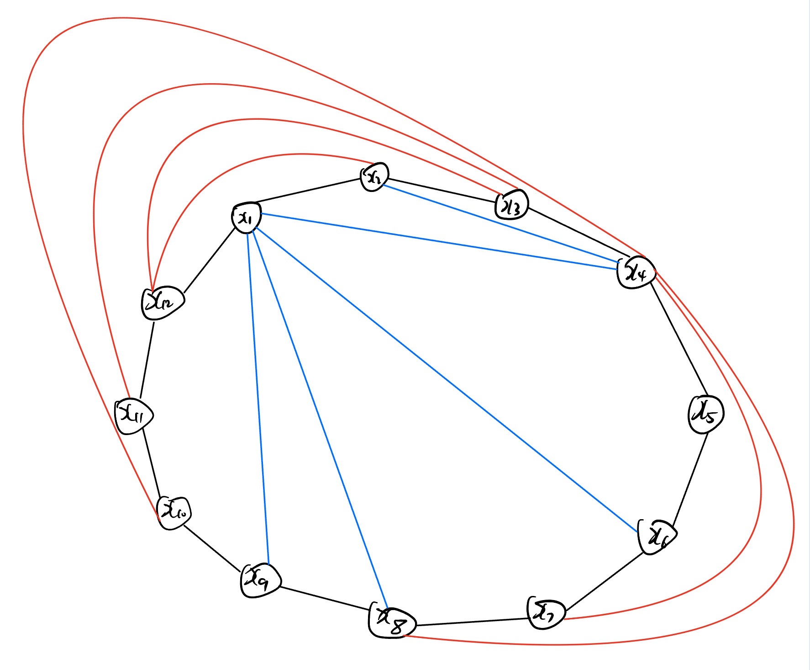
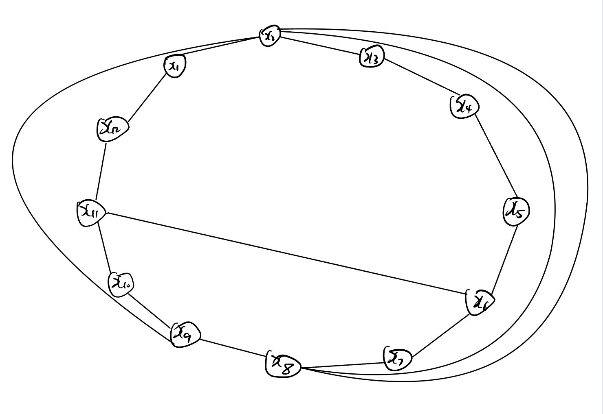

# Домашнее Задание 4

Вариант №122

|V/V|$e_1$|$e_2$|$e_3$|$e_4$|$e_5$|$e_6$|$e_7$|$e_8$|$e_9$|$e_{10}$|$e_{11}$|$e_{12}$|
|-|-|-|-|-|-|-|-|-|-|-|-|-|
|$e_1$|0| |3|1|4| |4| | |3|3| |
|$e_2$| |0|4|1|1| | |3| | | | |
|$e_3$|3|4|0|1|5| |1| |1|1| | |
|$e_4$|1|1|1|0| |1|2| |4| |2|2|
|$e_5$|4|1|5| |0| | |3| | | | |
|$e_6$| | | |1| |0| |3| |1|4| |
|$e_7$|4| |1|2| | |0| |1|4| | |
|$e_8$| |3| | |3|3| |0| | |4| |
|$e_9$| | |1|4| | |1| |0|1|4| |
|$e_{10}$|3| |1| | |1|4||1|0|5| |
|$e_{11}$|3| | |2| |4| |4|4|5|0|4|
|$e_{12}$| | | |2| | | | | | |4|0|

|V/V|$e_1$|$e_2$|$e_3$|$e_4$|$e_5$|$e_6$|$e_7$|$e_8$|$e_9$|$e_{10}$|$e_{11}$|$e_{12}$|
|-|-|-|-|-|-|-|-|-|-|-|-|-|
|$e_1$|0| |1|1|1| |1| | |1|1| |
|$e_2$| |0|1|1|1| | |1| | | | |
|$e_3$|1|1|0|1|1| |1| |1|1| | |
|$e_4$|1|1|1|0| |1|1| |1| |1|1|
|$e_5$|1|1|1| |0| | |1| | | | |
|$e_6$| | | |1| |0| |1| |1|1| |
|$e_7$|1| |1|1| | |0| |1|1| | |
|$e_8$| |1| | |1|1| |0| | |1| |
|$e_9$| | |1|1| | |1| |0|1|1| |
|$e_{10}$|1| |1| | |1|1| |1|0|1| |
|$e_{11}$|1| | |1| |1| |1|1|1|0|1|
|$e_{12}$| | | |1| | | | | | |1|0|

## Нахождение гамильтонова цикла
Включаем в S вершину x1. S={x1}
Возможная вершина: x3. S={x1,x3}
Возможная вершина: x2. S={x1,x3,x2}
Возможная вершина: x4. S={x1,x3,x2,x4}
Возможная вершина: x6. S={x1,x3,x2,x4,x6}
Возможная вершина: x8. S={x1,x3,x2,x4,x6,x8}
Возможная вершина: x5. S={x1,x3,x2,x4,x6,x8,x5}
У x5 больше нет возможных вершин, удалим ее. Перейдем к x8. S={x1,x3,x2,x4,x6,x8}
Возможная вершина: x11. S={x1,x3,x2,x4,x6,x8,x11}
Возможная вершина: x9. S={x1,x3,x2,x4,x6,x8,x11,x9}
Возможная вершина: x7. S={x1,x3,x2,x4,x6,x8,x11,x9,x7}
Возможная вершина: x10. S={x1,x3,x2,x4,x6,x8,x11,x9,x7,x10}
У x10 больше нет возможных вершин, удалим ее. Перейдем к x7. S={x1,x3,x2,x4,x6,x8,x11,x9,x7}
У x7 больше нет возможных вершин, удалим ее. Перейдем к x9. S={x1,x3,x2,x4,x6,x8,x11,x9}
Возможная вершина: x10. S={x1,x3,x2,x4,x6,x8,x11,x9,x10}
Возможная вершина: x7. S={x1,x3,x2,x4,x6,x8,x11,x9,x10,x7}
У x7 больше нет возможных вершин, удалим ее. Перейдем к x10. S={x1,x3,x2,x4,x6,x8,x11,x9,x10}
У x10 больше нет возможных вершин, удалим ее. Перейдем к x9. S={x1,x3,x2,x4,x6,x8,x11,x9}
У x9 больше нет возможных вершин, удалим ее. Перейдем к x11. S={x1,x3,x2,x4,x6,x8,x11}
Возможная вершина: x10. S={x1,x3,x2,x4,x6,x8,x11,x10}
Возможная вершина: x7. S={x1,x3,x2,x4,x6,x8,x11,x10,x7}
Возможная вершина: x9. S={x1,x3,x2,x4,x6,x8,x11,x10,x7,x9}
У x9 больше нет возможных вершин, удалим ее. Перейдем к x7. S={x1,x3,x2,x4,x6,x8,x11,x10,x7}
У x7 больше нет возможных вершин, удалим ее. Перейдем к x10. S={x1,x3,x2,x4,x6,x8,x11,x10}
Возможная вершина: x9. S={x1,x3,x2,x4,x6,x8,x11,x10,x9}
Возможная вершина: x7. S={x1,x3,x2,x4,x6,x8,x11,x10,x9,x7}
У x7 больше нет возможных вершин, удалим ее. Перейдем к x9. S={x1,x3,x2,x4,x6,x8,x11,x10,x9}
У x9 больше нет возможных вершин, удалим ее. Перейдем к x10. S={x1,x3,x2,x4,x6,x8,x11,x10}
У x10 больше нет возможных вершин, удалим ее. Перейдем к x11. S={x1,x3,x2,x4,x6,x8,x11}
Возможная вершина: x12. S={x1,x3,x2,x4,x6,x8,x11,x12}
У x12 больше нет возможных вершин, удалим ее. Перейдем к x11. S={x1,x3,x2,x4,x6,x8,x11}
У x11 больше нет возможных вершин, удалим ее. Перейдем к x8. S={x1,x3,x2,x4,x6,x8}
У x8 больше нет возможных вершин, удалим ее. Перейдем к x6. S={x1,x3,x2,x4,x6}
Возможная вершина: x10. S={x1,x3,x2,x4,x6,x10}
Возможная вершина: x7. S={x1,x3,x2,x4,x6,x10,x7}
Возможная вершина: x9. S={x1,x3,x2,x4,x6,x10,x7,x9}
Возможная вершина: x11. S={x1,x3,x2,x4,x6,x10,x7,x9,x11}
Возможная вершина: x8. S={x1,x3,x2,x4,x6,x10,x7,x9,x11,x8}
Возможная вершина: x5. S={x1,x3,x2,x4,x6,x10,x7,x9,x11,x8,x5}
У x5 больше нет возможных вершин, удалим ее. Перейдем к x8. S={x1,x3,x2,x4,x6,x10,x7,x9,x11,x8}
У x8 больше нет возможных вершин, удалим ее. Перейдем к x11. S={x1,x3,x2,x4,x6,x10,x7,x9,x11}
Возможная вершина: x12. S={x1,x3,x2,x4,x6,x10,x7,x9,x11,x12}
У x12 больше нет возможных вершин, удалим ее. Перейдем к x11. S={x1,x3,x2,x4,x6,x10,x7,x9,x11}
У x11 больше нет возможных вершин, удалим ее. Перейдем к x9. S={x1,x3,x2,x4,x6,x10,x7,x9}
У x9 больше нет возможных вершин, удалим ее. Перейдем к x7. S={x1,x3,x2,x4,x6,x10,x7}
У x7 больше нет возможных вершин, удалим ее. Перейдем к x10. S={x1,x3,x2,x4,x6,x10}
Возможная вершина: x9. S={x1,x3,x2,x4,x6,x10,x9}
Возможная вершина: x7. S={x1,x3,x2,x4,x6,x10,x9,x7}
У x7 больше нет возможных вершин, удалим ее. Перейдем к x9. S={x1,x3,x2,x4,x6,x10,x9}
Возможная вершина: x11. S={x1,x3,x2,x4,x6,x10,x9,x11}
Возможная вершина: x8. S={x1,x3,x2,x4,x6,x10,x9,x11,x8}
Возможная вершина: x5. S={x1,x3,x2,x4,x6,x10,x9,x11,x8,x5}
У x5 больше нет возможных вершин, удалим ее. Перейдем к x8. S={x1,x3,x2,x4,x6,x10,x9,x11,x8}
У x8 больше нет возможных вершин, удалим ее. Перейдем к x11. S={x1,x3,x2,x4,x6,x10,x9,x11}
Возможная вершина: x12. S={x1,x3,x2,x4,x6,x10,x9,x11,x12}
У x12 больше нет возможных вершин, удалим ее. Перейдем к x11. S={x1,x3,x2,x4,x6,x10,x9,x11}
У x11 больше нет возможных вершин, удалим ее. Перейдем к x9. S={x1,x3,x2,x4,x6,x10,x9}
У x9 больше нет возможных вершин, удалим ее. Перейдем к x10. S={x1,x3,x2,x4,x6,x10}
Возможная вершина: x11. S={x1,x3,x2,x4,x6,x10,x11}
Возможная вершина: x8. S={x1,x3,x2,x4,x6,x10,x11,x8}
Возможная вершина: x5. S={x1,x3,x2,x4,x6,x10,x11,x8,x5}
У x5 больше нет возможных вершин, удалим ее. Перейдем к x8. S={x1,x3,x2,x4,x6,x10,x11,x8}
У x8 больше нет возможных вершин, удалим ее. Перейдем к x11. S={x1,x3,x2,x4,x6,x10,x11}
Возможная вершина: x9. S={x1,x3,x2,x4,x6,x10,x11,x9}
Возможная вершина: x7. S={x1,x3,x2,x4,x6,x10,x11,x9,x7}
У x7 больше нет возможных вершин, удалим ее. Перейдем к x9. S={x1,x3,x2,x4,x6,x10,x11,x9}
У x9 больше нет возможных вершин, удалим ее. Перейдем к x11. S={x1,x3,x2,x4,x6,x10,x11}
Возможная вершина: x12. S={x1,x3,x2,x4,x6,x10,x11,x12}
У x12 больше нет возможных вершин, удалим ее. Перейдем к x11. S={x1,x3,x2,x4,x6,x10,x11}
У x11 больше нет возможных вершин, удалим ее. Перейдем к x10. S={x1,x3,x2,x4,x6,x10}
У x10 больше нет возможных вершин, удалим ее. Перейдем к x6. S={x1,x3,x2,x4,x6}
Возможная вершина: x11. S={x1,x3,x2,x4,x6,x11}
Возможная вершина: x8. S={x1,x3,x2,x4,x6,x11,x8}
Возможная вершина: x5. S={x1,x3,x2,x4,x6,x11,x8,x5}
У x5 больше нет возможных вершин, удалим ее. Перейдем к x8. S={x1,x3,x2,x4,x6,x11,x8}
У x8 больше нет возможных вершин, удалим ее. Перейдем к x11. S={x1,x3,x2,x4,x6,x11}
Возможная вершина: x9. S={x1,x3,x2,x4,x6,x11,x9}
Возможная вершина: x7. S={x1,x3,x2,x4,x6,x11,x9,x7}
Возможная вершина: x10. S={x1,x3,x2,x4,x6,x11,x9,x7,x10}
У x10 больше нет возможных вершин, удалим ее. Перейдем к x7. S={x1,x3,x2,x4,x6,x11,x9,x7}
У x7 больше нет возможных вершин, удалим ее. Перейдем к x9. S={x1,x3,x2,x4,x6,x11,x9}
Возможная вершина: x10. S={x1,x3,x2,x4,x6,x11,x9,x10}
Возможная вершина: x7. S={x1,x3,x2,x4,x6,x11,x9,x10,x7}
У x7 больше нет возможных вершин, удалим ее. Перейдем к x10. S={x1,x3,x2,x4,x6,x11,x9,x10}
У x10 больше нет возможных вершин, удалим ее. Перейдем к x9. S={x1,x3,x2,x4,x6,x11,x9}
У x9 больше нет возможных вершин, удалим ее. Перейдем к x11. S={x1,x3,x2,x4,x6,x11}
Возможная вершина: x10. S={x1,x3,x2,x4,x6,x11,x10}
Возможная вершина: x7. S={x1,x3,x2,x4,x6,x11,x10,x7}
Возможная вершина: x9. S={x1,x3,x2,x4,x6,x11,x10,x7,x9}
У x9 больше нет возможных вершин, удалим ее. Перейдем к x7. S={x1,x3,x2,x4,x6,x11,x10,x7}
У x7 больше нет возможных вершин, удалим ее. Перейдем к x10. S={x1,x3,x2,x4,x6,x11,x10}
Возможная вершина: x9. S={x1,x3,x2,x4,x6,x11,x10,x9}
Возможная вершина: x7. S={x1,x3,x2,x4,x6,x11,x10,x9,x7}
У x7 больше нет возможных вершин, удалим ее. Перейдем к x9. S={x1,x3,x2,x4,x6,x11,x10,x9}
У x9 больше нет возможных вершин, удалим ее. Перейдем к x10. S={x1,x3,x2,x4,x6,x11,x10}
У x10 больше нет возможных вершин, удалим ее. Перейдем к x11. S={x1,x3,x2,x4,x6,x11}
Возможная вершина: x12. S={x1,x3,x2,x4,x6,x11,x12}
У x12 больше нет возможных вершин, удалим ее. Перейдем к x11. S={x1,x3,x2,x4,x6,x11}
У x11 больше нет возможных вершин, удалим ее. Перейдем к x6. S={x1,x3,x2,x4,x6}
У x6 больше нет возможных вершин, удалим ее. Перейдем к x4. S={x1,x3,x2,x4}
Возможная вершина: x7. S={x1,x3,x2,x4,x7}
Возможная вершина: x9. S={x1,x3,x2,x4,x7,x9}
Возможная вершина: x10. S={x1,x3,x2,x4,x7,x9,x10}
Возможная вершина: x6. S={x1,x3,x2,x4,x7,x9,x10,x6}
Возможная вершина: x8. S={x1,x3,x2,x4,x7,x9,x10,x6,x8}
Возможная вершина: x5. S={x1,x3,x2,x4,x7,x9,x10,x6,x8,x5}
У x5 больше нет возможных вершин, удалим ее. Перейдем к x8. S={x1,x3,x2,x4,x7,x9,x10,x6,x8}
Возможная вершина: x11. S={x1,x3,x2,x4,x7,x9,x10,x6,x8,x11}
Возможная вершина: x12. S={x1,x3,x2,x4,x7,x9,x10,x6,x8,x11,x12}
У x12 больше нет возможных вершин, удалим ее. Перейдем к x11. S={x1,x3,x2,x4,x7,x9,x10,x6,x8,x11}
У x11 больше нет возможных вершин, удалим ее. Перейдем к x8. S={x1,x3,x2,x4,x7,x9,x10,x6,x8}
У x8 больше нет возможных вершин, удалим ее. Перейдем к x6. S={x1,x3,x2,x4,x7,x9,x10,x6}
Возможная вершина: x11. S={x1,x3,x2,x4,x7,x9,x10,x6,x11}
Возможная вершина: x8. S={x1,x3,x2,x4,x7,x9,x10,x6,x11,x8}
Возможная вершина: x5. S={x1,x3,x2,x4,x7,x9,x10,x6,x11,x8,x5}
У x5 больше нет возможных вершин, удалим ее. Перейдем к x8. S={x1,x3,x2,x4,x7,x9,x10,x6,x11,x8}
У x8 больше нет возможных вершин, удалим ее. Перейдем к x11. S={x1,x3,x2,x4,x7,x9,x10,x6,x11}
Возможная вершина: x12. S={x1,x3,x2,x4,x7,x9,x10,x6,x11,x12}
У x12 больше нет возможных вершин, удалим ее. Перейдем к x11. S={x1,x3,x2,x4,x7,x9,x10,x6,x11}
У x11 больше нет возможных вершин, удалим ее. Перейдем к x6. S={x1,x3,x2,x4,x7,x9,x10,x6}
У x6 больше нет возможных вершин, удалим ее. Перейдем к x10. S={x1,x3,x2,x4,x7,x9,x10}
Возможная вершина: x11. S={x1,x3,x2,x4,x7,x9,x10,x11}
Возможная вершина: x6. S={x1,x3,x2,x4,x7,x9,x10,x11,x6}
Возможная вершина: x8. S={x1,x3,x2,x4,x7,x9,x10,x11,x6,x8}
Возможная вершина: x5. S={x1,x3,x2,x4,x7,x9,x10,x11,x6,x8,x5}
У x5 больше нет возможных вершин, удалим ее. Перейдем к x8. S={x1,x3,x2,x4,x7,x9,x10,x11,x6,x8}
У x8 больше нет возможных вершин, удалим ее. Перейдем к x6. S={x1,x3,x2,x4,x7,x9,x10,x11,x6}
У x6 больше нет возможных вершин, удалим ее. Перейдем к x11. S={x1,x3,x2,x4,x7,x9,x10,x11}
Возможная вершина: x8. S={x1,x3,x2,x4,x7,x9,x10,x11,x8}
Возможная вершина: x5. S={x1,x3,x2,x4,x7,x9,x10,x11,x8,x5}
У x5 больше нет возможных вершин, удалим ее. Перейдем к x8. S={x1,x3,x2,x4,x7,x9,x10,x11,x8}
Возможная вершина: x6. S={x1,x3,x2,x4,x7,x9,x10,x11,x8,x6}
У x6 больше нет возможных вершин, удалим ее. Перейдем к x8. S={x1,x3,x2,x4,x7,x9,x10,x11,x8}
У x8 больше нет возможных вершин, удалим ее. Перейдем к x11. S={x1,x3,x2,x4,x7,x9,x10,x11}
Возможная вершина: x12. S={x1,x3,x2,x4,x7,x9,x10,x11,x12}
У x12 больше нет возможных вершин, удалим ее. Перейдем к x11. S={x1,x3,x2,x4,x7,x9,x10,x11}
У x11 больше нет возможных вершин, удалим ее. Перейдем к x10. S={x1,x3,x2,x4,x7,x9,x10}
У x10 больше нет возможных вершин, удалим ее. Перейдем к x9. S={x1,x3,x2,x4,x7,x9}
Возможная вершина: x11. S={x1,x3,x2,x4,x7,x9,x11}
Возможная вершина: x6. S={x1,x3,x2,x4,x7,x9,x11,x6}
Возможная вершина: x8. S={x1,x3,x2,x4,x7,x9,x11,x6,x8}
Возможная вершина: x5. S={x1,x3,x2,x4,x7,x9,x11,x6,x8,x5}
У x5 больше нет возможных вершин, удалим ее. Перейдем к x8. S={x1,x3,x2,x4,x7,x9,x11,x6,x8}
У x8 больше нет возможных вершин, удалим ее. Перейдем к x6. S={x1,x3,x2,x4,x7,x9,x11,x6}
Возможная вершина: x10. S={x1,x3,x2,x4,x7,x9,x11,x6,x10}
У x10 больше нет возможных вершин, удалим ее. Перейдем к x6. S={x1,x3,x2,x4,x7,x9,x11,x6}
У x6 больше нет возможных вершин, удалим ее. Перейдем к x11. S={x1,x3,x2,x4,x7,x9,x11}
Возможная вершина: x8. S={x1,x3,x2,x4,x7,x9,x11,x8}
Возможная вершина: x5. S={x1,x3,x2,x4,x7,x9,x11,x8,x5}
У x5 больше нет возможных вершин, удалим ее. Перейдем к x8. S={x1,x3,x2,x4,x7,x9,x11,x8}
Возможная вершина: x6. S={x1,x3,x2,x4,x7,x9,x11,x8,x6}
Возможная вершина: x10. S={x1,x3,x2,x4,x7,x9,x11,x8,x6,x10}
У x10 больше нет возможных вершин, удалим ее. Перейдем к x6. S={x1,x3,x2,x4,x7,x9,x11,x8,x6}
У x6 больше нет возможных вершин, удалим ее. Перейдем к x8. S={x1,x3,x2,x4,x7,x9,x11,x8}
У x8 больше нет возможных вершин, удалим ее. Перейдем к x11. S={x1,x3,x2,x4,x7,x9,x11}
Возможная вершина: x10. S={x1,x3,x2,x4,x7,x9,x11,x10}
Возможная вершина: x6. S={x1,x3,x2,x4,x7,x9,x11,x10,x6}
Возможная вершина: x8. S={x1,x3,x2,x4,x7,x9,x11,x10,x6,x8}
Возможная вершина: x5. S={x1,x3,x2,x4,x7,x9,x11,x10,x6,x8,x5}
У x5 больше нет возможных вершин, удалим ее. Перейдем к x8. S={x1,x3,x2,x4,x7,x9,x11,x10,x6,x8}
У x8 больше нет возможных вершин, удалим ее. Перейдем к x6. S={x1,x3,x2,x4,x7,x9,x11,x10,x6}
У x6 больше нет возможных вершин, удалим ее. Перейдем к x10. S={x1,x3,x2,x4,x7,x9,x11,x10}
У x10 больше нет возможных вершин, удалим ее. Перейдем к x11. S={x1,x3,x2,x4,x7,x9,x11}
Возможная вершина: x12. S={x1,x3,x2,x4,x7,x9,x11,x12}
У x12 больше нет возможных вершин, удалим ее. Перейдем к x11. S={x1,x3,x2,x4,x7,x9,x11}
У x11 больше нет возможных вершин, удалим ее. Перейдем к x9. S={x1,x3,x2,x4,x7,x9}
У x9 больше нет возможных вершин, удалим ее. Перейдем к x7. S={x1,x3,x2,x4,x7}
Возможная вершина: x10. S={x1,x3,x2,x4,x7,x10}
Возможная вершина: x6. S={x1,x3,x2,x4,x7,x10,x6}
Возможная вершина: x8. S={x1,x3,x2,x4,x7,x10,x6,x8}
Возможная вершина: x5. S={x1,x3,x2,x4,x7,x10,x6,x8,x5}
У x5 больше нет возможных вершин, удалим ее. Перейдем к x8. S={x1,x3,x2,x4,x7,x10,x6,x8}
Возможная вершина: x11. S={x1,x3,x2,x4,x7,x10,x6,x8,x11}
Возможная вершина: x9. S={x1,x3,x2,x4,x7,x10,x6,x8,x11,x9}
У x9 больше нет возможных вершин, удалим ее. Перейдем к x11. S={x1,x3,x2,x4,x7,x10,x6,x8,x11}
Возможная вершина: x12. S={x1,x3,x2,x4,x7,x10,x6,x8,x11,x12}
У x12 больше нет возможных вершин, удалим ее. Перейдем к x11. S={x1,x3,x2,x4,x7,x10,x6,x8,x11}
У x11 больше нет возможных вершин, удалим ее. Перейдем к x8. S={x1,x3,x2,x4,x7,x10,x6,x8}
У x8 больше нет возможных вершин, удалим ее. Перейдем к x6. S={x1,x3,x2,x4,x7,x10,x6}
Возможная вершина: x11. S={x1,x3,x2,x4,x7,x10,x6,x11}
Возможная вершина: x8. S={x1,x3,x2,x4,x7,x10,x6,x11,x8}
Возможная вершина: x5. S={x1,x3,x2,x4,x7,x10,x6,x11,x8,x5}
У x5 больше нет возможных вершин, удалим ее. Перейдем к x8. S={x1,x3,x2,x4,x7,x10,x6,x11,x8}
У x8 больше нет возможных вершин, удалим ее. Перейдем к x11. S={x1,x3,x2,x4,x7,x10,x6,x11}
Возможная вершина: x9. S={x1,x3,x2,x4,x7,x10,x6,x11,x9}
У x9 больше нет возможных вершин, удалим ее. Перейдем к x11. S={x1,x3,x2,x4,x7,x10,x6,x11}
Возможная вершина: x12. S={x1,x3,x2,x4,x7,x10,x6,x11,x12}
У x12 больше нет возможных вершин, удалим ее. Перейдем к x11. S={x1,x3,x2,x4,x7,x10,x6,x11}
У x11 больше нет возможных вершин, удалим ее. Перейдем к x6. S={x1,x3,x2,x4,x7,x10,x6}
У x6 больше нет возможных вершин, удалим ее. Перейдем к x10. S={x1,x3,x2,x4,x7,x10}
Возможная вершина: x9. S={x1,x3,x2,x4,x7,x10,x9}
Возможная вершина: x11. S={x1,x3,x2,x4,x7,x10,x9,x11}
Возможная вершина: x6. S={x1,x3,x2,x4,x7,x10,x9,x11,x6}
Возможная вершина: x8. S={x1,x3,x2,x4,x7,x10,x9,x11,x6,x8}
Возможная вершина: x5. S={x1,x3,x2,x4,x7,x10,x9,x11,x6,x8,x5}
У x5 больше нет возможных вершин, удалим ее. Перейдем к x8. S={x1,x3,x2,x4,x7,x10,x9,x11,x6,x8}
У x8 больше нет возможных вершин, удалим ее. Перейдем к x6. S={x1,x3,x2,x4,x7,x10,x9,x11,x6}
У x6 больше нет возможных вершин, удалим ее. Перейдем к x11. S={x1,x3,x2,x4,x7,x10,x9,x11}
Возможная вершина: x8. S={x1,x3,x2,x4,x7,x10,x9,x11,x8}
Возможная вершина: x5. S={x1,x3,x2,x4,x7,x10,x9,x11,x8,x5}
У x5 больше нет возможных вершин, удалим ее. Перейдем к x8. S={x1,x3,x2,x4,x7,x10,x9,x11,x8}
Возможная вершина: x6. S={x1,x3,x2,x4,x7,x10,x9,x11,x8,x6}
У x6 больше нет возможных вершин, удалим ее. Перейдем к x8. S={x1,x3,x2,x4,x7,x10,x9,x11,x8}
У x8 больше нет возможных вершин, удалим ее. Перейдем к x11. S={x1,x3,x2,x4,x7,x10,x9,x11}
Возможная вершина: x12. S={x1,x3,x2,x4,x7,x10,x9,x11,x12}
У x12 больше нет возможных вершин, удалим ее. Перейдем к x11. S={x1,x3,x2,x4,x7,x10,x9,x11}
У x11 больше нет возможных вершин, удалим ее. Перейдем к x9. S={x1,x3,x2,x4,x7,x10,x9}
У x9 больше нет возможных вершин, удалим ее. Перейдем к x10. S={x1,x3,x2,x4,x7,x10}
Возможная вершина: x11. S={x1,x3,x2,x4,x7,x10,x11}
Возможная вершина: x6. S={x1,x3,x2,x4,x7,x10,x11,x6}
Возможная вершина: x8. S={x1,x3,x2,x4,x7,x10,x11,x6,x8}
Возможная вершина: x5. S={x1,x3,x2,x4,x7,x10,x11,x6,x8,x5}
У x5 больше нет возможных вершин, удалим ее. Перейдем к x8. S={x1,x3,x2,x4,x7,x10,x11,x6,x8}
У x8 больше нет возможных вершин, удалим ее. Перейдем к x6. S={x1,x3,x2,x4,x7,x10,x11,x6}
У x6 больше нет возможных вершин, удалим ее. Перейдем к x11. S={x1,x3,x2,x4,x7,x10,x11}
Возможная вершина: x8. S={x1,x3,x2,x4,x7,x10,x11,x8}
Возможная вершина: x5. S={x1,x3,x2,x4,x7,x10,x11,x8,x5}
У x5 больше нет возможных вершин, удалим ее. Перейдем к x8. S={x1,x3,x2,x4,x7,x10,x11,x8}
Возможная вершина: x6. S={x1,x3,x2,x4,x7,x10,x11,x8,x6}
У x6 больше нет возможных вершин, удалим ее. Перейдем к x8. S={x1,x3,x2,x4,x7,x10,x11,x8}
У x8 больше нет возможных вершин, удалим ее. Перейдем к x11. S={x1,x3,x2,x4,x7,x10,x11}
Возможная вершина: x9. S={x1,x3,x2,x4,x7,x10,x11,x9}
У x9 больше нет возможных вершин, удалим ее. Перейдем к x11. S={x1,x3,x2,x4,x7,x10,x11}
Возможная вершина: x12. S={x1,x3,x2,x4,x7,x10,x11,x12}
У x12 больше нет возможных вершин, удалим ее. Перейдем к x11. S={x1,x3,x2,x4,x7,x10,x11}
У x11 больше нет возможных вершин, удалим ее. Перейдем к x10. S={x1,x3,x2,x4,x7,x10}
У x10 больше нет возможных вершин, удалим ее. Перейдем к x7. S={x1,x3,x2,x4,x7}
У x7 больше нет возможных вершин, удалим ее. Перейдем к x4. S={x1,x3,x2,x4}
Возможная вершина: x9. S={x1,x3,x2,x4,x9}
Возможная вершина: x7. S={x1,x3,x2,x4,x9,x7}
Возможная вершина: x10. S={x1,x3,x2,x4,x9,x7,x10}
Возможная вершина: x6. S={x1,x3,x2,x4,x9,x7,x10,x6}
Возможная вершина: x8. S={x1,x3,x2,x4,x9,x7,x10,x6,x8}
Возможная вершина: x5. S={x1,x3,x2,x4,x9,x7,x10,x6,x8,x5}
У x5 больше нет возможных вершин, удалим ее. Перейдем к x8. S={x1,x3,x2,x4,x9,x7,x10,x6,x8}
Возможная вершина: x11. S={x1,x3,x2,x4,x9,x7,x10,x6,x8,x11}
Возможная вершина: x12. S={x1,x3,x2,x4,x9,x7,x10,x6,x8,x11,x12}
У x12 больше нет возможных вершин, удалим ее. Перейдем к x11. S={x1,x3,x2,x4,x9,x7,x10,x6,x8,x11}
У x11 больше нет возможных вершин, удалим ее. Перейдем к x8. S={x1,x3,x2,x4,x9,x7,x10,x6,x8}
У x8 больше нет возможных вершин, удалим ее. Перейдем к x6. S={x1,x3,x2,x4,x9,x7,x10,x6}
Возможная вершина: x11. S={x1,x3,x2,x4,x9,x7,x10,x6,x11}
Возможная вершина: x8. S={x1,x3,x2,x4,x9,x7,x10,x6,x11,x8}
Возможная вершина: x5. S={x1,x3,x2,x4,x9,x7,x10,x6,x11,x8,x5}
У x5 больше нет возможных вершин, удалим ее. Перейдем к x8. S={x1,x3,x2,x4,x9,x7,x10,x6,x11,x8}
У x8 больше нет возможных вершин, удалим ее. Перейдем к x11. S={x1,x3,x2,x4,x9,x7,x10,x6,x11}
Возможная вершина: x12. S={x1,x3,x2,x4,x9,x7,x10,x6,x11,x12}
У x12 больше нет возможных вершин, удалим ее. Перейдем к x11. S={x1,x3,x2,x4,x9,x7,x10,x6,x11}
У x11 больше нет возможных вершин, удалим ее. Перейдем к x6. S={x1,x3,x2,x4,x9,x7,x10,x6}
У x6 больше нет возможных вершин, удалим ее. Перейдем к x10. S={x1,x3,x2,x4,x9,x7,x10}
Возможная вершина: x11. S={x1,x3,x2,x4,x9,x7,x10,x11}
Возможная вершина: x6. S={x1,x3,x2,x4,x9,x7,x10,x11,x6}
Возможная вершина: x8. S={x1,x3,x2,x4,x9,x7,x10,x11,x6,x8}
Возможная вершина: x5. S={x1,x3,x2,x4,x9,x7,x10,x11,x6,x8,x5}
У x5 больше нет возможных вершин, удалим ее. Перейдем к x8. S={x1,x3,x2,x4,x9,x7,x10,x11,x6,x8}
У x8 больше нет возможных вершин, удалим ее. Перейдем к x6. S={x1,x3,x2,x4,x9,x7,x10,x11,x6}
У x6 больше нет возможных вершин, удалим ее. Перейдем к x11. S={x1,x3,x2,x4,x9,x7,x10,x11}
Возможная вершина: x8. S={x1,x3,x2,x4,x9,x7,x10,x11,x8}
Возможная вершина: x5. S={x1,x3,x2,x4,x9,x7,x10,x11,x8,x5}
У x5 больше нет возможных вершин, удалим ее. Перейдем к x8. S={x1,x3,x2,x4,x9,x7,x10,x11,x8}
Возможная вершина: x6. S={x1,x3,x2,x4,x9,x7,x10,x11,x8,x6}
У x6 больше нет возможных вершин, удалим ее. Перейдем к x8. S={x1,x3,x2,x4,x9,x7,x10,x11,x8}
У x8 больше нет возможных вершин, удалим ее. Перейдем к x11. S={x1,x3,x2,x4,x9,x7,x10,x11}
Возможная вершина: x12. S={x1,x3,x2,x4,x9,x7,x10,x11,x12}
У x12 больше нет возможных вершин, удалим ее. Перейдем к x11. S={x1,x3,x2,x4,x9,x7,x10,x11}
У x11 больше нет возможных вершин, удалим ее. Перейдем к x10. S={x1,x3,x2,x4,x9,x7,x10}
У x10 больше нет возможных вершин, удалим ее. Перейдем к x7. S={x1,x3,x2,x4,x9,x7}
У x7 больше нет возможных вершин, удалим ее. Перейдем к x9. S={x1,x3,x2,x4,x9}
Возможная вершина: x10. S={x1,x3,x2,x4,x9,x10}
Возможная вершина: x6. S={x1,x3,x2,x4,x9,x10,x6}
Возможная вершина: x8. S={x1,x3,x2,x4,x9,x10,x6,x8}
Возможная вершина: x5. S={x1,x3,x2,x4,x9,x10,x6,x8,x5}
У x5 больше нет возможных вершин, удалим ее. Перейдем к x8. S={x1,x3,x2,x4,x9,x10,x6,x8}
Возможная вершина: x11. S={x1,x3,x2,x4,x9,x10,x6,x8,x11}
Возможная вершина: x12. S={x1,x3,x2,x4,x9,x10,x6,x8,x11,x12}
У x12 больше нет возможных вершин, удалим ее. Перейдем к x11. S={x1,x3,x2,x4,x9,x10,x6,x8,x11}
У x11 больше нет возможных вершин, удалим ее. Перейдем к x8. S={x1,x3,x2,x4,x9,x10,x6,x8}
У x8 больше нет возможных вершин, удалим ее. Перейдем к x6. S={x1,x3,x2,x4,x9,x10,x6}
Возможная вершина: x11. S={x1,x3,x2,x4,x9,x10,x6,x11}
Возможная вершина: x8. S={x1,x3,x2,x4,x9,x10,x6,x11,x8}
Возможная вершина: x5. S={x1,x3,x2,x4,x9,x10,x6,x11,x8,x5}
У x5 больше нет возможных вершин, удалим ее. Перейдем к x8. S={x1,x3,x2,x4,x9,x10,x6,x11,x8}
У x8 больше нет возможных вершин, удалим ее. Перейдем к x11. S={x1,x3,x2,x4,x9,x10,x6,x11}
Возможная вершина: x12. S={x1,x3,x2,x4,x9,x10,x6,x11,x12}
У x12 больше нет возможных вершин, удалим ее. Перейдем к x11. S={x1,x3,x2,x4,x9,x10,x6,x11}
У x11 больше нет возможных вершин, удалим ее. Перейдем к x6. S={x1,x3,x2,x4,x9,x10,x6}
У x6 больше нет возможных вершин, удалим ее. Перейдем к x10. S={x1,x3,x2,x4,x9,x10}
Возможная вершина: x7. S={x1,x3,x2,x4,x9,x10,x7}
У x7 больше нет возможных вершин, удалим ее. Перейдем к x10. S={x1,x3,x2,x4,x9,x10}
Возможная вершина: x11. S={x1,x3,x2,x4,x9,x10,x11}
Возможная вершина: x6. S={x1,x3,x2,x4,x9,x10,x11,x6}
Возможная вершина: x8. S={x1,x3,x2,x4,x9,x10,x11,x6,x8}
Возможная вершина: x5. S={x1,x3,x2,x4,x9,x10,x11,x6,x8,x5}
У x5 больше нет возможных вершин, удалим ее. Перейдем к x8. S={x1,x3,x2,x4,x9,x10,x11,x6,x8}
У x8 больше нет возможных вершин, удалим ее. Перейдем к x6. S={x1,x3,x2,x4,x9,x10,x11,x6}
У x6 больше нет возможных вершин, удалим ее. Перейдем к x11. S={x1,x3,x2,x4,x9,x10,x11}
Возможная вершина: x8. S={x1,x3,x2,x4,x9,x10,x11,x8}
Возможная вершина: x5. S={x1,x3,x2,x4,x9,x10,x11,x8,x5}
У x5 больше нет возможных вершин, удалим ее. Перейдем к x8. S={x1,x3,x2,x4,x9,x10,x11,x8}
Возможная вершина: x6. S={x1,x3,x2,x4,x9,x10,x11,x8,x6}
У x6 больше нет возможных вершин, удалим ее. Перейдем к x8. S={x1,x3,x2,x4,x9,x10,x11,x8}
У x8 больше нет возможных вершин, удалим ее. Перейдем к x11. S={x1,x3,x2,x4,x9,x10,x11}
Возможная вершина: x12. S={x1,x3,x2,x4,x9,x10,x11,x12}
У x12 больше нет возможных вершин, удалим ее. Перейдем к x11. S={x1,x3,x2,x4,x9,x10,x11}
У x11 больше нет возможных вершин, удалим ее. Перейдем к x10. S={x1,x3,x2,x4,x9,x10}
У x10 больше нет возможных вершин, удалим ее. Перейдем к x9. S={x1,x3,x2,x4,x9}
Возможная вершина: x11. S={x1,x3,x2,x4,x9,x11}
Возможная вершина: x6. S={x1,x3,x2,x4,x9,x11,x6}
Возможная вершина: x8. S={x1,x3,x2,x4,x9,x11,x6,x8}
Возможная вершина: x5. S={x1,x3,x2,x4,x9,x11,x6,x8,x5}
У x5 больше нет возможных вершин, удалим ее. Перейдем к x8. S={x1,x3,x2,x4,x9,x11,x6,x8}
У x8 больше нет возможных вершин, удалим ее. Перейдем к x6. S={x1,x3,x2,x4,x9,x11,x6}
Возможная вершина: x10. S={x1,x3,x2,x4,x9,x11,x6,x10}
Возможная вершина: x7. S={x1,x3,x2,x4,x9,x11,x6,x10,x7}
У x7 больше нет возможных вершин, удалим ее. Перейдем к x10. S={x1,x3,x2,x4,x9,x11,x6,x10}
У x10 больше нет возможных вершин, удалим ее. Перейдем к x6. S={x1,x3,x2,x4,x9,x11,x6}
У x6 больше нет возможных вершин, удалим ее. Перейдем к x11. S={x1,x3,x2,x4,x9,x11}
Возможная вершина: x8. S={x1,x3,x2,x4,x9,x11,x8}
Возможная вершина: x5. S={x1,x3,x2,x4,x9,x11,x8,x5}
У x5 больше нет возможных вершин, удалим ее. Перейдем к x8. S={x1,x3,x2,x4,x9,x11,x8}
Возможная вершина: x6. S={x1,x3,x2,x4,x9,x11,x8,x6}
Возможная вершина: x10. S={x1,x3,x2,x4,x9,x11,x8,x6,x10}
Возможная вершина: x7. S={x1,x3,x2,x4,x9,x11,x8,x6,x10,x7}
У x7 больше нет возможных вершин, удалим ее. Перейдем к x10. S={x1,x3,x2,x4,x9,x11,x8,x6,x10}
У x10 больше нет возможных вершин, удалим ее. Перейдем к x6. S={x1,x3,x2,x4,x9,x11,x8,x6}
У x6 больше нет возможных вершин, удалим ее. Перейдем к x8. S={x1,x3,x2,x4,x9,x11,x8}
У x8 больше нет возможных вершин, удалим ее. Перейдем к x11. S={x1,x3,x2,x4,x9,x11}
Возможная вершина: x10. S={x1,x3,x2,x4,x9,x11,x10}
Возможная вершина: x6. S={x1,x3,x2,x4,x9,x11,x10,x6}
Возможная вершина: x8. S={x1,x3,x2,x4,x9,x11,x10,x6,x8}
Возможная вершина: x5. S={x1,x3,x2,x4,x9,x11,x10,x6,x8,x5}
У x5 больше нет возможных вершин, удалим ее. Перейдем к x8. S={x1,x3,x2,x4,x9,x11,x10,x6,x8}
У x8 больше нет возможных вершин, удалим ее. Перейдем к x6. S={x1,x3,x2,x4,x9,x11,x10,x6}
У x6 больше нет возможных вершин, удалим ее. Перейдем к x10. S={x1,x3,x2,x4,x9,x11,x10}
Возможная вершина: x7. S={x1,x3,x2,x4,x9,x11,x10,x7}
У x7 больше нет возможных вершин, удалим ее. Перейдем к x10. S={x1,x3,x2,x4,x9,x11,x10}
У x10 больше нет возможных вершин, удалим ее. Перейдем к x11. S={x1,x3,x2,x4,x9,x11}
Возможная вершина: x12. S={x1,x3,x2,x4,x9,x11,x12}
У x12 больше нет возможных вершин, удалим ее. Перейдем к x11. S={x1,x3,x2,x4,x9,x11}
У x11 больше нет возможных вершин, удалим ее. Перейдем к x9. S={x1,x3,x2,x4,x9}
У x9 больше нет возможных вершин, удалим ее. Перейдем к x4. S={x1,x3,x2,x4}
Возможная вершина: x11. S={x1,x3,x2,x4,x11}
Возможная вершина: x6. S={x1,x3,x2,x4,x11,x6}
Возможная вершина: x8. S={x1,x3,x2,x4,x11,x6,x8}
Возможная вершина: x5. S={x1,x3,x2,x4,x11,x6,x8,x5}
У x5 больше нет возможных вершин, удалим ее. Перейдем к x8. S={x1,x3,x2,x4,x11,x6,x8}
У x8 больше нет возможных вершин, удалим ее. Перейдем к x6. S={x1,x3,x2,x4,x11,x6}
Возможная вершина: x10. S={x1,x3,x2,x4,x11,x6,x10}
Возможная вершина: x7. S={x1,x3,x2,x4,x11,x6,x10,x7}
Возможная вершина: x9. S={x1,x3,x2,x4,x11,x6,x10,x7,x9}
У x9 больше нет возможных вершин, удалим ее. Перейдем к x7. S={x1,x3,x2,x4,x11,x6,x10,x7}
У x7 больше нет возможных вершин, удалим ее. Перейдем к x10. S={x1,x3,x2,x4,x11,x6,x10}
Возможная вершина: x9. S={x1,x3,x2,x4,x11,x6,x10,x9}
Возможная вершина: x7. S={x1,x3,x2,x4,x11,x6,x10,x9,x7}
У x7 больше нет возможных вершин, удалим ее. Перейдем к x9. S={x1,x3,x2,x4,x11,x6,x10,x9}
У x9 больше нет возможных вершин, удалим ее. Перейдем к x10. S={x1,x3,x2,x4,x11,x6,x10}
У x10 больше нет возможных вершин, удалим ее. Перейдем к x6. S={x1,x3,x2,x4,x11,x6}
У x6 больше нет возможных вершин, удалим ее. Перейдем к x11. S={x1,x3,x2,x4,x11}
Возможная вершина: x8. S={x1,x3,x2,x4,x11,x8}
Возможная вершина: x5. S={x1,x3,x2,x4,x11,x8,x5}
У x5 больше нет возможных вершин, удалим ее. Перейдем к x8. S={x1,x3,x2,x4,x11,x8}
Возможная вершина: x6. S={x1,x3,x2,x4,x11,x8,x6}
Возможная вершина: x10. S={x1,x3,x2,x4,x11,x8,x6,x10}
Возможная вершина: x7. S={x1,x3,x2,x4,x11,x8,x6,x10,x7}
Возможная вершина: x9. S={x1,x3,x2,x4,x11,x8,x6,x10,x7,x9}
У x9 больше нет возможных вершин, удалим ее. Перейдем к x7. S={x1,x3,x2,x4,x11,x8,x6,x10,x7}
У x7 больше нет возможных вершин, удалим ее. Перейдем к x10. S={x1,x3,x2,x4,x11,x8,x6,x10}
Возможная вершина: x9. S={x1,x3,x2,x4,x11,x8,x6,x10,x9}
Возможная вершина: x7. S={x1,x3,x2,x4,x11,x8,x6,x10,x9,x7}
У x7 больше нет возможных вершин, удалим ее. Перейдем к x9. S={x1,x3,x2,x4,x11,x8,x6,x10,x9}
У x9 больше нет возможных вершин, удалим ее. Перейдем к x10. S={x1,x3,x2,x4,x11,x8,x6,x10}
У x10 больше нет возможных вершин, удалим ее. Перейдем к x6. S={x1,x3,x2,x4,x11,x8,x6}
У x6 больше нет возможных вершин, удалим ее. Перейдем к x8. S={x1,x3,x2,x4,x11,x8}
У x8 больше нет возможных вершин, удалим ее. Перейдем к x11. S={x1,x3,x2,x4,x11}
Возможная вершина: x9. S={x1,x3,x2,x4,x11,x9}
Возможная вершина: x7. S={x1,x3,x2,x4,x11,x9,x7}
Возможная вершина: x10. S={x1,x3,x2,x4,x11,x9,x7,x10}
Возможная вершина: x6. S={x1,x3,x2,x4,x11,x9,x7,x10,x6}
Возможная вершина: x8. S={x1,x3,x2,x4,x11,x9,x7,x10,x6,x8}
Возможная вершина: x5. S={x1,x3,x2,x4,x11,x9,x7,x10,x6,x8,x5}
У x5 больше нет возможных вершин, удалим ее. Перейдем к x8. S={x1,x3,x2,x4,x11,x9,x7,x10,x6,x8}
У x8 больше нет возможных вершин, удалим ее. Перейдем к x6. S={x1,x3,x2,x4,x11,x9,x7,x10,x6}
У x6 больше нет возможных вершин, удалим ее. Перейдем к x10. S={x1,x3,x2,x4,x11,x9,x7,x10}
У x10 больше нет возможных вершин, удалим ее. Перейдем к x7. S={x1,x3,x2,x4,x11,x9,x7}
У x7 больше нет возможных вершин, удалим ее. Перейдем к x9. S={x1,x3,x2,x4,x11,x9}
Возможная вершина: x10. S={x1,x3,x2,x4,x11,x9,x10}
Возможная вершина: x6. S={x1,x3,x2,x4,x11,x9,x10,x6}
Возможная вершина: x8. S={x1,x3,x2,x4,x11,x9,x10,x6,x8}
Возможная вершина: x5. S={x1,x3,x2,x4,x11,x9,x10,x6,x8,x5}
У x5 больше нет возможных вершин, удалим ее. Перейдем к x8. S={x1,x3,x2,x4,x11,x9,x10,x6,x8}
У x8 больше нет возможных вершин, удалим ее. Перейдем к x6. S={x1,x3,x2,x4,x11,x9,x10,x6}
У x6 больше нет возможных вершин, удалим ее. Перейдем к x10. S={x1,x3,x2,x4,x11,x9,x10}
Возможная вершина: x7. S={x1,x3,x2,x4,x11,x9,x10,x7}
У x7 больше нет возможных вершин, удалим ее. Перейдем к x10. S={x1,x3,x2,x4,x11,x9,x10}
У x10 больше нет возможных вершин, удалим ее. Перейдем к x9. S={x1,x3,x2,x4,x11,x9}
У x9 больше нет возможных вершин, удалим ее. Перейдем к x11. S={x1,x3,x2,x4,x11}
Возможная вершина: x10. S={x1,x3,x2,x4,x11,x10}
Возможная вершина: x6. S={x1,x3,x2,x4,x11,x10,x6}
Возможная вершина: x8. S={x1,x3,x2,x4,x11,x10,x6,x8}
Возможная вершина: x5. S={x1,x3,x2,x4,x11,x10,x6,x8,x5}
У x5 больше нет возможных вершин, удалим ее. Перейдем к x8. S={x1,x3,x2,x4,x11,x10,x6,x8}
У x8 больше нет возможных вершин, удалим ее. Перейдем к x6. S={x1,x3,x2,x4,x11,x10,x6}
У x6 больше нет возможных вершин, удалим ее. Перейдем к x10. S={x1,x3,x2,x4,x11,x10}
Возможная вершина: x7. S={x1,x3,x2,x4,x11,x10,x7}
Возможная вершина: x9. S={x1,x3,x2,x4,x11,x10,x7,x9}
У x9 больше нет возможных вершин, удалим ее. Перейдем к x7. S={x1,x3,x2,x4,x11,x10,x7}
У x7 больше нет возможных вершин, удалим ее. Перейдем к x10. S={x1,x3,x2,x4,x11,x10}
Возможная вершина: x9. S={x1,x3,x2,x4,x11,x10,x9}
Возможная вершина: x7. S={x1,x3,x2,x4,x11,x10,x9,x7}
У x7 больше нет возможных вершин, удалим ее. Перейдем к x9. S={x1,x3,x2,x4,x11,x10,x9}
У x9 больше нет возможных вершин, удалим ее. Перейдем к x10. S={x1,x3,x2,x4,x11,x10}
У x10 больше нет возможных вершин, удалим ее. Перейдем к x11. S={x1,x3,x2,x4,x11}
Возможная вершина: x12. S={x1,x3,x2,x4,x11,x12}
У x12 больше нет возможных вершин, удалим ее. Перейдем к x11. S={x1,x3,x2,x4,x11}
У x11 больше нет возможных вершин, удалим ее. Перейдем к x4. S={x1,x3,x2,x4}
Возможная вершина: x12. S={x1,x3,x2,x4,x12}
Возможная вершина: x11. S={x1,x3,x2,x4,x12,x11}
Возможная вершина: x6. S={x1,x3,x2,x4,x12,x11,x6}
Возможная вершина: x8. S={x1,x3,x2,x4,x12,x11,x6,x8}
Возможная вершина: x5. S={x1,x3,x2,x4,x12,x11,x6,x8,x5}
У x5 больше нет возможных вершин, удалим ее. Перейдем к x8. S={x1,x3,x2,x4,x12,x11,x6,x8}
У x8 больше нет возможных вершин, удалим ее. Перейдем к x6. S={x1,x3,x2,x4,x12,x11,x6}
Возможная вершина: x10. S={x1,x3,x2,x4,x12,x11,x6,x10}
Возможная вершина: x7. S={x1,x3,x2,x4,x12,x11,x6,x10,x7}
Возможная вершина: x9. S={x1,x3,x2,x4,x12,x11,x6,x10,x7,x9}
У x9 больше нет возможных вершин, удалим ее. Перейдем к x7. S={x1,x3,x2,x4,x12,x11,x6,x10,x7}
У x7 больше нет возможных вершин, удалим ее. Перейдем к x10. S={x1,x3,x2,x4,x12,x11,x6,x10}
Возможная вершина: x9. S={x1,x3,x2,x4,x12,x11,x6,x10,x9}
Возможная вершина: x7. S={x1,x3,x2,x4,x12,x11,x6,x10,x9,x7}
У x7 больше нет возможных вершин, удалим ее. Перейдем к x9. S={x1,x3,x2,x4,x12,x11,x6,x10,x9}
У x9 больше нет возможных вершин, удалим ее. Перейдем к x10. S={x1,x3,x2,x4,x12,x11,x6,x10}
У x10 больше нет возможных вершин, удалим ее. Перейдем к x6. S={x1,x3,x2,x4,x12,x11,x6}
У x6 больше нет возможных вершин, удалим ее. Перейдем к x11. S={x1,x3,x2,x4,x12,x11}
Возможная вершина: x8. S={x1,x3,x2,x4,x12,x11,x8}
Возможная вершина: x5. S={x1,x3,x2,x4,x12,x11,x8,x5}
У x5 больше нет возможных вершин, удалим ее. Перейдем к x8. S={x1,x3,x2,x4,x12,x11,x8}
Возможная вершина: x6. S={x1,x3,x2,x4,x12,x11,x8,x6}
Возможная вершина: x10. S={x1,x3,x2,x4,x12,x11,x8,x6,x10}
Возможная вершина: x7. S={x1,x3,x2,x4,x12,x11,x8,x6,x10,x7}
Возможная вершина: x9. S={x1,x3,x2,x4,x12,x11,x8,x6,x10,x7,x9}
У x9 больше нет возможных вершин, удалим ее. Перейдем к x7. S={x1,x3,x2,x4,x12,x11,x8,x6,x10,x7}
У x7 больше нет возможных вершин, удалим ее. Перейдем к x10. S={x1,x3,x2,x4,x12,x11,x8,x6,x10}
Возможная вершина: x9. S={x1,x3,x2,x4,x12,x11,x8,x6,x10,x9}
Возможная вершина: x7. S={x1,x3,x2,x4,x12,x11,x8,x6,x10,x9,x7}
У x7 больше нет возможных вершин, удалим ее. Перейдем к x9. S={x1,x3,x2,x4,x12,x11,x8,x6,x10,x9}
У x9 больше нет возможных вершин, удалим ее. Перейдем к x10. S={x1,x3,x2,x4,x12,x11,x8,x6,x10}
У x10 больше нет возможных вершин, удалим ее. Перейдем к x6. S={x1,x3,x2,x4,x12,x11,x8,x6}
У x6 больше нет возможных вершин, удалим ее. Перейдем к x8. S={x1,x3,x2,x4,x12,x11,x8}
У x8 больше нет возможных вершин, удалим ее. Перейдем к x11. S={x1,x3,x2,x4,x12,x11}
Возможная вершина: x9. S={x1,x3,x2,x4,x12,x11,x9}
Возможная вершина: x7. S={x1,x3,x2,x4,x12,x11,x9,x7}
Возможная вершина: x10. S={x1,x3,x2,x4,x12,x11,x9,x7,x10}
Возможная вершина: x6. S={x1,x3,x2,x4,x12,x11,x9,x7,x10,x6}
Возможная вершина: x8. S={x1,x3,x2,x4,x12,x11,x9,x7,x10,x6,x8}
Возможная вершина: x5. S={x1,x3,x2,x4,x12,x11,x9,x7,x10,x6,x8,x5}
**Гамильтонов цикл найден. S={x1,x3,x2,x4,x12,x11,x9,x7,x10,x6,x8,x5}**
Матрица смежности с перенумерованными вершинами

0  1  0  1  0  1  0  1  1  0  0  1
1  0  1  1  0  0  1  1  1  0  0  1
0  1  0  1  0  0  0  0  0  0  1  1
1  1  1  0  1  1  1  1  0  1  0  0
0  0  0  1  0  1  0  0  0  0  0  0
1  0  0  1  1  0  1  0  1  1  1  0
0  1  0  1  0  1  0  1  1  0  0  0
1  1  0  1  0  0  1  0  1  0  0  0
1  1  0  0  0  1  1  1  0  1  0  0
0  0  0  1  0  1  0  0  1  0  1  0
0  0  1  0  0  1  0  0  0  1  0  1
1  1  1  0  0  0  0  0  0  0  1  0

## Построение графа пересечений G′

|операция|результат|
|-|-|
|до перенумерации|x1 x2 x3 x4 x5 x6 x7 x8 x9 x10 x11 x12|
|после перенумерации|x1 x3 x2 x4 x12 x11 x9 x7 x10 x6 x8 x5|

Построение графа пересечений G′  
Определим p212, для чего в матрице R выделим подматрицу R212.  
Ребро (x2x12) пересекается с (x1x4),(x1x6),(x1x8),(x1x9)  
Определим p29, для чего в матрице R выделим подматрицу R29.  
Ребро (x2x9) пересекается с (x1x4),(x1x6),(x1x8)  
Определим p28, для чего в матрице R выделим подматрицу R28.  
Ребро (x2x8) пересекается с (x1x4),(x1x6)  
Определим p27, для чего в матрице R выделим подматрицу R27.  
Ребро (x2x7) пересекается с (x1x4),(x1x6)  
Определим p312, для чего в матрице R выделим подматрицу R312.  
Ребро (x3x12) пересекается с (x1x4),(x1x6),(x1x8),(x1x9),(x2x4),(x2x7),(x2x8),(x2x9)  
Определим p311, для чего в матрице R выделим подматрицу R311.  
Ребро (x3x11) пересекается с (x1x4),(x1x6),(x1x8),(x1x9),(x2x4),(x2x7),(x2x8),(x2x9)  
Определим p410, для чего в матрице R выделим подматрицу R410.  
Ребро (x4x10) пересекается с (x1x6),(x1x8),(x1x9),(x2x7),(x2x8),(x2x9)  
Определим p48, для чего в матрице R выделим подматрицу R48.  
Ребро (x4x8) пересекается с (x1x6),(x2x7)  
Определим p47, для чего в матрице R выделим подматрицу R47.  
Ребро (x4x7) пересекается с (x1x6)  
Определим p611, для чего в матрице R выделим подматрицу R611.  
Ребро (x6x11) пересекается с (x1x8),(x1x9),(x2x7),(x2x8),(x2x9),(x4x7),(x4x8),(x4x10)  
15 пересечений графа найдено, закончим поиск.  

||$p_{1,4}$|$p_{2,12}$|$p_{1,6}$|$p_{1,8}$|$p_{1,9}$|$p_{2,9}$|$p_{2,8}$|$p_{2,7}$|$p_{3,12}$|$p_{2,4}$|$p_{3,11}$|$p_{4,10}$|$p_{4,8}$|$p_{4,7}$|$p_{6,11}$|
|---|---|---|---|---|---|---|---|---|---|---|---|---|---|---|---|
|$p_{1,4}$|1|1|0|0|0|1|1|1|1|0|1|0|0|0|0
|$p_{2,12}$|1|1|1|1|1|0|0|0|0|0|0|0|0|0|0
|$p_{1,6}$|0|1|1|0|0|1|1|1|1|0|1|1|1|1|0
|$p_{1,8}$|0|1|0|1|0|1|0|0|1|0|1|1|0|0|1
|$p_{1,9}$|0|1|0|0|1|0|0|0|1|0|1|1|0|0|1
|$p_{2,9}$|1|0|1|1|0|1|0|0|1|0|1|1|0|0|1
|$p_{2,8}$|1|0|1|0|0|0|1|0|1|0|1|1|0|0|1
|$p_{2,7}$|1|0|1|0|0|0|0|1|1|0|1|1|1|0|1
|$p_{3,12}$|1|0|1|1|1|1|1|1|1|1|0|0|0|0|0
|$p_{2,4}$|0|0|0|0|0|0|0|0|1|1|1|0|0|0|0
|$p_{3,11}$|1|0|1|1|1|1|1|1|0|1|1|0|0|0|0
|$p_{4,10}$|0|0|1|1|1|1|1|1|0|0|0|1|0|0|1
|$p_{4,8}$|0|0|1|0|0|0|0|1|0|0|0|0|1|0|1
|$p_{4,7}$|0|0|1|0|0|0|0|0|0|0|0|0|0|1|1
|$p_{6,11}$|0|0|0|1|1|1|1|1|0|0|0|1|1|1|1

## Построение семейства ψG
В 1 строке ищем первый нулевой элемент - r1 3.  
Записываем дизъюнкцию M1 3=r1∨r3=110001111010000∨011001111011110=111001111011110  
В строке M1 3 находим номера нулевых элементов, составляем список J′={4,5,10,15}.  
Записываем дизъюнкцию M1 3 4=M1 3∨r4=111001111011110∨010101001011001=111101111011111  
В строке M1 3 4 находим номера нулевых элементов, составляем список J′={5,10}.  
Записываем дизъюнкцию M1 3 4 5=M1 3 4∨r5=111101111011111∨010010001011001=111111111011111  
В строке M1 3 4 5 находим номера нулевых элементов, составляем список J′={10}.  
Записываем дизъюнкцию M1 3 4 5 10=M1 3 4 5∨r10=111111111011111∨000000001110000=111111111111111  
В строке M1 3 4 5 10 все 1. Построено ψ1={u1 4,u1 6,u1 8,u1 9,u2 4}  
Записываем дизъюнкцию M1 3 4 10=M1 3 4∨r10=111101111011111∨000000001110000=111101111111111  
В строке M1 3 4 10 остались незакрытые 0.  
Записываем дизъюнкцию M1 3 5=M1 3∨r5=111001111011110∨010010001011001=111011111011111  
В строке M1 3 5 находим номера нулевых элементов, составляем список J′={10}.  
Строка 10 не закроет ноль на 4 позиции.  
Записываем дизъюнкцию M1 3 10=M1 3∨r10=111001111011110∨000000001110000=111001111111110  
В строке M1 3 10 находим номера нулевых элементов, составляем список J′={15}.  
Записываем дизъюнкцию M1 3 10 15=M1 3 10∨r15=111001111111110∨000111110001111=111111111111111  
В строке M1 3 10 15 все 1. Построено ψ2={u1 4,u1 6,u2 4,u6 11}  
Записываем дизъюнкцию M1 3 15=M1 3∨r15=111001111011110∨000111110001111=111111111011111  
В строке M1 3 15 остались незакрытые 0.  
Записываем дизъюнкцию M1 4=r1∨r4=110001111010000∨010101001011001=110101111011001  
В строке M1 4 находим номера нулевых элементов, составляем список J′={5,10,13,14}.  
Записываем дизъюнкцию M1 4 5=M1 4∨r5=110101111011001∨010010001011001=110111111011001  
В строке M1 4 5 находим номера нулевых элементов, составляем список J′={10,13,14}.  
Записываем дизъюнкцию M1 4 5 10=M1 4 5∨r10=110111111011001∨000000001110000=110111111111001  
В строке M1 4 5 10 находим номера нулевых элементов, составляем список J′={13,14}.  
Записываем дизъюнкцию M1 4 5 10 13=M1 4 5   10∨r13=110111111111001∨001000010000101=111111111111101  
В строке M1 4 5 10 13 находим номера нулевых элементов, составляем список J′={14}.  
Записываем дизъюнкцию M1 4 5 10 13 14=M1 4 5 10   13∨r14=111111111111101∨001000000000011=111111111111111  
В строке M1 4 5 10 13 14 все 1. Построено ψ3={u1 4,u1 8,u1 9,u2 4,u4 8,u4 7}  
Записываем дизъюнкцию M1 4 5 10 14=M1 4 5  10∨r14=110111111111001∨001000000000011=111111111111011  
В строке M1 4 5 10 14 остались незакрытые 0.  
Записываем дизъюнкцию M1 4 5 13=M1 4 5∨r13=110111111011001∨001000010000101=111111111011101  
В строке M1 4 5 13 находим номера нулевых элементов, составляем список J′={14}.  
Строка 14 не закроет ноль на 10 позиции.  
Записываем дизъюнкцию M1 4 5 14=M1 4 5∨r14=110111111011001∨001000000000011=111111111011011  
В строке M1 4 5 14 остались незакрытые 0.  
Записываем дизъюнкцию M1 4 10=M1 4∨r10=110101111011001∨000000001110000=110101111111001  
В строке M1 4 10 находим номера нулевых элементов, составляем список J′={13,14}.  
Строки 13, 14 не закроют ноль на 5 позиции.  
Записываем дизъюнкцию M1 4 13=M1 4∨r13=110101111011001∨001000010000101=111101111011101  
В строке M1 4 13 находим номера нулевых элементов, составляем список J′={14}.  
Строка 14 не закроет нули на позициях 5, 10  
Записываем дизъюнкцию M1 4 14=M1 4∨r14=110101111011001∨001000000000011=111101111011011  
В строке M1 4 14 остались незакрытые 0.  
Записываем дизъюнкцию M1 5=r1∨r5=110001111010000∨010010001011001=110011111011001  
В строке M1 5 находим номера нулевых элементов, составляем список J′={10,13,14}.  
Строки 10, 13, 14 не закроют ноль на 4 позиции.  
Записываем дизъюнкцию M1 10=r1∨r10=110001111010000∨000000001110000=110001111110000  
В строке M1 10 находим номера нулевых элементов, составляем список J′={12,13,14,15}.  
Записываем дизъюнкцию M1 10 12=M1 10∨r12=110001111110000∨001111110001001=111111111111001  
В строке M1 10 12 находим номера нулевых элементов, составляем список J′={13,14}.  
Записываем дизъюнкцию M1 10 12 13=M1 10 12∨r13=111111111111001∨001000010000101=111111111111101  
В строке M1 10 12 13 находим номера нулевых элементов, составляем список J′={14}.  
Записываем дизъюнкцию M1 10 12 13 14=M1 10 12 13∨r14=111111111111101∨001000000000011=111111111111111  
В строке M1 10 12 13 14 все 1. Построено ψ4={u1 4,u2 4,u4 10,u4 8,u4 7}  
Записываем дизъюнкцию M1 10 12 14=M1 10 12∨r14=111111111111001∨001000000000011=111111111111011  
В строке M1 10 12 14 остались незакрытые 0.  
Записываем дизъюнкцию M1 10 13=M1 10∨r13=110001111110000∨001000010000101=111001111110101  
В строке M1 10 13 находим номера нулевых элементов, составляем список J′={14}.  
Строка 14 не закроет нули на позициях 4, 5, 12  
Записываем дизъюнкцию M1 10 14=M1 10∨r14=110001111110000∨001000000000011=111001111110011  
В строке M1 10 14 остались незакрытые 0.  
Записываем дизъюнкцию M1 10 15=M1 10∨r15=110001111110000∨000111110001111=110111111111111  
В строке M1 10 15 остались незакрытые 0.  
Записываем дизъюнкцию M1 12=r1∨r12=110001111010000∨001111110001001=111111111011001  
В строке M1 12 находим номера нулевых элементов, составляем список J′={13,14}.  
Строки 13, 14 не закроют ноль на 10 позиции.  
Записываем дизъюнкцию M1 13=r1∨r13=110001111010000∨001000010000101=111001111010101  
В строке M1 13 находим номера нулевых элементов, составляем список J′={14}.  
Строка 14 не закроет нули на позициях 4, 5, 10, 12  
Записываем дизъюнкцию M1 14=r1∨r14=110001111010000∨001000000000011=111001111010011  
В строке M1 14 остались незакрытые 0.  
Записываем дизъюнкцию M1 15=r1∨r15=110001111010000∨000111110001111=110111111011111  
В строке M1 15 остались незакрытые 0.  

В 2 строке ищем первый нулевой элемент - r2 6.  
Записываем дизъюнкцию M2 6=r2∨r6=111110000000000∨101101001011001=111111001011001  
В строке M2 6 находим номера нулевых элементов, составляем список J′={7,8,10,13,14}.  
Записываем дизъюнкцию M2 6 7=M2 6∨r7=111111001011001∨101000101011001=111111101011001  
В строке M2 6 7 находим номера нулевых элементов, составляем список J′={8,10,13,14}.  
Записываем дизъюнкцию M2 6 7 8=M2 6 7∨r8=111111101011001∨101000011011101=111111111011101  
В строке M2 6 7 8 находим номера нулевых элементов, составляем список J′={10,14}.  
Записываем дизъюнкцию M2 6 7 8 10=M2 6 7 8∨r10=111111111011101∨000000001110000=111111111111101  
В строке M2 6 7 8 10 находим номера нулевых элементов, составляем список J′={14}.  
Записываем дизъюнкцию M2 6 7 8 10 14=M2 6 7 8 10∨r14=111111111111101∨001000000000011=111111111111111  
В строке M2 6 7 8 10 14 все 1. Построено ψ5={u2 12,u2 9,u2 8,u2 7,u2 4,u4 7}  
Записываем дизъюнкцию M2 6 7 8 14=M2 6 7 8∨r14=111111111011101∨001000000000011=111111111011111  
В строке M2 6 7 8 14 остались незакрытые 0.  
Записываем дизъюнкцию M2 6 7 10=M2 6 7∨r10=111111101011001∨000000001110000=111111101111001  
В строке M2 6 7 10 находим номера нулевых элементов, составляем список J′={13,14}.  
Записываем дизъюнкцию M2 6 7 10 13=M2 6 7 10∨r13=111111101111001∨001000010000101=111111111111101  
В строке M2 6 7 10 13 находим номера нулевых элементов, составляем список J′={14}.  
Записываем дизъюнкцию M2 6 7 10 13 14=M2 6 7 10 13∨r14=111111111111101∨001000000000011=111111111111111  
В строке M2 6 7 10 13 14 все 1. Построено ψ6={u2 12,u2 9,u2 8,u2 4,u4 8,u4 7}  
Записываем дизъюнкцию M2 6 7 10 14=M2 6 7 10∨r14=111111101111001∨001000000000011=111111101111011  
В строке M2 6 7 10 14 остались незакрытые 0.  
Записываем дизъюнкцию M2 6 7 13=M2 6 7∨r13=111111101011001∨001000010000101=111111111011101  
В строке M2 6 7 13 находим номера нулевых элементов, составляем список J′={14}.  
Строка 14 не закроет ноль на 10 позиции.  
Записываем дизъюнкцию M2 6 7 14=M2 6 7∨r14=111111101011001∨001000000000011=111111101011011  
В строке M2 6 7 14 остались незакрытые 0.  
Записываем дизъюнкцию M2 6 8=M2 6∨r8=111111001011001∨101000011011101=111111011011101  
В строке M2 6 8 находим номера нулевых элементов, составляем список J′={10,14}.  
Строки 10, 14 не закроют ноль на 7 позиции.  
Записываем дизъюнкцию M2 6 10=M2 6∨r10=111111001011001∨000000001110000=111111001111001  
В строке M2 6 10 находим номера нулевых элементов, составляем список J′={13,14}.  
Строки 13, 14 не закроют ноль на 7 позиции.  
Записываем дизъюнкцию M2 6 13=M2 6∨r13=111111001011001∨001000010000101=111111011011101  
В строке M2 6 13 находим номера нулевых элементов, составляем список J′={14}.  
Строка 14 не закроет нули на позициях 7, 10  
Записываем дизъюнкцию M2 6 14=M2 6∨r14=111111001011001∨001000000000011=111111001011011  
В строке M2 6 14 остались незакрытые 0.  
Записываем дизъюнкцию M2 7=r2∨r7=111110000000000∨101000101011001=111110101011001  
В строке M2 7 находим номера нулевых элементов, составляем список J′={8,10,13,14}.  
Строки 8, 10, 13, 14 не закроют ноль на 6 позиции.  
Записываем дизъюнкцию M2 8=r2∨r8=111110000000000∨101000011011101=111110011011101  
В строке M2 8 находим номера нулевых элементов, составляем список J′={10,14}.  
Строки 10, 14 не закроют нули на позициях 6, 7  
Записываем дизъюнкцию M2 9=r2∨r9=111110000000000∨101111111100000=111111111100000  
В строке M2 9 находим номера нулевых элементов, составляем список J′={11,12,13,14,15}.  
Записываем дизъюнкцию M2 9 11=M2 9∨r11=111111111100000∨101111110110000=111111111110000  
В строке M2 9 11 находим номера нулевых элементов, составляем список J′={12,13,14,15}.  
Записываем дизъюнкцию M2 9 11 12=M2 9 11∨r12=111111111110000∨001111110001001=111111111111001  
В строке M2 9 11 12 находим номера нулевых элементов, составляем список J′={13,14}.  
Записываем дизъюнкцию M2 9 11 12 13=M2 9 11 12∨r13=111111111111001∨001000010000101=111111111111101  
В строке M2 9 11 12 13 находим номера нулевых элементов, составляем список J′={14}.  
Записываем дизъюнкцию M2 9 11 12 13 14=M2 9 11 12 13∨r14=111111111111101∨001000000000011=111111111111111  
В строке M2 9 11 12 13 14 все 1. Построено ψ7={u2 12,u3 12,u3 11,u4 10,u4 8,u4 7}  
Записываем дизъюнкцию M2 9 11 12 14=M2 9 11 12∨r14=111111111111001∨001000000000011=111111111111011  
В строке M2 9 11 12 14 остались незакрытые 0.  
Записываем дизъюнкцию M2 9 11 13=M2 9 11∨r13=111111111110000∨001000010000101=111111111110101  
В строке M2 9 11 13 находим номера нулевых элементов, составляем список J′={14}.  
Строка 14 не закроет ноль на 12 позиции.  
Записываем дизъюнкцию M2 9 11 14=M2 9 11∨r14=111111111110000∨001000000000011=111111111110011  
В строке M2 9 11 14 остались незакрытые 0.  
Записываем дизъюнкцию M2 9 11 15=M2 9 11∨r15=111111111110000∨000111110001111=111111111111111  
В строке M2 9 11 15 все 1. Построено ψ8={u2 12,u3 12,u3 11,u6 11}  
Записываем дизъюнкцию M2 9 12=M2 9∨r12=111111111100000∨001111110001001=111111111101001  
В строке M2 9 12 находим номера нулевых элементов, составляем список J′={13,14}.  
Строки 13, 14 не закроют ноль на 11 позиции.  
Записываем дизъюнкцию M2 9 13=M2 9∨r13=111111111100000∨001000010000101=111111111100101  
В строке M2 9 13 находим номера нулевых элементов, составляем список J′={14}.  
Строка 14 не закроет нули на позициях 11, 12  
Записываем дизъюнкцию M2 9 14=M2 9∨r14=111111111100000∨001000000000011=111111111100011  
В строке M2 9 14 остались незакрытые 0.  
Записываем дизъюнкцию M2 9 15=M2 9∨r15=111111111100000∨000111110001111=111111111101111  
В строке M2 9 15 остались незакрытые 0.  
Записываем дизъюнкцию M2 10=r2∨r10=111110000000000∨000000001110000=111110001110000  
В строке M2 10 находим номера нулевых элементов, составляем список J′={12,13,14,15}.  
Записываем дизъюнкцию M2 10 12=M2 10∨r12=111110001110000∨001111110001001=111111111111001  
В строке M2 10 12 находим номера нулевых элементов, составляем список J′={13,14}.  
Записываем дизъюнкцию M2 10 12 13=M2 10 12∨r13=111111111111001∨001000010000101=111111111111101  
В строке M2 10 12 13 находим номера нулевых элементов, составляем список J′={14}.  
Записываем дизъюнкцию M2 10 12 13 14=M2 10 12 13∨r14=111111111111101∨001000000000011=111111111111111  
В строке M2 10 12 13 14 все 1. Построено ψ9={u2 12,u2 4,u4 10,u4 8,u4 7}  
Записываем дизъюнкцию M2 10 12 14=M2 10 12∨r14=111111111111001∨001000000000011=111111111111011  
В строке M2 10 12 14 остались незакрытые 0.  
Записываем дизъюнкцию M2 10 13=M2 10∨r13=111110001110000∨001000010000101=111110011110101  
В строке M2 10 13 находим номера нулевых элементов, составляем список J′={14}.  
Строка 14 не закроет нули на позициях 6, 7, 12  
Записываем дизъюнкцию M2 10 14=M2 10∨r14=111110001110000∨001000000000011=111110001110011  
В строке M2 10 14 остались незакрытые 0.  
Записываем дизъюнкцию M2 10 15=M2 10∨r15=111110001110000∨000111110001111=111111111111111  
В строке M2 10 15 все 1. Построено ψ10={u2 12,u2 4,u6 11}  
Записываем дизъюнкцию M2 11=r2∨r11=111110000000000∨101111110110000=111111110110000  
В строке M2 11 находим номера нулевых элементов, составляем список J′={12,13,14,15}.  
Строки 12, 13, 14, 15 не закроют ноль на 9 позиции.  
Записываем дизъюнкцию M2 12=r2∨r12=111110000000000∨001111110001001=111111110001001  
В строке M2 12 находим номера нулевых элементов, составляем список J′={13,14}.  
Строки 13, 14 не закроют нули на позициях 9, 10, 11  
Записываем дизъюнкцию M2 13=r2∨r13=111110000000000∨001000010000101=111110010000101  
В строке M2 13 находим номера нулевых элементов, составляем список J′={14}.  
Строка 14 не закроет нули на позициях 6, 7, 9, 10, 11, 12  
Записываем дизъюнкцию M2 14=r2∨r14=111110000000000∨001000000000011=111110000000011  
В строке M2 14 остались незакрытые 0.  
Записываем дизъюнкцию M2 15=r2∨r15=111110000000000∨000111110001111=111111110001111  
В строке M2 15 остались незакрытые 0.  

В 3 строке ищем первый нулевой элемент - r3 4.  
Записываем дизъюнкцию M3 4=r3∨r4=011001111011110∨010101001011001=011101111011111  
В строке M3 4 находим номера нулевых элементов, составляем список J′={5,10}.  
Строки 5, 10 не закроют ноль на 1 позиции.  
Записываем дизъюнкцию M3 5=r3∨r5=011001111011110∨010010001011001=011011111011111  
В строке M3 5 находим номера нулевых элементов, составляем список J′={10}.  
Строка 10 не закроет нули на позициях 1, 4  
Записываем дизъюнкцию M3 10=r3∨r10=011001111011110∨000000001110000=011001111111110  
В строке M3 10 находим номера нулевых элементов, составляем список J′={15}.  
Строка 15 не закроет ноль на 1 позиции.  
Записываем дизъюнкцию M3 15=r3∨r15=011001111011110∨000111110001111=011111111011111  
В строке M3 15 остались незакрытые 0.  

В 4 строке ищем первый нулевой элемент - r4 5.  
Записываем дизъюнкцию M4 5=r4∨r5=010101001011001∨010010001011001=010111001011001  
В строке M4 5 находим номера нулевых элементов, составляем список J′={7,8,10,13,14}.  
Записываем дизъюнкцию M4 5 7=M4 5∨r7=010111001011001∨101000101011001=111111101011001  
В строке M4 5 7 находим номера нулевых элементов, составляем список J′={8,10,13,14}.  
Записываем дизъюнкцию M4 5 7 8=M4 5 7∨r8=111111101011001∨101000011011101=111111111011101  
В строке M4 5 7 8 находим номера нулевых элементов, составляем список J′={10,14}.  
Записываем дизъюнкцию M4 5 7 8 10=M4 5 7 8∨r10=111111111011101∨000000001110000=111111111111101  
В строке M4 5 7 8 10 находим номера нулевых элементов, составляем список J′={14}.  
Записываем дизъюнкцию M4 5 7 8 10 14=M4 5 7 8 10∨r14=111111111111101∨001000000000011=111111111111111  
В строке M4 5 7 8 10 14 все 1. Построено ψ11={u1 8,u1 9,u2 8,u2 7,u2 4,u4 7}  
Записываем дизъюнкцию M4 5 7 8 14=M4 5 7 8∨r14=111111111011101∨001000000000011=111111111011111  
В строке M4 5 7 8 14 остались незакрытые 0.  
Записываем дизъюнкцию M4 5 7 10=M4 5 7∨r10=111111101011001∨000000001110000=111111101111001  
В строке M4 5 7 10 находим номера нулевых элементов, составляем список J′={13,14}.  
Записываем дизъюнкцию M4 5 7 10 13=M4 5 7 10∨r13=111111101111001∨001000010000101=111111111111101  
В строке M4 5 7 10 13 находим номера нулевых элементов, составляем список J′={14}.  
Записываем дизъюнкцию M4 5 7 10 13 14=M4 5 7 10 13∨r14=111111111111101∨001000000000011=111111111111111  
В строке M4 5 7 10 13 14 все 1. Построено ψ12={u1 8,u1 9,u2 8,u2 4,u4 8,u4 7}  
Записываем дизъюнкцию M4 5 7 10 14=M4 5 7 10∨r14=111111101111001∨001000000000011=111111101111011  
В строке M4 5 7 10 14 остались незакрытые 0.  
Записываем дизъюнкцию M4 5 7 13=M4 5 7∨r13=111111101011001∨001000010000101=111111111011101  
В строке M4 5 7 13 находим номера нулевых элементов, составляем список J′={14}.  
Строка 14 не закроет ноль на 10 позиции.  
Записываем дизъюнкцию M4 5 7 14=M4 5 7∨r14=111111101011001∨001000000000011=111111101011011  
В строке M4 5 7 14 остались незакрытые 0.  
Записываем дизъюнкцию M4 5 8=M4 5∨r8=010111001011001∨101000011011101=111111011011101  
В строке M4 5 8 находим номера нулевых элементов, составляем список J′={10,14}.  
Строки 10, 14 не закроют ноль на 7 позиции.  
Записываем дизъюнкцию M4 5 10=M4 5∨r10=010111001011001∨000000001110000=010111001111001  
В строке M4 5 10 находим номера нулевых элементов, составляем список J′={13,14}.  
Строки 13, 14 не закроют нули на позициях 1, 7  
Записываем дизъюнкцию M4 5 13=M4 5∨r13=010111001011001∨001000010000101=011111011011101  
В строке M4 5 13 находим номера нулевых элементов, составляем список J′={14}.  
Строка 14 не закроет нули на позициях 1, 7, 10  
Записываем дизъюнкцию M4 5 14=M4 5∨r14=010111001011001∨001000000000011=011111001011011  
В строке M4 5 14 остались незакрытые 0.  
Записываем дизъюнкцию M4 7=r4∨r7=010101001011001∨101000101011001=111101101011001  
В строке M4 7 находим номера нулевых элементов, составляем список J′={8,10,13,14}.  
Строки 8, 10, 13, 14 не закроют ноль на 5 позиции.  
Записываем дизъюнкцию M4 8=r4∨r8=010101001011001∨101000011011101=111101011011101  
В строке M4 8 находим номера нулевых элементов, составляем список J′={10,14}.  
Строки 10, 14 не закроют нули на позициях 5, 7  
Записываем дизъюнкцию M4 10=r4∨r10=010101001011001∨000000001110000=010101001111001  
В строке M4 10 находим номера нулевых элементов, составляем список J′={13,14}.  
Строки 13, 14 не закроют нули на позициях 1, 5, 7  
Записываем дизъюнкцию M4 13=r4∨r13=010101001011001∨001000010000101=011101011011101  
В строке M4 13 находим номера нулевых элементов, составляем список J′={14}.  
Строка 14 не закроет нули на позициях 1, 5, 7, 10  
Записываем дизъюнкцию M4 14=r4∨r14=010101001011001∨001000000000011=011101001011011  
В строке M4 14 остались незакрытые 0.  

В 5 строке ищем первый нулевой элемент - r5 6.  
Записываем дизъюнкцию M5 6=r5∨r6=010010001011001∨101101001011001=111111001011001  
В строке M5 6 находим номера нулевых элементов, составляем список J′={7,8,10,13,14}.  
Записываем дизъюнкцию M5 6 7=M5 6∨r7=111111001011001∨101000101011001=111111101011001  
В строке M5 6 7 находим номера нулевых элементов, составляем список J′={8,10,13,14}.  
Записываем дизъюнкцию M5 6 7 8=M5 6 7∨r8=111111101011001∨101000011011101=111111111011101  
В строке M5 6 7 8 находим номера нулевых элементов, составляем список J′={10,14}.  
Записываем дизъюнкцию M5 6 7 8 10=M5 6 7 8∨r10=111111111011101∨000000001110000=111111111111101  
В строке M5 6 7 8 10 находим номера нулевых элементов, составляем список J′={14}.  
Записываем дизъюнкцию M5 6 7 8 10 14=M5 6 7 8 10∨r14=111111111111101∨001000000000011=111111111111111  
В строке M5 6 7 8 10 14 все 1. Построено ψ13={u1 9,u2 9,u2 8,u2 7,u2 4,u4 7}  
Записываем дизъюнкцию M5 6 7 8 14=M5 6 7 8∨r14=111111111011101∨001000000000011=111111111011111  
В строке M5 6 7 8 14 остались незакрытые 0.  
Записываем дизъюнкцию M5 6 7 10=M5 6 7∨r10=111111101011001∨000000001110000=111111101111001  
В строке M5 6 7 10 находим номера нулевых элементов, составляем список J′={13,14}.  
Записываем дизъюнкцию M5 6 7 10 13=M5 6 7 10∨r13=111111101111001∨001000010000101=111111111111101  
В строке M5 6 7 10 13 находим номера нулевых элементов, составляем список J′={14}.  
Записываем дизъюнкцию M5 6 7 10 13 14=M5 6 7 10 13∨r14=111111111111101∨001000000000011=111111111111111  
В строке M5 6 7 10 13 14 все 1. Построено ψ14={u1 9,u2 9,u2 8,u2 4,u4 8,u4 7}  
Записываем дизъюнкцию M5 6 7 10 14=M5 6 7 10∨r14=111111101111001∨001000000000011=111111101111011  
В строке M5 6 7 10 14 остались незакрытые 0.  
Записываем дизъюнкцию M5 6 7 13=M5 6 7∨r13=111111101011001∨001000010000101=111111111011101  
В строке M5 6 7 13 находим номера нулевых элементов, составляем список J′={14}.  
Строка 14 не закроет ноль на 10 позиции.  
Записываем дизъюнкцию M5 6 7 14=M5 6 7∨r14=111111101011001∨001000000000011=111111101011011  
В строке M5 6 7 14 остались незакрытые 0.  
Записываем дизъюнкцию M5 6 8=M5 6∨r8=111111001011001∨101000011011101=111111011011101  
В строке M5 6 8 находим номера нулевых элементов, составляем список J′={10,14}.  
Строки 10, 14 не закроют ноль на 7 позиции.  
Записываем дизъюнкцию M5 6 10=M5 6∨r10=111111001011001∨000000001110000=111111001111001  
В строке M5 6 10 находим номера нулевых элементов, составляем список J′={13,14}.  
Строки 13, 14 не закроют ноль на 7 позиции.  
Записываем дизъюнкцию M5 6 13=M5 6∨r13=111111001011001∨001000010000101=111111011011101  
В строке M5 6 13 находим номера нулевых элементов, составляем список J′={14}.  
Строка 14 не закроет нули на позициях 7, 10  
Записываем дизъюнкцию M5 6 14=M5 6∨r14=111111001011001∨001000000000011=111111001011011  
В строке M5 6 14 остались незакрытые 0.  
Записываем дизъюнкцию M5 7=r5∨r7=010010001011001∨101000101011001=111010101011001  
В строке M5 7 находим номера нулевых элементов, составляем список J′={8,10,13,14}.  
Строки 8, 10, 13, 14 не закроют нули на позициях 4, 6  
Записываем дизъюнкцию M5 8=r5∨r8=010010001011001∨101000011011101=111010011011101  
В строке M5 8 находим номера нулевых элементов, составляем список J′={10,14}.  
Строки 10, 14 не закроют нули на позициях 4, 6, 7  
Записываем дизъюнкцию M5 10=r5∨r10=010010001011001∨000000001110000=010010001111001  
В строке M5 10 находим номера нулевых элементов, составляем список J′={13,14}.  
Строки 13, 14 не закроют нули на позициях 1, 4, 6, 7  
Записываем дизъюнкцию M5 13=r5∨r13=010010001011001∨001000010000101=011010011011101  
Строка 14 не закроет нули на позициях 1, 4, 6, 7, 10  
Записываем дизъюнкцию M5 14=r5∨r14=010010001011001∨001000000000011=011010001011011  
В строке M5 14 остались незакрытые 0.  

Из матрицы R(G′) видно, что строки с номерами j > 5 не смогут закрыть ноль в позиции 2.

Семейство максимальных внутренне устойчивых множеств ψG построено. Это:  
ψ1={u1 4,u1 6,u1 8,u1 9,u2 4}  
ψ2={u1 4,u1 6,u2 4,u6 11}  
ψ3={u1 4,u1 8,u1 9,u2 4,u4 8,u4 7}  
ψ4={u1 4,u2 4,u4 10,u4 8,u4 7}  
ψ5={u2 12,u2 9,u2 8,u2 7,u2 4,u4 7}  
ψ6={u2 12,u2 9,u2 8,u2 4,u4 8,u4 7}  
ψ7={u2 12,u3 12,u3 11,u4 10,u4 8,u4 7}  
ψ8={u2 12,u3 12,u3 11,u6 11}  
ψ9={u2 12,u2 4,u4 10,u4 8,u4 7}  
ψ10={u2 12,u2 4,u6 11}  
ψ11={u1 8,u1 9,u2 8,u2 7,u2 4,u4 7}  
ψ12={u1 8,u1 9,u2 8,u2 4,u4 8,u4 7}  
ψ13={u1 9,u2 9,u2 8,u2 7,u2 4,u4 7}  
ψ14={u1 9,u2 9,u2 8,u2 4,u4 8,u4 7}  

## Выделение из G′ максимального двудольного подграфа H′

Для каждой пары множеств вычислим значение критерия αγβ=|ψγ|+|ψβ|−|ψγ∩ψβ|:  
α1 2=|ψ1|+|ψ2|−|ψ1∩ψ2|=5+4−3=6  
α1 3=|ψ1|+|ψ3|−|ψ1∩ψ3|=5+6−4=7  
α1 4=|ψ1|+|ψ4|−|ψ1∩ψ4|=5+5−2=8  
α1 5=|ψ1|+|ψ5|−|ψ1∩ψ5|=5+6−1=10  
α1 6=|ψ1|+|ψ6|−|ψ1∩ψ6|=5+6−1=10  
α1 7=|ψ1|+|ψ7|−|ψ1∩ψ7|=5+6−0=11  
α1 8=|ψ1|+|ψ8|−|ψ1∩ψ8|=5+4−0=9  
α1 9=|ψ1|+|ψ9|−|ψ1∩ψ9|=5+5−1=9  
α1 10=|ψ1|+|ψ10|−|ψ1∩ψ10|=5+3−1=7  
α1 11=|ψ1|+|ψ11|−|ψ1∩ψ11|=5+6−3=8  
α1 12=|ψ1|+|ψ12|−|ψ1∩ψ12|=5+6−3=8  
α1 13=|ψ1|+|ψ13|−|ψ1∩ψ13|=5+6−2=9  
α1 14=|ψ1|+|ψ14|−|ψ1∩ψ14|=5+6−2=9  
α2 3=|ψ2|+|ψ3|−|ψ2∩ψ3|=4+6−2=8  
α2 4=|ψ2|+|ψ4|−|ψ2∩ψ4|=4+5−2=7  
α2 5=|ψ2|+|ψ5|−|ψ2∩ψ5|=4+6−1=9  
α2 6=|ψ2|+|ψ6|−|ψ2∩ψ6|=4+6−1=9  
α2 7=|ψ2|+|ψ7|−|ψ2∩ψ7|=4+6−0=10  
α2 8=|ψ2|+|ψ8|−|ψ2∩ψ8|=4+4−1=7  
α2 9=|ψ2|+|ψ9|−|ψ2∩ψ9|=4+5−1=8  
α2 10=|ψ2|+|ψ10|−|ψ2∩ψ10|=4+3−2=5  
α2 11=|ψ2|+|ψ11|−|ψ2∩ψ11|=4+6−1=9  
α2 12=|ψ2|+|ψ12|−|ψ2∩ψ12|=4+6−1=9  
α2 13=|ψ2|+|ψ13|−|ψ2∩ψ13|=4+6−1=9  
α2 14=|ψ2|+|ψ14|−|ψ2∩ψ14|=4+6−1=9  
α3 4=|ψ3|+|ψ4|−|ψ3∩ψ4|=6+5−4=7  
α3 5=|ψ3|+|ψ5|−|ψ3∩ψ5|=6+6−2=10  
α3 6=|ψ3|+|ψ6|−|ψ3∩ψ6|=6+6−3=9  
α3 7=|ψ3|+|ψ7|−|ψ3∩ψ7|=6+6−2=10  
α3 8=|ψ3|+|ψ8|−|ψ3∩ψ8|=6+4−0=10  
α3 9=|ψ3|+|ψ9|−|ψ3∩ψ9|=6+5−3=8  
α3 10=|ψ3|+|ψ10|−|ψ3∩ψ10|=6+3−1=8  
α3 11=|ψ3|+|ψ11|−|ψ3∩ψ11|=6+6−4=8  
α3 12=|ψ3|+|ψ12|−|ψ3∩ψ12|=6+6−5=7  
α3 13=|ψ3|+|ψ13|−|ψ3∩ψ13|=6+6−3=9  
α3 14=|ψ3|+|ψ14|−|ψ3∩ψ14|=6+6−4=8  
α4 5=|ψ4|+|ψ5|−|ψ4∩ψ5|=5+6−2=9  
α4 6=|ψ4|+|ψ6|−|ψ4∩ψ6|=5+6−3=8  
α4 7=|ψ4|+|ψ7|−|ψ4∩ψ7|=5+6−3=8  
α4 8=|ψ4|+|ψ8|−|ψ4∩ψ8|=5+4−0=9  
α4 9=|ψ4|+|ψ9|−|ψ4∩ψ9|=5+5−4=6  
α4 10=|ψ4|+|ψ10|−|ψ4∩ψ10|=5+3−1=7  
α4 11=|ψ4|+|ψ11|−|ψ4∩ψ11|=5+6−2=9  
α4 12=|ψ4|+|ψ12|−|ψ4∩ψ12|=5+6−3=8  
α4 13=|ψ4|+|ψ13|−|ψ4∩ψ13|=5+6−2=9  
α4 14=|ψ4|+|ψ14|−|ψ4∩ψ14|=5+6−3=8  
α5 6=|ψ5|+|ψ6|−|ψ5∩ψ6|=6+6−5=7  
α5 7=|ψ5|+|ψ7|−|ψ5∩ψ7|=6+6−2=10  
α5 8=|ψ5|+|ψ8|−|ψ5∩ψ8|=6+4−1=9  
α5 9=|ψ5|+|ψ9|−|ψ5∩ψ9|=6+5−3=8  
α5 10=|ψ5|+|ψ10|−|ψ5∩ψ10|=6+3−2=7  
α5 11=|ψ5|+|ψ11|−|ψ5∩ψ11|=6+6−4=8  
α5 12=|ψ5|+|ψ12|−|ψ5∩ψ12|=6+6−3=9  
α5 13=|ψ5|+|ψ13|−|ψ5∩ψ13|=6+6−5=7  
α5 14=|ψ5|+|ψ14|−|ψ5∩ψ14|=6+6−4=8  
α6 7=|ψ6|+|ψ7|−|ψ6∩ψ7|=6+6−3=9  
α6 8=|ψ6|+|ψ8|−|ψ6∩ψ8|=6+4−1=9  
α6 9=|ψ6|+|ψ9|−|ψ6∩ψ9|=6+5−4=7  
α6 10=|ψ6|+|ψ10|−|ψ6∩ψ10|=6+3−2=  
α6 11=|ψ6|+|ψ11|−|ψ6∩ψ11|=6+6−3=9  
α6 12=|ψ6|+|ψ12|−|ψ6∩ψ12|=6+6−4=8  
α6 13=|ψ6|+|ψ13|−|ψ6∩ψ13|=6+6−4=8  
α6 14=|ψ6|+|ψ14|−|ψ6∩ψ14|=6+6−5=7  
α7 8=|ψ7|+|ψ8|−|ψ7∩ψ8|=6+4−3=7  
α7 9=|ψ7|+|ψ9|−|ψ7∩ψ9|=6+5−4=7  
α7 10=|ψ7|+|ψ10|−|ψ7∩ψ10|=6+3−1=8  
α7 11=|ψ7|+|ψ11|−|ψ7∩ψ11|=6+6−1=11  
α7 12=|ψ7|+|ψ12|−|ψ7∩ψ12|=6+6−2=10  
α7 13=|ψ7|+|ψ13|−|ψ7∩ψ13|=6+6−1=11  
α7 14=|ψ7|+|ψ14|−|ψ7∩ψ14|=6+6−2=10  
α8 9=|ψ8|+|ψ9|−|ψ8∩ψ9|=4+5−1=8  
α8 10=|ψ8|+|ψ10|−|ψ8∩ψ10|=4+3−2=5  
α8 11=|ψ8|+|ψ11|−|ψ8∩ψ11|=4+6−0=10  
α8 12=|ψ8|+|ψ12|−|ψ8∩ψ12|=4+6−0=10  
α8 13=|ψ8|+|ψ13|−|ψ8∩ψ13|=4+6−0=10  
α8 14=|ψ8|+|ψ14|−|ψ8∩ψ14|=4+6−0=10  
α9 10=|ψ9|+|ψ10|−|ψ9∩ψ10|=5+3−2=6  
α9 11=|ψ9|+|ψ11|−|ψ9∩ψ11|=5+6−2=9  
α9 12=|ψ9|+|ψ12|−|ψ9∩ψ12|=5+6−3=8  
α9 13=|ψ9|+|ψ13|−|ψ9∩ψ13|=5+6−2=9  
α9 14=|ψ9|+|ψ14|−|ψ9∩ψ14|=5+6−3=8  
α10 11=|ψ10|+|ψ11|−|ψ10∩ψ11|=3+6−1=8  
α10 12=|ψ10|+|ψ12|−|ψ10∩ψ12|=3+6−1=8  
α10 13=|ψ10|+|ψ13|−|ψ10∩ψ13|=3+6−1=8  
α10 14=|ψ10|+|ψ14|−|ψ10∩ψ14|=3+6−1=8  
α11 12=|ψ11|+|ψ12|−|ψ11∩ψ12|=6+6−5=7  
α11 13=|ψ11|+|ψ13|−|ψ11∩ψ13|=6+6−5=7  
α11 14=|ψ11|+|ψ14|−|ψ11∩ψ14|=6+6−4=8  
α12 13=|ψ12|+|ψ13|−|ψ12∩ψ13|=6+6−4=8  
α12 14=|ψ12|+|ψ14|−|ψ12∩ψ14|=6+6−5=7  
α13 14=|ψ13|+|ψ14|−|ψ13∩ψ14|=6+6−5=7  

|-|1|2|3|4|5|6|7|8|9|10|11|12|13|14|
|-|-|-|-|-|-|-|-|-|-|-|-|-|-|-|
|1|-|6|7|8|10|10|11|9|9|7|8|8|9|9|
|2|-|-|8|7|9|9|10|7|8|5|9|9|9|9|
|3|-|-|-|7|10|9|10|10|8|8|8|7|9|8|
|4|-|-|-|-|9|8|8|9|6|7|9|8|9|8|
|5|-|-|-|-|-|7|10|9|8|7|8|9|7|8|
|6|-|-|-|-|-|-|9|9|7|7|9|8|8|7|
|7|-|-|-|-|-|-|-|7|7|8|11|10|11|10|
|8|-|-|-|-|-|-|-|-|8|5|10|10|10|10|
|9|-|-|-|-|-|-|-|-|-|6|9|8|9|8|
|10|-|-|-|-|-|-|-|-|-|-|8|8|8|8|
|11|-|-|-|-|-|-|-|-|-|-|-|7|7|8|
|12|-|-|-|-|-|-|-|-|-|-|-|-|8|7|
|13|-|-|-|-|-|-|-|-|-|-|-|-|-|7|
|14|-|-|-|-|-|-|-|-|-|-|-|-|-|-|

max αγβ=α1 7=11, дают пары множеств ψ1, ψ7

Возьмем множества ψ1 и ψ7  
ψ1={u1 4,u1 6,u1 8,u1 9,u2 4}  
ψ7={u2 12,u3 12,u3 11,u4 10,u4 8,u4 7}  

В суграфе H, содержащем максимальное число непересекающихся ребер, ребра, вошедшие в ψ2, проводим внутри гамильтонова цикла, а в ψ7 – вне его

Удалим из ψG' ребра, вошедшие в ψ1 и ψ7:

Смотрим на ребра внутри множества ψ1 и ψ7 и ищем в оставшихся такие же:

ψ1={u1 4,u1 6,u1 8,u1 9,u2 4}  
ψ7={u2 12,u3 12,u3 11,u4 10,u4 8,u4 7}  

ψ2={<mark>u1 4</mark>,<mark>u1 6</mark>,<mark>u2 4</mark>,u6 11}  
ψ3={<mark>u1 4</mark>,<mark>u1 8</mark>,<mark>u1 9</mark>,<mark>u2 4</mark>,<mark>u4 8</mark>,<mark>u4 7</mark>}  
ψ4={<mark>u1 4</mark>,<mark>u2 4</mark>,<mark>u4 10</mark>,<mark>u4 8</mark>,<mark>u4 7</mark>}  
ψ5={<mark>u2 12</mark>,u2 9,u2 8,u2 7,<mark>u2 4</mark>,<mark>u4 7</mark>}  
ψ6={<mark>u2 12</mark>,u2 9,u2 8,<mark>u2 4</mark>,<mark>u4 8</mark>,<mark>u4 7</mark>}  
ψ8={<mark>u2 12</mark>,<mark>u3 12</mark>,<mark>u3 11</mark>,u6 11}  
ψ9={<mark>u2 12</mark>,<mark>u2 4</mark>,<mark>u4 10</mark>,<mark>u4 8</mark>,<mark>u4 7</mark>}  
ψ10={<mark>u2 12</mark>,<mark>u2 4</mark>,u6 11}  
ψ11={<mark>u1 8</mark>,<mark>u1 9</mark>,u2 8,u2 7,<mark>u2 4</mark>,<mark>u4 7</mark>}  
ψ12={<mark>u1 8</mark>,<mark>u1 9</mark>,u2 8,<mark>u2 4</mark>,<mark>u4 8</mark>,<mark>u4 7</mark>}  
ψ13={<mark>u1 9</mark>,u2 9,u2 8,u2 7,<mark>u2 4</mark>,<mark>u4 7</mark>}  
ψ14={<mark>u1 9</mark>,u2 9,u2 8,<mark>u2 4</mark>,<mark>u4 8</mark>,<mark>u4 7</mark>}  

Объединим одинаковые множества:  
ψ3 = ψ4 = ψ9 = Ø  
ψ2 = ψ8 = ψ10 = {u6 11}  
ψ5 = ψ13 = {u2 9,u2 8,u2 7}  
ψ6,ψ10,ψ12,ψ14 является подмножеством ψ5  

Выпишем в множествах те ребра которые не нашли в ψ1 и ψ4:  

ψ2={u6 11}  
ψ3=Ø  
ψ4=Ø  
ψ5={u2 9,u2 8,u2 7}  
ψ6={u2 9,u2 8}  
ψ8={u6 11}  
ψ9=Ø  
ψ10={u6 11}  
ψ11={u2 8,u2 7}  
ψ12={u2 8}  
ψ13={u2 9,u2 8,u2 7}  
ψ14={u2 9,u2 8}  

Нереализованными оказались ребра u2 7, u2 8, u2 9, u6 11. Проведем их:

Заметим, что новый граф тоже нуждается в планаризации.

## Планаризация нового графа

Удалим из семейства 𝜓i(i∈[1;15]) рёбра, которые были реализованы в прошлом пункте. Получится такое семейство:

ψ2={u6 11}  
ψ5={u2 9,u2 8,u2 7}  

## Выделение из G′ максимального двудольного подграфа

αγβ=|ψγ|+|ψβ|−|ψγ∩ψβ|:  
α2 5=|ψ2|+|ψ5|−|ψ2∩ψ5|=4+6−1=9  

Возьмем множества ψ3 и ψ5

В суграфе H, содержащем максимальное число непересекающихся ребер, ребра, вошедшие в ψ2, проводим внутри гамильтонова цикла, а в ψ5 – вне его.

Нереализованных ребер не осталось.