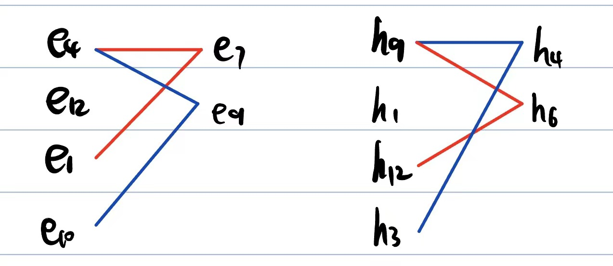
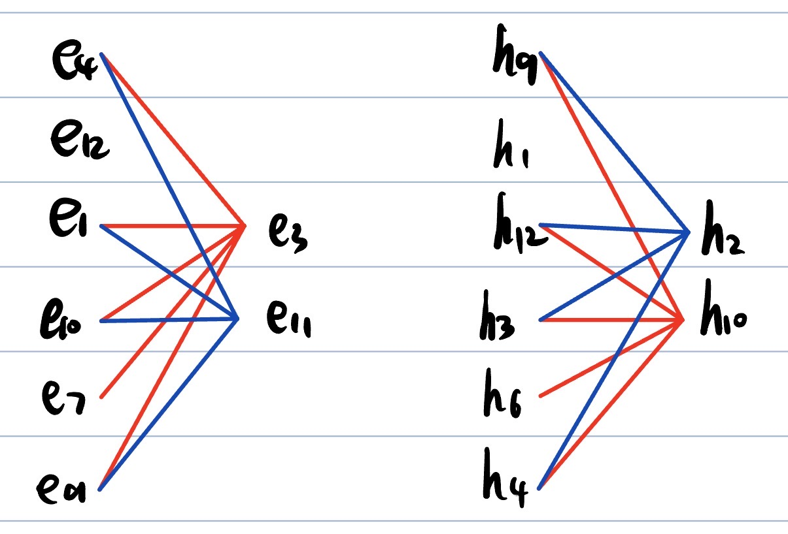
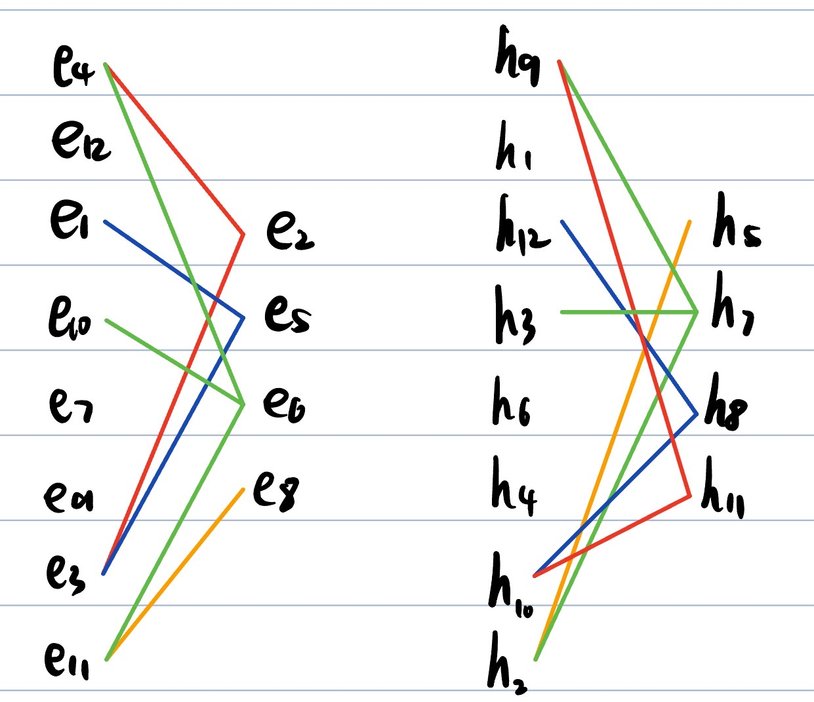

# Домашнее Задание 5

Вариант №122

|V/V|$e_1$|$e_2$|$e_3$|$e_4$|$e_5$|$e_6$|$e_7$|$e_8$|$e_9$|$e_{10}$|$e_{11}$|$e_{12}$|p(e)|
|-|-|-|-|-|-|-|-|-|-|-|-|-|-|
|$e_1$|0| |1|1|1| |1| | |1|1| |6|
|$e_2$| |0|1|1|1| | |1| | | | |4|
|$e_3$|1|1|0|1|1| |1| |1|1| | |7|
|$e_4$|1|1|1|0| |1|1| |1| |1|1|8|
|$e_5$|1|1|1| |0| | |1| | | | |4|
|$e_6$| | | |1| |0| |1| |1|1| |4|
|$e_7$|1| |1|1| | |0| |1|1| | |5|
|$e_8$| |1| | |1|1| |0| | |1| |4|
|$e_9$| | |1|1| | |1| |0|1|1| |5|
|$e_{10}$|1| |1| | |1|1| |1|0|1| |6|
|$e_{11}$|1| | |1| |1| |1|1|1|0|1|7|
|$e_{12}$| | | |1| | | | | | |1|0|2|

Перенумеруем вершины, чтобы получить второй граф (см. таблицу ниже)

|V/V|$h_1$|$h_2$|$h_3$|$h_4$|$h_5$|$h_6$|$h_7$|$h_8$|$h_9$|$h_{10}$|$h_{11}$|$h_{12}$|p(h)|
|-|-|-|-|-|-|-|-|-|-|-|-|-|-|
|$h_1$|0|1| | | | | | |1| | | |2|
|$h_2$|1|0|1|1|1| |1| |1| | |1|7|
|$h_3$| |1|0|1| |1|1| ||1| |1|6|
|$h_4$| |1|1|0| |1| | |1|1| | |5|
|$h_5$| |1| | |0| |1|1| | |1| |4|
|$h_6$| | |1|1| |0| | |1|1| |1|5|
|$h_7$| |1|1| |1| |0| |1| | | |4|
|$h_8$| | | | |1| | |0| |1|1|1|4|
|$h_9$|1|1| |1| |1|1| |0|1|1|1|8|
|$h_{10}$| | |1|1| |1| |1|1|0|1|1|7|
|$h_{11}$| | | | |1| | |1|1|1|0| |4|
|$h_{12}$| |1|1| | |1| |1|1|1| |0|6|

Для графа G1 ∑p(e)=62. Список P(e) = {8, 7, 7, 6, 6, 5, 5, 4, 4, 4, 4, 2}
Для графа G2 ∑p(h)=62. Список P(h) = {8, 7, 7, 6, 6, 5, 5, 4, 4, 4, 4, 2}

| |p(e)=p(h)=8|p(e)=p(h)=7|p(e)=p(h)=6|p(e)=p(h)=5|p(e)=p(h)=4|p(e)=p(h)=2|
|-|-|-|-|-|-|-|
|E|e4|e3,e11|e1,e10|e7,e9|e2,e5,e6,e8|e12|
|H|h9|h2,h10|h3,h12|h4,h6|h5,h7,h8,h11|h1|

Из таблицы сразу видно соответствие вершин e4 – h9, e12-h1.  
Попробуем установить соответствие между p(e) = p(h) = 6

Видим, что e1 – h12, e12 – h3

Видим, что e7 – h6, e9 – h4

Видим, что e3 – h10, e11 – h2

Видим, что e2 – h11, e5 – h8, e6 - h7, e8 - h5

Из всего этого заключаем, что наши графы изоморфны.
