# Курсовая работа по Нечеткой логике

---

Выполнил: Чжоу Хунсян  
Группа: P3113  
Преподаватель: Поляков Владимир Иванович

---

Модель определяющая **окружающая среда** в зависимости от **население** и **природные ресурсы**.

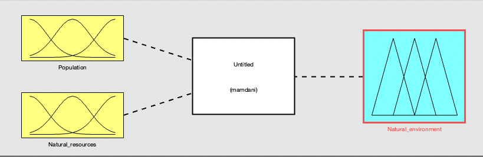

Входные данные:

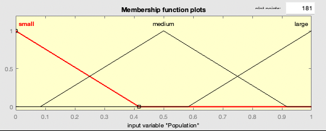
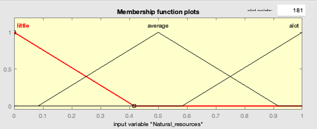

Результат:

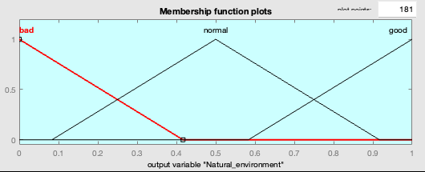

Правила:

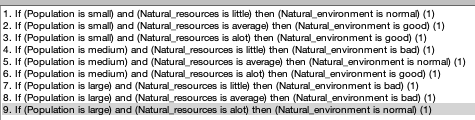

График зависимости:

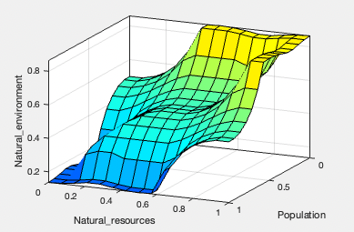

Результат работы при разных значениях:

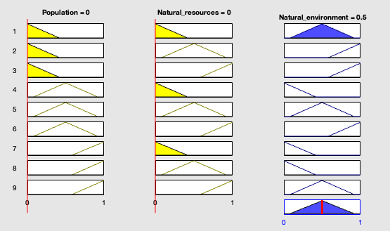
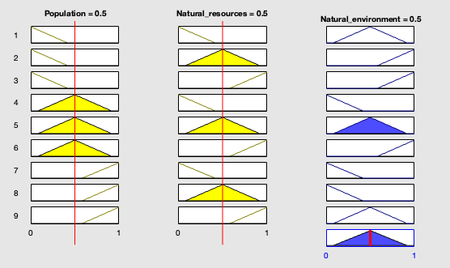
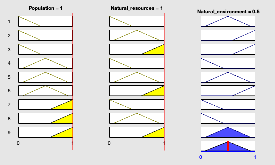
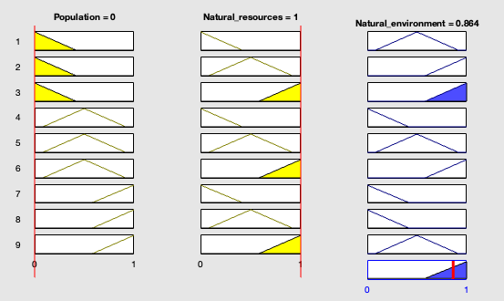
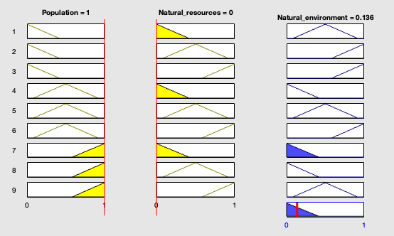
