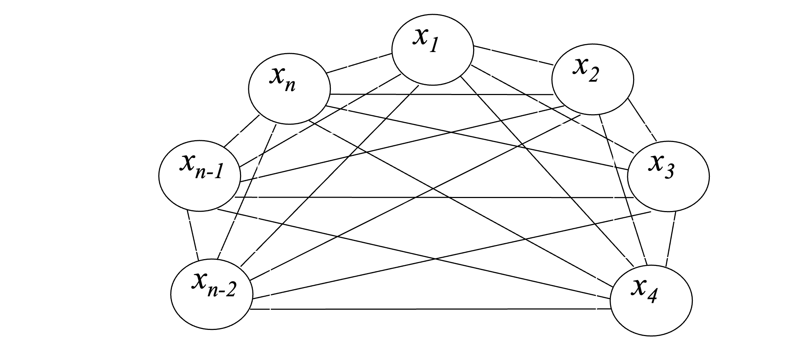
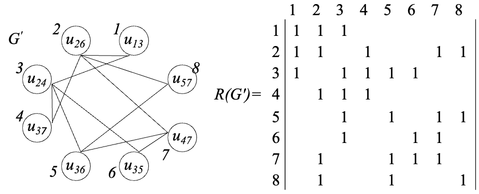
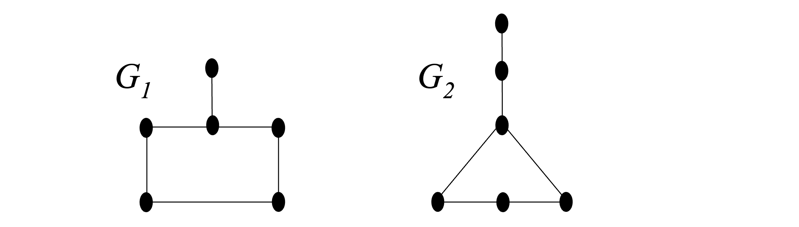
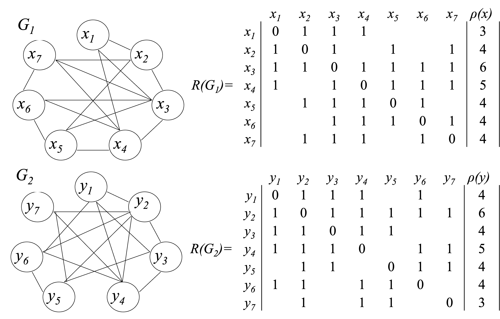
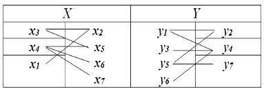
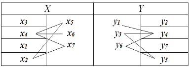
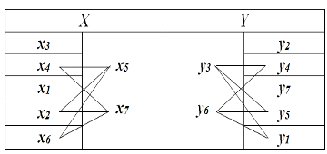
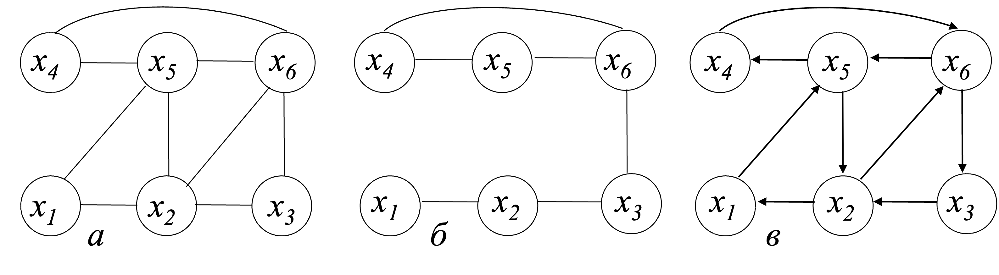
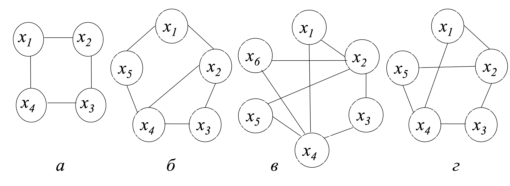

# 离散作业

## 作业1

## 作业2

## 作业3

## 作业4 

### Графо-теоретический подход к синтезу топологии

Для схем с однослойной коммутацией синтез топологии по традиционной схеме размещение-трассировка не оправдан, т.к. при этом учитываются метрические, а не топологические критерии и ограничения. 

При неравномерном использовании коммутационных слоев (например, когда слои изготавливаются на основе алюминия и поликремния) проектирование двухслойных схем оказывается близким к проектированию однослойных схем.

Графо-теоретический подход к синтезу топологии состоит из следующих этапов.

1. Построение графовой модели схемы.
2. Анализ планарности графа.
3. Планаризация графа.
4. Реализация непланарных соединений.
5. Построение плоского чертежа схемы.
6. Синтез геометрии схемы.

Одной из основных топологических задач проектирования коммутации является возможность разложения соединений на плоскости без пересечений. Эта задача связана с определением планарности графа. 

Среди критериев планарности графа наиболее известен критерий **Понтрягина-Куратовского**:

Граф $G(X,U)$ – планарен тогда и только тогда, когда он не содержит подграфов гомеоморфных полному графу $K_5$ или полному двудольному графу $K_{3,3}$.

Однако он неконструктивен (требует перебора). Известны другие критерии, но их также трудно использовать. Разработан ряд алгоритмов определения планарности графа удобных для реализации на ЭВМ.

**Критерий Бадера**. Граф $G(X,U)$ планарен, если его граф пересечений $G'$ является бихроматическим (двудольным) графом. Критерий справедлив для графов, имеющих гамильтонов цикл.

### Разбиение графа на планарные суграфы

При разработке топологии возникает задача выделения из графа, описывающего схему, максимальных планарных суграфов (добавление любого ребра делает его не планарным).

Граф $G(X,U)$ называется m-планарным, если существует m планарных суграфов $L_1(X,Z_1)$, $L_2(X,Z_2)$,…, $L_m(X,Z_m)$, таких, что  
Наименьшее m называется толщиной графа.

$$U=\bigcup^m_{i=1}Z_i$$

### Построение графа пересечений $G’$

Приняты следующие допущения:
1. Граф $G$ имеет гамильтонов цикл;
2. Два ребра пересекаются только один раз;
3. Ребра, инцидентные одной вершине, не пересекаются;
4. Ребра графа не пересекают ребер гамильтонова цикла;
5. Ребра вершины $x_j$ могут пересекать ребра вершины $x_i$ при условии, что  $j>i$.

$p_i$ – число пересечений ребер i-ой вершины.

Согласно п. 5 принятых допущений $p_1=0$.

Рассмотрим ребро $(x_2x_n)$. Число его пересечений с ребрами вершины $x_1$

$$p_{2n}-2_{2n}\sum^{n-1}_{i=3}r_{1i}$$

Ребро (x2xn-1) пересекает $p_{2(n-1)}=r_{2(n-1)}\sum^{n-2}_{i=3}r_{1i}$ ребер.

Общее число пересечений ребер вершины $x_2$

$$p_2=\sum^n_{j=4}p_{2j}$$

Для вершины $x_k$

$$p_k=\sum^n_{j=k+2}p_{kj}$$

Общее число пересечений ребер графа

$$P(G)=\sum^{n-1}_{k=2}p_k$$

Проще определять число пересечений по матрице соединений $R$. Будем использовать треугольную часть матрицы. Учитывая, что ребра графа не пересекают ребер гамильтонова цикла, в матрице "$1$", соответствующие гамильтонову циклу, заменим на "$\times$".

Определим $p_{2n}$, для чего в матрице $R$ выделим подматрицу  $R_{2n}$. Сумма единиц подматрицы  R2n  соответствует $p_{2n}$. Для $p_{2(n-1)}$ выделим $R_{2(n-1)}$ и т.д. от $R_{2n}$  до $R_{(n-2)n}$. Одновременно строим граф пересечений $G'$. Ребра графа $G$, не имеющие пересечений в $G'$ не учитываются.

Для определения двудольности $G'$ используем максимальные внутренне устойчивые множества.

### Нахождение максимальных внутренне устойчивых  множеств

Для нахождения МВУМ при раскраске графа применялся метод Магу. Рассмотрим другой алгоритм, а именно - модифицированный алгоритм Г.А. Петухова.

1. В матрице R заменим все диагональные элементы на "$1$", $r_{jj}=1$. Положим $i=1, \alpha=1$;
2. В i-той строке находим элементы $r_{ij} = 0 (j>i)$. Номера нулевых элементов помещаем в список  $J(j)$. Если все $r_{ij} =1$, то $\psi_\alpha={xi}, \alpha= \alpha+1$, перейти к п.7;
3. Записываем дизъюнкцию $M_{ij}= r_i \lor r_j$;
4. В строке Mij находим $mk=0 (k >j)$, если все $mk=1$, то перейти к п. 6;
5. Записываем дизъюнкцию $M_{ijk}= M{ij}\lor r_k$; Переходим к п. 4. 
6. Если в дизъюнкции нет ни одного нулевого элемента, $\psi_\alpha={x_i, x_j, x_k…}, \alpha = \alpha+1$.  
Пока в списке $J(j)$ есть не рассмотренные элементы, выбрать следующий нулевой элемент и перейти к п. 3;
7. Положить $i=i+1$, пока $i<n$ перейти к п.2;
8. Семейство внутренне устойчивых множеств $\Psi_{G'}$  построено.

## Выделение  из  $G'$  максимального двудольного подграфа  $H'$

Введем следующий критерий

$$\alpha_{\gamma\delta}=|\psi_{\gamma}|+|\psi_\delta|-|\psi_{\gamma}\cap\psi_{\delta}|$$

Отсюда граф пересечений $G'$ двудольный, а соответствующий ему граф $G$ – планарен, если 

$$\alpha_{\gamma\delta}=|\psi_{\gamma}|+|\psi_{\delta}|-|\psi_{\gamma}\cap\psi_{\delta}|=|X'|$$

Естественно, что чем ближе  $\alpha_{\gamma\delta}$ к $|X'|$, тем большее число вершин содержит выделяемый двудольный подграф $H'$. Для его выделения необходимо определить $\alpha_{\gamma\delta}$ для всех пар $(\psi_{\gamma'}, \psi_{\delta}) \Psi$ и выбрать $\psi_{\gamma}$ и $\psi_{\delta}$ с $\max\alpha_{\gamma\delta}$. 

Максимальному $H'$ в исходном графе G соответствует суграф  $H$, содержащий максимальное число непересекающихся ребер. В графе $H$ ребра, вошедшие в одно внутренне устойчивое множество, проводятся внутри гамильтонова цикла, а во второе – вне его.

Из множеств семейства $\Psi_{G'}$ исключаются ребра, вошедшие в $\psi_{\gamma}$ и $\psi_{\delta}$. Одинаковые множества объединяются в одно.

Описанная процедура повторяется до тех пор, пока $\Psi_{G'}$ не станет пусто.

Напомним, что критерий Бадера справедлив для графов, имеющих гамильтонов цикл.

## Нахождение гамильтонова цикла. Алгоритм Робертса-Флореса

Цикл, включающий все вершины один раз, называется гамильтоновым. 

Алгоритм Робертса-Флореса состоит в следующем. Некоторая начальная вершина $(х1)$ выбирается в качестве отправной и образует первый элемент множества $S$, которое будет хранить уже найденные вершины цепи. К $S$ добавляется первая вершина $a$, смежная с $х_1, a\in Гх_1$. Затем к множеству $S$ добавляется первая возможная вершина $b$.

Под "возможной" вершиной понимается вершина:

1. $b\in Гa$
2. $b\notin S$

Существует две причины, препятствующие включению некоторой вершины на шаге $r$ в множество $S = \{x_1, a, b,\cdots, xr\}$:

1. у $x_r$ нет "возможной" вершины;
2. цепь $S$ имеет длину $|S|=n$. В этом случае: 
   а) есть ребро $(x_r, x_1)$ и гамильтонов цикл найден; 
   б) такого ребра нет и найдена гамильтонова цепь.

В случаях 1 и 2 б) следует прибегнуть к возвращению, которое заключается в удалении из $S$ последней включенной вершины $x_r$ и добавлении к  $S$  новой первой "возможной", следующей за $x_r$ вершины. Если не существует никакой возможной вершины, делается следующий шаг возвращения и т.д.

Поиск заканчивается в случае когда $S$ состоит из одной $х_1$ и нет не рассмотренных "возможных" вершин.

Планаризовать граф $G(X,U)$

## Нахождение гамильтонова цикла

Включаем в $S$ начальную вершину  $S={x1}$.

Первая "возможная" вершина х2 Гх1, S={x1, х2}  и т.д. до вершины х7:

S={x1, х2, х3, х4, х5, х6, х7}. Ребра (х7, х1) нет. Найдена гамильтонова цепь. 

Прибегнем к возвращению. Удалим из S вершину х7. 
S={x1, х2, х3, х4, х5, х6}.

У х6 больше нет "возможных"  вершин. Удалим и ее.  S={x1, х2, х3, х4, х5}.

У х5 больше нет "возможных"  вершин. Удалим ее. S={x1, х2, х3, х4}. Следующая "возможная" вершина х6.  S={x1, х2, х3, х4, х6}. 

Следующая "возможная" вершина х5.  S={x1, х2, х3, х4, х6, х5}. 

У х5 больше нет "возможных"  вершин. Удалим ее.  S={x1, х2, х3, х4, х6}. Следующая "возможная" вершина х7.  S={x1, х2, х3, х4, х6, х7}. 

У х7 больше нет "возможных"  вершин. Удалим из S вершину х7. 
S={x1, х2, х3, х4, х6}. У х6 больше нет "возможных"  вершин. Удалим ее. S={x1, х2, х3, х4}. Следующая "возможная" вершина х7. S={x1, х2, х3, х4, х7}. Следующая "возможная" вершина х6.  S={x1, х2, х3, х4, х7, х6}. 

Следующая "возможная" вершина х5.  S={x1, х2, х3, х4, х7, х6, х5}. 

Ребра (х5, х1) нет. Найдена гамильтонова цепь. Удаляем вершины х4, х7, х6, х5.  S={x1, х2, х3}. 

И т.д., пока последней не окажется вершина х4, которая образует цикл с вершиной х1. Гамильтонов цикл будет
S={x1, х2, х3, х5, х6, х7, х4}.

## Построение графа пересечений G'

Перенумеруем вершины графа таким образом, чтобы ребра гамильтонова цикла были внешними.

|ситуация|-|-|-|-|-|-|-|
|---|---|---|---|---|---|---|---|
|до перенумерации|$x_1$|$x_2$|$x_3$|$x_5$|$x_6$|$x_7$|$x_4$|
|после перенумерации|$x_1$|$x_2$|$x_3$|$x_4$|$x_5$|$x_6$|$x_7$|

Тогда граф G (X,U) будет выглядеть так 

Определим  p26, для чего в матрице  R  выделим подматрицу  R26.

Ребро (х2х6) пересекается с ребром (х1х3). 

Строим граф пересечений G'

Определим  p24, для чего в матрице  R  выделим подматрицу  R24.

Ребро (х2х4) пересекается с ребром (х1х3). p2=2.
Продолжаем строить граф пересечений G'. 

После обработки остальных ребер получим граф пересечений G' 

Число пересечений ребер графа  Р(G) = p2 + p3 + p4 + p5 = 11. 

## Построение семейства ΨG'

В первой строке матрицы R(G') находим номера нулевых элементов. Составляем список J(j) = {4, 5, 6, 7, 8}.

Для первого нулевого элемента составляем дизъюнкцию
M14= r1  r4={11110000}.

В строке M14 находим номера нулевых элементов. Составляем список J’(j’) = {5, 6, 7, 8}.

Записываем дизъюнкцию     M145= M14  r5= {11111011}.

В строке M145 находим m6=0.  Записываем дизъюнкцию
M1456= M145  r6= {11111111}.

В строке M1456 все «1».  

Построено
ψ1={u13, u37, u36, u35}.

Из списка J’(j’) выбираем следующий элемент.  Записываем дизъюнкцию       M146= M14  r6= {11110110}.

В строке M146 находим m8=0.  Записываем дизъюнкцию
M1468= M146  r8= {11111111}.

В строке M1468  все «1».  
Построено
ψ2={u13, u37, u35, u57}.

Из списка J’(j’) выбираем следующий элемент.   Записываем дизъюнкцию    M147= M14  r7= {11111110}.

И, наконец,
M1478= M147  r8= {11111111}.

В строке M1478 все «1».  
Построено
ψ3={u13, u37, u47, u57}.

Из списка J’(j’) выбираем следующий элемент.  Записываем дизъюнкцию  M148= M14  r8= {11110001}.
В строке остались незакрытые «0».

Из списка J(j) выбираем следующий нулевой элемент r5. Составляем дизъюнкцию   M15= r1  r5={11101011}.

В строке M15 находим нулевой элемент – m6=0.  Записываем дизъюнкцию    M156= M15  r6= {11101111}.

В строке остался незакрытый «0». Понятно, что «0» в четвертой позиции элементами  с номерами  j >4 закрыть не удастся.

Во второй строке ищем первый нулевой элемент – r23. Составляем дизъюнкцию  M23= r2  r3= {11111111}.
В строке M23 все «1».  
Построено
ψ4={u26, u24}.

Во второй строке ищем следующий нулевой элемент – r25. Составляем дизъюнкцию  M25= r2  r5= {11111011}.
И, наконец,
M256= M25  r6= {11111111}.

Построено
ψ5={u26, u36, u35}.

Во второй строке ищем следующий нулевой элемент – r26. Составляем дизъюнкцию   M26= r2  r6= {11110111}.
В строке остался незакрытый «0».

В третьей строке ищем первый нулевой элемент – r7. Составляем дизъюнкцию    M37= r3  r7= {11111110}.
И, наконец,
M378= M37 v r8= {11111111}.

Построено
ψ6={u24, u47, u57}.

В третьей строке ищем следующий нулевой элемент – r38. Составляем дизъюнкцию    M38= r3  r8= {1111101}.
В строке остался незакрытый «0».

Из матрицы R(G') видно, что строки с номерами j >3 «0» в первой позиции закрыть не смогут.

Семейство максимальных внутренне устойчивых множеств ΨG' построено. Это

ψ1 ={u13, u37, u36, u35};
ψ2 ={u13, u37, u35, u57};
ψ3 ={u13, u37, u47, u57};
ψ4 ={u26, u24};
ψ5 ={u26, u36, u35};
ψ6 ={u24, u47, u57}.

Для каждой пары множеств вычислим значение критерия 
αγδ=׀ψγ׀ + ׀ψδ׀ -  ׀ψγ∩ψδ׀.

Результаты  вычислений запишем в матрицу Α= ׀׀αγδ׀׀.
α12=׀ψ1׀ + ׀ψ2׀ -  ׀ψ1∩ψ2׀ =4+4-3=5.
α13=׀ψ1׀ + ׀ψ3׀ -  ׀ψ1∩ψ3׀ =4+4-2=6 и т.д.

maxαγδ= α16= α35=7, дают две пары множеств ψ1, ψ6 и ψ3, ψ5.
Возьмем множества
ψ1 ={u13, u37, u36, u35} и ψ6 ={u24, u47, u57}.

В суграфе H, содержащем максимальное число непересекающихся ребер, ребра, вошедшие в ψ1, проводим внутри гамильтонова цикла, а в ψ6 – вне его 

Удалим из ΨG' ребра, вошедшие в ψ1 и ψ6      ψ4 ={u26};     ψ5 ={u26}.

Объединим одинаковые множества, не реализованным осталось единственное ребро 
ψ4 ={u26}. 

Проведем его. 
Все ребра графа G  реализованы. Толщина графа m = 2.   

Если взять множества ψ3 ={u13, u37, u47, u57}  и ψ5 ={u26, u36, u35}, то не реализованным окажется ребро {u24}.                 

## 作业5

### Верификация. Основные понятия

Согласно закону Мэрфи:  Если какая-нибудь неприятность может произойти, она случается.
Человек может ошибиться, поэтому он обязательно ошибается.
Ошибки случаются при проектировании аппаратуры, при написании программ, при изготовлении аппаратуры.

Иногда ошибки обходятся очень дорого.

В 1994 году профессор математики из Вирджинии при вычислении обратных величин простых чисел обнаружил, что микропроцессор Pentium в некоторых случаях неправильно делит числа с плавающей точкой. 

Через месяц фирма Intel согласилась заменить микропроцессоры с неправильно спроектированным устройством деления, что обошлось ей в 300 миллионов долларов (итоговые потери корпорации составили 500 миллионов долларов). Этот случай нанес большой ущерб репутации фирмы.

В 1991 году во время Войны в заливе батарея американских зенитных ракет «Patriot» не смогла перехватить запущенную иракцами ракету «Scud» советского производства. Ракета попала в казарму американских солдат, при этом погибло 28 человек.

Причиной этого была погрешность вычисления времени.

При вычислении нужно было умножать время, задаваемое тактовым генератором компьютера (оно измерялось в десятых долях секунды) на 1/10, но это десятичное число невозможно точно представить в двоичном виде.

Для хранения этой константы использовался 24-разрядный регистр. Разница между точным значением 1/10 и ее неточным представлением составляет около 0,000000095 в десятичном виде. 

Компьютер был включен около 100 часов, за это время накопилась ошибка в измерении времени в 0,34 секунды.

Скорость ракеты «Scud» составляла примерно 1700 м/сек, то есть за это время она прошла более 500 метров. Этого хватило для того, чтобы зенитные ракеты не смогли ее перехватить.

Слово верификация произошло от латинского verus - истинный и facere - делать. Вообще, верификация означает подтверждение того, что описание проекта полностью соответствует спецификации (техническому заданию) проектируемой системы. Спецификация — документ, подробно перечисляющий условия, которым должна соответствовать изготовляемая или проектируемая система. 

Верификация определяется как разновидность анализа, имеющая целью установление соответствия двух описаний одного и того же объекта. Различают верификацию структурную и функциональную. При структурной верификации устанавливается соответствие структур, отображаемых двумя описаниями, при функциональной (параметрической) - проверяется соответствие процессов функционирования и выходных параметров, отображаемых сравниваемыми описаниями.

Структурная верификация связана с меньшими затратами вычислительных ресурсов, чем функциональная. Поэтому последняя часто выполняется не в полном объеме и после того, как проверено соответствие структурных свойств.

Примером структурной верификации служит установление соответствия системы электрических межсоединений на печатной плате и в принципиальной электрической схеме, заданных своими топологическими моделями в виде графов. Верификация в этом случае сводится к установлению изоморфизма графов. 

### Изоморфизм графов

Вопрос о том, изоморфны ли два данных графа, в общем случае оказывается сложным.

Для изоморфизма двух $n$-вершинных графов теоретически безуко-ризненный способ проверки состоит в проверке всех $n!$ взаимно однозначных соответствий между множествами вершин и установлении, совмещаются ли полностью ребра графа хотя бы при одном соответствии. Однако даже весьма грубая оценка показывает, что такое решение «в лоб» практически непригодно: уже при $n=20$ перебор всех $n!$ вариантов потребовал бы десятки лет машинного времени.

Подобная ситуация толкнула многих математиков на попытки найти такое число, которое бы, с одной стороны, легко вычислялся по заданному графу, а с другой – определяло граф с точностью до изоморфизма.

Инвариантом графа $G(X, U)$ называется параметр, имеющий одно и то же значение для всех графов, изоморфных графу $G$.

Среди самых очевидных инвариантов отметим следующие:
1. Число вершин $|X| = m$.
2. Число ребер $|U| = k$.
3. Число компонент связности $р(G)$.
4. Последовательность степеней вершин, т.е. список степеней всех вершин в невозрастающем порядке значений $\rho x_i$.
5. Плотность $f(G)$ – число вершин клики графа $G$.
6. Число внутренней устойчивости $\alpha(G)$.
7. Хроматическое число $\chi(G)$.
8. Число Хадвигера $\eta(G)$.

Решение задачи изоморфизма обычно состоит в попытках показать, что два рассматриваемые графа не изоморфны. Для этого составляется список инвариантов в порядке, определяемом сложностью их вычисления. Затем последовательно сравниваются значения инвариантов. Как только обнаруживаются два различных значения одного и того же параметра, приходят к заключению, что данные графы не изоморфны.

Множество инвариантов, которое позволило бы этой процедуре установить изоморфность графов за полиномиальное время, называется кодом графа. К сожалению, на сегодняшний день такое множество не найдено.

Рассмотрение большого числа инвариантов увеличивает вероятность правильного заключения об изоморфизме при совпадении всех значений параметров, но в общем случае ничего не гарантирует.

Для графов $G_1$ и $G_2$ определим значения инвариантов.

Хроматические числа графов разные. Это позволяет сделать вывод, что графы $G1$ и $G2$ не изоморфны. 

|Инвариант|$G_1$|$G_2$|Совпадение|
|-|-|-|-|
|$m$|6|6|+|
|$k$|6|6|+|
|$p(G)$|1|1|+|
|Список $\rho x$|3,2,2,2,2,1|3,2,2,2,2,1|+|
|$f(G)$|2|2|+|
|$\alpha(G)$|3|3|+|
|$\chi(G)$|3|2|-|
|$\eta(G)$|3|3|+|

Для изоморфизма графов необходимо совпадение инвариантов, однако достаточным это условие не является.

Первые четыре инварианта относятся к группе «легко вычислимых». Наиболее «богатый» из них – упорядоченный список степеней вершин. Не будучи идеальным средством распознавания изоморфизма, список может, тем не менее, во многих случаях оказать существенную помощь.

Во-первых, если списки не совпадают, то отсюда сразу следует не изоморфизм графов $G_1$ и $G_2$.

Во-вторых, если списки совпали, то для проверки графов $G_1$ и $G_2$ на изоморфизм требуется перебор не всех $n!$ соответствий между вершинами, а лишь тех, при которых сопоставляются вершины с одина-ковой степенью. Так, в рассмотренном примере надо перебрать лишь $4! = 24$ соответствия вместо $6! = 720$.

Проверить на изоморфизм графы $G_1$ и $G_2$.

Разобьем вершины обоих графов на классы по их степеням

| |p(x)=p(y)=6|p(x)=p(y)=5|p(x)=p(y)=4|p(x)=p(y)=3|
|-|-|-|-|-|
|E|x3|x4|x2,x5,x6,x7|x1|
|H|y2|y4|y1,y3,y5,y6|y7|

Из таблицы сразу видно соответствие вершин графов:

Для определения соответствия вершин с $ρ(x)= ρ(y)=4$ попробуем связать вершины из классов 
с $ρ(x)= ρ(y)=5$ и $ρ(x)= ρ(y)=3$ с неустановленными вершинами.

Анализ связей вершин показывает соответствие вершин  $x_2$ и $y_5$ (соединены с установленными вершинами $х_3\sim y_2$ и $х_1\sim y_7$.  С учетом этого 

Анализ связей вершин показы-вает соответствие вершин  $x_6$ и $y_1$ (единственные имеют одну связь с классом вершин ρ(x)= ρ(y)=5. С учетом этого

Анализ связей вершин показывает, что существует две пары соответствий оставшихся вершин: вершины $x_5$ и $y_3$ и вершины $x_7$ и $y_6$, или $x_6$ и $y_3$ и вершины $x_7$ и $y_3$. Это соответствует действительности, т.к. вершины $x_5$ и $x_7$ в графе $G_1$ и вершины $y_3$ и $y_6$ в графе $G_2$ смежны с одними и теми же вершинами.

Из сказанного можно сделать вывод, что графы $G_1$ и $G_2$ изоморфны.

### Нахождение эйлерова цикла.  Алгоритм Флери

Элегантный алгоритм нахождения эйлерова цикла был предложен М. Флери (М. Fleury) в 1883 году.

Алгоритм заключается в следующем:
1. Положить текущий граф равным G(X, U), а текущую вершину равной произвольной вершине $x_i ∈ X$. 
2. Выбрать произвольное ребро $u_{ij}$ текущего графа, инцидентное текущей вершине $x_i$ с учетом следующего ограничения: если степень текущей вершины в текущем графе больше 1, нельзя выбирать ребро, удаление которого из текущего графа увеличит число компонент связности в нем (т.е. ребро, являющееся мостом). 
3. Назначить текущей $x_j$ вершину, инцидентную ребру $u_{ij}$.
4. Удалить $u_{ij}$ из текущего графа и внести в список. 
5. Если в текущем графе еще остались ребра, то положить $i=j$ и вернуться на шаг 2. 
Сложность алгоритма $О(k)$, где  $k = |U|$ − число ребер.

Пусть на шаге 1 выбрана вершина $x_1$. При выборе на шаге 2 ограничение никак не сказывается; пусть выбрано ребро $(x_1, x_5)$. 

На двух следующих итерациях ограничений на выбор по-прежнему не возникает; пусть выбраны ребра $(x_5, x_2)$ и $(x_2, x_6)$. Тогда текущим графом становится граф, изображенный на рис. (б) (текущая вершина − $x_6$). 

На следующей итерации нельзя выбрать ребро $(x_6, x_3)$ из-за ограничения; пусть выбрано ребро $(x_6, x_5)$.

Дальнейший выбор ребер определен однозначно (текущая вершина всегда будет иметь степень 1), так что в итоге будет построен следующий эйлеров цикл (рис. 10.1 (в)): $x_1 → x_5 → x_2 → x_6 → x_5 → x_4 → x_6 → x_3 → x_2 → x_1$.

### Сравнение эйлеровых и гамильтоновых циклов

Несмотря на внешнюю схожесть определений эйлерова и гамильтонова циклов, задачи нахождения циклов этих двух типов в данном графе разительно отличаются по сложности. 

Задача о нахождении эйлерова цикла − это простая с математической точки зрения задача: существует эффективный критерий существования эйлерова цикла (теорема Эйлера); если критерий выполнен, имеется эффективный алгоритм для нахождения цикла (например, алгоритм Флери). 

Ни критерия гамильтоновости графа, ни эффективного алгоритма нахождения гамильтонова цикла в произвольном гамильтоновом графе, неизвестно (и скорее всего, не существует). Задача о нахождении гамильтонова цикла − это NP-трудная задача.

Следующие четыре графа демонстрируют отсутствие тесной взаимосвязи между существованием эйлеровых и гамильтоновых циклов .

Графы: эйлеров и гамильтонов (а); неэйлеров и гамильтонов (б); эйлеров и негамильтонов (в); неэйлеров и негамильтонов (г)

Однако, двойственность между эйлеровыми и гамильтоновыми циклами (замена вершины на ребро и наоборот) приводит к тесной связи между этими двумя понятиями в применении к графу $G$ и соответствующему ему реберному графу, определяемому ниже.

Реберный граф $G_l$ графа $G$ имеет столько же вершин, сколько ребер $y$ графа $G$. Ребро между двумя вершинами графа $G_l$ существует тогда и только тогда, когда ребра графа $G$, соответствующие этим двум вершинам, смежны. 

Верны два следующих утверждения о взаимоотношении между эйлеровыми и гамильтоновыми циклами, принадлежащие Ф. Харари.

1. Если граф $G$ имеет эйлеров цикл, то граф $G_l$ имеет как эйлеров, так и гамильтонов циклы.
2. Если граф $G$ имеет гамильтонов цикл, то граф $G_l$ также имеет гамильтонов цикл.

**Обращение этих утверждений неверно!**

## 作业6