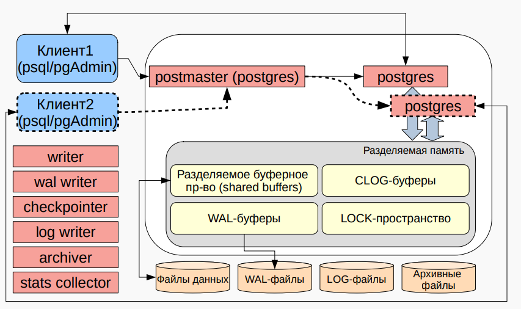

## [MainPage](../index.md)/[Distributed Database](README.md)/Exam

- [MainPage/Distributed Database/Exam](#mainpagedistributed-databaseexam)
  - [10. Установка и запуск PostgreSQL.  安装和启动 PostgreSQL](#10-установка-и-запуск-postgresql--安装和启动-postgresql)
  - [11. PostgreSQL: template0, template1, назначение, особенности работы.  PostgreSQL: template0, template1，作用及使用特点](#11-postgresql-template0-template1-назначение-особенности-работы--postgresql-template0-template1作用及使用特点)
  - [12. Подключение к PostgreSQL, настройка, особенности.  连接到PostgreSQL，配置及特点](#12-подключение-к-postgresql-настройка-особенности--连接到postgresql配置及特点)
  - [13. Виды и методы подключений к PostgreSQL, их настройка.  PostgreSQL的连接类型及方法及其配置](#13-виды-и-методы-подключений-к-postgresql-их-настройка--postgresql的连接类型及方法及其配置)
  - [14. PostgreSQL, создание Базы Данных.  PostgreSQL中创建数据库](#14-postgresql-создание-базы-данных--postgresql中创建数据库)
  - [15. Файловая структура и конфигурация PostgreSQL.  PostgreSQL 文件结构和配置。](#15-файловая-структура-и-конфигурация-postgresql--postgresql-文件结构和配置)
  - [16. Табличные пространства. Назначение. Организация и настройка.  表空间。作用。组织和配置](#16-табличные-пространства-назначение-организация-и-настройка--表空间作用组织和配置)
  - [17. Транзакции. Назначение. ACID.  事务。作用。ACID特性](#17-транзакции-назначение-acid--事务作用acid特性)
  - [18. PostgreSQL: явные, неявные транзакции. Транзакционный DDL.  PostgreSQL: 显式和隐式事务，事务性的DDL](#18-postgresql-явные-неявные-транзакции-транзакционный-ddl--postgresql-显式和隐式事务事务性的ddl)
  - [PostgreSQL: явные, неявные транзакции. Транзакционный DDL](#postgresql-явные-неявные-транзакции-транзакционный-ddl)
  - [PostgreSQL: 显式和隐式事务，事务性的DDL](#postgresql-显式和隐式事务事务性的ddl)
  - [19. PostgreSQL: время начала транзакции, время внутри транзакции.  PostgreSQL: 事务的开始时间，事务内部的时间](#19-postgresql-время-начала-транзакции-время-внутри-транзакции--postgresql-事务的开始时间事务内部的时间)
  - [20. PostgreSQL: идентификация транзакции, особенности работы xid  PostgreSQL: 事务识别，xid工作特性](#20-postgresql-идентификация-транзакции-особенности-работы-xid--postgresql-事务识别xid工作特性)
  - [21. PostgreSQL: MVCC, SSI](#21-postgresql-mvcc-ssi)
  - [22. Виды и особенности конфликтов при параллельном доступе к данным.  并行数据访问中的冲突类型及特点](#22-виды-и-особенности-конфликтов-при-параллельном-доступе-к-данным--并行数据访问中的冲突类型及特点)
  - [23. Изоляция транзакций. Режимы для организации доступа к данным.  事务隔离。数据访问的组织模式](#23-изоляция-транзакций-режимы-для-организации-доступа-к-данным--事务隔离数据访问的组织模式)
  - [Изоляция транзакций. Режимы для организации доступа к данным](#изоляция-транзакций-режимы-для-организации-доступа-к-данным)
  - [事务隔离。数据访问的组织模式](#事务隔离数据访问的组织模式)
  - [24. VACUUM  VACUUM命令](#24-vacuum--vacuum命令)
  - [25. Восстановление данных. Базовые понятия. Организация. Контрольные точки.  数据恢复。基本概念。组织方式。检查点](#25-восстановление-данных-базовые-понятия-организация-контрольные-точки--数据恢复基本概念组织方式检查点)
  - [26. (Adv.) UNDO-журнал.  (高级) UNDO日志](#26-adv-undo-журнал--高级-undo日志)
  - [27. (Adv.) REDO-журнал.  (高级) REDO日志](#27-adv-redo-журнал--高级-redo日志)
  - [28. (Adv.) UNDO/REDO-журнал.  (高级) UNDO/REDO日志](#28-adv-undoredo-журнал--高级-undoredo日志)
  - [29. (Adv.) Восстановление данных. Подходы (steal/no-steal, force/no-force). ARIES.  (高级) 数据恢复方法。steal/no-steal, force/no-force原则。ARIES](#29-adv-восстановление-данных-подходы-stealno-steal-forceno-force-aries--高级-数据恢复方法stealno-steal-forceno-force原则aries)
  - [30. Восстановление данных в PostgreSQL. WAL. LSN.  PostgreSQL中的数据恢复。WAL。LSN](#30-восстановление-данных-в-postgresql-wal-lsn--postgresql中的数据恢复wallsn)
  - [31. Резервное копирование. Базовые понятия. Виды.  备份。基本概念。类型](#31-резервное-копирование-базовые-понятия-виды--备份基本概念类型)
  - [Резервное копирование. Базовые понятия. Виды](#резервное-копирование-базовые-понятия-виды)
  - [备份。基本概念。类型](#备份基本概念类型)
  - [32. Логическое резервное копирование. pg\_dump, pg\_dumpall, pg\_restore.  逻辑备份。pg\_dump, pg\_dumpall, pg\_restore](#32-логическое-резервное-копирование-pg_dump-pg_dumpall-pg_restore--逻辑备份pg_dump-pg_dumpall-pg_restore)
  - [33. Физическое резервное копирование. Способы организации в PostgreSQL.  物理备份。在PostgreSQL中的组织方式](#33-физическое-резервное-копирование-способы-организации-в-postgresql--物理备份在postgresql中的组织方式)
  - [34. PostgreSQL: непрерывное архивирование.  PostgreSQL中的持续归档](#34-postgresql-непрерывное-архивирование--postgresql中的持续归档)
  - [35. Репликация данных в PostgreSQL. Базовые понятия.  PostgreSQL中的数据复制。基本概念](#35-репликация-данных-в-postgresql-базовые-понятия--postgresql中的数据复制基本概念)
  - [36. Виды репликации. Особенности.  复制的类型及特点](#36-виды-репликации-особенности--复制的类型及特点)
  - [37. Физическая репликация. Реализация в PostgreSQL.  物理复制。在PostgreSQL中的实现](#37-физическая-репликация-реализация-в-postgresql--物理复制在postgresql中的实现)
  - [38. Настойка физической репликации. wal\_keep\_size, слоты.  物理复制的配置。wal\_keep\_size, slots](#38-настойка-физической-репликации-wal_keep_size-слоты--物理复制的配置wal_keep_size-slots)
  - [39. (Adv.) Синхронная и асинхронная репликация в PostgreSQL.   (高级) PostgreSQL中的同步和异步复制](#39-adv-синхронная-и-асинхронная-репликация-в-postgresql---高级-postgresql中的同步和异步复制)
  - [40. (Adv.) Ступенчатая (каскадная) репликация.  (高级) 级联复制](#40-adv-ступенчатая-каскадная-репликация--高级-级联复制)
  - [Ступенчатая (каскадная) репликация](#ступенчатая-каскадная-репликация)
  - [(高级) 级联复制](#高级-级联复制)
  - [41. (Adv.\*) Логическая репликация в PostgreSQL.   (高级\*) PostgreSQL中的逻辑复制](#41-adv-логическая-репликация-в-postgresql---高级-postgresql中的逻辑复制)

Архитектура ANSI-SPARC — это эталонная трехуровневая архитектура для описания баз данных, предложенная Американским национальным институтом стандартов (ANSI) в 1975 году.  
ANSI-SPARC架构是美国国家标准协会（ANSI）在1975年提出的用于描述数据库的三层参考架构。

**1. Внешний уровень (External Level):**  
На этом уровне пользователи взаимодействуют с системой. Это уровень представления данных, который может быть разным для различных пользователей или приложений. Пользователь видит только ту часть базы данных, которая ему необходима, а другие части могут быть скрыты.  
**1. 外部层 (External Level)：**  
在这一层，用户与系统交互。这是数据的表示层，不同用户或应用程序可以看到不同的数据。用户只会看到他们需要的部分，其他部分可能被隐藏。

**2. Концептуальный уровень (Conceptual Level):**  
Этот уровень представляет собой глобальный логический уровень базы данных, независимый от физических характеристик. Здесь определяются основные структуры данных и отношения между ними, такие как таблицы, поля и связи.  
**2. 概念层 (Conceptual Level)：**  
这一层表示全局的逻辑数据库层，与物理特性无关。在这里定义了数据的主要结构和它们之间的关系，如表格、字段和关联。

**3. Внутренний уровень (Internal Level):**  
Этот уровень отвечает за физическое хранение данных. Здесь описывается, как данные фактически хранятся на диске или в другой физической среде, а также какие структуры хранения используются (например, индексы).  
**3. 内部层 (Internal Level)：**  
这一层负责数据的物理存储。在这里描述数据如何实际存储在磁盘或其他物理介质上，以及使用了哪些存储结构（例如索引）。

Эта трехуровневая архитектура позволяет абстрагировать физическое хранение данных от логической структуры и представления данных пользователям, обеспечивая гибкость и безопасность.  
这种三层架构允许将数据的物理存储与逻辑结构和用户视图分离，提供了灵活性和安全性。

- Архитектура PostgreSQL. <br> PostgreSQL架构

PostgreSQL — это объектно-реляционная система управления базами данных (СУБД), имеющая многослойную архитектуру, которая поддерживает расширяемость, высокую надежность и соответствие стандартам SQL.  
PostgreSQL 是一种面向对象的关系型数据库管理系统（DBMS），具有多层架构，支持扩展性、高可靠性并符合SQL标准。

**1. Клиентский уровень (Client Level):**  
На этом уровне клиенты или приложения взаимодействуют с сервером PostgreSQL. Клиенты отправляют SQL-запросы и получают результаты. Связь между клиентом и сервером осуществляется через сетевые протоколы, такие как TCP/IP.  
**1. 客户端层 (Client Level)：**  
在这一层，客户端或应用程序与PostgreSQL服务器进行交互。客户端发送SQL查询并接收结果。客户端与服务器之间的通信通过网络协议（如TCP/IP）进行。

**2. Серверный уровень (Server Level):**  
Этот уровень включает в себя основной механизм обработки запросов. Сервер PostgreSQL состоит из нескольких компонентов:  
- **Парсер (Parser):** Преобразует SQL-запрос в дерево запроса.  
- **Планировщик (Planner):** Определяет, как лучше всего выполнить запрос, создавая оптимизированный план выполнения.  
- **Исполнитель (Executor):** Выполняет план запроса, взаимодействуя с данными на физическом уровне.  
**2. 服务器层 (Server Level)：**  
这一层包含主要的查询处理机制。PostgreSQL服务器由多个组件组成：  
- **解析器 (Parser)：** 将SQL查询转换为查询树。  
- **计划器 (Planner)：** 决定如何最有效地执行查询，生成优化的执行计划。  
- **执行器 (Executor)：** 执行查询计划，与物理层数据进行交互。

**3. Уровень хранения (Storage Level):**  
На этом уровне PostgreSQL взаимодействует с физической системой хранения данных. Файлы базы данных хранятся на диске в формате, специфичном для PostgreSQL, и организуются в таблицы, индексы, журнал транзакций (WAL) и другие структуры.  
**3. 存储层 (Storage Level)：**  
在这一层，PostgreSQL与物理数据存储系统交互。数据库文件以PostgreSQL特定格式存储在磁盘上，并被组织为表、索引、事务日志（WAL）等结构。

**4. Процессы управления (Management Processes):**  
PostgreSQL использует несколько фонов процессов для управления памятью, очистки журналов транзакций (WAL) и восстановления данных. Основные процессы включают:  
- **Autovacuum:** Автоматически очищает неиспользуемые данные.  
- **WAL Writer:** Управляет записью транзакционных данных для обеспечения отказоустойчивости.  
**4. 管理进程 (Management Processes)：**  
PostgreSQL 使用多个后台进程来管理内存、清理事务日志（WAL）和数据恢复。主要进程包括：  
- **自动清理 (Autovacuum)：** 自动清理未使用的数据。  
- **WAL Writer:** 负责写入事务日志数据，以确保容错能力。

Эта архитектура обеспечивает надежную работу PostgreSQL с большими объемами данных и поддерживает сложные типы запросов, индексацию, транзакции и репликацию.  
这种架构确保PostgreSQL能够高效处理大量数据，并支持复杂查询、索引、事务和数据复制。

Архитектура PostgreSQL  
PostgreSQL架构

PostgreSQL — это свободно распространяемая объектно-реляционная система управления базами данных (СУБД), использующая язык SQL для взаимодействия с данными.  
PostgreSQL是一种自由分发的对象-关系型数据库管理系统（DBMS），使用SQL语言与数据进行交互。

PostgreSQL классифицируется как объектно-реляционная клиент-серверная СУБД, то есть она поддерживает как реляционные, так и объектные модели данных.  
PostgreSQL被归类为对象-关系型客户端-服务器数据库管理系统，支持关系和对象数据模型。

Структура СУБД  
数据库管理系统的结构

Архитектуру PostgreSQL можно рассматривать на трех уровнях:  
PostgreSQL的架构可以从三个层面来考虑：

1. **На уровне структур в основной памяти ЭВМ:**  
   Включает разделяемую память (shared memory) для буферов и других структур.  
   **在计算机主存中的结构层面：**  
   包括用于缓冲区和其他结构的共享内存。

2. **На уровне процессов в ОС:**  
   PostgreSQL использует отдельные процессы для каждого подключения клиента, а также фоновые процессы для выполнения системных задач, таких как запись журналов (WAL), контрольные точки и архивирование.  
   **在操作系统进程层面：**  
   PostgreSQL为每个客户端连接使用单独的进程，还包括后台进程，用于执行系统任务，如写日志(WAL)、检查点和归档。

3. **На уровне структуры хранилища данных в файловой системе:**  
   В файловой системе PostgreSQL хранит данные в виде файлов. Сюда входят файлы данных, файлы WAL (Write-Ahead Logging), лог-файлы и архивные файлы.  
   **在文件系统中数据存储结构层面：**  
   在文件系统中，PostgreSQL将数据存储为文件。包括数据文件、WAL日志文件、日志文件和归档文件。

Кластер и инстанс PostgreSQL  
PostgreSQL集群与实例

**Кластер базы данных** — это набор баз данных, управляемых одним экземпляром сервера PostgreSQL.  
**数据库集群**是由一个PostgreSQL服务器实例管理的一组数据库。

**Инстанс (экземпляр)** состоит из процессов СУБД и разделяемой памяти, которая используется для взаимодействия между этими процессами.  
**实例**包括数据库管理系统的进程和用于这些进程之间交互的共享内存。

Взаимодействие клиентов и сервера
客户端与服务器的交互

PostgreSQL поддерживает взаимодействие через клиентские приложения, такие как **psql** или **pgAdmin**, которые подключаются к серверу. Каждый клиентский запрос инициирует отдельный процесс сервера PostgreSQL.  
PostgreSQL支持通过客户端应用程序（如**psql**或**pgAdmin**）进行交互，这些应用程序连接到服务器。每个客户端请求会启动一个单独的PostgreSQL服务器进程。

**Основные компоненты памяти и процессов:**
- **Разделяемая память (Shared Memory):**  
  Содержит такие структуры, как буферы (shared buffers), WAL-буферы и LOCK-пространство для синхронизации процессов.  
  **共享内存(Shared Memory)：**  
  包含缓冲区（共享缓冲区）、WAL缓冲区和用于进程同步的LOCK空间。



- **Основные фоновые процессы:**  
  - **writer** — отвечает за запись измененных страниц данных.  
    **writer**—负责写入更改的数据页。
  - **wal writer** — записывает журналы WAL.  
    **wal writer**—写入WAL日志。
  - **log writer** — ведет логи.  
    **log writer**—记录日志。
  - **checkpointer** — устанавливает контрольные точки.  
    **checkpointer**—设置检查点。
  - **archiver** — архивирует файлы WAL.  
    **archiver**—归档WAL文件。
  - **stats collector** — собирает статистику работы.  
    **stats collector**—收集运行统计信息。

- Разделяемая память PostgreSQL. <br> PostgreSQL的共享内存

Разделяемая память (shared memory) в PostgreSQL — это область памяти, используемая для взаимодействия между процессами сервера. Каждый процесс PostgreSQL, работающий с базой данных, может использовать эту область для передачи данных, что помогает оптимизировать работу и синхронизацию процессов.  
PostgreSQL中的共享内存是用于服务器进程之间交互的内存区域。每个与数据库交互的PostgreSQL进程都可以使用这个内存区域来传输数据，从而优化工作效率和进程同步。

Основные области разделяемой памяти:
共享内存的主要区域:

1. **Shared Buffers (разделяемые буферы):**  
   Это основное место хранения страниц данных, которые читаются из файлов системы хранения. PostgreSQL использует буферизацию для того, чтобы уменьшить количество операций ввода-вывода, сохраняя недавно использованные или измененные страницы данных в памяти.  
   **共享缓冲区 (Shared Buffers)：**  
   这是存储从存储系统文件读取的数据页的主要位置。PostgreSQL通过缓存来减少输入/输出操作，将最近使用或更改的数据页保存在内存中。

2. **WAL Buffers (WAL-буферы):**  
   Буфер для записи журналов предзаписи (WAL, Write-Ahead Logging). Каждый раз, когда данные изменяются, информация об этом записывается в WAL, прежде чем сами данные сохраняются на диск. WAL-буферы позволяют эффективно управлять этой информацией, прежде чем она будет сброшена на диск.  
   **WAL缓冲区 (WAL Buffers)：**  
   用于写入预写日志（WAL）的缓冲区。每次数据发生更改时，都会先将信息写入WAL，然后再将数据保存到磁盘。WAL缓冲区可以有效地管理这些信息，直到它们被写入磁盘。

3. **CLOG Buffers (CLOG-буферы):**  
   Хранят информацию о транзакциях, которые завершились успешно или были откатаны. Эта информация помогает контролировать целостность транзакций и управлять конкурентностью в базе данных.  
   **CLOG缓冲区 (CLOG Buffers)：**  
   保存成功完成或已回滚事务的信息。这些信息有助于控制事务的完整性并管理数据库的并发性。

4. **Lock Space (пространство для блокировок):**  
   Эта область используется для управления блокировками, которые предотвращают конфликты между процессами при одновременной работе с одними и теми же данными. PostgreSQL использует различные уровни блокировок для обеспечения правильности выполнения операций.  
   **锁空间 (Lock Space)：**  
   这个区域用于管理锁，以防止进程在同时处理相同数据时发生冲突。PostgreSQL使用不同级别的锁来确保操作的正确执行。

5. **Backend Memory (память заднего плана):**  
   Каждый процесс, связанный с клиентом, имеет свою собственную локальную память, которая используется для хранения данных, таких как временные таблицы, рабочие буферы и информация о сессии.  
   **后台内存 (Backend Memory)：**  
   每个与客户端相关的进程都有自己的本地内存，用于存储数据，如临时表、工作缓冲区和会话信息。

Разделяемая память в PostgreSQL настраивается с помощью параметров конфигурации, таких как `shared_buffers`, `wal_buffers` и другие. Эти параметры позволяют оптимизировать производительность системы в зависимости от объема данных и нагрузки.  
PostgreSQL中的共享内存可以通过配置参数进行调整，如`shared_buffers`、`wal_buffers`等。根据数据量和负载，这些参数可以帮助优化系统性能。

- Буферная память процессов PostgreSQL. <br> PostgreSQL进程的缓冲内存

**Буферная память процессов PostgreSQL**  
PostgreSQL进程的缓冲内存

PostgreSQL использует разделяемую буферную память (shared buffers) для обеспечения эффективного взаимодействия между процессами и хранения временных данных. Буферная память играет ключевую роль в оптимизации производительности СУБД, обеспечивая быстрый доступ к данным без необходимости частого обращения к физическим устройствам.  
PostgreSQL使用共享缓冲内存（shared buffers）来确保进程之间的高效交互和临时数据存储。缓冲内存在优化数据库管理系统性能中起着关键作用，能够快速访问数据，而无需频繁访问物理存储设备。

**Основные типы буферов PostgreSQL:**  
PostgreSQL的主要缓冲区类型：

1. **Shared Buffers (Разделяемые буферы):**  
   Это ключевая область памяти, где PostgreSQL хранит копии страниц данных, к которым обращаются процессы. Если данные уже находятся в shared buffers, чтение может производиться напрямую из памяти, что существенно ускоряет операции.  
   **共享缓冲区 (Shared Buffers)：**  
   这是PostgreSQL中的一个关键内存区域，存储着进程访问的数据页的副本。如果数据已经位于共享缓冲区中，读取操作可以直接从内存中完成，大大加快操作速度。

2. **WAL Buffers (Буферы WAL):**  
   WAL (Write-Ahead Logging) — это механизм журналирования, который обеспечивает надежность данных. WAL-блоки сначала записываются в WAL-букеры, прежде чем будут физически сохранены на диск. Это позволяет сгруппировать операции записи и уменьшить нагрузку на диск.  
   **WAL缓冲区：**  
   WAL（预写日志）是确保数据可靠性的一种日志记录机制。WAL块在物理写入磁盘之前会首先写入WAL缓冲区，从而允许对写操作进行分组，减少磁盘压力。

3. **CLOG Buffers (Буферы CLOG):**  
   CLOG (Commit Log) хранит информацию о фиксации транзакций. Буферы CLOG позволяют эффективно обрабатывать множество транзакций, отслеживая их состояние (commit или rollback).  
   **CLOG缓冲区：**  
   CLOG（提交日志）存储事务提交的信息。CLOG缓冲区可以有效处理大量事务，跟踪其状态（提交或回滚）。

4. **LOCK-пространство (Memory for Locks):**  
   Это область памяти, где PostgreSQL управляет блокировками (locks), используемыми для обеспечения изоляции транзакций. Эта память помогает синхронизировать параллельные процессы, предотвращая конфликты данных.  
   **锁定空间：**  
   这是PostgreSQL用来管理锁（locks）的内存区域，锁用于确保事务隔离。该内存有助于同步并发进程，防止数据冲突。

Фоновые процессы, использующие буферы:
使用缓冲区的后台进程：

1. **Checkpointer:**  
   Записывает измененные данные из shared buffers на диск при наступлении контрольной точки. Это минимизирует количество данных, которые нужно восстанавливать после сбоя.  
   **检查点进程：**  
   在检查点时将共享缓冲区中的更改数据写入磁盘。这最小化了在故障后需要恢复的数据量。

2. **WAL Writer:**  
   Записывает содержимое WAL-букеров на диск, обеспечивая надежное хранение всех изменений.  
   **WAL写入进程：**  
   将WAL缓冲区的内容写入磁盘，确保所有更改的可靠存储。

3. **Background Writer:**  
   Записывает измененные страницы данных из shared buffers на диск в фоновом режиме, не дожидаясь, пока буферы будут полностью заполнены.  
   **后台写入进程：**  
   在后台将共享缓冲区中的更改页面写入磁盘，而不是等待缓冲区完全填满。

Эти буферы и процессы обеспечивают высокую производительность и надежность PostgreSQL, помогая управлять памятью и уменьшать количество обращений к дисковому хранилищу.  
这些缓冲区和进程确保了PostgreSQL的高性能和可靠性，有助于管理内存并减少对磁盘存储的访问次数。

- Процессы, обеспечивающие работу PostgreSQL. <br> 支持PostgreSQL运行的进程

PostgreSQL является клиент-серверной СУБД, и для ее работы используется несколько процессов. Эти процессы работают вместе для обеспечения надежности, производительности и управления ресурсами. Каждый из них выполняет специфическую задачу, связанную с обработкой запросов, управлением памятью, записью данных на диск и сбором статистики.  
PostgreSQL是一个客户端-服务器架构的数据库管理系统，它依赖多个进程协同工作来确保其可靠性、性能和资源管理。每个进程执行与请求处理、内存管理、数据写入磁盘和统计信息收集相关的特定任务。

**Основные процессы PostgreSQL:  **
PostgreSQL的主要进程：

1. **Postmaster (Серверный процесс):**  
   Это главный процесс PostgreSQL, который управляет всеми остальными процессами. Он принимает подключения от клиентов и создает новый процесс для каждого подключения. Postmaster также следит за фоновыми процессами и перезапускает их при необходимости.  
   **Postmaster (服务器进程)：**  
   这是PostgreSQL的主进程，负责管理所有其他进程。它接受来自客户端的连接，并为每个连接创建一个新的进程。Postmaster还监控后台进程，并在必要时重新启动它们。

2. **Backend-процессы (Серверы клиентов):**  
   Каждый клиентский запрос обрабатывается отдельным backend-процессом. Этот процесс выполняет SQL-запросы, управляет транзакциями и возвращает результаты клиенту.  
   **后台进程 (客户端服务器进程)：**  
   每个客户端请求由单独的后台进程处理。该进程执行SQL查询，管理事务，并将结果返回给客户端。

3. **Checkpointer (Процесс контрольных точек):**  
   Этот процесс устанавливает контрольные точки в базе данных, записывая измененные данные из разделяемой памяти (shared buffers) на диск. Это позволяет минимизировать время восстановления после сбоя.  
   **检查点进程：**  
   此进程在数据库中设置检查点，将共享内存（共享缓冲区）中的修改数据写入磁盘。这有助于在故障后最小化恢复时间。

4. **WAL Writer (Процесс записи WAL):**  
   WAL (Write-Ahead Logging) — это механизм журналирования, который обеспечивает надежность данных. Процесс WAL Writer записывает журнал транзакций (WAL) на диск, прежде чем изменения данных будут окончательно сохранены.  
   **WAL写入进程：**  
   WAL（预写日志）是确保数据可靠性的日志机制。WAL写入进程将事务日志（WAL）写入磁盘，确保在数据最终保存之前，事务日志已经记录。

5. **Background Writer (Фоновый писатель):**  
   Этот процесс записывает измененные страницы данных из shared buffers на диск. Он работает в фоновом режиме и снижает нагрузку на основную запись данных.  
   **后台写入进程：**  
   该进程将共享缓冲区中的修改数据页写入磁盘。它在后台运行，减少了对主数据写入的负担。

6. **Archiver (Архиватор):**  
   Этот процесс отвечает за архивирование файлов WAL. Он копирует завершенные WAL-файлы в безопасное место для долгосрочного хранения, что позволяет восстанавливать базу данных в случае аварии.  
   **归档进程：**  
   此进程负责归档WAL文件。它将已完成的WAL文件复制到安全的位置进行长期存储，这在数据库发生故障时可以帮助进行恢复。

7. **Stats Collector (Сборщик статистики):**  
   Этот процесс собирает статистику по всем SQL-запросам и обновлениям в базе данных. Статистика используется оптимизатором запросов для выбора наилучшего плана выполнения запросов.  
   **统计信息收集进程：**  
   此进程收集关于所有SQL查询和数据库更新的统计信息。查询优化器使用这些统计信息来选择最佳的查询执行计划。

8. **Autovacuum (Процесс автоочистки):**  
   Этот процесс автоматически выполняет операцию очистки (vacuum) для удаления ненужных данных и предотвращения их накопления. Autovacuum помогает поддерживать производительность базы данных.  
   **自动清理进程：**  
   此进程自动执行清理操作（vacuum），删除不必要的数据，防止数据堆积。自动清理有助于维护数据库的性能。

Эти процессы обеспечивают бесперебойную работу PostgreSQL, обрабатывают запросы, управляют памятью, пишут данные на диск и обеспечивают высокую производительность и надежность базы данных.  
这些进程共同确保PostgreSQL的平稳运行，处理查询，管理内存，将数据写入磁盘，并确保数据库的高性能和可靠性。

- Системный каталог, организация, способы взаимодействия. <br> 系统目录，组织方式及交互方式

**Системный каталог PostgreSQL, организация и способы взаимодействия**  
PostgreSQL系统目录，组织方式及交互方式

Системный каталог в PostgreSQL — это набор служебных таблиц, которые содержат метаданные о всех объектах базы данных: таблицах, индексах, ролях, конфигурациях, типах данных, и т.д. Системные таблицы являются важной частью архитектуры PostgreSQL, поскольку они управляют внутренними процессами и обеспечивают доступ к необходимой информации для работы с данными и структурой базы данных.  
PostgreSQL系统目录是一组包含数据库中所有对象的元数据的系统表，包括表、索引、角色、配置、数据类型等。系统表是PostgreSQL架构的重要组成部分，它们管理内部流程并提供访问数据和数据库结构所需的信息。

**Организация системного каталога:**  
系统目录的组织：

1. **Системные таблицы (System Tables):**  
   В PostgreSQL все метаданные хранятся в системных таблицах, которые доступны через схему `pg_catalog`. Эти таблицы содержат информацию обо всех элементах базы данных, таких как:  
   - Таблицы (`pg_tables`)  
   - Индексы (`pg_indexes`)  
   - Типы данных (`pg_type`)  
   - Пользователи и роли (`pg_roles`)  
   - Конфигурации (`pg_settings`)  
   
   **系统表：**  
   在PostgreSQL中，所有元数据都存储在系统表中，这些表通过`pg_catalog`架构进行访问。系统表包括有关数据库中所有元素的信息，如：  
   - 表 (`pg_tables`)  
   - 索引 (`pg_indexes`)  
   - 数据类型 (`pg_type`)  
   - 用户和角色 (`pg_roles`)  
   - 配置 (`pg_settings`)

2. **Схема `pg_catalog`:**  
   Эта схема по умолчанию доступна всем пользователям и включает в себя основные системные таблицы и представления, необходимые для работы базы данных. PostgreSQL также использует системные представления (`pg_views`), чтобы предоставить более удобный доступ к метаданным.  
   **`pg_catalog`架构：**  
   默认情况下，所有用户都可以访问此架构，包含数据库运行所需的主要系统表和视图。PostgreSQL还使用系统视图（`pg_views`）来提供更方便的元数据访问。

3. **Схема `information_schema`:**  
   Это стандартная схема SQL, которая также предоставляет доступ к информации о структурах базы данных, таких как таблицы, столбцы, типы данных и привилегии. Хотя PostgreSQL рекомендует использовать `pg_catalog` для специфических функций, схема `information_schema` может использоваться для более стандартизированных операций.  
   **`information_schema`架构：**  
   这是一个SQL标准架构，也提供对数据库结构（如表、列、数据类型和权限）的信息访问。尽管PostgreSQL推荐使用`pg_catalog`进行特定功能操作，但`information_schema`可用于更标准化的操作。

**Способы взаимодействия с системным каталогом:**  
与系统目录的交互方式：

1. **SQL-запросы к системным таблицам и представлениям:**  
   Метаданные могут быть извлечены напрямую с помощью SQL-запросов к системным таблицам или представлениям. Например:  
   ```sql
   SELECT * FROM pg_tables WHERE schemaname = 'public';
   ```  
   Этот запрос возвращает список всех таблиц в схеме `public`.  
   **对系统表和视图执行SQL查询：**  
   可以通过SQL查询直接从系统表或视图中提取元数据。例如：  
   ```sql
   SELECT * FROM pg_tables WHERE schemaname = 'public';
   ```  
   此查询返回`public`架构中的所有表。

2. **Использование утилит PostgreSQL (psql):**  
   Утилита командной строки `psql` предоставляет удобные команды для работы с системным каталогом. Например, команда `\dt` выводит список всех таблиц в текущей базе данных. Команда `\d` может быть использована для отображения структуры таблицы.  
   **使用PostgreSQL实用工具（psql）：**  
   命令行工具`psql`提供了方便的命令与系统目录进行交互。例如，命令`\dt`显示当前数据库中的所有表。命令`\d`可用于显示表结构。

3. **API и драйверы:**  
   Программы могут взаимодействовать с системным каталогом через стандартные API, такие как JDBC, ODBC, или с использованием языков программирования, поддерживающих работу с PostgreSQL (например, Python через библиотеку psycopg2). Это позволяет приложениям получать информацию о базе данных программно.  
   **API和驱动程序：**  
   程序可以通过标准API与系统目录交互，如JDBC、ODBC，或通过支持PostgreSQL的编程语言（如Python通过psycopg2库）。这允许应用程序以编程方式获取数据库信息。

4. **pgAdmin и другие графические интерфейсы:**  
   Такие инструменты, как pgAdmin, предоставляют графический интерфейс для работы с системным каталогом, позволяя пользователям просматривать и управлять метаданными без необходимости выполнения SQL-запросов вручную.  
   **pgAdmin及其他图形界面：**  
   pgAdmin等工具提供图形界面用于与系统目录交互，使用户无需手动执行SQL查询即可查看和管理元数据。

Системный каталог PostgreSQL является важной частью управления данными и структурой базы данных. Он предоставляет всю необходимую информацию для эффективного администрирования и мониторинга.  
PostgreSQL的系统目录是管理数据库数据和结构的重要组成部分，它提供了进行有效管理和监控所需的所有信息。

- Схема, особенности работы со схемами в PostgreSQL, search_path. <br> 模式，PostgreSQL中使用模式的特点，search_path

Схема в PostgreSQL  
PostgreSQL中的模式

Схема в PostgreSQL — это логическое пространство имен, которое служит для организации объектов базы данных (таблиц, индексов, функций, типов данных и т.д.). Каждый объект базы данных принадлежит какой-либо схеме, что позволяет структурировать и группировать объекты для удобного управления и разграничения доступа.  
PostgreSQL中的模式是一个逻辑命名空间，用于组织数据库对象（如表、索引、函数、数据类型等）。每个数据库对象都属于某个模式，这使得对象可以更方便地进行管理和访问控制。

Основные особенности работы со схемами:  
使用模式的主要特点：

1. **Изоляция объектов:**  
   Каждый объект базы данных (например, таблица или индекс) принадлежит определенной схеме, что позволяет избежать конфликтов имен между объектами. Например, можно создать две таблицы с одним именем в разных схемах, и они не будут пересекаться.  
   **对象隔离：**  
   每个数据库对象（如表或索引）都属于特定的模式，这可以避免对象名称冲突。例如，可以在不同的模式中创建两个同名的表，它们不会相互冲突。

2. **Управление правами доступа:**  
   Схемы предоставляют возможность управления правами доступа на уровне схемы. Это позволяет предоставлять или ограничивать доступ к объектам для различных пользователей и ролей.  
   **权限管理：**  
   模式提供了在模式级别管理访问权限的能力。这使得可以为不同的用户和角色提供或限制对对象的访问。

3. **Разделение логики приложения:**  
   Схемы можно использовать для разделения логики приложения. Например, можно организовать различные компоненты приложения в разные схемы, что упростит их управление и поддержку.  
   **应用逻辑分离：**  
   模式可以用于分离应用程序逻辑。例如，可以将应用程序的不同组件组织到不同的模式中，这有助于简化管理和维护。

4. **Импорт и экспорт данных:**  
   При работе с данными схемы могут помочь организовать процессы импорта и экспорта, так как можно управлять объектами, относящимися к конкретной части базы данных, независимо от других схем.  
   **数据导入与导出：**  
   在处理数据时，模式可以帮助组织导入和导出过程，因为可以独立管理属于数据库特定部分的对象，而不影响其他模式。

search_path — путь поиска схем:  
search_path — 模式的搜索路径：

`search_path` — это параметр конфигурации в PostgreSQL, который определяет порядок поиска схем при выполнении SQL-запросов без указания явной схемы. Этот параметр позволяет PostgreSQL найти нужный объект, если его схема не указана.  
`search_path`是PostgreSQL中的一个配置参数，它定义了在执行未明确指定模式的SQL查询时，搜索模式的顺序。这个参数可以让PostgreSQL在未指定模式时找到所需的对象。

#Особенности `search_path`:  
#`search_path`的特点：

1. **Порядок поиска:**  
   PostgreSQL ищет объекты базы данных в схемах в том порядке, в котором они указаны в параметре `search_path`. По умолчанию этот порядок включает схему `public` (если явно не изменено).  
   **搜索顺序：**  
   PostgreSQL会按照`search_path`参数中指定的顺序在模式中查找数据库对象。默认情况下，这个顺序包括`public`模式（如果没有明确更改）。

2. **Изменение пути поиска:**  
   Путь поиска можно настроить для текущего сеанса или для всей базы данных с помощью команды `SET search_path`. Например:  
   ```sql
   SET search_path TO myschema, public;
   ```  
   Этот запрос установит порядок поиска сначала в схеме `myschema`, а затем в `public`.  
   **更改搜索路径：**  
   可以通过`SET search_path`命令为当前会话或整个数据库设置搜索路径。例如：  
   ```sql
   SET search_path TO myschema, public;
   ```  
   该查询将设置搜索顺序，首先在`myschema`模式中查找，然后是`public`模式。

3. **Явное указание схемы:**  
   Если в SQL-запросе указана схема, то PostgreSQL обращается к объекту напрямую по полному имени (например, `myschema.mytable`), игнорируя `search_path`. Это удобно для точного обращения к объектам, особенно когда существует несколько схем с одинаковыми именами объектов.  
   **显式指定模式：**  
   如果在SQL查询中指定了模式，则PostgreSQL会直接根据全名访问对象（例如，`myschema.mytable`），而不会使用`search_path`。这在多个模式中存在相同名称的对象时，特别有用。

4. **Схема по умолчанию:**  
   Если `search_path` не определен, PostgreSQL по умолчанию использует схему `public`. Это стандартная схема, которая создается при инициализации базы данных и используется для хранения объектов, если не указана другая схема.  
   **默认模式：**  
   如果未定义`search_path`，PostgreSQL会默认使用`public`模式。这是数据库初始化时创建的标准模式，如果未指定其他模式，则用于存储对象。

5. **Настройка на уровне базы данных или пользователя:**  
   Администраторы базы данных могут установить `search_path` на уровне всей базы данных или для конкретного пользователя, чтобы упростить работу с объектами без необходимости постоянно указывать схему.  
   **在数据库或用户级别的设置：**  
   数据库管理员可以在整个数据库或特定用户级别设置`search_path`，以简化对象访问，无需每次都指定模式。

Пример работы с схемами и `search_path`:  
使用模式和`search_path`的示例：

1. **Создание схемы и объекта:**  
   ```sql
   CREATE SCHEMA myschema;
   CREATE TABLE myschema.mytable (id SERIAL PRIMARY KEY, name TEXT);
   ```  
   **创建模式和对象：**  
   ```sql
   CREATE SCHEMA myschema;
   CREATE TABLE myschema.mytable (id SERIAL PRIMARY KEY, name TEXT);
   ```

2. **Использование search_path для изменения порядка поиска:**  
   ```sql
   SET search_path TO myschema, public;
   SELECT * FROM mytable;
   ```  
   В этом случае PostgreSQL будет искать таблицу `mytable` сначала в схеме `myschema`, а затем в `public`, если она не будет найдена в первой схеме.  
   **使用`search_path`更改搜索顺序：**  
   ```sql
   SET search_path TO myschema, public;
   SELECT * FROM mytable;
   ```  
   在这种情况下，PostgreSQL会首先在`myschema`模式中查找表`mytable`，如果未找到，则在`public`模式中查找。

Таким образом, схемы и `search_path` в PostgreSQL предоставляют гибкие возможности для организации и управления объектами базы данных, а также для удобной работы с ними.  
因此，PostgreSQL中的模式和`search_path`为数据库对象的组织和管理提供了灵活的功能，并简化了对象的使用。

- Управление доступом к данным в PostgreSQL, привилегии, пользователи, роли. <br> PostgreSQL中的数据访问管理，权限，用户，角色

В PostgreSQL управление доступом к данным осуществляется через систему пользователей, ролей и привилегий. Эта система обеспечивает безопасность базы данных, управляя тем, какие действия могут выполнять пользователи и роли в отношении объектов базы данных.  
在PostgreSQL中，数据访问管理通过用户、角色和权限系统来实现。该系统管理哪些用户和角色可以对数据库对象执行哪些操作，从而确保数据库的安全性。

Пользователи и роли  
用户与角色

- **Пользователь (User):**  
  Пользователь — это объект базы данных, который может аутентифицироваться и подключаться к серверу базы данных. Пользователи могут иметь различные привилегии для работы с объектами базы данных.  
  **用户（User）：**  
  用户是一个可以进行身份验证并连接到数据库服务器的数据库对象。用户可以拥有不同的权限来操作数据库对象。

- **Роль (Role):**  
  В PostgreSQL роли объединяют в себе как пользователей, так и группы пользователей. Роль может быть либо "логином" (объектом, способным к аутентификации), либо простой ролью без прав на подключение. Роли позволяют удобно управлять привилегиями групп пользователей.  
  **角色（Role）：**  
  在PostgreSQL中，角色可以同时表示用户和用户组。角色可以是一个"登录用户"（能够进行身份验证的对象），也可以是没有连接权限的简单角色。角色方便管理用户组的权限。

Каждый пользователь в PostgreSQL — это роль с правом на вход в систему (`LOGIN`), но не каждая роль является пользователем.  
在PostgreSQL中，每个用户都是一个具有登录权限的角色（`LOGIN`），但并不是每个角色都是用户。

Привилегии  
权限

Привилегии — это права на выполнение различных операций над объектами базы данных, такими как таблицы, схемы, функции и т.д.  
权限是对数据库对象（如表、模式、函数等）执行各种操作的权利。

Основные привилегии в PostgreSQL включают:  
PostgreSQL中的主要权限包括：

- **SELECT:** Разрешает выбирать данные из таблицы или представления.  
  **SELECT:** 允许从表或视图中选择数据。
  
- **INSERT:** Разрешает вставлять данные в таблицу.  
  **INSERT:** 允许向表中插入数据。
  
- **UPDATE:** Разрешает изменять данные в таблице.  
  **UPDATE:** 允许修改表中的数据。
  
- **DELETE:** Разрешает удалять данные из таблицы.  
  **DELETE:** 允许从表中删除数据。
  
- **TRUNCATE:** Разрешает очищать таблицу (удалять все записи).  
  **TRUNCATE:** 允许清空表（删除所有记录）。

- **REFERENCES:** Разрешает создавать внешние ключи, ссылающиеся на данную таблицу.  
  **REFERENCES:** 允许创建引用该表的外键。

- **EXECUTE:** Разрешает выполнение функции или процедуры.  
  **EXECUTE:** 允许执行函数或存储过程。

- **ALL PRIVILEGES:** Предоставляет все доступные привилегии на объект.  
  **ALL PRIVILEGES:** 赋予对象所有可用权限。

Управление привилегиями  
权限管理

Привилегии в PostgreSQL могут быть назначены как отдельным пользователям, так и ролям с помощью команд `GRANT` и `REVOKE`.  
可以通过`GRANT`和`REVOKE`命令将权限分配给单个用户或角色。

- **GRANT:** Предоставляет привилегии на объекты базы данных.  
  **GRANT:** 赋予数据库对象的权限。
  
  Пример:  
  ```sql
  GRANT SELECT, INSERT ON table_name TO role_name;
  ```
  例子：
  ```sql
  GRANT SELECT, INSERT ON table_name TO role_name;
  ```

- **REVOKE:** Отменяет привилегии, ранее предоставленные пользователю или роли.  
  **REVOKE:** 撤销之前授予用户或角色的权限。
  
  Пример:  
  ```sql
  REVOKE ALL PRIVILEGES ON table_name FROM role_name;
  ```
  例子：
  ```sql
  REVOKE ALL PRIVILEGES ON table_name FROM role_name;
  ```

Роль суперпользователя  
超级用户角色

**Суперпользователь (Superuser)** — это роль с неограниченными правами. Суперпользователь может выполнять любые операции в базе данных, включая управление другими пользователями и привилегиями.  
**超级用户（Superuser）**是拥有无限权限的角色。超级用户可以在数据库中执行任何操作，包括管理其他用户和权限。

Создание суперпользователя:  
创建超级用户：
```sql
CREATE ROLE admin_role WITH SUPERUSER LOGIN PASSWORD 'password';
```

Наследование ролей  
角色继承

Роли могут наследовать привилегии других ролей. Это позволяет создавать иерархии ролей, где одна роль автоматически получает права другой роли, если она наследует её привилегии.  
角色可以继承其他角色的权限。这允许创建角色的层次结构，如果一个角色继承了另一角色的权限，它将自动获得该角色的权限。

Пример:  
例子：
```sql
GRANT role1 TO role2;
```

Таким образом, PostgreSQL предоставляет гибкую систему управления доступом, позволяя администратору детально контролировать, кто и какие действия может выполнять в базе данных.  
因此，PostgreSQL提供了灵活的访问控制系统，使管理员能够详细控制谁可以在数据库中执行哪些操作。

- Работа с ролями, INHERIT, NOINHERIT. <br> 角色的使用，INHERIT, NOINHERIT

В PostgreSQL роли могут наследовать или не наследовать привилегии других ролей. Это настраивается с помощью параметров `INHERIT` и `NOINHERIT`, которые определяют поведение роли при доступе к привилегиям других ролей.  
在PostgreSQL中，角色可以继承或不继承其他角色的权限。通过`INHERIT`和`NOINHERIT`参数可以配置角色在访问其他角色权限时的行为。

INHERIT  
INHERIT（继承）

- Если роль настроена с параметром `INHERIT`, она автоматически наследует привилегии всех ролей, которым она назначена. Это означает, что если роль A назначена роли B, то роль B сможет выполнять все действия, которые разрешены для роли A, без необходимости явного назначения привилегий.  
  如果角色配置了`INHERIT`，它会自动继承分配给它的所有角色的权限。这意味着如果角色A被分配给角色B，那么角色B无需显式分配权限就可以执行角色A被允许的所有操作。

Пример:  
例子：
```sql
CREATE ROLE roleA;
CREATE ROLE roleB INHERIT;
GRANT roleA TO roleB;
```

В данном примере роль B наследует привилегии роли A.  
在这个例子中，角色B继承了角色A的权限。

NOINHERIT  
NOINHERIT（不继承）

- Если роль настроена с параметром `NOINHERIT`, она не наследует привилегии других ролей, даже если они ей назначены. В этом случае для доступа к привилегиям другой роли пользователь должен использовать команду `SET ROLE` для явного переключения на другую роль.  
  如果角色配置了`NOINHERIT`，即使角色被分配了其他角色的权限，它也不会继承这些权限。在这种情况下，用户必须使用`SET ROLE`命令显式切换到其他角色以访问其权限。

Пример:  
例子：
```sql
CREATE ROLE roleC NOINHERIT;
GRANT roleA TO roleC;
```

В данном примере роль C не наследует привилегии роли A. Для использования привилегий роли A, пользователь с ролью C должен явным образом переключиться на роль A.  
在这个例子中，角色C不会继承角色A的权限。要使用角色A的权限，具有角色C的用户必须显式切换到角色A。

Использование команды SET ROLE  
使用`SET ROLE`命令

Когда роль имеет параметр `NOINHERIT`, для временного переключения на другую роль используется команда `SET ROLE`. Это позволяет пользователю выполнять действия от имени другой роли.  
当角色具有`NOINHERIT`参数时，可以使用`SET ROLE`命令临时切换到其他角色。这允许用户以其他角色的身份执行操作。

Пример:  
例子：
```sql
SET ROLE roleA;
```

Этот запрос переключит текущую сессию на роль A, и пользователь получит её привилегии.  
此命令将当前会话切换为角色A，用户将获得该角色的权限。

Пример использования INHERIT и NOINHERIT  
INHERIT和NOINHERIT的使用示例

1. Создание ролей:  
   创建角色：
   ```sql
   CREATE ROLE admin_role;
   CREATE ROLE dev_role INHERIT;
   CREATE ROLE auditor_role NOINHERIT;
   ```

2. Назначение привилегий:  
   分配权限：
   ```sql
   GRANT admin_role TO dev_role;
   GRANT admin_role TO auditor_role;
   ```

3. Пояснение:  
   解释：
   - Роль `dev_role` будет автоматически наследовать привилегии `admin_role`, так как она настроена с параметром `INHERIT`. Пользователи этой роли смогут использовать привилегии `admin_role` без дополнительных действий.  
     角色`dev_role`将自动继承`admin_role`的权限，因为它配置了`INHERIT`参数。该角色的用户无需额外操作即可使用`admin_role`的权限。
   
   - Роль `auditor_role` не наследует привилегии `admin_role`, поскольку она настроена с параметром `NOINHERIT`. Пользователи этой роли должны использовать `SET ROLE admin_role` для выполнения действий, связанных с ролью `admin_role`.  
     角色`auditor_role`不会继承`admin_role`的权限，因为它配置了`NOINHERIT`参数。该角色的用户必须使用`SET ROLE admin_role`来执行与`admin_role`相关的操作。

Таким образом, `INHERIT` и `NOINHERIT` позволяют гибко настраивать поведение ролей и управлять тем, как они получают доступ к привилегиям других ролей.  
因此，`INHERIT`和`NOINHERIT`允许灵活配置角色的行为，并管理它们如何访问其他角色的权限。

### 10. Установка и запуск PostgreSQL. <br> 安装和启动 PostgreSQL

PostgreSQL — это свободно распространяемая объектно-реляционная система управления базами данных (СУБД), которую можно установить и запустить на различных операционных системах, таких как Linux, Windows и macOS.  
PostgreSQL 是一个开源的对象关系型数据库管理系统（DBMS），可以在不同的操作系统上安装和运行，例如Linux、Windows和macOS。

Установка PostgreSQL  
安装 PostgreSQL

**На Linux (Ubuntu):**  
**在Linux (Ubuntu)系统上：**

1. Обновите пакеты системы:  
   更新系统包：
   ```bash
   sudo apt update
   ```

2. Установите PostgreSQL:  
   安装PostgreSQL：
   ```bash
   sudo apt install postgresql postgresql-contrib
   ```

3. Убедитесь, что служба PostgreSQL запущена:  
   确保PostgreSQL服务已启动：
   ```bash
   sudo systemctl start postgresql
   ```

4. Проверьте статус службы:  
   检查服务状态：
   ```bash
   sudo systemctl status postgresql
   ```

**На Windows:**  
**在Windows系统上：**

1. Загрузите установочный файл PostgreSQL с официального сайта:  
   从官方网站下载PostgreSQL安装文件：
   [https://www.postgresql.org/download/](https://www.postgresql.org/download/)

2. Запустите установщик и следуйте инструкциям. Выберите компоненты для установки, такие как сервер, инструменты и дополнительные модули.  
   启动安装程序并按照提示操作。选择要安装的组件，如服务器、工具和其他模块。

3. Во время установки будет предложено задать пароль для пользователя `postgres`, который является суперпользователем базы данных.  
   安装过程中会要求为数据库超级用户`postgres`设置密码。

4. После завершения установки можно запустить сервер PostgreSQL через pgAdmin или командную строку.  
   安装完成后，可以通过pgAdmin或命令行启动PostgreSQL服务器。

**На macOS:**  
**在macOS系统上：**

1. Используйте пакетный менеджер Homebrew для установки PostgreSQL:  
   使用Homebrew包管理器安装PostgreSQL：
   ```bash
   brew install postgresql
   ```

2. После установки можно запустить PostgreSQL:  
   安装完成后，可以启动PostgreSQL：
   ```bash
   brew services start postgresql
   ```

3. Для проверки успешной установки выполните:  
   检查安装是否成功：
   ```bash
   psql --version
   ```

Первоначальная настройка PostgreSQL  
PostgreSQL的初始配置

1. **Настройка суперпользователя `postgres`:**  
   После установки создается учетная запись суперпользователя `postgres`. Для работы с базой данных через эту учетную запись выполните следующие действия:  
   **超级用户`postgres`的配置：**  
   安装完成后，将创建超级用户`postgres`账户。通过该账户管理数据库：

   - Подключитесь к базе данных под пользователем `postgres`:  
     使用`postgres`用户连接到数据库：
     ```bash
     sudo -i -u postgres
     psql
     ```

   - Создайте нового пользователя с паролем:  
     创建一个带有密码的新用户：
     ```sql
     CREATE USER username WITH PASSWORD 'password';
     ```

   - Создайте базу данных:  
     创建数据库：
     ```sql
     CREATE DATABASE dbname;
     ```

   - Назначьте права доступа к базе данных:  
     授予用户对数据库的访问权限：
     ```sql
     GRANT ALL PRIVILEGES ON DATABASE dbname TO username;
     ```

2. **Конфигурационные файлы:**  
   PostgreSQL использует несколько основных конфигурационных файлов, таких как `postgresql.conf` (настройки сервера) и `pg_hba.conf` (правила доступа к базе данных). Эти файлы находятся в каталоге данных PostgreSQL.  
   **配置文件：**  
   PostgreSQL使用几个主要的配置文件，如`postgresql.conf`（服务器配置）和`pg_hba.conf`（数据库访问规则）。这些文件位于PostgreSQL的数据目录中。

3. **Настройка доступа через сеть:**  
   Чтобы предоставить доступ к PostgreSQL из других систем, необходимо изменить файл `pg_hba.conf` для разрешения удалённых подключений, а также внести изменения в `postgresql.conf`, чтобы сервер PostgreSQL слушал внешний IP-адрес.  
   **网络访问配置：**  
   要允许从其他系统访问PostgreSQL，需要修改`pg_hba.conf`文件来允许远程连接，并在`postgresql.conf`中将服务器监听配置为外部IP地址。

Запуск и остановка PostgreSQL  
启动和停止PostgreSQL

**На Linux:**  
**在Linux系统上：**

- Запуск сервера:  
  启动服务器：
  ```bash
  sudo systemctl start postgresql
  ```

- Остановка сервера:  
  停止服务器：
  ```bash
  sudo systemctl stop postgresql
  ```

- Перезапуск сервера:  
  重启服务器：
  ```bash
  sudo systemctl restart postgresql
  ```

**На Windows:**  
**在Windows系统上：**

- Для запуска и остановки службы PostgreSQL используйте диспетчер служб Windows или выполните команды в командной строке:  
  可以通过Windows服务管理器启动和停止PostgreSQL服务，或使用命令行执行以下命令：
  
  - Запуск:  
    启动：
    ```bash
    net start postgresql
    ```

  - Остановка:  
    停止：
    ```bash
    net stop postgresql
    ```

**На macOS:**  
**在macOS系统上：**

- Запуск PostgreSQL через Homebrew:  
  通过Homebrew启动PostgreSQL：
  ```bash
  brew services start postgresql
  ```

- Остановка PostgreSQL:  
  停止PostgreSQL：
  ```bash
  brew services stop postgresql
  ```

Подключение к базе данных  
连接到数据库

Для подключения к серверу PostgreSQL используется утилита командной строки `psql` или графический интерфейс pgAdmin.  
可以通过命令行工具`psql`或图形界面工具pgAdmin连接到PostgreSQL服务器。

- Команда для подключения к базе данных с помощью `psql`:  
  使用`psql`连接数据库的命令：
  ```bash
  psql -U username -d dbname -h localhost
  ```

- Подключение через pgAdmin:  
  通过pgAdmin连接：
  - Откройте pgAdmin, создайте новое подключение, укажите хост (например, `localhost`), имя пользователя, пароль и базу данных.

Таким образом, PostgreSQL можно легко установить и запустить на любой популярной операционной системе, а затем настроить её в соответствии с требованиями вашего проекта.  
因此，PostgreSQL可以轻松安装并运行在任何流行的操作系统上，之后可以根据项目需求进行配置。

### 11. PostgreSQL: template0, template1, назначение, особенности работы. <br> PostgreSQL: template0, template1，作用及使用特点

В PostgreSQL существуют две специальные базы данных по умолчанию — `template0` и `template1`. Они предназначены для создания новых баз данных и играют важную роль в структуре СУБД. Каждая из них имеет свои особенности и предназначение.  
在PostgreSQL中，默认存在两个特殊的数据库——`template0`和`template1`。它们用于创建新数据库，并在数据库系统结构中扮演重要角色。每个数据库都有其特点和作用。

База данных `template1`  
`template1`数据库

**Назначение:**  
**作用：**  
- `template1` — это шаблонная база данных, используемая для создания всех новых баз данных в PostgreSQL. Когда вы создаёте новую базу данных, PostgreSQL копирует структуру и данные из `template1`.  
  `template1` 是一个模板数据库，用于创建所有新的PostgreSQL数据库。当你创建一个新数据库时，PostgreSQL会复制`template1`的结构和数据。

**Особенности работы:**  
**使用特点：**

- **Редактируемая:**  
  `template1` можно изменять. Администраторы могут добавлять в неё собственные объекты (таблицы, функции и т.д.), и они автоматически будут включены в каждую новую базу данных, созданную с использованием этого шаблона.  
  **可编辑的：**  
  `template1`是可编辑的。管理员可以向其中添加自定义对象（如表、函数等），并且这些对象将在每个使用该模板创建的新数据库中自动包含。

- **По умолчанию:**  
  Если при создании базы данных явно не указан другой шаблон, PostgreSQL использует `template1`.  
  **默认：**  
  如果在创建数据库时没有显式指定其他模板，PostgreSQL会使用`template1`。

**Пример создания новой базы данных с использованием `template1`:**  
**使用`template1`创建新数据库的示例：**
```sql
CREATE DATABASE new_db;
```
Эта команда создаст базу данных `new_db`, скопировав её из `template1`.  
该命令将从`template1`复制结构并创建数据库`new_db`。

База данных `template0`  
`template0`数据库

**Назначение:**  
**作用：**  
- `template0` — это неизменяемый шаблон, который содержит только базовые системные объекты PostgreSQL, без каких-либо пользовательских дополнений. Он используется для создания «чистых» баз данных, которые не содержат изменений, внесённых в `template1`.  
  `template0` 是一个不可修改的模板，包含PostgreSQL的基本系统对象，不含任何用户添加的内容。它用于创建不包含`template1`修改内容的“干净”数据库。

**Особенности работы:**  
**使用特点：**

- **Нередактируемая:**  
  В отличие от `template1`, база данных `template0` не должна изменяться. Её основное предназначение — служить эталоном «чистой» базы данных без пользовательских объектов.  
  **不可编辑：**  
  与`template1`不同，`template0`不应被修改。其主要作用是作为没有用户对象的“干净”数据库的标准模板。

- **Создание локализованных баз данных:**  
  `template0` используется, когда нужно создать базу данных с определённой локализацией (например, с нестандартной кодировкой), которая не поддерживается в `template1`. Так как `template1` может быть изменён пользователем, он не всегда совместим с локализацией, поэтому используется неизменённый `template0`.  
  **创建本地化数据库：**  
  当需要创建带有特定本地化（如非标准编码）的数据库时，使用`template0`。由于`template1`可能被用户修改，无法总是兼容所有本地化配置，因此会使用未被修改的`template0`。

**Пример создания базы данных с использованием `template0`:**  
**使用`template0`创建数据库的示例：**
```sql
CREATE DATABASE new_db TEMPLATE template0 ENCODING 'UTF8' LC_COLLATE 'C' LC_CTYPE 'C';
```
Эта команда создаст базу данных `new_db` с чистым системным состоянием и заданной локализацией.  
该命令将创建具有系统默认状态和指定本地化设置的数据库`new_db`。

Различия между `template0` и `template1`  
`template0`与`template1`的区别

- **Изменяемость:**  
  - `template1` можно изменять, а `template0` — нет.  
  **可修改性：**  
  - `template1`可以被修改，而`template0`不可以。
  
- **Использование по умолчанию:**  
  - По умолчанию все базы данных создаются на основе `template1`, если не указано иное.  
  **默认使用：**  
  - 默认情况下，所有数据库都基于`template1`创建，除非另有指定。

- **Чистота данных:**  
  - `template0` содержит только системные объекты, а `template1` может включать пользовательские объекты, добавленные администратором.  
  **数据纯净性：**  
  - `template0`仅包含系统对象，而`template1`可以包含管理员添加的用户对象。

Когда использовать `template0` или `template1`  
何时使用`template0`或`template1`

- Используйте `template1`, когда вам нужны базовые настройки базы данных, и вы хотите включить в новые базы данных все изменения, которые были сделаны в `template1`.  
  当你需要基础的数据库设置并且希望在新数据库中包含所有对`template1`所做的更改时，使用`template1`。

- Используйте `template0`, когда вы хотите создать чистую базу данных без каких-либо изменений, или если вам нужно создать базу данных с определённой локализацией.  
  当你希望创建一个不含任何更改的“干净”数据库，或需要创建带有特定本地化设置的数据库时，使用`template0`。

Таким образом, базы данных `template0` и `template1` предоставляют удобные способы для создания новых баз данных с различными требованиями и настройками.  
因此，`template0`和`template1`数据库提供了根据不同需求和配置创建新数据库的便捷方式。

### 12. Подключение к PostgreSQL, настройка, особенности. <br> 连接到PostgreSQL，配置及特点

Для подключения к PostgreSQL и его правильной настройки необходимо учитывать несколько аспектов: процесс подключения, параметры конфигурации и особенности безопасности. PostgreSQL поддерживает множество методов подключения и предлагает гибкость в настройке под разные сценарии использования.  
要连接PostgreSQL并正确进行配置，需要考虑多个方面：连接过程、配置参数以及安全性特点。PostgreSQL支持多种连接方式，并为不同的使用场景提供了灵活的配置。

Подключение к PostgreSQL  
连接到PostgreSQL

Для подключения к PostgreSQL можно использовать различные клиентские программы, такие как `psql` (командная строка) или графические инструменты вроде `pgAdmin`. Подключение осуществляется через стандартные сетевые протоколы, такие как TCP/IP.  
要连接PostgreSQL，可以使用多种客户端程序，如`psql`（命令行）或图形工具如`pgAdmin`。连接是通过标准的网络协议（如TCP/IP）进行的。

**Пример подключения с помощью `psql`:**  
**使用`psql`连接的示例：**
```bash
psql -h localhost -p 5432 -U username -d dbname
```
Здесь:  
- `-h localhost` — указывает хост (сервер PostgreSQL).  
- `-p 5432` — порт, на котором работает сервер PostgreSQL.  
- `-U username` — имя пользователя, под которым происходит подключение.  
- `-d dbname` — имя базы данных, к которой нужно подключиться.  
这里：  
- `-h localhost` — 指定主机（PostgreSQL服务器）。  
- `-p 5432` — PostgreSQL服务器运行的端口。  
- `-U username` — 进行连接的用户名。  
- `-d dbname` — 要连接的数据库名称。

**Параметры подключения:**  
**连接参数：**
- **Хост:** IP-адрес или доменное имя сервера PostgreSQL (например, `localhost` для локального подключения).  
  **主机：** PostgreSQL服务器的IP地址或域名（如本地连接的`localhost`）。
- **Порт:** По умолчанию PostgreSQL использует порт 5432, но его можно изменить в конфигурации.  
  **端口：** 默认情况下，PostgreSQL使用端口5432，但可以在配置中更改。
- **Пользователь:** Имя пользователя базы данных PostgreSQL.  
  **用户：** PostgreSQL数据库的用户名。
- **Пароль:** Пароль пользователя, если требуется аутентификация.  
  **密码：** 如果需要身份验证，提供用户密码。

Настройка подключения к PostgreSQL  
配置PostgreSQL连接

Конфигурационные файлы PostgreSQL позволяют тонко настроить параметры подключения и безопасность. Основные файлы, отвечающие за настройки подключения:  
PostgreSQL的配置文件允许对连接参数和安全性进行细致的配置。主要用于连接设置的文件有：

1. **`postgresql.conf`:**  
   Это главный конфигурационный файл PostgreSQL. Он содержит параметры, связанные с производительностью и сетевыми настройками, такими как порт, на котором прослушивает сервер PostgreSQL, и разрешённые IP-адреса.  
   这是PostgreSQL的主要配置文件，包含与性能和网络设置相关的参数，例如PostgreSQL服务器监听的端口以及允许的IP地址。
   
   **Примеры параметров:**  
   **参数示例：**
   - `port = 5432` — задаёт порт для подключения.  
     **`port = 5432`** — 设置连接的端口。
   - `listen_addresses = '*'` — позволяет серверу принимать соединения со всех IP-адресов. Можно указать конкретные адреса.  
     **`listen_addresses = '*'`** — 允许服务器接受来自所有IP地址的连接。可以指定特定的地址。

2. **`pg_hba.conf`:**  
   Этот файл отвечает за контроль доступа к базам данных. Здесь настраиваются разрешённые методы аутентификации и сетевые диапазоны, откуда можно подключаться к серверу.  
   该文件负责控制数据库的访问权限。在此文件中配置允许的身份验证方法以及可以连接到服务器的网络范围。
   
   **Пример записи в `pg_hba.conf`:**  
   **`pg_hba.conf`文件中的示例记录：**
   ```conf
   # Разрешить подключение всем пользователям с любой локальной сети
   host    all             all             0.0.0.0/0            md5
   ```
   Это правило позволяет любому пользователю подключаться к любой базе данных с любого IP-адреса, используя MD5-аутентификацию.  
   该规则允许任何用户从任何IP地址使用MD5身份验证连接到任何数据库。

Особенности работы с PostgreSQL  
使用PostgreSQL的特点

- **Безопасность:**  
  PostgreSQL поддерживает несколько методов аутентификации, включая пароли, Kerberos, сертификаты SSL и другие. Безопасность можно настроить через файлы конфигурации, указанные выше.  
  **安全性：**  
  PostgreSQL支持多种身份验证方法，包括密码、Kerberos、SSL证书等。可以通过上述配置文件进行安全设置。

- **Сетевые подключения:**  
  Для удалённого подключения необходимо убедиться, что сервер PostgreSQL настроен на приём соединений не только с `localhost`, но и с внешних IP-адресов. Это настраивается в параметре `listen_addresses` и через правила доступа в `pg_hba.conf`.  
  **网络连接：**  
  对于远程连接，需要确保PostgreSQL服务器配置为不仅接受`localhost`连接，还允许外部IP地址的连接。这可以通过`listen_addresses`参数和`pg_hba.conf`中的访问规则进行配置。

- **SSL-соединения:**  
  PostgreSQL поддерживает шифрование соединений через SSL для защиты данных во время передачи. Для этого нужно настроить параметры SSL в конфигурации `postgresql.conf` и предоставить необходимые сертификаты.  
  **SSL连接：**  
  PostgreSQL支持通过SSL加密连接，以保护传输中的数据。需要在`postgresql.conf`中配置SSL参数并提供必要的证书。

- **Параллельные подключения:**  
  PostgreSQL поддерживает множество одновременных подключений, однако их количество может быть ограничено в конфигурации. Параметр `max_connections` в `postgresql.conf` задаёт максимальное количество подключений.  
  **并行连接：**  
  PostgreSQL支持多个并发连接，但其数量可能受到配置的限制。`postgresql.conf`中的`max_connections`参数设置最大连接数。

Пример настроек для удалённого подключения  
远程连接的配置示例

1. В файле `postgresql.conf` убедитесь, что сервер прослушивает внешние соединения:  
   在`postgresql.conf`文件中，确保服务器监听外部连接：
   ```conf
   listen_addresses = '*'
   port = 5432
   ```

2. В файле `pg_hba.conf` добавьте правило для разрешения подключений с внешней сети:  
   在`pg_hba.conf`文件中，添加允许外部网络连接的规则：
   ```conf
   host    all             all             192.168.1.0/24        md5
   ```

3. Перезапустите сервер PostgreSQL для применения изменений:  
   重启PostgreSQL服务器以应用更改：
   ```bash
   sudo systemctl restart postgresql
   ```

Таким образом, подключение и настройка PostgreSQL требуют учёта безопасности, сетевых параметров и правильного управления доступом через конфигурационные файлы.  
因此，连接和配置PostgreSQL需要考虑安全性、网络参数，并通过配置文件正确管理访问权限。

### 13. Виды и методы подключений к PostgreSQL, их настройка. <br> PostgreSQL的连接类型及方法及其配置

PostgreSQL поддерживает несколько видов подключений, обеспечивающих гибкость в использовании базы данных как локально, так и удалённо. Различные методы подключения зависят от конфигурации сети, аутентификации и приложений, которые взаимодействуют с PostgreSQL.

PostgreSQL支持多种连接类型，确保数据库可以本地或远程使用。不同的连接方法取决于网络配置、身份验证和与PostgreSQL交互的应用程序。

Локальные подключения  
本地连接

Локальные подключения происходят непосредственно на сервере, где установлен PostgreSQL. Они могут использовать:
本地连接在安装PostgreSQL的服务器上直接进行。可以使用以下方式：

- **Unix-сокеты:** Локальные приложения могут подключаться к PostgreSQL через Unix-сокеты, минуя сетевые протоколы. Это один из самых быстрых способов подключения на локальном сервере.
  **Unix套接字：** 本地应用程序可以通过Unix套接字连接PostgreSQL，跳过网络协议。这是本地服务器上最快的连接方式之一。
  
  **Пример подключения через `psql`:**  
  **通过`psql`使用Unix套接字连接的示例：**
  ```bash
  psql -U postgres -d mydb
  ```
  По умолчанию PostgreSQL использует сокет, если не указан хост через параметр `-h`.
  默认情况下，如果不通过`-h`参数指定主机，PostgreSQL将使用套接字。

Удалённые подключения  
远程连接

Удалённые подключения к PostgreSQL осуществляются через сетевые протоколы, такие как TCP/IP. Это основной способ взаимодействия с базой данных через интернет или локальную сеть.
远程连接通过网络协议（如TCP/IP）进行，是通过互联网或局域网与数据库交互的主要方式。

- **TCP/IP-подключения:**  
  Для удалённых подключений PostgreSQL использует стандартный порт 5432 и прослушивает запросы от клиентов, которые могут находиться как в той же сети, так и за её пределами.
  **TCP/IP连接：**  
  对于远程连接，PostgreSQL使用标准端口5432，监听来自网络内外的客户端请求。

  **Пример подключения с удалённого хоста:**  
  **远程主机连接示例：**
  ```bash
  psql -h 192.168.1.100 -p 5432 -U username -d mydb
  ```

- **SSL-подключения:**  
  PostgreSQL поддерживает защищённые соединения через SSL для защиты данных при передаче. Чтобы настроить SSL, необходимо включить SSL в конфигурации и предоставить серверные сертификаты.
  **SSL连接：**  
  PostgreSQL支持通过SSL进行加密连接，以在传输过程中保护数据。要配置SSL，需要在配置中启用SSL并提供服务器证书。

  **Пример конфигурации SSL в `postgresql.conf`:**  
  **在`postgresql.conf`中配置SSL的示例：**
  ```conf
  ssl = on
  ssl_cert_file = '/etc/ssl/certs/server.crt'
  ssl_key_file = '/etc/ssl/private/server.key'
  ```

Методы аутентификации  
身份验证方法

PostgreSQL поддерживает несколько методов аутентификации, которые могут быть настроены в файле `pg_hba.conf`:
PostgreSQL支持多种身份验证方法，可在`pg_hba.conf`文件中配置：

- **Парольная аутентификация (MD5 или SCRAM):**  
  Клиенты вводят имя пользователя и пароль, которые проверяются сервером PostgreSQL.
  **密码验证（MD5或SCRAM）：**  
  客户端输入用户名和密码，PostgreSQL服务器进行验证。
  
  **Пример правила в `pg_hba.conf`:**  
  **`pg_hba.conf`中的规则示例：**
  ```conf
  host    all             all             192.168.1.0/24        md5
  ```

- **Аутентификация по IP-адресу:**  
  Можно разрешить или запретить доступ к PostgreSQL на основе IP-адресов или сетевых диапазонов.
  **IP地址验证：**  
  可以根据IP地址或网络范围允许或拒绝访问PostgreSQL。

- **Аутентификация через Kerberos или LDAP:**  
  PostgreSQL может интегрироваться с внешними системами аутентификации, такими как Kerberos или LDAP, для более сложных сценариев безопасности.
  **通过Kerberos或LDAP验证：**  
  PostgreSQL可以与Kerberos或LDAP等外部身份验证系统集成，以应对更复杂的安全场景。

Настройка подключения в конфигурационных файлах  
配置文件中的连接设置

- **`postgresql.conf`:**  
  Этот файл отвечает за общие настройки сервера PostgreSQL, включая сетевые параметры. Основные параметры:
  **`postgresql.conf`：**  
  该文件负责PostgreSQL服务器的常规设置，包括网络参数。主要参数有：
  - `listen_addresses = '*'` — указывает, на каких IP-адресах сервер должен слушать подключения. Звёздочка (`*`) разрешает подключения с любых адресов.
    **`listen_addresses = '*'`** — 指定服务器应监听哪些IP地址的连接。星号（`*`）表示允许所有地址的连接。
  - `port = 5432` — порт, на котором PostgreSQL принимает подключения.
    **`port = 5432`** — PostgreSQL接收连接的端口。

- **`pg_hba.conf`:**  
  Этот файл контролирует доступ к базе данных. Здесь можно настроить разрешённые методы аутентификации и правила для различных IP-адресов.
  **`pg_hba.conf`：**  
  该文件控制对数据库的访问。可以在这里配置允许的身份验证方法和不同IP地址的规则。

  **Пример настроек для удалённых подключений:**  
  **远程连接设置示例：**
  ```conf
  # Разрешить подключение всем пользователям с локальной сети
  host    all             all             192.168.1.0/24        md5
  ```

Особенности настройки безопасности  
安全配置特点

- **Ограничение по IP-адресам:**  
  Чтобы повысить безопасность, важно ограничить доступ к PostgreSQL определёнными диапазонами IP-адресов и настроить правильные методы аутентификации.
  **IP地址限制：**  
  为提高安全性，限制访问PostgreSQL的IP地址范围，并设置适当的身份验证方法是很重要的。

- **Использование SSL:**  
  Рекомендуется включить SSL для всех удалённых подключений, чтобы защитить данные во время передачи.
  **使用SSL：**  
  建议为所有远程连接启用SSL，以保护传输过程中的数据。

Таким образом, PostgreSQL предлагает различные методы подключения и гибкие настройки, которые можно адаптировать к требованиям конкретного приложения, обеспечивая как локальные, так и удалённые соединения.
因此，PostgreSQL提供了多种连接方式和灵活的配置，可以根据特定应用程序的需求进行调整，支持本地和远程连接。

### 14. PostgreSQL, создание Базы Данных. <br> PostgreSQL中创建数据库

Создание баз данных (БД) в PostgreSQL — это основная задача при настройке базы данных для хранения и управления данными. PostgreSQL предоставляет простой способ создания и управления БД с использованием как командной строки, так и графических интерфейсов.
在PostgreSQL中创建数据库是设置数据库以存储和管理数据的基本任务。PostgreSQL提供了通过命令行和图形界面创建和管理数据库的简便方法。

Команда `CREATE DATABASE`  
`CREATE DATABASE`命令

Для создания новой базы данных используется команда SQL `CREATE DATABASE`. Это можно сделать через командную строку PostgreSQL (psql) или в любых приложениях, поддерживающих выполнение SQL-запросов.
要创建新数据库，可以使用SQL命令`CREATE DATABASE`。这可以通过PostgreSQL的命令行（psql）或支持SQL查询的任何应用程序执行。

**Синтаксис команды:**  
**命令语法：**
```sql
CREATE DATABASE имя_базы_данных;
```

**Пример создания базы данных:**  
**创建数据库示例：**
```sql
CREATE DATABASE mydatabase;
```

После выполнения этой команды будет создана новая база данных с именем `mydatabase`.
执行此命令后，将创建一个名为`mydatabase`的新数据库。

Параметры команды `CREATE DATABASE`  
`CREATE DATABASE`命令的参数

При создании базы данных можно указать дополнительные параметры для её настройки:
在创建数据库时，可以指定其他参数进行配置：

- **ENCODING:** Указывает кодировку символов для базы данных.
  **ENCODING：** 指定数据库的字符编码。
  ```sql
  CREATE DATABASE mydatabase ENCODING 'UTF8';
  ```

- **TEMPLATE:** Определяет шаблон, на основе которого будет создана база данных. По умолчанию используется шаблон `template1`, но можно выбрать и `template0`, если нужна чистая база данных без дополнительных настроек.
  **TEMPLATE：** 指定数据库创建所基于的模板。默认使用`template1`，但如果需要无额外设置的纯净数据库，可以选择`template0`。
  ```sql
  CREATE DATABASE mydatabase TEMPLATE template0;
  ```

- **OWNER:** Определяет владельца базы данных. Это может быть любой существующий пользователь PostgreSQL.
  **OWNER：** 指定数据库的所有者，可以是PostgreSQL中任何现有用户。
  ```sql
  CREATE DATABASE mydatabase OWNER username;
  ```

- **LC_COLLATE и LC_CTYPE:** Определяют локаль для сортировки и классификации символов в базе данных.
  **LC_COLLATE和LC_CTYPE：** 定义数据库中字符排序和分类的区域设置。
  ```sql
  CREATE DATABASE mydatabase LC_COLLATE 'en_US.UTF-8' LC_CTYPE 'en_US.UTF-8';
  ```

Просмотр списка баз данных  
查看数据库列表

Для того чтобы увидеть все базы данных на сервере PostgreSQL, можно использовать команду `\l` в psql или SQL-запрос `SELECT`:
要查看PostgreSQL服务器上的所有数据库，可以在psql中使用`\l`命令或使用SQL查询：

```sql
-- Использование psql:
\l

-- Использование SQL-запроса:
SELECT datname FROM pg_database;
```

Удаление базы данных  
删除数据库

Чтобы удалить существующую базу данных, используется команда `DROP DATABASE`. Однако важно помнить, что эта операция необратима и приведёт к потере всех данных в базе.
要删除现有数据库，可以使用`DROP DATABASE`命令。但需要注意的是，此操作不可逆，将导致数据库中所有数据丢失。

**Пример команды удаления базы данных:**  
**删除数据库命令示例：**
```sql
DROP DATABASE mydatabase;
```

Использование графических интерфейсов  
使用图形界面

Помимо командной строки, PostgreSQL поддерживает графические интерфейсы для работы с базами данных, такие как pgAdmin. В pgAdmin можно создать базу данных через удобный интерфейс:
除了命令行外，PostgreSQL还支持如pgAdmin的图形界面来管理数据库。在pgAdmin中可以通过直观的界面创建数据库：

1. Открыть pgAdmin и подключиться к серверу.
   打开pgAdmin并连接到服务器。
2. В дереве объектов выбрать пункт `Databases` и нажать `Create > Database...`.
   在对象树中选择`Databases`项，然后点击`Create > Database...`。
3. В появившемся диалоговом окне ввести имя базы данных и другие параметры.
   在弹出对话框中输入数据库名称和其他参数。

Особенности работы с шаблонами `template0` и `template1`  
使用`template0`和`template1`模板的特点

- **template0:**  
  Это минимальный шаблон, в котором отсутствуют дополнительные расширения или конфигурации. Используется, если требуется создать чистую базу данных.
  **template0：**  
  这是一个最小化的模板，没有附加的扩展或配置。如果需要创建一个干净的数据库，则使用此模板。

- **template1:**  
  Это стандартный шаблон, который включает в себя некоторые базовые настройки и расширения. По умолчанию используется для всех новых баз данных.
  **template1：**  
  这是一个标准模板，包含一些基本设置和扩展。默认情况下用于所有新数据库。

Таким образом, PostgreSQL предлагает гибкие возможности по созданию и настройке баз данных, позволяя адаптировать их под конкретные задачи и требования.
因此，PostgreSQL提供了灵活的数据库创建和配置功能，使其可以根据特定任务和需求进行调整。

### 15. Файловая структура и конфигурация PostgreSQL. <br> PostgreSQL 文件结构和配置。

Файловая структура PostgreSQL играет ключевую роль в организации работы базы данных. Она отвечает за хранение данных, логов транзакций, журналов и конфигурационных файлов, необходимых для нормального функционирования системы. Понимание структуры директорий и файлов важно для управления базой данных и её настройки.
PostgreSQL的文件结构在数据库运行中起着关键作用，负责存储数据、事务日志、日志记录和配置文件。了解这些目录和文件的结构对于数据库管理和配置至关重要。

Основная структура директорий PostgreSQL  
PostgreSQL的主要目录结构

После установки PostgreSQL создаёт набор директорий и файлов, организованных по определённой структуре. Основной путь к данным PostgreSQL определяется параметром `data_directory`, который можно настроить в конфигурационном файле `postgresql.conf`.
PostgreSQL安装后，会创建一系列目录和文件，按照特定结构组织。PostgreSQL的数据路径由`postgresql.conf`中的`data_directory`参数定义。

**Типичная структура директорий PostgreSQL:**
**PostgreSQL的典型目录结构：**

- **`base/`** — Содержит поддиректории для каждой базы данных в кластере. В каждой поддиректории хранятся файлы данных для соответствующей базы данных.
  **`base/`** — 包含集群中每个数据库的子目录，每个子目录存储相应数据库的数据文件。

- **`global/`** — Содержит файлы, которые общие для всего кластера баз данных, такие как информация о пользователях, ролях и таблицах системного каталога.
  **`global/`** — 存储整个数据库集群的全局文件，例如用户、角色和系统目录表的信息。

- **`pg_xact/`** (раньше назывался `pg_clog/`) — Содержит файлы состояния транзакций (commit/rollback).
  **`pg_xact/`**（以前称为`pg_clog/`）— 存储事务状态文件（提交/回滚）。

- **`pg_wal/`** — Директория с журналом предзаписи (Write-Ahead Logging, WAL). В этой папке хранятся журналы изменений базы данных, которые PostgreSQL использует для восстановления данных в случае сбоя.
  **`pg_wal/`** — 写前日志（WAL）的目录。此文件夹中存储数据库更改日志，PostgreSQL在故障时用于恢复数据。

- **`pg_stat/`** — Содержит статистику по работе базы данных.
  **`pg_stat/`** — 存储数据库运行的统计信息。

- **`pg_log/`** — Логи работы сервера PostgreSQL.
  **`pg_log/`** — PostgreSQL服务器的日志文件。

- **`pg_tblspc/`** — Содержит символические ссылки на таблицыpaces (хранилища данных), если они были настроены.
  **`pg_tblspc/`** — 包含指向表空间（数据存储）的符号链接（如果已配置）。

- **`pg_replslot/`** — Директория для хранения слотов репликации.
  **`pg_replslot/`** — 用于存储复制槽的目录。

- **`pg_snapshots/`** — Хранит снимки для транзакционной работы.
  **`pg_snapshots/`** — 存储事务性操作的快照。

Конфигурационные файлы PostgreSQL  
PostgreSQL的配置文件

PostgreSQL использует несколько ключевых конфигурационных файлов для управления работой базы данных. Эти файлы обычно располагаются в той же директории, что и данные, либо в отдельной конфигурационной директории.
PostgreSQL使用多个关键配置文件来管理数据库的运行。这些文件通常位于与数据相同的目录中，或者位于单独的配置目录中。

- **`postgresql.conf`** — Основной конфигурационный файл PostgreSQL. В нём настраиваются параметры, касающиеся производительности, сетевых подключений, путей к файлам, журналирования и других аспектов работы сервера.
  **`postgresql.conf`** — PostgreSQL的主要配置文件。它用于设置与性能、网络连接、文件路径、日志记录等方面相关的参数。

  **Пример параметров:**
  **参数示例：**
  ```conf
  listen_addresses = '*'
  port = 5432
  max_connections = 100
  shared_buffers = 128MB
  logging_collector = on
  log_directory = 'pg_log'
  log_filename = 'postgresql-%Y-%m-%d.log'
  ```

- **`pg_hba.conf`** — Файл настроек контроля доступа. Определяет, какие клиенты могут подключаться к базе данных, с какими методами аутентификации и из каких сетей.
  **`pg_hba.conf`** — 访问控制设置文件。它定义了哪些客户端可以连接数据库，使用哪些身份验证方法，以及来自哪些网络。

  **Пример записи:**
  **配置示例：**
  ```conf
  # Разрешить доступ всем пользователям из локальной сети с использованием MD5 аутентификации
  host    all             all             192.168.1.0/24        md5
  ```

- **`pg_ident.conf`** — Этот файл используется для сопоставления системных имён пользователей с именами пользователей PostgreSQL при использовании аутентификации через механизмы идентификации (например, идентификацию через ОС).
  **`pg_ident.conf`** — 当使用标识验证（如操作系统验证）时，此文件用于将系统用户名与PostgreSQL用户名进行映射。

Параметры конфигурации, влияющие на производительность  
影响性能的配置参数

Для улучшения производительности базы данных PostgreSQL важно правильно настроить конфигурационные параметры в `postgresql.conf`. Основные параметры включают:
为了提高PostgreSQL数据库的性能，正确配置`postgresql.conf`中的参数非常重要。主要参数包括：

- **`shared_buffers`:** Определяет объём памяти, выделенной для кеша данных. Значение зависит от общего объёма оперативной памяти на сервере.
  **`shared_buffers`：** 指定分配给数据缓存的内存量。该值取决于服务器的总内存容量。
  
  **Рекомендация:** Обычно составляет 25-40% от общей памяти сервера.
  **建议：** 通常为服务器总内存的25-40%。

- **`work_mem`:** Определяет объём памяти, выделенной для операций сортировки и хеширования. Это значение задаётся для каждой операции, что означает, что при нескольких параллельных операциях сортировки используется больше памяти.
  **`work_mem`：** 指定为排序和哈希操作分配的内存量。该值是为每个操作设置的，这意味着在多个并行排序操作时会使用更多内存。
  
  **Рекомендация:** Настройте значение, исходя из нагрузки на базу данных.
  **建议：** 根据数据库负载调整该值。

- **`maintenance_work_mem`:** Память, выделенная для операций обслуживания (например, VACUUM, CREATE INDEX).
  **`maintenance_work_mem`：** 为维护操作（如VACUUM、CREATE INDEX）分配的内存量。

- **`effective_cache_size`:** Этот параметр указывает оптимизатору запросов, какой объём памяти доступен для кеширования данных операционной системой и PostgreSQL.
  **`effective_cache_size`：** 该参数告知查询优化器操作系统和PostgreSQL可用于缓存数据的内存量。

  **Рекомендация:** Обычно устанавливается на 50-75% от общей оперативной памяти.
  **建议：** 通常设置为总内存的50-75%。

Резервное копирование и восстановление с использованием файловой структуры  
使用文件结构进行备份与恢复

PostgreSQL позволяет выполнять резервное копирование данных с использованием файловой структуры. Одним из методов резервного копирования является создание снимка файловой системы или копирование данных с помощью утилиты `pg_basebackup`.
PostgreSQL允许通过文件结构执行数据备份。其中一种备份方法是创建文件系统快照或使用`pg_basebackup`工具复制数据。

- **pg_basebackup:** Этот инструмент позволяет создать полное резервное копирование базы данных.
  **pg_basebackup：** 该工具可用于创建数据库的完整备份。

  **Пример команды:**
  **命令示例：**
  ```bash
  pg_basebackup -D /backup_dir -Fp -Xs -P -U postgres
  ```

Таким образом, файловая структура PostgreSQL и её конфигурация играют важную роль в управлении базой данных. Гибкость настроек позволяет адаптировать систему под конкретные задачи и обеспечить её эффективную работу.
因此，PostgreSQL的文件结构及其配置在数据库管理中发挥着重要作用。配置的灵活性使系统

### 16. Табличные пространства. Назначение. Организация и настройка. <br> 表空间。作用。组织和配置

Табличные пространства (tablespaces) в PostgreSQL представляют собой важный механизм для управления местом хранения данных. Они позволяют пользователям контролировать, где хранятся данные, а также обеспечивают гибкость в организации и распределении ресурсов.
PostgreSQL中的表空间是管理数据存储的一个重要机制。它们使用户能够控制数据存储的位置，并提供组织和分配资源的灵活性。

Назначение табличных пространств  
表空间的作用

Табличные пространства позволяют:
表空间的作用包括：

- **Организация хранения данных:** Позволяют пользователям разделять данные по различным дисковым устройствам или файловым системам для оптимизации работы.
  **数据存储的组织：** 允许用户将数据分布到不同的磁盘设备或文件系统上，以优化性能。

- **Управление производительностью:** Возможность выделять определённые физические устройства для хранения данных, что может повысить скорость доступа.
  **性能管理：** 允许为数据存储分配特定的物理设备，从而提高访问速度。

- **Резервное копирование и восстановление:** Облегчение процесса резервного копирования и восстановления отдельных таблиц или баз данных.
  **备份与恢复：** 使单独表或数据库的备份和恢复过程变得更简单。

- **Контроль за распределением ресурсов:** Позволяют администраторам управлять распределением ресурсов между разными таблицами и индексами.
  **资源分配的控制：** 允许管理员管理不同表和索引之间的资源分配。

Организация табличных пространств  
表空间的组织

В PostgreSQL каждое табличное пространство имеет уникальное имя и ассоциируется с физической директорией на диске, где хранятся его данные. Табличные пространства создаются с помощью команды SQL `CREATE TABLESPACE`.
在PostgreSQL中，每个表空间都有一个唯一的名称，并与磁盘上的物理目录相关联，数据存储在该目录中。可以使用SQL命令`CREATE TABLESPACE`创建表空间。

**Пример создания табличного пространства:**
**创建表空间的示例：**
```sql
CREATE TABLESPACE my_tablespace
OWNER my_user
LOCATION '/mnt/data/my_tablespace';
```
В этом примере создаётся табличное пространство с именем `my_tablespace`, принадлежащее пользователю `my_user`, и хранящееся в указанной директории.
在此示例中，创建一个名为`my_tablespace`的表空间，属于用户`my_user`，并存储在指定目录中。

Настройка табличных пространств  
表空间的配置

После создания табличного пространства можно назначать его для хранения данных при создании таблиц или индексов. Например:
创建表或索引时，可以指定使用的表空间。

**Пример создания таблицы в указанном табличном пространстве:**
**在指定表空间中创建表的示例：**
```sql
CREATE TABLE my_table (
    id SERIAL PRIMARY KEY,
    name VARCHAR(100)
) TABLESPACE my_tablespace;
```
В этом случае таблица `my_table` будет храниться в `my_tablespace`.
在这种情况下，表`my_table`将存储在`my_tablespace`中。

Управление табличными пространствами  
表空间的管理

Для управления табличными пространствами можно использовать следующие команды:

- **Просмотр существующих табличных пространств:**
  **查看现有表空间：**
  ```sql
  SELECT * FROM pg_tablespace;
  ```

- **Удаление табличного пространства:**
  **删除表空间：**
  ```sql
  DROP TABLESPACE my_tablespace;
  ```
  Обратите внимание, что перед удалением необходимо убедиться, что в табличном пространстве нет активных объектов.
  请注意，在删除之前，需要确保表空间中没有活动对象。

Практические рекомендации  
实用建议

- **Используйте табличные пространства для организации данных:** Разделяйте данные по различным физическим устройствам, чтобы оптимизировать производительность и упростить управление.
  **利用表空间组织数据：** 将数据分散到不同的物理设备上，以优化性能并简化管理。

- **Планируйте резервное копирование:** Размещение табличных пространств на различных устройствах может облегчить процесс резервного копирования и восстановления.
  **规划备份：** 将表空间放置在不同设备上可以简化备份和恢复过程。

- **Мониторьте производительность:** Следите за производительностью отдельных табличных пространств и вносите изменения по мере необходимости.
  **监控性能：** 监视单个表空间的性能，并在必要时进行调整。

Таким образом, табличные пространства в PostgreSQL обеспечивают эффективное управление данными и возможность настройки системы под конкретные задачи.
因此，PostgreSQL中的表空间提供了有效的数据管理能力，并使系统能够根据特定任务进行调整。

### 17. Транзакции. Назначение. ACID. <br> 事务。作用。ACID特性

Транзакции в базах данных — это последовательности операций, которые выполняются как единое целое. Они обеспечивают целостность и надежность данных. Рассмотрим подробнее назначение транзакций и принципы ACID.  
数据库中的事务是一组作为整体执行的操作序列。它们确保数据的完整性和可靠性。下面我们将详细讨论事务的作用和ACID原则。

Назначение транзакций  
事务的作用  

Транзакции выполняют несколько важных функций:  
事务执行多个重要功能：

- **Гарантия целостности данных:** Транзакции обеспечивают, что все операции внутри них либо завершены успешно, либо не выполняются вообще, что предотвращает частичное обновление данных.  
  **确保数据完整性：** 事务确保其中的所有操作要么成功完成，要么完全不执行，从而防止数据部分更新。

- **Изоляция операций:** Каждая транзакция изолирована от других, что предотвращает конфликты при одновременном доступе.  
  **操作的隔离：** 每个事务彼此隔离，防止在并发访问时发生冲突。

- **Управление ошибками:** Если одна из операций в транзакции не удалась, все изменения могут быть отменены (откат), возвращая базу данных в предыдущее состояние.  
  **错误管理：** 如果事务中的某个操作失败，所有更改都可以撤销（回滚），将数据库恢复到先前的状态。

- **Поддержка комплексных операций:** Позволяют выполнять сложные операции с несколькими шагами, гарантируя, что все шаги завершены.  
  **支持复杂操作：** 允许执行多个步骤的复杂操作，确保所有步骤都已完成。

Принципы ACID  
ACID原则  

ACID — это набор принципов, которые гарантируют надежность и целостность транзакций. Он включает в себя четыре основные характеристики:  
ACID是一组确保事务可靠性和完整性的原则，包括四个主要特性：

- **Atomicity (Атомарность)**  
  **原子性**  
  Транзакция считается атомарной, если она выполняется полностью или не выполняется вообще. Это означает, что все операции внутри транзакции должны быть завершены успешно; в противном случае все изменения отменяются.  
  如果一个事务被视为原子性事务，则该事务必须完全执行或完全不执行。这意味着事务内的所有操作都必须成功完成；否则，所有更改都将被撤销。

- **Consistency (Согласованность)**  
  **一致性**  
  Каждая транзакция должна переводить базу данных из одного согласованного состояния в другое. Это означает, что после выполнения транзакции все данные должны соответствовать заданным правилам и ограничениям.  
  每个事务都应将数据库从一个一致的状态转换为另一个一致的状态。这意味着在事务完成后，所有数据都必须符合预定的规则和约束。

- **Isolation (Изоляция)**  
  **隔离性**  
  Изоляция гарантирует, что одновременно выполняющиеся транзакции не влияют друг на друга. Изменения, внесенные одной транзакцией, должны быть недоступны для других, пока транзакция не будет завершена.  
  隔离性确保同时执行的事务不会相互影响。一笔事务所做的更改在事务完成之前对其他事务不可见。

- **Durability (Долговечность)**  
  **持久性**  
  После завершения транзакции ее изменения становятся постоянными и должны сохраняться, даже в случае сбоя системы. Это обеспечивает сохранение данных.  
  一旦事务完成，其更改将变得永久，并且在系统故障时仍应保持。这确保了数据的持久性。

Пример транзакции  
事务示例  

Рассмотрим пример, где выполняется перевод средств между двумя счетами:  
以下是一个示例，展示如何在两个账户之间转账：

```sql
BEGIN;  -- Начало транзакции

UPDATE accounts SET balance = balance - 100 WHERE account_id = '123';  -- Списание 100 с первого счёта
UPDATE accounts SET balance = balance + 100 WHERE account_id = '456';  -- Зачисление 100 на второй счёт

COMMIT;  -- Завершение транзакции
```

Если один из `UPDATE` запросов не выполнится, можно выполнить `ROLLBACK`, чтобы отменить все изменения, обеспечивая целостность данных.  
如果其中一个`UPDATE`请求未成功，可以执行`ROLLBACK`以撤销所有更改，从而确保数据的完整性。

Заключение  
总结  

Транзакции и принципы ACID являются основой надежной работы с данными в реляционных базах данных, таких как PostgreSQL. Они обеспечивают целостность, согласованность и долговечность данных, что критически важно для любых приложений, работающих с базами данных.  
事务和ACID原则是关系数据库（如PostgreSQL）中可靠数据操作的基础。它们确保数据的完整性、一致性和持久性，对于任何与数据库交互的应用程序来说都是至关重要的。

### 18. PostgreSQL: явные, неявные транзакции. Транзакционный DDL. <br> PostgreSQL: 显式和隐式事务，事务性的DDL

### PostgreSQL: явные, неявные транзакции. Транзакционный DDL  
### PostgreSQL: 显式和隐式事务，事务性的DDL  

В PostgreSQL существует два типа транзакций: явные и неявные. Также стоит упомянуть о транзакционном DDL, который позволяет выполнять определенные операции с базой данных в контексте транзакций.  
在PostgreSQL中，存在两种类型的事务：显式事务和隐式事务。此外，还应提及事务性DDL，它允许在事务上下文中执行特定的数据库操作。

Явные транзакции  
显式事务  

Явные транзакции начинаются и завершаются вручную с использованием SQL-команд. Они позволяют разработчику более точно контролировать выполнение операций.  
显式事务是通过SQL命令手动开始和结束的。它们使开发人员能够更准确地控制操作的执行。

**Пример явной транзакции:**  
**显式事务示例：**

```sql
BEGIN;  -- Начало явной транзакции

-- Выполнение нескольких операций
UPDATE accounts SET balance = balance - 100 WHERE account_id = '123';
UPDATE accounts SET balance = balance + 100 WHERE account_id = '456';

COMMIT;  -- Завершение транзакции
```

В этом примере явная транзакция начинается с команды `BEGIN`, а завершение происходит с помощью команды `COMMIT`. Если что-то пойдет не так, можно использовать команду `ROLLBACK`, чтобы отменить все изменения.  
在这个示例中，显式事务以`BEGIN`命令开始，使用`COMMIT`命令完成。如果出现问题，可以使用`ROLLBACK`命令撤销所有更改。

Неявные транзакции  
隐式事务  

Неявные транзакции — это транзакции, которые автоматически создаются PostgreSQL для каждой отдельной команды, если она не находится в контексте явной транзакции. Это означает, что каждая команда SQL выполняется как отдельная транзакция.  
隐式事务是指PostgreSQL为每个独立的命令自动创建的事务，前提是该命令不在显式事务上下文中。这意味着每个SQL命令都作为单独的事务执行。

**Пример неявной транзакции:**  
**隐式事务示例：**

```sql
UPDATE accounts SET balance = balance - 100 WHERE account_id = '123';  -- Эта команда выполняется в неявной транзакции
UPDATE accounts SET balance = balance + 100 WHERE account_id = '456';  -- Эта команда также выполняется в отдельной неявной транзакции
```

Если одна из команд завершится с ошибкой, изменения, внесенные предыдущими командами, не будут отменены.  
如果其中一条命令失败，则之前的命令所做的更改不会被撤销。

Транзакционный DDL  
事务性的DDL  

Транзакционный DDL (Data Definition Language) позволяет выполнять операции определения данных (например, создание или изменение таблиц) внутри транзакций. Это значит, что такие операции могут быть отменены в случае ошибки, так же как и операции манипуляции данными (DML).  
事务性DDL（数据定义语言）允许在事务中执行数据定义操作（例如，创建或修改表）。这意味着这些操作可以在出现错误时被撤销，就像数据操作（DML）一样。

**Пример транзакционного DDL:**  
**事务性DDL示例：**

```sql
BEGIN;

CREATE TABLE new_table (
    id SERIAL PRIMARY KEY,
    name VARCHAR(100)
);

ALTER TABLE existing_table ADD COLUMN new_column INTEGER;

COMMIT;  -- Завершение транзакции
```

В этом примере создание таблицы и изменение существующей таблицы происходят в контексте одной транзакции. Если что-то пойдет не так, можно выполнить `ROLLBACK`, и все изменения будут отменены.  
在这个示例中，创建新表和修改现有表都在同一事务上下文中进行。如果出现问题，可以执行`ROLLBACK`，所有更改都将被撤销。 

Понимание явных и неявных транзакций, а также транзакционного DDL — ключ к эффективной работе с базами данных в PostgreSQL. Эти концепции позволяют разработчикам управлять целостностью и надежностью данных, гарантируя, что все операции выполняются последовательно и согласованно.  
理解显式和隐式事务以及事务性DDL是有效使用PostgreSQL数据库的关键。这些概念使开发人员能够管理数据的完整性和可靠性，确保所有操作按顺序和一致性执行。

### 19. PostgreSQL: время начала транзакции, время внутри транзакции. <br> PostgreSQL: 事务的开始时间，事务内部的时间 

В PostgreSQL управление временем транзакций имеет большое значение для обеспечения консистентности и целостности данных. Рассмотрим, как работает время начала транзакции и время внутри транзакции.  
在PostgreSQL中，事务时间的管理对于确保数据的一致性和完整性至关重要。下面我们将讨论事务的开始时间和事务内部的时间是如何运作的。

Время начала транзакции  
事务的开始时间  

Время начала транзакции — это момент, когда транзакция была инициирована. В PostgreSQL это событие фиксируется с помощью команды `BEGIN`.  
事务的开始时间是指事务被启动的时刻。在PostgreSQL中，该事件通过`BEGIN`命令进行记录。

- **Синтаксис:**  
  **语法：**
  ```sql
  BEGIN;
  ```

После выполнения этой команды начинается новая транзакция, и PostgreSQL присваивает ей уникальный идентификатор, который будет использоваться для отслеживания изменений и управления изоляцией.  
执行此命令后，新的事务将开始，PostgreSQL将为其分配一个唯一的标识符，用于跟踪更改和管理隔离性。

Время внутри транзакции  
事务内部的时间  

Время внутри транзакции относится к моментам, когда операции выполняются в контексте активной транзакции. Все изменения, внесенные в базу данных во время этой транзакции, будут видимы только после выполнения команды `COMMIT`.  
事务内部的时间是指在活动事务的上下文中执行操作的时刻。在此事务期间所做的所有更改在执行`COMMIT`命令之前都是不可见的。

- **Изоляция данных:**  
  **数据隔离：**  
  Время внутри транзакции позволяет контролировать, какие изменения видимы другим транзакциям. PostgreSQL использует механизм многоверсионности (MVCC), что позволяет транзакциям видеть данные в состоянии на момент их начала.  
  事务内部的时间允许控制哪些更改对其他事务可见。PostgreSQL使用多版本并发控制（MVCC）机制，使事务能够看到在其开始时数据的状态。

- **Пример:**  
  **示例：**
  ```sql
  BEGIN;  -- Начало транзакции

  -- Внесение изменений
  UPDATE accounts SET balance = balance - 100 WHERE account_id = '123';

  -- Внутри транзакции баланс еще не виден другим транзакциям
  SELECT * FROM accounts WHERE account_id = '123';  -- Покажет измененный баланс

  ROLLBACK;  -- Отмена изменений
  ```

В этом примере изменения в `accounts` видимы только в пределах текущей транзакции. Другие транзакции не смогут видеть изменения, пока не будет выполнен `COMMIT`.  
在这个示例中，对`accounts`的更改仅在当前事务内可见。其他事务在执行`COMMIT`之前无法看到这些更改。

Понимание времени начала транзакции и времени внутри транзакции является важным аспектом работы с PostgreSQL. Это позволяет разработчикам контролировать, как и когда данные изменяются, а также гарантировать, что изменения будут корректно применены только после успешного завершения всех операций.  
理解事务的开始时间和事务内部的时间是使用PostgreSQL的一个重要方面。这使开发人员能够控制数据何时以及如何更改，并确保只有在成功完成所有操作后才会正确应用更改。

### 20. PostgreSQL: идентификация транзакции, особенности работы xid <br> PostgreSQL: 事务识别，xid工作特性   

В PostgreSQL каждая транзакция идентифицируется уникальным идентификатором, называемым `xid` (transaction ID). Этот идентификатор играет важную роль в управлении версиями данных, отслеживании состояния транзакций и обеспечении их целостности. Рассмотрим, как происходит идентификация транзакций и особенности работы `xid`.  
在PostgreSQL中，每个事务都由一个唯一的标识符标识，称为`xid`（事务ID）。这个标识符在数据版本管理、事务状态跟踪和保证事务完整性方面起着重要作用。下面我们将讨论事务的识别方式及`xid`的工作特性。

Идентификация транзакции  
事务识别  

Каждая транзакция, начинающаяся в PostgreSQL, получает уникальный идентификатор `xid`, который автоматически назначается сервером базы данных. Этот идентификатор помогает отслеживать изменения и управлять видимостью данных.  
在PostgreSQL中，开始的每个事务都会获得一个唯一的`xid`标识符，该标识符由数据库服务器自动分配。这个标识符有助于跟踪更改和管理数据的可见性。

- **Как работает xid:**  
  **xid的工作原理：**  
  Когда транзакция начинается, PostgreSQL создает новый `xid`, который будет использоваться для всех изменений, внесенных в рамках этой транзакции. Как только транзакция завершается с помощью `COMMIT`, ее `xid` становится постоянным и видимым другим транзакциям.  
  当事务开始时，PostgreSQL会创建一个新的`xid`，该`xid`将在该事务的所有更改中使用。一旦事务通过`COMMIT`完成，其`xid`将变为永久性，并对其他事务可见。

Особенности работы xid  
xid的工作特性  

- **Многоверсионность (MVCC):**  
  **多版本并发控制（MVCC）：**  
  `xid` является основой механизма MVCC в PostgreSQL, который позволяет нескольким транзакциям работать одновременно, не блокируя друг друга. Это достигается путем создания различных версий данных, доступных в зависимости от `xid` транзакции.  
  `xid`是PostgreSQL中多版本并发控制（MVCC）机制的基础，该机制允许多个事务同时工作而不相互阻塞。这是通过创建不同版本的数据来实现的，具体取决于事务的`xid`。

- **Контроль видимости:**  
  **可见性控制：**  
  Когда транзакция выполняет изменения, другие транзакции могут видеть только те данные, которые были подтверждены (`COMMIT`). Данные, измененные транзакцией с `xid` меньшим, чем `xid` текущей транзакции, считаются видимыми. Данные, измененные транзакцией с `xid` большим, чем текущий, считаются невидимыми до завершения транзакции.  
  当事务执行更改时，其他事务只能看到已确认（`COMMIT`）的数据。`xid`小于当前事务的事务所修改的数据被视为可见；而`xid`大于当前事务的事务所修改的数据在该事务完成之前被视为不可见。

- **Очистка старых xid:**  
  **清理旧的xid：**  
  Для управления памятью и производительностью PostgreSQL периодически выполняет процесс под названием "авто-вакуум". Это очищает старые данные и `xid`, которые больше не нужны, и освобождает место в базе данных.  
  为了管理内存和性能，PostgreSQL会定期执行名为“自动清理”的过程。它会清理不再需要的旧数据和`xid`，并释放数据库中的空间。

Идентификация транзакции с помощью `xid` — это ключевая концепция в PostgreSQL, обеспечивающая управление многоверсионностью данных и целостностью транзакций. Понимание работы `xid` поможет разработчикам более эффективно работать с базами данных, обеспечивая надежность и производительность приложений.  
通过`xid`进行事务识别是PostgreSQL中的一个关键概念，确保了数据的多版本管理和事务的完整性。理解`xid`的工作原理将帮助开发人员更有效地使用数据库，确保应用程序的可靠性和性能。

### 21. PostgreSQL: MVCC, SSI   

PostgreSQL использует различные механизмы для управления конкурентным доступом к данным и обеспечения их целостности. Два ключевых аспекта в этой области — это MVCC (многоверсионный контроль параллелизма) и SSI (управление последовательной изоляцией). Давайте подробнее рассмотрим эти концепции.  
PostgreSQL使用不同的机制来管理对数据的并发访问并确保数据的完整性。两个关键方面是MVCC（多版本并发控制）和SSI（可序列化可重复读隔离）。让我们详细了解这些概念。

MVCC (Многоверсионный контроль параллелизма)  
MVCC（多版本并发控制）  

MVCC позволяет нескольким транзакциям одновременно читать и изменять данные без блокировки. Это достигается путем создания нескольких версий данных, что позволяет транзакциям работать с версиями, которые были активны на момент их начала.  
MVCC允许多个事务同时读取和修改数据而不发生锁定。这是通过创建多个数据版本来实现的，使事务能够处理在其开始时处于活动状态的版本。

- **Как работает MVCC:**  
  **MVCC的工作原理：**  
  - Когда транзакция изменяет данные, создается новая версия строки с новым `xid`, а старая версия сохраняется для других транзакций.  
    - 当事务修改数据时，会创建一个带有新`xid`的新行版本，旧版本将保留以供其他事务使用。
  - Транзакции видят только те версии данных, которые были активны на момент их начала. Если транзакция завершает свои изменения, старая версия становится недоступной для новых транзакций.  
    - 事务只能看到在其开始时处于活动状态的数据版本。如果事务完成了其更改，旧版本将不再对新事务可用。

- **Преимущества MVCC:**  
  **MVCC的优点：**  
  - Отсутствие блокировок, что повышает производительность при высокой конкуренции.  
    - 无锁机制，提高了高并发下的性能。
  - Упрощает управление транзакциями и уменьшает вероятность возникновения взаимных блокировок.  
    - 简化了事务管理，并减少了死锁的可能性。

SSI (Управление последовательной изоляцией)  
SSI（可序列化可重复读隔离）  

SSI — это механизм, который обеспечивает более строгий уровень изоляции транзакций, позволяя выполнять транзакции так, как будто они были выполнены последовательно, даже если они на самом деле выполняются параллельно. Это помогает предотвратить проблемы, такие как "неповторяемое чтение" и "фантомные записи".  
SSI是一种机制，它提供了更严格的事务隔离级别，使得事务的执行像是按顺序进行的，即使它们实际上是并行执行的。这有助于防止“不可重复读取”和“幻读”等问题。

- **Принцип работы SSI:**  
  **SSI的工作原理：**  
  - Каждая транзакция отслеживает изменения, которые она делает, и проверяет, не нарушает ли ее выполнение изоляцию других транзакций.  
    - 每个事务跟踪其所做的更改，并检查其执行是否会干扰其他事务的隔离。
  - Если возникает конфликт, одна из транзакций может быть отменена для сохранения целостности данных.  
    - 如果发生冲突，可能会取消其中一个事务，以保持数据的完整性。

- **Преимущества SSI:**  
  **SSI的优点：**  
  - Обеспечивает более высокий уровень изоляции, что снижает вероятность появления ошибок, связанных с конкурентным доступом.  
    - 提供更高的隔离级别，降低了与并发访问相关的错误的可能性。
  - Подходит для приложений, где необходима строгая последовательность операций, например, в финансовых системах.  
    - 适用于需要严格顺序操作的应用程序，例如金融系统。 

MVCC и SSI являются важными механизмами управления конкурентным доступом и изоляцией транзакций в PostgreSQL. Понимание этих концепций помогает разработчикам создавать более надежные и производительные приложения, учитывающие требования к целостности и согласованности данных.  
MVCC和SSI是PostgreSQL中管理并发访问和事务隔离的重要机制。理解这些概念可以帮助开发人员创建更可靠和高效的应用程序，考虑到数据的完整性和一致性的要求。

### 22. Виды и особенности конфликтов при параллельном доступе к данным. <br> 并行数据访问中的冲突类型及特点

При параллельном доступе к данным в базах данных могут возникать различные конфликты. Эти конфликты могут привести к нарушениям целостности данных и снижению производительности. Рассмотрим основные виды конфликтов и их особенности.  
在数据库中，当多个事务并行访问数据时，可能会发生各种冲突。这些冲突可能导致数据完整性问题和性能下降。我们来看看主要的冲突类型及其特点。

Конфликты записи  
写冲突  

**Описание:**  
**描述：**  
Возникает, когда две или более транзакции пытаются одновременно изменить одну и ту же запись. Это может привести к ситуации, когда одна транзакция перезаписывает изменения, сделанные другой.  
当两个或多个事务试图同时修改同一条记录时，就会发生写冲突。这可能导致一个事务覆盖另一个事务所做的更改。

**Пример:**  
**示例：**  
Транзакция A обновляет запись, а транзакция B пытается сделать то же самое в тот же момент. Если транзакция B завершится позже и перезапишет изменения транзакции A, это приведет к потере данных.  
事务A更新一条记录，而事务B在同一时刻尝试执行相同的操作。如果事务B稍后完成并覆盖事务A的更改，就会导致数据丢失。

Конфликты чтения  
读冲突  

**Описание:**  
**描述：**  
Происходит, когда одна транзакция читает данные, которые другая транзакция в данный момент изменяет. Если первая транзакция пытается использовать данные до их подтверждения, это может привести к ошибкам.  
当一个事务读取另一个事务正在修改的数据时，就会发生读冲突。如果第一个事务试图在数据确认之前使用数据，则可能导致错误。

**Пример:**  
**示例：**  
Транзакция A считывает данные, которые транзакция B обновляет, но еще не завершила. Если транзакция A использует эти данные до того, как транзакция B их подтвердит, то информация может быть некорректной.  
事务A读取事务B正在更新但尚未完成的数据。如果事务A在事务B确认之前使用这些数据，则信息可能会不正确。

Фантомные записи  
幻读  

**Описание:**  
**描述：**  
Фантомные записи возникают, когда одна транзакция видит данные, которые появляются или исчезают в результате изменений другой транзакции. Это может привести к тому, что одна транзакция видит набор данных, который изменяется во время её работы.  
幻读发生在一个事务看到由于另一个事务的更改而出现或消失的数据时。这可能导致一个事务在执行过程中看到的数据集发生变化。

**Пример:**  
**示例：**  
Транзакция A выполняет выборку данных, а транзакция B добавляет новую запись, подходящую под условия выборки. Когда транзакция A снова выполняет выборку, она может увидеть другую группу данных.  
事务A执行数据选择，而事务B添加了一条符合选择条件的新记录。当事务A再次执行选择时，可能会看到不同的数据组。

Проблемы с изоляцией транзакций  
事务隔离问题  

**Описание:**  
**描述：**  
Неправильный уровень изоляции может привести к конфликтам, когда одна транзакция может видеть промежуточные изменения другой. Это требует строгого управления, чтобы предотвратить такие ситуации.  
错误的隔离级别可能会导致冲突，其中一个事务可能会看到另一个事务的中间更改。这需要严格的管理以防止此类情况的发生。

**Пример:**  
**示例：**  
Если уровень изоляции установлен на READ COMMITTED, транзакция A может видеть изменения, сделанные транзакцией B, до ее завершения, что может привести к неправильным результатам.  
如果隔离级别设置为READ COMMITTED，事务A可能会在事务B完成之前看到其所做的更改，这可能导致错误的结果。 

Конфликты при параллельном доступе к данным могут значительно повлиять на целостность и производительность баз данных. Понимание различных видов конфликтов помогает разработчикам выбирать правильные стратегии управления транзакциями и изоляцией.  
并行数据访问中的冲突可能会显著影响数据库的完整性和性能。了解不同类型的冲突可以帮助开发人员选择合适的事务管理和隔离策略。

### 23. Изоляция транзакций. Режимы для организации доступа к данным. <br> 事务隔离。数据访问的组织模式

### Изоляция транзакций. Режимы для организации доступа к данным  
### 事务隔离。数据访问的组织模式  

Виды конфликтов при параллельном доступе к данным  
并行访问数据期间的冲突类型
При организации параллельного доступа к данным могут возникнуть различные проблемы:  
在组织对数据的并行访问时，可能会出现各种问题：
- Грязное чтение («dirty read»);  
  脏读；  
  Проблема возникает, если одна транзакция видит измененные данные другой (незавершенной транзакции)  
  如果一个事务看到另一个事务（未提交的事务）已更改的数据，则会出现问题：
- Неповторяющееся чтение («nonrepeatable read»);  
  不可重复读取；  
  Проблема возникает, если один и тот же запрос в рамках транзакции возвращает разные результаты:  
  如果事务中的相同查询返回不同的结果，就会出现问题：
- Фантомное чтение («phantom read»);  
  幻读（“phantom read”）；  
  Проблема возникает, если один и тот же запрос в рамках транзакции возвращает разное число записей:  
  如果事务中的同一查询返回不同数量的记录，则会出现问题：

Изоляция транзакций — это важный аспект управления базами данных, который определяет, как и когда изменения, сделанные одной транзакцией, становятся видимыми для других транзакций. Правильная изоляция помогает предотвратить конфликты и гарантировать целостность данных. В PostgreSQL существуют различные режимы изоляции, каждый из которых имеет свои особенности и применимость.  
事务隔离是数据库管理中的一个重要方面，它定义了一个事务所做的更改何时对其他事务可见。正确的隔离有助于防止冲突并确保数据的完整性。在PostgreSQL中，有不同的隔离模式，每种模式都有其特点和适用性。

Уровни изоляции транзакций  
事务隔离级别  

Согласно стандарту SQL, существует четыре основных уровня изоляции транзакций:  
根据SQL标准，有四种基本的事务隔离级别：

- **READ UNCOMMITTED (Чтение незафиксированных данных):**  
  **未提交读：**  
  Этот уровень позволяет транзакциям читать данные, которые были изменены, но еще не подтверждены другими транзакциями. Это наиболее низкий уровень изоляции и может привести к чтению «грязных» данных.  
  此级别允许事务读取已更改但尚未被其他事务确认的数据。这是最低的隔离级别，可能导致读取“脏”数据。

- **READ COMMITTED (Чтение зафиксированных данных):**  
  **已提交读：**  
  При этом уровне транзакции могут видеть только данные, которые были подтверждены другими транзакциями. Это снижает вероятность чтения «грязных» данных, но все еще может привести к «неповторяемым чтениям» и «фантомным записям».  
  在此级别，事务只能看到其他事务已确认的数据。这降低了读取“脏”数据的可能性，但仍然可能导致“不可重复读取”和“幻读”。

- **REPEATABLE READ (Повторяемое чтение):**  
  **可重复读：**  
  Транзакции видят данные так, как будто они были зафиксированы в начале транзакции. Это предотвращает «неповторяемые чтения», но может привести к «фантомным записям».  
  事务看到的数据就像在事务开始时已被确认。这防止了“不可重复读取”，但可能导致“幻读”。

- **SERIALIZABLE (Сериализуемый):**  
  **可串行化：**  
  Это самый высокий уровень изоляции, который обеспечивает полную изоляцию между транзакциями, как если бы они выполнялись последовательно. Это минимизирует риски конфликтов, но может привести к увеличению блокировок и снижению производительности.  
  这是最高的隔离级别，确保事务之间的完全隔离，就像它们是顺序执行的一样。这最小化了冲突的风险，但可能导致更多的锁定和性能下降。

Режимы доступа к данным  
数据访问模式  

При работе с транзакциями и их изоляцией также важно учитывать режимы доступа к данным, которые влияют на то, как транзакции взаимодействуют друг с другом. Основные режимы включают:  
在处理事务及其隔离时，还需要考虑影响事务相互之间互动的数据访问模式。主要模式包括：

- **Оптимистичная блокировка (Optimistic Locking):**  
  **乐观锁定：**  
  Предполагает, что конфликты между транзакциями происходят редко. Транзакция выполняет свои операции, а затем проверяет, были ли данные изменены другими транзакциями перед их подтверждением. Если данные были изменены, транзакция может быть отменена.  
  假设事务之间的冲突很少发生。事务执行其操作，然后在确认之前检查数据是否被其他事务更改。如果数据已被更改，则该事务可能会被取消。

- **Пессимистичная блокировка (Pessimistic Locking):**  
  **悲观锁定：**  
  Предполагает, что конфликты будут происходить. Транзакция блокирует данные на время выполнения, что предотвращает доступ других транзакций к этим данным. Это может повысить безопасность, но снизить производительность.  
  假设冲突会发生。事务在执行期间锁定数据，这防止其他事务访问这些数据。这可能提高安全性，但会降低性能。

Изоляция транзакций и режимы доступа к данным играют ключевую роль в управлении параллельным доступом к данным в системах управления базами данных. Правильное использование этих механизмов позволяет обеспечить целостность и согласованность данных, что критично для надежных приложений.  
事务隔离和数据访问模式在数据库管理系统中管理并行数据访问方面发挥着关键作用。正确使用这些机制可以确保数据的完整性和一致性，这是可靠应用程序的关键。

### 24. VACUUM <br> VACUUM命令

VACUUM в PostgreSQL  
PostgreSQL中的VACUUM  

**Описание:**  
**描述：**  
VACUUM — это команда в PostgreSQL, предназначенная для очистки неиспользуемого пространства в таблицах и индексах. Она помогает управлять пространством хранения и поддерживать производительность базы данных. При использовании VACUUM удаляются "мертвые" кортежи (или строки), которые остались после обновлений и удалений данных.  
VACUUM是PostgreSQL中的一条命令，旨在清理表和索引中的未使用空间。它有助于管理存储空间并维护数据库性能。在使用VACUUM时，会删除由于更新和删除数据而留下的“死”元组（或行）。

Зачем нужен VACUUM?  
VACUUM的目的  

1. **Освобождение места:**  
   VACUUM удаляет неиспользуемые кортежи, освобождая пространство для новых записей.  
   VACUUM删除未使用的元组，为新记录释放空间。

2. **Улучшение производительности:**  
   Регулярное выполнение VACUUM помогает поддерживать оптимальную производительность базы данных, предотвращая фрагментацию и поддерживая статистику актуальной.  
   定期执行VACUUM有助于保持数据库的最佳性能，防止碎片化并保持统计信息的最新。

3. **Поддержание целостности:**  
   VACUUM помогает поддерживать целостность данных, удаляя устаревшие версии записей.  
   VACUUM通过删除过时的记录版本来帮助维护数据的完整性。

Виды VACUUM  
VACUUM的类型  

- **VACUUM:**  
  Обычный режим, который очищает таблицы и освобождает пространство. Он может выполняться без блокировки таблицы, но может не освободить все место немедленно.  
  普通模式，清理表并释放空间。它可以在不锁定表的情况下执行，但可能不会立即释放所有空间。

- **VACUUM FULL:**  
  Более агрессивный режим, который полностью переупорядочивает таблицы, освобождая место, и требует эксклюзивной блокировки таблицы. Это приводит к полному сжатию данных.  
  更具侵略性的模式，完全重新排序表，释放空间，并要求对表进行独占锁定。这导致数据的完全压缩。

- **AUTOVACUUM:**  
  Автоматический процесс, который работает в фоновом режиме и выполняет VACUUM для всех таблиц базы данных. Этот процесс запускается автоматически по мере необходимости, что позволяет поддерживать базу данных без необходимости ручного вмешательства.  
  自动过程，在后台运行，为数据库中的所有表执行VACUUM。这个过程会根据需要自动启动，允许在不需要人工干预的情况下维护数据库。

Как работает VACUUM?  
VACUUM的工作原理  

1. **Идентификация мертвых кортежей:**  
   VACUUM сканирует таблицы на предмет мертвых кортежей, которые можно удалить.  
   VACUUM扫描表以查找可以删除的死元组。

2. **Удаление мертвых кортежей:**  
   Удаляет найденные мертвые кортежи, освобождая место.  
   删除找到的死元组，释放空间。

3. **Обновление статистики:**  
   VACUUM обновляет статистику таблицы, чтобы оптимизаторы запросов могли лучше планировать выполнение запросов.  
   VACUUM更新表的统计信息，以便查询优化器能够更好地规划查询的执行。

Пример использования VACUUM  
VACUUM的使用示例  

Для выполнения команды VACUUM на таблице "my_table", вы можете использовать следующий SQL-запрос:  
要在表“my_table”上执行VACUUM命令，可以使用以下SQL查询：

```sql
VACUUM my_table;
```

Для выполнения VACUUM FULL на той же таблице:  
在同一表上执行VACUUM FULL：

```sql
VACUUM FULL my_table;
```

VACUUM — важный инструмент для управления пространством и производительностью в PostgreSQL. Регулярное использование VACUUM помогает поддерживать базу данных в оптимальном состоянии и предотвращает проблемы с производительностью, связанные с фрагментацией и неиспользуемым пространством.  
VACUUM是PostgreSQL中管理空间和性能的重要工具。定期使用VACUUM有助于保持数据库的最佳状态，并防止与碎片化和未使用空间相关的性能问题。

### 25. Восстановление данных. Базовые понятия. Организация. Контрольные точки. <br> 数据恢复。基本概念。组织方式。检查点

**Восстановление данных** в контексте систем управления базами данных (СУБД) — это процесс восстановления базы данных до определенного состояния после сбоев или потери данных. В PostgreSQL процесс восстановления основан на использовании WAL (Write-Ahead Logging), что обеспечивает надежность и целостность данных.  
**数据恢复**在数据库管理系统（DBMS）的上下文中是指在发生故障或数据丢失后，将数据库恢复到特定状态的过程。在PostgreSQL中，恢复过程基于使用WAL（预写日志），从而确保数据的可靠性和完整性。

Основные понятия  
基本概念  

1. **WAL (Write-Ahead Logging):**  
   **预写日志：**  
   Этот механизм записывает изменения в журнал до их применения к базе данных. Это позволяет восстановить данные до последнего сохраненного состояния в случае сбоя.  
   该机制在将更改应用于数据库之前，将其记录在日志中。这允许在发生故障时将数据恢复到最后一个已保存的状态。

2. **Контрольные точки (Checkpoints):**  
   **检查点：**  
   Это моменты, в которые все измененные данные записываются из памяти в дисковую систему. Контрольные точки уменьшают время восстановления, так как система может начать восстановление с последней контрольной точки, а не с самого начала журнала.  
   这是将所有已修改的数据从内存写入磁盘系统的时刻。检查点减少了恢复时间，因为系统可以从最后一个检查点开始恢复，而不是从日志的开始。

3. **Резервное копирование (Backup):**  
   **备份：**  
   Создание копий базы данных, которые могут быть использованы для восстановления данных в случае их потери. Резервное копирование может быть полным или инкрементальным.  
   创建数据库的副本，这些副本可以在数据丢失时用于恢复。备份可以是完整的或增量的。

Организация восстановления  
恢复的组织方式  

Восстановление данных включает в себя несколько этапов:  
数据恢复包括几个阶段：

1. **Создание резервной копии:**  
   Регулярное создание резервных копий базы данных — это первый шаг к обеспечению возможности восстановления.  
   定期创建数据库备份是确保恢复可能性的第一步。

2. **Настройка WAL:**  
   Настройка механизма WAL для записи изменений. WAL-файлы должны быть сохранены и доступны для процесса восстановления.  
   配置WAL机制以记录更改。WAL文件必须被保存并在恢复过程中可用。

3. **Восстановление из резервной копии:**  
   Если данные потеряны, резервная копия может быть использована для восстановления базы данных до последнего состояния.  
   如果数据丢失，则可以使用备份将数据库恢复到最后的状态。

4. **Применение WAL:**  
   После восстановления из резервной копии WAL-файлы используются для применения всех изменений, сделанных после последнего резервного копирования.  
   从备份恢复后，WAL文件用于应用自上次备份以来所做的所有更改。

Контрольные точки  
检查点  

Контрольные точки играют ключевую роль в процессе восстановления:  
检查点在恢复过程中起着关键作用：

- **Запись состояния:**  
  Каждый контрольный пункт представляет собой точку, в которой все изменения записаны на диск, что минимизирует количество записей, которые необходимо обработать в случае сбоя.  
  每个检查点都是一个状态记录点，所有更改都已写入磁盘，从而最小化在故障发生时需要处理的记录数量。

- **Снижение времени восстановления:**  
  Начало восстановления с последнего контрольного пункта значительно сокращает время, необходимое для восстановления, поскольку система не должна обрабатывать весь WAL.  
  从最后一个检查点开始恢复显著减少了恢复所需的时间，因为系统不必处理整个WAL。

- **Настройка частоты:**  
  Частота создания контрольных точек может быть настроена в конфигурации PostgreSQL для оптимизации производительности и времени восстановления.  
  检查点的创建频率可以在PostgreSQL配置中进行调整，以优化性能和恢复时间。 

Восстановление данных является критически важной частью управления базами данных. Понимание механизмов, таких как WAL, контрольные точки и резервное копирование, позволяет эффективно управлять данными и быстро восстанавливать их в случае необходимости. Регулярные контрольные точки и резервное копирование помогают минимизировать риск потери данных и сокращают время восстановления.  
数据恢复是数据库管理中至关重要的一部分。理解WAL、检查点和备份等机制可以有效管理数据，并在必要时快速恢复数据。定期的检查点和备份有助于最小化数据丢失的风险，并缩短恢复时间。

### 26. (Adv.) UNDO-журнал. <br> (高级) UNDO日志
### 27. (Adv.) REDO-журнал. <br> (高级) REDO日志
### 28. (Adv.) UNDO/REDO-журнал. <br> (高级) UNDO/REDO日志

**UNDO/REDO-журнал** в системах управления базами данных (СУБД) является важным механизмом, обеспечивающим надежность и целостность данных. Этот журнал используется для отслеживания изменений, внесенных в базу данных, и предоставляет возможность восстановления данных в случае сбоя или других непредвиденных ситуаций.  
**UNDO/REDO日志**在数据库管理系统（DBMS）中是一种重要机制，确保数据的可靠性和完整性。该日志用于跟踪对数据库所做的更改，并在发生故障或其他意外情况时提供恢复数据的能力。

Основные понятия  
基本概念  

1. **UNDO:**  
   **撤销：**  
   UNDO — это процесс возврата базы данных в предыдущее состояние, отменяя изменения, внесенные в результате транзакции. Это необходимо, когда транзакция не может быть завершена или была отменена.  
   UNDO是将数据库返回到先前状态的过程，通过撤销事务所做的更改。当事务无法完成或已被取消时，这一点是必要的。

2. **REDO:**  
   **重做：**  
   REDO — это процесс повторного применения изменений, записанных в журнале, для восстановления базы данных до последнего согласованного состояния. Это необходимо в случае сбоя, когда изменения не были применены к базе данных.  
   REDO是重复应用已记录在日志中的更改的过程，以将数据库恢复到最后一个一致状态。这在发生故障时是必要的，当时更改尚未应用于数据库。

3. **Журнал:**  
   **日志：**  
   UNDO/REDO-журнал хранит информацию о всех изменениях, внесенных в базу данных. Каждая запись в журнале включает идентификатор транзакции, старое значение, новое значение и метку времени.  
   UNDO/REDO日志存储对数据库所做的所有更改的信息。日志中的每条记录包括事务标识符、旧值、新值和时间戳。

Как работает UNDO/REDO-журнал  
UNDO/REDO日志的工作原理  

1. **Запись изменений:**  
   Когда транзакция вносит изменения в данные, информация о этих изменениях сначала записывается в UNDO/REDO-журнал, а затем применяется к базе данных.  
   当事务对数据进行更改时，这些更改的信息首先记录在UNDO/REDO日志中，然后应用于数据库。

2. **Процесс UNDO:**  
   Если транзакция завершается неудачно или откатывается, система использует записи из журнала для отмены всех изменений, внесенных этой транзакцией.  
   如果事务失败或被回滚，系统使用日志中的记录撤消该事务所做的所有更改。

3. **Процесс REDO:**  
   В случае сбоя, если база данных была повреждена, система использует записи из журнала для повторного применения всех изменений, внесенных в транзакции, которые были успешно завершены.  
   在发生故障的情况下，如果数据库损坏，系统将使用日志中的记录重新应用所有已成功完成的事务所做的更改。

Пример UNDO/REDO-журнала  
UNDO/REDO日志示例  

1. **Сценарий:**  
   Пользователь выполняет транзакцию, которая включает обновление записи. Например, изменение цены товара в таблице `products`.  
   **场景：** 用户执行一个事务，该事务包括更新记录。例如，更新表`products`中商品的价格。

   ```sql
   UPDATE products SET price = price * 1.1 WHERE id = 1;
   ```

2. **Запись в журнал:**  
   Перед применением изменения система записывает в журнал старое значение и новое значение.  
   **记录到日志：** 在应用更改之前，系统将旧值和新值记录到日志中。

   ```
   UNDO: [id=1, old_price=100, new_price=110, timestamp=2024-10-03 12:00:00]
   ```

3. **Применение изменения:**  
   Изменение применяется к базе данных.  
   **应用更改：** 更改应用于数据库。

4. **Сброс транзакции:**  
   Если транзакция была отменена, система использует информацию из журнала для выполнения UNDO, вернув цену к старому значению.  
   **事务回滚：** 如果事务被取消，系统使用日志中的信息执行UNDO，将价格恢复到旧值。

5. **Восстановление после сбоя:**  
   Если произойдет сбой после успешного выполнения транзакции, система будет использовать записи в журнале для выполнения REDO и восстановления последнего согласованного состояния.  
   **故障后的恢复：** 如果在成功完成事务后发生故障，系统将使用日志中的记录执行REDO，以恢复到最后一个一致状态。

Преимущества UNDO/REDO-журнала  
UNDO/REDO日志的优势  

1. **Целостность данных:**  
   Обеспечивает целостность данных, позволяя откатывать и повторно применять изменения.  
   确保数据完整性，允许撤销和重新应用更改。

2. **Надежность:**  
   Позволяет восстановить базу данных до последнего согласованного состояния после сбоев.  
   允许在故障后将数据库恢复到最后一个一致状态。

3. **Производительность:**  
   Оптимизирует производительность системы за счет эффективного управления транзакциями и минимизации времени восстановления.  
   通过有效管理事务和最小化恢复时间来优化系统性能。

Заключение 总结  

UNDO/REDO-журнал является ключевым компонентом современных СУБД, обеспечивая надежность и целостность данных. Понимание его работы позволяет лучше управлять транзакциями и быстро восстанавливать базу данных в случае сбоя. Этот механизм критически важен для поддержания нормальной работы системы и защиты данных.  
UNDO/REDO日志是现代DBMS的关键组件，确保数据的可靠性和完整性。理解其工作原理可以更好地管理事务，并在故障发生时快速恢复数据库。该机制对保持系统的正常运行和保护数据至关重要。

### 29. (Adv.) Восстановление данных. Подходы (steal/no-steal, force/no-force). ARIES. <br> (高级) 数据恢复方法。steal/no-steal, force/no-force原则。ARIES

**Восстановление данных** — это процесс возврата базы данных в предыдущее состояние после сбоя, ошибки или некорректной операции. Восстановление данных критически важно для обеспечения целостности и доступности информации в системах управления базами данных (СУБД).  
**数据恢复**是指在发生故障、错误或不当操作后将数据库返回到先前状态的过程。数据恢复对于确保数据库管理系统（DBMS）中的信息完整性和可用性至关重要。

Подходы к восстановлению данных  
数据恢复方法  

1. **Steal vs. No-Steal:**  
   **Steal和No-Steal：**  
   - **Steal:** В этом подходе измененные страницы могут быть записаны обратно в диск до завершения транзакции. Это позволяет уменьшить время выполнения транзакций, но может привести к потере данных, если транзакция не завершена.  
     **Steal**：在此方法中，修改后的页面可以在事务完成之前写回磁盘。这可以减少事务的执行时间，但如果事务未完成，可能会导致数据丢失。
   - **No-Steal:** В этом случае изменения не записываются на диск до тех пор, пока транзакция не будет завершена. Это обеспечивает большую надежность, но может увеличивать время выполнения транзакций.  
     **No-Steal**：在此情况下，直到事务完成之前，修改不会写入磁盘。这提供了更高的可靠性，但可能会增加事务的执行时间。

2. **Force vs. No-Force:**  
   **Force和No-Force：**  
   - **Force:** Все изменения, внесенные транзакцией, записываются на диск немедленно после завершения транзакции. Это обеспечивает, что данные всегда находятся в согласованном состоянии, но может замедлить производительность.  
     **Force**：所有由事务做出的更改在事务完成后立即写入磁盘。这确保数据始终处于一致状态，但可能会降低性能。
   - **No-Force:** Изменения могут оставаться в памяти после завершения транзакции. Они могут быть записаны на диск позже, что увеличивает производительность, но требует дополнительного механизма для гарантирования целостности данных.  
     **No-Force**：在事务完成后，更改可以保留在内存中。它们可以稍后写入磁盘，从而提高性能，但需要额外的机制来确保数据完整性。

ARIES (Algorithms for Recovery and Isolation Exploiting Semantics)  
ARIES（利用语义进行恢复和隔离的算法）  

ARIES — это алгоритм восстановления, который был разработан для управления процессом восстановления данных в системах баз данных. Он сочетает в себе преимущества обоих подходов (steal/no-steal и force/no-force) и обеспечивает эффективное и надежное восстановление после сбоев.  
ARIES是一种恢复算法，旨在管理数据库系统中数据恢复的过程。它结合了两种方法（steal/no-steal和force/no-force）的优点，并提供有效且可靠的故障恢复。

Основные характеристики ARIES:  
ARIES的主要特征：  

1. **Логирование:**  
   ARIES использует многоуровневое логирование, записывая каждую операцию, включая изменения и точки контроля. Это позволяет восстанавливать состояние базы данных в момент времени, если произойдет сбой.  
   ARIES使用多级日志记录，记录每个操作，包括更改和检查点。这使得在发生故障时能够恢复数据库的状态。

2. **Механизм восстановления:**  
   Алгоритм ARIES использует три фазы восстановления:  
   - **Фаза анализа:** В этой фазе система анализирует журнал, чтобы определить, какие транзакции были активными на момент сбоя и какие изменения были выполнены.  
     **分析阶段：** 在此阶段，系统分析日志以确定在故障发生时哪些事务处于活动状态，以及执行了哪些更改。
   - **Фаза отката:** Система откатывает все транзакции, которые были активными, но не завершены на момент сбоя, используя записи UNDO в журнале.  
     **回滚阶段：** 系统使用日志中的UNDO记录回滚所有在故障发生时处于活动状态但尚未完成的事务。
   - **Фаза повторного выполнения:** Система повторно выполняет все изменения, внесенные успешно завершенными транзакциями, чтобы восстановить состояние базы данных до последнего согласованного состояния.  
     **重做阶段：** 系统重新执行所有已成功完成的事务所做的更改，以恢复数据库到最后一个一致状态。

3. **Проверка точек контроля:**  
   ARIES включает механизм точек контроля, который позволяет системе сокращать объем работы, необходимой для восстановления после сбоя, сохраняя состояние базы данных в определенные моменты времени.  
   ARIES包括检查点机制，允许系统减少故障恢复所需的工作量，在特定时间点保存数据库状态。

Заключение  
总结  

Восстановление данных является важной частью управления базами данных, и выбор подхода (steal/no-steal, force/no-force) может значительно влиять на производительность и надежность системы. Алгоритм ARIES предоставляет мощный и эффективный метод для реализации этих подходов, обеспечивая целостность данных и минимизируя время простоя после сбоев.  
数据恢复是数据库管理的重要组成部分，选择方法（steal/no-steal，force/no-force）可能会显著影响系统的性能和可靠性。ARIES算法提供了一种强大而有效的方法来实现这些方法，确保数据完整性并最小化故障后的停机时间。

### 30. Восстановление данных в PostgreSQL. WAL. LSN. <br> PostgreSQL中的数据恢复。WAL。LSN 

**Восстановление данных** в PostgreSQL — это процесс, позволяющий вернуть базу данных в предыдущее состояние после сбоя или ошибки. Этот процесс обеспечивается с помощью **журналов** и механизма записи, таких как **WAL (Write-Ahead Logging)** и **LSN (Log Sequence Number)**.  
**在PostgreSQL中，数据恢复是一个过程，可以在故障或错误后将数据库恢复到先前的状态。该过程通过日志和写入机制（如WAL（预写日志）和LSN（日志序列号））来实现。**

Write-Ahead Logging (WAL)  
预写日志 (WAL)  

**WAL** — это метод ведения журнала, который обеспечивает надежное восстановление базы данных. В этом методе изменения данных сначала записываются в журнал, прежде чем они применяются к самой базе данных. Это позволяет восстановить базу данных до последнего согласованного состояния в случае сбоя.  
**WAL** 是一种日志记录方法，它确保数据库的可靠恢复。在该方法中，数据的更改首先被记录在日志中，然后再应用到数据库本身。这允许在故障发生时将数据库恢复到最后一个一致状态。

Основные преимущества WAL:  
WAL的主要优点：  
1. **Надежность:** Все изменения фиксируются в журнале, что позволяет восстановить данные даже в случае сбоя системы.  
   **可靠性：** 所有更改都记录在日志中，即使系统故障也可以恢复数据。
2. **Производительность:** Запись изменений в журнал происходит быстро, что снижает нагрузку на основные данные и улучшает общую производительность.  
   **性能：** 将更改记录到日志中速度较快，从而减轻了对主数据的负担，提高了整体性能。
3. **Минимизация потерь:** Позволяет избежать потерь данных путем записи всех транзакционных изменений до их применения.  
   **减少数据丢失：** 通过在应用之前记录所有事务更改，避免了数据丢失。

Log Sequence Number (LSN)  
日志序列号 (LSN)  

**LSN** — это уникальный идентификатор, который присваивается каждой записи в журнале WAL. Он указывает на позицию записи в журнале и служит для отслеживания последовательности операций. LSN позволяет PostgreSQL управлять записями в журнале и обеспечивает согласованность данных.  
**LSN** 是分配给WAL日志中每条记录的唯一标识符。它指示日志中记录的位置，并用于跟踪操作的顺序。LSN允许PostgreSQL管理日志中的记录并确保数据的一致性。

Основные характеристики LSN:  
LSN的主要特征：  
1. **Уникальность:** Каждый LSN уникален и указывает на конкретную запись в журнале. Это позволяет точно определить, какие изменения были применены к базе данных.  
   **唯一性：** 每个LSN都是唯一的，指向日志中的特定记录。这可以准确确定应用于数据库的更改。
2. **Использование для восстановления:** LSN используется для восстановления данных, чтобы определить, какие записи необходимо применить или откатить в случае сбоя.  
   **恢复使用：** LSN用于数据恢复，以确定在故障发生时需要应用或回滚的记录。
3. **Сравнение:** LSN можно использовать для сравнения различных состояний базы данных и определения, какая версия данных актуальна.  
   **比较：** LSN可用于比较数据库的不同状态，并确定哪个版本的数据是最新的。

Восстановление данных с использованием WAL и LSN  
使用WAL和LSN的数据恢复  

1. **Запись изменений:** Все изменения данных записываются в WAL до их применения к базе данных. Это создает последовательность записей, которые могут быть использованы для восстановления.  
   **更改记录：** 所有数据更改在应用到数据库之前记录在WAL中。这创建了可用于恢复的记录序列。
   
2. **Точки контроля:** Система может создавать точки контроля, которые фиксируют текущее состояние базы данных. При восстановлении система обращается к журналу WAL, начиная с последней точки контроля, чтобы применить изменения до последнего согласованного состояния.  
   **检查点：** 系统可以创建检查点，记录数据库的当前状态。在恢复过程中，系统将访问WAL日志，从最后一个检查点开始，应用更改到最后一个一致状态。

3. **Восстановление после сбоя:** В случае сбоя PostgreSQL использует WAL и LSN для определения изменений, которые необходимо применить или откатить. Это гарантирует, что база данных вернется в согласованное состояние.  
   **故障后的恢复：** 在发生故障时，PostgreSQL使用WAL和LSN来确定需要应用或回滚的更改。这确保数据库返回到一致状态。

Заключение  
总结  

Восстановление данных в PostgreSQL является важной функцией, обеспечиваемой механизмами WAL и LSN. Эти инструменты позволяют гарантировать надежность и целостность данных, минимизируя потери и обеспечивая быструю реакцию на сбои.  
PostgreSQL中的数据恢复是通过WAL和LSN机制提供的重要功能。这些工具确保数据的可靠性和完整性，最小化数据丢失并确保快速响应故障。

### 31. Резервное копирование. Базовые понятия. Виды. <br> 备份。基本概念。类型

### Резервное копирование. Базовые понятия. Виды  
### 备份。基本概念。类型  

**Резервное копирование** — это процесс создания копий данных для защиты от потери, повреждения или сбоя системы. Резервные копии позволяют восстановить данные в случае аварийных ситуаций, таких как сбой оборудования, вирусные атаки или случайное удаление файлов.  
**备份是创建数据副本的过程，以防止数据丢失、损坏或系统故障。备份使您能够在意外情况发生时（如硬件故障、病毒攻击或意外删除文件）恢复数据。**

Базовые понятия  
基本概念  

1. **Полное резервное копирование:** Создание полной копии всех данных в системе. Это самый надежный, но и самый затратный по времени и ресурсам способ резервного копирования.  
   **完整备份：** 创建系统中所有数据的完整副本。这是最可靠的备份方法，但也是最耗时和资源的备份方法。

2. **Инкрементальное резервное копирование:** Создание резервной копии только тех данных, которые изменились с момента последнего резервного копирования (полного или инкрементального). Это экономит место и время.  
   **增量备份：** 仅创建自上次完整备份或增量备份以来已更改的数据的备份。这节省了空间和时间。

3. **Дифференциальное резервное копирование:** Создание резервной копии всех изменений, сделанных с момента последнего полного резервного копирования. Это требует больше места, чем инкрементальное, но проще в восстановлении.  
   **差异备份：** 创建自上次完整备份以来所做的所有更改的备份。这比增量备份需要更多空间，但恢复更简单。

Виды резервного копирования  
备份的类型  

1. **Локальное резервное копирование:** Резервные копии хранятся на том же устройстве или в пределах одной сети, что позволяет быстро получить доступ к данным.  
   **本地备份：** 备份存储在同一设备或一个网络内，可以快速访问数据。

2. **Удаленное резервное копирование:** Резервные копии хранятся на удаленных серверах или в облачных хранилищах, что защищает данные от локальных аварий.  
   **远程备份：** 备份存储在远程服务器或云存储中，以保护数据免受本地故障的影响。

3. **Автоматизированное резервное копирование:** Процесс резервного копирования осуществляется автоматически с помощью специальных программ и скриптов, что минимизирует человеческий фактор и вероятность ошибок.  
   **自动备份：** 备份过程通过专用程序和脚本自动完成，从而最小化人为因素和错误的可能性。

4. **Ручное резервное копирование:** Пользователь самостоятельно выполняет процесс резервного копирования, что может быть менее надежным, но иногда более гибким.  
   **手动备份：** 用户自行执行备份过程，这可能不太可靠，但有时更灵活。

Заключение  
总结  

Резервное копирование — это важная часть стратегии защиты данных, позволяющая минимизировать риски потери информации. Понимание различных видов и методов резервного копирования поможет выбрать оптимальный подход для обеспечения безопасности ваших данных.  
备份是数据保护策略的重要组成部分，可以最大限度地减少信息丢失的风险。了解不同的备份类型和方法有助于选择最佳方法来确保数据的安全性。

### 32. Логическое резервное копирование. pg_dump, pg_dumpall, pg_restore. <br> 逻辑备份。pg_dump, pg_dumpall, pg_restore  

Логическое резервное копирование. pg_dump, pg_dumpall, pg_restore  
逻辑备份。pg_dump、pg_dumpall、pg_restore  

**Логическое резервное копирование** — это процесс создания резервных копий данных на уровне объектов базы данных, таких как таблицы, схемы и базы данных. Этот метод позволяет восстанавливать отдельные объекты и данные в случае необходимости.  
**逻辑备份是指在数据库对象级别（如表、模式和数据库）创建数据的备份。该方法允许在需要时恢复单个对象和数据。**

Основные утилиты для логического резервного копирования  
逻辑备份的主要工具  

1. **pg_dump**  
   **pg_dump**  

   `pg_dump` — это утилита командной строки для создания резервной копии одной базы данных. Она создает файл, который содержит SQL-команды для воссоздания объектов базы данных и вставки данных.  
   `pg_dump` 是用于创建单个数据库备份的命令行工具。它创建一个文件，其中包含用于重建数据库对象和插入数据的SQL命令。

   - **Пример использования:**  
   **使用示例：**  
   ```bash
   pg_dump mydatabase > mydatabase_backup.sql
   ```
   Этот пример создаст резервную копию базы данных `mydatabase` в файл `mydatabase_backup.sql`.  
   此示例将创建数据库 `mydatabase` 的备份到文件 `mydatabase_backup.sql` 中。

2. **pg_dumpall**  
   **pg_dumpall**  

   `pg_dumpall` — это утилита, которая позволяет создавать резервные копии всех баз данных в кластере PostgreSQL. Она сохраняет не только данные, но и информацию о ролях и привилегиях.  
   `pg_dumpall` 是一个工具，允许创建整个PostgreSQL集群中所有数据库的备份。它不仅保存数据，还保存角色和权限信息。

   - **Пример использования:**  
   **使用示例：**  
   ```bash
   pg_dumpall > all_databases_backup.sql
   ```
   Этот пример создаст резервную копию всех баз данных в кластере PostgreSQL в файл `all_databases_backup.sql`.  
   此示例将在PostgreSQL集群中创建所有数据库的备份到文件 `all_databases_backup.sql` 中。

3. **pg_restore**  
   **pg_restore**  

   `pg_restore` — это утилита для восстановления данных из резервной копии, созданной с помощью `pg_dump`. Она позволяет гибко восстанавливать данные и схемы, а также использовать различные параметры восстановления.  
   `pg_restore` 是用于从使用 `pg_dump` 创建的备份中恢复数据的工具。它允许灵活恢复数据和架构，并使用不同的恢复参数。

   - **Пример использования:**  
   **使用示例：**  
   ```bash
   pg_restore -d mydatabase mydatabase_backup.dump
   ```
   Этот пример восстановит данные из резервной копии `mydatabase_backup.dump` в базу данных `mydatabase`.  
   此示例将从备份 `mydatabase_backup.dump` 中恢复数据到数据库 `mydatabase` 中。

Преимущества логического резервного копирования  
逻辑备份的优点  

1. **Гибкость:** Позволяет восстанавливать отдельные объекты или группы объектов, а не всю базу данных.  
   **灵活性：** 允许恢复单个对象或对象组，而不是整个数据库。
  
2. **Переносимость:** Резервные копии могут быть легко перенесены между разными экземплярами PostgreSQL.  
   **可移植性：** 备份可以轻松转移到不同的PostgreSQL实例之间。

3. **Поддержка изменений:** Логические резервные копии позволяют отслеживать изменения в структуре данных и восстанавливать их в нужный момент.  
   **支持更改：** 逻辑备份允许跟踪数据结构的更改，并在需要时恢复。

Заключение  
总结  

Логическое резервное копирование является важной частью управления базами данных PostgreSQL, позволяя эффективно сохранять и восстанавливать данные. Утилиты `pg_dump`, `pg_dumpall` и `pg_restore` предоставляют мощные инструменты для выполнения этой задачи.  
逻辑备份是PostgreSQL数据库管理的重要组成部分，可以有效地保存和恢复数据。工具 `pg_dump`、`pg_dumpall` 和 `pg_restore` 提供了执行此任务的强大工具。

### 33. Физическое резервное копирование. Способы организации в PostgreSQL. <br> 物理备份。在PostgreSQL中的组织方式  

Физическое резервное копирование. Способы организации в PostgreSQL  
物理备份。在PostgreSQL中的组织方式  

**Физическое резервное копирование** — это процесс создания копий файлов на диске, используемых системой управления базами данных (СУБД), таких как PostgreSQL. Этот метод позволяет восстановить базу данных в её исходном состоянии, включая все данные и конфигурации.  
**物理备份是指创建数据库管理系统（如PostgreSQL）中使用的磁盘上文件的副本。该方法允许将数据库恢复到其原始状态，包括所有数据和配置。**

Способы физического резервного копирования  
物理备份的方法  

1. **Копирование файловой системы (File System Backup)**  
   **文件系统备份**  

   Этот метод включает в себя создание резервных копий файлов базы данных, находящихся в файловой системе. Обычно используются команды копирования, такие как `cp` или `rsync`. Важно, чтобы база данных была остановлена во время копирования, чтобы избежать повреждения данных.  
   此方法包括创建数据库文件的备份，这些文件位于文件系统中。通常使用复制命令，如 `cp` 或 `rsync`。在复制期间，数据库必须停止，以避免数据损坏。

   - **Пример использования:**  
   **使用示例：**  
   ```bash
   cp -r /var/lib/postgresql/data /backup/directory
   ```
   Этот пример создает резервную копию каталога данных PostgreSQL в указанной папке.  
   此示例在指定文件夹中创建PostgreSQL数据目录的备份。

2. **Использование инструмента pg_basebackup**  
   **使用工具pg_basebackup**  

   `pg_basebackup` — это утилита, предназначенная для создания физического резервного копирования базы данных. Она создает полный снимок каталога данных и может работать в режиме потока, что позволяет делать резервные копии без остановки базы данных.  
   `pg_basebackup` 是一个旨在创建数据库物理备份的工具。它创建数据目录的完整快照，并可以以流模式工作，从而允许在不停止数据库的情况下进行备份。

   - **Пример использования:**  
   **使用示例：**  
   ```bash
   pg_basebackup -D /backup/directory -F t -z -P
   ```
   Этот пример создает резервную копию базы данных в указанном каталоге с использованием формата tar и сжатия.  
   此示例在指定目录中创建数据库备份，使用tar格式和压缩。

3. **Архивирование WAL (Write Ahead Log)**  
   **WAL（预写日志）归档**  

   Архивирование WAL-файлов обеспечивает возможность восстановления базы данных до последнего состояния. WAL-файлы содержат информацию о всех изменениях, внесенных в базу данных. Это позволяет использовать метод "точечного восстановления" (point-in-time recovery), который возвращает базу данных в состояние на определённый момент времени.  
   WAL文件的归档提供了将数据库恢复到最后状态的可能性。WAL文件包含对数据库所做的所有更改的信息。这使得使用“点恢复”方法（point-in-time recovery）成为可能，该方法将数据库恢复到某个特定时间的状态。

   - **Настройка архивирования WAL:**  
   **WAL归档的设置：**  
   Для настройки архивирования необходимо внести изменения в файл конфигурации `postgresql.conf`:
   ```bash
   archive_mode = on
   archive_command = 'cp %p /archive/%f'
   ```
   Этот код активирует архивирование и указывает команду для копирования WAL-файлов в архив.  
   此代码激活归档并指定将WAL文件复制到存档的命令。

Преимущества физического резервного копирования  
物理备份的优点  

1. **Полное восстановление:** Позволяет восстановить всю базу данных в исходном состоянии, включая все данные и структуру.  
   **完整恢复：** 允许将整个数据库恢复到其原始状态，包括所有数据和结构。

2. **Скорость:** Восстановление из физической резервной копии может быть быстрее, чем восстановление из логической, особенно для больших объемов данных.  
   **速度：** 从物理备份恢复可能比从逻辑备份恢复更快，特别是对于大量数据。

3. **Минимизация простоя:** Использование инструментов, таких как `pg_basebackup`, позволяет выполнять резервное копирование без остановки работы базы данных, что минимизирует время простоя.  
   **最小化停机时间：** 使用诸如 `pg_basebackup` 的工具可以在不停止数据库操作的情况下执行备份，从而最小化停机时间。

Заключение  
总结  

Физическое резервное копирование является важной частью стратегии обеспечения доступности и надежности баз данных PostgreSQL. Выбор метода резервного копирования зависит от конкретных требований и условий использования.  
物理备份是确保PostgreSQL数据库可用性和可靠性策略的重要组成部分。备份方法的选择取决于具体的要求和使用条件。

### 34. PostgreSQL: непрерывное архивирование. <br> PostgreSQL中的持续归档

PostgreSQL: непрерывное архивирование  
PostgreSQL中的持续归档  

**Непрерывное архивирование** — это метод резервного копирования, который позволяет сохранять изменения в базе данных в реальном времени, обеспечивая возможность восстановления данных на любой момент времени. Этот подход использует механизм журналов изменений (WAL) для хранения всех изменений, сделанных в базе данных.  
**持续归档是一个备份方法，它允许实时保存数据库中的更改，提供在任何时间点恢复数据的可能性。此方法使用变更日志（WAL）机制来存储对数据库所做的所有更改。**

Принцип работы непрерывного архивирования  
持续归档的工作原理  

1. **Запись изменений в WAL**  
   **在WAL中记录更改**  
   Все изменения, внесенные в базу данных, сначала записываются в файлы WAL (Write Ahead Log). Эти файлы хранятся на диске и могут быть использованы для восстановления данных.  
   对数据库所做的所有更改首先记录在WAL（预写日志）文件中。这些文件存储在磁盘上，可用于恢复数据。

2. **Архивирование WAL-файлов**  
   **WAL文件归档**  
   WAL-файлы архивируются с помощью команды, заданной в конфигурации PostgreSQL. Архивирование можно настроить так, чтобы выполнялось автоматически, как только файл WAL будет завершен.  
   使用在PostgreSQL配置中指定的命令归档WAL文件。可以将归档配置为在WAL文件完成后自动执行。

   - **Пример настройки архивации:**  
   **归档设置示例：**  
   В файле `postgresql.conf` необходимо указать следующие параметры:
   ```bash
   archive_mode = on
   archive_command = 'cp %p /path/to/archive/%f'
   ```
   Этот код включает архивирование и указывает команду для копирования WAL-файлов в архив.  
   此代码启用归档并指定将WAL文件复制到存档的命令。

3. **Восстановление данных**  
   **数据恢复**  
   Для восстановления базы данных с помощью непрерывного архивирования необходимо использовать последний полный бэкап и все архивированные WAL-файлы. В процессе восстановления сервер применяет WAL-файлы, чтобы восстановить базу данных до состояния на определённый момент времени.  
   使用持续归档恢复数据库时，需要使用最后的完整备份和所有归档的WAL文件。在恢复过程中，服务器应用WAL文件，以将数据库恢复到特定时间的状态。

   - **Пример восстановления:**  
   **恢复示例：**  
   ```bash
   pg_restore -d mydatabase mydatabase_backup
   ```
   После восстановления полной базы данных, с помощью команд, таких как `restore_command`, можно применить все WAL-файлы для достижения нужного состояния.  
   在恢复完整数据库后，可以使用诸如 `restore_command` 的命令应用所有WAL文件，以达到所需状态。

Преимущества непрерывного архивирования  
持续归档的优点  

1. **Точечное восстановление (Point-in-Time Recovery)**  
   **精确恢复（Point-in-Time Recovery）**  
   Непрерывное архивирование позволяет восстанавливать базу данных до конкретного момента времени, что полезно в случае ошибок или сбоев.  
   持续归档允许将数据库恢复到特定时间点，这在发生错误或故障时非常有用。

2. **Защита от потери данных**  
   **防止数据丢失**  
   Путем регулярного архивирования WAL-файлов можно минимизировать риск потери данных, что особенно важно для критически важных приложений.  
   通过定期归档WAL文件，可以将数据丢失的风险降到最低，这对于关键应用尤为重要。

3. **Гибкость**  
   **灵活性**  
   Непрерывное архивирование позволяет более эффективно управлять резервными копиями и восстанавливать базу данных в случае необходимости, что обеспечивает более высокий уровень защиты данных.  
   持续归档允许更有效地管理备份，并在需要时恢复数据库，从而提供更高的数据保护水平。

Заключение  
总结  

Непрерывное архивирование является важным компонентом стратегии резервного копирования для PostgreSQL, обеспечивая гибкость и надежность в восстановлении данных. Правильная настройка и управление архивированием могут значительно повысить защиту данных и минимизировать потери.  
持续归档是PostgreSQL备份策略的重要组成部分，为数据恢复提供灵活性和可靠性。适当的归档设置和管理可以显著提高数据保护水平，最大限度地减少数据丢失。

### 35. Репликация данных в PostgreSQL. Базовые понятия. <br> PostgreSQL中的数据复制。基本概念

Репликация данных в PostgreSQL. Базовые понятия  
PostgreSQL中的数据复制。基本概念  

**Репликация** — это процесс создания и поддержания копий базы данных на нескольких серверах. В PostgreSQL репликация позволяет синхронизировать данные между основным сервером (primary) и одним или несколькими резервными серверами (standby). Это обеспечивает высокую доступность, отказоустойчивость и возможность распределения нагрузки.  
**复制是指在多个服务器上创建和维护数据库副本的过程。在PostgreSQL中，复制允许在主服务器（primary）和一个或多个备用服务器（standby）之间同步数据。这确保了高可用性、故障恢复和负载分配。**

Виды репликации в PostgreSQL  
PostgreSQL中的复制类型  

1. **Синхронная репликация (Synchronous Replication)**  
   **同步复制**  
   В синхронной репликации данные записываются на основной сервер и на один или несколько резервных серверов одновременно. Это гарантирует, что данные будут доступны на всех серверах, но может увеличить время отклика, так как основной сервер ожидает подтверждения от резервных серверов.  
   在同步复制中，数据同时写入主服务器和一个或多个备用服务器。这确保数据在所有服务器上可用，但可能会增加响应时间，因为主服务器等待备用服务器的确认。

2. **Асинхронная репликация (Asynchronous Replication)**  
   **异步复制**  
   В асинхронной репликации данные сначала записываются на основной сервер, а затем отправляются на резервные серверы. Это позволяет основной системе работать быстрее, но может привести к потере данных, если основной сервер выйдет из строя до того, как резервные сервера получат последние изменения.  
   在异步复制中，数据首先写入主服务器，然后发送到备用服务器。这使主系统的工作更快，但如果主服务器在备用服务器接收最后的更改之前出现故障，可能会导致数据丢失。

3. **Логическая репликация (Logical Replication)**  
   **逻辑复制**  
   Логическая репликация позволяет копировать данные между базами данных на уровне объектов, таких как таблицы. Этот метод обеспечивает более гибкие возможности настройки, например, можно реплицировать только определенные таблицы или данные.  
   逻辑复制允许在对象级别（如表）之间复制数据。这种方法提供了更灵活的配置选项，例如可以仅复制特定的表或数据。

Основные компоненты репликации  
复制的基本组件  

1. **Primary Server**  
   **主服务器**  
   Основной сервер, на который записываются все изменения данных и с которого происходит репликация на резервные серверы.  
   主服务器，所有数据更改都写入此服务器，并从此服务器复制到备用服务器。

2. **Standby Server**  
   **备用服务器**  
   Резервные серверы, которые получают изменения от основного сервера и хранят копии данных. В случае сбоя основного сервера один из резервных серверов может быть поднят для обеспечения непрерывной работы.  
   从主服务器接收更改并存储数据副本的备用服务器。如果主服务器发生故障，则可以提升其中一台备用服务器以确保持续运行。

3. **Replication Slots**  
   **复制槽**  
   Репликационные слоты используются для управления потоком WAL (Write Ahead Log) файлов от основного сервера к резервным. Они помогают предотвратить потерю данных в случае, если резервный сервер временно отключен.  
   复制槽用于管理主服务器到备用服务器的WAL（预写日志）文件流。它们有助于防止在备用服务器临时关闭的情况下数据丢失。

Преимущества репликации  
复制的优点  

1. **Повышение доступности**  
   **提高可用性**  
   Репликация обеспечивает отказоустойчивость, так как данные доступны на нескольких серверах. В случае сбоя основного сервера резервный сервер может взять на себя его функции.  
   复制提供了故障恢复，因为数据在多个服务器上可用。如果主服务器出现故障，备用服务器可以接管其功能。

2. **Балансировка нагрузки**  
   **负载均衡**  
   Чтение данных можно распределить между основным и резервными серверами, что уменьшает нагрузку на основной сервер и увеличивает производительность.  
   可以在主服务器和备用服务器之间分配读取数据，从而减少主服务器的负载并提高性能。

3. **Улучшение резервного копирования**  
   **改进备份**  
   Резервные серверы могут использоваться для создания резервных копий данных без влияния на производительность основного сервера.  
   备用服务器可用于创建数据备份，而不会影响主服务器的性能。

Заключение  
总结  

Репликация данных в PostgreSQL — это мощный инструмент, обеспечивающий высокую доступность, отказоустойчивость и распределение нагрузки. Правильная настройка и управление репликацией могут значительно повысить производительность и надежность базы данных.  
PostgreSQL中的数据复制是确保高可用性、故障恢复和负载分配的强大工具。正确的复制配置和管理可以显著提高数据库的性能和可靠性。

### 36. Виды репликации. Особенности. <br> 复制的类型及特点

В PostgreSQL существует несколько видов репликации, каждая из которых имеет свои особенности и применения. Ниже представлены основные типы репликации:  
在PostgreSQL中，存在几种复制类型，每种都有其独特的特点和应用。以下是主要的复制类型：

- Синхронная репликация (Synchronous Replication)  
- 同步复制  

**Особенности:**  
**特点：**  
- Данные записываются на основной сервер и одновременно на один или несколько резервных серверов.  
  数据同时写入主服务器和一个或多个备用服务器。  
- Гарантирует, что все изменения доступны на всех серверах до подтверждения транзакции.  
  确保在确认事务之前，所有更改都在所有服务器上可用。  
- Увеличивает время отклика, так как основной сервер ожидает подтверждения от резервных серверов.  
  增加响应时间，因为主服务器等待备用服务器的确认。  
- Может использоваться для критически важных приложений, где потеря данных недопустима.  
  可用于对数据丢失不可接受的关键应用。

- Асинхронная репликация (Asynchronous Replication)  
- 异步复制  

**Особенности:**  
**特点：**  
- Данные записываются на основной сервер, а затем отправляются на резервные серверы.  
  数据首先写入主服务器，然后发送到备用服务器。  
- Основной сервер не ожидает подтверждения от резервных серверов, что повышает его производительность.  
  主服务器不等待备用服务器的确认，这提高了其性能。  
- Риск потери данных, если основной сервер выйдет из строя до того, как резервные серверы получат последние изменения.  
  如果主服务器在备用服务器接收到最后更改之前发生故障，则存在数据丢失的风险。  
- Подходит для менее критичных приложений, где небольшие потери данных допустимы.  
  适用于对数据损失要求不高的应用程序。

- Логическая репликация (Logical Replication)  
- 逻辑复制  

**Особенности:**  
**特点：**  
- Позволяет реплицировать данные на уровне объектов, таких как таблицы.  
  允许在对象级别（如表）复制数据。  
- Обеспечивает гибкость в выборе данных для репликации; можно выбрать, какие таблицы реплицировать.  
  提供了选择要复制的数据的灵活性；可以选择要复制的表。  
- Использует механизмы публикации и подписки, где один сервер (публикация) отправляет данные, а другие (подписки) принимают их.  
  使用发布和订阅机制，其中一个服务器（发布）发送数据，其他服务器（订阅）接收数据。  
- Идеально подходит для сценариев, где нужно реплицировать только часть данных.  
  非常适合需要仅复制部分数据的场景。

- Физическая репликация (Physical Replication)  
- 物理复制  

**Особенности:**  
**特点：**  
- Копирует данные на уровне файловой системы, создавая точные копии базы данных.  
  在文件系统级别复制数据，创建数据库的精确副本。  
- Подразумевает использование механизма WAL для передачи изменений от основного сервера к резервным.  
  假设使用WAL机制将更改从主服务器传输到备用服务器。  
- Резервные серверы обычно являются полными дубликатами основного сервера и не могут выполнять записи, только чтение.  
  备用服务器通常是主服务器的完整副本，不能进行写入，只能进行读取。  
- Подходит для высокодоступных приложений, где требуется полная копия базы данных.  
  适用于需要完整数据库副本的高可用性应用程序。

Заключение  
总结  

Каждый вид репликации имеет свои преимущества и недостатки, и выбор подходящего метода зависит от требований приложения и бизнеса. Правильная настройка репликации в PostgreSQL может значительно повысить доступность и надежность системы.  
每种复制都有其优缺点，选择适当的方法取决于应用程序和业务的要求。在PostgreSQL中正确配置复制可以显著提高系统的可用性和可靠性。

### 37. Физическая репликация. Реализация в PostgreSQL. <br> 物理复制。在PostgreSQL中的实现

**Физическая репликация** в PostgreSQL представляет собой процесс создания точной копии базы данных на другом сервере. Эта форма репликации используется для обеспечения высокой доступности и отказоустойчивости, а также для балансировки нагрузки между серверами. 

**物理复制**是PostgreSQL中在另一台服务器上创建数据库精确副本的过程。这种复制形式用于确保高可用性和故障恢复，并在服务器之间平衡负载。

Основные компоненты физической репликации  
物理复制的基本组件  

1. **WAL (Write Ahead Log)**  
   **WAL（预写日志）**  
   Запись всех изменений в базе данных сначала происходит в WAL, который используется для репликации данных на резервные серверы.  
   所有对数据库的更改首先记录在WAL中，用于将数据复制到备用服务器。  

2. **Primary Server (主服务器)**  
   Основной сервер, на который происходят все изменения, и откуда происходит репликация на резервные серверы.  
   主服务器，所有更改都在此处发生，并从这里将数据复制到备用服务器。  

3. **Standby Server (备用服务器)**  
   Резервный сервер, который получает данные из WAL и хранит точную копию базы данных.  
   接收来自WAL的数据并存储数据库精确副本的备用服务器。  

Процесс реализации физической репликации  
物理复制实现过程  

1. **Подготовка основного сервера**  
   - Настройте файл конфигурации `postgresql.conf`, чтобы включить поддержку репликации:  
     - Убедитесь, что параметр `wal_level` установлен на `replica` или `logical`.  
     - Установите параметр `max_wal_senders`, чтобы определить максимальное количество процессов отправки WAL.  
     - Убедитесь, что `hot_standby` включен, если вы хотите, чтобы резервный сервер обрабатывал запросы на чтение.  
   - Настройте файл `pg_hba.conf` для разрешения подключения резервного сервера.  
   - 重启主服务器以应用更改。  

2. **Создание резервного сервера**  
   - Создайте базу данных резервного сервера с помощью утилиты `pg_basebackup`:  
     ```
     pg_basebackup -h primary_server -D /path/to/standby/data -U replication_user -P --wal-method=stream
     ```  
     Это создаст полную копию данных с основного сервера на резервный.  
     这将从主服务器创建数据的完整副本到备用服务器。  

3. **Настройка резервного сервера**  
   - Создайте файл `recovery.conf` в каталоге данных резервного сервера с параметрами для подключения к основному серверу:  
     ```
     standby_mode = 'on'
     primary_conninfo = 'host=primary_server port=5432 user=replication_user password=your_password'
     trigger_file = '/path/to/trigger_file'
     ```  
   - 这将使备用服务器知道要连接的主服务器。  

4. **Запуск резервного сервера**  
   - Запустите резервный сервер. Он начнет получать WAL записи от основного сервера и поддерживать свою базу данных в актуальном состоянии.  
   - 启动备用服务器。它将开始接收来自主服务器的WAL记录，并保持其数据库最新。  

Преимущества физической репликации  
物理复制的优点  

1. **Отказоустойчивость**  
   Позволяет обеспечить бесперебойную работу приложений в случае сбоя основного сервера.  
   在主服务器故障的情况下，确保应用程序持续运行。  

2. **Производительность**  
   Резервные серверы могут использоваться для распределения нагрузки, что уменьшает нагрузку на основной сервер.  
   备用服务器可用于分担负载，从而减少主服务器的压力。  

3. **Простота настройки**  
   Физическая репликация относительно проста в настройке и управлении по сравнению с логической репликацией.  
   与逻辑复制相比，物理复制相对容易设置和管理。

Заключение  
总结  

Физическая репликация в PostgreSQL является мощным инструментом для обеспечения высокой доступности и надежности баз данных. Ее реализация позволяет минимизировать время простоя и защитить данные от потери.  
PostgreSQL中的物理复制是确保数据库高可用性和可靠性的强大工具。它的实现可以最大限度地减少停机时间并保护数据免受损失。

### 38. Настойка физической репликации. wal_keep_size, слоты. <br> 物理复制的配置。wal_keep_size, slots 

При настройке физической репликации в PostgreSQL важно правильно конфигурировать параметры, такие как `wal_keep_size` и использование слотов репликации. Эти настройки обеспечивают стабильную и эффективную работу репликации, предотвращая потерю данных.

在PostgreSQL中配置物理复制时，正确配置`wal_keep_size`和使用复制槽等参数非常重要。这些设置确保复制的稳定和高效运行，防止数据丢失。

- Параметр `wal_keep_size`  
- `wal_keep_size` 参数  

**Описание:**  
`wal_keep_size` определяет, сколько байт WAL-файлов (Write Ahead Log) PostgreSQL должен хранить для обеспечения работы реплики. Это позволяет избежать удаления необходимых WAL-файлов до того, как резервные серверы их получат.

**作用：**  
`wal_keep_size` 指定PostgreSQL应保留多少字节的WAL文件（预写日志），以确保复制的正常运行。这可以防止在备用服务器接收到所需的WAL文件之前删除它们。

**Настройка:**  
1. Откройте файл конфигурации `postgresql.conf` на основном сервере.  
   打开主服务器上的`postgresql.conf`配置文件。
2. Найдите или добавьте параметр `wal_keep_size` и установите желаемое значение. Например, чтобы сохранить 256 МБ WAL-файлов:  
   ```
   wal_keep_size = 256MB  
   ```  
3. Перезапустите основной сервер, чтобы изменения вступили в силу.  
   重启主服务器以使更改生效。

**Преимущества:**  
- Увеличение этого параметра может помочь избежать ситуации, когда резервный сервер теряет связь с основным сервером и не может получить последние WAL-файлы, что может привести к необходимости повторной инициализации резервного сервера.  
- 增加此参数可以帮助避免备用服务器与主服务器失去连接并无法获取最新WAL文件的情况，这可能导致需要重新初始化备用服务器。

Слоты репликации (Replication Slots)  
复制槽  

**Описание:**  
Слоты репликации позволяют основному серверу отслеживать, какие WAL-файлы необходимы резервным серверам. Каждый резервный сервер может иметь свой собственный слот, что обеспечивает более надежную репликацию.

**作用：**  
复制槽使主服务器能够跟踪哪些WAL文件对备用服务器是必要的。每个备用服务器可以有自己的槽，从而实现更可靠的复制。

**Настройка:**  
1. Чтобы создать слот репликации, выполните следующую команду на основном сервере:  
   ```sql
   SELECT * FROM pg_create_physical_replication_slot('slot_name');  
   ```  
   Замените `'slot_name'` на желаемое имя слота.  
   使用所需的槽名称替换`'slot_name'`。
   
2. После этого на резервном сервере в файле `recovery.conf` добавьте параметр `primary_slot_name`:  
   ```
   primary_slot_name = 'slot_name'  
   ```  
   Замените `slot_name` на имя созданного слота.  

3. Перезапустите резервный сервер, чтобы применить изменения.  
   重启备用服务器以应用更改。

**Преимущества:**  
- Использование слотов репликации обеспечивает надежную передачу WAL-файлов, так как основной сервер будет хранить все необходимые WAL-файлы, пока все связанные с ними слоты не будут удалены.  
- 使用复制槽可以确保WAL文件可靠传输，因为主服务器将保留所有必要的WAL文件，直到所有相关槽被删除。

Заключение  
总结  

Правильная настройка параметров `wal_keep_size` и слотов репликации в PostgreSQL играет ключевую роль в обеспечении эффективной и надежной физической репликации. Эти настройки помогают минимизировать риск потери данных и улучшают общее состояние системы.  
在PostgreSQL中正确配置`wal_keep_size`和复制槽参数在确保有效和可靠的物理复制方面起着关键作用。这些设置有助于最小化数据丢失的风险并改善系统的整体状态。

### 39. (Adv.) Синхронная и асинхронная репликация в PostgreSQL. <br>  (高级) PostgreSQL中的同步和异步复制  

**Введение:**  
В PostgreSQL поддерживаются два основных типа репликации: синхронная и асинхронная. Каждый из этих типов имеет свои преимущества и недостатки, и выбор между ними зависит от требований к надежности и производительности.

**介绍：**  
在PostgreSQL中支持两种主要类型的复制：同步复制和异步复制。每种类型都有其优缺点，选择它们之间的依据取决于对可靠性和性能的要求。

- Синхронная репликация  
- 同步复制  

**Определение:**  
Синхронная репликация обеспечивает, что данные, записанные на основном сервере, также должны быть подтверждены резервным сервером перед тем, как транзакция считается завершенной.

**定义：**  
同步复制确保在主服务器上写入的数据在事务被视为完成之前，必须得到备用服务器的确认。

**Преимущества:**  
- **Высокая надежность:** Гарантирует, что данные не будут потеряны даже в случае сбоя основного сервера.  
  - **高可靠性：** 确保即使主服务器发生故障，数据也不会丢失。
- **Согласованность данных:** Обеспечивает, что все клиенты видят одни и те же данные.  
  - **数据一致性：** 确保所有客户端看到相同的数据。

**Недостатки:**  
- **Увеличение времени ответа:** Время выполнения транзакций может увеличиваться из-за ожидания подтверждения от резервного сервера.  
  - **响应时间增加：** 由于需要等待备用服务器的确认，事务的执行时间可能会增加。
- **Сложность настройки:** Требует более сложной конфигурации и управления.  
  - **设置复杂性：** 需要更复杂的配置和管理。

- Асинхронная репликация  
- 异步复制  

**Определение:**  
При асинхронной репликации данные, записанные на основном сервере, сразу подтверждаются, и резервный сервер получает обновления в фоновом режиме.

**定义：**  
在异步复制中，在主服务器上写入的数据会立即确认，备用服务器在后台接收更新。

**Преимущества:**  
- **Высокая производительность:** Транзакции выполняются быстрее, так как не требуется ожидание подтверждения от резервного сервера.  
  - **高性能：** 事务执行更快，因为不需要等待备用服务器的确认。
- **Простота настройки:** Проще настраивать и управлять, чем синхронная репликация.  
  - **设置简单性：** 比同步复制更容易配置和管理。

**Недостатки:**  
- **Риск потери данных:** В случае сбоя основного сервера могут быть потеряны последние записи, которые не были доставлены на резервный сервер.  
  - **数据丢失风险：** 如果主服务器发生故障，最后一些未传送到备用服务器的记录可能会丢失。
- **Невозможность обеспечения согласованности данных:** В случае разногласий между основным и резервным серверами, клиенты могут видеть разные данные.  
  - **无法确保数据一致性：** 在主服务器和备用服务器之间存在不一致时，客户端可能会看到不同的数据。

- Настройка синхронной и асинхронной репликации  
- 同步和异步复制的配置  

**Синхронная репликация:**  
1. На основном сервере в файле `postgresql.conf` необходимо установить:  
   ```  
   synchronous_commit = 'on'  
   synchronous_standby_names = 'slot_name'  
   ```  
   Это указывает на то, что основному серверу необходимо ждать подтверждения от резервного сервера.  
   
2. В `pg_hba.conf` настройте доступ для резервного сервера.  
   
**异步复制：**  
1. На основном сервере в файле `postgresql.conf` установите:  
   ```  
   synchronous_commit = 'off'  
   ```  
   Это указывает на то, что основной сервер не должен ждать подтверждения от резервного сервера.  
   
2. В `pg_hba.conf` настройте доступ для резервного сервера.  

Заключение  
总结  

Выбор между синхронной и асинхронной репликацией в PostgreSQL зависит от требований к надежности, производительности и архитектуре системы. Синхронная репликация предлагает высокую надежность, в то время как асинхронная репликация обеспечивает более высокую производительность и простоту настройки.  
在PostgreSQL中选择同步复制和异步复制取决于对可靠性、性能和系统架构的要求。同步复制提供了高可靠性，而异步复制则提供了更高的性能和配置简单性。

### 40. (Adv.) Ступенчатая (каскадная) репликация. <br> (高级) 级联复制

### Ступенчатая (каскадная) репликация  
### (高级) 级联复制  

**Введение:**  
Ступенчатая (или каскадная) репликация в PostgreSQL представляет собой метод, при котором данные с основного сервера реплицируются на один или несколько резервных серверов, а затем эти резервные серверы могут передавать данные на свои подчиненные резервные серверы. Это позволяет создавать более сложные архитектуры репликации и снижать нагрузку на основной сервер.

**介绍：**  
在PostgreSQL中，级联复制是指将数据从主服务器复制到一个或多个备用服务器，然后这些备用服务器可以将数据传递给它们的下级备用服务器。这使得创建更复杂的复制架构成为可能，并减少了主服务器的负载。

- Принципы работы  
- 工作原理  

**Ступенчатая репликация:**  
- Основной сервер отправляет данные на первый резервный сервер.  
- Первый резервный сервер может служить как «основной» для второго резервного сервера, передавая ему данные.  
- Эта схема может быть продолжена, создавая цепочки резервных серверов.  

**级联复制：**  
- 主服务器将数据发送到第一个备用服务器。  
- 第一个备用服务器可以作为第二个备用服务器的“主”服务器，将数据传递给它。  
- 此方案可以继续，形成备用服务器链。

- Преимущества  
- 优势  

- **Снижение нагрузки на основной сервер:** Уменьшение числа клиентов, подключающихся к основному серверу, что позволяет ему сосредоточиться на обработке транзакций.  
  - **减少主服务器负载：** 减少连接到主服务器的客户端数量，使其能够集中处理事务。
- **Гибкость архитектуры:** Возможность создавать многоуровневые репликационные схемы в зависимости от требований.  
  - **架构灵活性：** 根据要求创建多层复制架构的能力。
- **Экономия ресурсов:** Позволяет более эффективно использовать ресурсы, так как данные могут быть реплицированы на несколько серверов.  
  - **资源节省：** 允许更有效地使用资源，因为数据可以复制到多个服务器。

- Настройка каскадной репликации  
- 配置级联复制  

**Шаг 1: Настройка основного сервера**  
- В файле `postgresql.conf` основного сервера установите параметры репликации:  
  ```  
  wal_level = replica  
  max_wal_senders = 5  
  ```  

**步骤 1：配置主服务器**  
- 在主服务器的`postgresql.conf`文件中设置复制参数：  
  ```  
  wal_level = replica  
  max_wal_senders = 5  
  ```  

**Шаг 2: Настройка первого резервного сервера**  
1. На первом резервном сервере создайте файл `recovery.conf` и добавьте:  
   ```  
   standby_mode = 'on'  
   primary_conninfo = 'host=primary_ip port=5432 user=replication_user password=replication_password'  
   ```  

**步骤 2：配置第一个备用服务器**  
1. 在第一个备用服务器上创建`recovery.conf`文件并添加：  
   ```  
   standby_mode = 'on'  
   primary_conninfo = 'host=primary_ip port=5432 user=replication_user password=replication_password'  
   ```  

**Шаг 3: Настройка второго резервного сервера**  
1. На втором резервном сервере создайте файл `recovery.conf` и добавьте:  
   ```  
   standby_mode = 'on'  
   primary_conninfo = 'host=first_standby_ip port=5432 user=replication_user password=replication_password'  
   ```  

**步骤 3：配置第二个备用服务器**  
1. 在第二个备用服务器上创建`recovery.conf`文件并添加：  
   ```  
   standby_mode = 'on'  
   primary_conninfo = 'host=first_standby_ip port=5432 user=replication_user password=replication_password'  
   ```  

- Ограничения и недостатки  
- 限制和缺点  

- **Увеличение задержек:** Каждая дополнительная ступень в каскадной репликации может увеличить задержки в доставке данных.  
  - **延迟增加：** 级联复制中的每个附加步骤都可能会增加数据传输延迟。
- **Сложность управления:** Более сложные архитектуры требуют более тщательного управления и мониторинга.  
  - **管理复杂性：** 更复杂的架构需要更仔细的管理和监控。
- **Потенциальная потеря данных:** Если главный сервер выйдет из строя, резервные серверы могут потерять последние записи.  
  - **潜在的数据丢失：** 如果主服务器故障，备用服务器可能会丢失最后的记录。

Заключение  
总结  

Ступенчатая (каскадная) репликация в PostgreSQL предоставляет возможность гибкой настройки репликационных схем и уменьшения нагрузки на основной сервер. Однако важно учитывать возможные задержки и сложность управления. Правильная настройка и мониторинг каскадной репликации могут помочь обеспечить надежную работу системы.  
PostgreSQL中的级联复制提供了灵活配置复制方案的能力，并减轻了主服务器的负载。然而，必须考虑潜在的延迟和管理复杂性。正确的配置和监控级联复制可以确保系统的可靠运行。

### 41. (Adv.\*) Логическая репликация в PostgreSQL. <br>  (高级\*) PostgreSQL中的逻辑复制

Особенности проведения экзамена  
考试特点  

- Студенты, сдающие РСХД: две версии экзамена на выбор студента - упрощенная (10-20 баллов) и расширенная (10-35 баллов). В расширенной - больше тем для подготовки и сложнее вопросы. Adv. - темы только для расширенной версии экзамена.  
  参加 РСХД 的学生：由学生选择两种版本的考试 - 简化版（10-20 分）和扩展版（10-35 分）。扩展版本包含更多的准备主题和更困难的问题。Adv. - 仅适用于扩展版考试的主题。

  Adv.\* - не успели пройти на базовых лекциях и нет в лабораторных, поэтому на экзамене не будет, но полезно посмотреть  
  Adv.\* - 我们没有时间通过​​基础讲座，也没有参加实验室课程，所以不会出现在考试中，但观看还是有用的

- Студенты, сдающие АСУБД: экзамен от 10 до 35 баллов. Темы для подготовки - 1-25, 30-34.  
  参加 ADBMS 的学生：考试从 10 分到 35 分。准备主题 - 1-25、30-34。