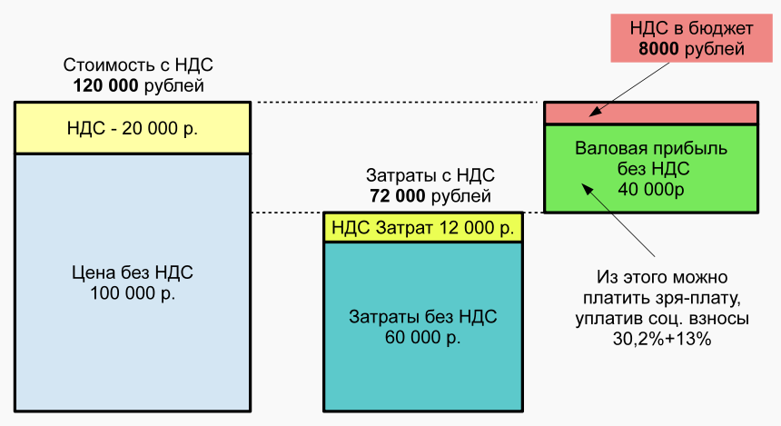
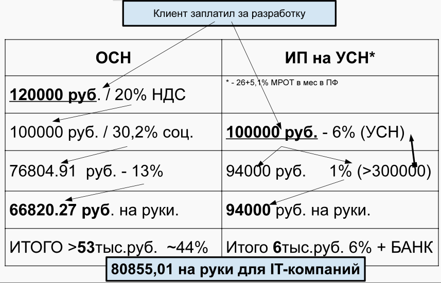
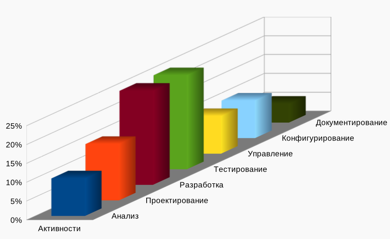

## [MainPage](../index.md)/[Economics Software Engineering](README.md)/Lecture

## 1 Современный IT бизнес в России по разработке ПО   俄罗斯现代 IT 企业软件开发

### Типы компаний связанных с разработкой ПО в РФ   俄罗斯联邦软件开发相关公司类型

- RND центры крупных вендоров.  
  大型供应商的 RND 中心。
- Стартапы и небольшие частные компании  
  初创公司和小型私营公司
- Software подразделения системных интеграторов  
  系统集成商的软件部门
- Оборонные заводы и институты связанные с оборонкой  
  国防工厂和与国防工业相关的机构
- Компании, предоставляющие Web-услуги  
  提供网络服务的公司
- Бизнес-ПО, ориентированное на управление и учет; автоматизация банков  
  以管理和会计为重点的商业软件；银行自动化
- «Железячники»

#### Research &Development центры   研发中心

- ВСПБ Oracle, EMC, Intel, AMD, Veam.  
  VSPB Oracle、EMC、英特尔、AMD、Veam。
- 100-500 разработчиков  
  100-500 名开发人员
- Множество проектных команд  
  多个项目团队
- Западная «бюрократия» с характерным способом ведения бизнеса  
  具有西方特色的“官僚主义”经营方式
- Возможность участвовать в разработке мейнстрим технологий - Высокие зарплаты  
  有机会参与主流技术的开发 - 高薪
- Отсутствие карьерного роста по вертикали  
  缺乏垂直职业发展
- Возможен «диагональный» рост  
  可以实现“对角线”增长

#### Стартапыи небольшиечастные компании   初创公司、小型私营公司

- Появляются и прогорают  
  它们出现并消失
- 3-5 человек  
  3-5 人
- Базируются на оригинальной «идее»  
  基于原创“想法”
- Почти семья →«Санта-Барбара», «Друзья»  
  几乎是家人 → “圣巴巴拉”、“朋友”
- Возможность резкого роста, если идея сработает (маловероятно)  
  如果想法可行，则有大幅增长的潜力（不太可能）
- Карьерный рост вместе с компанией  
  与公司一起成长
- Зарплата нестабильна  
  薪资不稳定

#### Подразделениясистемных интеграторов   系统集成商部门

- Достаточно крупные и обслуживают существующих клиентов  
  规模足够大，并且服务于现有客户
- 3-100 (до 1000) сотрудников  
  3-100 名（最多 1000 名）员工
- Условно-стабильные ЗП, зависящие от общего положения компании, политики.  
  有条件的稳定工资，取决于公司的总体情况和政策。
- Крайности от «Раздолбайство» д о «Формализм» 
  从“马虎”到“形式主义”的极端 

#### Оборонныезаводыи институты связанныес оборонкой   国防工厂和国防相关机构 

- Крупные, неповоротливые, зависящие от государства (госзаказ)  
  规模大、难以管理、依赖国家（政府命令）
- Относительно невысокая 3П  
  3P 相对较低
- Советская (СССР) «бюрократия» с характерным подходом к работе  
  苏联“官僚主义”的工作方式
- Возможность интересной работы  
  有趣的工作机会  
  «Но все жмы делаем ракеты!» (С) Визбор.  
  “但我们仍在制造火箭！” （C）维兹博。
- Вертикальный карьерный рост  
  垂直职业发展

#### Компании, предоставляющие Web-услуги   提供网络服务的公司

- Развитие стартапа, который «вдруг» стал приносить стабильный доход  
  开发一家“突然”开始产生稳定收入的初创企业
- Средний размер  
  中等规模
- Разная прикладная область (м. б. интересно, а может и нет)   
  不同的应用领域（可能有趣，也可能无趣）
- Достойные 3П  
  不错的 3P
- Современные технологии  
  现代技术
- Неопределенный рост  
  增长不确定

#### Бизнес-ПО,автоматизациябанков   商业软件、银行自动化

- 1C, OEBS, SAP
- «Мрак и Копоть» (С) — сложная предметная область и бизнес-процессы  
  “Gloom and Soot”（C）——复杂的主题领域和业务流程
- Стабильная работа «навсегда»  
  “永远”稳定运行
- Большое количество сотрудников  
  员工数量众多
- Очень маленькие и очень большие зарплаты  
  极低和极高的薪水
- Необходимо быть не только программистом но и бухгалтером, психологом, . . . . .  
  你不仅要是一名程序员，还要是一名会计师、心理学家。 。 。 。 。

#### Промышленная автоматизация   工业自动化

- Работа на крупные компании РЖД, Газпром...  
  为俄罗斯铁路公司、俄罗斯天然气工业股份公司等大型公司工作……
- Размер компаний от небольших до средних  
  公司规模从小型到中型
- Куча работы с железом, микроконтроллерами, паяльными станциями  
  大量使用硬件、微控制器、焊接站的工作
- Необходимы инвестиции: закупка дорогого оборудования и ПО  
  需要投资：购买昂贵的设备和软件
- Интересная работа для «гиков»  
  适合“极客”的有趣工作
- Карьерный рост не определен  
  职业发展不确定的

### Экономические особенности разработки «чистого» ПО   清洁软件开发的经济特征

- Нет больших закупок расходных материалов (бумага не в счет)  
  无需大量购买消耗品（纸张不算）
- Относительно невысокие вложения в оборудование? (зависит от...)  
  设备投资相对较低？ （取决于……）
- Расходы на аренду помещения  
  场地租赁费用
- Расходы на зарплату  
  工资支出
- Тщательный подбор кадров  
  精心挑选人员
  - Производительность/сотрудник отличается на порядки  
    员工生产力存在数量级差异 
  - программисты — люди со странностями ;)   
    程序员是奇怪的人 ;) 
- Сложно нормировать рабочий день  
  很难规范工作日

### Налоговые системы РФ   俄罗斯联邦的税收制度

- Налоговый кодекс РФ  
  俄罗斯联邦税法
- Достаточно бюрократичен, запутан и неоднозначно трактуется налоговыми органами  
  税务机关的解释相当官僚、混乱且模棱两可
- Ошибка, неточность >- штраф  
  错误、不准确 >- 惩罚
- Разные системы налогообложения  
  不同的税制
- Подвержен сильным изменениям  
  可能会发生重大变化
- Для эффективной работы необходимы профессиональные юрист и бухгалтер  
  需要专业的律师和会计师才能有效工作

#### Общая система налогообложения 2021   2021 年一般税收制度

- Налог на добавленную стоимость (20%) - Учитывает расходы (уменьшение НДС)  
  增值税（20%） - 考虑费用（增值税减免）
- Взносы в ПФРФ, ФССРФ, ФОМС - Общие 22%, 2,9%, 5,1%  
  向俄罗斯联邦养老基金、联邦社会保险基金和强制性医疗保险基金缴纳的税款 - 一般 22%、2.9%、5.1% 
  - Малые предприятия, для ЗП >МРОТ ежемесячно 10%,0%,5, 1%  
    小型企业，工资>最低工资每月10%，0%，5%，1%
  - Разработка ПО, БД — ІТ-компании. Нужна регистрация и соответствующие коды ОКОНХ в видах деятельности (6%, 1,5%, 0,1%)  
    软件开发、数据库 - IT 公司。需要注册并填写相应活动类型的 OKONH 代码（6%、1.5%、0.1%）
  - «Сколково» в течении 10 лет (14%, 0%, 0%)  
    “斯科尔科沃” 10 年（14%、0%、0%）
  - 0,2% страхование от несчастного случая (разное для разных видов деятельности  
    0.2％意外保险（不同类型的活动有所不同） 
- Подоходный налог 13% для > 5млн 15%  
  所得税 13%（500 万以上） 15%
- Если не выплачивать зарплату, то необходимо заплатить налог на прибыль 20%  
  如果不支付工资，则必须缴纳20%的所得税
- Другие налоги, куча ОТЧЕТОВ!  
  其他税收，一堆报告！

#### НДС 20%: Налогна добавленную стоимость   增值税 20%：增值税

- Разные модели (Доходы, Доходы-Расходы)  
  不同的模型（收入、收入支出）
- Для разработки ПО - Доходы  
  用于软件开发 - 收入
- Нет НДС!  
  不含增值税！
  - Невыгодно, если контрагент на другой системе налогообложения  
    如果交易对手处于不同的税制下，则无利可图 
  - Выгодно НДС \<-\> НДС, НЕТ_НДС\<-\>НЕТ_НДС  
    有利可图的增值税 \<-\> 增值税，无增值税 \<-\> 无增值税 
- ПФРФ, ФССРФ, ФОМС - такие же.  
  PFRF、FSSRF、MHIF - 相同。
  - НО! ИП "за себя":  
  - 32448 + 8426 = 40874 руб. + 1% \> 300000руб.
- 6% ставка нолога УСН, в УСН зачитывается социалка.  
  简化税制税率为6%，社会福利包含在简化税制中。
- Отчеты - минимизированы  
  报告 - 最小化

#### Что все эти цифры и буквы значат для вашего кармана?   这些数字和字母对你的钱包来说意味着什么？

## 2 Оценка трудоемкости разработки программного обеспечения   软件开发复杂性评估

### Распределениезатратв проекте   项目成本分配

#### Оценка трудоемкости почему важно?   为什么劳动强度评估很重要？

- Экономические причины: - Себестоимость  
  经济原因： - 成本价格
  - Планируемые затраты ~ Фактические затраты - Прибыль  
    计划成本 ~ 实际成本 - 利润
- Маркетинговые причины: 
  营销原因：
  - Быстрая оценка входящих запросов
    快速评估传入的请求 
  - Репутация для следующих проектов  
    因下列项目而享有的声誉
- Причины, связанные с персоналом:  
  人员相关原因：
  - Перегруженность  
    超载 
  - Недогруженность - Стимуляция  
    未充分利用 - 刺激 

#### В чем оценивать трудоемкость ПО ?

- Строках кода KSLOC  
  KSLOC 千代码行
  - Физические и логические  
    物理和逻辑 
  - Хорошо подходит для языков ассемблерного типа  
    非常适合汇编类型语言 
- Человеко-часах (месяцах, годах)  
  工时（月、年）
- Попугаях  
  冲刺（Sprint）
  - Безразмерная сложность  
    无量纲复杂性 
- Функциональных точках  
  功能点

## 5 Коммерческие отношения   商业关系

### Что можно продавать при разработке ПО   开发软件可以卖什么？

- Лицензия на программное обеспечение  
  软件许可证
  - Лицензия — передача имущественного права на ПО  
    许可证——软件产权的转让 
  - Неисключительная (использование), исключительная (владение), отчуждение исключительной лицензии ПО  
    非独占（使用）、独占（所有权）、独占软件许可的转让 
  - Не облагается НДС  
    不征收增值税 
- Услуги по разработке  
  开发服务
  - Измеряются в человеко-часах, попугаях  
    以工时计算，冲刺
  - Могут облагаться или не облагаться НДС  
    可能缴纳或不缴纳增值税 
- Программно-аппаратный комплекс  
  硬件和软件综合体
  - Передача (поставка) комплексного решения  
    转移（交付）全面解决方案 
- «Облачный» сервис  
  “云”服务
  - Плата за потребленные ресурсы  
    支付消耗的资源 
- Техническая поддержка  
  技术支援
  - Обычно включает постоянную и переменную (цену за попугаи) составляющие  
    通常包括固定和可变（鹦鹉价格）部分 
- Сертификаты на ПО  
  软件证书
  - Капитальные затраты (CAPEX) vs Операционные затраты (ОРЕХ)  
    资本支出 (CAPEX) 与运营支出 (OREX) 
- С точки зрения финансовых показателей компании стараются уменьшить операционные затраты  
  从财务角度来看，企业正在努力降低运营成本。
- Сертификаты на техническую поддержку  
  技术支持证书

#### Основные риски продажи ПО   销售软件的主要风险

- Типичные конфликты выполнения работ  
  典型的工作执行冲突
  - Сделано не то и не так  
    这是错误的，而且方式不正确 
  - Оплата работ в соответствии с графиком - Непредвиденные обстоятельства  
    按计划支付工作费用 - 不可预见的情况 
  - Нарушение законодательства  
    违反法律 
  - Неработоспособность проданных решений  
    售出的解决方案无法操作
- Как обезопасить разработку?  
  如何保障发展？
  - Договорные отношения  
    合同关系 
  - Точная трактовка всеми сторонами всех условий договорных обязательств  
    各方准确解释合同义务的所有条款 
  - Юристы, бухгалтера и налоговые консультанты  
    律师、会计师和税务顾问 

#### Гражданский кодекс РФ в разработке ПО   俄罗斯联邦软件开发民法典

- Свод законов, определяющих основные отношения между физическими и юридическими лицами  
  一套定义个人与法人之间基本关系的法律
- Определяет основные типы договорных отношений  
  定义合同关系的主要类型
  - Необходимо выбрать тип договора по форме, и соответствовать ему по сути  
    需要按形式选择合同类型，并在实质上与之对应 
- Объемный и для не-юриста запутанный  
  对于非律师来说，体积庞大且令人困惑
- Основные типы отношений:  
  基本关系类型：
  - договор поставки;  
    供货协议； 
  - договор возмездного оказания услуг;  
    提供有偿服务的合同； 
  - договор передачи имущества во временное пользование;  
    临时使用财产转让协议； 
  - публичная оферта.  
    公开发售。 

#### Сделка 交易

- Сделка — действия граждан и юридических лиц, направленных на установление, изменение или прекращение гражданских прав и обязанностей.  
  交易是公民与法人之间设立、变更或终止民事权利义务的行为。
- Любая коммерческая деятельность целиком связана со сделкам.  
  任何商业活动都离不开交易。
- Сделки 交易
  - Односторонние (доверенность, завещание)   
    单边（委托书、遗嘱）
  - Двусторонние  
    双边 
  - Многосторонние
    多边 

#### Договор (п.1ст.420ГК) это сделка   合同（《民法典》第420条第1款）是一种交易

- Выражение согласованной воли двух (двухсторонняя сделка) или более (многосторонняя сделка) сторон  
  两方（双边交易）或多方（多边交易）一致意愿的表达
  - Стороны договора физические и юридические лица  
    协议双方为个人和法人  
  - Условия — по усмотрению сторон (кроме случаев, явно предписанных законом)  
    条件 - 由双方自行决定（法律明确规定的情况除外） 
  - Стороны должны быть правоспособны и дееспособны  
  当事人必须具有法律行为能力和行为能力
- Глава 27, 28 ГК РФ  
  俄罗斯联邦民法典第27、28章

#### Договор:вступлениев силу   协定：生效

- Консенсуальный договор — с момента установления сторонами консенсуса по существенным условиям договора  
  合意合同 - 从双方就合同基本条款达成共识的那一刻起
  - Права и обязанности — с момента подписания  
    权利和义务 - 从签署之日起 
- Реальный договор — существенные условия + передача чего-либо.  
  真正的合同是由基本条款+某物的转让组成的。
  - Заем считается заключенным с момента передачи денег  
    从资金转账那一刻起，贷款即视为结束 
- Государственная регистрация
  - С момента государственной регистрации

#### Договор: встречное исполнение   协议：反履行

- Возмездные договора - встречное предоставление за исполнение своих обязанностей  
  补偿性合同——对履行职责的报酬
  - «Утром деньги — вечером стулья» (С)   
     早上有钱，晚上有椅子”
  - Договор «по умолчанию» - возмездный  
    “默认”协议是付费协议 
- Безвозмездные договора  
  无偿合同
  - Нет встречного предоставления  
    无反履约 
  - «Я тебе подарю на закате зарю» (С)  
    我将在日落时给你黎明 

#### Договор: форма свершения   合同：履行形式

- Устная форма (ст. 159 ГК)  
  口头形式（《民法典》第159条）
  - <10MPOT, только «физики», в момент свершения   
    <10MPOT，只有“物理学家”，在完成的时刻 
- Простая письменная форма (ст. 161 ГК)  
  简易书面形式（民法第161条）
  - «физик-юрик», «юрик-юрик»  
    “物理学家-律师”、“律师-律师” 
  - Документ подписанный сторонами в нескольких копиях  
    双方签署的文件一式多份 
  - Может быть эл. версия, с использованием, например, цифровых подписей  
    也许是 el。使用数字签名等版本 
- Нотариальная письменная форма  
  经过公证的书面形式
  - В случаях, указанных в законе  
    法律规定的情况
  - По соглашению сторон  
    经双方同意 
- Государственная регистрация  
  州注册

#### Договор: Цели заключения   合同：缔结的目的

- Придать отношениям сторон характер обязательств, защищенных законом  
  赋予当事人关系受法律保护的义务性质
- Определить порядок, способы и последовательность исполнения  
  确定执行的顺序、方法和顺序
- Предусмотреть последствия невыполнения обязательств  
  规定未能履行义务的后果

#### Договор: Содержание   协议：内容

- Исходя из целей договора, каждый договор имеет собственное содержание  
  根据合同目标，每份合同都有自己的内容
- Структура (основные пункты) договоров СХОЖИ  
  合同的结构（要点）相似
- Договор содержит реквизиты  
  协议包含详细信息
  - Название 姓名
  - Дату заключения 签订日期
  - Место заключения 地点
- Название договора == юридический тип  
  合同名称 == 法律类型  
  договора из ГК РФ  
  俄罗斯联邦民法典中的合同

#### Договор: существенные условия   协议：基本条款

- Договор считается заключенным, если между сторонами, в требуемой в надлежащих случаях форме, достигнуто соглашение по всем существенным условиям договора. (ст. 432 ГК)  
  如果双方已就合同的所有必要条款以适当情况下所要求的形式达成一致，则合同应视为已成立。 （民法第432条）
  - Предмет договора 
    协议主题
  - Условия, необходимые для заключения договоров данного вида согласно законам (актам)  
    根据法律（法案）订立此类合同的必要条件 
  - Иные условия, по которым, по заявлению любой из сторон, должно быть достигнуто соглашение  
    根据任何一方的要求，需要达成协议的其他条件 
- Форма договора должна соответствовать требованиям законов к таким документам  
  协议的形式必须符合法律对此类文件的要求

#### Договор: примерная структура   合同：样本结构

1) Реквизиты договора.  
   合同细节。
2) Преамбула, включающая название сторон и указание на то, что они заключили настоящий договор.  
   序言，包括各方的名称及其已签订本协议的迹象。
3) Предмет договора.  
   协议主题。
4) Срок действия договора (в случае необходимости).  
   合同期限（如有必要）。
5) Права и обязанности сторон.  
   双方的权利和义务。
6) Расчеты сторон.  
   当事人的计算。
7) Ответственность сторон.  
   当事人的责任。
8) Разрешение споров.  
   争议解决。
9)  Заключительные положения.  
    最后条款。
10) Юридические адреса и банковские реквизиты сторон.  
    双方的法定地址和银行详细信息。
11) Подписи сторон.  
    双方当事人的签名。

#### Договор: Порядок заключения   协议：缔结程序

- Переговоры о заключении договора (ст. 434.1 ГК) - Свобода переговоров  
  签订合同的谈判（《民法典》第 434.1 条） - 谈判自由
  - Самостоятельное несение расходов   
    自付费用 
  - Свобода от ответственности за не заключение договора  
    不承担因未能签订合同而产生的责任 
  - Добросовестность переговоров  
    诚信谈判
    - Отсутствие намерения заключить договор  
      缺乏达成协议的意愿 
    - Предоставление неполной и недостоверной информации  
      提供不完整或虚假的信息 
    - Внезапное и неоправданное прекращение переговоров  
      突然无理终止谈判 
    - Если суд признает переговоры недобросовестными, то виновная сторона должна возместить убытки по ведению переговоров  
      如果法院认定谈判存在恶意，有过错的一方必须赔偿谈判所造成的损失。 
    - Соглашение о «Добросовестном ведении переговоров»  
      关于“善意谈判”的协议 

- Оферта — предложение стороны считать себя заключившим договор с адресатом (ст. 435 ГК)  
  要约是一方当事人提出认为自己已与对方达成协议的建议（《民法典》第 435 条）
  - Содержит ВСЕ существенные условия договора  
    包含合同的所有基本条款 
  - С момента получения адресатом связывает направившее лицо  
    自收件人收到包裹的那一刻起，寄件人即受约束
  - Отзыв оферты  
    撤销要约 
    - Не возможен в течении срока акцепта оферты (ст. 436 ГК)   
      在接受要约期间不可能（《民法典》第 436 条） 
    - Если направлен раньше оферты — то она не получена  
      如果在报价之前发送，则不会收到。 
  - Публичная оферта (ст. 437 ГК)  
    公开募股（《民法典》第437条） 
    - Реклама или предложения неопределенному кругу лиц  
      向不确定数量的人提供广告或优惠 
- Акцепт — ответ лица о принятии оферты  
  接受是一个人对接受提议的反应
  - Договор считается заключенным (ст. 433 ГК) в момент получения акцепта лицом направившим оферту  
    当要约人收到接受时，合同即视为成立（《民法典》第 433 条）。 
    - см. выше о реальном договоре и гос. регистрации  
      请参阅上文有关真实合同和国家的内容。登记 
    - Отзыв акцепта после получения оферентом считается односторонним отказом от исполнения обязательств  
      要约人收到承诺后撤销承诺，视为单方面拒绝履行义务 
  - Должен быть полным и безоговорочным. НО:  
    必须是完整且无条件的。但： 
    - Протокол разногласий  
      分歧处理协议 
    - Договор присоединения (ст. 428 ГК) — договор лишает сторону прав д л я договоров такого вида, исключает ответственность стороны, другие обременительные обязательства  
      附随协议（《民法典》第 428 条） - 该协议剥夺了该类协议的一方的权利，免除了该方的责任和其他繁重的义务 
  - Молчание не является акцептом (ст. 438 ГК)  
    沉默不代表接受（《民法典》第438条）

#### Договор: проведение торгов   合同：进行招标
 
- Договор может быть заключен с лицом, выигравшим торги (ст. 447 ГК)  
  可以与中标人签订合同（《民法典》第 447 条）
  - Аукцион, конкурс или иная форма (определяется собственником вещи)  
    拍卖、比赛或其他形式（由物品所有者决定） 
  - Наиболее высокая цена, лучшие условия  
    最高的价格，最好的条件 
  - Аукцион или конкурс несостоялись, если 1 участник  
    如果只有 1 名参与者，则拍卖或竞赛失败 

#### Договор: Зачет требованийи  исполнение договора   合同：债权抵销及合同执行

- Между одними и теми же сторонами по разным договорам  
  不同合同下的同一当事人之间
- По соглашение сторон (двусторонний документ)  
  经双方同意（双边文件）
- Требование одной из сторон (заявление или письмо)  
  一方当事人的要求（声明或信函）
  - Согласие второй стороны не требуется  
    无需对方同意 
  - Вторая сторона может оспорить через суд наличие условий зачета и действительность требований  
    另一方可以向法院质疑抵消条件的存在和索赔的有效性。 
- Исполнение возможно по частям (гл. 22 ГК)  
  可以分批执行（《民法典》第 22 章）

#### Договор: Обеспечительные обязательства (ст.3 2 9ГК)

- Неустойка  
  惩罚
- Залог  
  保证
- Поручительство  
  保证人
- Задаток  
  订金
- Удержание имущества должника  
  扣押债务人的财产
- Независимая (н-р банковска) гарантия  
  独立（例如银行）担保
- Обеспечительный платеж  
  押金
- Иные способы (отказ от оплаты недопоставленных товаров или услуг, предоплата ).  
  其他方法（拒绝支付未交付的货物或服务、预付款）。

#### Договор: ответственность за неисполнение обязательств   合同：未履行义务的责任

- Употерпевшей стороны возникают убытки, которые должник должен возместить кредитору  
  受害方遭受损失，债务人必须赔偿债权人
  - Реальный ущерб (имущество потерпевшего уменьшается)  
    实际损害（受害人的财产减少） 
  - Упущенная выгода (имущество потерпевшего не увеличивается)  
    利润损失（受害人的财产没有增加） 
  - В суде необходимо доказать, что размер рассчитанных убытков должен быть справедливым  
    在法庭上，必须证明计算的损害赔偿金额必须公平。 
- Неустойка  
  惩罚
  - Например, с 2015 года ст. 395 ГК — процент за использование денежных средств  
    例如，自 2015 年起，Art.民法典第 395 条 - 资金使用利息 
- Обычно на размер реально уплаченной суммы (н-р предоплаты) - Ставка определяется ключевой ставкой Банка России  
  通常按实际支付金额计算（如预付款） - 利率由俄罗斯银行基准利率决定

#### Договор: Изменение

- Изменение — пересмотр условий при сохранениисамогодоговоравсиле  
  变更-修改条件，同时保持合同本身有效
  - По соглашению сторон (ст. 450-453 ГК)  
    经双方同意（《民法典》第 450-453 条） 
  - В той же форме, что и при заключении  
    与结论部分形式相同 
    - Дополнительное соглашение в виде одного документа  
      以文件形式签署的附加协议 
    - Через обмен документами (оферта, акцепт)  
      通过交换文件（要约、承诺） 
  - Письменная форма может считаться соблюденной если сторона, получившая оферту, совершит фактические действия по выполнению условий.  
    如果接受要约的一方采取实际行动履行条款，则可认为已遵守书面形式。 
- М.Б. по требованию одной стороны (необходимо решение суда, вступившего в законную силу)  
  M.B.应一方当事人的请求（需有生效的法院判决）