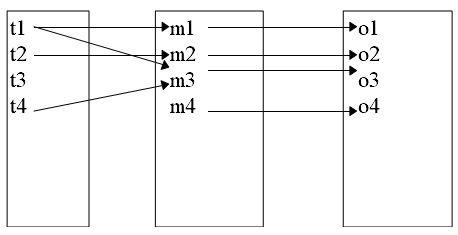

<head>
    <script src="https://cdn.mathjax.org/mathjax/latest/MathJax.js?config=TeX-AMS-MML_HTMLorMML" type="text/javascript"></script>
    <script type="text/x-mathjax-config">
        MathJax.Hub.Config({
            tex2jax: {
            skipTags: ['script', 'noscript', 'style', 'textarea', 'pre'],
            inlineMath: [['$','$']]
            }
        });
    </script>
</head>

## [MainPage](../index.md)/[Algorithm&DataStructures](README.md)/Lecture

- [Lecture 1](#lecture-1)
  - [Ретроспективный анализ подходов к формированию множества угроз информации  各种信息威胁形成途径的回顾性分析](#ретроспективный-анализ-подходов-к-формированию-множества-угроз-информации--各种信息威胁形成途径的回顾性分析)
  - [2.4. Цели и задачи оценки угроз информации в современных системах ее обработки](#24-цели-и-задачи-оценки-угроз-информации-в-современных-системах-ее-обработки)
  - [2.5. Система показателей уязвимости информации](#25-система-показателей-уязвимости-информации)
  - [2.6. Классификация и содержание угроз информации](#26-классификация-и-содержание-угроз-информации)
- [Lecture 5-6 Модели безопасности](#lecture-5-6-модели-безопасности)
  - [12.1. Модели разграничения доступа](#121-модели-разграничения-доступа)
  - [12.2. Модели дискреционного доступа](#122-модели-дискреционного-доступа)
    - [12.2.1. Модель дискреционного доступа АДЕПТ-50.](#1221-модель-дискреционного-доступа-адепт-50)
    - [12.2.2. Пятимерное пространство Хартсона](#1222-пятимерное-пространство-хартсона)
    - [12.2.3. Модель Харрисона-Руззо-Ульмана](#1223-модель-харрисона-руззо-ульмана)
  - [12.3. Модели мандатного доступа](#123-модели-мандатного-доступа)
    - [12.3.1. Модель Белла и Лападула](#1231-модель-белла-и-лападула)
  - [12.4. Специализированные модели](#124-специализированные-модели)
    - [12.4.1. Модель MMS](#1241-модель-mms)
  - [12.5. Проблемы моделей предоставления прав 权利模型的问题](#125-проблемы-моделей-предоставления-прав-权利模型的问题)
  - [12.6. Информационные модели](#126-информационные-модели)
    - [12.6.1. Модель невмешательства](#1261-модель-невмешательства)
    - [12.6.2. Модель невыводимости](#1262-модель-невыводимости)
  - [12.7. Вероятностные модели](#127-вероятностные-модели)
    - [12.7.1. Игровая модель](#1271-игровая-модель)
    - [12.7.2.Модель системы безопасности с полным перекрытием](#1272модель-системы-безопасности-с-полным-перекрытием)
  - [12.8 .Модели контроля целостности 完整性控制模型](#128-модели-контроля-целостности-完整性控制模型)
    - [12.8.1. Модель Биба 比巴模型](#1281-модель-биба-比巴模型)
    - [12.8.2. Модель Кларка-Вилсона](#1282-модель-кларка-вилсона)
  - [12.9. Механизмы защиты от угрозы отказа в обслуживании](#129-механизмы-защиты-от-угрозы-отказа-в-обслуживании)
    - [12.9.1. Основные понятия ОВО](#1291-основные-понятия-ово)
    - [12.9.3. Модель Миллена распределения ресурсов (МРР)](#1293-модель-миллена-распределения-ресурсов-мрр)
- [Lecture 9](#lecture-9)
  - [4. Идентификация и аутентификация субъектов](#4-идентификация-и-аутентификация-субъектов)
    - [4.1. Классификация подсистем идентификации и аутентификации субъектов](#41-классификация-подсистем-идентификации-и-аутентификации-субъектов)
    - [4.2. Парольные системы идентификации и аутентификации пользователей](#42-парольные-системы-идентификации-и-аутентификации-пользователей)
    - [4.3. Идентификация и аутентификация с использованием индивидуальных биометрических характеристик пользователя](#43-идентификация-и-аутентификация-с-использованием-индивидуальных-биометрических-характеристик-пользователя)
    - [4.4. Выводы](#44-выводы)
  - [8. Протоколы безопасной аутентификации пользователей](#8-протоколы-безопасной-аутентификации-пользователей)
    - [8.1. Аутентификация на основе сертификатов](#81-аутентификация-на-основе-сертификатов)
    - [8.2. Процедура «рукопожатия»](#82-процедура-рукопожатия)
    - [8.3. Протокол Диффи-Хеллмана](#83-протокол-диффи-хеллмана)
    - [8.4. Выводы](#84-выводы)


# Lecture 1

## Ретроспективный анализ подходов к формированию множества угроз информации <br> 各种信息威胁形成途径的回顾性分析

Вопрос об угрозах информации возник практически одновременно с началом регулярного сбора, обработки и использования информации. Известно, что шифрование информации в целях сохранения ее тайны применял еще древнеримский диктатор Цезарь. За столетия развития традиционных (бумажных) технологий выработана весьма стройная и высокоэффективная система выявления и нейтрализации угроз.

Особую актуальность и новое содержание проблемы формирования множества угроз приобрела в 60-е - 70-е годы нашего столетия в связи с регулярным использованием для обработки и хранения информации средств электронно-вычислительной техники. При этом раньше других интерес был проявлен к угрозам физической целостности информации, поскольку другие виды угроз были менее актуальны. (Например, угроза несанкционированного получения информации в значительной мере нейтрализовывалась ограничениями на автоматизированную обработку секретных данных). Но по мере расширения сфер и масштабов использования вычислительной техники проблемы предупреждения несанкционированного получения закрытой информации приобретали все большую остроту, в связи с чем росла и актуальность задачи выявления соответствующих угроз.

При обработке информации средствами электронно-вычислительной техники (ЭВТ) возникает большое количество угроз как прямого несанкционированного доступа к защищаемой информации, так и косвенного ее получения средствами технической разведки.

Известно пять групп основных угроз: хищение носителей, запоминание или копирование информации, несанкционированное подключение к аппаратуре, несанкционированный доступ к ресурсам ЭВТ, перехват побочных излучений и наводок.

В некоторых источниках предпринята попытка классификации угроз, причем в качестве критерия классификации принят тип средств, с помощью которого может быть осуществлено несанкционированное получение информации. Выделено три типа средств: человек, аппаратура и программа. В группе угроз, в реализации которых основную роль играет человек, названы: хищение носителей, чтение информации с экрана, чтение информации с распечаток; в группе, где основным средством выступает аппаратура подключение к устройствам и перехват излучений; в группе, где основное средство программа — несанкционированный программный доступ, программное дешифрование зашифрованных данных, программное копирование информации с носителей.

Также, угрозы могут быть классифицированы по возможному их источнику; причем выделено три класса: природные (стихийные бедствия, магнитные бури, радиоактивное излучение и наводки); технические (отключение или колебания электропитания, отказы и сбои аппаратно-программных средств, электромагнитные излучения и наводки, утечки через каналы связи); созданные людьми, причем различаются непреднамеренные и преднамеренные действия различных категорий лиц.

В руководящем документе Гостехкомиссии России (сейчас ФСТЭК) введено понятие модели нарушителя в автоматизированной системе (АС), причем в качестве нарушителя рассматривается субъект, имеющий доступ к работе со штатными средствами АС. Нарушители классифицируются по уровню возможностей, предоставляемых им штатными средствами, причем выделяются четыре уровня этих возможностей:

1. первый — возможности запуска задач (программ) из фиксированного набора, реализующих заранее предусмотренные функции обработки информации;
2. второй — дополнительно к предыдущему предусматривает возможности создания и запуска собственных программ с новыми функциями обработки информации;
3. третий — дополнительно к предыдущему предполагает возможности управления функционированием АС, т.е. воздействия на базовое программное обеспечение системы и на состав и конфигурацию ее оборудования);
4. четвертый — определяется всем объемом возможностей лиц, осуществляющих проектирование, реализацию и ремонт технических средств АС, вплоть до включения в состав средств системы собственных технических средств с новыми функциями обработки информации.

Предполагается, что нарушитель на своем уровне является специалистом высшей квалификации, знает все об АС, в том числе и о средствах защиты. 

Своеобразный вид угроз представляют специальные программы, скрытно и преднамеренно внедряемые в различные функциональные программные системы и которые после одного или нескольких запусков разрушают хранящуюся в них информацию и/или совершают другие недозволенные действия. К настоящему времени известно несколько разновидностей таких программ: электронные вирусы, компьютерные черви, троянские кони.

Электронные вирусы — это такие вредоносные программы, которые не только осуществляют несанкционированные действия, но обладают способностью к саморазмножению, в силу чего представляют особую опасность дня электронно-вычислительных сетей. Однако, для размножения им необходим носитель (файл, диск), что, естественно, создает для злоумышленников определенные трудности в осуществлении их несанкционированных действий.

Троянскими конями названы такие вредоносные программы, которые злоумышленно вводятся в состав программного обеспечения и в процессе обработки информации осуществляют несанкционированные процедуры, чаще всего - процедуры незаконного захвата защищаемой информации, например, записывая ее в определенные места ЗУ или выдавая злоумышленникам.

К компьютерным червям отнесены вредоносные программы, подобные по своему воздействию электронным вирусам, но не требующие для своего размножения специального носителя. Они обычно используют дополнительный вход в операционную систему, который создается для удобства ее отладки и который нередко забывают убрать по окончанию отладки.

Раньше других появились и использовались в злоумышленных целях троянские кони, сведения о них относятся еще к семидесятым годам, причем наиболее распространенной несанкционированной процедурой было считывание информации с областей ЗУ, выделяемых законным пользователям. Первое сообщение о возможности создания электронных вирусов было сделано в 1984 г. на одной из конференций по безопасности информации, а уже в 1985 г. была осуществлена вирусная атака на компьютерную систему подсчета голосов в конгрессе США, вследствие чего она вышла из строя. В 1987 г. зафиксированы факты появления вирусов в нашей стране.

О возможных последствиях таких угроз мощно судить по следующему примеру. Адъюнкт Корнельского университета США 25-летний Роберт Моррис (кстати, сын сотрудника Агентства национальной безопасности США) 2 ноября 1988 г. произвел вирусную атаку на национальную сеть Milnet/Arpanet и международную компьютерную сеть Internet, в результате чего было выведено из строя около 6000 компьютеров. Вирус был введен в один из узлов сети, затем он разослал свои копии (длина 99 строк на языке Си), в другие узлы. В узле-получателе копия копировалась и выполнялась. В процессе выполнения с узла-источника копировалось остальное тело вируса. Общий размер вируса составил около 60 Кбайт. Хотя вирус не производил действий по разрушению или модификации информации, а способы ликвидации его были найдены уже на второй день, ущерб от его действия оценивался более чем в 150 тысяч долларов. Исследовательскому же центру НАСА в г. Маунтинн Вью (Калифорния) пришлось на два дня закрыть свою сеть для восстановления нормального обслуживания 52000 пользователей.

Уже такого беглого взгляда на вредоносные программы достаточно, чтобы убедиться в большой опасности их как угроз информации в современных средствах ЭВТ.

## 2.4. Цели и задачи оценки угроз информации в современных системах ее обработки

Оценка угроз заключается в определении значений тех показателей, которые необходимы для решения всех задач, связанных с построением и эксплуатацией механизмов защиты информации. Тогда общую задачу оценки угроз можно представить совокупностью следующих составных частей:

1. обоснование структуры и содержания системы показателей, необходимых для исследований и практического решения всех задач, связанных с защитой информации;
2. обоснование структуры и содержания тех параметров, которые оказывают существенное влияние на значения показателей уязвимости информации;
3. разработка комплексов моделей, отображающих функциональные зависимости показателей от параметров и позволяющих определять значения всех необходимых показателей уязвимости информации во всех
представляющих интерес состояниях и условиях жизнедеятельности СОД;
4. разработка методологии использования моделей определения значений показателей уязвимости при исследованиях и практическом решении различных вопросов защиты, или иначе — разработка методологии оценки уязвимости информации.

В следующих параграфах данной главы излагаются методы подхода к решению перечисленных составных задач.

## 2.5. Система показателей уязвимости информации

Для системной оценки уязвимости информации в системе обработки данных (СОД) необходима система показателей, которая отражала бы все требования к защите информации, а также структуру СОД, технологию и условия автоматизированной обработки информации.

Уязвимость информации необходимо оценивать в процессах: разработки и внедрения СОД, функционирования СОД на технологических участках автоматизированной обработки информации, функционирования СОД независимо от процессов обработки информации. Уязвимость информации в процессе разработки и внедрения СОД обуславливается уязвимостью создаваемых компонентов системы и создаваемых баз данных.

Особое значение на данной стадии имеет минимизация уязвимости программного обеспечения, поскольку от этого существенно зависит общая уязвимость информации в СОД.

Условия автоматизированной обработки информации характеризуются главным образом совокупностью следующих параметров:

- структурой СОД, чем определяется состав, подлежащих защите объектов и элементов; наличием и количеством угроз, потенциально возможных в структурных компонентах СОД;
- количеством и категориями лиц, которые могут быть потенциальными нарушителями статуса защищаемой информации; режимами автоматизированной обработки информации.

Уязвимость информации в процессе функционирования СОД независимо от процесса обработки информации обуславливается тем, что современные СОД представляют собою организационную структуру с высокой концентрацией информации, которая может быть объектом случайных или злоумышленных воздействий даже в том случае, если автоматизированная обработка ее не осуществляется.

Поскольку воздействие на информацию различных факторов в значительной мере является случайным, то в качестве количественной меры уязвимости информации наиболее целесообразно принять вероятность нарушения защищаемых характеристик ее при тех условиях сбора, обработки и хранения, которые имеют место в СОД, а также потенциально возможные размеры (математическое ожидание) нарушения защищенности информации.

Основными параметрами, определяющими вероятность нарушения защищенности информации, являются:

- количество и типы тех структурных компонентов СОД, в которых оценивается уязвимость информации;
- количество и типы случайных угроз, которые потенциально могут проявиться и оказать негативное воздействие на защищаемую информацию;
- количество и типы злоумышленных угроз, которые могут иметь место и оказать воздействие на информацию;
- число и категории лиц, которые потенциально могут быть нарушителями правил обработки защищаемой информации; виды защищаемой информации.

Множество разновидностей различных показателей уязвимости определяется декартовым произведением чисел, характеризующих количество значений всех значащих параметров. Если не разделять угрозы на случайные и злоумышленные (т.е. рассматривать их единым множеством) и не разделять защищаемую информацию на виды, то структура полного множества разновидностей показателей уязвимости может быть наглядно представлена так, как показано на рис. 2.4, из которого следует, что два показателя занимают особое положение, а именно: первый находится в самом начале выбранной системы координат, второй — в самом конце классификационной структуры, т.е. занимает крайнее положение справа, вверху и спереди.

<div align=center></div>
<center>Рис. 2.4. Структура множества показателей уязвимости информации в СОД.</center>

Первый показатель обозначает уязвимость информации в одном структурном компоненте СОД при однократном проявлении одной угрозы и относительно одного потенциального нарушителя. Все другие показатели приведенного на рисунке множества могут быть выражены в виде некоторой функции этого показателя. Второй выделенный выше показатель характеризует общую уязвимость, т.е. уязвимость информации в СОД в целом по всем потенциально возможным угрозам относительно всех потенциально возможных нарушителей. Первый показатель назовем базовым, второй — общим. Тогда другие показатели приведенного на рис. 2.4. множества можно назвать частично обобщенными.

Однако для исследования и практического решения задач зашиты информации наряду с рассмотренными выше необходимы еще такие показатели, которые характеризуют наиболее неблагоприятные ситуации с точки зрения уязвимости информации. Такими являются: самый уязвимый структурный компонент АСОД, самая опасная угроза, самый опасный нарушитель. Эти показатели могут быть названы экстремальными.

## 2.6. Классификация и содержание угроз информации

Одной из наиболее принципиальных особенностей проблемы защиты информации является абсолютный характер для обеспечения возможностей реализации упреждающей стратегии зашить требования полноты всех угроз информации, потенциально возможных в современных СОД. Даже одна неучтенная (невыявленная или непринятая все внимание) угроза может в значительной мере снизить эффективность защиты. В то же время проблема формирования полного множеств угроз относится к числу ярко выраженных неформализованных проблем. Обусловлено это тем, что архитектура современны средств автоматизированной обработки информации, организационное структурное функциональное построение информационно-вычислительных систем и сетей, технология и условия автоматизированной обработки информации такие, что накапливаемая, хранимая и обрабатываемая информация подвержена случайным влияниям чрезвычайно большого числа факторов многие из которых должны быть квалифицированы как дестабилизирующие. Убедительным доказательством справедливости утверждения о неформализуемости задачи формирования полного множества угроз может служить тот факт, что в имеющихся достаточно многочисленных публикациях по проблемам защиты информации обсуждаемая задача практически даже не поставлена.

Таким образом, возникает ситуация, когда, с одной стороны, требование необходимости решения задачи является абсолютным, а с другой, регулярные методы решения этой задачи отсутствуют. Рассмотрим возможные подходы разрешения данного противоречия.

Одним из наиболее адекватных и эффективных методов формирования и особенно проверки множества потенциально возможных угроз является метод натурных экспериментов. Суть его заключается в том, что на существующих СОД проводятся специальные эксперименты, в процессе которых выявляются и фиксируются проявления различных дестабилизирующих факторов. При надлежащей организации экспериментов и достаточной их продолжительности можно набрать статистические данные, достаточные для обоснованного решения рассматриваемой задачи. Однако постановка таких экспериментов будет чрезвычайно дорогостоящей и сопряжена с большими затратами сил и времени. Поэтому данный метод целесообразен не для первоначального формирования множества угроз, а для его уточнения и дополнения, осуществляемого попутно с целевым функционированием СОД.

Таким образом, возникает ситуация, когда, с одной стороны, требование необходимости решения задачи является абсолютным, а с другой, регулярные методы решения этой задачи отсутствуют. Рассмотрим возможные подходы разрешения данного противоречия.

Одним из наиболее адекватных и эффективных методов формирования и особенно проверки множества потенциально возможных угроз является метод натурных экспериментов. Суть его заключается в том, что на существующих СОД проводятся специальные эксперименты, в процессе которых выявляются и фиксируются проявления различных дестабилизирующих факторов. При надлежащей организации экспериментов и достаточной их продолжительности можно набрать статистические данные, достаточные для обоснованного решения рассматриваемой задачи. Однако постановка таких экспериментов будет чрезвычайно дорогостоящей и сопряжена с большими затратами сил и времени. Поэтому данный метод целесообразен не для первоначального формирования множества угроз, а для его уточнения и дополнения, осуществляемого попутно с целевым функционированием СОД.

Для первоначального формирования возможно более полного множества угроз наиболее целесообразно использовать экспертные оценки в различных их модификациях. Однако при этом не может быть гарантировано формирование строго полного их множества. Поэтому будем называть формируемое таким образом множество относительно полным, подчеркивая этим самым его полноту относительно возможностей экспертных методов.

В соответствии с рассмотренной там методикой проводились работы по формированию относительно полных множеств угроз различного вида.

Для примера рассмотрим далее структуру и содержание относительно полного множества каналов несанкционированного получения информации КНПИ). Под КНПИ понимаются такие угрозы, следствием проявления которых может быть получение (или опасность получения) защищаемой информации лицами или процессами, не имеющими на это законных полномочий.

Прежде всего было установлено, что с целью формирования возможно более полного множества КНПИ необходимо построить строго полную классификационную их структуру. Такая структура может быть построена, если в качестве критериев классификации выбрать следующие два показателя:
1. отношение к состоянию защищаемой информации в СОД;
2. степень взаимодействия злоумышленника с элементами СОД.

По первому критерию будем различать два состояния: безотносительно к обработке (несанкционированное получение информации может иметь место даже в том случае, если она не обрабатывается, а просто хранится в СОД) и в процессе непосредственной обработки средствами СОД.

Полная структуризация второго критерия может быть осуществлена выделением следующих его значений:

1. без доступа к элементам СОД (т.е. косвенное получение информации);
2. с доступом к элементам СОД, но без изменения их состояния или содержания;
3. с доступом к элементам СОД и с изменением их содержания или состояния. Классификационная структура КНПИ представлена на рис.2.5.

Полнота представленной классификационной структуры гарантируется тем, что выбранные критерии классификации охватывают все потенциально возможные варианты взаимодействия злоумышленника с АСОД, а структуризация значений критериев осуществлялась по методу деления целого на части.

Таким образом, все множество потенциально возможных КНПИ может быть строго разделено на шесть классов; содержание и обозначение выделенных классов приведены на рис. 2.5.

Следующим шагом на пути решения рассматриваемой задачи является обоснование возможно более полного перечня КНПИ в пределах каждого из шести классов. Эта работа выполнялась преимущественно эвристическими методами, в силу чего полнота полученных перечней не может быть гарантирована. Поэтому сформированное множество КНПИ является полным лишь относительно, т.е. лишь относительно имеющей степени познания природы появления каналов.

<div align=center></div>
<center>Рис. 2.5. Классификационная структура каналов несанкционированного получения информации</center>

Уязвимость информации, т.е. нарушение установленного статуса и требуемого уровня ее защищенности есть событие, возникающее как результат такого стечения обстоятельств, когда в силу каких-то причин используемые в СОД средства защиты не в состоянии оказать достаточного противодействия проявлению угроз нежелательного их воздействия на защищаемую информацию. Модель уязвимости информации в СОД в самом общем виде представлена на рис. 2.6.

<div align=center></div>
<center>Рис. 2.6. Общая модель процесса уязвимости информации</center>

Приведенная модель детализируется при изучении конкретных видов уязвимости информации: нарушения целостности, несанкционированной модификации, несанкционированного получения, несанкционированного размножения.

При детализации общей модели основное внимание акцентируется на то обстоятельство, что подавляющее большинство нарушений целостности информации осуществляется в процессе ее обработки на различных участках технологических маршрутов. При этом целостность информации в каждом объекте СОД существенно зависит не только от процессов, происходящих на объекте, но и от целостности информации, поступающей на его вход.

Основную опасность представляют случайные дестабилизирующие факторы (отказы, сбои и ошибки компонентов СОД), которые потенциально могут проявиться в любое время, и в этом отношении можно говорить о регулярном потоке этих факторов. Из стихийных бедствий наибольшую опасность представляют пожары, опасность которых в большей или меньшей степени также является постоянной. Опасность побочных явлений практически может быть сведена к нулю путем надлежащего выбора места для помещений СОД и их оборудования. Что касается злоумышленных действий, то они связаны главным образом с несанкционированным доступом к ресурсам СОД. При этом наибольшую опасность представляет занесение вирусов.

С точки зрения несанкционированного получения информации принципиально важным является то обстоятельство, что в современных СОД несанкционированное получение информации возможно не только путем непосредственного доступа к базам данных, но и многими путями, не требующими такого доступа. При этом основную опасность представляют злоумышленные действия людей. Воздействие случайных факторов само по себе не ведет к несанкционированному получение информации, оно лишь способствует появлению; КНПИ, которыми может воспользоваться злоумышленник. Структурированная схема потенциально возможных злоумышленных действий в современных СОД для самого общего случая представлена на рис. 2.7.

<div align=center></div>
<center>Рис. 2.7. Структурная схема потенциально возможных злоумышленных действий в СОД</center>

Выделенные на рисунке зоны характеризуются следующим образом:
- внешняя неконтролируемая зона — территория вокруг СОД, на
которой персоналом и средствами СОД не применяются никакие средства и не
осуществляются никакие мероприятия для защиты информации;
- зона контролируемой территории — территория вокруг помещений
СОД, которая .непрерывно контролируется персоналом или средствами СОД;
- зона помещений СОД — внутреннее пространство тех помещений, в
которых расположены средства системы:
- зона ресурсов СОД — та часть помещений, откуда возможен
непосредственный доступ к ресурсам системы;
- зона баз данных — та часть ресурсов системы, с которых возможен
непосредственный доступ к защищаемым данным.

Злоумышленные действия с целью несанкционированного получения информации в общем случае возможны в каждой из перечисленных зон. При этом для несанкционированного получения информации необходимо одновременное наступление следующих событий:

- нарушитель должен получить доступ в соответствующую зону;
- во время нахождения нарушителя в зоне в ней должен проявиться
(иметь место) соответствующий КНПИ;
- соответствующий КНПИ должен быть доступен нарушителю
соответствующей категории;
- в КНПИ в момент доступа к нему нарушителя должна находиться
защищаемая информация.

Рассмотрим далее трансформацию общей модели уязвимости с точки
зрения несанкционированного копирования информации. Принципиальными
особенностями этого процесса являются следующие:

1. любое несанкционированное копирование есть злоумышленное действие;
2. несанкционированное копирование может осуществляться в организациях-разработчиках компонентов СОД, непосредственно в СОД и сторонних организациях, причем последние могут получать носитель, с которого делается попытка снять копию как законным, так и незаконным путем.

Попытки несанкционированного копирования информации у разработчика и в СОД есть один из видов злоумышленных действий с целью несанкционированного ее получения и поэтому имитируются приведенной выше (см. рис. 2.7.) моделью. Если же носитель с защищаемой информацией каким-либо путем (законным или незаконным) попал в стороннюю организацию, то для его несанкционированного копирования могут использоваться любые средства и методы, включая и такие, которые носят характер научных исследований и опытно-конструкторских разработок. Тогда модель процесса размножения в самом общем виде может быть представлена так, как показано на рис. 2.8.

<div align=center></div>
<center>Рис. 2.8. Общая модель процесса несанкционированного копирования информации</center>

Для определения значений показателей уязвимости информации должны быть разработаны методы, соответствующие природе этих показателей и учитывающие все факторы, влияющие на их значение. На основе этих методов должны быть разработаны модели, позволяющие рассчитывать значения любой совокупности необходимых показателей и при любых вариантах архитектурного построения СОД, технологии и условий ее функционирования.

В процессе развития теории и практики защиты информации сформировалось три методологических подхода к оценке уязвимости информации: эмпирический, теоретический и теоретико-эмпирический.

Сущность эмпирического подхода заключается в том, что на основе длительного сбора и обработки данных о реальных проявлениях угроз информации и о размерах того ущерба, который при этом имел место, чисто эмпирическим путем устанавливаются зависимости между потенциально возможным ущербом и коэффициентами, характеризующими частоту проявления соответствующей угрозы и значения имевшего при ее проявлении размера ущерба. Наиболее характерным примером моделей рассматриваемой разновидности являются модели, разработанные специалистами американской фирмы IBM.

Теоретический подход основывается на знании законов распределения всех случайных величин, характеризующих процессы защиты, и построении на этой основе строгих зависимостей.

Теоретико-эмпирический подход основывается на житейски-естественном представлении процессов негативного воздействия на информацию и выражении этих процессов с использованием основных положений теории вероятностей.

# Lecture 5-6 Модели безопасности

В настоящей главе модели рассматриваются в соответствии с типом угроз, от которых защищают информацию вычислительные системы,
синтезированные на основании данных моделей.

## 12.1. Модели разграничения доступа

Модели разграничения доступа служат для синтеза политик безопасности, направленных на предотвращение угрозы раскрытия, заключающейся в том, что информация становится известной тому, кому не следовало бы ее знать. Данные модели могут быть классифицированы следующим образом:

- модели    разграничения    доступа,     построенные     по     принципу предоставления прав;
- модели разграничения доступа, построенные на основе принципов теории информации;
- модели разграничения  доступа,  использующие  принципы  теории вероятностей.

В дальнейших пунктах мы рассмотрим модели разграничения доступа, построенные на основании перечисленных выше принципов.

## 12.2. Модели дискреционного доступа

Модели разграничения доступа, построенные по принципу предоставления прав, являются самой естественной основой для построения политик разграничения доступа. Система, политика безопасности которой построена на основании данного принципа, впервые была описана в литературе в середине шестидесятых годов.

Неформально право доступа может быть описано как "билет", в том смысле, что владение "билетом" разрешает доступ к некоторому объекту, описанному в билете.

Основными типами моделей, построенных на предоставлении прав, являются модели дискреционного и мандатного доступов. Модели данного типа используются в большинстве реальных систем, синтезированных в настоящее время. Требования, на которых основаны данные модели, лежат в основе требований, сформулированных в различных государственных нормативных документах.

### 12.2.1. Модель дискреционного доступа АДЕПТ-50.

Одна из первых моделей безопасности была модель дискреционного доступа, модель АДЕПТ-50 **[Ошибка! Источник ссылки не найден.,Ошибка! Источник ссылки не найден.]**. В модели представлено четыре типа объектов, относящихся к безопасности: пользователи(u), задания(j), терминалы(t) и файлы(f), причем каждый объект описывается четырехмерным кортежем (A, C, F, M), включающим параметры безопасности: 

*Компетенция A* – скаляр – элементы из набора иерархически упорядоченных уровней безопасности, таких как НЕСЕКРЕТНО, КОНФИДЕНЦИАЛЬНО, СЕКРЕТНО, СОВЕРШЕННО СЕКРЕТНО.

*Категория C* – дискретный набор рубрик. Категории не зависят от уровня безопасности. Пример набора рубрик: ОГРАНИЧЕНО, ТАЙНО, ТОЛЬКО ДЛЯ ПРОСМОТРА, ЯДЕРНЫЙ, ПОЛИТИЧЕСКИЙ.

*Полномочия F* – группа пользователей, имеющих право на доступ к определенному объекту.

*Режим М* – набор видов доступа, разрешенных к определенному объекту или осуществляемых объектом. Пример: ЧИТАТЬ ДАННЫЕ, ПРИСОЕДИНЯТЬ ДАННЫЕ, ИСПОЛНИТЬ ПРОГРАММУ.

Если $U=\{u\}$ обозначает набор всех пользователей, известных системе, а $F(i)$ - набор всех пользователей, имеющих право использовать объект $i$, то для модели формулируются следующие правила: 

1. Пользователь u получает доступ к системе $\Leftrightarrow u\in U$. 
2. Пользователь u получает доступ к терминалу $t\Leftrightarrow u\in F(t)$ (то есть в том и только в том случае, когда пользователь $u$ имеет право использовать терминал $t$). 
3. Пользователь u получает доступ к файлу $j\Leftrightarrow A(j) \ge A(f), C(j)\supseteq C(f), M(j)\supseteq M(f)$ и $u\in F(f)$, то есть тогда и только тогда, когда выполняются условия: 

   - привилегии выполняемого задания шире привилегий файла или равны им;
   - пользователь является членом $F(f)$.

Задавая параметры безопасности A, C, F, M, можно сформировать матрицу определения параметров безопасности (табл. 12.1.).

Четырехмерный кортеж безопасности, полученный на основе прав задания, а не прав пользователя, используется в модели для управления доступом. Данный подход обеспечивает однородный контроль права на доступ над неоднородным множеством программ и данных, файлов, пользователей и терминалов. Например, наивысшим полномочием доступа к файлу для пользователя "СОВ. СЕКРЕТНО", выполняющего задание с "КОНФИДЕНЦИАЛЬНОГО" терминала будет "КОНФИДЕНЦИАЛЬНО".

Объект | A | C | F | M
---|---|---|---|---
Пользователь u | Const | Const | {u} |Const
Терминал t | Const | Const | {u(t,i)} | Const
Задание j | min(A(u),A(t)) | C(u)∩C(t) | {u(j,i)} | M(u)∩M(t) 
Существ. файл f(i) | Const | Const | {u(f,i)} | Const 
Нов. файл f=g(f1,f2) | max(A(f1),A(f2)) | C(f1)∪ C(f2) | {u(f,j)} | M(f1)∪ M(f2)

*Таблица 12.1 Матрица определения параметров безопасности модели АДЕПТ-50*

> – f1, f2 - старые файлы; новый файл f является некоторой их функцией.

### 12.2.2. Пятимерное пространство Хартсона

Теперь рассмотрим модель, называемую пятимерным пространством безопасности Хартстона [Ошибка! Источник ссылки не найден.]. В данной модели используется пятимерное пространство безопасности для моделирования процессов, установления полномочий и организации доступа на их основании. Модель имеет пять основных наборов:

А – установленных полномочий; U – пользователей; Е – операций; R – ресурсов; S – состояний.

Область безопасности будет выглядеть как декартово произведение: А×U×E×R×S. Доступ рассматривается как ряд запросов, осуществляемых пользователями u для выполнения операций e над ресурсами R в то время, когда система находится в состоянии s. Например, запрос на доступ представляется четырехмерным кортежем $q = (u, e, R, s), u\in U,e\in E,s\in S,r\subseteq R$. Величины u и s задаются системой в фиксированном виде. Таким образом, запрос на доступ – подпространство четырехмерной проекции пространства безопасности. Запросы получают право на доступ в том случае, когда они полностью заключены в соответствующие подпространства.

Процесс организации доступа можно описать алгоритмически следующим образом. Для запроса $q$, где $q (u, e, R, s)$, набора U' вполне определенных групп пользователей, набора R' вполне определенных единиц ресурсов и набора P правильных (установленных) полномочий процесс организации доступа будет состоять из следующих процедур: 

1. Вызвать   все   вспомогательные   программы,   необходимые   для предварительного принятия решений. 
2. Определить из U те группы пользователей, к которым принадлежит u. Затем   выбрать   из   P   спецификации   полномочий,   которым соответствуют выделенные группы пользователей. Этот набор полномочий F(u) определяет привилегию пользователя u.
3. Определить из P набор F(e) полномочий, которые устанавливают е как основную операцию. Этот набор называется привилегией операции е. 
4. Определить из P набор F(R) (привилегию единичного ресурса R) – полномочия, которые определяют поднабор ресурсов из R', имеющего общие элементы с запрашиваемой единицей ресурса R.  
  Полномочия, которые являются общими для трех привилегий в процедурах 2, 3, 4, образуют D(q) (так называемый домен полномочий для запроса):  
  q: D(q)=F(u)∩F(e)F(R). 
5. Удостовериться, что запрашиваемый ресурс R полностью включается в D(q), то есть каждый элемент из R должен содержаться в некоторой единице ресурса, которая определена в домене полномочий D(q). 
6. Осуществить разбиение набора D(q) на эквивалентные классы так, чтобы два полномочия попадали в эквивалентный класс тогда и только тогда, когда они специфицируют одну единицу ресурса. Для каждого такого класса логическая операция ИЛИ (или И) выполняется с условиями доступа элементов каждого класса.

Новый набор полномочий – один на каждую единицу ресурса, указанную в D(q), есть F(u, q) - фактическая привилегия пользователя u по отношению к запросу q. 

7. Вычислить ЕАС - условие фактического доступа, соответствующего запросу q, осуществляя логическое И (или ИЛИ) над условиями доступа членов F(u, q). Это И (или ИЛИ) выполняется над всеми единицами ресурсов, которые перекрывают единицу запрошенного ресурса. 
8. Оценить ЕАС и принять решение о доступе: − разрешить доступ к R, если R перекрывается; − отказать в доступе в противном случае. 
9. Произвести запись необходимых событий. 
10. Вызвать все программы, необходимые для организации доступа после "принятия решения". 
11. Выполнить все вспомогательные программы, вытекающие для каждого случая из условия 8. 
12. Если  решение о доступе было положительным – завершить физическую обработку.

Автор модели Хартстон отмечает, что приведенная последовательность шагов не всегда необходима в полном объеме. Например, в большинстве реализаций шаги 2 и 6 осуществляются во время регистрации пользователя в системе.

### 12.2.3. Модель Харрисона-Руззо-Ульмана

Рассмотрим типичную модель системы защиты, состоящую из следующих конечных наборов **[Ошибка! Источник ссылки не
найден.,Ошибка! Источник ссылки не найден.,Ошибка! Источник ссылки не найден.]**:

  - общих прав $A=\{a1,..., an\}$; 
  - исходных субъектов S0 и объектов O0; 
  - команд С формы $\alpha(Х1, ..., Хn)$ , где α - имя; Х1, ..., Хn – формальные параметры, указывающие на объекты.

Элементами матрицы доступа являются права доступа, взятые из набора общих прав. Состояния системы изменяются при изменении элементов матрицы доступа M. Запросы к системе можно выразить в форме: 

```
if a1 in M[s1, o1] and
a2 in M[s2,o2] and
am in M[sm,om] then
op1,
op2,
opn
```

Причем, $\forall a_j\in A$ операция op является одной из следующих примитивных операций: 

- `enter a into (s, 0)`;
- `delete a from (s, 0)`; 
- `create subject s`; 
- `create object o`; 
- `destroy subject o`; 
- `destroy object o`.

Семантика данных операций очевидна. Для системы с начальной конфигурацией $Q_0$ и права a можно сказать, что система безопасна для a, если не существует последовательности запросов к системе в состоянии $Q_0$ таких, что в результате них право a будет записано в ячейку, не содержащую ее. Существуют две теоремы о безопасности данного типа систем. Первая относится к безопасности моно-операционных систем. Под моно- операционной системой понимается система, в которой каждый запрос имеет только одну операцию.

**Теорема 12.1.** Существует алгоритм для определения, является или нет моно-операционная система безопасной для данного права a.

Вторая теорема указывает на то, что проблема безопасности для системы с запросами общего вида является неразрешимой.

**Теорема 12.2.** Проблема определения безопасности для данного права а в системе с запросами общего вида является неразрешимой.

Харрисон, Руззо и Ульман показали, что безопасными являются монотонные системы (системы, не содержащие операции destroy и delete), системы не содержащие операций create и моно-условные системы (системы, запрос к которым содержит только одно условие).

К достоинствам моделей дискреционного доступа можно отнести хорошую гранулированность защиты и относительно простую реализацию. В качестве примера реализаций данного типа моделей можно привести так называемую матрицу доступа, строки которой соответствуют субъектам системы, а столбцы – объектам; элементы матрицы характеризуют права доступа. Проблемы, возникающие в системах, синтезированных на их основании, показаны в следующем параграфе.

## 12.3. Модели мандатного доступа

Модели дискреционного доступа хотя и обеспечивают хорошо гранулированную защиту, но обладают рядом недостатков. В частности, в системах, построенных на основе DAC, существует проблема троянских программ (троянских коней). Троянскую программу следует определять как любую программу, от которой ожидается выполнение некоторого желаемого действия, а она на самом деле выполняет какое-либо неожиданное и нежелательное действие. Так, троянская программа может выглядеть как
вполне хороший продукт, но реально она может оказаться даже более опасной, чем можно было бы ожидать.

Для того чтобы понять, как может работать троянский конь, вспомним, что когда пользователь вызывает какую–либо программу на компьютере, в системе инициируется некоторая последовательность операций, зачастую скрытых от пользователя. Эти операции обычно управляются операционной системой. Троянские программы рассчитывают на то, что когда пользователь инициирует такую последовательность, он обычно верит в то, что система произведет ее, как полагается. При этом нарушитель может написать версию троянской программы, которая будучи запущенной от имени пользователя– жертвы, передаст его информацию пользователю нарушителю.

В отличие от DAC, мандатный доступ (МАС) накладывает ограничения на передачу информации от одного пользователя другому. Это позволяет разрешить проблему троянских коней.

Классической моделью, лежащей в основе построения многих систем MAC и породившей остальные модели МАС, является модель Белла и Лападула. К сожалению, данная модель не лишена недостатков и с целью устранения данных недостатков были порождены некоторые специфичные модели. В заключении параграфа мы опишем специализированные модели, основанные на рассмотрении конкретных требований, в соответствии с которыми синтезируется данная модель.

### 12.3.1. Модель Белла и Лападула

Модель, получившая название модели Белла и Лападула (БЛМ), до сих пор оказывает огромное влияние на исследования и разработки в области компьютерной безопасности. Об этом свидетельствует огромное количество различных документов, ссылающихся в библиографии на первоначальную БЛМ. Данная модель лежит в основе построения МАС. Идеи, заложенные в БЛМ, могут быть использованы при построении различных политик безопасности.

Идеи, лежащие в основе БЛМ, берут происхождение из "бумажного мира". Белл и Лападула перенесли модель безопасности, принятую при работе с документами, в мир компьютерных систем. Основным наблюдением, сделанным Беллом и Лападулой, является то, что в правительстве США все субъекты и объекты ассоциируются с уровнями безопасности, варьирующимися от низких уровней (неклассифицированных) до высоких (совершенно секретных). Кроме того, они обнаружили, что для предотвращения утечки информации к неуполномоченным субъектам этим субъектам с низкими уровнями безопасности не позволяется читать информацию из объектов с высокими уровнями безопасности. Это ведет к первому правилу БЛМ.

*Простое свойство безопасности*, также известное как правило "нет чтения вверх" (NRU), гласит, что субъект с уровнем безопасности $x_s$ может читать информацию из объекта с уровнем безопасности $x_o$, только если xs преобладает над $x_0$. Это означает, что если в системе, удовлетворяющей правилам модели БЛМ, субъект с уровнем доступа секретный попытается прочитать информацию из объекта, классифицированного как совершенно секретный, то такой доступ не будет разрешен.

Белл и Лападула сделали дополнительное наблюдение при построении своей модели: в правительстве США субъектам не позволяется размещать информацию или записывать ее в объекты, имеющие более низкий уровень безопасности. Например, когда совершенно секретный документ помещается в неклассифицированное мусорное ведро, может произойти утечка информации. Это ведет ко второму правилу БЛМ.

Свойство –$\ast$, известное как правило "нет записи вниз" (NWD), гласит, что субъект безопасности xs может писать информацию в объект с уровнем безопасности xо только если xо преобладает над xs. Это означает, что если в системе, удовлетворяющей правилам модели БЛМ, субъект с уровнем доступа совершенно секретный попытается записать информацию в неклассифицированный объект, то такой доступ не будет разрешен. Введение свойства –$\ast$ разрешает проблему троянских коней, так как запись информации на более низкий уровень безопасности, типичная для троянских коней, запрещена.

Правило запрета по записи является большим упрощением некоторых реализаций БЛМ. Так, некоторые описания включают более детальное понятие типа доступа (например такие, как добавление и выполнение). Помимо этого многие модели БЛМ включают понятие дискретной защиты с целью обеспечения хорошо гранулированной защиты при сохранении всех преимуществ БЛМ.

Правила запрета по записи и чтению БЛМ отвечают интуитивным понятиям того, как предотвратить утечку информации к неуполномоченным источникам.

Рассмотрим формализацию БЛМ. Обозначим через: 

$S$ – множество субъектов;  
$О$ – множество объектов;  
$L$ – решетка уровней безопасности; 
$F$ : $S\cup O\rightarrow L$ – функция, применяемая к субъектам и объектам; данная функция определяет уровни безопасности своих аргументов в данном состоянии;  
$V$ – множество состояний – множество упорядоченных пар $(F, M)$, где $M$ – матрица доступа субъектов системы к объектам.

Система представляется начальным состоянием $v_0$, определенным множеством запросов к системе R и функцией переходов $T$ : $(V\times R)\rightarrow V$ такой, что система переходит из состояния в состояние после исполнения запроса. Сформулируем определения, необходимые для доказательства основной теоремы безопасности (ОТБ), доказанной для БЛМ.

**Определение 12.1.** Состояние $(F, M)$ безопасно по чтению (NRU) тогда и только тогда, когда для $\forall s\in S$ и для $\forall o\in O$, $чтение \in М[s, O]\rightarrow F(s)\ge F(o)$.

**Определение 12.2.** Состояние $(F, M)$ безопасно по записи (NWD, $\ast$- свойство) тогда и только тогда, когда для $\forall s\in S$ и для $\forall o\in О$, $запись\in М[s, o]\rightarrow F(o)\ge F(s)$.

**Определение 12.3.** Состояние безопасно тогда и только тогда, когда оно безопасно по чтению и записи.

**Теорема (ОТБ).** Система $(V0, R, T)$ безопасна тогда и только тогда, когда состояние $v_0$ безопасно и Т таково, что для любого состояния $v$, достижимого из $v_0$ после исполнения конечной последовательности запросов из $R$, $ T(v, c) = v^\ast$, где $v = (F, M)$ и $v^\ast = (F^\ast, M^\ast)$, переходы системы ($Т$) из состояния в состояние подчиняются следующим ограничениям для $\forall s\in S$ и для $\forall o\in О$:

- если $чтение\in M^\ast[s, o]$ и $чтение \notin M[s, o]$, то $F^\ast(s)\ge F^\ast(o)$; 
- если $чтение\in M[s, o]$ и $F^\ast(s)\lt F^\ast(o)$, то $чтение \notin M^\ast[s, o]$; 
- если $запись\in M^\ast[s, o]$ и $запись\notin M[s, o]$, то $F^\ast (о)\ge F^\ast(s)$;
- если $записьin M[s, o]$ и $F(o)<F(s)$, то $запись\notin М^\ast[s, o]$.

**Доказательство**

1. *Необходимость*. Предположим, система безопасна. Состояние $v_0$ безопасно по определению. Если имеется некоторое состояние $v$, достижимое из состояния $v_0$ после исполнения конечной последовательности запросов из $R$ таких, что $T(v, c) = v^\ast$, хотя $v^\ast$ не удовлетворяет одному из двух первых ограничений для $T$, то $v^\ast$ будет достижимым состоянием, но противоречащим ограничению безопасности по чтению. Если $v^\ast$ не удовлетворяет одному из двух последних  ограничений  для $T$,  то $v^\ast$ будет достижимым  состоянием, но противоречащим  ограничению безопасности по записи. В любом случае система небезопасна.
2. *Достаточность*. Предположим, что система небезопасна. В этом случае либо $v_0$ должно быть небезопасно, либо должно быть небезопасно состояние $v$, достижимое из состояния $v_0$ после исполнения конечной последовательности запросов из $R$. Если $v_0$ небезопасно – все доказано. Если $v_0$ безопасно, допустим, что $v^\ast$ – первое в последовательности   запросов небезопасное состояние. Это означает, что имеется безопасное состояние $v$ такое, что $T(v, c)=v^\ast$, где $v^\ast$ – небезопасно. Но это противоречит четырем ограничениям безопасности на $T$.

*Теорема доказана*

Несмотря на все достоинства, оказалось, что при использовании БЛМ в контексте практического проектирования и разработки реальных компьютерных систем возникает ряд технических вопросов. Данные вопросы являются логическим следствием достоинства БЛМ – ее простоты. Проблемы возникают при рассмотрении вопросов построения политик безопасности для конкретных типов систем, то есть на менее абстрактном уровне рассмотрения. При данном рассмотрении системный компонент модели усложняется, что может привести к неадекватности БЛМ в ее классической форме. Как следствие, в мире компьютерной безопасности ведется широкая полемика по поводу применимости БЛМ для построения безопасных систем.

Рассмотрим ряд примеров критики БЛМ. Некоторые из них взяты из литературы, посвященной вопросам безопасности, другие часто включаются в техническое описание и представляют собой так называемую "обязательную критику" БЛМ.

Начнем данное рассмотрение с обсуждения проблемы, возникающей в распределенных системах, удовлетворяющих правилам БЛМ.  В частности, покажем, что запрос на чтение вызывает протекание потоков информации в обоих направлениях между компонентами, что является нарушением правил модели. Затем рассмотрим проблему использования этой модели для обеспечения безопасности доверенных субъектов, которые выполняют наиболее критичные задачи в компьютерной системе. Завершим обсуждение примером описания модели, известной как система $Z$.

**Удаленное чтение**

В свете недавних тенденций использования распределенных конфигураций требуется рассматривать модели безопасности не только для автономных, но и для распределенных компьютерных систем (распределенная система обычно состоит из нескольких объединенных систем). Очевидным способом распространения БЛМ на распределенные системы будет назначение уровней безопасности различным компонентам и соблюдение гарантий выполнения правил-ограничений по чтению и записи.

Например, некоторым компонентам можно назначить уровни безопасности, меняющиеся от неклассифицированного до совершенно секретного уровня, и на основании принципов БЛМ синтезировать соединения между различными компонентами системы. Может показаться, что если конфиденциальному субъекту A будет разрешено чтение информации из неклассифицированного объекта B, никакая конфиденциальная информация не будет раскрыта. Но при более подробном рассмотрении реализации операции удаленного чтения снизу может быть сделано неприятное наблюдение.
Операция чтения между удаленными компонентами приводит к протеканию потока информации от читаемого объекта к запросившему доступ на чтение субъекту. Данный поток является безопасным, поскольку информация не разглашается неавторизованному субъекту. Однако в распределенной кон- фигурации чтение инициируется запросом от одного компонента к другому. Такой запрос образует прохождение потока информации в неверном направлении (запись в объект с меньшим уровнем безопасности). Таким образом, удаленное чтение в распределенных системах может произойти только если ему предшествует операция записи вниз, что является нарушением правил БЛМ.

Многие исследователи рассматривают эту проблему как наиболее убедительное свидетельство неадекватности БЛМ. Однако на практике эта проблема часто является несущественной; достаточно внедрения в систему дополнительных средств обработки удаленных запросов для обеспечения того, чтобы поток информации от высокоуровневого субъекта к низкоуровневому объекту был ограничен запросом на доступ. Фактически, некоторые архитектуры предлагают отдельные компоненты, выполняющие обработку таких запросов и потока информации в распределенных системах.

**Доверенные субъекты**

В предыдущем описании правил БЛМ не было указано, какие субъекты должны подчиняться этим правилам. Например, компьютерные системы обычно имеют администратора, который управляет системой, добавляя и удаляя пользователей, восстанавливает функционирование после сбоев, устанавливает специальное программное обеспечение, устраняет ошибки в операционной системе или приложениях и т.п. Очевидно, что процессы, действующие в интересах таких администраторов, не могут управляться правилами БЛМ или каких–либо других моделей, не позволяющих им выполнять функции администрирования.

Это наблюдение высвечивает еще одну техническую проблему, связанную с правилами БЛМ. Можно сказать, что эти правила обеспечивают средства для предотвращения угрозы нарушения секретности для нормальных пользователей, но не говорят ничего по поводу той же проблемы для так называемых доверенных субъектов. Доверенные субъекты могут функционировать в интересах администратора. Также они могут быть процессами, обеспечивающими критические службы такие, как драйвер устройства или подсистема управления памятью. Такие процессы часто не могут выполнить свою задачу, не нарушая правил БЛМ. Неприменимость БЛМ для доверенных субъектов может быть выражена путем внесения поправки в данное ранее определение операций чтения и записи БЛМ. Но хотя это и делает определение более точным, оно нисколько не облегчает задачу для разработчика, желающего построить безопасный драйвер или утилиту поддержки работы администратора.

Одним из решений, рассматриваемых в литературе по безопасности, было предложение представлять и использовать для потока информации модель, требующую того, чтобы никакая высокоуровневая информация никогда не протекала на более низкий уровень. В данных моделях
низкоуровневые пользователи не могут сделать выводы или затронуть работу высокоуровневых пользователей.

**Проблема системы Z**

Джон МакЛин разработал концептуальное описание системы, названной Система Z. Данное описание показывает, что система, удовлетворяющая правилам БЛМ, может иметь ряд проблем с секретностью. Система Z выражается в терминах набора субъектов и объектов, с каждым из которых связан уровень безопасности. Совокупность уровней безопасности для каждого субъекта и объекта в некоторый момент времени описывает состояние системы. Система Z удовлетворяет БЛМ, если во всех состояниях системы комбинации уровней субъектов и объектов таковы, что в этом состоянии никакой субъект не может осуществить запись вниз или чтение сверху.

Предположив, что система Z удовлетворяет условиям БЛМ, можно быть уверенным, что любая угроза секретности будет обнаружена. Однако МакЛин указал на техническую деталь, которая не очевидна в таких системах. Если в некотором состоянии секретный субъект захотел прочитать совершенно секретный объект, то до тех пор, пока система удовлетворяет БЛМ, осуществить это будет невозможно. Но МакЛин заявляет, что ничто в БЛМ не предотвращает систему от "деклассификации" объекта от совершенно секретного до секретного (по желанию совершенно секретного пользователя).

В качестве иллюстрации можно привести следующий пример. Допустим, субъект с высокой степенью доверия $A$ читает информацию из объекта, уровень классификации которого также равен А. Далее данный субъект понижает свою степень доверия до уровня $В$ ($А \gt В$). После этого он может записать информацию в файл с классификацией $В$. Нарушения БЛМ формально не произошло, но безопасность системы нарушена.

Фактически, МакЛин описал конфигурацию, в которой все субъекты могут читать и записывать любой объект путем назначения соответствующих уровней безопасности объекта перед выполнением запросов на доступ. В такой системе, которая очевидно не обеспечивает секретность информации, все состояния могут быть рассмотрены как удовлетворяющие требованиям БЛМ.

Все описанное выше является справедливым для модели БЛМ в "ее классической формулировке", кочующей из книги в книгу и из статьи в статью. Но в оригинальной модели, представленной авторами, было введено требование сильного и слабого спокойствия. Данные требования снимают проблему Z–системы. Рассмотрим их.

Правило сильного спокойствия гласит, что уровни безопасности субъектов и объектов никогда не меняются в ходе системной операции. Реализовав это правило в конкретной системе, можно легко сделать заключение, что описанный выше тип потенциальных проблем никогда не произойдет. Очевидным недостатком такой реализации в системе является потеря гибкости при выполнении операций.

Правило *слабого спокойствия* гласит, что уровни безопасности субъектов и объектов никогда не меняются в ходе системной операции таким образом, чтобы нарушить заданную политику безопасности. Это правило может потребовать, чтобы субъекты и объекты воздерживались от действий в период времени, когда меняются их уровни безопасности. Например, может потребоваться, чтобы уровень безопасности объекта никогда не менялся в то время, как к нему обращается некоторый субъект. Однако, если операция чередуется с изменением уровня безопасности, не вызывающего нарушения безопасности (например, субъект повышает свой уровень с секретного до совершенно секретного в ходе выполнения операции чтения некласифицированного объекта), то правило слабого спокойствия будет попрежнему соблюдено.

Фактически система Z описывает алгебру моделей, самой строгой из которых (основание) является БЛМ с сильным спокойствием (ни один субъект модели не может изменить свою классификацию), а самой слабой (вершина) - БЛМ в классической формулировке, без ограничений для субъектов на изменение классификации.

## 12.4. Специализированные модели

Как было отмечено в предыдущем параграфе, одним из недостатков, являющимся логическим следствием достоинства простоты БЛМ, является ее слишком большая абстрактность. С точки зрения требований пользователей, в реальных приложениях ограничения, накладываемые БЛМ, оказываются слишком строгими. Введение в модель доверенных процессов, позволяющих частично решить данную проблему, не является достаточным. С другой стороны, недостатком БЛМ, не рассмотренным нами ранее, является отсутствие в модели поддержки многоуровневых объектов (например, наличие несекретного параграфа в секретном файле данных) и отсутствие зависящих от приложения правил безопасности. С целью устранения данных недостатков при проектировании системы передачи военных сообщений(MMS) Лендвером и МакЛином была разработана модель MMS.  
正如上一段所述，BLM 简单性优点的逻辑后果之一就是它过于抽象。 从用户需求的角度来看，在实际应用中BLM的限制过于严格。 在模型中引入可信流程来部分解决这个问题是不够的。 另一方面，我们之前没有考虑到的 BLM 的缺点是模型中缺乏对多级对象的支持（例如，秘密数据文件中存在未分类的段落）并且缺乏依赖于应用程序的安全规则。 为了在设计军事消息系统（MMS）时消除这些缺点，Lendwehr 和 McLean 开发了 MMS 模型。

### 12.4.1. Модель MMS

В модели MMS используются следующие понятия.  
MMS 模型使用以下概念。

*Классификация* – обозначение, накладываемое на информацию, отражающее ущерб, который может быть причинен неавторизованным доступом; включающее уровни: TOP SECRET, SECRET и т.д. и множество меток ("CRYPTO", "NUCLEAR" и т.д.). Множество классификаций и отношение между ними образуют решетку.  
*分类* – 适用于反映未经授权访问可能造成损害的信息的名称； 包括级别：绝密、秘密等。 和许多标签（“CRYPTO”、“NUCLEAR”等）。 分类集以及它们之间的关系形成了一个网格。

*Степень доверия пользователю* – уровень благонадежности персоны. Каждый пользователь имеет степень доверия, и операции, производимые системой для данного пользователя, могут проверить степень доверия пользователю и классификацию объектов, с которыми он оперирует.  
*用户信任度* – 人的可信度水平。 每个用户都有一定的信任度，系统对给定用户执行的操作可以验证用户的信任度以及他操作的对象的类别。

Пользовательский идентификатор – строка символов, используемая для того, чтобы отметить пользователя системы. Для использования системы пользователь должен предъявить ей пользовательский идентификатор, и система должна провести аутентификацию пользователя. Данная процедура называется login. Каждый пользователь должен иметь уникальный идентификатор.  
用户ID是用于识别系统用户的一串字符。 要使用该系统，用户必须向系统提供用户ID，并且系统必须对用户进行身份验证。 此过程称为登录。 每个用户必须有一个唯一的 ID。

*Пользователь* - персона, уполномоченная для использования системы.  
*用户*是被授权使用该系统的人。

*Роль* – работа, исполняемая пользователем (например, пользователь, имеющий право удалять, распространять или понижать классификацию объектов). Пользователь всегда ассоциирован как минимум с одной ролью в некоторый момент времени, и он может менять роль в течение сессии. Для действий в данной роли пользователь должен быть уполномочен. Некоторые роли могут быть связаны только с одним пользователем в данный момент времени (например, распространитель). С любой ролью связана способность выполнения определенных операций.  
*角色* – 由用户执行的作业（例如，有权删除、分发或降级对象的用户）。 用户始终一次至少与一个角色关联，并且可以在会话期间更改角色。 用户必须被授权才能扮演此角色。 某些角色一次只能与一个用户关联（例如，分销商）。 与任何角色相关的是执行某些操作的能力。

*Объект* – одноуровневый блок информации. Это минимальный блок информации в системе, который имеет классификацию. Объект не содержит других объектов, он не многоуровневый.  
*对象*是单级信息块。 这是系统中具有分类的最小信息块。 一个对象不包含其他对象，它不是多级的。

*Контейнер* – многоуровневая информационная структура. Имеет классификацию и может содержать объекты (каждый со своей классификацией) и (или) другие контейнеры. Файл – это контейнер. Некоторые структуры файла могут быть контейнерами. Различие между объектом и контейнером базируется на типе, а не на текущем содержимом: если один из файлов данного типа является контейнером, то все остальные файлы данного типа являются контейнерами, даже если некоторые из них содержат только объекты или пусты. Устройства такие, как диски, принтеры, ленты, сетевые интерфейсы и пользовательские терминалы - контейнеры.  
*容器*是一个多层次的信息结构。 具有分类并且可以包含对象（每个对象都有自己的分类）和（或）其他容器。 文件是一个容器。 某些文件结构可以是容器。 对象和容器之间的区别基于类型，而不是当前内容：如果给定类型的文件之一是容器，则该类型的所有其他文件都是容器，即使其中一些文件仅包含对象或为空。 磁盘、打印机、磁带、网络接口和用户终端等设备都是容器。

*Сущность* – Объект или Контейнер.  
*实体* – 对象或容器。

*Требование Степени Доверия Контейнеров* – атрибут некоторых контейнеров. Для некоторых контейнеров важно требовать минимум степени доверия, то есть пользователь, не имеющий соответствующего уровня благонадежности, не может просматривать содержимое контейнера. Такие контейнеры помечаются соответствующим атрибутом (CCR). Например, пользователь, имеющий степень доверия CONFIDENTAL, не может просматривать CONFIDENTAL параграф сообщения, помеченного TOP SECRET, если оно содержится в CCR контейнере. Если пользователь должен иметь возможность просматривать данное сообщение, контейнер не должен быть помечен как CCR.  
*容器信任度要求*是某些容器的属性。 对于某些容器，要求最低程度的信任非常重要，这意味着不具有适当可信级别的用户无法查看容器的内容。 此类容器标有适当的属性 (CCR)。 例如，如果标记为“绝密”的消息包含在 CCR 容器中，则具有 CONFIDENTAL 信任级别的用户无法查看该消息的 CONFIDENTAL 段落。 如果用户必须能够查看此消息，则容器不应标记为 CCR。

*Идентификатор (ID)* – имя сущности без ссылки на другие сущности, например, имя файла есть идентификатор этого файла. Обычно все сущности имеют идентификатор.  
*标识符（ID）* – 实体的名称，不引用其他实体，例如文件名是该文件的标识符。 通常，所有实体都有一个标识符。

*Ссылка* на сущность *Прямая*, если это идентификатор Сущности.  
如果它是实体标识符，则*引用*实体*直接*。

*Ссылка* на сущность *Косвенная*, если это последовательность двух или более имен Сущностей (из которых только первая – идентификатор). Пример – "текущее сообщение, первый абзац, вторая строка".  
*引用*实体*间接*如果它是两个或多个实体名称的序列（其中只有第一个是标识符）。 示例 - “当前消息，第一段，第二行”。

*Операция* – функция, которая может быть применена к сущности. Она может позволять просматривать или модифицировать сущность. Некоторые операции могут использовать более одной сущности (пример – операция копирования).  
*操作*是可以应用于实体的函数。 它可以允许查看或修改实体。 某些操作可能会使用多个实体（复制操作就是一个例子）。

*Множество Доступа* – множество троек (Пользовательский Идентификатор или Роль, Операция, Индекс операнда), которые связаны с сущностью. Операция, которая может быть специфицирована для особых сущностей, зависит от типа данной сущности. Если операция требует более одного операнда, индекс операнда специфицирует позицию, на которой ссылка на данный операнд может появиться в операции.  
*访问集* – 与实体关联的一组三元组（用户标识符或角色、操作、操作数索引）。 可以为特殊实体指定的操作取决于实体的类型。 如果一项运算需要多个操作数，则操作数索引指定对给定操作数的引用可以出现在运算中的位置。

*Сообщение* – особый тип, реализуемый в MMS. Сообщение является контейнером. Сообщение включает поля Куда, Откуда, Время, предмет, текст, автор. Чертежные сообщения включают поле чертежа.  
*消息*是彩信中实现的一种特殊类型。 消息是一个容器。 该消息包括字段“收件人”、“发件人”、“时间”、“主题”、“文本”、“作者”。 绘图消息包括绘图字段。

*Неформальная модель MMS*  
*非正式彩信模式*

Пользователь получает доступ к системе только после прохождения процедуры login. Для этого пользователь предоставляет системе *Пользовательский идентификатор*, и система производит аутентификацию, используя пароли, отпечатки пальцев или другую адекватную технику. После успешного прохождения аутентификации *Пользователь* запрашивает у системы *Операции* для использования функций системы. *Операции*, которые Пользователь может запросить у системы, зависят от его ID или Роли, для которой он авторизован: с использованием Операций Пользователь может просматривать или модифицировать *Объекты* или *Контейнеры*. Система реализует ограничения, описанные ниже.  
用户只有在完成登录程序后才能访问系统。 为此，用户向系统提供*用户 ID*，系统使用密码、指纹或其他适当的技术执行身份验证。 认证成功后，*用户*向系统请求*操作*以使用系统功能。 用户可以从系统请求的*操作*取决于他的 ID 或他被授权的角色：使用操作，用户可以查看或修改*对象*或*容器*。 系统实施下述限制。

**Предположения безопасности**  
**安全假设**

Пользователь всегда может скомпрометировать информацию, к которой он имеет законный доступ. Таким образом, надо сформулировать предположения безопасности, которые могут быть выполнены только пользователями системы.  
用户总是可以泄露他可以合法访问的信息。 因此，有必要制定只能由系统用户满足的安全假设。

А1. Офицер безопасности системы присваивает уровни доверия, классификацию устройств и множества ролей корректно.  
А2. Пользователь вводит корректную классификацию, когда изменяет, объединяет или переклассифицирует информацию.  
А3. Пользователь классифицирует сообщения и определяет множества доступа для сущностей, которые он создает, так, что только пользователь с требуемой благонадежностью может просматривать информацию.  
А4. Пользователь должным образом контролирует информацию объектов, требующих благонадежности.

A1。 系统安全官员正确分配信任级别、设备分类和多个角色。  
A2。 用户在更改、合并或重新分类信息时输入正确的分类。  
A3。 用户对消息进行分类并为其创建的实体定义访问集，以便只有具有所需可信度的用户才能查看信息。  
A4。 用户对需要可信的对象的信息进行适当的控制。  

*Ограничения безопасности* *安全限制*

Ограничения безопасности, в отличие от предположений безопасности, должны поддерживаться не пользователями системы, а непосредственно компьютерной системой.  
与安全假设不同，安全约束必须不是由系统用户支持，而是由计算机系统本身支持。

B1. Авторизация – пользователь может запрашивать операции над сущностями, только если пользовательский идентификатор или текущая роль присутствуют во множестве доступа сущности вместе с этой операцией и со значением индекса, соответствующим позиции операнда, в которой сущность относят в требуемой операции.  
B2. Классификационная иерархия – классификация контейнера всегда больше или равна классификации сущностей, которые он содержит.  
B3. Изменения в объектах – информация, переносимая из объекта, всегда наследует классификацию данного объекта.   Информация, вставляемая в объект, должна иметь классификацию ниже классификации этого объекта.  
B4. Просмотр – пользователь может просматривать (на некотором устройстве вывода) только сущности с классификацией меньше, чем классификация устройства вывода и степень доверия к пользователю (данное ограничение применяется к сущностям, адресуемым прямо или косвенно).  
B5. Доступ к контейнерам, требующим степени доверия – пользователь может получить доступ к косвенно  адресованной  сущности внутри контейнера, требующего степени доверия, только если его степень доверия не ниже классификации контейнера.  
B6. Преобразование  косвенных ссылок – пользовательский идентификатор признается законным для сущности, к которой он обратился косвенно, только если он авторизован для просмотра этой сущности через ссылку.  
B7. Требование меток – сущности, просмотренные пользователем, должны быть помечены его степенью доверия.  
B8. Установка степеней доверия, ролей, классификации   устройств – только пользователь с ролью офицера безопасности системы может устанавливать данные значения. Текущее множество ролей пользователя может быть изменено только офицером безопасности системы или самим пользователем.  
B9. Понижение классификации информации – никакая классифицированная информация не может быть понижена в уровне своей классификации, за исключением случая, когда эту операцию выполняет пользователь с ролью "пользователь, уменьшающий классификацию информации".  
В10. Уничтожение информации – операция уничтожения информации проводится только пользователем с ролью "пользователь, уничтожающий информацию".  

B1。 授权 - 仅当用户 ID 或当前角色与该操作一起存在于实体的访问集中，并且具有与实体包含在请求的操作中的操作数位置相对应的索引值时，用户才可以请求对实体的操作。  
B2。 分类层次结构 - 容器的分类始终大于或等于其包含的实体的分类。  
B3。 对象的更改 - 从对象传输的信息始终继承该对象的分类。 插入到对象中的信息的分类必须低于该对象的分类。  
B4。 浏览 - 用户只能（在某些输出设备上）查看分类小于输出设备分类和用户信任的实体（此限制适用于直接或间接寻址的实体）。  
B5。 访问受信任容器 - 仅当用户的信任至少等于容器的分类时，用户才可以访问受信任容器内的间接寻址实体。  
B6. 间接链接转换 - 仅当用户 ID 被授权通过链接查看该实体时，该用户 ID 才被识别为对其间接访问的实体合法。  
B7. 需要标签 – 用户查看的实体必须标有其信任级别。  
B8. 设置信任级别、角色、设备分类 - 只有具有系统安全官角色的用户才能设置这些值。 当前的用户角色集只能由系统安全员或用户本人更改。  
B9. 降级信息 - 除非由具有“降级用户”角色的用户执行，否则不能降级任何机密信息。  
B10. 信息销毁——销毁信息的操作仅由具有“信息销毁用户”角色的用户进行。  

## 12.5. Проблемы моделей предоставления прав 权利模型的问题

Наряду с неоспоримыми достоинствами моделей предоставления прав, выражающимися в их интуитивной понятности и возможности реализации с высокой степенью точности, данные модели имеют ряд недостатков.  
授予权利的模型具有不可否认的优势（表现为直观性和高精度实施的能力），但这些模型也有许多缺点。

В моделях предоставления прав возможно образование скрытых каналов утечки информации. Таким образом, несмотря на кажущуюся простоту реализации    систем    предоставления    прав,    перекрытие    каналов    утечки информации является нетривиальной задачей. При анализе защищенных вычислительных систем, построенных по принципу предоставления прав, необходим тщательный анализ каналов утечки информации. Для систем высокой степени доверия данный пункт отражен в требованиях к системе.  
在授权模式中，有可能形成隐性的信息泄露渠道。 因此，尽管实施授予权利的系统表面上很简单，但关闭信息泄漏渠道却是一项艰巨的任务。 在分析基于授权原则的安全计算系统时，需要对信息泄露渠道进行彻底分析。 对于高信任系统，此项体现在系统需求中。

Анализ скрытых каналов утечки информации базируется обычно на принципах анализа потоков данных в программном обеспечении (данные принципы разработаны Д. Деннинг), контроля совместно используемых ресурсов, которые могут быть применены для организации скрытых каналов утечки информации (каналы утечки информации на основе хранения) и использования программами таймеров (временные каналы утечки информации).  
信息泄漏隐藏通道的分析通常基于软件中数据流分析的原理（这些原理由D. Denning提出）、可用于组织信息泄漏隐藏通道的共享资源的控制（基于存储的信息泄漏通道）和程序定时器的使用（信息泄漏的临时通道）。

Хотя каналы утечки информации нетрудно обнаружить, их обычно находят уже после того, как система синтезирована. Как следствие, их ликвидация может быть затруднительна.  
虽然信息泄漏通道并不难检测，但通常是在系统综合后才发现的。 因此，消除它们可能很困难。

## 12.6. Информационные модели

Информационные модели определяют ограничения на отношение ввода/вывода системы, которые достаточны для реализации системы. Данные модели накладывают ограничения на интерфейс программных модулей системы с целью достижения безопасной реализации. При этом подробности реализации определяются разработчиком системы. Данные модели являются результатом применения теории информации к проблеме безопасности систем. К информационным моделям относятся модели невмешательства и невыводимости. Достоинствами данного типа моделей, в отличие от моделей предоставления прав, являются:

- отсутствие в них скрытых каналов утечки информации; 
- естественность их использования для реализации сетевых защищенных вычислительных систем.

Теория данных математических моделей бурно развивается в настоящее время.

### 12.6.1. Модель невмешательства

*Невмешательство* - ограничение, при котором ввод высоко уровневого пользователя не может смешиваться с выводом низкоуровневого пользователя.

Модель невмешательства рассматривает систему, состоящую из четырех объектов: высокий ввод (high–in), низкий ввод (low–in), высокий вывод (high– out), низкий вывод (low–out).

Рассмотрим систему, вывод которой пользователю `u` определен функцией `out(u, hist.read(u))`, где `hist.read(u)` – история ввода системы (traces), чей последний ввод был `read(u)` (команда чтения, исполненная пользователем `u`). Для определения безопасности системы необходимо определить термин очищения (*purge*) историй ввода, где *purge* удаляет команды, исполненные пользователем, чей уровень безопасности не доминирует над уровнем безопасности `u`. Функция `clearence(u)` – определяет степень доверия к пользователю 

*Определение: purge* – функция $users \times traces \rightarrow traces$ такая, что:

- `purge(u, <>) = <>`, где о - пустая история ввода; 
- `purge(u, hist.command(w)) = purge(u, hist.command(w))`, если `command(w)` – ввод, выполненный пользователем `w`; `clearence(u)≥clearence(w)`; 
- `purge(u, hist.command(w)) = purge(u, hist)`, если `command(w)` - ввод, выполненный пользователем `w`;` clearence(u)<clearence(w)`.

Система удовлетворяет требованию невмешательства, если и только если для всех пользователей `u`, всех историй Т и всех команд вывода с `out(u,T.c(u)) = out(u,purge(u,T).c(u))`.

Для того, чтобы проверить, удовлетворяет ли система требованиям невмешательства, было разработано множество условий («unwinding conditions»), выполнение которых достаточно для поддержки невмешательства в модели машины состояний. Хотя верификация модели невмешательства труднее, чем верификация БЛМ, после нее в системе не остается скрытых каналов утечки информации. Модель невмешательства ближе к интуитивному понятию безопасности, чем БЛМ.

При сравнении модели невмешательства с БЛМ можно отметить: 
1. БЛМ слабее, чем модель невмешательства, так как модель невмешательства запрещает многие скрытые каналы, которые остаются при реализации примитивной БЛМ.
2. Модель невмешательства слабее, чем БЛМ в том, что она разрешает низкоуровневым пользователям копировать один высокоуровневый файл в другой высокоуровневый, что БЛМ запрещает, так как при этом нарушается ее безопасность по чтению.
3. Было показано, что для определенных систем модель невмешательства особенно хороша в том, что если последовательность ввода `Х` не смешивается с последовательностью вывода `Y`, и `Х` независима от ввода других пользователей, то `I(X, Y)=0`, где `I(X, Y)` – взаимная для `Х` и `Y` информация и представляет собой поток информации от `X` к `Y`.

### 12.6.2. Модель невыводимости

Рассмотрим модель невыводимости, также базирующуюся на рассмотрении информационных потоков в системе. Модель невыводимости выражается в терминах пользователей и информации, связанных с одним из двух возможных уровней секретности (высокий и низкий).

Система считается невыводимо безопасной, если пользователи с низкими уровнями безопасности не могут получить информацию с высоким уровнем безопасности в результате любых действий пользователей с высоким уровнем безопасности. Другими словами, в таких системах утечка информации не может произойти в результате посылки высокоуровневыми пользователями высокоуровневой информации к низкоуровневым пользователям. Интуитивно это определение относится не к информационным потокам, а к разделению информации. Однако такое определение безопасности не предохраняет информацию высокоуровневых пользователей от просмотра низкоуровневыми пользователями. Данное определение требует, чтобы низкоуровневые пользователи не были способны использовать доступную им информацию для получения высокоуровневой информации (это объясняет, почему определение названо невыводимостью).

Многие исследователи предложили рассматривать понятие посылки и интерпретации сигнала шире, чем понятия чтения и записи в модели БЛМ.
Иными словами, чтение и запись рассматриваются в контексте этой модели как явные операции, вызываемые пользователями компьютерной системы, и выполняются определенной автоматизированной последовательностью вычислительных действий. Поскольку определение невыводимости, данное выше, неформально, то обычно появляется необходимость представить понятие невыводимости в более строгой форме. Это делается во избежание двусмысленности или других ошибок. Поэтому рассмотрим это понятие, используя модель машины состояний с ограниченными атрибутами, как средство для более точного определения невыводимости. В частности, машина
состояний будет обладать детерминированным поведением и состоять из следующих частей: 

- набор пользователей с высоким или низким уровнем безопасности; 
- набор возможных последовательностей системных вводов информации от пользователей и выходных реакций системы.

Допустим, что машина принимает ввод от высоко– и низкоуровневых пользователей, обрабатывает эти вводы некоторым незаданным образом и затем выдает на выходах к высоко– и низкоуровневым пользователям информацию. Возможно также, что вводят информацию и получают данные вывода одни и те же пользователи. Единственным различием пользователей является то, какой у них уровень безопасности – высокий или низкий.

Если множество вводов от пользователей в машину связано со множеством выводов, получаемых пользователями от машины каким-либо разумным образом (возможно, основываясь на времени их поступления), то тогда можно рассматривать выходную последовательность как трассировку (traces, см. модель невмешательства) системы. Безопасность невыводимости может быть определена в соответствии со множеством всех трассировок системы и множеством вводов и выводов, видимых пользователями.

Точнее, система может быть признана невыводимо безопасной, если для каждой метки безопасности х и определенной трассировки есть вторая трассировка, показывающая то же поведение, видимое пользователями с меткой безопасности меньшей или равной х, но не имеющая вводов не меньших или равных х. Другими словами, высокоуровневые вводы могут всегда быть удалены из трассировки и это не повлияет на то, что видят низкоуровневые пользователи. Можно заметить, что понятие невыводимости не охватывает ситуаций, основанных на концепции "интерпретации информации" в той степени, в которой этого можно было ожидать. Данный недостаток устраняется с помощью ограничения понятия составляющих вводов и выводов модели.

Например, предположим, что некоторая система принимает вводы и обеспечивает выводы для множества высоко- и низкоуровневых пользователей.

Каждый пользователь связан с определенным взглядом на систему (например, видимые вводы и выводы) и может получить информацию, интерпретируя видимое ему поведение. Если система является невыводимо безопасной, то низкоуровневые пользователи не должны получить новой информации, если на вводе системы есть дополнительные высокоуровневые пользователи. Кроме этого, если низкоуровневые пользователи могут получить определенную информацию, основываясь на видимом ими поведении, то удаление высокоуровневых пользователей не должно изменить получаемой низкоуровневыми пользователями информации.

## 12.7. Вероятностные модели

Модели этого типа исследуют вероятность преодоления системы защиты за определенное время Т. К достоинствам моделей данного типа можно отнести числовую оценку стойкости системы защиты. К недостаткам – изначальное допущение того, что система защиты может быть вскрыта. Задача модели данного типа – минимизация вероятности преодоления системы защиты.

### 12.7.1. Игровая модель

Игровая модель системы защиты строится по следующему принципу.
Разработчик создает первоначальный вариант системы защиты. После этого злоумышленник начинает его преодолевать. Если к моменту времени Т, в который злоумышленник преодолел систему защиты, у разработчика нет нового варианта, система защиты преодолена. Если нет – процесс продолжается. Данная модель описывает процесс эволюции системы защиты в течение времени.

### 12.7.2.Модель системы безопасности с полным перекрытием

Система, синтезированная на основании модели безопасности с полным перекрытием, должна иметь по крайней мере одно средство для обеспечения безопасности на каждом возможном пути проникновения в систему (рис.12.1.).


*Рис. 12.1. Модель системы защиты с полным перекрытием*

В модели точно определяется каждая область, требующая защиты, оцениваются средства обеспечения безопасности с точки зрения их эффективности и их вклад в обеспечение безопасности во всей вычислительной системе. Считается, что несанкционированный доступ к каждому из набора защищаемых объектов О сопряжен с некоторой величиной ущерба, и этот ущерб может быть определен количественно.

С каждым объектом, требующим защиты, связывается некоторое множество действий, к которым может прибегнуть злоумышленник для получения несанкционированного доступа к объекту. Можно попытаться перечислить все потенциальные злоумышленные действия по отношению ко всем объектам безопасности для формирования набора угроз Т, направленных на нарушение безопасности. Основной характеристикой набора угроз является вероятность проявления каждого из злоумышленных действий. В любой реальной системе эти вероятности можно вычислить с ограниченной степенью точности.

Рассмотрим более строгое описание вероятностной модели, построенное на основе теории множеств. Множество отношений объект– угроза образуют двухдольный граф (рис. 12.2.), в котором ребро $\langle t_i\ o_j\rangle$ существует тогда и только тогда, когда $t_i$ ($\forall t_i\in T$) является средством получения доступа к объекту $о_i$ ($\forall o_J\in O$). СВЯЗЬ между объектами и угрозами типа "один ко многим", то есть одна угроза может распространяться на любое число объектов и объект может быть уязвим со стороны более чем одной угрозы. Цель защиты состоит в том, чтобы перекрыть каждое ребро графа и воздвигнуть барьер для доступа по этому пути.


*Рис. 12.2. Граф объект – угроза*

Завершает модель третий набор, включающий средства безопасности М, которые используются для защиты информации в вычислительной системе. Идеально, каждое $m_k$ ($\forall m\in M$) должно устранять некоторое ребро $\langle t_i\ o_j\rangle$ из графа на рисунке 12.2. Набор М средств обеспечения безопасности преобразует двухдольный граф в трехдольный. В защищенной системе все ребра представляются в виде $\langle t_i\ m_k\rangle$ и $\langle m_k\ o_j\rangle$. Любое ребро в форме $\langle t_i\ o_j\rangle$ определяет незащищенный объект. Одно и то же средство обеспечения безопасности может перекрывать более одной угрозы и (или) защищать более одного объекта. Отсутствие ребра $\langle t_i\ o_j\rangle$ не гарантирует полного обеспечения безопасности (хотя наличие такого ребра дает потенциальную возможность несанкционированного доступа, за исключением случая, когда вероятность появления $t_i$ равна нулю).

Рассмотрим базовую систему безопасности Клеменса, представляющую собой пятикортежный набор $S=\{O, T, M, V, B\}$, где $О$ – набор защищаемых объектов; 

$T$ – набор угроз;  
$М$ – набор средств обеспечения безопасности;  
$V$ – набор уязвимых мест - отображение Т×О на набор упорядоченных пар $V_i = \langle t_i\ o_j\rangle$, представляющих собой пути проникновения в систему;  
$B$ – набор барьеров – отображение $V\times М$ или $T\times O\times M$ на набор упорядоченных троек $\langle t_i\ o_j m_k\rangle$, представляющих собой точки, в которых требуется осуществлять защиту в системе.

Система с полным перекрытием – это система, в которой имеются средства защиты на каждый возможный путь проникновения. В такой системе $\langle t_i\ o_j\rangle\in V$ предусматривает $\langle t_i\ o_j\ m_k\rangle\in B$. Если это условие не соблюдено, то $O_j$ не защищено для некоторого $j$.



*Рис. 12.3. Граф угроза - защита - объект*

Таким образом, можно сделать следующие выводы. Основное преимущество вероятностных моделей состоит в возможности численного получения оценки степени надежности системы защиты информации. Данные модели не специфицируют непосредственно механизмы защиты информации, а могут использоваться только в сочетании с другими типами моделей систем защиты информации. При анализе систем защиты информации модели данного типа позволяют оценить вероятность преодоления системы защиты и степень ущерба системе в случае преодоления системы защиты. При синтезе систем защиты информации данный подход полезен тем, что позволяет минимизировать накладные расходы (ресурсы вычислительной системы) для реализации заданного уровня безопасности. Модели данного типа могут использоваться при анализе эффективности внешних по отношению к защищаемой системе средств защиты информации. Ярким примером применимости данной модели является анализ на ее основе вероятности вскрытия за конечный временной промежуток средств защиты, предлагаемых для системы MS- DOS. Для систем защиты, построенных на основании других моделей, данная модель может применяться для анализа эффективности процедуры идентификации/аутентификации.

## 12.8 .Модели контроля целостности 完整性控制模型

Данный параграф начинается с рассмотрения модели, аналогичной БЛМ, используемой для синтеза механизмов контроля целостности информации в системе, модели Биба. Данное рассмотрение заканчивается рассмотрением попытки объединения моделей БЛМ и Биба в одну модель. Далее мы рассмотрим модель Кларка – Вилсона (КВМ). Эта модель является примером неформального выражения политики безопасности. Данная модель сформулирована в виде набора неформальных правил, и хотя в литературе она названа моделью безопасности, ее скорее можно назвать политикой контроля целостности.  
本节首先考虑类似于 BLM 的模型，用于综合监控系统中信息完整性的机制，即 Beebe 模型。 本次讨论以尝试将 BLM 和 Beebe 模型合并为一个模型而结束。 接下来我们将考虑克拉克-威尔逊模型（CWM）。 该模型是安全策略的非正式表达的示例。 该模型被制定为一组非正式规则，尽管在文献中它被称为安全模型，但它更可能被称为完整性控制策略。

### 12.8.1. Модель Биба 比巴模型

При рассмотрении БЛМ было показано, что важность или чувствительность субъектов и объектов повышается с ростом в иерархии уровней безопасности. При рассмотрении моделей контроля целостности запись наверх может представлять угрозу в том случае, если субъект с низким уровнем безопасности искажает или уничтожает данные в объекте, лежащем на более высоком уровне. Поэтому, исходя из задач целостности, можно потребовать, чтобы такая запись была запрещена. Следуя подобным аргументам, можно рассматривать чтение снизу как поток информации, идущий из объекта нижнего уровня и нарушающий целостность субъекта высокого уровня. Поэтому весьма вероятно, что и такое чтение необходимо запретить.  
在考虑 BLM 时，事实证明，主体和客体的重要性或敏感性随着安全级别层次结构中级别的增加而增加。 在考虑完整性控制模型时，如果低安全性参与者破坏或破坏了较高级别对象中的数据，则对顶部的写入可能会构成威胁。 因此，基于完整性目标，可以要求禁止此类记录。 遵循类似的论点，人们可以将自下而上的阅读视为来自较低级别对象的信息流，并且违反了高级主题的完整性。 因此，这种阅读很可能应该被禁止。

Два этих наблюдения сделал в середине семидесятых Кен Биба. Они были последовательно внесены в модель безопасности, которая с тех пор называется моделью целостности Биба (или просто моделью Биба). Биба выразил свою модель таким же способом, каким была выражена БЛМ, за тем исключением, что правила его модели являются полной противоположностью правилам БЛМ. В этом параграфе рассмотрим три вариации модели Биба: мандатную модель целостности, модель понижения уровня субъекта и модель понижения уровня объекта. Фактически, общий термин "модель Биба" используется для обозначения любой или сразу всех трех моделей. Для мандатной модели целостности предлагается формальное описание и дается пример системы, удовлетворяющей модели Биба для иллюстрации определения.  
这两项观察是肯·比巴 (Ken Biba) 在七十年代中期做出的。 它们随后被合并到安全模型中，该模型后来被称为 Beebe 完整性模型（或简称为 Beebe 模型）。 Biba 表达他的模型的方式与 BLM 表达的方式相同，只是他的模型的规则与 BLM 的规则完全相反。 在本节中，我们将考虑 Beebe 模型的三种变体：强制完整性模型、主体级缩减模型和客体级缩减模型。 事实上，通用术语“Beebe 模型”用于指代任何或所有三个模型。 对于强制完整性模型，提出了形式化描述，并给出了满足 Beebe 模型的系统示例来说明其定义。

Мандатную модель целостности Биба часто называют инверсией БЛМ. Это довольно точное название, поскольку основные правила этой модели просто переворачивают правила БЛМ. Мы будем ссылаться на эти правила как "нет чтения снизу" (NRD) и "нет записи наверх" (NWU), и определим их в терминах субъектов, объектов, и нового типа уровней безопасности - уровней целостности, над которыми может быть введено отношение преобладания.  
Beebe 的强制完整性模型通常称为 BLM 的反转。 这是一个相当准确的名称，因为该模型的基本规则只是反转了 BLM 的规则。 我们将这些规则称为“禁止从下面读取”（NRD）和“禁止从上面写入”（NWU），并根据主体、客体和一种新型安全级别——完整性级别来定义它们。可以引入优势关系。

Правило NRD мандатной модели целостности Биба определяется как запрет субъектам на чтение информации из объекта с более низким уровнем целостности. NRD является полной противоположностью правила NRU БЛМ, за исключением того, что здесь используются уровни целостности, а не безопасности, как в БЛМ. Правило NWU мандатной модели целостности Биба определяется как запрет субъектам на запись информации в объект с более высоким уровнем целостности. Это правило является полной противоположностью правилу NWD БЛМ для случая уровней целостности, а не безопасности.  
Beebe 强制完整性模型的 NRD 规则被定义为禁止主体从完整性级别较低的对象读取信息。 NRD 与 BLM NRU 完全相反，只不过它使用完整性级别而不是 BLM 中的安全级别。 Beebe 强制完整性模型的 NWU 规则被定义为禁止主体向完整性级别较高的客体写入信息。 对于完整性级别而不是安全性的情况，此规则与 NWD BLM 规则完全相反。

Одним из преимуществ этой модели является то, что она унаследовала многие важные характеристики БЛМ, включая ее простоту и интуитивность. Это значит, что проектировщики реальных систем могут легко понять суть этих правил и использовать их для принятия решений при проектировании. Кроме того, поскольку мандатная модель целостности Биба, подобно БЛМ, основана на простой иерархии, ее легко объяснить и изобразить пользователям системы.  
该模型的优点之一是它继承了 BLM 的许多重要特征，包括简单性和直观性。 这意味着现实系统的设计者可以轻松理解这些规则并使用它们来做出设计决策。 此外，由于 Beebe 的强制完整性模型（如 BLM）基于简单的层次结构，因此很容易向系统用户解释和描述。

С другой стороны, модель представляет собой очевидное противоречие с правилами NRU и NWD. Это значит, что если необходимо построить систему, которая предотвращает угрозы как секретности, так и целостности, то одновременное использование правил моделей БЛМ и Биба может привести к ситуации, в которой уровни безопасности и целостности будут использоваться противоположными способами.  
另一方面，该模型与NRU和NWD规则存在明显矛盾。 这意味着，如果需要构建一个能够防止对保密性和完整性同时受到威胁的系统，那么同时使用 BLM 和 Beebe 模型的规则可能会导致安全性和完整性级别相反的情况方法。

Рассмотрим формальное описание модели Биба. Для этого опишем простые математические конструкции, которые помогут описать различные правила, составляющие мандатную модель целостности Биба.  
让我们考虑一下 Beebe 模型的正式描述。 为此，我们将描述简单的数学结构，这将有助于描述构成 Beebe 强制完整性模型的各种规则。

Начнем с представления множества субъектов и объектов. Уровни целостности субъекта или объекта х обозначаются как уровень (х), и для них введено отношение преобладания. Используя эти определения, сформулируем правила NRD и NWU мандатной модели целостности Биба в терминах булевой функции разрешить:  
让我们从表示一组主体和客体开始。 主体或客体x的完整性级别被指定为级别(x)，并为它们引入支配关系。 使用这些定义，我们根据布尔函数允许制定 Beebe 强制完整性模型的 NRD 和 NWU 规则：

NRD: $\forall s\in субъекты,\ o\in объекты$

*разрешить* (s, o, чтение), если и только если уровень (о) *преобладает* уровень (s).

Данный тип определения предусматривает условия, при которых функция разрешить принимает значение истинно. Определение утверждает, что для всех определенных субъектов и объектов операция чтения разрешена только в том случае, если выполняется условие преобладания. Правило NWU просто переворачивает использование отношения преобладания, как показано в следующем определении:  
这种类型的定义提供了解析函数计算结果为 true 的条件。 该定义规定，对于所有定义的主体和客体，只有满足优势条件才允许读取操作。 NWU规则只是颠倒了支配关系的使用，如以下定义所示：

NWU: $\forall s\in субъекты,\ o\in объекты$

*разрешить* (s, o, запись) *о* clerence(s) ≥ classification(o).

Это определение утверждает, что для всех субъектов и объектов операция записи разрешается только в том случае, если выполняется условие преобладания. Подобие определения этих двух правил правилам модели БЛМ может предоставить удобный способ для проектировщиков системы предусмотреть возможность переконфигурирования правил БЛМ таким образом, чтобы поддерживать мандатную модель целостности Биба.  
该定义规定，对于所有主体和客体，只有满足优势条件才允许写入操作。 这两个规则的定义与 BLM 模型的规则的相似性可以为系统设计者提供一种方便的方式，以提供重新配置 BLM 规则的能力，从而支持 Beebe 强制完整性模型。

**Модель понижения уровня субъекта 主体级别降级模型**

Вторая модель Биба заключается в небольшом ослаблении правила чтения снизу. Мандатная модель целостности не позволяет субъектам с высокой целостностью читать информацию из объектов с более низкой целостностью. Это правило гарантирует, что информация из объекта с низкой целостностью не нарушит целостности субъекта. Однако в модели понижения уровня субъекта ему разрешается осуществлять чтение снизу, но в результате такого чтения уровень целостности субъекта понижается до уровня целостности объекта.  
Beebe 的第二个模型是稍微放宽从下面阅读的规则。 强制完整性模型可防止高完整性实体读取低完整性实体的信息。 该规则确保来自低完整性对象的信息不会违反主体的完整性。 然而，在主体的降级模型中，允许主体从下面阅读，但是作为这种阅读的结果，主体的完整性水平被降低到客体的完整性水平。

Мотивом для введения такого правила может являться то, что субъекты с высокой целостностью рассматриваются как "чистые". Когда к чистому субъекту попадает информация из менее чистого источника, субъект "портится", и его уровень целостности должен быть соответственно изменен.  
引入这样一条规则的动机可能是完整性高的主体被认为是“纯洁的”。 当纯粹的主体从不太纯粹的来源接收到信息时，该主体就会“损坏”，并且必须相应地调整其完整性级别。

Одной из характеристик этой модели является то, что она не накладывает никаких ограничений на то, что субъект может прочитать. Если, например, субъект не должен никогда переходить на более низкий уровень целостности, то не следует использовать эту модель, поскольку она может привести к такому нарушению. Если все же эта модель реализована в реальной системе, то необходимо создание некоторых дополнительных мер, предупреждающих субъекта о возможных последствиях выполнения таких операций чтения перед тем, как они будут выполнены.  
该模型的特点之一是它不对主体可以阅读的内容施加任何限制。 例如，如果一个主体永远不应该移动到较低的完整性级别，那么就不应该使用这个模型，因为它可能会导致这种违规。 然而，如果该模型在真实系统中实现，则有必要创建一些额外的措施，在执行此类读取操作之前警告主体有关执行此类读取操作的可能后果。

Следует также заметить, что модель подразумевает монотонное изменение уровней целостности субъектов. То есть, уровни целостности субъектов или остаются неизменными, или снижаются. Иными словами, целостность субъекта может остаться прежней или ухудшиться, поскольку модель не предусматривает механизмов повышения уровня целостности субъекта.  
还应该指出的是，该模型意味着受试者完整性水平的单调变化。 也就是说，受试者的完整性水平要么保持不变，要么降低。 换句话说，主体的完整性可能保持不变或恶化，因为该模型不提供用于提高主体完整性水平的机制。

**Модель понижения уровня объекта 对象级别降低模型**

Последний тип модели Биба представляет собой ослабление правила для записи наверх, то есть вместо полного запрета на запись наверх эта модель разрешает такую запись, но снижает уровень целостности объекта до уровня целостности субъекта, осуществлявшего запись. Мотивы для такого правила те же, что и в модели понижения уровня субъекта.  
最后一类Beebe模型是对向上写的规则的放宽，即该模型不是完全禁止向上写，而是允许这样的写，但是将客体的完整性级别降低到主体的完整性级别。进行了录音。 这种规则的动机与主题级别缩减模型中的动机相同。

Данная модель, подобно предыдущей, не накладывает никаких ограничений на то, что субъект может читать или писать. Поэтому ситуации, когда искажения объекта и понижение его уровня целостности могут вызвать серьезные последствия, не допускают использования этой модели. Например, критическая база данных, включающая данные, целостность которых имеет предельно высокое значение, не может быть реализована на основании этой модели. Если данная модель используется в реальной системе, то необходимо возложить на субъекты ответственность за деградацию объектов с высокой целостностью. Для реализации этого потребуется использование дополнительных средств обработки.  
与前一个模型一样，该模型不会对主体可以读或写的内容施加任何限制。 因此，在对象变形和完整性水平降低可能导致严重后果的情况下不允许使用该模型。 例如，包含完整性至关重要的数据的关键数据库无法基于此模型来实现。 如果这个模型被用在真实的系统中，那么就需要让主体对具有高完整性的客体的降级负责。 为了实现这一点，需要使用额外的处理工具。

В данной модели происходит монотонное снижение уровня целостности объектов. В этой модели, как и в модели понижения уровней субъектов, не предусмотрено никаких механизмов для повышения уровня целостности объекта. Возможно совместное использование моделей понижения уровня субъекта и объекта в одной системе.  
在这个模型中，对象完整性水平单调下降。 在该模型中，与降低主体级别的模型一样，没有提供用于提高客体完整性级别的机制。 可以联合使用模型来降低一个系统中主体和客体的级别。

Поскольку модель Биба так похожа на БЛМ, то она обладает большинством достоинств и недостатков этой модели. Например, обе модели просты и интуитивны и могут быть выражены простыми правилами (NRD и NWU). Кроме того, обе модели способствуют введению условий спокойствия для обеспечения того факта, что изменение меток не нарушит безопасности системы (это не относится к двум моделям понижения уровня Биба).  
由于 Beebe 模型与 BLM 非常相似，因此它具有该模型的大部分优点和缺点。 例如，这两个模型都简单直观，可以用简单的规则（NRD 和 NWU）来表达。 此外，两种模型都提倡引入安心条件，以确保更改标签不会违反系统的安全性（两种 Beebe 降级模型并非如此）。

Однако модель Биба также обладает многими проблемами, присущими БЛМ. Например, использование модели Биба в распределенных системах может привести к двунаправленному потоку информации при удаленном чтении. Подобным образом, при отсутствии правил спокойствия, для модели Биба возникает эффект системы Z, описанный ранее. В практическом применении модель Биба слишком сильно полагается на понятие доверенных процессов, то есть проблема необходимости создания доверенных процессов для повышения или понижения целостности субъектов или объектов является весьма существенной. Эта критика последовала за критикой доверенных процессов в БЛМ.  
然而，Beebe 模型也存在许多 BLM 固有的问题。 例如，在分布式系统中使用 Beebe 模型可以在远程读取时导致信息的双向流动。 类似地，在缺乏冷静规则的情况下，前面描述的 Beebe 模型的 Z 系统效应就会出现。 在实际应用中，Beebe模型过于依赖可信进程的概念，即需要创建可信进程来增加或减少主体或客体的完整性的问题是相当显着的。 这一批评是在对 BLM 可信流程的批评之后提出的。

В качестве дополнительной критики модели Биба можно упомянуть то, что она не предусматривает механизмов повышения целостности, что ведет к монотонному снижению целостности системы. Помимо этого, многие исследователи критиковали модель Биба за то, что она использует целостность как некую меру и ставили под сомнение то, что понятие "большей целостности" имеет какой-либо смысл. Их аргументом было то, что целостность субъектов и объектов следует рассматривать как двоичный атрибут, который или есть, или нет. В качестве примера они приводили утверждение, что компьютерная программа работает или правильно, или неправильно. С точки зрения логики это имеет смысл, но можно представить себе некоторые уровни правильности (например, минимальные синтаксические ошибки в программе могут снизить ее правильность намного меньше, чем значительный семантический изъян).  
作为对 Beebe 模型的额外批评，可以提到的是，它没有提供增加完整性的机制，这导致系统完整性的单调下降。 此外，许多研究人员批评Beebe模型使用诚信作为衡量标准，并质疑“更大诚信”的概念是否有任何意义。 他们的论点是，主体和客体的完整性应该被视为要么存在，要么不存在的二元属性。 作为一个例子，他们引用了这样的说法：计算机程序要么正确运行，要么不正确运行。 从逻辑上讲，这是有道理的，但人们可以想象一定程度的正确性（例如，程序中最小的语法错误可能比严重的语义缺陷降低其正确性要小得多）。

**Объединение моделей безопасности**

Теперь, после рассмотрения БЛМ и модели Биба, можно рассмотреть вопрос о том, как можно объединить на практике две и более моделей. Другими словами, рассмотрим, как проектировщики и разработчики могут использовать различные модели безопасности при проектировании одной системы. При этом появляются вопросы о том, имеют ли эти модели взаимные противоречия, дополняют ли они друг друга, можно ли их реализовать, используя одинаковые конструкции, и т.п. Для рассмотрения вопроса об объединении двух моделей можно определить два подхода.

1. Различные модели могут быть выражены одной универсальной структурой так, что их правила работают в пределах одной модели безопасности. Обычно для этого требуется создание весьма общей структуры, которая будет достаточно полна для описания всех концепций различных моделей. Так, например, если модели БЛМ и Биба используются при разработке одной системы, то первым шагом будет объединение этих двух моделей в одну новую модель, которая будет охватывать их необходимые элементы.
2. Модели могут использоваться отдельно, и может быть проведен неформальный анализ соответствующих подходов реализации каждой модели. Это позволит сохранять независимость между отдельными моделями и произвольно объединять модели в зависимости от различных требований системы. Так, например, если модели БЛМ и Биба используются при разработке одной системы, то необходимо рассмотреть соответствующие реализации этих моделей, чтобы определить возможность их объединения. Для каждого из этих подходов существуют свои аргументы. Создание общей универсальной структуры предоставляет средства для определения потенциальной несовместимости или избыточности различных моделей. Однако это также приводит к такой реализации модели, которая может быть запутанной и сложной в использовании. Анализ реализаций, с другой стороны, может оказаться менее полезным при сравнении логических свойств различных моделей, но он полезен при практической реализации систем, основанных на этих моделях. Приведем пример использования второго подхода для иллюстрации возможности объединения моделей БЛМ и Биба.

Для этого рассмотрим несколько технических вопросов, касающихся объединения моделей БЛМ и Биба в системе, которая должна решать как проблемы секретности, так и целостности.

Первым подходом к решению этой проблемы может являться создание системы, использующей одну политику безопасности, полученную в результате объединения правил моделей БЛМ и Биба, то есть такая политика будет включать в себя правила из обоих моделей. Для этого потребуется, чтобы субъектам и объектам были назначены различные уровни безопасности и целостности, что позволит проводить оценку каждой модели отдельно. Однако для этого потребуется создание и управление двумя различными наборами уровней в соответствии с двумя различными наборами правил.

Другим подходом может быть логическое объединение правил этих моделей в одну модель безопасности, основанную на одном уровне как для безопасности, так и для целостности. Это приведет к правилам равного чтения и равной записи, которые удовлетворяют обеим моделям, но значительно снизится гибкость операций чтения и записи в компьютерной системе, использующей такую модель.
 
Еще один подход основан на использовании одного уровня как для целостности, так и для безопасности. В этом случае уровень безопасности обрабатывается в соответствии с БЛМ, но с помощью ловкого подхода будет обеспечиваться также и контроль целостности. Этот подход подразумевает размещение субъектов и объектов с высокой целостностью на нижней ступени иерархии безопасности. Поскольку субъекты и объекты с высокой целостностью находятся внизу иерархии, а компоненты с низкой целостностью - наверху иерархии, то правила NRU и NWD имитируют мандатную модель целостности Биба в структуре БЛМ, то есть чтение сверху в иерархии БЛМ является чтением снизу в иерархии модели Биба. Аналогично, запись наверх в БЛМ является записью вниз в модели Биба.
 
На практике это позволяет разместить важные системные файлы и администраторов в нижней части иерархии БЛМ. Это защищает целостность важных объектов от обычных пользователей, поскольку правило NWD не позволяет им осуществлять запись в системные файлы. Кроме этого, если рассматривать исполнение как чтение, то администраторы не смогут исполнять программы вне высшего уровня целостности (то есть нижнего уровня иерархии БЛМ). Это обеспечивает дополнительную защиту целостности для администраторов.

Данная схема обеспечивает защиту системных файлов и администраторов от троянских коней. Если троянский конь находится на одном из верхних уровней, он никогда не сможет исказить системные файлы за счет правила NWD. Таким образом осуществляется защита целостности от троянских коней. Очевидно, такое объединение моделей осуществляет защиту секретности для верхних уровней определенной иерархии и защиту целостности для нижних уровней.

### 12.8.2. Модель Кларка-Вилсона

В 1987 г. Дэвид Кларк и Дэвид Уилсон представили модель целостности, которая существенно отличалась от уровне-ориентированных моделей безопасности БЛМ и Биба. Созданию этой модели, которая известна как модель Кларка-Вилсона (КВМ), способствовал анализ методов управления коммерческими организациями целостностью своих бумажных ресурсов в неавтоматизированном офисе, то есть был рассмотрен ряд хорошо известных методов учета и сделана попытка распространения их на случай компьютерных приложений. Получившаяся модель целостности представляет собой руководство разработчикам и проектировщикам компьютерных систем для обеспечения целостности определенных вычислительных ресурсов.

Модель КВМ выражается в терминах набора правил функционирования и обслуживания данного компьютерного окружения или приложения. Эти правила вырабатываются для обеспечения уровня защиты целостности для некоторого заданного подмножества данных в этом окружении или приложении. Критическим понятием модели КВМ является то, что эти правила выражаются с использованием так называемых правильно сформированных транзакций, в которых субъект инициирует последовательность действий, которая выполняется управляемым и предсказуемым образом.

В этом параграфе представим несколько исходных концепций модели КВМ, включая правильно сформированные транзакции, и опишем основные правила модели КВМ. Определение каждого правила включает обсуждение проблем практической реализации. Затем следует оценка практического применения модели КВМ. В последнем разделе обсуждается возможность объединения моделей КВМ и Биба.

**Исходные концепции модели КВМ**

Представим модель КВМ с помощью строгого описания основных компонентов, включенных в модель. Для облегчения обсуждения мы будем использовать некоторые понятия теории множеств, которые несколько упростят концепции, включенные в оригинальную презентацию модели КВМ.

Модель КВМ выражается в терминах конечного множества, которые мы будем обозначать как D (для данных), которые включают все наборы данных в определенной компьютерной системе. Например, если рассматривается операционная система общего назначения, то D будет обозначать все файлы, структуры и другие хранилища информации, управляемые операционной системой. В предыдущих обсуждениях мы ссылались на такие компоненты, как объекты.

Чтобы различать данные, обладающие и не обладающие целостностью, создатели модели разделили D на два непересекающиеся подмножества, которые называются ограниченные элементы данных (CDI) и неограниченные элементы данных (UDI). Это можно изобразить следующими определениями:

$$D=CDI\cup UDI$$

$$CDI\cap UDI=\varnothing$$

Первое определение показывает, что D является объединением CDI и UDI, а второе определение показывает, что нет элементов, принадлежащих и CDI, и UDI. Набор D разделен таким образом, потому что мы хотим показать, как может меняться целостность данных, то есть данные, не имеющие целостности и находящиеся поэтому в UDI, могут быть некоторым образом модернизированы, так чтобы иметь целостность и находиться соответственно в CDI. Для упрощения нашего обсуждения мы будем ссылаться на элементы CDI И UDI.

Субъекты включены в модель как множество компонентов, которые могут инициировать так называемые *процедуры преобразования*. Процедура преобразования определяется как любая ненулевая последовательность элементарных действий. Элементарное действие, в свою очередь, определяется как переход состояния, который может вызвать изменение некоторых элементов данных. Например, субъекты могут устранять элементы данных, изменять информацию в элементах данных, копировать их и т.д. Каждая из этих операций называется процедурой преобразования (или просто ПП), поскольку действительный способ, которым каждая из них выполняется, включает в себя последовательность элементарных действий (например, копирование $A$ в $B$ обычно состоит из таких операций, как чтение $A$, создание $B$, запись в $B$).

Если мы будем ссылаться на множество субъектов как на субъекты, то ПП могут быть представлены как функции, ставящие в соответствие субъект и элемент данных с новым элементом данных следующим образом ($A\times B$ является множеством пар $(a, b)$, где $a\in A$, $b\in B$):

ПП: *субъекты* × $D$ →> $D$.

ПП являются просто действиями, которые выполняют над данными субъекты, способные изменить определенные данные. Чтобы проиллюстрировать данное определение, мы можем определить некоторую ПП, называемую копирование, который обозначает свойство: $s\in субъекты$, $d \in D$: копирование $(s, d) = d$.

**Правила модели КВМ**

Используя вышеуказанные понятия, мы можем теперь рассмотреть основные правила, составляющие модель КВМ. Модель КВМ можно рассматривать как набор из девяти правил, которые мы выразим с помощью представленных выше понятий. В ходе обсуждения предполагается, что наши замечания делаются в соответствии с интересующей нас компьютерной системой. Также предполагается, что правила приняты все вместе, так что любое правило может ссылаться на любое другое правило без каких-либо проблем.

Первое правило гласит, что система должна содержать так называемые *процедуры утверждения целостности (IVP)*. IVP утверждают, что данный CDI имеет надлежащий уровень целостности. Таким образом, IVP можно рассматривать как средство для доказательства целостности CDI.

*Правило 1. В системе должны иметься IVP, утверждающие целостность любого CDI.*

Можно представить себе IVP как некий тип процедуры проверки для утверждения целостности каждого CDI и подтверждения отсутствия целостности каждого UDI. Простейшим примером такой процедуры утверждения является проверка контрольной суммы. При использовании этого подхода вычисляется контрольная сумма некоей хранимой информации, и копии этой информации сравниваются с оригиналом путем проверки соответствующих контрольных сумм. Различия в контрольных суммах сигнализируют о внесении изменений.

Одной из проблем, возникших при попытках реализации этой модели в реальных системах, является неясность того, как такие IVP могут быть сконструированы и реализованы. Например, если множество D содержит программное обеспечение (ПО), и мы используем просмотр кода для гарантии целостности CDI, содержащего это ПО, то возникает вопрос об ограниченности просмотра кода. Это остается широким полем для исследователей компьютерной безопасности.

Второе правило модели КВМ гласит, что когда любая ПП применяется к любому CDI, то производимые изменения не должны приводить к снижению целостности этих данных.

*Правило 2. Применение любой ПП к любому CDI должно сохранять целостность этого CDI.*

Это правило можно рассматривать как свойство скрытия применения ПП над CDI, то есть любое применение ПП над CDI не приведет к нарушению целостности CDI.

Обратите внимание, что это правило не указывает, как каждая ПП поддерживает скрытие в пределах множества CDI. Это происходит потому, что ничего не говорится о том, как применение ПП влияет на целостность других CDI. Более сильным способом определения правила является гарантия того, что каждая ПП сохраняет целостность каждого CDI, а не только того CDI, который изменяет данная ПП. Это бы гарантировало, что никакая ПП не влияет на целостность, но это гораздо труднее реализовать.

Третье правило определяет защитное ограничение на то, какие процедуры могут влиять на множество CDI.

*Правило 3. Только ПП может вносить изменения в CDI.*

Другими словами, процедуры и действия, не являющиеся ПП, не могут изменить CDI. Это обеспечивает замкнутость в пределах набора CDI. Обратите внимание на отличия от модели Биба понижения уровня объектов. Модель Биба позволяет субъектам с меньшей целостностью изменять объекты с более высокой целостностью, что нарушает их целостность. Данное правило модели КВМ не позволяет субъектам с низкой целостностью, то есть не использующим ПП, изменять объекты с высокой целостностью, то есть CDI. В этом плане модель КВМ подобна мандатной модели целостности Биба.

Четвертое правило определяет, какие субъекты могут инициировать ПП над соответствующими данными в CDI.

*Правило 4. Субъекты могут инициировать только определенные ПП над определенными CDI.*

Это правило предполагает, что система должна определять и поддерживать некоторые отношения между субъектами ПП и CDI, так называемые КВМ–тройки. Каждая такая тройка определяет возможность данного субъекта применить данную ПП к данному CDI. Например, если $(s, t, d)$ является элементом отношения, то субъекту s разрешается применить ПП $t$ к CDI d. Если же эта тройка не является элементом отношения, то такой тип применения ПП будет запрещен. Это правило гарантирует, что всегда можно определить, кто может изменить CDI и как это изменение может произойти.

Пятое правило накладывает дополнительное ограничение на отношения КВМ–троек.

*Правило 5. КВМ – тройки должны проводить некоторую соответствующую политику разделения обязанностей субъектов.*

Это правило предусматривает, что компьютерная система определяет такую политику, чтобы не позволять субъектам изменять CDI без соответствующего вовлечения других субъектов. Это предотвращает субъектов от возможности наносить ущерб целостности CDI. Некоторые системы управления конфигурацией предоставляют уровень разделения обязанностей. Например, в некоторых системах разработчики ПО должны представить свои модули на просмотр менеджеру по разработке ПО перед тем, как они смогут включить их в конфигурацию. Этот подход защищает целостность конфигурации ПО. Однако ничто в модели КВМ не предотвращает от использования неграмотной политики разделения обязанностей.

Шестое правило предоставляет способ модернизации UDI в CDI.

*Правило 6. Некоторые специальные ПП могут превращать UDI в CDI.*

Это правило позволяет определенным ПП получать на вход UDI и после соответствующего повышения целостности выдавать на выходе CDI. Однако, как и для IVP, остаются неясными способы реализации этого механизма.

Седьмое правило накладывает требование, что все случаи применения ПП регистрируются в специально предназначенном для этого CDI.

*Правило 7. Каждое применение ПП должно регистрироваться в специальном CDI, в который может производиться только добавление информации, достаточной для восстановления картины о процессе работы этого CDI.*

Это правило требует ведения специального регистрационного журнала, который хранится в определенном CDI.

Восьмое правило накладывает требование аутентификации субъектов, желающих инициировать ПП.

*Правило 8. Система должна распознавать субъекты, пытающиеся инициировать ПП.*

Это правило определяет механизмы предотвращения атак, при которых один субъект пытается выдать себя за другого.

Последнее правило накладывает административное требование о том, кому дозволено менять списки авторизации (например, КВМ–тройки).

*Правило 9. Система должна разрешать производить изменения в списках авторизации только специальным субъектам (например, офицерам безопасности).*

Это правило гарантирует, что основная защита, определяемая КВМ– тройкой, не будет обойдена злоумышленником, пытающимся изменить содержание такого списка.

Можно сказать, что указанные выше девять правил определяют, как может быть проверена целостность, как и кем могут изменяться CDI и как UDI могут быть превращены в CDI.

Следует заметить, что некоторые исследователи ставят под сомнение необходимость включения в модель регистрационных, административных и аутентификационных правил на том основании, что они не дают никакой выгоды с логической точки зрения. Если в модель включена интерактивная регистрация (например, запись всех действий в защищенное расписание) для обеспечения корректного использования ПП, то это может привести к невыполнению одного из других правил. Это остается областью активных исследований и дебатов.

Основным преимуществом модели КВМ является то, что она основана на проверенных временем бизнес-методах обращения с бумажными ресурсами. Поэтому модель КВМ не следует рассматривать как академическое исследование, а скорее как комплекс существующих методов. Модель КВМ также предоставляет исследователям методы работы с целостностью, отличные от традиционных уровне-ориентированных подходов, таких как модели БЛМ и Биба.

Основным недостатком модели КВМ является то, что IVP и методы предотвращения CDI от искажения целостности нелегко реализовать в реальных компьютерных системах. Конечно, эти принципы легко реализовать в ограниченном наборе приложений. Например, в случае стекового приложения IVP можно реализовать путем анализа длины стека на основании всех операций push и pop для определения правильной длины стека. Кроме того, ограничения на ПП можно реализовать за счет использования абстрактного типа данных, для которых единственно возможными операциями являются push и pop.

Однако в менее тривиальных приложениях использование IVP и ПП затруднительно. Мы уже упоминали ограничения на просмотр кода как проблему при создании IVP для ПО. Подобные ограничения существуют для других потенциальных методов проверки ПО, таких как контрольная сумма, синтаксическая проверка, анализатор качества ПО и т.д. Заметьте, однако, что даже если эти методы и не гарантируют целостность полностью, они предоставляют дополнительный уровень обеспечения целостности.

Все недостатки данной модели вытекают из ее неформализованности. Ее можно применять при проектировании систем для спецификации
пользовательских приложений и использовать на соответствующем уровне иерархии рассмотрения защищенной вычислительной системы.

## 12.9. Механизмы защиты от угрозы отказа в обслуживании

До настоящего времени большинство исследований компьютерной безопасности было связано с угрозами раскрытия и целостности. Одной из причин такого внимания этим угрозам является то, что различные международные организации по защите определяли раскрытие и целостность как основные угрозы. В результате, большинство средств, выделяемых на исследования, тратилось на работы именно в этих направлениях. Другая причина состоит в том, что поскольку отказ в обслуживании очень тесно связан с существующими понятиями доступности системы и разработки систем реального времени (многие годы изучавшимися исследователями и разработчиками), исследователи безопасности все же должны найти подхо- дящую нишу в этой области анализа вычислительных систем.

Несмотря на эти преграды, в области отказа в обслуживании были сделаны некоторые предварительные шаги. В этом параграфе рассмотрим понятия, связанные с описанием и предотвращением угрозы отказа в обслуживании (ОВО). В частности, определим ряд терминов, среди которых важное место занимает понятие максимального времени ожидания, впервые введенное Virgil и Gligor. Требования ОВО будут рассмотрены с использованием положений временной логики. Далее представим мандатную модель ОВО "никаких отказов вверх" (NDU) и сравним ее с аналогичными уровневыми моделями безопасности для угроз раскрытия и целостности. Параграф завершает краткое описание модели распределения ресурсов Миллена, которую можно использовать для описания моделей и стратегий ОВО.

### 12.9.1. Основные понятия ОВО

Для того чтобы понять угрозу отказа в обслуживании, необходимо вспомнить, что безопасные вычислительные системы служат промежуточным звеном при запросе услуг пользователями посредством монитора пересылок. Такой промежуточный монитор пересылок позволяет рассмотреть запросы услуг в терминах простой модели, в которой пользователи являются зарегистрированными либо незарегистрированными, и обеспечиваются запрашиваемой услугой либо получают отказ. В случаях, когда зарегистрированным пользователям не предоставляется запрашиваемая услуга, говорят, что имеет место отказ в обслуживании.

Gligor первым отметил, что в понятия предоставления или отказа в обслуживании должно быть включено время. Добавление времени к простой модели запроса услуг основано на том, что каждая услуга должна быть связана с некоторым периодом времени, называем максимальным временем ожидания (MWT). Для некоторой услуги MWT определяется как длина промежутка времени после запроса услуги, в течение которого считается приемлемым предоставление этой услуги.

Можно трактовать приведенное выше определение по-другому. А именно, рассматривать MWT как период времени, в течение которого запрашиваемая услуга не устаревает. Иными словами, если после запроса услуга обеспечивается в течение слишком долгого времени, то может случиться так, что ее нельзя будет больше использовать. Заметим, что хотя приведенное выше определение и не выражено в терминах пользователей, запрашивающих услуги, может оказаться, что для данной услуги MWT будет различным для различных пользователей.

Рассмотрим пример, иллюстрирующий MWT. Предположим, что самолет имеет на борту контроллер полета, запрашивающий информацию о положении у узла измерения инерции (например у гироскопа). Очевидно, что во время полета информация о положении должна предоставляться на контроллер немедленно. Например, если контроллер запрашивает информацию о положении, в то время как самолет поворачивается в некотором направлении, то из-за любого отказа информация о положении устаревает по мере того, как меняется положение самолета. Таким образом, услуге должно соответствовать маленькое MWT, а предоставление информации должно происходить прежде, чем пройдет MWT.

Дав определение MWT, мы можем теперь ввести точное определение угрозы ОВО, а именно, будем говорить, что имеет место угроза ОВО всякий раз, когда услуга с соответствующим максимальным временем ожидания (MWT) запрашивается зарегистрированным пользователем в момент времени t и не предоставляется этому пользователю к моменту времени (t + MWT). Это означает, что ответы на запросы зарегистрированных пользователей не должны опаздывать.

При более тщательном рассмотрении угрозы ОВО и предложенного понятия MWT возникают некоторые вопросы. Например, угрозы ОВО можно полностью избежать, если определить MWT для всех услуг равным бесконечности. Однако этот подход не годится для тех случаев, когда величина MWT определяется некоторой значимой операционной характеристикой среды (например, в ситуации с измерением инерции самолета). Кроме того, значение MWT можно определить только для конкретного набора услуг, для которых оно необходимо, то есть можно определить некоторое подмножество активов системы как особенно критическое; тогда значения MWT будут соответствовать услугам, связанным с этими критическими активами.

**Выражение требований ОВО во временной логике**

Для того чтобы проиллюстрировать приведенные выше понятия ОВО, рассмотрим простое требование ОВО для типичной вычислительной системы и выразим его, используя расширение логики предикатов первого порядка, называемое временной логикой.

Требование ОВО будет выражено по отношению к системе, которая состоит из набора субъектов, активно инициирующих запросы услуг в различных состояниях системы. Значение MWT для каждого запроса услуги `r` может быть получено вычислением функции `mwt(r)`, областью определения которой являются все запросы услуг, а областью значений - множество положительных целых чисел. Если максимальное время ожидания услуги равняется некоторому целому числу `n`, то удовлетворение запросов этой услуги должно происходить раньше, чем через `n + 1` единицу времени.

Требование заключается в том, что если `mwt(r) = n`, то удовлетворение запроса услуги `r` в момент времени `t` должно произойти к моменту времени `t + n`. Это требование легко формализуется в терминах временной логики использованием эвентуального оператора (обозначаемого `а`). Этот оператор определяется следующим образом: если `Р` - предикат в логике первого порядка, то `аР` - утверждение во временной логике. Если утверждение аР истинно для некоторого состояния `s`, это означает, что `Р` должно быть истинно для состояния s или для некоторого состояния, имеющего место после s. Можно установить простые временные границы, определяя оператор а следующим образом: если `а(t)Р` истинно для некоторого состояния, это означает, что `Р` должно быть истинно в некотором последующем состоянии, которое достигается раньше, чем через `t` единиц времени.

Для заданных операторов можно определить требование в приведенном выше примере. Предположим, что всякий раз, когда субъект производит запрос услуги r в некотором состоянии, предикат REQ(r) является истинным. Можно предположить, что этот предикат не будет истинным в последующих состояниях, в которых ответ на запрос может все еще ожидаться. Более того, предположим, что всякий раз, когда запрос услуги r удовлетворяется в некотором состоянии, истинным является предикат GRANT(r). Для упрощения примера предположим далее, что каждый запрос услуги единственен (это позволит облегчить измерение времени от запроса до завершения). Наш пример можно описать следующим образом:

`REQ(r) → ◊ (mwt(r)) GRANT(r).`

### 12.9.3. Модель Миллена распределения ресурсов (МРР)

Приведенные выше правила ОВО касаются условий, которых необходимо избегать, если мы хотим гарантировать, что действия нарушителя не создадут условий для отказа в обслуживании. Однако среди тех ситуаций, которые могут вызвать угрозу отказа в обслуживании, встречается много таких, которые затрагивают вопросы времени и пространства, не выявляемые простыми правилами типа приведенных выше.

Джонатан Миллен представил модель распределения ресурсов, позволяющую определить правила и стратегии отказа в обслуживании в терминах детального распределения ресурсов, включающего предоставление услуг пользователям вычислительных систем. Модель Миллена отличается от традиционных уровневых правил в моделях БЛМ и Biba, поскольку в ее основе лежит идея о том, что для выполнения нужного задания субъектам необходимы определенные пространственные и временные требования к ресурсам. Отказ в обслуживании происходит в том случае, если распределение пространства и времени для некоторого процесса не отвечает соответствующим требованиям. Миллен показал, что применительно к его модели можно легко объяснить такие понятия, как конечное время ожидания (FWT) и максимальное время ожидания (MWT).

Модель Миллена включает в себя вполне соответствующий стратегии отказа в обслуживании набор правил, характеризующих семейство вычислительных систем, то есть эти правила построены таким образом, чтобы включить в это семейство понятия, которые во многом помогли бы при описании и анализе стратегий отказа в обслуживании. МРР и соответствующие правила представлены ниже.

Пусть `Р` - множество активных процессов, `R` - множество пассивных ресурсов, с - некоторая фиксированная граница, используемая для обозначения общего максимального числа единиц всех типов ресурсов, доступных в исследуемой системе. Через вектор распределения `Ap` обозначим для каждого ресурса число единиц ресурса, выделенных для процесса p в некотором состоянии. Таким образом, вектор распределения можно рассматривать как своего рода отображение выделения ресурсов для процесса. Для формирования информации о том, является ли процесс текущим или застывшим, используется особый тип ресурсов - ресурс ЦПУ. В частности, всякий раз, когда `Ap(CPU) = 1`, будем говорить, что истинным является `running(p)`, а всякий раз, когда `Ap(CPU) = 0`, будем говорить, что истинным является `asleep(p)`.

Вектор пространственных требований $^SQ_p$ означает число единиц каждого ресурса, требуемое процессом p для выполнения необходимого задания в некотором состоянии. Предполагается, что процессы могут определять множество ресурсов, необходимых им для завершения работы, до того, как они ее начнут. Функция T(p) показывает, когда в последний раз изменились часы для процесса с целью отражения реального времени. Вектор временных требований $^TQ_p$ обозначает объем времени, необходимого каждому ресурсу процесса p для выполнения работы. Как и в случае пространственных требований, предполагается, что процесс может определять временные требования для конкретного задания.

Ниже перечислены восемь правил, составляющих модель Миллена. Каждое правило ограничивает семейство систем, соответствующих этой модели. Прежде чем вводить эти правила, важно заметить, что "помеченные" переменные (например `running(p)`) показывают значение переменной после одного перехода.

$$(R1)\sum A_p\le c$$

$$\{p\in P\}$$

Правило R1 утверждает, что сумма единиц выделенных ресурсов для всех процессов из P должна быть меньше системной границы c. Стратегии, нарушающие это правило, Миллен называет неправдоподобными, поскольку невозможно выделить ресурсов больше, чем имеется в наличии.

(R2) `if running(p) then` $^SQ_p= 0$.

Правило R2 утверждает, что текущие процессы должны иметь нулевые пространственные требования. Миллен аргументирует это тем, что если процесс не обладает всеми ресурсами, которые необходимы ему в некотором состоянии, то не имеет смысла продолжать этот процесс, пока требования не будут выполнены. "Зависание" происходит, когда процесс имеет ненулевые пространственные требования, которые никогда не будут выполнены (или будут выполнены поздно).

(R3) `if running(p) and running(p)' then Ap' = Ap`.

Конструкция "running(p) and running(p)' " в правиле R3 означает, что в некотором состоянии процесс p является текущим и остается текущим и в следующем состоянии. Это правило утверждает, что для текущих процессов распределение ресурсов не меняется. Это действительно мощное предположение, поскольку из него следует, что во время выполнения текущие процессы не выгружаются в случае, если произойдет какое-либо перераспределение ресурсов (в отличие от перераспределения ресурсов ЦПУ).

(R4) `if Ap(CPU)' =Ap(CPU) then T(p)' = T(p)`.

Правило R4 утверждает, что часы процесса изменяются только с изменением распределения ЦПУ. Предполагается, что единицы времени - это положительные целые числа, всегда возрастающие с изменением времени (как будет определено ниже).

(R5) `if Ap(CPU)' ≠ Ap(CPU) then T(p)' > T(p)`.

Правило R5 утверждает, что часы изменяются только для того, чтобы отразить увеличение во времени. Заметим, что у каждого процесса имеются свои собственные часы, а синхронизации различных часов друг с другом или с какими-либо часами, показывающими реальное время, не предпринимается.

(R6) `if asleep(p) then` $^SQ_p'$ =$^SQ_p$+Ap - Ap'.

Правило R7 утверждает, что для застывших процессов временные требования не устанавливаются, то есть тогда как пространственные требования для застывших процессов устанавливаются, временные требования для таких процессов не устанавливаются.

(R8) `if running(p) and asleep(p)' then Ap' = Ap - CPU`.

Правило R8 утверждает, что переходы, в результате которых процесс останавливается, перераспределяют только ресурсы ЦПУ. Другие изменения в распределении должны происходить после возобновления процесса.

Миллен использует данную модель распределения ресурсов для описания некоторых стратегий. Например, применяя МРР, можно выразить стратегию конечного времени ожидания (FWT). Для указания интервалов, которые могут возникнуть после многократных переходов, мы используем оператор временной логики `leads_to` (то есть `A leads_to B` означает, что во всех последующих состояниях из A в конце концов следует В). Для указания интервалов, которые могут возникнуть после многократных переходов, можно выразить максимальное время ожидания (MWT) аналогичным образом.

FWT:" p,s: $\exist s'$: `s'(running(p)) and s leads_to s'`.

В выражении, приведенном выше, `s(x)` означает, что `x` истинно для состояния s, а `s leads_to s'` означает, что " s, `s' : s((T(p)=n))` и `s'((T(p) =m))` и `m>n`. FWT утверждает, что пользователи в конце концов получат запрашиваемые ресурсы, то есть они в конечном итоге получат ЦПУ для выполнения работы. Аналогичным образом можно выразить максимальное время ожидания (MWT).

MWT: $\exist b: ∀\forall p, s : \exist s'$: `s'(running(p)) and s leads_to(b) s'`.

В этом выражении `s leads_to(b) s'` означает, что $\forall s$, `s' : s((T(p)=n))` и `s'((T(p) =m))` и `m-n ≤ b`. MWT отличается от FWT тем, что здесь накладывается ограничение на время ожидания пользователями возможности продвижения в выполнении задания.

# Lecture 9

## 4. Идентификация и аутентификация субъектов

### 4.1. Классификация подсистем идентификации и аутентификации субъектов

### 4.2. Парольные системы идентификации и аутентификации пользователей

Парольные системы идентификации/аутентификации является одними из основных и наиболее распространенных в СЗИ методов пользовательской аутентификации. В данном случае информацией, аутентифицирующей пользователя, является некоторый секретный пароль, известный только легальному пользователю.  
密码识别/认证系统是信息安全系统中主要且最常见的用户认证方法之一。 在这种情况下，验证用户身份的信息是只有合法用户知道的某个秘密密码。

Совокупность идентификатора и пароля пользователя - основные составляющие его учетной записи. База данных пользователей парольной системы содержит учетные записи всех пользователей КС.  
用户 ID 和密码的组合是其帐户的主要组成部分。 密码系统用户数据库包含所有CS用户的帐户。

Парольные системы являются зачастую «передним краем обороны» всей системы безопасности. Отдельные ее элементы могут быть расположены в местах, открытых для доступа потенциальному злоумышленнику (в том числе и база данных учетных записей пользователей). В связи с этим, парольные системы становятся одним из наиболее привлекательных для злоумышленника объектов атаки. Основными типами угроз безопасности парольных систем являются следующие.  
密码系统往往是整个安全系统的“前线防线”。 它的某些元素可能位于可供潜在攻击者访问的位置（包括用户帐户数据库）。 在这方面，密码系统成为对攻击者最有吸引力的攻击目标之一。 密码系统面临的主要安全威胁类型如下。

1. Перебор паролей в интерактивном режиме.
2. Подсмотр пароля.
3. Преднамеренная передача пароля его владельцем другому лицу.
4. Кража базы данных учетных записей с дальнейшим ее анализом, подбором пароля.
5. Перехват вводимого пароля путем внедрения в КС программных закладок (клавиатурных шпионов); перехват пароля, передаваемого по сети.
6. Социальная инженерия.  

1. 交互式搜索密码。
2. 密码窥探。
3. 密码所有者故意将密码转让给他人。
4. 帐户数据库被盗并进行进一步分析和密码选择。
5. 通过在CS中引入软件书签（键盘记录器）来截获输入的密码； 拦截通过网络传输的密码。
6. 社会工程。

Многие недостатки парольных систем связаны с наличием человеческого фактора, который проявляется в том, что пользователь, зачастую, стремится выбрать пароль, который легко запомнить (а значит и подобрать), записать сложно запоминаемый пароль. Легальный пользователь способен ввести пароль так, что его могут увидеть посторонние, передать пароль другому лицу намеренно или под влиянием заблуждения.  
密码系统的许多缺点都与人为因素的存在有关，这表现在以下事实：用户经常努力选择易于记住（因此猜测）的密码，或写下难以记住的密码。记住密码。 合法用户可以输入密码以便其他人看到它，或者故意或在妄想的影响下将密码转让给他人。

Для уменьшения деструктивного влияния человеческого фактора необходимо реализовать ряд требований к выбору и использованию паролей **[Ошибка! Источник ссылки не найден.]**.  
为了减少人为因素的破坏性影响，需要对密码的选择和使用落实多项要求【错误！未找到参考来源】。

1. Задание минимальной длины пароля для затруднения подбора пароля злоумышленником «в лоб» (полный перебор, brute-forcing) и подсмотра.
2. Использование в пароле различных групп символов для усложнения подбора злоумышленником пароля «в лоб».
3. Проверка и отбраковка пароля по словарю для затруднения подбора пароля злоумышленником с использованием словарей.
4. Установление максимального срока действия пароля для затруднения подбора пароля злоумышленником «в лоб», в том числе и в режиме «off-line» при взломе предварительно похищенной базы данных учетных записей пользователей.
5. Применение эвристического алгоритма, бракующего «плохие» пароли для усложнения подбора пароля злоумышленником «по словарю» или с использованием эвристического алгоритма.
6. Ограничение числа попыток ввода пароля для предотвращения интерактивного подбора пароля злоумышленником.
7. Использование задержки при вводе неправильного пароля для предотвращения интерактивного подбора пароля злоумышленником.
8. Поддержка режима принудительной смены пароля пользователя для эффективности реализации требования, ограничивающего максимальный срок действия пароля.
9. Запрет на выбор пароля самим пользователем и автоматическая генерация паролей для затруднения использования злоумышленником эвристического алгоритма подбора паролей.

1. 设置最小密码长度，使攻击者难以直接（暴力破解）猜测密码并窥探密码。
2. 在密码中使用不同的字符组，使攻击者更难“正面”猜出密码。
3. 通过字典对密码进行检查和拒绝，使攻击者很难通过字典猜测密码。
4. 建立最长密码有效期，使攻击者难以直接猜测密码，包括在离线模式下侵入先前被盗的用户帐户数据库时。
5. 应用拒绝“坏”密码的启发式算法，使攻击者“使用字典”或使用启发式算法选择密码变得复杂。
6. 限制密码输入尝试次数，防止攻击者交互式猜测密码。
7. 输入错误密码时使用延迟，以防止攻击者交互式猜测密码。
8. 支持强制用户修改密码的方式，有效实现限制密码最长有效期的要求。
9. 禁止用户选择密码并自动生成密码，使攻击者难以使用启发式密码选择算法。

**Количественная оценка стойкости парольных систем** может быть выполнена с помощью следующего подхода **[Ошибка! Источник ссылки не найден., Ошибка! Источник ссылки не найден.]**.  
**可以使用以下方法对密码系统的强度进行定量评估**[错误！ 未找到链接源。错误！ 未找到参考来源。]**。

Пусть $A$ – мощность алфавита паролей (количество символов, которые могут быть использованы при составлении пароля). Например, если при составлении пароля могут быть использованы только малые английские буквы, то $A=26$.  
$L$ – длина пароля.  
$S = A^L$ - число всевозможных паролей длины $L$, которые можно составить из символов алфавита $A$. $S$ также называют пространством атаки.  
$V$ – скорость перебора паролей злоумышленником.  
$T$ – максимальный срок действия пароля.  

令 $A$ 为密码字母表的幂（可用于组成密码的字符数）。 例如，如果编写密码时只能使用小写英文字母，则 $A=26$。
$L$ – 密码长度。
$S = A^L$ - 由字母表 $A$ 的字符组成的长度为 $L$ 的可能密码的数量。 $S$也称为攻击空间。
$V$ 是攻击者搜索密码的速度。
$T$ – 密码最长有效期。

Тогда, вероятность $P$ подбора пароля злоумышленником в течении срока его действия $Т$ определяется по следующей формуле.  
然后，攻击者在密码有效期$T$期间猜测密码的概率$P$由以下公式确定。

$$P=\frac{V\cdot T}{S}=\frac{V\cdot T}{A^L}$$

Эту формулу можно обратить для решения следующей задачи:  
这个公式可以反过来解决以下问题：

**ЗАДАЧА**. Определить минимальные мощность алфавита паролей $A$ и длину паролей $L$, обеспечивающих вероятность подбора пароля злоумышленником не более заданной $P$, при скорости подбора паролей $V$, максимальном сроке действия пароля $T$.  
**任务**。 确定密码字母$A$的最小幂和密码长度$L$，确保攻击者猜测密码的概率不超过给定的$P$，密码猜测速度$V$，并且密码最长有效期$T$。

Данная задача имеет неоднозначное решение. При исходных данных $V,T,P$ однозначно можно определить лишь нижнюю границу $S^\ast$ числа всевозможных паролей. Целочисленное значение нижней границы вычисляется по формуле  
这个问题有一个不明确的解决方案。 给定初始数据 $V,T,P$，只能唯一确定可能密码数量的下界 $S^\ast$。 下界的整数值使用以下公式计算

$$S=\left\lceil \frac{V\cdot T}{P}\right\rceil\qquad(4.1)$$

где $\lceil\ \rceil$ - целая часть числа, взятая с округлением вверх.  
其中 $\lceil\ \rceil$ 是数字的整数部分，向上舍入

После нахождения нижней границы $S^\ast$ необходимо выбрать такие $A$ и $L$, чтобы выполнялось неравенство $(4.2)$.  
找到 $S^\ast$ 的下界后，需要选择 $A$ 和 $L$ 使得不等式 $(4.2)$ 成立。

$$S^\ast \le S=A^L\qquad(4.2)$$

При выборе $S$, удовлетворяющего неравенству $(4.2)$, вероятность подбора пароля злоумышленником (при заданных $V$ и $T$) будет меньше или равна $P$.  
当选择满足不等式 $(4.2)$ 的 $S$ 时，攻击者猜测密码的概率（对于给定的 $V$ 和 $T$）将小于或等于 $P$。

При вычислениях по формулам $(4.1)$ и $(4.2)$, величины должны быть приведены к одной размерности.  
使用公式 $(4.1)$ 和 $(4.2)$ 计算时，数量必须减少到相同的维度。

**Пример**

Исходные данные – $P=10^{-6},\ T=7\ дней\ =\ 1\ неделя,\ V=10\ паролей\ /\ минуту\ =\ 10\times60\times24\times7=100800$ паролей в неделю.  
初始数据 – $P=10^{-6},\ T=7\ 天\ =\ 1\ 周,\ V=10\ 密码\ /\ 分钟\ =\ 10\times60\times24\times7=100800$ 个密码每周。

Тогда, 然后，

$$S^\ast=\left\lceil\frac{100800\times1}{10^{-6}}\right\rceil=1008\times10^{8}$$

Условию $S^\ast \le AL$ удовлетворяют, например, такие пары величин $A$ и $L$, как $A=26, L=8$ (пароли состоят из 8 малых символов английского алфавита), $A=36, L=6$ (пароли состоят из 6 символов, среди которых могут быть малые латинские буквы и цифры).  
条件 $S^\ast \le AL$ 得到满足，例如，$A$ 和 $L$ 的值对为 $A=26, L=8$（密码由 8 个小字符组成）英文字母），$A=36，L=6$（密码由6个字符组成，其中可能包含小拉丁字母和数字）。

### 4.3. Идентификация и аутентификация с использованием индивидуальных биометрических характеристик пользователя

### 4.4. Выводы

## 8. Протоколы безопасной аутентификации пользователей

### 8.1. Аутентификация на основе сертификатов

### 8.2. Процедура «рукопожатия»

### 8.3. Протокол Диффи-Хеллмана

### 8.4. Выводы

