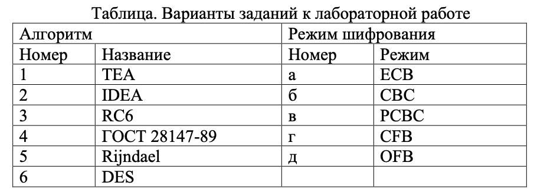
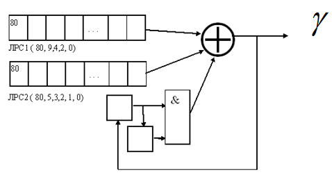
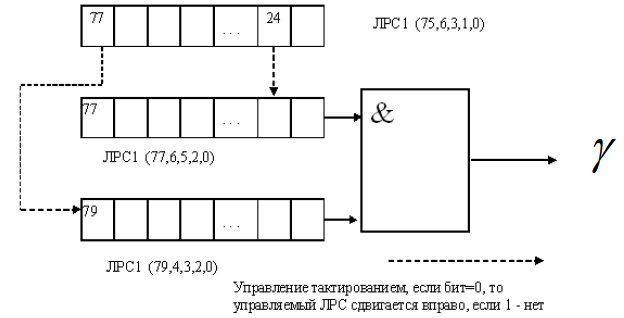
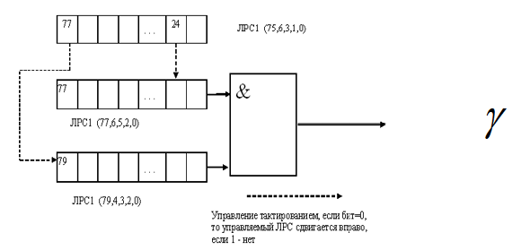
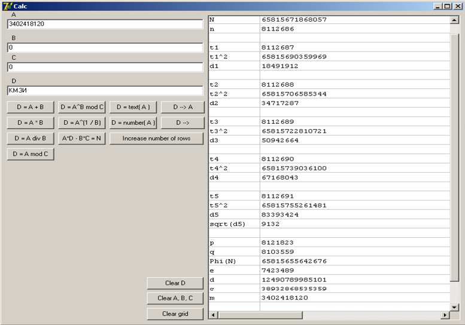

# Криптографические системы с секретным ключом

## Лабораторная работа № 1 <br> 实验一: <br> Основы шифрования данных <br> 数据加密基础

### Цель работы: <br> 实验目的：

изучение основных принципов шифрования информации, знакомство с широко известными алгоритмами шифрования, приобретение навыков их программной реализации.  
学习信息加密的基本原理，了解广泛使用的加密算法，掌握其编程实现技能。

### Порядок выполнения работы <br> 实验步骤：

1. Ознакомьтесь с теоретическими основами шифрования данных, которые приведены в [1] и [2].  
   熟悉理论加密基础，参阅文献[1]和[2]。
2. Получите вариант задания у преподавателя.  
   向老师获取实验任务。
3. Напишите программу согласно варианту задания.  
   根据任务要求编写程序。
4. Отладьте разработанную программу и покажите результаты работы программы преподавателю.  
   调试开发的程序，并将程序结果展示给老师。
5. Составьте отчет по лабораторной работе.  
   编写实验报告。

### Содержание отчета <br> 实验报告内容：

Отчет по лабораторной работе должен содержать следующие сведения:  
实验报告应包含以下内容：
- название и цель работы;  
  实验名称和目的；
- вариант задания;  
  实验任务；
- листинг разработанной программы с комментариями;  
  带注释的程序代码；
- результаты работы программы.  
  程序运行结果。

### Варианты заданий <br> 实验任务选项：

1. Реализовать в программе шифрование и дешифрацию содержимого файла по методу Цезаря с ключевым словом.  
   使用关键字实现凯撒加密法对文件内容的加密和解密。
2. Реализовать шифрование и дешифрацию файла по методу Виженера. Ключевая фраза вводится. Реализовать в программе частотный криптоанализ зашифрованного текста.  
   实现维吉尼亚加密法对文件的加密和解密。密钥短语由用户输入。实现加密文本的频率密码分析。
3. Реализовать шифрование и дешифрацию файла с использованием метода биграмм. Ключевое слово вводится.  
   使用双字母加密法实现文件的加密和解密。密钥短语由用户输入。
4. Реализовать в программе шифрование и дешифрацию файла с использованием квадрата Полибия, обеспечив его случайное заполнение.  
   使用随机生成的波利比奥方阵，实现文件加密和解密。
5. Реализовать в программе шифрование и дешифрацию файла с использованием квадрата Кардано размером 4х4.  
   使用4x4的卡尔达诺方阵，实现文件的加密和解密。
6. Реализовать в программе шифрование и дешифрацию файла методом биграмм с двойным квадратом. Квадраты генерировать динамически для каждого шифрования.  
   使用双方阵双字母加密法，实现文件加密和解密。每次加密动态生成方阵。
7. Реализовать в программе шифрование и дешифрацию файла с использованием перестановочного шифра с ключевым словом. Ключевое слово вводится.  
   使用关键字的置换密码法，实现文件加密和解密。密钥短语由用户输入。
8. Реализовать в программе шифрование и дешифрацию файла с использованием аффинной криптосистемы. Провести частотный анализ зашифрованного файла, осуществляя проверку по файлу с набором ключевых слов.  
   使用仿射密码系统实现文件加密和解密。对加密文件进行频率分析，并用关键词文件进行校验。
9.  Реализовать шифрование и дешифрацию файла по методу Виженера с составным ключом. Набор ключей вводится.  
    使用复合密钥的维吉尼亚加密法，实现文件加密和解密。密钥由用户输入。
10. Реализовать в программе шифрование и дешифрацию\ содержимого файла по методу Цезаря. Провести частотный анализ зашифрованного файла, осуществляя проверку по файлу с набором ключевых слов.  
    使用凯撒加密法实现文件加密和解密。对加密文件进行频率分析，并用关键词文件进行校验。

### Контрольные вопросы <br> 控制问题：

1. Дайте определение следующим понятиям: шифр, криптография, криптоанализ, ключ.  
   给出以下术语的定义：密码、密码学、密码分析、密钥。
2. Классифицируйте алгоритм, полученный в качестве задания к лабораторной работе.  
   对实验任务中的算法进行分类。
3. Чем отличаются одно- и многоалфавитные методы шифрования?  
   单字母加密和多字母加密方法有何区别？
4. В чем заключается основной принцип частотного криптоанализа?  
   频率密码分析的基本原理是什么？
5. Какой метод криптоанализа применим для вскрытия алгоритма, полученного вами в качестве задания к лабораторной работе?  
   针对实验任务中的算法，适用哪种密码分析方法？
6. Оцените мощность ключевого пространства вашего алгоритма.  
   评估你所用算法的密钥空间大小。

## Лабораторная работа № 2 Блочное симметричное шифрование

### Цель работы:

изучение структуры и основных принципов работы современных алгоритмов блочного симметричного шифрования, приобретение навыков программной реализации блочных симметричных шифров.  
研究现代分组对称加密算法的结构和基本操作原理，获得分组对称密码的软件实现技能。

### Порядок выполнения работы

1. Ознакомьтесь с теоретическими основами шифрования данных, которые приведены в [1] и [2].  
   熟悉[1]和[2]中给出的数据加密的理论基础。
2. Получите вариант задания у преподавателя.  
   从老师那里获取作业版本。
3. Напишите программу согласно варианту задания.  
   根据作业选项编写程序。
4. Отладьте разработанную программу и покажите результаты работы программы преподавателю.  
   调试开发的程序并向老师展示程序结果。
5. Составьте отчет по лабораторной работе.  
   撰写实验报告。

### Содержание отчета

Отчет по лабораторной работе должен содержать следующие сведения:  
实验室报告必须包含以下信息：
- название и цель работы;  
  作品的标题和目的；
- вариант задания;  
  任务选项；
- листинг разработанной программы с комментариями;  
  列出已开发的程序并附有评论；
- результаты работы программы.  
  计划的结果。

### Варианты заданий

Реализовать систему симметричного блочного шифрования, позволяющую шифровать и дешифровать файл на диске с использованием заданного блочного шифра в заданном режиме шифрования. Перечень блочных шифров и режимов шифрования приведен в таблице. Номер шифра и режима для реализации получить у преподавателя.  
实现对称块加密系统，允许您在给定的加密模式下使用给定的块密码来加密和解密磁盘上的文件。表中给出了分组密码和加密模式的列表。代码编号和实现方式可以向老师索取。

Таблица. Варианты заданий к лабораторной работе  
桌子。实验室工作的选择



### Контрольные вопросы

1. Перечислите основные обратимые операции, используемые в образующих функциях блочных шифров.  
   列出分组密码生成函数中使用的主要可逆运算。
2. Что такое сеть Фейштеля? В чем ее основные достоинства?  
   什么是Feishtel网络？它的主要优点是什么？
3. Какие параметры блочных шифров влияют на его криптостойкость?  
   分组密码的哪些参数会影响其密码强度？
4. Какие блочные шифры, построенные по принципу сети Фейштеля, вам известны?  
   你知道哪些基于Feishtel网络原理构建的分组密码？
5. Проведите сравнительный анализ алгоритмов ГОСТ 28147-89 и Rijndael.  
   对GOST 28147-89和Rijndael算法进行对比分析。
6. Проведите сравнительный анализ режимов шифрования CBC и ECB.  
   对CBC和ECB加密模式进行对比分析。
7. Проведите сравнительный анализ режимов шифрования CBC и CFB  
   对CBC和CFB加密模式进行对比分析

## Лабораторная работа № 3  <br> Поточное симметричное шифрование 

### Цель работы: 

изучение структуры и основных принципов работы современных алгоритмов поточного симметричного шифрования, приобретение навыков программной реализации поточных симметричных шифров.  
研究现代流对称加密算法的结构和基本工作原理，获得流对称密码的软件实现技能。

### Порядок выполнения работы 

1. Ознакомьтесь с теоретическими основами шифрования данных, которые приведены в [1] и [2].  
   熟悉[1]和[2]中给出的数据加密的理论基础。
2. Получите вариант задания у преподавателя.  
   从老师那里获取作业版本。
3. Напишите программу согласно варианту задания.  
   根据作业选项编写程序。
4. Отладьте разработанную программу и покажите результаты работы программы преподавателю.  
   调试开发的程序并向老师展示程序结果。
5. Составьте отчет по лабораторной работе  
   撰写实验报告

### Содержание отчета 

Отчет по лабораторной работе должен содержать следующие сведения:  
实验室报告必须包含以下信息：
- название и цель работы;  
  作品的标题和目的；
- вариант задания;  
  任务选项；
- листинг разработанной программы с комментариями;  
  列出已开发的程序并附有评论；
- результаты работы программы.  
  计划的结果。

### Варианты заданий 

1. Реализовать в программе поточное кодирование текста, вводимого с клавиатуры, с помощью заданной нелинейной схемы, испльзующей дополнительные ячейки памяти РС.  
   使用使用附加 PC 存储单元的给定非线性电路，在程序中实现从键盘输入的文本的流编码。



2. Реализовать в программе поточное кодирование текста, вводимого с клавиатуры, с помощью заданной нелинейной схемы РС с управляемым тактированием.  
   使用具有受控时钟的给定非线性 PC 电路，在程序中实现从键盘输入的文本的流编码。



3. Реализовать в программе поточное кодирование текста, вводимого с клавиатуры, с помощью заданной нелинейной схемы РС.  
   使用给定的非线性PC电路在程序中实现从键盘输入的文本的流编码。



### Контрольные вопросы 

1. [Какие методы формирования потока ключей для поточных шифров вам известны?](#1-какие-методы-формирования-потока-ключей-для-поточных-шифров-вам-известны)  
   您知道哪些为流密码生成密钥流的方法？
2. [Что такое регистр сдвига с линейной обратной связью?](#2-что-такое-регистр-сдвига-с-линейной-обратной-связью)  
   什么是线性反馈移位寄存器？
3. [Каков критерий оптимальности структуры регистра сдвига с линейной обратной связью?](#3-каков-критерий-оптимальности-структуры-регистра-сдвига-с-линейной-обратной-связью)  
   线性反馈移位寄存器的最佳结构的标准是什么？
4. [Для чего регистры сдвига с линейной обратной связью объединяют в нелинейные схемы подключения?](#4-для-чего-регистры-сдвига-с-линейной-обратной-связью-объединяют-в-нелинейные-схемы-подключения)  
   为什么带线性反馈的移位寄存器要组合成非线性连接电路？
5. [Что такое проблемы линейной сложности и корреляционной связи схем, использующих сдвиговые регистры с линейной обратной связью?](#5-что-такое-проблемы-линейной-сложности-и-корреляционной-связи-схем-использующих-сдвиговые-регистры-с-линейной-обратной-связью)  
   使用线性反馈移位寄存器的电路的线性复杂度和相关性问题是什么？
6. [Объясните принцип работы сдвигового регистра с обратной связью по переносу.](#6--регистр-сдвига-с-обратной-связью-по-переносу-carry-feedback-shift-register-cfsr)  
   解释进位反馈移位寄存器的工作原理。

7. [Каков критерий оптимальности структуры регистра сдвига с обратной связью по переносу?](#7-каков-критерий-оптимальности-структуры-регистра-сдвига-с-обратной-связью-по-переносу)  
   带进位反馈的移位寄存器的最佳结构的标准是什么？

#### 1 Какие методы формирования потока ключей для поточных шифров вам известны?

1. **Линейные сдвиговые регистры с обратной связью (LFSR)**  
   Линейный сдвиговый регистр с обратной связью (LFSR) — это один из наиболее популярных методов генерации псевдослучайных битов для поточных шифров. Состояния регистра формируются на основе линейных комбинаций его текущих состояний.  
   **Преимущества**: Высокая скорость вычислений, простота реализации.  
   **Недостатки**: Линейность может быть использована атакующими для предсказания будущих значений.
2. **线性反馈移位寄存器 (LFSR)**
   线性反馈移位寄存器（LFSR）是为流密码生成伪随机位的最流行的方法之一。寄存器状态是基于其当前状态的线性组合形成的。
   **优点**：计算速度快，易于实现。
   **缺点**：攻击者可以利用线性来预测未来值。
3. **Нелинейные сдвиговые регистры (NLFSR)**  
   Нелинейные сдвиговые регистры включают нелинейные функции в процесс обратной связи, что повышает устойчивость к атакам, основанным на линейных свойствам LFSR.  
   **Преимущества**: Улучшенная криптографическая стойкость.  
   **Недостатки**: Более сложная реализация.
4. **非线性移位寄存器（NLFSR）**
   非线性移位寄存器将非线性函数合并到反馈过程中，从而基于 LFSR 的线性特性提高了对攻击的抵抗力。
   **优点**：提高加密强度。
   **缺点**：实现更复杂。
5. **Генераторы с использованием нескольких LFSR (Комбинированные генераторы)**  
   В комбинированных генераторах используется несколько LFSR, выходы которых комбинируются с помощью нелинейных функций (например, с помощью логических операций). Это позволяет улучшить стойкость потока ключей.  
   **Пример**: Генератор Геффе (Geffe Generator).  
   **Преимущества**: Высокая линейная сложность, повышенная безопасность.  
   **Недостатки**: Сложность в проектировании и повышенные вычислительные затраты.
6. **使用多个 LFSR 的发电机（组合发电机）**
   组合振荡器使用多个 LFSR，其输出使用非线性函数（例如逻辑运算）进行组合。这提高了密钥流的强度。
   **示例**：Geffe 生成器。
   **优点**：线性复杂度高，安全性提高。
   **缺点**：设计复杂且计算成本增加。

#### 2 Что такое регистр сдвига с линейной обратной связью?

**Регистр сдвига с линейной обратной связью (LFSR)**  
**线性反馈移位寄存器 (LFSR)**

**Регистр сдвига с линейной обратной связью** — это последовательность битов, которая генерируется с использованием сдвигающего регистра (Shift Register) и линейной операции обратной связи, которая определяет, как новые биты добавляются в регистр.  
**线性反馈移位寄存器 (LFSR) **是通过移位寄存器（Shift Register）和线性反馈运算生成一系列比特的过程。

Принцип работы LFSR заключается в следующем:  
LFSR 的工作原理如下：

1. **Сдвиг регистров**: Состояние регистра (обычно представленного в виде последовательности битов) циклично сдвигается на один бит. Этот процесс напоминает стандартный сдвиг в любом регистре, но при этом происходит использование линейной функции для вычисления новых битов.  
   寄存器移位：寄存器的状态（通常是一个比特序列）按一个比特的宽度循环左移，类似于标准的移位操作，但这里使用线性函数来计算新比特的值。

2. **Линейная обратная связь**: Новые биты, которые добавляются в регистр, вычисляются как линейная комбинация существующих битов, определяемая конкретными позициями, которые включаются в операцию XOR. Эти позиции называются **обратной связью** или **фидбеками**. Таким образом, новые биты определяются как XOR всех выбранных битов из текущего состояния регистра.  
   线性反馈：新比特是通过对当前寄存器状态中的特定位进行 XOR 运算得到的。这些特定的位称为 反馈位。通过对这些位进行 XOR 运算，得到新比特并插入到寄存器的最右边。

3. **Цикличность**: Регистр сдвига с линейной обратной связью обладает свойством цикличности, то есть через некоторое количество циклов его состояние возвращается в исходное положение.  
   循环性：LFSR 具有循环性，即寄存器的状态会在一定的周期后恢复到初始状态。

**Пример работы LFSR:**  
工作原理：

Предположим, что у нас есть 4-битный регистр с обратной связью на позициях 4 и 3 (то есть мы используем 4-й и 3-й биты для вычисления нового бита). Начальное состояние регистра — `1101`.  
假设一个4位的寄存器，它的反馈位在第4和第3位（即使用第4位和第3位来计算新比特）。初始状态为 1101。

1. Сначала мы сдвигаем все биты на одну позицию влево.  
   首先，我们将所有位向左移动一位。
2. Следующий бит вычисляется как XOR 4-го и 3-го битов исходного состояния (в нашем случае это `1 XOR 1 = 0`).  
   一位计算为初始状态的第 4 位和第 3 位的异或（在我们的例子中为“1 XOR 1 = 0”）。
3. Новый бит (0) вставляется в самый правый конец, а сдвигаем остальные биты на одну позицию влево.  
   在最右端插入一个新位 (0)，并将其余位向左移动一位。
4. Процесс повторяется до тех пор, пока регистр не вернется в исходное состояние.  
   重复该过程，直到寄存器返回到其原始状态。

**Основные характеристики:**  
**主要特点：**

1. **Линейность**: Обратная связь выражается через линейную операцию XOR, что делает поведение регистра линейным. Это означает, что генерация последовательности может быть математически предсказуемой, если известны начальные значения и схема обратной связи.  
   **线性**：反馈通过线性异或运算来表达，这使得寄存器行为呈线性。这意味着如果初始值和反馈模式已知，则序列生成可以在数学上进行预测。
   
2. **Псевдослучайность**: Несмотря на свою линейность, регистры с линейной обратной связью могут генерировать псевдослучайные последовательности, что делает их полезными для криптографических приложений и других систем, где необходимы случайные данные.  
   **伪随机性**：尽管线性反馈寄存器具有线性性，但它可以生成伪随机序列，这使得它们对于密码应用程序和需要随机数据的其他系统非常有用。

3. **Простота реализации**: LFSR достаточно просто реализуемы как на аппаратном уровне (с использованием цифровых схем), так и на программном уровне, что делает их удобными для использования в потоковых шифрах.  
   **易于实现**：LFSR 在硬件（使用数字电路）和软件中都非常容易实现，这使得它们可以方便地在流密码中使用。

**Пример схемы LFSR:**  
**LFSR 电路示例：**
Для простоты рассмотрим 4-битный регистр с обратной связью на позициях 4 и 3. Начальное состояние может быть следующим:  
为简单起见，考虑一个 4 位寄存器，其反馈位于位置 4 和 3。初始状态可能如下：

```
Начальное состояние: 1101
Обратная связь: XOR(4-й и 3-й биты)
```

Шаги:

1. **Шаг 1**: Сдвигаем на один бит влево: `1010`  
   Новый бит: `1 XOR 1 = 0`  
   Результат: `1010`

2. **Шаг 2**: Сдвигаем: `0100`  
   Новый бит: `1 XOR 0 = 1`  
   Результат: `0101`

3. **Шаг 3**: Сдвигаем: `0010`  
   Новый бит: `0 XOR 1 = 1`  
   Результат: `0110`

4. И так далее, процесс продолжается циклично.

**Применение LFSR:**  
**LFSR 的应用：**
- **Шифрование**: В потоковых шифрах используется LFSR для генерации потока ключей. Поток ключей XOR’ится с исходным сообщением, обеспечивая шифрование.  
  **加密**：流密码使用 LFSR 生成密钥流。密钥流与原始消息进行异或，提供加密。
- **Тестирование оборудования**: LFSR широко используются в тестировании цифровых схем, так как их поведение легко прогнозируемо, что позволяет выявить ошибки в аппаратных компонентах.  
  **硬件测试**：LFSR 广泛用于测试数字电路，因为它们的行为很容易预测，从而可以识别硬件组件中的错误。
- **Генерация случайных чисел**: LFSR используются как основа для псевдослучайных генераторов чисел в различных приложениях.  
  **随机数生成**：LFSR 在各种应用中用作伪随机数生成器的基础。

#### 6 ### **Регистр сдвига с обратной связью по переносу (Carry Feedback Shift Register, CFSR)**  

**Что такое CFSR?**  
**什么是 CFSR？**

Регистр сдвига с обратной связью по переносу (CFSR) — это тип сдвигового регистра, который использует механизм обратной связи, основанный на вычислении переноса. Такой регистр сдвига способен генерировать сложные псевдослучайные последовательности и находит применение в криптографии и цифровой обработке сигналов.  
带进位反馈的移位寄存器（CFSR）是一种移位寄存器，它基于进位计算的反馈机制。此类移位寄存器能够生成复杂的伪随机序列，广泛应用于密码学和数字信号处理。


**Как работает CFSR?**  
**CFSR 如何工作？**

1. **Сдвиг значений**  
   - В каждом такте содержимое регистра сдвигается вправо или влево.  
   - При этом старший или младший бит (в зависимости от направления сдвига) может быть заменен значением, полученным из обратной связи.  
   
   **移位操作**  
   - 在每个时钟周期，寄存器的内容会向右或向左移位。  
   - 同时，最高位或最低位（取决于移位方向）可以被反馈生成的值替代。

2. **Вычисление переноса (carry feedback)**  
   - Перенос вычисляется на основе операции сложения выбранных битов в регистре.  
   - Этот перенос участвует в формировании нового значения для входа регистра.  

   **进位计算（carry feedback）**  
   - 进位是基于寄存器中选定位的加法操作计算得出的。  
   - 该进位用于形成寄存器输入的新值。

3. **Обратная связь**  
   - Обратная связь строится таким образом, чтобы обеспечить генерацию последовательности с высокой линейной сложностью и длинным периодом.  

   **反馈机制**  
   - 反馈机制的设计确保生成的序列具有高线性复杂度和长周期。


**Особенности CFSR**  
**CFSR 的特点**

1. **Нелинейность**  
   - В отличие от линейных регистров сдвига (LFSR), CFSR добавляет нелинейность в процесс генерации, что делает его более устойчивым к криптоанализу.  
   
   **非线性**  
   - 与线性移位寄存器（LFSR）不同，CFSR 在生成过程中增加了非线性，使其对密码分析更具抗性。

2. **Генерация сложных последовательностей**  
   - CFSR способен генерировать последовательности, которые обладают высокой энтропией и трудно поддаются предсказанию.  

   **生成复杂序列**  
   - CFSR 能够生成具有高熵且难以预测的序列。

3. **Длинные периоды**  
   - При правильной настройке обратной связи длина периода может достигать \( 2^n - 1 \), где \( n \) — количество битов в регистре.  

   **长周期**  
   - 在正确配置反馈的情况下，周期长度可以达到 \( 2^n - 1 \)，其中 \( n \) 是寄存器的位数。

4. **Устойчивость к линейным атакам**  
   - За счет механизма переноса и нелинейности CFSR сложнее поддается линейному криптоанализу, что делает его привлекательным для криптографических приложений.  

   **抗线性攻击**  
   - 由于进位机制和非线性，CFSR 更难受到线性密码分析的影响，这使其在密码学应用中具有吸引力。

**Заключение**  
**总结**

Регистр сдвига с обратной связью по переносу (CFSR) — это мощный инструмент для генерации сложных последовательностей, который сочетает длинные периоды, высокую нелинейность и устойчивость к атакам. Его применение варьируется от криптографии до цифровой обработки сигналов.  
带进位反馈的移位寄存器（CFSR）是一种强大的工具，可用于生成复杂序列，具有长周期、高非线性和抗攻击能力。其应用范围从密码学到数字信号处理。
  

#### 3 Каков критерий оптимальности структуры регистра сдвига с линейной обратной связью?

**1. Максимальная длина периода**  
**1. 最大周期长度**  

Оптимальный LFSR должен генерировать последовательность с максимально возможным периодом, прежде чем она начнет повторяться. Максимальная длина периода равна \( 2^n - 1 \), где \( n \) — это длина регистра. Такой период достигается, если характеристический многочлен LFSR является **примитивным** над полем GF(2).  
理想的 LFSR 应生成在重复之前具有最大可能周期的序列。最大周期长度为 \( 2^n - 1 \)，其中 \( n \) 是寄存器的长度。当 LFSR 的特征多项式是 GF(2) 域上的**本原多项式**时，可以达到此周期。


**2. Высокая линейная сложность**  
**2. 高线性复杂度**  

Линейная сложность — это минимальная длина линейного рекуррентного уравнения, которое описывает последовательность. Для обеспечения криптостойкости линейная сложность должна быть близка к длине регистра \( n \). Последовательности с низкой линейной сложностью уязвимы к взлому с использованием алгоритма Берлекэмпа-Мэсси.  
线性复杂度是描述序列的线性递推方程的最小长度。为了保证密码强度，线性复杂度应接近寄存器长度 \( n \)。线性复杂度低的序列容易被 Berlekamp-Massey 算法破解。


**3. Отсутствие коротких циклов**  
**3. 没有短周期循环**  

Последовательность LFSR не должна содержать коротких подциклов, так как они уменьшают энтропию и ухудшают криптографические свойства. Это связано с тем, что короткие циклы делают последовательность предсказуемой.  
LFSR 生成的序列不应包含短周期子循环，因为这会降低熵并削弱密码学属性。短周期会使序列变得可预测。

**4. Устойчивость к корреляционным атакам**  
**4. 抗相关攻击能力**  

Если LFSR используется в составе нелинейной схемы (например, в генераторе ключей), важно минимизировать корреляцию между состоянием регистра и выходной последовательностью.  
当 LFSR 用作非线性电路的一部分（例如密钥流生成器）时，必须尽量减少寄存器状态与输出序列之间的相关性。

**5. Простота реализации**  
**5. 实现的简单性**  

Оптимальная структура LFSR должна быть легко реализуема как аппаратно, так и программно. Это достигается выбором характеристического многочлена с минимальным количеством ненулевых коэффициентов (т.е. низкой степенью разреженности).  
理想的 LFSR 结构应在硬件和软件中易于实现。这可以通过选择具有最少非零系数（即稀疏度较高）的特征多项式来实现。

**6. Высокая энтропия выходной последовательности**  
**6. 高输出序列熵**  

Выходная последовательность должна демонстрировать свойства случайности, такие как равномерное распределение 0 и 1, высокая энтропия и отсутствие предсказуемых паттернов.  
输出序列应表现出随机性特征，如 0 和 1 的均匀分布、高熵以及无可预测模式。

---

**Вывод**  
Для оптимального LFSR важно выбирать примитивный характеристический многочлен, обеспечивающий максимальный период, высокую линейную сложность и устойчивость к криптографическим атакам, а также минимизировать сложность реализации.  
要实现最佳的 LFSR，必须选择本原特征多项式，以确保最大周期、高线性复杂度和抗密码攻击的能力，同时简化实现复杂性。

#### 4 Для чего регистры сдвига с линейной обратной связью объединяют в нелинейные схемы подключения?

**Причины объединения в нелинейные схемы**  
**组合成非线性电路的原因**

1. **Увеличение криптографической стойкости**  
   Линейные обратные связи регистров сдвига (LFSR) обладают предсказуемостью из-за их линейной природы, что делает их уязвимыми к атаке методом Берлекэмпа-Мэсси. Объединение нескольких LFSR с использованием нелинейной функции позволяет усложнить анализ и повышает стойкость системы.  
   
   **提高密码强度**  
   线性反馈移位寄存器（LFSR）因其线性特性易于预测，容易受到Berlekamp-Massey算法的攻击。通过使用非线性函数组合多个LFSR，可以增加分析难度，从而提高系统的抗攻击能力。

2. **Генерация последовательностей с высокой энтропией**  
   Нелинейное объединение регистров позволяет создавать ключевые потоки с высокой энтропией, что делает их менее предсказуемыми и более подходящими для использования в криптографических задачах.  
   
   **生成高熵序列**  
   非线性组合寄存器可以生成高熵的密钥流，使其更难预测，更适合密码学任务。

3. **Избежание коротких периодов**  
   Период последовательности, генерируемой LFSR, ограничен длиной регистра. Объединение нескольких регистров через нелинейную схему увеличивает общий период и предотвращает его сокращение из-за синхронизации состояний регистров.  
   
   **避免短周期**  
   LFSR生成的序列周期受寄存器长度限制。通过非线性电路组合多个寄存器，可以延长总周期，并防止寄存器状态同步导致周期缩短。

4. **Противодействие атакам на корреляцию**  
   При линейной связи выходных сигналов регистров могут возникать корреляции, которые криптоаналитики используют для взлома. Нелинейная связь разрушает такие корреляции и делает их бесполезными для атак.  
   
   **防止相关性攻击**  
   在线性连接下，寄存器的输出可能存在相关性，密码分析者可以利用这一点进行破解。非线性连接破坏了这种相关性，使攻击无效。


**Методы объединения LFSR в нелинейные схемы**  
**LFSR 非线性组合的方法**

1. **Мажоритарные функции (Majority Functions)**  
   Используются для нелинейного объединения выходов нескольких LFSR. Выход определяется как значение, которое встречается чаще среди всех входных сигналов.  
   
   **多数函数（Majority Functions）**  
   用于非线性组合多个LFSR的输出。输出由输入信号中出现最多的值决定。

2. **Булевы функции (Boolean Functions)**  
   Нелинейные булевы функции применяются для объединения выходов LFSR, чтобы повысить сложность ключевого потока.  
   
   **布尔函数（Boolean Functions）**  
   通过非线性布尔函数组合LFSR的输出，以增加密钥流的复杂性。

3. **Фильтрующие функции (Filter Functions)**  
   Используются для фильтрации или модификации выходного потока с целью введения нелинейности.  
   
   **滤波函数（Filter Functions）**  
   用于过滤或修改输出流，从而引入非线性。

4. **Каскадирование (Cascading)**  
   Объединение выходов LFSR через каскадное подключение, где выход одного регистра становится входом другого.  
   
   **级联连接（Cascading）**  
   通过级联连接多个LFSR的输出，一个寄存器的输出作为另一个寄存器的输入。

**Пример использования нелинейных схем**  
**非线性电路的应用示例**

- **A5/1** (Шифр GSM): Объединяет три LFSR с использованием мажоритарной функции.  
- **Grain** (Поточный шифр): Использует фильтрующие функции для объединения LFSR и нелинейной обратной связи.  
   
   **A5/1**（GSM加密）：使用多数函数组合三个LFSR。  
   **Grain**（流密码）：通过滤波函数组合LFSR并加入非线性反馈。

**Заключение**  
**总结**

Объединение регистров сдвига с линейной обратной связью в нелинейные схемы необходимо для повышения криптографической стойкости, увеличения сложности ключевых потоков, устранения корреляций и увеличения периода. Это делает такие системы более защищенными и пригодными для использования в реальных приложениях.  
将线性反馈移位寄存器组合成非线性电路，是为了增强密码强度、增加密钥流的复杂性、消除相关性并延长周期。这使得这些系统更安全，适合实际应用。

#### 5 Что такое проблемы линейной сложности и корреляционной связи схем, использующих сдвиговые регистры с линейной обратной связью?  

**Линейная сложность (Linear Complexity)**
**线性复杂度 (Linear Complexity)**

Линейная сложность последовательности или потока ключей определяется как минимальное количество регистров с линейной обратной связью (LFSR), необходимых для воспроизведения этой последовательности. Чем выше линейная сложность, тем сложнее предсказать или восстановить последовательность, что делает её более безопасной.

**Проблема линейной сложности** возникает, когда система, использующая LFSR, генерирует последовательности с низкой линейной сложностью. В таких случаях криптоаналитики могут использовать методы, такие как **алгоритм Берлекэмпа-Мэсси** или другие методы для анализа и восстановления исходной последовательности с помощью меньшего числа LFSR, что ослабляет безопасность шифра.

**线性复杂度**指的是生成一个序列或密钥流所需的最少线性反馈移位寄存器（LFSR）数量。线性复杂度越高，预测或恢复该序列的难度就越大，从而提高密码的安全性。

**线性复杂度问题**出现在使用LFSR的系统中，如果生成的序列的线性复杂度较低，攻击者可以使用**Berlekamp-Massey算法**等方法，通过少量的LFSR恢复原始序列，从而削弱密码的安全性。

**Корреляционная связь (Correlation Attack)**
**相关性攻击 (Correlation Attack)**

Корреляция между двумя последовательностями означает, что можно с высокой вероятностью предсказать один поток, если известен другой, даже если они не имеют прямой линейной зависимости. В контексте LFSR, **корреляционные атаки** используют статистическое соотношение между ключевыми потоками, генерируемыми различными LFSR, чтобы сделать предсказания о состоянии регистров.

Если два или более LFSR имеют **коррелированные выходы**, криптоаналитики могут использовать этот факт для восстановления состояния регистров и, следовательно, для дешифровки данных. Проблема корреляционной связи возникает, когда регистры с линейной обратной связью генерируют выходы с высокой корреляцией, что значительно снижает криптографическую стойкость системы.

**相关性**是指两个序列之间的统计关系，如果一个序列的某些特征已知，另一个序列的某些部分可以高概率地被预测出来。在线性反馈移位寄存器（LFSR）中，**相关性攻击**利用不同LFSR生成的密钥流之间的统计关系，来预测寄存器的状态。

如果两个或更多LFSR具有**相关的输出**，密码分析者可以利用这一点恢复寄存器的状态，从而破解数据。相关性问题发生在当LFSR生成的输出之间具有较高相关性时，这将显著降低系统的密码强度。

**Как это влияет на безопасность?**
**它如何影响安全性？**

1. **Низкая линейная сложность** делает систему уязвимой к **методам восстановления состояния LFSR**. Это может привести к возможности восстановления всего ключевого потока и дешифровки зашифрованных данных. Чтобы избежать этого, важно обеспечить высокую линейную сложность генератора ключа.

2. **Высокая корреляция** между последовательностями, генерируемыми различными регистры, делает систему уязвимой к **корреляционным атакам**, при которых аналитики могут использовать статистическое соотношение для восстановления исходного ключа или для криптоанализа данных.

**Как можно улучшить безопасность?**
**如何提高安全性？**

1. **Использование нелинейных схем**  
   Скомбинированные LFSR через нелинейные функции могут значительно снизить вероятность низкой линейной сложности и уменьшить корреляцию между потоками. Это включает в себя использование нелинейных фильтров и мажоритарных функций.

2. **Увеличение длины регистра и изменения в обратной связи**  
   Увеличение длины регистров сдвига и использование более сложных схем обратной связи могут повысить линейную сложность и снизить возможность предсказания последовательности.

3. **Применение нескольких LFSR**  
   Использование нескольких LFSR с различными параметрами и настройками обратной связи может помочь в повышении криптографической стойкости, минимизируя проблемы, связанные с корреляцией и линейной сложностью.

**Пример проблем линейной сложности и корреляции**  
**线性复杂度和相关性问题的示例**

- **Алгоритм Берлекэмпа-Мэсси** — это алгоритм для восстановления исходной последовательности, если она имеет низкую линейную сложность. Если система использует LFSR с низкой линейной сложностью, этот алгоритм может быть использован для атаки на криптосистему.
- **Корреляционные атаки** могут использоваться для криптоанализа шифров, использующих несколько LFSR, если выходы LFSR имеют корреляцию. Например, в некоторых слабых конфигурациях LFSR выходы могут быть слишком предсказуемыми, что позволит криптоаналитику восстанавливать исходный ключ.

**Заключение**  
**总结**

Проблемы линейной сложности и корреляционной связи представляют собой серьезные угрозы для криптографических систем, использующих LFSR. Линейная сложность влияет на сложность восстановления последовательности, а высокая корреляция — на предсказуемость выходов. Для обеспечения безопасности важно использовать методы нелинейной обработки, увеличение длины регистров и сложных схем обратной связи, чтобы минимизировать эти проблемы и улучшить криптографическую стойкость системы.  
线性复杂度和相关性问题是使用LFSR的密码系统面临的严重威胁。线性复杂度影响序列恢复的复杂性，而较高的相关性则影响输出的可预测性。为了确保安全性，必须采用非线性处理方法、增加寄存器长度以及复杂的反馈电路，以最小化这些问题并提高系统的密码强度。

#### 7 Каков критерий оптимальности структуры регистра сдвига с обратной связью по переносу?  

### **Критерий оптимальности структуры регистра сдвига с обратной связью по переносу (CFSR)**  
### **带进位反馈的移位寄存器（CFSR）的最佳结构标准是什么？**

**1. Высокая линейная сложность**  
**1.高线性复杂度**  
Оптимальная структура CFSR должна обеспечивать **высокую линейную сложность**. Линейная сложность измеряется как количество шагов, которые необходимы для восстановления первоначальной последовательности ключа, при использовании линейных операций. Более высокая линейная сложность затрудняет использование методов криптоанализа, таких как атака на основе линейных уравнений, так как требует большого количества данных для решения.  
**Пример**: Чем больше число, генерируемое CFSR, тем сложнее криптоанализатору решить систему линейных уравнений, чтобы восстановить исходное состояние регистра.  
最佳 CFSR 设计应提供**高线性复杂度**。线性复杂度衡量为使用线性运算重建原始密钥序列所需的步骤数。较高的线性复杂度使得使用线性方程攻击等密码分析技术变得困难，因为它需要大量的数据来解决。
**示例**：CFSR生成的数字越大，密码分析器就越难求解线性方程组以将寄存器恢复到原始状态。

**2. Хорошее распределение значений**  
Структура CFSR должна обеспечивать **равномерное распределение выходных значений**. Это означает, что для всех возможных состояний регистра, выходная последовательность должна выглядеть случайной, что минимизирует вероятность предсказуемости последовательности. Чем лучше распределены выходные биты, тем сложнее атакующему предсказать или повторить выходные значения.  
**Пример**: Для хорошей структуры каждый бит генерируемой последовательности должен зависеть от всех предыдущих битов, чтобы избежать корреляции, которая может быть использована для предсказания будущих битов.  
**2.良好的值分配**
CFSR 设计必须提供**输出值的均匀分布**。这意味着对于所有可能的寄存器状态，输出序列应该随机出现，这最小化了序列可预测的可能性。输出位分布得越好，攻击者就越难预测或复制输出值。
**示例**：对于一个好的结构，生成序列的每个比特必须依赖于所有先前的比特以避免相关，这可用于预测未来的比特。

**3. Минимизация линейной зависимости между состояниями**  
Чем меньше линейных зависимостей между состояниями регистра сдвига, тем более стойким является алгоритм. Для оптимальной структуры важно, чтобы **обратная связь** по переносу была выбрана таким образом, чтобы исключить или минимизировать количество линейных зависимостей между состояниями сдвигового регистра. Это помогает избегать предсказуемости и снижает эффективность атак.  
**Пример**: Использование таких позиций обратной связи, которые бы обеспечивали сложные, нелинейные связи, усложняя анализ и восстановление исходных данных.  
**3.状态之间的线性相关性最小化**
移位寄存器的状态之间的线性相关性越少，算法就越稳健。对于最佳设计，重要的是选择**进位反馈**来消除或最小化移位寄存器状态之间的线性相关性的数量。这有助于避免可预测性并降低攻击的有效性。
**示例**：使用反馈位置将提供复杂的非线性连接，使原始数据的分析和恢复变得复杂。

**4. Противостояние атаке на основе корреляции**  
Структура CFSR должна быть **устойчивой к атаке на основе корреляции**. Это означает, что выходная последовательность не должна показывать высокой степени корреляции между входными и выходными данными, поскольку высокая корреляция может быть использована для восстановления состояния регистра. Хорошо сконструированный CFSR будет избегать высококоррелированных последовательностей.  
**Пример**: Даже если атакующий имеет возможность наблюдать выходные данные, он не должен быть в состоянии установить четкую зависимость между этими данными и внутренним состоянием регистра.  
**4.抵抗基于相关性的攻击**
CFSR 结构必须是**基于相关性的攻击抵抗**。这意味着输出序列不应显示输入和输出数据之间的高度相关性，因为高相关性可用于恢复寄存器的状态。精心设计的 CFSR 将避免高度相关的序列。
**示例**：即使攻击者能够观察到输出数据，他也不应该能够在该数据与寄存器的内部状态之间建立明确的关系。

**5. Хорошая устойчивость к различным криптоанализам**  
Структура должна обеспечивать **устойчивость к различным типам атак**, включая:
   - **Атаки с использованием статистического анализа**: где анализируются частоты появления отдельных битов.
   - **Атаки с использованием дифференциального анализа**: где исследуется, как изменения входных данных влияют на выход.
   
   Для этого важно, чтобы структура CFSR была тщательно сбалансирована, с минимизацией побочных эффектов и предсказуемости. Оптимальная структура будет хорошо защищена от этих видов атак.

**5.对各种密码分析具有良好的抵抗力**
该结构必须提供 **抵抗各种类型的攻击**，包括：
  - **使用统计分析的攻击**：分析各个位的出现频率。
  - **差异分析攻击**：检查输入数据的变化以影响输出。

  为了实现这一目标，仔细平衡 CFSR 设计以最大限度地减少副作用和可预测性非常重要。最佳的结构将能够很好地防止这些类型的攻击。

**6. Эффективность реализации**  
Хорошая структура также должна обеспечивать **эффективность реализации**, как в аппаратных, так и в программных системах. Это означает, что структура должна быть достаточно простой для реализации, чтобы ее можно было интегрировать в системы с высокими требованиями по скорости и мощности, при этом не теряя криптографической стойкости.  
**Пример**: Для применения в реальных устройствах с ограниченными ресурсами, таких как мобильные устройства или встроенные системы, критически важно, чтобы структура CFSR была эффективно реализована без излишней нагрузки на процессор.  
**6。实施效率**
一个好的设计还应该确保硬件和软件系统的**实现效率**。这意味着结构必须足够简单以实现，以便可以集成到具有高速和功率要求的系统中，而不损失加密强度。
**示例**：对于资源受限的现实设备（例如移动设备或嵌入式系统）中的应用程序，高效实现 CFSR 结构而不产生不必要的 CPU 开销至关重要。

**Итог**  
Критерий оптимальности структуры CFSR заключается в том, чтобы обеспечить:

- **Высокую линейную сложность** (затрудняет криптоанализ),
- **Равномерное распределение значений** для повышения случайности,
- **Минимизацию линейных зависимостей** между состояниями,
- **Устойчивость к атаке на основе корреляции**,
- **Устойчивость к криптоанализам**,
- **Эффективность реализации** на целевых устройствах.

Все эти факторы обеспечивают необходимую стойкость и эффективность работы сдвигового регистра с обратной связью по переносу в криптографических приложениях.  
**结果**
最佳 CFSR 结构的标准是确保：

- **高线性复杂度**（使得密码分析变得困难），
- **均匀分布值**以增加随机性，
- **最小化状态之间的线性依赖性**，
- **抵抗基于相关性的攻击**，
- **抵抗密码分析**，
- **目标设备上的实施效率**。

所有这些因素都为密码应用中的移位反馈移位寄存器提供了必要的耐用性和效率。

## Лабораторная работа № 1 <br> Атака на алгоритм шифрования RSA посредством метода Ферма 

### Цель работы: 

изучить атаку на алгоритм шифрования RSA посредством метода Ферма.  
研究使用 Fermat 方法对 RSA 加密算法的攻击。

Порядок выполнения работы: 

- ознакомьтесь с теорией, изложенной в [3]. («Взлом алгоритма RSA при неудачном выборе параметров криптосистемы»);  
  熟悉[3]中概述的理论。 （“通过选择不成功的密码系统参数来破解 RSA 算法”）；
- получите вариант задания у преподавателя;  
  从老师那里获取作业版本；
- используя разложение модуля на простые числа методом Ферма и полученные исходные данные, определите следующие показатели:  
  利用费马方法将模分解为素数以及得到的初始数据，确定以下指标：
- множители модуля ($p$ и $q$);  
  模量因子（$p$ 和 $q$）；
- значение функции Эйлера для данного модуля $\varphi(N)$;  
  给定模块 $\varphi(N)$ 的欧拉函数值；
- обратное значение экспоненты по модулю $\varphi(N)$;  
  指数模 $\varphi(N)$ 的倒数；
- дешифруйте зашифрованный текст, исходный текст должен быть фразой на русском языке;  
  解密密文，原文必须是俄语短语；
- результаты и промежуточные вычисления оформите в виде отчета.  
  以报告的形式呈现结果和中间计算。

Примечание. Для выполнения практического задания рекомендуется использовать программу BCalc.exe.  
笔记。为了完成实际任务，建议使用BCalc.exe程序。

Пример выполнения лабораторной работы c помощью программы BCalc  
使用 BCalc 程序执行实验室工作的示例

Исходные данные: N = 65815671868057; e = 7423489; C = 38932868535359. Найти  
源数据：N=65815671868057； e = 7423489； C = 38932868535359。查找  

1. Вычисляем n = [sqrt(N)] + 1. В поле A помещаем N, в поле B - 2; нажимаем кнопку «D = A^(1/B)». В поле D заносится число 8112686, в первую строку таблицы - сообщение «[error]». Это свидетельствует, о том, что N не является квадратом целого числа.  
   计算n = [sqrt(N)] + 1。将N放入字段A，2放入字段B；按“D = A^(1/B)”按钮。在字段 D 中输入数字 8112686，并在表的第一行中输入消息“[错误]”。这表明 N 不是整数的平方。
2. t1 = n + 1. Возводим число t1 в квадрат: A: = 8112687, B: = 2, C: = 0 (возведение в квадрат будет производиться не по правилам модульной арифметики), нажимаем «D = A^B mod C» => D = t1^2 = 65815690359969. Вычисляем w1 = t1^2 - N. Для этого A:= t1^2, B:= –N, затем нажимаем «D = A + B» => D = w1 = 18491912. Проверяем, является ли w1 квадратом целого числа: A:= w1, B:= 2, нажимаем «D = A^(1/B)» => в первой строке таблицы появляется сообщение «[error]», следовательно проделываем п. 2 заново с t2 = n + 2 и так далее, пока не найдем, что некое wi является квадратом целого числа.  
   t1 = n + 1. 对数 t1 求平方：A: = 8112687, B: = 2, C: = 0（根据模运算规则不会平方），按“D = A^B mod C " => D = t1^2 = 65815690359969。计算 w1 = t1^2 - N。对于这个 A:= t1^2, B:= –N，然后按“D = A + B” => D = w1 = 18491912。检查 w1 是否是整数的平方：A:= w1, B:= 2，按“D = A^(1/B)” => 消息“[error]”出现在表的第一行，因此我们再次执行步骤 2，t2 = n + 2 依此类推，直到我们发现某个 wi 是一个整数的平方。
3. При вычислении квадратного корня w5 первая строка таблицы остается пустой, а D = sqrt(w5) = 9132, что свидетельствует об успехе факторизации. t5 = 8112691.  
   计算w5的平方根时，表格第一行保持为空，D = sqrt(w5) = 9132，表示因式分解成功。 t5 = 8112691。
4. Вычисляем p = t5 + sqrt(w5); A:= t5, B:= sqrt(w5), нажимаем «D = A + B»  => D = p = 8121823; q = t5 - sqrt(w5) = 8103559. Вычисляем Phi(N) = (p - 1)(q - 1), A:= 8121822, B:= 8103558, нажимаем «D = A∙B» => D = = Phi(N) = 65815655642676. Вычисляем d, как обратный к e: A:= e, B:= –1, C:= Phi(N), нажимаем «D = A^B mod C» => D = d = 12490789985101.  
   计算p = t5 + sqrt(w5)； A:= t5, B:= sqrt(w5)，按“D = A + B” => D = p = 8121823； q = t5 - sqrt(w5) = 8103559. 计算 Phi(N) = (p - 1)(q - 1), A:= 8121822, B:= 8103558，按“D = A∙B” => D = = Phi(N) = 65815655642676。我们将 d 计算为e 的逆：A:= e, B:= –1, C:= Phi(N)，按“D = A^B mod C” => D = d = 12490789985101。
5. Производим дешифрацию шифрблока С: A:= C; B:= d; C:= N. Нажимаем «D = A^B mod C». В поле D находится исходное сообщение M = 3402418120. Переводим M в текстовый вид. Для этого A:= M, нажимаем «D = text(A)» => D =  = «КМЗИ».  
   我们解密密码块C：A:= C； B: = d; C:= N。按“D = A^B mod C”。在字段 D 中有原始消息 M = 3402418120。我们将 M 转换为文本形式。要执行此操作，A:= M，请按“D = 文本(A)” => D = =“KMZI”。

Снимок экрана с окном программы «BCalc» приведен ниже.  
BCalc 程序窗口的屏幕截图如下所示。



### Варианты заданий

Вариант | Модуль, N | Экспонента, е | Блок зашифрованного текста, C
--------|-----------|---------------|------------------------
23 | 48992988576733 | 4545733 | 12530303611339 <br> 47274247086952 <br> 20068556933394 <br> 41300245344157 <br> 27564916776233 <br> 45997492729411 <br> 11416336760074 <br> 17516700753417 <br> 10586755223028 <br> 5642378694993 <br> 17949047899806 <br> 13276902592875

## Лабораторная работа № 2 <br> Атака на алгоритм шифрования RSA методом повторного шифрования 

### Цель работы: 

изучить атаку на алгоритм шифрования RSA посредством повторного шифрования.  
研究通过重加密对RSA加密算法的攻击。

### Порядок выполнения работы: 

- ознакомьтесь с теорией в [3], рассмотренной в подразделе  («Атака повторным шифрованием»);  
  阅读[3]中的理论，在小节（“重新加密攻击”）中讨论；
- получите вариант задания у преподавателя;  
  从老师那里获取作业版本；
- по полученным исходным данным, используя метод перешифрования, определите порядок числа e в конечном поле $Z_\varphi(N)$;  
  利用接收到的初始数据，利用重加密方法，确定有限域 $Z_\varphi(N)$ 中数字e的阶；
- используя значение порядка экспоненты, получите исходный текст методом перешифрования;  
  利用指数阶值，利用重加密方法得到原始文本；
- результаты и промежуточные вычисления оформите в виде отчета.  
  以报告的形式格式化结果和中间计算。

Примечание. Для выполнения практического задания рекомендуется использовать программу PS.exe.  
笔记。为了完成实际任务，建议使用PS.exe程序。

Пример выполнения лабораторной работы c помощью программы PS  
使用 PS 程序执行实验室工作的示例

Исходные данные: $N$ = 453819149023; $e$ = 1011817; $C$ = 442511634532.  
源数据：$N$ = 453819149023； $e$ = 1011817； $C$ = 442511634532。

1. Определить порядок экспоненты. Для этого необходимо ввести значение модуля в поле N, экспоненты в поле e, в поле $Y$ записывается произвольное число, меньше чем N. После этого нужно нажать кнопку Запуск повторного шифрования и дождаться, пока в поле $X$ появится значение, равное корню е степени от числа $Y$ по модулю $N$, а в поле $i$ - порядок e в конечном поле $Z_\varphi(N)$. В данном примере он составляет 435.  
   确定指数的阶数。为此，您需要在 N 字段中输入模值，在 e 字段中输入指数，在 $Y$ 字段中写入小于 N 的任意数字。之后，您需要单击“开始重新加密”。按钮并等待，直到等于根的值出现在 $X$ 字段中 e 数 $Y$ mod $N$ 的幂，并且在字段 $i$ 中出现 e 在有限字段 $Z_\varphi( N）$。在本例中为 435。
2. Дешифровать зашифрованный текст. Для этого нужно в область редактирования поля $C$ поместить блоки зашифрованного текста, разделенные символом конца строки, значение модуля в поле $N$, экспоненты в поле e и порядка экспоненты в поле $i$. Затем нажать на кнопку Дешифрация и дождаться появления исходного текста в области редактирования $M$. Ответ - открытый текст - «null».  
   解密密文。为此，您需要在 $C$ 字段的编辑区域中放置以行尾字符分隔的密文块、$N$ 字段中的模值、e 字段中的指数以及指数阶数在 $i$ 字段中。然后点击解密按钮，等待源文本出现在$M$编辑区域中。答案是明文——“null”。

### Варианты заданий

Вариант | Модуль, N | Экспонента, е | Блок зашифрованного текста, C
--------|-----------|---------------|------------------------
23 | 888532740131 | 508097 | 251133768996 <br> 359801014616 <br> 557356431645 <br> 75854873865 <br> 768478933532 <br> 624174758081 <br> 306027834198 <br> 586384787006 <br> 155294489444 <br> 358096762086 <br> 197284968232 <br> 498688500894 <br> 467532994504