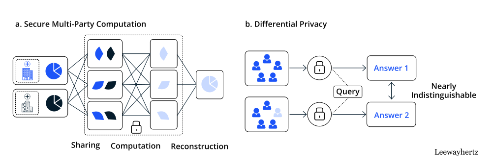

# Информационная безопасность

## Лекция 1

### План лекции

- Понятие «Информационная безопасность»
  “信息安全”的概念
- Понятия «хакер», «атакующий», «злоумышленник»
  “黑客”、“攻击者”、“入侵者”的概念
- Понятия «Безопасное программирование»: «sеcure coding» и «defensive programming»  
  “安全编程”的概念：“安全编码”和“防御性编程”
- Важность безопасного программирования  
  安全编程的重要性
- Основные принципы разработки безопасного программного обеспечения (ПО)  
  开发安全软件（SW）的基本原理

[Схема карьерных треков в результативной кибербезопасности](https://cybersecurity-roadmap.ru/)

#### Понятие «Информационная безопасность»   “信息安全”的概念

Информационная безопасность (англ. Information Security, а также — англ. InfoSec) — практика предотвращения несанкционированного доступа, использования, раскрытия, искажения, изменения, исследования, записи или уничтожения информации.  
信息安全 (也称为 InfoSec) 是防止未经授权访问、使用、披露、扭曲、修改、研究、记录或破坏信息的实践。

Информационная безопасность – это процесс обеспечения конфиденциальности, целостности и доступности информации.  
信息安全是确保信息的机密性、完整性和可用性的过程。

#### Триада CIA

- Confidentiality 机密性  
  Конфиденциальность — свойство информации быть недоступной или закрытой для неавторизованных лиц, сущностей или процессов;  
  机密性是指信息不能被未经授权的个人、实体或流程访问或关闭的属性；
- Integrity 完整性  
  Целостность — свойство сохранения правильности и полноты активов;  
  完整性是维护资产的正确性和完整性的属性；
- Availability 可用性
  Доступность — свойство информации быть доступной и готовой к использованию по запросу авторизованного субъекта, имеющего на это право.  
  可用性是指信息可以被有权利的授权主体在请求时访问并可供使用。

2.19 информационная безопасность (information security): Сохранение конфиденциальности, целостности и доступности информации.  
2.19 信息安全：维护信息的机密性、完整性和可用性。

ГОСТ Р ИСО/МЭК 27000-2012

#### Признаки защищаемой информации   受保护信息的标志

- Имеется какой-то определенный круг законных пользователей, которые имеют право владеть этой информацией.  
  有一定范围的合法用户有权拥有这些信息。
- Имеются незаконные пользователи, которые стремятся овладеть этой информацией с тем, чтобы обратить ее себе во благо, а законным пользователям во вред.  
  有一些非法用户试图获取这些信息，以便利用这些信息谋取私利并损害合法用户的利益。

#### Защищаемая информация   受保护的信息

- Персональные данные  
  个人资料
- Государственная тайна  
  国家机密
- Военная тайна  
  军事机密
- Коммерческая тайна  
  商业秘密
- Профессиональные конфиденциальные данные  
  专业机密数据

#### Типы персональных данных   个人数据的类型

- Общие персональные данные  
  一般个人资料
- Биометрические персональные данные  
  个人信息
- Общедоступные персонифицированные данные  
  公开的个人数据
- Обезличенными персональные данные  
  匿名个人数据
- Специальные персональные данные  
  特殊个人信息

#### Объекты защиты информационной безопасности   信息安全保护对象

- Информационные ресурсы  
  信息资源
- Права граждан, организаций и государства на доступ к информации  
  公民、组织和国家获取信息的权利
- Система создания, использования и распространения данных  
  数据创建、使用和分发系统
- Система формирования общественного сознания  
  公众意识形成体系

#### Угрозы информационной безопасности   信息安全威胁

- Уничтожение информационных объектов  
  销毁信息对象
- Утечка информации  
  信息泄露
- Искажение информации  
  信息扭曲
- Блокирование объекта информации  
  阻止信息对象

#### Источники угрозы конфиденциальных данных   机密数据威胁来源

- Внешние  
  外部的
- Внутренние  
  内部的

#### Угроза нарушения конфиденциальности   破坏机密性的威胁

- Хищение носителей информации  
  盗窃信息载体
- Несанкционированный доступ к информационным системам  
  未经授权访问信息系统
- Выполнение пользователем несанкционированных действий  
  用户执行了未经授权的操作
- Перехват данных, передаваемых по каналам связи  
  拦截通过通讯渠道传输的数据
- Раскрытие содержания информации  
  信息内容披露

#### Угроза нарушения целостности   破坏完整性的威胁

- Уничтожение носителей информации  
  销毁信息载体
- Внесение несанкционированных изменений в программы и данные  
  对程序和数据进行未经授权的更改
- Установка и использование нештатного программного обеспечения  
  安装和使用非标准软件
- Заражение вирусами  
  病毒感染
- Внедрение дезинформации  
  引入虚假信息

#### Нормативные Законодательные средства   规范立法手段

- международные конвенции;  
  国际公约；
- Конституцией РФ;  
  俄罗斯联邦宪法；
- Федеральные законы «Об информации, информационных технологиях и о защите информации»;  
  联邦法律“关于信息，信息技术和信息保护”;
- Законы РФ «О безопасности», «О связи», «О государственной тайне»  
  俄罗斯联邦《安全法》、《通信法》、《国家机密法》
  - Различные подзаконные акты.  
    各项附则。  

#### Российские стандарты информационной безопасности   俄罗斯信息安全标准

- Стандарт шифрования ГОСТ 28147-89  
  加密标准 GOST 28147-89
- Стандарт хэш-функции ГОСТ Р 34.11-2018  
  哈希函数标准 GOST R 34.11-2018
- Стандарт цифровой подписи ГОСТ 34.10-2018  
  数字签名标准 GOST 34.10-2018
- Средства вычислительной техники. Защита от НСД. Общие технические требования. ГОСТ Р 50739-95  
  计算机设备。防止未经授权的访问。通用技术要求。国家标准 R 50739-95
- Уголовный кодекс РФ, глава 28 «Преступления в сфере компьютерной информации» включает три статьи:  
  俄罗斯联邦刑法第28章“计算机信息领域犯罪”包括三条条款：
  - Статья 272 «Неправомерный доступ к компьютерной информации»;  
    第272条“未经授权访问计算机信息”；  
  - Статья 273 «Создание, использование и распространение вредоносных компьютерных программ»;  
    第273条“制作、使用和传播恶意计算机程序”；  
  - Статья 274 «Нарушение правил эксплуатации средств хранения, обработки или передачи компьютерной информации и информационно-телекоммуникационных сетей».  
    第274条“违反计算机信息存储、处理或者传输手段和信息和电信网络的运行规则。”  

#### Стандарт защищенности США   美国安全标准

ТCSEC (англ. Trusted Computer System Evaluation Criteria) – Критерии определения безопасности компьютерных систем.  
ТCSEC（可信计算机系统评估标准）——确定计算机系统安全性的标准。

или  
或者

«Оранжевая книга» - стандарт Министерства обороны США, принят в 1985 г. , устанавливает основные условия для оценки эффективности средств компьютерной безопасности, содержащихся в компьютерной системе.  
《橙皮书》是美国国防部于1985年通过的一项标准，规定了评估计算机系统所含计算机安全工具有效性的基本条件。

#### Европейские критерии ИБ   欧洲信息安全标准

- Международный стандарт ISO-IEC 15408. Общие критерии оценки информационной безопасности.  
  国际标准 ISO-IEC 15408。评估信息安全的通用标准。
- Стандарт ISO 17799. Международный стандарт сетевой безопасности.  
  ISO 17799 标准。网络安全的国际标准。
- Ripe MD-160. Стандарт цифровой подписи.  
  成熟的 MD-160。数字签名标准。

#### Международный стандарт защиты ИБ ISO/IEC 27000-2016   信息安全保护国际标准 ISO/IEC 27000-2016

Международный стандарт ISO/IEC 27000-2016 – Информационные технологии - Методы и средства обеспечения безопасности - Системы менеджмента информационной безопасности – Общие сведения и словарь  
国际标准 ISO/IEC 27000-2016 – 信息技术 - 安全方法和工具 - 信息安全管理系统 - 一般信息和词汇

#### Выбор средств защиты   防护装备的选择

- Является ли она для противника более ценной, чем стоимость атаки?  
  对于敌人来说它的价值是否比攻击成本更高？
- Является ли она для вас более ценной, чем стоимость защиты?  
  它对你来说比保护成本更有价值吗？

#### Средства защиты информации   信息安全工具

- Нормативные (неформальные)  
  规范性（非正式）
  - Нормативные(законодательные);  
    规范性（立法性）;  
  - Административные(организационные);  
    行政（组织）;  
  - Морально-этические средства  
    道德和伦理手段  
- Технические (формальные)  
  技术（正式）
  - Физические;  
    物理的;  
  - Аппаратные;  
    硬件;  
  - Программные;  
    软件;  
  - Криптографические.  
    加密。  

#### Средства защиты информации Нормативные 	Законодательные средства   信息安全工具 监管立法工具

- международные конвенции;  
  国际公约；
- Конституцией РФ;  
  俄罗斯联邦宪法；
- Федеральные законы «Об информации, информационных технологиях и о защите информации»;  
  联邦法律“关于信息，信息技术和信息保护”;
- Законы РФ «О безопасности», «О связи», «О государственной тайне»  
  俄罗斯联邦《安全法》、《通信法》、《国家机密法》
  - Различные подзаконные акты.  
    各项附则。  

#### Средства защиты информации	Нормативные		Административные(организационные)   信息安全工具监管行政（组织）

Организационные и административные меры  
组织和行政措施
- Сертификация деятельности  
  活动认证
- Аттестация субъектов или объектов  
  主体或客体的认证
- Лицензирование  
  许可
- Доступ:  
  使用权：
  - Интернет;  
    互联网;  
  - К внешним ресурсам;  
    外部资源； 
  - к электронной почте.  
    发送电子邮件。  

#### Средства защиты информации	Нормативные Морально-этические средства   信息安全工具 监管 道德和伦理工具

- Правила поведения в обществе или коллективе  
  社会或团体的行为准则
- Личное отношение человека к конфиденциальной информации  
  一个人对机密信息的个人态度

#### Средства защиты информации Технические   信息安全工具 技术

- Физические - это любые устройства, которые функционируют независимо от информационных систем и создают препятствия для доступа к ним.  
  物理 - 这些是任何独立于信息系统运行并对访问信息系统造成障碍的设备。
- Аппаратные - это любые устройства, которые встраиваются в информационные и телекоммуникационные системы. Они препятствуют доступу к информации, в том числе с помощью её маскировки.  
  硬件 - 这些是内置于信息和电信系统的任何设备。它们通过伪装等方式阻止人们获取信息。
- Программные – это программы, предназначенные для решения задач, связанных с обеспечением информационной безопасности.  
  软件 – 这些是旨在解决与确保信息安全相关的问题的程序。
  - DLP-системы - (Data Leak Prevention) служат для предотвращения утечки, переформатирования информации и перенаправления информационных потоков.  
    DLP 系统 -（数据泄漏防护）用于防止信息泄漏、重新格式化和信息流重定向。  
  - SIEM-системы - (Security Information and Event Management) обеспечивают анализ в реальном времени событий (тревог) безопасности, исходящих от сетевых устройств и приложений.  
    SIEM 系统 -（安全信息和事件管理）提供来自网络设备和应用程序的安全事件（警报）的实时分析。  
- Криптографические – внедрение криптографических и стенографических методов защиты данных для безопасной передачи по корпоративной или глобальной сети.  
  加密——实施加密和速记方法保护数据，以确保在企业或全球网络上进行安全传输。

#### Источники которые угрожают информационной безопасности   威胁信息安全的来源

- Угрозы от персонала  
  员工的威胁
- Угроза от злоумышленников  
  入侵者的威胁
- Случайное удаление данных  
  意外删除数据
- Компьютерные вирусы  
  计算机病毒
- Вредоносные ПО или Программные закладки  
  恶意软件或书签
- Отказ в работе операционной системы  
  操作系统故障
- Природный фактор (пожары, наводнения, аварии в энергосистемах и т.д.)  
  自然因素（火灾、洪水、电网故障等）
- Активность воздействия угроз на инфоресурсы  
  影响信息资源的威胁活动

#### Угрозы от персонала   来自员工的威胁

- Разглашение  
  披露
- Передача сведений о защите  
  安全信息的传输
- Халатность  
  疏忽
- Вербовка  
  招聘
- Подкуп персонала  
  贿赂员工
- Уход с рабочего места  
  离开工作场所
- Физическое устранение  
  物理消除

#### Внутренние нарушители   内部破坏者

- Халатные  
  疏忽
- Саботирующие  
  破坏
- Увольняющиеся  
  那些离开的人
- Целенаправленные  
  有针对性

#### Угрозы от злоумышленников   来自入侵者的威胁

**ГОСТ Р ИСО/МЭК 18028-1-2008 Информационная технология (ИТ). Методы и средства обеспечения безопасности. Сетевая безопасность информационных технологий.**  
**GOST R ISO/IEC 18028-1-2008 信息技术（IT）。确保安全的方法和手段。信息技术网络安全。**

Злоумышленник (attacker): Любое лицо, намеренно использующее уязвимости технических и нетехнических средств безопасности в целях захвата или компрометации информационных систем и сетей или затруднения доступа авторизованных пользователей к ресурсам информационной системы и сетевым ресурсам.  
攻击者：故意利用技术和非技术安全措施的漏洞，夺取或破坏信息系统和网络，或阻碍授权用户访问信息系统和网络资源的任何人。

**ГОСТ Р 52633.1-2009 Защита информации. Техника защиты информации.**  
**GOST R 52633.1-2009 信息安全。信息安全技术。**

Злоумышленник: Лицо, заинтересованное в получении возможности несанкционированного доступа к конфиденциальной информации, представляющей промышленную и коммерческую тайну, предпринимающее попытку такого доступа или совершившее его.  
攻击者：有意未经授权访问构成工业或商业机密的机密信息并试图进行此类访问或已经完成此类访问的人。

#### Мотивация атакующих   攻击者的动机

- Вымогательство  
  敲诈勒索
- Охота за данными  
  数据搜寻
- Перехват пользовательского трафика  
  拦截用户流量
- Захват вычислительных ресурсов  
  捕获计算资源
- Недоброжелатели  
  心怀恶意的人
- Идеологические противники  
  意识形态对手
- Just for fun  
  只是为了好玩

#### Виды атакующих   攻击者的类型

- Роботы (ботнеты)  
  机器人（僵尸网络）
- Профи  
  专业版
  - White Hat Hacker  
    白帽黑客  
  - Black Hat Hacker  
    黑帽黑客  
  - Gray Hat Hacker  
    灰帽黑客  
- Script kiddie / Newbie   
  脚本小子 / 新手  
- Criminal gangs — криминальные группы  
  犯罪团伙 — 犯罪集团  
- Hacktivist — хактивисты, идеологические противники  
  Hacktivist — 黑客行动主义者，意识形态反对者
- Cyberwarfare — кибер-войска  
  网络战——网络部队

#### Направленные атаки   定向攻击

- Сложные и стойкие угрозы (advanced persistent threats, APT)   
  高级持续性威胁 (APT)

#### Выдержка из отчёта RSA EMC “When Advanced Persistent Threats Go Mainstream”   摘自 RSA EMC 报告《当高级持续性威胁成为主流时》

| - | Обычные угрозы   常见威胁 | Сложные и стойкие угрозы   复杂而持续的威胁 |
|---|----------------|--------------------------|
| Кто инициатор атак?   谁是袭击的发起者？ | Корыстолюбивые хакеры и киберпреступники   自私的黑客和网络犯罪分子 | Хорошо финансируемые и подготовленные противники: политические враги, недобросовестные конкуренты, глобально организованная преступность   资金充足、训练有素的对手：政治敌人、无良竞争对手、全球有组织犯罪 |
| Какие данные являются целью и мишенью атак?   哪些数据是攻击的目标和对象？ | Данные кредитных карт и банковских учетных записей, персональные данные, любая информация, интересная многочисленному кругу покупателей   信用卡和银行账户信息、个人信息、任何广大买家感兴趣的信息 | Интеллектуальная собственность; данные, касающиеся обеспечения национальной безопасности; коммерческая тайна; исходные коды программ; данные исследований и разработок; финансовая информация; производственные и бизнес-планы; другие сведения, интересные относительно узкому кругу покупателей   知识产权; 与确保国家安全有关的数据；商业秘密；程序源代码；研究和开发数据；财务信息；生产和经营计划；相对狭窄的买家圈子感兴趣的其他信息 |
| Какие организации являются мишенью?   哪些组织成为目标？ | Любое предприятие и целые отрасли, особенно финансовый сектор   任何企业和整个行业，尤其​​是金融行业 | Конкретная организация, главным образом, правительственные, оборонные, энергетические, финансовые и высокотехнологичные предприятия   具体组织，主要是政府、国防、能源、金融和高科技企业 |
| Цель атак   攻击目的 | Доход (нелегальный), кражи личности, мошенничество, самовыражение   收入（非法）、身份盗窃、欺诈、自我表达 | Влияние на рынок; достижение конкурентного преимущества; влияние на национальную обороноспособность; занятие выгодной позиции на переговорах; повреждение критически важной инфраструктуры противника и т.д.   对市场的影响；获得竞争优势；对国防的影响；在谈判中占据有利地位；破坏敌人的重要基础设施等等。 |
| Методы атак   攻击方法 | Главным образом – атаки на периметр сети предприятия   主要针对企业网络边界的攻击 | Основным методом являются атаки через пользователей (социальная инженерия и целевой фишинг), а также через конечные устройства (эксплуатация уязвимостей программ и другие способы). Атаки часто характеризуются сложностью и многоступенчатостью   主要方式为通过用户发起的攻击（社会工程学和针对性网络钓鱼），以及通过终端设备发起的攻击（利用软件漏洞等方法）。攻击通常具有复杂性和多阶段性的特点 |

#### Компьютерные вирусы   Компьютерные вирусы

Компьютерные вирусы - разновидность вредоносных программ, отличительной особенностью которых является способность к размножению (саморепликации).   
计算机病毒是一种恶意软件，其显著特征是具有繁殖能力（自我复制）。

#### Классификация вирусов   病毒分类

- По поражаемым объектам: файловые вирусы, загрузочные вирусы, скриптовые вирусы, сетевые черви.  
  按感染对象分类：文件病毒、启动病毒、脚本病毒、网络蠕虫。
- По поражаемым операционным системам и платформам: DOS, Microsoft Windows, Unix (Linux, Android)  
  受影响的操作系统和平台：DOS、Microsoft Windows、Unix（Linux、Android）
- По технологиям используемым вирусом: полиморфные вирусы, стелс-вирусы  
  根据病毒所采用的技术：多态病毒、隐形病毒
- По языку, на котором написан вирус: ассемблер, высокоуровневый язык программирования, язык сценариев.  
  根据病毒编写语言：汇编语言、高级编程语言、脚本语言。
- По механизму заражения: паразитирующие, перезаписывающие, спутники  
  按感染机制：寄生、重写、卫星
- По дополнительной вредоносной функциональности (бэкдоры, кейлоггеры, шпионы, ботнеты и др.)  
  额外的恶意功能（后门、键盘记录器、间谍、僵尸网络等）

#### Уязвимость   漏洞

- ГОСТ Р 56546-2015:  
  国家标准 R 56546-2015：  
  Уязвимость - это недостаток программно-технического средства или информационной системы в целом, который может быть использован для реализации угроз безопасности информации.  
  漏洞是软件或硬件工具或整个信息系统中的缺陷，可用于实施对信息安全的威胁。

- ISO/IEC 27000:2018:  
  ISO/IEC 27000：2018：  
  Уязвимость – это слабое место актива или средства контроля и управления, которое может быть использовано злоумышленниками.  
  漏洞是资产或控制中的弱点，可能被恶意用户利用。

#### Разделение уязвимостей по классам   按类别划分漏洞

- объективными;  
  客观的;
- случайными;  
  随机的;
- субъективными.  
  主观的。

#### Типы уязвимостей   漏洞类型

- уязвимость кода (баги, логические ошибки и т.д);  
  代码漏洞（错误、逻辑错误等）；  
- уязвимость конфигурации;  
  配置漏洞；  
- уязвимость архитектуры;  
  架构漏洞  
- организационная уязвимость;  
  组织漏洞
- многофакторная уязвимость.  
  多因素漏洞

ГОСТ Р 56546-2015  
国家标准 R 56546-2015

#### Безопасное программирование   安全编程

Методика разработки программного обеспечения, предотвращающая случайное внедрение уязвимостей и обеспечивающая устойчивость к воздействию вредоносных программ и несанкционированному доступу.  
一种软件开发方法，可防止意外引入漏洞并确保抵御恶意软件和未经授权的访问。

- Defensive programming (Оборонительное, защитное, безопасное программирование)   
  防御性编程（防御性、保护性、安全编程）
- Secure coding (Безопасное программирование)  
  安全编程

ГОСТ Р 56939-2016 Защита информации.   
GOST R 56939-2016 信息安全。  

Разработка безопасного программного обеспечения.  
开发安全软件。

#### Defensive programming   防御性编程

Оборонительное, защитное, безопасное программирование — принцип разработки ПО, при котором разработчики пытаются учесть все возможные ошибки и сбои, максимально изолировать их и при возможности восстановить работоспособность программы в случае неполадок.  
防御性、保护性、安全编程是一种软件开发原则，其中开发人员尝试考虑所有可能的错误和故障，尽可能地隔离它们，并且在可能的情况下在发生故障时恢复程序的功能。

#### Secure coding   安全编码

Безопасное программирование — методика написания программ, устойчивых к атакам со стороны вредоносных программ и злоумышленников.  
安全编程是一种编写能够抵御恶意软件和入侵者攻击的程序的技术。

#### Безопасное программное обеспечение   安全软件

Программное обеспечение, разработанное с использованием совокупности мер, направленных на предотвращение появления и устранение уязвимостей программы  
采用一系列旨在防止出现和消除程序漏洞的措施开发的软件

#### Небезопасная программа   不安全的程序

Потенциальная цель для злоумышленника, который может использовать имеющиеся уязвимости для просмотра, изменения или удаления имеющейся информации, влияния на работу программ и сервисов (запуск или остановка), внедрения вредоносного кода в систему  
攻击者的潜在目标，攻击者可以利用现有漏洞查看、更改或删除现有信息，影响程序和服务的运行（启动或停止），或将恶意代码引入系统

#### Задача безопасного программирования   安全编程挑战

Защита данных пользователя от кражи и порчи, сохранение контроля над системой.  
保护用户数据免遭盗窃和损坏，保持对系统的控制。

#### Основные принципы при разработке безопасного ПО   开发安全软件的基本原则

- работоспособность и полезность (юзабилити, англ. usability)  
  功能性和实用性（可用性）  
- безопасность  (англ. security)  
  安全  
- надежность (англ. reliability)   
  可靠性  
- конфиденциальность (англ. privacy)   
  保密性（英文：隐私）  
- обеспечение целостности и корректности бизнеса (англ. business integrity)  
  确保业务的完整性和正确性  

## Лекция 2 Разбор стандарта о разработке безопасного программного обеспечения

### План лекции

- Ключевые моменты стандарта.
- Разбор предлагаемых мер по защите.
- Документы, которые должны быть в наличии: список и содержание.
- Соответствие другим нормативным актам, стандартам и методологиям.
- Аспекты, которые не покрывает стандарт.
Аналоги в мире.

ГОСТ Р 56939-2016 «Защита информации. Разработка безопасного программного обеспечения. Общие требования»

АО «НПО «ЭШЕЛОН»
Согласно Приказу РОССТАНДАРТ от 01.06.2016 №458-ст 
Утвержден для добровольного использования.

#### Этапы разработки стандарта

#### Целевая аудитория стандарта

Разработчики и производители программного обеспечения
- Являются основной аудиторией
- В стандарте представлены требования к реализации мер и свидетельствам
- Дополнительно документ может использоваться для декларации соответствия

Оценщики
- Органы по сертификации, аккредитованные испытательные лаборатории
- Не является основной аудиторией
- В стандарте представлены требования к свидетельствам
- В стандарте не предъявляются требования к действиям оценщиков

#### Меры по разработке безопасного программного обеспечения

Как следует из самого ГОСТа, под безопасным программным обеспечением понимается «программное обеспечение, разработанное с использованием совокупности мер, направленных на предотвращение появления и устранение уязвимостей программы». 

В стандарте указаны меры, которые рекомендуется реализовать на соответствующих этапах жизненного цикла программного обеспечения, перечислены в этом же ГОСТе.

#### Меры по разработке безопасного программного обеспечения

Общие меры
- содержатся в 4 разделе

Технические меры
- содержатся в 5 разделе
- для соответствия ГОСТ должны быть реализованы все меры из раздела 5
- предусмотрена возможность использования компенсирующих мер

#### Документы, которые должны быть в наличии, часть 1

- Политика информационной безопасности в соответствии с ИСО/МЭК 27001.
- Руководство по разработке безопасного ПО.
- Перечень требований по безопасности.
- Модель угроз безопасности.
- Программа обучения сотрудников в области разработки безопасного ПО.

  ---

- Перечень инструментальных средств разработки ПО.
- Регламент защиты инфраструктуры среды разработки ПО.
- Порядок оформления исходного кода программы.
- Регламент и протоколы экспертизы исходного кода программы.

#### Документы, которые должны быть в наличии, часть 2

- Проект архитектуры программы (логическая структура программы).
- Описание проектных решений, обеспечивающих выполнение требований по безопасности.
- Регламент экстренного выпуска обновлений ПО.
- Регламент маркировки версий ПО.
- Регламент управления конфигурацией ПО.
- Регламент резервного копирования конфигурации ПО.
- Регламент регистрации событий изменений конфигурации ПО.

#### Документы, которые должны быть в наличии, часть 3

- Регламент и протоколы статического тестирования программы.
- Регламент и протоколы функционального тестирования программы.
- Регламент и протоколы тестирования на проникновение.
- Регламент и протоколы динамического анализа кода программы.
- Регламент и протоколы фаззинг-тестирования программы.
- Регламент, протоколы и журналы поиска уязвимостей программы.

#### Документы, которые должны быть в наличии, часть 4

- Эксплуатационная документация.
- Регламент передачи ПО пользователю.
- Регламент отслеживания и исправления обнаруженных ошибок ПО и уязвимостей программы.
- Регламент приема и обработки сообщений от пользователей об ошибках ПО и уязвимостях программы.
- Регламент доведения до пользователей информации об уязвимости программы и рекомендаций по их устранению

  ---

- Журнал ошибок и уязвимостей программы.
- Журнал регистрации изменений конфигурации ПО.
- Журнал обучения сотрудников в области разработки безопасного ПО.

#### Соответствие другим нормативным актам, стандартам и методологиям

#### Аспекты, которые не покрывает стандарт

- Способы, меры и средства защиты конфиденциальной информации
- Меры по обеспечению защиты информации в автоматизированных системах управления производственными и технологическими процессами 
- Угрозы безопасности информации при разработке программного обеспечения

#### РАЗРАБОТКА БЕЗОПАСНОГО ПРОГРАММНОГО ОБЕСПЕЧЕНИЯ

- ГОСТ Р 58412-2019
- РАЗРАБОТКА БЕЗОПАСНОГО ПРОГРАММНОГО ОБЕСПЕЧЕНИЯ
- Угрозы безопасности информации при разработке программного обеспечения
- УТВЕРЖДЕН И ВВЕДЕН В ДЕЙСТВИЕ Приказом Федерального агентства по техническому регулированию и метрологии от 21 мая 2019 г. N 204-ст

#### Угрозы безопасности информации при разработке программного обеспечения

- Перечень и описание угроз безопасности информации, представленные в настоящем стандарте, могут использоваться для определения угроз безопасности, актуальных для среды разработки программного обеспечения и разрабатываемого программного обеспечения. 
- 4.1 При реализации требований ГОСТ Р 56939 разработчиком безопасного программного обеспечения (ПО) должен быть определен перечень мер, подлежащих реализации при его разработке в целях предотвращения появления и устранения уязвимостей программ в процессах их жизненного цикла. 

- лица (нарушители), осуществляющие преднамеренные или непреднамеренные действия, направленные на внедрение в ПО уязвимостей программы или нарушение конфиденциальности информации, потенциально способствующей выявлению недостатков ПО и уязвимостей программы;
- инструментальные средства, применяемые при разработке ПО, алгоритм работы которых может стать причиной внедрения в ПО уязвимостей программы.
Примечание - К инструментальным средствам относятся, например, трансляторы, компиляторы, прикладные программы, используемые для проектирования и документирования, редакторы исходного кода программ, отладчики, интегрированные среды разработки.

Непреднамеренные угрозы безопасности информации при разработке ПО возникают из-за неосторожности или неквалифицированных действий работников разработчика ПО и связаны с недостаточной осведомленностью работников в области защиты информации и разработки безопасного ПО.

- внешние нарушители - лица, не имеющие доступа к среде разработки ПО и реализующие угрозы безопасности информации из выделенных (ведомственных, корпоративных) сетей связи, внешних сетей связи общего пользования;
- внутренние нарушители - лица, имеющие постоянный или разовый доступ к среде разработки ПО.

Внутренние нарушители могут реализовывать угрозы безопасности информации при разработке ПО путем:

- влияния на процессы жизненного цикла ПО;
- осуществления преднамеренных или непреднамеренных действий в отношении отдельных объектов среды разработки ПО, в том числе элементов конфигурации, выполняя санкционированный доступ;
- осуществления преднамеренных действий в отношении отдельных объектов среды разработки ПО, в том числе элементов конфигурации, выполняя несанкционированный доступ.

Внешние нарушители могут реализовывать угрозы безопасности информации при разработке ПО путем удаленного доступа (из внешних сетей связи общего пользования) к объектам среды разработки ПО, в том числе элементам конфигурации, выполняя несанкционированный доступ. Внешние нарушители для повышения своих возможностей по доступу к объектам среды разработки ПО могут вступать в сговор с внутренними нарушителями.

1. Угрозы безопасности информации при выполнении анализа требований к программному обеспечению
2. Угрозы безопасности информации при выполнении проектирования архитектуры программы
3. Угрозы безопасности информации при выполнении конструирования и комплексирования программного обеспечения
4. Угрозы безопасности информации при выполнении квалификационного тестирования программного обеспечения
5. Угрозы безопасности информации при выполнении инсталляции программы и поддержки приемки программного обеспечения
6. Угрозы безопасности информации при решении проблем в программном обеспечении в процессе эксплуатации
7. Угрозы безопасности информации в процессе менеджмента документацией и конфигурацией программы
8. Угрозы безопасности информации в процессе менеджмента инфраструктурой среды разработки программного обеспечения

#### Угрозы безопасности информации при выполнении анализа требований к программному обеспечению

- Угроза появления уязвимостей программы вследствие ошибок, допущенных при за дании требований по безопасности, предъявляемых к создаваемому программному обеспечению
- Угроза выявления уязвимостей программы вследствие раскрытия информации о требованиях по безопасности, предъявляемых к создаваемому программному обеспечению

#### Угрозы безопасности информации при выполнении проектирования архитектуры программы

- Угроза появления уязвимостей программы вследствие ошибок, допущенных при создании проекта архитектуры программы
- Угроза выявления уязвимостей программы вследствие раскрытия информации о проекте архитектуры программы

#### Угрозы безопасности информации при выполнении конструирования и комплексирования программного обеспечения

- Угроза внедрения уязвимостей программы в исходный код программы в ходе его разработки 
- Угроза внедрения уязвимостей программы путем использования заимствованных у сторонних разработчиков программного обеспечения уязвимых компонентов
- Угроза внедрения уязвимостей программы из-за неверного использования инструментальных средств при разработке программного обеспечения
- Угроза появления уязвимостей программы вследствие ошибок, допущенных в эксплуатационных документах в ходе осуществления их разработки и хранения
- Угроза выявления уязвимостей программы вследствие раскрытия исходного кода программы

#### Угрозы безопасности информации при выполнении квалификационного тестирования программного обеспечения

- Угроза появления уязвимостей вследствие изменения тестовой документации с целью сокрытия уязвимостей программы
- Угроза выявления уязвимостей вследствие раскрытия информации о тестировании программного обеспечения
- Угроза появления уязвимостей программы вследствие совершения ошибок при выполнении тестирования программного обеспечения

#### Угрозы безопасности информации при выполнении инсталляции программы и поддержки приемки программного обеспечения

- Угроза внедрения уязвимостей в программу в процессе ее поставки
- Угроза появления уязвимостей программы вследствие модификации эксплуатационных документов при их передаче пользователю
- Угроза внедрения уязвимостей в обновления программного обеспечения

#### Угрозы безопасности информации при решении проблем в программном обеспечении в процессе эксплуатации

- Угроза неисправления обнаруженных уязвимостей программы
- Угроза выявления уязвимостей вследствие раскрытия информации об ошибках программного обеспечения и уязвимостях программы

#### Угрозы безопасности информации в процессе менеджмента документацией и конфигурацией программы

- Угроза внедрения в программу уязвимостей при управлении конфигурацией про граммного обеспечения

#### Угрозы безопасности информации в процессе менеджмента инфраструктурой среды разработки программного обеспечения

#### Угрозы безопасности информации в процессе менеджмента людскими ресурсами

- Угроза появления уязвимостей программы вследствие совершения разработчиком программного обеспечения ошибок при обучении своих работников в области разработки без опасного программного обеспечения

#### Аналоги в мире

- Trustworthy Computing (TWC) Initiative
- Классификация угроз и атак (STRIDE)
- Оценка атак на программное обеспечение (DREAD)

#### Итоги лекции

- Ключевые моменты стандарта.
- Разбор предлагаемых мер по защите.
- Документы, которые должны быть в наличии: список и содержание.
- Соответствие другим нормативным актам, стандартам и методологиям.
- Аспекты, которые не покрывает стандарт.
- Аналоги в мире.

## Лекция 3 Безопасность искусственного интеллекта 

#### Зачем ИБ в ИИ?

- ИИ активно проникает во все сферы жизни и бизнеса.
- Интеграторам приходится заботиться об ИБ данных, обрабатываемых ИИ.
- Реализация генеративных моделей требует особого подхода к ИБ. 

#### Новые угрозы 

Раньше угрозы ИБ были:
- Алгоритмическими (вредоносный код, вирусы).
- Социально-инженерными (доверчивость сотрудников, шантаж).

ИИ действует не по заданным алгоритмам, что усложняет контроль.

Старые средства защиты менее эффективны против ИИ-угроз.

#### Два вида сбоев

Умышленно вызванные сбои:
- Активные атаки злоумышленников на систему.
- Примеры: некорректная классификация данных, кража алгоритмов.

Непреднамеренные сбои:
- Формально корректные, но небезопасные результаты работы системы.

#### Сводка по непреднамеренным сбоям

| Сбой | Источники данных в Azure Monitor |
|---|---|
| Взлом поощрения | Системы обучения с подкреплением действуют непредусмотренным образом из-за несоответствия между указанным поощрением и действительным поощрением |
| Побочные эффекты | Система обучения с подкреплением разрушает среду в попытке достигнуть свою цель |
| Изменения при распространении | Система тестируется в среде одного вида, но не может адаптироваться к изменениям в средах другого вида |
| Естественные состязательные примеры | Без искажений злоумышленника в системе машинного обучения возникает сбой из-за интеллектуального анализа отрицательных образцов с жесткими условиями |
| Общее повреждение | Система не способна справиться с общими повреждениями и искажениями, например наклоном, масштабированием или зашумлением изображений. |
| Неполное тестирование | Система машинного обучения не тестируется в реальных условиях, для работы в которых она предназначена. |

#### Подробные сведения об умышленно вызванных сбоях

| Класс атаки | Description | Тип нарушения | Сценарий |
|---|---|---|---|
| Атаки пертурбации  | При атаках стиля пертурбации злоумышленник незаметно изменяет запрос, чтобы получить нужный ответ.  | Целостность | Изображение: шум добавляется к изображению рентгеновских лучей, что делает прогнозы переходят от нормального сканирования к ненормальным  |
|  |  |  | Перевод текста: определенные символы обрабатываются, чтобы привести к неправильному переводу. В ходе атаки конкретное слово может заглушаться или даже полностью удаляться["черный ящик" и "белый ящик"] |
|  |  |  | Речь: Исследователи показали, как дано волны речи, другая волновая форма может быть именно реплика, но транскрибирование в совершенно другой текст[3][Белое поле], но может быть расширено до черного ящика] |
| Нападения на отравление  | Цель злоумышленника заключается в том, чтобы загрязнить модель компьютера, созданную на этапе обучения, чтобы прогнозы на новых данных были изменены на этапе тестирования.  | Целостность | В медицинском наборе данных, где цель заключается в прогнозировании дозы антикоагулантного препарата Варфарин с помощью демографических данных и т. д. Исследователи представили вредоносные образцы на уровне 8% от отравлений, которые изменили дозу на 75,06% для половины пациентов  |
|  | Целевой: в целевых атаках на отравление злоумышленник хочет неправильно классифицировать конкретные примеры  |  | В чат-боте Тай будущие беседы были запятнано, потому что часть прошлых разговоров использовалась для обучения системы с помощью обратной связи |
|  | Неизбирательный: цель заключается в том, чтобы вызвать doS, как эффект, который делает систему недоступной.  |  |  |
| Инверсия модели  | Секретные возможности, используемые в моделях машинного обучения, можно восстановить | Конфиденциальность;  | Исследователи смогли восстановить частные обучающие данные, используемые для обучения алгоритма[6] Авторы смогли восстановить лица, просто именем и доступом к модели до точки, где механические турки могли использовать фотографию для идентификации человека из линии с 95% точностью. Авторы также смогли извлечь конкретные сведения. |

#### Зачем нужна защита данных в системах ИИ?

- Защита моделей от отравления данными.
- Сохранение приватности данных пользователей.
- Минимизация рисков внутренних угроз.
- Защита данных от манипуляций и взломов.
- Противодействие атакам на системы ИИ.

#### Типы данных, используемых в ИИ

- Тренировочные данные.
- Тестовые и валидационные данные.
- Операционные данные.
- Персональные и чувствительные данные.
- Метаданные и синтетические данные.

#### ИИ в отраслях 

- Здравоохранение: Защита данных пациентов.
- Финансы: Борьба с мошенничеством, соблюдение законов.
- Автопром: Защита данных автономных систем.
- Промышленность: Защита интеллектуальной собственности.

#### Роль регуляций в защите данных ИИ

- GDPR, CCPA, HIPAA: Строгие правила сбора, обработки и хранения данных.
- Локализация данных: Хранение данных внутри страны.
- Этика использования ИИ: Минимизация предвзятости и обеспечение прозрачности.

#### Принципы защиты данных в системах ИИ

- Шифрование данных (в покое и в движении).
- Защита от утечек данных (DLP).
Классификация данных: Определение уровня чувствительности.
Токенизация и маскирование данных.
Контроль доступа к данным.

#### Безопасные многопартийные вычисления

#### Дифференциальная конфиденциальность

#### Гомоморфное шифрование

#### Федеративное обучение

#### Этапы обработки данных в ИИ и их защита

- Сбор данных: Шифрование и контроль доступа.
- Предварительная обработка: Маскирование данных.
- Хранение данных: Регулярные аудиты безопасности.
- Использование данных: Анонимизация и управление доступом.

#### PLMs и LLMs

- Предобученные языковые модели (PLMs): Эффективны в решении различных задач NLP (классификация текста, вопросы-ответы и т.д.).
- Большие языковые модели (LLMs): Термин для описания больших PLMs с сотнями миллиардов параметров.
- Новые возможности: Введение обучения в контексте (ICL) для решения конкретных задач с использованием демонстраций без изменения параметров модели.

#### Обучение в контексте (ICL)

Определение ICL: Форма запроса с использованием демонстрационных примеров для выполнения задач.

Ценность ICL: Нет необходимости в дообучении модели, параметры остаются замороженными.

Проблемы конфиденциальности: Чувствительные данные в запросах могут быть раскрыты ненадежным сторонам или злоумышленникам.

#### Проблемы конфиденциальности в ICL

Утечка чувствительных данных: Демонстрационные примеры в запросах (например, зарплата, возраст) могут быть доступны ненадежным серверам LLM.

Уязвимости: Атаки, такие как инверсия модели или атака по членству, могут раскрыть конфиденциальную информацию.

#### Методы смягчения рисков конфиденциальности

Дифференциальная приватность (DP)
Обфускация
Федеративное обучение (FL)
Шифрование
Методы на основе решеток

Цель: Защита конфиденциальности во время запроса без изменения параметров модели.

#### Категории механизмов защиты конфиденциальности

- Не-дифференциальная приватность (Non-DP)
- Локальная дифференциальная приватность (Local DP)
- Глобальная дифференциальная приватность (Global DP)

