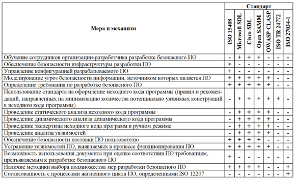
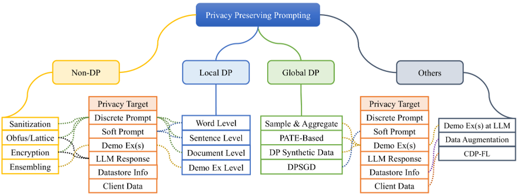

# Информационная безопасность <br> 大四信息安全

План лекций
1. [Основные понятия 18.09](#лекция-1-основные-понятия)
2. Средства защиты вычислительных систем и сетей 25.09 (18:40) или 02.10 (20:20) 
3. Искусственный интеллект и информационная безопасность 25.09 (20:20) или 02.10  (18:40)
4. Способы снижения рисков информационной безопасности 09.10 
5. Классификация и виды уязвимостей 23.10
6. Лекция от представителя компании 30.10
   Рубежный контроль №1 по темам 1-5 06.11
7. Лекция от представителя компании 13.11
8. Проектирование безопасных пользовательских интерфейсов 20.11 
9.  Личная безопасность 27.11
10. Персональные данные, Модель угроз, Сертификация ПО (?) 04.12
    Рубежный контроль №2 по темам 6-10 11.12
    Пересдача рубежных контролей №1 18.12

## Лекция 1 Основные понятия

### План лекции 

- Понятие «Информационная безопасность»
  “信息安全”的概念
- Понятия «хакер», «атакующий», «злоумышленник»
  “黑客”、“攻击者”、“入侵者”的概念
- Понятия «Безопасное программирование»: «sеcure coding» и «defensive programming»  
  “安全编程”的概念：“安全编码”和“防御性编程”
- Важность безопасного программирования  
  安全编程的重要性
- Основные принципы разработки безопасного программного обеспечения (ПО)  
  开发安全软件（SW）的基本原理

[Схема карьерных треков в результативной кибербезопасности](https://cybersecurity-roadmap.ru/)

#### Понятие «Информационная безопасность» <br> “信息安全”的概念

Информационная безопасность (англ. Information Security, а также — англ. InfoSec) — практика предотвращения несанкционированного доступа, использования, раскрытия, искажения, изменения, исследования, записи или уничтожения информации.  
信息安全 (也称为 InfoSec) 是防止未经授权访问、使用、披露、扭曲、修改、研究、记录或破坏信息的实践。

Информационная безопасность – это процесс обеспечения конфиденциальности, целостности и доступности информации.  
信息安全是确保信息的机密性、完整性和可用性的过程。

#### Триада CIA

- Confidentiality 机密性  
  Конфиденциальность — свойство информации быть недоступной или закрытой для неавторизованных лиц, сущностей или процессов;  
  机密性是指信息不能被未经授权的个人、实体或流程访问或关闭的属性；
- Integrity 完整性  
  Целостность — свойство сохранения правильности и полноты активов;  
  完整性是维护资产的正确性和完整性的属性；
- Availability 可用性
  Доступность — свойство информации быть доступной и готовой к использованию по запросу авторизованного субъекта, имеющего на это право.  
  可用性是指信息可以被有权利的授权主体在请求时访问并可供使用。

2.19 информационная безопасность (information security): Сохранение конфиденциальности, целостности и доступности информации.  
2.19 信息安全：维护信息的机密性、完整性和可用性。

ГОСТ Р ИСО/МЭК 27000-2012

#### Признаки защищаемой информации <br> 受保护信息的标志

- Имеется какой-то определенный круг законных пользователей, которые имеют право владеть этой информацией.  
  有一定范围的合法用户有权拥有这些信息。
- Имеются незаконные пользователи, которые стремятся овладеть этой информацией с тем, чтобы обратить ее себе во благо, а законным пользователям во вред.  
  有一些非法用户试图获取这些信息，以便利用这些信息谋取私利并损害合法用户的利益。

#### Защищаемая информация <br> 受保护的信息

- Персональные данные  
  个人资料
- Государственная тайна  
  国家机密
- Военная тайна  
  军事机密
- Коммерческая тайна  
  商业秘密
- Профессиональные конфиденциальные данные  
  专业机密数据

#### Типы персональных данных <br> 个人数据的类型

- Общие персональные данные  
  一般个人资料
- Биометрические персональные данные  
  个人信息
- Общедоступные персонифицированные данные  
  公开的个人数据
- Обезличенными персональные данные  
  匿名个人数据
- Специальные персональные данные  
  特殊个人信息

#### Объекты защиты информационной безопасности <br> 信息安全保护对象

- Информационные ресурсы  
  信息资源
- Права граждан, организаций и государства на доступ к информации  
  公民、组织和国家获取信息的权利
- Система создания, использования и распространения данных  
  数据创建、使用和分发系统
- Система формирования общественного сознания  
  公众意识形成体系

#### Угрозы информационной безопасности <br> 信息安全威胁

- Уничтожение информационных объектов  
  销毁信息对象
- Утечка информации  
  信息泄露
- Искажение информации  
  信息扭曲
- Блокирование объекта информации  
  阻止信息对象

#### Источники угрозы конфиденциальных данных <br> 机密数据威胁来源

- Внешние  
  外部的
- Внутренние  
  内部的

#### Угроза нарушения конфиденциальности <br> 破坏机密性的威胁

- Хищение носителей информации  
  盗窃信息载体
- Несанкционированный доступ к информационным системам  
  未经授权访问信息系统
- Выполнение пользователем несанкционированных действий  
  用户执行了未经授权的操作
- Перехват данных, передаваемых по каналам связи  
  拦截通过通讯渠道传输的数据
- Раскрытие содержания информации  
  信息内容披露

#### Угроза нарушения целостности <br> 破坏完整性的威胁

- Уничтожение носителей информации  
  销毁信息载体
- Внесение несанкционированных изменений в программы и данные  
  对程序和数据进行未经授权的更改
- Установка и использование нештатного программного обеспечения  
  安装和使用非标准软件
- Заражение вирусами  
  病毒感染
- Внедрение дезинформации  
  引入虚假信息

#### Нормативные Законодательные средства <br> 规范立法手段

- международные конвенции;  
  国际公约；
- Конституцией РФ;  
  俄罗斯联邦宪法；
- Федеральные законы «Об информации, информационных технологиях и о защите информации»;  
  联邦法律“关于信息，信息技术和信息保护”;
- Законы РФ «О безопасности», «О связи», «О государственной тайне»  
  俄罗斯联邦《安全法》、《通信法》、《国家机密法》
  - Различные подзаконные акты.  
    各项附则。  

#### Российские стандарты информационной безопасности <br> 俄罗斯信息安全标准

- Стандарт шифрования ГОСТ 28147-89  
  加密标准 GOST 28147-89
- Стандарт хэш-функции ГОСТ Р 34.11-2018  
  哈希函数标准 GOST R 34.11-2018
- Стандарт цифровой подписи ГОСТ 34.10-2018  
  数字签名标准 GOST 34.10-2018
- Средства вычислительной техники. Защита от НСД. Общие технические требования. ГОСТ Р 50739-95  
  计算机设备。防止未经授权的访问。通用技术要求。国家标准 R 50739-95
- Уголовный кодекс РФ, глава 28 «Преступления в сфере компьютерной информации» включает три статьи:  
  俄罗斯联邦刑法第28章“计算机信息领域犯罪”包括三条条款：
  - Статья 272 «Неправомерный доступ к компьютерной информации»;  
    第272条“未经授权访问计算机信息”；  
  - Статья 273 «Создание, использование и распространение вредоносных компьютерных программ»;  
    第273条“制作、使用和传播恶意计算机程序”；  
  - Статья 274 «Нарушение правил эксплуатации средств хранения, обработки или передачи компьютерной информации и информационно-телекоммуникационных сетей».  
    第274条“违反计算机信息存储、处理或者传输手段和信息和电信网络的运行规则。”  

#### Стандарт защищенности США <br> 美国安全标准

ТCSEC (англ. Trusted Computer System Evaluation Criteria) – Критерии определения безопасности компьютерных систем.  
ТCSEC（可信计算机系统评估标准）——确定计算机系统安全性的标准。

или  
或者

«Оранжевая книга» - стандарт Министерства обороны США, принят в 1985 г. , устанавливает основные условия для оценки эффективности средств компьютерной безопасности, содержащихся в компьютерной системе.  
《橙皮书》是美国国防部于1985年通过的一项标准，规定了评估计算机系统所含计算机安全工具有效性的基本条件。

#### Европейские критерии ИБ <br> 欧洲信息安全标准

- Международный стандарт ISO-IEC 15408. Общие критерии оценки информационной безопасности.  
  国际标准 ISO-IEC 15408。评估信息安全的通用标准。
- Стандарт ISO 17799. Международный стандарт сетевой безопасности.  
  ISO 17799 标准。网络安全的国际标准。
- Ripe MD-160. Стандарт цифровой подписи.  
  成熟的 MD-160。数字签名标准。

#### Международный стандарт защиты ИБ ISO/IEC 27000-2016 <br> 信息安全保护国际标准 ISO/IEC 27000-2016

Международный стандарт ISO/IEC 27000-2016 – Информационные технологии - Методы и средства обеспечения безопасности - Системы менеджмента информационной безопасности – Общие сведения и словарь  
国际标准 ISO/IEC 27000-2016 – 信息技术 - 安全方法和工具 - 信息安全管理系统 - 一般信息和词汇

#### Выбор средств защиты <br> 防护装备的选择

- Является ли она для противника более ценной, чем стоимость атаки?  
  对于敌人来说它的价值是否比攻击成本更高？
- Является ли она для вас более ценной, чем стоимость защиты?  
  它对你来说比保护成本更有价值吗？

#### Средства защиты информации <br> 信息安全工具

- Нормативные (неформальные)  
  规范性（非正式）
  - Нормативные(законодательные);  
    规范性（立法性）;  
  - Административные(организационные);  
    行政（组织）;  
  - Морально-этические средства  
    道德和伦理手段  
- Технические (формальные)  
  技术（正式）
  - Физические;  
    物理的;  
  - Аппаратные;  
    硬件;  
  - Программные;  
    软件;  
  - Криптографические.  
    加密。  

#### Средства защиты информации Нормативные 	Законодательные средства <br> 信息安全工具 监管立法工具

- международные конвенции;  
  国际公约；
- Конституцией РФ;  
  俄罗斯联邦宪法；
- Федеральные законы «Об информации, информационных технологиях и о защите информации»;  
  联邦法律“关于信息，信息技术和信息保护”;
- Законы РФ «О безопасности», «О связи», «О государственной тайне»  
  俄罗斯联邦《安全法》、《通信法》、《国家机密法》
  - Различные подзаконные акты.  
    各项附则。  

#### Средства защиты информации	Нормативные		Административные(организационные) <br> 信息安全工具监管行政（组织）

Организационные и административные меры  
组织和行政措施
- Сертификация деятельности  
  活动认证
- Аттестация субъектов или объектов  
  主体或客体的认证
- Лицензирование  
  许可
- Доступ:  
  使用权：
  - Интернет;  
    互联网;  
  - К внешним ресурсам;  
    外部资源； 
  - к электронной почте.  
    发送电子邮件。  

#### Средства защиты информации	Нормативные Морально-этические средства <br> 信息安全工具 监管 道德和伦理工具

- Правила поведения в обществе или коллективе  
  社会或团体的行为准则
- Личное отношение человека к конфиденциальной информации  
  一个人对机密信息的个人态度

#### Средства защиты информации Технические <br> 信息安全工具 技术

- Физические - это любые устройства, которые функционируют независимо от информационных систем и создают препятствия для доступа к ним.  
  物理 - 这些是任何独立于信息系统运行并对访问信息系统造成障碍的设备。
- Аппаратные - это любые устройства, которые встраиваются в информационные и телекоммуникационные системы. Они препятствуют доступу к информации, в том числе с помощью её маскировки.  
  硬件 - 这些是内置于信息和电信系统的任何设备。它们通过伪装等方式阻止人们获取信息。
- Программные – это программы, предназначенные для решения задач, связанных с обеспечением информационной безопасности.  
  软件 – 这些是旨在解决与确保信息安全相关的问题的程序。
  - DLP-системы - (Data Leak Prevention) служат для предотвращения утечки, переформатирования информации и перенаправления информационных потоков.  
    DLP 系统 -（数据泄漏防护）用于防止信息泄漏、重新格式化和信息流重定向。  
  - SIEM-системы - (Security Information and Event Management) обеспечивают анализ в реальном времени событий (тревог) безопасности, исходящих от сетевых устройств и приложений.  
    SIEM 系统 -（安全信息和事件管理）提供来自网络设备和应用程序的安全事件（警报）的实时分析。  
- Криптографические – внедрение криптографических и стенографических методов защиты данных для безопасной передачи по корпоративной или глобальной сети.  
  加密——实施加密和速记方法保护数据，以确保在企业或全球网络上进行安全传输。

#### Источники которые угрожают информационной безопасности <br> 威胁信息安全的来源

- Угрозы от персонала  
  员工的威胁
- Угроза от злоумышленников  
  入侵者的威胁
- Случайное удаление данных  
  意外删除数据
- Компьютерные вирусы  
  计算机病毒
- Вредоносные ПО или Программные закладки  
  恶意软件或书签
- Отказ в работе операционной системы  
  操作系统故障
- Природный фактор (пожары, наводнения, аварии в энергосистемах и т.д.)  
  自然因素（火灾、洪水、电网故障等）
- Активность воздействия угроз на инфоресурсы  
  影响信息资源的威胁活动

#### Угрозы от персонала <br> 来自员工的威胁

- Разглашение  
  披露
- Передача сведений о защите  
  安全信息的传输
- Халатность  
  疏忽
- Вербовка  
  招聘
- Подкуп персонала  
  贿赂员工
- Уход с рабочего места  
  离开工作场所
- Физическое устранение  
  物理消除

#### Внутренние нарушители <br> 内部破坏者

- Халатные  
  疏忽
- Саботирующие  
  破坏
- Увольняющиеся  
  那些离开的人
- Целенаправленные  
  有针对性

#### Угрозы от злоумышленников <br> 来自入侵者的威胁

**ГОСТ Р ИСО/МЭК 18028-1-2008 Информационная технология (ИТ). Методы и средства обеспечения безопасности. Сетевая безопасность информационных технологий.**  
**GOST R ISO/IEC 18028-1-2008 信息技术（IT）。确保安全的方法和手段。信息技术网络安全。**

Злоумышленник (attacker): Любое лицо, намеренно использующее уязвимости технических и нетехнических средств безопасности в целях захвата или компрометации информационных систем и сетей или затруднения доступа авторизованных пользователей к ресурсам информационной системы и сетевым ресурсам.  
攻击者：故意利用技术和非技术安全措施的漏洞，夺取或破坏信息系统和网络，或阻碍授权用户访问信息系统和网络资源的任何人。

**ГОСТ Р 52633.1-2009 Защита информации. Техника защиты информации.**  
**GOST R 52633.1-2009 信息安全。信息安全技术。**

Злоумышленник: Лицо, заинтересованное в получении возможности несанкционированного доступа к конфиденциальной информации, представляющей промышленную и коммерческую тайну, предпринимающее попытку такого доступа или совершившее его.  
攻击者：有意未经授权访问构成工业或商业机密的机密信息并试图进行此类访问或已经完成此类访问的人。

#### Мотивация атакующих <br> 攻击者的动机

- Вымогательство  
  敲诈勒索
- Охота за данными  
  数据搜寻
- Перехват пользовательского трафика  
  拦截用户流量
- Захват вычислительных ресурсов  
  捕获计算资源
- Недоброжелатели  
  心怀恶意的人
- Идеологические противники  
  意识形态对手
- Just for fun  
  只是为了好玩

#### Виды атакующих <br> 攻击者的类型

- Роботы (ботнеты)  
  机器人（僵尸网络）
- Профи  
  专业版
  - White Hat Hacker  
    白帽黑客  
  - Black Hat Hacker  
    黑帽黑客  
  - Gray Hat Hacker  
    灰帽黑客  
- Script kiddie / Newbie   
  脚本小子 / 新手  
- Criminal gangs — криминальные группы  
  犯罪团伙 — 犯罪集团  
- Hacktivist — хактивисты, идеологические противники  
  Hacktivist — 黑客行动主义者，意识形态反对者
- Cyberwarfare — кибер-войска  
  网络战——网络部队

#### Направленные атаки <br> 定向攻击

- Сложные и стойкие угрозы (advanced persistent threats, APT)   
  高级持续性威胁 (APT)

#### Выдержка из отчёта RSA EMC “When Advanced Persistent Threats Go Mainstream” <br> 摘自 RSA EMC 报告《当高级持续性威胁成为主流时》

| - | Обычные угрозы <br> 常见威胁 | Сложные и стойкие угрозы <br> 复杂而持续的威胁 |
|---|----------------|--------------------------|
| Кто инициатор атак? <br> 谁是袭击的发起者？ | Корыстолюбивые хакеры и киберпреступники <br> 自私的黑客和网络犯罪分子 | Хорошо финансируемые и подготовленные противники: политические враги, недобросовестные конкуренты, глобально организованная преступность <br> 资金充足、训练有素的对手：政治敌人、无良竞争对手、全球有组织犯罪 |
| Какие данные являются целью и мишенью атак? <br> 哪些数据是攻击的目标和对象？ | Данные кредитных карт и банковских учетных записей, персональные данные, любая информация, интересная многочисленному кругу покупателей <br> 信用卡和银行账户信息、个人信息、任何广大买家感兴趣的信息 | Интеллектуальная собственность; данные, касающиеся обеспечения национальной безопасности; коммерческая тайна; исходные коды программ; данные исследований и разработок; финансовая информация; производственные и бизнес-планы; другие сведения, интересные относительно узкому кругу покупателей <br> 知识产权; 与确保国家安全有关的数据；商业秘密；程序源代码；研究和开发数据；财务信息；生产和经营计划；相对狭窄的买家圈子感兴趣的其他信息 |
| Какие организации являются мишенью? <br> 哪些组织成为目标？ | Любое предприятие и целые отрасли, особенно финансовый сектор <br> 任何企业和整个行业，尤其​​是金融行业 | Конкретная организация, главным образом, правительственные, оборонные, энергетические, финансовые и высокотехнологичные предприятия <br> 具体组织，主要是政府、国防、能源、金融和高科技企业 |
| Цель атак <br> 攻击目的 | Доход (нелегальный), кражи личности, мошенничество, самовыражение <br> 收入（非法）、身份盗窃、欺诈、自我表达 | Влияние на рынок; достижение конкурентного преимущества; влияние на национальную обороноспособность; занятие выгодной позиции на переговорах; повреждение критически важной инфраструктуры противника и т.д. <br> 对市场的影响；获得竞争优势；对国防的影响；在谈判中占据有利地位；破坏敌人的重要基础设施等等。 |
| Методы атак <br> 攻击方法 | Главным образом – атаки на периметр сети предприятия <br> 主要针对企业网络边界的攻击 | Основным методом являются атаки через пользователей (социальная инженерия и целевой фишинг), а также через конечные устройства (эксплуатация уязвимостей программ и другие способы). Атаки часто характеризуются сложностью и многоступенчатостью <br> 主要方式为通过用户发起的攻击（社会工程学和针对性网络钓鱼），以及通过终端设备发起的攻击（利用软件漏洞等方法）。攻击通常具有复杂性和多阶段性的特点 |

#### Компьютерные вирусы <br> Компьютерные вирусы

Компьютерные вирусы - разновидность вредоносных программ, отличительной особенностью которых является способность к размножению (саморепликации).   
计算机病毒是一种恶意软件，其显著特征是具有繁殖能力（自我复制）。

#### Классификация вирусов <br> 病毒分类

- По поражаемым объектам: файловые вирусы, загрузочные вирусы, скриптовые вирусы, сетевые черви.  
  按感染对象分类：文件病毒、启动病毒、脚本病毒、网络蠕虫。
- По поражаемым операционным системам и платформам: DOS, Microsoft Windows, Unix (Linux, Android)  
  受影响的操作系统和平台：DOS、Microsoft Windows、Unix（Linux、Android）
- По технологиям используемым вирусом: полиморфные вирусы, стелс-вирусы  
  根据病毒所采用的技术：多态病毒、隐形病毒
- По языку, на котором написан вирус: ассемблер, высокоуровневый язык программирования, язык сценариев.  
  根据病毒编写语言：汇编语言、高级编程语言、脚本语言。
- По механизму заражения: паразитирующие, перезаписывающие, спутники  
  按感染机制：寄生、重写、卫星
- По дополнительной вредоносной функциональности (бэкдоры, кейлоггеры, шпионы, ботнеты и др.)  
  额外的恶意功能（后门、键盘记录器、间谍、僵尸网络等）

#### Уязвимость <br> 漏洞

- ГОСТ Р 56546-2015:  
  国家标准 R 56546-2015：  
  Уязвимость - это недостаток программно-технического средства или информационной системы в целом, который может быть использован для реализации угроз безопасности информации.  
  漏洞是软件或硬件工具或整个信息系统中的缺陷，可用于实施对信息安全的威胁。

- ISO/IEC 27000:2018:  
  ISO/IEC 27000：2018：  
  Уязвимость – это слабое место актива или средства контроля и управления, которое может быть использовано злоумышленниками.  
  漏洞是资产或控制中的弱点，可能被恶意用户利用。

#### Разделение уязвимостей по классам <br> 按类别划分漏洞

- объективными;  
  客观的;
- случайными;  
  随机的;
- субъективными.  
  主观的。

#### Типы уязвимостей <br> 漏洞类型

- уязвимость кода (баги, логические ошибки и т.д);  
  代码漏洞（错误、逻辑错误等）；  
- уязвимость конфигурации;  
  配置漏洞；  
- уязвимость архитектуры;  
  架构漏洞  
- организационная уязвимость;  
  组织漏洞
- многофакторная уязвимость.  
  多因素漏洞

ГОСТ Р 56546-2015  
国家标准 R 56546-2015

#### Безопасное программирование <br> 安全编程

Методика разработки программного обеспечения, предотвращающая случайное внедрение уязвимостей и обеспечивающая устойчивость к воздействию вредоносных программ и несанкционированному доступу.  
一种软件开发方法，可防止意外引入漏洞并确保抵御恶意软件和未经授权的访问。

- Defensive programming (Оборонительное, защитное, безопасное программирование)   
  防御性编程（防御性、保护性、安全编程）
- Secure coding (Безопасное программирование)  
  安全编程

ГОСТ Р 56939-2016 Защита информации.   
GOST R 56939-2016 信息安全。  

Разработка безопасного программного обеспечения.  
开发安全软件。

#### Defensive programming <br> 防御性编程

Оборонительное, защитное, безопасное программирование — принцип разработки ПО, при котором разработчики пытаются учесть все возможные ошибки и сбои, максимально изолировать их и при возможности восстановить работоспособность программы в случае неполадок.  
防御性、保护性、安全编程是一种软件开发原则，其中开发人员尝试考虑所有可能的错误和故障，尽可能地隔离它们，并且在可能的情况下在发生故障时恢复程序的功能。

#### Secure coding <br> 安全编码

Безопасное программирование — методика написания программ, устойчивых к атакам со стороны вредоносных программ и злоумышленников.  
安全编程是一种编写能够抵御恶意软件和入侵者攻击的程序的技术。

#### Безопасное программное обеспечение <br> 安全软件

Программное обеспечение, разработанное с использованием совокупности мер, направленных на предотвращение появления и устранение уязвимостей программы  
采用一系列旨在防止出现和消除程序漏洞的措施开发的软件

#### Небезопасная программа <br> 不安全的程序

Потенциальная цель для злоумышленника, который может использовать имеющиеся уязвимости для просмотра, изменения или удаления имеющейся информации, влияния на работу программ и сервисов (запуск или остановка), внедрения вредоносного кода в систему  
攻击者的潜在目标，攻击者可以利用现有漏洞查看、更改或删除现有信息，影响程序和服务的运行（启动或停止），或将恶意代码引入系统

#### Задача безопасного программирования <br> 安全编程挑战

Защита данных пользователя от кражи и порчи, сохранение контроля над системой.  
保护用户数据免遭盗窃和损坏，保持对系统的控制。

#### Основные принципы при разработке безопасного ПО <br> 开发安全软件的基本原则

- работоспособность и полезность (юзабилити, англ. usability)  
  功能性和实用性（可用性）  
- безопасность  (англ. security)  
  安全  
- надежность (англ. reliability)   
  可靠性  
- конфиденциальность (англ. privacy)   
  保密性（英文：隐私）  
- обеспечение целостности и корректности бизнеса (англ. business integrity)  
  确保业务的完整性和正确性  

## Лекция 2 Разбор стандарта о разработке безопасного программного обеспечения <br> 第二讲 安全软件开发标准分析

### План лекции <br> 授课计划

- Ключевые моменты стандарта.  
  标准要点。
- Разбор предлагаемых мер по защите.  
  分析拟议的保护措施。
- Документы, которые должны быть в наличии: список и содержание.  
  必须提供的文件：清单和内容。
- Соответствие другим нормативным актам, стандартам и методологиям.  
  遵守其他法规、标准和方法。
- Аспекты, которые не покрывает стандарт.  
  标准未涵盖的方面。
- Аналоги в мире.  
  世界上的类似物。

ГОСТ Р 56939-2016 «Защита информации. Разработка безопасного программного обеспечения. Общие требования»  
GOST R 56939-2016“信息安全。开发安全软件。一般要求»

АО «НПО «ЭШЕЛОН»  
ESHELON 非营利组织股份公司

Согласно Приказу РОССТАНДАРТ от 01.06.2016 №458-ст  
根据 ROSSTANDART 2016 年 6 月 1 日第 458 号命令  
Утвержден для добровольного использования.  
已批准自愿使用。  

#### Этапы разработки стандарта <br> 标准发展阶段


#### Целевая аудитория стандарта <br> 标准的目标受众


Разработчики и производители программного обеспечения  
软件开发商和制造商
- Являются основной аудиторией  
  是主要受众
- В стандарте представлены требования к реализации мер и свидетельствам  
  标准提出了措施和证据的实施要求
- Дополнительно документ может использоваться для декларации соответствия  
  此外，该文件还可用于符合性声明

Оценщики  
评估师
- Органы по сертификации, аккредитованные испытательные лаборатории  
  认证机构、认可的测试实验室
- Не является основной аудиторией  
  不是主要受众
- В стандарте представлены требования к свидетельствам  
  标准提出了证书的要求
- В стандарте не предъявляются требования к действиям оценщиков  
  本标准并未对评估师的行为作出要求

#### Меры по разработке безопасного программного обеспечения <br> 开发安全软件的措施

Как следует из самого ГОСТа, под безопасным программным обеспечением понимается «программное обеспечение, разработанное с использованием совокупности мер, направленных на предотвращение появления и устранение уязвимостей программы».  
根据 GOST 本身的规定，安全软件被理解为“使用一系列旨在防止出现和消除程序漏洞的措施开发的软件”。

В стандарте указаны меры, которые рекомендуется реализовать на соответствующих этапах жизненного цикла программного обеспечения, перечислены в этом же ГОСТе.  
标准规定了建议在同一GOST中列出的软件生命周期相应阶段实施的措施。

#### Меры по разработке безопасного программного обеспечения <br> 开发安全软件的措施

Общие меры  
一般措施
- содержатся в 4 разделе  
  载于第 4 节

Технические меры  
技术措施
- содержатся в 5 разделе  
  载于第 5 节
- для соответствия ГОСТ должны быть реализованы все меры из раздела 5  
  为符合 GOST，必须实施第 5 部分中的所有措施
- предусмотрена возможность использования компенсирующих мер  
  提供了使用补偿措施的可能性

#### Документы, которые должны быть в наличии, часть 1 <br> 必须提供的文档，第 1 部分

- Политика информационной безопасности в соответствии с ИСО/МЭК 27001.  
  符合 ISO/IEC 27001 的信息安全政策。
- Руководство по разработке безопасного ПО.  
  开发安全软件的指南。
- Перечень требований по безопасности.  
  安全要求清单。
- Модель угроз безопасности.  
  安全威胁模型。
- Программа обучения сотрудников в области разработки безопасного ПО.  
  针对安全软件开发领域员工的培训计划。

  ---

- Перечень инструментальных средств разработки ПО.  
  软件开发工具列表。
- Регламент защиты инфраструктуры среды разработки ПО.  
  保护软件开发环境基础设施的法规。
- Порядок оформления исходного кода программы.  
  格式化程序源代码的过程。
- Регламент и протоколы экспертизы исходного кода программы.  
  检查程序源代码的规定和协议。

#### Документы, которые должны быть в наличии, часть 2 <br> 必须提供的文档，第 2 部分

- Проект архитектуры программы (логическая структура программы).  
  程序架构项目（程序的逻辑结构）。
- Описание проектных решений, обеспечивающих выполнение требований по безопасности.  
  确保符合安全要求的设计解决方案的描述。
- Регламент экстренного выпуска обновлений ПО.  
  紧急发布软件更新的规定。
- Регламент маркировки версий ПО.  
  软件版本标记规定。
- Регламент управления конфигурацией ПО.  
  软件配置管理规定。
- Регламент резервного копирования конфигурации ПО.  
  备份软件配置的规定。
- Регламент регистрации событий изменений конфигурации ПО.  
  登记软件配置改变事件的规定。

#### Документы, которые должны быть в наличии, часть 3 <br> 必须提供的文档，第 3 部分

- Регламент и протоколы статического тестирования программы.  
  程序静态测试的规定和协议。
- Регламент и протоколы функционального тестирования программы.  
  程序功能测试的规定和协议。
- Регламент и протоколы тестирования на проникновение.  
  渗透测试规则和协议。
- Регламент и протоколы динамического анализа кода программы.  
  程序代码动态分析的规则和协议。
- Регламент и протоколы фаззинг-тестирования программы.  
  程序模糊测试的规定和协议。
- Регламент, протоколы и журналы поиска уязвимостей программы.  
  搜索程序漏洞的规则、协议和日志。

#### Документы, которые должны быть в наличии, часть 4 <br> 必须提供的文档，第 4 部分

- Эксплуатационная документация.  
  操作文件。
- Регламент передачи ПО пользователю.  
  向用户转让软件的规定。
- Регламент отслеживания и исправления обнаруженных ошибок ПО и уязвимостей программы.  
  跟踪和纠正发现的软件错误和程序漏洞的规定。
- Регламент приема и обработки сообщений от пользователей об ошибках ПО и уязвимостях программы.  
  接收和处理用户关于软件错误和程序漏洞的信息的规定。
- Регламент доведения до пользователей информации об уязвимости программы и рекомендаций по их устранению  
  向用户传达有关程序漏洞的信息以及消除漏洞的建议的规定

  ---

- Журнал ошибок и уязвимостей программы.  
  程序错误和漏洞的日志。
- Журнал регистрации изменений конфигурации ПО.  
  软件配置变更的日志。
- Журнал обучения сотрудников в области разработки безопасного ПО.  
  安全软件开发领域的员工培训杂志。

#### Соответствие другим нормативным актам, стандартам и методологиям <br> 遵守其他法规、标准和方法



#### Аспекты, которые не покрывает стандарт <br> 标准未涵盖的方面

- Способы, меры и средства защиты конфиденциальной информации  
  保护机密信息的方法、措施和手段
- Меры по обеспечению защиты информации в автоматизированных системах управления производственными и технологическими процессами   
  确保生产和技术过程自动化控制系统信息安全的措施
- Угрозы безопасности информации при разработке программного обеспечения  
  软件开发中的信息安全威胁

#### РАЗРАБОТКА БЕЗОПАСНОГО ПРОГРАММНОГО ОБЕСПЕЧЕНИЯ <br> 安全软件的开发

- ГОСТ Р 58412-2019  
  国家标准 R 58412-2019
- РАЗРАБОТКА БЕЗОПАСНОГО ПРОГРАММНОГО ОБЕСПЕЧЕНИЯ  
  安全软件的开发
- Угрозы безопасности информации при разработке программного обеспечения  
  软件开发中的信息安全威胁
- УТВЕРЖДЕН И ВВЕДЕН В ДЕЙСТВИЕ Приказом Федерального агентства по техническому регулированию и метрологии от 21 мая 2019 г. N 204-ст  
  经联邦技术监管和计量局 2019 年 5 月 21 日第 N 204 号命令批准并生效

#### Угрозы безопасности информации при разработке программного обеспечения <br> 软件开发中的信息安全威胁

- Перечень и описание угроз безопасности информации, представленные в настоящем стандарте, могут использоваться для определения угроз безопасности, актуальных для среды разработки программного обеспечения и разрабатываемого программного обеспечения.  
  本标准中提出的信息安全威胁列表和描述可用于确定与软件开发环境和正在开发的软件相关的安全威胁。
- 4.1 При реализации требований ГОСТ Р 56939 разработчиком безопасного программного обеспечения (ПО) должен быть определен перечень мер, подлежащих реализации при его разработке в целях предотвращения появления и устранения уязвимостей программ в процессах их жизненного цикла.  
  4.1 在实施 GOST R 56939 的要求时，安全软件（SW）的开发者必须确定在开发过程中要实施的措施清单，以防止在程序生命周期过程中出现和消除程序漏洞。

- лица (нарушители), осуществляющие преднамеренные или непреднамеренные действия, направленные на внедрение в ПО уязвимостей программы или нарушение конфиденциальности информации, потенциально способствующей выявлению недостатков ПО и уязвимостей программы;  
  有意或无意地在软件中引入漏洞或侵犯可能有助于识别软件缺陷和程序漏洞的信息保密性的人员（违法者）；
- инструментальные средства, применяемые при разработке ПО, алгоритм работы которых может стать причиной внедрения в ПО уязвимостей программы.  
  软件开发中使用的工具，其运行算法可能会导致软件出现漏洞。

Примечание - К инструментальным средствам относятся, например, трансляторы, компиляторы, прикладные программы, используемые для проектирования и документирования, редакторы исходного кода программ, отладчики, интегрированные среды разработки.  
注 - 工具包括：翻译器、编译器、用于设计和文档的应用程序、程序源代码编辑器、调试器、集成开发环境。

Непреднамеренные угрозы безопасности информации при разработке ПО возникают из-за неосторожности или неквалифицированных действий работников разработчика ПО и связаны с недостаточной осведомленностью работников в области защиты информации и разработки безопасного ПО.  
软件开发过程中对信息安全的无意威胁是由于软件开发人员的粗心大意或不熟练的操作而产生的，并且与员工在信息安全和安全软件开发方面的意识不足有关。

- внешние нарушители - лица, не имеющие доступа к среде разработки ПО и реализующие угрозы безопасности информации из выделенных (ведомственных, корпоративных) сетей связи, внешних сетей связи общего пользования;  
  外部违规者 - 无法访问软件开发环境并从专用（部门、企业）通信网络、外部公共通信网络实施信息安全威胁的人员；
- внутренние нарушители - лица, имеющие постоянный или разовый доступ к среде разработки ПО.  
  内部违规者 - 具有永久或一次性访问软件开发环境的人员。

Внутренние нарушители могут реализовывать угрозы безопасности информации при разработке ПО путем:  
内部人员可以通过以下方式在软件开发过程中实施信息安全威胁：

- влияния на процессы жизненного цикла ПО;  
  对软件生命周期过程的影响；
- осуществления преднамеренных или непреднамеренных действий в отношении отдельных объектов среды разработки ПО, в том числе элементов конфигурации, выполняя санкционированный доступ;  
  在执行授权访问时，对软件开发环境的各个对象（包括配置元素）执行有意或无意的操作；
- осуществления преднамеренных действий в отношении отдельных объектов среды разработки ПО, в том числе элементов конфигурации, выполняя несанкционированный доступ.  
  对软件开发环境的各个对象（包括配置元素）执行故意的操作，执行未经授权的访问。

Внешние нарушители могут реализовывать угрозы безопасности информации при разработке ПО путем удаленного доступа (из внешних сетей связи общего пользования) к объектам среды разработки ПО, в том числе элементам конфигурации, выполняя несанкционированный доступ. Внешние нарушители для повышения своих возможностей по доступу к объектам среды разработки ПО могут вступать в сговор с внутренними нарушителями.  
外部入侵者可以通过远程访问（从外部公共通信网络）软件开发环境的对象（包括配置元素）进行未经授权的访问，对软件开发过程中的信息安全造成威胁。外部攻击者可能会与内部攻击者勾结，以增强其访问软件开发环境对象的能力。

1. Угрозы безопасности информации при выполнении анализа требований к программному обеспечению  
   进行软件需求分析时的信息安全威胁
2. Угрозы безопасности информации при выполнении проектирования архитектуры программы  
   程序架构设计时对信息安全的威胁
3. Угрозы безопасности информации при выполнении конструирования и комплексирования программного обеспечения  
   设计和集成软件时的信息安全威胁
4. Угрозы безопасности информации при выполнении квалификационного тестирования программного обеспечения  
   进行软件资质测试时的信息安全威胁
5. Угрозы безопасности информации при выполнении инсталляции программы и поддержки приемки программного обеспечения  
   程序安装和软件验收支持过程中的信息安全威胁
6. Угрозы безопасности информации при решении проблем в программном обеспечении в процессе эксплуатации  
   解决软件运行过程中的问题对信息安全的威胁
7. Угрозы безопасности информации в процессе менеджмента документацией и конфигурацией программы  
   管理文档和程序配置过程中的信息安全威胁
8. Угрозы безопасности информации в процессе менеджмента инфраструктурой среды разработки программного обеспечения  
   软件开发环境基础设施管理过程中的信息安全威胁

#### 1 Угрозы безопасности информации при выполнении анализа требований к программному обеспечению <br> 执行软件需求分析时的信息安全威胁

- Угроза появления уязвимостей программы вследствие ошибок, допущенных при за дании требований по безопасности, предъявляемых к создаваемому программному обеспечению  
  由于在创建软件时设置安全要求时出现错误而导致程序漏洞的威胁
- Угроза выявления уязвимостей программы вследствие раскрытия информации о требованиях по безопасности, предъявляемых к создаваемому программному обеспечению  
  由于泄露了正在创建的软件的安全要求信息而导致识别程序漏洞的威胁

#### 2 Угрозы безопасности информации при выполнении проектирования архитектуры программы <br> 进行程序架构设计时的信息安全威胁

- Угроза появления уязвимостей программы вследствие ошибок, допущенных при создании проекта архитектуры программы  
  由于创建程序架构项目时犯的错误而产生程序漏洞的威胁
- Угроза выявления уязвимостей программы вследствие раскрытия информации о проекте архитектуры программы  
  由于程序架构设计信息的泄露，导致程序漏洞被发现的威胁

#### 3 Угрозы безопасности информации при выполнении конструирования и комплексирования программного обеспечения <br> 软件设计和集成过程中的信息安全威胁

- Угроза внедрения уязвимостей программы в исходный код программы в ходе его разработки  
  在程序开发过程中将程序漏洞引入程序源代码的威胁
- Угроза внедрения уязвимостей программы путем использования заимствованных у сторонних разработчиков программного обеспечения уязвимых компонентов  
  使用从第三方软件开发商借用的易受攻击的组件引入程序漏洞的威胁
- Угроза внедрения уязвимостей программы из-за неверного использования инструментальных средств при разработке программного обеспечения  
  由于不正确使用软件开发工具而引入程序漏洞的威胁
- Угроза появления уязвимостей программы вследствие ошибок, допущенных в эксплуатационных документах в ходе осуществления их разработки и хранения  
  由于操作文档在开发和存储过程中出现错误而产生程序漏洞的威胁
- Угроза выявления уязвимостей программы вследствие раскрытия исходного кода программы  
  由于程序源代码的泄露而导致发现程序漏洞的威胁

#### 4 Угрозы безопасности информации при выполнении квалификационного тестирования программного обеспечения <br> 执行软件资质测试时的信息安全威胁

- Угроза появления уязвимостей вследствие изменения тестовой документации с целью сокрытия уязвимостей программы  
  为了掩盖程序漏洞而更改测试文档带来的漏洞威胁
- Угроза выявления уязвимостей вследствие раскрытия информации о тестировании программного обеспечения  
  软件测试信息泄露导致漏洞暴露的威胁
- Угроза появления уязвимостей программы вследствие совершения ошибок при выполнении тестирования программного обеспечения  
  由于软件测试过程中的错误而产生软件漏洞的威胁

#### 5 Угрозы безопасности информации при выполнении инсталляции программы и поддержки приемки программного обеспечения <br> 程序安装和软件验收支持期间的信息安全威胁

- Угроза внедрения уязвимостей в программу в процессе ее поставки  
  在程序交付过程中引入漏洞的威胁
- Угроза появления уязвимостей программы вследствие модификации эксплуатационных документов при их передаче пользователю  
  操作文档在传输给用户时被修改，从而出现程序漏洞的威胁
- Угроза внедрения уязвимостей в обновления программного обеспечения  
  软件更新中引入漏洞的威胁

#### 6 Угрозы безопасности информации при решении проблем в программном обеспечении в процессе эксплуатации <br> 解决软件运行过程中出现的问题时的信息安全威胁

- Угроза неисправления обнаруженных уязвимостей программы  
  无法纠正检测到的程序漏洞的威胁
- Угроза выявления уязвимостей вследствие раскрытия информации об ошибках программного обеспечения и уязвимостях программы  
  由于软件错误和程序漏洞信息的泄露，识别漏洞的威胁

#### 7 Угрозы безопасности информации в процессе менеджмента документацией и конфигурацией программы <br> 管理文档和程序配置过程中的信息安全威胁

- Угроза внедрения в программу уязвимостей при управлении конфигурацией про граммного обеспечения  
  在软件配置管理过程中引入漏洞的威胁

#### 8 Угрозы безопасности информации в процессе менеджмента инфраструктурой среды разработки программного обеспечения <br> 软件开发环境基础设施管理过程中的信息安全威胁

#### 9 Угрозы безопасности информации в процессе менеджмента людскими ресурсами <br> 人力资源管理中的信息安全威胁

- Угроза появления уязвимостей программы вследствие совершения разработчиком программного обеспечения ошибок при обучении своих работников в области разработки без опасного программного обеспечения  
  由于软件开发商在培训员工开发安全软件时犯错而导致软件漏洞的威胁

#### Аналоги в мире <br> 世界上的类似物

- Trustworthy Computing (TWC) Initiative  
  可信计算（TWC）计划
- Классификация угроз и атак (STRIDE)  
  威胁和攻击分类 (STRIDE)
- Оценка атак на программное обеспечение (DREAD)  
  软件攻击评估（DREAD）

#### Итоги лекции <br> 讲座总结

- Ключевые моменты стандарта.  
  标准要点。
- Разбор предлагаемых мер по защите.  
  分析拟议的保护措施。
- Документы, которые должны быть в наличии: список и содержание.  
  必须提供的文件：清单和内容。
- Соответствие другим нормативным актам, стандартам и методологиям.  
  遵守其他法规、标准和方法。
- Аспекты, которые не покрывает стандарт.  
  标准未涵盖的方面。
- Аналоги в мире.  
  世界上的类似物。

## Лекция 3 Безопасность искусственного интеллекта <br> 人工智能安全

#### Зачем ИБ в ИИ? <br> 人工智能为什么需要信息安全？

- ИИ активно проникает во все сферы жизни и бизнеса.  
  人工智能正在积极渗透到生活和商业的各个领域。
- Интеграторам приходится заботиться об ИБ данных, обрабатываемых ИИ.  
  集成商必须注意人工智能处理的数据的信息安全。
- Реализация генеративных моделей требует особого подхода к ИБ.   
  生成模型的实施需要采用特殊的信息安全方法。

#### Новые угрозы <br> 新威胁

Раньше угрозы ИБ были:  
以前，信息安全威胁有：  

- Алгоритмическими (вредоносный код, вирусы).  
  算法（恶意代码、病毒）。
- Социально-инженерными (доверчивость сотрудников, шантаж).  
  社会工程学（员工轻信、勒索）

ИИ действует не по заданным алгоритмам, что усложняет контроль.  
人工智能并不按照预设的算法运行，这使得控制变得复杂。

Старые средства защиты менее эффективны против ИИ-угроз.  
旧的防御措施对于人工智能威胁的效果较差。

#### Два вида сбоев <br> 两种类型的故障

Умышленно вызванные сбои:  
故意造成的失败：
- Активные атаки злоумышленников на систему.  
  入侵者对系统进行主动攻击。
- Примеры: некорректная классификация данных, кража алгоритмов.  
  示例：错误的数据分类、算法盗窃。

Непреднамеренные сбои:  
意外故障：
- Формально корректные, но небезопасные результаты работы системы.  
  形式上正确，但系统运行结果不安全。

#### Сводка по непреднамеренным сбоям <br> 意外故障摘要

| Сбой <br> 故障 | Источники данных в Azure Monitor <br> Azure Monitor中的数据源 |
|---|---|
| Взлом поощрения <br> 奖励漏洞 | Системы обучения с подкреплением действуют непредусмотренным образом из-за несоответствия между указанным поощрением и действительным поощрением <br> 强化学习系统由于指定奖励和实际奖励之间的不匹配而以未预期的方式运行 |
| Побочные эффекты <br> 副作用	 | Система обучения с подкреплением разрушает среду в попытке достигнуть свою цель <br> 强化学习系统在尝试达到目标时破坏了环境 |
| Изменения при распространении <br> 分布变化 | Система тестируется в среде одного вида, но не может адаптироваться к изменениям в средах другого вида <br> 系统在一种类型的环境中进行了测试，但无法适应另一种类型环境中的变化 |
| Естественные состязательные примеры <br> 自然对抗样本 | Без искажений злоумышленника в системе машинного обучения возникает сбой из-за интеллектуального анализа отрицательных образцов с жесткими условиями <br> 即使没有攻击者的扰动，机器学习系统由于对具有严格条件的负样本的智能分析而发生故障 |
| Общее повреждение <br> 普通损坏 | Система не способна справиться с общими повреждениями и искажениями, например наклоном, масштабированием или зашумлением изображений. <br> 系统无法应对常见的损坏和失真，例如图像的倾斜、缩放或噪声 |
| Неполное тестирование <br> 测试不完全 | Система машинного обучения не тестируется в реальных условиях, для работы в которых она предназначена. <br> 机器学习系统未在其预期使用的真实环境中进行测试 |

#### Подробные сведения об умышленно вызванных сбоях <br> 有关故意导致的故障的详细信息

| Класс атаки <br> 攻击等级 | Description <br> 描述 | Тип нарушения <br> 违规类型 | Сценарий <br> 场景 |
|---|---|---|---|
| Атаки пертурбации <br> 扰动攻击 | При атаках стиля пертурбации злоумышленник незаметно изменяет запрос, чтобы получить нужный ответ. <br> 在扰动式攻击中，攻击者巧妙地修改请求以获得所需的响应。  | Целостность <br> 完整性 | Изображение: шум добавляется к изображению рентгеновских лучей, что делает прогнозы переходят от нормального сканирования к ненормальным <br> 图像：X 射线图像中添加了噪声，导致预测从正常扫描变为异常扫描 |
|  |  |  | Перевод текста: определенные символы обрабатываются, чтобы привести к неправильному переводу. В ходе атаки конкретное слово может заглушаться или даже полностью удаляться\["черный ящик" и "белый ящик"\] <br> 文本翻译：某些字符经过处理会导致翻译不正确。在攻击过程中，某个特定的词可能会被抑制，甚至完全删除 \[“黑盒”和“白盒”\] |
|  |  |  | Речь: Исследователи показали, как дано волны речи, другая волновая форма может быть именно реплика, но транскрибирование в совершенно другой текст\[3\]\[Белое поле\], но может быть расширено до черного ящика\] <br> 语音：研究人员展示了给定一个语音波形，另一个波形可以完全相同，但转录成完全不同的文本\[3\]\[白框]，但可以扩展为黑框\] |
| Нападения на отравление <br> 中毒攻击 | Цель злоумышленника заключается в том, чтобы загрязнить модель компьютера, созданную на этапе обучения, чтобы прогнозы на новых данных были изменены на этапе тестирования. <br> 攻击者的目标是污染在训练阶段创建的计算机模型，以便在测试阶段改变对新数据的预测。 | Целостность <br> 完整性 | В медицинском наборе данных, где цель заключается в прогнозировании дозы антикоагулантного препарата Варфарин с помощью демографических данных и т. д. Исследователи представили вредоносные образцы на уровне 8% от отравлений, которые изменили дозу на 75,06% для половины пациентов <br> 在一个医疗数据集中，其目标是使用人口统计数据等来预测抗凝药物华法林的剂量，研究人员在 8% 的中毒事件中提供了恶意样本，导致一半患者的剂量改变了 75.06% |
|  | Целевой: в целевых атаках на отравление злоумышленник хочет неправильно классифицировать конкретные примеры <br> 有针对性的：在有针对性的投毒攻击中，攻击者想要对具体示例进行错误分类 |  | В чат-боте Тай будущие беседы были запятнано, потому что часть прошлых разговоров использовалась для обучения системы с помощью обратной связи <br> 在 Tai 的聊天机器人中，未来的对话受到了污染，因为一些过去的对话被用来通过反馈来训练系统 |
|  | Неизбирательный: цель заключается в том, чтобы вызвать doS, как эффект, который делает систему недоступной. <br> 不分皂白：目的是造成类似 DoS 的效果，使系统不可用。 |  |  |
| Инверсия модели <br> 模型反演 | Секретные возможности, используемые в моделях машинного обучения, можно восстановить <br> 机器学习模型中使用的秘密能力可以被恢复 | Конфиденциальность; <br> 保密性； | Исследователи смогли восстановить частные обучающие данные, используемые для обучения алгоритма\[6\] Авторы смогли восстановить лица, просто именем и доступом к модели до точки, где механические турки могли использовать фотографию для идентификации человека из линии с 95% точностью. Авторы также смогли извлечь конкретные сведения. <br> 研究人员能够恢复用于训练算法的私人训练数据。\[6\] 作者能够通过姓名和模型访问恢复人脸，以至于 Mechanical Turks 可以使用照片来识别来自准确率高达 95% 的阵容。作者还能够提取具体信息。 |

#### Зачем нужна защита данных в системах ИИ? <br> 为什么人工智能系统需要数据保护？

- Защита моделей от отравления данными.  
  保护模型免受数据中毒。
- Сохранение приватности данных пользователей.  
  维护用户数据的隐私。
- Минимизация рисков внутренних угроз.  
  最大限度地降低内部威胁的风险。
- Защита данных от манипуляций и взломов.  
  保护数据免遭操纵和黑客攻击。
- Противодействие атакам на системы ИИ.  
  应对针对人工智能系统的攻击。

#### Типы данных, используемых в ИИ <br> 人工智能中使用的数据类型

- Тренировочные данные.  
  训练数据。
- Тестовые и валидационные данные.  
  测试和验证数据。
- Операционные данные.  
  操作数据。
- Персональные и чувствительные данные.  
  个人和敏感数据。
- Метаданные и синтетические данные.  
  元数据和合成数据。

#### ИИ в отраслях <br> 工业中的人工智能

- Здравоохранение: Защита данных пациентов.  
  医疗保健：保护患者数据。
- Финансы: Борьба с мошенничеством, соблюдение законов.  
  财务：反欺诈、遵守法律。
- Автопром: Защита данных автономных систем.  
  汽车行业：自主系统的数据保护。
- Промышленность: Защита интеллектуальной собственности.  
  行业：知识产权保护。

#### Роль регуляций в защите данных ИИ <br> 法规在保护人工智能数据中的作用

- GDPR, CCPA, HIPAA: Строгие правила сбора, обработки и хранения данных.  
  GDPR、CCPA、HIPAA：对数据收集、处理和存储有严格的规定。
- Локализация данных: Хранение данных внутри страны.  
  数据本地化：将数据存储在国内。
- Этика использования ИИ: Минимизация предвзятости и обеспечение прозрачности.  
  人工智能使用的伦理：尽量减少偏见并确保透明度。

#### Принципы защиты данных в системах ИИ <br> 人工智能系统中的数据保护原则

- Шифрование данных (в покое и в движении).  
  数据加密（静止和移动）。
- Защита от утечек данных (DLP).  
  数据泄露防护（DLP）。
- Классификация данных: Определение уровня чувствительности.  
  数据分类：确定敏感度级别。
- Токенизация и маскирование данных.  
  标记化和数据屏蔽。
- Контроль доступа к данным.  
  数据访问控制。

#### Безопасные многопартийные вычисления <br> 安全多方计算


#### Дифференциальная конфиденциальность <br> 差异隐私


#### Гомоморфное шифрование <br> 同态加密


#### Федеративное обучение <br> 联邦学习


#### Этапы обработки данных в ИИ и их защита <br> 人工智能数据处理阶段及其保护

- Сбор данных: Шифрование и контроль доступа.  
  数据收集：加密和访问控制。
- Предварительная обработка: Маскирование данных.  
  预处理：数据屏蔽。
- Хранение данных: Регулярные аудиты безопасности.  
  数据存储：定期安全审核。
- Использование данных: Анонимизация и управление доступом.  
  数据的使用：匿名化和访问控制。



#### PLMs и LLMs <br> PLM 和 LLM

- Предобученные языковые модели (PLMs): Эффективны в решении различных задач NLP (классификация текста, вопросы-ответы и т.д.).  
  预训练语言模型 (PLM)：可有效解决各种 NLP 任务（文本分类、问答等）。
- Большие языковые модели (LLMs): Термин для описания больших PLMs с сотнями миллиардов параметров.  
  大型语言模型 (LLM)：用于描述具有数千亿个参数的大型 PLM 的术语。
- Новые возможности: Введение обучения в контексте (ICL) для решения конкретных задач с использованием демонстраций без изменения параметров модели.  
  新功能：引入情境学习（ICL），使用演示解决特定问题，而无需改变模型参数。

#### Обучение в контексте (ICL) <br> 情境学习（ICL）

Определение ICL: Форма запроса с использованием демонстрационных примеров для выполнения задач.  
ICL的定义：一种使用演示示例来完成任务的请求形式。

Ценность ICL: Нет необходимости в дообучении модели, параметры остаются замороженными.  
ICL 的值：无需重新训练模型，参数保持冻结。

Проблемы конфиденциальности: Чувствительные данные в запросах могут быть раскрыты ненадежным сторонам или злоумышленникам.  
隐私问题：查询中的敏感数据可能会被泄露给不受信任的一方或恶意用户。

#### Проблемы конфиденциальности в ICL <br> ICL 的隐私问题

Утечка чувствительных данных: Демонстрационные примеры в запросах (например, зарплата, возраст) могут быть доступны ненадежным серверам LLM.  
敏感数据泄露：查询中的样本（例如工资、年龄）可能会被不受信任的 LLM 服务器访问。

Уязвимости: Атаки, такие как инверсия модели или атака по членству, могут раскрыть конфиденциальную информацию.  
漏洞：模型反转或成员攻击等攻击可能会泄露敏感信息。

#### Методы смягчения рисков конфиденциальности <br> 隐私风险缓解技术

Дифференциальная приватность (DP)  
差分隐私（DP）  
Обфускация  
混淆   
Федеративное обучение (FL)  
联邦学习（FL）  
Шифрование  
加密  
Методы на основе решеток  
基于格的方法  

Цель: Защита конфиденциальности во время запроса без изменения параметров модели.  
目标：在查询期间保护隐私，而不改变模型参数。

#### Категории механизмов защиты конфиденциальности <br> 隐私保护机制的分类

- Не-дифференциальная приватность (Non-DP)  
  非差异隐私（Non-DP）
- Локальная дифференциальная приватность (Local DP)  
  本地差分隐私（Local DP）
- Глобальная дифференциальная приватность (Global DP)  
  全局差分隐私（Global DP）


## Лекция 4 Способы снижения рисков информационной безопасности <br> 降低信息安全风险的方法

#### План лекции <br> 讲座计划

- Защита инфраструктуры среды разработки ПО.  
  保护软件开发环境基础设施。
- Разработка безопасного ПО на всех этапах жизненного цикла.  
  在生命周期的各个阶段开发安全的软件。
- Организация тестирования ПО.  
  组织软件测试。
- Управление изменениями требований.  
  管理需求变化。
- Обеспечения конфиденциальности информации, получаемой в ходе разработки и анализа кода, тестирования ПО.  
  确保代码开发和分析、软件测试期间获得的信息的保密性。
- Дизайн и архитектура ПО.  
  软件设计和架构。
- Передача исходного кода ПО третьей стороне   
  将软件源代码转让给第三方

#### Защита инфраструктуры среды разработки программного обеспечения <br> 保护软件开发环境的基础设施

- Сегментирование сети и управление сетевыми проходами.  
  网络分段和网络通行证管理。
- Управление ролями пользователя и правами доступа.  
  管理用户角色和访问权限。
- Управление и хранение паролей и сопряженной информации.  
  管理和存储密码及相关信息。
- Защищенный удаленный доступ.  
  安全的远程访问。
- Поиск уязвимостей инфраструктуры и установка обновлений.  
  搜索基础设施漏洞并安装更新。
- Мониторинг и аудит ИБ.  
  信息安全的监控和审计。
- Обезличивание чувствительной информации в БД тестовых сегментов сети.  
  对测试网络段数据库中的敏感信息进行非个性化处理。

#### Разработка безопасного ПО на всех этапах жизненного цикла <br> 在生命周期的各个阶段开发安全软件


- **Составление требований к ПО**  
  **制定软件需求**

  Требования рынка  
  市场需求

  Сбор требований рынка включает выявление проблемы заказчика, которая может быть решена с помощью продукта или сервиса. На данном этапе важно прояснить множество деталей, например, тип защищаемых данных, необходимую функциональность продукта, возможные ограничения, связанные со средой функционирования продукта и так далее.  
  收集市场需求涉及确定可以通过产品或服务解决的客户问题。在此阶段，明确许多细节非常重要，例如要保护的数据类型、产品所需的功能、与产品操作环境相关的可能的限制等等。

  Нормативно-правовые акты  
  监管法律行为

  Учет всех действующих нормативно-правовых актов на раннем этапе способствует снижению расходов, рисков несоответствия, а также времени выпуска продукта на рынок в целом.  
  尽早考虑所有适用的法规有助于降低成本、合规风险和整体上市时间。

  Стандарты и лучшие практики  
  标准和最佳实践

  Несмотря на то, что законодательство зачастую не требует явного соблюдения каких-либо стандартов и лучших практик, их применение остается важным условием обеспечения конкурентоспособности продуктов и компании в целом.  
  尽管立法通常没有明确要求遵守任何标准和最佳实践，但它们的应用仍然是确保产品和整个公司竞争力的重要条件。

- **Проектирование**  
  **设计**

  Анализ сторонних компонентов  
  第三方组件分析

  При коммерческом использовании стороннего программного обеспечения мы обязуем партнеров в кратчайшие сроки уведомлять нас о выявленных уязвимостях для принятия необходимых мер по предотвращению их эксплуатации. Кроме того, мы автоматически отслеживаем информацию об уязвимостях, обнаруженных в программном обеспечении с открытым исходным кодом (если такое ПО используется в наших продуктах или мы планируем использовать его в будущем), чтобы своевременно вносить необходимые изменения.  
  在商业使用第三方软件时，我们要求合作伙伴尽快通知我们发现的任何漏洞，以便我们采取必要措施防止其被利用。此外，我们会自动监控有关开源软件中发现的漏洞信息（如果我们的产品中使用此类软件或我们计划在未来使用它），以便及时做出必要的更改。

  Анализ поверхности атак  
  攻击面分析

  Цель такого анализа ─ выявить, к каким компонентам или функциям злоумышленник имеет доступ и, соответственно, может их использовать, и свести количество таких компонентов и функций к минимуму.  
  这种分析的目的是确定攻击者可以访问和使用哪些组件或功能，并将此类组件和功能的数量减少到最低限度。

  Разработка модели угроз  
  开发威胁模型

  Разработка модели угроз ─ один из наиболее важных этапов разработки продукта с учетом безопасности. Мы разрабатываем модель угроз с учетом результатов, полученных на предыдущем шаге. Затем мы используем ее для определения необходимого уровня безопасности и последующего выбора соответствующих мер защиты, которые должны быть реализованы в продукте.  
  开发威胁模型是开发安全意识产品最重要的步骤之一。我们根据上一步得到的结果开发了一个威胁模型。然后，我们使用它来确定所需的安全级别，然后选择在产品中实施的适当的安全措施。

- **Разработка**  
  **开发**

  Стандарт безопасного программирования  
  安全编码标准

  Мы разработали корпоративный стандарт безопасного программирования, внедрили его в наш процесс разработки ПО. Данный стандарт учитывается в программе обучения сотрудников и является обязательным для технических специалистов, участвующих в процессе разработки безопасного ПО.  
  我们已经制定了安全编程的企业标准并将其实施到我们的软件开发流程中。该标准被纳入员工培训计划，对于参与安全软件开发过程的技术专家来说是强制性的。

  Анализ кода  
  代码分析

  Анализ безопасности кода, выполненный экспертами по безопасности, и ревью кода позволяют устранять ошибки на самых ранних этапах разработки ПО. Эти методы достаточно эффективны для обнаружения как случайных, так и преднамеренных логических ошибок в коде.  
  安全专家执行的代码安全分析和代码审查可以在软件开发的最早阶段消除错误。这些方法对于检测代码中的意外和故意逻辑错误都非常有效。

  Средства автоматизации  
  自动化工具

  Процесс разработки ПО предполагает использование автоматизированных средств (компиляторов, систем контроля версий, анализаторов кода и т.д.), которые должны быть настроены надлежащим образом. Чтобы оставаться эффективными, эти инструменты должны своевременно обновляться, поэтому мы стараемся поддерживать актуальность версий средств автоматизации, используемых в нашей среде разработки.  
  软件开发过程涉及使用自动化工具（编译器、版本控制系统、代码分析器等），必须正确配置这些工具。为了保持有效性，这些工具需要保持最新，因此我们尝试使开发环境中使用的自动化工具保持最新。

- **Проверка**  
  **测试**  
  
  Тестирование мер защиты  
  测试安全措施

  На данном этапе выполняется тестирование мер защиты, в рамках которого проверяется, что они разработаны надлежащим образом и действительно обеспечивают необходимый уровень безопасности.  
  在此阶段，将对安全措施进行测试，检查其是否设计合理并真正提供所需的安全级别。

  Сканирование на наличие уязвимостей  
  扫描漏洞

  Регулярное автоматизированное сканирование на уязвимости позволяет выявить и устранить уязвимости до выпуска продукта. На данном этапе также рекомендуется выполнить фаззинг тестирование, чтобы проверить, что программа корректно отвечает, как на ожидаемые, так и на случайные входные значения, - это позволяет идентифицировать ошибки переполнения буфера, проверки входных параметров и проблемы безопасности.  
  定期自动漏洞扫描可让您在产品发布之前识别并修复漏洞。在此阶段，还建议执行模糊测试以验证程序是否正确响应预期和随机输入值 - 这使您可以识别缓冲区溢出、输入参数检查和安全问题。

  Тестирование на проникновение  
  渗透测试

  Тестирование на проникновение, выполняемое экспертами по безопасности, позволяет эффективно выявлять сложные уязвимости и, следовательно, хорошо дополняет сканирование с помощью автоматизированных средств.  
  安全专家执行的渗透测试可以有效识别复杂的漏洞，因此可以很好地补充自动扫描。
  
- **Выпуск и поддержка продукта**  
  **产品发布与支持**

  Финальная проверка безопасности / Сертификация  
  最终安全检查/认证

  Основная цель финальной проверки безопасности – оценка готовности продукта и принятие решения о том, будет ли он выпущен на рынок. Такая проверка включает оценку безопасности продукта, а также, когда это необходимо, его сертификацию.  
  最终安全审查的主要目的是评估产品的准备情况并决定是否可以投放市场。此类验证包括对产品安全性的评估以及必要时的认证。

  План реагирования на инциденты  
  事件响应计划

  Ни одна компания не хочет разрабатывать уязвимое программное обеспечение. Тем не менее, в процессе разработки невозможно полностью избавиться от ошибок, как и невозможно предотвратить появление новых уязвимостей. Поэтому наличие заблаговременно подготовленного плана реагирования на инциденты может существенно сэкономить время и деньги.  
  没有公司愿意开发有漏洞的软件。然而，我们不可能完全消除开发过程中的错误，就像我们不可能阻止新的漏洞的出现一样。因此，提前准备好事件响应计划可以节省大量时间和金钱。

  Управление конфигурацией и изменениями  
  配置和变更管理

  Практически любой готовый продукт требует настройки для последующей работы в производственной среде. При этом, чтобы он продолжал обеспечивать необходимый уровень безопасности в процессе эксплуатации, состояние продукта нужно отслеживать, а также его необходимо своевременно обновлять (например, в связи с выпуском новой версии, необходимостью исправления ошибок и / или устранения обнаруженных уязвимостей).  
  几乎任何成品都需要进行配置，以便在生产环境中进行后续工作。同时，为了使其在运行过程中继续提供所需的安全级别，必须监控产品的状态，并及时更新（例如，在发布新版本时，需要纠正错误和/或消除发现的漏洞）。
  
#### Организация тестирования ПО <br> 软件测试组织


#### Управление изменениями требований <br> 管理需求变更


1. Оформить официальный запрос на изменение  
   提交正式变更请求
2. Проанализировать запрос  
   分析请求
   a) Разработать стратегию реализации  
      制定实施战略
   b) Рассчитать стоимость реализации  
      计算实施成本
   c) Проанализировать все последствия для безопасности  
      分析所有安全隐患
3. Зарегистрировать запрос на изменение  
   注册变更请求
4. Передать запрос на изменение для утверждения  
   提交变更请求以供批准
5. Разработать изменение  
   设计变更
   a) Переписать код части продукта, добавить или исключить требуемую изменением функциональность  
      重写产品某部分的代码，添加或者排除变更所需的功能
   b) Связать эти изменения в коде с официальным запросом на изменение  
      将这些代码更改与正式的拉取请求关联起来
   c) Передать программное обеспечение для тестирования и подтверждения качества  
      提交软件进行测试和质量保证
   d) Повторять, пока не будет обеспечено надлежащее качество  
      重复，直到达到适当的质量
   e) Произвести изменение версии  
      进行版本变更
6. Отчитаться о результатах   
   报告结果

#### Обеспечения конфиденциальности информации, получаемой в ходе разработки и анализа кода, тестирования ПО <br> 确保在代码开发和分析、软件测试过程中获得的信息的机密性

Разработчику ПО следует обеспечить конфиденциальность информации, связанной с выявленными:  
软件开发商应确保与已识别信息相关的信息的保密性：  
- в ходе тестирования на проникновение уязвимостями программы.  
  在对程序漏洞进行渗透测试期间。
- в ходе динамического анализа кода программы уязвимостями программы.  
  在动态分析程序代码、程序漏洞时。
- в ходе фаззинг-тестирования программы уязвимостями программы.  
  在对程序进行模糊测试以检测程序漏洞时。
- уязвимостями программы.  
  程序漏洞。

К нарушениям конфиденциальности информацию можно отнести:  
违反信息保密性的行为可能包括：  
- хищение (копирование) информации и средств ее обработки;  
  盗窃（复制）信息及其处理手段；
- утрата (неумышленная потеря, утечка) информации и средств ее обработки.  
  信息及其处理手段的丢失（意外丢失、泄露）。

#### Дизайн и архитектура ПО <br> 软件设计和架构

В вопросе дизайна и архитектуры программного обеспечения обеспечение безопасности можно достигнуть следующими мерами:  
在软件设计和架构方面，可以通过以下措施实现安全性：

- использование аутентификации, в идеале на сертификатах, даже во внутреннем взаимодействии, даже для доверенного администратора или разработчика;  
  使用身份验证，最好使用证书，即使在内部交互中，即使对于受信任的管理员或开发人员也是如此；
- отказ от использования слабых протоколов передачи данных (ftp, http, smb);  
  拒绝使用弱数据传输协议（ftp、http、smb）；
- не класть «все яйца в одну корзину»: существует много решений виртуализации или контейнеризации - менее ресурсоемкий вариант, который так же дает достаточный уровень изоляции сервисов друг от друга;  
  不要把“所有的鸡蛋放在一个篮子里”：有许多虚拟化或容器化解决方案 - 一种资源密集程度较低的选择，同时也提供了足够的服务隔离级别；
- изоляция сетевой среды, в первую очередь отделять front-end компоненты от рисковых компонент и баз данных;  
  隔离网络环境，主要将前端组件与风险组件和数据库分开；
- ограничение ввода и вывода данных: объема загрузки и выгрузки, количества и формата записей, и так далее;  
  限制数据的输入和输出：下载和卸载的量、记录的数量和格式等；
- отказ от использования полных привилегий (root) на любых этапах взаимодействий, включая административные;  
  拒绝在任何交互阶段使用完全权限（root），包括管理权限；
- использование безопасных криптографических алгоритмов.  
  使用安全的加密算法。

#### Передача исходного кода ПО третьей стороне <br> 将软件源代码转让给第三方

Code escrow включает в себя два важных элемента: договор на доступ и непосредственно хранилище (третья сторона). Соглашение на доступ к репозиторию должно быть достаточно подробным, и как правило включать в себя следующие требования:  
托管代码包括两个重要元素：访问协议和存储设施本身（第三方）。存储库访问协议应足够详细，通常包括以下要求：  
- условия, при которых компания получает доступ к исходникам;  
  公司获取源代码的条件；
- определение объекта доступа: одно приложение, версия, или группа;  
  访问对象的定义：一个应用程序、版本或组；
- обязательство по обновлению исходников и регулярность (мажорная версия, минорная версия или патч).  
  承诺更新来源和规律（主版本、次版本或补丁）。

#### Итоги лекции <br> 讲座总结

- Защита инфраструктуры среды разработки ПО.  
  保护软件开发环境基础设施。
- Разработка безопасного ПО на всех этапах жизненного цикла.  
  在生命周期的各个阶段开发安全的软件。
- Организация тестирования ПО.  
  组织软件测试。
- Управление изменениями требований.  
  管理需求变化。
- Обеспечения конфиденциальности информации, получаемой в ходе разработки и анализа кода, тестирования ПО.  
  确保代码开发和分析、软件测试期间获得的信息的保密性。
- Дизайн и архитектура ПО.  
  软件设计和架构。
- Передача исходного кода ПО третьей стороне  
  将软件源代码转让给第三方

## Лекция 5 

https://t.me/c/1415291432/2699

## Лекция 6 Проектирование безопасных пользовательских интерфейсов <br> 设计安全用户界面

#### План лекции <br> 讲座计划

- Профилактика ошибок пользователей при разработке интерфейсов.  
  开发界面时预防用户错误。
- Прохождение ошибочных сценариев.  
  经历错误场景。
- Распространенные ошибки.	
  常见错误。 

#### Профилактика ошибок пользователей при разработке интерфейсов <br> 开发界面时防止用户错误

Бессознательные ошибки  
无意识的错误

Связанные с ментальным поведением  
与心理行为相关

Задача качественного дизайна — предотвратить несоответствия между ожиданиями пользователей и возможностями интерфейса.  
良好设计的目标是防止用户期望与界面功能不匹配。

-- «Дизайн привычных вещей» (The Design of Everyday Things), Дон Норман  
——唐·诺曼《设计心理学》

#### Преодоление проблем <br> 克服问题

1. Собрать данные о пользователях  
   收集用户数据
2. Соблюдать стандарты дизайна  
   遵守设计标准
3. Выполняйте условные соглашения и «подразумеваемые возможности»  
   履行有条件的协议和“默示的能力”
4. Обеспечить предварительный просмотр результатов  
   提供结果预览
5. Предотвращать пользовательские ошибки любого типа  
   防止任何类型的用户错误
6. Снижать нагрузки на память  
   减少内存负荷
7. Запрашивать подтверждение перед ключевыми действиями  
   在采取关键行动前要求确认
8. Не забывать про функцию «Отменить»  
   不要忘记“撤消”功能
9.  Предупреждать перед совершением ошибки  
    犯错前先警告

#### Как составить отличное сообщение об ошибке <br> 如何编写出色的错误消息


- В сообщении об ошибке опишите ситуацию чётко и кратко.  
  在错误信息中，清楚、简要地描述情况。
- Напишите информативный текст, который разъясняет последствия и предлагает решения или альтернативу.  
  撰写一份信息丰富的文本，解释后果并提供解决方案或替代方案。
- Описывайте всё на привычном пользователю языке.  
  用用户熟悉的语言描述一切。

#### Примеры ошибок <br> 错误示例


#### Соответствовать ожиданиям пользователей в отношении безопасности <br> 满足用户对安全性的期望

Отсутствие указания на безопасность операции не является хорошим способом информирования пользователя о том, что операция небезопасна. Типичным примером этого является любой веб-браузер, который добавляет значок блокировки (обычно маленький и незаметный) на веб-страницы, защищенные SSL / TLS или каким-либо подобным протоколом. Пользователь должен заметить, что этот значок отсутствует (или что он находится не в том месте, в случае поддельной веб-страницы), чтобы предпринять действия. Вместо этого программа должна на видном месте отображать некоторую индикацию для каждой небезопасной веб-страницы или операции.  
不指示操作是否安全并不是告知用户该操作不安全的好方法。一个典型的例子是任何网络浏览器都会在由 SSL/TLS 或类似协议保护的网页上添加锁定图标（通常很小且不显眼）。用户必须注意到该图标缺失（或者，如果是虚假网页，则该图标位于错误的位置）才能采取行动。相反，程序应该针对每个不安全的网页或操作突出显示一些提示。

#### Итоги лекции <br> 讲座总结

- Профилактика ошибок пользователей при разработке интерфейсов.  
  开发界面时预防用户错误。
- Прохождение ошибочных сценариев.  
  经历错误场景。
- Распространенные ошибки.  
  常见错误。

## Лекция 7 Небезопасный код или точка входа для злоумышленников <br> 不安全的代码或攻击者的入口点

#### План лекции <br> 讲座计划

- Актуальность темы  
  主题的相关性
- Что такое небезопасный код  
  什么是不安全的代码？
- Почему небезопасный код опасен  
  为什么不安全的代码很危险？
- Как защититься от утечек данных через программный код  
  如何防止通过软件代码泄露数据

#### Цель лекции <br> 讲座目标

Познакомить с основными угрозами, которые несет в себе небезопасный код, а также показать, что даже самые незначительные ошибки в коде могут стать катастрофическими для конечного продукта.  
介绍不安全代码带来的主要威胁，并表明代码中即使是最微小的错误也可能对最终产品造成灾难性的后果。

#### Примеры масштабных утечек данных: <br> 大规模数据泄露的例子：

Facebook (Cambridge Analytica, 2018): через незащищённое API разработчики приложений смогли получить доступ к данным более чем 87 миллионов пользователей Facebook. Эти данные использовались для политических целей, что вызвало огромный международный скандал.  
Facebook（剑桥分析公司，2018 年）：通过不安全的 API，应用程序开发人员能够访问超过 8700 万 Facebook 用户的数据。这些数据被用于政治目的，引起了巨大的国际丑闻。

Equifax (2017): в результате уязвимости на сайте компании утекли данные 145 миллионов клиентов, включая номера социального страхования и другую конфиденциальную информацию. Это стало одной из крупнейших утечек в истории США.  
Equifax（2017 年）：该公司网站存在漏洞，导致 1.45 亿客户数据泄露，包括社会安全号码和其他敏感信息。这成为美国历史上最大的泄密事件之一。

Yahoo (2013-2014): две крупные утечки данных, которые затронули около 3 миллиардов учетных записей пользователей. Взломщики получили доступк паролям, личной информации и другой важной информации пользователей.  
雅虎（2013-2014 年）：两次重大数据泄露，影响了约 30 亿用户帐户。黑客获取了用户的密码、个人信息和其他重要数据。

#### Что такое небезопасный код <br> 什么是不安全的代码

Небезопасный код — это код, который не защищает приложение от различных типов атак. Он может содержать уязвимости, которые злоумышленники могут использовать для получения несанкционированного доступа к системе, данных или для полного контроля над приложением.  
不安全的代码是不能保护应用程序免受各种攻击的代码。它可能包含漏洞，攻击者可以利用这些漏洞来未经授权访问系统、数据或完全控制应用程序。

#### Примеры небезопасного кода <br> 不安全代码的示例

- Неочищенные пользовательские данные, напрямую используемые в запросах к базе данных  
  未清理的用户数据直接用于数据库查询
- Неправильное управление памятью  
  内存管理不正确
- Отсутствие шифрования для хранения конфиденциальной информации  
  没有加密存储机密信息
- Ошибки в логике обработки данных  
  数据处理逻辑错误

#### Почему небезопасный код опасен <br> 为什么不安全的代码很危险

- **Проблемы с настройкой аутентификации и авторизации**  
  **设置身份验证和授权的问题**  
  В 2021 году в системе Microsoft Exchange была обнаружена уязвимость ProxyShell, которая позволяла злоумышленникам обходить аутентификацию и выполнять команды от имени администратора системы. В результате этого уязвимость привела к массовым атакам на серверы Exchange по всему миру.  
  2021 年，Microsoft Exchange 系统中发现了一个 ProxyShell 漏洞，该漏洞允许攻击者绕过身份验证并以系统管理员的名义执行命令。结果，该漏洞导致全球各地的 Exchange 服务器遭受大规模攻击。  
- **Утечка данных через неправильную работу API**  
  **由于不正确的API操作导致数据泄露**
  Взлом Facebook через Graph API. В 2018 году стало известно, что разработчики могли получить доступ к данным пользователей Facebook, просто используя функциональность API, которая была неправильно защищена. Эта уязвимость позволила Cambridge Analytica собирать данные миллионов пользователей для политического анализа.  
  通过 Graph API 攻击 Facebook。 2018 年，有消息称开发人员只需使用未得到妥善保护的 API 功能即可访问 Facebook 用户数据。该漏洞使剑桥分析公司能够收集数百万用户的数据以用于政治分析。
  
  Существует комплексное руководство, которое помогает организациям лучше понять риски и угрозы, связанные с их API, а также способы их защиты — OWASP API TOP10 2023.  
  有一个全面的指南可以帮助组织更好地了解与其 API 相关的风险和威胁以及如何保护它们——OWASP API TOP10 2023。
  
  OWASP API TOP10 2023
  - API1:2023 Некорректная авторизация на уровне объекта 对象级别的授权无效
  - API2:2023 Некорректная аутентификация пользователей 用户身份验证不正确
  - API3:2023 Нарушенная авторизация на уровне свойств объекта 对象属性级别的授权中断
  - API4:2023 Неограниченное потребление ресурсов 无限资源消耗
  - API5:2023 Нарушенная авторизация на уровне функции 函数级别授权违规
  - API6:2023 Неограниченный доступ к конфиденциальным бизнес-потокам 无限制访问机密业务流程
  - API7:2023 Подделка запроса на стороне сервера 服务器端请求伪造
  - API8:2023 Ошибки настроек безопасности 安全设置错误
  - API9:2023 Ненадлежащее управление активами 资产管理不善
  - API10:2023 Небезопасное использование API API 的不安全使用
- **Уязвимость SQL-инъекция (SQL Injection)**  
  **SQL注入漏洞**  

  В 2017 году крупная компания Uber признала, что из-за SQL-инъекции в их веб-приложении были украдены данные 57 миллионов пользователей, включая водителей и пассажиров. В результате злоумышленники смогли получить доступ к информации о поездках, именах и номерах телефонов.  
  2017年，Uber 公司承认，由于其网络应用程序存在 SQL 注入，导致包括司机和乘客在内的 5700 万用户数据被盗。结果，攻击者得以获取旅行信息、姓名和电话号码。
  
  Пример кода с уязвимостью:  
  存在漏洞的代码示例：
  ```
  SELECT * FROM users WHERE username = '" + username + "' AND password = '" + password + «’»
  ```

  Если пользователь введет username = 'admin' и password = ' OR '1'='1’, то запрос будет выглядеть так:  
  如果用户输入用户名 = 'admin' 和密码 = ' OR '1'='1’，则查询将如下所示：
  ```
  SELECT * FROM users WHERE username = 'admin' AND password = ' OR '1'='1’
  ```
  
  В результате атаки злоумышленник получит доступ к базе данных без ввода реального пароля.  
  攻击的结果是，攻击者无需输入真实密码即可访问数据库。
  
- **XSS (Cross-Site Scripting) уязвимость**  
  **XSS（跨站点脚本）漏洞**  
  В 2020 году в одном из сервисов Google был обнаружен XSS-баг, который позволял злоумышленникам внедрять скрипты в поисковую строку. Этот баг был вовремя исправлен, однако его эксплуатация могла привести к масштабной утечке данных.  
  2020 年，Google 的一项服务中发现了一个 XSS 漏洞，允许攻击者将脚本注入搜索栏。该漏洞虽然及时修复，但若被利用则可能导致大规模数据泄露。  
  
  Пример: 例子：  

  ```
  <form>
      <input type="text" name="username" value="">
  </form>
  ```
  
  Если злоумышленник введет в поле username следующий код:  
  如果攻击者在用户名字段输入以下代码：  

  ```
  <script>alert('Вы взломаны!');</script>
  ```
  
  Это приведет к тому, что браузер каждого посетителя сайта выполнит данный скрипт.  
  这将导致每个网站访问者的浏览器执行该脚本。  
  
- **Человеческий фактор**  
  **人为因素**  

  Одна из наиболее частых проблем – это комментарии в исходном коде, в которых разработчики оставляют конфиденциальную информацию, такую как пароли, ключи API, имена пользователей, конфигурации серверов и другие данные.  
  最常见的问题之一是源代码中的注释，开发人员在其中留下敏感信息，例如密码、API 密钥、用户名、服务器配置和其他数据。
  
  Один из известных инцидентов произошел в 2024 году в компании CDEK, где комментарии, оставленные разработчиками, раскрыли внутренние данные и открыли путь для злоумышленников.  
  其中一起著名事件于 2024 年发生在 CDEK，开发人员留下的注释暴露了内部数据并为攻击者打开了道路。  

  ```
  // TODO: Здесь нужно добавить проверку прав доступа  
  // TODO: 需要在此处添加权限检查
  ```
  
  Такие комментарии могут указывать на слабые места, которые хакеры могут использовать для последующих атак на системы.  
  此类评论可能表明黑客可以利用系统存在的弱点进一步攻击。
  
#### Примеры утечек через комментарии <br> 通过评论泄露的示例

Многие компании и разработчики хранят свои проекты на платформах вроде GitHub. Если код репозитория открыт, злоумышленники могут проанализировать его и найти комментарии, содержащие конфиденциальную информацию.  
许多公司和开发人员将他们的项目存储在 GitHub 等平台上。如果存储库代码公开，攻击者可以对其进行分析并找到包含敏感信息的评论。

Иногда разработчики случайно загружают конфигурационные файлы с паролями к базам данных и другим системам. Если эти файлы попадают в публичные репозитории, это может привести к серьёзным проблемам с безопасностью.  
有时开发人员会意外地将带有密码的配置文件上传到数据库和其他系统。如果这些文件最终进入公共存储库，则可能会导致严重的安全问题。

#### Как защититься от утечек данных <br> 如何保护自己免遭数据泄露

- Проверка кода перед развертыванием  
  部署前检查代码
- Процесс ревью кода  
  代码审查流程
- Удаление комментариев перед продакшн  
  在制作前删除评论
- Использование переменных окружения  
  使用环境变量
- Шифрование данных  
  数据加密
- Валидация и фильтрация вводимых данных  
  验证和过滤输入数据
- Использование подготовленных запросов  
  使用准备好的语句
- Правильная обработка ошибок  
  正确的错误处理
- Регулярные обновления и патчи  
  定期更新和补丁

#### Инструменты для автоматического анализа уязвимостей <br> 自动漏洞分析工具

- SonarQube  
  Инструмент для статического анализа кода.  
  静态代码分析工具。
- OWASP ZAP
  Сканер веб-приложений, основанный на методике DAST (Dynamic Application Security Testing).  
  基于 DAST（动态应用程序安全测试）方法的 Web 应用程序扫描程序。
- Burp Suite
  Интегрированная платформа, предназначенная для проведения аудита веб-приложения, как в ручном, так и в автоматических режимах.  
  一个旨在手动和自动审核 Web 应用程序的集成平台。

#### Итоги лекции <br> 讲座总结

Необходимо следить за актуальными уязвимостями, обновлять используемые библиотеки и инструменты, проводить регулярные проверки безопасности кода, использовать автоматизированные инструменты для анализа уязвимостей и стремиться к улучшению процессов разработки с акцентом на защиту данных.  
要监控当前的漏洞，更新所使用的库和工具，定期进行代码安全检查，使用自动化工具进行漏洞分析，并努力改进开发流程，重点关注数据保护。

## Лекция 8 Проектирование безопасных пользовательских интерфейсов <br> 设计安全的用户界面

[jump to lecture 6](#лекция-6-проектирование-безопасных-пользовательских-интерфейсов--设计安全用户界面)

## Лекция 9 Личная безопасность <br> 人身安全

#### Немного статистики <br> 一些统计数据

- 22% сталкивались с кражей аккаунтов в социальных сетях или играх  
  22% 的人经历过社交网络或游戏账号被盗
- 15% теряли данные из-за компьютерного вируса  
  15% 的数据因计算机病毒而丢失
- 14% отметили, что им писали странные сообщения взрослые  
  14% 的人表示成年人给他们发了奇怪的信息
- 10% сталкивались с мошенничеством с использованием фальшивых сайтов и писем  
  10% 的人曾遭遇过使用虚假网站和电子邮件的欺诈行为

#### Социальная инженерия <br> 社会工程学

#### Защита информации <br> 信息安全

- Пароли  
  密码
- Изучение политики конфиденциальности  
  研究隐私政策
- Разрешения для приложений  
  应用程序权限
- Настройки браузера  
  浏览器设置
- Чистка сookies  
  清除 Cookie
- Блокировка рекламы  
  广告拦截
- Защищённое соединение  
  安全连接
- Домашний Wi-Fi  
家庭无线网络

#### Безопасное общение <br> 安全通信

- Кибербуллинг  
  网络欺凌
- Онлайн-груминг  
  网上诱骗

#### Что от вас хотят <br> 他们想从你那里得到什么？

- Деньги (опустошить счет, платные подписки, обман при покупке/продаже, в переписке, благотворительность и т.д.).   
  金钱（清空账户、付费订阅、买卖欺诈、通信欺诈、慈善欺诈等）。
- Информация (для подмены личности; атаки на вас, на близких; для рекламы, слежки).   
  信息（用于身份替换；对您或您所爱之人的攻击；用于广告、监视）。
- Эксплуатация устройства (майнинг, DDoS-атаки, скрытая накрутка рекламы, накрутка голосов, рассылка спама, заражение других устройств через ваше и т. д.).   
  设备利用（挖矿、DDoS 攻击、隐藏广告操纵、投票操纵、垃圾邮件、通过您的设备感染其他设备等）。

#### Пароли <br> 密码

Не храните информацию о паролях на компьютере, который используется для выхода в интернет. Конечно, лучше всего держать пароли в голове. Если же пароль слишком сложный, лучше запишите его отдельно на лист бумаги или в блокнот, и храните в надёжном месте.  
不要将密码信息存储在您用来访问互联网的计算机上。当然，最好还是把密码记在心里。如果密码过于复杂，最好将其单独写在纸上或者笔记本上，并保存在安全的地方。

Пользуйтесь двухэтапной аутентификацией — так ваши аккаунты будут надёжно защищены. Регулярно проверяйте почту и SMS-сообщения — если вам приходят подозрительные уведомления, вы всегда сможете пресечь попытки злоумышленников.  
使用两步验证来保证您的帐户安全。定期检查您的电子邮件和短信 - 如果您收到可疑通知，您可以随时阻止入侵者的企图。

Не используйте для паролей информацию, которую злоумышленники могут найти самостоятельно: дату рождения, номера документов, телефонов, имена ваших друзей и родственников, адрес и так далее.  
不要使用攻击者可以自行找到的信息作为密码：出生日期、证件号码、电话号码、亲朋好友的姓名、地址等。

Придумывайте сложные пароли длиной не менее 8 символов с использованием заглавных и строчных букв, цифр, специальных значков `%$#`.  
创建至少 8 个字符长的复杂密码，使用大小写字母、数字和特殊符号 `%$#`。

Не используйте одинаковые пароли на разных сайтах.
Регулярно меняйте пароли.  
不要在不同的网站上使用相同的密码。
定期更改密码。

#### Основные опасности <br> 主要危险

- Почта  
  邮件
- Оплата  
  支付
- Интернет (Web)  
  互联网（网络）
- Социальные сети  
  社交媒体
- Безопасность ПК  
  电脑安全
- Безопасность мобильных устройств  
  移动设备安全
- Wi-Fi  
  无线上网
- Интернет вещей (IoT)  
  物联网（IoT）

#### Основные правила <br> 基本规则

1. Остерегайтесь социальной инженерии.  
   警惕社会工程学。
2. Усложните пароль от своего телефона.  
   让手机密码更加复杂。
3. Регулярно делайте резервное копирование.  
   定期备份。
4. Установите лучший антивирус на свой компьютер.  
   在您​​的计算机上安装最好的防病毒软件。
5. Установите пароль на свой Wi-Fi роутер.  
   在您的 Wi-Fi 路由器上设置密码。
6. Никогда не отправляйте персональные данные по электронной почте.  
   切勿通过电子邮件发送个人信息。
7. Не пользуйтесь общественными точками доступа без VPN.  
   请勿使用没有 VPN 的公共热点。
8. Пользуйтесь менеджером паролей.  
   使用密码管理器。
9.  Включайте двухэтапную аутентификацию.  
    启用两步验证。
10. Регулярно проверяйте настройки безопасности своих приложений.  
    定期检查应用程序的安全设置。

#### Голосовые помощники <br> 语音助手

Отключите или продайте заграницу все “умные” колонки типа Amazon Echo от Amazon, HomePod от Apple, Google Home от Google, Яндекс.Станция от Яндекс и другие. Все эти колонки работают только через интернет и отсылают все разговоры на сервера компаний. И вообще поотключайте все голосовые помощники на всех устройствах. Никаких Алис, Окей Гугл, Сири, Кортан и так далее. Удалите/запретите/отключите любое распознавание речи на ваших телефонах, компьютерах, навигаторах и так далее.  
断开或在国外出售所有“智能”扬声器，例如亚马逊的 Amazon Echo、苹果的 HomePod、谷歌的 Google Home、Yandex 的 Yandex.Station 等。所有这些扬声器仅通过互联网工作，并将所有对话发送到公司服务器。总体而言，关闭所有设备上的所有语音助手。没有 Alice、Okay Google、Siri、Cortan 等。删除/禁用/禁用手机、电脑、导航仪等设备上的任何语音识别功能。

#### СИМ карты <br> SIM 卡

- Проверять сколько сим-карт оформлено на вас  
  检查您注册了多少张 SIM 卡
- Контролировать этот процесс  
  控制此过程
- Контроль подключенных услуг  
  控制连接服务

#### Социальные сети <br> 社交媒体

- Удалить всё лишнее из всех соц. сетей и сайтов  
  从所有社交网络中删除所有不必要的东西。网络和站点
- Ограниченно добавлять информацию  
  有限地添加信息
- Проверить настройки приложений  
  检查应用程序设置
- Проверить где у вас есть аккаунты - https://namechk.com/  
  检查您的账户位置 - https://namechk.com/

#### Право на забвение <br> 被遗忘权

Полное название закона - "О внесении изменений в Федеральный закон "Об информации, информационных технологиях и о защите информации" и статьи 29 и 402 Гражданского процессуального кодекса Российской Федерации".  
该法的全称是《关于修改俄罗斯联邦信息、信息技术和信息保护联邦法和俄罗斯联邦民事诉讼法第29条和第402条》。


## Лекция 10 Методика оценки угроз безопасности информации

[教材链接](./Методика_оценки_угроз_безопасности_информации.pdf)