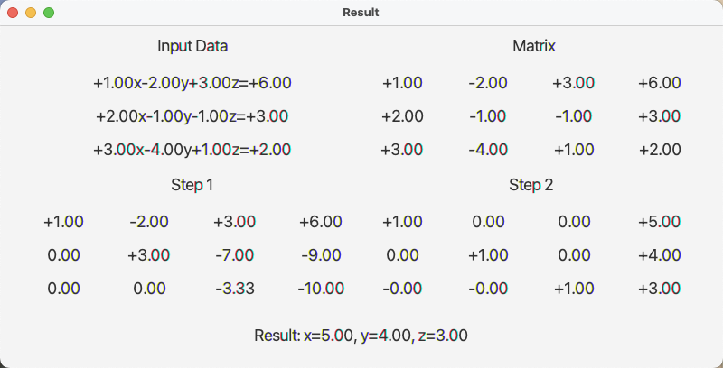

<head>
  <script src="https://cdn.mathjax.org/mathjax/latest/MathJax.js?config=TeX-AMS-MML_HTMLorMML" type="text/javascript"></script>
  <script type="text/x-mathjax-config">
    MathJax.Hub.Config({
      tex2jax: {
      skipTags: ['script', 'noscript', 'style', 'textarea', 'pre'],
      inlineMath: [['']]
      }
    });
  </script>
</head>
  
##  [MainPage](../index.md )/[Mathematics](README.md )/Graphic Work
  
  
##  Задание 1
  
  
Решить СЛАУ методом Гаусса (аналитически) и модифицированным методом Гаусса (ММГ)(посмотрите файл “численные методы”). Реализовать код для алгоритма ММГ и сравнить результаты численного и аналитического подхода.  
通过高斯方法（解析）和修正高斯方法 (ММГ) 求解线性代数方程组（SLAE）参见文件“数值方法”。 实现 ММГ 算法的代码并比较数值和解析方法的结果。
  
###  1.1
  
  
<p align="center"></p>  
  
  

  
###  1.2
  
  
<p align="center"></p>  
  
  

  
###  1.3
  
  
<p align="center"></p>  
  
  

  
###  1.4
  
  
<p align="center"></p>  
  
  

  
###  1.5
  
  
<p align="center"></p>  
  
  

  
main Algorithm:
  
```Java
double[][] matrixTable = new double[3][4];
double resultX;
double resultY;
double resultZ;
  
for (int i = 0; i < n - 1; i++) {
    for (int j = i + 1; j < n; j++) {
        double div = matrixTable[j][i]/matrixTable[i][i];
        for (int k = 0; k < n + 1; k++) {
            matrixTable[j][k] = matrixTable[j][k] - div * matrixTable[i][k];
            //matrixTable[j][k] *= matrixTable[i][i];
        }
    }
}
  
for (int i = n-1; i > 0; i--) {
    for (int j = i-1; j >= 0 ; j--) {
        double div = matrixTable[j][i]/matrixTable[i][i];
        for (int k = 0; k < n + 1; k++) {
            matrixTable[j][k] = matrixTable[j][k] - div * matrixTable[i][k];
            //matrixTable[j][k] *= matrixTable[i][i];
        }
    }
}
  
for (int i = 0; i < n; i++) {
    double div = matrixTable[i][i];
    for (int j = 0; j < n + 1; j++) {
        matrixTable[i][j] = matrixTable[i][j]/div;
    }
}
  
resultX = matrixTable[0][3];
resultY = matrixTable[1][3];
resultZ = matrixTable[2][3];
```
  
View More in [GitHub](https://github.com/Tolia-GH/Semester-2/tree/main/Mathematic/GraphicWork )
  
Download [Application](https://github.com/Tolia-GH/Semester-2/releases/download/Mathematic/GraphicWork.jar )
  
##  Задание 2
  
  
##  Задание 3
  
  
Разобраться с материалом (пункт 5) и аналогично с приведенными примерами аналитически и численно найти минимумы функции.Сделать график и указать найденную точку.  
处理材料（第 5 点）并类似地处理给出的示例，分析和数值地找到函数的最小值。绘制图表并指出找到的点。
  
###  3.1
  
  
<p align="center"></p>  
  
  
**Аналитическим:**
  
Для начала найдём частные производные первого порядка:
  
<p align="center"></p>  
  
  
Составим систему уравнений
  
<p align="center"></p>  
  
  
Получим, что:
  
<p align="center"></p>  
  
  
Теперь найдём частные производные второго порядка:
  
  
  
  
###  3.2
  
  
<p align="center"></p>  
  
  
###  3.3
  
  
<p align="center"></p>  
  
  
###  3.4
  
  
<p align="center"></p>  
  
  
###  3.5
  
  
<p align="center"></p>  
  
  
main Algorithm:
  
```python
import numpy as np
  
  
def f(x):  # Define the objective function
    return x[0]**2/2 + x[0]*x[1] + x[1]**2 - 2*x[1]
  
  
A = np.array(([1/2, 1/2], [1/2, 1]), dtype=float)
b = np.array([0., 2.])
  
  
eigs = np.linalg.eigvals(A)
print("The eigenvalues of A:", eigs)
  
if (np.all(eigs>0)):
    print("A is positive definite")
elif (np.all(eigs>=0)):
    print("A is positive semi-definite")
else:
    print("A is negative definite")
  
  
if (A.T==A).all()==True: print("A is symmetric")
  
  
def linear_CG(x, A, b, epsilon):
    res = A.dot(x) - b  # Initialize the residual
    delta = -res  # Initialize the descent direction
  
    while True:
  
        if np.linalg.norm(res) <= epsilon:
            return x, f(x)  # Return the minimizer x* and the function value f(x*)
  
        D = A.dot(delta)
        beta = -(res.dot(delta)) / (delta.dot(D))  # Line (11) in the algorithm
        x = x + beta * delta  # Generate the new iterate
  
        res = A.dot(x) - b  # generate the new residual
        chi = res.dot(D) / (delta.dot(D))  # Line (14) in the algorithm
        delta = chi * delta - res  # Generate the new descent direction
  
  
linear_CG(np.array([2.3, -2.2]), A, b, 10**-5)
```
  
##  Задание 4
  
  