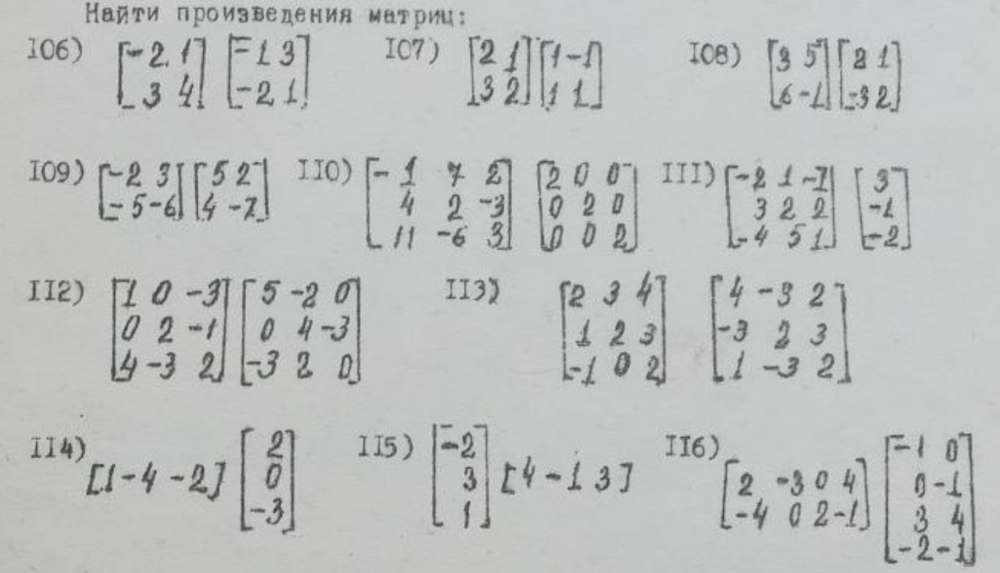

# Задания

## Задание 1

Необходимо вычислить произведения матриц с помощью кода, которого вы напишите. Более того , попробуйте написать код для вычисления определителя с использованием одного из способов, которых мы рассмотрели ( будем рассматривать) на занятии.

<div align=center></div>

- Matrix Multiply
```c++
#include <iostream>

using namespace std;

class Matrix {
public:
    int c, r;
    double matrix [100][100];
    
    void inputSize() {
    	printf("Program: Please input the size of matrix:(in form\"r c\")\n");
    	scanf("%d %d",&r,&c);
	}
    void inputMatrix() {
    	inputSize();
	    printf("Program: You input r=%d, c=%d, now input the matrix:\n",r,c);
	
	    for (int i = 0; i < r; i++) {
	        for (int j = 0; j < c; j++) {
	            scanf("%lf", &matrix[i][j]);
	        }
	    }
	}
    void printMatrix() {
    	
		for (int i = 0; i < r; ++i) {
			for (int j = 0; j < c; ++j) {
				printf("%8.2lf ", matrix[i][j]);
			}
			printf("\n");
		}
	}
    Matrix multiply(Matrix matrix) {
    	Matrix result;
		result.r = this->r;
		result.c = matrix.c;
		if (this->c == matrix.r) {
			for (int i = 0; i < result.r; i++) {
				for (int j = 0; j < result.c; j++) {
					result.matrix[i][j] = 0;
					for (int k = 0; k < matrix.r; k++) {
						result.matrix[i][j] += this->matrix[i][k] * matrix.matrix[k][j];
					}
				}
			}
		} else {
			printf("Error\n");
		}
		return result;
	}
	
};

void run() {
	Matrix matrix1;
    Matrix matrix2;

    matrix1.inputMatrix();
    matrix2.inputMatrix();
    
    Matrix matrix3;
	matrix3 = matrix1.multiply(matrix2);
	
    printf("Program: The product of matrix1 and matrix2 is:\n");
    matrix3.printMatrix();
    
    printf("\n");
    system("pause");
}

int main() {

    printf("Matrix Multiply version 1.0\n");
    printf("By: Zhou HongXiang P32131\n\n");
    
    while (true) {
    	run();
	}

    return 0;
}
```

- Determinant Calculate
```c++
#include <iostream>

using namespace std;

class Determinant {
public:
	int n;
	double det[100][100];
	double value;
	int sign = 1;
	
	void inputSize() {
    	printf("Program: Please input the size of determinant:\n");
    	scanf("%d",&n);
	}
    void inputDet() {
    	inputSize();
	    printf("Program: You input n=%d, now input the determinant:\n",n);
	
	    for (int i = 0; i < n; i++) {
	        for (int j = 0; j < n; j++) {
	            scanf("%lf", &det[i][j]);
	        }
	    }
	}
    void printDet() {
		for (int i = 0; i < n; i++) {
			for (int j = 0; j < n; j++) {
				printf("%6.2lf ", det[i][j]);
			}
			printf("\n");
		}
	}
	void swabCol(int r, int c) {
		for (int i = 0; i < n; i++)	{
			det[i][r] += det[i][c];
			det[i][c] = det[i][r] - det[i][c];
			det[i][r] -= det[i][c];
		}
		sign = -sign;
	}
	void calValue() {
		for (int i = 0; i < n-1; i++) {
			for (int j = i + 1; j < n; j++) {
				if (det[i][j] != 0) {
					if (det[i][i] == 0) {
						swabCol(i,j);
					}
					double div = det[i][j]/det[i][i];
					for (int k = i; k < n; k++) {
						det[k][j] = det[k][j] - div * det[k][i];
					}
				}
			}
		}
		
		value = sign * det[0][0];
		for (int i = 1; i < n; i++) {
			value *= det[i][i];
		}
	}
};

void run() {
	Determinant det;

    det.inputDet();
    printf("Program: The original determinant:\n");
    det.printDet();
    det.calValue();
    printf("Program: The triangle determinant:\n");
    det.printDet();
	
    printf("Program: The value of determinant is: %.2lf\n", det.value);
    
    printf("\n");
    system("pause");
}

int main() {
	printf("Determinant Calculator version 1.0\n");
    printf("By: Zhou HongXiang P32131\n\n");
	
	while (true) {
		run();
	}
	return 0;
}
```

## Задание 2

### 3.91

Найти значеник многочлена $f(A)$ от матртиц $A$:

$$f(x)=x^2-3x+1, A=
\begin{pmatrix}
    2 & 1\\
    0 & 3\\
\end{pmatrix}$$

**Решение**

$$x^2=\begin{pmatrix}
    2 & 1\\
    0 & 3\\
\end{pmatrix}\cdot
\begin{pmatrix}
    2 & 1\\
    0 & 3\\
\end{pmatrix}=
\begin{pmatrix}
    4 & 5\\
    0 & 9\\
\end{pmatrix}$$

$$-3x=\begin{pmatrix}
    -6 & -3\\
    0 & -9\\
\end{pmatrix}$$

$$1=E=\begin{pmatrix}
    1 & 0\\
    0 & 1\\
\end{pmatrix}$$

$$f(A)=x^2-3x+1=
\begin{pmatrix}
    -1 & 2\\
    0 & 1\\
\end{pmatrix}$$

### 3.14

Вычислить определители 3-го порядка:

$$\begin{vmatrix}
    a+x & x & x\\
    x & b+x & x\\
    x & x & c+x\\
\end{vmatrix}$$

**Решение**

$$\det =（a+x)(b+x)(c+x)+x^3+x^3-(b+x)x^2-(a+x)x^2-(c+x)x^2$$

### 3.109

Методом присоединенной матрицы найти абратные для следующих матриц:

$$A=\begin{pmatrix}
    2 & 5 & 7\\
    6 & 3 & 4\\
    5 & -2 & -3\\
\end{pmatrix}$$

**Решение**

$$\begin{vmatrix}
    A
\end{vmatrix}=-1$$

$$A_{11}=\begin{pmatrix}
    3 & 4\\
    -2 & -3\\
\end{pmatrix}=-1\quad
A_{12}\begin{pmatrix}
    6 & 4\\
    5 & -3\\
\end{pmatrix}=-38\quad
A_{13}=\begin{pmatrix}
    6 & 3\\
    5 & -2\\
\end{pmatrix}=-27$$

$$A_{21}=\begin{pmatrix}
    5 & 7\\
    -2 & -3\\
\end{pmatrix}=-1\quad
A_{22}\begin{pmatrix}
    2 & 7\\
    5 & -3\\
\end{pmatrix}=-41\quad
A_{23}=\begin{pmatrix}
    2 & 5\\
    5 & -2
\end{pmatrix}=-29$$

$$A_{31}=\begin{pmatrix}
    5 & 7\\
    3 & 4\\
\end{pmatrix}=-1\quad
A_{32}\begin{pmatrix}
    2 & 7\\
    6 & 4\\
\end{pmatrix}=-34\quad
A_{33}=\begin{pmatrix}
    2 & 5\\
    6 & 3\\
\end{pmatrix}=-24$$

$$A^*=\begin{pmatrix}
    A_{11} & A_{12} & A_{13}\\
    A_{21} & A_{22} & A_{23}\\
    A_{31} & A_{32} & A_{33}\\
\end{pmatrix}\\
=\begin{pmatrix}
    -1 & -1 & -1\\
    -38 & -41 & -34\\
    -27 & -29 & -24\\
\end{pmatrix}$$

$$A^{-1}=\frac{1}{\lvert A\rvert}A^*=
\begin{pmatrix}
    1 & 1 & 1\\
    38 & 41 & 34\\
    27 & 29 & 24\\
\end{pmatrix}$$

### 3.116

Методом элементных преобразований найти абратные для следующих матриц:

$$A=\begin{pmatrix}
    1 & 1 & 1 & 1\\
    1 & 1 & -1 & -1\\
    1 & -1 & 1 & -1\\
    1 & -1 & -1 & 1\\
\end{pmatrix}$$

**Решение**

$$\begin{pmatrix}
    1 & 1 & 1 & 1 & \vert & 1 & 0 & 0 & 0\\
    1 & 1 & -1 & -1 & \vert & 0 & 1 & 0 & 0\\
    1 & -1 & 1 & -1 & \vert & 0 & 0 & 1 & 0\\
    1 & -1 & -1 & 1 & \vert & 0 & 0 & 0 & 1\\
\end{pmatrix}=\\
\begin{pmatrix}
    1 & 0 & 0 & 0 & \vert & \frac{1}{4} & \frac{1}{4} & \frac{1}{4} & \frac{1}{4}\\
    0 & 1 & 0 & 0 & \vert & \frac{1}{4} & \frac{1}{4} & -\frac{1}{4} & -\frac{1}{4}\\
    0 & 0 & 1 & 0 & \vert & \frac{1}{4} & -\frac{1}{4} & \frac{1}{4} & -\frac{1}{4}\\
    0 & 0 & 0 & 1 & \vert & \frac{1}{4} & -\frac{1}{4} & -\frac{1}{4} & \frac{1}{4}\\
\end{pmatrix}$$

$$A^T=\begin{pmatrix}
    \frac{1}{4} & \frac{1}{4} & \frac{1}{4} & \frac{1}{4}\\
    \frac{1}{4} & \frac{1}{4} & -\frac{1}{4} & -\frac{1}{4}\\
    \frac{1}{4} & -\frac{1}{4} & \frac{1}{4} & -\frac{1}{4}\\
    \frac{1}{4} & -\frac{1}{4} & -\frac{1}{4} & \frac{1}{4}\\
\end{pmatrix}$$

### 3.123

Решить матричные уравнения:

$$\begin{pmatrix}
    3 & -1\\
    5 & -2\\
\end{pmatrix}\cdot X\cdot
\begin{pmatrix}
    5 & 6\\
    7 & 8\\
\end{pmatrix}=
\begin{pmatrix}
    14 & 16\\
    9 & 10\\
\end{pmatrix}$$

**Решение**

$$X=\begin{pmatrix}
    14 & 16\\
    9 & 10\\
\end{pmatrix}\cdot
\begin{pmatrix}
    3 & -1\\
    5 & -2\\
\end{pmatrix}^{-1}\cdot
\begin{pmatrix}
    5 & 6\\
    7 & 8\\
\end{pmatrix}^{-1}\\
=\begin{pmatrix}
    14 & 16\\
    9 & 10\\
\end{pmatrix}\cdot
\begin{pmatrix}
    2 & -1\\
    5 & -3\\
\end{pmatrix}\cdot
\begin{pmatrix}
    -4 & 3\\
    \frac{7}{2} & -\frac{5}{2}\\
\end{pmatrix}\\
=\begin{pmatrix}
    -649 & 479\\
    -\frac{817}{2} & \frac{603}{2}
\end{pmatrix}$$