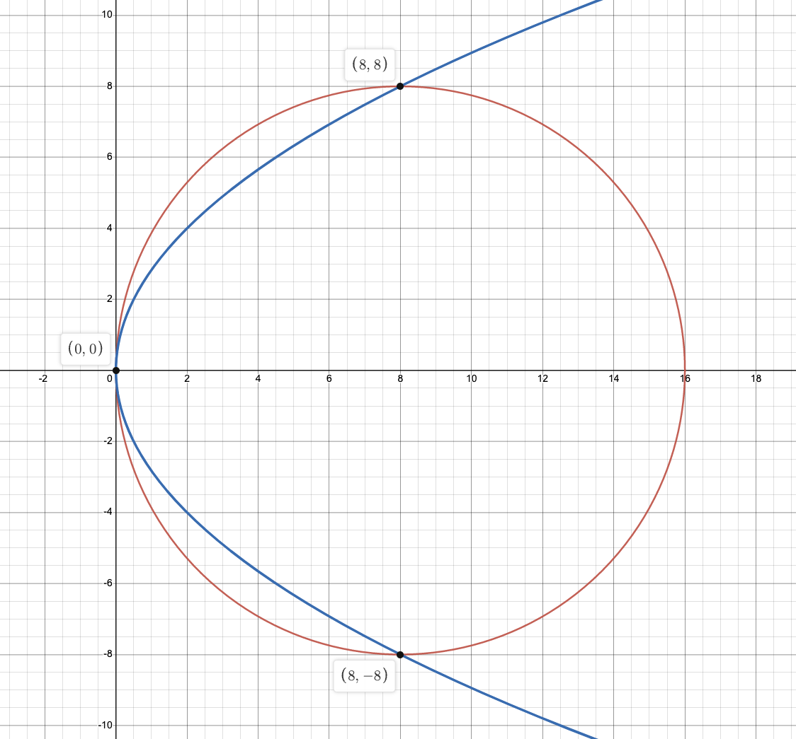
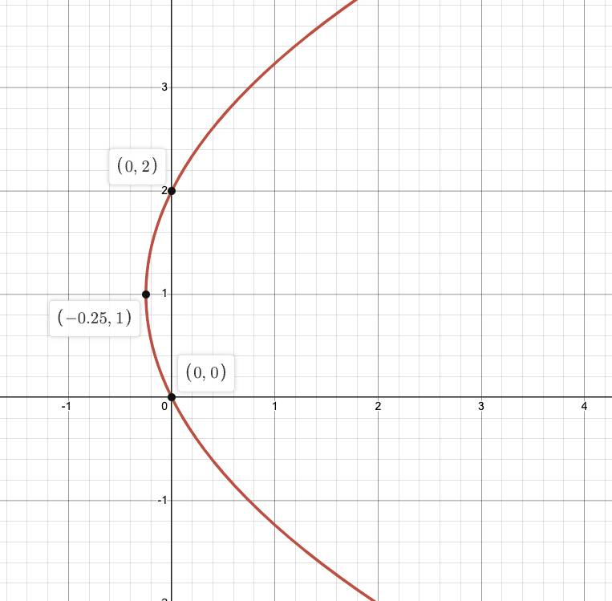
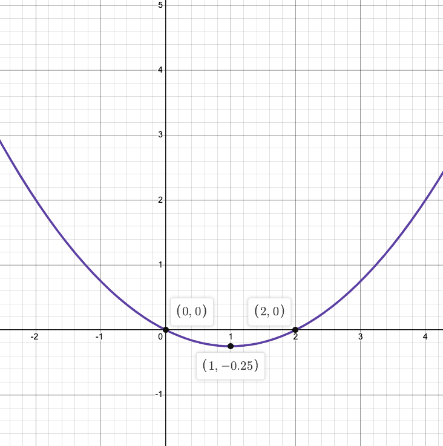
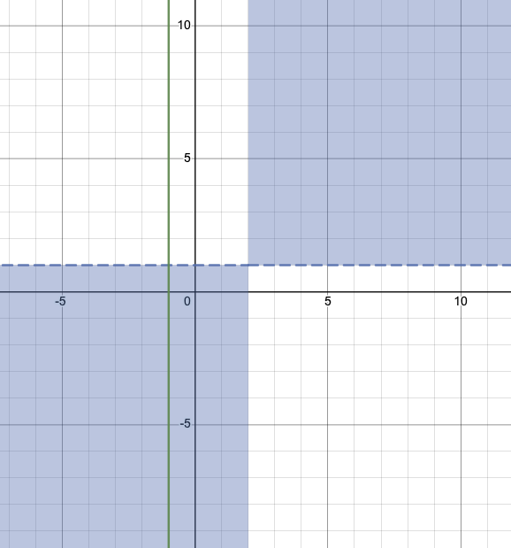
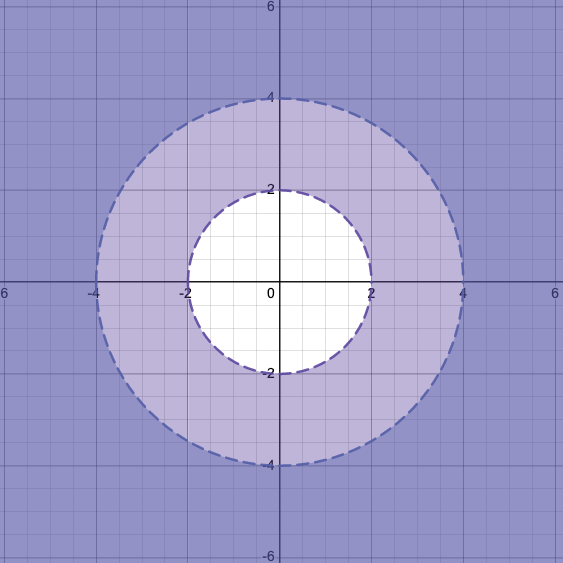
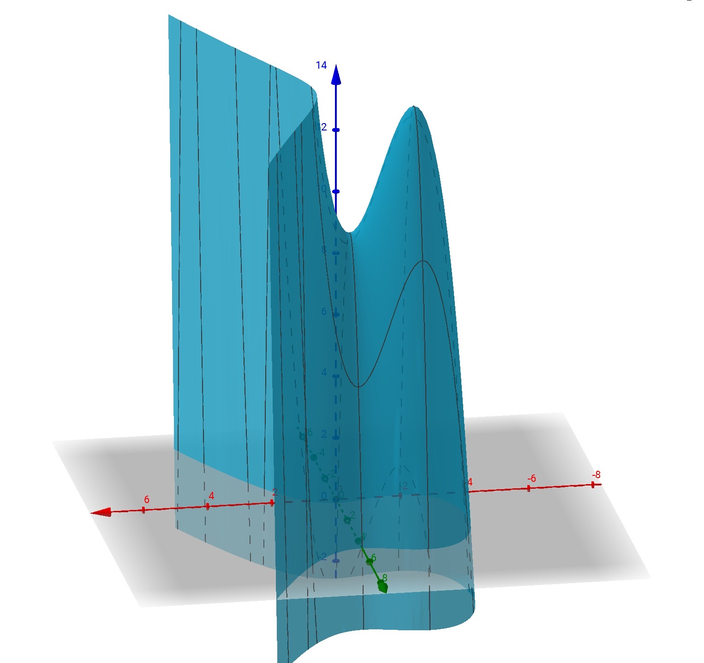
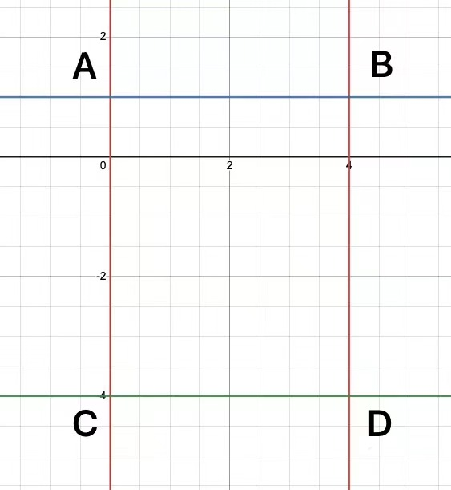
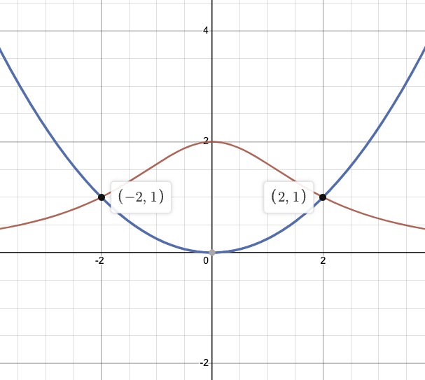
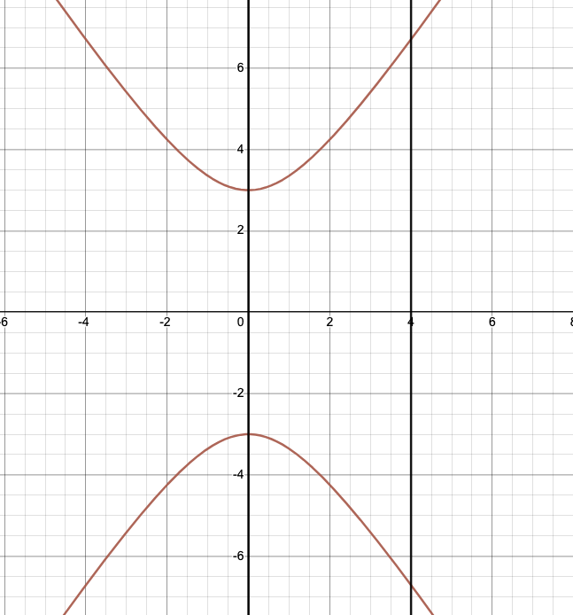

<head>
    
    
</head>

## [MainPage](../index.md)/[Mathematics](README.md)/Типовой Расчёт

# Типовой Расчёт 1

## Задание №1

$$\begin{split}
    &\int\frac{e^{\tan{x}}+2}{\cos^2{x}}{\rm d}x\\
    =&\int(e^{\tan{x}}+2)\sec^2{x}{\rm d}x\\
    =&\int(2\sec^2(x)+e^{\tan{x}}\sec^2{x}){\rm d}x\\
    =&\int e^{\tan{x}}\sec^2{x}{\rm d}x+2\int\sec^2(x){\rm d}x\\
    &Пуcть\ u=\tan{x}\ и\ {\rm d}u=\sec^2{x}\\
    =&\int e^u{\rm d}u+2\int\sec^2(x){\rm d}x\\
    =&e^u+2\int\sec^2(x){\rm d}x+C\\
    =&e^{\tan{x}}+2\tan(x)+C
\end{split}$$

## Задание №2

$$\begin{split}
    &\int\sin^2{(2x+1)}\cdot \cos^2{(2x+1)}{\rm d}x\\
    &Пуcть\ u=2x+1\ и\ {\rm d}u=2{\rm d}x\\
    =&\frac{1}{2}\int\sin^2(u)\cos^2(u){\rm du}\\
    =&\frac{1}{2}\int\sin^2(u)(1-\sin^2(u)){\rm d}u\\
    =&\frac{1}{2}\int(\sin^2(u)-\sin^4(u)){\rm d}u\\
    =&\frac{1}{2}\int\sin^2(u){\rm d}u-\frac{1}{2}\int\sin^4(u){\rm}u\\
    =&\frac{1}{8}\sin^3(u)\cos(u)+\frac{1}{8}\int\sin^2(u){\rm d}u\\
    =&\frac{1}{8}\sin^3(u)\cos(u)+\frac{1}{8}\int\frac{1-\cos(2u)}{2}{\rm d}u\\
    =&\frac{1}{8}\sin^3(u)\cos(u)-\frac{1}{16}\int\cos(2u){\rm d}u+\frac{1}{16}\int 1{\rm d}u\\
    =&\frac{1}{8}\sin^3(u)\cos(u)-\frac{1}{32}\int\cos(2u){\rm d}(2u)+\frac{1}{16}\int 1{\rm d}u\\
    =&-\frac{\sin(2u)}{32}+\frac{1}{8}\sin^3(u)\cos(u)+\frac{1}{16}\int 1{\rm d}u\\
    =&-\frac{\sin(2u)}{32}+\frac{u}{16}+\frac{1}{8}\sin^3(u)\cos(u)+C\\
    =&-\frac{\sin(4x+2)}{32}+\frac{2x+1}{16}+\frac{1}{8}\sin^3(2x+1)\cos^3(2x+1)+C
\end{split}
$$

## Задание №3

$$\begin{split}
    &\int\frac{(2-x){\rm d}x}{\sqrt{3x^2+2x-5}}\\
    &{\rm d}(3x^2+2x-5)=(6x+2){\rm d}x\\
    =&-\frac{1}{6}\int\frac{6x+2}{\sqrt{3x^2+2x-5}}{\rm d}x+\frac{7}{3}\int\frac{ {\rm d}x}{\sqrt{3x^2+2x-5}}\\
    &Пусть\ u=3x^2+2x-5, {\rm d}u=(6x+2){\rm d}x\\
    =&-\frac{1}{6}\int\frac{ {\rm d}u}{\sqrt{u}}+\frac{3}{7}\int\frac{ {\rm d}x}{\sqrt{3x^2+2x-5}}\\
    =&-\frac{1}{3}\sqrt{u}+\frac{3}{7}\int\frac{ {\rm d}x}{\sqrt{3x^2+2x-5}}+C\\
    =&-\frac{1}{3}\sqrt{u}+\frac{3}{7}\int\frac{ {\rm d}x}{\sqrt{(\sqrt{3}x+\frac{1}{\sqrt{3}})^2-\frac{16}{3}}}+C\\
    &Заменим\ впоследнем\ интеграле\ t=\sqrt{3}x+\frac{1}{\sqrt{3}}, k^2=\frac{16}{3}, {\rm d}x=\frac{1}{\sqrt{3}} {\rm d}t\\
    =&-\frac{1}{3}\sqrt{u}+\frac{3}{7\sqrt{3}}\int\frac{ {\rm d}x}{\sqrt{t^2-k^2}}+C\\
    =&-\frac{1}{3}\sqrt{u}+\frac{3}{7\sqrt{3}}\arcsin(\frac{k}{t})+C\\
    =&-\frac{1}{3}\sqrt{u}+\frac{3}{7\sqrt{3}}\arcsin(\frac{k}{t})+C\\
    =&-\frac{1}{3}\sqrt{3x^2+2x-5}+\frac{3}{7\sqrt{3}}\arcsin(\frac{\sqrt{\frac{16}{3}}}{\sqrt{3}x+\frac{1}{\sqrt{3}}})+C\\
    =&-\frac{1}{3}\sqrt{3x^2+2x-5}+\frac{3\sqrt{3}}{21}\arcsin(\frac{\sqrt{16}}{3x+1})+C
\end{split}
$$

## Задание №4

$$\begin{split}
    &\int\frac{x(x+4){\rm d}x}{(x+2)^2(x^2-3x+8)}\\
    &Пусть \frac{x(x+4){\rm d}x}{(x+2)^2(x^2-3x+8)}=\frac{A}{x+2}+\frac{B}{(x+2)^2}+\frac{Cx+D}{x^2-3x+8}\\
    &\begin{cases}
        0=16A+8B+4D\\
        4=2A-3B+4C+4D\\
        1=-A+B+4C+D\\
        0=A+C
    \end{cases}\Rightarrow
    \begin{cases}
        A=-\frac{7}{81}\\
        B=-\frac{2}{9}\\
        C=\frac{7}{81}\\
        D=\frac{64}{81}
    \end{cases}\\
    =&\int\frac{7x+64}{81(x^2-3x+8)}-\frac{7}{81(x+2)}-\frac{2}{9(x+2)^2} {\rm d}x\\
    =&\frac{1}{81}\int\frac{7x+64}{x^2-3x+8} {\rm d}x-\frac{7}{81}\int\frac{1}{x+2} {\rm d}x-\frac{2}{9}\int\frac{1}{(x+2)^2}{\rm d}x\\
    =&\frac{1}{81}\int\frac{7x+64}{x^2-3x+8} {\rm d}x-\frac{7}{81}\ln(x+2)+\frac{2}{9(x+2)}+C\\
    =&\frac{7}{162}\int\frac{2x-3}{x^2-3x+8}{\rm d}x+\frac{149}{162}\int\frac{ {\rm d}x}{x^2-3x+8}-\frac{7}{81}\ln(x+2)+\frac{2}{9(x+2)}+C\\
    &Пусть\ u=x^2-3x+8,{\rm d}u=2x-3{\rm d}x\\
    =&\frac{7}{162}\int\frac{ {\rm d}u}{u}+\frac{149}{162}\int\frac{ {\rm d}x}{x^2-3x+8}-\frac{7}{81}\ln(x+2)+\frac{2}{9(x+2)}+C\\
    =&\frac{149}{162}\int\frac{ {\rm d}x}{x^2-3x+8}+\frac{7}{162}\ln(u)-\frac{7}{81}\ln(x+2)+\frac{2}{9(x+2)}+C\\
    =&\frac{149}{162}\int\frac{ {\rm d}x}{x^2-3x+8}+\frac{7}{162}\ln(x^2-3x+8)-\frac{7}{81}\ln(x+2)+\frac{2}{9(x+2)}+C\\
    =&\frac{149}{162}\int\frac{ {\rm d}x}{(x-\frac{3}{2})^2+\frac{23}{4}}+\frac{7}{162}\ln(x^2-3x+8)-\frac{7}{81}\ln(x+2)+\frac{2}{9(x+2)}+C\\
    &Пусть\ s=x-\frac{3}{2},{\rm d}s={\rm d}x\\
    =&\frac{149}{162}\int\frac{ {\rm d}s}{(s)^2+\frac{23}{4}}+\frac{7}{162}\ln(x^2-3x+8)-\frac{7}{81}\ln(x+2)+\frac{2}{9(x+2)}+C\\
    =&\frac{298}{1863}\int\frac{ {\rm d}s}{\frac{4s^2}{23}+1}+\frac{7}{162}\ln(x^2-3x+8)-\frac{7}{81}\ln(x+2)+\frac{2}{9(x+2)}+C\\
    &Пусть\ v=\frac{2u}{\sqrt{23}},{\rm d}v=\frac{2}{\sqrt{23}}{\rm d}u\\
    =&\frac{298}{1863}\frac{2}{\sqrt{23}}\int\frac{ {\rm d}v}{v^2+1}+\frac{7}{162}\ln(x^2-3x+8)-\frac{7}{81}\ln(x+2)+\frac{2}{9(x+2)}+C\\
    =&\frac{298}{1863}\frac{2\sqrt{23}}{23}\arctan(s)+\frac{7}{162}\ln(x^2-3x+8)-\frac{7}{81}\ln(x+2)+\frac{2}{9(x+2)}+C\\
\end{split}
$$

## Задание №5

$$\begin{split}
    &\int\frac{ {\rm d}x}{2\sqrt{x+5}-\sqrt[3]{x+5}-\sqrt[4]{x+5}}\\
    &Здесь\ k_1=3,k_2=2,поэтому\ p=12.\\
    &Пусть\ x+5=t^{12}\ Тогда\ x=t^{12}-5,{\rm d}x=12t^{11}{\rm d}t\\
    =&\int\frac{12t^{11} {\rm d}t}{2t^6-t^4-t^3}\\
    =&12\int\frac{t^{11}{\rm d}t}{2t^6-t^4-t^3}\\
    =&12\int\frac{t^8{\rm d}t}{2t^3-t-1}\\
    &разделить\ \frac{t^8{\rm d}t}{2t^3-t-1}, получим:\\
    &\frac{t^8{\rm d}t}{2t^3-t-1}=\frac{t^5}{2}+\frac{t^4}{4}+\frac{t^2}{4}+\frac{t}{8}+\frac{1}{5(t-1)}+\frac{-t-2}{40(2t^2+2t+1)}+\frac{1}{4}\\
    =&12\int\frac{t^5}{2}+\frac{t^4}{4}+\frac{t^2}{4}+\frac{t}{8}+\frac{1}{5(t-1)}+\frac{-t-2}{40(2t^2+2t+1)}+\frac{1}{4}{\rm d}t\\
    =&\frac{3}{10}\int\frac{-t-2}{2t^2+t+1}{\rm d}t+6\int t^5{\rm d}t+3\int t^3{\rm d}t+3\int t^2{\rm d}t+\frac{3}{2}\int t{\rm d}t+\frac{12}{5}\int\frac{ {\rm d}t}{t-1}+3\int {\rm d}t\\
    =&\frac{3}{10}\int\left(-\frac{4t+2}{4(2t^2+2t+1)}-\frac{3}{2(2t^2+2t+1)}\right){\rm d}t+6\int t^5{\rm d}t+3\int t^3{\rm d}t+3\int t^2{\rm d}t+\frac{3}{2}\int t{\rm d}t+\frac{12}{5}\int\frac{ {\rm d}t}{t-1}+3\int {\rm d}t\\
    =&-\frac{3}{40}\int\frac{4t+2}{2t^2+2t+1}{\rm d}t-\frac{9}{20}\int\frac{ {\rm d}t}{2t^2+2t+1}+6\int t^5{\rm d}t+3\int t^3{\rm d}t+3\int t^2{\rm d}t+\frac{3}{2}\int t{\rm d}t+\frac{12}{5}\int\frac{ {\rm d}t}{t-1}+3\int {\rm d}t\\
    =&-\frac{3}{40}\int\frac{ {\rm d}(2t^2+2t+1)}{2t^2+2t+1}-\frac{9}{20}\int\frac{ {\rm d}t}{(\sqrt{2}t+\frac{1}{\sqrt{2}})^2+\frac{1}{2}}+6\int t^5{\rm d}t+3\int t^3{\rm d}t+3\int t^2{\rm d}t+\frac{3}{2}\int t{\rm d}t+\frac{12}{5}\int\frac{ {\rm d}t}{t-1}+3\int {\rm d}t\\
    =&-\frac{3}{40}\int\frac{ {\rm d}(2t^2+2t+1)}{2t^2+2t+1}-\frac{9}{10\sqrt{2}}\int\frac{ {\rm d}(\sqrt{2t}+\frac{1}{\sqrt{2}})}{2(\sqrt{2}t+\frac{1}{\sqrt{2}})^2+1}+6\int t^5{\rm d}t+3\int t^3{\rm d}t+3\int t^2{\rm d}t+\frac{3}{2}\int t{\rm d}t+\frac{12}{5}\int\frac{ {\rm d}t}{t-1}+3\int {\rm d}t\\
    =&-\frac{3}{40}\ln(2t^2+2t+1)-\frac{9}{20}\arctan(2t+1)+t^6+\frac{3}{4}t^4+t^3+\frac{3}{4}t^2+\frac{12}{5}\ln(t-1)+3t+C\\
    &(t=\sqrt[12]{x+5})
\end{split}
$$

## Задание №6

$$\begin{split}
    &\int\frac{\sqrt{(1-x^2)^3}}{x^2}{\rm d}x\\
    =&\int\frac{(1-x^2)\sqrt{1-x^2}}{x^2}{\rm d}x\\
    =&\int\frac{\sqrt{1-x^2}}{x^2}{\rm d}x-\int\sqrt{1-x^2}{\rm d}x\\
    &a=1,x=a\sin t=\sin t,{\rm d}x=\cos t{\rm d}t\\
    =&\int\frac{\sqrt{1-\cos^2t}}{\sin^2t}\cos t{\rm d}t-\int\sqrt{1-\sin^2t}\cos t{\rm d}t\\
    =&\int\frac{\cos t}{\sin t}{\rm d}t-\int\cos^2t{\rm d}t\\
    =&\int\frac{ {\rm d}(\sin t)}{\sin t}-\frac{1}{2}\int(\cos(2t)+1){\rm d}t\\
    =&\ln(\sin t)-\frac{1}{4}\int\cos(2t){\rm d}(2t)-\frac{1}{2}\int{\rm d}t+C\\
    =&\ln(\sin t)-\frac{1}{4}\sin(2t)-\frac{t}{2}+C\\
    &t=\arcsin x\\
    =&\ln x-\frac{1}{2}(x\sqrt{1-x^2})-\frac{1}{2}\arcsin x+C
\end{split}
$$

## Задание №7

$$\begin{split}
    &\int\frac{\cos{x}{\rm d}x}{(1-\cos{x})^3}\\
    &Пусть\ t=\tan\frac{x}{2},то\ x=2\arctan t,{\rm d}x=\frac{2{\rm d}t}{1+t^2}\\
    &\sin x=2\frac{\tan\frac{x}{2}}{1+\tan^2\frac{x}{2}}=\frac{2t}{1+t^2};\cos x=\frac{1-\tan^2\frac{x}{2}}{1+\tan^2\frac{x}{2}}=\frac{1-t^2}{1+t^2}\\
    =&\int\frac{2(1-t^2)}{(1+t^2)^2(1-\frac{1-t^2}{1+t^2})^3}{\rm d}t\\
    =&\int\frac{1-t^4}{4t^6}{\rm d}t\\
    =&\frac{1}{4}\int\frac{1-t^4}{t^6}{\rm d}t\\
    =&\frac{1}{4}\int\frac{1}{t^6}{\rm d}t-\frac{1}{4}\int\frac{1}{t^2}{\rm d}t\\
    =&\frac{1}{4t}-\frac{1}{20t^5}+C\\
    &t=\tan\frac{x}{2}\\
    =&\frac{1}{4}\cot\frac{x}{2}-\frac{1}{20}\cot^5\frac{x}{2}+C
\end{split}
$$

## Задание №8

$$\begin{split}
    &\int^\frac{2}{3}_\frac{1}{3}(x^2-x+1)e^{3x}{\rm d}x\\
    =&\int^\frac{2}{3}_\frac{1}{3}(e^{3x}x^2-e^{3x}x+e^{3x}){\rm d}x\\
    =&\int^\frac{2}{3}_\frac{1}{3}e^{3x}x^2{\rm d}x-\int^\frac{2}{3}_\frac{1}{3}e^{3x}e{\rm d}x+\int^\frac{2}{3}_\frac{1}{3}e^{3x}{\rm d}x\\
    &u=x^2,{\rm d}u=2x{\rm d}x\\
    &{\rm d}v=e^{3x},v=\frac{e^{3x}}{3}\\
    =&\left.\frac{1}{3}e^{3x}x^2\right|^\frac{2}{3}_\frac{1}{3}-\frac{5}{3}\int^\frac{2}{3}_\frac{1}{3}e^{3x}x{\rm d}x+\int^\frac{2}{3}_\frac{1}{3}e^{3x}{\rm d}x\\
    =&\frac{1}{27}e(4e-1)-\frac{5}{3}\int^\frac{2}{3}_\frac{1}{3}e^{3x}x{\rm d}x+\int^\frac{2}{3}_\frac{1}{3}e^{3x}{\rm d}x\\
    &u'=x,{\rm d}u'={|rm d}x\\
    &{\rm d}v'=e^{3x},v'=\frac{e^{3x}}{3}\\
    =&\frac{1}{27}e(4e-1)+\left.(-\frac{5}{9}e^{3x})\right|^\frac{2}{3}_\frac{1}{3}+\frac{14}{9}\int^\frac{2}{3}_\frac{1}{3}e^{3x}{\rm d}x\\
    =&\frac{1}{27}e(4e-1)-\frac{5}{27}e(2e-1)+\frac{14}{9}e^{3x}{\rm d}x\\
    =&\frac{1}{27}e(4e-1)-\frac{5}{27}e(2e-1)+\left.\frac{14}{27}e^{3x}\right|^\frac{2}{3}_\frac{1}{3}\\
    =&\frac{1}{27}e(4e-1)-\frac{5}{27}e(2e-1)+\frac{14}{27}e(e-1)\\
    =&\frac{2}{27}e(4e-5)
\end{split}
$$

## Задание №9

$$\begin{split}
    &\int^\frac{\pi}{2}_0\sin{\varphi}\sqrt{\cos{\varphi}}{\rm d}\varphi\\
    &Пусть\ \phi=\cos\varphi,{\rm d}\phi={\rm d}\varphi\\
    =&-\int^0_1\sqrt{\phi}{\rm d}\phi\\
    =&\int^1_0\sqrt{\phi}{\rm d}\phi\\
    =&\left.\frac{2}{3}\phi^\frac{3}{2}\right|^1_0\\
    =&\frac{2}{3}
\end{split}
$$

## Задание №10

Найдите площадь области, ограниченной кривыми, заданными в декартовых координатах

График Функция

$$
\begin{cases}
    f_1:x^2+y^2=16x\\
    f_2:y^2=8x\\
\end{cases}\Rightarrow
\begin{cases}
    f_1:y=\sqrt{16x-x^2}\\
    f_2:y=2\sqrt{2x}
\end{cases}
$$

Очевидно, что $f_1$ - окружность,и Площать $S_1=64\pi$

$$\begin{split}
    &Пусть\ S_\Delta=\int^8_0(f_1-f_2){\rm d}x=\int^8_0(\sqrt{16x-x^2}-2\sqrt{2x}){\rm d}x\\
    &=16\pi-\int^8_02\sqrt{2x}{\rm d}x\\
    &=16\pi-2\sqrt{2}\int^8_0\sqrt{x}{\rm d}x\\
    &=16\pi-\left.\frac{4}{3}\sqrt{2}x^\frac{3}{2}\right|^8_0\\
    &=16\pi-\frac{128}{3}\\
    &
\end{split}
$$

Площадь области,ограниченной заданными кривыми $S$:

$$S=S_1-2S\Delta=64\pi-2(16\pi-\frac{128}{3})=32\pi+\frac{256}{3}$$

## Задание №11

Найдите длину кривой $L$, заданной в декартовых координатах

$$y^2-2y=4x\quad -1\le x\le 0$$

График Функция

Очевидно, что L равна его обратной фукцией в части $(-1\le y\le 0)$:

$$x^2-2x=4y\quad -1\le y\le 0$$

График Функция

$$\begin{split}
    x^2&-2x=4y\\
    \Rightarrow y&=\frac{x^2}{4}-\frac{x}{2}\\
    y'&=\frac{x}{2}-\frac{1}{2}\\
    L&=\int^0_{-1}\sqrt{1+y'^2}{\rm d}x\\
    &=\int^0_{-1}\sqrt{1+(\frac{x}{2}-\frac{1}{2})^2}{\rm d}x\\
    &=\frac{1}{2}\int^0_{-1}\sqrt{x^2-2x+5}{\rm d}x\\
    Пусть\ u&=x-1,{\rm d}u={\rm d}x\\
    L&=\frac{1}{2}\int^{-1}_{-2}\sqrt{u^2+4}{\rm d}u\\
    Пусть\ u&=2\tan(t),{\rm d}u=2\sec^2(t){\rm d}t\\
    L&=2\int^{-\arctan\frac{1}{2}}_{-\frac{\pi}{4}}\sec^3(t){\rm d}t\\
    &=\left.\tan(t)\sec(t)\right|^{-\arctan\frac{1}{2}}_{-\frac{\pi}{4}}+\int^{-\arctan\frac{1}{2}}_{-\frac{\pi}{4}}\sec(t){\rm d}t\\
    &=\sqrt{2}-\frac{\sqrt{5}}{4}+\int^{-\arctan\frac{1}{2}}_{-\frac{\pi}{4}}\sec(t){\rm d}t\\
    &=\sqrt{2}-\frac{\sqrt{5}}{4}+\left.\ln(\tan(t)+\sec(t))\right|^{-\arctan\frac{1}{2}}_{-\frac{\pi}{4}}\\
    &=\sqrt{2}-\frac{\sqrt{5}}{4}-\ln(\sqrt{2}-1)+\ln(\frac{1}{2}(\sqrt{5}-1))
\end{split}$$

## Задание №12

Вычислите
- а) Площадь, Органиченную осью абсцисс и верзиерой

$$\begin{cases}
    x=2t\\
    y=\frac{8}{1+t^2}
\end{cases}$$

Из формулы $x$ получим $t=\frac{x}{2}$, подставляем в $y$:

$$\begin{split}
    y&=\frac{8}{1+(\frac{x}{2})^2}=\frac{32}{x^2+4}\\
    S&=\int^{+\infty}_{-\infty}\frac{32}{x^2+4}{\rm d}x\\
    &=32\int^{+\infty}_{\infty}\frac{1}{x^2+4}{\rm d}x\\
    &=64\int^{\infty}_0\frac{1}{x^2+4}{\rm d}x\\
    &=32\int^{\infty}_0\frac{1}{\frac{x^2}{4}+1}{\rm d}(\frac{x}{2})\\
    &=\left.\lim_{a\rightarrow\infty}32\arctan(\frac{x}{2})\right|^a_0\\
    &=16\pi
\end{split}$$

- б) Длину дуги кривой

  $$r=6\sin^3{(\frac{\varphi}{3})}$$

  $$r'=6\sin^2(\frac{\varphi}{3})\cos(\frac{\varphi}{3})$$

  $$\begin{split}
    L&=\int^{\varphi_2}_{\varphi_1}\sqrt{r^2+r'^2}{\rm d}\varphi\\
    &=\int^{\varphi_2}_{\varphi_1}\sqrt{36\sin^6(\frac{\varphi}{3})+36\sin^4(\frac{\varphi}{3})\cos^2(\frac{\varphi}{3})}{\rm d}\varphi\\
    &=\int^{\varphi_2}_{\varphi_1}6\sin^2(\frac{\varphi}{3}){\rm d}\varphi
  \end{split}
  $$

  потому что $r\ge0$, мы получим $\sin^3(\frac{\varphi}{3})\ge0$, то $\varphi_1=0,\varphi_2=3\pi$, поэтому

  $$\begin{split}
    L&=\int^{3\pi}_{0}6\sin^2(\frac{\varphi}{3}){\rm d}\varphi\\
    &=6\int^{3\pi}_{0}\sin^2(\frac{\varphi}{3}){\rm d}\varphi\\
    &=18\int^{\pi}_{0}\sin^2(\frac{\varphi}{3}){\rm d}(\frac{\varphi}{3})\\
    &=18\int^{\pi}_{0}(\frac{1-\cos(\frac{2\varphi}{3})}{2}){\rm d}(\frac{\varphi}{3})\\
    &=9\int^{\pi}_0{\rm d}(\frac{\varphi}{3})-9\int^{\pi}_0\cos(\frac{2\varphi}{3}){\rm d}(\frac{\varphi}{3})\\
    &=9\int^{\pi}_0{\rm d}(\frac{\varphi}{3})\\
    &=9\pi
  \end{split}$$

## Задание №13

Найдите значение несобственного интеграла или установите его расходимость.
- а)
  
$$
\begin{split}
    &\int^{+\infty}_0(4-3x)e^{-3x}{\rm d}x\\
    =&4\int^{+\infty}_0e^{-3x}{\rm d}x-3\int^{+\infty}_0xe^{-3x}{\rm d}x\\
    =&4\lim_{b\rightarrow\infty}\int^{b}_0e^{-3x}{\rm d}x-3\lim_{b\rightarrow\infty}\int^{b}_0xe^{-3x}{\rm d}x\\
    =&3\lim_{b\rightarrow\infty}\int^b_0e^{-3x}{\rm d}x+\left.\lim_{b\rightarrow\infty}xe^{-3x}\right|^b_0\\
    =&3\lim_{b\rightarrow\infty}\int^b_0e^{-3x}{\rm d}x+\lim_{b\rightarrow\infty}be^{-3b}\\
    =&3\lim_{b\rightarrow\infty}\int^b_0e^{-3x}{\rm d}x+0\\
    =&\left.e^{-3b}\right|^{0}_{-\infty}\\
    =&1
\end{split}$$

- б)

$$\begin{split}
    &\int^\frac{1}{2}_0\frac{x^3{\rm d}x}{\sqrt{1-16x^4}}\\
    Пусть\ u=&1-16x^4\quad{\rm d}u=-64x^3{\rm d}x\\
    =&-\frac{1}{64}\int^0_1\frac{1}{\sqrt{u}}{\rm d}u\\
    =&\frac{1}{64}\int^1_0\frac{1}{\sqrt{u}}{\rm d}u\\
    =&\left.\lim_{b\rightarrow0^+}\frac{\sqrt
    u}{32}\right|^1_b\\
    =&\frac{\sqrt{1}}{32}-\frac{\sqrt{0}}{32}\\
    =&\frac{1}{32}
\end{split}$$

# Типовой Расчёт 2

## Задание №1 

Найдите область определения функций:

$$z=\lg(x-2)(y-1)+\frac{y}{x+1}$$

$$\begin{split}
    \begin{cases}
        (x-2)(y-1)>0\\
        x+1\ne0
    \end{cases}
\end{split}$$

График Функция

$$z=\ln(x^2+y^2-16)+\frac{1}{\sqrt{4-x^2-y^2}}$$

$$\begin{cases}
    x^2+y^2-16>0\\
    4-x^2-y^2>0
\end{cases}$$

График Функция

## Задание №2

Найдите частные производные первого порядка функции

$$z=\frac{5x+y\cdot\tan x}{\sqrt{x^2+y^2}}$$

$$\begin{split}
    z'_x&=\frac{\partial}{\partial x}(\frac{5x+y\cdot\tan x}{\sqrt{x^2+y^2}})\\
    Пусть&\begin{cases}
        u=5x+y\cdot\tan(x)\\
        v=\frac{1}{\sqrt{x^2+y^2}}
    \end{cases} \\
    \frac{\partial}{\partial x}&(uv)=\frac{\partial u}{\partial x}v+\frac{\partial v}{\partial x}u\\
    z'_x&=\frac{\frac{\partial}{\partial x}(5x+y\cdot\tan(x))}{\sqrt{x^2+y^2}}+(\frac{\partial}{\partial x}\frac{1}{\sqrt{x^2+y^2}})(5x+y\tan(x))\\
    &=\frac{5+y\cdot\sec^2(x)}{\sqrt{x^2+y^2}}-\frac{x(5x+y\tan(x))}{\sqrt{(x^2+y^2)^3}}\\
    z'_y&=\frac{\partial}{\partial y}(\frac{5x+y\cdot\tan(x)}{\sqrt{x^2+y^2}})\\
    \frac{\partial}{\partial y}&(uv)=\frac{\partial u}{\partial y}v+\frac{\partial v}{\partial y}u\\
    z'_y&=\frac{\frac{\partial}{\partial y}(5x+y\cdot\tan(x))}{\sqrt{x^2+y^2}}+(\frac{\partial}{\partial y}\frac{1}{\sqrt{x^2+y^2}})(5x+y\tan(x))\\
    &=\frac{\tan(x)}{\sqrt{x^2+y^2}}-\frac{y(5x+y\tan(x))}{\sqrt{(x^2+y^2)^3}}
\end{split}$$

## Задание №3

Найдите частные производные функции $z=z(x;y)$, заданной неявной уравнением $8x^3-3y^2+z^2-\sin z+2x-3y+1=0$

$$F'_x(x,y,z)=24x^2+2, F'_y(x,y,z)=6y-3,F'_z(x,y,z)=2z-\cos z$$

$$z'_x=-\frac{F'_x(x,y,z)}{F'_z(x,y,z)}=\frac{24x^2+2}{2z-\cos z}$$

$$z'_y=-\frac{F'_y(x,y,z)}{F'_z(x,y,z)}=\frac{6y-3}{2z-\cos z}$$

## Задание №4

Найдите градиент функции $z=2x^4-3y^3+x+2y$ в точке $M_0(2;1)$ и производную по направлению вектора $\vec{M_0M_1}$, где $M_1(5;3)$

$$\begin{split}
    z'_x&=\frac{\partial}{\partial x}(2x^4-3y^3+x+2y)=8x^3+1
    \\ z'_x&(2;1)=65\\
    z'_y&=\frac{\partial}{\partial y}(2x^4-3y^3+x+2y)=-9y^2+2
    \\ z'_y&(2;1)=-7\\
\end{split}$$

тогда $\nabla z=\{65;-7\}$

$$\begin{split}
    z'_l(x;y)&=z'_x\cdot\cos\alpha+z'_y\cdot\cos\beta\\
    \vec{M_0M_1}&=(5-2;3-1)=(3;2)\\
    |\vec{M_0M_1}|&=\sqrt{x^2+y^2}=\sqrt{13}\\
    \cos\alpha&=\frac{3}{\sqrt{13}},\cos\beta=\frac{2}{\sqrt{13}}\\
    z'_l&=z'_x(3;2)\cos\alpha+z'_y(3;2)\cos\beta\\
    &=65\times\frac{3}{\sqrt{13}}-7\frac{2}{\sqrt{13}}\\
    &=\frac{195}{\sqrt{13}}-\frac{14}{\sqrt{13}}
\end{split}$$

## Задание №5

Составьте уравнения касательной плоскости и нормали к поверхкости $x^2+2y^2+z^2+4xz=6$ в точке $M_0(1;2;-1)$

$$F(x,y,z)=x^2+2y^2+z^2+4xz-6=0$$

$$F'_x(x,y,z)=2x+4z,F'_y(x,y,z)=4y,F'_z(x,y,z)=2z+4x$$

уравнение касательной плоскости:

$$F'_x(M_0)(x-x_0)+F'_y(M_0)(y-y_0)+F'_z(M_0)(z-z_0)=0$$

$$-2(x-1)+8(y-2)+2(z+1)=0$$

уравнение нормали:

$$\frac{x-x_0}{F'_x(M_0)}=\frac{y-y_0}{F'_y(M_0)}=\frac{z-z_0}{F'_z(M_0)}$$

$$\frac{x-1}{-2}=\frac{y-2}{8}=\frac{z+1}{2}$$

## Задание №6

Исследуйте на экстремуи функцию $z=x^3+3x^2-2y^2+10y-3$

$$\begin{split}
    z&=f(x;y)=x^3+3x^2-2y^2+10y-3\\
    &\begin{cases}
        z'_x&=3x^2+6x\\
        z'_y&=-4y+10\\
    \end{cases}\\
    &\begin{cases}
        z'_x=0\\
        z'_y=0\\
    \end{cases}\Rightarrow
    \begin{cases}
        3x^2+6x=0\\
        -4y+10=0\\
    \end{cases}\\
    \Rightarrow
    &\begin{cases}
        x=0,\\
        y=\frac{5}{2}\\
    \end{cases},
    \begin{cases}
        x=-2\\
        y=\frac{5}{2}\\
    \end{cases}\\
    &M_0(0,\frac{5}{2}),M_1(-2,\frac{5}{2})\\
    &\begin{cases}
        z''_{xx}&=6x+6\\
        z''_{yy}&=-4\\
        z''_{xy}&=0\\
    \end{cases}\\
    &\begin{cases}
        z''_{xx}(M_0)=6\\
        z''_{yy}(M_0)=-4\\
        z''_{xy}(M_0)=0\\
    \end{cases}
    \begin{cases}
        z''_{xx}(M_1)=-6\\
        z''_{yy}(M_1)=-4\\
        z''_{xy}(M_1)=0\\
    \end{cases}\\
    &\Delta(M_0)=\begin{vmatrix}
        6 & 0\\
        0 & -4\\
    \end{vmatrix}=-24-0=-24<0\\
    &Следовательно,\ в\ стационарной точке\ M_0(0,\frac{5}{2})\ экстркмума\ нет\\
    &\Delta(M_1)=\begin{vmatrix}
        -6 & 0\\
        0 & -4\\
    \end{vmatrix}=24-0=24>0\\
    &Следовательно,\ в\ стационарной точке\ M_1(-2,\frac{5}{2})\ экстркмум\ есть\\
    &Так\ как\ z'_{xx}(M_1)=-6<0,\ то\ точка\ M_1(-2,\frac{5}{2})\ -\ точка\ максимума\\
    &z_{\max}(-2,\frac{5}{2})=13.5
\end{split}$$

График Функция

## Задание №7

Найдите наибольшее и наименьшее значение функции $z=f(x;y)$ в замкнутой области $D$, ограниченной заданными линиями

$$z=7-x^2-xy-y^2+3x-3y$$

$$x=0;x=4;y=1;y=-4$$

$$\begin{split}
    \begin{cases}
        z'_x=-2x-y+3=0\\
        z'_y=-x-2y-3=0\\
    \end{cases}\Rightarrow
    \begin{cases}
        x=3\\
        y=-3\\
    \end{cases}\\
    (3;-3)\ лежит\ в\ D\\
    z(3;-3)=7
\end{split}$$

График Функция

$$\begin{split}
    Расмотрим\ AB\\
    y=1, 0\le x\le 4\\
    z=3-x^2+2x\\
    z(0;1)=3\\
    z(4;1)=-5\\
    z'_x=-2x+2\\
    x=1\\
    (1,1)\ лежит\ в\ AB\\
    z(1,1)=4
\end{split}
$$

$$\begin{split}
    Расмотрим\ CD\\
    y=-4, 0\le x\le 4\\
    z=3-x^2+7x\\
    z(0;-4)=3\\
    z(4;-4)=15\\
    z'_x=-2x+7\\
    x=\frac{7}{2}\\
    (\frac{7}{2},-4)\ лежит\ в\ CD\\
    z(\frac{7}{2},-4)=15.25
\end{split}
$$

$$\begin{split}
    Расмотрим\ AC\\
    x=0, -4\le y\le 1\\
    z=7-y^2-3y\\
    z(0;-4)=3\\
    z(0;1)=3\\
    z'_y=-2y-3\\
    y=-\frac{3}{2}\\
    (0,-\frac{3}{2})\ лежит\ в\ AC\\
    z(0,-\frac{3}{2})=9.25
\end{split}
$$

$$\begin{split}
    Расмотрим\ BD\\
    x=4, -4\le y\le 1\\
    z=7-y^2-7y\\
    z(4;-4)=19\\
    z(4;1)=-1\\
    z'_y=-2y-7\\
    y=-\frac{7}{2}\\
    (0,-\frac{7}{2})\ лежит\ в\ BD\\
    z(0,-\frac{7}{2})=19,25
\end{split}
$$

Сравниавя все найденные значения функции $z(3;-3),z(0;1),z(4;1),z(0;-4),z(0;-4),z(4;-4),z(1;1),z(\frac{7}{2},-4),z(0,-\frac{3}{2}),z(0,-\frac{7}{2})$
Получми $z_{\min}=z(1,1)=4,z_{\max}=z(0;-\frac{7}{2})=19.25$

Дополнительные задачи

### Задание 1

a)

$$\begin{split}
    &\int^1_0\frac{2\arctan x+x}{1+x^2}{\rm d}x\\
    =&2\int^1_0\frac{\arctan x}{x^2+1}+\int^1_0\frac{x}{x^2+1}\\
    &Пусть\ u=\arctan x,{\rm d}u=\frac{1}{x^2+1}{\rm d}x\\
    =&2\int^{\frac{\pi}{4}}_0u{\rm d}u+\int^1_0\frac{x}{x^2+1}{\rm d}x\\
    =&\left.u^2\right|^{\frac{\pi}{4}}_0+\int^1_0\frac{x}{x^2+1}{\rm d}x\\
    =&\frac{\pi^2}{16}+\int^1_0\frac{x}{x^2+1}{\rm d}x\\
    &Пусть\ v=x^2=1,{\rm d}v=2x{\rm d}x\\
    =&\frac{\pi^2}{16}+\frac{1}{2}\int^2_1\frac{1}{v}{\rm d}v\\
    =&\frac{\pi^2}{16}+\left.\frac{\ln v}{2}\right|^2_1\\
    =&\frac{\pi^2}{16}+\frac{\ln 2}{2}
\end{split}$$

b)

$$\begin{split}
    &\int^{\frac{\pi}{4}}_0\frac{\sin x-\cos x}{(\cos x+\sin x)^3}{\rm d}x\\
    &Пусть\ u=\sin x+\cos x,{\rm d}u=(\cos x-\sin x){\rm d}x\\
    =&-\int^{\sqrt{2}}_1\frac{1}{u^3}{\rm d}u\\
    =&\left.\frac{1}{2u^2}\right|^{\sqrt{2}}_1\\
    =&\frac{1}{2\times2}-\frac{1}{2\times1}=-\frac{1}{4}
\end{split}$$

c)

$$\begin{split}
    \int^{\frac{\pi}{2}}_1
\end{split}$$

### Задание 2

a)

$$\begin{split}
    \int^{+\infty}_0e^{-\sqrt{x}}{\rm d}x?
\end{split}$$

b)

$$\begin{split}
    &\int^1_0x^2\ln x{\rm d}x\\
    &Пучть\ u=\ln x,{\rm d}u=\frac{1}{x}{\rm d}x\\
    &Пучть\ {\rm d}v=x^2,v=\frac{x^3}{3}\\
    =&\lim_{a\rightarrow0^+}\left.\frac{x^3}{3}\ln x\right|^1_a-\frac{1}{3}\int^1_0x^2{\rm d}x\\
    =&-\frac{1}{3}\int^1_0x^2{\rm d}x\\
    =&\left.-\frac{x^3}{9}\right|^1_0\\
    =&-\frac{1}{9}
\end{split}$$

### Задание 3

a)

$$\begin{split}
    y_1&=\frac{8}{4+x^2}\\
    y_2&=\frac{x^2}{4}\\
    Пусть\ f(x)&=y_1-y_2=\frac{8}{4+x^2}-\frac{x^2}{4}=0\\
    Получим\ x_1&=-2,x_2=2\\
    S&=\int^2_{-2}f(x)=\int^2_{-2}(\frac{8}{4+x^2}-\frac{x^2}{4}){\rm d}x\\
    &=8\int^2_{-2}\frac{1}{x^2+4}{\rm d}x-\frac{1}{4}\int^2_{-2}x^2{\rm d}x\\
    &=2\int^2_{-2}\frac{1}{\frac{x^2}{4}+1}{\rm d}x-\frac{1}{4}\int^2_{-2}x^2{\rm d}x\\
    Пусть\ u&=\frac{x}{2},{\rm d}u=\frac{1}{2}{\rm d}x\\
    S&=4\int^1_{-1}\frac{1}{u^2+1}{\rm d}u-\frac{1}{4}\int^2_{-2}x^2{\rm d}x\\
    &=\left.4\arctan x\right|^1_{-1}-\frac{1}{4}\int^2_{-2}x^2{\rm d}x\\
    &=2\pi-\frac{1}{4}\int^2_{-2}x^2{\rm d}x\\
    &=2\pi+\left.(-\frac{x^3}{12})\right|^2_{-2}\\
    &=2\pi-\frac{4}{3}
\end{split}$$

График Функция

b)

$$\begin{split}
    S\begin{cases}
        \frac{x^2}{9}-\frac{y^2}{4}=1\\
        y=0\\
        y=4\\
    \end{cases}=
    S\begin{cases}
        \frac{y^2}{9}-\frac{x^2}{4}=1\\
        x=0\\
        x=4\\
    \end{cases}
\end{split}$$

График Функция

$$\begin{split}
    &\frac{y^2}{9}-\frac{x^2}{4}=1\\
    \Rightarrow&y^2=9+\frac{9x^2}{4}\\
    Пусть\ f(x)&=\sqrt{9+\frac{9x^2}{4}},\ то\\
    S&=2\int^4_0f(x){\rm d}x\\
    &=2\int^4_0\sqrt{9+\frac{9x^2}{4}}{\rm d}x\\
    Пучть\ x&=2\tan u,{\rm d}x=2\sec^2 u{\rm d}u\\
    S&=4\int^{\arctan 2}_03\sqrt{(\sec^2(u))^3}{\rm d}u\\
    &=12\int^{\arctan 2}_0\sqrt{(\sec^2(u))^3}{\rm d}u\\
    &=12\int^{\arctan 2}_0\sec^3(u){\rm d}u\\
    &=12(\frac{\sin(u)\sec^2(u)}{3-1}+\frac{3-2}{3-1}\int\sec^{3-2}(u){\rm d}u)\\
    &=\left.6\tan(u)\sec(u)\right|^{\arctan 2}_0+6\int^{\arctan 2}_0\sec(u){\rm d}u\\
    &=12\sqrt{5}+6\int^{\arctan2}_0\frac{\sec^2(u)+\tan(u)\sec(u)}{\tan(u)+\sec(u)}{\rm d}u\\
    Пучть\ v&=\tan(u)+\sec(u),{\rm d}v=(\sec^2(u)+\tan(u)\sec(u)){\rm d}u\\
    S&=12\sqrt{5}+6\int^{2+\sqrt{5}}_1\frac{1}{v}{\rm d}v\\
    &=12\sqrt{5}+\left.6\ln s\right|^{2+\sqrt{5}}_1\\
    &=12\sqrt{5}+6\ln(2+\sqrt{5})
\end{split}$$

    Powered by
    <a href="https://html5up.net">HTML</a>, 
    <a href="https://markdown.com.cn/">markdown</a>, 
    <a href="https://www.latex-project.org/">LaTeX</a>
     
    Copyright © 2022 | 
    <a href="https://tolia-gh.github.io">Tolia</a>
     
    All Rights Reserved.
     

