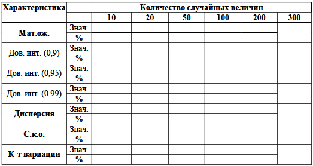
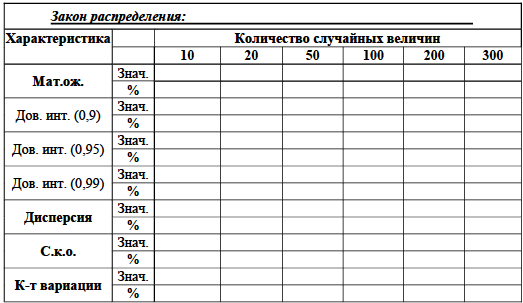

## [MainPage](../index.md)/[Economics Software Engineering](./README.md)/Labs

### Учебно-исследовательская работа 1 (УИР 1) : «Обработка результатов измерений: статистический анализ числовой последовательности»   教育和研究工作 1 (URI 1)：“测量结果的处理：数字序列的统计分析”

#### 1. Цель работы

Изучение методов обработки и статистического анализа результатов измерений на примере заданной числовой последовательности путем оценки числовых моментов и выявления свойств последовательности на основе корреляционного анализа, а также аппроксимация закона распределения заданной последовательности по двум числовым моментам случайной величины.  
研究以给定数值序列为例，通过相关分析估计数值矩并识别序列属性，以及用两个数值矩来近似给定序列的分布规律，研究对测量结果进行处理和统计分析的方法。一个随机变量。

#### 2. Порядок выполнения работы

В процессе исследований необходимо выполнить обработку заданной числовой последовательности (ЧП) для случаев, когда путем измерений получено 10, 20, 50, 100, 200 и 300 значений случайной величины, а именно:  
在研究过程中，需要对给定的数值序列（NS），通过测量得到随机变量的10、20、50、100、200、300个值的情况进行处理，即：

- рассчитать значения следующих числовых моментов заданной числовой последовательности:  
  计算给定数值序列的以下数值矩的值：
  - математическое ожидание;  
    数学期望；
  - дисперсию;  
    分散；
  - среднеквадратическое отклонение;  
    标准差； 
  - коэффициент вариации;  
    变异系数； 
  - доверительные интервалы для оценки математического ожидания с доверительными вероятностями 0,9; 0,95 и 0,99;  
    用于估计置信概率为 0.9 的数学期望的置信区间； 0.95 和 0.99； 
  - относительные отклонения (в процентах) полученных значений от наилучших значений, полагая, что наилучшими (эталонными) являются значения, рассчитанные для наиболее представительной выборки из трехсот случайных величин;  
    获得的值与最佳值的相对偏差（以百分比表示），假设最佳（参考）值是针对三百个随机变量中最具代表性的样本计算的值； 
- построить график значений для заданной числовой последовательности и определить ее характер, а именно: является эта последовательность возрастающей/убывающей, периодичной (при наличии периодичности оценить по графику длину периода);  
  为给定的数字序列构造一个值图并确定其性质，即：该序列是否递增/递减、周期性（如果存在周期性，则从图中估计周期的长度）； 
- выполнить автокорреляционный анализ и определить, можно ли заданную числовую последовательность считать случайной;  
  执行自相关分析并确定给定的数字序列是否可以被视为随机；

- построить гистограмму распределения частот для заданной числовой последовательности;  
  构建给定数值序列的频率分布直方图；

- выполнить аппроксимацию закона распределения заданной случайной последовательности по двум начальным моментам, используя, в зависимости от значения коэффициента вариации, одно из следующих распределений:  
  根据变异系数的值，使用以下分布之一来近似给定随机序列在两个初始时刻的分布规律：
  - равномерный;  均匀的  
  - экспоненциальный;  指数；
  - нормированный Эрланга k-го порядка или гипоэкспоненциальный с заданным коэффициентом вариации;  具有给定变异系数的归一化 Erlang k 阶或次指数；
  - гиперэкспоненциальный с заданным коэффициентом вариации;  具有给定变异系数的超指数；

- реализовать генератор случайных величин в соответствии с полученным аппроксимирующим законом распределения (в EXEL или программно) и проиллюстрировать на защите его работу;  
  根据获得的近似分布定律（以 EXEL 或以编程方式）实现随机变量生成器，并说明其在防御中的操作；
- сгенерировать последовательность случайных величин с использованием реализованного генератора и рассчитать значения числовых моментов по аналогии с заданной числовой последовательностью;  
  使用已实现的生成器生成随机变量序列，并通过与给定数值序列类比来计算数值矩的值；
- выполнить автокорреляционный анализ сгенерированной последовательности случайных величин;  
  对生成的随机变量序列进行自相关分析；
- выполнить сравнительный анализ сгенерированной последовательности случайных величин с заданной последовательностью, построив соответствующие зависимости на графике значений и гистограмме
распределения частот;  
  对生成的随机变量序列与给定序列进行比较分析，构建值图和频率分布直方图的相应依赖关系；
- оценить корреляционную зависимость сгенерированной и заданной последовательностей случайных величин.  
  评估生成的和给定的随机变量序列的相关依赖性。

Результаты проводимых исследований представить в виде таблиц и графиков.  
以表格和图表的形式呈现研究结果。

На основе полученных промежуточных и конечных результатов следует сделать обоснованные выводы об исследуемой числовой последовательности, предложить закон распределения для ее описания и оценить качество аппроксимации этим законом.  
基于所获得的中间结果和最终结果，我们应该对所研究的数值序列得出合理的结论，提出一种分布规律来描述它，并根据该规律评价近似的质量。

#### 3. Содержание отчета 

1) оценки математического ожидания, дисперсии, среднеквадратического отклонения, коэффициента вариации заданной числовой последовательности и доверительные интервалы для оценки математического ожидания с доверительными вероятностями 0,9; 0,95 и 0,99, сведенные в таблицу (форма 1);  
   给定数值序列的数学期望、离差、标准差、变异系数以及用于估计置信概率为 0.9 的数学期望的置信区间的估计； 0.95 和 0.99，列表（表格 1）；
2) график (график 1) значений заданной числовой последовательности с результатами анализа характера числовой последовательности (возрастающая, убывающая, периодичная и т.п.);  
   给定数值序列的值的图表（图表1）以及数值序列性质（递增、递减、周期等）的分析结果；
3) результаты автокорреляционного анализа (значения коэффициентов автокорреляции со сдвигом 1, 2, 3, …), представленные как в числовом (форма 3), так и графическом виде, с обоснованным выводом о характере заданной числовой последовательности (можно ли ее считать случайной);  
   自相关分析的结果（偏移1、2、3、...的自相关系数的值），以数字（形式3）和图形形式呈现，并对给定的性质给出合理的结论数字序列（可以认为是随机的）；
4) гистограмма распределения частот для заданной числовой последовательности (график 2);   
   给定数值序列的频率分布直方图（图 2）；
5) параметры, рассчитанные по двум начальным моментам и определяющие вид аппроксимирующего закона распределения заданной случайной последовательности (равномерный; экспоненциальный; нормированный Эрланга; гипоэкспоненциальный; гиперэкспоненциальный);  
   从两个初始矩计算出的参数，并确定给定随机序列的近似分布规律的类型（均匀；指数；归一化Erlang；低指数；超指数）；
6) описание алгоритма (программы) формирования аппроксимирующего закона распределения и расчета значений всех числовых характеристик с иллюстрацией (при защите отчета) его работоспособности;  
   用于生成近似分布规律并计算所有数值特征值的算法（程序）的描述，并附有其性能说明（在保护报告时）；
7) выводы по результатам сравнения сгенерированной в соответствии с полученным аппроксимирующим законом распределения последовательности случайных величин и заданной числовой последовательности, а именно:  
   根据所得到的近似分布规律生成的随机变量序列与给定数值序列的比较结果得出结论，即：
   - сравнения плотности распределения аппроксимирующего закона с гистограммой распределения частот для исходной числовой последовательности (график 3);  
     近似法则的分布密度与原始数值序列的频率分布直方图的比较（图3）； 
   - расчета числовых характеристик сгенерированной в соответствии с аппроксимирующим законом распределения случайной последовательности: математического ожидания, дисперсии, среднеквадратического отклонения, коэффициента вариации (представленные в таблице по форме 2) и коэффициентов автокорреляции при разных значениях сдвигов (в таблице по форме 3), а также сравнения (в %) полученных значений со значениями, рассчитанными для заданной числовой последовательности;  
     计算根据近似分布规律生成的随机序列的数值特征：数学期望、离散度、标准差、变异系数（在表格2中的表格中呈现）以及不同移位值的自相关系数（表3），以及获得的值与给定数字序列计算的值的比较（以％为单位）； 
   - проведения корреляционного анализа сгенерированной в соответствии с аппроксимирующим законом распределения последовательности случайных величин и заданной числовой последовательности на основе коэффициента корреляции.  
     根据相关系数对按照近似分布规律生成的随机变量序列与给定的数值序列进行相关分析。 
8) по каждому из перечисленных выше пунктов отчета должны быть сформулированы результативные выводы и заключения.  
   针对报告的上述每一点，必须制定有效的结论和结论。

#### 4. Рекомендуемые формы таблиц

Характеристики заданной ЧП (вариант ____)   
给定的数字序列的特征（选项____）

% - относительные отклонения рассчитанных значений от значений, полученных для выборки из трехсот величин (столбец 300)  
% - 计算值与三百个值样本获得的值的相对偏差（第 300 列）

Характеристики сгенерированной случайной ЧП  
随机生成的数字序列情况的特征

% - относительные отклонения характеристик сгенерированной случайной последовательности от одноименных значений заданной числовой последовательности  
% - 生成的随机序列的特征与给定数字序列的相同值的相对偏差

Коэффициенты автокорреляции  
自相关系数

Примечание: в графы «Дов. инт.» заносится значение полуинтервала доверительного интервала в виде:  ±<значение>.  
注：在“Dov.”栏中int。”置信区间的半值以以下形式输入：±<值>。
