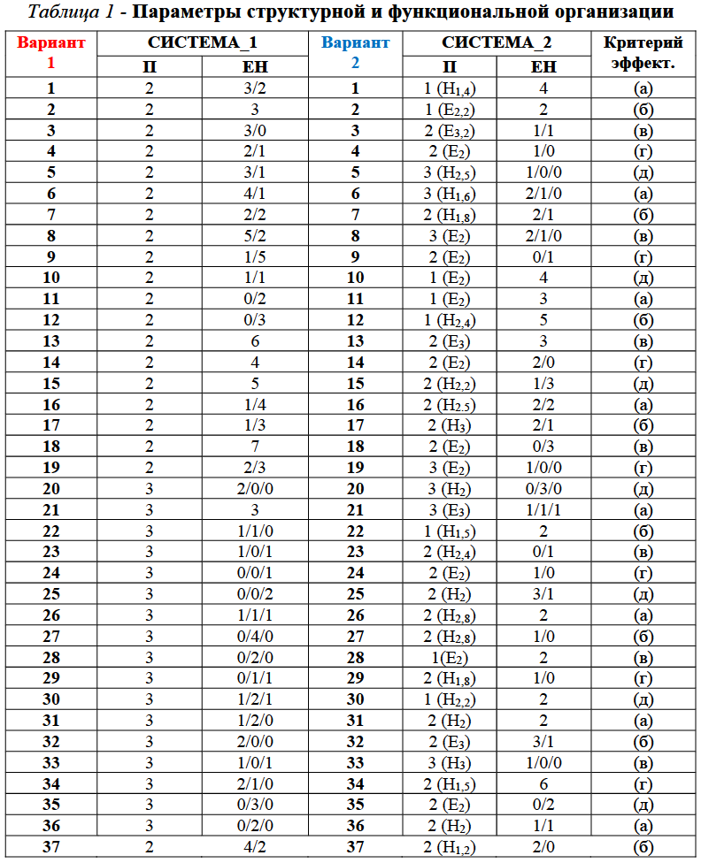
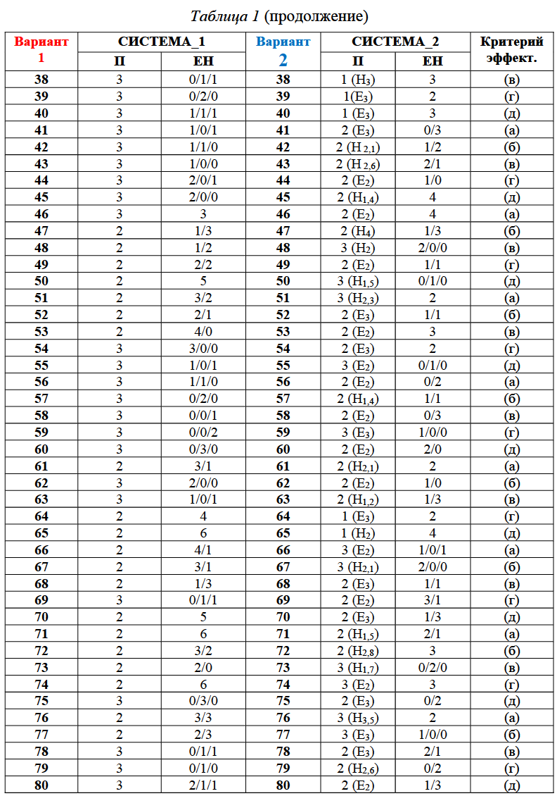
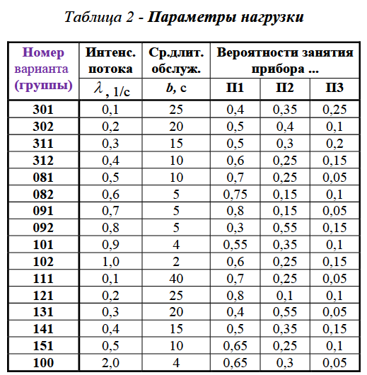
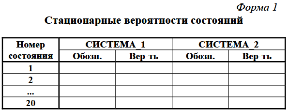
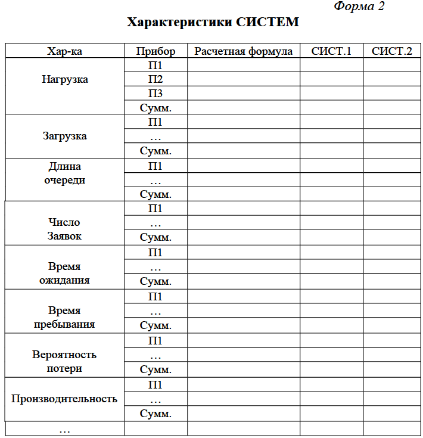

## [MainPage](../../index.md)/[Economics Software Engineering](../README.md)/Lab2

### Учебно-исследовательская работа 2 (УИР 2) «Марковские модели систем массового обслуживания»   教育和研究工作2（UR 2）“排队系统的马尔可夫模型”

#### 1. Цель работы

Изучение метода марковских случайных процессов и его применение для исследования простейших моделей – систем массового обслуживания (СМО) с однородным потоком заявок.  
研究马尔可夫随机过程的方法及其应用，研究最简单的模型——具有统一请求流的排队系统（QS）。

#### 2. Содержание работы

Разработка и расчет марковских моделей одно- и многоканальных СМО с однородным потоком заявок и выбор наилучшего варианта построения СМО в соответствии с заданным критерием эффективности.  
开发和计算具有统一请求流的单通道和多通道 QS 的马尔可夫模型，并根据给定的效率标准选择构建 QS 的最佳选项。

В процессе исследований для расчета характеристик функционирования СМО используется программа MARK.  
在研究过程中，使用MARK程序来计算QS的性能特征。

#### 3. Этапы работы

1. Разработка марковских моделей исследуемых систем.  
   正在研究的系统的马尔可夫模型的开发。
2. Освоение программы MARK.  
   掌握 MARK 程序。
3. Проведение расчетов по разработанным моделям и обработка результатов.  
   使用开发的模型进行计算并处理结果。
4. Анализ полученных результатов.  
   分析获得的结果。
5. Выбор наилучшего варианта организации системы из двух вариантов в соответствии с заданным критерием эффективности.  
   根据给定的效率标准从两个选项中选择组织系统的最佳选项。

#### 4. Порядок выполнения работы

1. Получить вариант работы.  
   获得工作选择。
2. Построить графы переходов для заданных СИСТЕМЫ_1 и СИСТЕМЫ_2.  
   为给定的 SYSTEM_1 和 SYSTEM_2 构建转换图。
3. С использованием программы MARK рассчитать характеристики марковского процесса для СИСТЕМЫ_1 и СИСТЕМЫ_2.  
   使用MARK 程序，计算SYSTEM_1 和SYSTEM_2 的马尔可夫过程的特性。
4. Проанализировать характеристики функционирования системы.  
   分析系统的运行特性。
5. Выбрать и обосновать наилучший способ организации системы в соответствии с заданным критерием эффективности.  
   根据给定的效率标准选择并论证组织系统的最佳方式。

#### 5. Описание программы MARK

Программа MARK предназначена для расчета характеристик марковских процессов с непрерывным временем по заданным значениям интенсивностей переходов и матрице интенсивностей переходов.  
MARK程序旨在根据给定的跃迁强度值和跃迁强度矩阵计算连续时间马尔可夫过程的特征。

Результатами расчетов являются:  
计算结果为：
- стационарные вероятности состояний марковского процесса;  
  马尔可夫过程状态的平稳概率；
- значения характеристик марковской модели, вычисленные на основе стационарных вероятностей по заданным формулам.  
  马尔可夫模型的特征值，使用给定公式根据平稳概率计算。

Предусмотрена возможность варьирования значений интенсивностей переходов и вывод результатов варьирования в виде таблиц или графика зависимостей характеристик марковской модели от варьируемых параметров.  
可以改变转变强度的值，并根据不同的参数以马尔可夫模型特征的表格或图表的形式显示变化结果。

Результаты расчетов могут быть выведены на экран или на печать.  
计算结果可以显示在屏幕上或打印。

#### 6. Содержание отчета

1. Постановка задачи и исходные данные.  
   问题陈述和初始数据。
2. Описание исследуемой системы.  
   所研究系统的描述。
3. Перечень состояний марковского процесса для исследуемой системы.  
   所研究系统的马尔可夫过程的状态列表。
4. Результаты работы:   
   工作成果：

- размеченный граф переходов марковского процесса;  
  马尔可夫过程的标记转移图；
- матрица интенсивностей переходов;  
  跃迁强度矩阵；
- значения стационарных вероятностей, сведенные в таблицу (форма 1);  
  平稳概率值，列表（表 1）；
- формулы, используемые для расчета характеристик системы и значения характеристик системы, сведенные в таблицы (форма 2);  
  用于计算系统特性和系统特性值的公式，总结在表中（表格2）；
- результаты (графики и выводы) сравнительного анализа характеристик функционирования исследуемых систем;  
  对所研究系统的运行特征进行比较分析的结果（图表和结论）；
- обоснование выбора наилучшего варианта организации системы в соответствии с заданным критерием эффективности.  
  根据给定的效率标准选择组织系统的最佳选项的理由。

Теоретический материал по марковским случайным процессам можно найти в учебном пособии: «Основы моделирования дискретных систем», раздел 5 «Численное моделирование (модели случайных процессов)».  
有关马尔可夫随机过程的理论材料可以在教科书“离散系统建模基础”第 5 节“数值建模（随机过程模型）”中找到。

#### 7. Варианты заданий 

Номер варианта УИР 2 выдается преподавателем в виде N1/N2/NG, где N1 – номер варианта 1 (СИСТЕМЫ_1) из таблицы 1 для СИСТЕМЫ_1; N2 – номер варианта 2 (СИСТЕМЫ_2) из таблицы 1  для СИСТЕМЫ_2, NG - номер варианта из таблицы 2  (две последние цифры в номере группы).  
选项УИР 2的编号由教师以N1/N2/NG的形式给出，其中N1是表1中SYSTEM_1的选项1(SYSTEM_1)的编号； N2 是表 1 中 SYSTEM_2 的选项 2 (SYSTEM_2) 的编号，NG 是表 2 中选项的编号（组编号的最后两位）。

Обозначения в таблице 1:

- П – число обслуживающих Приборов в системе;  
  П - 系统中服务设备的数量；
- П (Ek) – в одном из Приборов (любом) длительность обслуживания распределена по закону Эрланга k-го порядка;  
  П (Ek) – 在其中一个设备（任何）中，服务持续时间根据 Erlang 第 k 阶定律进行分配；
- П (Hv) – в одном из Приборов (любом) длительность обслуживания распределена по гиперэкспоненциальному закону с коэффициентом вариации, равным v;  
  П (Hv) – 在其中一个设备（任何）中，服务持续时间根据超指数定律分布，变异系数等于 v；
- ЕН  - Емкости Накопителей: X/Y/Z  (X - перед первым прибором, Y - перед вторым прибором и Z - перед третьим прибором);  
  EH - 存储容量：X/Y/Z（X - 第一个设备前面，Y - 第二个设备前面，Z - 第三个设备前面）；

Указания:  
1. заявка, поступившая в систему, с заданной вероятностью занятия прибора направляется к соответствующему прибору и ставится в очередь, либо теряется, если накопитель заполнен или отсутствует;   
   系统接收到的申请，以给定的占用设备的概率，发送到对应的设备并放入队列，如果存储满或丢失则丢失；
2. емкость накопителя, представленная одним числом, означает общий накопитель перед всеми приборами;  
   存储容量，用一个数字表示，是指所有设备前面的公共存储；
3. критерий эффективности - выбирается в соответствии с номером варианта N1, если сумма N1+N2 – величина нечетная, и в соответствии с номером варианта N2, если сумма N1+N2 – величина четная:  
   效率标准-如果N1+N2之和为奇数，则根据选项编号N1选择，如果N1+N2之和为偶数，则根据选项编号N2选择：
   1. максимальная производительность системы;  
      最大系统性能； 
   3. минимальные потери заявок;  
      应用程序损失最小化；
   5. максимальная загрузка системы;  
      最大系统负载； 
   7. минимальное время пребывания в системе заявок;  
      在应用系统中花费的最短时间； 
   9. минимальная суммарная длина очередей заявок.  
      申请队列的最小总长度。 

Указания к табл.2

Вероятности занятия прибора определяются следующим образом:  
设备占用概率确定如下：
- в случае трехканальной СМО выбираются из таблицы 2 (см. вероятности занятия приборов П1, П2 и П3);  
  在三通道QS的情况下，从表2中选择（参见占用设备P1、P2和P3的概率）；
- в случае двухканальной СМО вероятность занятия прибора П1 выбирается из табл.2, а вероятность занятия прибора П2 принимается равной сумме вероятностей занятия приборов П2 и П3;  
  在双通道QS的情况下，设备P1的占用概率从表2中选择，设备P2的占用概率取等于设备P2和P3的占用概率之和；
- в случае одноканальной СМО вероятность занятия прибора принимается равной 1.  
  在单通道 QS 的情况下，假设设备占用概率等于 1。

#### 8. Рекомендуемые формы таблиц

Указание к форме 1:

В столбце "Обозн." указываются обозначения всех состояний марковского процесса, принятые в соответствии с выбранной кодировкой.  
在“设计”栏目中指示根据所选编码采用的马尔可夫过程的所有状态的名称。

Указание: расчет характеристик обслуживания заявок должен проводиться через вероятности состояний марковского процесса без использования фундаментальных зависимостей (формул Литтла и т.п.); последние могут и должны использоваться для проверки полученных результатов.  
说明：服务请求特征的计算应通过马尔可夫过程的状态概率进行，而不使用基本依赖关系（Little 公式等）；后者可以而且应该用来验证所获得的结果。

Замечание. Если количество состояний марковского случайного процесса более 20 допускается обоснованное изменение числа приборов или емкости одного из накопителей (на усмотрение студента по минимуму) для уменьшения количества состояний.  
评论。如果马尔可夫随机过程的状态数超过20，则允许合理改变设备数量或其中一个存储设备的容量（由学生自行决定，至少）以减少状态数。