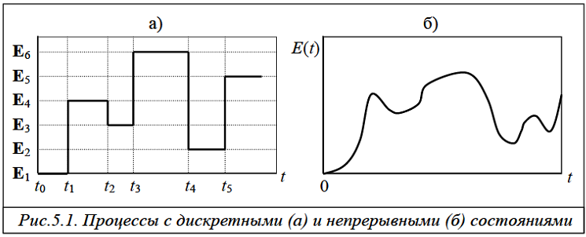
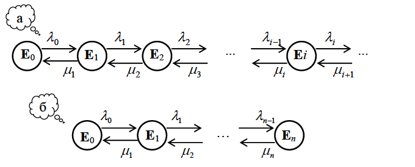

# Раздел 5. ЧИСЛЕННОЕ МОДЕЛИРОВАНИЕ (МОДЕЛИ СЛУЧАЙНЫХ ПРОЦЕССОВ)

«В задаче из N уравнений всегда будет N+1 неизвестная» (Уравнения Снэйфу)  

При изучении сложных систем со стохастическим характером функционирования полезной математической моделью является случайный процесс, который развивается в зависимости от ряда случайных факторов. Примерами случайных процессов могут служить процессы поступления и передачи данных в телекоммуникационной сети, процессы выполнения задач и обмена данными с внешними устройствами в вычислительной системе и т.п.

Большинство моделей дискретных систем со стохастическим характером функционирования строится на основе моделей массового обслуживания, процессы в которых являются случайным и, во многих случаях, марковскими или некоторым образом связанные с марковскими процесссами. Поэтому для решения таких задач теории массового обслуживания может использоваться математический аппарат теории марковских процессов. Применение марковских процессов оказывается особенно эффективным и результативным при исследовании систем и сетей массового обслуживания с накопителями ограниченной ёмкости.

Математическое описание марковских процессов обычно представляется в виде систем дифференциальных (в случае нестационарного режима) или алгебраических (для стационарного режима) уравнений, решение которых, в общем случае, получить в явном виде не удается. Это обусловливает необходимость применения численных методов решения систем дифференциальных или алгебраических уравнений.

## 5.1. Понятие случайного процесса

Основными для случайных процессов являются понятия состояния и перехода из одного состояния в другое.

Случайный процесс находится в некотором состоянии, если он полностью описывается значениями переменных, которые задают это состояние.

Процесс совершает переход из одного состояния в другое, если описывающие ее переменные изменяются от значений, задающих одно состояние, на значения, которые определяют другое состояние.

Случайный процесс состоит в том, что с течением времени процесс переходит из одного состояния в другое заранее не известное состояние.

Понятия «состояние» и «переход» используются как для описания случайного процесса, так и системы, в которой этот процесс протекает.

Поэтому при моделировании реальных систем часто говорят о состоянии системы и переходе системы из одного состояния в другое.

Если множество состояний, в которых может находиться процесс счётное, то есть все возможные состояния могут быть пронумерованы, то соответствующий процесс называется случайным процессом с дискретными состояниями или просто дискретным случайным процессом. В этом случае переменные, описывающие состояния случайного процесса, принимают либо целочисленные значения, либо вполне конкретные отделённые друг от друга дискретные значения. Обычно состояния дискретного случайного процесса определяются таким образом, чтобы каждое возможное состояние могло быть обозначено порядковым номером, при этом число возможных состояний системы может быть конечным: $E_1,E_2,\cdots, E_n$ или бесконечным: $E_1, E_2,\cdots, E_n$ (иногда состояния нумеруются, начиная с нуля: $E_0, E_1, \cdots, E_n$). Для случайного процесса с дискретными состояниями характерен скачкообразный переход из одного состояния в другое (рис.5.1,а). Например, случайный процесс, протекающий в простейшей СМО с однородным потоком заявок, может быть представлен количеством заявок, находящихся в системе в произвольный момент времени. Тогда состояние Ek случайного процесса и, следовательно, самой системы будет означать, что в СМО находится ровно $k = 0,1,2,\cdots$ заявок.

Если множество состояний не может быть пронумеровано, то имеем случайный процесс с непрерывными состояниями или просто непрерывный случайный процесс, для которого характерен плавный переход из состояния в состояние и который задаётся в виде непрерывной ункции времени: E(t) (рис.5.1,б). Например, процесс изменения температуры некоторого объекта может рассматриваться как случайный процесс с непрерывными состояниями.

Поскольку модели массового обслуживания относятся к классу дискретных систем, то в дальнейшем будут рассматриваться только случайные процессы с дискретными состояниями.

При описании дискретных систем в терминах случайных процессов одним из основных этапов является этап кодирования состояний, заключающийся в определении состава переменных и их значений, используемых для описания состояний. Состав переменных в значительной мере определяется назначением разрабатываемой модели, зависящим от целей исследований.

### 5.1.1. Случайные процессы с дискретными состояниями

Предположим, что система может находиться в одном из состояний $E1, E2, \cdots$ (часто состояния обозначаются просто номерами $1, 2,\cdots$). Пусть состояние системы меняется скачкообразно в зависимости от некоторого параметра $t$, причем переход из состояния в состояние является случайным. Будем называть параметр $t$ – временем и считать, что $t$ пробегает либо целые, либо действительные числа. Обозначим через $Z(t)$ случайный процесс, описывающий состояние системы в момент времени $t$.

Случайный процесс $Z(t)$ называется случайным процессом с дискретным временем, если переходы из состояния в состояние возможны только в строго определенные заранее фиксированные моменты времени, которые можно пронумеровать: $t1, t2,\cdots$.

Если промежуток времени между переходами из состояния в состояние является случайным и переход возможен в любой заранее не известный момент времени $t$, то процесс называется случайным процессом с непрерывным временем.

Процесс с дискретным временем имеет место либо когда структура системы такова, что ее состояния могут изменяться только в заранее определенные моменты времени, либо когда предполагается, что для описания процесса достаточно знать состояние системы в отдельные моменты времени. Тогда эти моменты можно пронумеровать и говорить о состоянии  $E_i$  в момент $t_k$ или просто в момент $k (k = 0,1,2,\cdots)$.

Процессы с дискретным временем называются стохастическими
последовательностями или случайными цепями.

Случайные процессы с дискретными состояниями могут изображаться в виде графа переходов (состояний), в котором вершины соответствуют состояниям, а ориентированные дуги – переходам из одного состояния в другое.

Граф переходов называется размеченным, если на дугах графа указаны условия перехода в виде вероятностей переходов (для процессов с дискретным временем) или интенсивностей переходов (для процессов с непрерывным временем).

Состояния $E_i$ могут быть: 
- невозвратными, если процесс после какого-то числа переходов непременно покидает их; 
- поглощающими, если случайный процесс, достигнув этих состояний прекращается.

Случайный процесс называется транзитивным, если из любого состояния можно перейти за то или иное число шагов в любое другое состояние и вернуться в исходное.

### 5.1.2. Понятие марковского случайного процесса

Случайный процесс называется марковским, если вероятность любого состояния в будущем зависит только от его состояния в настоящем и не зависит от того, когда и каким образом процесс оказался в этом состоянии.

Описывающий поведение системы процесс $Z(t)$ называется цепью Маркова.

Для того чтобы случайный процесс с непрерывным временем был марковским, необходимо, чтобы интервалы времени между соседними переходами из состояния в состояние были распределены по экспоненциальному закону. Для доказательства последнего утверждения воспользуемся следующими рассуждениями.

Пусть время нахождения случайного процесса в некотором состоянии $E_i$ до его перехода в другое состояние $E_j$ распределено по экспоненциальному закону с функцией распределения $F_{ij}(\tau)=1-e^{-\alpha_{ij}\tau}$, где
$\alpha_{ij}$ - параметр распределения, характеризующий частоту перехода из состояния $E_i$ в состояние $E_j$ и определяемый как величина, обратная среднему времени нахождения случайного процесса в состоянии $E_i$ до момента его перехода в состояние $E_j$. Вычислим вероятность того, что случайный процесс перейдет в состояние $E_j$ в течение интервала времени $\Delta \tau$ при условии, что в состоянии $E_i$ процесс уже находится в течение времени 0. Эта условная вероятность равна

$$P_{ij}(\Delta\tau|\tau\ge\tau_0)=Pr(\tau_0\le\tau\le\tau_0+\Delta\tau|\tau\ge\tau_0)=\\
=\frac{Pr(\tau_0\le\tau\le\tau_0+\Delta\tau)}{Pr(\tau\ge\tau_0)}=\frac{F(\tau_0+\Delta\tau)-F(\tau_0)}{1-F(\tau_0)}=1-e^{-\alpha_{ij}\Delta\tau}$$

Из последнего выражения следует, что вероятность перехода из одного состояния в другое зависит только от исходного состояния $E_i$ и не зависит от интервала времени $\tau_0$ , то есть от того, как долго находился процесс в состоянии $E_i$, а также от того, какие состояния предшествовали состоянию $E_i$. Другими словами, поведение случайного процесса не зависит от предыстории и определяется только его состоянием в настоящий момент, то есть процесс является марковским.

Еще одно замечательное свойство экспоненциального распределения вытекает из полученного выражения, а именно: если время нахождения случайного процесса в некотором состоянии $E_i$ до его перехода в другое состояние $E_j$ распределено по экспоненциальному закону с параметром ij , то интервал времени от любого случайного момента времени до момента перехода в состояние $E_j$ имеет такое же экспоненциальное распределение с тем же параметром $\alpha_{ij}$. Эта особенность является следствием отсутствия последействия, присущего всем процессам с экспоненциальным распределением времени нахождения в том или ином состоянии.

Таким образом, безусловная $P_{ij}(\Delta\tau)$ и условная $P_{ij}(\Delta\tau|\tau\ge\tau_00)$ вероятности перехода в другое состояние за время $\Delta\tau$ для марковского процесса одинаковы и равны

$$P_{ij}(\Delta\tau)=P_{ij}(\Delta\tau|\tau\ge\tau_0)=1-e^{-\alpha_{ij}\Delta\tau}$$

Пусть интервал времени $\Delta\tau$ достаточно мал. Тогда, разлагая $e^{-\alpha_{ij}\Delta\tau}$ в ряд по степеням $\alpha_{ij}\Delta\tau$ при $\Delta\tau\rightarrow 0$ и пренебрегая величинами высшего порядка малости, получим вероятность перехода из одного состояния в другое за бесконечно малый интервал времени: 

$$P_{ij}(\Delta\tau)=1-(1-\alpha_{ij}\Delta\tau)=\alpha_{ij}\Delta\tau\qquad(5.1)$$

## 5.2. Параметры и характеристики марковского случайного процесса

### 5.2.1. Параметры марковского случайного процесса

Для описания марковского случайного процесса с дискретными состояниями используется следующая совокупность параметров:  

- перечень состояний $E_1, \cdots, E_n$ , в которых может находиться случайный процесс; 
- матрица переходов, описывающая переходы случайного процесса между состояниями в виде:
  - матрицы вероятностей переходов $Q$ для процессов с дискретным временем; 
  - матрицы интенсивностей переходов $G$ для процессов с непрерывным временем; 
- начальные вероятности  $p_1(0),\cdots, p_n(0)$.

Для определения перечня состояний случайного процесса необходимо корректно решить задачу кодирования состояний, которое зависит от смысла, вкладываемого в понятие «состояние» для каждой конкретной системы. Так, например, состояние некоторой системы массового обслуживания (а, следовательно, и случайного процесса, протекающего в ней) может быть задано числом заявок, находящихся в системе в данный момент времени, а состояние сети массового обслуживания – распределением числа заявок по всем узлам сети.

Для случайных процессов с дискретным временем изменения
состояний происходят только в определенные моменты времени $t_1, t_2,\cdots, t_k ,\cdots$. Переходы между состояниями описываются вероятностями переходов. Если непосредственный переход из одного состояния в другое невозможен, то вероятность, соответствующая данному переходу, равна нулю. Обозначим через $q_{ij}$ условную вероятность того, что в момент времени $t_{k+1}$ случайный процесс перейдет в состояние $E_j$ при условии, что в момент tk процесс находился в состоянии $E_i$. Если переход из состояния $E_i$ в $E_j$ зависит только от этих двух состояний, то есть условная вероятность $q_{ij}$ не изменяется при дополнительной информации о поведении процесса до момента  $t_k$, получим цепь Маркова.

Цепь Маркова называется  однородной, если вероятности переходов не зависят от момента времени $t_k$ , и неоднородной, если вероятности переходов являются функциями $t_k$ , то есть $q_{ij} = q_{ij} (k)$ .

Вероятности переходов задаются в виде квадратной матрицы вероятностей переходов $Q = [q_{ij} | i, j =\overline{1,n}]$, элементы которой удовлетворяют условиям: 

$$0\le q_{ij}\le 1; \sum_{j=1}^nq_{ij}=1\qquad(i,j=\overline{1, n})\qquad(5.2)$$

Матрица, элементы которой удовлетворяют указанным условиям,
называется стохастической.

Последнее условие в виде суммы элементов каждой строки матрицы вероятностей переходов, равной единице, означает, что в момент времени $t_k$ случайный процесс с вероятностью единица выполнит переход в одно из n возможных состояний, включая то же самое состояние, из которого этот переход осуществляется, то есть процесс может остаться в том же состоянии.

Для случайных процессов с непрерывным временем время между
переходами из одного состояния в другое случайно. Это означает, что вероятность перехода из одного состояния в другое не может быть задана, поскольку вероятность такого перехода точно в произвольный момент времени $t$ равна нулю. Для описания переходов между состояниями случайного процесса с непрерывным временем вместо вероятностей переходов вводится параметр, называемый интенсивностью перехода.

Интенсивность перехода $g_{ij}$ из состояния $E_i$ в состояние $E_j$ определяется как предел отношения вероятности перехода Pij() системы за промежуток времени $\Delta \tau$ из $E_i$ в $E_j$  к длине этого промежутка: 

$$g_{ij}=\lim_{\Delta\tau\rightarrow0}\frac{P_{ij}(\Delta\tau)}{\Delta\tau}\qquad(i,j=\overline{1,n};i\ne j)\qquad(5.3)$$

Отсюда следует, что вероятность перехода за бесконечно малый промежуток времени $\Delta \tau$ равна: $g_{ij}\Delta \tau (i\ne j)$ . Вероятность двух и более переходов за время $\Delta \tau$ имеет порядок $(\Delta \tau)^2$ и выше и предполагается бесконечно малой величиной.

Если интенсивности переходов постоянны и не зависят от времени $t$, то есть от того, в какой момент начинается промежуток $\Delta \tau$, то марковский процесс называется однородным. Если интенсивности $g_{ij}$ представляют собой функции времени $t$, процесс называется неоднородным.

В дальнейшем будем рассматривать только однородные марковские процессы.

Интенсивности переходов задаются в виде квадратной матрицы
$G =[g_{ij} | i, j =\overline{1,n}]$, называемой матрицей интенсивностей переходов, диагональные элементы которой определяются из условия: 

$$\sum_{j=1}^ng_{ij}=0\qquad(i=\overline{1,n})$$

откуда

$$g_{ii}=-\sum_{j=1,j\ne i}^ng_{ij}\qquad(i,j=\overline{1,n})\qquad(5.4)$$

Матрица, в которой сумма элементов в каждой строке равна нулю, называется дифференциальной.

Выше было показано, что в случае экспоненциального закона распределения времени нахождения случайного процесса в некотором состоянии вероятность перехода из одного состояния в другое за бесконечно малый интервал времени определяется выражением $(5.1)$ и равно $P_{ij}(\Delta\tau)=\alpha_{ij}\Delta\tau$ . Отсюда следует, что интенсивность перехода представляет собой параметр экспоненциального распределения:

$$g_{ij}=\lim_{\Delta\tau\rightarrow 0}\frac{P_{ij}(\Delta\tau)}{\Delta\tau}=\alpha_{ij}$$

Начальные вероятности  $p_1(0),\cdots, p_n(0) , где p_i(0)$ – вероятность того, что в момент времени $t = 0$ система находится в состоянии $E_i(i =1,\cdots n)$ , задают состояние системы в начальный момент времени $t = 0$.

Начальные вероятности необходимы при изучении переходных процессов, когда исследуемая система работает в нестационарном режиме. Если марковский процесс обладает эргодическим свойством, что означает работу моделируемой системы в установившемся режиме, то, как будет показано ниже, стационарные характеристики (вероятности) не зависят от начальных вероятностей и, следовательно, могут быть не заданы.

### 5.2.2. Характеристики марковского случайного процесса

Изучение случайных процессов заключается в определении вероятностей того, что в момент времени  $t$  система находится в том или ином состоянии. Совокупность таких вероятностей, описывающих состояния системы в различные моменты времени, дают достаточно полную информацию о протекающем в системе случайном процессе.

Рассмотрим систему с конечным числом состояний: $E_1, …, E_n$. Обозначим через $p_i(t)$ вероятность того, что в момент времени $t$ система находится в состоянии $E_i: p_i (t) = Pr\{Z(t) = E_i\}$.

В любой момент времени  $t$  система может находиться в одном из $n$ возможных состояний, то есть для любого момента времени t выполняется условие:

$$\sum_{i=1}^np_i(t)=1\qquad(5.5)$$

которое называется нормировочным.

Совокупность вероятностей $p_i(t)$ может быть представлена вектором с числом координат, равным числу возможных состояний системы:

$$P(t)=\{p_1(t),\cdots,p_n(t)\}$$

причем

$$0\le p_i(t)\le 1;\qquad\sum_{i=1}^n p_i(t)=1\qquad(5.6)$$

Вектор, обладающий свойствами $(5.6)$, называется стохастическим.

Стохастический вектор называется вектором состояний, если его компоненты представляют собой вероятности состояний системы.

Вектор состояний $P(t)=\{p_1(t),\cdots,p_n(t)\}$ является основной характеристикой марковского случайного процесса. На основе полученных значений вероятностей состояний случайного процесса, протекающего в исследуемой системе, могут быть рассчитаны представляющие интерес реальные характеристики системы, например для системы массового обслуживания могут быть рассчитаны длины очередей заявок.

## Методы расчета марковских моделей

### 5.3.1. Эргодическое свойство случайных процессов

Если по истечении достаточно большого промежутка времени вероятности состояний стремятся к предельным значениям $p_1,\cdots, p_n$ , не зависящим от начальных вероятностей $p_1(0),\cdots, p_n(0)$ и от текущего момента времени $t$ , то говорят, что случайный процесс обладает эргодическим свойством. Таким образом, для процессов, обладающих эргодическим свойством:

$$\lim_{t\rightarrow \infty}P(t)=P(\infty)=P$$

где $P = (p_1,\cdots, p_n)$ – вектор вероятностей состояний системы, называемых стационарными вероятностями.

В системе, описываемой марковским случайным процессом, обладающим эргодическим свойством, при $t \rightarrow \infty$ устанавливается некоторый предельный режим, при котором характеристики функционирования системы не зависят от времени. В этом случае говорят, что система
работает в установившемся или стационарном режиме. Если
характеристики функционирования системы зависят от времени, то имеем неустановившийся режим.

Отметим, что для стационарных вероятностей pi должно выполняться нормировочное условие $(5.5)$.

При рассмотрении случайных процессов возникает вполне резонный вопрос: когда случайный процесс обладает эргодическим свойством?

Случайный процесс с дискретным временем обладает эргодическим свойством, если матрица вероятностей переходов не является периодической или разложимой.

Матрица является разложимой, если она может быть приведена к одному из следующих видов: 

$$1)\begin{bmatrix}
    A & 0\\
    0 & D
\end{bmatrix}, \qquad 2)\begin{bmatrix}
    A & 0\\
    C & D
\end{bmatrix}, \qquad 3)\begin{bmatrix}
    A & B\\
    0 & D
\end{bmatrix}$$

где $A, B, C, D$– ненулевые квадратные подматрицы; $0$ – нулевая квадратная подматрица.

В первом случае состояния, соответствующие подмножествам $A$ и $D$, называются замкнутыми, так как система, находясь в каком-то состоянии одного из этих подмножеств, никогда не сможет перейти в какое-либо состояние другого подмножества. Состояния, соответствующие подмножеству $D$ во втором случае и подмножеству $A$ в третьем случае, называются невозвратными, поскольку после того, как процесс покинет эти состояния, невозможен обратный переход в эти состояния из состояний, соответствующих другим подмножествам.

Матрица является периодической, если она может быть приведена к виду:

$$\begin{bmatrix}
    0 & B\\
    C & 0
\end{bmatrix}$$

Случайный процесс в этом случае будет по очереди переходить из состояний, соответствующих B, в состояния, соответствующие С.

Итак, если матрица вероятностей переходов $Q = [q_{ij} | i, j =\overline{1,n}]$, случайного процесса с дискретным временем не является периодической или разложимой, то процесс обладает эргодическим свойством: 

$$\lim_{k\rightarrow\infty}p_i(k)=p_i\qquad(i=\overline{1,n})\qquad(5.7)$$

Транзитивный случайный процесс с непрерывным временем и
конечным числом состояний, среди которых нет невозвратных и поглощающих состояний, всегда обладает эргодическим свойством: 

$$\lim_{t\rightarrow\infty}p_i(t)=p_i\qquad(i=\overline{1,n})\qquad(5.8)$$

### 5.3.2. Марковские процессы с дискретным временем

Для однородного марковского процесса с дискретным временем вероятности состояний на момент времени $t_k$ определяются на основе следующего рекуррентного выражения: 

$$p_j(k)=\sum_{i=1}^np_i(k-1)q_{ij}\qquad(j=\overline{1,n};k=1,2,\cdots)\qquad(5.9)$$

Если рассматриваемый марковский процесс обладает эргодическим свойством, то, согласно $(5.7)$, при $k \rightarrow \infty$ вероятности состояний $p_i(k)$ стремятся к стационарным значениям $p_i$ , не зависящим от момента времени $t_k$ и начальных вероятностей $p_i(0)$. С учётом этого, выражение $(5.9)$ может быть преобразовано к виду:

$$p_j=\sum_{i=1}^np_iq_{ij}\qquad(j=\overline{1,n})\qquad(5.10)$$

а нормировочное условие $(5.5)$ примет вид:

$$\sum_{i=1}^np_i=1\qquad(5.11)$$

Уравнения $(5.10)$ с условием $(5.11)$ образуют систему линейных алгебраических уравнений для расчёта стационарных вероятностей состояний марковского процесса, которая обладает единственным решением, если $Q$ – эргодическая матрица.

Доказательство выражения $(5.9)$.

Рассмотрим однородный марковский процесс с дискретным временем, который может находиться в одном из n возможных состояний: $Е_1, \cdots, Е_n$. Вероятности переходов $q_{ij}$ заданы в виде матрицы переходов $Q =[q_{ij} | i, j =\overline{1,n}]$, а начальные вероятности на момент времени $t_0 = 0$ в виде вектора $P = {p_1(0),\cdots, p_n(0)}$.

Найдем вероятности состояний марковского процесса после первого шага, то есть на момент времени $t_1$. По формуле полной вероятности получим:

$$\begin{cases}
    p_1(1)=p_1(0)q_{11} + p_2q_{21} + \cdots + p_n(0)q_{n1};\\
    p_2(1)=p_1(0)q_{12} + p_2q_{22} + \cdots + p_n(0)q_{n2};\\
    \cdots\\
    p_n(1)=p_1(0)q_{1n} + p_2q_{2n} + \cdots + p_n(0)q_{nn};\\
\end{cases}$$

или в компактной форме:

$$p_j(1)=\sum_{i=1}^np_i(0)q_{ij}\qquad(j=\overline{1,n})$$

Вероятности состояний после второго шага на момент времени $t_2$ определяются аналогично:

$$p_j(2)=\sum_{i=1}^np_i(1)q_{ij}\qquad(j=\overline{1,n})$$

После $k$-го шага на момент времени $t_k (k =1,2,\cdots)$ вероятности состояний будут определяться как

$$p_j(k)=\sum_{i=1}^np_i(k-1)q_{ij}\qquad(j=\overline{1,n})$$

что и требовалось доказать.

**Пример.** Рассмотрим систему, которая состоит из двух устройств $У_1$ и $У_2$, каждое из которых может находиться в одном из двух состояний: 0 – выключено и 1 – включено. В определённые моменты времени устройства могут включаться или выключаться. Выделим возможные состояния системы:

$$\begin{array} {c|cccc}
    E_i & E_0 & E_1 & E_2 & E_3\\
    \hline
    У_1 & 0 & 1 & 0 & 1\\
    У_1 & 0 & 0 & 1 & 1\\
\end{array}$$

Состояние $E_0$ соответствует простою системы, когда оба устройства выключены, а состояние $E_3$ соответствует случаю, когда оба устройства включены.

Положим, что заданы вероятности переходов в виде матрицы

$$Q=\begin{array}{c|cccc}
     & E_0 & E_1 & E_2 & E_3\\
    \hline
    E_0 & 0 & 0.2 & 0.5 & 0.3\\
    E_1 & 0.5 & 0 & 0.1 & 0.4\\
    E_2 & 0.5 & 0 & 0 & 0.5\\
    E_3 & 0 & 0.4 & 0.6 & 0\\
\end{array}$$

и начальные вероятности $p_0(0) = 0,8; p_1(0) = 0,2; p_2(0) = 0; p_3(0) = 0$.

Определим вероятности нахождения системы в том или ином состоянии на различные моменты времени.

Согласно выражению $(5.9)$ вероятности состояний системы: 

- на момент времени $t_1$: 
  $$p_0(1)=p_0(0)q_{00} + p_1(0)q_{10} + p_2(0)q_{20} + p_3(0)q_{30} = 0.1;\\
  p_1(1)=p_0(0)q_{01} + p_1(0)q_{11} + p_2(0)q_{21} + p_3(0)q_{31} = 0.16;\\
  p_2(1)=p_0(0)q_{02} + p_1(0)q_{12} + p_2(0)q_{22} + p_3(0)q_{32} = 0.42;\\
  p_3(1)=p_0(0)q_{03} + p_1(0)q_{13} + p_2(0)q_{23} + p_3(0)q_{33} = 0.32;\\$$
- на момент времени $t_2$: 
  $$p_0(2)=p_0(1)q_{00} + p_1(1)q_{10} + p_2(1)q_{20} + p_3(1)q_{30} = 0.29;\\
  p_1(2)=p_0(1)q_{01} + p_1(1)q_{11} + p_2(1)q_{21} + p_3(1)q_{31} = 0.148;\\
  p_2(2)=p_0(1)q_{02} + p_1(1)q_{12} + p_2(1)q_{22} + p_3(1)q_{32} = 0.258;\\
  p_3(2)=p_0(1)q_{03} + p_1(1)q_{13} + p_2(1)q_{23} + p_3(1)q_{33} = 0.304;\\$$

Аналогично вероятности состояний системы могут быть рассчитаны на моменты времени $t_3,t_4,\cdots$

Нетрудно убедиться, что сумма вероятностей состояний системы на каждый момент времени равна единице: $p_0(k) + p_1(k) + p_2(k) + p_3(k) =1$ для $k = 1,2,\cdots$

Матрица вероятностей переходов рассматриваемой системы – неразложимая и непериодическая, следовательно, случайный процесс обладает эргодическим свойством, и вероятности состояний системы для стационарного режима (стационарные вероятности) $p_0, p_1, p_2, p_3$ могут быть найдены из системы линейных алгебраических уравнений $(5.10)$ с учётом нормировочного условия $(5.11)$:

$$\begin{cases}
    p_0=p_0q_{00}+p_1q_{10}+p_2q_{20}+p_3q_{30}=0.5p_1+0.5p_2\\
    p_1=p_0q_{01}+p_1q_{11}+p_2q_{21}+p_3q_{31}=0.2p_0+0.4p_3\\
    p_2=p_0q_{02}+p_1q_{12}+p_2q_{22}+p_3q_{32}=0.5p_0+0.1p_1+0.6p_3\\
    p_3=p_0q_{03}+p_1q_{13}+p_2q_{23}+p_3q_{33}=0.3p_0+0.4p_1+0.5p_2\\
    p_0+p_1+p_2+p_3=1
\end{cases}$$

Решая систему уравнений, получим значения стационарных вероятностей: $p_0=\frac{13}{55}\approx0.236, p_1=\frac{9}{55}\approx0.164,p_2=\frac{17}{55}\approx0.309,p_3=\frac{16}{55}\approx0.291$. 

Таким образом, система будет простаивать 23,6% времени, а более 76% времени система будет находиться в рабочем состоянии, причем почти 30% времени (точнее 29,1%) во включённом состоянии будут одновременно находиться оба устройства системы. Среднее число устройств, находящихся одновременно во включённом состоянии, будет равно: $M=p_1+p_2+2p_3=1.055$, то есть во включённом состоянии находится в среднем одно устройство.

### 5.3.3. Марковские процессы с непрерывным временем

Для однородного марковского процесса с непрерывным временем вероятности состояний на произвольный момент времени $t$ определяются из системы дифференциальных уравнений: 

$$\frac{ {\rm d} p_j(t)}{ {\rm d}t}=\sum_{i=1}^np_i(t)g_{ij}\qquad(j=\overline{1,n};t\gt 0)\qquad(5.12)$$

с учетом начальных условий $p_1(0),\cdots, p_n(0)$ .

Для систем обладающих эргодическим свойством, имеет место стационарный режим, для которого, согласно (5.8), вероятности состояний $p_1,\cdots, p_n$ при $t \rightarrow\infty$ не зависят от начальных вероятностей и текущего момента времени $t$, и система дифференциальных уравнений $(5.12)$ для установившегося режима преобразуется в систему линейных алгебраических уравнений:

$$\sum_{i=1}^n p_ig_{ij}=0\qquad(j=\overline{1,n})\qquad(5.13)$$

которая совместно с нормировочным условием $(5.11)$ образует систему, обладающую единственным решением.

**Доказательство выражений $(5.12)$ и $(5.13)$.**

Рассмотрим однородный марковский процесс с непрерывным временем, который может находиться в одном из n возможных состояний: $Е_1, \cdots, Е_n$. Интенсивности переходов $q_{ij}$ заданы в виде матрицы $G =[g_{ij} | i, j =\overline{1,n}]$, в которой диагональные элементы рассчитаны в соответствии с формулой $(5.4)$. Начальные вероятности на момент времени $t = 0$ заданы в виде вектора $P = {p_1(0),\cdots, p_n(0)}$.

Определим вероятность $p_j (t)$ того, что в момент времени $t \gt 0$ случайный процесс находится в состоянии $E_j$.

Придадим времени $t$ малое приращение $\Delta t$ и найдем вероятность $p_j(t+\Delta t)$ того, что случайный процесс в момент времени $(t + \Delta t)$ окажется в состоянии $E_j$.

Случайный процесс может оказаться в состоянии $E_j$ в момент $(t+\Delta t)$ двумя способами: 

1. в момент времени $t$ процесс находился в состоянии $E_j$ и в течение промежутка времени t не перешел в другое состояние; 
2. в момент времени $t$ процесс находился в состоянии $E_i (i \ne j)$ и за время $\Delta t$ совершил переход в состояние $E_j$.

Вероятность первого способа $p_j^{(1)}(t + \Delta t) j$ найдем как произведение вероятности $p_j (t)$ того, что в момент времени $t$ случайный процесс находился в состоянии $E_j$ , на условную вероятность того, что, будучи в $E_j$, процесс не перешел в другие состояния $E_i (i=1, 2,\cdots, j−1, j+1,\cdots,n)$. Эта условная вероятность равна

$$1-\sum_{i=1,i\ne j}^ng_{ij}\Delta t$$

Последнее выражение становится очевидным, если вспомнить, что произведение $g_{ji} \Delta t$ с точностью до бесконечно малых высших порядков определяет вероятность перехода случайного процесса из состояния $E_j$ в состояние $E_i$ за промежуток времени $\Delta t$ , а сумма этих вероятностей есть вероятность перехода из состояния $E_j$ в любое другое состояние, не совпадающее с $E_j$ . Вычитая эту сумму из единицы, получим требуемую вероятность противоположного события.

Таким образом, вероятность первого способа с учетом выражения $(5.4)$ равна 

$$p_j^(1)(t+\Delta t)=p_j(t)(1+g_{jj}\Delta t) (h=\overline{1, n})$$

Аналогично определяется вероятность $p_j^{(2)}(t +\Delta t)$ второго способа оказаться в состоянии $E_j$ в момент $(t + \Delta t)$ : она равна вероятности $p_j(t)$ того, что в момент времени $t$ процесс находился в состоянии $E_i$ , умноженной на вероятность $g_{ij} \Delta t$ перехода за время $\Delta t$ в состояние $E_j : p_i(t)g_{ij}\Delta t$. Суммируя эти вероятности по всем возможным состояниям, исключая состояние $E_j$ , получим искомую вероятность:

$$p_j^{(2)}(t+\Delta t)=\sum_{i=1,i\ne j}^n p_i(t)g_{ij}\Delta t\qquad(j=\overline{1,n})$$

Применив правило сложения вероятностей, получим вероятность нахождения случайного процесса в состоянии $E_j$ в момент времени $(t + \Delta t)$:

$$p_j(t+\Delta t)=p_j^{(1)}(t+\Delta t)+p_j^{(t)}(t+\Delta t)=(1+g_{jj}\Delta t)+\sum_{i=1,i\ne j}^n p_i(t)g_{ij}\Delta t$$

или $p_j(t+\Delta t)-p_j(t)=\sum_{i=1}^n p_i(t)g_{ij}\Delta t\qquad(j=\overline{1,n})$

Левая часть полученного выражения представляет собой производную по времени от функции $p_j (t)$ :

$$\frac{ {\rm d} p_{j}(t)}{ {\rm d} t}=\sum_{i=1}^n p_i(t)g_{ij}\qquad(j=\overline{1,n})\qquad(5.14)$$

Таким образом, получена система дифференциальных уравнений марковского случайного процесса, которая при заданных начальных условиях $P = {p_1(0),\cdots, p_n(0)}$ позволяет выполнить исследование нестационарного (переходного) режима работы моделируемой системы путем расчёта вероятностей состояний марковского процесса в произвольный момент времени $t \gt 0$.

Для случайных процессов, обладающих эргодическим свойством, имеет место стационарный режим, для которого согласно (5.8) вероятности состояний при $t \rightarrow \infty$ не зависят от начальных вероятностей и текущего момента времени $t$. Тогда производные $\frac{ {\rm d}p_j(t)}{ {\rm d}t}=0$, и система дифференциальных уравнений $(5.14)$ преобразуется в систему линейных алгебраических уравнений $(5.13)$.

Пример. В качестве примера марковского процесса с непрерывным временем рассмотрим модель «гибели и размножения», которая часто встречается в разнообразных практических задачах. Своим названием эта модель обязана биологической задаче об изменении численности популя- ции и распространении эпидемий, которая формулируется следующим образом.

Рассмотрим развитие некоторой популяции, особи которой могут рождаться и умирать. Положим, что при наличии $i$ особей в популяции рождение новых особей происходит с интенсивностью $\lambda_i$ и с интенсив- ностью $\mu_i$ – особи умирают. Пусть в любой момент времени может происходить рождение или гибель только одной особи, и интервалы времени между двумя моментами рождения и гибели распределены по экспоненциальному закону с параметрами $\lambda_i$ и $\mu_i$ соответственно. Тогда процесс "гибели и размножения" может быть представлен марковским случайным процессом с непрерывным временем (рис.5.1,а), в котором состояние  $E_i$  соответствует наличию i особей в популяции $(i=0, 1, \cdots)$, причем число состояний может быть конечным или бесконечным. Отметим, что состояние  $E_0$ соответствует вырождению популяции.

Таким образом, марковский процесс называется «процессом гибели и размножения», если её граф переходов имеет вид цепочки состояний, в которой каждое состояние (кроме крайних) связано с двумя соседними состояниями, а крайние состояния $E_0$ и $E_n$ (в случае конечного числа состояний) или только нулевое состояние $E_0$ (в случае бесконечного числа состояний) – только с одним соседним состоянием.

Рис. 5.2. Графы состояний процесса гибели и размножения с бесконечным (а) и конечным (б) числом состояний

Диагональные элементы матрицы определяются из условия (5.4) – сумма элементов каждой строки должна быть равна нулю.

Система линейных алгебраических уравнений для определения стационарных вероятностей может быть составлена по графу переходов или по матрице интенсивностей переходов.

Сформулируем правила составления уравнений для стационарных вероятностей состояний марковского процесса с непрерывным временем по графу переходов и по матрице интенсивностей переходов.

Правило 1 (по графу переходов). В левой части каждого уравнения записывается вероятность рассматриваемого состояния, умноженная на сумму интенсивностей переходов из данного состояния во все другие состояния. Правая часть уравнения представляет собой сумму членов, число которых равно числу входящих в данное состояние дуг, и каждый такой член представляет собой произведение интенсивности перехода, соответствующей данной дуге, на вероятность состояния, из которого исходит эта дуга.

Для нашего примера применение правила 1 дает следующую систему линейных алгебраических уравнений:

$$
\begin{cases}
    \lambda_0 p_0=\mu_1 p_1\\
    (\lambda_1 + \mu_1)p_1=\lambda_0 p_0 +\mu_2p_2\\
    \cdots\\
    (\lambda_k + \mu_k)p_k = \lambda_{k-1}p_{k-1} + \mu_{k+1}p_{k+1}\\
    \cdots\\
    \mu_np_n=\lambda_{n-1}p_{n-1}\\
    p_0+p_1+\cdots+p_n=1
\end{cases}$$

где последнее уравнение представляет собой нормировочное условие (5.11).

Правило 2 (по матрице интенсивностей переходов). Для каждого столбца матрицы интенсивностей переходов составляется соответствующее уравнение как сумма произведений интенсивностей переходов на стационарную вероятность состояния с номером соответствующей строки, приравненная нулю.

Применение правила 2 для нашего примера дает следующую систему линейных алгебраических уравнений:

$$\begin{cases}
    -\lambda_0 p_0+\mu-1 p_1=0\\
    -(\lambda_k+\mu_k)p_1+\lambda_0p_0+\mu_2p_2=0\\
    \cdots\\
    -(\lambda_k+\mu_k)p_k+\lambda_{k-1}p_{k-1}+\mu_{k+1}p_{k+1}=0\\
    \cdots\\
    -\mu_n p_n+\lambda_{n-1}p_{n-1}=0\\
    p_0+p_1+\cdots+p_n=1
\end{cases}$$

Легко убедиться, что обе системы уравнений эквивалентны.

Решая полученную систему уравнений аналитически или с применением численных методов, можно определить значения $p_0, p_1,\cdots,p_n$ стационарных вероятностей состояний марковского процесса. Кроме того, могут быть рассчитаны другие характеристики исследуемой системы, в частности, среднее число особей в популяции как математическое ожидание случайной величины:

$$M=\sum_{k=1}^nkp_k$$