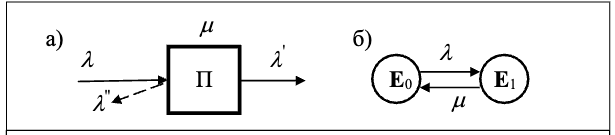
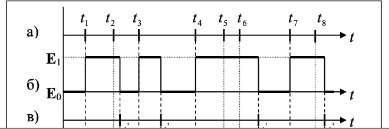
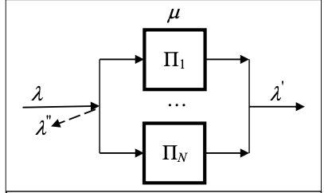
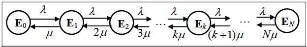

# Раздел 5. ЧИСЛЕННОЕ МОДЕЛИРОВАНИЕ (МОДЕЛИ СЛУЧАЙНЫХ ПРОЦЕССОВ)   第5部分：数值建模（随机过程模型）

«В задаче из N уравнений всегда будет N+1 неизвестная» (Уравнения Снэйфу)  
“在一个包含N个方程的任务中，总是会有N+1个未知数”（Snayfu方程）

При изучении сложных систем со стохастическим характером функционирования полезной математической моделью является случайный процесс, который развивается в зависимости от ряда случайных факторов. Примерами случайных процессов могут служить процессы поступления и передачи данных в телекоммуникационной сети, процессы выполнения задач и обмена данными с внешними устройствами в вычислительной системе и т.п.  
在研究具有随机特性复杂系统的过程中，随机过程是一种有用的数学模型。这种过程的演变依赖于一系列随机因素。例如，电信网络中的数据传输与接收过程，计算系统中任务的执行与外部设备的数据交换过程等，都可以被视为随机过程的实例。

Большинство моделей дискретных систем со стохастическим характером функционирования строится на основе моделей массового обслуживания, процессы в которых являются случайным и, во многих случаях, марковскими или некоторым образом связанные с марковскими процесссами. Поэтому для решения таких задач теории массового обслуживания может использоваться математический аппарат теории марковских процессов. Применение марковских процессов оказывается особенно эффективным и результативным при исследовании систем и сетей массового обслуживания с накопителями ограниченной ёмкости.  
大多数具有随机特性离散系统的模型基于排队论模型构建，这些模型中的过程是随机的，并且在许多情况下是马尔可夫过程，或与马尔可夫过程某种方式相关。因此，在解决排队论中的此类问题时，可以使用马尔可夫过程理论的数学工具。尤其是在研究具有有限容量缓冲器的排队系统与网络时，马尔可夫过程的应用表现得尤为有效和结果导向。

Математическое описание марковских процессов обычно представляется в виде систем дифференциальных (в случае нестационарного режима) или алгебраических (для стационарного режима) уравнений, решение которых, в общем случае, получить в явном виде не удается. Это обусловливает необходимость применения численных методов решения систем дифференциальных или алгебраических уравнений.  
马尔可夫过程的数学描述通常以微分方程组（非平稳模式下）或代数方程组（平稳模式下）的形式呈现。总体上，这些方程的显式解通常无法获得。这就导致了需要使用数值方法来求解微分方程组或代数方程组。

## 5.1. Понятие случайного процесса   随机过程的概念

Основными для случайных процессов являются понятия состояния и перехода из одного состояния в другое.  
随机过程的核心概念是“状态”和“从一个状态到另一个状态的转变”。

Случайный процесс находится в некотором состоянии, если он полностью описывается значениями переменных, которые задают это состояние.  
当一个随机过程完全由定义该状态的变量的值来描述时，我们称其处于某种状态。

Процесс совершает переход из одного состояния в другое, если описывающие ее переменные изменяются от значений, задающих одно состояние, на значения, которые определяют другое состояние.  
当描述该过程的变量的值从一个状态的定义值变为另一个状态的定义值时，过程即完成了从一个状态到另一个状态的转变。

Случайный процесс состоит в том, что с течением времени процесс переходит из одного состояния в другое заранее не известное состояние.  
随机过程的特点在于，随着时间的推移，该过程从一个状态转变到另一个状态，而这个新的状态事先是未知的。

Понятия «состояние» и «переход» используются как для описания случайного процесса, так и системы, в которой этот процесс протекает.  
“状态”和“转变”这两个概念既用于描述随机过程，也用于描述随机过程所在的系统。

Поэтому при моделировании реальных систем часто говорят о состоянии системы и переходе системы из одного состояния в другое.  
因此，在对实际系统进行建模时，通常会谈到系统的状态以及系统从一个状态到另一个状态的转变。

Если множество состояний, в которых может находиться процесс счётное, то есть все возможные состояния могут быть пронумерованы, то соответствующий процесс называется случайным процессом с дискретными состояниями или просто дискретным случайным процессом.  
如果随机过程可能的状态集合是可数的，也就是说所有可能的状态可以被编号，那么这个过程称为**具有离散状态的随机过程**，或者简称为**离散随机过程**。

В этом случае переменные, описывающие состояния случайного процесса, принимают либо целочисленные значения, либо вполне конкретные отделённые друг от друга дискретные значения. Обычно состояния дискретного случайного процесса определяются таким образом, чтобы каждое возможное состояние могло быть обозначено порядковым номером, при этом число возможных состояний системы может быть конечным: $E_1,E_2,\cdots, E_n$ или бесконечным: $E_1, E_2,\cdots, E_n$ (иногда состояния нумеруются, начиная с нуля: $E_0, E_1, \cdots, E_n$).  
在这种情况下，描述随机过程状态的变量要么取整数值，要么取一些彼此独立的、离散的具体值。通常情况下，离散随机过程的状态被定义为每种可能的状态都可以用一个顺序编号表示，这样系统的可能状态数量可以是有限的，例如：$E_1, E_2, \cdots, E_n$，或者是无限的，例如：$E_1, E_2, \cdots$（有时状态的编号从零开始，例如：$E_0, E_1, \cdots, E_n$）。  

Для случайного процесса с дискретными состояниями характерен скачкообразный переход из одного состояния в другое (рис.5.1,а). Например, случайный процесс, протекающий в простейшей СМО с однородным потоком заявок, может быть представлен количеством заявок, находящихся в системе в произвольный момент времени. Тогда состояние Ek случайного процесса и, следовательно, самой системы будет означать, что в СМО находится ровно $k = 0,1,2,\cdots$ заявок.  
对于离散状态的随机过程，其特点是从一个状态到另一个状态的**跳跃式转变**（如图5.1，a）。例如，在最简单的排队系统（СМО）中，一个随机过程可以用系统中任意时刻的请求数量来表示。此时，随机过程的状态 $E_k$，以及对应系统的状态，将表示在排队系统中恰好有 $k = 0, 1, 2, \cdots$ 个请求。

Если множество состояний не может быть пронумеровано, то имеем случайный процесс с непрерывными состояниями или просто непрерывный случайный процесс, для которого характерен плавный переход из состояния в состояние и который задаётся в виде непрерывной ункции времени: E(t) (рис.5.1,б). Например, процесс изменения температуры некоторого объекта может рассматриваться как случайный процесс с непрерывными состояниями.  
如果状态集合无法被编号，那么我们称之为具有连续状态的随机过程，或者简称为连续随机过程。这种过程的特点是状态之间的平滑过渡，并且该过程通常用时间的连续函数来表示：$E(t)$（如图5.1，б）。例如，某一物体温度的变化过程可以视为具有连续状态的随机过程。

Поскольку модели массового обслуживания относятся к классу дискретных систем, то в дальнейшем будут рассматриваться только случайные процессы с дискретными состояниями.  
由于排队论模型属于离散系统的范畴，接下来将仅研究具有离散状态的随机过程。

При описании дискретных систем в терминах случайных процессов одним из основных этапов является этап кодирования состояний, заключающийся в определении состава переменных и их значений, используемых для описания состояний. Состав переменных в значительной мере определяется назначением разрабатываемой модели, зависящим от целей исследований.  
在用随机过程的术语描述离散系统时，关键步骤之一是状态编码阶段。这一阶段的任务是确定用于描述状态的变量及其取值范围。变量的选择和组成通常由所开发模型的用途决定，而模型的用途又取决于研究的目标。

### 5.1.1. Случайные процессы с дискретными состояниями   具有离散状态的随机过程

Предположим, что система может находиться в одном из состояний $E1, E2, \cdots$ (часто состояния обозначаются просто номерами $1, 2,\cdots$). Пусть состояние системы меняется скачкообразно в зависимости от некоторого параметра $t$, причем переход из состояния в состояние является случайным. Будем называть параметр $t$ – временем и считать, что $t$ пробегает либо целые, либо действительные числа. Обозначим через $Z(t)$ случайный процесс, описывающий состояние системы в момент времени $t$.  
假设系统可以处于状态 $E_1, E_2, \cdots$ 中的某一个（通常状态直接用编号 $1, 2, \cdots$ 表示）。设系统的状态随着某个参数 $t$ 发生跳跃式变化，并且从一个状态到另一个状态的转变是随机的。我们将参数 $t$ 称为时间，并假定 $t$ 可以取整数值或实数值。用随机过程 $Z(t)$ 表示系统在时刻 $t$ 的状态。

Случайный процесс $Z(t)$ называется случайным процессом с дискретным временем, если переходы из состояния в состояние возможны только в строго определенные заранее фиксированные моменты времени, которые можно пронумеровать: $t1, t2,\cdots$.  
随机过程 $Z(t)$ 被称为具有离散时间的随机过程，如果状态间的转变只能在严格定义的、提前确定的时间点发生，这些时间点可以被编号为 $t_1, t_2, \cdots$。

Если промежуток времени между переходами из состояния в состояние является случайным и переход возможен в любой заранее не известный момент времени $t$, то процесс называется случайным процессом с непрерывным временем.  
如果状态间的转变时间间隔是随机的，并且转变可以发生在任何事先未知的时间 $t$，那么这个过程称为具有连续时间的随机过程。

Процесс с дискретным временем имеет место либо когда структура системы такова, что ее состояния могут изменяться только в заранее определенные моменты времени, либо когда предполагается, что для описания процесса достаточно знать состояние системы в отдельные моменты времени. Тогда эти моменты можно пронумеровать и говорить о состоянии  $E_i$  в момент $t_k$ или просто в момент $k (k = 0,1,2,\cdots)$.  
具有离散时间的过程适用于以下两种情况之一：要么系统的结构使其状态只能在预定的时间点发生变化，要么假设描述过程只需了解系统在某些特定时间点的状态即可。在这种情况下，这些时间点可以被编号，并用 $E_i$ 表示时刻 $t_k$ 或简单表示为时刻 $k$（$k = 0, 1, 2, \cdots$）的状态。

Процессы с дискретным временем называются стохастическими
последовательностями или случайными цепями.  
具有离散时间的过程被称为随机序列或随机链。

Случайные процессы с дискретными состояниями могут изображаться в виде графа переходов (состояний), в котором вершины соответствуют состояниям, а ориентированные дуги – переходам из одного состояния в другое.  
具有离散状态的随机过程可以通过状态转移图的形式表示，其中图的顶点表示状态，定向弧表示从一个状态转移到另一个状态的过程。

Граф переходов называется размеченным, если на дугах графа указаны условия перехода в виде вероятностей переходов (для процессов с дискретным временем) или интенсивностей переходов (для процессов с непрерывным временем).  
如果图中的弧标明了转移条件，例如转移概率（对于离散时间的过程）或转移强度（对于连续时间的过程），则该转移图称为标注图。

Состояния $E_i$ могут быть:   
状态 $E_i$ 可以具有以下特性：
- невозвратными, если процесс после какого-то числа переходов непременно покидает их;  
  不可返回状态：如果过程经过若干次转移后必然离开该状态，则称其为不可返回状态；
- поглощающими, если случайный процесс, достигнув этих состояний прекращается.  
  吸收状态：如果随机过程一旦达到该状态即终止，则称其为吸收状态。

Случайный процесс называется транзитивным, если из любого состояния можно перейти за то или иное число шагов в любое другое состояние и вернуться в исходное.  
一个随机过程被称为可迁移的（即传递性随机过程），如果可以从任意状态通过某些步数转移到任何其他状态，并最终返回到初始状态。

### 5.1.2. Понятие марковского случайного процесса   马尔可夫随机过程的概念

Случайный процесс называется марковским, если вероятность любого состояния в будущем зависит только от его состояния в настоящем и не зависит от того, когда и каким образом процесс оказался в этом состоянии.  
随机过程被称为马尔可夫过程，如果未来某一状态的概率仅依赖于当前状态，而与过程如何及何时到达该状态无关。

Описывающий поведение системы процесс $Z(t)$ называется цепью Маркова.  
描述系统行为的过程 $Z(t)$ 被称为马尔可夫链。

Для того чтобы случайный процесс с непрерывным временем был марковским, необходимо, чтобы интервалы времени между соседними переходами из состояния в состояние были распределены по экспоненциальному закону. Для доказательства последнего утверждения воспользуемся следующими рассуждениями.  
对于具有连续时间的随机过程，要使其成为马尔可夫过程，需满足一个条件：状态之间的转移时间间隔应服从指数分布。为了证明这一点，以下是推导过程：

Пусть время нахождения случайного процесса в некотором состоянии $E_i$ до его перехода в другое состояние $E_j$ распределено по экспоненциальному закону с функцией распределения  
假设随机过程从状态 $E_i$ 转移到状态 $E_j$ 所需的时间 $\tau$ 服从指数分布，其分布函数为：

$$F_{ij}(\tau)=1-e^{-\alpha_{ij}\tau}$$

где $\alpha_{ij}$ - параметр распределения, характеризующий частоту перехода из состояния $E_i$ в состояние $E_j$ и определяемый как величина, обратная среднему времени нахождения случайного процесса в состоянии $E_i$ до момента его перехода в состояние $E_j$.  
其中 $\alpha_{ij}$ 是分布参数，表征从状态 $E_i$ 转移到状态 $E_j$ 的频率。它等于随机过程在状态 $E_i$ 停留到转移到状态 $E_j$ 的平均时间的倒数。

Вычислим вероятность того, что случайный процесс перейдет в состояние $E_j$ в течение интервала времени $\Delta \tau$ при условии, что в состоянии $E_i$ процесс уже находится в течение времени $\tau_0$. Эта условная вероятность равна  
我们来计算随机过程从状态 $E_i$ 转移到状态 $E_j$ 的概率，这个过程已经在状态 $E_i$ 中停留了 $\tau_0$ 时间，并在接下来的时间间隔 $\Delta\tau$ 内完成了转移。其条件概率表达式如下：

$$P_{ij}(\Delta\tau|\tau\ge\tau_0)=Pr(\tau_0\le\tau\le\tau_0+\Delta\tau|\tau\ge\tau_0)=\\
=\frac{Pr(\tau_0\le\tau\le\tau_0+\Delta\tau)}{Pr(\tau\ge\tau_0)}=\frac{F(\tau_0+\Delta\tau)-F(\tau_0)}{1-F(\tau_0)}=1-e^{-\alpha_{ij}\Delta\tau}$$

Из последнего выражения следует, что вероятность перехода из одного состояния в другое зависит только от исходного состояния $E_i$ и не зависит от интервала времени $\tau_0$ , то есть от того, как долго находился процесс в состоянии $E_i$, а также от того, какие состояния предшествовали состоянию $E_i$. Другими словами, поведение случайного процесса не зависит от предыстории и определяется только его состоянием в настоящий момент, то есть процесс является марковским.  
根据最后一个表达式，得出结论：从一个状态转换到另一个状态的概率仅依赖于初始状态 $E_i$，与时间间隔 $\tau_0$（即过程在状态 $E_i$ 停留的时间长度）以及之前的状态无关。换句话说，随机过程的行为不依赖于历史，只由当前状态决定，即该过程是马尔科夫过程。

Еще одно замечательное свойство экспоненциального распределения вытекает из полученного выражения, а именно: если время нахождения случайного процесса в некотором состоянии $E_i$ до его перехода в другое состояние $E_j$ распределено по экспоненциальному закону с параметром ij , то интервал времени от любого случайного момента времени до момента перехода в состояние $E_j$ имеет такое же экспоненциальное распределение с тем же параметром $\alpha_{ij}$. Эта особенность является следствием отсутствия последействия, присущего всем процессам с экспоненциальным распределением времени нахождения в том или ином состоянии.  
从这个表达式中还可以得出另一个重要性质：如果随机过程在某个状态 $E_i$ 中停留的时间，直到它转换到另一个状态 $E_j$，遵循具有参数 $\alpha_{ij}$ 的指数分布，那么从任意一个随机时刻到转换到状态 $E_j$ 的时间间隔，也遵循相同的指数分布，并且具有相同的参数 $\alpha_{ij}$。这一特点是指数分布时间停留过程的特性，表明不存在滞后效应，适用于所有具有指数分布停留时间的过程。

Таким образом, безусловная $P_{ij}(\Delta\tau)$ и условная $P_{ij}(\Delta\tau|\tau\ge\tau_00)$ вероятности перехода в другое состояние за время $\Delta\tau$ для марковского процесса одинаковы и равны  
因此，对于马尔科夫过程，无条件概率 $P_{ij}(\Delta\tau)$ 和条件概率 $P_{ij}(\Delta\tau|\tau \ge \tau_0)$ 在时间 $\Delta\tau$ 内转换到另一个状态的概率是相同的，且相等。

$$P_{ij}(\Delta\tau)=P_{ij}(\Delta\tau|\tau\ge\tau_0)=1-e^{-\alpha_{ij}\Delta\tau}$$

Пусть интервал времени $\Delta\tau$ достаточно мал. Тогда, разлагая $e^{-\alpha_{ij}\Delta\tau}$ в ряд по степеням $\alpha_{ij}\Delta\tau$ при $\Delta\tau\to 0$ и пренебрегая величинами высшего порядка малости, получим вероятность перехода из одного состояния в другое за бесконечно малый интервал времени:  
假设时间间隔 $\Delta\tau$ 足够小。然后，将 $e^{-\alpha_{ij}\Delta\tau}$ 展开成关于 $\alpha_{ij}\Delta\tau$ 的级数，当 $\Delta\tau \to 0$ 时，并忽略高阶小量，我们得到在无穷小时间间隔内从一个状态转移到另一个状态的概率：

$$P_{ij}(\Delta\tau)=1-(1-\alpha_{ij}\Delta\tau)=\alpha_{ij}\Delta\tau\qquad(5.1)$$

## 5.2. Параметры и характеристики марковского случайного процесса   马尔可夫随机过程的参数和特性

### 5.2.1. Параметры марковского случайного процесса   马尔可夫随机过程的参数

Для описания марковского случайного процесса с дискретными состояниями используется следующая совокупность параметров:  
用于描述具有离散状态的马尔可夫随机过程的参数集合如下：

- перечень состояний $E_1, \cdots, E_n$ , в которых может находиться случайный процесс;   
  随机过程可能处于的状态列表 $E_1, \cdots, E_n$；
- матрица переходов, описывающая переходы случайного процесса между состояниями в виде:  
  描述随机过程在状态之间转换的转移矩阵，形式如下：
  - матрицы вероятностей переходов $Q$ для процессов с дискретным временем;   
    离散时间过程的转移概率矩阵 $Q$； 
  - матрицы интенсивностей переходов $G$ для процессов с непрерывным временем;   
    连续时间过程的转移强度矩阵 $G$； 
- начальные вероятности  $p_1(0),\cdots, p_n(0)$.  
  初始概率 $p_1(0), \cdots, p_n(0)$。

Для определения перечня состояний случайного процесса необходимо корректно решить задачу кодирования состояний, которое зависит от смысла, вкладываемого в понятие «состояние» для каждой конкретной системы. Так, например, состояние некоторой системы массового обслуживания (а, следовательно, и случайного процесса, протекающего в ней) может быть задано числом заявок, находящихся в системе в данный момент времени, а состояние сети массового обслуживания – распределением числа заявок по всем узлам сети.  
为了确定随机过程的状态集合，必须正确解决状态编码的问题，这取决于每个具体系统中“状态”这一概念所赋予的意义。例如，某些排队系统的状态（因此也包括其中发生的随机过程的状态）可以通过当前时刻系统中的请求数量来定义，而排队网络的状态则可以通过网络中所有节点上请求的分布来定义。

Для случайных процессов с дискретным временем изменения
состояний происходят только в определенные моменты времени $t_1, t_2,\cdots, t_k ,\cdots$. Переходы между состояниями описываются вероятностями переходов. Если непосредственный переход из одного состояния в другое невозможен, то вероятность, соответствующая данному переходу, равна нулю. Обозначим через $q_{ij}$ условную вероятность того, что в момент времени $t_{k+1}$ случайный процесс перейдет в состояние $E_j$ при условии, что в момент tk процесс находился в состоянии $E_i$. Если переход из состояния $E_i$ в $E_j$ зависит только от этих двух состояний, то есть условная вероятность $q_{ij}$ не изменяется при дополнительной информации о поведении процесса до момента  $t_k$, получим цепь Маркова.  
对于离散时间随机过程，状态变化只发生在特定的时间点 $t_1, t_2, \cdots, t_k, \cdots$。状态之间的转移由转移概率描述。如果从一个状态到另一个状态的直接转移不可行，则该转移的概率为零。用 $q_{ij}$ 表示条件概率，即在时刻 $t_{k+1}$ 随机过程转移到状态 $E_j$ 的条件概率，假设在时刻 $t_k$ 过程处于状态 $E_i$。如果从状态 $E_i$ 到 $E_j$ 的转移只依赖于这两个状态，即条件概率 $q_{ij}$ 在获取了关于过程行为的额外信息后不发生变化，那么我们得到的是马尔可夫链。

Цепь Маркова называется  однородной, если вероятности переходов не зависят от момента времени $t_k$ , и неоднородной, если вероятности переходов являются функциями $t_k$ , то есть $q_{ij} = q_{ij} (k)$ .  
如果转移概率不依赖于时间点 $t_k$，则称马尔可夫链为齐次的；如果转移概率是时间点 $t_k$ 的函数，即 $q_{ij} = q_{ij} (k)$，则称其为非齐次的。

Вероятности переходов задаются в виде квадратной матрицы вероятностей переходов $Q = [q_{ij} | i, j =\overline{1,n}]$, элементы которой удовлетворяют условиям:   
转移概率通常以转移概率矩阵的形式给出，记作 $Q = [q_{ij} | i, j = \overline{1,n}]$，其元素满足以下条件：

$$0\le q_{ij}\le 1; \sum_{j=1}^nq_{ij}=1\qquad(i,j=\overline{1, n})\qquad(5.2)$$

Матрица, элементы которой удовлетворяют указанным условиям,
называется стохастической.  
满足指定条件的矩阵称为随机矩阵。

Последнее условие в виде суммы элементов каждой строки матрицы вероятностей переходов, равной единице, означает, что в момент времени $t_k$ случайный процесс с вероятностью единица выполнит переход в одно из n возможных состояний, включая то же самое состояние, из которого этот переход осуществляется, то есть процесс может остаться в том же состоянии.  
最后一个条件是每一行转移概率矩阵元素之和等于一，这意味着在时刻 $t_k$，随机过程以概率 1 将转移到 n 个可能的状态之一，包括从该状态进行转移的状态本身，即过程可以保持在同一状态。

Для случайных процессов с непрерывным временем время между
переходами из одного состояния в другое случайно. Это означает, что вероятность перехода из одного состояния в другое не может быть задана, поскольку вероятность такого перехода точно в произвольный момент времени $t$ равна нулю. Для описания переходов между состояниями случайного процесса с непрерывным временем вместо вероятностей переходов вводится параметр, называемый интенсивностью перехода.  
对于具有连续时间的随机过程，从一个状态到另一个状态的过渡时间是随机的。这意味着无法给出从一个状态到另一个状态的过渡概率，因为在任意时刻 $t$ 发生这种过渡的概率为零。为了描述连续时间随机过程状态之间的过渡，引入了一个称为过渡强度的参数，来代替过渡概率。

Интенсивность перехода $g_{ij}$ из состояния $E_i$ в состояние $E_j$ определяется как предел отношения вероятности перехода $Pij(\Delta \tau)$ системы за промежуток времени $\Delta \tau$ из $E_i$ в $E_j$  к длине этого промежутка:  
从状态 $E_i$ 到状态 $E_j$ 的跃迁强度 $g_{ij}$ 定义为系统在时间间隔 $\Delta \tau$ 内，从 $E_i$ 到 $E_j$ 的跃迁概率 $P_{ij}(\Delta \tau)$ 与该时间间隔长度的比值的极限：

$$g_{ij}=\lim_{\Delta\tau\to0}\frac{P_{ij}(\Delta\tau)}{\Delta\tau}\qquad(i,j=\overline{1,n};i\ne j)\qquad(5.3)$$

Отсюда следует, что вероятность перехода за бесконечно малый промежуток времени $\Delta \tau$ равна: $g_{ij}\Delta \tau (i\ne j)$. Вероятность двух и более переходов за время $\Delta \tau$ имеет порядок $(\Delta \tau)^2$ и выше и предполагается бесконечно малой величиной.  
由此可得，对于无穷小时间间隔 $\Delta \tau$，跃迁的概率为：$g_{ij}\Delta \tau (i \ne j)$。两个或多个跃迁的概率在时间间隔 $\Delta \tau$ 内的阶数为 $(\Delta \tau)^2$ 及以上，因此可以认为它是一个无穷小量。

Если интенсивности переходов постоянны и не зависят от времени $t$, то есть от того, в какой момент начинается промежуток $\Delta \tau$, то марковский процесс называется однородным. Если интенсивности $g_{ij}$ представляют собой функции времени $t$, процесс называется неоднородным.  
如果跃迁强度是常数，并且不依赖于时间 $t$，即与时间间隔 $\Delta \tau$ 开始的时刻无关，那么该马尔可夫过程被称为齐次过程。如果跃迁强度 $g_{ij}$ 是时间 $t$ 的函数，则该过程被称为非齐次过程。

В дальнейшем будем рассматривать только однородные марковские процессы.  
接下来我们将只考虑齐次马尔可夫过程。

Интенсивности переходов задаются в виде квадратной матрицы
$G =[g_{ij} | i, j =\overline{1,n}]$, называемой матрицей интенсивностей переходов, диагональные элементы которой определяются из условия:  
跃迁强度由一个方阵表示： $G =[g_{ij} | i, j = \overline{1,n}]$，称为跃迁强度矩阵，其对角元素由以下条件确定：

$$\sum_{j=1}^ng_{ij}=0\qquad(i=\overline{1,n})$$

откуда

$$g_{ii}=-\sum_{j=1,j\ne i}^ng_{ij}\qquad(i,j=\overline{1,n})\qquad(5.4)$$

Матрица, в которой сумма элементов в каждой строке равна нулю, называется дифференциальной.  
一个矩阵，如果每一行的元素之和为零，称为微分矩阵。

Выше было показано, что в случае экспоненциального закона распределения времени нахождения случайного процесса в некотором состоянии вероятность перехода из одного состояния в другое за бесконечно малый интервал времени определяется выражением $(5.1)$ и равно $P_{ij}(\Delta\tau)=\alpha_{ij}\Delta\tau$ . Отсюда следует, что интенсивность перехода представляет собой параметр экспоненциального распределения:  
如上所示，在时间分布遵循指数分布的情况下，随机过程在某一状态下的停留时间的概率，表示从一个状态到另一个状态在无穷小时间间隔内的跃迁概率，可以通过表达式 $(5.1)$ 给出，即 $P_{ij}(\Delta\tau) = \alpha_{ij}\Delta\tau$。由此可以得出，跃迁强度是指数分布的参数：

$$g_{ij}=\lim_{\Delta\tau\to 0}\frac{P_{ij}(\Delta\tau)}{\Delta\tau}=\alpha_{ij}$$

Начальные вероятности  $p_1(0),\cdots, p_n(0)$ , где $p_i(0)$ – вероятность того, что в момент времени $t = 0$ система находится в состоянии $E_i(i =1,\cdots n)$ , задают состояние системы в начальный момент времени $t = 0$.  
初始概率 $p_1(0), \cdots, p_n(0)$，其中 $p_i(0)$ 是在时间 $t = 0$ 时系统处于状态 $E_i$（$i = 1, \cdots, n$）的概率，用于描述系统在初始时刻 $t = 0$ 的状态。

Начальные вероятности необходимы при изучении переходных процессов, когда исследуемая система работает в нестационарном режиме. Если марковский процесс обладает эргодическим свойством, что означает работу моделируемой системы в установившемся режиме, то, как будет показано ниже, стационарные характеристики (вероятности) не зависят от начальных вероятностей и, следовательно, могут быть не заданы.  
初始概率在研究过渡过程时是必需的，当研究的系统在非平稳模式下运行时。如果马尔可夫过程具有遍历性，即表示被模拟的系统在稳态模式下工作，那么正如下面将展示的，稳态特性（概率）不依赖于初始概率，因此可以不加以指定。

### 5.2.2. Характеристики марковского случайного процесса   马尔可夫随机过程的特征

Изучение случайных процессов заключается в определении вероятностей того, что в момент времени  $t$  система находится в том или ином состоянии. Совокупность таких вероятностей, описывающих состояния системы в различные моменты времени, дают достаточно полную информацию о протекающем в системе случайном процессе.  
研究随机过程的目的是确定在某一时刻 $t$ 系统处于某个特定状态的概率。这些描述系统在不同时间点状态的概率的集合，提供了关于系统中进行的随机过程的完整信息。

Рассмотрим систему с конечным числом состояний: $E_1, …, E_n$. Обозначим через $p_i(t)$ вероятность того, что в момент времени $t$ система находится в состоянии $E_i: p_i (t) = Pr\{Z(t) = E_i\}$.  
考虑一个具有有限个状态的系统：$E_1, …, E_n$。令 $p_i(t)$ 表示在时间 $t$ 时系统处于状态 $E_i$ 的概率，即 $p_i(t) = \Pr{Z(t) = E_i}$。

В любой момент времени  $t$  система может находиться в одном из $n$ возможных состояний, то есть для любого момента времени $t$ выполняется условие:  
在任何时刻 $t$，系统都可能处于 $n$ 个可能状态中的一个，因此，对于任意时刻 $t$，满足以下条件：

$$\sum_{i=1}^np_i(t)=1\qquad(5.5)$$

которое называется нормировочным.  
这个条件被称为归一化条件。

Совокупность вероятностей $p_i(t)$ может быть представлена вектором с числом координат, равным числу возможных состояний системы:  
概率集合 $p_i(t)$ 可以表示为一个向量，其坐标数等于系统的可能状态数，即：

$$P(t)=\{p_1(t),\cdots,p_n(t)\}$$

причем  
其中，

$$0\le p_i(t)\le 1;\qquad\sum_{i=1}^n p_i(t)=1\qquad(5.6)$$

Вектор, обладающий свойствами $(5.6)$, называется стохастическим.  
满足条件 $(5.6)$ 的向量称为随机向量。

Стохастический вектор называется вектором состояний, если его компоненты представляют собой вероятности состояний системы.  
如果随机向量的分量表示系统状态的概率，则该向量称为状态向量。

Вектор состояний $P(t)=\{p_1(t),\cdots,p_n(t)\}$ является основной характеристикой марковского случайного процесса. На основе полученных значений вероятностей состояний случайного процесса, протекающего в исследуемой системе, могут быть рассчитаны представляющие интерес реальные характеристики системы, например для системы массового обслуживания могут быть рассчитаны длины очередей заявок.  
状态向量 $P(t) = {p_1(t), \cdots, p_n(t)}$ 是马尔可夫随机过程的基本特征。根据已获得的状态概率值，可以计算出系统的实际特性，例如，对于排队系统，可以计算请求队列的长度。

## 5.3 Методы расчета марковских моделей   马尔可夫模型的计算方法

### 5.3.1. Эргодическое свойство случайных процессов   5.3.1. 随机过程的遍历性特性

Если по истечении достаточно большого промежутка времени вероятности состояний стремятся к предельным значениям $p_1,\cdots, p_n$ , не зависящим от начальных вероятностей $p_1(0),\cdots, p_n(0)$ и от текущего момента времени $t$ , то говорят, что случайный процесс обладает эргодическим свойством. Таким образом, для процессов, обладающих эргодическим свойством:  
如果经过足够长的时间，状态的概率趋向于极限值 $p_1, \cdots, p_n$，这些极限值不依赖于初始概率 $p_1(0), \cdots, p_n(0)$ 或当前时刻 $t$，则称该随机过程具有遍历性特性。因此，对于具有遍历性特性的过程：

$$\lim_{t\to \infty}P(t)=P(\infty)=P$$

где $P = (p_1,\cdots, p_n)$ – вектор вероятностей состояний системы, называемых стационарными вероятностями.  
其中 $P = (p_1, \cdots, p_n)$ 是系统状态的概率向量，称为稳态概率。

В системе, описываемой марковским случайным процессом, обладающим эргодическим свойством, при $t \to \infty$ устанавливается некоторый предельный режим, при котором характеристики функционирования системы не зависят от времени. В этом случае говорят, что система работает в установившемся или стационарном режиме. Если характеристики функционирования системы зависят от времени, то имеем неустановившийся режим.  
对于描述具有遍历性特性的马尔可夫随机过程的系统，当 $t \to \infty$ 时，系统将达到某种极限状态，此时系统的运行特性不再依赖于时间。在这种情况下，称系统处于稳定或稳态模式。如果系统的运行特性依赖于时间，则处于非稳态模式。

Отметим, что для стационарных вероятностей pi должно выполняться нормировочное условие $(5.5)$.  
需要注意的是，对于稳态概率 $p_i$，必须满足归一化条件 $(5.5)$。

При рассмотрении случайных процессов возникает вполне резонный вопрос: когда случайный процесс обладает эргодическим свойством?  
在研究随机过程时，常常会提出一个合理的问题：何时随机过程具有遍历性特性？

Случайный процесс с дискретным временем обладает эргодическим свойством, если матрица вероятностей переходов не является периодической или разложимой.  
离散时间的随机过程具有遍历性特性，当且仅当其跃迁概率矩阵不是周期性的或者是可分解的。

Матрица является разложимой, если она может быть приведена к одному из следующих видов:  
如果矩阵是可分解的，那么它可以转化为以下几种形式之一：

$$1)\begin{bmatrix}
    A & 0\\
    0 & D
\end{bmatrix}, \qquad 2)\begin{bmatrix}
    A & 0\\
    C & D
\end{bmatrix}, \qquad 3)\begin{bmatrix}
    A & B\\
    0 & D
\end{bmatrix}$$

где $A, B, C, D$– ненулевые квадратные подматрицы; $0$ – нулевая квадратная подматрица.  
其中 $A, B, C, D$ 是非零的方阵子矩阵；$0$ 是零的方阵子矩阵。

В первом случае состояния, соответствующие подмножествам $A$ и $D$, называются замкнутыми, так как система, находясь в каком-то состоянии одного из этих подмножеств, никогда не сможет перейти в какое-либо состояние другого подмножества. Состояния, соответствующие подмножеству $D$ во втором случае и подмножеству $A$ в третьем случае, называются невозвратными, поскольку после того, как процесс покинет эти состояния, невозможен обратный переход в эти состояния из состояний, соответствующих другим подмножествам.  
在第一种情况下，分别对应子集 $A$ 和 $D$ 的状态被称为闭合状态，因为系统在这些子集中的某个状态下时，永远无法转移到另一个子集中的任何状态。在第二种情况下，表示子集 $D$ 的状态，在第三种情况下，表示子集 $A$ 的状态被称为不可返回状态，因为一旦过程离开这些状态，就无法从其他子集中的状态返回到这些状态。

Матрица является периодической, если она может быть приведена к виду:  
如果矩阵可以转化为以下形式，则称其为周期性的：

$$\begin{bmatrix}
    0 & B\\
    C & 0
\end{bmatrix}$$

Случайный процесс в этом случае будет по очереди переходить из состояний, соответствующих B, в состояния, соответствующие С.  
在这种情况下，随机过程将按顺序从对应于 $B$ 的状态转移到对应于 $C$ 的状态。

Итак, если матрица вероятностей переходов $Q = [q_{ij} | i, j =\overline{1,n}]$, случайного процесса с дискретным временем не является периодической или разложимой, то процесс обладает эргодическим свойством:   
因此，如果离散时间的随机过程的跃迁概率矩阵 $Q = [q_{ij} | i, j = \overline{1, n}]$ 不是周期性的或不可分解的，那么该过程具有遍历性特性：

$$\lim_{k\to\infty}p_i(k)=p_i\qquad(i=\overline{1,n})\qquad(5.7)$$

Транзитивный случайный процесс с непрерывным временем и
конечным числом состояний, среди которых нет невозвратных и поглощающих состояний, всегда обладает эргодическим свойством:  
具有有限个状态的连续时间可传递随机过程，且这些状态中没有不可返回状态和吸收状态时，始终具有遍历性特性。

$$\lim_{t\to\infty}p_i(t)=p_i\qquad(i=\overline{1,n})\qquad(5.8)$$

### 5.3.2. Марковские процессы с дискретным временем   离散时间的马尔可夫过程

Для однородного марковского процесса с дискретным временем вероятности состояний на момент времени $t_k$ определяются на основе следующего рекуррентного выражения:  
对于齐次离散时间马尔可夫过程，在时刻 $t_k$ 的状态概率通过以下递推公式来确定：

$$p_j(k)=\sum_{i=1}^np_i(k-1)q_{ij}\qquad(j=\overline{1,n};k=1,2,\cdots)\qquad(5.9)$$

Если рассматриваемый марковский процесс обладает эргодическим свойством, то, согласно $(5.7)$, при $k \to \infty$ вероятности состояний $p_i(k)$ стремятся к стационарным значениям $p_i$ , не зависящим от момента времени $t_k$ и начальных вероятностей $p_i(0)$. С учётом этого, выражение $(5.9)$ может быть преобразовано к виду:  
如果所考虑的马尔可夫过程具有遍历性特性，那么根据 $(5.7)$，当 $k \to \infty$ 时，状态概率 $p_i(k)$ 将趋向于稳态值 $p_i$，这些值不依赖于时间点 $t_k$ 或初始概率 $p_i(0)$。考虑到这一点，公式 $(5.9)$ 可以转化为以下形式：

$$p_j=\sum_{i=1}^np_iq_{ij}\qquad(j=\overline{1,n})\qquad(5.10)$$

а нормировочное условие $(5.5)$ примет вид:  
归一化条件 $(5.5)$ 将变为：

$$\sum_{i=1}^np_i=1\qquad(5.11)$$

Уравнения $(5.10)$ с условием $(5.11)$ образуют систему линейных алгебраических уравнений для расчёта стационарных вероятностей состояний марковского процесса, которая обладает единственным решением, если $Q$ – эргодическая матрица.  
方程 $(5.10)$ 及条件 $(5.11)$ 组成了用于计算马尔可夫过程状态的平稳概率的线性代数方程组。当 $Q$ 是遍历矩阵时，该系统具有唯一解。

Доказательство выражения $(5.9)$.  
$(5.9)$ 表达式的证明：

Рассмотрим однородный марковский процесс с дискретным временем, который может находиться в одном из n возможных состояний: $Е_1, \cdots, Е_n$. Вероятности переходов $q_{ij}$ заданы в виде матрицы переходов $Q =[q_{ij} | i, j =\overline{1,n}]$, а начальные вероятности на момент времени $t_0 = 0$ в виде вектора $P = {p_1(0),\cdots, p_n(0)}$.  
我们考虑一个具有离散时间的齐次马尔可夫过程，其可以处于 $n$ 个可能状态中的一个：$E_1, \cdots, E_n$。转移概率 $q_{ij}$ 以转移矩阵的形式给出：$Q = [q_{ij} | i, j =\overline{1,n}]$，初始时刻 $t_0 = 0$ 的概率以向量形式表示为 $P = {p_1(0),\cdots, p_n(0)}$。

Найдем вероятности состояний марковского процесса после первого шага, то есть на момент времени $t_1$. По формуле полной вероятности получим:  
我们计算马尔可夫过程在第一个步长之后，即时刻 $t_1$ 的状态概率。根据全概率公式，可以得出：

$$\begin{cases}
    p_1(1)=p_1(0)q_{11} + p_2q_{21} + \cdots + p_n(0)q_{n1};\\
    p_2(1)=p_1(0)q_{12} + p_2q_{22} + \cdots + p_n(0)q_{n2};\\
    \cdots\\
    p_n(1)=p_1(0)q_{1n} + p_2q_{2n} + \cdots + p_n(0)q_{nn};\\
\end{cases}$$

или в компактной форме:  
或者以紧凑形式表示为：

$$p_j(1)=\sum_{i=1}^np_i(0)q_{ij}\qquad(j=\overline{1,n})$$

Вероятности состояний после второго шага на момент времени $t_2$ определяются аналогично:  
第一个步长后的状态概率计算完成后，第二个步长对应的时刻 $t_2$ 的状态概率同样可按照类似方式计算：

$$p_j(2)=\sum_{i=1}^np_i(1)q_{ij}\qquad(j=\overline{1,n})$$

После $k$-го шага на момент времени $t_k (k =1,2,\cdots)$ вероятности состояний будут определяться как  
在第 $k$ 个步长之后，即时刻 $t_k$ ($k = 1, 2, \cdots$)，状态概率将被确定为：

$$p_j(k)=\sum_{i=1}^np_i(k-1)q_{ij}\qquad(j=\overline{1,n})$$

что и требовалось доказать.  
这正是我们需要证明的内容。

**Пример.** Рассмотрим систему, которая состоит из двух устройств $У_1$ и $У_2$, каждое из которых может находиться в одном из двух состояний: 0 – выключено и 1 – включено. В определённые моменты времени устройства могут включаться или выключаться. Выделим возможные состояния системы:  
示例：考虑一个包含两个设备的系统 $U_1$ 和 $U_2$，其中每个设备可以处于以下两种状态之一：0：关闭，1：开启。在某些时刻，这些设备可以开启或关闭。现在我们列出系统的可能状态：

$$\begin{array} {c|cccc}
    E_i & E_0 & E_1 & E_2 & E_3\\
    \hline
    У_1 & 0 & 1 & 0 & 1\\
    У_1 & 0 & 0 & 1 & 1\\
\end{array}$$

Состояние $E_0$ соответствует простою системы, когда оба устройства выключены, а состояние $E_3$ соответствует случаю, когда оба устройства включены.  
状态 $E_0$ 表示系统空闲，此时两个设备均处于关闭状态，而状态 $E_3$ 表示两个设备均处于开启状态。

Положим, что заданы вероятности переходов в виде матрицы  
假设转移概率以矩阵形式给出：

$$Q=\begin{array}{c|cccc}
     & E_0 & E_1 & E_2 & E_3\\
    \hline
    E_0 & 0 & 0.2 & 0.5 & 0.3\\
    E_1 & 0.5 & 0 & 0.1 & 0.4\\
    E_2 & 0.5 & 0 & 0 & 0.5\\
    E_3 & 0 & 0.4 & 0.6 & 0\\
\end{array}$$

и начальные вероятности $p_0(0) = 0,8; p_1(0) = 0,2; p_2(0) = 0; p_3(0) = 0$.  
初始概率为 $p_0(0) = 0.8; p_1(0) = 0.2; p_2(0) = 0; p_3(0) = 0$。

Определим вероятности нахождения системы в том или ином состоянии на различные моменты времени.  
我们需要确定系统在不同时刻处于某一状态的概率。

Согласно выражению $(5.9)$ вероятности состояний системы:  
根据公式 $(5.9)$，系统状态的概率为：

- на момент времени $t_1$: 
  $$p_0(1)=p_0(0)q_{00} + p_1(0)q_{10} + p_2(0)q_{20} + p_3(0)q_{30} = 0.1;\\
  p_1(1)=p_0(0)q_{01} + p_1(0)q_{11} + p_2(0)q_{21} + p_3(0)q_{31} = 0.16;\\
  p_2(1)=p_0(0)q_{02} + p_1(0)q_{12} + p_2(0)q_{22} + p_3(0)q_{32} = 0.42;\\
  p_3(1)=p_0(0)q_{03} + p_1(0)q_{13} + p_2(0)q_{23} + p_3(0)q_{33} = 0.32;\\$$
- на момент времени $t_2$: 
  $$p_0(2)=p_0(1)q_{00} + p_1(1)q_{10} + p_2(1)q_{20} + p_3(1)q_{30} = 0.29;\\
  p_1(2)=p_0(1)q_{01} + p_1(1)q_{11} + p_2(1)q_{21} + p_3(1)q_{31} = 0.148;\\
  p_2(2)=p_0(1)q_{02} + p_1(1)q_{12} + p_2(1)q_{22} + p_3(1)q_{32} = 0.258;\\
  p_3(2)=p_0(1)q_{03} + p_1(1)q_{13} + p_2(1)q_{23} + p_3(1)q_{33} = 0.304;\\$$

Аналогично вероятности состояний системы могут быть рассчитаны на моменты времени $t_3,t_4,\cdots$  
类似地，系统状态的概率可以计算在时刻 $t_3, t_4, \cdots$。

Нетрудно убедиться, что сумма вероятностей состояний системы на каждый момент времени равна единице: $p_0(k) + p_1(k) + p_2(k) + p_3(k) =1$ для $k = 1,2,\cdots$  
不难验证，系统在每一时刻的状态概率之和等于1：$p_0(k) + p_1(k) + p_2(k) + p_3(k) = 1$，其中 $k = 1, 2, \cdots$。

Матрица вероятностей переходов рассматриваемой системы – неразложимая и непериодическая, следовательно, случайный процесс обладает эргодическим свойством, и вероятности состояний системы для стационарного режима (стационарные вероятности) $p_0, p_1, p_2, p_3$ могут быть найдены из системы линейных алгебраических уравнений $(5.10)$ с учётом нормировочного условия $(5.11)$:  
所研究系统的转移概率矩阵是不可约且非周期性的，因此随机过程具有遍历性（ergodicity）的性质，并且系统在稳态下的状态概率（稳态概率）$p_0, p_1, p_2, p_3$ 可以通过线性代数方程组 $(5.10)$ 结合归一化条件 $(5.11)$ 求解：

$$\begin{cases}
    p_0=p_0q_{00}+p_1q_{10}+p_2q_{20}+p_3q_{30}=0.5p_1+0.5p_2\\
    p_1=p_0q_{01}+p_1q_{11}+p_2q_{21}+p_3q_{31}=0.2p_0+0.4p_3\\
    p_2=p_0q_{02}+p_1q_{12}+p_2q_{22}+p_3q_{32}=0.5p_0+0.1p_1+0.6p_3\\
    p_3=p_0q_{03}+p_1q_{13}+p_2q_{23}+p_3q_{33}=0.3p_0+0.4p_1+0.5p_2\\
    p_0+p_1+p_2+p_3=1
\end{cases}$$

Решая систему уравнений, получим значения стационарных вероятностей: $p_0=\frac{13}{55}\approx0.236, p_1=\frac{9}{55}\approx0.164,p_2=\frac{17}{55}\approx0.309,p_3=\frac{16}{55}\approx0.291$.  
解得方程组后，稳态概率的值为：$p_0 = \frac{13}{55} \approx 0.236$, $p_1 = \frac{9}{55} \approx 0.164$, $p_2 = \frac{17}{55} \approx 0.309$, $p_3 = \frac{16}{55} \approx 0.291$。

Таким образом, система будет простаивать 23,6% времени, а более 76% времени система будет находиться в рабочем состоянии, причем почти 30% времени (точнее 29,1%) во включённом состоянии будут одновременно находиться оба устройства системы. Среднее число устройств, находящихся одновременно во включённом состоянии, будет равно: $M=p_1+p_2+2p_3=1.055$, то есть во включённом состоянии находится в среднем одно устройство.  
因此，系统将有 23.6% 的时间处于空闲状态，而超过 76% 的时间系统将处于工作状态。其中，将近 30% 的时间（确切地说为 29.1%），系统的两个设备同时处于开启状态。同时处于开启状态的设备的平均数量为：$M = p_1 + p_2 + 2p_3 = 1.055$，即平均有一个设备处于开启状态。

### 5.3.3. Марковские процессы с непрерывным временем   连续时间马尔可夫过程

Для однородного марковского процесса с непрерывным временем вероятности состояний на произвольный момент времени $t$ определяются из системы дифференциальных уравнений:  
对于具有连续时间的齐次马尔可夫过程，在任意时刻 $t$ 的状态概率由以下微分方程组确定：

$$\frac{ {\rm d} p_j(t)}{ {\rm d}t}=\sum_{i=1}^np_i(t)g_{ij}\qquad(j=\overline{1,n};t\gt 0)\qquad(5.12)$$

с учетом начальных условий $p_1(0),\cdots, p_n(0)$.  
结合初始条件 $p_1(0), \cdots, p_n(0)$。

Для систем обладающих эргодическим свойством, имеет место стационарный режим, для которого, согласно (5.8), вероятности состояний $p_1,\cdots, p_n$ при $t \to\infty$ не зависят от начальных вероятностей и текущего момента времени $t$, и система дифференциальных уравнений $(5.12)$ для установившегося режима преобразуется в систему линейных алгебраических уравнений:  
对于具有遍历性（ergodicity）性质的系统，存在稳态模式。在此模式下，根据公式 $(5.8)$，当 $t \to \infty$ 时，状态概率 $p_1, \cdots, p_n$ 不再依赖于初始概率和当前时间 $t$。此时，微分方程组 $(5.12)$ 对于稳态模式转化为线性代数方程组：

$$\sum_{i=1}^n p_ig_{ij}=0\qquad(j=\overline{1,n})\qquad(5.13)$$

которая совместно с нормировочным условием $(5.11)$ образует систему, обладающую единственным решением.  
与规范条件 $(5.11)$ 共同组成了具有唯一解的系统。

**Доказательство выражений $(5.12)$ и $(5.13)$.**  
证明表达式 $(5.12)$ 和 $(5.13)$。

Рассмотрим однородный марковский процесс с непрерывным временем, который может находиться в одном из n возможных состояний: $Е_1, \cdots, Е_n$. Интенсивности переходов $q_{ij}$ заданы в виде матрицы $G =[g_{ij} | i, j =\overline{1,n}]$, в которой диагональные элементы рассчитаны в соответствии с формулой $(5.4)$. Начальные вероятности на момент времени $t = 0$ заданы в виде вектора $P = {p_1(0),\cdots, p_n(0)}$.  
考虑一个具有连续时间的齐次马尔可夫过程，该过程可以处于 $n$ 个可能状态中的任意一个：$E_1, \cdots, E_n$。其转移强度 $q_{ij}$ 由矩阵 $G = [g_{ij} | i, j = \overline{1,n}]$ 给出，其中对角线元素根据公式 $(5.4)$ 计算。在时间 $t = 0$ 时的初始概率以向量 $P = {p_1(0), \cdots, p_n(0)}$ 给出。

Определим вероятность $p_j (t)$ того, что в момент времени $t \gt 0$ случайный процесс находится в состоянии $E_j$.  
我们定义 $p_j(t)$ 为时间 $t \gt 0$ 时，随机过程处于状态 $E_j$ 的概率。

Придадим времени $t$ малое приращение $\Delta t$ и найдем вероятность $p_j(t+\Delta t)$ того, что случайный процесс в момент времени $(t + \Delta t)$ окажется в состоянии $E_j$.  
将时间 $t$ 增加一个小增量 $\Delta t$，并求出随机过程在时间 $(t + \Delta t)$ 时处于状态 $E_j$ 的概率 $p_j(t+\Delta t)$。

Случайный процесс может оказаться в состоянии $E_j$ в момент $(t+\Delta t)$ двумя способами:  
随机过程在时间 $(t + \Delta t)$ 处于状态 $E_j$ 有两种可能方式：

1. в момент времени $t$ процесс находился в состоянии $E_j$ и в течение промежутка времени t не перешел в другое состояние;  
   在时间 $t$ 随机过程已经处于状态 $E_j$，并且在 $\Delta t$ 时间间隔内没有转移到其他状态；
2. в момент времени $t$ процесс находился в состоянии $E_i (i \ne j)$ и за время $\Delta t$ совершил переход в состояние $E_j$.  
   在时间 $t$ 随机过程处于状态 $E_i (i \ne j)$，并且在 $\Delta t$ 时间内转移到状态 $E_j$。

Вероятность первого способа $p_j^{(1)}(t + \Delta t) j$ найдем как произведение вероятности $p_j (t)$ того, что в момент времени $t$ случайный процесс находился в состоянии $E_j$ , на условную вероятность того, что, будучи в $E_j$, процесс не перешел в другие состояния $E_i (i=1, 2,\cdots, j−1, j+1,\cdots,n)$. Эта условная вероятность равна  
第一种情况的概率 $p_j^{(1)}(t + \Delta t)$ 可以表示为，随机过程在时间 $t$ 处于状态 $E_j$ 的概率 $p_j(t)$，乘以在处于状态 $E_j$ 的条件下，过程未转移到其他状态 $E_i (i = 1, 2, \cdots, j-1, j+1, \cdots, n)$ 的条件概率。该条件概率等于...

$$1-\sum_{i=1,i\ne j}^ng_{ij}\Delta t$$

Последнее выражение становится очевидным, если вспомнить, что произведение $g_{ji} \Delta t$ с точностью до бесконечно малых высших порядков определяет вероятность перехода случайного процесса из состояния $E_j$ в состояние $E_i$ за промежуток времени $\Delta t$ , а сумма этих вероятностей есть вероятность перехода из состояния $E_j$ в любое другое состояние, не совпадающее с $E_j$ . Вычитая эту сумму из единицы, получим требуемую вероятность противоположного события.  
最后的表达式变得显而易见，如果回想一下，乘积 $g_{ji} \Delta t$ 在忽略无穷小高阶项的情况下，定义了随机过程从状态 $E_j$ 转移到状态 $E_i$ 的概率，时间间隔为 $\Delta t$，而这些概率的总和就是从状态 $E_j$ 转移到任何其他非 $E_j$ 状态的转移概率。将这个总和从 1 中减去，我们就得到了对立事件的所需概率。

Таким образом, вероятность первого способа с учетом выражения $(5.4)$ равна   
因此，考虑到表达式 $(5.4)$，第一种情况的概率为：

$$p_j^(1)(t+\Delta t)=p_j(t)(1+g_{jj}\Delta t) (h=\overline{1, n})$$

Аналогично определяется вероятность $p_j^{(2)}(t +\Delta t)$ второго способа оказаться в состоянии $E_j$ в момент $(t + \Delta t)$ : она равна вероятности $p_j(t)$ того, что в момент времени $t$ процесс находился в состоянии $E_i$ , умноженной на вероятность $g_{ij} \Delta t$ перехода за время $\Delta t$ в состояние $E_j : p_i(t)g_{ij}\Delta t$. Суммируя эти вероятности по всем возможным состояниям, исключая состояние $E_j$ , получим искомую вероятность:  
类似地，可以定义第二种方法在时刻 \( t + \Delta t \) 进入状态 \( E_j \) 的概率 \( p_j^{(2)}(t + \Delta t) \)：它等于在时刻 \( t \) 过程处于状态 \( E_i \) 的概率 \( p_i(t) \)，再乘以在时间 \( \Delta t \) 内从状态 \( E_i \) 转移到状态 \( E_j \) 的概率 \( g_{ij} \Delta t \)：即 \( p_i(t) g_{ij} \Delta t \)。将这些概率对所有可能的状态求和（排除状态 \( E_j \)），即可得到所求的概率。

$$p_j^{(2)}(t+\Delta t)=\sum_{i=1,i\ne j}^n p_i(t)g_{ij}\Delta t\qquad(j=\overline{1,n})$$

Применив правило сложения вероятностей, получим вероятность нахождения случайного процесса в состоянии $E_j$ в момент времени $(t + \Delta t)$:  
应用概率加法法则，我们可以得到随机过程在时刻 $t + \Delta t$ 处于状态 $E_j$ 的概率：

$$p_j(t+\Delta t)=p_j^{(1)}(t+\Delta t)+p_j^{(t)}(t+\Delta t)=(1+g_{jj}\Delta t)+\sum_{i=1,i\ne j}^n p_i(t)g_{ij}\Delta t$$

или $p_j(t+\Delta t)-p_j(t)=\sum_{i=1}^n p_i(t)g_{ij}\Delta t\qquad(j=\overline{1,n})$

Левая часть полученного выражения представляет собой производную по времени от функции $p_j (t)$ :  
左侧的表达式表示的是函数 $p_j (t)$ 对时间的导数：

$$\frac{ {\rm d} p_{j}(t)}{ {\rm d} t}=\sum_{i=1}^n p_i(t)g_{ij}\qquad(j=\overline{1,n})\qquad(5.14)$$

Таким образом, получена система дифференциальных уравнений марковского случайного процесса, которая при заданных начальных условиях $P = {p_1(0),\cdots, p_n(0)}$ позволяет выполнить исследование нестационарного (переходного) режима работы моделируемой системы путем расчёта вероятностей состояний марковского процесса в произвольный момент времени $t \gt 0$.  
因此，得到了一个马尔科夫随机过程的微分方程系统，在给定初始条件 $P = {p_1(0), \cdots, p_n(0)}$ 的情况下，可以通过计算马尔科夫过程在任意时刻 $t \gt 0$ 的状态概率，研究模拟系统的非平稳（过渡）工作状态。

Для случайных процессов, обладающих эргодическим свойством, имеет место стационарный режим, для которого согласно (5.8) вероятности состояний при $t \to \infty$ не зависят от начальных вероятностей и текущего момента времени $t$. Тогда производные $\frac{ {\rm d}p_j(t)}{ {\rm d}t}=0$, и система дифференциальных уравнений $(5.14)$ преобразуется в систему линейных алгебраических уравнений $(5.13)$.  
对于具有遍历性质的随机过程，存在稳态模式，根据（5.8）公式，在 $t \to \infty$ 时状态的概率不依赖于初始概率和当前时刻 $t$。此时，导数 $\frac{ {\rm d}p_j(t)}{ {\rm d}t}=0$，微分方程组 $(5.14)$ 转化为线性代数方程组 $(5.13)$。

Пример. В качестве примера марковского процесса с непрерывным временем рассмотрим модель «гибели и размножения», которая часто встречается в разнообразных практических задачах. Своим названием эта модель обязана биологической задаче об изменении численности популя- ции и распространении эпидемий, которая формулируется следующим образом.  
示例。作为一个连续时间马尔科夫过程的例子，考虑“死亡与繁殖”模型，这个模型在各种实际问题中经常出现。这个模型的名称来源于生物学问题，涉及到种群数量变化和传染病的传播，问题的表述如下。

Рассмотрим развитие некоторой популяции, особи которой могут рождаться и умирать. Положим, что при наличии $i$ особей в популяции рождение новых особей происходит с интенсивностью $\lambda_i$ и с интенсив- ностью $\mu_i$ – особи умирают. Пусть в любой момент времени может происходить рождение или гибель только одной особи, и интервалы времени между двумя моментами рождения и гибели распределены по экспоненциальному закону с параметрами $\lambda_i$ и $\mu_i$ соответственно. Тогда процесс "гибели и размножения" может быть представлен марковским случайным процессом с непрерывным временем (рис.5.1,а), в котором состояние  $E_i$  соответствует наличию i особей в популяции $(i=0, 1, \cdots)$, причем число состояний может быть конечным или бесконечным. Отметим, что состояние  $E_0$ соответствует вырождению популяции.  
考虑某一群体的发展，该群体中的个体可以出生和死亡。假设在群体中有 $i$ 个个体时，新个体的出生率为 $\lambda_i$，死亡率为 $\mu_i$。设在任何时刻，只有一个个体可以出生或死亡，并且出生和死亡之间的时间间隔符合指数分布，参数分别为 $\lambda_i$ 和 $\mu_i$。因此，“死亡与繁殖”过程可以表示为一个连续时间的马尔科夫随机过程（图 5.1(a)），其中状态 $E_i$ 对应于群体中有 $i$ 个个体 $(i=0, 1, \cdots)$，并且状态的数量可以是有限的或无限的。需要注意的是，状态 $E_0$ 对应于群体的灭绝。

Таким образом, марковский процесс называется «процессом гибели и размножения», если её граф переходов имеет вид цепочки состояний, в которой каждое состояние (кроме крайних) связано с двумя соседними состояниями, а крайние состояния $E_0$ и $E_n$ (в случае конечного числа состояний) или только нулевое состояние $E_0$ (в случае бесконечного числа состояний) – только с одним соседним состоянием.  
因此，马尔科夫过程被称为“死亡与繁殖过程”，如果其转移图呈现为一个状态链，其中每个状态（除了极端状态）都与两个相邻状态相连，而极端状态 $E_0$ 和 $E_n$（当状态数有限时）或只有零状态 $E_0$（当状态数无限时）只与一个相邻状态相连。

Рис. 5.2. Графы состояний процесса гибели и размножения с бесконечным (а) и конечным (б) числом состояний  
图 5.2. 死亡与繁殖过程的状态图，分别表示无限状态数（a）和有限状态数（b）。

Диагональные элементы матрицы определяются из условия (5.4) – сумма элементов каждой строки должна быть равна нулю.  
矩阵的对角元素由条件（5.4）确定——每行元素的和必须为零。

Система линейных алгебраических уравнений для определения стационарных вероятностей может быть составлена по графу переходов или по матрице интенсивностей переходов.  
为了确定稳态概率，可以根据转移图或转移强度矩阵来构建线性代数方程组。

Сформулируем правила составления уравнений для стационарных вероятностей состояний марковского процесса с непрерывным временем по графу переходов и по матрице интенсивностей переходов.  
我们将制定通过转移图和转移强度矩阵来为连续时间马尔科夫过程的状态稳态概率编写方程的规则。

Правило 1 (по графу переходов). В левой части каждого уравнения записывается вероятность рассматриваемого состояния, умноженная на сумму интенсивностей переходов из данного состояния во все другие состояния. Правая часть уравнения представляет собой сумму членов, число которых равно числу входящих в данное состояние дуг, и каждый такой член представляет собой произведение интенсивности перехода, соответствующей данной дуге, на вероятность состояния, из которого исходит эта дуга.  
规则 1（根据转移图）。每个方程的左边是所考虑状态的概率，乘以从该状态到所有其他状态的转移强度的总和。方程的右边是一个和，其中项的数量等于进入该状态的弧的数量，每个项是转移强度与离开该弧的状态的概率的乘积。

Для нашего примера применение правила 1 дает следующую систему линейных алгебраических уравнений:  
对于我们的例子，应用规则 1 得到以下线性代数方程组：

$$
\begin{cases}
    \lambda_0 p_0=\mu_1 p_1\\
    (\lambda_1 + \mu_1)p_1=\lambda_0 p_0 +\mu_2p_2\\
    \cdots\\
    (\lambda_k + \mu_k)p_k = \lambda_{k-1}p_{k-1} + \mu_{k+1}p_{k+1}\\
    \cdots\\
    \mu_np_n=\lambda_{n-1}p_{n-1}\\
    p_0+p_1+\cdots+p_n=1
\end{cases}$$

где последнее уравнение представляет собой нормировочное условие (5.11).  
其中，最后一个方程代表归一化条件（5.11）。

Правило 2 (по матрице интенсивностей переходов). Для каждого столбца матрицы интенсивностей переходов составляется соответствующее уравнение как сумма произведений интенсивностей переходов на стационарную вероятность состояния с номером соответствующей строки, приравненная нулю.  
规则 2（基于转移强度矩阵）。对于转移强度矩阵的每一列，构建相应的方程，该方程是转移强度与对应行的稳态概率的乘积之和，并将其等于零。

Применение правила 2 для нашего примера дает следующую систему линейных алгебраических уравнений:  
应用规则 2 对我们的例子，得到以下线性代数方程组：

$$\begin{cases}
    -\lambda_0 p_0+\mu-1 p_1=0\\
    -(\lambda_k+\mu_k)p_1+\lambda_0p_0+\mu_2p_2=0\\
    \cdots\\
    -(\lambda_k+\mu_k)p_k+\lambda_{k-1}p_{k-1}+\mu_{k+1}p_{k+1}=0\\
    \cdots\\
    -\mu_n p_n+\lambda_{n-1}p_{n-1}=0\\
    p_0+p_1+\cdots+p_n=1
\end{cases}$$

Легко убедиться, что обе системы уравнений эквивалентны.  
容易验证，两个方程组是等效的。

Решая полученную систему уравнений аналитически или с применением численных методов, можно определить значения $p_0, p_1,\cdots,p_n$ стационарных вероятностей состояний марковского процесса. Кроме того, могут быть рассчитаны другие характеристики исследуемой системы, в частности, среднее число особей в популяции как математическое ожидание случайной величины:  
通过解析求解或使用数值方法求解得到的方程组，可以确定马尔科夫过程的稳态状态概率值 $p_0, p_1,\cdots,p_n$。此外，还可以计算研究系统的其他特征，特别是作为随机变量的数学期望，群体中的个体的平均数量：

$$M=\sum_{k=1}^nkp_k$$

## 5.4. Марковские модели систем массового обслуживания   排队系统的马尔科夫模型

В данном параграфе в качестве примеров применения случайных процессов для изучения свойств систем с дискретным характером функци- онирования подробно рассматриваются марковские модели систем массо- вого обслуживания (СМО). Примеры представлены в порядке возрастания их сложности, начиная с простейшей одноканальной СМО с однородным потоком заявок без накопителя и заканчивая СМО с накопителями ограниченной ёмкости и приоритетным обслуживанием неоднородного потока заявок.  
本节中，以离散功能系统属性研究为例，详细讨论了排队系统（СМО）的马尔科夫模型。这些例子按复杂性递增的顺序进行说明，从最简单的单通道无缓冲的均匀到达流的排队系统开始，直至具有有限容量缓冲区和优先级服务的非均匀到达流的排队系统。

В каждом примере приводится описание исследуемой системы, а также предположения и допущения, принятые при построении математи- ческой модели и необходимые для того, чтобы протекающий в системе случайный процесс был марковским. Разработка марковской модели исследуемой системы в терминах случайных процессов предполагает выполнение следующих этапов:  
在每个例子中，均提供了被研究系统的描述，以及在建立数学模型时的假设和前提，这些前提确保了系统中的随机过程是马尔科夫过程。研究系统的马尔科夫模型需完成以下步骤：
- кодирование состояний случайного процесса;  
  对随机过程的状态进行编码；
- построение размеченного графа переходов;  
  构建标记的转移图；
- формирование матрицы интенсивностей переходов;  
  形成转移强度矩阵；
- составление системы линейных алгебраических уравнений для расчёта стационарных вероятностей состояний марковского процесса.  
  建立线性代数方程组，以计算马尔科夫过程的稳态概率。

Матрица интенсивностей переходов может использоваться для задания системы линейных алгебраических уравнений в матричном виде при компьютерном расчёте стационарных вероятностей.  
转移强度矩阵可用于以矩阵形式为计算机求解稳态概率构造线性代数方程组。

При исследовании различного рода реальных систем, моделями которых служат СМО, вряд ли кого-то интересуют вероятности состояний. Гораздо больший интерес представляют такие характеристики СМО, как длина очереди заявок перед обслуживающим прибором, время ожидания и время пребывания заявок в системе, загрузка и коэффициент простоя системы, доля потерянных заявок и т.д., значения которых могут быть рассчитаны по найденным значениям стационарных вероятностей состояний. Поэтому ниже особое внимание уделяется математическим зависимостям, позволяющим рассчитать в каждом конкретном примере наиболее важные характеристики функционирования исследуемых систем. Максимально подробно процесс получения таких зависимостей изложен в нескольких первых рассматриваемых ниже примерах. На основе этих зависимостей в некоторых примерах проводится анализ свойств исследуемой системы. Для остальных примеров подобный анализ рекомендуется читателю выполнить самостоятельно.  
在研究以排队系统为模型的各种实际系统时，通常人们并不关心状态概率，而更感兴趣的是排队系统的一些特征，例如：服务设备前的排队长度、请求的等待时间和在系统中的停留时间、系统的负载和空闲率、丢失请求的比例等。这些特征的值可以通过已知的稳态状态概率计算得到。因此，下面将特别关注如何在每个具体示例中，利用数学关系计算这些关键的系统特性。在接下来的几个示例中，将尽可能详细地说明计算这些特性的过程，并基于这些关系对系统属性进行分析。对于其余示例，建议读者自行进行类似分析。

В первом примере (п.5.4.1) одноканальной СМО без накопителя представлена диаграмма функционирования исследуемой системы, с помощью которой показано, что протекающий в системе случайный процесс при сформулированных предположениях и допущениях (а это, прежде всего, экспоненциальный характер процессов поступления и обслуживания заявок) является марковским. Аналогично, и для остальных систем можно показать, что протекающие в них случайные процессы при сформулированных предположениях и допущениях являются марковскими.  
在第一个示例（第5.4.1节）中，针对无缓冲的单通道排队系统，给出了研究系统的功能图。通过该图表明，在给定的假设和前提下（尤其是请求到达和服务过程的指数分布特性），系统中的随机过程是马尔科夫过程。同样，对于其他系统，也可以表明在相关假设和前提下，其随机过程是马尔科夫过程。

В некоторых случаях на основе марковских моделей могут быть получены математические выражения для расчёта стационарных вероятностей состояний в явном виде без применения методов численного анализа. В частности, такие результаты представлены ниже для одноканальной и многоканальной СМО без накопителя (с отказами) и одноканальной СМО с накопителем неограниченной и ограниченной ёмкости.  
在某些情况下，基于马尔科夫模型可以得到用于计算稳态状态概率的显式数学表达式，无需数值分析方法。特别是，本文将给出以下系统的此类结果：无缓冲（含拒绝服务）的单通道和多通道排队系统，以及具有无限和有限容量缓冲区的单通道排队系统。

### 5.4.1. Одноканальная СМО без накопителя (M/M/1/0)   单通道无缓冲排队系统 (M/M/1/0)

Рассмотрим простейшую одноканальную систему массового обслуживания (СМО) с отказами, в которую поступает случайный поток заявок, задерживаемых в приборе на случайное время (рис.5.3,а). Поскольку перед обслуживающим прибором нет накопителя, то заявка, поступившая в систему и заставшая прибор занятым, получает отказ в обслуживании и теряется. Таким образом, в системе, кроме входящего потока заявок с интенсивностью $\lambda$ , образуются еще два потока: выходящий поток обслуженных в приборе заявок с интенсивностью $\lambda'$ и поток необслуженных заявок (получивших отказ в обслуживании) с интенсивностью $\lambda''$ . Очевидно, что $\lambda' + \lambda''=\lambda$  
让我们考虑最简单的带有拒绝的单通道排队系统（СМО），其中有随机的请求流到达系统，并在设备中逗留随机时间（图5.3，а）。由于在服务设备前没有缓冲区，因此进入系统并发现设备被占用的请求会被拒绝服务并丢失。因此，系统中除了到达的请求流（强度为 $\lambda$）外，还形成了两个其他流：一个是被设备服务后的离开请求流（强度为 $\lambda'$），另一个是未被服务的请求流（被拒绝服务的请求，强度为 $\lambda''$）。显然，$\lambda' + \lambda'' = \lambda$

Рис. 5.3. СМО с отказами (а) и её граф переходов (б)  
图 5.3. 带有拒绝的排队系统 (СМО) (а) 及其状态转移图 (б)

**1. Описание системы.** 系统描述
1.1. Система содержит один обслуживающий прибор (П), то есть является одноканальной.  
系统包含一个服务设备（П），即为单通道系统。
1.2. В систему поступает один класс заявок, то есть поток заявок однородный.  
系统中到达的请求属于同一类别，即请求流是同质的。
1.3. В приборе происходит задержка (обслуживание) поступающих в систему заявок на некоторое случайное время.  
在设备中，请求会停留一段随机时间（即被服务）。
1.4. Перед прибором не предусмотрены места для ожидания заявок, то есть в системе отсутствует накопитель.  
服务设备前没有等待队列，即系统中没有缓冲区。
**2. Предположения и допущения.** 假设与限制
2.1. Поступающие в систему заявки образуют простейший поток с интенсивностью $\lambda$.  
进入系统的请求形成一个强度为 $\lambda$ 的泊松流。
2.2. Длительность обслуживания заявок в приборе распределена по экспоненциальному закону с интенсивностью $\mu=1/b$, где $b$ – средняя длительность обслуживания.  
服务设备中的服务时间服从指数分布，其强度为 $\mu = 1/b$，其中 $b$ 是平均服务时间。
2.3. Дисциплина буферизации – с отказами: заявка, поступившая в систему и заставшая прибор занятым обслуживанием другой заявки, теряется.  
缓冲规则为拒绝式：进入系统的请求若发现服务设备正忙，则会被拒绝并丢失。
2.4. Дисциплина обслуживания – в естественном порядке: заявка, поступившая в систему и заставшая прибор свободным, принимается на обслуживание.  
服务规则为自然顺序：进入系统的请求若发现服务设备空闲，则会立即开始服务。

Очевидно, что в СМО с отказами всегда будет существовать установившийся режим, поскольку даже при больших значениях нагрузки ($y\gg 1$) число заявок в системе не может вырасти до бесконечности. Это обусловлено тем, что с ростом нагрузки увеличивается доля заявок, получающих отказ в обслуживании.  
显然，在带有拒绝的排队系统中，总会存在稳定的运行状态。即使在高负载条件下（$y \gg 1$），系统中的请求数也不会无限增长。这是因为随着负载增加，因设备忙而被拒绝的请求比例也会增加。

**3. Кодирование состояний случайного процесса.** 随机过程状态编码
В качестве параметра, описывающего состояние случайного процесса, будем рассматривать количество заявок k, находящихся в СМО. Очевидно, что система в любой момент времени может находиться в одном из двух состояний:  
用系统中请求的数量 $k$ 作为描述随机过程状态的参数。显然，系统在任意时刻只能处于以下两种状态之一：

$E_0: k=0$ – в системе нет заявок (прибор простаивает); 系统中没有请求（设备空闲）；
$E_1: k=1$ – в системе (на обслуживании в приборе) находится 1 заявка (прибор работает). 系统中有1个请求（设备正在服务）。

**4. Размеченный граф переходов случайного процесса (рис.5.3,б).** 随机过程的标记状态转移图（图 5.3，б）

В процессе функционирования рассматриваемой системы в один и тот же момент времени может наступить только одно из двух возможных событий, которые приводят к изменению состояния случайного процесса, протекающего в системе.  
在所研究系统的运行过程中，每一时刻可能发生两种事件之一，这些事件会导致系统内随机过程的状态发生变化。

1. Поступление заявки в систему с интенсивностью $\lambda$. При этом:  
   请求以强度 $\lambda$ 到达系统。在这种情况下：

   - если случайный процесс находится в состоянии $E_0$ (прибор простаивает), то произойдет переход в состояние $E_1$ (начнется обслуживание поступившей заявки), причем интенсивность перехода совпадает с интенсивностью поступления заявок в систему $\lambda$;  
     如果随机过程处于状态 $E_0$（设备空闲），则发生状态转移到 $E_1$（开始服务到达的请求），转移的强度等于请求到达系统的强度 $\lambda$； 
   - если же случайный процесс находится в состоянии $E_1$ (прибор работает), то состояние $E_1$ случайного процесса не изменится, что будет соответствовать отказу в обслуживании поступившей заявке.  
     如果随机过程处于状态 $E_1$（设备正忙），状态 $E_1$ 不会改变，对应于请求被拒绝服务的情况。 

   Таким образом, переход из состояния $Е_0$ в состояние $E_1$ происходит с интенсивностью $\lambda$.  
   因此，从状态 $E_0$ 转移到状态 $E_1$ 的强度为 $\lambda$。

2. Завершение обслуживания заявки, находящейся в приборе. Это событие может наступить только в том случае, если в приборе на обслуживании находится заявка, то есть случайный процесс находится в состоянии $E_1$. При этом происходит переход в состояние $E_0$, причем интенсивность перехода совпадает с интенсивностью обслуживания заявки в приборе $\mu$.  
   设备中请求服务完成。此事件仅在设备正在服务请求时可能发生，即随机过程处于状态 $E_1$。此时状态转移到 $E_0$，转移的强度等于设备中请求的服务强度 $\mu$。

**5. Диаграммы функционирования системы.** 系统运行的图示

Рассмотрим диаграммы функционирования системы и покажем, чтослучайный процесс, протекающий в системе, при сформулированных выше предположениях является марковским.  
分析系统的运行图示，并证明在上述假设下，系统中的随机过程是马尔可夫过程。

На рис.5.4 показаны диаграммы следующих процессов:  
图 5.4 展示了以下随机过程的运行图示：

а) поступления в СМО заявок, интервалы между которыми в случае простейшего потока распределены по экспоненциальному закону;  
到达排队系统（СМО）的请求流，其间隔时间遵循泊松流的指数分布；  
б) перехода из состояния $E_0$ в состояние $E_1$ и обратно, в которых может находиться система, при этом время нахождения случайного процесса в состоянии $E_1$ равно длительности обслуживания заявки в приборе, которая представляет собой случайную величину, распределенную по экспоненциальному закону;  
系统状态之间的转换图示，即从 $E_0$ 到 $E_1$ 及返回的转换。其中，随机过程在状态 $E_1$ 的时间等于服务设备中的请求服务时间，服务时间是一服从指数分布的随机变量；  
в) выхода из системы обслуженных заявок в моменты времени $t_1',t_3',t_4,t_7'$  
在时刻 $t_1', t_3', t_4, t_7'$ 离开系统的已完成服务的请求流；  
г) выхода из системы необслуженных заявок, получивших отказ из-за занятости прибора в моменты времени $t_2', t_5', t_6', t_8'$  
在时刻 $t_2', t_5', t_6', t_8'$ 离开系统的未被服务（由于设备忙碌而被拒绝）的请求流；  
д) формирования интервалов времени между соседними переходами случайного процесса.  
相邻随机过程状态转移间隔时间的分布图示。  

Как показано в п. 5.1.2, дискретный случайный процесс с непрерывным временем будет марковским, если интервалы между соседними переходами распределены по экспоненциальному закону.  
如 5.1.2 中所述，如果相邻状态转移的时间间隔服从指数分布，则具有连续时间的离散随机过程是马尔可夫过程。

В нашем случае, интервал $\tau_1$ представляет собой интервал между поступающими заявками, который для простейшего потока имеет экспоненциальное распределение. Интервалы $\tau_2, \tau_4, \tau_6, \tau_8$, как видно из диаграммы, представляют собой время нахождения случайного процесса в состоянии Ei, равное длительности обслуживания заявки в приборе, которая распределена по экспоненциальному закону. Таким образом, интервалы $\tau_1, \tau_2, \tau_4, \tau_6, \tau_8$ распределены по экспоненциальному закону и, следовательно, удовлетворяют сформулированному выше условию.  
在我们的情况下，间隔 $\tau_1$ 表示到达请求之间的时间间隔，对于泊松流来说，它服从指数分布。间隔 $\tau_2, \tau_4, \tau_6, \tau_8$ 表示随机过程处于状态 $E_i$ 的时间，即请求在设备中被服务的时间，这段时间服从指数分布。因此，间隔 $\tau_1, \tau_2, \tau_4, \tau_6, \tau_8$ 都服从指数分布，满足上述条件。

Рассмотрим теперь выделенные интервалы $\tau_3, \tau_5, \tau_7$. Каждый из этих интервалов представляет собой промежуток времени от момента завершения обслуживания некоторой заявки до момента поступления новой заявки, принимаемой на обслуживание в приборе. В п.5.1.2 сформулировано замечательное свойство экспоненциального распределения, которое гласит, что в случае экспоненциального распределения интервалов времени между двумя событиями интервал времени от любого случайного момента до момента наступления очередного события имеет такое же экспоненциальное распределение с тем же параметром. В соответствии с этим свойством интервалы $\tau_3,\tau_5,\tau_7$ имеют экспоненциальное распределение с параметром $\lambda$ и, следовательно, также удовлетворяют сформулированному выше условию для марковского процесса.  
接下来分析间隔 $\tau_3, \tau_5, \tau_7$：每个间隔表示从某个请求服务完成到下一个请求到达并被服务的时间间隔。5.1.2 中提到了指数分布的一个重要性质：如果事件间隔时间服从指数分布，则从任意随机时刻到下一事件发生的时间也服从相同参数的指数分布。根据这个性质，间隔 $\tau_3, \tau_5, \tau_7$ 也服从参数为 $\lambda$ 的指数分布，满足马尔可夫过程的条件。

Таким образом, случайный процесс, протекающий в системе с простейшим потоком заявок и экспоненциальным обслуживанием, является марковским.  
综上所述，带有泊松请求流和指数分布服务时间的系统中的随机过程是一个马尔可夫过程。

**6. Матрица интенсивностей переходов.** 转移强度矩阵

Графу переходов (рис.5.3) соответствует матрица интенсивностей переходов:  
状态转移图（图 5.3）对应的转移强度矩阵为：

$$G=\begin{array}{c|cc}
  E_i & 0 & 1\\
  \hline
  0 & -\lambda & \lambda\\
  1 & \mu & -\mu\\
\end{array}$$

Действительно, переход из состояния $E_0$ в состояние $E_1$ соответствует поступлению заявки в систему с интенсивностью $\lambda$, а переход из состояния $E_1$ в состояние E0 соответствует завершению обслуживания заявки в приборе с интенсивностью $\mu$.  
确实，从状态 $E_0$ 转移到状态 $E_1$ 对应于系统以强度 $\lambda$ 接收请求，而从状态 $E_1$ 转移到状态 $E_0$ 则对应于设备以强度 $\mu$ 完成请求的处理。

Диагональные элементы матрицы определяются из условия (5.4) – сумма элементов каждой строки должна быть равна нулю.  
对角矩阵元素根据条件 (5.4) 确定 —— 每行元素的总和应等于零。

**7. Система уравнений.** 方程系统

Система уравнений для определения стационарных вероятностей, составленная по графу переходов с применением правила 1, имеет вид:  
用于确定稳态概率的方程系统，基于转移图并应用规则1构建，其形式如下：

$$\begin{cases}
  \lambda p_0=\mu p_1\\
  \mu p_1=\lambda p_0\\
  p_0 + p_1=1\\
\end{cases}$$

где последнее уравнение представляет собой нормировочное условие (5.10).  
其中，最后一个方程表示归一化条件 (5.10)。

Учитывая, что первое и второе уравнение одинаковы (или, как говорят математики, линейно зависимы) и удаляя одно из них, окончательно получим:  
考虑到第一个和第二个方程是相同的（或者用数学语言来说，是线性相关的），因此去掉其中一个，最终得到：

$$\begin{cases}
  \lambda p_0=\mu p_1\\
  p_0 + p_1 = 1\\
\end{cases}$$

Решая эту систему, получим следующие значения стационарных вероятностей состояний марковского процесса:  
解此方程组后，可以得到马尔可夫过程各状态的稳态概率如下：

$$p_0=\frac{\mu}{\lambda + \mu}=\frac{1}{1 + y}; \qquad p_1=\frac{\lambda}{\lambda+ \mu}=\frac{y}{1+y}$$

где $y=\lambda / \mu$ - нагрузка системы.  
其中，$y = \lambda / \mu$ 是系统的负载率。

**8. Расчет характеристик СМО.**

Для расчета характеристик СМО можно воспользоваться следующими математическими зависимостями, вытекающими из зависимостей (3.6) – (3.18):  
为了计算排队论系统（СМО）的特性，可以使用以下数学关系，这些关系基于(3.6) – (3.18)公式推导得出：

1) нагрузка: $y=\lambda/\mu=\lambda b$ (по определению);  
   负载率:  $y=\lambda/\mu=\lambda b$（按定义）。
2) загрузка определяется как вероятность работы прибора: $\rho=\rho_1$ и не совпадает с нагрузкой даже в случае $y\lt 1$ , что характерно для систем с отказами и потерями заявок, причём всегда $\rho \lt y$;  
   设备利用率: $\rho=\rho_1$ 表示设备工作的概率。即使 $y < 1$，它也不等于负载率 $y$，这是有拒绝和丢失请求的系统的特点，并且总是满足 $\rho < y$。
3) коэффициент простоя системы определяется как вероятность отсутствия заявок в системе или, по определению, через загрузку системы: $\eta=p_0=1-\rho$;  
   系统空闲率: 表示系统中没有请求的概率，或者按定义，通过系统的利用率计算。$\eta=p_0=1-\rho$;
4) среднее число заявок в системе: $m=p_1=\rho$ , определяемое как математическое ожидание случайной величины: в системе может находиться либо ноль заявок с вероятностью $p_0$ , либо одна заявка с вероятностью $p_1$, тогда среднее число заявок равно $m=1\cdot p_0 + 1\cdot p_1 = p_1$;  
   系统中的平均请求数: $m=p_1=\rho$ 按随机变量的数学期望计算。在系统中，可能有零个请求的概率是 $p_0$，或者有一个请求的概率是 $p_1$，因此平均请求数为：$m=1\cdot p_0 + 1\cdot p_1 = p_1$;  
5) вероятность потери заявок в результате отказа в обслуживании из-за занятости прибора в соответствии с (3.18) совпадает с вероятностью того, что система занята обслуживанием заявок:  
   请求丢失的概率: 当设备因忙碌而拒绝服务时，丢失请求的概率等于系统正忙于服务请求的概率：

   $$\pi=\pi_n=1-\frac{\rho}{y}K=1-\frac{p_1}{y}=\frac{y}{1+y}=p_1$$

   где учтено, что для рассматриваемой СМО без накопителя $p_1=\frac{y}{1+y}$;  
   对于无缓冲的СМО，已知 $p_1 = \frac{y}{1 + y}$。

6) производительность системы: $\lambda'=(1-\pi)\lambda$, определяемая как интенсивность потока обслуженных заявок на выходе системы;  
   系统的吞吐量: $\lambda'=(1-\pi)\lambda$ 定义为系统输出的服务请求流的强度。
7) интенсивность потока не обслуженных заявок, то есть получивших отказ: $\lambda''=\pi\lambda$  
   未服务请求流的强度: $\lambda''=\pi\lambda$ 表示因拒绝而未被服务的请求的强度。
8) среднее время пребывания заявок в системе: $u=m/\lambda'=b$ (определяется по формуле Литтла (3.15) и, как следовало ожидать, равно средней длительности обслуживания заявок; отметим, что в формуле Литтла используется интенсивность $\lambda'$ потока обслуженных заявок, а не входящего потока $\lambda$).  
   请求在系统中的平均停留时间: $u=m/\lambda'=b$ 根据Little公式 (3.15) 计算，结果与请求的平均服务时间相等。需要注意，Little公式中使用的是服务请求流的强度 $\lambda'$，而非输入流强度 $\lambda$。

Рис. 5.6. Многоканальная СМО с отказами  
图 5.6. 多通道СМО系统带有拒绝请求功能

**9. Анализ свойств системы.** 系统属性分析

Анализ полученных зависимостей (рис.5.5) показывает, что с ростом нагрузки коэффициент простоя системы, равный $p_0$ , уменьшается, а загрузка системы, определяемая как вероятность $p_1$ того, что прибор работает, (а также среднее число заявок в системе и вероятность отказа) увеличивается, причем их сумма всегда равна единице. При $y\to\infty$ коэффициент простоя $\eta\to0$ , в то время как загрузка $\rho\to 1$. Заметим также, что нагрузка системы определяется через стационарные вероятности как отношение вероятности работы системы к вероятности простоя: $y=p_1/p_0$ (что легко может быть получено из выражений для $p_0$ и $p_1$ ) или, что то же самое, через загрузку и коэффициент простоя: $y=\rho/\eta$.   

对所得关系式的分析（见图 5.5）表明，随着负载率的增加，系统的空闲系数 $p_0$ 减小，而系统的利用率 $p_1$（即设备工作的概率）、系统中的平均请求数，以及拒绝的概率都会增加，并且它们的总和始终等于 1。当 $y \to \infty$ 时，空闲系数 $\eta \to 0$，而利用率 $\rho \to 1$。同时值得注意的是，系统的负载率可以通过稳态概率定义为系统工作概率与空闲概率的比值：$y = \frac{p_1}{p_0}$（这可以很容易地从 $p_0$ 和 $p_1$ 的表达式推导得出），或者通过利用率和空闲系数表示为：$y = \frac{\rho}{\eta}$。

### 5.4.2. Многоканальная СМО без накопителя (M/M/N/0)

Рассмотрим многоканальную систему массового обслуживания (СМО) с отказами, в которую поступает случайный поток заявок, задержи-ваемых в приборе на случайное время (рис.5.6). Заявка, поступившая в систему и заставшая прибор занятым, получает отказ в обслуживании и теряется. Таким образом, в системе, кроме входящего потока заявок с интенсивностью $\lambda$, образуются еще два потока: выходящий поток обслу-женных в приборе заявок с интенсив-ностью $\lambda'$ и поток необслуженных заявок (получивших отказ в обслу-живании) с интенсивностью $\lambda''$. Очевидно, что $\lambda' + \lambda'' = \lambda$.

**1. Описание системы.**

1.1. Система содержит N обслуживающих приборов П1,…,ПN, то есть является многоканальной.  
1.2. В систему поступает один класс заявок (поток однородный).   
1.3. Все приборы идентичны, то есть любая заявка может быть обслужена любым прибором за одно и то же случайное время.   
1.4. В системе отсутствует накопитель.

**2. Предположения и допущения.**

2.1. Поступающие в систему заявки образуют простейший поток с интенсивностью $\lambda$.  
2.2. Длительность обслуживания заявок в любом приборе распреде- лена по экспоненциальному закону с интенсивностью $\mu=1/b$, где $b$ – средняя длительность обслуживания заявок в приборе.  
2.3. Дисциплина буферизации – с отказами: заявка, поступившая в систему и заставшая все приборы занятыми обслуживанием других заявок, теряется.  
2.4. Дисциплина обслуживания – в естественном порядке: заявка, поступившая в систему принимается на обслуживание, если есть хотя бы один свободный прибор. Если заявка застала свободными несколько приборов, то она направляется в один из них случайным образом.

**3. Кодирование состояний случайного процесса.**

В качестве параметра, описывающего состояние случайного процесс- са, как и ранее, будем рассматривать количество заявок k, находящихся в СМО. При этом система в любой момент времени может находиться в одном из (N +1) состояний: 

$E_0 : k = 0$ – в системе нет заявок (система простаивает); 
$E_1: k = 1$ – в системе находится 1 заявка (один прибор работает, остальные – простаивают); 
$E_2: k = 2$ – в системе находится 2 заявки (два прибора работают, остальные – простаивают); …
$EN: k = N$ – в системе находится N заявок (все приборы работают).

**4. Размеченный граф переходов случайного процесса представлен на рис.5.7.**

В один и тот же момент времени в системе может произойти только одно из двух событий, которые приводят к изменению состояния случай- ного процесса. 

1. Поступление заявки в систему с интенсивностью $\lambda$. При этом: 

- если случайный процесс находится в состоянии $E_k$, причем $k \lt N$ , то произойдет переход в состояние $E_{k+1}$ (начнется обслуживание поступившей заявки в одном из свободных приборов), причем интенсивность перехода равна интенсивности поступления $\lambda$; 
- если же случайный процесс находится в состоянии $E_N$ (все приборы заняты обслуживанием заявок), то состояние $E_N$ случайного процесса не изменится, что будет соответствовать отказу в обслуживании поступившей заявке.

Таким образом, переход из состояний $E_k$ в состояние $E_{k+1}$ (при $k \lt N$ ) происходит с интенсивностью $\lambda$.

2. Завершение обслуживания заявки в одном из приборов с интенсивностью $\mu$.

Это событие может наступить только в том случае, если в системе на обслуживании находится хотя бы одна заявка, то есть случайный процесс находится в состояниях $E_1, E_2, …, E_N$,. При этом случайный процесс переходит соответственно в состояния $E_0, E_1, …, E_{N-1}$, причём интенсивности перехода различны. Действительно, если в системе обслуживается только одна заявка (состояние $E_1$), то интенсивность перехода в состояние E0 равна . Если же в системе обслуживается две заявки (состояние $E_2$), то есть работают два прибора, то переход случайного процесса в состояние $E_1$ возможен либо в результате завершения обслуживания заявки в первом приборе с интенсивностью $\mu$, либо в результате завершения обслуживания заявки во втором приборе с такой же интенсивностью $\mu$, причём вероятность завершения обслуживания заявок в обоих приборах в один и тот же момент времени равна нулю. Таким образом, интенсивность перехода из состояния $E_2$ в состояние $E_1$ будет равна $2\mu$ (как сумма интенсивностей двух рассмотренных способов).

В общем случае, если в многоканальной системе на обслуживании находится $k =1,2,...,N$ заявок (случайный процесс находится в состоянии $E_k$), то интенсивность перехода в состояние $E_{k-1}$ будет равна $k\mu$.

По аналогии с предыдущим примером (п.5.4.1) здесь и в последующих примерах можно показать, что случайный процесс, протекающий в системе, при сформулированных предположениях является марковским.

**5. Матрица интенсивностей переходов.**

5. Матрица интенсивностей переходов.
Графу переходов (рис.5.7) соответствует матрица интенсивностей переходов:

$$G=\begin{array}{c|cccccc}
  E_i & -\lambda & \lambda & 0 & \cdots & 0 & 0\\
  \hline\\
  1 & \mu & -(\lambda + \mu) & \lambda & \cdots & 0 & 0\\
  2 & 0 & 2\mu & -(\lambda + 2\mu) & \cdots & 0 & 0\\
  \cdots & \cdots & \cdots & \cdots & \cdots & \cdots & \cdots \\
  N-1 & 0 & 0 & 0 & \cdots & -(\lambda+(N-1)\mu) & \lambda\\
  N & 0 & 0 & 0 & \cdots & N\mu & -N\mu\\
\end{array}$$

Диагональные элементы матрицы определяются из условия (5.4) – сумма элементов каждой строки должна быть равна нулю.

**1. Система уравнений.**

Система уравнений для определения стационарных вероятностей имеет вид:

$$\begin{cases}
  \lambda p_0=\mu p_1\\
  (\lambda+\mu)p_1=\lambda p_0+2\mu p_2\\
  \cdots\\
  (\lambda_k\mu)p_k=\lambda p_{k-1}+(k+1)\mu p_{k+1}\\
  \cdots\\
  N\mu p_N=\lambda p_{N-1}\\
  p_0+p_1+\cdots+p_n=1
\end{cases}$$

Используя метод математической индукции можно показать, что: 

$$p_k=\frac{y^k}{k!}p_0\qquad(k=\overline{0,N}),$$

где $y = \lambda b$ – нагрузка системы.

Подставляя полученное выражение в последнее уравнение системы линейных алгебраических уравнений, найдем вероятность простоя системы:

$$p_0=\frac{1}{\sum_{i=1}^N\frac{y^i}{i!}}$$

Тогда стационарные вероятности состояний марковского случайного процесса, протекающего в многоканальной СМО с отказами:

$$p_k=\frac{\frac{y^k}{k!}}{\sum_{i=1}^N\frac{y^i}{i!}}\qquad(k=\overline{0,N})$$

Из последнего выражения при N =1, как частный случай, вытекает результат, полученный в предыдущем примере для одноканальной СМО с отказами.

Задание на самостоятельную работу: проверить полученные выражения, используя метод математической индукции. 

**7. Расчет характеристик СМО.**

Для расчета характеристик СМО можно воспользоваться следующими математическими зависимостями: 

1) нагрузка: $y =\lambda/\mu=\lambda b$ (по определению); 
2) загрузка: $\rho=\frac{1}{N}\sum_{k=0}^N(N-k)p_k=1-\rho$, учитывающая долю $(\frac{k}{N})$ работающих приборов; действительно, система загружена полностью, когда работают все приборы, если же из 10 приборов работает один, то система загружена на 10%, если работают 5 приборов, то система загружена на 50%; 
3) коэффициент простоя системы: $\eta=\frac{1}{N}\sum_{k=0}^N (N-k)p_k=1-\rho$
4) среднее число заявок в системе, равное среднему числу работающих приборов: $m=\sum_{k-1}^Nkp_k=N\rho$
5) среднее число простаивающих приборов: $\check{N} = N − m$; 
6) вероятность отказа в обслуживании, определяемая как вероятность того, что все приборы заняты обслуживанием заявок: $\pi=p_N=\frac{y^N}{N!}/\sum_{i=0}^N\frac{y^i}{i!}$
   Задание на самостоятельную работу: доказать последнее выражение для вероятности потери заявок, подставив полученное выше выражение для стационарных вероятностей состояний в формулу (3.18).
7) производительность системы, определяемая как интенсивность потока обслуженных заявок: $\lambda' =\lambda(1−\lambda)\pi$ 
8) интенсивность потока не обслуженных заявок, то есть получивших отказ: $\lambda'' =\lambda\pi$ 
9) среднее время пребывания заявок в системе: $u = m /\lambda' = b$.

**8. Анализ свойств системы.**

Анализ свойств многоканальной СМО без накопителя показывает, что с увеличением нагрузки уменьшается вероятность простоя системы и увеличивается загрузка системы, а вместе с ней число работающих приборов и вероятность отказа.