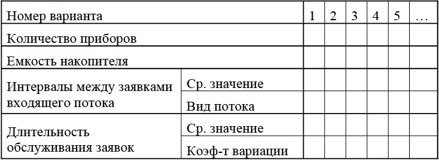
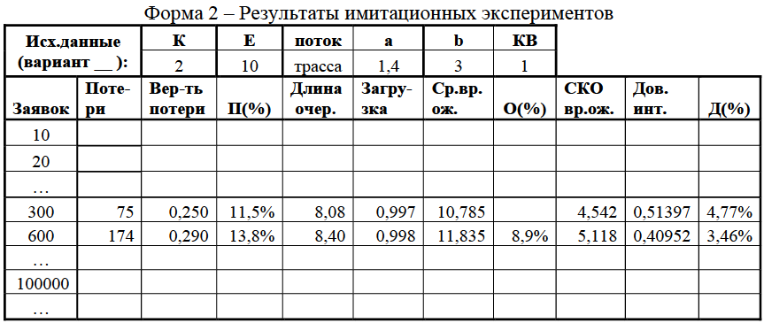

## [MainPage](../../index.md)/[Economics Software Engineering](../README.md)/Lab2

### Учебно-исследовательская работа 3 (УИР 3) «Исследование СМО произвольного вида»   教育和研究工作3（UR 2）“任意型排队系统的研究”

#### 1. Цель работы

Исследование свойств простейших одно- и многоканальных СМО типа G/G/K/Е с однородным потоком заявок с использованием системы имитационного моделирования GPSS при различных предположениях о параметрах структурно-функциональной организации и нагрузки в соответствии с заданной программой исследований.

#### 2. Содержание задания

В качестве исходной модели следует воспользоваться моделью системы, выбранной в качестве наилучшей в УИР 2, или (в исключительных случаях по согласованию с преподавателем) – простейшей базовой моделью одноканальной СМО, задав в качестве параметров входящего потока заявок (среднее значение и коэффициент вариации интервалов между поступающими в систему заявками) значения, полученные в процессе обработки случайной последовательности в УИР1. Для этого необходимо скорректировать предлагаемую имитационную GPSS-модель СМО типа G/G/K/Е (файл smo GGKE.gps).

В процессе исследований необходимо оценить влияние на такие характеристики системы, как: 

- длительность переходного процесса в системе; 
- среднее время ожидания (пребывания) заявок в системе; 
- вероятность потери заявок

следующих параметров нагрузки и структуры: 

- загрузки системы (в интервале от 0,1 до 0,9); 
- характера потока поступающих в систему заявок (заданная трасса; аппроксимирующий поток; простейший поток);
- законов распределения длительности обслуживания; 
- количества приборов в системе (от 1 до 3); 
- ёмкости накопителя.

Результаты исследований рекомендуется представлять в форме таблиц, примерная форма которых приведена ниже, и графиков, отражающих зависимости указанных характеристик от варьируемых параметров.

Указание: длительность переходного процесса измеряется в количестве заявок, прошедших через систему от момента начала работы до момента вхождения в установившийся (стационарный) режим функционирования. 

#### 3. Порядок выполнения работы

3.1. Исследование СМО произвольного вида проводится следующим образом. 

1) Запустить систему имитационного моделирования GPSS World. 
2) Ознакомиться с текстом GPSS-модели и назначением всех операторов. 
3) Загрузить GPSS-модель (файл smo GGKE.gps). 
4) В GPSS-модель внести необходимые изменения в исходные данные. 
5) Провести исследование модели массового обслуживания типа G/G/K/Е в соответствии с программой исследований.

Для проведения исследований необходимо выполнить многовариантное моделирование, для чего предварительно необходимо спланировать проведение машинных экспериментов, подготовив несколько вариантов исследуемых систем в соответствии с программой исследований (количество вариантов и порядок проведения исследований определяется самими исследователями так, чтобы получить наиболее полное представление о свойствах СМО в соответствии с представленной ниже программой исследований). Параметры различных вариантов исследуемых систем заносятся в таблицу (форма 1).

3.2. Программа исследований может включать в себя следующие пункты.

3.2.1. (ОБЯЗАТЕЛЬНЫЙ ПУНКТ) Изменение (корректировка) GPSS- модели (файл smo GGKE.gps) в соответствии с выбранной в качестве наилучшей в УИР2 системы массового обслуживания, проведение имитационного эксперимента и сравнение результатов имитационного моделирования с результатами, полученными в УИР 2 для этой системы.

3.2.2. Исследование влияния коэффициента загрузки на длительность переходного режима для 4-х – 5-и значений загрузки в интервале 0,1 и 0,9, изменяя: 

а) среднюю длительность обслуживания заявок при заданной интенсивности потока заявок; 
б) средний интервал между заявками в потоке при фиксированной длительности обслуживания заявок. 

3.2.3. (ОБЯЗАТЕЛЬНЫЙ ПУНКТ) Исследование влияния на среднее время ожидания, среднее время пребывания заявок в системе и вероятность потерь следующих законов распределения интервалов между заявками в потоке:

1) заданная трасса (из УИР 1); 
2) аппроксимирующее распределение (из УИР 1); 
3) простейший поток;
4) равномерный, …

При этом средний интервал между поступающими в систему заявками, рассчитанный в УИР 1, не должен изменяться.

Исследования по данному пункту рекомендуется проводить минимум для четырех значений загрузки: 0,5; 0,75; 0,95 и 0,99. Указанные значения должны быть обеспечены за счет изменения средней длительности обслуживания заявок при одном и том же законе распределения (на усмотрение исследователя).

3.2.4. Исследование влияния на среднее время ожидания, среднее время пребывания заявок в системе и вероятность потерь следующих законов распределения интервалов длительности обслуживания заявок: 

а) экспоненциального; 
б) Эрланга; 
в) гиперэкспоненциального.

Исследования по данному пункту рекомендуется проводить минимум для тех же значений загрузки (0,5; 0,75; 0,95 и 0,99) при сохранении характера потока заявок, выбранного исследователем из п. 3.2.3. 

3.2.5. Исследование влияния емкости накопителя на: 
- среднее время ожидания; 
- среднее время пребывания; 
- вероятность потери.

На основе полученных результатов определить емкость накопителя, начиная с которой СМО можно представить в виде модели с накопителем неограниченной емкости.

Исследования по данному пункту рекомендуется проводить для значений загрузки системы 0,5 и 0,9. 

3.2.6. Исследование влияния числа обслуживающих приборов (1, 2, 3) на среднее время ожидания и среднее время пребывания заявок в системе:

а) не изменяя нагрузку СМО; 
б) изменяя длительность обслуживания заявок и интервалы между заявками в потоке, но сохраняя при этом постоянной загрузку СМО.

Исследования по данному пункту рекомендуется проводить для значений загрузки СМО, равных 0,5; 0,75; 0,95 и 0,99. 

3.3. Рекомендуется придерживаться следующего порядка выполнения работы.

3.3.1. (ОБЯЗАТЕЛЬНЫЙ ПУНКТ) Изменить заданную GPSS-модель в соответствии с выбранной в качестве наилучшей в УИР2 системы массового обслуживания. Выполнить имитационный эксперимент при тех же нагрузочных параметрах (средних значениях и законах распределений интервалов между поступающими заявками и длительности обслуживания), что в УИР 2. Сравнить полученные результаты с результатами, полученными в УИР 2. Результаты сравнения представить в виде таблицы, оценив в процентах степень отличия результатов имитационного моделирования от результатов расчета с помощью марковских процессов в УИР 2.

3.3.2. Дальнейшие исследования проводятся на этой же модели или, в случае ее существенной сложности, допускается использование простейшей базовой модели в виде одноканальной СМО (по согласованию с преподавателем). При этом в качестве начальных значений структурных параметров и параметров нагрузки необходимо установить следующие значения:

- среднее значение интервалов между поступающими заявками принимается равным значению математического ожидания, вычисленного для заданной в УИР1 числовой последовательности;
- число обслуживающих приборов – 1 (или из УИР2); 
- емкость накопителя – 1 (или из УИР2); 
- среднее значение длительности обслуживания заявок выбирается из условия обеспечения требуемой загрузки системы;
- закон распределения интервалов между поступающими заявками - экспоненциальный (простейший поток) с последующим обязательным анализом характеристик системы при заданной трассе и законе, аппроксимирующим трассу;
- закон распределения длительности обслуживания – экспоненциальный с последующим анализом характеристик системы при других законах (Эрланга, гиперэкспоненциального). 

3.3.3. Проверить результаты редактирования и, выполнить трансляцию программы (COMMAND/ CREATE SIMULATION). При наличии в программе ошибок, обнаруженных в процессе трансляции, внести необходимые исправления в модель (программу). 

3.3.4. Установить начальную длительность моделирования, последовательно задавая в команде START (COMMAND/ START) в качестве операнда следующие значения: 10, 50, 100, 200, 300 и увеличивая далее до тех пор, пока в системе не установится стационарный (установившийся) режим. 

3.3.5. По завершению моделирования из стандартного отчета (REPORT) выбрать и внести в таблицы (см. ниже) основные результаты моделирования: 

- коэффициент загрузки СМО; 
- количество потерянных заявок; 
- среднее значение и среднеквадратическое отклонение времени ожидания заявок в СМО; 
- среднее значение и среднеквадратическое отклонение времени пребывания заявок в СМО.

3.3.6. Пункты 3.3.4 – 3.3.5 повторить, увеличивая проходящее через систему количество заявок (транзактов) для определения длительности переходного режима в системе. 

3.3.7. Изменить загрузку системы в соответствии с программой исследований и повторить пункты 3.3.4 -3.3.6. 

3.3.8. По результатам моделирования оценить число заявок, которое необходимо пропускать через модель для того, чтобы получить статистически устойчивые результаты для разных значений загрузки системы и для трех потоков заявок (простейший поток; заданная трасса; аппроксимирующий поток). 

3.3.9. Изменить параметры GPSS-модели в соответствии с выбранными вариантами и выполнить моделирование в соответствии с Программой исследований, задавая в команде START число пропускаемых через модель заявок, равное полученному в пункте 3.3.8 значению, до тех пор, пока не будут проведены все исследования. 

3.3.10. Результаты моделирования по всем вариантам занести в таблицы или представить в виде графиков.

3.4. Выполнить сравнительный анализ результатов моделирования, представив их в виде таблиц (см. форму 2) и/или графиков, позволяющих наглядно продемонстрировать свойства исследуемой системы и сформулировать выводы по проделанной работе.

#### 4. Содержание отчета

4.1. Сравнение результатов, полученных с помощью имитационного моделирования и метода марковских процессов для СМО, выбранной в качестве наилучшей в УИР 2. 
4.2. Описание моделей – вариантов организации системы, представленных в таблице (форма 1). 
4.3. Представленные в табличном виде (форма 2) и/или в виде графиков результаты имитационного моделирования, отражающие зависимости характеристик функционирования системы от варьируемых параметров. 
4.4. Сравнение полученных результатов с расчетными значениями по формулам для СМО типа М/М/1 и M/G/1 для обоснования адекватности моделей. 
4.5. По значениям коэффициентов вариации времени ожидания и времени пребывания заявок в СМО определить законы их распределения. 
4.6. Выводы по работе, в которых необходимо сформулировать свойства исследуемой системы и оценить влияние параметров структуры и нагрузки: на длительность переходного режима; на среднее время ожидания заявок в СМО; на вероятность потери заявок.

Объем проводимых экспериментов, количество таблиц и графиков должно быть таким, чтобы можно было получить достаточно полное представление о свойствах исследуемой системы.

#### 5. Рекомендуемые формы таблиц

Форма 1 – Описание исследуемых вариантов организации системы 

Пояснения к форме 1:
1. Количество вариантов (экспериментов) определяется самим исследователем и должно быть таким, чтобы давать достаточно полное представление о свойствах системы. 
2. При определении количества вариантов следует иметь в виду, что наибольший интерес представляют системы с высокой нагрузкой, работающие в интервале загрузок более 90%. 
3. Для параметра Емкость накопителя – обязательно должен быть вариант, иллюстрирующий минимальную емкость, при которой в системе отсутствуют потери заявок, т.е. при которой система может рассматриваться как система с накопителем неограниченной емкости. 
4. Вид потока заявок: 
   1) Т – трасса; 
   2) А – аппроксимирующий; 
   3) П – простейший; 
   4) Р – равномерный; 
   5) детерминированный, … (Т, А и П – обязательные, остальные – на усмотрение исследователя).

Пояснения к форме 2:
1. В верхней части таблицы приводятся исходные данные: 
   К – количество обслуживающих приборов в системе;   
   Е – емкость накопителя;   
   поток – вид потока: 1) трасса; 2) аппр. 3) прост., 4) равномерный, … ;   
   а – средний интервал между поступающими в систему заявками;   
   b – средняя длительность обслуживания заявок;   
   КВ – коэффициент вариации длительности обслуживания. 
2. В столбцах таблицы приводятся результаты имитационных экспериментов:   
   Заявок – количество заявок (транзактов), прошедших через систему (шаг изменения количества заявок выбирается исследователем).   
   Потери – количество потерянных заявок.   
   Вероятность потери – рассчитывается как отношение потерянных заявок к общему количеству заявок, прошедших через систему.   
   П(%) – на сколько процентов текущее значение вероятности потери отличается от предыдущего значения.   
   Длина очер. – длина очереди.   
   Загрузка – коэффициент загрузки системы.   
   Ср.вр.ож. – среднее время ожидания заявок в очереди.   
   О(%) – на сколько процентов текущее значение времени ожидания отличается от предыдущего значения.   
   СКО вр.ож. – среднеквадратическое отклонение времени ожидания.   
   Дов.инт. – доверительный интервал для среднего времени ожидания.   
   Д(%) – отношение доверительного интервала к среднему времени ожидания (в процентах).

Указание. Объем исследований и имитационных экспериментов, перечень и конкретные значения варьируемых параметров, количество таблиц и графиков с результатами экспериментов определяются самим исследователем. Они должны дать исследователю достаточно полное и достоверное представление о свойствах исследуемой системы, сформулированных в виде конкретных выводов и объяснений свойств системы, которые позволят доказательно отвечать на следующие вопросы: 

- какой характер имеет переходной процесс (проиллюстрировать на графике с комментариями)? 
- зависит ли длительность переходного режима, измеряемая количеством прошедших через систему заявок, от загрузки системы (вида потока, количества приборов в системе, емкости накопителя, …) и если «да», то при какой загрузке (виде потока количестве приборов, емкости накопителя, …) переходной режим длится дольше и почему? 
- как изменяются характеристики системы при изменении характера потока поступающих в систему заявок: 
  1) заданная трасса, 
  2) аппроксимирующий поток, 
  3) простейший, 
  4) равномерный, … и объяснить характер этих изменений, если они значительны; 
- как изменяются характеристики системы в зависимости от характера обслуживания заявок (закона распределения длительности обслуживания)? 
- что сильнее влияет на характеристики системы: характер потока или обслуживания (коэффициент вариации интервалов времени между поступающими в систему заявками или коэффициент вариации длительности обслуживания) при большой или маленькой загрузке системы? 
- какие характеристики более чувствительны к изменению структурных параметров (количества устройств, емкости накопителя) при разной загрузке системы?

При защите отчета по работе по требованию преподавателя студент должен выполнить любой имитационный эксперимент, иллюстрирующий полученные результаты.