## [MainPage](../index.md)/[OPD](README.md)/Exam

1. [Две формы представления информации. Способы представления дискретной информации. Системы счисления, используемые в вычислительной технике: двоичная, 8-я, 10-я, 16-я, двоично-десятичная.](#1-две-формы-представления-информации-способы-представления-дискретной-информации-системы-счисления-используемые-в-вычислительной-технике-двоичная-8-я-10-я-16-я-двоично-десятичная)  
    两种信息呈现形式。 表示离散信息的方法。 计算中使用的数字系统：二进制、8 位、10 位、16 位、二进制十进制
2. [Представление чисел с фиксированной точкой. Прямой, обратный и дополнительный код. Формирование битовых признаков переноса, переполнения, отрицательного результата, нуля.](#2-представление-чисел-с-фиксированной-точкой-прямой-обратный-и-дополнительный-код-формирование-битовых-признаков-переноса-переполнения-отрицательного-результата-нуля)  
    定点数字的表示。 直码、反码和补码。 进位标志、溢出标志、负标志、零标志的形成。
3. [Представление символьных и строковых данных. Принципы построения кодовых таблиц ASCII, КОИ-8, ISO8859-5, Windows-1251, UTF-8, UTF-16.](#3-представление-символьных-и-строковых-данных-принципы-построения-кодовых-таблиц-ascii-кои-8-iso8859-5-windows-1251-utf-8-utf-16)  
   字符和字符串数据的表示。 ASCII、KOI-8、ISO8859-5、Windows-1251、UTF-8、UTF-16 码表的构建原理。
4. [Базовые элементы вычислительной техники: ячейки, регистры, шины, вентили, тактовые генераторы, логические схемы, триггеры, регистры, счетчики, сумматоры.](#4-базовые-элементы-вычислительной-техники-ячейки-регистры-шины-вентили-тактовые-генераторы-логические-схемы-триггеры-регистры-счетчики-сумматоры)  
    计算机技术的基本要素：单元、寄存器、总线、门、时钟发生器、逻辑电路、触发器、寄存器、计数器、加法器。
5. [Структура и принцип функционирования ЭВМ. Порядок функционирования простого процессора на примере калькулятора.](#5-структура-и-принцип-функционирования-эвм-порядок-функционирования-простого-процессора-на-примере-калькулятора)  
   计算机的结构和工作原理。 以计算器为例，简单处理器的操作顺序
6. [Операционная система Unix — ядро ОС и файловая система.](#6-операционная-система-unix--ядро-ос-и-файловая-система)  
   Unix 操作系统——操作系统内核和文件系统
7. [Операционная система Unix — интерпретаторы, стандартные потоки ввода вывода, фильтры.](#7-операционная-система-unix--интерпретаторы-стандартные-потоки-ввода-вывода-фильтры)  
   Unix 操作系统 - 解释器、标准输入输出流、过滤器。
8. [Операционная система Unix — основные команды, права файлов и способы их задания.](#8-операционная-система-unix--основные-команды-права-файлов-и-способы-их-задания)  
   Unix 操作系统 - 基本命令、文件权限以及如何设置它们。
9. [Состав и структура БЭВМ. Адресные пространства БЭВМ. Система команд БЭВМ, форматы команд. Машинные циклы.](#9-состав-и-структура-бэвм-адресные-пространства-бэвм-система-команд-бэвм-форматы-команд-машинные-циклы)  
   BEVM 的组成和结构。 BEVM 地址空间。 BEVM 命令系统，命令格式。 机器循环。
10. [Организация вычислений в БЭВМ. Сдвиги, арифметические и логические операции. Цикл выборки команды.](#10-организация-вычислений-в-бэвм-сдвиги-арифметические-и-логические-операции-цикл-выборки-команды)  
    BEVM 中的计算组织。 移位、算术和逻辑运算。 命令获取周期。
11. [Организация массивов данных. Режимы адресации. Цикл выборки адреса и операнда БЭВМ.](#11-организация-массивов-данных-режимы-адресации-цикл-выборки-адреса-и-операнда-бэвм)  
    数据数组的组织。 寻址模式。 用于选择计算机的地址和操作数的循环。
12. [Управление вычислительным процессом в БЭВМ. Команды ветвлений, цикл исполнения команды LOOP.](#12-управление-вычислительным-процессом-в-бэвм-команды-ветвлений-цикл-исполнения-команды-loop)  
    计算机过程控制。 分支命令，LOOP 命令执行循环。
13. [Подпрограммы в БЭВМ. Цикл исполнения команд перехода и возврата из подпрограммы. Стек, передача параметров. Позиционно-независимый код. Загрузчик и библиотеки.](#13-подпрограммы-в-бэвм-цикл-исполнения-команд-перехода-и-возврата-из-подпрограммы-стек-передача-параметров-позиционно-независимый-код-загрузчик-и-библиотеки)  
    计算机中的子程序。从子程序执行跳转和返回命令的循环。堆栈，参数传递。与位置无关的代码。加载程序和库。
14. [Организация ввода-вывода в вычислительных системах. Инициация обмена, передача информации и завершение обмена. Драйверы.](#14-организация-ввода-вывода-в-вычислительных-системах-инициация-обмена-передача-информации-и-завершение-обмена-драйверы)  
    计算系统中输入输出的组织。 交换的发起、信息的传递和交换的完成。 司机。
15. [Организация ввода-вывода в БЭВМ. Устройства ввода-вывода, команды.](#16-организация-асинхронного-обмена-в-бэвм-пример-программы-временные-издержки-асинхронного-обмена)  
    计算机中输入输出的组织。 I/O 设备、命令。
16. [Организация асинхронного обмена в БЭВМ. Пример программы. Временные издержки асинхронного обмена.](#16-организация-асинхронного-обмена-в-бэвм-пример-программы-временные-издержки-асинхронного-обмена)  
    计算机中异步交换的组织。 程序示例。 异步交换的时间成本。
17. [Организация прерываний в БЭВМ. Вектора прерываний, контроллер прерывания.](#17-организация-прерываний-в-бэвм-вектора-прерываний-контроллер-прерывания)  
    计算机中的中断组织。 中断向量，中断控制器。
18. [Организация обмена по прерыванию программы в БЭВМ. Пример программы. Цикл прерывания.](#18-организация-обмена-по-прерыванию-программы-в-бэвм-пример-программы-цикл-прерывания)  
    在计算机中的程序中断上组织交换。程序示例。中断周期。
19. [Понятие многоуровневой ЭВМ. Понятие и пример программы на разных уровнях.](#19-понятие-многоуровневой-эвм-понятие-и-пример-программы-на-разных-уровнях)  
    多级计算机的概念。不同级别的程序的概念和示例。
20. Микропрограммный уровень БЭВМ. Структура МПУ. Форматы микрокоманд.
21. Структура и принципы работы арифметико-логического устройства и коммутатора. Регистр состояния БЭВМ
22. [Микропрограммное управление вентильными схемами. Схема управления. Интерпретатор БЭВМ.](#22-микропрограммное-управление-вентильными-схемами-схема-управления-интерпретатор-бэвм)  
    门电路的微程序控制。 控制方案。BEVM 解释器。
23. Архитектура ЭВМ. Гарвардская и фон-Неймановская архитектура. Организация обмена архитектуры ЭВМ с использованием шин.
24. Архитектура многопроцессорных ЭВМ. Системный коммутатор. Архитектуры UMA и NUMA.
25. [Структура современных процессоров. Окружение процессора. CISC, RISC, VLIW.](#25-структура-современных-процессоров-окружение-процессора-cisc-risc-vliw)  
    现代处理器的结构。 处理器环境。 CISC，RISC，VLIW。
26. Адресуемая память, организация и временные диаграммы. Конструктивные особенности современной памяти.
27. Память, ориентированная на записи (блочная память). Организация дисковой памяти и памяти на магнитных лентах.
28. [Характеристики запоминающих устройств. Пирамида памяти.](#28-характеристики-запоминающих-устройств-пирамида-памяти)  
    存储设备的特性。 记忆金字塔。
29. Ассоциативная память, Кэш-память. Влияние промахов кэш-памяти на производительность.
30. Предназначение и организация виртуальной памяти. Сегментно-страничная организация. Устройство управления памятью (MMU), буфер трансляции (TLB).
31. [Сетевые технологии, Понятие сети ЭВМ, классификация компьютерных сетей. Сообщение и пакет. Модель взаимодействия открытых систем.](#31-сетевые-технологии-понятие-сети-эвм-классификация-компьютерных-сетей-сообщение-и-пакет-модель-взаимодействия-открытых-систем)  
    网络技术，计算机网络的概念，计算机网络的分类。消息和包。开放系统交互模型。
32. Модель TCP/IP: передающая среда, канальный и сетевой уровень. Адресация, передача и маршрутизация пакетов.
33. Модель TCP/IP: выделение адресов (DHCP), сервисы имен, транспортный и прикладной уровни.
34. [Интерфейсы ввода-вывода. Контроллеры внешних устройств. Уровни стандартизации, сопряжения с системной шиной, циклы обмена. Регистры контроллера.](#34-интерфейсы-ввода-вывода-контроллеры-внешних-устройств-уровни-стандартизации-сопряжения-с-системной-шиной-циклы-обмена-регистры-контроллера)  
    输入/输出接口。 外部设备控制器。 标准化水平、与系统总线的接口、交换周期。 控制器寄存器。
35. Параллельная передача данных. Контроллеры параллельной передачи и приема.
36. Синхронные последовательные интерфейсы. Контроллеры последовательной передачи и приема.
37. [Асинхронный обмен. Принципы деления частоты, формат кадра.](#37-асинхронный-обмен-принципы-деления-частоты-формат-кадра)  
    异步交换。 分频原理、帧格式。
38. Контроллер передачи асинхронного последовательные интерфейса.
39. Контроллер приема асинхронного последовательные интерфейса.
40. [Организация прямого доступа к памяти. Контроллер ПДП.](#40-организация-прямого-доступа-к-памяти-контроллер-пдп)  
    组织直接访问内存。等离子控制器。

#### 1. Две формы представления информации. Способы представления дискретной информации. Системы счисления, используемые в вычислительной технике: двоичная, 8-я, 10-я, 16-я, двоично-десятичная.

Различают две формы представления информации — непрерывную и дискретную.  
有两种形式的信息表示 — 连续的和离散的。

- Непрерывная информация 连续信息
  Количество значений, которые может принимать величина, представленная в такой форме бесконечно велико, даже если величина изменяется в ограниченном диапазоне.  
  一个值在这种形式下可以取的值的数量是无限的，即使值在有限的范围内变化。

  основное свойство таких величин – отсутствие разрывов, промежутков между значениями, которые может принимать аналоговая величина.  
  这些量的主要属性 - 没有间隙，这些量的主要特性是没有间隙，即模拟值可以采用的值之间的间隙。

  Эта форма представления используется в аналоговых вычислительных машинах.  
  这种表示形式用于模拟计算机。

- Дискретная информация 离散信息
  Такие величины, принимающие не все возможные, а лишь вполне определённые значения, называются дискретными (прерывистыми).  
  这样的量不取所有可能的值，而只取相当确定的值，称为离散的（不连续的）。

  В отличие от непрерывной величины количество значений дискретной величины всегда будет конечным. Величина представляется в виде нескольких сигналов, каждый из которых соответствует одной из цифр заданной величины.  
  与连续量不同，离散量的值的数量总是有限的。该值以多个信号的形式呈现，每个信号对应于指定值的一位数字。

  Эта форма представления используется в электронных вычислительных машинах (ЭВМ).  
  这种表示形式用于电子计算机

Различают две формы систем счисления — Позиционные системы счисления и Непозиционные системы счисления. В вычислительной технике используют позиционные системы счисления. это системы счисления, в которых количественный эквивалент каждой цифры (её вес) зависит от ее положения (позиции) в записи числа.  
有两种形式的数字系统 — 位置数字系统和非位置数字系统。 在计算机技术中，使用位置数字系统。 这类数字系统，其中每个数字的数量等值（其权重）取决于其在数字条目中的位置（位置）

двоично-десятичная — форма записи рациональных чисел, когда каждый десятичный разряд числа записывается в виде его четырёхбитного двоичного кода. Таким образом, каждая тетрада двоично-десятичного числа может принимать значения от 0000<sub>2</sub> (0<sub>10</sub>) до 1001<sub>2</sub> (9<sub>10</sub>)
二进码十进数（Binary-Coded Decimal，简称BCD）一种写有理数的形式，一个数的每一位十进制码被写为其四位二进制代码，因此，每四位 BCD 的取值可以从 0000<sub>2</sub> (0<sub>10</sub>) 到 1001<sub>2</sub> (9<sub>10</sub>)

#### 2. Представление чисел с фиксированной точкой. Прямой, обратный и дополнительный код. Формирование битовых признаков переноса, переполнения, отрицательного результата, нуля.

- Представление чисел с фиксированной точкой 定点数的表示
  Число с фиксированной точкой относятся к числам с фиксированной запятой, разделяющей целую и дробную части числа. В числах, используемых в базовой ЭВМ, положение запятой строго фиксировано после младшего бита слова.  
  定点数是指具有将数字的整数部分和小数部分分开的固定点的数字。在基本计算机中使用的数字中，逗号的位置严格固定在单词的最低有效位之后。
  - Прямой код 直码
    Целые двоичные числа без знака можно использовать для представления нуля и целых положительных чисел. При размещении таких чисел в одном 16-разрядном слове они могут изменяться  
    от (0000 0000 0000 0000)<sub>2</sub> = (0000)<sub>16</sub> = 0  
    до (1111 1111 1111 1111)<sub>2</sub> = (FFFF)<sub>16</sub> = 2<sup>16</sup> - 1 = 65535  
    Такая запись называется прямым кодом числа.  
    无符号二进制整数可用于表示零整数和正整数。当放置在单个 16 位字中时，它们可以  
    从 (0000 0000 0000 0000)<sub>2</sub> = (0000)<sub>16</sub> = 0  
    到 (1111 1111 1111 1111)<sub>2</sub> = (FFFF)<sub>16</sub> = 2<sup>16</sup> - 1 = 65535  
    这样的一个符号称为数字的直接代码
  - Обратный код 反码
    Обратный код - метод вычислительной математики, позволяющий вычесть одно число из другого, используя только операцию сложения.  
    反码是一种计算数学方法，它允许您仅使用加法运算从另一个数字中减去一个数字

    Обратный код для положительного числа совпадает с прямым кодом. Для отрицательного числа все цифры числа заменяются на противоположные (1 на 0, 0 на 1), а в знаковый разряд заносится единица.  
    正数的反码与正码相同。对于负数，数字的所有数字都替换为相反的数字（1 -> 0、0 -> 1），并将符号位设为 1
  - Дополнительный код 补码
    Дополнительный код - наиболее распространенный способ представления отрицательных чисел. Он позволяет заменить операцию вычитания на операцию сложения и сделать операции сложения и вычитания одинаковыми для знаковых и беззнаковых чисел.  
    二进制补码是表示负数的最常用方法。它允许您将减法运算替换为加法运算，并使有符号数和无符号数的加法和减法运算相同。

    ополнительный код положительного числа совпадает с прямым кодом. Для отрицательного числа дополнительный код образуется путем получения обратного кода и добавлением к младшему разряду единицы.  
    正数的二进制补码与直接码相同。对于负数，通过获得反码并将最低有效位加一来形成附加码
- Формирование битовых признаков 标志位的形成（NZVC）
  - Формирование переноса 进位标志的形成（C）
    Признаком выхода за границы разрядной сетки для беззнакового представления числа является перенос в старший разряд (бит C - Carry).  
    对于数字的无符号表示，进位标志由最高位进位到超出边界时形成（位 C - 进位）
  - Формирование переполнения 溢出标志的形成（V）
    устанавливается в случае, если при выполнении арифметической операции со знаком получается число, разрядность которого превышает разрядность выделенного для него поля результата.
  - Формирование отрицательного результата 负标志的形成（N）
    устанавливается, если при выполнении арифметической или логической операции получается отрицательное число (т.е. старший бит результата равен 1).  
    如果算术或逻辑运算的结果为负数（即结果的最高有效位为 1），则设置符号标志（N）
  - Формирование нуля 零标志的形成（Z）
    устанавливается, если при выполнении арифметической или логической операции получается число, равное нулю (т.е. все биты результата равны 0).  如果算术或逻辑运算的结果等于零（即结果的所有位都为 0），则设置零标志 (Z)。

#### 3. Представление символьных и строковых данных. Принципы построения кодовых таблиц ASCII, КОИ-8, ISO8859-5, Windows-1251, UTF-8, UTF-16.

В ЭВМ представление текстовой информации основывается на кодировании букв и символов при помощи кодовой таблицы. Кодовая таблица (или кодировка символов) является соглашением между разработчиками о соответствии каждому символу определенного порядкового номера или кода, чтобы его можно было сохранять в памяти ЭВМ или передавать по каналам связи.  
在计算机中，文本信息的表示基于使用代码表对字母和符号进行编码。码表（或字符编码）是开发人员之间就某个序列号或代码的每个字符对应的协议，以便它可以存储在计算机的内存中或通过通信通道传输。

- Кодировки стандарта ASCII ASCII 编码标准

  ASCII — первая кодировка, пригодная для работы с текстом. В ASCII содержатся основные символы (английский алфавит, цифры, знаки препинания, символы национальных алфавитов(свои для каждого региона)
  ASCII 是第一个适合处理文本的编码。 ASCII 包含基本字符（英文字母、数字、标点符号、国家字母符号（每个地区都有）

  Кодировка ASCII делится на 7-битную и 8-битную кодировку.  
  ASCII编码分为7位和8位两种编码

  - 7-бит ASCII
    ASCII — содержит маленькие и большие буквы английского алфавита, служебных символов, цифры, знаки препинания и другие символы (при этом старший бит использовался для контроля четности битов передаваемого по каналом связи символа).  
    ASCII - 包含英文字母的大小写字母、特殊字符、数字、标点符号和其他符号（在这种情况下，最高有效位用于检查通过通信信道传输的符号位的奇偶性）
  - 8-бит ASCII
    Поскольку 7-битный код ASCII содержит всего 128 символов, он не может представлять символы некоторых стран. Поэтому к 7-битной кодировке ASCII добавляется 1 бит для расширения до 256 символов. Первые 128 символов остаются прежними, последние 128 символов используются для обозначения символов из других стран.  
    由于 7 位的 ASCII 编码只包含 128 个字符，无法表示一些国家的字符。因此在7位 ASCII 编码的基础上增加了 1 位，扩展到 256 个字符。前 128 个字符保持不变，后 128 个字符用于表示其他国家的字符
- Кодировки стандарта КОИ-8
  КОИ-8 — первая русская кодировка. Символы кириллицы расположены не в алфавитном порядке. Их разместили в верхнюю половину таблицы так, чтобы позиции кириллических символов соответствовали их фонетическим аналогам в английском алфавите. Это значит, что даже при потере старшего бита каждого символа, например, при проходе через устаревший семибитный модем, текст остается "читаемым" (отсюда и появилось понятие транслита).  
  KOI8-R 是第一个俄语编码。西里尔字符不按字母顺序排列。它们被放置在桌子的上半部分，以便西里尔字符的位置与英语字母表中的语音对应物相对应。这意味着即使每个字符的最高有效位丢失，例如，当通过一个过时的七位调制解调器时，文本仍然是“可读的”（因此是音译的概念）
- Кодировки стандарта ISO8859-5
  ISO8859-5 — 8 битная кодовая страница из семейства кодовых страниц стандарта ISO-8859 для представления кириллицы.  
  ISO 8859-5是来自ISO-8859系列代码页 的 8 位代码页，用于表示西里尔字母。

- Кодировки стандарта Windows-1251
  Windows-1251 — русская кодировка, использовавшаяся в русскоязычных версиях операционной системы Windows в начале 90-х годов. Кириллические символы идут в алфавитном порядке. Содержит все символы, встречающиеся в типографике обычного текста (кроме знака ударения).  
  Windows-1251 是 90 年代早期 Windows 操作系统的俄语版本中使用的俄语编码。西里尔字符按字母顺序排列。包含在纯文本排版中找到的所有字符（重音除外）
- Unicode
  Unicode - стандарт кодирования символов, включающий в себя знаки почти всех письменных языков мира. В настоящее время стандарт является преобладающим в Интернете.  
  Unicode 是一种字符编码标准，包含了世界上几乎所有书面语言的字符。 该标准目前是 Internet 上的主导标准
  - UTF-8
    UTF-8 — представление Юникода, обеспечивающее наилучшую совместимость со старыми системами, использовавшими 8-битные символы. Текст, состоящий только из символов с номером меньше 128, при записи в UTF-8 превращается в обычный текст ASCII. И наоборот, в тексте UTF-8 любой байт со значением меньше 128 изображает символ ASCII с тем же кодом. Остальные символы Юникода изображаются последовательностями длиной от двух до шести байт.  
    UTF-8 是一种 Unicode 表示，它提供与使用 8 位字符的旧系统的最佳兼容性。 仅由少于 128 个字符组成的文本在以 UTF-8 编写时会转换为纯 ASCII 文本。 相反，在 UTF-8 文本中，任何值小于 128 的字节都表示具有相同代码的 ASCII 字符。 其余的 Unicode 字符表示为 2 到 6 个字节长的序列。
  - UTF-16
    Первая версия Юникода (1991 г.) представляла собой 16-битную кодировку с фиксированной шириной символа; общее число разных символов было 65 536. Во второй версии Юникода (1996 г.) было решено значительно расширить кодовую область; для сохранения совместимости с теми системами, где уже был реализован 16-битный Юникод, и была создана UTF-16. Область 0xD800—0xDFFF, отведённая для суррогатных пар, ранее принадлежала к области «символов для частного использования».  
    Unicode 的第一个版本（1991 年）是 16 位固定宽度编码； 不同字符总数为65536个，在 Unicode 的第二版（1996年）中，决定显着扩大码区； 以保持与那些已经实现 16 位 Unicode 并创建 UTF-16 的系统的兼容性。 为代理对保留的区域 0xD800-0xDFFF 以前属于“供私人使用的字符”区域。

    Поскольку в UTF-16 можно отобразить 1 112 064 символов, то это число и было выбрано в качестве новой величины кодового пространства Юникода.  
    由于 UTF-16 可以显示 1,112,064 个字符，因此选择此数字作为 Unicode 代码空间的新大小。


#### 4. Базовые элементы вычислительной техники: ячейки, регистры, шины, вентили, тактовые генераторы, логические схемы, триггеры, регистры, счетчики, сумматоры.

- Ячейка памяти  — является основным строительным блоком памяти компьютера. Ячейка памяти представляет собой электронную схему, которая хранит один бит двоичной информации, и она должна быть настроена на сохранение логической 1 (высокий уровень напряжения) и сброшена для сохранения логического 0 (низкий уровень напряжения). Его значение сохраняется / сохраняется до тех пор, пока оно не будет изменено процессом установки / сброса. Доступ к значению в ячейке памяти можно получить, прочитав его.  
  内存单元是计算机内存的基本组成部分。存储单元是存储一位二进制信息的电子电路，必须将其设置为存储逻辑 1（高电压电平）并复位以存储逻辑 0（电压低电平）。它的值被保留/保留，直到被安装/重置过程更改。可以通过读取来访问内存位置中的值 
  Ячейки памяти могут иметь разную ёмкость (число разрядов, длину). Современные запоминающие устройства обычно имеют размер ячейки памяти, равный одной из степеней числа два: 8 бит, 16 бит, 32 бита, 64 бита.  
  存储单元可以具有不同的容量（位数、长度）。现代存储设备的存储单元大小通常等于 2 的幂之一：8 位、16 位、32 位、64 位  
  Ячейки памяти имеют адрес (порядковый номер, число), по которому к ним могут обращаться команды процессора.  
  存储单元有一个地址（序列号、编号，处理器指令可以通过该地址访问它们。
- Регистр — устройство для записи, хранения и считывания n-разрядных двоичных данных и выполнения других операций над ними.  
  寄存器 是用于写入、存储和读取n位二进制数据并对其执行其他操作的设备
  Регистр представляет собой упорядоченный набор триггеров, обычно D-триггеров, число которых соответствует числу разрядов в слове. С регистром может быть связано комбинационное цифровое устройство, с помощью которого обеспечивается выполнение некоторых операций над словами.  
  寄存器是一组有序的触发器，通常是D 触发器，其数量对应于字中的位数。可以将组合数字设备与寄存器相关联，借助它可以对单词执行某些操作  
  Основой построения регистров являются: D-триггеры, RS-триггеры, JK-триггеры.  
  构建寄存器的基础是：D-触发器、RS-触发器、JK-触发器
- Триггер (триггерная система) — класс электронных устройств, обладающих способностью длительно находиться в одном из двух устойчивых состояний и чередовать их под воздействием внешних сигналов, который может записывать двоичные цифровые сигналы «1» и «0»  
  触发器（trigger system） — 一类能够在外部信号的影响下长时间保持在两种稳定状态中的一种并交替进行的电子设备，可记录二进制数字信号“1”和“0”
- Шина — это линия передачи информации, которая соединяет несколько компонентов компьютера и является средой передачи, совместно используемой всеми компонентами.  
  总线是连接多个计算机部件的信息传输线，是各部件共享的传输介质  
  Только один компонент может отправлять информацию на шину одновремено, но разные компоненты могуь полуить информацию с шины в одном времени  
  在某一时刻，只允许有一个部件向总线发送信息，而多个部件可以同时从总线上接收相同的信息
  - способ передачи 传输方式
    - последовательная передача（serial communication）串行传输：  
      在一条传输线上在一段时间内逐一传输一串二进制代码  
      На одном линии передачи передается строка двоичных кодов один за другим в течение периода времени
      ```
      ----------------
      ```
    - параллельная передача（parallel transmission）并行传输：  
      在多条传输线上同时传输多串二进制代码  
      На разных линиях передачи передается разные строки двоичных кодов в одном времени
      ```
      ----------------
      ----------------
      ----------------
      ----------------
      ```
  - Классификация 分类
    - Внутрикристальной шиной 片内总线：
      是指芯片内部的总线，例如 CPU 芯片内部，寄存器与寄存器之间、寄存器与算逻单元 ALU 之间都由片内总线连接  
      Шина внутри чипа, Например, внутри CPU, между регистрами, между регистрами и АЛУ соединены внутрикристальной шиной
    - Системные шмны 系统总线（板级总线）：
      Шина между компонетами
      指 CPU、内存、I/O 设备（通过 I/O 接口）各大部件之间的信息传输线，通常都安放在主板或各个插件板上  
      按系统总线传输信息的不同，又可分为：
      - Шина данных 数据总线：  
        用来传输各功能部件之间的数据信息，它是双向传输总线，其位数与机器字长、存储字长有关，一般为8位、16位或32位  
        数据总线的位数称为数据总线宽度，它是衡量系统性能的一个重要参数  
        如果数据总线的宽度为8位，指令字长为16位，那么，CPU在取值阶段必须两次访问主存  
      - Шина адреса 地址总线  
        地址总线主要用来指出数据总线上的元数据或目的数据在主存单元的地址或I/O设备的地址,由CPU输出，单向传输  
        地址线的位数与存储单元的个数有关，如地址线为20根，则对应的存储单元个数为 2^20  
      - Шина управления 控制总线  
        控制总线将微处理器控制单元（Control Unit）的信号，传送到周边设备  
        通常对任一控制线而言，它的传输是单向的。但对于控制总线总体来说，又可认为是双向的  
        控制总线还起到监视各部件状态的作用  
      - 扩展总线  
        可连接扩展槽和电脑  
      - 局部总线  
        取代更高速数据传输的扩展总线  
- Логические схемы — Это схем, состоящая из логических вентилей.  
  逻辑电路是由逻辑门组成的电路  
  Входной сигнал преобразуется в выходной сигнал посредством логической операции  
  输入的信号经过逻辑运算转为输出信号
- Логический вентили — базовый элемент цифровой схемы, выполняющий элементарную логическую операцию, преобразуя таким образом множество входных логических сигналов в выходной логический сигнал.  
  逻辑门是执行基本逻辑运算的数字电路的基本元件，从而将一组输入逻辑信号转换为输出逻辑信号。
  - НЕ (NOT) 非门
  - И (AND) 与门
  - ИЛИ (OR) 或门
  - НЕ И (NAND) 与非门
  - НЕ ИЛИ (NOR) 或非门
  - Исключающее ИЛИ (XOR) 异或门
  - Исключающее ИЛИ с инверсией (NXOR) 同或门
- Тактовый генератор — это компонент, который генерирует тактовый сигнал (электрические импульсы) для синхронизации различных процессов в цифровых устройствах.  
  时钟发生器是产生时钟信号（电脉冲）以同步数字设备中的各种过程的组件。  
  В микропроцессорной технике один тактовый импульс, как правило, соответствует одной атомарной операции. Обработка одной инструкции может производиться за один или несколько тактов работы микропроцессора, в зависимости от архитектуры и типа инструкции. Частота тактовых импульсов определяет скорость вычислений.  
  在微处理器技术中，一个时钟脉冲通常对应一个原子操作。一条指令的处理可以在微处理器的一个或几个周期内完成，这取决于指令的体系结构和类型。时钟频率决定了计算的速度。  
- Счетчик(СТ) — это устройство, которое хранит количество раз, когда происходит определенное событие или процесс.  
  计数器是存储特定事件或过程发生次数的设备  
  В цифровой системе счетчик в основном подсчитывает количество импульсов.  
  计数器在数字系统中主要是对脉冲的个数进行计数  
  На выходах счетчика получается двоичный или двоично-десятичный код, определяемый числом поступивших импульсов.  
  在其输出处获得二进制或二进制十进制代码，由接收到的脉冲数决定。  
  Основной параметр счётчика — модуль счёта — максимальное число единичных сигналов, которое может быть сосчитано счётчиком.  
  计数器的主要参数是计数模块——计数器可以计数的单个信号的最大数量  
- Сумматор — это компонент, выполняющий операции сложения, являющийся основой арифметико-логического устройства АЛУ.  
  加法器是一种用于执行加法运算的部件，是构成算术逻辑单元 ALU 的基础
  - Полусумматор 半加器
    

    A<sub>in</sub> | B<sub>in</sub> | Carry<sub>out</sub> | Sum<sub>out</sub>
    ---|---|---|---
    0|0|0|0
    1|0|0|1
    0|1|0|1
    1|1|1|0
  - Полный сумматор 全加器
    

    A<sub>in</sub> | B<sub>in</sub> | Carry<sub>in</sub> | Carry<sub>out</sub> | Sum<sub>out</sub>
    ---|---|---|---|---
    0|0|0|0|0
    1|0|0|0|1
    0|1|0|0|1
    1|1|0|0|0
    0|0|1|0|1
    1|0|1|1|0
    0|1|1|1|0
    1|1|1|1|1

#### 5. Структура и принцип функционирования ЭВМ. Порядок функционирования простого процессора на примере калькулятора.

Типичная ЭВМ состоит из процессора, памяти и устройств ввода-вывода.  
典型的计算机由处理器、内存和输入/输出设备组成。

- «Сердцем» ЭВМ является процессор, в состав которого входят устройство управления выборкой команд из памяти и их выполнением, арифметико-логическое устройство, производящее операции над данными, регистры, осуществляющие временное хранение данных и состояний процессора, схемы для управления и связи с подсистемами памяти и ввода-вывода.  
  计算机的“心脏”是一个处理器，它包括一个用于控制从内存中获取指令及其执行的设备、一个对数据执行操作的算术逻辑单元、临时存储数据和处理器状态的寄存器、电路用于控制和与内存子系统和输入输出通信。
- Устройство ввода обеспечивает считывание информации с определенных носителей информации и ее представление в форме электрических сигналов, воспринимаемых другими устройствами ЭВМ.  
  输入设备提供从某些信息载体读取的信息及其以其他计算机设备感知的电信号形式的表示。
- Устройства вывода представляют результаты обработки информации в форме, удобной для визуального восприятия.  
  输出设备以便于视觉感知的形式呈现信息处理的结果
- Память ЭВМ включает устройство, обеспечивающее хранение команд и данных. Это устройство состоит из блоков одинакового размера – ячеек памяти, предназначенных для хранения одного слова информации.  
  计算机存储器包括提供命令和数据存储的设备。该设备由相同大小的块 - 旨在存储一个信息字的存储单元组成

  Ячейка памяти состоит из элементов памяти, состояние каждого из которых соответствует одной двоичной цифре. Совокупность нулей и единиц, хранящихся в элементах одной ячейки, представляет собой содержимое этой ячейки памяти.  
  存储单元由存储元件组成，每个存储元件的状态对应于一个二进制数字。 存储在一个单元的元素中的一组 0 和 1 就是该存储单元的内容。
- В микро ЭВМ используются безадресные, одноадресные и реже двухадресные команды. В одноадресных командах один из операндов выбирается из специального регистра – аккумулятора. В него же заносится и результат операции.  
  微型计算机使用非地址、单地址和不太常见的双地址命令。在单播指令中，操作数之一是从一个特殊的寄存器——累加器中选择的。运算结果也被输入其中。

  Безадресные команды или задают какое-либо действие с устройствами ЭВМ, или используются для работы с операндами, имеющими фиксированное расположение (чаще всего с аккумулятором). В процессе работы ЭВМ последовательно выполняет набор достаточно простых операций: выборку команды, определение ее типа, исполнение команды и определение адреса следующей команды.  
  无地址命令要么设置计算机设备的某些操作，要么用于处理具有固定位置的操作数（通常使用累加器）。在运算过程中，计算机依次执行一组相当简单的操作：取指令、确定指令类型、执行指令、确定下一条指令的地址。

Рассмотрим принципы функционирования простейшей ЭВМ — калькулятора. Он состоит из двух регистров — X и У, хранящих результаты ввода пользователя и промежуточных вычислений, АЛУ, которая может выполнять простейшие арифметические и логические операции, шин и управляющих вентилей, осуществляющих передачу данных между функциональными блоками калькулятора, устройства управления (УУ), клавиатуры и дисплея.  
考虑最简单的计算机 - 计算器的运行原理。它由两个寄存器 - X 和 Y 组成，它们存储用户输入和中间计算的结果，一个可以执行简单算术和逻辑运算的 ALU，在计算器的功能块之间传输数据的总线和控制阀，控制单元（CU)、键盘和显示器。

Дисплей постоянно отображает содержимое регистра X (проследите о шине путь информации от X к дисплею, убедитесь, что вентили на этом пути отсутствуют). Клавиатура передает значение нажатой клавиши на вентиль У5, каждое нажатие на клавишу запускает УУ, которое в зависимости от текущего состояния ЭВМ формирует последовательность импульсов для выполнения требуемой операции, которая называется циклом импульсов. Каждая группа импульсов выдается последовательно, в моменты, совпадающие с импульсами тактового генератора.  
显示屏不断显示 X 寄存器的内容（按照从 X 到显示屏的总线信息路径，确保沿途没有门）。键盘将按​​下的键值传送到门U5，每按一次键启动控制单元，控制单元根据计算机当前的状态，产生一系列脉冲来执行所需的操作，称为a脉冲周期。每组脉冲按顺序发出，有时与时钟发生器的脉冲一致。

Предположим пользователь вводит первую цифру необходимого ему числа (7). Так как это новая операция, УУ, после своей активации нажатием кнопки 7, выдаст последовательность управляющих импульсов для первой цифры числа.  
假设用户输入他需要的数字的第一位 (7)。由于这是一项新操作，在按下按钮 7 激活 CU 后，将针对数字的第一个数字发出一系列控制脉冲。

В первую очередь необходимо сохранить предыдущее значение регистра X в регистре У. Для этого должен быть открыт вентиль, управляющий записью в регистр У. Он открывается управляющим сигналом УЗ.  
首先，需要将X寄存器之前的值保存在Y寄存器中，要做到这一点，控制写入Y寄存器的门必须打开，由控制信号US打开。

После этого необходимо обнулить регистр X, подготовив его для новой цифры числа, которая была введена с клавиатуры. Для этого должны быть закрыты все вентили, кроме У2 — который осуществляет передачу данных из АЛУ в регистр У и У6 — который сформирует в АЛУ значение 0.  
之后，您需要重置 X 寄存器，为从键盘输入的新数字做好准备。为此，必须关闭所有门，但 U2 除外——它将数据从 ALU 传输到 Y 寄存器和 U6——它将在 ALU 中生成值 0。

Далее необходимо сложить значение 0 с цифрой с клавиатуры. Для этого содержимое регистра X поступает на правый вход АЛУ (У1), цифра с клавиатуры на правый вход АЛУ (У5), и выбирается операция сложения (У7).  
接下来，您需要将值 0 添加到键盘上的数字。为此，将 X 寄存器的内容馈送到 ALU (U1) 的右输入端，将键盘上的数字馈送到 ALU 的右输入端 (U5)，然后选择加法运算 (U7)。

В конце цикла необходимо передать результат сложения в регистр X (У2), отобразив его, при этом, на дисплее.  
在循环结束时，需要将加法的结果传送到寄存器 X (U2)，同时在显示器上显示。

Для ввода второй и последующих цифр необходимо осуществлять поразрядный сдвиг регистра X после каждой введенной цифры и складывать введенную цифру со сдвинутым содержимым регистра X. Разберем этот цикл по тактам:  
输入第二位及以后的数字，需要在每个输入的数字之后对X寄存器进行位移，并将输入的数字与X寄存器的移位内容相加。让我们逐个循环分析这个循环：

1. Содержимое регистра X через вентиль, управляемый У1 подается на левый вход АЛУ, при этом вентили У4, который управляет передачей из регистра У и У5 (ввод с клавиатуры), должны быть закрыты, при этом на правый вход АЛУ подается 0. Управляющий сигнал У8 вызовет сдвиг информации, которая поступает на левый вход АЛУ. В двоично-десятичной системе счисления (в которой обычно выполняют вычисления калькуляторы) сдвигу на один десятичный разряд соответствует умножение на 10.
  通过 U1 控制的门将寄存器 X 的内容馈送到 ALU 的左输入端，而控制从寄存器 Y 和 U5（键盘输入）传输的门 U4 必须关闭，而 0施加到 ALU 的右输入端。控制信号 U8 将导致进入 ALU 左输入端的信息发生偏移。在二进制编码的十进制表示法中（计算器通常执行计算），移动一位小数对应于乘以 10。
2. Результат сдвига записывается (управляющий сигнал У2) в регистр X.
  将移位结果（控制信号U2）写入X 寄存器。
3. Затем необходимо сложить результат сдвига с новой цифрой с клавиатуры. Для этого содержимое регистра X поступает на правый вход АЛУ (У1), цифра с клавиатуры на правый вход АЛУ (У5), и выбирается операция сложения (У7).
  然后你需要用键盘上的新数字添加移位的结果。为此，将 X 寄存器的内容馈送到 ALU (U1) 的右输入端，将键盘上的数字馈送到 ALU 的右输入端 (U5)，然后选择加法运算 (U7)。
4. Результат сдвига и сложения записывается (управляющий сигнал У2) в регистр X.  
  将移位和加法的结果（控制信号U2）写入X 寄存器。
  
  Когда пользователь нажимает кнопку «+» или «=», в зависимости является ли это сложение промежуточной или конечной операцией, необходимо сложить содержимое регистра X и регистра У. Для этого:  
  当用户按下“+”或“=”按钮时，根据此添加是中间操作还是最终操作，必须添加 X 寄存器和 Y 寄存器的内容。为此：

5. Содержимое регистра X подается на левый вход АЛУ (У1), содержимое регистра У подается на правый вход АЛУ (У4) и выполняется операция сложения (У7). Все остальные вентили при этом закрыты (в первую очередь должен быть закрыт У5).  
  X 寄存器的内容被馈送到 ALU (U1) 的左输入端，Y 寄存器的内容被馈送到 ALU (U4) 的右输入端，并执行加法运算 (U7)。所有其他阀门同时关闭（必须先关闭 U5）。
6. Результат записывается в регистр X и показывается на экране калькулятора.  
  结果写入 X 寄存器并显示在计算器屏幕上。

#### 6. Операционная система Unix — ядро ОС и файловая система.

- ядро UNIX
  Самый общий взляд на архитектуру UNIX позволяет увидеть двухуровневую модель системы, состоящую из пользовательской и системной части (ядра) (см. Рисунок 1.20, «Архитектура операционной системы UNIX»). Ядро непосредственно взаимодействует с аппаратной частью компьютера, изолируя прикладные программы (процессы в пользовательской части операционной системы) от особенностей ее архитектуры. Ядро имеет набор услуг, предоставляемых прикладным программам посредством системных вызовов. Таким образом, в системе можно выделить два уровня привилегий: уровень системы (привиегии специального пользователя root) и уровень пользователя (привилегии всех остальных пользователей).  
  UNIX 体系结构的最一般视图允许我们看到系统的两层模型，由用户和系统部分（内核）组成（参见图 1.20，“UNIX 操作系统的体系结构”）。内核直接与计算机的硬件交互，将应用程序（操作系统用户部分的进程）与其体系结构的特征隔离开来。内核有一组通过系统调用提供给应用程序的服务。因此，在系统中可以区分两个级别的权限：系统级别（特殊 root 用户的权限）和用户级别（所有其他用户的权限）

  Мы рассматриваем ядро UNIX как модель, состоящий файловая подсистема и подсистема управления процессами, два главных компонента ядра. Файловая подсистема управляет файлами, размещает записи файлов, управляет свободным пространством, доступом к файлам и поиском данных для пользователей. Процессы взаимодействуют с подсистемой управления файлами, используя при этом совокупность специальных обращений к операционной системе, таких как open (для того, чтобы открыть файл на чтение или запись), close, read, write, stat (запросить атрибуты файла), chown (изменить запись с информацией о владельце файла) и chmod (изменить права доступа к файлу).  
  我们将 UNIX 内核视为由文件子系统和进程管理子系统（内核的两个主要组件）组成的模型。文件子系统为用户管理文件、分配文件记录、管理可用空间、文件访问和数据查找。进程使用一组对操作系统的特殊调用与文件管理子系统交互，例如 open（为了打开文件进行读取或写入）、close、read、write、stat（请求文件属性）、chown（更改有关文件所有者信息的条目）和 chmod（更改文件权限）。

  

  К основным функциям ядра ОС UNIX принято относить следующие:  
  UNIX OS 内核的主要功能包括：

  - Инициализация системы - функция запуска и раскрутки. Ядро системы обеспечивает средство раскрутки (bootstrap), которое обеспечивает загрузку полного ядра в память компьютера и запускает ядро.  
    系统初始化——启动和启动功能。内核提供了一个引导工具，将完整的内核加载到计算机的内存中并启动内核
  - Управление процессами и нитями - функция создания, завершения и отслеживания существующих процессов и нитей ("процессов", выполняемых на общей виртуальной памяти). Поскольку ОС UNIX является мультипроцессной операционной системой, ядро обеспечивает разделение между запущенными процессами времени процессора (или процессоров в мультипроцессорных системах) и других ресурсов компьютера для создания внешнего ощущения того, что процессы реально выполняются в параллель.  
    进程和线程管理——创建、终止和跟踪现有进程和线程（在共享虚拟内存上运行的“进程”）的功能。因为 UNIX 是一个多进程操作系统，内核提供了在运行进程之间共享处理器时间（或多处理器系统中的处理器）和其他计算机资源的功能，从而使进程看起来实际上是并行运行的
  - Управление памятью - функция отображения практически неограниченной виртуальной памяти процессов в физическую оперативную память компьютера, которая имеет ограниченные размеры. Соответствующий компонент ядра обеспечивает разделяемое использование одних и тех же областей оперативной памяти несколькими процессами с использованием внешней памяти.  
    内存管理是将几乎无限的进程虚拟内存映射到大小有限的计算机物理 RAM 中的功能。相应的内核组件提供多个使用外部存储器的进程对 RAM 的相同区域的共享使用
  - Управление файлами - функция, реализующая абстракцию файловой системы, - иерархии каталогов и файлов. Файловые системы ОС UNIX поддерживают несколько типов файлов. Некоторые файлы могут содержать данные в формате ASCII, другие будут соответствовать внешним устройствам. В файловой системе хранятся объектные файлы, выполняемые файлы и т.д. Файлы обычно хранятся на устройствах внешней памяти; доступ к ним обеспечивается средствами ядра. В мире UNIX существует несколько типов организации файловых систем. Современные варианты ОС UNIX одновременно поддерживают большинство типов файловых систем.  
    文件管理——实现文件系统抽象的功能——目录和文件的层次结构。UNIX 文件系统支持多种类型的文件。有些文件可能包含 ASCII 数据，有些则对应外部设备。文件系统存储目标文件、可执行文件等。文件通常存储在外部存储设备上；对它们的访问是通过内核提供的。在 UNIX 世界中有几种类型的文件系统组织。现代版本的 UNIX 操作系统同时支持大多数类型的文件系统
  - Коммуникационные средства - функция, обеспечивающая возможности обмена данными между процессами, выполняющимися внутри одного компьютера (IPC - Inter-Process Communications), между процессами, выполняющимися в разных узлах локальной или глобальной сети передачи данных, а также между процессами и драйверами внешних устройств.  
    通信设施——提供在同一计算机内运行的进程之间、在本地或广泛数据网络的不同节点中运行的进程之间以及在进程之间交换数据的能力的功能和外部设备驱动程序
  - Программный интерфейс - функция, обеспечивающая доступ к возможностям ядра со стороны пользовательских процессов на основе механизма системных вызовов, оформленных в виде библиотеки функций.  
    编程接口——基于系统调用机制从用户进程一侧提供对内核能力的访问的函数，以函数库的形式排列

- Файловая система UNIX

  В операционной системе UNIX файл является хранилищем двоичных и символьных данных, хранимых как поток байтов.  
  在 UNIX 操作系统中，文件是二进制和字符数据的存储库，存储为字节流

  Понятие файла является одним из наиболее важных для ОС UNIX. Все файлы, с которыми могут манипулировать пользователи, располагаются в файловой системе, представляющей собой дерево, промежуточные вершины которого соответствуют каталогам, и листья - файлам и пустым каталогам.Каждый каталог и файл файловой системы имеет уникальное полный путь. Каталог, являющийся корнем файловой системы (корневой каталог) имеет путь /. Коротким или относительным путем называется путь к файлу от текущего рабочего каталога.В каждом каталоге содержатся два специальных файла-ссылки, файл "." - ссылка на текущий каталог, и ссылка ".." на родительский каталог.  
  文件的概念是 UNIX 操作系统最重要的概念之一。用户可以操作的所有文件都位于文件系统中，文件系统是一棵树，中间节点对应目录，叶子对应文件和空目录，文件系统的每个目录和文件都有唯一的完整路径。文件系统的根目录（根目录）的路径为 /。短路径或相对路径是从当前工作目录到文件的路径。每个目录包含两个特殊的参考文件，文件“.”。 - 指向当前目录的链接，以及指向父目录的“..”链接

  inode - Index-node - описатель файла, его уникальный номер. Он содержит всю информацию о файле, за исключением имени файла, и собственно данных файла. В inod'е хранится:  
  тип файла, права, время модификации/создания файла и другая служебная информация под общим названием «метаданные».  
  inode - 索引节点 - 文件描述符，它的唯一编号。它包含有关文件的所有信息，但文件名和实际文件数据除外。 inode 存储:  
  通用名称“元数据”下的文件类型、权限、文件修改/创建时间和其他服务信息

#### 7. Операционная система Unix — интерпретаторы, стандартные потоки ввода вывода, фильтры.

- Операционная система UNIX — Это переносимая, многозадачная и многопользовательская операционная система, поддерживающая различные процессорные архитектуры. Согласно классификации операционных систем, это операционная система с разделением времени. Она была впервые разработана в AT&T Bell Labs в 1969.  
UNIX 操作系统，是一个强大的多用户、多任务操作系统，支持多种处理器架构，按照操作系统的分类，属于分时操作系统，最早于 1969 年在 AT&T 的贝尔实验室开发

  характерные особенности 特点：
  - В Unix может одновременно работать сразу много людей, каждый за своим терминалом, при этом каждый из них может выполнять множество различных вычислительных процессов, которые будут использовать ресурсы именно этого компьютера.  
    在 Unix 中，许多人可以同时工作，每个人都在自己的终端上工作，而他们每个人都可以执行许多不同的计算过程，这些过程将使用这台特定计算机的资源
  - мультиплатформенности. Ядро системы разработано таким образом, что его легко можно приспособить практически под любой микропроцессор.  
    多平台特性。该系统的核心设计使其可以轻松适应几乎任何微处理器
  - использование простых текстовых файлов для настройки и управления системой  
    使用简单的文本文件来配置和管理系统；
  - широкое применение утилит, запускаемых из командной строки;  
    广泛使用从命令行启动的实用程序
  - взаимодействие с пользователем посредством виртуального устройства — терминала  
    通过虚拟设备-终端与用户交互
  - представление физических и виртуальных устройств и некоторых средств межпроцессного взаимодействия в виде файлов  
    以文件的形式表示物理和虚拟设备以及一些进程间通信的方法
  - использование конвейеров из нескольких программ, каждая из которых выполняет одну задачу  
    使用来自多个程序的管道，每个程序执行一项任务

- Стандартные потоки 标准流

  Стандартные потоки — это входные и выходные каналы связи, которые соединяют компьютерную программу и ее среду, когда она начинает выполняться.  
  标准流是计算机程序开始执行时与其环境之间互连的输入和输出通信通道

  分类
  - 标准输入流（stdin(0)）：输入至程序的资料
  - 标准输出流（stdout(1)）：自程序输出的资料
  - 标准错误流（stderr(2)）：自程序输出的错误信息，与标准输出区分

  用法
  `> file` перенаправить stdout в file 将标准输出重定向到文件  
  `>> file` добавить stdout к file 将标准输出添加到文件  
  `2> file` перенаправить stderr в file 将标准错误重定向到文件  
  `2>> file` добавить stderr к file 将标准错误添加到文件  
  `< file` взять stdin из file 从文件中获取标准输入  
  `<<EOF` записать в stdin из терминала до символов «EOF» 从终端写入标准输入到“EOF”字符  
- Фильтры 过滤器

  顾名思义，Фильтры，是用于过滤信息的工具

  例如：`$ cat m* 2>/dev/null | grep -v "^V" | sort`
    
  - 在第一个 `cat` 指令中，`m*` 过滤掉了其他文件，限定了只对字符“m”开头的文件进行操作并将标准输出通过管道符号 `|` 传递到下一个指令的标准输入，并且将标准错误流传给 /dev/null 文件，即忽略掉标准输出

  - 在第二个 `grep` 指令中，过滤掉了其他文件内容，限定了内容以字符”V“开头的所有行进行操作并将标准输出和标准错误流通过管道符号 `|` 传递到下一个指令的标准输入

  - 第三个指令 `sort` 最后将前两个指令层层过滤传输进来的信息进行排序

#### 8. Операционная система Unix — основные команды, права файлов и способы их задания.

基本命令
- `mkdir` 创建目录
    - 用法 `mkdir [参数] 目录名`
    - 参数
      - `-p` 若路径中的某些目录尚不存在，加上此选项后，系统将自动建立好那些尚不存在的目录，即一次可以建立多级目录
      - `-m` 创建目录的同时设定权限（类似 `chmod`）
      - `-v` 创建目录后显示信息
  - `echo` 
    - 用法 `echo [参数] [字符串]`
    - 参数
      - `-n` 不在最后自动换行
      - `-e` 对于以下字符加以处理
        - `\a` 发出警告声
        - `\b` 删除前一个字符
        - `\c` 最后不加上换行符号
        - `\f` 换行但光标仍旧停留在原来的位置
        - `\n` 换行且光标移至行首
        - `\r` 光标移至行首，但不换行
        - `\t` 插入tab
        - `\v` 插入垂直表格跳位键
        - `\\` 插入\字符
        - `\nnn` 插入 nnn（八进制）所代表的 ASCII 字符
    - 字符串
      - 可以不带引号输入，此时将忽略字符串中的空格
      - 若带引号输入，则保留引号中字符串包含的空格
  - `cat` 连接文件或标准输入并打印。这个命令常用来显示文件内容，或者将几个文件连接起来显示，或者从标准输入读取内容并显示
    - 用法 `cat [参数] 文件`
    - 参数
      - `-n` 对输出的所有行编号
  - `touch` 用来修改文件时间戳，或者新建一个不存在的文件
    - 用法 `touch [参数] 文件`
    - 参数
      - `-a` 只更改存取时间
      - `-m` 之更改变动时间
  - `ls` 列出目标目录中所有的子目录和文件
    - 用法 `ls [参数] 目录名`
    - 参数
      - `-a` 列出目录下的所有文件，包括以 `.` 开头的隐含文件
      - `-A` 同 `-a`，但不列出 `.` 及 `..` 文件
      - `-S` 根据文件大小排序
      - `-s` 以块大小为单位列出所有文件的大小
      - `-R` 同时列出所有的子目录内容
      - `-r` 以相反次序排列
      - `-l` 以长格式列出文件的详细信息
      - `-t` 以文件修改时间排序，新的在前
  - `pwd` 显示当前目录
  - `cd` 移动至指定目录
  - `rm` 删除指定文件
    - 用法 `rm [参数] 文件地址`
    - 参数
      - `-i` 删除前逐一确认
      - `-f` 强制删除，无需确认
      - `r` 递归删除目录及目录一下的文件
  - `rmdir` 删除空目录
  - `mv` 用来移动文件或者将文件改名
    - 用法 `mv [参数] 原文件 目标文件`
    - 参数
      - `-b` 如果目标文件存在，则在覆盖之前备份
      - `-f` 强制移动，若目标文件存在则直接覆盖
      - `-i` 若目标文件存在，则询问是否覆盖
      - `-u` 若目标文件已经存在，且原文件较新，则会更新
  - `head` 用来显示档案的开头
    - 用法 `mv [参数] 文件`
    - 参数
      - `-q` 隐藏文件名
      - `-v` 显示文件名
      - `-c` 设定显示字节数
      - `-n` 设定显示行数
  - `tail`用来显示档案的结尾
  - `sort` 排序命令
    - 用法 `sort [参数] 文件`
    - 原理：将每一行为单位，互相比较，按 ASCII 码值进行比较，默认以升序输出
    - 参数
      - `-r` 将默认的升序改为降序
      - `-u` 在输出中去除重复行
      - `-o` 把结果输出写入到指定文件，例如将文件内容排序后写入到原来的文件，此时不能用重定向，只能用该参数
      - `-n` 按数字大小排序
      - `-t` 设定列分隔符 默认以空格分列
      - `-k` 按指定列排序
  - `grep`
    - 参数
      - `-l` 仅输出匹配的内容匹配的文件名
      - `-n` 显示符合样式的那一行之前，标示出该行的列数编号
      - `-o` 只显示匹配 PATTERN 部分
      - `-s` 不显示错误信息
  - `wc` 计算文件的字节数，字数或列数
    - 参数
      - `-c` 只显示字节数
      - `-l` 只显示行数
      - `-w` 只显示字数

Права доступа к файлам 文件权限

Для каждого файла существуют следующие категории пользователей:  
对于每个文件，有以下类别的用户：

- u (user) - Владелец файла 文件所有者
- g (group) - Члены группы, владеющей файлом 拥有该文件的组的成员
- o (others) - Все остальные 其他

Каждая из этих категорий пользователей может иметь любую комбинацию из следующих прав:  
这些用户类别中的每一个都可以具有以下权限的任意组合：

- r (read) - Право на чтение файла/просмотр каталога 读取文件/浏览目录的权限
- w (write) - Право на запись в файл/добавление или удаление каталога 写入文件/添加或删除目录的权限
- x (execute) - Право на исполнение файла/поиск и переход в каталог 执行文件/搜索和更改目录的权利

Представление Правы

- Права представляют собой последовательность из 9 бит – по 3 бита на категорию: владелец, группа, прочие; в следующем порядке – чтение, запись, исполнение. В случае отсутствия какого-либо из прав у категории, ставится символ «-».  
  权限是 9 位的序列 - 每个类别 3 位：所有者、组、其他；按以下顺序 - 读取、写入、执行。如果没有该类别的任何权利，则使用符号“-”
  
  

- Вторым способом записи прав является запись этой последовательности в 8-ричной системе счисления, где праву на чтение (r) соответствует цифра 4, праву на запись (w) – цифра 2, а праву на исполнение (x) – цифра 1. Цифра 0 означает отсутствие прав. Для получения конечной цифры, нужные права суммируются. Таким образом, запись занимает всего 3 бита: по 1 биту на категорию.  
  第二种写权限的方式是把这个序列写成 8 进制数，其中读权限（r）对应数字4，写权限（w）对应数字2，执行权限（x) 到数字 1。数字 0 表示没有权利。数字的总和表示了所拥有的权利。 因此，该条目仅占用 3 位：每个用户类别 1 位。

Выставление прав - Для выставления прав файлу (каталогу) используется команда `chmod`.  

Существует 3 способа задания прав доступа:

- `chmod [ugoa]{+-=}[rwx] filename`  
  Добавляет, удаляет или устанавливает выбранную комбинацию прав для выбранной комбинации категорий.  
  为选定的类别组合添加、删除或设置选定的权限组合
- `chmod [000-777] filename`  
  Устанавливает права на основе восьмиричной записи.  
  基于八进制表示法设置权限
- `chmod категория1 = категория2 filename`  
  Копирует права одной категории и присваивает их другой.  
  复制一个类别的权利并将其分配给另一个类别

#### 9. Состав и структура БЭВМ. Адресные пространства БЭВМ. Система команд БЭВМ, форматы команд. Машинные циклы.

БЭВМ включает в себя нескольких функциональных блоков и регистров:  
计算机包括几个功能块和寄存器：

- Память - состоит из 2048 ячеек. Каждая ячейка занимает 16 разрядов. Для обращения к памяти существует два регистра: 11-разрядный регистр адреса (AR – Address Register), в который нужно поместить адрес прежде чем обратиться к памяти; 16-разрядный регистр данных (DR – Data Register), который предназначен для чтения или записи данных в/из ячеек памяти. Чтение данных и запись данных реализуется по шинам, которые подключаются к ячейке памяти.  
  内存- 由2048 个单元组成。每个单元占用 16 位。内存访问有两个寄存器：11位地址寄存器（AR-Address Register），访问内存前需要在其中放置地址；一个 16 位数据寄存器（DR - Data Register），设计用于从存储单元读取或写入数据。读取数据和写入数据是通过连接到存储单元的总线实现的。
- Арифметико-логическое устройство или АЛУ (ALU – Arithmetic-n-Logic Unit) может выполнять несколько операций: сложение, логическое умножение, инверсия и прибавление единицы. При операций «сложение» возможен выход за пределы разрядной сетки и формирование битов переполнения и переноса. Выход из АЛУ через коммутатор подключается к шине, по которой информация может быть передана в любой другой регистр БЭВМ.  
  算术逻辑单元或ALU (ALU - Arithmetic-n-Logic Unit) 可以执行多种操作：加法、逻辑乘法、求逆和加法。在“加法”操作期间，有可能超出位网格并形成溢出位和进位位。ALU 的输出通过开关连接到总线，通过总线可以将信息传输到计算机的任何其他寄存器。
- Регистр 寄存器
  - 11-разрядный счетчик команд (IP – Instruction Pointer). Хранит в себе адрес следующей исполняемой команды.  
    11 位指令指针（IP - Instruction Pointer）。存储下一个可执行命令的地址。
  - Буферный регистр (BR – Buffer Register) это 16-разрядный регистр, который используется для организации промежуточного хранения данных во время работы.  
    缓冲寄存器（BR - Buffer Register）是一个16位的寄存器，用于在操作过程中组织中间数据存储
  - Регистр команд (CR – Command Register) - используется для хранения кода команды и декодирования операций, происходящих во время работы.  
    命令寄存器（CR - Command Register）- 用于存储在操作期间发生的命令代码和解码操作
  - Аккумулятор (AC - Accumulator). БЭВМ ОТНОСИТСЯ К ЭВМ, которые называются ЭВМ аккумуляторного типа, где все вычисления с данными производятся через этот регистр.  
    累加器（AC - 累加器）。 BEVM 与计算机相关，称为电池型计算机，所有的数据计算都是通过这个寄存器进行的
  - Указатель стека (SP – Stack Pointer), как и ЕР и АЯ 11-ти разрядный, и всегда указывает на вершину стека - особого участка памяти, который предназначен для хранения адресов возвратов и параметров подпрограмм и прерываний.  
    堆栈指针（SP - Stack Pointer），与 EP 和 AYA 11 位一样，始终指向堆栈的顶部——一个特殊的内存区域，用于存储子程序和中断的返回地址和参数
  - 16-разрядный клавишный регистр (IR - Input Register) - находится в составе пульта оператора ЭВМ и предназначен для ввода адреса программы, кодов программы и данных, запуска программы на выполнение и управления режимами работы БЭВМ.  
    16 位输入寄存器（IR - Input Register）- 是计算机操作员控制台的一部分，用于输入程序地址、程序代码和数据、运行程序以执行和控制计算机的操作模式
  - 16-ти разрядный регистр состояния (PS – Program State) хранит биты управляющие работой БЭВМ (работа, прерывание и пр.) и признаки результата.  
    16 位状态寄存器（PS - 程序状态）存储控制计算机操作（操作、中断等）的位和结果的标志
- Устройство управления разработано в виде микропрограммного устройства управления (МПУ, MCU – Microprogram Control Unit) — простейшего компьютера, программа которого непосредственно состоит из микроопераций - т. е. по-тактного изменения значений вентилей БЭВМ, которые задают атомарные операции: вычисления в АЛУ, пересылки данных между регистрами и простейшие проверки. Код программы для МПУ называется микрокодом.  
  控制装置以微程序控制单元（MPU，MCU——Microprogram Control Unit）的形式设计——最简单的计算机，其程序直接由微操作组成——即一步一步改变指定原子操作的BEVM门的值：ALU中的计算，寄存器之间的数据传输和简单的检查。 MPU 的程序代码称为微码

  МПУ выполняет все машинные команды БЭВМ. Исполнение в МПУ машинной команды называется циклом команды. Цикл команды логически разбит на пять циклов:  
  MPU 执行计算机的所有机器命令。 MPU中机器指令的执行称为指令周期。命令循环在逻辑上分为五个循环：

  - Цикл выборки команды. Осуществляет загрузку исполняемой команды в регистр команды и частичное ее декодирование. Выполнятся для каждой исполняемой команды.  
    命令获取周期。将可执行指令加载到指令寄存器中并对其进行部分解码。将为每个可执行命令执行
  - Цикл выборки адреса. Предназначен для обработки адресных команд и выборки адреса операнда с учетом режимов адресации.  
    地址获取周期。设计用于处理地址命令并获取操作数的地址，同时考虑到寻址模式
  - Цикл выборки операнда. Для тех команд, где это необходимо, размещает в БЯ второй операнд команды. Первым, напомним, является аккумулятор.  
    操作数获取周期。对于这些命令，如有必要，将命令的第二个操作数放在 CU 中。首先要记住的是电池
  - Цикл исполнения. Производится исполнение команды.  
    执行周期。正在执行命令
  - Цикл прерывания. Цикл выполняется в том случае, если разрешены прерывания и устройство ввода-вывода готово к обмену (то есть, требует прерывания — будет обсуждено позднее).  
    中断周期。如果中断被启用并且 I/O 设备已准备好被交换（即，需要中断 - 将在后面讨论），则执行循环

  Для обеспечения работы оператора БЭВМ в ней предусмотрена микропрограммная реализация циклов пультовых операций:  
  为了确保 BEVM 操作员的工作，它提供了控制台操作循环的微程序实现：

  - Ввод адреса — адрес из клавишного регистра вводится в счетчик команд.  
    地址输入 - 来自 IR 寄存器的地址被输入到 IP 寄存器中
  - Чтение — информация по адресу в IР читается из памяти в DR, IР увеличивается на единицу.  
    读取 - IP 中的地址信息从 DR 的内存中读取，IP 加 1
  - Запись — информация из IR записывается в память по адресу в IP, IР увеличивается на единицу. Используется для ввода программы и данных в режиме оператора.  
    写入 - 来自 IR 的信息被写入 IP 中地址的内存，IP 加1 。用于在操作员模式下输入程序和数据
  - Пуск — осуществляет сброс состояния БЭВМ и переход к выполнению программы.  
    开始 - 重置计算机的状态并切换到程序的执行

  На панели оператора, кроме того, расположены другие органы управления — переключатель «Работа/Останов», который вызывает останов программы после каждой команды; переключатель «Такт», который может выполнить микрокод по одному такту, кнопка «Продолжение» - возобновляющая работу остановленной БЭВМ.  
  На панели оператора, кроме того, расположены другие органы управления — переключатель «Работа/Останов», который вызывает останов программы после каждой команды; переключатель «Такт», который может выполнить микрокод по одному такту, кнопка «Продолжение» - возобновляющая работу остановленной БЭВМ.

  

  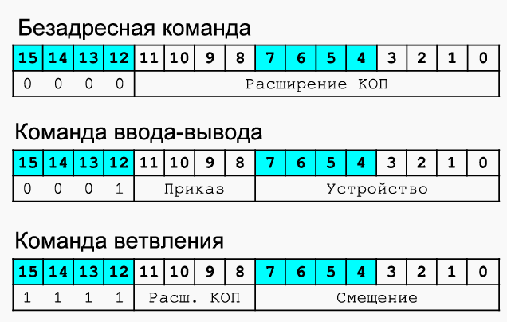

#### 10. Организация вычислений в БЭВМ. Сдвиги, арифметические и логические операции. Цикл выборки команды.

我们知道，计算机普遍使用二进制存储并传输数据。而对于数据的运算则可以使用计算机中的算术逻辑单元 ALU


算术逻辑单元（英语：Arithmetic logic unit，简称：ALU）是一种可对二进制整数执行算术运算或位运算的组合逻辑数字电路

ALU 的输入包括需要运算的数据（也称为运算数）和表明了运算操作类型的指令码。ALU 的输出是其执行运算的结果。在许多的设计中，ALU 还带有状态输入或输出，可将其之前操作或当前操作的信息在 ALU 和外部状态寄存器间传递

- 数据：一个基本的 ALU 具有三个并行的数据总线，包括两个输入操作数（A、B）和结果输出（Y）。每个数据总线都是一组传递了一个二进制整数的信号。通常，A、B 和 Y 的总线宽度（每个总线包含的信号数）是相同的，并且与外部电路（例如，封装 CPU 或其他处理器）的原生字长相同
- 操作码：操作码通过并行总线输入，它向 ALU 传递选择的操作的信息，该操作选择码是对 ALU 要执行的算术或逻辑运算的枚举。操作码的长度（其总线宽度）决定了 ALU 可以执行的操作的最大数量。例如，一个 4 位操作码可最多为 ALU 指定不同的 16 个操作（16=2<sup>4</sup>）
- 状态输出是各类单独的信号，补充表示了有关当前 ALU 操作结果的信息。通用 ALU 通常具有以下状态信号：
  - Carry-out，表示由加法运算产生的进位、由减法运算产生的借位或由二进制移位运算产生的溢出位。
  - Zero，表示运算结果的所有位均为逻辑零。
  - Negative，表示算术运算结果为负。
  - Overflow，表示算术运算的结果溢出，超出了 Y 的数值范围。
  - Parity，表示输出数 Y 的奇偶校验结果，说明 Y 中的含有逻辑 1 的数量的奇偶性。
- 状态输入使 ALU 在执行操作时可接收其他信息。通常，这是单个“低位进位”，传递了来自上一级 ALU 操作的进位
- 算术运算
  - 加法：将操作数 A、B 相加，并在 Y 处得到二者的和
  - 带进位加法：将操作数 A、B、进位相加，并在 Y 处得到三者的和
  - 减法：将操作数 A、B 相减，并在 Y 处得到二者的差。对于此功能，结转实际上是“借入”指示器。此操作也可以用来比较A和B的大小；在这种情况下，处理器可能会忽略 Y 输出，该处理器仅对操作产生的状态位（尤其是零和负）感兴趣。
  - 带借位减法：借位（进位）从 A 中减去 B（反之亦然），差值出现在 Y 处并结转（借入）。
  - 二补数（取相反数）：得到 A 或 B 的相反数（将 0 与 A 相减或将 0 与 B 相减），并在 Y 处得到计算结果
  - 加 1：将 A（或 B）增加 1，并在 Y 处得到计算结果
  - 减 1：将 A（或 B）减小 1，并在 Y 处得到计算结果
  - 直通（Pass through）：保持 A（或 B）的所有位不变，并在 Y 处得到原输入数；该操作常用于对操作数进行奇偶校验，判断是否为 0，判断是否为负数，或者为了将操作数直接加载到寄存器中。
- 按位逻辑运算
  - AND：将 A 和 B 按位进行“与”运算，并在 Y 处得到计算结果
  - OR：将 A 和 B 按位进行“或”运算，并在 Y 处得到计算结果
  - XOR：将 A 和 B 按位进行“异或”运算，并在 Y 处得到计算结果
  - 补码：将 A（或 B）的每一位都反转，并在 Y 处得到计算结果
- 移位操作
  - 算术移位：操作数被视为二补数整数，其高有效位是符号位，在移位时会被保留。
  - 逻辑移位：移位时用逻辑 0 补充操作数，这适合于无符号整数。
  - 循环移位：此时操作数被视为一个循环缓冲区，因此在移位时，其最低和最高位就像是相邻的。
  - 循环移位（带进位）：进位输入（C）和操作数被视为整个操作数的循环移位。
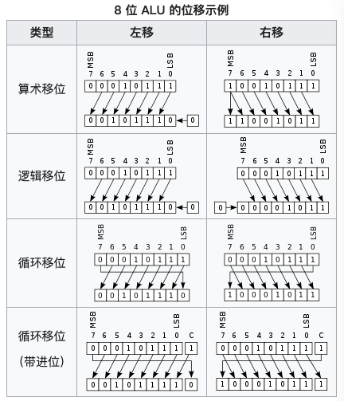

- Цикл выборки команды 寻指周期

  以指令 `ADD 21` 为例：
  - Цикл выборки команды
    命令获取周期开始之前的初始状态

    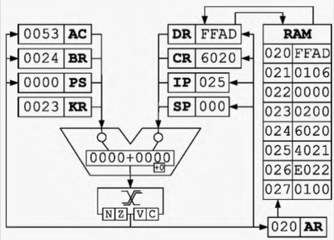
    1. `IP -> BR, AR`：将寄存器 IP 中的数据经过 ALU 写入寄存器 BR 和 AR
     
      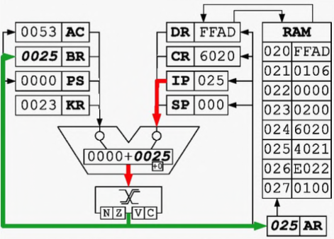

    2. `BR + 1 -> IP, MEM(AR) -> DR`

      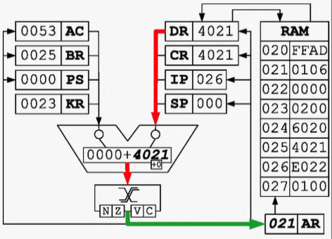

    3. `DR -> CR`

      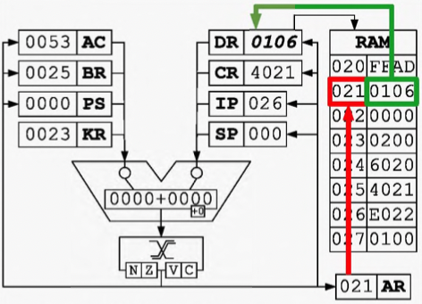
  - Цикл выборки операнда 寻操作数周期
  - Цикл исполнения 执行周期

#### 11. Организация массивов данных. Режимы адресации. Цикл выборки адреса и операнда БЭВМ.

Организация массивов данных. 数据数组的组织。

Элементы массива располагаются один за другим в памяти БЭВМ.  
在微机中数组元素一个接着一个排列在内存中

- Элемент массива занимает ровно слово 数组元素正好只占一个字

  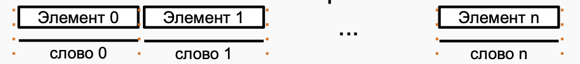

- Элемент меньше слова 数组元素少于一个字

  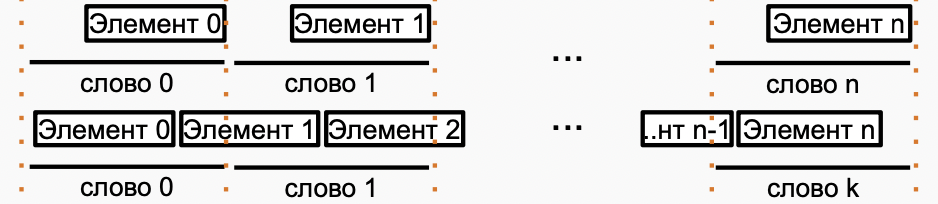

- Элемент больше слова 数组元素大于一个字

  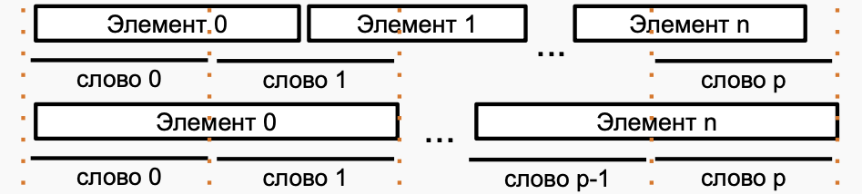

Режимы адресации.

- Прямая абсолютная, режим 0 直接绝对寻址，模式 0
  
  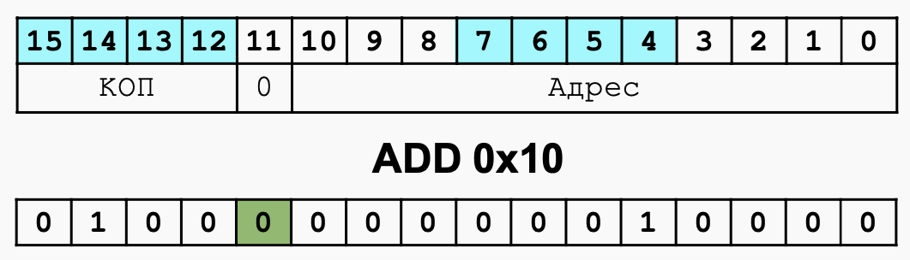
  - Адрес полностью кодируется в младших 11 битах  
    地址以低 11 位编码
  - Непосредственно загружается в AR из кода команды  
    从命令代码直接加载到 AR
- Прямая относительная, режим 1-110 直接相对寻址，模式 1-110
  
  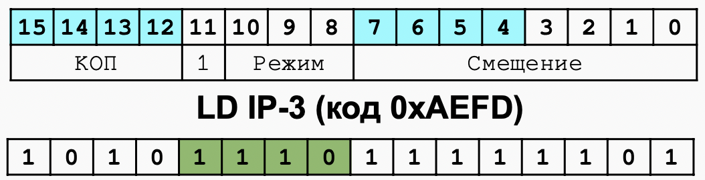

  - В битах 0-7 закодировано смещение относительно адреса следующей команды  
    位 0-7 编码相对于下一条指令地址的偏移量

    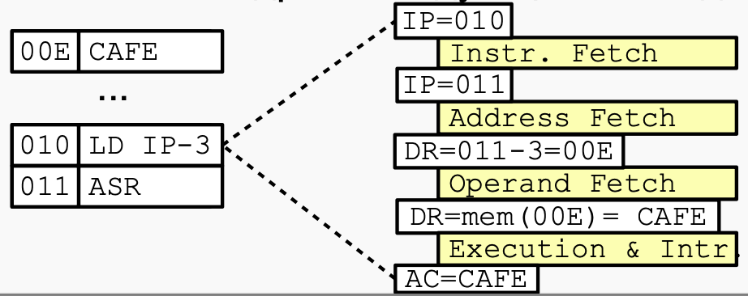

- Режимы: 1-000,1-010,1-011 模式 1-000,1-010,1-011

  Пусть Массив Адрес начала = 0x30 Длина = 0x20:

  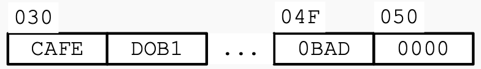

  - Косвенная относительная

    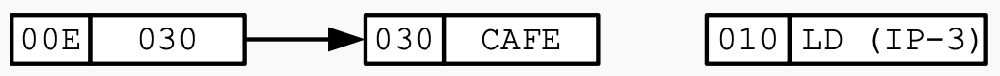

  - Косвенная (относительная) автоинкрементная

    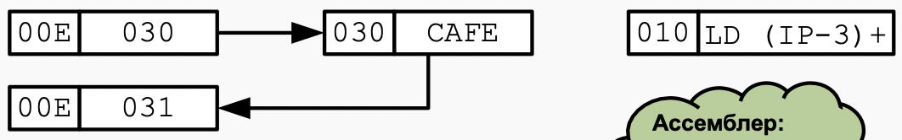

  - Косвенная (...) автодекрементная

    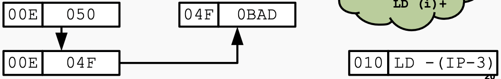

- Со смещением относительно SP, режим 1-100 SP 栈指针偏移寻址，模式 1-100
  - все тоже самое, что и в относительной, только базовый регистр не IP а SP  
    一切都和相对寻址一样，只是基于 SP 寄存器而不是 IP
  - Нужна для выборки параметров со стека  
    需要从堆栈中获取参数
- Прямая загрузка, режим 111 直接载入，模式 1-111

  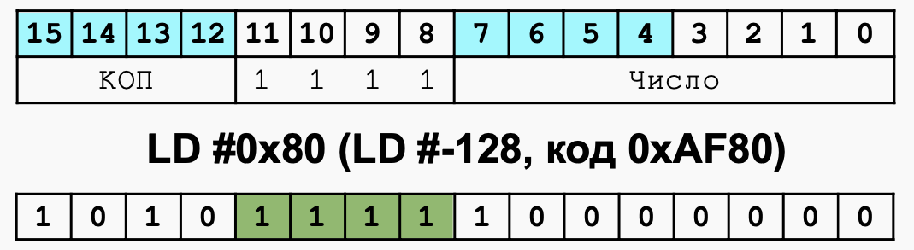

  - Значение в битах 0-7 непосредственно загружается в аккумулятор  
    位 0-7 中的值直接加载到累加器中
  - Происходит расширение знака: бит 7 AC копируется в биты 8-15 AC (нужно для, например, CMP #-5)  
    符号位扩展：第 7 位 被复制到 AC 第 8-15 位

  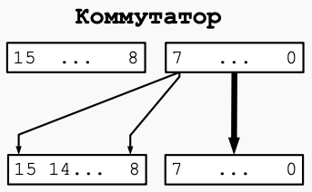

汇总表

  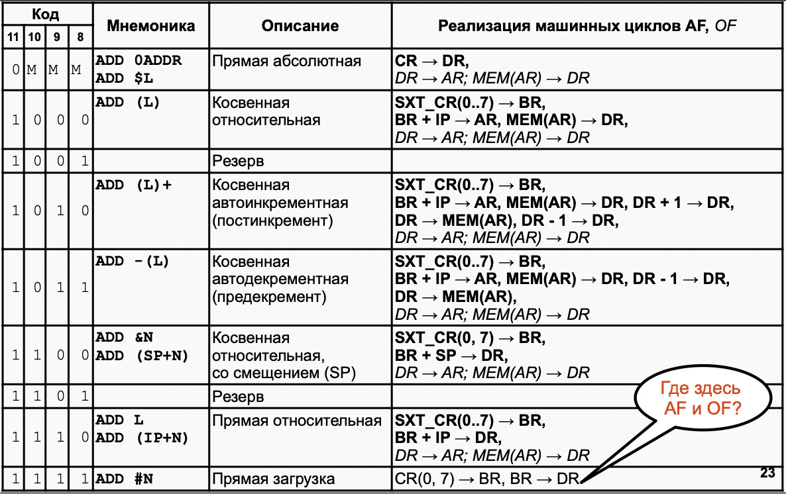

#### 12. Управление вычислительным процессом в БЭВМ. Команды ветвлений, цикл исполнения команды LOOP.

Команды ветвлений

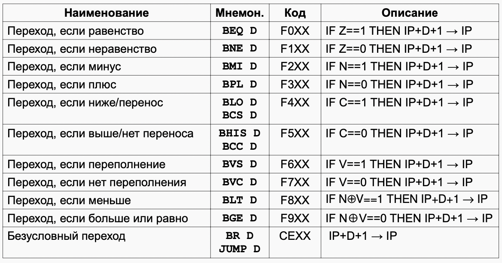

цикл исполнения команды LOOP

DR после м.ц. ОF содержит значение операнда
AR адрес операнда
```
~0+DR→DR; ~0x0=0xFFFF=-1 Вычитание единицы из DR 从 DR 中减一
DR → MEM(AR) ; Записываем значение операнда в память 将操作数的值写入内存
~0 + DR → DR ; Вычитание еще единицы (ЗАЧЕМ?!!) 再减一（为什么？！）
if DR(15) = 0 then GOTO INT 
; Проверка на положительный (DR-1) и если да, то завершение цикла
; 检查正负（DR-1），如果为正，完成循环
IP + 1 → IP ; Перескок через команду, если DR-1 отрицательное
GOTO INT ; Завершение цикла 周期完成
```

#### 13. Подпрограммы в БЭВМ. Цикл исполнения команд перехода и возврата из подпрограммы. Стек, передача параметров. Позиционно-независимый код. Загрузчик и библиотеки.

- Подпрограммы и стек 子程序

  Достаточно часто встречаются ситуации, когда отдельные части программы должны выполнить одни и те же действия по обработке данных (например, вычисление функции). В подобных случаях повторяющиеся части программы выделяют в подпрограмму, а в соответствующие места программы заносят лишь команды обращения к этой подпрограмме. 
  在某些情况下，程序的不同部分必须执行相同的数据处理操作（例如，函数的计算）。在这种情况下，程序的重复部分被分成一个子程序。
- `CALL` 指令
  当程序调用子程序时，首先需要使用 `CALL` 指令将当前 IP 寄存器中存放的下一指令的地址压入栈内，然后跳转到子程序第一个指令

  执行周期：
  - `DR -> BR` Адрес перехода записать в BR 将子程序跳转地址写入 BR
  - `IP -> DR` Подготовить адрес возврата для записи в стек 将子程序返回的地址入栈
  - `BR -> IP` Переход на подпрограмму 将 BR 中子程序跳转地址写入 IP
  - `~0 + SP -> SP, AR` Уменьшить стек на 1 将堆栈指针减 1
  - `DR -> MEM(AR)` Записать адрес возврата 在栈内记录返回地址
  - `GOTO INT` Завершение цикла 周期完成
- `RET` 指令
  将子程序执行结束时，需要在子程序末尾使用 `RET` 指令返回到程序原先执行时的位置

  执行周期
  - `SP -> AR` Вершину стека поместить в AR 将存放原先程序地址的栈指针写入 AR
  - `MEM(AR) -> DR` Прочитать адрес возврата 读取原先程序的地址，写入 DR
  - `DR -> IP` Вернуться из подпрограммы 将原先程序的地址写入 IP，完成从子程序返回
  - `SP + 1 -> SP` 将栈指针 +1 使栈复位
  - `GOTO INT` Завершение цикла 周期完成

- 栈
  栈是内存中的一块区域，遵循先进后出，后进先出的原则读写数据

  - 栈指针 SP
    寄存器，永远存放栈顶部元素的地址
  - `PUSH` 入栈指令
    执行周期：
    - `~0 + SP -> SP, AR`
    - `DR -> MEM(AR)`
  - `POP` 出栈指令
    执行周期
    - `SP -> AR`
    - `MEM(AR) -> DR`
    - `SP + 1 -> SP`

  
- Позиционно-независимый код 地址无关代码
  在计算机领域中，地址无关代码 (position-independent code PIC)，又称地址无关可执行文件 (position-independent executable PIE) ，是指可在主存储器中任意位置正确地运行，而不受其绝对地址影响的一种机器码  

  PIC 广泛使用于共享库，使得同一个库中的代码能够被加载到不同进程的地址空间中  

  PIC 还用于缺少内存管理单元的计算机系统中，使得操作系统能够在单一的地址空间中将不同的运行程序隔离开来

  PIC 能够在不做修改的情况下被复制到内存中的任意位置。这不同于重定位（Relocation (computing)）代码，因为重定位代码需要经过链接器或加载器的特殊处理才能确定合适的运行时内存地址

  PIC 需要在源代码级别遵循一套特定的语义，并且需要编译器的支持。那些引用了绝对内存地址的指令（比如绝对跳转指令）必须被替换为 PC 相对寻址指令
- Загрузчик 程序加载器
  Любая ОС имеет соответствующую программу или часть ядра  
  任何操作系统都有相应的程序或内核的一部分
  - Загрузка по выбранному ОС адресу (даже в виртуальной памяти)  
    在操作系统选择的地址加载（即使在虚拟内存中）
  - Изменение константных частей адресов в программе  
    更改程序中地址的常数部分
  - Загрузка базовых значений регистров Динамическая загрузка разделяемых библиотек  
    加载基本寄存器值共享库的动态加载
  - Связывание адресов основной программы с вызываемыми библиотеками  
    将主机程序地址与调用的库相关联
- Библиотеки 库
  Это набор стандартных библиотечных функций  
  库一组标准库函数

  Разделяемые (динамически линкуемые) и архивные (статически линкуемые)  
  共享（动态链接）和归档（静态链接）

  例如：`# find /lib /usr/lib -name "*.so" | wc -l 3510` 
  Статические связывают вызовы функций с телом функции в процессе компиляции  
  编译期间对函数体的静态绑定函数调用  
  Динамические — в момент загрузки  
  加载时动态

  Если нужна функция — см. в библиотеки  
  如果需要使用库函数 - 请参阅库

#### 14. Организация ввода-вывода в вычислительных системах. Инициация обмена, передача информации и завершение обмена. Драйверы.

бмен информацией с внешним устройством состоит из **инициации обмена**, где осуществляются предварительные действия по подготовке к вводу или выводу данных (установка соединения, ожидание готовности и пр.) и собственно **обмена банными** (их передачей или приемом).  
与外部设备的信息交换包括 **交换的启动**，其中执行初步操作以准备数据的输入或输出（建立连接、等待准备就绪等）和实际的 **数据交换**（它们的传输或接收）。

Обмен может идти под управлением программы ЭВМ через регистры процессора (программно-управляемая передача данных) или под управлением специального внешнего устройства (контроллера прямого доступа в память), минуя процессор (передача данных при прямом доступе к памяти).  
交换可以通过处理器的寄存器在计算机程序的控制下进行（程序控制的数据传输）或在特殊的外部设备（直接内存访问控制器）的控制下，绕过处理器（通过直接内存访问进行数据传输）。

Если и инициацией и обменом занимается центральный процессор, то такой обмен называется **проераммно-управляеммм**. Программно-управляемый обмен по способу инициации разделяется на **синхронным**, когда обмен начинается в заранее известный промежуток времени (например, каждую минуту) и **асинхронным**, когда программе неизвестно время начала обмена данными и она вынуждена периодически проверять возможность обмена (например, готовность внешнего устройства).  
如果启动和交换都由中央处理器处理，则这种交换称为 **程序控制**。当交换以预定的时间间隔（例如，每分钟）开始时，程序控制的交换按启动的方法分为 **同步** 的。当程序不知道数据交换的开始时间，是 **异步** 的。程序需要定期检查交换的可能性（例如，外部设备的准备情况）。

Программно-управляемый обмен осуществляется малыми порциями, при прямом доступе к памяти информация передается большими блоками. При использовании программно-управляемого обмена должна быть составлена программа, обеспечивающая пересылку данных из памяти ЭВМ в аккумулятор и далее в регистр памяти контроллера ВУ (вывод данных) или из регистра данных контроллера ВУ в аккумулятор и затем в память ЭВМ (ввод данных). В этой программе можно реализовать один из трех типов обмена: синхронный, асинхронный и по прерыванию.  
程序控制的交换以小部分进行，通过直接内存访问，信息以大块的形式传输。当使用程序控制交换时，必须编译一个程序，提供从计算机内存到电池，然后到 VU 控制器的内存寄存器（数据输出）或从 VU 控制器的数据寄存器到累加器的数据传输然后到计算机内存（数据输入）。在这个程序中，可以实现三种交换类型之一：同步、异步和中断。

Чтобы исключить периодическую проверку готовности, устройства могут сами инициировать обмен по специальному аппаратному сигналу, который называется **запрос прерывания**, а соответствующий обмен — **управляемый прерываниями ввод-вывод**. При таком способе внешнее устройство сигнализирует процессору о необходимости начать обмен, процессор приостанавливает (**прерывает**) текущую программу, осуществляет ввод-вывод с помощью **npoграммы обработки прерывания**, а затем продолжает выполнять основную программу.  
为了消除周期性的就绪检查，设备可以自己发起一个特殊的硬件信号的交换，称为 **中断请求**，相应的交换是**中断驱动的 I/O**。 使用这种方法，外部设备向处理器发出信号以开始交换，处理器暂停（**中断**）当前程序，使用**中断处理程序**执行 I/O，然后继续执行主程序。
 
**Ввод-вывод с использованием прямого доступа к памяти** (ПДП, в английской литературе DMA) организует и инициацию и обмен данными при помощи контроллеров ПДП. Такие контроллеры передают данные непосредственно в память ЭВМ, при этом центральный процессор в обмене данными не участвует.  
**使用直接内存访问的输入-输出**（ПДП，英文文献中的 DMA）使用 ПДП 控制器组织启动和数据交换。 这种控制器直接将数据传输到计算机内存，而中央处理器不参与数据交换。

Обмен данными (прием и передача) может также быть организован **синхронно**, когда наличие данных на шине подтверждается специальным сигналом синхронизации с постоянной частотой, и **асинхронно**, с использованием сигналов готовности "и/или" подтверждения приема-передачи данных.  
数据交换（接收和传输）可以 **同步** 组织，当总线上的数据存在通过具有恒定频率的特殊同步信号来确认时。也可以 **异步** 地，使用就绪信号 “和/或” 确认数据的传输和接收

Драйверы: 驱动程序：

Задачу инициации и обмена данными в ЭВМ осуществляют специальные программы (такие программы еще называют драйверами), которые совместно с аппаратурой ЭВМ организуют и контролируют процесс ввода-вывода.
计算机中启动和交换数据的任务是由特殊程序（此类程序也称为驱动程序）执行的，这些程序与计算机硬件一起组织和控制输入输出过程

- Организуют совместную работу с устройством 组织与设备的联合工作
- «Знают» о принципах работы устройства, адресах регистров, поддерживаемых режимах работы “了解”设备的操作原理、寄存器地址、支持的操作模式
- Управляются единообразным программным интерфейсом 由统一的软件接口管理

#### 15. Организация ввода-вывода в БЭВМ. Устройства ввода-вывода, команды.

- Устройства ввода-вывода

  <div align=center></div>
  <center>Рисунок В.11 Подсистема ввода-вывода базовой ЭВМ(показаны КВУ и ВУ1,3)<br>图 B.11 基础计算机的 I/O 子系统（显示了 КВУ 和 ВУ1,3）</center>

  Модель базовой ЭВМ с контроллерами устройств ввода-вывода представлена на рис В.11. В базовой ЭВМ используются простейшие внешние устройства (ВУ): устройство вывода (ВУ-1), устройства ввода ВУ-2 и устройство ввода-вывода ВУ-3. В модели устройства ввода-вывода представлены 8-разрядными регистрами данных (РД ВУ). Через регистры данных ВУ-2 и ВУ-3 информация может быть введена в базовую ЭВМ, а в регистры данных ВУ-1 и ВУ-3 принята из базовой ЭВМ.  
  带有 I/O 设备控制器的基本计算机模型如图 B.11 所示。 基本计算机使用最简单的外部设备（ВУ）：输出设备（ВУ-1）、输入设备 ВУ-2 和输入-输出设备 ВУ-3。 在该模型中，输入输出设备由 8 位数据寄存器 (РД ВУ) 表示。 通过数据寄存器 ВУ-2 和 ВУ-3，可以将信息输入到基础计算机，并输入从基础计算机接收的数据寄存器 ВУ-1 和 ВУ-3。

  Кроме того, в последней версии БЭВМ реализован таймер (устройство ВУ-0), которое вызывает прерывание через заданное в его DR число секунд; устройство ввода-вывода ВУ-4, аналогичное с ВУ-3, за исключением того, что используются отдельные регистры для входных и выходных данных; текстовый принтер ВУ-5; бегущая строка ВУ-6; 8-ми разрядный 7-сегментный индикатор ВУ-7; клавиатура ВУ- 8 и цифровая клавиатура ВУ-9.  
  此外，在最新版本的计算机中，实现了一个计时器（ВУ-0 设备），它会在其 DR 中指定的秒数后导致中断； 输入输出设备ВУ-4，类似于ВУ-3，不同之处在于输入和输出数据使用单独的寄存器； 文本打印机 ВУ-5； 运行线 ВУ-6； 8位7段指示器ВУ-7； 键盘 ВУ-8 和数字键盘 ВУ-9。

  Между ВУ и процессором включены простейшие контроллеры внешнего устройства (КВУ), каждый из которых содержит:  
  在 ВУ 和处理器之间，包括最简单的外部设备控制器 (КВУ)，每个控制器都包含：

  - **дешифратор адреса**, позволяющий выделить обращение к данному ВУ среди всех обращений к устройствам ввода-вывода, подключенных к процессору;  
    **地址解码器**，允许您在对连接到处理器的 I/O 设备的所有调用中选择对该 ВУ 的调用；
  - **логику управления КВУ**. набор логических схем, позволяющий реагировать и формировать сигналы шины БЭВМ. Данные схемы не представлены подробно для КВУ-3, в качестве примера реализации необходимо обратится к схеме КВУ-1 на рис. В.11;  
    **КВУ 逻辑控制**，一组逻辑电路，允许您响应和生成计算机总线信号。 这些方案对于 КВУ-3 没有详细介绍；作为实现示例，有必要参考图 B.11 中的 КВУ-1 方案；
  - **регистр данных** (DR - Data Register), через который происходит обмен данными между процессором и внешним устройством;  
    **数据寄存器**（DR - Data Register），通过它在处理器和外部设备之间交换数据；
  - **регистр состояния** (SR - State Register), в котором хранится информация о готовности ВУ к обмену данными с процессором. В контроллерах простейших ВУ используются однобитовые регистры готовности, которые часто называют **флагом**.  
    **状态寄存器**（SR - State Register），它存储有关 ВУ 准备好与处理器进行数据交换的信息。 在最简单的 ВУ 的控制器中，使用了一位就绪寄存器，通常称为**标志**。
  - **регистр управления** (MR - Management Register), регистр, в котором используются 4 младших разряда, разряд 3 - для разрешения прерывания от контроллера и разряды с 0 по 2, которые содержат номер вектора прерывания. Если прерывания разрешены командой `EI` и установлено разрешение прерывания от контроллера (разряд 3), то контроллер будет генерировать сигнал IntRq и выставлять номер вектора прерывания на шину адреса.  
    **管理寄存器**（MR - 管理寄存器），一个使用 4 个最低有效位的寄存器，位 3 - 启用来自控制器的中断，位 0 到 2，其中包含中断向量的编号。 如果使用 `EI` 命令启用中断并且设置了控制器中断启用（位 3），则控制器将生成 IntRq 信号并将中断向量编号设置到地址总线。

  Контроллеры ВУ связаны с процессором при помощи **системной шины** БЭВМ, в сегменты (или, физически, разъемы для установки контроллеров) которой подсоединяются различные шины со стороны процессора и контроллера:  
  ВУ 控制器使用计算机的 **系统总线** 连接到处理器，连接到从处理器和控制器一侧连接各种总线的段（或物理上用于安装控制器的连接器）：

  - **шина данных** (Data0..7), по которым происходит передача данных в процессор или из процессора;  
    **数据总线**（Data0..7），数据通过它传输到处理器或从处理器传输；
  - **шина адреса** (Addr0..7), по которой передается адрес внешнего устройства от процессора к КВУ и номер вектора запроса на прерывание (Int#) от КВУ к процессору, подтверждаемый сигналом выдачи вектора (IntV);  
    **地址总线**（Addr0..7），通过该总线将外部设备的地址从处理器传送到 КВУ 和从 КВУ 到处理器的中断请求向量（Int#）的编号，由向量输出信号确认（IntV）；
  - **сигнал запроса прерывания** (IntRq), по которому выставляется требование прерывания от внешнего устройства;  
    **中断请求信号**（IntRq），它设置来自外部设备的中断请求；
  - **сигнал ввода** (Input) - для передачи приказа на ввод (`IN #reg`);  
    **输入信号**（Input） - 发送输入指令（`IN #reg`）；
  - **сигнал вывода** (Output) - для передачи приказа на вывод (`OUT #reg`);  
    **输出信号**（Output） - 发送输出命令（`OUT #reg`）；
  - **начальный сигнал предоставления прерывания** (IntSC), который управляется программно микрокодом в цикле прерывания по микрокоманде `INTs`.  
    **中断授权开始信号**（IntSC），在`INTs`微指令中断周期由软件微码控制。
  - **входящий цепочный сигнал предоставления прерывания** (IntSCi# - Interrupt Supply Chain input), по которому контоллер, в соответствии с порядком подключения к шине, проверяет возможность предоставления ему прерывания в соответствии с очередью подключения, и генерирует прерывание, если они разрешены глобально командой `EI` и в регистре MR контроллера;  
    **传入的中断供应链信号**（IntSCi# - 中断供应链输入），根据该信号，控制器按照连接到总线的顺序，根据连接队列检查是否授予其中断，以及如果它们由 `EI` 命令全局启用并在寄存器 MR 控制器中启用，则生成中断；
  - **исходящий цепочный сигнал предоставления прерывания** (IntSCo# - Interrupt Supply Chain output), который передает контроллер по шине далее следующему КВУ, если нет необходимости вызвать прерывание вычислительного процесса;  
    **输出中断供应链信号**（IntSCo# - 中断供应链输出），如果不需要在计算过程中引起中断，它将控制器通过总线转移到下一个 КВУ；
  - **сигнал готовности** (Rdy), подтверждающий завершение операции ввода- вывода внутри цикла обмена между АС и DR соответствующего КВУ. В случае операции ввода Rdy подтверждает данные, передаваемы по шине данных, и в обоих случаях операции ввода-вывода сигнализирует о том, что цикл обмена с регистром данных DR контроллера завершен;  
    **就绪信号**（Rdy），确认对应 КВУ 的 AC 和 DR 之间的交换周期内 I/O 操作完成。 在输入操作的情况下，Rdy确认数据总线上传输的数据，并且在两种 I/O 操作的情况下都发出与控制器的数据寄存器 DR 的交换周期完成的信号；
  - **сигнал синхронизации** (Syn) от тактового генератора БЭВМ, который задает временной слот единичного обмена по шине БЭВМ.  
    来自计算机时钟发生器的 **同步信号** (Syn)，它设置计算机总线上单个交换的时隙。

  Со стороны процессора к системной шине БЭВМ подключены:  
  在处理器端，以下连接到计算机的系统总线：

  - **дешифратор приказа** (DC IO), который преобразует приказ в КОП команды ввода-вывода в набор управляющих сигналов на шине. 0-й выход дешифратора активен после команды `DI`; 1 - для `EI`; 2 - для команды `IN`, формируя на шине БЭВМ сигнал Input; 3 — для команды `OUT` и сигнала Output.  
    **指令解码器**（DC IO），它将 I/O 命令的 CPC 指令转换成总线上的一组控制信号。 `DI` 命令后解码器输出 0 有效； 1 - 用于指令 `EI`; 2 - 用于指令 `IN`，形成计算机总线上的输入信号； 3 - 用于 `OUT` 命令和输出信号。
    Выходы, начиная с 4-го не используются;  
    不使用从第 4 个开始的输出；

  - **регистр разрешения прерывания**, который входит в состав PS 5-ым разрядом, и показывает глобальный статус разрешений прерывания в процессоре;  
    **中断使能寄存器**，是 PS 位 5 的一部分，指示处理器中的全局中断使能状态；
  - **регистр прерывания от КВУ**. по которому выполняется цикл прерывания, если прерывания разрешены глобально и в настоящее время на шине БЭВМ есть запрос на прерывание от одного из КВУ. Данный регистр входит в состав PS в 6-ым разрядом;  
    **КВУ 中断寄存器**。 如果全局启用中断并且当前在计算机总线上有来自 КВУ 之一的中断请求，则执行中断周期。 该寄存器是第 6 位 PS 的一部分；
  - **логика управления шины БЭВМ** предназначена для подключения и отключения приемо-передатчиков сигналов КВУ и процессора для осуществления обмена CPU с одним из контроллеров в один момент времени.  
    **计算机总线的控制逻辑** 设计用于连接和断开 КВУ 信号的收发器和处理器，以便一次与其中一个控制器交换 CPU。

  Назначение регистров контроллеров внешних устройств представлены в таблице В.12.  
  外部设备控制器寄存器的用途如表 B.12 所示。

  <div align=center></div>
  <center>Таблица В. 12 Назначение регистров на шине ввода-вывода БЭВМ.<br>表 B. 12 计算机输入输出总线上的寄存器分配。</center>

  - R - означает, что регистр доступен только для чтения    
    R - 表示寄存器仅可用于读取
  - W - только для записи  
    W - 仅可用于写入
  - R/W - доступен для обоих операций  
    R/W - 可用于两种操作

  Направление обмена закодированы мнемоникой Data In для ввода данных из КВУ, Data Out - для вывода данных в КВУ, а Data i/o - для двунаправленного обмена.  
  交换的方向由 Data In 助记符编码，用于从 КВУ 输入数据，Data Out - 用于向 КВУ 输出数据，Data i/o - 用于双向交换。

- Команды IO

Команды ввода-вывода приведены на рисунке В.13. Указан формат команды, в котором код операции представлен значением 0x1 в разрядах с 12 по 15. В разрядах 8..11 располагается приказ на ввод-вывод, его три младших разряда декодируются аппаратно на дешифраторе приказов (DC IO), а биты с 0 по 7 кодируют адрес регистра контроллера ввода вывода, с которым осуществляется обмен. К командам добавлена операция возврата из прерывания `IRET`, которая осуществляет восстановление из стека значений регистра состояния и счетчика команд.  
I/O 命令如图 B.13 所示。 指定命令格式，其中操作码由位 12 到 15 中的值 0x1 表示。位 8..11 包含一个 I/O 指令，它的三个最低有效位由指令解码器上的硬件解码（DC IO)，位 0 到 7 编码与执行交换的 I/O 控制器的寄存器地址。 命令中增加了`IRET`中断返回操作，从堆栈中恢复状态寄存器和程序计数器的值。

- Команда `DI` запрещает прерывания, помещая в 5 бит регистра состояния '0'.  
  `DI` 命令通过将状态寄存器的第 5 位设置为“0”来禁用中断。
- Команда `EI` разрешает прерывания, помещая в 5 бит регистра состояния '1'.  
  `EI` 指令通过将状态寄存器的第 5 位设置为 '1' 来启用中断。
- Команда `IN #reg` осуществляет чтение из регистра ВУ по адресу в аккумулятор.  
  `IN #reg` 指令将地址处的 ВУ 寄存器读取到累加器中。
- Команда `OUT #reg` осуществляет запись из аккумулятора по адресу в регистр ВУ.  
  `OUT #reg` 命令从地址处的累加器写入 ВУ 寄存器。
- Команда `INT #num` вызывает программное прерывание с вектором num.  
  `INT #num` 指令导致带有向量 num 的程序中断。
- Команда `IRET` возврат из программы обработки прерывания.  
  `IRET` 指令是中断处理程序的返回。

<center>Формат команд ввода-вывода<br>I/O 命令格式</center>
<div align=center></div>
<center>Команды, связанные с вводом-выводом<br>I/O 相关命令</center>
<div align=center>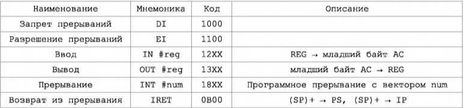</div>
<center>Рисунок В. 13 Ввода-вывод: Команды и формат.<br>图 B. 13 I/O 命令与格式。</center>

#### 16. Организация асинхронного обмена в БЭВМ. Пример программы. Временные издержки асинхронного обмена.

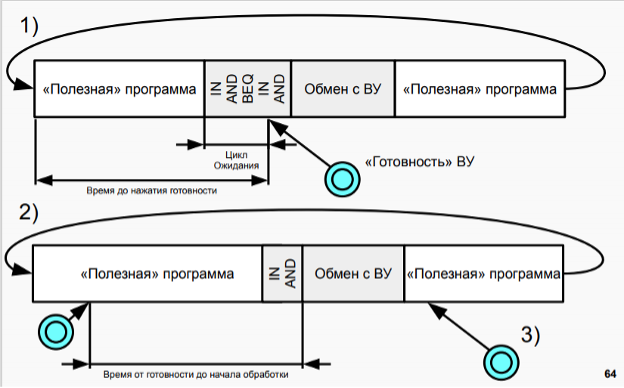

При использовании программно-управляемого асинхронного обмена должна быть составлена программа, обеспечивающая пересылку данных из памяти ЭВМ в аккумулятор и далее в регистр памяти контроллера ВУ (вывод данных) или из регистра данных контроллера ВУ в аккумулятор и затем в память ЭВМ (ввод данных). Программа такого обмена строится так: сначала проверяется готовность ВУ к обмену и если оно готово, то дается команда на обмен. ВУ сообщает о готовности установкой флага в 6-м разряде регистре SR.  
当使用程序控制的异步交换时，必须编译一个程序，提供从计算机内存到累加器，然后到 ВУ 控制器的内存寄存器（数据输出）或从 ВУ 控制器的数据寄存器到累加器，然后到计算机内存（数据输入）。 这种交换的程序是这样构建的：首先，检查 ВУ 是否准备好交换，如果准备好，则发出交换命令。 ВУ 通过在 SR 寄存器的第 6 位设置一个标志来报告准备就绪。

Пример. С помощью устройства ввода ВУ-2 (DR#4, SR#5) записать в ячейку в памяти коды символов слова "ДА" в кодировке K0I8-R. Пример программы представлен в табл. В.14.  
例子。 使用 ВУ-2 输入设备（DR#4、SR#5），将 K0I8-R 编码中单词“YES”的字符代码写入内存中的一个单元格。 示例程序如表所示。 B.14。

<div align=center>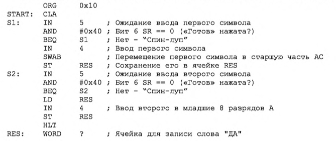</div>
<center>Таблица В. 14 Ввод данных с использованием ВУ-2 Ассеблерный листинг.<br>表 B.14 使用 VU-2 汇编器列表的数据输入。</center>
<center>Листинг примера: Ввод двух символов с устройства ввода ВУ-2 (DR#4, SR#5)<br>示例清单：从 ВУ-2 输入设备（DR#4、SR#5）输入两个字符
</center>

В начале программа висит в ожидании готовности: считывается статусный (с номером 5) регистр ВУ-2, который передается через шину данных в 6 разряде числа, сравнивается с 0x40 (01000000г), и пока устройство не готово (SR равен 0). Такие циклы с неопределенным временем завершения, называются циклами “spin-loop”, они постоянно проверяет готовность устройства или переменной в программе, загружая процессор. Как только 6 разряд SR принимает значение 1 (устройство готово), в регистр данных ВУ считывается в младшие 8 разрядов аккумулятора, старшие разряды АС при этом остаются не изменными. Для того, чтобы подготовить АС к приему второго символа, происходит обмен байтов аккумулятора при помощи  команды `SWAB`, и сохранение этого символа в старших разрядах в ячейку результата. Далее снова происходит ожидание готовности устройства, после получения готовности загружается ячейка с результатом и считывается 2 символ в младшую часть аккумулятора. Готовое слово с двумя символами в аккумуляторе сохраняется в ячейку результата.  
一开始，程序挂起等待就绪：状态寄存器（编号为5）ВУ-2 被读取，通过数据总线在编号的第 6 位传输，与 0x40（01000000g）比较，直到设备准备就绪（SR 为 0）。这种具有无限完成时间的循环称为“自旋循环”循环，它们不断检查程序中设备或变量的准备情况，加载处理器。一旦 SR 的第 6 位取值 1（设备准备就绪），ВУ 数据寄存器就被读入累加器的低 8 位，而 AC 的高位保持不变。为了准备 AU 接收第二个字符，累加器的字节使用 `SWAB` 命令交换，并且该字符存储在结果单元的高位中。接下来，设备再次等待准备就绪，在收到准备就绪后，加载具有结果的单元格并将第二个字符读入累加器的低位。累加器中包含两个字符的完成单词存储在结果单元格中。

Необходимо еще раз подчеркнуть, что ввод-вывод происходит только с младшей частью аккумулятора, старшая часть во время выполнения команд `IN` ли `OUT` не изменяется. Также важно, что при данной реализации асинхронного обмена ЭВМ тратит время на ожидание (неопределенно долгое!) момента готовности циклически опрашивая флаг (spin-loop) и не может выполнять никакой другой работы. Разумная организация процедур ввода-вывода позволяет избегать такого зацикливание, например через периодический опрос флага при выполнении основной программы или через прерывания.  
必须再次强调，I/O 只发生在累加器的下部，在执行 `IN` 或 `OUT` 命令期间上部不会改变。同样重要的是，通过这种异步交换的实现，计算机通过循环轮询标志（自旋循环）花费时间（无限期地！）等待准备就绪，并且不能执行任何其他工作。 I/O 过程的合理组织可以让您避免这样的循环，例如，通过在主程序执行期间定期轮询标志或通过中断。

#### 17. Организация прерываний в БЭВМ. Вектора прерываний, контроллер прерывания.

Прерывание — одна из базовых концепций вычислительной техники, которая заключается в том, что при наступлении какого-либо события происходит передача управления специальной процедуре, называемой обработчиком прерываний (ISR, англ. Interrupt Service Routine). В отличие от условных и безусловных переходов, прерывание может быть вызвано в любом месте программы, в том числе если выполнение программы приостановлено, и обусловлено обычно внешними по отношению к программе событиями. После выполнения необходимых действий, обработчик прерываний, как правило, возвращает управление прерванной программе.  
中断是计算机技术的基本概念之一，它在于当事件发生时，控制权被转移到一个特殊的程序，称为中断服务程序（Interrupt Service Routine，ISR）。与条件跳转和无条件跳转不同，中断可以在程序的任何地方调用，包括程序执行是否暂停，并且通常是由程序外部的事件引起的。在执行了必要的操作之后，中断处理程序通常会将控制权返回给被中断的程序。

- Организация прерываний в БЭВМ.
  Прерывание — сигнал от программного или аппаратного обеспечения, сообщающий процессору о наступлении какого-либо события, требующего немедленного внимания. В контексте БЭВМ это сигнал о готовности обмена данными с некоторым ВУ.  
  中断是来自软件或硬件的信号，它告诉处理器发生了一些需要立即注意的事件。在计算机的上下文中，这是关于与某些 VU 数据交换准备就绪的信号。

  Также стоит отметить преимущества над асинхронным режимом передачи данных (если Вы помните, то реализовывать его можно двумя способами: через spin-loop или одну проверку с последующим окном ввода-вывода в циклической полезной программе):  
  还值得注意的是与异步数据传输模式相比的优势（如果您还记得，那么您可以通过两种方式实现它：通过自旋循环或在循环有用的程序中进行一次检查，然后是 I/O 窗口）：

  -	процессор не простаивает в ожидании готовности ВУ  
    处理器没有空闲等待 VU 准备好
  -	организованная работа сразу со всеми нужными нам ВУ  
    一次组织好所有我们需要的外部设备的工作
  -	если все ВУ не готовы к обмену, то процессор занят полезной работой
    如果所有 VU 都没有准备好进行交换，那么处理器忙于有用的工作

  Ярким отличием прерываний является обязательное сохранение состояния процессора в момент прерывания, чтобы когда прерывание было обработано, мы смогли вернуться в основную программу и смогли продолжить ее выполнение без разнообразных коллизий.  
  中断之间的一个显着区别是在中断时强制保存处理器的状态，以便在处理中断时，我们可以返回主程序并能够继续执行它而不会发生各种冲突。

- Вектор прерывания: 中断向量：

  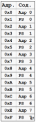

  - Совокупность адреса программы обработки прерывания и регистра состояния (PS)  
    中断程序的地址和状态寄存器（PS）的组合  
  - Необходимо инициализировать перед началом обработки прерывания  
    必须在开始中断处理之前进行初始化  
    Хотя бы установить на подпрограмму, которая ничего не делает  
    至少设置为一个什么都不做的子程序  
    Ответственность OS и БИОС  
    操作系统和 BIOS 的责任  
  - В БЭВМ-NG ячейки с 0x000 по 0x10  
    在 0x000 到 0x10 的 BEVM-NG 单元中  
    Всего 8 векторов, по два слова на вектор  
    总共 8 个向量，每个向量两个词
    На одном векторе может быть несколько прерываний  
    一个向量上可以有多个中断

Регистр управления или Management Register — регистр, хранящий в себе информации о разрешении/запрете прерывания от данного ВУ и вектора прерывания, к которому привязано ВУ.  
控制寄存器或管理寄存器是存储有关允许/禁止来自给定 VU 的中断和 VU 连接到的中断向量的信息的寄存器

В 3х младших битах содержится номер вектора прерывания, в 3 бите будет 1, есди прерывания от данного ВУ разрешены и 0 — если запрещены.  
最低有效 3 位包含中断向量的编号，如果来自此 VU 的中断被启用，第 3 位将为 1，如果它们被禁用，则第 3 位将为 0

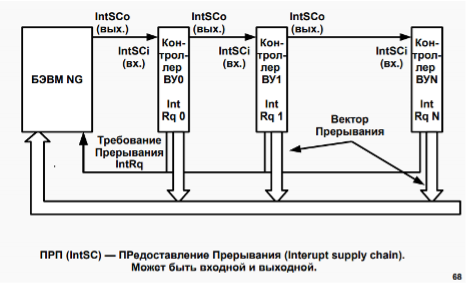

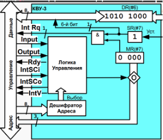

-	Сигнал последовательно проходит через контроллеры 0, 1, 2 и останавливается в логике управления КВУ-3  
  信号依次通过控制器 0、1、2 并在 КВУ-3  控制逻辑中停止
-	Внутри ЛУ происходит магия и открывается вентиль у MR (переключаемся на 2 картинку)
  ЛУ 内部发生魔法，MR 处的阀门打开
-	MR подключается к CR через шину адреса и младшие три бита MR записываются в младшие 3 бита CR, при этом оставшиеся 5 бит младшего байта CR заполняются нулями.
  MR 通过地址总线与 CR 相连，MR 的低 3 位写入CR 的低3 位，CR 低字节的剩余 5 位用 0 填充
-	Параллельно с этим ЛУ маскирует сигнал IntSCo и сигнал предоставления прерывания не передается в следующие контроллеры  
  与此同时，ЛУ 屏蔽 IntSCo 信号，并且不将中断授权信号传递给以下控制器
-	Также на шину управления поступает сигнал из ЛУ IntV (Interrupt Vector), который информирует о предоставлении данным контроллером номера вектора прерывания.
  此外，控制总线接收来自 ЛУ IntV（中断向量）的信号，该信号通知该控制器提供的中断向量编号


#### 18. Организация обмена по прерыванию программы в БЭВМ. Пример программы. Цикл прерывания.

- Обмена по прерыванию программы в БЭВМ.

  Этот вид обмена отличается от асинхронного тем, что сигнал готовности ВУ к обмену анализируется не программным, а аппаратным путем. ЭВМ может выполнять любую не связанную с обменом программу (будем называть ее основной).  
  这种交换与异步交换的不同之处在于，交换 ВУ 的就绪信号不是由软件分析，而是由硬件分析。 一台计算机可以执行任何与交易所无关的程序（我们称之为主程序）。

  Когда будет нажата кнопка готовности, то в случае, если в контроллере прерывания разрешены (наприме, реализуется через схему „И“ регистра состояния SR и старшего бита регистра управления MR, рис. В.11, контроллер КВУ-1) поступает сигнал "Запрос прерывания" по линии IntRq. После чего этот сигнал поступит на схему „И“ центрального процессра В.11 с 5 битом регистра состояния (EI - разрешение прерываний) проверяющий разрешены ли прерывания в ЭВМ и записывающий результат схемы в 6 бит регистра состояния (INT - прерывание). После цикла исполнения очередной инструкции основной программы в ЭВМ будет запущен комплекс программ, проверяющий, было ли требование прерывания, и если было, то формирует управляющий сигнал "Предоставление прерывания" IntSC, который последовательно проходит через все контроллеры (сигналы IntSCo - выходной и IntSCi - входной) и проверяет было ли в этом контроллере прерывание. Когда сигнал доходит до нужного контроллера, то он выставляет на шину адреса свой номер вектора прерывания (см. рис. В.15). После чего процессор по номеру прерывания вызывает программу обработки прерывания.  
  当按下就绪按钮时，如果控制器中允许中断（例如通过 SR 状态寄存器的“与”电路和 MR 控制寄存器的高位实现，图 B.11，КВУ- 1 控制器），信号“中断请求”在线 IntRq。之后，此信号将与状态寄存器的 5 位（EI - 中断使能）进入中央处理器 B.11 的“与”电路，检查计算机是否允许中断，并将电路的结果写入状态寄存器的 6 位（INT - 中断）。在主程序的下一条指令执行周期后，计算机会启动一组程序，检查是否有中断请求，如果有，则产生控制信号“Granting an interrupt” IntSC，即依次通过所有控制器（信号 IntSCo - 输出和 IntSCi - 输入）并检查此控制器中是否存在中断。当信号到达所需的控制器时，它将其中断向量号放在地址总线上（见图 B.15）。之后，处理器通过中断号调用中断处理程序。

  Ячейки памяти с адресами О-OxF отведены для инициализации векторов прерывания, по 2 ячейки на каждый вектор. В начале программы все контроллеры ВУ, в которых должны вызывать прерывания должны быть проинициализированы.  
  地址为 O-OxF 的存储单元保留用于初始化中断向量，每个向量 2 个单元。 在程序开始时，所有要调用中断的 ВУ 控制器都必须初始化。

  Если прерывания разрешены, то после выполнения всех команд кроме `HLT`, а также если режим выполнения БЭВМ установлен в значение "РАБОТА", выполняются следующие действия:  
  如果启用了中断，则在执行除 `HLT` 之外的所有命令后，并且如果计算机执行模式设置为“РАБОТА”，则执行以下操作：

  <div align=center></div>
  <center>Рисунок В. 15 Распространение сигналов предоставления прерывания<br>图 B.15 中断准许信号的传播</center>


  - Шаг 1. По завершению цикла исполнения текущей команды происходит переход на цикл прерывания. Если в этот момент 6 бит регистра состояния INT (прерывание) не равен 1, то происходит переход к следующей команде. При наличии требования прерывания БЭВМ формирует сигнал "Предоставление прерывания" (IntSC) через выполнение микрокоманды `INTS`.  
    Step 1. 当前命令的执行周期结束后，进入中断周期。 如果此时状态寄存器 INT（中断）的第 6 位不等于 1，则转移到下一条指令。 如果有中断请求，计算机通过执行 `INTS` 微指令产生一个“Interrupt Grant”（IntSC）信号。
  - Шаг 2. Сохраняется счетчик команд и регистр состояния БЭВМ в стеке.  
    步骤 2. 程序计数器和计算机状态寄存器存储在堆栈中。
  - Шаг 3. Младшие 8 разрядов (номер вектора прерывания) записываются в буферный регистр и вычисляется адрес с переходом на подпрограмму обработки прерывания, как номер вектора * 2, после чего тот записывается в DR, а после в IP.  
    Step 3. 将低 8 位（中断向量号）写入缓冲寄存器，并计算地址，转移到中断处理程序作为向量号 * 2，然后写入 DR，然后写入 IP .
  - Шаг 4. Далее к младшим 8 разрядам буферного регистра прибавляется 1, чтобы выбрать адрес следующей ячейки вектора прерывания (новый регистр состояния PS), ограничивая результат 8-ю разрядами. После чего по этому адресу содержимое в памяти записывается в DR, а после в PS.  
    Step 4. 接下来，将缓冲寄存器的低 8 位加 1 以选择中断向量的下一个位置（新的 PS 状态寄存器）的地址，将结果限制为 8 位。 之后，在这个地址，内存中的内容被写入 DR，然后写入 PS。
  - Шаг 5. Контроллер прерываний вновь переводится в состояние разрешение прерывания командой `EI` и осуществляется возврат к выполнению прерванной программы, т.е. к команде, адрес которой хранится в стеке, также восстанавливается сохраненный регистр состояния из стека.  
    Step 5. 中断控制器通过 `EI` 命令返回中断使能状态，被中断的程序返回执行，即 对于地址存储在堆栈中的指令，保存的状态寄存器也从堆栈中恢复。

- Пример. Составить программу, которая постоянно наращивает на 1 содержимое аккумулятора. Восемь младших разрядов удвоенного значения аккумулятора должны выводиться на ВУ-1 по его запросу, а по запросу ВУ-3 содержимое регистра данных ВУ-3 должно записаться в ячейку 3F.  
  例子。 编写一个程序，将累加器的内容连续加 1。 累加器的加倍值的最低八位应根据 ВУ-1 的请求输出到 ВУ-1，应 ВУ-3 的请求，应将 ВУ-3 数据寄存器的内容写入单元 3F。

  <center>示例列表：ВУ1 的准备情况：2*A-> РДВУ1，ВУЗ 的准备情况：РДВУЗ-> яч.3F</center>

  <div align=center></div>
  <div align=center></div>

  <center>Таблица В. 16
  Ввод данных с использованием прерываний. Ассемблерный листинг.<br>使用中断输入数据。 汇编列表。</center>

  Если эту программу занести в память базовой ЭВМ, установить в СК пусковой адрес 20 и нажать кнопку ПУСК, то начнет выполняться бесконечный цикл наращивания содержимого аккумулятора. Когда же на пульте управления (рис В.11) будет нажата любая из кнопок готовности ВУ, то будет выполнен переход к подпрограмме обработки прерываний.  
  如果将该程序输入到主机的内存中，在 СК 中设置起始地址 20 并按下 ПУСК 按钮，则将开始进行无限循环的增加电池内容。 当按下控制面板上的任何 ВУ 就绪按钮时（图 B.11），将转换到中断处理子程序。

  Для отладки программы (табл. В.8) в ней используются точки останова. Если в ячейке памяти точки останова расположена команда `NOP`, то программа выполняется в обычном, не отладочном режиме. Если вместо `NOP` поместить команду `HLT`, то программа во время выполнения остановится и будет возможно проконтролировать содержимое регистров и ячеек памяти. После завершения контроля необходимо продолжить дальнейшее исполнение программы. В приведенном примере точки останова позволяют исследовать содержимое аккумулятора в момент возникновения прерывания, а так же правильность подсчета и вывода на ВУ-3 удвоенного его значения.  
  为了调试程序（表 B.8），它使用断点。如果 `NOP` 命令位于断点存储单元中，则程序以正常的非调试模式执行。如果我们使用 `HLT` 命令代替 `NOP`，那么程序将在执行期间停止，并且可以检查寄存器和内存单元的内容。控制完成后，需要继续执行程序。在上面的例子中，断点可以让你在中断发生的那一刻检查累加器的内容，以及计数的正确性并将其双倍值输出到 ВУ-3。

- Цикл прерывания:

  1. IF PS(W) == 0: GOTO STOP; Если тумблер РАБОТА\ОСТАНОВ установлен на ОСТАНОВ, то работа БЭВМ прекращается 如果 WORK/STOP 拨动开关设置为 STOP，则计算机操作停止
  2. IF PS(IRQ) == 0: GOTO INFETCH; Если запроса на прерывания нет (0 в 6 бите PS), то переходим к циклу выборки СЛЕДУЮЩЕЙ 如果没有中断请求（PS 位 6 中的 0），则进入下一个取指周期 команды
  3. IRQSC; Формируется сигнал предоставления прерывания 产生中断准许信号
  4. SP + ~0 -> SP, AR;
  5. IP -> DR; ///IP -> -(SP) 
  6. DR -> MEM(AR);
  7. SP + ~0 -> SP, AR;
  8. PS -> DR; ////PS -> -(SP)
  9. DR -> MEM(AR); LTOL(CR) -> BR; Выделили номер вектора прерывания 分配的中断向量编号
  10. SHL(BR) -> BR, AR; Выделили адрес адреса обработчика прерывания (тавтология, привет) 突出显示中断处理程序的地址（重言式，你好）
  11. MEM(AR) -> DR; в DR адрес обработчика прерывания 在 DR 中断处理程序地址
  12. DR -> IP
  13. LTOL(BR + 1) -> AR ; в AR адрес, в котором лежит PS для обработчика прерывания 在 AR 中，中断处理程序的 PS 所在的地址
  14. MEM(AR) -> DR
  15. DR -> PS


#### 19. Понятие многоуровневой ЭВМ. Понятие и пример программы на разных уровнях.

- Понятие многоуровневой ЭВМ 计算机的多级结构  
  从外到内排列为：
  1. Концептуальный уровень: Постановка задачи  
    概念层面：问题陈述
  2. Уровень высокоуровневых языков: Написание программмы на языках высокого уровня
    高级语言级别：用高级语言编写程序
  3. Ассемблерный уровень: происходит трансляц программ ассемблером.
    汇编级：汇编程序被翻译。
  4. Уровень ОС команды: традиционного машинного уровня и функции ОС и BIOS (ком ввода/вывода, ком раб с файлами, ком для паралл обработки, ком для организации виртуальной памяти…)
    系统指令级别：传统机器级别以及 OS 和 BIOS 功能（I/O com、file slave com、并行处理 com、虚拟内存组织 com……）
  5. Традиционный машинный уровень: это уровень машинных команд. Этот уровень обеспечивает связь аппаратных и программных средств ЭВМ.
    传统机器级别：这是机器指令的级别。 该级别提供计算机的通信硬件和软件。
  6. Микропрограммный уровень: производится проектирование аппаратных средств ЭВМ, удовлетворяющих спецификации машинных команд, требованиям по производительн и стоимости и др.
    微程序级：计算机硬件设计满足机器指令规范、性能和成本要求等。
  7. Уровень логических(булева алгебра) и электронных схем(диф ур): Функциональные модули аппаратной части (АЛУ, УУ) выполняются в виде комбинац и послед-ностных схем, сост из логических элементов
    逻辑（布尔代数）和电子电路级别：硬件的功能模块（ALU、CU）以组合和时序电路的形式实现，由逻辑元素组成

#### 22. Микропрограммное управление вентильными схемами. Схема управления. Интерпретатор БЭВМ.

- Микропрограммное управление вентильными схемами 固件门电路控制  
  Процесс выборки, дешифрации и исполнения команд ЭВМ состоит из последовательности элементарных операций (например, пересылка содержимого одного регистра 8 другой регистр или проверка определенного бита в каком-либо регистре). Для выполнения таких микроопераций, как правило, достаточно подать открывающий сигнал на одну или несколько вентильных схем, связывающих между собой два регистра, регистр и АЛУ и (или) перестраивающих АЛУ на выполнение заданной операции (сложения, логического умножения и т.п.). Требуемая последовательность сигналов на вентильные схемы ЭВМ вырабатывается ее устройством управления, связанным с тактовым генератором.  
  选择、解码和执行计算机命令的过程由一系列基本操作组成（例如，将一个寄存器 8 的内容传送到另一个寄存器或检查任何寄存器中的某个位）。为了执行这样的微操作，作为一项规则，将打开信号应用到一个或多个将两个寄存器、一个寄存器和一个 ALU 互连的门电路和（或）重建 ALU 以执行给定的操作（加法，逻辑乘法等）。计算机阀电路所需的信号序列由与时钟发生器相关的控制装置产生。

  <div align=center></div>

  <center>Рисунок В. 17 Микропрограммное устройство управления БЭВМ с блоком регистров и АЛУ<br>图 C. 17 具有寄存器块和 ALU 的计算机的固件控制单元</center>

  Микропрограммное устройство управления (МПУ) базовой ЭВМ - это, в свою очередь, очень простая ЭВМ, для которой регистры и вентильные схемы процессора являются как бы устройствами ввода-вывода (рис. В.17).  
  基础计算机的微程序控制单元 (MPU) 又是一个非常简单的计算机，处理器的寄存器和门电路可以说是输入输出设备（图 B.17）。

  Программа работы такой ЭВМ называется микропрограммой, а ее команды, содержащие информацию об элементарных действиях, выполняемых в течение одного рабочего такта ЭВМ, - микрокомандами. В одном из вариантов реализации МПУ используется всего два типа микрокоманд - операционная и управляющая.  
  这种计算机的工作程序称为微程序，其包含有关计算机一个工作周期内执行的基本动作的信息的指令称为微指令。 在实现 MPU 的选项之一中，仅使用两种类型的微指令——操作和控制。

  Микропрограмма обычно хранится в постоянном запоминающем устройстве - памяти микрокоманд, но в эмуляторе БЭВМ реализована возможность изменения микропрограммы. В каждом такте работы ЭВМ из этой памяти в регистр микрокоманд (РМК) пересылается очередная микрокоманда, т.е. микрокоманда, на которую указывает счетчик микрокоманд (СчМК), одновременно выполняющий функции регистра адреса микрокоманд.  
  微程序通常存储在只读存储器——微命令存储器中，但计算机仿真器具有改变微程序的能力。 在计算机运行的每个周期中，下一条微指令都会从这个存储器发送到微指令寄存器（RMC），即 由微指令计数器（CHMK）指向的微指令，它同时执行微指令地址寄存器的功能。

  Существует 2 типа микрокоманд (рис. В. 18) - операционная (ОМК) и управляющая (УМК). Биты 0-15 обоих типов совпадают, логика остальных зависит от типа. В 39-ый бит РМК записывается код операции, исходя из которого происходит выбор типа микрокоманды (0 - для ОМК; 1 - для УМК). Этот сигнал подается напрямую на вентили УМК (16-32 биты РМК) и через инвертор на вентили ОМК (16- 35 биты РМК), открывая/закрывая биты УМК/ОМК, тем самым производя выбор типа микрокоманды.  
  有 2 种类型的微命令（图 B.18） - 操作（OMK）和控制（UMK）。 两种类型的位 0-15 相同，其余的逻辑取决于类型。 在 RMK 的第 39 位中写入操作码，根据该操作码选择微指令类型（0 - 表示 OMK；1 - 表示 UMK）。 该信号直接馈送到 UMK 门（16-32 位 RMK）并通过反相器馈送到 OMK 门（16-35 位 RMK），打开/关闭 UMK/OMK 位，从而选择微命令的类型。

  Разряды РМК, содержащие 1, создают открывающий управляющий сигнал, а содержащие 0 - закрывающий. Подобная структура микрокоманды, где каждый бит используется для создания отдельного управляющего сигнала, называется горизонтальной.  
  包含 1 的 RMK 位创建打开控制信号，包含 0 的 RMK 位创建关闭控制信号。 这种微指令结构，其中每个位用于创建单独的控制信号，称为水平。

  Так как биты 0-15 обоих типов микрокоманд совпадают, то назначение у них одинаковое, биты 0-7 отвечают за сигналы чтения регистров, регистры 8-11 отвечают за действия в АЛУ, биты 12-15 отвечают за сигналы передачи в коммутаторе. Далее назначение битов в каждом типе отличается:  
  由于这两种微指令的位 0-15 是相同的，所以它们的用途是相同的，位 0-7 负责寄存器读取信号，寄存器 8-11 负责 ALU 中的动作，位 12-15 负责在开关中传输信号。 此外，每种类型的位分配是不同的：

  - ОМК: биты 16-23 отвечают за сигналы преобразований и установки флагов в коммутаторе;
  - ОМК: биты 24-31 - запись в регистр результат преобразований;
  - ОМК: биты 32-33 - взаимодействие с памятью БЭВМ
  - ОМК: биты 34-35 - взаимодействие с внешними устройствами
  - ОМК: бит 38 - HALT, бит останова.
  - УМК: биты 16-23 - выбор бита для сравнения, работающий по схеме „ИЛИ“ с данными поступающими из коммутатора;
  - УМК: биты 24-31 задают адрес перехода, куда перейдет программа в случае, если схема инверсного ,,XOR“ даст положительный результат (бит сравнения и результат схемы „И“ выбора бита одинаковы);
  - УМК: бит 32 - поле для сравнения с схеме инверсного "XO".

    ---
  - ОМК：第 16-23 位负责转换信号和设置开关中的标志；
  - ОМК：第 24-31 位 - 将转换结果写入寄存器；
  - ОМК：位 32-33 - 与计算机内存的交互
  - ОМК：位 34-35 - 与外部设备的交互
  - ОМК：位 38 - HALT，停止位。
  - УМК：位 16-23 - 用于比较的位选择，根据“或”方案与来自开关的数据一起工作；
  - УМК：第 24-31 位设置程序在逆 ,,XOR" 方案给出肯定结果时将执行的转换地址（比较位和位选择“AND”方案的结果相同）；
  - УМК：第 32 位 - 用于与逆“XO”方案进行比较的字段。

  Справочная информация об отдельных операциях в микрокоманде приведена в табл. 8.19.  
  表 B.19 中给出了有关微指令中各个操作的参考信息。 

  <div align=center></div>

  <center>Рисунок В. 18 Форматы микрокоманд<br>图 B.18 微指令格式</center>
- Схема контроля 控制电路  
  Схемы контроля - это электронные схемы, которые контролируют один или несколько параметров систем, таких как источники питания и микропроцессоры, которые должны поддерживаться в определенных пределах, и принимать соответствующие меры, если параметр выходит за рамки, создавая неприемлемую или опасную ситуацию.  
  控制电路是监控系统的一个或多个参数的电子电路，例如电源和微处理器，这些参数必须保持在一定的范围内，如果参数超出范围，则会采取适当的措施，从而造成不可接受或危险的情况
- Интерпретатор БЭВМ 计算机解释器  
  Интерпретатор — это компьютерная программа, способная напрямую выполнять инструкции, написанные на языке программирования или языке сценариев, без предварительной компиляции их в программу на машинном языке.  
  解释器（interpreter），是一种计算机程序，能够直接执行以编程语言或脚本语言编写的指令，而无需事先将它们编译成机器语言程序

  Интерпретатор выполняется во время интерпретации, поэтому программы, зависящие от интерпретатора, выполняются медленно.  
  解释器边解释边执行，因此依赖于解释器的程序运行速度比较缓慢。  

  Преимущество интерпретатора в том, что он не требует перекомпиляции всей программы, что снижает нагрузку на компиляцию после каждого обновления программы. Относительный компилятор компилирует весь исходный код в двоичные файлы сразу, и ему не нужно полагаться на компилятор или другие дополнительные программы для выполнения.  
  解释器的好处是它不需要重新编译整个程序，从而减轻了每次程序更新后编译的负担。相对的编译器一次性将所有源代码编译成二进制文件，执行时无需依赖编译器或其他额外的程序

#### 25. Структура современных процессоров. Окружение процессора. CISC, RISC, VLIW.

- Архитектура процессоров 处理器架构

  - 在计算系统的发展中，产生了两种彼此不同的构建方法，称为冯诺依曼架构和哈佛架构，这两种架构之间的主要区别在于处理内存的方式（及是否在内存中区分指令与数据）
    
  - 在哈佛架构中，中央设备是控制单元——计算机中的控制设备。所有其他计算机设备都连接到控制设备并通过它进行交互。指令存储器（指令存储器）、数据存储器（数据存储器）和输入输出设备在物理上相互分离。如上所述，这种架构不再以纯粹的形式使用，而是代码和数据物理分离的思想结果证明对于计算机和操作系统的功能子系统的开发非常有用。
  - 在这种架构中，您不能通过尝试执行数据或将指令视为程序数据来破坏程序的逻辑
    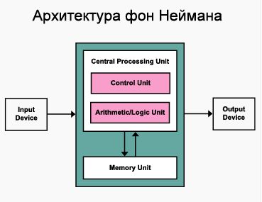
  - 与哈佛相比，冯诺依曼架构包含共享内存中的所有内容。
  - 如果不对程序本身的代码进行额外分析，就不可能确定单元格、数据或指令中的内容。同时，数据和指令的内存访问设备相同，简化了计算机的设计。 I/O 设备是单独分配的，它们位于处理器外部——结合了内存、ALU 和控制单元
  - 基础计算机（Базовая ЭВМ）是冯诺依曼架构的典型例子

Структура процессоров 处理器结构

- Процессор. Состоит из ряда регистров, арифметико-логического устройства с коммутатором и блоком установки признаков результата, а также устройства управления.  
  中央处理器。 它由多个寄存器、一个带开关的算术逻辑单元和一个用于设置结果符号的块以及一个控制装置组成。
  - Устройство управления (УУ, CU - Control Unit), его также называют микропрограммным устройством (МПУ), выполняет машинные команды процессора при помощи элементарных микроопераций: открытия вентилей и проверкой состояния бита заданного регистра. Работа МПУ разбита на циклы или стадии  исполнения команды и циклы пультовых операций. Подробно МПУ будет рассмотрено далее.  
  控制单元 (УУ, CU - Control Unit)，也称为微程序设备 (MCU)，使用基本的微操作执行处理器机器指令：打开门并检查给定寄存器的某个位的状态。 MCU 的工作分为命令执行的周期或阶段和控制台操作的周期。 稍后将详细讨论 MPA。

  - Арифметико-логическое устройство (АЛУ, ALU - Arithmetic-n-Logic Unit) может выполнять арифметические операции, такие как сложение и сложение с учетом переноса, полученного в результате выполнения предыдущей операции, операции логического умножения и инвертирования. Выход из АЛУ подключен к коммутатору.  
    算术逻辑单元（ALU，ALU-Arithmetic-n-Logic Unit）可以执行加法和加法等算术运算，同时考虑到前次运算产生的进位、逻辑乘法和求逆运算。 ALU 的输出连接到开关。

  - Коммутатор это устройство, на которое поступают 18 разрядов результата операции из АЛУ (16-ти разрядный результат сложения и биты, необходимые для формирования признака переноса С), а также предыдущее значение переноса из регистра состояния. Коммутатор выполняет операции прямой и перекрестной передачи информации между байтами слова, осуществления арифметических и циклических побитовых сдвигов влево и вправо, а также для расширения знака младшего байта в старший байт. Информация из коммутатора поступает на шину данных для записи в регистры БЭВМ и на блок установки признаков результата.  
    开关是一个设备，它接收来自 ALU 的 18 位运算结果（加法的 16 位结果和形成进位标志 C 所需的位），以及来自状态寄存器的前一个进位值.开关执行字的字节之间的直接和交叉信息传输操作，执行算术和循环移位左右，以及将低字节的符号扩展到高字节。来自开关的信息被发送到数据总线以写入计算机寄存器和块以设置结果的符号。

    Блок установки признаков результата предназначен для формирования однобитовых признаков результата, которые в конечном итоге сохраняются в младших 4-х битах регистра состояния. К ним относятся:  
    结果标志设置块旨在生成一位结果标志，最终存储在状态寄存器的低 4 位中。 这些包括：

    - Флаг переноса (С - Carry) выступает в качестве продолжения аккумулятора и заполняется при выходе результата за границу 16-ти разрядного слова. При выполнении арифметических операций и операций сдвига в него попадает выход Cnew коммутатора. Флаг переноса необходимо контролировать при выполнении арифметических операций с беззнаковыми числами.  
      进位标志 (C - Carry) 作为累加器的延续，当结果超出 16 位字边界时被填充。当执行算术和移位操作时，开关的输出 Cnew 进入它。对无符号数执行算术运算时，必须控制进位标志。

    - Флаг переполнения (V — overflow) сигнализирует о переполнении разрядной сетки при операциях АЛУ со знаковыми числами, и формируется как операция сложения по модулю 2 поразрядных переносов из 14 в 15 разряд и из 15 в 16 разряд АЛУ, т.е. на выходе коммутатора осуществляется операция V = C14 ⊕ Cnew.  
      溢出标志 (V-overflow) 在 ALU 操作期间用带符号数表示位网格的溢出，并形成为从 ALU 的第 14 位到第 15 位和从第 15 位到第 16 位的按位传输的模 2 加法运算，即在换向器输出端，执行 V = C14 ⊕ Cnew 操作。

    - Флаг нуля (Z - Zero) сохраняет информацию о том, равно ли содержимое аккумулятора нулю, заполняется при выполнении операций над аккумулятором.  
      零标志（Z - Zero）存储有关累加器内容是否为零的信息，在对累加器执行操作时填充。

    - Флаг знака (N - Negative) сохраняет знак числа в аккумуляторе, фактически дублируя его 15-й разряд.  
      符号标志（N - Negative）保留累加器中数字的符号，有效地复制其第 15 位。

  - Регистр 寄存器：
    - Аккумулятор (АС - Accumulator) — 16-ти разрядный регистр, являющийся одним из главных элементов процессоров аккумуляторного типа. Машина может одновременно выполнять операции только с одним или двумя операндами, которые находятся на левом или правом входе АЛУ. Результаты арифметико-логических операций обычно помещаются в АС и изменяются соответствующим образом признаки результата.  
    累加器（AC-Accumulator）——一个16位的寄存器，是电池型处理器的主要元件之一。 机器只能同时对 ALU 左侧或右侧输入的一个或两个操作数执行操作。 算术逻辑运算的结果通常放在 AS 中，结果的特性会相应改变。

    - Счетчик команд (IP - Instruction Pointer) — регистр, который хранит адрес ячейки памяти, содержащей следующую исполняемую команду программы. Так как команды могут размещаться в любой из 2048 = 211 ячеек памяти, то IP имеет 11 разрядов.  
      指令指针 (IP) 是一个寄存器，用于存储包含下一条可执行程序指令的内存位置的地址。 由于命令可以放置在 2048 = 211 个存储单元中的任何一个中，因此 IP 有 11 位。

    - Регистр адреса (AR - Address Register) — 11-ти разрядный регистр, служит для организации обращений к ячейкам памяти и содержит адрес ячейки памяти, к которой обращается процессор.  
      地址寄存器（AR - Address Register）是一个 11 位的寄存器，用于组织对存储单元的访问，并包含处理器访问的存储单元的地址。

    - Регистр данных (DR - Data Register) — 16-ти разрядный регистр для временного хранения 16-разрядных слов при обмене информацией между памятью и процессором.  
      数据寄存器（DR - Data Register） - 一个 16 位寄存器，用于在存储器和处理器之间交换信息期间临时存储 16 位字。

    - Регистр команд (CR - Command Register) — 16-ти разрядный регистр, используемый для хранения кода выполняемой в данный момент команды с целью ее поэтапного декодирования и выполнения требуемых операций.  
      命令寄存器（CR - Command Register）是一个 16 位的寄存器，用于存储当前正在执行的命令的代码，以便逐步对其进行解码并执行所需的操作。

    - Буферный регистр (BR - Buffer Register) это 16-ти разрядный регистр, который используется для организации промежуточного хранения данных во время работы.  
      缓冲寄存器（BR——Buffer Register）是一个 16 位的寄存器，用于在操作过程中组织中间数据存储。

    - Указатель стека (SP - Stack Pointer), как и IP и AR 11-ти разрядный, и всегда указывает на вершину стека - особого участка памяти, который предназначен для хранения адресов возвратов и параметров подпрограмм и прерываний.  
      堆栈指针（SP - Stack Pointer）与 IP 和 AR 一样，都是 11 位的，并且始终指向堆栈的顶部 - 一个特殊的内存区域，旨在存储子程序和中断的返回地址和参数。

    - Клавишный регистр (IR - Input Register) - 16-разрядный регистр, находится в  составе пульта оператора ЭВМ и предназначен для ввода адреса программы, кодов программы и данных. Пульт оператора одержит набор тумблеров и клавиш, позволяющих оператору осуществлять ввод данных в БЭВМ, запуск программы на выполнение и управление режимами работы БЭВМ.  
      密钥寄存器（IR - Input Register）——16位寄存器，是计算机操作员控制台的一部分，用于输入程序地址、程序代码和数据。 操作员控制台包含一组拨动开关和按键，允许操作员将数据输入计算机，启动程序以执行并控制计算机的操作模式。

    - Регистр состояния (PS - Program State) - 16-разрядный регистр, хранит биты управляющие работой БЭВМ (работа, прерывание и пр.) и признаки результата. В актуальной программной реализации используются только 9 младших разрядов.  
      状态寄存器（PS - Program State）是一个 16 位的寄存器，存储控制计算机操作（工作、中断等）的位和结果的标志。 在当前的软件实现中，仅使用了 9 个最低有效位。

- CISC（Complex Instruction Set Computer）复杂指令集计算机
  - 概念：是一种微处理器指令集架构，每个指令可执行若干低端操作，诸如从存储器读取、存储、和计算操作，全部集于单一指令之中
  - 特点：指令数目多且复杂，每条指令字长不等，电脑必须加以判读，并为此付出了性能的代价
- RISC（Reduced Instruction Set Computer）精简指令集计算机
  - 概念：是计算机中央处理器的一种设计模式，这种设计思路可以想像成是一家模块化的组装工厂，对指令数目和寻址方式都做了精简，使其实现更容易，指令并行执行程度更好，编译器的效率更高
  - 特点：早期，这种指令集的特点是指令数目少，每条指令都采用标准字长、执行时间短、中央处理器的实现细节对于机器级程序是可见的；在后来的发展中，RISC 与 CISC（复杂指令集）在竞争的过程中相互学习，现在的RISC指令集也达到数百条，运行周期也不再固定。虽然如此，RISC 设计的根本原则——针对流水线化的处理器优化——没有改变，而且还在遵循这种原则的基础上发展出 RISC 的一个并发化变种 VLIW，就是将简短而长度统一的精简指令组合出超长指令，每次执行一条超长指令，等于并发执行多条短指令
- VLIW（Very Long Instructions Word）超长指令字
  - 将几条指令打包到一条指令中 – 将操作打包到一条指令中由编译器负责

#### 28. Характеристики запоминающих устройств. Пирамида памяти.  

- Характеристики запоминающих устройств 存储设备性质
  - 位置（Месторасположение）：
    процессорные, внутренние, внешние
    位于处理器内，内部存储，外部存储
  - 容量（Емкость）：
    В метрических (Кило-) и двоичных (Киби-) множителях
    使用公制或二进制表示
  - 存储单元（Единица пересылки）：
    Слово, строка кэша, блок на диске
    由数据总线的宽度决定的，即沿着总线并行传输的位数。对于内部存储器（RAM）存储单元一般为字（Слово）；而对于外部存储器，数据通常以大于字的单位传输，成为块（Blok）
  - 访问方法（Метод доступ
    - 循序访问（Последовательный доступ）：意指一组序列（例如存于记忆数组、磁盘软件或是磁带中的资料）是以预先安排，有秩序的方式被人访问。循序访问有时只是唯一的访问数据方式，磁带即属一例。循序访问亦有可能成为有选择性的方式，就如我们纯粹有意顺序处理一组资料组件。
    - 随机存取（Произвольный доступ，又称直接访问Прямой доступ）：可以在相等的时间内访问序列中任意元素或从所有可寻址元素中访问任何数据
      - 直接访问（Прямой доступ）：允许设备直接读写存储器，而不需要中央处理器介入处理
    - 关联访问（Ассоциативный доступ）：不根据地址而是根据存储内容来进行存取
  - 时间与速率（Быстродействие и временные соотношения）
    - 寻道时间/访问时间（Время доступа - Тд）：这是指把磁臂(磁头)移动到指定磁道上所经历的时间。该时间是启动磁臂的时间 s 与磁头移动 n 条磁道所花费的时间之和
    - 内存循环时间（Длительность цикла памяти - время обращения - Tц）
    - 读取和写入时间（Время чтения и время записи）
    - 返回时间（Время восстановления - Тв）
    - 信息传输速率
  - 物理类型与特性（Физический тип и особенности）
  - 成本（Стоимость）

- Пирамида памяти 存储金字塔

  容量|寻道时间|访问时间|*|类型|控制
  --|--|--|--|--|--
  CPU|100-1000б|<1нс|1c|寄存器Регистр|编译器компилятор
  L1 Cache|32-128Кб|1-4нс|2c|关联存储Ассоциативная|设备аппаратура
  L2-L3 Cache|0.5-32Мб|8-20нс|19c|关联存储Ассоциативная|设备аппаратура
  主存Основная память|0.5Гб- 4ТБ|60-200нс|50-300с|可寻址存储Адресная|程序программно
  SSD|128Гб- 1Тб/drive|25-250мкс|5д|块存储器Блочная|程序программно
  软盘Жесткие диски|0.5Тб- 4Тб/drive|5-20мс|4м|块存储器Блочная|程序программно
  磁带Магнитные ленты|1-6Тб/к|1-240c|200л|顺序存储Последовательная|程序программно

- 寄存器（Регистр）：
    - 概念：是用于写入、存储和读取 n 位二进制数据并对其执行其他操作的设备
    - 结构：寄存器是一组有序的触发器（flip-flops），其数量对应于字中的位数。可以将组合数字设备与寄存器相关联，借助它可以对单词执行某些操作
      构建寄存器的基础是：D-flip-flops，RS-flip-flops，JK-flip-flops
      - 触发器（Flip-flops）：触发器是一种双稳态多谐振荡器（bistable multivibrator），是一种具有两种稳态的用于储存的组件，可记录二进制数字信号“1”和“0”
        - 原理：触发器的线路图由逻辑门组合而成，其结构均由 SR 锁存器派生而来（广义的触发器包括锁存器），可以通过一个或多个施加在控制输入端的信号来改变自身的状态，并会有 1 个或 2 个输出。触发器是构成时序逻辑电路以及各种复杂数字系统的基本逻辑单元。触发器和锁存器是在计算机、通讯和许多其他类型的系统中使用的数字电子系统的基本组成部分，触发器可以处理输入、输出信号和时序脉波（CK）之间的相互影响
        - 分类：
          - RS 锁存器：基本 RS 触发器又称 SR 锁存器，是触发器中最简单的一种，也是各种其他类型触发器的基本组成部分。两个与非门或或非门的输入端输出端进行交叉耦合或首尾相接，即可构成一个基本RS触发器
            当R与S皆为低电位，回授会让 Q 与 Q（Q的反相）保持于一个固定的状态。当S（Set）为高电位，R（Reset）为低电位时，输出 Q 会被强制设置为高电位；相反的，当 S 为低电位，R 为高电位时，输出 Q 会被强制设置为低电位
            - 
          - D 触发器：D触发器有一个输入、一个输出和一个时脉输入，当时脉由0转为1时，输出的值会和输入的值相等。此类触发器可用于防止因为噪声所带来的错误，以及通过管线增加处理资料的数量
            - 
          - JK 触发器：JK触发器设有两个输入，其输出的值由以下的算式来决定
           
            $$Q_{nest}=\overline{K}Q+J\overline{Q}$$

            - 
          - T 触发器（Toggle Flip-Flop，or Trigger Flip-Flop）设有一个输入和输出，当时脉由0转为1时，如果T和Q不相同时，其输出值会是 1。输入端 T 为 1 的时候，输出端的状态Q发生反转；输入端T为0的时候，输出端的状态 Q 保持不变。把JK触发器的J和K输入点连接在一起，即构成一个 T 触发器，因此 T 触发器的算式为：
           
            $$Q_{next}=\overline{T}Q+T\overline{Q}+T\overline{Q}=Q\oplus T$$

      - 锁存器（latch），或称闩锁，是数字电路中异步时序逻辑电路系统中用来储存资讯的一种电子电路。一个锁存器可以储存一比特的资讯，通常会有多个一起出现
    - 高速缓存（cache）
      - 概念：称缓存，原始意义是指访问速度比一般随机存取存储器（RAM）快的一种RAM，通常它不像系统主存那样使用DRAM技术，而使用昂贵但较快速的SRAM技术
      - 原理：当 CPU 处理数据时，它会先到 Cache 中去寻找，如果数据因之前的操作已经读取而被暂存其中，就不需要再从随机存取存储器（Main memory）中读取数据——由于 CPU 的运行速度一般比主内存的读取速度快，主存储器周期（访问主存储器所需要的时间）为数个时钟周期。因此若要访问主内存的话，就必须等待数个 CPU 周期从而造成浪费。
      - 提供“缓存”的目的是为了让数据访问的速度适应 CPU 的处理速度，其基于的原理是内存中“程序执行与数据访问的局域性行为”，即一定程序执行时间和空间内，被访问的代码集中于一部分。为了充分发挥缓存的作用，不仅依靠“暂存刚刚访问过的数据”，还要使用硬件实现的指令预测与数据预取技术——尽可能把将要使用的数据预先从内存中取到缓存里
      - 组成结构：
        - Cache 存储体：存放由主存调入的指令与数据块
        - 地址转换部件：建立目录表以实现主存地址到缓存地址的转换
        - 替换部件：在缓存已满时按一定策略进行数据块替换，并修改地址转换部件
      - 延伸
        - 不仅在 CPU 和主内存之间有 Cache，而且在内存和硬盘之间也有 Cache（磁盘缓存），乃至在硬盘与网络之间也有某种意义上的 Cache ──称为 Internet 临时文件夹或网络内容缓存等。凡是位于速度相差较大的两种硬件之间，用于协调两者数据传输速度差异的结构，均可称之为 Cache

#### 31. Сетевые технологии, Понятие сети ЭВМ, классификация компьютерных сетей. Сообщение и пакет. Модель взаимодействия открытых систем.

- Понятие сети ЭВМ  计算机网络概念
  Сеть ЭВМ (рис.1.1) – совокупность средств вычислительной техники (СВТ), представляющих собой множество ЭВМ, объединённых с помощью средств телекоммуникаций (СТК). Сеть ЭВМ реализует две основные функции:   
  计算机网络（图 1.1）是一组计算机设备（СВТ），它是一组通过电信（СТК）连接的计算机。计算机网络实现两个主要功能：
  - обработкуданных 数据处理
  - передачуданных 数据传输

  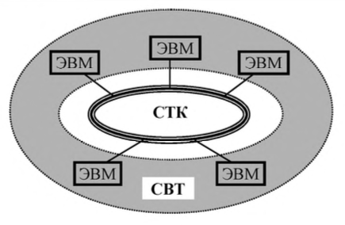

  Из данного выше определения (рис.1.1) следует, что «сеть ЭВМ» представляет собой множество ЭВМ (компьютеров), объединённых в единую сеть с помощью средств телекоммуникаций, образующих базовую сеть передачи данных (СПД). Другими словами, «сеть ЭВМ» или «компьютерная сеть» - это объединение ЭВМ (компьютеров), в отличие, например, от телефонной сети, объединяющей автоматические телефонные станции (АТС). 
  从上面给出的定义（图1.1）可以看出，“ЭВМ网络”是一组ЭВМ（计算机）利用电信联合成一个单一的网络，形成一个基本的数据传输网络（СПД）。换言之，“ЭВМ 网络”或“计算机网络”是ЭВМ（计算机）的关联，与例如结合自动电话交换机（АТС）的电话网络形成对比。

  Отдельные сети ЭВМ могут объединяться между собой, образуя большие компьютерные сети, которые в свою очередь могут объединяться и образовывать сверхбольшие глобальные сети. Такое объединение сетей приводит к иерархической структуре, в которой небольшие сети являются подсетями сетей более высокого ранга.  
  独立的 ЭВМ 网络可以相互组合，形成大型计算机网络，这些计算机网络又可以组合起来，形成超大型的全球网络。这种网络的关联导致了一个层次结构，其中小型网络是更高级别网络的子网。

- классификация компьютерных сетей 计算机网络分类
  - 按覆盖范围分类
    - 个域网（PAN）：设备围绕一个人的通信。 比如说我的电脑，通过蓝牙和手机，耳机，手环等等相连，这就是个域网
    - 局域网（LAN）：局域网覆盖范围通常是一个屋子，一栋楼等等，这个大家比较熟悉，可以细分为有限局域网和无线局域网等
    - 城域网（MAN）：覆盖范围往往是一个城市。比较典型的是有线电视网。城域网通过接入点拉光纤等进入小区，在小区可以使用同轴电缆进入千家万户
    - 广域网（WAN）：它的覆盖范围很大，往往由核心城市组成一个大的网络，如下图所示。小的城市和大的城市相连，大的城市互相相连形成网络。覆盖中国的卫星网络就是一个广域网
  - 按目的分类
    - 计算类（Вычислительные）
    - 信息类（Информационные ）
    - 信息计算类（Информационно- вычислительные）
    - 信息管理类（Информационно- управляющие）
  - 按应用领域分类
    - SAN - 网络数据存储
    - 服务器网络（Серверные фермы）
  - 其他分类
    - 分层网络（Иерархические）
    - 无线网络（Беспроводные）
    - 虚拟网络（Виртуальные VLAN）
- Сообщение и пакет 消息与数据包
  - 基本概念
    - Сообщение (message) - блок данных, рассматриваемых как единое целое при передаче между двумя пользователями (процессами) и имеющих определенное смысловое значение. Сообщения используются на 7-м уровне OSI-модели для передачи данных между прикладными процессами и могут иметь произвольную длину.  
      消息（message）——在两个用户（进程）之间传输时被视为一个整体并具有一定语义含义的数据块。 消息在 OSI 模型的第 7 层用于在应用程序进程之间传输数据，并且可以是任意长度。
    - Пакет (packet) - блок данных на 3-го (сетевого) уровня OSI-модели, имеющий ограниченную длину и представляющий собой единицу передачи данных в СПД.  
      数据包——OSI 模型第 3（网络）层的数据块，长度有限，是 СПД 中数据传输的单位。
  - 基本结构
  
  
  
    |包头（Заголовок）|数据（Данные）|包尾控制信息|
    ---|---|--
    存储目标地址与发件人信息|内容|控制信息
    
  - 消息的结构遵循以上基本结构，但在传输的过程中，由于消息很长，所以将消息的数据部分按照恒定的宽度分成若干个包，包的数据部分取自消息的数据部分，并在前后加上消息的包头和包尾

- Модель взаимодействия открытых систем. OSI 网络模型
  
  - 
  
  - 概念：该模型将通信系统中的数据流划分为七个层，从分布式应用程序数据的最高层表示到跨通信介质传输数据的物理实现。每个中间层为其上一层提供功能，其自身功能则由其下一层提供。功能的类别通过标准的通信协议在软件中实现
  - 层次划分
    1. 物理层（Physical Layer）：物理层在局域网上发送数据帧（Data Frame），它负责管理电脑通信设备和网络媒体之间的互通。包括了针脚、电压、线缆规范、集线器、中继器、网卡、主机接口卡等
    2. 数据链路层（Data Link Layer）：数据链路层负责网络寻址、错误侦测和改错。当表头和表尾被加至数据包时，会形成信息框（Data Frame）。数据链表头（DLH）是包含了物理地址和错误侦测及改错的方法。数据链表尾（DLT）是一串指示数据包末端的字符串。例如以太网、无线局域网（Wi-Fi）和通用分组无线服务（GPRS）等。分为两个子层：逻辑链路控制（logical link control，LLC）子层和介质访问控制（Media access control，MAC）子层
    3. 网络层（Network Layer）：决定数据的路径选择和转寄，将网络表头（NH）加至数据包，以形成分组。网络表头包含了网络资料。例如:互联网协议（IP）等
    4. 传输层（Transport Layer）：把传输表头（TH）加至资料以形成分组。传输表头包含了所使用的协议等发送信息。例如:传输控制协议（TCP）等
    5. 会话层（Session Layer）：负责在数据传输中设置和维护计算机网络中两台计算机之间的通信连接
    6. 表示层（Presentation Layer）：把数据转换为能与接收者的系统格式兼容并适合传输的格式
    7. 应用层（Application Layer）：提供为应用软件而设计的接口，以设置与另一应用软件之间的通信。例如：HTTP、HTTPS、FTP、Telnet、SSH、SMTP、POP3 等

#### 34. Интерфейсы ввода-вывода. Контроллеры внешних устройств. Уровни стандартизации, сопряжения с системной шиной, циклы обмена. Регистры контроллера.  

- Интерфейсы ввода-вывода 输入输出接口
  I/O 接口是将数据从内部逻​​辑发送到外部源以及从外部源接收数据的媒介。接口信号可以是单向的或双向的、单端的或差分的，并且可以遵循不同的 I/O 标准之一：
  - GTL (gunning transceiver logic).
  - HSTL (high-speed transceiver logic).
  - LVCMOS (low-voltage CMOS).
  - LVTTL (low-voltage transistor-transistor logic).
  - PCI (peripheral component interconnect).
  - LDT (lightning data transport).
  - LVDS (low-voltage differential signaling).
  I/O 接口的主要用途是传输和接收数据；但是，指定为 I/O 接口的部分可能包含额外的资源，例如电压转换器、寄存器、阻抗和缓冲器。  
  只要 I/O 设备由处理器驱动，就需要 I/O 接口。通常，CPU 通过总线与设备通信。接口必须具有必要的逻辑来解释处理器生成的设备地址。握手应该由接口使用适当的命令（如 `BUSY`、`READY` 和 `WAIT`）来实现，并且处理器可以通过接口与 I/O 设备进行通信。如果交换不同的数据格式，接口必须能够将串行（последовательный）数据转换为并行（параллельный）格式，反之亦然。因为处理器在等待来自输入设备的数据时处于空闲状态将是一种浪费，因此必须提供产生中断（прерывание）的规定和相应的类型编号，以供处理器进一步处理（如果需要）

- Контроллеры внешних устройств 外部设备控制器
  Контроллер внешнего устройства – подобие упрощенного процессора, который берет на себя часть работы по управлению внешними устройствами, таким образом, разгружает от работы по текущему обслуживанию внешних устройств - центральный процессор.  
  外部设备的控制器是一种简化的处理器，承担部分管理外部设备的工作，从而将中央处理器从外部设备的日常维护工作中解放出来。

  Подключение любого внешнего устройства к микроЭВМ осуществляется через контроллер ВУ.   
  任何外部设备与微型计算机的连接都是通过 VU 控制器进行的

  каждый из которых содержит:  
  每个控制器都包含：
  - **дешифратор адреса**, позволяющий выделить обращение к данному ВУ среди всех обращений к устройствам ввода-вывода, подключенных к процессору;  
  **地址解码器**，允许您在对连接到处理器的 I/O 设备的所有调用中选择对该 ВУ 的调用；
  - **логику управления КВУ**. набор логических схем, позволяющий реагировать и формировать сигналы шины БЭВМ. Данные схемы не представлены подробно для КВУ-3, в качестве примера реализации необходимо обратится к схеме КВУ-1 на рис. В.11;  
    **КВУ 逻辑控制**，一组逻辑电路，允许您响应和生成计算机总线信号。 这些方案对于 КВУ-3 没有详细介绍；作为实现示例，有必要参考图 B.11 中的 КВУ-1 方案；
  - **регистр данных** (DR - Data Register), через который происходит обмен данными между процессором и внешним устройством;  
    **数据寄存器**（DR - Data Register），通过它在处理器和外部设备之间交换数据；
  - **регистр состояния** (SR - State Register), в котором хранится информация о готовности ВУ к обмену данными с процессором. В контроллерах простейших ВУ используются однобитовые регистры готовности, которые часто называют **флагом**.  
    **状态寄存器**（SR - State Register），它存储有关 ВУ 准备好与处理器进行数据交换的信息。 在最简单的 ВУ 的控制器中，使用了一位就绪寄存器，通常称为**标志**。
  - **регистр управления** (MR - Management Register), регистр, в котором используются 4 младших разряда, разряд 3 - для разрешения прерывания от контроллера и разряды с 0 по 2, которые содержат номер вектора прерывания. Если прерывания разрешены командой `EI` и установлено разрешение прерывания от контроллера (разряд 3), то контроллер будет генерировать сигнал IntRq и выставлять номер вектора прерывания на шину адреса.  
    **管理寄存器**（MR - 管理寄存器），一个使用 4 个最低有效位的寄存器，位 3 - 启用来自控制器的中断，位 0 到 2，其中包含中断向量的编号。 如果使用 `EI` 命令启用中断并且设置了控制器中断启用（位 3），则控制器将生成 IntRq 信号并将中断向量编号设置到地址总线。

  Контроллеры ВУ связаны с процессором при помощи **системной шины** БЭВМ, в сегменты (или, физически, разъемы для установки контроллеров) которой подсоединяются различные шины со стороны процессора и контроллера:  
  ВУ 控制器使用计算机的 **系统总线** 连接到处理器，连接到从处理器和控制器一侧连接各种总线的段（或物理上用于安装控制器的连接器）：

  - **шина данных** (Data0..7), по которым происходит передача данных в процессор или из процессора;  
    **数据总线**（Data0..7），数据通过它传输到处理器或从处理器传输；
  - **шина адреса** (Addr0..7), по которой передается адрес внешнего устройства от процессора к КВУ и номер вектора запроса на прерывание (Int#) от КВУ к процессору, подтверждаемый сигналом выдачи вектора (IntV);  
    **地址总线**（Addr0..7），通过该总线将外部设备的地址从处理器传送到 КВУ 和从 КВУ 到处理器的中断请求向量（Int#）的编号，由向量输出信号确认（IntV）；
  - **сигнал запроса прерывания** (IntRq), по которому выставляется требование прерывания от внешнего устройства;  
    **中断请求信号**（IntRq），它设置来自外部设备的中断请求；
  - **сигнал ввода** (Input) - для передачи приказа на ввод (`IN #reg`);  
    **输入信号**（Input） - 发送输入指令（`IN #reg`）；
  - **сигнал вывода** (Output) - для передачи приказа на вывод (`OUT #reg`);  
    **输出信号**（Output） - 发送输出命令（`OUT #reg`）；
  - **начальный сигнал предоставления прерывания** (IntSC), который управляется программно микрокодом в цикле прерывания по микрокоманде `INTs`.  
    **中断授权开始信号**（IntSC），在`INTs`微指令中断周期由软件微码控制。
  - **входящий цепочный сигнал предоставления прерывания** (IntSCi# - Interrupt Supply Chain input), по которому контоллер, в соответствии с порядком подключения к шине, проверяет возможность предоставления ему прерывания в соответствии с очередью подключения, и генерирует прерывание, если они разрешены глобально командой `EI` и в регистре MR контроллера;  
    **传入的中断供应链信号**（IntSCi# - 中断供应链输入），根据该信号，控制器按照连接到总线的顺序，根据连接队列检查是否授予其中断，以及如果它们由 `EI` 命令全局启用并在寄存器 MR 控制器中启用，则生成中断；
  - **исходящий цепочный сигнал предоставления прерывания** (IntSCo# - Interrupt Supply Chain output), который передает контроллер по шине далее следующему КВУ, если нет необходимости вызвать прерывание вычислительного процесса;  
    **输出中断供应链信号**（IntSCo# - 中断供应链输出），如果不需要在计算过程中引起中断，它将控制器通过总线转移到下一个 КВУ；
  - **сигнал готовности** (Rdy), подтверждающий завершение операции ввода- вывода внутри цикла обмена между АС и DR соответствующего КВУ. В случае операции ввода Rdy подтверждает данные, передаваемы по шине данных, и в обоих случаях операции ввода-вывода сигнализирует о том, что цикл обмена с регистром данных DR контроллера завершен;  
    **就绪信号**（Rdy），确认对应 КВУ 的 AC 和 DR 之间的交换周期内 I/O 操作完成。 在输入操作的情况下，Rdy确认数据总线上传输的数据，并且在两种 I/O 操作的情况下都发出与控制器的数据寄存器 DR 的交换周期完成的信号；
  - **сигнал синхронизации** (Syn) от тактового генератора БЭВМ, который задает временной слот единичного обмена по шине БЭВМ.  
    来自计算机时钟发生器的 **同步信号** (Syn)，它设置计算机总线上单个交换的时隙。
- Уровни стандартизации 标准化
- сопряжения с системной шиной 与系统总线的连接
  
  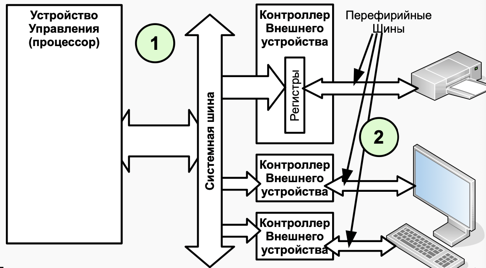

  Существуют 2 способа уровня сопряжения к системной шине: 有 2 种与系统总线的连接方式：
  - Процессор ↔ контроллеры
  - Контроллеры ↔ ВУ  
  
- циклы обмена 交换周期

  [参考资料](https://intuit.ru/studies/courses/3/3/lecture/64?page=2)

  В начале цикла обмена (в шине адреса) процессор  выставляет код адреса. и устройство ввода/вывода или память готовится к проведению обмена после получить код адреса 
  在交换周期的开始（在地址总线中），处理器设置地址码。输入输出设备在收到地址码后开始准备进行数据交换

  Потом в шине управления выставляет сигнал Input или Output в соответствии с циклом чтения или циклом записи.    
  然后，在控制总线中，设置输入或输出信号

  - В цикле чтения, устройство IO выставляет свой код данных на шину данных и процессор выставляет сигнал строба чтения данных в ответ, Одновременно это устройство должно подтвердить выполнение операции сигналом Rdy из шине управления  
    在读周期中，IO 设备将在数据总线上设置其数据代码，处理器将设置读数据选通信号作为响应，同时，该设备必须通过控制总线上的 Rdy 信号确认操作
  - В цикле записи, процессор выставляет код записываемых данных на шину данных. Устройство должно принять данные и сформировать сигнал подтверждения обмена -Rdy на шину управления. Процессор, получив сигнал Rdy, заканчивает цикл обмена.  
    在一个写周期中，处理器设置正在写入数据总线的数据的代码。设备必须接收数据并在控制总线上生成交换确认信号-Rdy，处理器接收到 Rdy 信号后结束写周期
  
  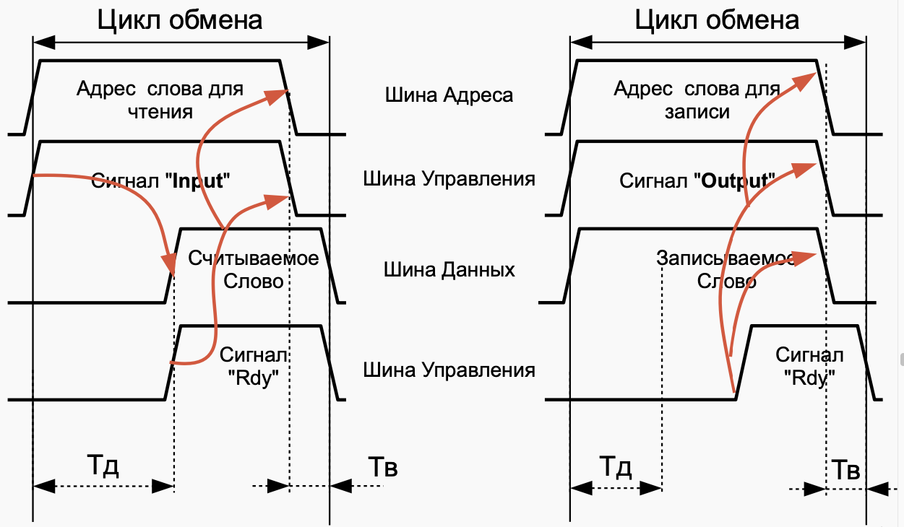


- Регистры контроллера 控制寄存器
  Назначение регистров контроллеров внешних устройств представлены в таблице В.12.  
  外部设备控制器寄存器的用途如表 B.12 所示。

  <div align=center></div>
  <center>Таблица В. 12 Назначение регистров на шине ввода-вывода БЭВМ.<br>表 B. 12 计算机输入输出总线上的寄存器分配。</center>

  - R - означает, что регистр доступен только для чтения    
    R - 表示寄存器仅可用于读取
  - W - только для записи  
    W - 仅可用于写入
  - R/W - доступен для обоих операций  
    R/W - 可用于两种操作

#### 37. Асинхронный обмен. Принципы деления частоты, формат кадра.

- Асинхронный обмен 异步交换
- Принципы деления частоты 分频原理
  Делитель частоты, представляет собой схему, которая принимает входной сигнал определенной частотыи генерирует выходной сигнал определенной частоты: $f_{in}$  
  分频器，是一种采用一定频率的输入信号 $f_{in}$ 并产生一定频率的输出信号的电路

  $$f_{out}=\frac{f_{in}}{n}$$

  其中
  - $f_{in}$ 输入信号频率
  - $f_{out}$ 输出信号频率
  - $n$ 分频倍数
- формат кадра 帧格式

#### 40. Организация прямого доступа к памяти. Контроллер ПДП.

- Организация прямого доступа к памяти 直接内存访问的组织
- ПДП 控制器