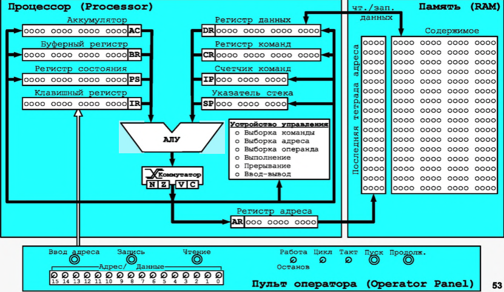
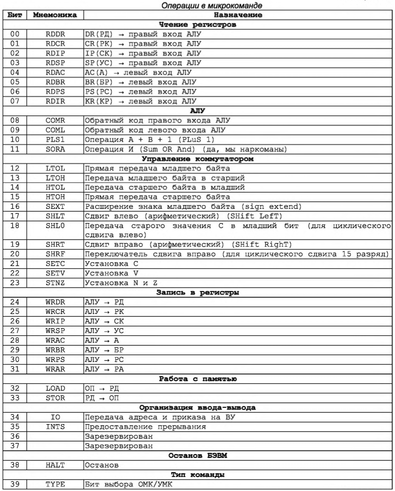
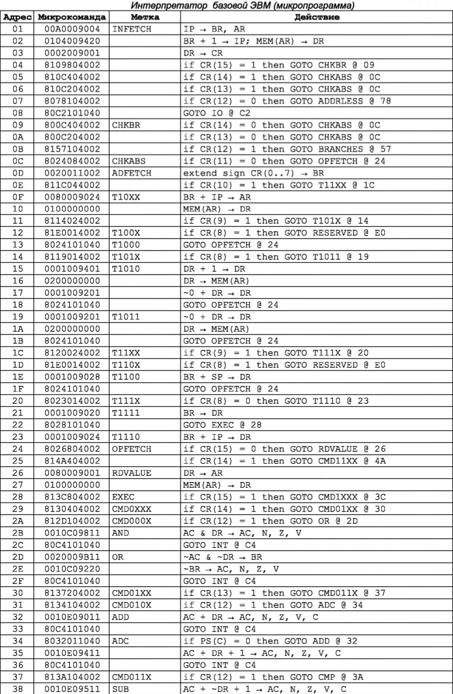
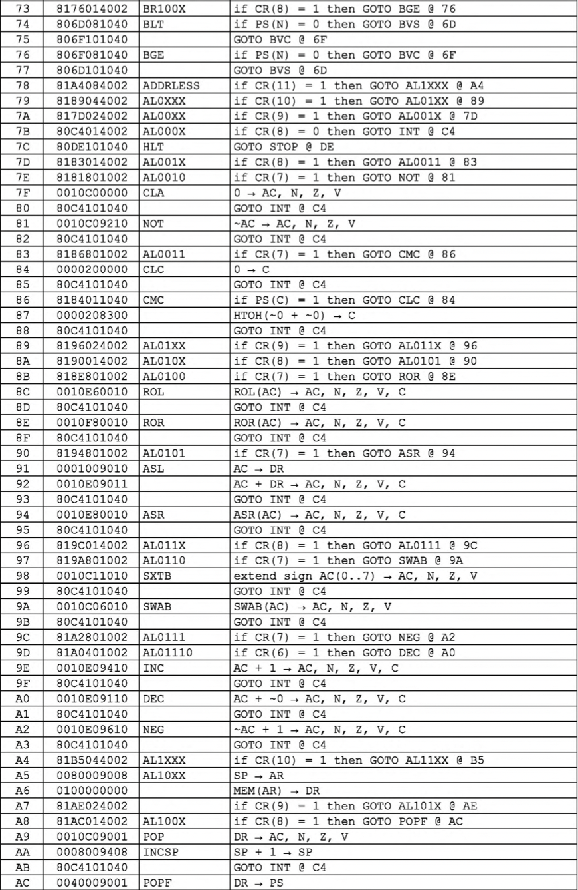

## [MainPage](../index.md)/[OPD](README.md)/Guide

# <center>Приложение В. Состав, структура и функционирование БЭВМ-NG <br>附录 C. BEVM-NG 的组成、结构和功能</center>

## <center>Часть 1. Базовая ЭВМ <br>第 1 部分：基础计算机</center>

### 1.1 Назначение базовой ЭВМ 基础计算机的用途

Базовая ЭВМ - это простая гипотетическая машина, обладающая типичными чертами многих конкретных ЭВМ. Знание принципов построения и функционирования этой ЭВМ является хорошей базой для освоения микропроцессорных систем любых типов и моделей, поэтому она названа базовой ЭВМ. Естественно, начинать изучение ЭВМ целесообразно с подобной машины низкого уровня, что можно делать практически, используя ее модели, построенные для разных типов персональных ЭВМ. При построении базовой ЭВМ за прототип выбраны ЭВМ "Электроника 100" и "Саратов", а также схожие с ними ЭВМ типа PDP- 8, однокристальный микропроцессор IM6100 и персональная ЭВМ DECmate 11. В новую версию БЭВМ-NG вошли некоторые элементы архитектуры PDP-11.  
基础计算机是一个简单的假设机器，具有许多特定计算机的典型特征。了解这台计算机的构造和操作原理是掌握任何类型和型号的微处理器系统的良好基础，因此它被称为基础计算机。自然，建议使用类似的低级机器开始研究计算机，这实际上可以使用为不同类型的个人计算机构建的模型来完成。在构建基础计算机时，选择 Elektronika 100 和 Saratov 计算机，以及与之类似的 PDP-8 计算机、IM6100 单片微处理器和 DECmate 11 个人计算机作为原型。被包含在新版本的 BEVM-NG 中。

### 1.2 Структура базовой ЭВМ 基础计算机的结构

На рис. В.1 приведена упрощенная структура базовой ЭВМ. Это одноадресная ЭВМ аккумуляторного типа, выполняющая простейшие операции с 16-разрядными машинными словами.  
图上。 B.1 显示了基础计算机的简化结构。 这是一个单地址电池型计算机，可以使用 16 位机器字执行简单的操作。

<div align=center></div>
<center>Рисунок В. 1 Модель базовой ЭВМ<br>图 B.1 基本计算机模型</center>

БЭВМ-NG включает в себя нескольких функциональных блоков и регистров:  
BEVM-NG 包括几个功能块和寄存器：

Память. Состоит из 2048 ячеек (16-битовых) с адресами 0, 1, ..., 2046, 2047. Ячейки с 0 по OxF имеют специальное назначение, в них хранятся вектора прерываний, которые будут рассмотрены далее.  
内存：它由地址为 0, 1....,2046,2047 的 2048 个单元（16 位）组成。单元 0 到 OxF 有一个特殊用途，它们存储中断向量，稍后将讨论。

Процессор. Состоит из ряда регистров, арифметико-логического устройства с коммутатором и блоком установки признаков результата, а также устройства управления.  
中央处理器。 它由多个寄存器、一个带开关的算术逻辑单元和一个用于设置结果符号的块以及一个控制装置组成。

- Устройство управления (УУ, CU - Control Unit), его также называют микропрограммным устройством (МПУ), выполняет машинные команды процессора при помощи элементарных микроопераций: открытия вентилей и проверкой состояния бита заданного регистра. Работа МПУ разбита на циклы или стадии  исполнения команды и циклы пультовых операций. Подробно МПУ будет рассмотрено далее.  
  控制单元 (УУ, CU - Control Unit)，也称为微程序设备 (MCU)，使用基本的微操作执行处理器机器指令：打开门并检查给定寄存器的某个位的状态。 MCU 的工作分为命令执行的周期或阶段和控制台操作的周期。 稍后将详细讨论 MPA。

- Арифметико-логическое устройство (АЛУ, ALU - Arithmetic-n-Logic Unit) может выполнять арифметические операции, такие как сложение и сложение с учетом переноса, полученного в результате выполнения предыдущей операции, операции логического умножения и инвертирования. Выход из АЛУ подключен к коммутатору.  
  算术逻辑单元（ALU，ALU-Arithmetic-n-Logic Unit）可以执行加法和加法等算术运算，同时考虑到前次运算产生的进位、逻辑乘法和求逆运算。 ALU 的输出连接到开关。

- Коммутатор это устройство, на которое поступают 18 разрядов результата операции из АЛУ (16-ти разрядный результат сложения и биты, необходимые для формирования признака переноса С), а также предыдущее значение переноса из регистра состояния. Коммутатор выполняет операции прямой и перекрестной передачи информации между байтами слова, осуществления арифметических и циклических побитовых сдвигов влево и вправо, а также для расширения знака младшего байта в старший байт. Информация из коммутатора поступает на шину данных для записи в регистры БЭВМ и на блок установки признаков результата.  
  开关是一个设备，它接收来自 ALU 的 18 位运算结果（加法的 16 位结果和形成进位标志 C 所需的位），以及来自状态寄存器的前一个进位值.开关执行字的字节之间的直接和交叉信息传输操作，执行算术和循环移位左右，以及将低字节的符号扩展到高字节。来自开关的信息被发送到数据总线以写入计算机寄存器和块以设置结果的符号。

  Блок установки признаков результата предназначен для формирования однобитовых признаков результата, которые в конечном итоге сохраняются в младших 4-х битах регистра состояния. К ним относятся:  
  结果标志设置块旨在生成一位结果标志，最终存储在状态寄存器的低 4 位中。 这些包括：

  - Флаг переноса (С - Carry) выступает в качестве продолжения аккумулятора и заполняется при выходе результата за границу 16-ти разрядного слова. При выполнении арифметических операций и операций сдвига в него попадает выход Cnew коммутатора. Флаг переноса необходимо контролировать при выполнении арифметических операций с беззнаковыми числами.  
    进位标志 (C - Carry) 作为累加器的延续，当结果超出 16 位字边界时被填充。当执行算术和移位操作时，开关的输出 Cnew 进入它。对无符号数执行算术运算时，必须控制进位标志。

  - Флаг переполнения (V — overflow) сигнализирует о переполнении разрядной сетки при операциях АЛУ со знаковыми числами, и формируется как операция сложения по модулю 2 поразрядных переносов из 14 в 15 разряд и из 15 в 16 разряд АЛУ, т.е. на выходе коммутатора осуществляется операция V = C14 ⊕ Cnew.  
    溢出标志 (V-overflow) 在 ALU 操作期间用带符号数表示位网格的溢出，并形成为从 ALU 的第 14 位到第 15 位和从第 15 位到第 16 位的按位传输的模 2 加法运算，即在换向器输出端，执行 V = C14 ⊕ Cnew 操作。

  - Флаг нуля (Z - Zero) сохраняет информацию о том, равно ли содержимое аккумулятора нулю, заполняется при выполнении операций над аккумулятором.  
    零标志（Z - Zero）存储有关累加器内容是否为零的信息，在对累加器执行操作时填充。

  - Флаг знака (N - Negative) сохраняет знак числа в аккумуляторе, фактически дублируя его 15-й разряд.  
    符号标志（N - Negative）保留累加器中数字的符号，有效地复制其第 15 位。

Регистр 寄存器：
- Аккумулятор (АС - Accumulator) — 16-ти разрядный регистр, являющийся одним из главных элементов процессоров аккумуляторного типа. Машина может одновременно выполнять операции только с одним или двумя операндами, которые находятся на левом или правом входе АЛУ. Результаты арифметико-логических операций обычно помещаются в АС и изменяются соответствующим образом признаки результата.  
累加器（AC-Accumulator）——一个16位的寄存器，是电池型处理器的主要元件之一。 机器只能同时对 ALU 左侧或右侧输入的一个或两个操作数执行操作。 算术逻辑运算的结果通常放在 AS 中，结果的特性会相应改变。

- Счетчик команд (IP - Instruction Pointer) — регистр, который хранит адрес ячейки памяти, содержащей следующую исполняемую команду программы. Так как команды могут размещаться в любой из 2048 = 211 ячеек памяти, то IP имеет 11 разрядов.  
  指令指针 (IP) 是一个寄存器，用于存储包含下一条可执行程序指令的内存位置的地址。 由于命令可以放置在 2048 = 211 个存储单元中的任何一个中，因此 IP 有 11 位。

- Регистр адреса (AR - Address Register) — 11-ти разрядный регистр, служит для организации обращений к ячейкам памяти и содержит адрес ячейки памяти, к которой обращается процессор.  
  地址寄存器（AR - Address Register）是一个 11 位的寄存器，用于组织对存储单元的访问，并包含处理器访问的存储单元的地址。

- Регистр данных (DR - Data Register) — 16-ти разрядный регистр для временного хранения 16-разрядных слов при обмене информацией между памятью и процессором.  
  数据寄存器（DR - Data Register） - 一个 16 位寄存器，用于在存储器和处理器之间交换信息期间临时存储 16 位字。

- Регистр команд (CR - Command Register) — 16-ти разрядный регистр, используемый для хранения кода выполняемой в данный момент команды с целью ее поэтапного декодирования и выполнения требуемых операций.  
  命令寄存器（CR - Command Register）是一个 16 位的寄存器，用于存储当前正在执行的命令的代码，以便逐步对其进行解码并执行所需的操作。

- Буферный регистр (BR - Buffer Register) это 16-ти разрядный регистр, который используется для организации промежуточного хранения данных во время работы.  
  缓冲寄存器（BR——Buffer Register）是一个 16 位的寄存器，用于在操作过程中组织中间数据存储。

- Указатель стека (SP - Stack Pointer), как и IP и AR 11-ти разрядный, и всегда указывает на вершину стека - особого участка памяти, который предназначен для хранения адресов возвратов и параметров подпрограмм и прерываний.  
  堆栈指针（SP - Stack Pointer）与 IP 和 AR 一样，都是 11 位的，并且始终指向堆栈的顶部 - 一个特殊的内存区域，旨在存储子程序和中断的返回地址和参数。

- Клавишный регистр (IR - Input Register) - 16-разрядный регистр, находится в  составе пульта оператора ЭВМ и предназначен для ввода адреса программы, кодов программы и данных. Пульт оператора одержит набор тумблеров и клавиш, позволяющих оператору осуществлять ввод данных в БЭВМ, запуск программы на выполнение и управление режимами работы БЭВМ.  
  密钥寄存器（IR - Input Register）——16位寄存器，是计算机操作员控制台的一部分，用于输入程序地址、程序代码和数据。 操作员控制台包含一组拨动开关和按键，允许操作员将数据输入计算机，启动程序以执行并控制计算机的操作模式。

- Регистр состояния (PS - Program State) - 16-разрядный регистр, хранит биты управляющие работой БЭВМ (работа, прерывание и пр.) и признаки результата. В актуальной программной реализации используются только 9 младших разрядов.  
  状态寄存器（PS - Program State）是一个 16 位的寄存器，存储控制计算机操作（工作、中断等）的位和结果的标志。 在当前的软件实现中，仅使用了 9 个最低有效位。

### 1.3 Система команд базовой ЭВМ 基础计算机的指令系统
Классификация команд. БЭВМ способна исполнять точно определённый набор команд. При составлении программы пользователь ограничен этими командами. Полный перечень команд базовой ЭВМ приведён в таблице В.3. В зависимости от особенностей выполнения различных операций в БЭВМ команды можно разделить на четыре группы:  
指令分类。计算机能够执行一组特定的指令。在编写程序时，用户受到这些指令的限制。基础计算机的完整指令集列于表B.3中。根据在基础计算机中执行不同操作的特性，指令可以分为四类：  
- безадресные команды;  
  无地址指令;  
- команды ввода-вывода;  
  输入输出指令;  
- адресные команды;  
  地址指令;  
- команды ветвления.  
  分支指令。  

Выбор одного из типов команды осуществляется МПУ при помощи анализа старших четырех бит кода команды (биты с 12 по 15), которые называются кодом операции (КОП, Opcode - Operation code). Разработчики БЭВМ выбрали шесть форматов 16-битовых (однословых) команд с 4-битовым кодом операции (рис. В.2).  
通过分析指令代码的高四位（位12到15），微处理器选择一种指令类型，这些高四位称为操作码（КОП, Opcode - Operation code）。基础计算机的设计者选择了六种16位（单词）指令格式，每种指令都有4位操作码（见图B.2）。


**Безадресные команды** выполняют различные действия без ссылок на ячейку памяти. Например, команда `CLA` предписывает ЭВМ очистить аккумулятор (записать в AC код нуля). Это команда обработки операнда, расположенного в конкретном месте, "известном" машине. Другой пример безадресной команды - команда `HLT`. Формат команды состоит из значения 0 в КОП и расширения кода операции (биты 0-11), которое задает необходимую операцию без использования явного указания ячейки памяти. Следует отметить, что безадресные операции могут использовать ячейки памяти неявно, например, команды `POP` или `RET`.  
**无地址指令** 执行各种操作而不引用内存单元。例如，指令 `CLA` 指示计算机清除累加器（将零代码写入AC）。这是一个处理操作数的指令，位于机器“已知”的特定位置。另一个无地址指令的例子是 `HLT` 指令。指令格式由操作代码中的0值和操作码扩展部分（位0-11）组成，它定义了无需明确指定内存单元的操作。值得注意的是，无地址操作可以隐式使用内存单元，例如 `POP` 或 `RET` 指令。  

**Команды ввода-вывода** управляют обменом данными между процессором и внешними устройствами ЭВМ. Эти команды будут подробно рассмотрены в части 2.  
**输入/输出指令** 控制处理器与计算机外部设备之间的数据交换。这些指令将在第2部分详细讨论。  


**Примечания**:  
**注释**：  
1. Значения в столбцах признаков результатов показывают, как изменится соответствующий признак в результате выполнения операции. «–» - команда не влияет на признак, «0» - признак сбросится, «*» - значение признака установится по результату операции.  
结果标志列中的值表示执行操作后相应标志将如何变化。“–” 表示指令不影响标志，“0” 表示标志将被重置，“*” 表示根据操作结果设置标志值。  

**Адресные команды** предписывают машине производить действия с ячейкой памяти, адрес которой определяется исходя из адресной части команды, состоящей из 12 бит (биты 0..11). КОП (биты 12..15) принимает значения от 0x2 до 0xE и задает операцию.  
**地址命令**指示机器对内存单元执行操作，该内存单元的地址由命令的地址部分确定，地址部分由12位组成（位0..11）。COP（位12..15）取值从0x2到0xE并定义操作。  

**Команды ветвления** позволяют продолжить вычислительный процесс с другого адреса программы в зависимости от состояния признаков результата NZVC.  
**分支命令**允许根据NZVC结果标志的状态从另一个程序地址继续计算过程。  

**Режимы адресации в адресных командах**. Для адресных команд предусмотрено два различных формата:  
**地址命令中的寻址模式**。 地址命令提供了两种不同的格式：  

1. **С прямой абсолютной адресацией** (рис. В.2.б) — в бите 11 у этих команд всегда 0, а в адресной части (битах с 0 по 10) записано абсолютное значение адреса операнда (т.е. номер ячейки в адресном пространстве) в памяти. При выполнении операции команда непосредственно обращается по заданному адресу выбирая или записывая операнд.  
**使用直接绝对寻址**（图B.2.b）——在这些命令中，位11总是0，并且在地址部分（位0到10）中记录了操作数地址的绝对值（即地址空间中的单元编号）在内存中。执行操作时，命令直接访问指定地址以读取或写入操作数。  

1. **С относительной адресацией** (рис. В.2.г)— 11-й бит содержит 1, а биты 8-10 режим адресации. В биты 0-7 записано смещение, которое используется для вычисления адреса операнда в памяти с помощью прибавления смещения к значению 1Р. Смещение может быть и положительным и отрицательным, позволяя адресовать 127 ячеек до и 128 ячеек после текущей команды в памяти. Подчеркнем, что смещение 0 будет указывать на следующую за командой ячейку. Это происходит потому, что к моменту вычисления адреса операнда, счетчик команд уже увеличен на 1 в результате исполнения команды. Режимы адресации могут быть:  
**使用相对寻址**（图B.2.g）——第11位包含1，第8-10位表示寻址模式。第0-7位存储偏移量，用于通过将偏移量加到IP的值来计算内存中操作数的地址。偏移量可以是正数或负数，允许在内存中对当前指令前127个单元和后128个单元进行寻址。值得强调的是，偏移量为0将指向紧随指令之后的单元。这是因为在计算操作数地址时，指令计数器已经因为执行指令而增加了1。寻址模式可以是：  

   - Прямая относительная (код 0xE) или еще ее называют «прямая со смещением относительно IP». Адрес операнда получается сложением закодированного в команде смещения со счетчиком команд.  
     直接相对寻址（代码 0xE），也称为“相对 IP 的直接寻址”。操作数的地址通过将命令中的编码偏移量与指令计数器相加获得。  
   - Косвенная относительная (0x8). Косвенная адресация подразумевает, что в ячейке памяти, которая вычисляется из адресной части команды через сложение смещения со счетчиком команд, хранится адрес операнда. В результате после вычисления ячейки, где хранится адрес, ее значение снова используется в качестве адреса, вычисляя расположение операнда в памяти.  
     间接相对寻址（0x8）。间接寻址意味着在通过将偏移量与指令计数器相加来计算的命令地址部分的内存单元中，存储着操作数的地址。结果是，在计算存储地址的内存单元后，其值再次用作地址，用于计算操作数在内存中的位置。  

   - Косвенная автоинкрементная (0xA). Эта адресация аналогична случаю косвенной адресации, однако `после` загрузки операнда из памяти, значение адреса в ячейке памяти увеличивается на 1. Режим обычно удобно использовать для обработки элементов массива, заданных начальным адресом и длиной в порядке возрастания порядкового номера элементов.  
     间接自动增量寻址（0xA）。这种寻址类似于间接寻址，但在从内存加载操作数之后，内存单元中的地址值增加 1。通常使用这种模式来处理由初始地址和长度按元素顺序递增的数组元素。  

   - Косвенная автодекрементная (0xB). Эта адресация аналогична случаю косвенной адресации, однако `перед` загрузкой операнда из памяти, значение адреса в ячейке памяти уменьшается на 1. Режим обычно удобно использовать для обработки элементов массива, заданных начальным адресом и длиной в порядке убывания порядкового номера элементов.  
     间接自动减量寻址（0xB）。这种寻址类似于间接寻址，但在从内存加载操作数之前，内存单元中的地址值减少 1。通常使用这种模式来处理由初始地址和长度按元素顺序递减的数组元素。  
  
   - Со смещением относительно SP (0xC). Адрес операнда получается сложением закодированного в команде смещения с указателем стека. Режим позволяет адресовать параметры с заданным номером, которые находятся в стеке.  
     相对 SP 的偏移寻址（0xC）。操作数的地址通过将命令中的编码偏移量与堆栈指针相加获得。该模式允许寻址堆栈中具有指定编号的参数。  

   - С непосредственной (прямой) загрузкой операнда (0xF) в аккумулятор (рис. В.2д). Для такого формата биты 8-11 установлены в единицы. Команда с режимом адресации «прямая загрузка» по факту не является адресной, а только использует формат адресной команды. Она берет число в битах 0-7 команды в качестве операнда и рассматривает его как знаковое, расширяя знак байта (бит 7) в биты 8-15 старшего байта.   
   Сводная информация о режимах адресации приведена в табл.В.10.  
     直接加载操作数到累加器（代码 0xF）（见图 В.2д）。对于这种格式，比特 8-11 被设置为1。采用“直接加载”寻址模式的命令实际上不是地址模式，而只是使用地址命令的格式。它将命令中比特 0-7 的数字作为操作数，并将其视为符号数，将符号位（比特 7）扩展到高字节的比特 8-15。  
     寻址模式的汇总信息在表 В.10 中给出。  

### 1.4 Представление данных в БЭВМ 基础计算机中数据的表示
Архитектура фон-Неймана предполагает использование общей памяти для данных и команд. При этом в ячейках памяти просто хранятся числовые значения, а их интерпретация ложится на разработчика программ для ЭВМ. Интерпретация значения, содержащегося в ячейке памяти называется областью преставления
данных (ОП). Не зная, как организованна программа в памяти, как она использует значения разрядов слова той или иной ячейки, очень сложно интерпретировать ее
содержимое. Например, значение ячейки ${3021}_{16}$ может быть кодом команды `OR 0x21`, беззнаковым числом ${12321}_{10}$ , двумя символами ASCII «0!», набором логических переменных, чем нибудь другим или не быть ничем, представляя собой случайный набор бит в памяти после включения ЭВМ.  
冯·诺依曼架构假设使用统一的内存来存储数据和指令。在这种情况下，内存单元中仅存储数值，而它们的解释则由计算机程序开发人员负责。对内存单元中包含的值的解释称为数据表示域（ОП）。如果不知道程序在内存中的组织方式，以及它如何使用某个内存单元中某个字的位值，就很难解释其内容。例如，内存单元的值 ${3021}_{16}$ 可能是指令代码OR 0x21，无符号数 ${12321}_{10}$ ，两个ASCII字符“0!”，一组逻辑变量，或者其他任何东西，也可能什么都不是，只是计算机开机后内存中的随机位集合。  

Количество использованных бит памяти, совместно с областью
представления, задает область допустимых значений (ОДЗ) для данных, которые мы, как разработчики программы, размещаем в оперативной памяти. ОДЗ применяется в вычислительной технике по аналогии с алгеброй.  
使用的内存位数与表示域（ОП）共同确定了我们作为程序开发人员在内存中存放的数据的可允许值域（ОДЗ）。在计算机科学中，ОДЗ的概念类似于代数学中的值域。  

В любой ЭВМ в ячейке памяти можно хранить данные различных типов ——
числа с фиксированной и плавающей точкой, логические переменные, символы истроки символов, и т.д. В БЭВМ ОП и ОДЗ связаны с размером машинного слова,которое, как мы знаем, составляет 16 двоичных разрядов.  
在任何计算机中，内存单元都可以存储各种类型的数据——定点和浮点数、逻辑变量、字符和字符串等。在小型计算机中，表示域（ОП）和允许值域（ОДЗ）与机器字的大小相关联，我们知道机器字的大小是16个二进制位。  


### 1.4.1 Представление чисел в БЭВМ 基础计算机中数字的表示
16-ти разрядное машинное слово БЭВМ может быть интерпретировано как
знаковое или беззнаковое.  
16位小型计算机的机器字可以解释为有符号或无符号数。  

Если мы зафиксируем двоичную точку числа непосредственно за 0-вым
разрядом и используем все 16 разрядов машинного слова для хранения значения числа, задав тем область представления, то беззнаковое представление можно
использовать для представления нуля и натуральных чисел, не превышающих
$65535$. Подобные числа (так же как и рассмотренные ниже двоичные числа со знаком) называются числами с фиксированной точкой, разделяющей целую и дробную части числа. При размещении таких чисел в одном 16-разрядном слове они могут изменяться от ${(0000 0000 0000 0000)}_{2}$ = ${(0000)}_{16}$ = $0$ до ${(1111 1111 1111 1111)}_{2}$ =
${(FFFF)}_{16}$ = ${2}^{16}$ - $1$ = $65535$. Такая запись называется прямым колом числа.  
如果我们将数值的二进制小数点固定在第0位之后，并使用所有16位机器字来存储数值，从而定义表示域，则可以使用无符号表示来表示不超过65535的零和自然数。此类数（以及下面讨论的带符号的二进制数）称为定点数，定点数的整数部分和小数部分由固定的小数点分隔。当这些数存储在一个16位字中时，其范围可以从 ${(0000 0000 0000 0000)}{2}$ = ${(0000)}{16}$ = $0$ 到 ${(1111 1111 1111 1111)}{2}$ = ${(FFFF)}{16}$ = $2^{16} - 1$ = $65535$。这种表示法称为数值的直接编码。  

Целочисленное знаковое пресставление числа используются тогда, когда необходимо различать положительные и отрицательные числа. В современных ЭВМ для представления целых чисел со знаком используется дополнительный код, В котором старший бит формата определяет знак числа: 0 - для положительных чисел и 1 - для отрицательных чисел. При этом дополнительный код положительного числа совпадает с его прямым кодом. А для представления отрицательного числа в дополнительном коде производится инвертирование прямого кода модуля числа (получение обратного кода числа) и добавление к результату единицы. Такая же операция используется при изменении знака числа, представленного вдополнительном коде.Дополнительный код определен для любой системы счисления, включая, например,десятичную.  
有符号整数表示用于区分正数和负数。在现代计算机中，有符号整数的表示采用补码形式，其中最高位表示数的符号：0 表示正数，1 表示负数。正数的补码与其原码相同。而对于负数的表示，先对其绝对值的原码进行逐位取反（得到反码），然后对结果加1。相同的操作也用于改变以补码表示的数的符号。补码可以用于任何进位制系统，包括十进制系统。  

Итак, например, для представления числа ${-709}_{10}$ в дополнительном коде потребуется:  
以下是将 ${-709}_{10}$ 表示为补码形式的步骤：  

1. Записать прямой код модуля заданного числа:  
   直接写出给定数字的模的代码：  
```
0 000 0010 1100 0101  Модуль числа 709
```

2. Найти поразрядное дополнение для каждой цифры числа(для двоичной системы счисления это аналогично его инверсии, или замене всех 0 на 1, а всех 1 - на 0):  
   找出数字每个位的比特补码（对于二进制数系统，这类似于反转，或将所有 0 替换为 1，将所有 1 替换为 0）：  
```
1 111 1101 0011 1010  Инверсия
```

3. Прибавить единицу к полученному результату:  
   在所得结果上加 1：  
   
```  
1 111 1101 0011 1010
+                  1
—————————————————————
1 111 1101 0011 1011  Число -709 в дополнительном коде
```         

Так как перенос из старшего разряда выходит за пределы разрядной сетки, то по правилам операций со знаковыми числами в дополнительном коде, он не учитывается. Оставшаяся же 16-разрядная сумма равна нулю, что подтверждает правильность преобразования.  
由于进位从最高位溢出，按照补码形式有符号数的操作规则，它不会被考虑。剩下的16位和为零，这验证了转换的正确性。  

Использование дополнительного кода упрощает конструкцию ЭВМ, так как
при сложении двух таких чисел, имеющих разные знаки, не требуется переходить к операциям вычитания меньшего (по модулю) числа из большего и присвоения результату знака большего числа. Кроме того, одной и той же схемой сумматора можно воспользоваться для выполнения операций над знаковым и беззнаковым представлением числа. Признаком выхода за границы разрядной сетки для беззнакового представления числа является перенос в старший разряд (бит С - Саггу). Признаком переполнения разрядной сетки для знакового представления является бит переполнения (OVerflow). Рассмотрим возникновение этих ситуаций на примере представления чисел в четырехразрядной сетке (рис. В.4).  
使用补码简化了计算机的设计，因为在对两个具有不同符号的补码数进行加法时，不需要转到减法操作，即从较大的数中减去较小的数（按绝对值计算）并赋予结果较大的数的符号。此外，同一加法器电路可以用于有符号和无符号数的运算。对于无符号数，超出位数范围的标志是进位到最高位（Carry-out）。对于有符号数，超出位数范围的标志是溢出位（Overflow）。我们可以通过四位数的表示来考察这些情况（见图V.4）。


Процессор определяет переполнение по следующему правилу: если поразрядные переносы в знаковый и из знакового разряда одновременно отсутствуют или присутствуют - значит переполнения нет, если присутствует только в одном - значит переполнение знаковой разрядной сетки есть. Для приведенного примера знаковый разряд имеет номер 3, для слова БЭВМ — номер 15.  
处理器通过以下规则来确定是否发生了溢出：如果符号位和从符号位传出的进位同时不存在或同时存在，则表示没有溢出；如果只有一个存在，则表示发生了有符号数的溢出。在给出的例子中，符号位的编号是3，对于16位的机器字，则是15。  

Разрядная сетка слова, с которой БЭВМ выполняет операции, состоит из 16 разрядов. Если необходимо более высокая разрядность числа, то при помощи команды учета переноса при сложении (`АОС`) возможны операции с 32-х разрядными числами и числами более высокой разрядности. В зависимости от необходимого представления числа программист должен учитывать максимальное и минимальное значение для используемых чисел.  
机器字的位数，现代计算机执行操作时为16位。如果需要更高的位数，可以通过使用进位处理指令（`AOC`）来进行32位及更高位数的数值操作。根据所需的数值表示，程序员必须考虑所使用数值的最大值和最小值。  

БЭВМ не умеет на уровне машинных команд работать с числами с плавающей точкой. Представление логической и символьной информации не отличаются от современных ЭВМ и выходят за рамки данных методических указаний.  
小型计算机在机器指令级别不支持浮点数操作。逻辑信息和字符信息的表示与现代计算机类似，超出了本方法指导的范围。  

### 1.5 Операции с памятью и арифметические операции 内存运算和算术运算
Как мы уже говорили, БЭВМ относится к процессорам аккумуляторного типа, в которых один операнд находится в ячейке памяти, а второй в регистре общего назначения AC. Для осуществления передачи значений между AC и памятью предназначено несколько операций, которые выполняются с учетом выбранного режима адресации.  
如前所述，BЭВМ（Большая Электронно-Вычислительная Машина）大型计算机属于累加器类型的处理器，其中一个操作数位于存储单元中，另一个操作数位于通用寄存器AC中。为了实现AC和内存之间的值传输，设计了若干操作，这些操作根据所选的寻址模式进行

Загрузка значения для обработки или вычислений из ячейки памяти в аккумулятор производится при помощи команды `LD`. Сохранение результата производится командой `ST`. При необходимости, можно выполнить обмен содержимого ячейки памяти и аккумулятора при помощи команды `SWAM`.  
使用`LD`命令从内存单元加载值到累加器中进行处理或计算。结果保存使用`ST`命令。如果需要，可以使用`SWAM`命令交换内存单元和累加器的内容。

Обмен старшего и младшего байтов 16-ти разрядного (двухбайтового) AC между собой бывает необходим в программах, работающих, например, со строками. Для этого предназначена команда `SWAB`.  
16位（双字节）AC的高字节和低字节之间的交换在某些程序（例如处理字符串的程序）中是必要的。为此，使用SWAB命令。

Сложение целых двоичных чисел со знаком и без знака выполняется в базовой ЭВМ с помощью команды `ADD`. Для учета переноса из младших слов многословных (32 разряда и более) чисел необходимо использовать команду `ADC`.  
带符号和无符号的二进制整数的加法在基本计算机中使用ADD命令进行。为了考虑从多字（32位及以上）数的低字传递，需要使用ADC命令。

Увеличение на 1 (Increment) и уменьшение на 1 (Decrement). По команде `INC` к содержимому аккумулятора прибавляется единица, а по команде `DEC` - единица вычитается. Если при этом возникает перенос из старшего разряда AC, то в признак переноса заносится 1, в противном случае в него заносится 0, аналогичным образом обрабатывается переполнение. Исторически, в процессорах команды `INC` и `DEC` реализовывались быстрее, чем сложение с единицей или ее вычитание. В современных процессорах эта разница практически отсутствует за счет архитектурных оптимизаций.  
增加1（Increment）和减少1（Decrement）。INC命令将1加到累加器内容中，而DEC命令将1减去。如果此时出现从AC高位的进位，则进位标志设为1，否则设为0，溢出也按类似方式处理。历史上，处理器中的INC和DEC命令实现速度比加1或减1更快。在现代处理器中，由于架构优化，这种差异几乎不存在。

Изменение знака числа производится при помощи команды `NEG`, которая является удобным сокращением от `NOT`+`INC`.  
改变数值的符号可以使用NEG命令，它是NOT+INC的简写。

Расширение знака осуществляется при помощи команды `SXTB`. Она используется в случаях, когда в АС записано знаковое 8-ми разрядное число, и его
для последующей арифметической операции в АЛУ, необходимо превратить в знаковое 16-ти разрядное знаковое число. Для этого разряд с номером 7 операнда команды (находится в АС) копируется в разряды с 8 по 15 результата (тоже в АС).  
扩展符号通过指令 `SXTB` 实现。它在累加器中存储了一个符号的 8 位数字时使用，目的是将其扩展为一个符号的 16 位数字，以便进行后续的算术操作。在此过程中，操作数（存储在累加器中）的第 7 位被复制到结果的第 8 位到第 15 位（也在累加器中）。

Для выполнения вычитания (X-Y) в базовой ЭВМ предусмотрена команда `SUB Y`. Например, вычитание X-Y реализуется командами `LD X`, `SUB Y`. Команда вычитания с заемом (по аналогии с `АDC`) в БЭВМ не реализована.  
在基本计算机中，执行减法（X-Y）时，使用 `SUB Y` 指令。例如，减法 X-Y 可以通过以下指令实现：`LD X` 和 `SUB Y`。基本计算机中没有实现带借位的减法指令（类似于 `ADC`）。

Сравнение чисел выполняется командой `СМР` аналогично вычитанию, однако результат вычитания АС-М в АС не сохраняется, по нему лишь устанавливаются признаки результатов NZVC.  
数字比较由 "CMR "命令执行，方法与减法相同，但不存储 AC-M 中的减法结果，只确定 NZVC 结果的符号。

Умножение и деление. В базовой ЭВМ нет команд для выполнения этих действий (АЛУ не выполняет таких операций). Поэтому произведение, частное либо остаток от деления необходимо получать программным путем.
乘法和除法。在基本计算机中，没有用于执行乘法和除法的指令（算术逻辑单元不支持这些操作）。因此，乘积、商或除法的余数需要通过程序实现。

Команды `ASR` и `ASL` (арифметические сдвиги вправо и влево) осуществляют деление и умножение на 2. Их последовательным использованием можно организовать умножение и деление на число, которое представлено степенью 2,например на 2,4,8,16...  
指令 `ASR` 和 `ASL`（分别是算术右移和左移）实现了除以 2 和乘以 2 的操作。通过连续使用这些指令，可以实现对一个数字按 2 的幂进行乘法或除法，例如 2、4、8、16 等。

### 1.6 Сдвиги и логические операции 移位和逻辑运算
Побитовая обработка данных обеспечивается базовой ЭВМ командами логического сложения и умножения, циклических сдвигов, а также командами инвертирования и очистки аккумулятора и регистра переноса.  
数据位处理通过逻辑加法和乘法、循环移位命令以及反转、清除累加器和移位寄存器的命令来实现。

Логическое умножение (команда `АND`) выполняет над каждым разрядом содержимого аккумулятора и содержимым ячейки памяти, заданной адресной частью команды, операцию логического умножения ("И"). Результат выполнения
команды для каждой пары битов операндов равен единице только тогда, когда оба бита равны единице, а в остальных случаях бит результата равен нулю, т.е., например, команда позволяет выделять или очищать определенные биты слова.  
逻辑与运算（指令 `AND`）对累加器的每一位与指令地址部分指定的内存单元的内容进行逐位逻辑与操作。该操作的结果如下：对于操作数的每一对比特位，结果位仅在两个比特位都为 1 时为 1；在其他情况下，结果位为 0。例如，这条指令允许选择或清除字中的特定位。

Логическое сложение (команда `OR`) выполняет над каждым разрядом содержимого аккумулятора и содержимым ячейки памяти, заданной адресной частью команды, операцию логического сложения («ИЛИ»).  
逻辑加法（`OR` 指令）对累加器内容的每一位和指令地址部分指定的内存位置内容执行逻辑加法（"OR"）操作。

Циклический сдвиг влево м вправо на один разряд (команды ROL и ROP) замыкают аккумулятор и регистр переноса в кольцо и сдвигают все биты кольца на один разряд влево или вправо (рис. В.5).  
循环左移和右移（指令 `ROL` 和 `ROR`）将累加器和进位寄存器以环形方式连接，并将所有位循环移动一位，左移或右移（见图 B.5）。

Очистка аккумулятора производится при помощи команды `СLА`. Побитная инверсия или отрицание содержимого аккумулятора производится при помощи команды `NOT`. Для нее предусмотрен синоним `СМА`. Очистка м инверсия флага
переноса С производится командами `CLC` и `CMC`.  
清除累加器通过指令 `CLA` 实现。逐位取反或否定累加器的内容通过指令 `NOT` 实现，`SMA` 是它的同义词。清除和取反进位标志 C 通过指令 `CLC` 和 `CMC` 实现。

```
                  флаг C        Аккумулятор
    До сдвига               0  1011100000101011
 После сдвига влево         1  0111000001010110
 После сдвига вправо        1  0101110000010101
 Рисунок B.5  Циклические сдвиги: а - влево,б - вправо         
```

### 1.7 Управление вычислительным процессом 计算过程控制
Задача управления вычислительным процессом решается в языках высокого уровня операторами проверки условия, организацией циклических повторений, условным оператором и т. д. При этом, в зависимости от проверки условия, производится выполнение той или иной последовательности операторов, что получило название условное выполнение.  
计算过程控制任务通过高级语言中的条件检查操作符、循环重复组织、条件操作符等来解决。在这种情况下，根据条件检查的结果，执行相应的操作序列，这被称为条件执行。

В базовой ЭВМ, как и в любой другой реализации процессора, условное выполнение состоит из установки признаков результатов и изменения счетчика команд в зависимости от состояния признаков.  
在基础计算机中，如同在任何其他处理器实现中一样，条件执行包括结果标志的设置和根据标志状态更改指令计数器。 

Установка признаков результата происходит в блоке установки признаков результата, данные в который попадают из коммутатора. Анализ результата выполнения каждой машинной команды может изменять признаки, устанавливая или сбрасывая их в зависимости от получившегося числа. Некоторые команды оставляют признаки неизменными.  
结果标志的设置发生在结果标志设置块中，其数据来自交换器。每个机器指令执行的结果分析可以更改标志，根据得到的数值设置或清除它们。一些指令保持标志不变。

Например, команда `CLA` оставляет неизменным признак переноса C, сбрасывает признак переполнения V (какое переполнение может быть при сбросе значения AC в 0?), а признаки N и Z устанавливаются по результатам операции, что для операции очистки AC эквивалентно установке N в 0 (т.к. в 15 разряде для знакового представления будет 0), а Z в 1. Подробная информация о поведении каждой команды относительно изменения признаков результата после ее выполнения приведена в табл. В.З.  
例如，CLA指令保持进位标志C不变，清除溢出标志V（在AC值复位为0时会发生什么溢出？），而N和Z标志根据操作结果设置，对于清除AC的操作，相当于将N设置为0（因为符号表示的第15位将是0），而将Z设置为1。关于每个指令在执行后的结果标志变化的详细信息在表V.3中给出。

Анализ установленных признаков результата к текущему моменту и изменение счетчика команд в зависимости от результатов анализа происходит при помощи команд ветвления.  
通过分支指令对当前设置的结果标志进行分析并根据分析结果更改指令计数器。

Команды ветвления позволяют организовать нелинейное исполнение программ. Эти команды при выполнении заданного признаками NZVC условия осуществляют переход по указанному адресу (запись в IP нового адреса выполнения в программе). Если условие не выполняется, то происходит выполнение команды, которая следует за командой ветвления. КОП команды ветвления ${1111}_{2}$. Операция проверки признаков результата задается в формате команды в битах 8-11 расширения КОП (см. рис. В.2е), а смещение (биты 0..7) указывается относительно текущего (увеличенного на 1 после цикла выборки команды) значения IP, при этом сумма текущего значения IP и смещения вычисляется абсолютный адрес для перехода в адресном пространстве БЭВМ.    
分支指令允许组织程序的非线性执行。这些指令在满足NZVC标志条件时执行到指定地址的跳转（在程序中将新执行地址写入IP）。如果条件不成立，则执行紧随分支指令之后的指令。分支指令的操作码为 ${1111}_{2}$ 。结果标志检查操作在指令格式中的第8-11位扩展操作码中设置（参见图V.2e），偏移量（第0..7位）相对于当前IP值（在指令提取周期后增加1）指定，此时当前IP值与偏移量的和计算为在计算机地址空间中的绝对跳转地址。

Команды ветвления не изменяют состояния аккумулятора и признаки результата. Они могут лишь изменить содержимое счетчика команд, поместив в него адрес, определяемый значением IP и смещением.  
分支指令不改变累加器和结果标志的状态。它们只能更改指令计数器的内容，将IP值和偏移量确定的地址放入其中。

Равенство или неравенство двух чисел можно проверить, если вычесть одно из другого (можно, также, применить команду сравнения `CMP: LD Y \n CMP X`). Если X-Y == 0 то установится признак результата Z. Соответственно, команды ветвления `BEQ` и `BNE` осуществят переход в случае равенства или неравенства заданных X и Y. Таким же образом проверяется равенство X=0. Например, мы хотим проверить результат операции логического умножения на равенство 0. Команда `AND` устанавливает признаки NZ результата в зависимости от значения результата, поэтому будет достаточно выполнить последовательно команды `AND` и `BEQ`. В случае, если команда не устанавливает необходимые признаки результата (пример - `IN`), для их установки можно использовать команду `CMP #0`.  
可以通过将两个数相减来检查它们是否相等或不相等（也可以使用比较指令`CMP: LD Y \n CMP X`）。如果X-Y == 0，则设置结果标志Z。因此，分支指令`BEQ`和`BNE`在指定的X和Y相等或不相等时执行跳转。同样的方法可以检查X==0。例如，我们想要检查逻辑乘法操作的结果是否为0。`AND`指令根据结果值设置NZ标志，因此顺序执行`AND`和`BEQ`指令就足够了。如果指令未设置所需的结果标志（例如`IN`），可以使用`CMP #0`指令来设置它们。

Сравнение величин чисел можно осуществлять по различным условиям. Следует различать использование ветвлений по признакам, которые подходят для знаковых или беззнаковых чисел, а также те, которые применимы для обоих типов чисел. Для беззнаковых величин, после установки признаков (например, так: `LD Y`, `CMP X`), можно проверить командами `BLO` (переход, если X меньше по значению Y), `BHIS` (переход если X больше или совпадает с Y). Эти команды используют для решения о переходе значение флага переноса и эквиваленты `BCC` и `BCS`. Для знаковых величин подходят команды `BLT` (переход, если X < Y) и `BGE` (переход, если X >= Y), эти команды используют значение признака N и V. Для обоих также могут использоваться команды `BMT`, `BPL`, `BVS`, `BVC` (см. табл. В.3).  
可以根据不同条件比较数值的大小。应该区分适用于有符号数或无符号数的分支，以及适用于这两种数的分支。对于无符号数，在设置标志后（例如：`LD Y`, `CMP X`），可以用`BLO`指令检查（如果X小于Y的值则跳转），用`BHIS`指令检查（如果X大于或等于Y的值则跳转）。这些指令使用进位标志的值，等同于`BCC`和`BCS`指令。对于有符号数，使用`BLT`指令（如果X < Y则跳转）和`BGE`指令（如果X >= Y则跳转），这些指令使用N和V标志的值。对于两者，也可以使用`BMT`, `BPL`, `BVS`, `BVC`指令（参见表V.3）。

Команды `BCS` и `BCC` удобны тогда, когда производится побитовый анализ числа. Например, производится сдвиг `ASR` и нулевой бит выдвигается в C. Командой `BCS` можно удобно проверить, что бит был установлен.  
`BCS`和`BCC`指令在进行数的逐位分析时非常方便。例如，执行`ASR`移位，零位被送入C。可以使用`BCS`指令方便地检查位是否已设置。

Команды переходов широко применяются для организации циклических программ, которые используются в тех случаях, когда требуется несколько раз выполнить набор одинаковых действий с различными наборами данных. Базовая ЭВМ обладает рядом средств для упрощения циклических программ. К ним относятся автоинкрементные и автодекрементные режимы адресации, а также средства для организации циклических повторений.  
跳转指令广泛用于组织循环程序，当需要对不同的数据集执行多次相同的操作时使用。基础计算机具有一系列简化循环程序的工具。这些工具包括自动增量和自动减量寻址模式，以及组织循环重复的工具。

Циклы со счетчиком в БЭВМ организуются при помощи команды "Декремент и пропуск" (`LOOP`). Данная команда уменьшает заданную ячейку памяти, определяющую число повторений, и проверяет, что в ячейке еще находится положительное число. Если оно действительно положительное, то выполняется следующая после `LOOP` команда, если число отрицательно или равно нулю, то к счетчику команд добавляется единица, и следующей будет выполнена команда через одну после `LOOP`.
在大型计算机中，使用“减量和跳过”指令（`LOOP`）来组织带计数器的循环。该指令减少指定的内存单元，该内存单元确定重复次数，并检查内存单元中是否仍有正数。如果确实为正数，则执行`LOOP`之后的下一条指令；如果数为负或为零，则在指令计数器中加1，并且下一条将执行的是在`LOOP`之后的第二条指令。

Для прекращения работы программы и переход в режим, когда оператор может взаимодействовать с БЭВМ при помощи пульта, используется команда "Останов" (`HLT`). Текущая реализация этой команды закрывает вентиль, разрешающий прохождение импульсов тактового генератора на схему МПУ, тем самым останавливая выполнение программы. В современных ЭВМ такой способ не применяется.  
为了终止程序工作并进入操作员可以通过控制台与大型计算机互动的模式，使用“停止”指令（`HLT`）。当前该指令的实现是关闭允许时钟脉冲通过到MPU电路的闸门，从而停止程序的执行。在现代计算机中不再使用这种方法。

### 1.8 Подпрограммы и стек 子程序和堆栈

Достаточно часто встречаются ситуации, когда отдельные части программы должны выполнить одни и те же действия по обработке данных (например, вычисление функции). В подобных случаях повторяющиеся части программы выделяют в подпрограмму, а в соответствующие места программы заносят лишь команды обращения к этой подпрограмме. В базовой ЭВМ для этой цели используется команда `CALL` (вызов подпрограммы). На рис. В.6 показана часть основной программы, содержащая две команды `CALL 300`, с помощью которых осуществляется переход к выполнению команд подпрограммы.  
在某些情况下，程序的不同部分必须执行相同的数据处理操作（例如，函数的计算）。在这种情况下，程序的重复部分被分成一个子程序，只有调用这个子程序的指令被输入到程序的适当位置。为此，基础计算机使用 `CALL` 命令（子程序调用）。图 B.6 显示了主程序的一部分，包含两个 `CALL 300` 命令，借助该命令可以执行子程序的命令转换。

<div align=center></div>
<center>Рисунок В. 6. Обращение к подпрограмме и возврат из нее<br>图 B. 6 从子程序调用和返回</center>

Подпрограммы осуществляют запись адресов возврата в структуру данных, которая называется стек. Стек работает по принципу «первым вошел — последним вышел» и его можно представить, как стопку книг, где вам видна только верхняя книга. В базовой ЭВМ стек организован при помощи специального регистра — указателя стека (ЗВ), который изначально сброшен в значение 0, и так как SP 11-ти разрядный, то первый элемент стека имеет адрес 7FF, следующий 7FE, т.е. растет от старших адресов к младшим.  
子例程将返回地址写入称为堆栈的数据结构。 堆栈以先进后出的方式工作，可以被认为是一堆书，您只能看到最上面的书。 在基础计算机中，堆栈使用特殊寄存器 - 堆栈指针 (ST) 进行组织，该寄存器最初重置为 0，并且由于 SP 是 11 位，因此第一个堆栈元素的地址为 7FF，下一个为 7FE，即 从较高的地址增长到较低的地址。

По команде `CALL 300`, расположенной в ячейке 25 (см. рис В.6), выполняется запись адреса возврата 25 + 1 = 26 (значение счетчика команд после цикла выборки команды) на вершину стека. Для этого сначала уменьшается указатель стека на 1, и производится запись в ячейку памяти, на которую указывает SP. Если стек пуст, как в нашем случае, то это ячейка 7FF. Для перехода к подпрограмме производится запись аргумента команды `CALL` (прямого абсолютного адреса 300) в счетчик команд (адрес первой команды подпрограммы).  
位于单元 25 中的 `CALL 300` 命令（参见图 B.6）将返回地址 25 + 1 = 26（取指周期后程序计数器的值）写入堆栈顶部。 为此，堆栈指针首先减 1，然后写入 SP 指向的内存位置。 如果堆栈是空的，就像我们的例子一样，那么这是单元格 7FF。 要跳转到子程序，将 `CALL` 命令的参数（直接绝对地址 300）写入程序计数器（子程序第一条指令的地址）。

Далее начинается процесс выполнения команд подпрограммы, который завершается командой `RET`, расположенной в ячейке 326. Эта команда выхода из подпрограммы предписывает ЭВМ выполнить переход к команде, расположенной по адресу, сохраненному в текущей ячейке указателя стека (7FF). Так как в эту ячейку ранее было записано число 26, то будет исполняться команда, находящаяся в ячейке 26, т.е. следующая за обращением к подпрограмме. Аналогично выполняется команда `CALL 300`, расположенная в ячейке 72 (после выполнения команд подпрограммы будет выполнен переход к ячейке 73).  
接下来，执行子程序指令的过程开始，以位于单元 326 中的 `RET` 指令结束。该子程序退出指令指示计算机跳转到位于当前堆栈指针位置 (7FF) 中存储的地址的指令.由于数字 26 先前已写入此单元格，因此将执行位于单元格 26 中的命令，即在调用子程序之后。类似地，执行位于单元 72 中的 `CALL 300` 命令（在执行子程序命令之后，将转换到单元 73）。

Положить на стек значение из аккумулятора в БЭВМ можно при помощи команды `PUSH`, которая сначала уменьшает текущее значение указателя стека на 1, а потом по адресу, получившемуся в SP записывает значение АС.  
您可以使用 `PUSH` 命令将计算机中累加器中的一个值放入堆栈，该命令首先将堆栈指针的当前值减 1，然后将 AC 的值写入 SP 中获得的地址。

Операция снятия со стека `POP` действует противоположным образом - сначала по адресу, содержащемуся в SP читает значение из памяти, а потом увеличивает значение SP=SP+1. Для удобства программиста в БЭВМ определена операция обмена вершины стека с АС — `SWAP`.  
`POP` 弹出操作以相反的方式工作 - 首先，它从内存中包含 SP 的地址处读取值，然后递增 SP=SP+1 的值。 为了程序员的方便，计算机定义了与 AC 交换栈顶的操作——`SWAP`。

В стеке могут размещаться не только адрес возврата из подпрограммы, но и передаваемые подпрограмме параметры и возвращаемый результат. Перед вызовом подпрограммы по команде `CALL` в стеке размещается заданное количество параметров, которые помещаются в стек командами push. После возврата из подпрограммы стек должен быть приведен в исходное состояние, из него должны быть прочитаны результаты подпрограммы, а указатель стека должен быть возвращен в состояние до первой команды push. В БЭВМ для этого предназначена команда `POP`.  
堆栈不仅可以包含子程序的返回地址，还可以包含传递给子程序的参数和返回结果。 在用`CALL`命令调用子程序之前，将指定数量的参数放入堆栈，这些参数通过push命令放入堆栈。 子程序返回后，堆栈必须复位，从其中读取子程序的结果，堆栈指针必须返回到第一次push之前的状态。 在计算机中，“POP”命令就是为此而设计的。

Доступ к переданным в стеке параметрам и формирование результатов в БЭВМ из подпрограммы производится при помощи специального режима адресации — со смещением относительно SP. При этом загрузка самого верхнего параметра (который мы положили самым последним перед вызовом `CALL`) будет иметь смещение 1. Смещение 0 указывает на адрес возврата из подпрограммы, который в момент входа в подпрограмму лежит на вершине стека. Следует заметить, что передавать параметры подпрограмме и получать результаты можно не только через стек, а и через регистры общего назначения. В БЭВМ такой регистр один - АС.  
访问堆栈上传递的参数并从子程序在计算机中形成结果是使用特殊寻址模式执行的 - 具有相对于 SP 的偏移量。在这种情况下，最顶层参数的加载（我们在调用 `CALL` 之前放置最后一个参数）将具有偏移量 1。偏移量 0 表示来自子程序的返回地址，在进入子程序时位于顶部的堆栈。需要注意的是，不仅可以通过堆栈，也可以通过通用寄存器将参数传递给子程序并接收结果。计算机中只有一个这样的寄存器——AS。

### 1.9 Выполнение машинных команд 机器指令的执行
В процессе исполнения команд устройство управления (напомним, еще его называют микропрограммным устройством управления - МПУ) БЭВМ производит пересылку команд, операндов и промежуточных результатов из одного регистра ЭВМ в другой, осуществляет анализ отдельных частей команды (кода операции и режима адресации), а также управляет АЛУ, считывает/записывает содержимое памяти или регистров устройства ввода-вывода.  
在指令执行过程中，控制装置（也称为微程序控制装置 - MPU）负责从一个计算机寄存器向另一个寄存器传送指令、操作数和中间结果，分析指令的各个部分（操作码和寻址模式），以及控制算术逻辑单元（ALU）、读取/写入内存或输入/输出设备的寄存器内容。

Эти действия называются микрооперациями, они происходят в заданной последовательности и скоординированы между собой импульсами генератора тактовых импульсов. Устройство управления хранит в себе последовательность действий для исполнения команд и выполнения пультовых операций, называемых циклами. Набор циклов, составляющих код программы МПУ, называется микрокодом или микропрограммой.  
这些操作称为微操作，它们按照指定的顺序发生，并由时钟脉冲发生器的脉冲进行协调。控制装置存储用于执行指令和执行控制台操作的一系列操作，称为循环。组成MPU程序代码的一组循环称为微代码或微程序。

Рисунок B.7 Циклы устройства управления.  
图 B.7 控制设备周期。

Цикл пультовых операций включает в себя выполнение соответствующих действий для выполнения пультовых операций: ввод адреса, запись, чтение, пуск.  
控制台操作循环包括执行相应的操作：地址输入、写入、读取、启动。

"Ввод адреса" записывает содержимое клавишного регистра в счетчик команд.  
"地址输入"将键盘寄存器的内容写入指令计数器。

"Запись" записывает содержимое клавишного регистра в ячейку памяти, адрес которой указан в счетчике команд, после чего увеличивает на единицу содержимое счетчика команд, т.е. переходит к следующей ячейке.  
"写入"将键盘寄存器的内容写入到指令计数器中指定地址的内存单元，然后将指令计数器的内容增加1，即转到下一个单元。

"Чтение" считывает в регистр данных содержимое ячейки памяти, адрес которой указан в счетчике команд, после чего увеличивает на единицу содержимое счетчика команд.  
"读取"将指令计数器中指定地址的内存单元内容读取到数据寄存器中，然后将指令计数器的内容增加1。

"Пуск" сбрасывает содержимое регистров DR, CR, SP, AC, BR, AR, сбрасывает признаки результата, запрещает прерывания и, если установлен режим "РАБОТА", переходит к выполнению команды, адрес которой указан в счетчике команд.  
"启动"清除DR、CR、SP、AC、BR、AR寄存器的内容，清除结果标志，禁用中断，如果设置了“工作”模式，则执行指令计数器中指定地址的指令。

На панели оператора расположены и другие органы управления — переключатель "РАБОТА/ОСТАНОВ", который вызывает останов программы после каждой команды; переключатель "ТАКТ", который может выполнить микрокод по одному такту, кнопка «Продолжение» - возобновляющая работу остановленной ЭВМ.  
在操作面板上还有其他控制装置——“工作/停止”开关，它在每条指令后停止程序；“时钟”开关，它可以逐个时钟周期执行微代码；“继续”按钮，用于恢复停止的计算机的工作。

Цикл команды. Для реализации одной команды требуется выполнить определенное количество действий, каждое из которых инициируется одним тактовым импульсом. Общее число тактовых импульсов, требуемых для выполнения команды, определяет ее выполнение, называемое циклом команды. Цикл команды включает несколько машинных циклов: выборки команды, выборки адреса, выборки операнда, исполнения и прерывания (рис. В.7). Основные действия, выполняемые ЭВМ во время каждого из машинных циклов, проиллюстрированы и описаны ниже на примере команды `ADD`.  
指令循环。执行一条指令需要完成一定数量的操作，每个操作由一个时钟脉冲启动。执行指令所需的总时钟脉冲数决定了指令的执行，称为指令循环。指令循环包括几个机器循环：指令提取、地址提取、操作数提取、执行和中断（见图V.7）。在每个机器循环期间计算机执行的主要操作在下文以`ADD`指令为例进行了说明。

Выборка команды. В данном машинном цикле выполняется чтение команды из памяти и ее частичное декодирование.  
指令提取。在这个机器循环中，从内存中读取指令并进行部分解码。

1. Исходное состояние памяти представлено на рис. В.8а. В ЭВМ загружена программа, выполняющая вычисление Z=-X+Y:  
   内存的初始状态如图V.8a所示。计算机中加载了一个计算Z=-X+Y的程序:  
   020 Значение X=-5316= ${FFAD}_{16}$   
   020 X值=-5316= ${FFAD}_{16}$

   021 Значение Y= ${106}_{16}$  
   021 Y值= ${106}_{16}$

   022 Место хранения для переменной Z (обнулено)  
   022 变量Z的存储位置（已清零）

   023 CLA - обнуление аккумулятора  
   023 CLA - 清零累加器

   024 SUB 20 - содержимое ячейки 20 вычитается из AC, в нем будет -X  
   024 SUB 20 - 将地址20的内容从AC中减去，结果为-X

   025 ADD 21 - Добавление ячейки 21 к AC. Т.е. AC сумма -20 + 21 ячеек.  
   025 ADD 21 - 将地址21的内容加到AC中。即AC的值为-20 + 21的内容。

   026 ST 22 - запись значения суммы в ячейку 22
   026 ST 22 - 将和的值存入地址22

   027 HLT - останов программы  
   027 HLT - 程序停止

   Счетчик команд (IP), как мы помним, всегда содержит адрес следующей исполняемой команды. Перед началом цикла выборки команды в IP содержится значение 025, значит в настоящий момент выполнение программы будет производиться с этого адреса.  
   指令计数器（IP），我们记得，总是包含下一条要执行的指令的地址。在指令提取循环开始之前，IP中包含值025，这意味着当前的程序执行将从该地址开始。

2. Цикл выборки команды начинается с выбора кода команды (рис. В.8б). По фронту (на этой и последующей картинках изображен красным, сплошным) импульса тактового генератора содержимое счетчика команд (11 разрядов, 5 старших разрядов будут установлены в 0) попадает на правый вход АЛУ. На левый вход АЛУ ничего не подается (т.е. все разряды установлены в значение 0). АЛУ сложит (операция по умолчанию в АЛУ, если не установлены другие вентили операций АЛУ) 0 с 25 и подаст на коммутатор. Коммутатор в данном такте пропустит данные неизмененными.  
指令提取循环从指令码的提取开始（图V.8b）。在时钟脉冲的上升沿（在本图和后续图中以红色实线表示）时，指令计数器的内容（11位，5位高位将被设置为0）被送到ALU的右输入端。ALU的左输入端没有输入（即所有位都设置为0）。ALU将（默认操作，如果没有设置其他ALU操作门）0与25相加，并将结果送到分配器。分配器在这个时钟周期将数据不变地通过。

По спаду (изображен зеленым, прерывистым) сигнала тактового генератора, выход коммутатора будет записан в 16-ти разрядный буферный регистр и, одновременно с этим, с выхода коммутатора 11 младших разрядов по шине передастся в 11-ти разрядный регистр адреса. Таким образом в AR появится адрес исполняемой в настоящий момент инструкции.  
在时钟脉冲的下降沿（以绿色虚线表示）时，分配器的输出将被写入16位缓冲寄存器，同时，分配器的11位低位通过总线传送到11位地址寄存器。因此，AR中出现当前执行指令的地址。

3. В следующем такте (рис. B.8в) По содержимому регистра (AR)  
   在下一个周期（图 B.8c）中，根据寄存器 (AR) 的内容

Рисунок B.8 Цикл выборки команды  
图 B.8 命令选择周期

Рисунок B.9 Цикл выборки операнда (а,б) и цикл исполнения (в)  
图 B.9 操作数获取周期（a,b）和执行周期（c）

содержимое 25 ячейки выбирается из памяти в регистр данных (DR). Т.к. при обращении к памяти левая часть схемы остается незадействованной, то возможны одновременные с обращением к памяти другие операции с АЛУ и регистрами. Соответственно содержимое BR подается на левый вход АЛУ, правый вход АЛУ при этом закрыт, и содержимое BR (равное IP) увеличивается на 1 в АЛУ, результат этой операции попадает в IP. Счетчик команд теперь содержит адрес следующей исполняемой команды.  
25号存储单元的内容从内存中选入数据寄存器（DR）。由于在访问内存时电路的左侧部分未被使用，因此可以同时进行与内存访问、ALU和寄存器相关的其他操作。BR的内容被送入ALU的左输入端，而ALU的右输入端被关闭，且BR的内容（等于IP）在ALU中增加1，操作结果进入IP。指令计数器现在包含下一条将要执行的指令的地址。

4. Для завершения цикла выборки команды (рис. В.8г) необходимо переслать код команды, на предыдущих шагах вычитанный из памяти в регистр команд. Для этого содержимое регистра данных через правый вход АЛУ по фронту передается в коммутатор, а по спаду выход коммутатора записывается в регистр команд (CR). Теперь CR содержит код исполняемой команды для его дальнейшего декодирования и определения типа исполняемой команды и режимов адресации.  
为完成指令提取循环（图V.8g），需要将前面步骤中从内存中读取到的指令码传输到指令寄存器。为此，数据寄存器的内容通过ALU的右输入端在时钟脉冲的上升沿传送到分配器，并在下降沿时分配器的输出被写入指令寄存器（CR）。现在CR包含了将要执行的指令的码，用于进一步解码和确定指令类型及寻址模式。

Цикл выборки адреса в данной команде с абсолютной адресацией отсутствует, т.к. полностью сформированный адрес непосредственно записан в коде команды. ЭВМ переходит к следующему циклу.  
对于具有绝对地址的指令，不需要地址提取循环，因为完全形成的地址已直接写入指令码。计算机转到下一个循环。

Цикл выборки операнда. Для команды `ADD 21` ЭВМ должна выбрать содержимое ячейки памяти с адресом 21 в DR, чтобы на следующем машинном цикле исполнения сложить содержимое регистра данных с аккумулятором. Напомним, что перед циклом выборки операнда код команды находится в регистре данных. По тактам происходит следующее:  
操作数提取循环。对于`ADD 21`指令，计算机必须从地址为21的内存单元中提取内容到DR中，以便在下一机器周期内将数据寄存器的内容与累加器的内容相加。我们记得，在操作数提取循环之前，指令码在数据寄存器中。时钟周期内发生以下操作：
   1. Содержимое DR подается в левый вход АЛУ (рис. В.9а). Младшие 11 разрядов выхода АЛУ и коммутатора подаются в регистр адреса. На левый вход АЛУ в это время подается 0.  
   DR的内容送入ALU的左输入端（图V.9a）。ALU和分配器输出的低11位送入地址寄存器。此时ALU的左输入端为0。
   
   2. По адресу 021 в AR из памяти загружается в DR (рис. В.9б).  
   Циклы выборки адреса и выборки операнда подробно описаны для каждого вида адресации на рис. В.10.  
   地址021的内容从内存中加载到DR中（图V.9b）。  
   地址提取循环和操作数提取循环的详细说明请见图V.10。
  

   Рисунок B.10 Цикл выборки адреса и операнда для различных режимов адресации  
   图 B.10 不同寻址模式下的地址和操作数取回周期  

Исполнение. Последовательность действий, выполняемых в этом машинном цикле, определяется самой выполняемой командой. Для подробного изучения цикла исполнения каждой микрокоманды необходимо обратиться к микрокоду БЭВМ (табл. В.21).  
执行。 在这个机器周期内执行的操作顺序由当前执行的指令决定。要详细了解每个微指令的执行周期，需要参考BЭBM的微代码（表B.21）。

Цикл исполнения для команды `ADD 21` умещается в один такт (рис. В.9в): Содержимое DR подается на левый вход АЛУ, а содержимое аккумулятора на правый вход АЛУ и производится операция сложения. Коммутатор передаст результат сложения на блок проверок неизменным.  
`ADD 21`指令的执行周期只需要一个时钟周期（图B.9v）：DR的内容传送到ALU的左输入端，累加器的内容传送到ALU的右输入端，然后进行加法操作。分配器将加法结果传送到检查单元，不做任何修改。

Далее выход коммутатора (результат сложения) записывается в AC, устанавливая при этом признаки выполнения операции. Т.к. при сложении переноса и переполнения не было, то в C и V запишется 0, в признак отрицательного числа (N) запишется 0, т.к. результат сложения получился положительным, и признак Z установится так же значение 0, т.к. результат не равен нулю.  
然后，分配器的输出（加法结果）写入AC，同时设置操作完成标志。由于加法过程中没有发生进位和溢出，因此C和V标志被置为0，负数标志(N)被置为0，因为加法结果是正数，Z标志也被置为0，因为结果不为零。

Команда выполнена, далее МПУ производит проверку на необходимость выполнить "ОСТАНОВ" и цикл прерывания, и управление передается на начало микрокода.  
指令执行完成，接下来MPU会检查是否需要执行“停止”指令和中断周期，然后控制权转移到微代码的起始位置。

Машинный цикл прерывания будет рассмотрен в разделе 2.4. приложения В.  
中断机器周期将在附录B的第2.4节中讨论。


## <center>Часть 2. Организация ввода-вывода в базовой ЭВМ <br> 第 2 部分：基础计算机中输入输出的组织</center>

Обмен информацией с внешним устройством состоит из **инициации обмена**, где осуществляются предварительные действия по подготовке к вводу или выводу данных (установка соединения, ожидание готовности и пр.) и собственно **обмена банными** (их передачей или приемом).  
与外部设备的信息交换包括 **交换的启动**，其中执行初步操作以准备数据的输入或输出（建立连接、等待准备就绪等）和实际的 **数据交换**（它们的传输或接收）。

Если и инициацией и обменом занимается центральный процессор, то такой обмен называется **проераммно-управляеммм**. Программно-управляемый обмен по способу инициации разделяется на **синхронным**, когда обмен начинается в заранее известный промежуток времени (например, каждую минуту) и **асинхронным**, когда программе неизвестно время начала обмена данными и она вынуждена периодически проверять возможность обмена (например, готовность внешнего устройства).  
如果启动和交换都由中央处理器处理，则这种交换称为 **程序控制**。当交换以预定的时间间隔（例如，每分钟）开始时，程序控制的交换按启动的方法分为 **同步** 的。当程序不知道数据交换的开始时间，是 **异步** 的。程序需要定期检查交换的可能性（例如，外部设备的准备情况）。

Чтобы исключить периодическую проверку готовности, устройства могут сами инициировать обмен по специальному аппаратному сигналу, который называется **запрос прерывания**, а соответствующий обмен — **управляемый прерываниями ввод-вывод**. При таком способе внешнее устройство сигнализирует процессору о необходимости начать обмен, процессор приостанавливает (**прерывает**) текущую программу, осуществляет ввод-вывод с помощью **npoграммы обработки прерывания**, а затем продолжает выполнять основную программу.  
为了消除周期性的就绪检查，设备可以自己发起一个特殊的硬件信号的交换，称为 **中断请求**，相应的交换是**中断驱动的 I/O**。 使用这种方法，外部设备向处理器发出信号以开始交换，处理器暂停（**中断**）当前程序，使用**中断处理程序**执行 I/O，然后继续执行主程序。
 
**Ввод-вывод с использованием прямого доступа к памяти** (ПДП, в английской литературе DMA) организует и инициацию и обмен данными при помощи контроллеров ПДП. Такие контроллеры передают данные непосредственно в память ЭВМ, при этом центральный процессор в обмене данными не участвует.  
**使用直接内存访问的输入-输出**（ПДП，英文文献中的 DMA）使用 ПДП 控制器组织启动和数据交换。 这种控制器直接将数据传输到计算机内存，而中央处理器不参与数据交换。

Обмен данными (прием и передача) может также быть организован **синхронно**, когда наличие данных на шине подтверждается специальным сигналом синхронизации с постоянной частотой, и **асинхронно**, с использованием сигналов готовности "и/или" подтверждения приема-передачи данных.  
数据交换（接收和传输）可以 **同步** 组织，当总线上的数据存在通过具有恒定频率的特殊同步信号来确认时。也可以 **异步** 地，使用就绪信号 “和/或” 确认数据的传输和接收

Задачу инициации и обмена данными в ЭВМ осуществляют специальные программы (такие программы еще называют драйверами), которые совместно с аппаратурой ЭВМ организуют и контролируют процесс ввода-вывода.
计算机中启动和交换数据的任务是由特殊程序（此类程序也称为驱动程序）执行的，这些程序与计算机硬件一起组织和控制输入输出过程

### 2.1 Устройства ввода-вывода базовой ЭВМ 主机的 I/O 设备

<div align=center></div>
<center>Рисунок В.11 Подсистема ввода-вывода базовой ЭВМ(показаны КВУ и ВУ1,3)<br>图 B.11 基础计算机的 I/O 子系统（显示了 КВУ 和 ВУ1,3）</center>

Модель базовой ЭВМ с контроллерами устройств ввода-вывода представлена на рис В.11. В базовой ЭВМ используются простейшие внешние устройства (ВУ): устройство вывода (ВУ-1), устройства ввода ВУ-2 и устройство ввода-вывода ВУ-3. В модели устройства ввода-вывода представлены 8-разрядными регистрами данных (РД ВУ). Через регистры данных ВУ-2 и ВУ-3 информация может быть введена в базовую ЭВМ, а в регистры данных ВУ-1 и ВУ-3 принята из базовой ЭВМ.  
带有 I/O 设备控制器的基本计算机模型如图 B.11 所示。 基本计算机使用最简单的外部设备（ВУ）：输出设备（ВУ-1）、输入设备 ВУ-2 和输入-输出设备 ВУ-3。 在该模型中，输入输出设备由 8 位数据寄存器 (РД ВУ) 表示。 通过数据寄存器 ВУ-2 和 ВУ-3，可以将信息输入到基础计算机，并输入从基础计算机接收的数据寄存器 ВУ-1 和 ВУ-3。

Кроме того, в последней версии БЭВМ реализован таймер (устройство ВУ-0), которое вызывает прерывание через заданное в его DR число секунд; устройство ввода-вывода ВУ-4, аналогичное с ВУ-3, за исключением того, что используются отдельные регистры для входных и выходных данных; текстовый принтер ВУ-5; бегущая строка ВУ-6; 8-ми разрядный 7-сегментный индикатор ВУ-7; клавиатура ВУ- 8 и цифровая клавиатура ВУ-9.  
此外，在最新版本的计算机中，实现了一个计时器（ВУ-0 设备），它会在其 DR 中指定的秒数后导致中断； 输入输出设备ВУ-4，类似于ВУ-3，不同之处在于输入和输出数据使用单独的寄存器； 文本打印机 ВУ-5； 运行线 ВУ-6； 8位7段指示器ВУ-7； 键盘 ВУ-8 和数字键盘 ВУ-9。

Между ВУ и процессором включены простейшие контроллеры внешнего устройства (КВУ), каждый из которых содержит:  
在 ВУ 和处理器之间，包括最简单的外部设备控制器 (КВУ)，每个控制器都包含：

- **дешифратор адреса**, позволяющий выделить обращение к данному ВУ среди всех обращений к устройствам ввода-вывода, подключенных к процессору;  
  **地址解码器**，允许您在对连接到处理器的 I/O 设备的所有调用中选择对该 ВУ 的调用；
- **логику управления КВУ**. набор логических схем, позволяющий реагировать и формировать сигналы шины БЭВМ. Данные схемы не представлены подробно для КВУ-3, в качестве примера реализации необходимо обратится к схеме КВУ-1 на рис. В.11;  
  **КВУ 逻辑控制**，一组逻辑电路，允许您响应和生成计算机总线信号。 这些方案对于 КВУ-3 没有详细介绍；作为实现示例，有必要参考图 B.11 中的 КВУ-1 方案；
- **регистр данных** (DR - Data Register), через который происходит обмен данными между процессором и внешним устройством;  
  **数据寄存器**（DR - Data Register），通过它在处理器和外部设备之间交换数据；
- **регистр состояния** (SR - State Register), в котором хранится информация о готовности ВУ к обмену данными с процессором. В контроллерах простейших ВУ используются однобитовые регистры готовности, которые часто называют **флагом**.  
  **状态寄存器**（SR - State Register），它存储有关 ВУ 准备好与处理器进行数据交换的信息。 在最简单的 ВУ 的控制器中，使用了一位就绪寄存器，通常称为**标志**。
- **регистр управления** (MR - Management Register), регистр, в котором используются 4 младших разряда, разряд 3 - для разрешения прерывания от контроллера и разряды с 0 по 2, которые содержат номер вектора прерывания. Если прерывания разрешены командой `EI` и установлено разрешение прерывания от контроллера (разряд 3), то контроллер будет генерировать сигнал IntRq и выставлять номер вектора прерывания на шину адреса.  
  **管理寄存器**（MR - 管理寄存器），一个使用 4 个最低有效位的寄存器，位 3 - 启用来自控制器的中断，位 0 到 2，其中包含中断向量的编号。 如果使用 `EI` 命令启用中断并且设置了控制器中断启用（位 3），则控制器将生成 IntRq 信号并将中断向量编号设置到地址总线。

Контроллеры ВУ связаны с процессором при помощи **системной шины** БЭВМ, в сегменты (или, физически, разъемы для установки контроллеров) которой подсоединяются различные шины со стороны процессора и контроллера:  
ВУ 控制器使用计算机的 **系统总线** 连接到处理器，连接到从处理器和控制器一侧连接各种总线的段（或物理上用于安装控制器的连接器）：

- **шина данных** (Data0..7), по которым происходит передача данных в процессор или из процессора;  
  **数据总线**（Data0..7），数据通过它传输到处理器或从处理器传输；
- **шина адреса** (Addr0..7), по которой передается адрес внешнего устройства от процессора к КВУ и номер вектора запроса на прерывание (Int#) от КВУ к процессору, подтверждаемый сигналом выдачи вектора (IntV);  
  **地址总线**（Addr0..7），通过该总线将外部设备的地址从处理器传送到 КВУ 和从 КВУ 到处理器的中断请求向量（Int#）的编号，由向量输出信号确认（IntV）；
- **сигнал запроса прерывания** (IntRq), по которому выставляется требование прерывания от внешнего устройства;  
  **中断请求信号**（IntRq），它设置来自外部设备的中断请求；
- **сигнал ввода** (Input) - для передачи приказа на ввод (`IN #reg`);  
  **输入信号**（Input） - 发送输入指令（`IN #reg`）；
- **сигнал вывода** (Output) - для передачи приказа на вывод (`OUT #reg`);  
  **输出信号**（Output） - 发送输出命令（`OUT #reg`）；
- **начальный сигнал предоставления прерывания** (IntSC), который управляется программно микрокодом в цикле прерывания по микрокоманде `INTs`.  
  **中断授权开始信号**（IntSC），在`INTs`微指令中断周期由软件微码控制。
- **входящий цепочный сигнал предоставления прерывания** (IntSCi# - Interrupt Supply Chain input), по которому контоллер, в соответствии с порядком подключения к шине, проверяет возможность предоставления ему прерывания в соответствии с очередью подключения, и генерирует прерывание, если они разрешены глобально командой `EI` и в регистре MR контроллера;  
  **传入的中断供应链信号**（IntSCi# - 中断供应链输入），根据该信号，控制器按照连接到总线的顺序，根据连接队列检查是否授予其中断，以及如果它们由 `EI` 命令全局启用并在寄存器 MR 控制器中启用，则生成中断；
- **исходящий цепочный сигнал предоставления прерывания** (IntSCo# - Interrupt Supply Chain output), который передает контроллер по шине далее следующему КВУ, если нет необходимости вызвать прерывание вычислительного процесса;  
  **输出中断供应链信号**（IntSCo# - 中断供应链输出），如果不需要在计算过程中引起中断，它将控制器通过总线转移到下一个 КВУ；
- **сигнал готовности** (Rdy), подтверждающий завершение операции ввода- вывода внутри цикла обмена между АС и DR соответствующего КВУ. В случае операции ввода Rdy подтверждает данные, передаваемы по шине данных, и в обоих случаях операции ввода-вывода сигнализирует о том, что цикл обмена с регистром данных DR контроллера завершен;  
  **就绪信号**（Rdy），确认对应 КВУ 的 AC 和 DR 之间的交换周期内 I/O 操作完成。 在输入操作的情况下，Rdy确认数据总线上传输的数据，并且在两种 I/O 操作的情况下都发出与控制器的数据寄存器 DR 的交换周期完成的信号；
- **сигнал синхронизации** (Syn) от тактового генератора БЭВМ, который задает временной слот единичного обмена по шине БЭВМ.  
  来自计算机时钟发生器的 **同步信号** (Syn)，它设置计算机总线上单个交换的时隙。

Со стороны процессора к системной шине БЭВМ подключены:  
在处理器端，以下连接到计算机的系统总线：

- **дешифратор приказа** (DC IO), который преобразует приказ в КОП команды ввода-вывода в набор управляющих сигналов на шине. 0-й выход дешифратора активен после команды `DI`; 1 - для `EI`; 2 - для команды `IN`, формируя на шине БЭВМ сигнал Input; 3 — для команды `OUT` и сигнала Output.  
  **指令解码器**（DC IO），它将 I/O 命令的 CPC 指令转换成总线上的一组控制信号。 `DI` 命令后解码器输出 0 有效； 1 - 用于指令 `EI`; 2 - 用于指令 `IN`，形成计算机总线上的输入信号； 3 - 用于 `OUT` 命令和输出信号。
  Выходы, начиная с 4-го не используются;  
  不使用从第 4 个开始的输出；

- **регистр разрешения прерывания**, который входит в состав PS 5-ым разрядом, и показывает глобальный статус разрешений прерывания в процессоре;  
  **中断使能寄存器**，是 PS 位 5 的一部分，指示处理器中的全局中断使能状态；
- **регистр прерывания от КВУ**. по которому выполняется цикл прерывания, если прерывания разрешены глобально и в настоящее время на шине БЭВМ есть запрос на прерывание от одного из КВУ. Данный регистр входит в состав PS в 6-ым разрядом;  
  **КВУ 中断寄存器**。 如果全局启用中断并且当前在计算机总线上有来自 КВУ 之一的中断请求，则执行中断周期。 该寄存器是第 6 位 PS 的一部分；
- **логика управления шины БЭВМ** предназначена для подключения и отключения приемо-передатчиков сигналов КВУ и процессора для осуществления обмена CPU с одним из контроллеров в один момент времени.  
  **计算机总线的控制逻辑** 设计用于连接和断开 КВУ 信号的收发器和处理器，以便一次与其中一个控制器交换 CPU。

<div align=center></div>
<center>Таблица В. 12 Назначение регистров на шине ввода-вывода БЭВМ.<br>表 B. 12 计算机输入输出总线上的寄存器分配。</center>

Назначение регистров контроллеров внешних устройств представлены в таблице В.12.  
外部设备控制器寄存器的用途如表 B.12 所示。

- R - означает, что регистр доступен только для чтения    
  R - 表示寄存器仅可用于读取
- W - только для записи  
  W - 仅可用于写入
- R/W - доступен для обоих операций  
  R/W - 可用于两种操作

Направление обмена закодированы мнемоникой Data In для ввода данных из КВУ, Data Out - для вывода данных в КВУ, а Data i/o - для двунаправленного обмена.  
交换的方向由 Data In 助记符编码，用于从 КВУ 输入数据，Data Out - 用于向 КВУ 输出数据，Data i/o - 用于双向交换。

### 2.2 Команды ввода-вывода 输入/输出命令

Команды ввода-вывода приведены на рисунке В.13. Указан формат команды, в котором код операции представлен значением 0x1 в разрядах с 12 по 15. В разрядах 8..11 располагается приказ на ввод-вывод, его три младших разряда декодируются аппаратно на дешифраторе приказов (DC IO), а биты с 0 по 7 кодируют адрес регистра контроллера ввода вывода, с которым осуществляется обмен. К командам добавлена операция возврата из прерывания `IRET`, которая осуществляет восстановление из стека значений регистра состояния и счетчика команд.  
I/O 命令如图 B.13 所示。 指定命令格式，其中操作码由位 12 到 15 中的值 0x1 表示。位 8..11 包含一个 I/O 指令，它的三个最低有效位由指令解码器上的硬件解码（DC IO)，位 0 到 7 编码与执行交换的 I/O 控制器的寄存器地址。 命令中增加了`IRET`中断返回操作，从堆栈中恢复状态寄存器和程序计数器的值。

- Команда `DI` запрещает прерывания, помещая в 5 бит регистра состояния '0'.  
  `DI` 命令通过将状态寄存器的第 5 位设置为“0”来禁用中断。
- Команда `EI` разрешает прерывания, помещая в 5 бит регистра состояния '1'.  
  `EI` 指令通过将状态寄存器的第 5 位设置为 '1' 来启用中断。
- Команда `IN #reg` осуществляет чтение из регистра ВУ по адресу в аккумулятор.  
  `IN #reg` 指令将地址处的 ВУ 寄存器读取到累加器中。
- Команда `OUT #reg` осуществляет запись из аккумулятора по адресу в регистр ВУ.  
  `OUT #reg` 命令从地址处的累加器写入 ВУ 寄存器。
- Команда `INT #num` вызывает программное прерывание с вектором num.  
  `INT #num` 指令导致带有向量 num 的程序中断。
- Команда `IRET` возврат из программы обработки прерывания.  
  `IRET` 指令是中断处理程序的返回。

<center>Формат команд ввода-вывода<br>I/O 命令格式</center>
<div align=center></div>
<center>Команды, связанные с вводом-выводом<br>I/O 相关命令</center>
<div align=center></div>
<center>Рисунок В. 13 Ввода-вывод: Команды и формат.<br>图 B. 13 I/O 命令与格式。</center>

### 2.3 Программно-управляемый асинхронный обмен 软件控制的异步交换

При использовании программно-управляемого асинхронного обмена должна быть составлена программа, обеспечивающая пересылку данных из памяти ЭВМ в аккумулятор и далее в регистр памяти контроллера ВУ (вывод данных) или из регистра данных контроллера ВУ в аккумулятор и затем в память ЭВМ (ввод данных). Программа такого обмена строится так: сначала проверяется готовность ВУ к обмену и если оно готово, то дается команда на обмен. ВУ сообщает о готовности установкой флага в 6-м разряде регистре SR.  
当使用程序控制的异步交换时，必须编译一个程序，提供从计算机内存到累加器，然后到 ВУ 控制器的内存寄存器（数据输出）或从 ВУ 控制器的数据寄存器到累加器，然后到计算机内存（数据输入）。 这种交换的程序是这样构建的：首先，检查 ВУ 是否准备好交换，如果准备好，则发出交换命令。 ВУ 通过在 SR 寄存器的第 6 位设置一个标志来报告准备就绪。

Пример. С помощью устройства ввода ВУ-2 (DR#4, SR#5) записать в ячейку в памяти коды символов слова "ДА" в кодировке K0I8-R. Пример программы представлен в табл. В.14.  
例子。 使用 ВУ-2 输入设备（DR#4、SR#5），将 K0I8-R 编码中单词“YES”的字符代码写入内存中的一个单元格。 示例程序如表所示。 B.14。

<div align=center></div>
<center>Таблица В. 14 Ввод данных с использованием ВУ-2 Ассеблерный листинг.<br>表 B.14 使用 VU-2 汇编器列表的数据输入。</center>
<center>Листинг примера: Ввод двух символов с устройства ввода ВУ-2 (DR#4, SR#5)<br>示例清单：从 ВУ-2 输入设备（DR#4、SR#5）输入两个字符
</center>

В начале программа висит в ожидании готовности: считывается статусный (с номером 5) регистр ВУ-2, который передается через шину данных в 6 разряде числа, сравнивается с 0x40 (01000000г), и пока устройство не готово (SR равен 0). Такие циклы с неопределенным временем завершения, называются циклами “spin-loop”, они постоянно проверяет готовность устройства или переменной в программе, загружая процессор. Как только 6 разряд SR принимает значение 1 (устройство готово), в регистр данных ВУ считывается в младшие 8 разрядов аккумулятора, старшие разряды АС при этом остаются не изменными. Для того, чтобы подготовить АС к приему второго символа, происходит обмен байтов аккумулятора при помощи  команды `SWAB`, и сохранение этого символа в старших разрядах в ячейку результата. Далее снова происходит ожидание готовности устройства, после получения готовности загружается ячейка с результатом и считывается 2 символ в младшую часть аккумулятора. Готовое слово с двумя символами в аккумуляторе сохраняется в ячейку результата.  
一开始，程序挂起等待就绪：状态寄存器（编号为5）ВУ-2 被读取，通过数据总线在编号的第 6 位传输，与 0x40（01000000g）比较，直到设备准备就绪（SR 为 0）。这种具有无限完成时间的循环称为“自旋循环”循环，它们不断检查程序中设备或变量的准备情况，加载处理器。一旦 SR 的第 6 位取值 1（设备准备就绪），ВУ 数据寄存器就被读入累加器的低 8 位，而 AC 的高位保持不变。为了准备 AU 接收第二个字符，累加器的字节使用 `SWAB` 命令交换，并且该字符存储在结果单元的高位中。接下来，设备再次等待准备就绪，在收到准备就绪后，加载具有结果的单元格并将第二个字符读入累加器的低位。累加器中包含两个字符的完成单词存储在结果单元格中。

Необходимо еще раз подчеркнуть, что ввод-вывод происходит только с младшей частью аккумулятора, старшая часть во время выполнения команд `IN` ли `OUT` не изменяется. Также важно, что при данной реализации асинхронного обмена ЭВМ тратит время на ожидание (неопределенно долгое!) момента готовности циклически опрашивая флаг (spin-loop) и не может выполнять никакой другой работы. Разумная организация процедур ввода-вывода позволяет избегать такого зацикливание, например через периодический опрос флага при выполнении основной программы или через прерывания.  
必须再次强调，I/O 只发生在累加器的下部，在执行 `IN` 或 `OUT` 命令期间上部不会改变。同样重要的是，通过这种异步交换的实现，计算机通过循环轮询标志（自旋循环）花费时间（无限期地！）等待准备就绪，并且不能执行任何其他工作。 I/O 过程的合理组织可以让您避免这样的循环，例如，通过在主程序执行期间定期轮询标志或通过中断。

### 2.4 Управляемый по прерыванию программы ввод-вывод 中断驱动的 I/O

Этот вид обмена отличается от асинхронного тем, что сигнал готовности ВУ к обмену анализируется не программным, а аппаратным путем. ЭВМ может выполнять любую не связанную с обменом программу (будем называть ее основной).  
这种交换与异步交换的不同之处在于，交换 ВУ 的就绪信号不是由软件分析，而是由硬件分析。 一台计算机可以执行任何与交易所无关的程序（我们称之为主程序）。

Когда будет нажата кнопка готовности, то в случае, если в контроллере прерывания разрешены (наприме, реализуется через схему „И“ регистра состояния SR и старшего бита регистра управления MR, рис. В.11, контроллер КВУ-1) поступает сигнал "Запрос прерывания" по линии IntRq. После чего этот сигнал поступит на схему „И“ центрального процессра В.11 с 5 битом регистра состояния (EI - разрешение прерываний) проверяющий разрешены ли прерывания в ЭВМ и записывающий результат схемы в 6 бит регистра состояния (INT - прерывание). После цикла исполнения очередной инструкции основной программы в ЭВМ будет запущен комплекс программ, проверяющий, было ли требование прерывания, и если было, то формирует управляющий сигнал "Предоставление прерывания" IntSC, который последовательно проходит через все контроллеры (сигналы IntSCo - выходной и IntSCi - входной) и проверяет было ли в этом контроллере прерывание. Когда сигнал доходит до нужного контроллера, то он выставляет на шину адреса свой номер вектора прерывания (см. рис. В.15). После чего процессор по номеру прерывания вызывает программу обработки прерывания.  
当按下就绪按钮时，如果控制器中允许中断（例如通过 SR 状态寄存器的“与”电路和 MR 控制寄存器的高位实现，图 B.11，КВУ- 1 控制器），信号“中断请求”在线 IntRq。之后，此信号将与状态寄存器的 5 位（EI - 中断使能）进入中央处理器 B.11 的“与”电路，检查计算机是否允许中断，并将电路的结果写入状态寄存器的 6 位（INT - 中断）。在主程序的下一条指令执行周期后，计算机会启动一组程序，检查是否有中断请求，如果有，则产生控制信号“Granting an interrupt” IntSC，即依次通过所有控制器（信号 IntSCo - 输出和 IntSCi - 输入）并检查此控制器中是否存在中断。当信号到达所需的控制器时，它将其中断向量号放在地址总线上（见图 B.15）。之后，处理器通过中断号调用中断处理程序。

Ячейки памяти с адресами О-OxF отведены для инициализации векторов прерывания, по 2 ячейки на каждый вектор. В начале программы все контроллеры ВУ, в которых должны вызывать прерывания должны быть проинициализированы.  
地址为 O-OxF 的存储单元保留用于初始化中断向量，每个向量 2 个单元。 在程序开始时，所有要调用中断的 ВУ 控制器都必须初始化。

Если прерывания разрешены, то после выполнения всех команд кроме `HLT`, а также если режим выполнения БЭВМ установлен в значение "РАБОТА", выполняются следующие действия:  
如果启用了中断，则在执行除 `HLT` 之外的所有命令后，并且如果计算机执行模式设置为“РАБОТА”，则执行以下操作：

<div align=center></div>
<center>Рисунок В. 15 Распространение сигналов предоставления прерывания<br>图 B.15 中断准许信号的传播</center>


- Шаг 1. По завершению цикла исполнения текущей команды происходит переход на цикл прерывания. Если в этот момент 6 бит регистра состояния INT (прерывание) не равен 1, то происходит переход к следующей команде. При наличии требования прерывания БЭВМ формирует сигнал "Предоставление прерывания" (IntSC) через выполнение микрокоманды `INTS`.  
  Step 1. 当前命令的执行周期结束后，进入中断周期。 如果此时状态寄存器 INT（中断）的第 6 位不等于 1，则转移到下一条指令。 如果有中断请求，计算机通过执行 `INTS` 微指令产生一个“Interrupt Grant”（IntSC）信号。
- Шаг 2. Сохраняется счетчик команд и регистр состояния БЭВМ в стеке.  
  步骤 2. 程序计数器和计算机状态寄存器存储在堆栈中。
- Шаг 3. Младшие 8 разрядов (номер вектора прерывания) записываются в буферный регистр и вычисляется адрес с переходом на подпрограмму обработки прерывания, как номер вектора * 2, после чего тот записывается в DR, а после в IP.  
  Step 3. 将低 8 位（中断向量号）写入缓冲寄存器，并计算地址，转移到中断处理程序作为向量号 * 2，然后写入 DR，然后写入 IP .
- Шаг 4. Далее к младшим 8 разрядам буферного регистра прибавляется 1, чтобы выбрать адрес следующей ячейки вектора прерывания (новый регистр состояния PS), ограничивая результат 8-ю разрядами. После чего по этому адресу содержимое в памяти записывается в DR, а после в PS.  
  Step 4. 接下来，将缓冲寄存器的低 8 位加 1 以选择中断向量的下一个位置（新的 PS 状态寄存器）的地址，将结果限制为 8 位。 之后，在这个地址，内存中的内容被写入 DR，然后写入 PS。
- Шаг 5. Контроллер прерываний вновь переводится в состояние разрешение прерывания командой ei и осуществляется возврат к выполнению прерванной программы, т.е. к команде, адрес которой хранится в стеке, также восстанавливается сохраненный регистр состояния из стека.  
  Step 5. 中断控制器通过 ei 命令返回中断使能状态，被中断的程序返回执行，即 对于地址存储在堆栈中的指令，保存的状态寄存器也从堆栈中恢复。

   > Пример. Составить программу, которая постоянно наращивает на 1 содержимое аккумулятора. Восемь младших разрядов удвоенного значения аккумулятора должны выводиться на ВУ-1 по его запросу, а по запросу ВУ-3 содержимое регистра данных ВУ-3 должно записаться в ячейку 3F.  
   > 例子。 编写一个程序，将累加器的内容连续加 1。 累加器的加倍值的最低八位应根据 ВУ-1 的请求输出到 ВУ-1，应 ВУ-3 的请求，应将 ВУ-3 数据寄存器的内容写入单元 3F。

<center>示例列表：ВУ1 的准备情况：2*A-> РДВУ1，ВУЗ 的准备情况：РДВУЗ-> яч.3F</center>

<div align=center></div>
<div align=center></div>

<center>Таблица В. 16
Ввод данных с использованием прерываний. Ассемблерный листинг.<br>使用中断输入数据。 汇编列表。</center>


Если эту программу занести в память базовой ЭВМ, установить в СК пусковой адрес 20 и нажать кнопку ПУСК, то начнет выполняться бесконечный цикл наращивания содержимого аккумулятора. Когда же на пульте управления (рис В.11) будет нажата любая из кнопок готовности ВУ, то будет выполнен переход к подпрограмме обработки прерываний.  
如果将该程序输入到主机的内存中，在 СК 中设置起始地址 20 并按下 ПУСК 按钮，则将开始进行无限循环的增加电池内容。 当按下控制面板上的任何 ВУ 就绪按钮时（图 B.11），将转换到中断处理子程序。

Для отладки программы (табл. В.8) в ней используются точки останова. Если в ячейке памяти точки останова расположена команда `NOP`, то программа выполняется в обычном, не отладочном режиме. Если вместо `NOP` поместить команду `HLT`, то программа во время выполнения остановится и будет возможно проконтролировать содержимое регистров и ячеек памяти. После завершения контроля необходимо продолжить дальнейшее исполнение программы. В приведенном примере точки останова позволяют исследовать содержимое аккумулятора в момент возникновения прерывания, а так же правильность подсчета и вывода на ВУ-3 удвоенного его значения.  
为了调试程序（表 B.8），它使用断点。如果 `NOP` 命令位于断点存储单元中，则程序以正常的非调试模式执行。如果我们使用 `HLT` 命令代替 `NOP`，那么程序将在执行期间停止，并且可以检查寄存器和内存单元的内容。控制完成后，需要继续执行程序。在上面的例子中，断点可以让你在中断发生的那一刻检查累加器的内容，以及计数的正确性并将其双倍值输出到 ВУ-3。


# <center> Приложение Д. Ассемблер БЭВМ. Краткий справочник <br>附录 D. BEVM 汇编器。 快速参考</center>

Для упрощения разработки программ для БЭВМ и более наглядного их представления разработан язык ассемблера, позволяющий использовать дополнительные возможности для разработки программ.  
为了简化计算机程序的开发和更直观的表示，已经开发了一种汇编语言，允许您使用附加功能来开发程序。

**Синтаксис 语法**

Назначение<br>用途|Синтаксис<br>语法|Пример использования<br>实例
---|---|---
Размещение в памяти<br>内存布局 | ORG адрес | ORG 0x10
Адресная команда<br>寻址指令 | [метка:] МНЕМОНИКА АРГУМЕНТ | LD X /прямая относительная <br> ST $Y /прямая абсолютная <br> LD -(X) <br> JUMP (VALUES) <br> SWAM (ARRAY)+
Безадресная команда<br>非寻址指令 | [метка:] МНЕМОНИКА | START: CLA
Команда ввода-вывода<br>输入输出指令 | [метка:] МНЕМОНИКА АДРЕСВУ | OUT 0x3
Константы<br>常量 | [метка:] WORD значение [,значение...] [[метка:] WORD количество DUP(значение) | X: WORD ? <br> Y: WORD X <br> VALUES: WORD 1,2,3 <br> ARRAY: WORD 10 DUP (?)


Метки, команды, их аргументы и т.п. должны быть отделены друг от друга пробелом или символом табуляции.  
标签、命令、它们的参数等。 必须用空格或制表符相互分隔。

## <center>Часть 3. Микропрограммное устройство управления <br> 第三部分：固件控制设备</center>

### 3.1. Микропрограммное управление вентильными схемами 固件门电路控制

Процесс выборки, дешифрации и исполнения команд ЭВМ состоит из последовательности элементарных операций (например, пересылка содержимого одного регистра 8 другой регистр или проверка определенного бита в каком-либо регистре). Для выполнения таких микроопераций, как правило, достаточно подать открывающий сигнал на одну или несколько вентильных схем, связывающих между собой два регистра, регистр и АЛУ и (или) перестраивающих АЛУ на выполнение заданной операции (сложения, логического умножения и т.п.). Требуемая последовательность сигналов на вентильные схемы ЭВМ вырабатывается ее устройством управления, связанным с тактовым генератором.  
选择、解码和执行计算机命令的过程由一系列基本操作组成（例如，将一个寄存器 8 的内容传送到另一个寄存器或检查任何寄存器中的某个位）。为了执行这样的微操作，作为一项规则，将打开信号应用到一个或多个将两个寄存器、一个寄存器和一个 ALU 互连的门电路和（或）重建 ALU 以执行给定的操作（加法，逻辑乘法等）。计算机阀电路所需的信号序列由与时钟发生器相关的控制装置产生。

<div align=center></div>

<center>Рисунок В. 17 Микропрограммное устройство управления БЭВМ с блоком регистров и АЛУ<br>图 C. 17 具有寄存器块和 ALU 的计算机的固件控制单元</center>

Микропрограммное устройство управления (МПУ) базовой ЭВМ - это, в свою очередь, очень простая ЭВМ, для которой регистры и вентильные схемы процессора являются как бы устройствами ввода-вывода (рис. В.17).  
基础计算机的微程序控制单元 (MPU) 又是一个非常简单的计算机，处理器的寄存器和门电路可以说是输入输出设备（图 B.17）。

Программа работы такой ЭВМ называется микропрограммой, а ее команды, содержащие информацию об элементарных действиях, выполняемых в течение одного рабочего такта ЭВМ, - микрокомандами. В одном из вариантов реализации МПУ используется всего два типа микрокоманд - операционная и управляющая.  
这种计算机的工作程序称为微程序，其包含有关计算机一个工作周期内执行的基本动作的信息的指令称为微指令。 在实现 MPU 的选项之一中，仅使用两种类型的微指令——操作和控制。

Микропрограмма обычно хранится в постоянном запоминающем устройстве - памяти микрокоманд, но в эмуляторе БЭВМ реализована возможность изменения микропрограммы. В каждом такте работы ЭВМ из этой памяти в регистр микрокоманд (РМК) пересылается очередная микрокоманда, т.е. микрокоманда, на которую указывает счетчик микрокоманд (СчМК), одновременно выполняющий функции регистра адреса микрокоманд.  
微程序通常存储在只读存储器——微命令存储器中，但计算机仿真器具有改变微程序的能力。 在计算机运行的每个周期中，下一条微指令都会从这个存储器发送到微指令寄存器（RMC），即 由微指令计数器（CHMK）指向的微指令，它同时执行微指令地址寄存器的功能。

Существует 2 типа микрокоманд (рис. В. 18) - операционная (ОМК) и управляющая (УМК). Биты 0-15 обоих типов совпадают, логика остальных зависит от типа. В 39-ый бит РМК записывается код операции, исходя из которого происходит выбор типа микрокоманды (0 - для ОМК; 1 - для УМК). Этот сигнал подается напрямую на вентили УМК (16-32 биты РМК) и через инвертор на вентили ОМК (16- 35 биты РМК), открывая/закрывая биты УМК/ОМК, тем самым производя выбор типа микрокоманды.  
有 2 种类型的微命令（图 B.18） - 操作（OMK）和控制（UMK）。 两种类型的位 0-15 相同，其余的逻辑取决于类型。 在 RMK 的第 39 位中写入操作码，根据该操作码选择微指令类型（0 - 表示 OMK；1 - 表示 UMK）。 该信号直接馈送到 UMK 门（16-32 位 RMK）并通过反相器馈送到 OMK 门（16-35 位 RMK），打开/关闭 UMK/OMK 位，从而选择微命令的类型。

Разряды РМК, содержащие 1, создают открывающий управляющий сигнал, а содержащие 0 - закрывающий. Подобная структура микрокоманды, где каждый бит используется для создания отдельного управляющего сигнала, называется горизонтальной.  
包含 1 的 RMK 位创建打开控制信号，包含 0 的 RMK 位创建关闭控制信号。 这种微指令结构，其中每个位用于创建单独的控制信号，称为水平。

Так как биты 0-15 обоих типов микрокоманд совпадают, то назначение у них одинаковое, биты 0-7 отвечают за сигналы чтения регистров, регистры 8-11 отвечают за действия в АЛУ, биты 12-15 отвечают за сигналы передачи в коммутаторе. Далее назначение битов в каждом типе отличается:  
由于这两种微指令的位 0-15 是相同的，所以它们的用途是相同的，位 0-7 负责寄存器读取信号，寄存器 8-11 负责 ALU 中的动作，位 12-15 负责在开关中传输信号。 此外，每种类型的位分配是不同的：

- ОМК: биты 16-23 отвечают за сигналы преобразований и установки флагов в коммутаторе;
- ОМК: биты 24-31 - запись в регистр результат преобразований;
- ОМК: биты 32-33 - взаимодействие с памятью БЭВМ
- ОМК: биты 34-35 - взаимодействие с внешними устройствами
- ОМК: бит 38 - HALT, бит останова.
- УМК: биты 16-23 - выбор бита для сравнения, работающий по схеме „ИЛИ“ с данными поступающими из коммутатора;
- УМК: биты 24-31 задают адрес перехода, куда перейдет программа в случае, если схема инверсного ,,XOR“ даст положительный результат (бит сравнения и результат схемы „И“ выбора бита одинаковы);
- УМК: бит 32 - поле для сравнения с схеме инверсного "XO".

  ---
- ОМК：第 16-23 位负责转换信号和设置开关中的标志；
- ОМК：第 24-31 位 - 将转换结果写入寄存器；
- ОМК：位 32-33 - 与计算机内存的交互
- ОМК：位 34-35 - 与外部设备的交互
- ОМК：位 38 - HALT，停止位。
- УМК：位 16-23 - 用于比较的位选择，根据“或”方案与来自开关的数据一起工作；
- УМК：第 24-31 位设置程序在逆 ,,XOR" 方案给出肯定结果时将执行的转换地址（比较位和位选择“AND”方案的结果相同）；
- УМК：第 32 位 - 用于与逆“XO”方案进行比较的字段。

Справочная информация об отдельных операциях в микрокоманде приведена в табл. 8.19.  
表 B.19 中给出了有关微指令中各个操作的参考信息。 

<div align=center></div>

<center>Рисунок В. 18 Форматы микрокоманд<br>图 B.18 微指令格式</center>

1. Для вычитания содержимого DR из содержимого АС и записи результата в буферный регистр (АС-DR—>BR) следует выполнить микрокоманду:  
  (0000 0000 0010 0000 0000 0000 1001 0101 0001 0001)2 = (0020009511)16,  
т.е. одновременно подать единичные управляющие сигналы на чтение аккумулятора RDAC и регистра данных RDDR. Тогда к уменьшаемому прибавится обратный код вычитаемого и к этой сумме добавится единица, что эквивалентно АС + (-DR), а после записываем результат в буферный регистр.
2. Для сложения содержимого АС с содержимым DR и записью результата в буферный регистр с выставлением флагов (AC+DR—>BR, NZVC) следует выполнить микрокоманду:  
  (0000 0000 0010 0000 1110 0000 1001 0000 0001 0001)2 = (0020009511)16,  
  т.е. одновременно подать единичные управляющие сигналы на чтение аккумулятора RDAC и регистра данных RDDR. Тогда левый и правый вход АЛУ суммируются, выставятся флаги и результат запишется в буферный регистр.  
3. Для возведения в дополнительный код содержимого АС и записи результата в АС с выставлением флагов (~АС + 1—>АС, NZVC) следует выполнить микрокоманду:  
  (0000 0000 0001 0000 1110 0000 1001 0110 0001 0000)2 = (0010809610)is,
т. е. подать сигнал на чтение аккумулятора RDAC. Тогда, к обратному код левого входа прибавится единица, что эквивалентно -АС + 0, а после выставляются флаги и записыватся результат в аккумулятор.

  ---
1. 要从AC的内容中减去DR的内容并将结果写入缓冲寄存器（AC-DR—>BR），执行微指令：
  (0000 0000 0010 0000 0000 0000 1001 0101 0001 0001)2 = (0020009511)16,
那些。同时应用单个控制信号来读取 RDAC 累加器和 RDDR 数据寄存器。然后将减数的反码加到被减数上，这个和加一，相当于AC+(-DR)，然后我们把结果写入缓冲寄存器。
2. 要将 AC 的内容与 DR 的内容相加，并将结果写入带有标志设置的缓冲寄存器 (AC+DR—>BR, NZVC)，请执行以下微指令：
  (0000 0000 0010 0000 1110 0000 1001 0000 0001 0001)2 = (0020009511)16,
  那些。同时应用单个控制信号来读取 RDAC 累加器和 RDDR 数据寄存器。然后将 ALU 的左右输入相加，设置标志，并将结果写入缓冲寄存器。
3. 要将 AC 的内容提升为附加代码并将结果写入带有标志设置的 AC (~AC + 1—>AC, NZVC)，请执行以下微命令：
  (0000 0000 0001 0000 1110 0000 1001 0110 0001 0000)2 = (0010809610) 是，
即，发送信号以读取 RDAC 电池。然后，将左输入的逆码加一，相当于-AC + 0，然后设置标志位并将结果写入累加器。

Рассмотрим две управляющих микрокоманды:
1. Переход к команде, расположенной по адресу, на которую указывает адресная часть команды, если аккумулятор содержит нечетное число.  
  (1000 0001 0101 1100 0000 0001 0001 0000 0001 0000)2 = (815С011010)16  
  Микрокоманда подает сигнал на чтение аккумулятора RDAC, прямую передачу младшего байта и выбор нулевого бита данных, поступивших с коммутатора для сравнения. Далее задается адрес перехода и поле сравнения равное 1.  
  Эта микрокоманда переходит на метку BR @ 5С, в которой происходит:  
  5С 0020011002 extend sign CR(0..7) ? BR - расширение знака  
  5D 0004009024 BR + IP ? IP - сложение буферного регистра BR с счетчиком  
  команд IP и запись в счетчик IP  
  5Е 80С4101040 GOTO INT @ C4 - переход к циклу прерывания (обязателен в конце каждой инструкции, обратите на это внимание при выполнении лабораторной работы).  
2. Для организации безусловного перехода (например, по адресу 90) используется 4-й бит регистра состояний, содержащий константу 0 (см. табл. В.20). Сравнение этого разряда с нулем, записанным в 32-ый разряд УМК, всегда дает положительный результат и позволяет переслать в СчМК нужный адрес перехода. Микрокоманда, реализующая эту операцию, имеет вид:  
  (1000 0000 0101 1100 0001 0000 0001 0000 0100 0000)2 = (805С101040)16.

  ---
考虑两个控制微指令：
1. 如果累加器包含奇数，则跳转到位于指令地址部分指向的地址的指令。
  (1000 0001 0101 1100 0000 0001 0001 0000 0001 0000)2 = (815С011010)16
  微指令发送信号读取 RDAC 累加器，直接传输低字节并选择从开关接收到的数据的零位进行比较。接下来，设置转换地址，比较字段等于 1。
  该微指令跳转到标签 BR @ 5C，其中：
  5С 0020011002 扩展符号 CR(0..7) ? BR - 符号扩展
  5D 0004009024 BR + IP ？ IP - 添加缓冲寄存器 BR 和计数器
  IP 命令和写入 IP 计数器
  5E 80С4101040 GOTO INT @ C4 - 跳转到中断循环（需要在每条指令的末尾，做实验时要注意这一点）。
2. 组织无条件跳转（例如，到地址 90），使用状态寄存器的第 4 位，包含常数 0（见表 B.20）。将此数字与写在 UMK 的第 32 位数字中的零进行比较，总是给出肯定的结果，并允许您将所需的跳转地址发送到 SCHMK。实现此操作的微命令如下所示：
  (1000 0000 0101 1100 0001 0000 0001 0000 0100 0000)2 = (805C101040)16。

<div align=center></div>

<center>Таблица В. 19.<br>表 B. 19.</center>

<div align=center></div>

<center>Таблица В. 20.<br>表 B. 20.</center>

##  3.2 Интерпретатор базовой ЭВМ

Полный текст микропрограммы (интерпретатора команд) приведен в табл. В.21. Интерпретатор состоит из нескольких блоков:  
微程序（命令解释器）的全文在表 21 中给出。 释器由几个块组成：

- Цикл выборки команд
- Цикл выборки адреса операнда и обработки режимов адресации 
- Цикл выборки операнда
- Цикл исполнения
  - Декодирование и исполнение адресных команд
  - Декодирование и исполнение ветвлений
  - Декодирование и исполнение безадресных команд
- Декодирование и исполнение команд ввода-вывода 
- Цикл прерывания
- Пультовые операции
  - Свободные ячейки для:
  - Арифметической команды - Команды перехода
  - Безадресной команды

 ---
- 命令获取循环
- 操作数地址获取周期和寻址模式处理
- 操作数获取循环
- 执行周期
   - 地址命令的解码和执行
   - 分支的解码和执行
   - 未寻址命令的解码和执行
- I/O 命令的解码和执行
- 中断周期
- 控制台操作
   - 免费插槽：
   - 算术命令 - 跳转命令
   - 未寻址的命令

Память микрокоманд содержит 256 ячеек для хранения микрокоманд, включая резерв. Формат микрокоманд - горизонтальный.  
微指令存储器包含256个微指令存储位置，包括一个备用。 微指令格式是横向的。

<div align=center></div>

<div align=center></div>

<div align=center></div>

<div align=center></div>

<center>Таблица В. 21.<br>表 B. 21.</center>

<style type="text/css">
    #footer {
        position: relative;
        margin: 0 auto;
        line-height: 20px;
        text-align: center;
        font-size: 12px;
        letter-spacing: 1px;
    }
 
    .content {
        height: 1800px;
        width: 100%;
        text-align: center;
    }
</style>

<div id="footer">
    Powered by
    <a href="https://html5up.net">HTML</a>, 
    <a href="https://markdown.com.cn/">markdown</a>, 
    <a href="https://www.latex-project.org/">LaTeX</a>
    <br>
    Copyright © 2020 | 
    <a href="https://tolia-gh.github.io">Tolia</a>
    <br>
    All Rights Reserved.
    <br>
</div>