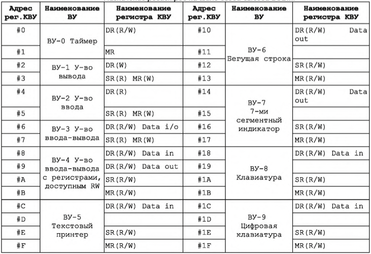
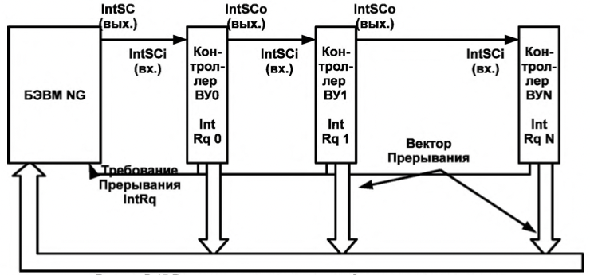
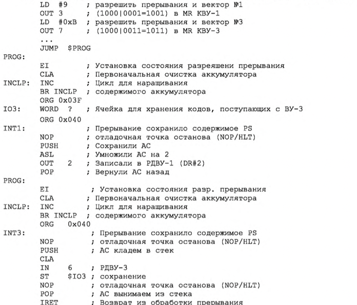

## [主页](../index.md)/[OPD](README.md)/Guide

# 
Приложение В. Состав, структура и функционирование БЭВМ-NG  附录 C. BEVM-NG 的组成、结构和功能

## 
Часть 2. Организация ввода-вывода в базовой ЭВМ  第 2 部分：基础计算机中输入输出的组织

Обмен информацией с внешним устройством состоит из **инициации обмена**, где осуществляются предварительные действия по подготовке к вводу или выводу данных (установка соединения, ожидание готовности и пр.) и собственно **обмена банными** (их передачей или приемом).  
与外部设备的信息交换包括 **交换的启动**，其中执行初步操作以准备数据的输入或输出（建立连接、等待准备就绪等）和实际的 **数据交换**（它们的传输或接收）。

Если и инициацией и обменом занимается центральный процессор, то такой обмен называется **проераммно-управляеммм**. Программно-управляемый обмен по способу инициации разделяется на **синхронным**, когда обмен начинается в заранее известный промежуток времени (например, каждую минуту) и **асинхронным**, когда программе неизвестно время начала обмена данными и она вынуждена периодически проверять возможность обмена (например, готовность внешнего устройства).  
如果启动和交换都由中央处理器处理，则这种交换称为 **程序控制**。当交换以预定的时间间隔（例如，每分钟）开始时，程序控制的交换按启动的方法分为 **同步** 的。当程序不知道数据交换的开始时间，是 **异步** 的。程序需要定期检查交换的可能性（例如，外部设备的准备情况）。

Чтобы исключить периодическую проверку готовности, устройства могут сами инициировать обмен по специальному аппаратному сигналу, который называется **запрос прерывания**, а соответствующий обмен — **управляемый прерываниями ввод-вывод**. При таком способе внешнее устройство сигнализирует процессору о необходимости начать обмен, процессор приостанавливает (**прерывает**) текущую программу, осуществляет ввод-вывод с помощью **npoграммы обработки прерывания**, а затем продолжает выполнять основную программу.  
为了消除周期性的就绪检查，设备可以自己发起一个特殊的硬件信号的交换，称为 **中断请求**，相应的交换是**中断驱动的 I/O**。 使用这种方法，外部设备向处理器发出信号以开始交换，处理器暂停（**中断**）当前程序，使用**中断处理程序**执行 I/O，然后继续执行主程序。
 
**Ввод-вывод с использованием прямого доступа к памяти** (ПДП, в английской литературе DMA) организует и инициацию и обмен данными при помощи контроллеров ПДП. Такие контроллеры передают данные непосредственно в память ЭВМ, при этом центральный процессор в обмене данными не участвует.  
**使用直接内存访问的输入-输出**（ПДП，英文文献中的 DMA）使用 ПДП 控制器组织启动和数据交换。 这种控制器直接将数据传输到计算机内存，而中央处理器不参与数据交换。

Обмен данными (прием и передача) может также быть организован **синхронно**, когда наличие данных на шине подтверждается специальным сигналом синхронизации с постоянной частотой, и **асинхронно**, с использованием сигналов готовности "и/или" подтверждения приема-передачи данных.  
数据交换（接收和传输）可以 **同步** 组织，当总线上的数据存在通过具有恒定频率的特殊同步信号来确认时。也可以 **异步** 地，使用就绪信号 “和/或” 确认数据的传输和接收

Задачу инициации и обмена данными в ЭВМ осуществляют специальные программы (такие программы еще называют драйверами), которые совместно с аппаратурой ЭВМ организуют и контролируют процесс ввода-вывода.
计算机中启动和交换数据的任务是由特殊程序（此类程序也称为驱动程序）执行的，这些程序与计算机硬件一起组织和控制输入输出过程

### 2.1 Устройства ввода-вывода базовой ЭВМ 主机的 I/O 设备

Рисунок В.11 Подсистема ввода-вывода базовой ЭВМ(показаны КВУ и ВУ1,3) 图 B.11 基础计算机的 I/O 子系统（显示了 КВУ 和 ВУ1,3）

Модель базовой ЭВМ с контроллерами устройств ввода-вывода представлена на рис В.11. В базовой ЭВМ используются простейшие внешние устройства (ВУ): устройство вывода (ВУ-1), устройства ввода ВУ-2 и устройство ввода-вывода ВУ-3. В модели устройства ввода-вывода представлены 8-разрядными регистрами данных (РД ВУ). Через регистры данных ВУ-2 и ВУ-3 информация может быть введена в базовую ЭВМ, а в регистры данных ВУ-1 и ВУ-3 принята из базовой ЭВМ.  
带有 I/O 设备控制器的基本计算机模型如图 B.11 所示。 基本计算机使用最简单的外部设备（ВУ）：输出设备（ВУ-1）、输入设备 ВУ-2 和输入-输出设备 ВУ-3。 在该模型中，输入输出设备由 8 位数据寄存器 (РД ВУ) 表示。 通过数据寄存器 ВУ-2 和 ВУ-3，可以将信息输入到基础计算机，并输入从基础计算机接收的数据寄存器 ВУ-1 和 ВУ-3。

Кроме того, в последней версии БЭВМ реализован таймер (устройство ВУ-0), которое вызывает прерывание через заданное в его DR число секунд; устройство ввода-вывода ВУ-4, аналогичное с ВУ-3, за исключением того, что используются отдельные регистры для входных и выходных данных; текстовый принтер ВУ-5; бегущая строка ВУ-6; 8-ми разрядный 7-сегментный индикатор ВУ-7; клавиатура ВУ- 8 и цифровая клавиатура ВУ-9.  
此外，在最新版本的计算机中，实现了一个计时器（ВУ-0 设备），它会在其 DR 中指定的秒数后导致中断； 输入输出设备ВУ-4，类似于ВУ-3，不同之处在于输入和输出数据使用单独的寄存器； 文本打印机 ВУ-5； 运行线 ВУ-6； 8位7段指示器ВУ-7； 键盘 ВУ-8 和数字键盘 ВУ-9。

Между ВУ и процессором включены простейшие контроллеры внешнего устройства (КВУ), каждый из которых содержит:  
在 ВУ 和处理器之间，包括最简单的外部设备控制器 (КВУ)，每个控制器都包含：

- **дешифратор адреса**, позволяющий выделить обращение к данному ВУ среди всех обращений к устройствам ввода-вывода, подключенных к процессору;  
  **地址解码器**，允许您在对连接到处理器的 I/O 设备的所有调用中选择对该 ВУ 的调用；
- **логику управления КВУ**. набор логических схем, позволяющий реагировать и формировать сигналы шины БЭВМ. Данные схемы не представлены подробно для КВУ-3, в качестве примера реализации необходимо обратится к схеме КВУ-1 на рис. В.11;  
  **КВУ 逻辑控制**，一组逻辑电路，允许您响应和生成计算机总线信号。 这些方案对于 КВУ-3 没有详细介绍；作为实现示例，有必要参考图 B.11 中的 КВУ-1 方案；
- **регистр данных** (DR - Data Register), через который происходит обмен данными между процессором и внешним устройством;  
  **数据寄存器**（DR - Data Register），通过它在处理器和外部设备之间交换数据；
- **регистр состояния** (SR - State Register), в котором хранится информация о готовности ВУ к обмену данными с процессором. В контроллерах простейших ВУ используются однобитовые регистры готовности, которые часто называют **флагом**.  
  **状态寄存器**（SR - State Register），它存储有关 ВУ 准备好与处理器进行数据交换的信息。 在最简单的 ВУ 的控制器中，使用了一位就绪寄存器，通常称为**标志**。
- **регистр управления** (MR - Management Register), регистр, в котором используются 4 младших разряда, разряд 3 - для разрешения прерывания от контроллера и разряды с 0 по 2, которые содержат номер вектора прерывания. Если прерывания разрешены командой `EI` и установлено разрешение прерывания от контроллера (разряд 3), то контроллер будет генерировать сигнал IntRq и выставлять номер вектора прерывания на шину адреса.  
  **管理寄存器**（MR - 管理寄存器），一个使用 4 个最低有效位的寄存器，位 3 - 启用来自控制器的中断，位 0 到 2，其中包含中断向量的编号。 如果使用 `EI` 命令启用中断并且设置了控制器中断启用（位 3），则控制器将生成 IntRq 信号并将中断向量编号设置到地址总线。

Контроллеры ВУ связаны с процессором при помощи **системной шины** БЭВМ, в сегменты (или, физически, разъемы для установки контроллеров) которой подсоединяются различные шины со стороны процессора и контроллера:  
ВУ 控制器使用计算机的 **系统总线** 连接到处理器，连接到从处理器和控制器一侧连接各种总线的段（或物理上用于安装控制器的连接器）：

- **шина данных** (Data0..7), по которым происходит передача данных в процессор или из процессора;  
  **数据总线**（Data0..7），数据通过它传输到处理器或从处理器传输；
- **шина адреса** (Addr0..7), по которой передается адрес внешнего устройства от процессора к КВУ и номер вектора запроса на прерывание (Int#) от КВУ к процессору, подтверждаемый сигналом выдачи вектора (IntV);  
  **地址总线**（Addr0..7），通过该总线将外部设备的地址从处理器传送到 КВУ 和从 КВУ 到处理器的中断请求向量（Int#）的编号，由向量输出信号确认（IntV）；
- **сигнал запроса прерывания** (IntRq), по которому выставляется требование прерывания от внешнего устройства;  
  **中断请求信号**（IntRq），它设置来自外部设备的中断请求；
- **сигнал ввода** (Input) - для передачи приказа на ввод (`IN #reg`);  
  **输入信号**（Input） - 发送输入指令（`IN #reg`）；
- **сигнал вывода** (Output) - для передачи приказа на вывод (`OUT #reg`);  
  **输出信号**（Output） - 发送输出命令（`OUT #reg`）；
- **начальный сигнал предоставления прерывания** (IntSC), который управляется программно микрокодом в цикле прерывания по микрокоманде `INTs`.  
  **中断授权开始信号**（IntSC），在`INTs`微指令中断周期由软件微码控制。
- **входящий цепочный сигнал предоставления прерывания** (IntSCi# - Interrupt Supply Chain input), по которому контоллер, в соответствии с порядком подключения к шине, проверяет возможность предоставления ему прерывания в соответствии с очередью подключения, и генерирует прерывание, если они разрешены глобально командой `EI` и в регистре MR контроллера;  
  **传入的中断供应链信号**（IntSCi# - 中断供应链输入），根据该信号，控制器按照连接到总线的顺序，根据连接队列检查是否授予其中断，以及如果它们由 `EI` 命令全局启用并在寄存器 MR 控制器中启用，则生成中断；
- **исходящий цепочный сигнал предоставления прерывания** (IntSCo# - Interrupt Supply Chain output), который передает контроллер по шине далее следующему КВУ, если нет необходимости вызвать прерывание вычислительного процесса;  
  **输出中断供应链信号**（IntSCo# - 中断供应链输出），如果不需要在计算过程中引起中断，它将控制器通过总线转移到下一个 КВУ；
- **сигнал готовности** (Rdy), подтверждающий завершение операции ввода- вывода внутри цикла обмена между АС и DR соответствующего КВУ. В случае операции ввода Rdy подтверждает данные, передаваемы по шине данных, и в обоих случаях операции ввода-вывода сигнализирует о том, что цикл обмена с регистром данных DR контроллера завершен;  
  **就绪信号**（Rdy），确认对应 КВУ 的 AC 和 DR 之间的交换周期内 I/O 操作完成。 在输入操作的情况下，Rdy确认数据总线上传输的数据，并且在两种 I/O 操作的情况下都发出与控制器的数据寄存器 DR 的交换周期完成的信号；
- **сигнал синхронизации** (Syn) от тактового генератора БЭВМ, который задает временной слот единичного обмена по шине БЭВМ.  
  来自计算机时钟发生器的 **同步信号** (Syn)，它设置计算机总线上单个交换的时隙。

Со стороны процессора к системной шине БЭВМ подключены:  
在处理器端，以下连接到计算机的系统总线：

- **дешифратор приказа** (DC IO), который преобразует приказ в КОП команды ввода-вывода в набор управляющих сигналов на шине. 0-й выход дешифратора активен после команды `DI`; 1 - для `EI`; 2 - для команды `IN`, формируя на шине БЭВМ сигнал Input; 3 — для команды `OUT` и сигнала Output.  
  **指令解码器**（DC IO），它将 I/O 命令的 CPC 指令转换成总线上的一组控制信号。 `DI` 命令后解码器输出 0 有效； 1 - 用于指令 `EI`; 2 - 用于指令 `IN`，形成计算机总线上的输入信号； 3 - 用于 `OUT` 命令和输出信号。
  Выходы, начиная с 4-го не используются;  
  不使用从第 4 个开始的输出；

- **регистр разрешения прерывания**, который входит в состав PS 5-ым разрядом, и показывает глобальный статус разрешений прерывания в процессоре;  
  **中断使能寄存器**，是 PS 位 5 的一部分，指示处理器中的全局中断使能状态；
- **регистр прерывания от КВУ**. по которому выполняется цикл прерывания, если прерывания разрешены глобально и в настоящее время на шине БЭВМ есть запрос на прерывание от одного из КВУ. Данный регистр входит в состав PS в 6-ым разрядом;  
  **КВУ 中断寄存器**。 如果全局启用中断并且当前在计算机总线上有来自 КВУ 之一的中断请求，则执行中断周期。 该寄存器是第 6 位 PS 的一部分；
- **логика управления шины БЭВМ** предназначена для подключения и отключения приемо-передатчиков сигналов КВУ и процессора для осуществления обмена CPU с одним из контроллеров в один момент времени.  
  **计算机总线的控制逻辑** 设计用于连接和断开 КВУ 信号的收发器和处理器，以便一次与其中一个控制器交换 CPU。

Таблица В. 12 Назначение регистров на шине ввода-вывода БЭВМ. 表 B. 12 计算机输入输出总线上的寄存器分配。

Назначение регистров контроллеров внешних устройств представлены в таблице В.12.  
外部设备控制器寄存器的用途如表 B.12 所示。

- R - означает, что регистр доступен только для чтения    
  R - 表示寄存器仅可用于读取
- W - только для записи  
  W - 仅可用于写入
- R/W - доступен для обоих операций  
  R/W - 可用于两种操作

Направление обмена закодированы мнемоникой Data In для ввода данных из КВУ, Data Out - для вывода данных в КВУ, а Data i/o - для двунаправленного обмена.  
交换的方向由 Data In 助记符编码，用于从 КВУ 输入数据，Data Out - 用于向 КВУ 输出数据，Data i/o - 用于双向交换。

### 2.2 Команды ввода-вывода 输入/输出命令

Команды ввода-вывода приведены на рисунке В.13. Указан формат команды, в котором код операции представлен значением 0x1 в разрядах с 12 по 15. В разрядах 8..11 располагается приказ на ввод-вывод, его три младших разряда декодируются аппаратно на дешифраторе приказов (DC IO), а биты с 0 по 7 кодируют адрес регистра контроллера ввода вывода, с которым осуществляется обмен. К командам добавлена операция возврата из прерывания `IRET`, которая осуществляет восстановление из стека значений регистра состояния и счетчика команд.  
I/O 命令如图 B.13 所示。 指定命令格式，其中操作码由位 12 到 15 中的值 0x1 表示。位 8..11 包含一个 I/O 指令，它的三个最低有效位由指令解码器上的硬件解码（DC IO)，位 0 到 7 编码与执行交换的 I/O 控制器的寄存器地址。 命令中增加了`IRET`中断返回操作，从堆栈中恢复状态寄存器和程序计数器的值。

- Команда `DI` запрещает прерывания, помещая в 5 бит регистра состояния '0'.  
  `DI` 命令通过将状态寄存器的第 5 位设置为“0”来禁用中断。
- Команда `EI` разрешает прерывания, помещая в 5 бит регистра состояния '1'.  
  `EI` 指令通过将状态寄存器的第 5 位设置为 '1' 来启用中断。
- Команда `IN #reg` осуществляет чтение из регистра ВУ по адресу в аккумулятор.  
  `IN #reg` 指令将地址处的 ВУ 寄存器读取到累加器中。
- Команда `OUT #reg` осуществляет запись из аккумулятора по адресу в регистр ВУ.  
  `OUT #reg` 命令从地址处的累加器写入 ВУ 寄存器。
- Команда `INT #num` вызывает программное прерывание с вектором num.  
  `INT #num` 指令导致带有向量 num 的程序中断。
- Команда `IRET` возврат из программы обработки прерывания.  
  `IRET` 指令是中断处理程序的返回。

Формат команд ввода-вывода I/O 命令格式

Команды, связанные с вводом-выводом I/O 相关命令

Рисунок В. 13 Ввода-вывод: Команды и формат. 图 B. 13 I/O 命令与格式。

### 2.3 Программно-управляемый асинхронный обмен 2.3 软件控制的异步交换

При использовании программно-управляемого асинхронного обмена должна быть составлена программа, обеспечивающая пересылку данных из памяти ЭВМ в аккумулятор и далее в регистр памяти контроллера ВУ (вывод данных) или из регистра данных контроллера ВУ в аккумулятор и затем в память ЭВМ (ввод данных). Программа такого обмена строится так: сначала проверяется готовность ВУ к обмену и если оно готово, то дается команда на обмен. ВУ сообщает о готовности установкой флага в 6-м разряде регистре SR.  
当使用程序控制的异步交换时，必须编译一个程序，提供从计算机内存到累加器，然后到 ВУ 控制器的内存寄存器（数据输出）或从 ВУ 控制器的数据寄存器到累加器，然后到计算机内存（数据输入）。 这种交换的程序是这样构建的：首先，检查 VC 是否准备好交换，如果准备好，则发出交换命令。 ВУ 通过在 SR 寄存器的第 6 位设置一个标志来报告准备就绪。

Пример. С помощью устройства ввода ВУ-2 (DR#4, SR#5) записать в ячейку в памяти коды символов слова "ДА" в кодировке K0I8-R. Пример программы представлен в табл. В.14.  
例子。 使用 ВУ-2 输入设备（DR#4、SR#5），将 K0I8-R 编码中单词“YES”的字符代码写入内存中的一个单元格。 示例程序如表所示。 B.14。

В начале программа висит в ожидании готовности: считывается статусный (с номером 5) регистр ВУ-2, который передается через шину данных в 6 разряде числа, сравнивается с 0x40 (01000000г), и пока устройство не готово (SR равен 0). Такие циклы с неопределенным временем завершения, называются циклами “spin-loop”, они постоянно проверяет готовность устройства или переменной в программе, загружая процессор. Как только 6 разряд SR принимает значение 1 (устройство готово), в регистр данных ВУ считывается в младшие 8 разрядов аккумулятора, старшие разряды АС при этом остаются не изменными. Для того, чтобы подготовить АС к приему второго символа, происходит обмен байтов аккумулятора при помощи  команды `SWAB`, и сохранение этого символа в старших разрядах в ячейку результата. Далее снова происходит ожидание готовности устройства, после получения готовности загружается ячейка с результатом и считывается 2 символ в младшую часть аккумулятора. Готовое слово с двумя символами в аккумуляторе сохраняется в ячейку результата.  
一开始，程序挂起等待就绪：状态寄存器（编号为5）ВУ-2被读取，通过数据总线在编号的第6位传输，与 0x40（01000000g）比较，直到设备准备就绪（SR 为 0）。这种具有无限完成时间的循环称为“自旋循环”循环，它们不断检查程序中设备或变量的准备情况，加载处理器。一旦 SR 的第 6 位取值 1（设备准备就绪），ВУ 数据寄存器就被读入累加器的低 8 位，而 AC 的高位保持不变。为了准备 AU 接收第二个字符，累加器的字节使用 `SWAB` 命令交换，并且该字符存储在结果单元的高位中。接下来，设备再次等待准备就绪，在收到准备就绪后，加载具有结果的单元格并将第二个字符读入累加器的低位。累加器中包含两个字符的完成单词存储在结果单元格中。

Необходимо еще раз подчеркнуть, что ввод-вывод происходит только с младшей частью аккумулятора, старшая часть во время выполнения команд `IN` ли `OUT` не изменяется. Также важно, что при данной реализации асинхронного обмена ЭВМ тратит время на ожидание (неопределенно долгое!) момента готовности циклически опрашивая флаг (spin-loop) и не может выполнять никакой другой работы. Разумная организация процедур ввода-вывода позволяет избегать такого зацикливание, например через периодический опрос флага при выполнении основной программы или через прерывания.  
必须再次强调，I/O 只发生在累加器的下部，在执行 `IN` 或 `OUT` 命令期间上部不会改变。同样重要的是，通过这种异步交换的实现，计算机通过循环轮询标志（自旋循环）花费时间（无限期地！）等待准备就绪，并且不能执行任何其他工作。 I/O 过程的合理组织可以让您避免这样的循环，例如，通过在主程序执行期间定期轮询标志或通过中断。

Таблица В. 14 Ввод данных с использованием ВУ-2 Ассеблерный листинг. 表 B.14 使用 VU-2 汇编器列表的数据输入。

Листинг примера: Ввод двух символов с устройства ввода ВУ-2 (DR#4, SR#5) 示例清单：从 ВУ-2 输入设备（DR#4、SR#5）输入两个字符

### 2.4 Управляемый по прерыванию программы ввод-вывод 2.4 中断驱动的 I/O

Этот вид обмена отличается от асинхронного тем, что сигнал готовности ВУ к обмену анализируется не программным, а аппаратным путем. ЭВМ может выполнять любую не связанную с обменом программу (будем называть ее основной).  
这种交换与异步交换的不同之处在于，交换 ВУ 的就绪信号不是由软件分析，而是由硬件分析。 一台计算机可以执行任何与交易所无关的程序（我们称之为主程序）。

Когда будет нажата кнопка готовности, то в случае, если в контроллере прерывания разрешены (наприме, реализуется через схему „И“ регистра состояния SR и старшего бита регистра управления MR, рис. В.11, контроллер КВУ-1) поступает сигнал "Запрос прерывания" по линии IntRq. После чего этот сигнал поступит на схему „И“ центрального процессра В.11 с 5 битом регистра состояния (EI - разрешение прерываний) проверяющий разрешены ли прерывания в ЭВМ и записывающий результат схемы в 6 бит регистра состояния (INT - прерывание). После цикла исполнения очередной инструкции основной программы в ЭВМ будет запущен комплекс программ, проверяющий, было ли требование прерывания, и если было, то формирует управляющий сигнал "Предоставление прерывания" IntSC, который последовательно проходит через все контроллеры (сигналы IntSCo - выходной и IntSCi - входной) и проверяет было ли в этом контроллере прерывание. Когда сигнал доходит до нужного контроллера, то он выставляет на шину адреса свой номер вектора прерывания (см. рис. В.15). После чего процессор по номеру прерывания вызывает программу обработки прерывания.  
当按下就绪按钮时，如果控制器中允许中断（例如通过 SR 状态寄存器的“与”电路和 MR 控制寄存器的高位实现，图 B.11，КВУ- 1 控制器），信号“中断请求”在线 IntRq。之后，此信号将与状态寄存器的 5 位（EI - 中断使能）进入中央处理器 B.11 的“与”电路，检查计算机是否允许中断，并将电路的结果写入状态寄存器的 6 位（INT - 中断）。在主程序的下一条指令执行周期后，计算机会启动一组程序，检查是否有中断请求，如果有，则产生控制信号“Granting an interrupt” IntSC，即依次通过所有控制器（信号 IntSCo - 输出和 IntSCi - 输入）并检查此控制器中是否存在中断。当信号到达所需的控制器时，它将其中断向量号放在地址总线上（见图 B.15）。之后，处理器通过中断号调用中断处理程序。

Ячейки памяти с адресами О-OxF отведены для инициализации векторов прерывания, по 2 ячейки на каждый вектор. В начале программы все контроллеры ВУ, в которых должны вызывать прерывания должны быть проинициализированы.  
地址为 O-OxF 的存储单元保留用于初始化中断向量，每个向量 2 个单元。 在程序开始时，所有要调用中断的 ВУ 控制器都必须初始化。

Если прерывания разрешены, то после выполнения всех команд кроме `HLT`, а также если режим выполнения БЭВМ установлен в значение "РАБОТА", выполняются следующие действия:  
如果启用了中断，则在执行除 `HLT` 之外的所有命令后，并且如果计算机执行模式设置为“РАБОТА”，则执行以下操作：

Рисунок В. 15 Распространение сигналов предоставления прерывания 图 B.15 中断准许信号的传播

- Шаг 1. По завершению цикла исполнения текущей команды происходит переход на цикл прерывания. Если в этот момент 6 бит регистра состояния INT (прерывание) не равен 1, то происходит переход к следующей команде. При наличии требования прерывания БЭВМ формирует сигнал "Предоставление прерывания" (IntSC) через выполнение микрокоманды `INTS`.  
  Step 1. 当前命令的执行周期结束后，进入中断周期。 如果此时状态寄存器 INT（中断）的第 6 位不等于 1，则转移到下一条指令。 如果有中断请求，计算机通过执行 `INTS` 微指令产生一个“Interrupt Grant”（IntSC）信号。
- Шаг 2. Сохраняется счетчик команд и регистр состояния БЭВМ в стеке.  
  步骤 2. 程序计数器和计算机状态寄存器存储在堆栈中。
- Шаг 3. Младшие 8 разрядов (номер вектора прерывания) записываются в буферный регистр и вычисляется адрес с переходом на подпрограмму обработки прерывания, как номер вектора * 2, после чего тот записывается в DR, а после в IP.  
  Step 3. 将低 8 位（中断向量号）写入缓冲寄存器，并计算地址，转移到中断处理程序作为向量号 * 2，然后写入 DR，然后写入 IP .
- Шаг 4. Далее к младшим 8 разрядам буферного регистра прибавляется 1, чтобы выбрать адрес следующей ячейки вектора прерывания (новый регистр состояния PS), ограничивая результат 8-ю разрядами. После чего по этому адресу содержимое в памяти записывается в DR, а после в PS.  
  Step 4. 接下来，将缓冲寄存器的低 8 位加 1 以选择中断向量的下一个位置（新的 PS 状态寄存器）的地址，将结果限制为 8 位。 之后，在这个地址，内存中的内容被写入 DR，然后写入 PS。
- Шаг 5. Контроллер прерываний вновь переводится в состояние разрешение прерывания командой ei и осуществляется возврат к выполнению прерванной программы, т.е. к команде, адрес которой хранится в стеке, также восстанавливается сохраненный регистр состояния из стека.  
  Step 5. 中断控制器通过 ei 命令返回中断使能状态，被中断的程序返回执行，即 对于地址存储在堆栈中的指令，保存的状态寄存器也从堆栈中恢复。

   > Пример. Составить программу, которая постоянно наращивает на 1 содержимое аккумулятора. Восемь младших разрядов удвоенного значения аккумулятора должны выводиться на ВУ-1 по его запросу, а по запросу ВУ-3 содержимое регистра данных ВУ-3 должно записаться в ячейку 3F.  
   > 例子。 编写一个程序，将累加器的内容连续加 1。 累加器的加倍值的最低八位应根据 ВУ-1 的请求输出到 ВУ-1，应 ВУ-3 的请求，应将 ВУ-3 数据寄存器的内容写入单元 3F。

Таблица В. 16
Ввод данных с использованием прерываний. Ассемблерный листинг. 使用中断输入数据。 装配清单。

Листинг примера: Готовность ВУ1: 2*А->РДВУ1, Готовность ВУЗ: РДВУЗ-» яч.3F 示例列表：ВУ1 的准备情况：2*A-> РДВУ1，ВУЗ 的准备情况：РДВУЗ-> яч.3F

Если эту программу занести в память базовой ЭВМ, установить в СК пусковой адрес 20 и нажать кнопку ПУСК, то начнет выполняться бесконечный цикл наращивания содержимого аккумулятора. Когда же на пульте управления (рис В.11) будет нажата любая из кнопок готовности ВУ, то будет выполнен переход к подпрограмме обработки прерываний.  
如果将该程序输入到主机的内存中，在 СК 中设置起始地址 20 并按下 ПУСК 按钮，则将开始进行无限循环的增加电池内容。 当按下控制面板上的任何 ВУ 就绪按钮时（图 B.11），将转换到中断处理子程序。

Для отладки программы (табл. В.8) в ней используются точки останова. Если в ячейке памяти точки останова расположена команда `NOP`, то программа выполняется в обычном, не отладочном режиме. Если вместо `NOP` поместить команду `HLT`, то программа во время выполнения остановится и будет возможно проконтролировать содержимое регистров и ячеек памяти. После завершения контроля необходимо продолжить дальнейшее исполнение программы. В приведенном примере точки останова позволяют исследовать содержимое аккумулятора в момент возникновения прерывания, а так же правильность подсчета и вывода на ВУ-3 удвоенного его значения.  
为了调试程序（表 B.8），它使用断点。如果 `NOP` 命令位于断点存储单元中，则程序以正常的非调试模式执行。如果我们使用 `HLT` 命令代替 `NOP`，那么程序将在执行期间停止，并且可以检查寄存器和内存单元的内容。控制完成后，需要继续执行程序。在上面的例子中，断点可以让你在中断发生的那一刻检查累加器的内容，以及计数的正确性并将其双倍值输出到 ВУ-3。

# 
 Приложение Д. Ассемблер БЭВМ. Краткий справочник  附录 D. BEVM 汇编器。 快速参考

Для упрощения разработки программ для БЭВМ и более наглядного их представления разработан язык ассемблера, позволяющий использовать дополнительные возможности для разработки программ.  
为了简化计算机程序的开发和更直观的表示，已经开发了一种汇编语言，允许您使用附加功能来开发程序。

**Синтаксис 语法**

Назначение 用途|Синтаксис 语法|Пример использования 实例
---|---|---
Размещение в памяти 内存布局 | ORG адрес | ORG 0x10
Адресная команда 寻址指令 | [метка:] МНЕМОНИКА АРГУМЕНТ | LD X /прямая относительная   ST $Y /прямая абсолютная   LD -(X)   JUMP (VALUES)   SWAM (ARRAY)+
Безадресная команда 非寻址指令 | [метка:] МНЕМОНИКА | START: CLA
Команда ввода-вывода 输入输出指令 | [метка:] МНЕМОНИКА АДРЕСВУ | OUT 0x3
Константы 常量 | [метка:] WORD значение [,значение...] [[метка:] WORD количество DUP(значение) | X: WORD ?   Y: WORD X   VALUES: WORD 1,2,3   ARRAY: WORD 10 DUP (?)

Метки, команды, их аргументы и т.п. должны быть отделены друг от друга пробелом или символом табуляции.  
标签、命令、它们的参数等。 必须用空格或制表符相互分隔。

## 
Часть 3. Микропрограммное устройство управления 

### 3.1. Микропрограммное управление вентильными схемами 

Процесс выборки, дешифрации и исполнения команд ЭВМ состоит из последовательности элементарных операций (например, пересылка содержимого одного регистра 8 другой регистр или проверка определенного бита в каком-либо регистре). Для выполнения таких микроопераций, как правило, достаточно подать открывающий сигнал на одну или несколько вентильных схем, связывающих между собой два регистра, регистр и АЛУ и (или) перестраивающих АЛУ на выполнение заданной операции (сложения, логического умножения и т.п.). Требуемая последовательность сигналов на вентильные схемы ЭВМ вырабатывается ее устройством управления, связанным с тактовым генератором.

Микропрограммное устройство управления (МПУ) базовой ЭВМ - это, в свою очередь, очень простая ЭВМ, для которой регистры и вентильные схемы процессора являются как бы устройствами ввода-вывода (рис. В.17).

Программа работы такой ЭВМ называется микропрограммой, а ее команды, содержащие информацию об элементарных действиях, выполняемых в течение одного рабочего такта ЭВМ, - микрокомандами. В одном из вариантов реализации МПУ используется всего два типа микрокоманд - операционная и управляющая.

Микропрограмма обычно хранится в постоянном запоминающем устройстве - памяти микрокоманд, но в эмуляторе БЭВМ реализована возможность изменения микропрограммы. В каждом такте работы ЭВМ из этой памяти в регистр микрокоманд (РМК) пересылается очередная микрокоманда, т.е. микрокоманда, на которую указывает счетчик микрокоманд (СчМК), одновременно выполняющий функции регистра адреса микрокоманд.

Существует 2 типа микрокоманд (рис. В. 18) - операционная (ОМК) и управляющая (УМК). Биты 0-15 обоих типов совпадают, логика остальных зависит от типа. В 39-ый бит РМК записывается код операции, исходя из которого происходит выбор типа микрокоманды (0 - для ОМК; 1 - для УМК). Этот сигнал подается напрямую на вентили УМК (16-32 биты РМК) и через инвертор на вентили ОМК (16- 35 биты РМК), открывая/закрывая биты УМК/ОМК, тем самым производя выбор типа микрокоманды.

Разряды РМК, содержащие 1, создают открывающий управляющий сигнал, а содержащие 0 - закрывающий. Подобная структура микрокоманды, где каждый бит используется для создания отдельного управляющего сигнала, называется горизонтальной.

Так как биты 0-15 обоих типов микрокоманд совпадают, то назначение у них одинаковое, биты 0-7 отвечают за сигналы чтения регистров, регистры 8-11 отвечают за действия в АЛУ, биты 12-15 отвечают за сигналы передачи в коммутаторе. Далее назначение битов в каждом типе отличается:

- ОМК: биты 16-23 отвечают за сигналы преобразований и установки флагов в коммутаторе;
- ОМК: биты 24-31 - запись в регистр результат преобразований;
- ОМК: биты 32-33 - взаимодействие с памятью БЭВМ
- ОМК: биты 34-35 - взаимодействие с внешними устройствами
- ОМК: бит 38 - HALT, бит останова.
- УМК: биты 16-23 - выбор бита для сравнения, работающий по схеме „ИЛИ“ с данными поступающими из коммутатора;
- УМК: биты 24-31 задают адрес перехода, куда перейдет программа в случае, если схема инверсного ,,XOR“ даст положительный результат (бит сравнения и результат схемы „И“ выбора бита одинаковы);
- УМК: бит 32 - поле для сравнения с схеме инверсного "XO".

Справочная информация об отдельных операциях в микрокоманде приведена в табл. 8.19.

1. Для вычитания содержимого DR из содержимого АС и записи результата в буферный регистр (АС-DR—>BR) следует выполнить микрокоманду:
(0000 0000 0010 0000 0000 0000 1001 0101 0001 0001)2 = (0020009511)16,
т.е. одновременно подать единичные управляющие сигналы на чтение аккумулятора RDAC и регистра данных RDDR. Тогда к уменьшаемому прибавится обратный код вычитаемого и к этой сумме добавится единица, что эквивалентно АС + (-DR), а после записываем результат в буферный регистр.
2. Для сложения содержимого АС с содержимым DR и записью результата в буферный регистр с выставлением флагов (AC+DR—>BR, NZVC) следует выполнить микрокоманду:
(0000 0000 0010 0000 1110 0000 1001 0000 0001 0001)2 = (0020009511)16,
т.е. одновременно подать единичные управляющие сигналы на чтение аккумулятора RDAC и регистра данных RDDR. Тогда левый и правый вход АЛУ суммируются, выставятся флаги и результат запишется в буферный регистр.
3. Для возведения в дополнительный код содержимого АС и записи результата в АС с выставлением флагов (~АС + 1—>АС, NZVC) следует выполнить микрокоманду:
(0000 0000 0001 0000 1110 0000 1001 0110 0001 0000)2 = (0010809610)is,
т. е. подать сигнал на чтение аккумулятора RDAC. Тогда, к обратному код левого входа прибавится единица, что эквивалентно -АС + 0, а после выставляются флаги и записыватся результат в аккумулятор.

Рассмотрим две управляющих микрокоманды:
1. Переход к команде, расположенной по адресу, на которую указывает адресная часть команды, если аккумулятор содержит нечетное число.
  (1000 0001 0101 1100 0000 0001 0001 0000 0001 0000)2 = (815С011010)16
  Микрокоманда подает сигнал на чтение аккумулятора RDAC, прямую передачу младшего байта и выбор нулевого бита данных, поступивших с коммутатора для сравнения. Далее задается адрес перехода и поле сравнения равное 1.
  Эта микрокоманда переходит на метку BR @ 5С, в которой происходит:
  5С 0020011002 extend sign CR(0..7) ? BR - расширение знака
  5D 0004009024 BR + IP ? IP - сложение буферного регистра BR с счетчиком
  команд IP и запись в счетчик IP
  5Е 80С4101040 GOTO INT @ C4 - переход к циклу прерывания (обязателен в конце каждой инструкции, обратите на это внимание при выполнении лабораторной работы).
2. Для организации безусловного перехода (например, по адресу 90) используется 4-й бит регистра состояний, содержащий константу 0 (см. табл. В.20). Сравнение этого разряда с нулем, записанным в 32-ый разряд УМК, всегда дает положительный результат и позволяет переслать в СчМК нужный адрес перехода. Микрокоманда, реализующая эту операцию, имеет вид:
  (1000 0000 0101 1100 0001 0000 0001 0000 0100 0000)2 = (805С101040)16.

##  3.2 Интерпретатор базовой ЭВМ

Полный текст микропрограммы (интерпретатора команд) приведен в табл. В.21. Интерпретатор состоит из нескольких блоков:

- Цикл выборки команд
- Цикл выборки адреса операнда и обработки режимов адресации 
- Цикл выборки операнда
- Цикл исполнения
  - Декодирование и исполнение адресных команд
  - Декодирование и исполнение ветвлений
  - Декодирование и исполнение безадресных команд
- Декодирование и исполнение команд ввода-вывода 
- Цикл прерывания
- Пультовые операции
  - Свободные ячейки для:
  - Арифметической команды - Команды перехода
  - Безадресной команды

Память микрокоманд содержит 256 ячеек для хранения микрокоманд, включая резерв. Формат микрокоманд - горизонтальный.

    Powered by
    <a href="https://html5up.net">HTML</a>, 
    <a href="https://markdown.com.cn/">markdown</a>, 
    <a href="https://www.latex-project.org/">LaTeX</a>
     
    Copyright © 2022 | 
    <a href="https://tolia-gh.github.io">Tolia</a>
     
    All Rights Reserved.
     

