# OPD part2

## 微机的历史与体系结构

- 计算机历史
  - 第零代（1642-1945）- 机械计算机（механические компьютеры）
    - 税收累加器（Паскаль），手摇四则运算计算器（Лейбниц）
  - 第一代（1945-1955）- 电子管（электронные лампы）
    - COLOSSUS (1943, Тьюринг), ENIAC (1946, Моушли), IAS (1951, фон Нейман)
  - 第二代（1955-1965）- 晶体管（транзисторы）
    - ТХ-0 (1955, МТИ), PDP-1 (1961, DEC), PDP-8, 7090 (IBM), 6600 (1964, CDC)
  - 第三代（1965-1980）- 集成电路（интегральные схемы）
    - Cемейство System/360 (1965, IBM), PDP-11 (1970, DEC)
  - 第四代（1980-?）- 超大型集成电路（сверхбольшие интегральные схемы）
    - IBM PC (1981), Apple, Intel, IBM, Dec, Compaq, HP, Sun…
  - 第五代（1989-?）- 小型与隐型计算机（небольшие и «невидимые» компьютеры）
- 苏联/俄罗斯的计算机历史
  - 第一代（1945-1955）- 电子管（электронные лампы）
    - Лебедев, 1950, МЭСМ 
    - БЭСМ, 1953, БЭСМ — 10000 оп/с, 53КВТ.
  - 第二代（1955-1965）- 晶体管（транзисторы）
    - 5Э92б, 1964, самодиагностика, горячая замена, 500000 оп/c 
    - БЭСМ-6, 1965 год, +ковейерная обработка, удаленное управление по телеф. Линиями
  - 第三代（1965-1980）- 集成电路（интегральные схемы）
    - Директива «Ряд», 1968 год, клонирование S/360, 1971 год — ЕС ЭВМ 
    - Клоны РDP-11
  - 第四代（1980-?）- 超大型集成电路（сверхбольшие интегральные схемы）
    - Эльбрус — разработка по настоящее время
- 总线
  - 基本概念：计算寄部件之间的连接方式有以下两种
    - 分散连接：各部件之间使用单独的连线
      - 特点：较为复杂，无法解决I/O设备与主机之间连接的灵活性
    - 总线连接：将各部件连到一组公共信息传输线上
  - 定义：总线是连接多个部件的信息传输线，是各部件共享的传输介质
  - 特点：在某一时刻，只允许有一个部件向总线发送信息，而多个部件可以同时从总线上接收相同的信息
  - 结构：总线实际上是由许多传输线或通路组成，每条线可一位一位地传输二进制代码
  - 传输方式
    - 串行传输（serial communication）：在一条传输线上在一段时间内逐一传输一串二进制代码
    ```
    ----------------
    ```
    - 并行传输（parallel transmission）：在多条专属先上同时传输多串二进制代码
    ```
    ----------------
    ----------------
    ----------------
    ----------------
    ```
  - 总线分类
    - 按数据传送方式分类
      - 并行传输总线
        - 8 位传输总线
        - 16 位传输总线
        - 32 位传输总线
        - ......
      - 串行传输总线
    - 按总线适用范围分类
      - 计算机（包括外设）总线
      - 测控总线
      - 网络通信总线
      - ......
    - 按连接部件分类
      - 片内总线
        - 是指芯片内部的总线，例如 CPU 芯片内部，寄存器与寄存器之间、寄存器与算逻单元ALU之间都由片内总线连接
      - 系统总线（板级总线）
        - 指CPU、内存、I/O设备（通过I/O接口）各大部件之间的信息传输线，通常都安放在主板或各个插件板上
        - 按系统总线传输信息的不同，又可分为：
          - 数据总线：
            - 用来传输各功能部件之间的数据信息，它是双向传输总线，其位数与机器字长、存储字长有关，一般为8位、16位或32位
            - 数据总线的位数称为数据总线宽度，它是衡量系统性能的一个重要参数
            - 如果数据总线的宽度为8位，指令字长为16位，那么，CPU在取值阶段必须两次访问主存
          - 地址总线
            - 地址总线主要用来指出数据总线上的元数据或目的数据在主存单元的地址或I/O设备的地址,由CPU输出，单向传输
            - 地址线的位数与存储单元的个数有关，如地址线为20根，则对应的存储单元个数为 2^20
          - 控制总线
            - 控制总线将微处理器控制单元（Control Unit）的信号，传送到周边设备
            - 通常对任一控制线而言，它的传输是单向的。但对于控制总线总体来说，又可认为是双向的
            - 控制总线还起到监视各部件状态的作用
          - 扩展总线
            - 可连接扩展槽和电脑
          - 局部总线
            - 取代更高速数据传输的扩展总线
      - 通信总线
        - 这类总线用于计算机系统之间或计算机系统与其他系统（如控制仪表、移动通信等）之间的通信
        - 按传输方式可分类为
          - 串行传输：指数据在单条1位宽的传输线上，一位一位按顺序分时传送
          ```
          ----------------
          ```
          - 并行传输：指数据在多条并行1位宽的同时由源传送到目的地
          ```
          ----------------
          ----------------
          ----------------
          ----------------
          ```
          - 对比
            --|串行通信|并行通信
            --|-------|-------
            适宜距离|远距离传输（数米至数千公里）|近距离传输（通常小于三十米）
            数据传输速率|低|高
            通信线路费用|低（还可利用现有的电话网络来实现远程通信）|高
  - 总线特性
    - 机械特性：指总线在及其连接方式上的一些性能
    - 电气特性：指总线的每一根传输线上的信号的传递方向和有效的电平范围，通常规定由CPU发出的信号称为输出信号，送入CPU的信号称为输入信号
    - 功能特性：指总线中每根传输线的功能
    - 时间特性：指总线中的任一根线在什么时候有效。每根总线上的各种信号互相存在一种有效的时序关系，因此时间特性一般可用信号时序图来描述
  - 总线指标
    - 总线宽度：通常是指数据总线的根数，用bit（位）表示
    - 总线带宽：可理解为总显得数据传输频率，即单位时间内总线上传输数据的位数，通常用每秒传输信息的字节数来衡量，单位可用MBps（兆字节每秒）表示
        总线带宽=总线工作频率*总线宽度
    - 时钟同步/异步：总线上的数据与时钟同步工作的总线称为同步总线；与时钟不同步的总线称为异步总线
    - 总线复用：一条信号线上分时传送两种信号，例如 地址总线与数据总线共用一组物理线路，在这组物理线路上分时传输地址信号和数据信号
    - 信号线数：地址总线、数据总线和控制总线三种总线数的总和
    - 总线控制方式：包括突发工作、自动配置、仲裁方式、逻辑方式、计数方式等
    - 其他指标：如负载能力（即驱动能力，指当总线接上负载后，总线输入输出的逻辑电平是否能保持在正常的额定范围内）、电源电压、总线宽度能否扩展等
  - 总线标准
    - 可视为系统与各模块、模块与模块之间的一个互连的标准界面
    - 这个界面对它两端的模块都是透明的，即界面的任一方只需根据总线标准的要求完成自身一方接口的功能需求，而无须了解对方接口与总线的连接要求，因此，按总线标准设计的接口可视为通用接口
    - 流行总线标准：
      - ISA
        - 工业标准构架总线，采用独立于CPU的时钟频率，所以能采用比总线频率更高的时钟，有利于CPU性能提高，没有支持总线仲裁的硬件逻辑，因而不支持多台主设备系统，且所有数据传输必须经过CPU或者DMA接口来管理，因此CPU花费大量时间来控制与外部设备交换数据。工作频率为8MHz，数据线16位，地址线24位
      - EISA
        - ISA 标准的延伸
      - VESA
      - PCI：
        - 高性能：不依附于某个具体处理器的局部总线，为系统提供一个高速的数据传输通道，采用33MHz或者66Mhz的总线时钟，数据线为32位，可以扩展到64位。支持突发工作，这种方式是指被传输的数据在主存中如果连续存放，访问这些数据的时候，只需要给出第一个数据地址，占用一个时钟周期，其后每个数据的传送各占一个时钟周期，不必每次给各个数据地址，从而提高传输速率
        - 兼容性：总线部件和插件接口相对于处理器是独立的，支持所有现在和将来不同结构的处理器，有相对长的生命周期
        - 即插即用
        - 支持多设备能力，提供数据和地址奇偶校验功能，支持两种电压，扩充性好，采用多路复用
      - AGB
      - RS-232C
        - 由美国电子工业协会（EIA）推荐的一种串行通信总线标准，用于串行二进制交换的数据终端设备和数据通讯设备
      - USB
        - 通用串行总线，基于通用连接技术，实现外设的简单快速连接，达到方便用户，降低成本，扩展PC外设的目的。具有真正的即插即用的特征，相信大家在日常生活中有这样的感受；有很强的连接能力，一般的电脑可以连接127个外设，通过hub你可以在你的电脑上连接更多的外设；USB1.0，采用无屏蔽的双绞线，传输速度达1.5Mbps，若采用屏蔽双绞线，可以达到12Mbps，USB2.0的传输速度可达480Mbps；标准统一，usb标准的引入减轻了目前PC对所有标准接口的需求，我们日常用的鼠标，键盘，打印机都可以用usb标注接入系统，从而减少对PC插槽的需求；连接电缆轻巧，电源体积小。usb采用4芯电缆，两条用于信号连接，两条用于电源和接地，可以给外设提供5V的直流电流；生命力强，开放性的不具有专利版权的工业标准
  - 总线结构
    - 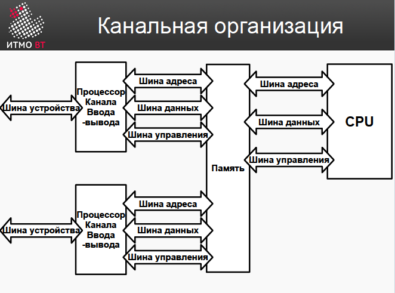
      - 双通道结构，两个内存通道并行操作的模式。消费者台式机和一些笔记本电脑最流行的模式。与单通道模式相比，您可以将吞吐量提高多达 2 倍。
    - 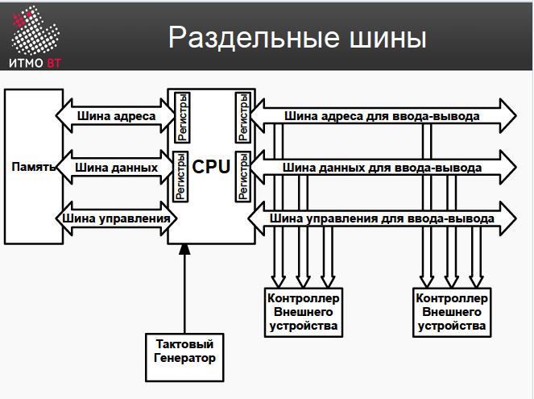
      - 总线分离
    - 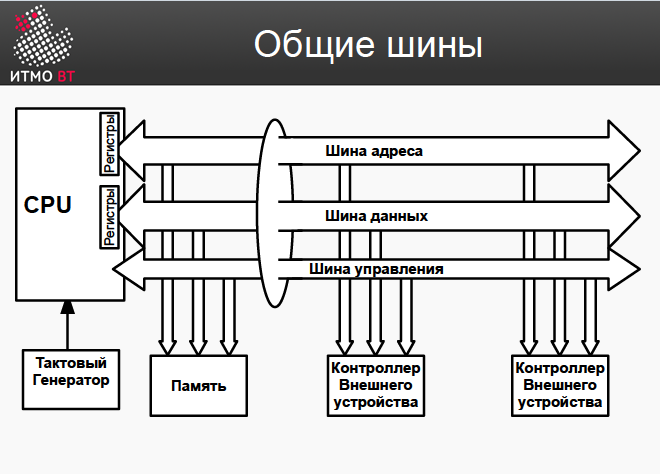
      - 单一总线
    - 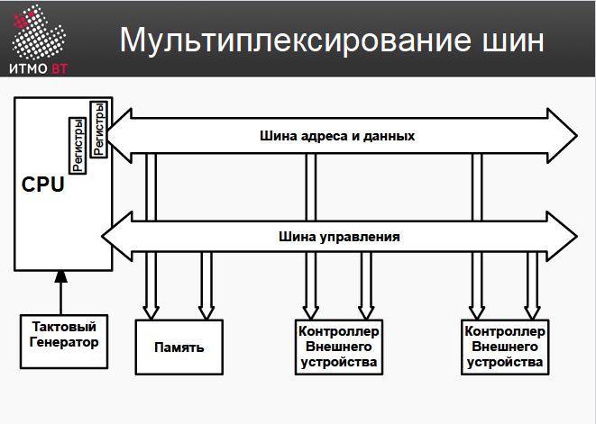
      - 总线复用
    - 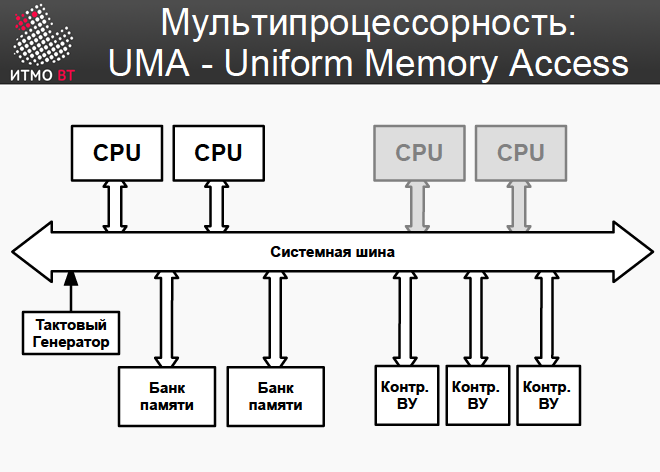
      - 多处理器：UMA - 统一内存访问
        - 统一内存访问 (Unified Memory Access 简称 UMA)是计算机名词，指所有处理器一致的共享全部物理内存
    - 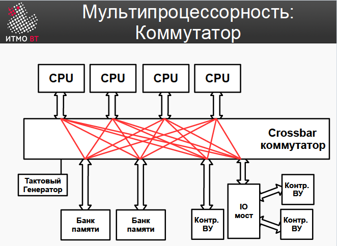
      - 多处理器：交换机
    - 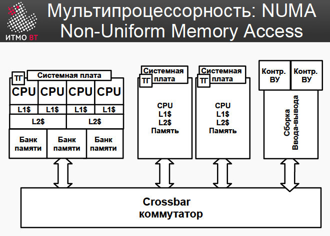
      - 多处理器：NUMA - 非统一内存访问
        - 非统一内存访问 (Non-Unified Memory Access 简称 NUMA)，指处理器访问物理内存的时间依赖于该内存所在的物理位置。即在多处理器架构下，CPU访问共享内存的时间要比访问本地内存所需的时间长的多
  - 现代计算机处理器
    - 地址和数据容量 16/32/64 位 
    - 时钟频率 500MHz-5GHz
    - 多处理器 1-100+ CPU
    - 多核 1-16 核
    - 从 1 GB 到 TB 的 RAM
    -  使用不同的缓存级别
    -  超标量（Суперскалярные）
    -  CISC、RISC、VLIW
  - 处理器类型
    - CISC（Complex Instruction Set Computer）复杂指令集计算机
      - 概念：是一种微处理器指令集架构，每个指令可执行若干低端操作，诸如从存储器读取、存储、和计算操作，全部集于单一指令之中
      - 特点：指令数目多且复杂，每条指令字长不等，电脑必须加以判读，并为此付出了性能的代价
    - RISC（Reduced Instruction Set Computer）精简指令集计算机
      - 概念：是计算机中央处理器的一种设计模式，这种设计思路可以想像成是一家模块化的组装工厂，对指令数目和寻址方式都做了精简，使其实现更容易，指令并行执行程度更好，编译器的效率更高
      - 特点：早期，这种指令集的特点是指令数目少，每条指令都采用标准字长、执行时间短、中央处理器的实现细节对于机器级程序是可见的；在后来的发展中，RISC与CISC（复杂指令集）在竞争的过程中相互学习，现在的RISC指令集也达到数百条，运行周期也不再固定。虽然如此，RISC设计的根本原则——针对流水线化的处理器优化——没有改变，而且还在遵循这种原则的基础上发展出RISC的一个并发化变种VLIW，就是将简短而长度统一的精简指令组合出超长指令，每次执行一条超长指令，等于并发执行多条短指令
    - VLIW（Very Long Instructions Word）超长指令字
      - 将几条指令打包到一条指令中 – 将操作打包到一条指令中由编译器负责

## 存储设备

- 存储器
  - 概念：存储器是微机系统中必不可少的存储设备，主要用于存放程序（指令）和数据
  - 分级结构
    |容量|寻道时间/访问时间|*|类型|控制
    --|--|--|--|--|--
    CPU|100-1000б|<1нс|1c|寄存器Регистр|编译器компилятор
    L1 Cache|32-128Кб|1-4нс|2c|关联存储Ассоциативная|设备аппаратура
    L2-L3 Cache|0.5-32Мб|8-20нс|19c|关联存储Ассоциативная|设备аппаратура
    主存Основная память|0.5Гб- 4ТБ|60-200нс|50-300с|可寻址存储Адресная|程序программно
    SSD|128Гб- 1Тб/drive|25-250мкс|5д|块存储器Блочная|程序программно
    软盘Жесткие диски|0.5Тб- 4Тб/drive|5-20мс|4м|块存储器Блочная|程序программно
    磁带Магнитные ленты|1-6Тб/к|1-240c|200л|顺序存储Последовательная|程序программно

    - 寄存器（Регистр）：
      - 概念：是用于写入、存储和读取 n 位二进制数据并对其执行其他操作的设备
      - 结构：寄存器是一组有序的触发器（flip-flops），其数量对应于字中的位数。可以将组合数字设备与寄存器相关联，借助它可以对单词执行某些操作
        构建寄存器的基础是：D-flip-flops，RS-flip-flops，JK-flip-flops
        - 触发器（Flip-flops）：触发器是一种双稳态多谐振荡器（bistable multivibrator），是一种具有两种稳态的用于储存的组件，可记录二进制数字信号“1”和“0”
          - 原理：触发器的线路图由逻辑门组合而成，其结构均由 SR 锁存器派生而来（广义的触发器包括锁存器），可以通过一个或多个施加在控制输入端的信号来改变自身的状态，并会有 1 个或 2 个输出。触发器是构成时序逻辑电路以及各种复杂数字系统的基本逻辑单元。触发器和锁存器是在计算机、通讯和许多其他类型的系统中使用的数字电子系统的基本组成部分，触发器可以处理输入、输出信号和时序脉波（CK）之间的相互影响
          - 分类：
            - RS 锁存器：基本RS触发器又称SR锁存器，是触发器中最简单的一种，也是各种其他类型触发器的基本组成部分。两个与非门或或非门的输入端输出端进行交叉耦合或首尾相接，即可构成一个基本RS触发器
              当R与S皆为低电位，回授会让Q与Q（Q的反相）保持于一个固定的状态。当S（Set）为高电位，R（Reset）为低电位时，输出Q会被强制设置为高电位；相反的，当S为低电位，R为高电位时，输出Q会被强制设置为低电位
              - 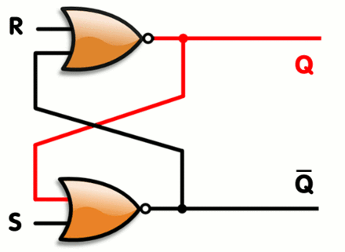
            - D 触发器：D触发器有一个输入、一个输出和一个时脉输入，当时脉由0转为1时，输出的值会和输入的值相等。此类触发器可用于防止因为噪声所带来的错误，以及通过管线增加处理资料的数量
              - 
            - JK 触发器：JK触发器设有两个输入，其输出的值由以下的算式来决定
              $$Q_{nest}=\overline{K}Q+J\overline{Q}$$
              - 
            - T触发器（Toggle Flip-Flop，or Trigger Flip-Flop）设有一个输入和输出，当时脉由0转为1时，如果T和Q不相同时，其输出值会是1。输入端T为1的时候，输出端的状态Q发生反转；输入端T为0的时候，输出端的状态Q保持不变。把JK触发器的J和K输入点连接在一起，即构成一个T触发器，因此T触发器的算式为：
              $$Q_{next}=\overline{T}Q+T\overline{Q}+T\overline{Q}=Q\oplus T$$
        - 锁存器（latch），或称闩锁，是数字电路中异步时序逻辑电路系统中用来储存资讯的一种电子电路。一个锁存器可以储存一比特的资讯，通常会有多个一起出现
      - 高速缓存（cache）
        - 概念：称缓存，原始意义是指访问速度比一般随机存取存储器（RAM）快的一种RAM，通常它不像系统主存那样使用DRAM技术，而使用昂贵但较快速的SRAM技术
        - 原理：当CPU处理数据时，它会先到Cache中去寻找，如果数据因之前的操作已经读取而被暂存其中，就不需要再从随机存取存储器（Main memory）中读取数据——由于CPU的运行速度一般比主内存的读取速度快，主存储器周期（访问主存储器所需要的时间）为数个时钟周期。因此若要访问主内存的话，就必须等待数个CPU周期从而造成浪费。
        - 提供“缓存”的目的是为了让数据访问的速度适应CPU的处理速度，其基于的原理是内存中“程序执行与数据访问的局域性行为”，即一定程序执行时间和空间内，被访问的代码集中于一部分。为了充分发挥缓存的作用，不仅依靠“暂存刚刚访问过的数据”，还要使用硬件实现的指令预测与数据预取技术——尽可能把将要使用的数据预先从内存中取到缓存里
        - 组成结构：
          - Cache 存储体：存放由主存调入的指令与数据块
          - 地址转换部件：建立目录表以实现主存地址到缓存地址的转换
          - 替换部件：在缓存已满时按一定策略进行数据块替换，并修改地址转换部件
        - 延伸
          - 不仅在CPU和主内存之间有 Cache，而且在内存和硬盘之间也有 Cache（磁盘缓存），乃至在硬盘与网络之间也有某种意义上的 Cache ──称为 Internet 临时文件夹或网络内容缓存等。凡是位于速度相差较大的两种硬件之间，用于协调两者数据传输速度差异的结构，均可称之为 Cache
  - 参数指标
    - 位置（Месторасположение）：位于处理器内，内部存储，外部存储
    - 容量（Емкость）：使用公制或二进制表示
    - 存储单元（Единица пересылки）：由数据总线的宽度决定的，即沿着总线并行传输的位数。对于内部存储器（RAM）存储单元一般为字（Слово）；而对于外部存储器，数据通常以大于字的单位传输，成为块（Blok）
    - 访问方法
      - 循序访问（Последовательный доступ）：意指一组序列（例如存于记忆数组、磁盘软件或是磁带中的资料）是以预先安排，有秩序的方式被人访问。循序访问有时只是唯一的访问数据方式，磁带即属一例。循序访问亦有可能成为有选择性的方式，就如我们纯粹有意顺序处理一组资料组件。
      - 随机存取（Произвольный доступ，又称直接访问Прямой доступ）：可以在相等的时间内访问序列中任意元素或从所有可寻址元素中访问任何数据
        - 直接访问（Прямой доступ）：允许设备直接读写存储器，而不需要中央处理器介入处理
      - 关联访问（Ассоциативный доступ）：不根据地址而是根据存储内容来进行存取
    - 时间与速率
      - 寻道时间/访问时间（Время доступа - Тд）：这是指把磁臂(磁头)移动到指定磁道上所经历的时间。该时间是启动磁臂的时间 s 与磁头移动 n 条磁道所花费的时间之和
      - 内存循环时间（Длительность цикла памяти - время обращения - Tц）
      - 读取和写入时间（Время чтения и время записи）
      - 返回时间（Время восстановления - Тв）
      - 信息传输速率
    - 物理类型与特性
    - 成本
  - 存储器时序（Memory timings/RAM timings）
    - 概念：是描述同步动态随机存取存储器（SDRAM）性能的四个参数：
      名称 | 符号 | 定义
      -|-|-
      CAS 潜伏时间 | CL | 发送一个列地址到存储器与数据开始反应之前的周期数。这是从已经打开正确行的 DRAM 读取第一比特存储器所需的周期数。与其他数字不同，这不是最大值，而是存储器控制器和存储器之间必须达成的确切数字
      行地址到列地址延迟 | T<sub>RCD</sub> | 打开一行存储器并访问其中的列所需的最小时钟周期数。从DRAM的非活动行读取第一位存储器的时间是T<sub>RCD</sub> + CL
      行预充电时间 | T<sub>RP</sub> | 发出预充电命令与打开下一行之间所需的最小时钟周期数。从一个非正确打开行的DRAM读取存储器第一比特的时间是T<sub>RP</sub> + T<sub>RCD</sub> + CL
      行活动时间 | T<sub>RAS</sub> | 行活动命令与发出预充电命令之间所需的最小时钟周期数。这是内部刷新行所需的时间，并与TRCD重叠。在SDRAM模块中，它只是T<sub>RCD</sub> + CL。否则，约等于T<sub>RCD</sub> + 2CL
      以时钟周期为单位，通常被写为四个用破折号分隔开的数字，如 7-8-8-24，这些参数指定了影响随机存取存储器速度的潜伏时间（延迟时间），较低的数字通常意味着更快的性能。决定系统性能的最终元素是实际的延迟时间，通常以纳秒为单位

      除此之外，还有以下参数：
      符号 | 定义
      -|-
      RAS | 行地址选通脉冲，延续自异步DRAM的术语
      CAS | 列地址选通脉冲，延续自异步DRAM的术语
      T<sub>WR</sub> | 写入恢复时间。上一次对行的写入命令与预充电它之间必须经过的时间。通常，T<sub>RAS</sub> = T<sub>RCD</sub> + T<sub>WR</sub>
      TRC | 行周期时间 T<sub>RC</sub> = T<sub>RAS</sub> + T<sub>RP</sub>

- 静态与动态存储器
  - 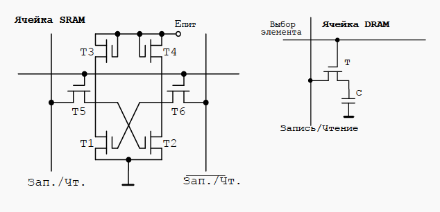
  - 静态存储器（Статическая）：
    - 原理：静态存储器依靠双稳态触发器（Бистабильный триггер）的两个稳定状态保存信息，每个双稳态电路（Бистабильная схема）存储一位二进制代码0或1，一块存储芯片上包含许多个这样的双稳态电路。双稳态电路是有源器件，需要电源才能工作，如果断电，信息将会丢失，因此这种存储器是易失性存储器
    - 特点：工作速度快，只要电源不撤除，写入SRAM的信息就不会消失，不需要刷新电路，同时在读出时不破坏原来存放的信息，一经写入可多次读出，但集成度较低，功耗较大。SRAM一般用来作为计算机中的高速缓冲存储器(Cache)
  - 动态存储器（Динамическая）：
    - 原理：利用电容内存储电荷的多寡来代表一个二进制比特（bit）是 1 还是 0，DRAM每个存储单元所需的晶体管较少，常见的有 4 管，3 管和单管型 DRAM
    - 特点：集成度较高，功耗也较低，但缺点是保存在 DRAM 中的信息场效应管栅极分布电容里的信息随着电容器的漏电而会逐渐消失，一般信息保存时间为 2ms 左右。为了保存 DRAM 中的信息，必须每隔 1～2ms 对其刷新一次。因此，采用 DRAM的计算机必须配置动态刷新电路，防止信息丢失。DRAM一般用作计算机中的主存储器
- 可寻址存储器（Адресуемая память）
  - 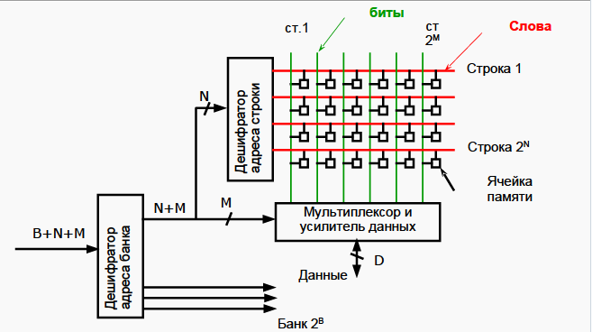
    - 如图：
      - B 传入块地址解码器（Дешифратор адреса банка），确定数据存储的块
      - N 传入行地址解码器（Дешифратор адреса строки），确定数据所在的行（строка）
      - M 传入多路调制器和数据放大器（Мультиплексор и усилитель данных），确定数据存储的列（сталбец）
    - 由此确定存储起的具体单元
- 具有固定行和列的可寻址内存
  - 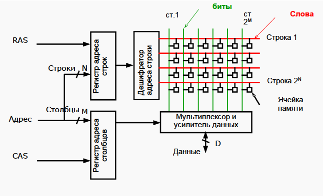
    - 如图：
      - RAS 与 行地址位 N 传入行地址寄存器后被行解码器解码，得到数据存储的行
      - CAS 与列地址位 M 传入列地址寄存器后经由多路调制器和数据放大器处理，得到数据存储的列
- 同步动态随机存取存储器 SDRAM
  - 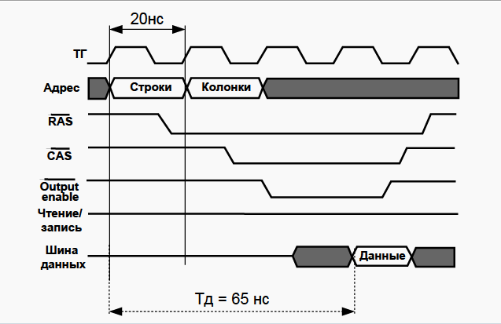
  - 概念：是一种利用同步计时器对存储器的输出入信号加以控制的动态随机存取存储器（DRAM），SDRAM是在DRAM的架构基础上增加同步和双区域（Dual Bank）的功能，使得微处理器能与SDRAM的时钟同步，所以SDRAM执行命令和传输资料时相较于DRAM可以节省更多时间。
  - 特点：其接口与系统总线同步，该总线在 CPU 和内存控制器集线器之间传送数据。 SDRAM 具有快速响应的同步接口，该接口与系统总线同步。 在响应控制输入之前，SDRAM 等待时钟信号
- 现代内存的设计特点
  - Burst mode — пакетный режим 
  - Double Data Rate（DDR） — 在上升沿和下降沿均传输数据
  - SPD — 包含识别信息的芯片
  - Interleaving — 内存分层，提高性能
  - DDR4-2133 8192MB PC4-17000 性能指标
- 面向写入的存储器（Память, ориентированная на записи）
  - 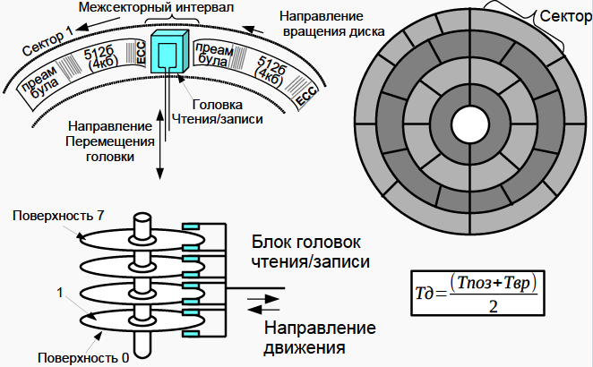
- 串行存储器
  - 串行存取系统是指I/O设备与接口之间是一位一位地串行传送数据的存取系统或者是指客户端一次只能访问系统中一个节点。串行存取系统中需要的总线数目较少，数据传输距离较长，存取速度快。在通信中采取的传输方式就是串行；其次存储器支持串行读取
- 关联存储器设备的结构
  - 概念：关联存储器（相联存储器），是一种不根据地址而是根据存储内容来进行存取的存储器，。既可以按照地址寻址也可以按照内容寻址（通常是某些字段），为了与传统寄存器作区别，称为按内容寻址的存储器
  
  
- 内容可寻址存储器
  - 概念：内容可寻址存储器 CAM（content-addressable memory），也称为关联存储器或关联存储。以内容进行寻址，是一种特殊的存储阵列 RAM。它的主要工作机制就是将一个输入数据项与存储在 CAM 中的所有数据项自动同时进行比较，判别该输入数据项与 CAM 中存储的数据项是否相匹配，并输出该数据项对应的匹配信息
  - 原理：写入信息时按顺序写入，不需要地址；读出时，要求中央处理单元给出一个相联关键字，用它和存储器中所有单元中的一部分信息进行比较，若它们相等，则将此单元中余下的信息读出。这是实现存储器并行操作的一种有效途径，特别适合于信息的检索和更新，可以实现快速地查找快表
  - 特性
    1. 160 ns 的匹配时间
    2. 设有屏蔽寄存器
    3. 通过芯片级联扩展深度
    4. 时钟频率最高为 50 mhz
    5. 匹配字宽和输出结果位宽可自定义
    6. 在 atm 模式下可进行 vpc（virtual path circuits）和 vcc（virtual connection circuits）的同时匹配
    7. 端口主要分为控制和匹配端口
    8. 20ons 的插入时间（在 12 个输入数据项队列未满的情况下）
    9. 2ms 的初始化时间（在设置了快速写入模式后）
    10. 具有符合 ieee 标准 1149.1 的测试端口（jtag）
    - 结构：
      - 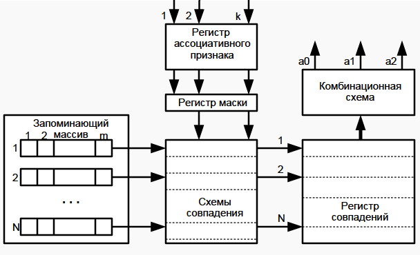
  - 读取命中
    - 概念：CPU 在 Cache 中找到有用的数据被称为命中，当 Cache 中没有 CPU 所需的数据时（这时称为未命中）
    - 缓存未命中的影响
      - 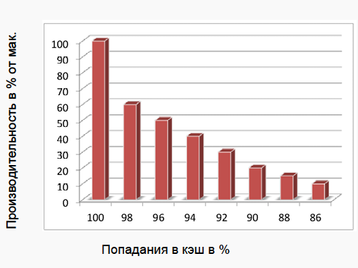
      - 由图可见，随着缓存命中率的下降，缓存的最大性能也随之下降
    - 为了保证 CPU 访问时有较高的命中率，Cache 中的内容应该按一定的算法替换
      - “最近最少使用算法”（LRU算法），它是将最近一段时间内最少被访问过的行淘汰出局。因此需要为每行设置一个计数器，LRU 算法是把命中行的计数器清零，其他各行计数器加 1。当需要替换时淘汰行计数器计数值最大的数据行出局。这是一种高效、科学的算法，其计数器清零过程可以把一些频繁调用后再不需要的数据淘汰出 Cache，提高 Cache 的利用率
      - 随机法（RAND法） 随机替换算法就是用随机数发生器产生一个要替换的块号，将该块替换出去，此算法简单、易于实现，而且它不考虑Cache块过去、现在及将来的使用情况，但是没有利用上层存储器使用的“历史信息”、没有根据访存的局部性原理，故不能提高 Cache 的命中率，命中率较低
      - 先进先出法（FIFO法） 先进先出（First-In-First-Out，FIFO）算法。就是将最先进入 Cache 的信息块替换出去。FIFO 算法按调入 Cache 的先后决定淘汰的顺序，选择最早调入 Cache 的字块进行替换，它不需要记录各字块的使用情况，比较容易实现，系统开销小，其缺点是可能会把一些需要经常使用的程序块（如循环程序）也作为最早进入 Cache 的块替换掉，而且没有根据访存的局部性原理，故不能提高 Cache 的命中率。因为最早调入的信息可能以后还要用到，或者经常要用到，如循环程序。此法简单、方便，利用了主存的“历史信息”， 但并不能说最先进入的就不经常使用，其缺点是不能正确反映程序局部性原理，命中率不高，可能出现一种异常现象
- 内存分配机制
  - 早期内存分配机制
    - 在早期的计算机中，要运行一个程序，会把这些程序全都装入内存，程序都是直接运行在内存上的，也就是说程序中访问的内存地址都是实际的物理内存地址。当计算机同时运行多个程序时，必须保证这些程序用到的内存总量要小于计算机实际物理内存的大小
    - 实例：某台计算机总的内存大小是 128M，现在同时运行两个程序 A 和 B，A 需占用内存 10M，B 需占用内存 110M。计算机在给程序分配内存时会采取这样的方法：先将内存中的前 10M 分配给程序 A，接着再从内存中剩余的 118M 中划分出110M 分配给程序 B。这种分配方法可以保证程序 A 和程序 B 都能运行，但是这种简单的内存分配策略问题很多：
    1. 进程地址空间不隔离。由于程序都是直接访问物理内存，所以恶意程序可以随意修改别的进程的内存数据，以达到破坏的目的。有些非恶意的，但是有 bug 的程序也可能不小心修改了其它程序的内存数据，就会导致其它程序的运行出现异常。这种情况对用户来说是无法容忍的，因为用户希望使用计算机的时候，其中一个任务失败了，至少不能影响其它的任务
    2. 内存使用效率低。在A和B都运行的情况下，如果用户又运行了程序 C，而程序 C 需要 20M 大小的内存才能运行，而此时系统只剩下 8M 的空间可供使用，所以此时系统必须在已运行的程序中选择一个将该程序的数据暂时拷贝到硬盘上，释放出部分空间来供程序C使用，然后再将程序C的数据全部装入内存中运行。可以想象得到，在这个过程中，有大量的数据在装入装出，导致效率十分低下
    3. 程序运行的地址不确定。当内存中的剩余空间可以满足程序C的要求后，操作系统会在剩余空间中随机分配一段连续的 20M 大小的空间给程序 C 使用，因为是随机分配的，所以程序运行的地址是不确定的
  - 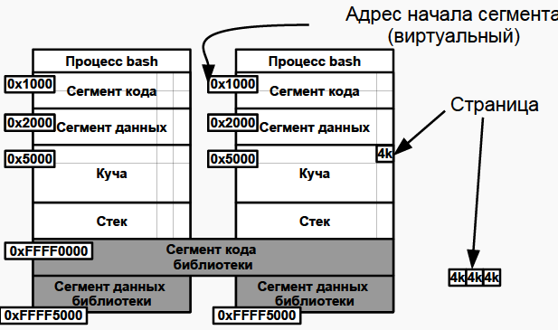 
  - 分段虚拟内存
   - 为了解决进程地址空间隔离的问题，我们增加一个中间层，利用一种间接的地址访问方法访问物理内存。按照这种方法，程序中访问的内存地址不再是实际的物理内存地址，而是一个虚拟地址，然后由操作系统将这个虚拟地址映射到适当的物理内存地址上。这样，只要操作系统处理好虚拟地址到物理内存地址的映射，就可以保证不同的程序最终访问的内存地址位于不同的区域，彼此没有重叠，就可以达到内存地址空间隔离的效果
  - 分页虚拟内存
    - 分页的基本方法是，将地址空间分成许多的页。每页的大小由CPU决定，然后由操作系统选择页的大小。在分段的方法中，每次程序运行时总是把程序全部装入内存，而分页的方法则有所不同。分页的思想是程序运行时用到哪页就为哪页分配内存，没用到的页暂时保留在硬盘上。当用到这些页时再在物理地址空间中为这些页分配内存，然后建立虚拟地址空间中的页和刚分配的物理内存页间的映射
  - MMU地址转换（详见 [博客园](https://www.cnblogs.com/wanglouxiaozi/p/15031691.html)）
    - 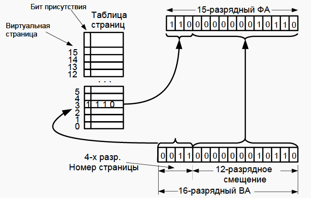
    - 概念：虚拟内存是给进程的一种错觉，使它认为自己拥有巨大的、几乎无限的内存，有时甚至比系统实际拥有的内存还要多。每次访问内存位置时，由 CPU 将虚拟地址转换为物理地址。这种机制称为地址转换，由内存管理单元（MMU）完成，是CPU的一部分，MMU 保护内存免受未经授权的访问。给定一个进程，需要访问的任何页面必须存在于进程VMAs中，因此必须存在于进程页表中
    （每个进程都有自己的页表）
    - 转换原理：内存由固定大小的命名页(用于虚拟内存)和帧(用于物理内存)组织，它是通过内核中的 PAGE_SIZE 宏定义和访问的，因此，页面大小是由硬件（CPU）决定的
      例如： 一个 4 KB 的页面大小的系统，0 到 4095 字节属于第 0 页，4096-8191 字节属于第 1 页，以此类推

      引入页表的概念来管理页和框架之间的映射。页面分布在各个表上，这样每个PTE都对应于页面和框架之间的映射。然后给每个进程一组页表来描述它的整个内存空间

      为了遍历页面，每个页面都分配了一个索引(类似数组)，称为页号。当谈到一个框架，它是 PFN。这样，虚拟内存地址由两部分组成:页号和偏移量。偏移量表示地址的低 12 位有效位，而在 8kb 页面大小的系统中，低13位有效位表示地址:

      操作系统或 CPU 使用页表作为转换表，得知每个物理地址对应的虚拟地址。且以每个条目的索引为一个虚拟页码，值为 PFN。要访问给定虚拟内存的物理内存，操作系统先提取偏移量（用来指向帧中的正确位置。页表不仅包含物理页号和虚拟页号之间的映射，还包含访问控制信息(读写访问、特权等)）、虚拟页号，然后遍历进程的页表，以便匹配虚拟页号和物理页，一旦匹配发生，就可以访问该页面帧中的数据
  - 转移后备缓冲器/页表缓存/转址旁路缓存 TLB（Translation Lookaside Buffer）
    - 概念：为 CPU 的一种缓存，由内存管理单元用于改进虚拟地址到物理地址的转译速度
      - 特点缓存经常使用的转换
      - 通常地址和数据分开
      - 组织为关联存储器
    - TLB 具有固定数目的空间槽，用于存放将虚拟地址映射至物理地址的标签页表条目。为典型的结合存储（content-addressable memory，首字母缩略字：CAM）。其搜索关键字为虚拟内存地址，其搜索结果为物理地址。如果请求的虚拟地址在 TLB 中存在，CAM 将给出一个非常快速的匹配结果，之后就可以使用得到的物理地址访问存储器。如果请求的虚拟地址不在 TLB 中，就会使用标签页表进行虚实地址转换，而标签页表的访问速度比TLB慢很多。有些系统允许标签页表被交换到次级存储器，那么虚实地址转换可能要花非常长的时间
    - TLB 不命中：两种在现代体系结构中常用的解决 TLB 不命中的方案：
      - 硬件管理式 TLB ，CPU 自行遍历标签页表，查看是否存在包含指定的虚拟地址的有效标签页表条目。如果存在这样的分页表条目，就把此分页表条目存入 TLB ，并重新执行 TLB 访问，而此次访问肯定会寻中，程序可正常执行。如果 CPU 在标签页表中不能找到包含指定的虚拟地址有效条目，就会发生标签页错误异常，操作系统必须处理这个异常。处理标签页错误通常是把被请求的数据加载物理存储器中，并在标签页表中创建将出错的虚拟地址映射到正确的物理地址的相应条目，并重启程序（详见标签页错误）
      - 软件管理式 TLB，TLB 不命中时会产生“TLB 失误”异常，且操作系统遍历标签页表，以软件方式进行虚实地址转译。然后操作系统将分页表中响应的条目加载 TLB 中，然后从引起 TLB 失误的指令处重启程序。如同硬件式 TLB 管理，如果操作系统在标签页表中不能找到有效的虚实地址转译条目，就会发生标签页错误，操作系统必须进行相应的处理
      - 典型的 TLB
        - 容量：12 - 4,096 分页表条目
        - 寻中时间：0.5 - 1 时脉周期
        - 不命中代价：10 - 30 时脉周期
        - 不命中率: 0.01% - 3%
        - 假如 TLB 寻中需要 1 个时脉周期，一次不命中访问需要 30 个时脉周期，而且不命中率是 1%，有效的存储器访问周期的平均值是 $1\times 0.99+(1+30)\times 0.01=1.30$ 个时脉周期／每一存储器访问

## 网络技术
- 概念：网络技术是指采取一定的通信协议，将分布在不同地点的多个独立计算机系统，通过互联通道（即通信线路）连接在一起，从而实现数据和服务共享的计算机技术
- 历史
  - 在山上点燃火 =)
  - 1792 - Клод Шапп - 光电报（оптический телеграф）信号量 - 每分钟 2 个字
  - 1872 - Жан Бодо - 电报机（телеграфный аппарат），Бодо 码。 Бод（比特每秒）
  - 1985.1897 - Попов - 岸上和军舰之间的无线传输
  - 1930 — 电传打字机（Телетайп）、电传网络（сеть Телекс）（TELEgraph + EXchange）
  - 1957 - 发射第一颗地球卫星
  - 1958 - 高级研究计划署 (Advanced Research Projects Agency - ARPA)
  - 1963 - J.C.R.Licklider - 计算机网络的第一个概念
  - 1969 - 美国领先实验室和研究中心的 ARPANET
  - 1976 - Xerox - 以太网局域网
  - 1982 - ARPA - TCP/IP 协议的单一堆栈
  - 1983 -84 - FidoNet 和 BBS，ARPANET → Internet
  - 1991 - Tim Berners-Lee，CERN，WWW 概念，第一个 http 服务器
- 计算机网络的概念
  - 网络设备
    - 计算设备（Средства вычислительной техники - СВТ）：计算机（вычислительные комплексы - ВК）和计算机系统（вычислительные системы - ВС）—— 实现数据处理
      - Средство Вычислительной Техники(далее СВТ) — совокупность программных и технических элементов систем обработки данных, способных функционировать самостоятельно или в составе других систем.
    - 通信设备（Средства телекоммуникаций (связи) - СТК）：一组通信信道和信道形成设备——实现数据传输
      - 中继器（Repeater）
        - 是局域网互连的最简单设备，它工作在OSI体系结构的物理层，它接收并识别网络信号，然后再生信号并将其发送到网络的其他分支上。要保证中继器能够正确工作，首先要保证每一个分支中的数据包和逻辑链路协议是相同的。例如，在802.3以太局域网和802.5令牌环局域网之间，中继器是无法使它们通信的。
        - 但是，中继器可以用来连接不同的物理介质，并在各种物理介质中传输数据包。某些多端口的中继器很像多端口的集线器，它可以连接不同类型的介质。
        - 中继器是扩展网络的最廉价的方法。当扩展网络的目的是要突破距离和结点的限制时，并且连接的网络分支都不会产生太多的数据流量，成本又不能太高时，就可以考虑选择中继器。采用中继器连接网络分支的数目要受具体的网络体系结构限制。
        - 中继器没有隔离和过滤功能，它不能阻挡含有异常的数据包从一个分支传到另一个分支。这意味着，一个分支出现故障可能影响到其它的每一个网络分支。
        - 集线器是有多个端口的中继器。简称HUB
      - 交换机（switch）
        - 交换（switching）是按照通信两端传输信息的需要，用人工或设备自动完成的方法，把要传输的信息送到符合要求的相应路由上的技术统称。
        - 广义的交换机（switch）就是一种在通信系统中完成信息交换功能的设备。 在计算机网络系统中，交换概念的提出是对于共享工作模式的改进。我们以前介绍过的HUB集线器就是一种共享设备，HUB本身不能识别目的地址，当同一局域网内的A主机给B主机传输数据时，数据包在以HUB为架构的网络上是以广播方式传输的，由每一台终端通过验证数据包头的地址信息来确定是否接收。也就是说，在这种工作方式下，同一时刻网络上只能传输一组数据帧的通讯，如果发生碰撞还得重试。这种方式就是共享网络带宽。
        - 交换机拥有一条很高带宽的背部总线和内部交换矩阵。交换机的所有的端口都挂接在这条背部总线上，控制电路收到数据包以后，处理端口会查找内存中的地址对照表以确定目的MAC（网卡的硬件地址）的NIC（网卡）挂接在哪个端口上，通过内部交换矩阵迅速将数据包传送到目的端口，目的MAC若不存在才广播到所有的端口，接收端口回应后交换机会“学习”新的地址，并把它添加入内部MAC地址表中。 使用交换机也可以把网络“分段”，通过对照MAC地址表，交换机只允许必要的网络流量通过交换机。通过交换机的过滤和转发，可以有效的隔离广播风暴，减少误包和错包的出现，避免共享冲突。
        - 交换机在同一时刻可进行多个端口对之间的数据传输。每一端口都可视为独立的网段，连接在其上的网络设备独自享有全部的带宽，无须同其他设备竞争使用。当节点A向节点D发送数据时，节点B可同时向节点C发送数据，而且这两个传输都享有网络的全部带宽，都有着自己的虚拟连接。假使这里使用的是10Mbps的以太网交换机，那么该交换机这时的总流通量就等于2×10Mbps=20Mbps，而使用10Mbps的共享式HUB时，一个HUB的总流通量也不会超出10Mbps。
        - 总之，交换机是一种基于MAC地址识别，能完成封装转发数据包功能的网络设备。交换机可以“学习”MAC地址，并把其存放在内部地址表中，通过在数据帧的始发者和目标接收者之间建立临时的交换路径，使数据帧直接由源地址到达目的地址
      - 网桥/桥接器（Мост/Bridge）：一种网络设备，负责网络桥接（network bridging）。桥接器将网络的多个网段在数据链路层（OSI模型第2层）连接起来（即桥接），以数据包形式在网络之间传输数据，而不对其进行任何更改，此外，网桥可以过滤数据包，保护整个网络免受本地数据流的影响，并且只传递那些打算用于其他网段的数据
        - 网桥工作于 OSI 体系的数据链路层。所以 OSI 模型数据链路层以上各层的信息对网桥来说是毫无作用的。所以协议的理解依赖于各自的计算机。
        - 网桥包含了中继器的功能和特性，不仅可以连接多种介质，还能连接不同的物理分支，如以太网和令牌网，能将数据包在更大的范围内传送。网桥的典型应用是将局域网分段成子网，从而降低数据传输的瓶颈，这样的网桥叫“本地”桥。用于广域网上的网桥叫做“远地”桥。两种类型的桥执行同样的功能，只是所用的网络接口不同。
        - 生活中的交换机就是网桥。
      - 路由器（Маршрутизатор/Router）
        - 路由器工作在 OSI 体系结构中的网络层，这意味着它可以在多个网络上交换和路由数据数据包。路由器通过在相对独立的网络中交换具体协议的信息来实现这个目标。比起网桥，路由器不但能过滤和分隔网络信息流、连接网络分支，还能访问数据包中更多的信息。并且用来提高数据包的传输效率。
        - 路由表包含有网络地址、连接信息、路径信息和发送代价等。
        - 路由器比网桥慢，主要用于广域网或广域网与局域网的互连。
      - 桥接路由器（Мостовой маршрутизатор/Brouter）：桥由器（Brouter)是网桥和路由器的合并
      - 网关（Шлюз/GateWay）:网关把信息重新包装的目的是适应目标环境的要求
        - 网关能互连异类的网络，
        - 网关从一个环境中读取数据，剥去数据的老协议，然后用目标网络的协议进行重新包装。
        - 网关的一个较为常见的用途是在局域网的微机和小型机或大型机之间作翻译。
        - 网关的典型应用是网络专用服务器
  - 计算机网络（Сеть ЭВМ (вычислительная сеть, компьютерная сеть）= СВТ + СТК
  - 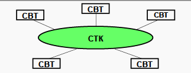
- 分类
  - 按覆盖范围分类
    - 个域网（PAN）：设备围绕一个人的通信。 比如说我的电脑，通过蓝牙和手机，耳机，手环等等相连，这就是个域网
    - 局域网（LAN）：局域网覆盖范围通常是一个屋子，一栋楼等等，这个大家比较熟悉，可以细分为有限局域网和无线局域网等
    - 城域网（MAN）：覆盖范围往往是一个城市。比较典型的是有线电视网。城域网通过接入点拉光纤等进入小区，在小区可以使用同轴电缆进入千家万户
    - 广域网（WAN）：它的覆盖范围很大，往往由核心城市组成一个大的网络，如下图所示。小的城市和大的城市相连，大的城市互相相连形成网络。覆盖中国的卫星网络就是一个广域网
  - 按目的分类
    - 计算类（Вычислительные）
    - 信息类（Информационные ）
    - 信息计算类（Информационно- вычислительные）
    - 信息管理类（Информационно- управляющие）
  - 按应用领域分类
    - SAN - 网络数据存储
    - 服务器网络（Серверные фермы）
  - 其他分类
    - 分层网络（Иерархические）
    - 无线网络（Беспроводные）
    - 虚拟网络（Виртуальные VLAN）
- 消息与数据包
  - 基本结构
  - 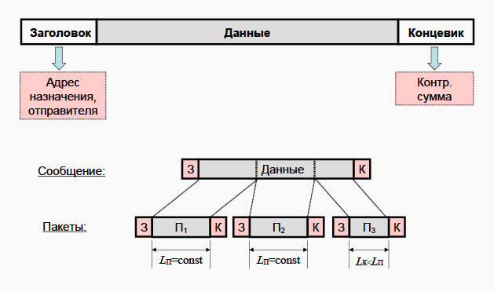
    |包头（Заголовок）|数据（Данные）|包尾控制信息|
    ---|---|--
    存储目标地址与发件人信息|内容|控制信息
  - 消息的结构遵循以上基本结构，但在传输的过程中，由于消息很长，所以将消息的数据部分按照恒定的宽度分成若干个包，包的数据部分取自消息的数据部分，并在前后加上消息的包头和包尾
- 开放式系统交互模型（Open System Interconnection Model - OSI）模型
  - 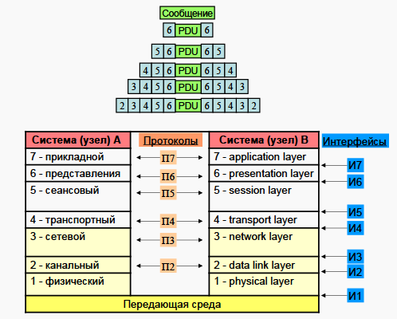
  - 概念：该模型将通信系统中的数据流划分为七个层，从分布式应用程序数据的最高层表示到跨通信介质传输数据的物理实现。每个中间层为其上一层提供功能，其自身功能则由其下一层提供。功能的类别通过标准的通信协议在软件中实现
  - 层次划分
    1. 物理层（Physical Layer）：物理层在局域网上发送数据帧（Data Frame），它负责管理电脑通信设备和网络媒体之间的互通。包括了针脚、电压、线缆规范、集线器、中继器、网卡、主机接口卡等
    2. 数据链路层（Data Link Layer）：数据链路层负责网络寻址、错误侦测和改错。当表头和表尾被加至数据包时，会形成信息框（Data Frame）。数据链表头（DLH）是包含了物理地址和错误侦测及改错的方法。数据链表尾（DLT）是一串指示数据包末端的字符串。例如以太网、无线局域网（Wi-Fi）和通用分组无线服务（GPRS）等。分为两个子层：逻辑链路控制（logical link control，LLC）子层和介质访问控制（Media access control，MAC）子层
    3. 网络层（Network Layer）：决定数据的路径选择和转寄，将网络表头（NH）加至数据包，以形成分组。网络表头包含了网络资料。例如:互联网协议（IP）等
    4. 传输层（Transport Layer）：把传输表头（TH）加至资料以形成分组。传输表头包含了所使用的协议等发送信息。例如:传输控制协议（TCP）等
    5. 会话层（Session Layer）：负责在数据传输中设置和维护计算机网络中两台计算机之间的通信连接
    6. 表示层（Presentation Layer）：把数据转换为能与接收者的系统格式兼容并适合传输的格式
    7. 应用层（Application Layer）：提供为应用软件而设计的接口，以设置与另一应用软件之间的通信。例如：HTTP、HTTPS、FTP、Telnet、SSH、SMTP、POP3等
- TCP/IP模型
  - 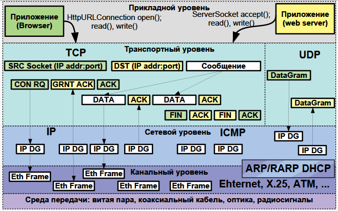
  - 概念：TCP/IP协议被称为传输控制协议/互联网协议，又称网络通讯协议(Transmission Control Protocol)。是由网络层的IP协议和传输层的TCP协议组成，是一个很大的协议集合。TCP/IP 模型由 OSI 模型演化而来
  - 层次划分：TCP/IP 模型将 OSI 模型由七层简化为五层（一开始为四层），应用层、表示层、会话层统一为应用层
    1. 物理层：计算机在传递数据的时候传递的都是0和1的数字，而物理层关心的是用什么信号来表示0和1，是否可以双向通信，最初的连接如何建立以及完成连接如何终止,总之，物理层是为数据传输提供可靠的环境
    2. 数据链路层：位于物理层和网络层之间，用来向网络层提供数据，就是把源计算机网络层传过来的信息传递给目标主机。数据链路层主要的作用包括：
      - 如何将数据组合成数据帧(Frame)，帧是数据链路层的传输单位
      - 数据链路的建立、维护和拆除
      - 帧包装、帧传输、帧同步
      - 帧的差错恢复
      - 流量控制
    3. 网络层：网络层位于传输层和数据链路层之间,用于把数据从源主机经过若干个中间节点传送到目标主机,并向传输层提供最基础的数据传输服务,它要提供路由（在能够选择的多条道路之间选择一条最短的路径）和选址（交换机是靠MAC来寻址的，而因为MAC地址是无层次的,所以要靠IP地址来确认计算机的位置,这就是选址）的工作
      - 网际协议（Internet Protocol，缩写：IP），又称互联网协议，是用于分组交换数据网络的协议
        - 概念：IP是在TCP/IP协议族中网络层的主要协议，任务仅仅是根据源主机和目的主机的地址来传送数据。为此目的，IP定义了寻址方法和数据报的封装结构。第一个架构的主要版本为IPv4，目前仍然是广泛使用的互联网协议，尽管世界各地正在积极部署IPv6
        - IP 封装：数据在IP互联网中传送时会封装为数据包。网际协议的独特之处在于：在报文交换网络中主机在传输数据之前，无须与先前未曾通信过的目的主机预先创建好特定的“通路”。互联网协议提供了“不可靠的”数据包传输机制（也称“尽力而为”或“尽最大努力交付”）；也就是说，它不保证数据能准确的传输。数据包在到达的时候可能已经损坏，顺序错乱（与其它一起传送的报文相比），产生冗余包，或者全部丢失。如果应用需要保证可靠性，一般需要采取其他的方法，例如利用IP的上层协议控制
        - IP 服务：由于封装带来的抽象机制，IP能够在各种各样的网络上工作，例如以太网、异步传输模式、FDDI、Wi-Fi、令牌环等等。每个链路层的实现可能有自己的方法（也有可能是完全没有它自己的方法），把IP地址解析成相应的数据链路地址。IPv4使用地址解析协议（ARP），而IPv6采用邻居发现协议（NDP）
        - IP 寻址和路由
          - 寻址：寻址就是如何将IP地址分配给各个终端节点，以及如何划分和组合子网
          - 路由：所有网络端点都需要路由，尤其是网际之间的路由器。路由器通常用内部网关协议（Interior Gateway Protocols，IGPs）和外部网关协议（External Gateway Protocols，EGPs）决定怎样发送IP数据包
    4. 传输层
      - 传输层是面向连接的、可靠的的进程到进程通信的协议。TCP提供全双工服务，即数据可在同一时间双向传播。TCP将若干个字节构成一个分组，此分组称为报文段(Segment)。提供了一种端到端的连接。
      - 传输层的协议主要有 TCP 和 UDP
        - TCP(Transimision Control Protocal)是一种面向连接的、可靠的、基于字节流的传输层通信协议，在简化的计算机网络OSI模型中，它完成第四层传输层所指定的功能
          - 原理：在因特网协议族（Internet protocol suite）中，TCP层是位于IP层之上，应用层之下的中间层。不同主机的应用层之间经常需要可靠的、像管道一样的连接，但是IP层不提供这样的流机制，而是提供不可靠的包交换
          - 应用层向TCP层发送用于网间传输的、用8位字节表示的数据流，然后TCP把数据流分割成适当长度的报文段（通常受该计算机连接的网络的数据链路层的最大传输单元（MTU）的限制）。之后TCP把结果包传给IP层，由它来透过网络将包传送给接收端实体的TCP层。TCP为了保证不发生丢包，就给每个包一个序号，同时序号也保证了传送到接收端实体的包的按序接收。然后接收端实体对已成功收到的包发回一个相应的确认信息（ACK）；如果发送端实体在合理的往返时延（RTT）内未收到确认，那么对应的数据包就被假设为已丢失并进行重传。TCP用一个校验和函数来检验数据是否有错误，在发送和接收时都要计算校验和
          - 运作方式：TCP协议的运行可划分为三个阶段：连接创建(connection establishment)、数据传送（data transfer）和连接终止（connection termination）。操作系统将TCP连接抽象为套接字表示的本地端点（local end-point），作为编程接口给程序使用。在TCP连接的生命期内，本地端点要经历一系列的状态改变
            - 三次握手：
              - 客户端（通过执行connect函数）向服务器端发送一个 SYN 包，请求一个主动打开。该包携带客户端为这个连接请求而设定的随机数 A 作为消息序列号。
              - 服务器端收到一个合法的 SYN 包后，把该包放入SYN队列中；回送一个 SYN/ACK。ACK的确认码应为 A+1，SYN/ACK 包本身携带一个随机产生的序号B。
              - 客户端收到 SYN/ACK 包后，发送一个 ACK 包，该包的序号被设定为 A+1，而 ACK 的确认码则为 B+1。然后客户端的connect函数成功返回。当服务器端收到这个 ACK 包的时候，把请求帧从SYN队列中移出，放至 ACCEPT 队列中；这时 accept 函数如果处于阻塞状态，可以被唤醒，从 ACCEPT 队列中取出 ACK 包，重新创建一个新的用于双向通信的 sockfd，并返回
              - “三次握手”的目的是“为了防止已失效的连接(connect)请求报文段传送到了服务端，因而产生错误”，也即为了解决“网络中存在延迟的重复分组”问题
        - UDP(User Datagram Protocal)是一个简单的面向资料包的通信协议，位于 OSI 模型的传输层
          - 在 TCP/IP 模型中，UDP为网络层以上和应用层以下提供了一个简单的接口。UDP只提供资料的不可靠传递，它一旦把应用程序发给网络层的资料发送出去，就不保留资料备份（所以 UDP 有时候也被认为是不可靠的资料包协议）。UDP在 IP 资料包的头部仅仅加入了复用和资料校验字段
          - UDP 适用于不需要或在程序中执行错误检查和纠正的应用，它避免了协议栈中此类处理的开销。对时间有较高要求的应用程序通常使用UDP，因为丢弃资料包比等待或重传导致延迟更可取。
          - 由于UDP缺乏可靠性且属于无连接协议，所以应用程序通常必须容许一些丢失、错误或重复的数据包。某些应用程序（如TFTP）可能会根据需要在应用程序层中添加基本的可靠性机制。[1]
          - 一些应用程序不太需要可靠性机制，甚至可能因为引入可靠性机制而降低性能，所以它们使用UDP这种缺乏可靠性的协议。流媒体，实时多人游戏和IP语音（VoIP）是经常使用UDP的应用程序。 在这些特定应用中，丢包通常不是重大问题。如果应用程序需要高度可靠性，则可以使用诸如TCP 之类的协议
    5. 应用层：应用层常见协议有 HTTP、HTTPS 、FTP 、SMTP 等
      - 超文本传输协议（英语：HyperText Transfer Protocol，缩写：HTTP）是一种用于分布式、协作式和超媒体信息系统的应用层协议[1]。HTTP是万维网的数据通信的基础
        - 设计 HTTP 最初的目的是为了提供一种发布和接收 HTML 页面的方法。通过 HTTP 或者 HTTPS 协议请求的资源由统一资源标识符（Uniform Resource Identifiers，URI）来标识
        - HTTP是一个客户端（用户）和服务端（网站）之间请求和应答的标准，通常使用TCP协议。通过使用网页浏览器、网络爬虫或者其它的工具，客户端发起一个HTTP请求到服务器上指定端口（默认端口为80）。我们称这个客户端为用户代理程序（user agent）。应答的服务器上存储着一些资源，比如HTML文件和图像。我们称这个应答服务器为源服务器（origin server）。在用户代理和源服务器中间可能存在多个“中间层”，比如代理服务器、网关或者隧道（tunnel）。
        - 尽管TCP/IP协议是互联网上最流行的应用，但是在HTTP协议中并没有规定它必须使用或它支持的层。事实上HTTP可以在任何互联网协议或其他网络上实现。HTTP假定其下层协议提供可靠的传输。因此，任何能够提供这种保证的协议都可以被其使用，所以其在TCP/IP协议族使用TCP作为其传输层。
        - 通常，由HTTP客户端发起一个请求，创建一个到服务器指定端口（默认是80端口）的TCP连接。HTTP服务器则在那个端口监听客户端的请求。一旦收到请求，服务器会向客户端返回一个状态，比如"HTTP/1.1 200 OK"，以及返回的内容，如请求的文件、错误消息、或者其它信息。
        - 请求方法：
          - GET：向指定的资源发出“显示”请求。使用GET方法应该只用在读取资料，而不应当被用于产生“副作用”的操作中，例如在网络应用程序中。其中一个原因是GET可能会被网络爬虫等随意访问。参见安全方法。浏览器直接发出的GET只能由一个url触发。GET上要在url之外带一些参数就只能依靠url上附带querystring。
          - HEAD：与GET方法一样，都是向服务器发出指定资源的请求。只不过服务器将不传回资源的本文部分。它的好处在于，使用这个方法可以在不必传输全部内容的情况下，就可以获取其中“关于该资源的信息”（元信息或称元数据）。
          - POST：向指定资源提交数据，请求服务器进行处理（例如提交表单或者上传文件）。数据被包含在请求本文中。这个请求可能会创建新的资源或修改现有资源，或二者皆有。每次提交，表单的数据被浏览器用编码到HTTP请求的body里。浏览器发出的POST请求的body主要有两种格式，一种是application/x-www-form-urlencoded用来传输简单的数据，大概就是"key1=value1&key2=value2"这样的格式。另外一种是传文件，会采用multipart/form-data格式。采用后者是因为application/x-www-form-urlencoded的编码方式对于文件这种二进制的数据非常低效。
          - PUT：向指定资源位置上传其最新内容。
          - DELETE：请求服务器删除Request-URI所标识的资源。
          - TRACE：回显服务器收到的请求，主要用于测试或诊断。
          - OPTIONS：这个方法可使服务器传回该资源所支持的所有HTTP请求方法。用'*'来代替资源名称，向Web服务器发送OPTIONS请求，可以测试服务器功能是否正常运作。
          - CONNECT：HTTP/1.1协议中预留给能够将连接改为隧道方式的代理服务器。通常用于SSL加密服务器的链接（经由非加密的HTTP代理服务器）。
          - 方法名称是区分大小写的。当某个请求所针对的资源不支持对应的请求方法的时候，服务器应当返回状态码405（Method Not Allowed），当服务器不认识或者不支持对应的请求方法的时候，应当返回状态码501（Not Implemented）。
          - HTTP服务器至少应该实现GET和HEAD方法，其他方法都是可选的。当然，所有的方法支持的实现都应当符合下述的方法各自的语义定义。此外，除了上述方法，特定的HTTP服务器还能够扩展自定义的方法。例如：
            - PATCH（由 RFC 5789 指定的方法）：用于将局部修改应用到资源
        - 安全方法：
          - 对于GET和HEAD方法而言，除了进行获取资源信息外，这些请求不应当再有其他意义。也就是说，这些方法应当被认为是“安全的”。 客户端可能会使用其他“非安全”方法，例如 POST，PUT 及 DELETE，应该以特殊的方式（通常是按钮而不是超链接）告知客户可能的后果（例如一个按钮控制的资金交易），或请求的操作可能是不安全的（例如某个文件将被上传或删除）
          - 但是，不能想当然地认为服务器在处理某个GET请求时不会产生任何副作用。事实上，很多动态资源会把这作为其特性。这里重要的区别在于用户并没有请求这一副作用，因此不应由用户为这些副作用承担责任
      - 超文本传输安全协议（英语：HyperText Transfer Protocol Secure - HTTPS；常称为HTTP over TLS、HTTP over SSL或HTTP Secure）是一种通过计算机网络进行安全通信的传输协议。HTTPS经由HTTP进行通信，但利用SSL/TLS来加密数据包。HTTPS开发的主要目的，是提供对网站服务器的身份认证，保护交换资料的隐私与完整性
        - 作用：HTTPS的主要作用是在不安全的网络上创建一个安全信道，并可在使用适当的加密包和服务器证书可被验证且可被信任时，对窃听和中间人攻击提供合理的防护。
          - HTTPS的信任基于预先安装在操作系统中的证书颁发机构（CA）。因此，与一个网站之间的HTTPS连线仅在这些情况下可被信任：
          - 浏览器正确地实现了HTTPS且操作系统中安装了正确且受信任的证书颁发机构；
          - 证书颁发机构仅信任合法的网站；
          - 被访问的网站提供了一个有效的证书，也就是说它是一个由操作系统信任的证书颁发机构签发的（大部分浏览器会对无效的证书发出警告）；
          - 该证书正确地验证了被访问的网站（例如，访问https://example.com时收到了签发给example.com而不是其它域名的证书）；
          - 此协议的加密层（SSL/TLS）能够有效地提供认证和高强度的加密
        > 不应将 HTTPS 和在 RFC 2660 中定义的安全超文本传输协议（S-HTTP）相混淆
  - 发送方从高层到低层封装数据
    - 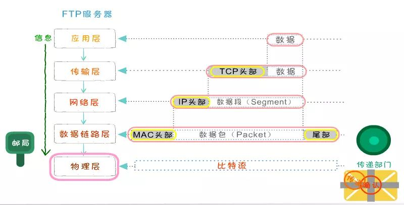
    - 在应用层要把各式各样的数据如字母、数字、汉字、图片等转换成二进制
    - 在 TCP 传输层中，上层的数据被分割成小的数据段，并为每个分段后的数据封装TCP报文头部
    - 在 TCP 头部有一个关键的字段信息端口号，它用于标识上层的协议或应用程序，确保上层数据的正常通信
    - 计算机可以多进程并发运行，例如在发邮件的同时也可以通过浏览器浏览网页，这两种应用通过端口号进行区分
    - 在网络层，上层数据被封装上亲的报文头部(IP 头部)，上层的数据是包括TCP头部的。IP 地址包括的最关键字段信息就是 IP 地址，用于标识网络的逻辑地址。
    - 数据链路径层，上层数据成一个 MAC 头部，内部有最关键的是 MAC 地址。MAC 地址就是固化在硬件设备内部的全球唯一的物理地址。
    - 在物理层，无论在之前哪一层封装的报文头和还是上层数据都是由二进制组成的，物理将这些二进制数字比特流转换成电信号在网络中传输
  - 接收方从底层到高层解封装
    - 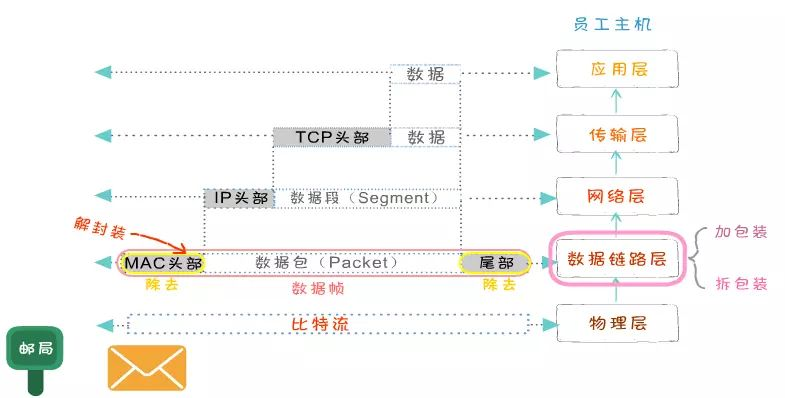
    - 数据封装完毕传输到接收方后，将数据要进行解封装
    - 在物理层，先把电信号转成二进制数据，并将数据传送至数据链路层
    - 在数据链路层，把MAC头部拆掉，并将剩余的数据传送至上一层
    - 在网络层，数据的IP头部被拆掉，并将剩余的数据送至上一层
    - 在传输层，把TCP头部拆掉，将真实的数据传送至应用层
- 传输介质
  - 同轴线缆（Коаксиальный кабель）- 已废弃
    - “厚” - 10Base-5 - 最长 500m 
    - “薄” - 10Base-2 - 最长 50m
  - 双绞线（Витая пара）
    - 10Base-T, 100Base-T, …
    - 3类：10 到 100 Mbps 100BASE-T4 (100m)
    - 5e 类：100Mbps（2 对），每（4 对）1Gbps
    - 6 类：10Gbps (55m)
    - 7a 类：40Gbps (50m)，100Gbps (15m)
  - 光学元件（10BASE-F,100BASE-SX,10GBASE-ER...）
    - ST（Straight Tip）
    - SC（Standard Connector）
    - LC（Lucent Connector） 
    - 激光器位于 SFP（Small Plugin Factor）
    - ~500 m (Multi-mode fiber），~80km（Single Mode）
  - 无线（802.11 - WiFi, 802.16 - WiMAX, 3G, 4G）
    - 2.4, 5, 60 GHZ
    - До 15 Гбит/c
- 以太网链路层
- IP网络层
  - IPv4网络寻址
    - IPv4使用分层寻址方案，一个32位的IP地址的划分如下
      - 
- 动态主机设置协议（Dynamic Host Configuration Protocol - DHCP）
  - 概念：是一个用于IP网络的网络协议，位于OSI模型的应用层，使用 UDP 协议工作
  - 用途：
    - 用于内部网或网络服务供应商自动分配IP地址给用户
    - 用于内部网管理员对所有电脑作中央管理
  - 原理：动态主机设置协议（DHCP）是一种使网络管理员能够集中管理和自动分配IP网络地址的通信协议。在IP网络中，每个连接Internet的设备都需要分配唯一的IP地址。DHCP使网络管理员能从中心结点监控和分配IP地址。当某台计算机移到网络中的其它位置时，能自动收到新的IP地址
- 域名服务
  - 域名（Domain Name）：是由一串用点分隔的字符组成的互联网上某一台计算机或计算机组的名称，而且始终包括两到三个字母的后缀，以指明组织的类型或该域所在的国家或地区，用于在数据传输时标识计算机的电子方位。域名可以说是一个IP地址的代称，目的是为了便于记忆后者。通常包含组织名
  - 概念：域名服务作为可以将域名和IP地址相互映射的一个分布式数据库，能够使人更方便的访问互联网，而不用去记住能够被机器直接读取的IP数串
  - DNS 域名服务
    - DNS（Domain Name Server，域名服务器）是进行域名(domain name)和与之相对应的IP地址 (IP address)转换的服务器。DNS中保存了一张域名(domain name)和与之相对应的IP地址 (IP address)的表，以解析消息的域名
    - 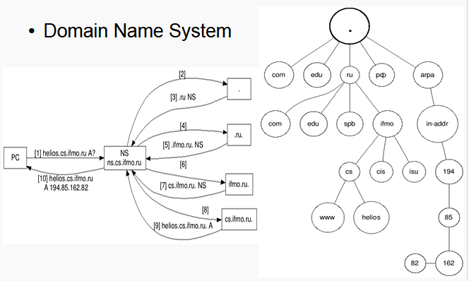
  - 其他域名服务
- 传输层
  - TCP - Transmission Control Protocol
    - 可靠，管理数据转发
    - 在两个系统上的套接字（Socket=IP:port）之间建立虚拟连接
    - HTTP、FTP、SSH、SMTP、...
  - UDP - User Datagramm Protocol
    - 发了条消息忘记了
    - 可靠性控制留给开发人员
    - 最大传输率
    - SNMP、TFTP、DHCP、DNS、...
- 应用层
  - 由程序员开发协议