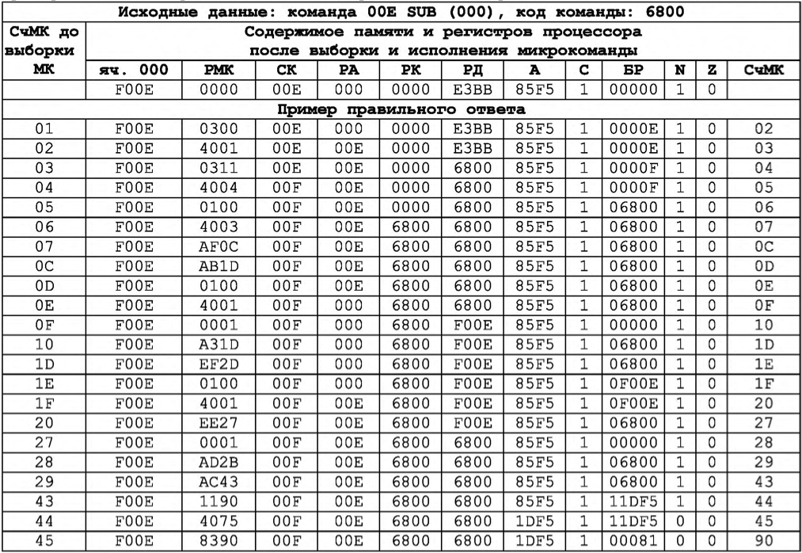

## Рубежный контроль No1

## Рубежный контроль No2

## Рубежный контроль No3

Рубежный контроль No3 предназначен для выполнения трассировки по микрокомандам заданной в варианте команды с косвенной адресацией. При выполнении рубежного контроля можно использовать таблицу интерпретатора базовой ЭВМ (Приложение В, табл В.10).

Задание. Запишите последовательность микрокоманд для выполнения команды. Заполните таблицу значениями после выполнения каждой микрокоманды.

Рисунок В.11 Подсистема ввода-вывода базовой ЭВМ(показаны КВУ и ВУ1,3) Пример задания и правильного ответа рубежного контроля No2. Таблица 4.3
