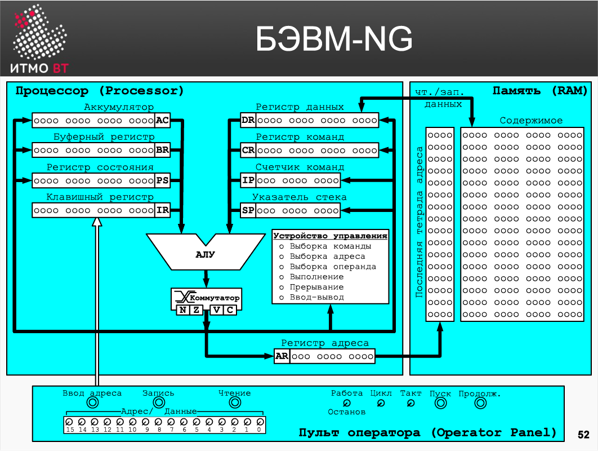
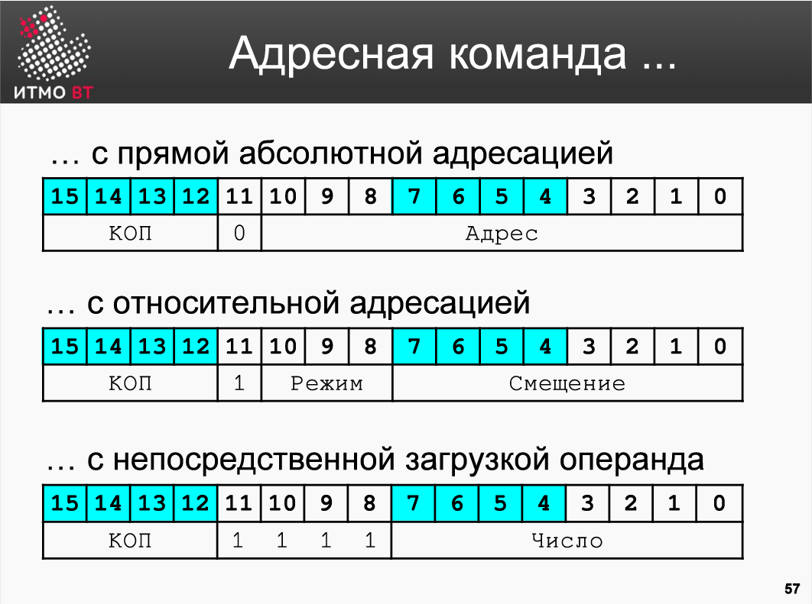
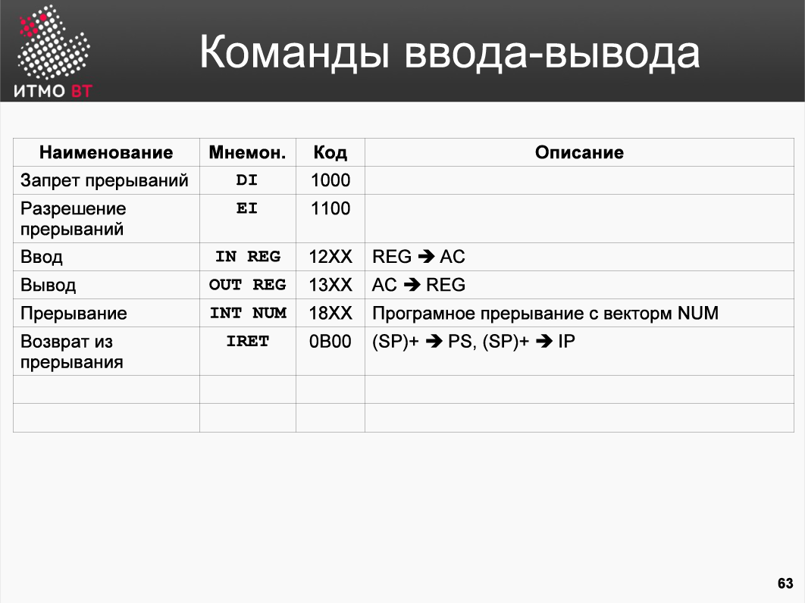

В разработке вычислительных систем исторически сложились два, отличающихся друг от друга, подхода к их построению, называемые, архитектура фон Неймана и Гарвардская архитектура.
Основным отличием между архитектурами является способ работы с памятью. В настоящее время в чистом виде архитектуры встречаются редко, обычно используется их комбинация в разных функциональных блоках ЭВМ.

В Гарвардской архитектуре центральным устройством является Control Unit - управляющее устройство в ЭВМ. Все остальные устройства ЭВМ подключены к управляющему устройству и взаимодействуют через него. Память для команд (instruction memory), данных (data memory) и устройств ввода вывода физически отделена друг от друга. Как было указано выше, в чистом виде такая архитектура уже не используется, но идея физического разделения кода и данных оказалась очень полезной для развития развития функциональных подсистем ЭВМ и операционных систем.
Используя такой подход нельзя нарушить логику программы, попытавшись исполнить данные или трактовать инструкции как данные программы.

В противоположность Гарвардской, архитектура фон Неймана содержит все в общей памяти.
Нельзя определить, что находится в ячейке, данные или инструкции, без дополнительного анализа кода самой программы. При этом устройство обращения к памяти едино для данных и инструкций, что упрощает конструкцию ЭВМ. Отдельно выделены устройства ввода вывода, которые являются внешними по отношению к процессору — объединению памяти, АЛУ и управляющего устройства.

Базовая ЭВМ - характерный пример архитектуры фон Неймана.

历史上，有两种不同的计算系统设计方法，称为冯-诺伊曼架构和哈佛架构。
架构之间的主要区别是它们处理内存的方式。现在纯粹的架构已经很少了，通常是在计算机的不同功能块中使用它们的组合。

在哈佛架构中，中央单元是控制单元--计算机中的控制单元。所有其他计算机设备都与控制单元连接，并通过它进行通信。指令存储器、数据存储器以及输入和输出设备在物理上是相互分离的。如上所述，这种架构已不再以纯粹的形式使用，但事实证明，物理上分离代码和数据的想法对开发功能性计算机子系统和操作系统非常有用。
使用这种方法，不可能通过试图执行数据或将指令作为程序数据来破坏程序逻辑。

与哈佛架构相比，冯-诺依曼架构在共享内存中包含了一切。如果不进一步分析程序代码本身，就不可能确定单元格中的内容、数据或指令。同时，内存访问设备对数据和指令是相同的，这就简化了计算机的设计。提供单独的输入和输出设备，这些设备是处理器的外部设备--内存、ALU和控制设备的混合体。

基本计算机是冯-诺依曼结构的一个典型例子。

БЭВМ включает в себя нескольких функциональных блоков и регистров: 

- Память - состоит из 2048 ячеек. Каждая ячейка занимает 16 разрядов. Для обращения к памяти существует два регистра: И-разрядный регистр адреса (AR - Address Register), в который нужно поместить адрес прежде чем обратиться к памяти; 16-разрядный регистр данных (DR - Data Register), который предназначен для чтения или записи данных в/из ячеек памяти.
Чтение данных и запись данных реализуется по шинам, которые подключаются к ячейке памяти. 
- 11-разрядный счетчик команд (IP - Instruction Pointer). Хранит в себе адрес следующей исполняемой команды. 
- Арифметико-логическое устройство или АЛУ (ALU - Arithmetic-n-Logic Unit) может выполнять несколько операций: сложение, логическое умножение, инверсия и прибавление единицы. При операций «сложение» возможен выход за пределы разрядной сетки и формирование битов переполнения и переноса. Выход из АЛУ через коммутатор подключается к шине, по которой информация может быть передана в любой другой регистр БЭВМ. 
- Буферный регистр (BR - Buffer Register) это 16-разрядный регистр, который используется для организации промежуточного хранения данных во время работы. 
- Регистр команд (CR - Command Register) - используется для хранения кода команды и декодирования операций, происходящих во время работы. 
- Аккумулятор (АС - Accumulator). БЭВМ относится к ЭВМ, которые называются ЭВМ аккумуляторного типа, где все вычисления с данными производятся через этот регистр. 
- Указатель стека (SP - Stack Pointer), как и ЕР и AR 11-ти разрядный, и всегда указывает на вершину стека - особого участка памяти, который предназначен для хранения адресов возвратов и параметров подпрограмм и прерываний. 
- 16-разрядный клавишный регистр (IR - Input Register) - находится в составе пульта оператора ЭВМ и предназначен для ввода адреса программы, кодов программы и данных, запуска программы на выполнение и управления режимами работы БЭВМ. 
- 16-ти разрядный регистр состояния (PS - Program State) хранит биты управляющие работой БЭВМ (работа, прерывание и пр.) и признаки результата.

一台基本的计算机由几个功能块和寄存器组成。
- 内存 - 由2048个单元组成。每个单元占用16位。有两个寄存器用于内存访问：AR（地址寄存器），在访问内存之前必须输入地址；DR（数据寄存器）是一个16位的寄存器，用于向/从内存单元读取或写入数据。
数据的读写是通过连接到存储单元的总线进行的。
- 11位指令计数器（IP - 指令指针）。存储下一条要执行的指令的地址。
- 算术和逻辑单元（ALU）可以进行几种操作：加法、逻辑乘法、反转和加一。加法运算可以离开位格，并允许溢出和滚动位的产生。ALU的输出通过一个开关连接到总线上，通过它可以将信息传输到ECU的任何其他寄存器。
- BR（缓冲寄存器）是一个16位的寄存器，用于保存操作过程中的中间数据。
- CR（命令寄存器） - 用于存储命令代码和操作中发生的解码操作。
- AC（积累器）。BEV指的是被称为蓄能器型计算机的计算机，所有的数据计算都是通过这个寄存器进行的。
- 堆栈指针（SP - Stack Pointer），像EP和AR一样是11位，总是指向堆栈的顶部--这是一个特殊的内存区域，用来存储子程序和中断的返回地址和参数。
- 16位按键寄存器（IR--输入寄存器）--是计算机操作面板的一部分，用于输入程序地址、程序和数据代码，运行程序和控制计算机的模式。
- 16位程序状态（PS）寄存器存储控制计算机工作的位（操作、中断等）和结果的标志。

Устройство управления разработано в виде микропрограммного устройства управления (МПУ, MCU — Microprogram Control Unit) — простейшего компьютера, программа которого непосредственно состоит из микроопераций - т. е. по-тактного изменения значений вентилей БЭВМ, которые задают атомарные операции: вычисления в АЛУ, пересылки данных между регистрами и простейшие проверки. Код программы для МПУ называется микрокодом.

МПУ выполняет все машинные команды БЭВМ. Исполнение в МПУ машинной команды называется циклом команды. Цикл команды логически разбит на пять циклов: 

- Цикл выборки команды. Осуществляет загрузку исполняемой команды в регистр команды и частичное ее декодирование. Выполнятся для каждой исполняемой команды. 
- Цикл выборки адреса. Предназначен для обработки адресных команд и выборки адреса операнда с учетом режимов адресации. 
- Цикл выборки операнда. Для тех команд, где это необходимо, размещает в DR второй операнд команды. Первым, напомним, является аккумулятор. 
- Цикл исполнения. Производится исполнение команды. 
- Цикл прерывания. Цикл выполняется в том случае, если разрешены прерывания и устройство ввода-вывода готово к обмену (то есть, требует прерывания — будет обсуждено позднее).

Для обеспечения работы оператора БЭВМ в ней предусмотрена микропрограммная реализация
циклов пультовых операций:

- Ввод адреса — адрес из клавишного регистра вводится в счетчик команд. 
- Чтение — информация по адресу в IP читается из памяти в DR, IP увеличивается на единицу. 
- Запись — информация из IR записывается в память по адресу в ЕР, IP увеличивается на единицу. Используется для ввода программы и данных в режиме оператора. 
- Пуск — осуществляет сброс состояния БЭВМ и переход к выполнению программы.

На панели оператора, кроме того, расположены другие органы управления — переключатель «Работа/Останов», который вызывает останов программы после каждой команды; переключатель «Такт», который может выполнить микрокод по одному такту, кнопка «Продолжение» - возобновляющая работу остановленной БЭВМ.

控制单元被设计成一个微程序控制单元（MCU--微程序控制单元）--一个初级计算机，其程序直接由微操作组成--即PEBU阀值的逐笔变化，指定原子操作：ALU中的计算、寄存器之间的数据传输和简单检查。MPU的程序代码被称为微代码。

LPC执行NEB的所有机器指令。在LPC中执行一个机器命令被称为一个命令周期。指令周期在逻辑上被分为五个周期。
- 命令取样周期。这个周期把要执行的指令加载到指令寄存器中，并对其进行部分解码。它对每条要执行的指令都要执行。
- 地址获取周期。旨在处理与寻址模式有关的地址命令和操作数地址采样。
- 操作数采样周期。对于这些指令，如果需要，将指令的第二个操作数放入DR。首先，回顾一下，是累积器。
- 执行周期。执行该指令。
- 中断循环。当允许中断且I/O设备准备好交换时（即需要中断--后面会讨论），该周期就会执行。

为了保证操作者的工作，BPM有一个微程序化的实现，即
控制台操作的周期。
- 地址输入 - 关键寄存器的地址被输入到指令计数器中。
- 读取--IP中的地址信息从内存中读到DR中，IP被增加1。
- 写入 - 来自IR的信息在EP的地址处被写入内存，IP被增加1。它用于在操作员模式下输入程序和数据。
- 开始 - 重置计算机的状态并进入程序执行。

操作面板还包含其他控制功能--运行/停止开关，使程序在每个命令后停止；Takt开关，可以一次执行一个周期的微代码，Continue按钮--恢复停止的PABX的操作。

Структурная схема памяти в простейшем случае состоит из дешифратора адреса и элементов памяти. Рассмотрим как работает дешифратор.

Дешифратор - это устройство, на ввод которого подается код числа, а на выходе выбирается только одна выходная линия, номер которой соответствует коду на входе дешифратора. На слайде приведено схематическое изображение дешифратора и таблица истинности им реализуемая. В схемах памяти дешифратор используется для выбора строки памяти, соответствующую нужному адресу (коду) на входе дешифратора.
在最简单的情况下，存储器结构由一个地址解码器和存储器元素组成。我们来看看解码器是如何工作的。

解码器是一种输入数字代码的设备，只选择一个输出线，其数字与解码器输入的代码相对应。该幻灯片显示了解码器的原理图和它所实现的真值表。在存储器电路中，解码器用于在解码器输入端选择与所需地址（代码）相对应的存储器线路。

Память Базовой ЭВМ является адресной (или еще говорят, адресуемой) памятью. Адресуемая память выбирает одну из ячеек, которая соответствует коду адреса, и операция с памятью (чтение или запись) производится с этой выбранной ячейкой. Т.е. для того, чтобы прочитать или записать ячейку памяти необходимо знать адрес ячейки. Структура памяти представлена на слайде.

По верхней шине адреса поступает адрес из регистра адреса и попадает на дешифратор адреса. На выходе дешифратора активируется одна из линий, и на этой линии находится несколько запоминающих элементов, количество элементов соответствует разрядности памяти. После этого, приходит сигнал о необходимой операции, активируется та часть схемы, которая отвечает за запись данных в память или чтения из памяти в регистр данных.
В БЭВМ существует 2048 16-ти разрядных ячеек адресуемой памяти. Адрес, как мы помним, является 11-ти разрядным. 211=2048.

主机内存是可寻址（或也说是可寻址）的内存。可寻址存储器选择与地址代码相对应的一个单元，并对这个选定的单元进行存储器操作（读或写）。换句话说，为了读取或写入一个存储单元，有必要知道该单元的地址。幻灯片上显示了内存结构。

上层地址总线从地址寄存器中获取地址并进入地址解码器。在解码器的输出端，其中一条线路被激活，在这条线路上有几个存储元件，元件的数量与存储器的容量相对应。在这之后，所需的操作被发出信号，电路中负责将数据写入存储器或从存储器读入数据寄存器的部分被激活。
在BEBM中，有2048个16位可寻址的存储单元。我们记得，这个地址是11位。211=2048.

Рассмотрим структуру и состав арифметико-логического устройства (АЛУ) БЭВМ.

АЛУ имеет два входа - левый и правый. На каждом входе АЛУ расположен инвертор — схема побитной инверсии поступающих на вход сигналов. Эти схемы позволяют получить обратный код двоичного числа поступающих на заданный вход АЛУ. В обратном коде (рассмотренном далее) происходит побитовая замена единиц на нули и наоборот.

Отдельный вентиль предназначен для выполнения в АЛУ операции увеличение на 1 или инкремента. Это сделано путем подачи единичного сигнала на вход входного переносна сумматора (+1 на слайде). Соответственно, инкремент может только осуществляться во время операции сложения в АЛУ.

Основная часть АЛУ состоит из схемы сумматора или логического умножения. Выбор операции производится при помощи вентиля SORA (Sum OR And). Если на его входе 1, то будет выполнятся поразрядное логическое умножение левого и правого входа АЛУ, в противоположном — сложение операндов с учетом входного переноса и формирование выходного переноса. Схемы сумматора или логического умножения непосредственно подключены к коммутатору.

В Коммутатор поступают 18 разрядов с АЛУ (16-ть разрядов результат операции плюс сформированный биты нового переноса и переноса из 14 разряда сумматора в 15-й), а также предыдущее значение переноса из регистра состояния. В коммутаторе осуществляются прямая передача данных, обмен байтов слова, расширение знака младшего байта в старший, а также арифметические и логические сдвиги. Выход коммутатора поступает на блок формирования однобитовых признаков результата, которые характеризуют результат операции, проведенной в АЛУ и коммутаторе: 

- Бит признака отрицательного числа (N - Negative) 
- Признак того, что буферный регистр содержит О (Z — Zero). Данный бит содержит единицу , когда все биты буферного регистра = 0. 
- Бит переполнения знаковых чисел (V — overflow) 
- Бит переноса С беззнаковых чисел (Carry)

考虑个人计算机的算术和逻辑单元（ALU）的结构和组成。

ALU有两个输入--左和右。在ALU的每个输入端都有一个反相器，这是一个对输入信号进行比特反相的电路。这些电路使得对到达特定ALU输入的二进制数字进行反向编码成为可能。反码（在下面讨论）是用0替换1的比特，反之亦然。

一个单独的阀门用于对ALU进行1的递增或增量操作。这是通过向加法器的输入载体（幻灯片上的+1）输入一个1信号来实现的。因此，增量只能在ALU的加法运算中进行。

ALU的主要部分由一个加法器电路或一个逻辑乘法器电路组成。操作是用SORA（Sum OR And）阀选择的。如果它的输入是1，它就对左右ALU的输入进行位逻辑乘法，而相反的则是对操作数进行加法，同时考虑到输入进位，并产生输出进位。加法器或逻辑乘法器电路直接与开关相连。

总机从ALU接收18位数字（16位运算结果加上新的进位和从加法器第14位到第15位的进位的生成位）和从状态寄存器接收进位的前值。该开关执行直接数据传输、字字节交换、低字节到高字节的符号扩展，以及算术和逻辑移位。开关的输出被送入单比特结果特征块，该特征块描述了在ALU和开关中执行的操作的结果。

- 负数符号位（N-负数）。
- 表示缓冲区寄存器包含一个O（Z-零）。当所有缓冲区寄存器位=0时，该位包含1。
- 有符号的数字溢出位（V-溢出）。
- 无符号数的Carry C位（Carry）。

Все команды БЭВМ можно разделить на четыре типа, на слайде представлен первый тип — Адресные команды. Выбор одного из типов команды осуществляется МПУ при помощи анализа старших четырех бит кода команды, которые называются кодом операции (сокращенно, КОП).

Адресные команды предназначены для осуществления операций БЭВМ с использованием различных видов адресации. Вместе все 12 бит, задающих адресацию, составляют адресную часть команды.

В свою очередь делятся на три типа: 
1. С прямой абсолютной адресацией — в бите 11 у этих команд всегда 0, а в адресной части (битах с 0 по 10) записано значение адрес операнда в памяти. При выполнении операции команда непосредственно обращается по данному адресу выбирая или записывая операнд. 

2. С относительной адресацией — 11-й бит содержит 1, а биты 8-10 режим адресации. В биты 0- 7 записано смещение, которое используется для вычисления адреса операнда в памяти с помощью прибавления смещения к значению IP. Смещение может быть и положительным и отрицательным, позволяя адресовать 127 ячеек до и 128 ячеек после текущей команды в памяти. Подчеркнем, что смещение 0 будет указывать на следующую за командой ячейку. Режимы адресации могут быть: 

- прямая относительная (прямая со смещением относительно IP); 
- косвенная относительная; 
- косвенная автоинкрементная; 
- косвенная автодекрементная; 
- со смещением относительно SP.

3. С непосредственной (прямой) загрузкой операнда в аккумулятор. Для такого формата биты 8-11 установлены в единицы. Адресная команда с прямой загрузкой использует число в битах 0-7 команды в качестве операнда.

BPM上的所有命令可以分为四种类型，幻灯片上显示的第一种类型是地址命令。MPU通过分析指令代码的最高四位来选择一种指令，称为操作代码（简称OPC）。

地址命令的目的是使用各种类型的寻址在LMP上执行操作。所有指定寻址的12位一起构成了地址部分。指示。

这些又被分为三种类型。
1. 在直接绝对寻址的情况下--这些指令中的第11位始终为0，地址部分（第0到10位）在内存中存储操作数地址值。当一个操作被执行时，指令通过选择或写入操作数直接处理这个地址。

2. 用相对寻址 - 第11位包含1，第8-10位是寻址模式。第0到7位包含一个偏移量，通过把偏移量加到IP值上，用来计算内存中的操作数地址。偏移量可以是正的，也可以是负的，允许你在内存中对当前指令前127个单元和后128个单元寻址。强调偏移量为0将指向命令后的下一个单元格。寻址模式可以是。
  - 直接相对（相对于IP的直接偏移）。
  - 间接亲属。
  - 间接自动递增。
  - 间接的自动递减。
  - 相对于SP的偏移。

3. 用直接（direct）操作数加载到累加器。对于这种格式的第8-11被设置为1。直接加载地址命令使用命令的第0-7位的数字作为操作数。

На слайде представлены оставшиеся три типа команд: Безадресные команды. Этот тип предназначен для кодирования команд, которые не содержат адрес ячейки памяти для указания операнда или перехода. Код операции всегда равен 0000.

Остальные разряды являются расширением кода операции, позволяя реализовать дополнительные безадресные команды.
Команды ввода-вывода. Состоят их трех частей: код операции (всегда имеет значение 0001), приказ на ввод-вывод (ввод, вывод, проверка и сброс флага устройства) и 8-ми разрядный адрес устройства ввода-вывода. 8 разрядов адреса позволяет адресовать максимум 256 устройств.

Команды ввода-вывода используются для взаимодействия процессора с внешними устройствами, которые способны сохранять и представлять информацию в удобном и привычном для человека виде.
Команды ветвления используются для организации переходов по заданному условию. Например, если в результате арифметической операции получилось отрицательное число, то команда BMI (Branch if Minus) перейдет к адресу, заданным смещением относительно текущего месторасположения команды (адрес перехода вычисляется как смесумма смещения в команде и текущего счетчика команд). КОП таких команд 1111, в разрядах расширяющих КОП кодируется условие перехода.

幻灯片显示了其余三种类型的指令：未解决的指令。这种类型被设计用来编码不包含用于指定操作数或转换的存储单元地址的指令。操作代码始终为0000。

其余的位是操作代码的扩展，允许实施额外的无地址命令。
I/O指令。它们由三部分组成：操作代码（总是0001）、I/O命令（输入、输出、检查和重置设备标志）和8位I/O设备地址。8位地址允许最多256个设备被寻址。

I/O命令用于使处理器与能够以方便和人类可读的形式存储和呈现信息的外部设备互动。
分支命令用于按特定条件组织过渡。例如，如果一个算术运算的结果是一个负数，BMI（Branch if Minus）指令就会跳到相对于当前指令位置的偏移量的地址（跳转地址的计算方法是指令偏移量与当前指令计数器之和）。这类命令的CPC为1111，过渡条件被编码在扩展CPC的位中。

Адресные команды представлены на слайде в виде таблицы. Колонка наименование содержит описание операции команды. Колонка мнемоника — название команды, характерное для языка ассемблера, где М — ячейка памяти, на которую указывает адресная часть команды. Во время циклов выборки команды и выборки адреса на основании М вычисляется адрес операнда в памяти.

Код операции записан в первой тетраде, а «XXX» отражает численное представление адреса операнда в команде. Описание команды представляет собой символическое обозначение операции, которая происходит на цикле исполнения команды. Адресные команды состоят из арифметических и логических команд, команд пересылки, организации подпрограмм и циклов.

Обратите внимание на несколько команд. SUB (от Subtraction, вычитание) производит операцию вычитания операнда, идентифицированного адресной частью команды (М), из аккумулятора. После выполнения этой команды устанавливаются признаки результата. Вычисление разности происходит через сложение с отрицательным числом в одну операцию АЛУ, т. е. выполняется АС + (лМ+1), при этом устанавливается корректно признак переноса С. В отличии от сложения, где значение С=1 говорит о выходе беззнакового результата из разрядной сетки, в вычитании после операции такую же роль играет значение С=0. CMP (Compare или сравнение) ведет себя подобно SUB, но не сохраняет результат в АС, устанавливая только признаки результатов.

Команда LOOP — предназначена для организации циклических вычислений. Она уменьшает на 1 содержимое ячейки, указанной в адресной части команды, и если это содержимое после увеличения больше нуля, то выполняется следующая команда программы, а если меньше нуля, то происходит «пропуск» одной команды программы. Обычно сразу после LOOP следует безусловный переход на начало цикла.
Подпрограммы — часто повторяющиеся участки, которые вынесены в отдельную программную конструкцию. В современных языках программирования они организованны в виде процедур или функций. CALL — вызов подпрограммы, возврат из нее производится с помощью команды RET.

Команда SWAM (SWap Accumulator and Memory, обмен содержимого памяти и аккумулятора) — меняет операнд, закодированный в адресной части команды с регистром АС.

Команда JUMP используется для безусловных переходов с использованием различных режимов адресации.

可寻址的命令以表格形式显示在幻灯片上。名称一栏包含了对命令操作的描述。助记符一栏是汇编语言特有的命令名称，其中M是命令的地址部分所指向的内存单元。在命令和地址采样周期中，内存中操作数的地址是基于M计算的。

操作代码写在第一个四边形中，"XXX "反映指令中操作数地址的数字表示。指令描述是对指令执行循环中发生的操作的符号化记号。地址命令包括算术和逻辑命令、转发命令、子程序组织和循环。

注意几个命令。SUB (从减法)执行从累加器中减去指令的地址部分所确定的操作数(M)的操作。一旦这条指令被执行，结果特征被设置。减法通过与一个负数的加法在一个ALU操作中计算差值，即执行AC+（lM+1），并且正确设置进位符号C。与加法不同的是，在加法中，C=1表示从位格中输出无符号的结果，而在减法中，在操作之后，C=0扮演同样的角色。CMP（比较或比较）的行为与SUB类似，但不在AS中存储结果，只设置结果的符号。

LOOP命令是用来进行循环计算的。它将命令中地址部分指定的单元格的内容减少1，如果增加后的内容大于0，则执行下一条程序指令，如果小于0，则 "跳过 "一条程序指令。LOOP之后通常会立即无条件地跳转到循环的起点。
子程序通常是重复的部分，被放在一个单独的程序结构中。在现代编程语言中，它们被结构化为程序或函数。CALL是对一个子程序的调用，从子程序的返回是用RET命令进行的。

SWAM（SWap Accumulator and Memory）将指令中地址部分编码的操作数改为AC寄存器。

JUMP命令用于使用不同的寻址模式进行无条件的跳转。

К безадресным командам относятся команды, у которых отсутствует адресная часть и операнды команды задаются явно в расширенном коде операции.

Команда NOP (NoOperation) — обычно используется для временной правки программы, с целью удаления записанных там инструкций. Кроме того, она может быть использована, для отладочных целей, когда необходимо временно остановить программу для анализа содержимого регистров и ячеек памяти. Для этого в программе в необходимых местах размещаются команды NOP, которые оператор может заменить на HLT для останова и анализа состояния. После останова программу можно продолжить. В современных отладчиках для языков программирования это реализовано при помощи break points или watch points.

Команда HLT переводит программу из режима работы в режим останов, отключая при этом тактовый генератор. Отключение ТГ — это особенность БЭВМ, в современных процессорах ТГ не отключается.

Циклический сдвиг осуществляет побитовый сдвиг содержимого аккумулятора и бита С (17 разрядов) в заданную сторону. При сдвиге влево 0-й бит передвигается в 1-й, 1-й во второй и т. д., при этом 15-ый бит помещается в бит переноса, а бит переноса в 0-ой бит и т.д. все биты смещаются на один влево. Циклические сдвиги могут использоваться для приема побитовой информации.

Арифметические сдвиги позволяют умножить и поделить на 2 знаковые числа. ASL сдвигает разряды влево, 15 разряд перемещается в С, в 0-й разряд записывается 0. ASR — сдвигает биты вправо, в С записывается бит с номером 0, а 15 разряд копируется в 14-й.

Команда SXTB позволяет расширить знак младшего байта в старший. Производится на коммутаторе, где 7 разряд входа коммутатора копируется в биты 8-15 выхода коммутатора. Такая операция необходима, в том числе для организации переходов и относительных режимов адресации, что бы было возможно ссылаться на участки до и после IP (прибавлять и вычитать с помощью 16-ти разрядного АЛУ 8-ми разрядное смещение).

Обмен старшего и младшего байта SWAB также производится на коммутаторе. Команд обменивает старший и младший байты АС. Это может понадобится, например, для задания в АС 16 разрядного числа при помощи команд загрузки с непосредственно заданным операндом (LD #CA;SWAP;LD #ЕЕ)

无地址命令是指没有地址部分的命令，操作数在扩展操作码中明确规定。

NOP（NoOperation）命令通常用于临时编辑一个程序，以便删除其中的指令。它也可以用于调试目的，当有必要暂时停止程序以分析寄存器和存储单元的内容时。为了做到这一点，NOP命令被放置在程序中的必要位置，操作者可以用HLT代替，以停止并分析状态。停止后，可以继续程序。在现代编程语言的调试器中，这是用中断点或观察点实现的。

HLT命令将程序从运行模式转为停止模式，禁用时钟。禁用TH是BEBM的一个特点，现代处理器不会禁用TH。

循环移位对累加器的内容和C位（17位）按指定的方向进行位移。左移将位0移到位1，位1移到位2，等等，位15移到进位，位0移到位0，以此类推，所有位都向左移了一位。循环移位可用于接受逐位信息。

算术移位允许2个有效数字的乘法和除法。ASL向左移位，第15位被移到C，0被写到第0位。ASR - 将位向右移动，位号0被写入C，位15被复制到位14。

SXTB命令将低字节的符号扩展到高字节。它是在开关处进行的，开关输入的第7位被复制到开关输出的第8-15位。这种操作是必要的，除其他外，组织过渡和相对寻址模式，以便有可能引用IP前后的部分（用16位ALU的8位偏移进行加减）。

SWAB的高字节和低字节也在开关处进行交换。这些命令交换AS的高字节和低字节。这可能是必要的，例如，通过使用直接指定操作数的加载命令（LD #CA;SWAP;LD #EU），在AC中设置一个16位数字。

Команды INC и DEC (инкремент и декремент) предназначены для увеличения и уменьшения содержимого АС на 1, и в современных процессорах реализуются быстрее, чем команды сложения и вычитания с единицей. Эти команды во всех современных процессорах реализованы отдельно.

Команда NEG позволяет изменить знак значения в аккумуляторе.

Команды работы со стеком используют специальный 11-ти разрядный регистр БЭВМ SP (Stack Pointer). Этот регистр всегда указывает на вершину стека. При пультовой операции пуск данный регистр обнуляется вместе со всеми остальными регистрами. Когда будет выполнена первая команда PUSH, вызвана подпрограмма или произойдет прерывание регистр сперва декрементируется (если там был 0 то станет 7FF, потому, что подчеркнем еще раз, регистр SP 11-ти разрядный), а затем по адресу, записанному в этом регистре запишется значение, которое зависит от операции:

- PUSH — положить на вершину стека содержимое АС; 
- PUSHF - положить на вершину стека содержимое регистра состояний — PS; 
- CALL — положить на вершину стека адрес возврата из подпрограммы (в микрокоде можно увидеть, что это будет текущее значение IP); 
- прерывание — положить на вершину стека последовательно адрес возврата из прерывания и регистр состояния.

Выборка значений из стека производится в обратном порядке — сначала пересылаются значения с вершины стека в необходимый регистр, а затем содержимое SP инкрементируется. В результате: 
- POP — берет с вершины стека элемент и записывает в АС;
- POPE — b PS;
- RET (возврат из подпрограммы) — в IP; 
- IRET (возврат из прерывания) — в PS и IP.

Команда SWAP осуществляет обмен АС с вершиной стека. Подчеркнем, что для того, чтобы что- то обменять со стеком, необходимо сначала в стек что-либо положить!

INC和DEC指令（增量和减量）用于将AC内容增减1，在现代处理器中，其实现速度比加减指令快1。这些命令在所有现代处理器中都是单独实现的。

NEG命令允许你改变累积器中数值的符号。
堆栈命令使用一个特殊的11位SP（堆栈指针）寄存器。这个寄存器总是指向堆栈的顶部。在远程启动操作中，这个寄存器和其他所有的寄存器一起被清除。当第一个PUSH命令被执行，一个子程序被调用或一个中断发生时，第一个寄存器被递减（如果有0就变成7FF，因为再次强调，SP寄存器是11位），然后写在这个寄存器里的地址，这取决于操作。

- PUSH - 将AC的内容放在栈顶。
- PUSHF - 将状态寄存器-PS的内容放到堆栈的顶部。
- CALL - 将子程序的返回地址放在栈顶（在微码中你可以看到它将是当前的IP值）。
- 中断 - 将中断的返回地址和状态寄存器依次放到堆栈的顶部。

从堆栈中取值是以相反的顺序进行的--首先堆栈顶部的值被转发到所需的寄存器，然后SP的内容被递增。结果是。

- POP - 从堆栈的顶部获取一个元素并将其写入AS。
- POPE - b PS。
- RET（从子程序返回）--到IP。
- IRET（从中断中返回）到PS和IP。

SWAP命令与堆栈的顶部交换交流。应该强调的是，为了与堆栈交换东西，必须先把东西放在堆栈上！这一点是很重要的。

Команды ветвления выполняют переход на заданный смещением D адрес памяти, если у результата указанный признак установлены в требуемое значение. Например, при исполнении команды BCS D (переход, если перенос) проверяется бит переноса (С) у результата, который получен предыдущей командой. Если С=1, то смещение из кода команды D будет прибавлено к текущему значению счетчика команд и сумма будет записана в IP. Далее программа будет выполняться с этого адреса. Если С=0 то программа продолжит выполнение следующей по порядку команды.

Смещение D — восемь бит в коде команды, которое позволяет перейти на 128 адресов вперед от текущего адреса месторасположения команды и -127 адресов назад. Заметим, что такие значения смещения отличаются от привычных значений минимально и максимального числа в 8-разрядной сетке (-128 и 127), потому, что IP в момент прибавления смещения содержит значение уже увеличенное на 1 после выполнения (и собственно в следствии) цикла выборки команды.

В таблице указан минимально возможный набор условия перехода в БЭВМ. Более подробно это будет обсуждено в разделе 3 конспекта.

如果结果有指定的属性被设置为所需的值，则分支命令执行一个过渡到在偏移量D指定的内存地址。例如，当执行BCS D（带入时跳转）指令时，会检查前一条指令结果的带入位（C）。如果C=1，命令代码D的偏移量将与当前的命令计数器值相加，其总和将被写入IP。然后程序将从这个地址开始执行。如果C=0，程序将继续按顺序执行下一条命令。

D偏移量是命令代码中的8位，它允许命令从当前命令位置地址向前跳过128个地址，向后跳过-127个地址。注意，这些偏移量与8位网格中通常的最小值和最大值（-128和127）不同，因为在添加偏移量的时刻，IP包含一个在执行命令的采样周期后（实际上是由于）已经增加了1的值。

该表显示了BEBM中最小可能的一组过渡条件。这将在大纲的第3节中详细讨论。

Команды ввода-вывода формируют приказы на устройства ввода-вывода. Использование будет рассмотрено в разделе 3.

I/O命令产生对I/O设备的指令。使用方法将在第3节中介绍。

Рассмотрим выполнение цикла выборки команды для инструкции ADD. Обратите внимание на содержимое памяти и содержимое регистров до выполнения команды.

В БЭВМ загружена программа, выполняющая вычисление Z=-X+Y: 
020 Значение Х= -5316=FFAD16 
021 Значение Y= 10616 
022 Место хранения для переменной Z (обнулено) 
023 CLA — обнуление аккумулятора 
024 SUB 20 — содержимое ячейки 20 вычитается из аккумулятора, в нем будет -X 
025 ADD 21 — содержимое ячейки 21 будет добавлено к значению, которое находится в аккумуляторе. Т.е. сложатся значения из 20 и 21 ячеек. 
026 ST 22 — запись значения суммы в ячейку 22 
027 HLT — останов программы 

Счетчик команд (IP), как мы помним, всегда содержит адрес следующей исполняемой команды.
Перед началом цикла выборки команды в IP содержится значение 025, значит в настоящий момент выполнение программы будет производится с этого адреса.

Цикл выборки команды начинается с выбора инструкции. Для этого: 
1. По фронту (на этой и последующей картинках — красным) генератора содержимое счетчика команд (11 разрядов, 5 старших разрядов будут установлены в 0) попадает на правый вход АЛУ. На левый вход АЛУ ничего не подается (т. е. все разряды установлены в значение 0). АЛУ сложит (операция по умолчанию в АЛУ, если не установлены другие вентили операций АЛУ) 0 с 25 и подаст на коммутатор. Коммутатор в данном такте пропустит данные неизменными.

На спаде (далее — зеленым) сигнала тактового генератора, выход коммутатора будет записан в 16-ти разрядный буферный регистр и, одновременно с этим, с выхода коммутатора 11 младших разрядов по шине передастся в 11-ти разрядный регистр адреса. Таким образом в AR появится адрес исполняемой в настоящий момент инструкции.

考虑到ADD指令的采样周期的执行。在执行指令前注意内存和寄存器的内容。
一个程序被加载到BOM中，进行Z=X+Y的计算。
020 x= -5316=ffad16 
021值Y=10616 
022 变量Z的存储位置（已归零）。
023 CLA - 电池调零 
024 SUB 20 - 从累加器中减去单元格20的内容，它将包含-X 
025 ADD 21 - 单元格21的内容将被添加到存储在累加器中的值。也就是说，20和21单元格的值将被加在一起。
026 ST 22 - 将和值写到单元格22中 
027 HLT - 停止程序 

我们记得，指令计数器（IP）总是包含下一条要执行的指令的地址。
在命令采样周期开始之前，IP包含数值025，这意味着程序当前将从这个地址执行。

指令采样周期从指令选择开始。要做到这一点。
1. 在信号发生器的上升沿（在这张图片和随后的图片中--红色），指令计数器的内容（11位，5位高位将被设置为0）进入ALU的右侧输入。没有任何东西被送入左边的ALU输入（即所有位都被设置为0）。ALU将把（如果没有设置其他ALU操作门，默认的ALU操作）0加到25，并将其发送到开关。在这个循环中，开关会让数据不变地通过。

在时钟信号的衰减（进一步变绿）时，开关的输出将被写入16位缓冲寄存器，同时开关输出的11个低位将通过总线发送到11位地址寄存器。这给了AR目前正在执行的指令的地址。

Продолжение цикла выборки команды ADD 21: 
2. По содержимому регистра адреса (AR) содержимое 25 ячейки выбирается из памяти в регистр данных (DR). Т.к. при обращении к памяти левая часть схемы остается незадействованной, то возможны одновременные с обращением к памяти другие операции с АЛУ и регистрами.
Соответственно содержимое BR подается на левый вход АЛУ, правый вход АЛУ при этом закрыт, и содержимое BR (равное IP) увеличивается на 1 в АЛУ, результат этой операции попадает в IP.
Счетчик команд теперь содержит адрес следующей исполняемой команды. 
3. Для завершения цикла выборки команды необходимо переслать код команды, на предыдущих шагах выбранный из памяти в регистр команд. Для этого содержимое регистра данных через правый вход АЛУ по фронту передается в коммутатор, а по спаду выход коммутатора записывается в регистр команд (CR). Теперь CR содержит код исполняемой команды для его дальнейшего декодирования и определения типа исполняемой команды и режимов адресации.

继续ADD21指令的循环采样。
2. 使用地址寄存器（AR）的内容，单元25的内容被从内存中采样到数据寄存器（DR）。由于在访问存储器时，电路的左侧保持未使用状态，因此在访问存储器的同时可以进行其他ALU和寄存器操作。
因此，BR的内容被送入左边的ALU输入，右边的ALU输入被关闭，BR的内容（等于IP）在ALU中被递增1，这个操作的结果进入IP。
指令计数器现在包含了下一条要执行的指令的地址。
3. 为了完成命令选择周期，有必要将前面步骤中从存储器中选择的命令代码转发到命令寄存器。为此，数据寄存器的内容在上升沿通过右边的ALU输入传输到开关，在下降沿将开关的输出写入命令寄存器（CR）。现在，CR包含可执行的指令代码，用于进一步解码，并确定要执行的指令类型和寻址模式。

Когда команда декодирована, адресная команда с абсолютной адресацией должна выбрать операнд напрямую из памяти операнд и провести требуемую операцию. Для команды ADD 21 БЭВМ должна выбрать содержимое ячейки памяти с адресом 21 в DR, чтобы на следующем машинном цикле исполнения сложить содержимое регистра данных с аккумулятором. Напомним, что перед циклом выборки операнда код команды находится в регистре данных.

По тактам происходит следующее: Содержимое DR подается на правый вход АЛУ. Младшие 11 разрядов выхода АЛУ и коммутатора передаются в регистр адреса. На левый вход АЛУ в это время подается 0.

По адресу 021 в AR из памяти выбираются данные и записываются в DR.

当一条指令被解码时，具有绝对寻址的可寻址指令必须直接从操作数存储器中选择一个操作数并执行所需的操作。对于ADD 21指令，BEC必须选择DR中地址为21的存储单元的内容，以便在下一个机器执行周期将数据寄存器的内容加到累加器中。回顾一下，在操作数采样周期之前，指令代码是在数据寄存器中。

以下情况在时钟周期内发生。DR的内容被送入ALU的右侧输入。ALU输出的低11位数字和开关被转移到地址寄存器。左边的ALU输入在这个时候被输入0。

在AR的地址021，数据被从存储器中选择并写入DR。

Цикл исполнения совсем простой. МПУ: 
• подает содержимое DR на левый вход АЛУ, а содержимое аккумулятора на правый вход АЛУ и производит операцию сложения. Коммутатор передаст результат сложения на блок проверок неизменным.
• переписывает выход коммутатора (результат сложения) в АС, устанавливая при этом признаки выполнения операции. Т.к. при сложении переноса и переполнения не было, то в С и V запишется 0, в признак отрицательного числа (N) запишется 0, т. к. результат сложения получился положительным, и признак Z установится так же значение 0, т. к. результат не равен нулю.
Команда выполнена, далее МПУ производит проверку на необходимость выполнить «останов» и цикл прерывания, и управление передается на начало микрокода.

执行周期相当简单。宪兵队。
- 将DR的内容送入ALU的左边输入，将累加器的内容送入ALU的右边输入，并执行加法运算。开关将把加法的结果传给检查块，不作任何改变。
- 将开关输出（加法结果）重写到交流电中，设置已执行操作的指示。由于在加法过程中没有发生进位或溢出，C和V将被写为0，负数符号（N）将被写为0，因为加法结果是正数，Z符号也将被设置为0，因为结果不是0。
该命令被执行，然后MPU检查它是否需要执行 "停止 "和中断循环，控制权被转移到微代码的开头。
