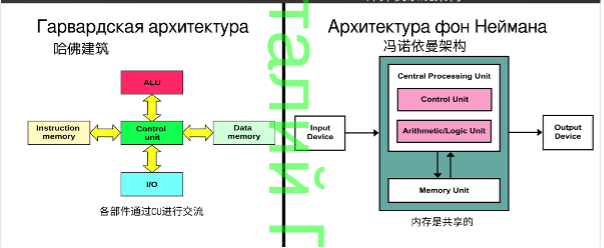
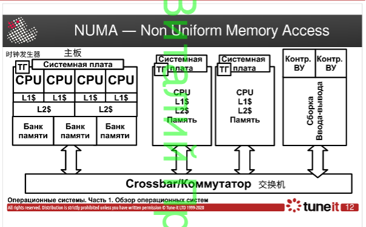
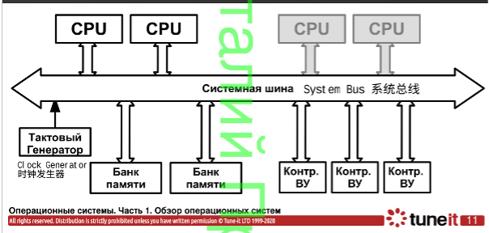

# Вопросы к экзамену по курсу Операционные Системы 2020/21

1. Архитектура компьютерных систем. Архитектура Фон-Неймана и Гарвардская архитектура. Принципы архитектуры Фон-Неймана. Архитектуры NUMA и UMA.
2. Общая организация процессора, памяти, организация вычислений.
3. Организация прерываний, типы прерываний, контроллер прерываний.
4. Типичные функции операционной системы. Интерфейсы ОС. Работа ОС как замена оператора ЭВМ.
5. Пакетная обработка. Системный монитор.
6. Анализ общесистемной эффективности, как предусловие многозадачности. Многозадачность, как способ повышения системной эффективности. Системы разделения времени.
7. Процессы, проблемы современных процессов. Планирование выполнения процессов и  управление ресурсами.
8. Управление памятью, виртуальная память. Защита информации и безопасность ОС.
9. Структура ядра операционной системы. Архитектуры монолитного ядра, ядра динамически загружаемыми модулями и микроядра.
10. Потоки исполнения, многопоточность, модели многопоточности.
11. Симметричная и ассиметричная многопроцессорная обработка.
12. Виртуализация. Типы виртуализации.
13. Сбои и отказоустойчивость ОС. Причины появления отказов в ОС и способы борьбы с ними.. 
14. Надежность. Среднее время восстановления. Коэффициент доступности и время простоя.
15. Резервирование и отказоустойчивость.
16. История и развитие ОС GNU/Linux. Single UNIX Specification и POSIX.
17. Понятие дистрибутива, дистрибутивы Linux.
18. Архитектура и основные подсистемы Linux. Linux Kernel Map.
19. История и развитие Windows
20. Общая архитектура Windows. Windows API
21. Сервисы, функции и важные компоненты Windows.
22. Процесс, характеристики процесса в момент выполнения. Состояние процесса. Разделение ресурсов.
23. Модель процесса с пятью состояниями, назначение состояний.
24. Paging и Swapping. Модель процесса с семью состяниями.
25. Управляющие таблицы процесса. Образ процесса.
26. Управляющий блок процесса (PCB), состав PCB.
27. Функции ОС, связанные с процессами. Создание процесса, переключение процессов.
28. Процессы в ОС UNIX SVR4. Диаграмма состояний, основные структуры.
29. Понятие потока выполнения, связь потока и процесса. Преимущества потоков. 
30. Состояния потока, User Level Threads vs Kernel Level Threads
31. Многопроцессорность и многопоточность. Закон Амдала.
32. Механизм параллельных вычислений, функции ОС.
33. Проблемы параллельного выполнения: взаимоисключения, взаимоблокировки, голодание. Требования к взаимным исключениям. Уровни взаимодействия процессов и потоков.
34. Примитивы синхронизации ОС. Предназначение примитивов синхронизации
35. Примитивы синхронизации ОС. Семафоры и мьютексы. Бинарный семафор
36. Примитивы синхронизации ОС. Условные переменные, rwlocks.
37. Примитивы синхронизации ОС. Мониторы, флаги событий, передача сообщений.
38. Примитивы синхронизации ОС. Неблокирующие примитивы синхронизации и 
неблокирующие структуры данных.
39. Управление памятью, основные определения и требования к организации.
40. Фиксированное и динамическое размещение программ в памяти.
41. Модели аппаратного перемещения программ.
42. Простой страничный поход и простая сегментная организация.
43. Виртуальная память основные определения и принципы организации аппаратуры и управляющих программ.
44. Виртуальный страничный обмен. Двухуровневая организация MMU и TLB 80386. (для КОТ и ГТ — общие принципы)
45. Инвертированная таблица страниц.
46. Сегментно-страничная виртуальная память.
47. Влияние размера страницы виртуальной памяти на ОС. Стратегии ОС по работе с виртуальной памятью.
48. Стратегии замещения страниц ОС. Часовой Алгоритм. Управление резидентной частью процесса.
49. Виды планирования процессов. Критерии краткосрочного планирования. Приоритеты.
50. Использование приоритетов.
51. Стратегии планирования FCFS, RR, SPN, SRT, HRRN, Feedback.
52. Feedback планировщик и классы планирования ОС UNIX SVR4.
53. Справедливое планирование.
54. Планирование в многопроцессорных системах. Типы многопроцессорных систем с точки зрения организации планирования. Гранулярность и проектирование планировщиков процессов и потоков для многопроцессорных систем.
55. ОС реального времени и планировщики. Deadline-планирование.
56. Проблема инверсии приоритетов, типы инверсии и способы решения в планировщике.
57. Ввод-вывод. Современные устройства и скорости обмена, развитие способов ввода-вывода, логическая структура ввода-вывода.
58. Буферизация ввода вывода. Ввод-вывод в UNIX SVR4.
59. Диски и дисковое планирование.
60. Концепции RAID.
61. RAID-0, 1, 10, 0+1.
62. RAID 4,5,6. Аппаратные дисковые массивы.
63. Файловый ввод-вывод, основные определения. Задачи ОС по управлению файлами. 
Совместное использование файлов.
64. Управление файлами в UNIX SVR4
65. Каталоги файлов. Элементы каталога, операции ОС.
66. Размещение записей и файлов в блоках данных. Сложность и типы организации 
размещения. 
67. Непрерывное размещение файлов (на примере ОС RT-11)
68. Цепочечное размещение файлов (на примере DOS FAT)
69. Индексированное размещение (на примере файловой системы UNIX UFS). Дополнительные вопросы для кафедры ВТ.
70. Linux: стандартные средства для наблюдения счетчиков ядра.
71. Linux: файловая система /proc.
72. Linux: трассировщики системных вызовов и библиотек.
73. Linux: Профилировщик perf и FlameGraph.
74. Linux: SystemTap.
75. Linux: Отладчик ядра.
76. Windows: стандартные отладочные средства.
77. Windows: утилиты SysInternals
78. Windows: отладчики WinDbg и KD
79. Аппаратная поддержка взаимных исключений.
80. Эволюция похода к блокировке (Столлингс, гл. 5.1)
81. Принципы взаимного блокирования (Столлингс, гл. 6.1)
82. Предотвращения взаимоблокировок, устранение взаимоблокировок, обнаружение блокировок. (Столлингс, гл. 6.2, 6.3, 6.4)
83. Задача об обедающих философах (Столлингс, гл. 6.6)
84. Процессы в Linux: структура task_struct, поля струткуры, связь с другими структурами ядра.
85. Диаграмма состояния процесса Linux.
86. Создание процесса Linux на уровне пользовательского процесса.
87. Создание и завершение процесса Linux на уровне ядра. Вызываемые функции.
88. Особенности реализации потоков в Linux. KThread. Tasklet. 
89. Примитивы синхронизации Linux. Spinlock и qspinlock.
90. Примитивы синхронизации Linux. Semaphore и Mutex.
91. Примитивы синхронизации Linux. rw_semaphore, seqlock.
92. Типы процессов и потоков Windows.
93. Структура процесса и потока в Windows. Поля структур.
94. Диаграммы состояний процесса и потока Windows
95. Создание и завершение процесса Windows.
96. Примитивы синхронизации Windows. Понятие Dispatcher Object. Ожидание наступление события, вызовы Wait.
97. Примитивы синхронизации Windows. EventObject, Mutex, Mutant.
98. Примитивы синхронизации Windows. Fast mutex, Guarded mutex.
99. Примитивы синхронизации Windows. Semaphore, spinlock
100. Хешированная таблица страниц SPARC64.
101. Виртуальная память Linux. 32-х разрядная модель.
102. Виртуальная память Linux. 64-х разрядные модели.
103. Виртуальная память Linux. Структуры памяти.
104. Способы выделения памяти для пользовательских процессов Linux
105. Способы выделения памяти в пространстве ядра Linux.
106. Слаб-аллокаторы SLAB/SLUB/SLOB.
107. Copy on write и pagefault в Linux.
108. Замещение страниц в Linux. Kswapd

### 1. Архитектура компьютерных систем. Архитектура Фон-Неймана и Гарвардская архитектура. Принципы архитектуры Фон-Неймана. Архитектуры NUMA и UMA.计算机系统架构。 冯诺依曼建筑和哈佛建筑。 冯诺依曼架构的原理。 NUMA 和 UMA 架构。

Существует два основных вида архитектуры: Фон-неймана  и Гарвардская. Основное различие между архитекторами заключается в том, как они используют память.有两种主要的建筑类型：冯诺依曼和哈佛。架构师之间的主要区别在于他们使用内存的方式。

- Архитектура Фон-Неймана и Гарвардская архитектура.
  В то фон Неймана данные и команды хранятся в одной и  той же памяти, в то время как в  Гарвардской есть отдельная память для команд, отдельная для хранения данных.  
  而冯诺依曼的数据和指令存储在同一个内存中，而在哈佛有一个单独的内存用于指令，分别用于存储数据。

- Принципы архитектуры Фон-Неймана：
  - принцип однородности памяти.Инструкции и данные хранятся в одной памяти и визуально неразличимы в памяти.  
    记忆同质性原则。 其原理是指令和数据存储在同一个内存中，并且在内存中从外表上看是无法区分的。
  - принцип адресности.Память состоит из пронумерованных ячеек, каждая из которых хранит данные и легко доступна для процессора.   
    瞄准原则。 根据冯诺依曼架构的原理，内存由编号的单元组成，每个单元都存储数据并随时可供处理器使用。
  - принцип программного управления. Любая программа состоит из набора инструкций, которые автоматически выполняются процессором последовательно в определенном порядке, заданном программистом.   
    程序控制原理。任何程序都由一组指令组成，这些指令由处理器按照程序员设定的特定顺序依次自动执行。
  - принцип двоичного кодирования.данные и команды кодируем нулями и единичками.  
    二进制编码原理。数据和命令用零和一编码。

- NUMA — Non Uniform Memory Access

  

  A memory architecture designed for multiprocessor computers, memory access times depend on the location of the memory relative to the processor. Under NUMA, a processor can access its own local memory a bit faster than non-local memory (memory located on another processor, or memory shared between processors).  
  是一种为多处理器的电脑设计的内存架构，内存访问时间取决于内存相对于处理器的位置。在NUMA下，处理器访问它自己的本地内存的速度比非本地内存（内存位于另一个处理器，或者是处理器之间共享的内存）快一些。
  The characteristic of non-uniform memory access architecture is that the shared memory is physically distributed, and the collection of all these memories is the global address space. So the time for the processor to access these memories is not the same, obviously the speed of accessing local memory is faster than accessing global shared memory or remote access to foreign memory. In addition, memory in NUMA may be hierarchical: local memory, intra-group shared memory, global shared memory.   
  非统一内存访问架构的特点是：被共享的内存物理上是分布式的，所有这些内存的集合就是全局地址空间。所以处理器访问这些内存的时间是不一样的，显然访问本地内存的速度要比访问全局共享内存或远程访问外地内存要快些。另外，NUMA 中内存可能是分层的：本地内存，群内共享内存，全局共享内存。

- UMA — Uniform Memory Access
  

  Все процессоры в UMA-архитектуре используют физическую память одновременно. UMA 架构中的所有处理器同时使用物理内存。
  Проблемой данной архитектуры является то, что, соединяющая банки памяти и CPU системная шина, является «узким местом», что сокращает скорость доступа к данным разных CPU при взаимной конкуренции за ресурсы. 这种架构的问题在于，连接内存组和 CPU 的系统总线是一个“瓶颈”，降低了不同 CPU 访问数据的速度，相互竞争资源。
  
  
