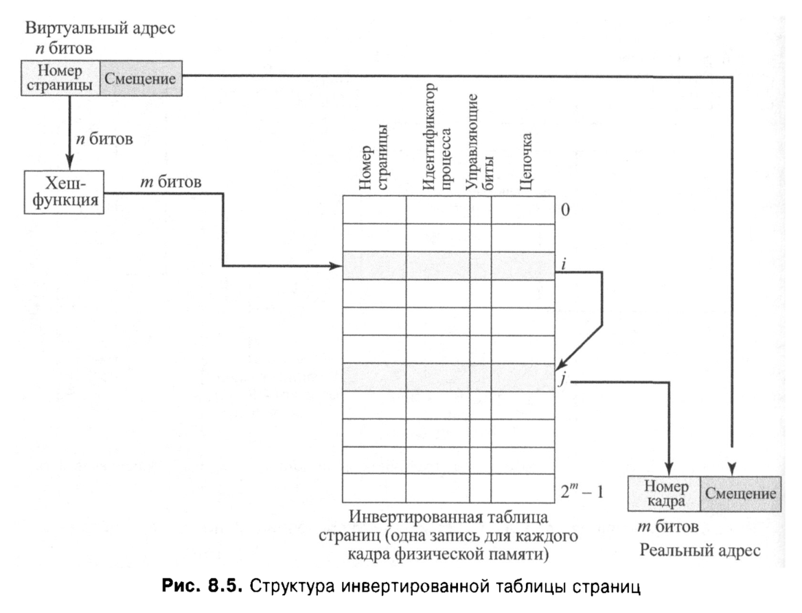

## [MainPage](../index.md)/[OS](README.md)/Rubiesh

## 1

Дисковый массив с уровнем рейда RAID-{A} состоит из {B} дисков по {C} гибибайт с блоками по {D} байт. Размер страйп-unit составляет {Е} блоков. Средняя скорость одной операции чтения блока данных при последовательном доступе к диску равна {F} мкс, а записи {G} мкс;  
RAID 级别 RAID-{A} 的磁盘阵列由 {B} 个 {C} 吉比字节的磁盘和 {D} 个字节的块组成。 条带单元的大小为{E}块。 磁盘顺序访问时数据块一次读操作的平均速度为{F}μs，写入速度为{G}μs；

Скорость вычислений корректирующих кодов для одного страйп-unit данных составляет {H} мкс.  
计算一个数据条带单元的校正码的速度为{H}μs。

При замене одного диска, сколько будет восстанавливаться диск в минутах? Считать, что для восстановления диска нужно обработать все блоки целиком.  
更换一块磁盘时，需要多长时间才能恢复磁盘（以分钟为单位）？ 考虑一下要恢复磁盘，您需要完全处理所有块。

> A=5, B=4, C = 2048, D = 512, E = 16, F = 6, G = 15. H = 256


RAID-5
4 диска по 2048 ГиБ
блок = 512 байт
\$stripe_unit = 16 блоков
read блока = 6 мкс
write в блок = 15 мкс
вычисления для одного SU = 256 мкс

RAID-5 使用奇偶校验来实现冗余。在一个RAID-5磁盘阵列中，数据条带单元包含多个数据单元和一个校验单元，校验单元用于存储奇偶校验信息。在磁盘损坏的情况下，通过校验单元的信息可以恢复丢失的数据单元。

如上图 RAID 5 所示，假如 Disk3 损坏，需要恢复 Disk 3 的数据。对于每一行的 strike 单元（以A_p为例），我们需要依次读取单元 A1， A2， A3，然后进行奇偶校验计算，然后写入 Disk3 的 A_p 单元，（同理对于 B_3）,我们需要依次读取单元 B1， B2， B_p，然后进行奇偶校验计算，然后写入 Disk3 的 B_3 单元，以此类推，最后恢复整个 Disk3 的数据


1) Определяем размер диска в байтах:  
   确定磁盘大小（以字节为单位）：  
    \$disk_size = 2048 * 1024 * 1024 * 1024 = 2199023255552

2) Определяем количество stripe-unit'ов на диске (эквивалентно количеству LV aka stripe'ов):  
   确定磁盘上条带单元的数量（相当于 LV 又名条带的数量）：  
    \$stripes = \$disk_size / (512 * 16) = 268435456

3) Определяем количество блоков на диске:  
   确定磁盘上的块数：  
    \$block_count = (2048 * 1024 * 1024 * 1024) / 512 = 4294967296

Теперь считаем время (чтение с соседей + вычисление + запись):  
现在我们计算时间（读取邻居+计算+写入）：

1) Сколько нам придется писать в блоки:  
   写入所需的时间：  
    \$write_time = \$block_count * 15 мкс = 64424509440 мкс

2) Сколько нам придется считать:  
   奇偶校验计算所需的时间  
    \$calculate_time = \$stripes * 256 мкс = 68719476736 мкс

3) Сколько нам придется читать (с условием, что с соседних дисков читаем параллельно):  
   读取所需的时间（并行读取，因此只需要计算读取一个盘所需的时间）  
    \$read_time = \$block_count * 6 мкс = 25769803776 мкс

4) Итого: 总时间
    **\$answer = \$read_time + \$calculate_time + \$write_time**  
    **= 158913789952 мкс / (60 * 10^6) = 2648,56 мин ≈ 2649 мин**

而对于 RAID-6 的磁盘阵列，以上图为例，由 5 个磁盘组成。对于每一行的单元（以第一行为例），A1，A2，A3 为数据单元，A_p 由 A1，A2，A3 经过计算得出，A_q 由 A1，A2，A3 经过另一种方式计算得出，因此 RAID6 可以在两个硬盘损坏的情况下依然能恢复所有数据（但是计算过程很复杂，这里没有进行详细研究），而对于只有一个硬盘需要恢复的情况，计算方式同 RAID 5（并行读取 3 个硬盘的所有 block，进行校验计算， 然后写入需要恢复的硬盘）

## 2

B Unix-подобной файловой системе в inode содержится {А} указателей на прямые блоки файла, каждый из которых занимает {B} бит, при необходимости используется фиксированное группирование записей в блоке. Размер логического блока файловой системы составляет {С} байт.  
在类 Unix 文件系统上，inode 包含指向文件直接块的 {A} 指针，每个指针占用 {B} 位，必要时使用块中的固定记录分组。 文件系统逻辑块大小为{C}字节。

Каково общее количество блоков (включая служебные) будет занимать файл длинной {D} байт?  
长度为 {D} 字节的文件将占用的块总数（包括服务块）是多少？

### Variant 1

> A = 16, B = 32, C = 512, D = 235477247

类 UNIX 系统的 inode 指针结构（以给出的数据为例），包含：

- 16 个直接指向数据块的指针
- 1 个 一级间接指针（指向一个 L1 指针块的指针，该 L1 指针快可以指向 C / (B / 8) = 512 / (32 / 8) = 512 / 4 = 128 个 L2 文件数据块）
- 1 个 二级间接指针（指向一个 L1 指针块的指针，该指针块又指向 128 个 L2 指针块，然后每个 L2 指针块又指向 128 个 L3 文件数据块）
- 1 个 三级间接指针（指向一个 L1 指针块的指针，该 L1 指针块又指向 128 个 L2 指针块，每个 L2 指针块又指向 128 个 L3 指针块，然后再指向 L4 文件数据块）


16 указателей  
16 个直接数据指针

каждый указатель по 32 бита (4 байта)  
每个指针占 32 位（4 bytes）

блок fs 512 байт  
文件系统的每个区块占 512 bytes

размер файла 235477247 байт
文件大小 235477247 bytes

1) Определяем количество блоков, в которые уместится файл:
    \$blocks = 235477247 / 512 = 459916,498 = 459917
2) Считаем уровни  
    p0:  
        для файла 16  
        служебных: \$sum_p0 = 1  
        осталось распределить: 459917 - 16 = 459901  
    p1:  
        для файла: 128  
        служебных: \$sum_p1 = 1  
        осталось распределить: 459901 - 128 = 459773  
    p2:  
        для файла: 128 * 128 = 16384  
        служебных: \$sum_p2 = 128 + 1 = 129  
        осталось распределить: 459773 - 16384 = 443389  
    p3:  
        для файла: 443389 (оставшиеся)  
        служебных:  
            128 * 128 * 128 - слишком много, значит  
            443389 / (128 * 128) = 27,06 = 27 указателей на L2  
            27 * 128 * 128 = 442368 уйдет на файл  
            в остатке: 443389 - 442368 = 1021
            1021 / 128 = 7,98 = 8 указателей на L3  
            (8 * 128 = 1024 > 1021)  
            итого:  
                1 на уровне L1  
                28 на уровне L2:  
                    27 * 128 на уровне L3  
                    1 * 8 на уровне L3  
        \$sum_p3 = 1 + 28 + 27 * 128 + 8 = 3493  

3) Суммируем

    \$answer = \$blocks + \$sum_p0 + \$sum_p1 + \$sum_p2 + \$sum_p3
    \$answer = 459917 + 1 + 1 + 129 + 3493
    \$answer = 463541

### Variant 2

Решение задания 2.
A=8 B=32 C=512 D=262372731
Косвенных ссылок в блоке = 128
Блоков данных для заданного размера файла = 512447
Файл требует 3875 блоков косвенности 3 уровня, 159 (31+128) блоков косвенности 2 уровня,
3 блока косвенности 1 уровня. Общее количество блоков = 516484
Итоговое место на диске для файла = 264439808(100.78783987654572%)
    
## 3

Задание 3. Жесткий диск имеет геометрию {A} байт на сектор, дорожка содержит {B} секторов, количество дорожек на поверхности {С}, поверхности у диска {D}.  
任务 3. 硬盘的几何结构为每个扇区 {A} 个字节，一个磁道包含 {B} 个扇区，表面上的磁道数量为 {C}，磁盘表面为 {D}。

На диск последовательно, начиная с нулевого сектора, без промежутков, записывается файл, состоящий из {E} записей, каждая из которых занимает {F} байт. Используется фиксированое группирование записей.  
一个由{E}条记录组成的文件，每条记录占用{F}个字节，从零扇区开始，无间隙地顺序写入磁盘。 使用固定的记录分组。

Ответьте на вопрос из задания.  
回答作业中的问题。

### Variant 1

> A = 1024, B = 40, C = 1000, D=2, E = 57358, F = 209  
> Какое количество байт будет   неиспользованным в во всех секторах (внутренняя фрагментация) для хранения   
> 所有扇区（内部碎片）将有多少字节未用于存储  

1024 байт на сектор  
每个扇区 1024 字节

40 секторов на дорожке  
每磁道 40 个扇区

1000 дорожек на поверхности  
磁盘面有 1000 条磁道

2 поверхности  
2个磁盘面

57358 записей в файле  
文件中有 57358 条记录

209 байт на запись  
每条记录 209 字节


записи на сектор 每个扇区写入的记录: 1024 / 209 = 4,9 = 4  
полезных байт в секторе 每个扇区中的有用字节数: 4 * 209 = 836  
фрагментация в одном секторе 一个扇区的碎片数: 1024 - (209 * 4) = 188  

Так как интересует только фрагментация, плевать на дорожки и поверхности  
由于题目只对碎片感兴趣，所以不关心磁道和扇面  

заполнены со стандартной фрагментацией 写满 4 条记录的扇区数: 57358 / 4 = 14339,5 = 14339  
байт надо заполнить на последнем секторе 最后一个扇区需要再写入的字节数: 57358 * 209 - 14339 * 836 = 418 байт  
остаток по последнему сектору 最后一个扇区上的碎片数: 1024 - 418 = 606  

итого сфрагментировано 总碎片数:  

**\$answer = 14339 * 188 + 606 = 2696338 байт**

### Variant 2

Всего байт в файле = 8526816
Записей в секторе = 2
Записей в последнем секторе = 0
Неиспользованно байт в секторе = 80
Неиспользованно байт в последнем секторе = 0
Всего секторов в файле = 19738
Всего дорожек в файле = 430
Cекторов на последней дорожке = 4
Всего байт в файле = 8526816
Какое полное количество байт (включая потери фрагментации) займет файл? Ответ:10105856

## 4

На вход инвертированной таблицы страниц поступает виртуальный адрес {A} в котором {B} бит занимает номер страницы, а {C} бит занимает смещение. Номера кадров и номера страниц имеют одинаковое количество разрядов.  
倒排页表的输入是虚拟地址{A}，其中{B}位占据页号，{C}位占据偏移量。 帧号和页码具有相同的位数。

Вычислите физический адрес, если хеш функция (результат 4 бита) - это операция сложения по модулю 2 каждых 4 битов числа на входе хэш функции, с дополнением нулями старших битов номера страницы.  
哈希散列函数（产生 4 位结果）是散列函数输入处数字的每 4 位模 2 的加法，并用零填充页码的最高有效位，根据该函数计算物理地址。

Поле chain имеет следующий формат: nextchain: frame#, где nextchain начинается со следующего разряда после старшего бита номера кадра. Если nextchain=0 то это означает конец цепочки.  
chain 字段具有以下格式：nextchain:frame#，其中 nextchain 从帧号最高有效位之后的下一位开始。 如果 nextchain=0 那么这意味着链的结束。

Инвертированная таблица приведена в задании.  
作业中给出了倒排表。

> A = 0x237b082dc, B = 18, C = 16
>
> Инвертированная таблица страниц (index pid page# presense chain)
> 
> | index | pid  | page     | presence | chain     |
> |-------|------|----------|----------|-----------|
> | 0x1   | 1282 | 0x0237B0 | 0x1      | 0x001DD43 |
> | 0×2   | 1282 | 0x023810 | 0x0      | 0x031F093 |
> | 0x3   | 1282 | 0x0237B0 | 0x1      | 0x001E2A8 |
> | 0x4   | 6146 | 0x0146B1 | 0x0      | Ox03AFE68 |
> | 0x5   | 1282 | 0x023890 | 0x1      | 0x00CE07E |
> | 0x6   | 1282 | 0×0237B0 | 0x1      | 0x001DD36 |
> | 0x7   | 1282 | 0x023880 | 0x1      | 0x02B6814 |
> | 0x8   | 6146 | 0x014631 | 0x0      | 0x0033356 |
> | 0x9   | 6146 | 0x0146D1 | 0x0      | 0x011E138 |
> | 0xA   | 1282 | 0x0237F0 | 0x1      | 0x0054AEA |
> | 0xB   | 1282 | 0x023850 | 0x1      | 0x01B21F9 |
> | 0xC   | 1282 | 0x0237B0 | 0x0      | 0x003C514 |
> | 0xD   | 1282 | 0x0237E0 | 0x1      | 0x008B490 |
> | 0xE   | 6146 | 0x0146C1 | 0x8      | 0x023A500 |
> | 0xF   | 0    | 0x000000 | 0x0      | 0x0000000 |



адрес = 0x237b082dc 虚拟内存地址  
18 бит - номер страницы 页号  
16 бит - смещение 偏移量 

1. Step 1  
   根据给出的虚拟内存地址确定页号和偏移量

   ```
    |  2   |  3   |  7   |  b   |  0   ||  8   |  2   |  d   | c    |
    |------+------+------+------+------++------+------+------+------|
    | 0010 | 0011 | 0111 | 1011 | 0000 || 1000 | 0010 | 1101 | 1100 |
    |           номер страницы         ||        смещение           |
   ```  
2. Step 2  
   通过哈希函数计算虚拟内存地址的页号得出 index  
   2 xor 3 xor 7 xor b xor 0 = 13 (0xD)   
3. Step 3  
   根据对应 index 的页号与虚拟内存地址页号进行比较  
   两者不匹配，则找到该 index 对应的 chain，由题目给出的 chain 格式确定 nextchain 的 index  
   page(index = 0xD) = 0x0237E0 ≠ 0x0237b0  
   chain(index = 0xD) = 0x008b490  

   ```
   |  0  |   0   |   8   | B  | 4  | 9  | 0   |
   | 0000 00 | 00 10 | 00 1011 0100 1001 0000 |
   |         | next  |         frame#1        |
   |         | chain |        len = 18        |
   ```

   nextchain = 0x2  
4. Step 4  
   根据对应 index 的页号与虚拟内存地址页号进行比较  
   两者不匹配，则找到该 index 对应的 chain，由题目给出的 chain 格式确定 nextchain 的 index   
   page(index = 0x2) = 0x023810	≠ 0x0237b0  
   chain(index = 0x2) = 0x031F093  

   ```
   |  0  |   3   |   1   | F  | 0  | 9  | 3   |
   | 0000 00 | 11 00 | 01 1111 0000 1001 0011 |
   |         | next  |         frame#2        |
   |         | chain |        len = 18        |
   ```

   nextchain = 0xC  
5. Step 5  
   根据对应 index 的页号与虚拟内存地址页号进行比较  
   两者匹配，则找到该 index 对应的 chain，由题目给出的 chain 格式确定 frame#  
   page(index = 0xC) = 0x0237b0  
   chain(index = 0xC) = 0x003C514  

   ```
   |  0  |   0   |   3   | C  | 5  | 1  | 4   |
   | 0000 00 | 00 00 | 11 1100 0101 0001 0100 |
   |         | next  |    frame#3 = 3c514     |
   |         | chain |        len = 18        |
   ```

   nextchain = 0x0 (End)  
6. Final Step  
   对应的物理地址为 frame# 后接 偏移量
   **Answer = frame#3 + смещение = 3c514 82dc**

## 5

Вычислительная машина представляет собой многопроцессорную NUMA-архитектуру. Частота процессора составляет {А} ГГц, при этом регистровая машинная команда выполняется за один такт. Подсчитайте время выполнения программы если:  
该计算机是多处理器 NUMA 架构。 处理器频率为{A}GHz，一个时钟周期执行一条寄存器机器指令。 计算程序执行时间，如果：

- Времена обращения L1-L2 кеш/локальная NUMA память/память других NUMA узлов составляет {В}/{С}/{D} нс  
  {L1-L2缓存}/{本地NUMA内存}/{其他NUMA节点内存} 的访问时间分别为 {B}/{C}/{D} ns
- Количество команд обращающихся к регистрам/L1-L2/local NUMA/other NUMA = {E}/{F}/{G}/{H} соответственно.  
  访问 {寄存器}/{L1-L2缓存}/{本地 NUMA}/{其他 NUMA} 的命令数分别 = {E}/{F}/{G}/{H}。

На сколько уменьшится время работы программы, если данные локального узла попадут в кеш, а ОС перенесет удаленную память в память локального узела?  
如果本地节点数据进入缓存，操作系统将远程内存转移到本地节点内存，程序运行时间会减少多少？

> A = 2, B = 2, C = 28, D = 122, E = 190980, F = 179, G = 181, H = 108

2 ГГц - частота

Длительность обращения 指令处理时间:  
    0.5 нс - registers (1s * 10^9 / (2GHz * 10^9) = 0.5ns)  
    2 нс   - L1-L2  
    28 нс  - local NUMA  
    122 нс - other NUMA  
  
Обращений до 转移前的指令数:  
    190980 - registers  
    179    - L1-L2  
    181    - local NUMA  
    108    - other NUMA  
  
Обращений после 转移后的指令数:  
    190980  - registers  
    179+181 - L1-L2  
    108     - local NUMA  
    0       - other NUMA  
  
Итого:  
    **\$answer = (0.5 * 190980 + 2 * 179 + 28 * 181 + 122 * 108) - (0.5 * 190980 + 2 * 360 + 28 * 108)**  
    **\$answer = 14858 нс**  
