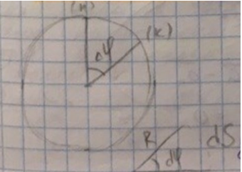
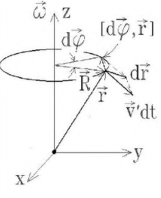

<head>
    
    
</head>

## [MainPage](../index.md)/[Physics](README.md)/Exam

### Классическая (ньютоновская) механика

1. [Нормальное и тангенциальное ускорение. Радиус кривизны траектории](#1-нормальное-и-тангенциальное-ускорение-радиус-кривизны-траектории)  
   法向和切向加速度。轨迹的曲率半径
2. [Кинематика твердого тела: связи линейных и угловых величин](#2-кинематика-твердого-тела-связи-линейных-и-угловых-величин)  
   刚体的运动学：线性量和角量之间的关系
3. [Преобразования Галилея](#3-преобразования-галилея)  
   伽利略变换
4. [Прямая и обратная задача кинематики](#4-прямая-и-обратная-задача-кинематики)  
   运动学正反问题
5. [Преобразование вектора скорости при переходе во вращающуюся СО](#5-преобразование-вектора-скорости-при-переходе-во-вращающуюся-со)  
   过渡到旋转 CO 时速度矢量的变换
6. [Типы фундаментальных взаимодействий в природе](#6-типы-фундаментальных-взаимодействий-в-природе)  
   自然界中基本相互作用的类型
7. [Границы применимости классической механики](#7-границы-применимости-классической-механики)  
   经典力学的适用范围
8. [Центральные силы: гравитационное и электростатическое взаимодействия](#8-центральные-силы-гравитационное-и-электростатическое-взаимодействия)  
   中心力：引力和静电相互作用
9.  [Сила тяжести и вес. Зависимость веса от географической широты](#9-сила-тяжести-и-вес-зависимость-веса-от-географической-широты)  
    重力和重量。体重对地理纬度的依赖性
10. [Импульс материальной точки. Закон сохранения импульса (ЗСИ)](#10-импульс-материальной-точки-закон-сохранения-импульса-зси)  
    质点的动量。动量守恒定律 (FSI)
11. [Применение ЗСИ в задаче о столкновении двух тел](#11-применение-зси-в-задаче-о-столкновении-двух-тел)  
    FSI 在两体碰撞问题中的应用
12. [Движение тела с переменной массой. Уравнение Мещерского](#12-движение-тела-с-переменной-массой-уравнение-мещерского)  
    具有可变质量的物体的运动。 Meshchersky 方程
13. [Формула Циолковского. Реактивное движение. Пример расчета](#13-формула-циолковского-реактивное-движение-пример-расчета)  
    齐奥尔科夫斯基公式。喷气推进。计算示例
14. [Центр масс системы материальных точек. Уравнение движения центра масс](#14-центр-масс-системы-материальных-точек-уравнение-движения-центра-масс)  
    质点系统的质心。质心运动方程
15. [Работа сил в механике и способы ее расчета](#15-работа-сил-в-механике-и-способы-ее-расчета)  
    力学中力的功及其计算方法
16. Кинетическая энергия частицы и ее преобразование при смене СО  
    粒子的动能及其在改变CO时的转变
17. [Связь потенциальной энергии и консервативной силы. Оператор градиента](#17-связь-потенциальной-энергии-и-консервативной-силы-оператор-градиента)  
    势能与保守力的关系。梯度算子
18. [Полная механическая энергия частицы и закон ее изменения](#18-полная-механическая-энергия-частицы-и-закон-ее-изменения)  
    粒子的总机械能及其变化规律
19. [Неупругое столкновение двух тел в системе центра масс](#19-неупругое-столкновение-двух-тел-в-системе-центра-масс)  
    质心系统中两个物体的非弹性碰撞
20. Момент силы. Момент импульса частицы. Закон изменения момента импульса.  
    力矩。粒子的角动量。角动量变化规律
21. Закон изменения момента импульса системы частиц  
    粒子系统的角动量变化规律
22. Преобразование момента импульса при переходе в другую СО  
    转换到另一个 CO 时的角动量转换
23. Движение в центральном поле 1/r. Секториальная скорость.  
Эффективный потенциал  
    中场运动 1/r。部门速度。有效潜力
24. Задача о рассеянии в поле 1/r. Связь угла рассеяния, прицельного параметра и энергии.  
    场1/r的散射问题。散射角、冲击参数和能量之间的关系
25. Осевые моменты инерции твердого тела и их связь с моментом импульса  
    刚体的轴向惯性矩及其与动量矩的关系
26. Моменты инерции шара, цилиндра, конуса (примеры расчета)  
    球、圆柱、圆锥的转动惯量（计算示例）
27. Теорема Гюйгенса-Штайнера (доказательство)  
    惠更斯-施泰纳定理（证明）
28. Кинетическая энергия твердого тела при плоском движении. Теорема Кёнига  
    平面运动中刚体的动能。柯尼希定理
29. Преобразование скоростей и ускорений при переходе в НИСО  
    向 NISO 过渡期间的速度和加速度转换
30. II закон Ньютона в НИСО. Силы инерции. Сила Кориолиса.  
    NISO 中的牛顿 II 定律。惯性力。科里奥利力
31. Свободный гироскоп. Гироскопический эффект  
    自由陀螺仪。陀螺效应
32. Угловая скорость прецессии несвободного гироскопа.  
    非自由陀螺进动角速度

### Элементы теории упругости

33. Закон Гука и пределы его применимости  
    胡克定律及其适用范围
34. Принцип суперпозиции малых деформаций  
    小变形叠加原理
35. Энергия упругой деформации  
    弹性变形能量
36. Модуль Юнга и коэффициент Пуассона  
    杨氏模量和泊松比
37. Модуль однородного всестороннего сжатия  
    均匀全方位压缩模量
38. Модуль одностороннего растяжения  
    单边拉伸模块
39. Связь модуля сдвига с модулем Юнга и коэффициентом Пуассона  
    剪切模量与杨氏模量与泊松比的关系

### Элементы гидродинамики несжимаемой жидкости

40. Уравнение непрерывности струи  
    射流连续性方程
41. Уравнение неразрывности. Оператор дивергенции  
    连续性方程。发散算子
42. Уравнение Бернулли и следствия из него  
    伯努利方程及其推论
43. Гидростатическое давление и сила Архимеда  
    静水压力和阿基米德力
44. Турбулентное и ламинарное течение. Число Рейнольдса  
    湍流和层流。雷诺数
45. Ламинарное течение вязкой жидкости в цилиндрической трубе. Профиль Пуазейля  
    粘性流体在圆柱形管道中的层流。泊肃叶轮廓

### Колебания и волны

46. Энергия незатухающих гармонических колебаний
47. Фазовый портрет бездиссипативного гармонического осциллятора
48. Математический маятник при малой амплитуде колебаний
49. Физический маятник. Приведенная длина. Теорема Гюйгенса о центре качания
50. Фазовый портрет осциллятора при произвольной амплитуде колебаний
51. Сложение колебаний с помощью векторных диаграмм
52. Сложение колебаний близких частот. Биения
53. Сложение перпендикулярных колебаний равной частоты
54. Сила вязкого трения в газе (вывод)
55. Уравнение свободных затухающих колебаний и его решение
56. Параметры осциллятора с затуханием (Q и $\lambda$)
57. Энергия затухающих колебаний
58. Уравнение вынужденных колебаний и его решение
59. Амплитудно-частотная характеристика колебательной системы. Резонанс
60. Общее волновое уравнение и его решения
61. Скорость продольных упругих волн в тонком стержне
62. Скорость поперечных упругих волн в струне
63. Энергия волны в упругой среде
64. Стоячие волны
65. Групповая и фазовая скорость волны. Соотношение Рэлея
66. Классический эффект Доплера

### Релятивистская механика

67. Экспериментальные обоснования СТО. Опыт Майкельсона-Морли
68. Постулаты специальной теории относительности
69. Преобразования Лоренца для координат и времени (вывод)
70. Кинематические следствия преобразований Лоренца
71. Преобразование и сложение скоростей в СТО
72. Релятивистский импульс. Основное уравнение релятивистской динамики
73. Кинетическая и полная энергия в СТО, их связь с импульсом и скоростью
74. Инварианты в специальной теории относительности
75. Эффект аберрации света
76. Релятивистский эффект Доплера

#### 1. Нормальное и тангенциальное ускорение. Радиус кривизны траектории
В большинстве случаев ускорение направлено под некоторым углом к скорости. Составляющую ускорения, которая направлена вдоль скорости, называют тангенциальным ускорением.  
在大多数情况下，加速度与速度成一定角度。 沿速度方向的加速度分量称为切向加速度。 

Тангенциальное ускорение описывает степень изменения скорости по модулю  
切向加速度描述了速度模数的变化率

$$a_\tau=\frac{\Delta v}{\Delta t}$$

Нормальное ускорение   – это составляющая ускорения, которая направлена к центру кривизны траектории, то есть она является нормалью (направлена перпендикулярно) к скорости. Нормальное ускорение описывает степень изменения скорости по направлению  
法向加速度是指向轨迹曲率中心的加速度分量，也就是说，它垂直于（垂直于）速度。 法向加速度描述了速度在方向上的变化程度

$$a_n=\frac{v^2}{r}$$

Радиус кривизны траектории — это радиус окружности R, по которой в этот момент движется тело  
轨迹的曲率半径是此时物体运动的圆R的半径

#### 2. Кинематика твердого тела: связи линейных и угловых величин

Из определения радианной меры угла можно записать связь для линейных и угловых величин

$${\rm d}S={\rm d}\varphi\cdot R$$

$$\frac{ {\rm d}S}{ {\rm d}t}=\frac{ {\rm d}\varphi}{ {\rm d}t}\cdot R$$

$$\omega=\lim_{\Delta t\rightarrow0}\frac{ {\rm d}\vec{\varphi}}{ {\rm d}t}=\frac{ {\rm d}\vec{\varphi}}{ {\rm d}t}$$

$$v=\omega\cdot R$$

Т.к. вектор углового ускорения $Е=\frac{ {\rm d}\omega}{ {\rm d}t}$

$$a_r=E\cdot R$$

#### 3. Преобразования Галилея

伽利略变换是经典力学中用以在两个只以均速相对移动的参考系之间变换的方法，属于一种被动态变换。伽利略变换明显成立的公式在物体以接近光速运动时、亦或者是电磁过程不会成立，这是相对论效应造成的

$$r=r'+R$$

$$v=v'+V$$

$$a=a'+A$$

#### 4. Прямая и обратная задача кинематики

- Прямая задача кинематики - нахождение положения движущейсяточки, ее скорости и ускорения в любой интересующий момент времени.  
  运动学的直接任务是找到运动点的位置、它在任何感兴趣的时间点的速度和加速度

  Пусть известен вид функций, выражающих зависимость координатдвижущейся точки от времени:  
  已知表示运动点坐标对时间依赖性的函数形式：

  $$x=f_1(t),y=f_2(t),z=f_3(t)$$

  Чтобы найти положение точки в некоторый момент $t = t1$ достаточноэто время подставить в формулу (1). Исключив из (1) время, находяттраекторию движения.  
  要找到某个时刻 t = t1 的某个点的位置，只需将该时间代入公式（1）即可。 从（1）中排除时间，找到运动轨迹

  Чтобы найти зависимость от времени компонент скорости надо продифференцировать по времени функции (1). Зная компоненты $v_x,v_y,v_z$ легко определить величину и направление самойскорости.  
  为了找到速度分量的时间依赖性，有必要对函数 (1) 对时间进行微分。 知道了分量 vx、vy、vz，就很容易确定速度本身的大小和方

  Двукратным дифференцированием функций (1) мы получимзависимость от времени компонент ускорения. Также прямая задача можетбыть решена графически.  
  通过函数（1）的二次微分，我们得到加速度分量的时间依赖性。 此外，直接问题可以用图形解决
- Обратная задача кинематики - по функциям, выражающимзависимость компонент ускорения от времени, можно найти величину инаправление скорости, а также координаты точки в заданный моментвремени. Эта задача решается обратной операцией - интегрированием:
  运动学的逆问题 - 通过表示加速度分量对时间的依赖性的函数，可以找到速度的大小和方向，以及给定时间点的点坐标。这个问题通过逆运算——积分来解决：

  однократное интегрирование дает зависимость от времени компонентскорости,  
  单积分给出了速度分量的时间依赖性，

  двукратное интегрирование дает зависимость от времени координат. При этом вформулах появляются постоянные интегрирования. Эти постоянныеопределяются из так называемых начальных условий.  
  双积分给出坐标的时间依赖性。在这种情况下，积分常数出现在公式中。这些常数由所谓的初始条件确定

  Начальные условия - это параметры механического состояния внекоторый определённый момент времени (обычно этот момент относят кначалу отсчета времени $t = 0$, отсюда и название - начальные условия).  
  初始条件是某一时间点的机械状态的参数（通常这个时刻被称为时间的起源t = 0，因此得名-初始条件）

  Начальные условия должны быть заданы дополнительно, в противномслучае задача становится неопределенной.  
  必须另外指定初始条件，否则问题变得不确定

#### 5. Преобразование вектора скорости при переходе во вращающуюся СО

- Движение во вращающейся системе отсчета  
  旋转参考系中的运动

  

  Совместим начала отсчета обеих систем так, чтобы в некоторый момент времени $t$ радиус-векторы частицы в них совпали. Тогда за последующее время ${\rm d}t$ частица переместится в системе $K'$ на $v'{\rm d}t$, а вместе с системой $K'$ еще и повернется относительно неподвижной системы на угол ${\rm d}\varphi$, тогда суммарное перемещение:  
  让我们结合两个系统的原点，以便在某个时间 $t$，它们中的粒子的半径矢量重合。 然后，在随后的时间 ${\rm d}t$ 中，粒子将在坐标系 $K'$ 中移动到 $v'{\rm d}t$，并与坐标系 $K'$ 一起通过角度 ${\rm d}\varphi$，则总运动：

  $${\rm d}\vec{r}=\vec{v}'{\rm d}t + [{\rm d}\vec{\varphi}, \vec{r}]\qquad(*)$$

  где:
  - $\overline{v}'{\rm d}t$ перемещение 移动
  - $[{\rm d}\vec{\varphi}, \vec{r}]$ поворот 转动

  Разделив это выражение на ${\rm d}t$, получим закон преобразования скоростей:  
  将此表达式除以 ${\rm d}t$，我们得到速度转换定律：

  $$\vec{v}=\vec{v}'+[\vec{\omega,\vec{r}}]\qquad(**)$$

- Формулы преобразования скоростей и ускорений  
  速度和加速度转换公式

  найдем приращение скорости (так как $\omega = const$):  
  求速度增量（因为 $\omega = const$）：

  $${\rm d}\vec{v}={\rm d}\vec{v}'+[\vec{\omega},{\rm d}\vec{r}]\qquad(***)$$

  Но изменение $v'$ происходит как в результате движения частицы с ускорением $а'$ в системе $K'$, так и поворота вектора скорости $v'$ вместе с системой $K'$ относительно системы $K$  
  但是 $v'$ 的变化是由于粒子在坐标系 $K'$ 中以加速度 $a'$ 运动，以及速度矢量 $v'$ 与坐标系 $K'$ 相对于坐标系 $K$ 的旋转的结果

  $${\rm d}\vec{v}'=\vec{a}'{\rm d}t+[{\rm d}\vec{\varphi},\vec{v}']$$

  где:
  - $\vec{a}'{\rm d}t$ движение 运动
  - $[{\rm d}\vec{\varphi},\vec{v}']$ поворот 转动

  Подставлить выражения (**), получим:  
  代入表达式（**），我们得到：

  $${\rm d}\vec{v}=\vec{a}'{\rm d}t+[{\rm d}\vec{\varphi},\vec{v}']+[\vec{\omega},(\vec{v}'{\rm d}t+[{\rm d}\vec{\varphi},\vec{r}])]$$

  Разделив полученное выражение на dt и приведя подобные выражения, найдем закон преобразования ускорений:  
  将得到的表达式除以 dt 并给出相似的表达式，我们发现加速度变换定律：

  $$\vec{a}=\vec{a}'+2[\vec{\omega},\vec{v}']+[\vec{\omega},[\vec{\omega},\vec{r}]]$$

  Последнее слагаемое в формуле направлено по радиусу к оси вращения и поэтому называется центростремитеотные или осестремительным ускорением  
  公式中的最后一项沿半径指向旋转轴，因此称为向心加速度或振荡加速度

  $$\vec{a}_{кор}=2[\vec{\omega},\vec{v}']$$

  Кориолисово ускорение (по имени Гюстава Кориолиса)  
  科里奥利加速度（在古斯塔夫科里奥利之后）

  $$\vec{a}_{ос}=[\vec{\omega},[\vec{\omega},\vec{r}]]$$

  его модуль $a_{ос}=\omega^2R$

  Центростоемительным или осестремтельным ускорение
  向心加速度

  Если система К относительно системы К совершает поступательное и вращательное движение одновременно добавляется еще ускорение поступательного движения:  
  如果系统 $K'$ 相对于系统 $K$ 进行平移和旋转运动，则同时加上平移加速度：

  $$\vec{a}=\vec{a}_0+\vec{a}'+2[\vec{\omega},\vec{v}']+[\vec{\omega},[\vec{\omega}.\vec{r}]]$$

  Используя формулу преобразования ускорений, запишем закон движения так, чтобы он выполнялся и в неинерциальной системе отсчета (2-ой з-н Ньютона для неинерциальной системы отсчета):  
  使用加速度变换的公式，我们写出运动定律，使其在非惯性参考系中也得到满足（非惯性参考系的牛顿第二定律）：

  $$m\vec{a}'=\sum_i\vec{F}_i-m\vec{a}_0+2m[\vec{v}',\vec{\omega}]+m\omega^2\vec{R}$$

#### 6. Типы фундаментальных взаимодействий в природе

Различают четыре вида фундаментальных взаимодействий в природе: **сильное, слабое, электромагнитное и гравитационное**. Каждое взаимодействие (К) характеризуется так называемой константой взаимодействия, которая определяет его сравнительную интенсивность временем протекания (t) и радиусом действия (г). Дадим краткую характеристику этих взаимодействий.  
自然界中有四种基本相互作用：**强、弱、电磁和引力**。 每个相互作用 (K) 的特征在于所谓的相互作用常数，该常数由流动时间 (t) 和作用半径 (r) 决定其相对强度。 让我们简要介绍一下这些相互作用。

- **Сильное взаимодействие** происходит на уровне атомных ядер и представляет собой взаимное притяжение и отталкивание их составных частей (нуклонов). Отличительными свойствами сильного взаимодействия являются: короткодействие; зарядовая независимость, проявляющаяся во взаимодействии как заряженных, так и нейтральных частиц; насыщение, которое проявляется в том, что каждый нуклон в ядре взаимодействует лишь с ограниченным числом ближайших к нему нуклонов. Сильное взаимодействие отвечает за устойчивость ядер.  
  **强相互作用**发生在原子核的水平上，代表了它们的组成部分（核子）的相互吸引和排斥。 强相互作用的显着特性是：短程； 电荷独立性，表现为带电粒子和中性粒子的相互作用； 饱和，这表现在原子核中的每个核子只与最接近它的有限数量的核子相互作用。 强相互作用是原子核稳定性的原因。
- Электромагнитное взаимодействие в 100-1000 раз слабее сильного взаимодействия ($K - 10^{-2}$, радиус взаимодействия неограничен, $t\sim 10^{-20} с$). Электромагнитное взаимодействие связано с электрическими и магнитными полями. Электрическое поле возникает при наличии электрических зарядов, а магнитное поле - при их движении. В природе существуют как положительные, так и отрицательные заряды, что и определяет характер электромагнитного взаимодействия (притяжение либо отталкивание). В процессе электромагнитного взаимодействия электроны и атомные ядра соединяются в атомы, атомы - в молекулы.  
  电磁相互作用比强相互作用弱100-1000倍（$K = 10^{-2}$，相互作用半径无限，$t\approx 10^{-20} с$）。电磁相互作用与电场和磁场有关。当有电荷时会产生电场，当它们移动时会产生磁场。在自然界中，既有正电荷也有负电荷，这决定了电磁相互作用（吸引或排斥）的性质。在电磁相互作用的过程中，电子和原子核结合成原子，原子——结合成分子。
- Слабым взаимодействием объясняются все виды b-распада, многие распады элементарных частиц. За счет слабого взаимодействия светит Солнце. Испускаемое нейтрино обладает огромной проницающей способностью - оно проходит через железную плиту толщиной миллиард км. Константа слабого взаимодействия имеет порядок $10^{-13}, t\gg 10^{-10} с$. Это взаимодействие, как и сильное, является короткодействующим: $r\gg 10^{-18}м$ При слабых взаимодействиях меняется заряд частиц.  
  弱相互作用解释了所有类型的 b 衰变，许多基本粒子的衰变。 太阳因为弱的力量而发光。 发射的中微子具有巨大的穿透力——它可以穿过十亿公里厚的铁板。 弱相互作用常数的量级为 $10^{-13}, t\gg 10^{-10} s$。 这种相互作用，和强相互作用一样，是短程的： $r\gg 10^{-18}m$ 在弱相互作用中，粒子电荷会发生变化。
  Слабое взаимодействие осуществляется путем обмена тяжелыми промежуточными частицами - бозонами, аналогичными фотону.  
  弱相互作用是通过重的中间粒子——玻色子的交换来进行的，类似于光子。
- Гравитационное взаимодействие, хотя и является универсальным, самое слабое, не учитываемое в теории элементарных частиц, так как его $К=10^{-38}$, $r=¥$, $t$-не ограничено. Гравитационное взаимодействие характерно для всех материальных объектов вне зависимости от их природы. Оно заключается во взаимном притяжении тел и определяется фундаментальным законом всемирного тяготения. Гравитационным взаимодействием определяется падение тел в поле сил тяготения Земли. Законом всемирного тяготения описывается движение планет Солнечной системы, а также других макрообъектов.
  引力相互作用虽然是普遍的，但最弱，基本粒子理论没有考虑，因为它的 $К=10^{-38}$,$r=¥$,$t$-无限。引力相互作用是所有物质物体的特征，无论其性质如何。它在于物体之间的相互吸引，并由万有引力的基本定律决定。引力相互作用决定了物体在地球引力场中的下落。万有引力定律描述了太阳系行星以及其他宏观物体的运动。
  Связь, взаимодействие и движение представляют собой важные атрибуты материи, без которых невозможно ее существование. Взаимодействие обусловливает объединение различных материальных элементов в системы, системную организацию материи. Все свойства тел производны от их  взаимодействий, являются результатом их структурных связей и внешних взаимодействий между собой.  
  交流、相互作用和运动是物质的重要属性，没有它们就不可能存在。 相互作用决定了各种物质元素统一成系统，物质的系统组织。 物体的所有特性都源于它们的相互作用，是它们的结构连接和外部相互作用的结果。

#### 7. Границы применимости классической механики

В классической (Ньютоновской) механике скорость систем должна быть намного меньше скорость света (с=3*108м/с2) и по размерам больше, чем атом, иначе будет описываться не с классической механикой, а релятивистской(при скорости, которая приближается к скорости света) и квантовой(для малых систем с размерами приближенными к атому).

$v$(скорость)$\ll 3\times 10^8м/с^2$($\ll$-намногоменьше); $x$(размеры)$>
10^{-9}м$

#### 8. Центральные силы: гравитационное и электростатическое взаимодействия

- Гравитационное взаимодействие определяется фундаментальным законом всемирного тяготения. Гравитационные силы убывают пропорционально квадрату расстояния между взаимодействующими телами. Закон всемирного тяготения Ньютона описывается формулой:  
  万有引力的相互作用是由万有引力的基本定律决定的。 引力与相互作用的物体之间距离的平方成比例地减小。 牛顿万有引力定律由以下公式描述：

  $$F=G\frac{m_1m_2}{r^2}$$

  где $G=6,67\times10^{-11}11 \frac{м^3}{кг\cdot с^2}$ гравитационная постоянная  
  其中 $G=6.67\times10^{-11}11 \frac{m^3}{kg\cdot s^2}$ 是万有引力常数

- Электростатическое взаимодействия определяется фундаментальным законом всемирного тяготения.  
静电相互作用是由万有引力的基本定律决定的。

  Электростатические силы убывают пропорционально квадрату расстояния между взаимодействующими телами. Электростатические силы находятся по формуле:  
  静电力与相互作用物体之间距离的平方成正比减小。 静电力由以下公式得出：

  $$F=k\cdot\frac{q_1q_2}{r^2}$$

  (где $r$ - расстояние между частицами, $q_{1,2}$-nx массы, $k=1,38\times10^{-23}$ Дж/к постоянная Больцмана)  
  （其中$r$是粒子之间的距离，$q_{1.2}$-nx质量，$k=1.38\times10^{-23}$ J/k是玻尔兹曼常数）

#### 9. Сила тяжести и вес. Зависимость веса от географической широты

В системе отсчета, связанной с Землей, на всякое тело действует сила, называемая силой тяжести.  
在与地球相关的参考系中，每个物体都受到称为重力的力的影响。

Сила тяжести, действующая на материальную точку высчитывается по формуле:  
作用在质点上的重力由以下公式计算：

$$F_Т=mg$$

где 
- $F_Т$ - сила тяжести
- $m$-масса материальной точки
- $g=9,81$ ускорение свободного падения.

Вес тела - это сила, с которой тело действует на подвес или опору $\vec{P}=m(\vec{g}-\vec{a})$ гравитационного притяжения к Земле.  
体重 $\vec{P}=m(\vec{g}-\vec{a})$ 是身体对地球引力的悬浮或支撑作用的力。  

Если $a=g$, тело перестаёт действовать на подвес-вес тела становится равным нулю,т.е. наступает состояние невесомости.

如果 $a=g$，则身体停止作用于悬架 - 身体的重量变为零，即 进入失重状态。

#### 10. Импульс материальной точки. Закон сохранения импульса (ЗСИ)

- Импульс материальной точки.

  Импульс (количество движения) — векторная физическая величина, являю­ щаяся мерой механического движения тела. В классической механике импульс тела равен произведению массы т этого тела на его скорость и, направление импульса совпадает с направлением вектора скорости:  
  冲量（动量）是一个矢量物理量，它是物体机械运动的量度。 在经典力学中，一个物体的动量等于这个物体的质量 m 和它的速度 u 的乘积，动量的方向与速度矢量的方向一致：

  $$\vec{p}=m\vec{v}$$

- Закон сохранения импульса (ЗСИ)
  
  Закон сохранения импульса (Закон сохранения количества движения) — закон, утверждающий, что векторная сумма импульсов всех тел системы есть величина постоянная, если векторная сумма внешних сил, действующих на си­стему тел, равна нулю.  
  动量守恒定律（动量守恒定律）是一个定律，如果作用在物体系统上的外力的矢量和等于零。

  $$\sum^N_{i=1}p_i=Const$$

  В классической механике закон сохранения импульса обычно выводится как следствие законов Ньютона. Из законов Ньютона можно показать, что при дви­ жении системы в пустом пространстве импульс сохраняется во времени, а при наличии внешнего воздействия скорость изменения импульса определяется сум­ мой приложенных сил.  
  在经典力学中，动量守恒定律通常是由牛顿定律推导出来的。 从牛顿定律可以看出，当一个系统在真空中运动时，动量在时间上是守恒的，在存在外部影响的情况下，动量的变化率是由外加力的总和决定的。

  $$\frac{ {\rm d}}{ {\rm d}t}\sum^N_{i=1}p_i=0$$

- Вывод в механике Ньютона

  Согласно второму закону Ньютона, для системы из N частиц выполняется соотношение  
  根据牛顿第二定律，对于一个有 N 个粒子的系统，关系式

  $$\frac{ {\rm d}\vec{p}}{ {\rm d}t}=\vec{F}$$

  где $\vec{p}$ - импульс системы:

  $$\vec{p}=\sum^N_{i=1}\vec{p}_n$$

#### 11. Применение ЗСИ в задаче о столкновении двух тел

- **Абсолютно упругий удар** - абстрактная модель соударения, при которой не учитываются потери энергии на трение, деформацию, и т.п. Никакие другие взаимодействия, кроме непосредственного контакта, не учитываются. При абсолютно упругом ударе о закрепленную поверхность скорость объекта после удара по модулю равна скорости объекта до удара, то есть величина импульса не меняется. Может поменяться только его направление При этом угол падения равен углу отражения.
  **绝对弹性冲击** - 一个抽象的冲击模型，不考虑由于摩擦、变形等造成的能量损失。 除直接接触外，不考虑其他交互。 对固定表面进行绝对弹性冲击时，物体撞击后的速度与物体撞击前的速度绝对值相等，即动量的大小不变。 只有它的方向可以改变。在这种情况下，入射角等于反射角
- **Абсолютно неупругий удар** - удар, в результате которого тела соединяются и продолжают дальнейшее своё движение как единое тело. Например, пластилиновый шарик при падении на любую поверхность полностью прекращает свое движение, при столкновении двух вагонов срабатывает автосцепка и они так же продолжают двигаться дальше вместе.  
  **绝对无弹性的冲击** - 一种冲击，其结果是身体被连接起来并作为一个单一的身体继续它们的进一步运动。 例如，一个橡皮泥球，当它落在任何表面上时，会完全停止运动，当两辆车相撞时，一个自动耦合器被激活，它们也继续一起移动。

  

#### 12. Движение тела с переменной массой. Уравнение Мещерского

- Движение тел перемнной массы 可变质量物体的运动
  В классической механике изменение массы тел может произойти только за счет удаления части массы (dm < 0) тела или добавления некоторой массы (dm > 0).  
  在经典力学中，物体质量的变化只能是由于去除了物体的一部分质量（dm < 0）或增加了一些质量（dm > 0）。

  Примеров движения тел с переменной массой можно привести много: движение автомобиля, самолета, ракеты, поливочной машины, рост массы капель дождя при движении в атмосфере с пересыщенными водяными парами и т.д.  
  有许多可变质量物体运动的例子：汽车、飞机、火箭、浇水机的运动，在具有过饱和水蒸气的大气中运动时雨滴质量的增加等。

  Для получения уравнения движения тел переменной массы достаточно исполь­зовать законы классической физики. Особый интерес этот вопрос получил в связи с развитием ракетной техники, используемой для космических полетов. Рассмотрим подробнее принцип действия реактивного движения. При полете ракеты после сгорания топлива из сопла с большой скоростью истекают газы, которые выбрасываются в направлении, противоположном движению ракеты (третий закон Ньютона). Естественно, в реальном полете на ракету действу­ ют внешние силы (земное тяготение, сопротивление воздуха и т.д.). Без учета внешних сил система “ракета-газ является замкнутой. В этом случае импульс такой системы не изменяется.  
  要获得变质量物体的运动方程，使用经典物理定律就足够了。这个问题与用于太空飞行的火箭技术的发展有关。让我们更详细地考虑一下喷气推进的原理。火箭飞行过程中，燃料燃烧后，气体从喷管中高速流出，向与火箭运动方向相反的方向喷出（牛顿第三定律）。自然，外力在实际飞行中作用于火箭（地球重力、空气阻力等）。在不考虑外力的情况下，“火箭-气体”系统是封闭的。在这种情况下，这种系统的动量不会改变。
- Уравнение Мещерского Meshchersky 方程

  $$M(t)\frac{ {\rm d}v}{ {\rm d}t}=u_1(t)\frac{ {\rm d}m_1}{ {\rm d}t}-u_2(t)\frac{ {\rm d}m_2}{ {\rm d}t}+F$$

  Где:
  - $M(t)$ - масса материальной точки, изменяющаяся за счет обмена частицами с окру­ жающей средой, в произвольный момент времени $t$;  
    质点的质量，由于粒子与环境的交换，在任意时刻 $t$ 发生变化；
  - $v$ - скорость движения материальной точки переменной массы;  
    变质量的质点的运动速度
  - $F$ - результирующая внешних сил, действующих на материальную точку переменной массы со стороны ее внешнего окружения (в том числе, если такое имеет место, и со стороны среды, с которой она обменивается частицами;  
    从外部环境（如果是这种情况，包括从与它交换粒子的介质一侧）作用在可变质量材料点上的外力的合力；
  - $u_1(t)=v_1-v$ - относительная скорость присоединяющихся частиц;  
    结合粒子的相对速度；
  - $u_2(t)=v_2v$ - относительная скорость отделяющихся частиц;
    分离粒子的相对速度；
  - $\frac{ {\rm d}m_1}{ {\rm d}t}>0$ и $\frac{ {\rm d}m_2}{ {\rm d}t}>0$

  Пусть в некоторый момент времени $t$ масса ракеты $M$, а ее скорость $u$. Тогда импульс ракеты:
  设在某个时间 $t$ 火箭的质量为 $M$ 它的速度为 $u$。 那么火箭的动量为：

  $$\vec{p}=m\vec{u}$$

  Из-за непрерывного сгорания топлива спустя некоторое время ${\rm d}t$ масса и скорость ракеты получают приращения ${\rm d}m$ и ${\rm d}u ({\rm d}m < 0)$.  
  由于燃料的持续燃烧，经过一段时间 ${\rm d}t$，火箭的质量和速度会增加 ${\rm d}m$ 和 ${\rm d}u ({\rm d}m < 0)$。

  Соответственно импульс ракеты в этот момент будет:  
  因此，此时火箭的动量将是：

  $$(m+{\rm d}m)(\vec{u}+{\rm d}\vec{u})$$

  К этому импульсу необходимо добавить импульс газов, образующихся за это время ${\rm d}t$ т.е. ${\rm d}m_r\vec{v}_r$, где ${\rm d}m_r$ - масса, образующегося газа, $v_r$ - скорость истечения газа.  
  对于这种冲动，有必要添加在 ${\rm d}t$ 期间形成的气体的动量 ，即 ${\rm d}m_r\vec{v}_r$，其中 ${\rm d}m_r$ 是生成气体的质量，$v_r$ 是气体流出速度。

  С учетом этого найдем изменение импульса системы "ракета-газ" за время $t+{\rm d}t$:  
  考虑到这一点，我们发现“火箭气体”系统的动量随时间 $t+{\rm d}t$ 的变化：

  $$(m+{\rm d}m)(\vec{u}+{\rm d}\vec{u})+{\rm d}m_r\vec{v}_r-m\vec{u}=\vec{F}{\rm d}t$$

  где $F$ - результирующая всех внешних сил, действующих на ракету.  
  其中 $F$ 是作用在火箭上的所有外力的合力。

  Если ${\rm d}t\to0$, ${\rm d}m\to0$ и ${\rm d}u\to0$, то в пределе после раскрытия скобок и преобразований, получим:  
  如果${\rm d}t\to0$、${\rm d}m\to0$和${\rm d}u\to0$，则在展开括号和变换后的极限内，我们得到：

  $$\vec{u} {\rm d}m+m{\rm d}\vec{u}+{\rm d}m {\rm d}\vec{u}+{\rm d}m_r\vec{u}_r=\vec{F} {\rm d}t$$

  Произведение (${\rm d}m{\rm d}u$) исключаем как бесконечно малую величину второго порядка. Кроме того, согласно закону сохранения массы $dm+dm = 0$ или $dm=-dm$. Тогда:  
  乘积 (${\rm d}m{\rm d}u$) 作为二阶无穷小量被排除在外。 此外，根据质量守恒定律 $dm+dm = 0$ 或 $dm=-dm$。 然后：

  $$\vec{u}{\rm d}m-\vec{v}_r{\rm d}m+m{\rm d}\vec{u}=\vec{F}{\rm d}t$$

  или 或者

  $$m{\rm d}\vec{u}=(\vec{v}_r-\vec{u}){\rm d}m+\vec{F}{\rm d}t$$

  где $\vec{v}_r-\vec{u}=\vec{u}_o$ - относительная скорость истечения газов.  
  其中 $\vec{v}_r-\vec{u}=\vec{u}_o$ 是气体流出的相对速度。

  После подстановки относительной скорости в предыдущее равенство, имеем:  
  将相对速度代入上式后，我们有：

  $$m{\rm d}\vec{u}=\vec{u}_o{\rm d}+\vec{F}{\rm d}t$$

  Так как это изменение произошло за время ${\rm d}t$, то разделим правую и левую части по­ следнего равенства на ${\rm d}t$ и получим:  
  由于这种变化发生在时间 ${\rm d}t$，我们将最后一个等式的左右两边除以 ${\rm d}t$，得到：

  $$m\frac{ {\rm d}\vec{u}}{ {\rm d}t}=\vec{u}_o\frac{ {\rm d}m}{ {\rm d}t}+\vec{F}$$

  Уравнение (3.33) выражает второй закон Ньютона. Однако к величине внешней силы добавлена сила  
  方程 (3.33) 表达了牛顿第二定律。 但是，加在外力上的力是

  $$\vec{u}_o\frac{ {\rm d}m}{ {\rm d}t}=\vec{F}_r$$

  называемая реактивной силой, с которой на ракет)' действуют истекающие из сопла га­ зы. Уравнение было впервые получено Мещерским и является уравнением движения тел переменной массы.  
  称为反作用力，火箭受到从喷嘴流出的气体的影响。 该方程首先由 Meshchersky 获得，是变质量物体的运动方程。

#### 13. Формула Циолковского. Реактивное движение. Пример расчета

- Реактивным движением называют движение, при котором у тела возникает изменение скорости за счет отделения его части с некоторой скоростью относительно тела  
  喷气推进是一种运动，在这种运动中，由于其部分相对于身体以一定的速度分离，因此身体的速度发生了变化
- Реактивная сила - это величина, равная произведению расхода топлива на скорость газов относительно ракеты, взятое с минусом
  反作用力是一个值，等于燃料消耗和气体相对于火箭的速度的乘积，减去
- Смысл уравнения Мещерского: это динамическое уравнение движения тела с переменной массой
  Meshchersky方程的含义：这是一个变质量物体运动的动力学方程
  
  Выведем уравнение движения тела с переменной массой:

  По закону сохранение импульса:

  $$(M+m)\vec{v}=M(\vec{v}+\Delta\vec{v})+m\vec{v}_1$$

  Рассмотрим это движение относительно центра масс ракеты:  
  让我们推导出具有可变质量的物体的运动方程：

  $u$ - скорость вылета газов (части ракеты)  
  $u$ - 气体逸出的速度（火箭的一部分）

  $m\ll M\Rightarrow M+m=M$
  По закону сохранения импульса:  
  根据动量守恒定律：

  $$\vec{0}=M\Delta\vec{v}+\Delta m\vec{v}$$

  $$M\cdot\frac{\Delta\vec{v}}{\Delta t}=-\frac{\Delta m}{\Delta t}\cdot\vec{u}=\mu\vec{u}$$

  Формула Циолковского позволяет рассчитать, какое кол-во топлива необходимо взять на борт космического корабля, чтобы разогнать его до нужной скорости:  
  Tsiolkovsky 公式允许您计算需要在航天器上携带多少燃料才能将其加速到所需速度：

  $$v=u\ln\frac{m_0}{m}$$

#### 14. Центр масс системы материальных точек. Уравнение движения центра масс

- Центр масс - точка, через которую должна проходить линия действия силы, чтобы под действием этой силы
тело двигалось поступательно (не вращалось).  
  质心是力的作用线必须通过的点，以便在该力的作用下
身体向前移动（不旋转）。
  - Если направление прямой, вдоль которой действует сила, не проходит через центр масс тела, эта сила вызывает поворот тела.  
    如果力作用的直线方向不通过身体的质心，则该力会导致身体旋转。
  - Если тело движется поступательно под действием нескольких сил, значит, точка приложения равнодействующей этих сил находится в центре масс этого тела.  
    如果一个物体在几个力的作用下平移，那么这些力的合力的作用点就是这个物体的质心。
  - Для того чтобы описать поступательное движение тела, необходимо описать движение центра масс этого тела под действием равнодействующей внешних сил.  
    为了描述物体的平移运动，需要描述物体质心在外力合力作用下的运动。
  - Когда мы считаем тело материальной точкой, то имеем в виду центр маесданного тела.  
    当我们将身体视为一个质点时，我们指的是给定身体的中心。
- Центром масс тела, состоящего из п материальных точек, называется точка (в геометрическом смысле),
радиус-вектор которой определяется формулой:  
  由 $n$ 个质点组成的物体的质心称为点（在几何意义上），
其半径矢量由以下公式确定：

  $$R=\frac{m_1R_1+m_2+R_2+\cdots+m_nR_n}{m_1+m_2+\cdots+m_n}$$

  Здесь $R_i$ - радиус-вектор точки с номером $i(i=1,2,\cdots,n)$.  
  这里 $R_i$ 是编号为 $i(i=1,2,\cdots,n)$ 的点的半径向量

- Уравнение движения центра масс 质心运动方程
  Уравнение движения центра масс произвольной системы частиц (ну это изи):  
  任意粒子系统的质心运动方程（嗯，这很容易）：

  $$M\vec{a}_C\equiv M\frac{ {\rm d}\vec{V}_C}{ {\rm d}t}=\sum^N_{i=1}\vec{F}_{i,внеш}$$

  Где
  - $М$ - общая масса системы частиц.
    $М$ - общая масса системы частиц.
  - $\vec{a_c}$ - это ускорение центра масс
    $\vec{a_c}$ 是质心的加速度
  - $\vec{F}_{i,внеш}$ - внешняя сила, которая действует на $i$-ю $(i=1,2,3,\cdots)$ частицу системы
    $\vec{F}_{i,внеш}$ 是作用在系统的第 $i$ 个 $(i=1,2,3,\cdots)$ 粒子上的外力
- Определение положения центра масс
  Если тело можно разбить на п элементов, массы которых $m1,m2,\cdots,m_n$ и если известны координаты центров масс этих элементов $x_1,x_2,\cdots,x_n$, то координата масс тела вычисляется по формуле:  
  如果物体可以分为 n 个元素，其质量为 $m1,m2,\cdots,m_n$ 并且这些元素的质心坐标 $x_1,x_2,\cdots,x_n$ 已知，则坐标身体质量的计算公式为：
 
  $$x_C=\frac{x_1m_1+x_2m_2+\cdots+x_nm_n}{m_1+m_2+\cdots+m_n}$$

  Такое же соотношение можно записать для $y_c$ и $z_c$.  
  对于 $y_c$ 和 $z_c$ 也有相同的关系。

#### 15. Работа сил в механике и способы ее расчета

Работа это скалярная, количественная мера измерения приложенной силы. При этом работа совершается с телом или с системой тел.  
功是施加力的标量、定量测量。 在这种情况下，工作是用身体或身体系统完成的。

Работа измеряется в Джоулях.  
功以焦耳为单位。

1 джоуль равен 1 ньютону умноженному на 1 метр,  
1焦耳等于1牛顿乘以1米

В механике работа всегда сопровождается изменением положения тела в пространстве. Работа прямо пропорциональна прилагаемой силе и проделанному пути.  
在力学中，做功总是伴随着身体在空间中位置的变化。 功与施加的力和行进的距离成正比。

При этом если была приложена сила но тело не переместилось - работа равна нулю.  
此外，如果施加了力但身体没有移动，则功等于零。

$$A=Fs$$

Если направление движение и направление силы совпадают то проделанная работа положительно, если направление силы обратно направлению движения то работа отрицательная. Таким образом если учитывать направление силы и движения формула работы примет вид  
如果运动方向与受力方向一致，则所做的功为正，如果力的方向与运动方向相反，则所做的功为负。 因此，如果我们考虑力和运动的方向，则功公式将采用以下形式

$$A=Fs\cdot\cos(F,s)$$

Стоит заметить что в инерциальных системах отсчета приложенная работа равна энергии.  
值得注意的是，在惯性参考系中，施加的功等于能量。

Понятие работы также присутствует в термодинамике, в термодинамике работа совершается газом при расширении.  
功的概念也存在于热力学中；在热力学中，做功是由气体在膨胀过程中完成的。

$$A_{1\to2}=\int^{V_2}_{V_1}P {\rm d}V$$

При этом работа над газом имеет аналогичную формулу но противоположна по направлению.  
在这种情况下，气体上的功具有相似的公式，但方向相反。

#### 16. Кинетическая энергия частицы и ее преобразование при смене СО

Кинетическая энергия — скалярная функция, являющаяся мерой движения материальных точек, образующих рассматриваемую механическую систему, и зависящая только от масс и модулей скоростей этих точек. Работа всех сил, действующих на материальную точку при её перемещении, идёт на приращение кинетической энергии. Для движения со скоростями значительно меньше скорости света кинетическая энергия записывается как  
动能是一个标量函数，它是构成所考虑的机械系统的物质点运动的量度，仅取决于这些点的质量和速度。 在其运动过程中作用在材料点上的所有力的功都会增加动能。 对于速度远低于光速的运动，动能写为

$$T=\sum\frac{m_iv_i^2}{2}$$

где индекс нумерует материальные точки. Часто выделяют кинетическую энергию поступательного и вращательного движения. Более строго, кинетическая энергия есть разность между полной энергией системы и её энергией покоя; таким образом, кинетическая энергия—часть полной энергии, обусловленная движением. Когда тело не движется, его кинетическая энергия равна нулю. В системе СИ она измеряется в джоулях(Дж).  
其中索引对材料点进行编号。 经常分配平移和旋转运动的动能。 更严格地说，动能是系统总能量与其静止能量之差； 因此，动能是由于运动引起的总能量的一部分。 当物体不动时，其动能为零。 在 SI 系统中，它以焦耳 (J) 为单位。

Кинетическая энергия в классической механике:  
经典力学中的动能：

- Случай одной материальной точки 一物点案例

  По определению, кинетической энергией материальной точки массой называется величина  
  根据定义，质点质量的动能是量

  $$T=\frac{mv^2}{2}$$

  при этом предполагается, что скорость точки всегда значительно меньше скорости света. С использованием понятия импульса(p=mv) данное выражение примет вид  
  假设一点的速度总是远小于光速。 使用动量 (p=mv) 的概念，该表达式将采用以下形式

  $$T\frac{p^2}{2m}$$

  Если F — равнодействующая всех сил, приложенных к точке, выражение второго закона Ньютона  
  如果 F 是施加在一点上的所有力的合力，则牛顿第二定律的表达式

  запишется как $\vec{F}=m\vec{a}$. Скалярно умножив его на перемещение материальной точки ${\rm d}\vec{s}=\vec{v} {\rm d}t$ и учитывая, что $\vec{a}={\rm d}\vec{v}/{\rm d}t$, причём ${\rm d}(v^2)/{\rm d}t=2\vec{v}\cdot{\rm d}\vec{v}/{\rm d}t$, получим $\vec{F}{\rm d}\vec{s}={\rm d}(mv^2/2)={\rm d}T$  
  将写作 $\vec{F}=m\vec{a}$。 将它乘以质点的位移 ${\rm d}\vec{s}=\vec{v} {\rm d}t$ 并考虑到 $\vec{a}={\rm d }\vec{ v}/{\rm d}t$, 和 ${\rm d}(v^2)/{\rm d}t=2\vec{v}\cdot{\rm d}\vec {v}/ {\rm d}t$，我们得到 $\vec{F}{\rm d}\vec{s}={\rm d}(mv^2/2)={\rm d}T $

  Если система замкнута (внешние силы отсутствуют) или равнодействующая всех сил равна нулю, то стоящая под дифференциалом величина Т остаётся постоянной, то есть кинетическая энергия является интегралом движения.  
  如果系统是闭合的（没有外力）或所有力的合力为零，则微分下的值 T 保持不变，即动能是运动的积分。
- Случай абсолютно твёрдого тела 完美刚体的情况
  При рассмотрении движения абсолютно твёрдого тела его можно представить как совокупность материальных точек. Однако, обычно кинетическую энергию в таком случае записывают, используя формулу Кёнига, в виде суммы кинетических энергий поступательного движения объекта как целого и вращательного движения:  
  当考虑一个绝对刚体的运动时，它可以表示为一组质点。 但是，通常这种情况下的动能是使用柯尼希公式写成的，即物体作为一个整体的平移运动和旋转运动的动能之和：

  $$T=\frac{Mv^2}{2}+\frac{I\omega^2}{2}$$

  Здесь $M$ — масса тела, $v$ — скорость центра масс, $\vec{\omega}$ и $I$ — угловая скорость тела и его момент инерции относительно мгновенной оси, проходящей через центр масс.  
  这里 $M$ 是物体的质量，$v$ 是质心的速度，$\vec{\omega}$ 和 $I$ 是物体的角速度和它关于瞬时的转动惯量轴通过质心。

  Кинетическая энергия в релятивистской механике:

  Если в задаче допускается движение со скоростями, близкими к скорости света, кинетическая энергия материальной точки определяется как  
  相对论力学中的动能：

  $$T=\frac{mc^2}{\sqrt{1-v^2/c^2}}-mc^2$$

  где $m$ - масса покая, $v$ - скорость движения в выбранной инерцияльной системе отчёта, $c$ - скорость света в вакууме (mc^2 - энергия покоя). Как и в классисческом случае, имеет место соотношение $\vec{F}{\rm d}\vec{s}={\rm d}T$, получаемое посредством умножения на ${\rm d}\vec{s}=\vec{v}{\rm d}t$ выражения второго закона Ньютона (в виде $\vec{F}=m\cdot{\rm d}(\vec{v}/\sqrt{1-v^2/c^2}/{\rm d}t)$)
#### 17. Связь потенциальной энергии и консервативной силы. Оператор градиента

- Связь между потенциальной энергией и силой 势能与力的关系
  Пространство, в котором действуют консервативные силы, называ­ ется потенциальным полем. Каждой точке потенциального поля соот­ ветствует некоторое значение силы F, действующей на тело, и некото­ рое значение потенциальной энергии Еп. Значит, между силой F и Еп должна быть связь.  
  保守力作用的空间称为势场。 势场的每个点对应于作用在物体上的力 F 的某个值和势能 En 的某个值。 这意味着力 F 和 En 之间必须存在联系。

  Известно, что ${\rm d}A=\vec{F}{\rm d}\vec{r}$; с другой стороны, ${\rm d}A=-{\rm d}E_{п}$, следователь­ но, $\vec{F}{\rm d}\vec{r}=-{\rm d}E_{п}$, тогда 
  已知 ${\rm d}A=\vec{F}{\rm d}\vec{r}$; 另一方面，${\rm d}A=-{\rm d}E_{n}$，所以 $\vec{F}{\rm d}\vec{r}=-{\rm d} E_ {p}$，然后

  $$\vec{F}=-\frac{ {\rm d}E_{п}}{ {\rm d}\vec{r}}$$

  Для компонент силы по осям х, у, z можно записать, что  
  对于沿 x、y、z 轴的力分量，我们可以写成

  $$F_x=-\frac{\partial E_{п}}{\partial x}; F_y=-\frac{\partial E_{п}}{\partial y}; F_z=-\frac{\partial E_{п}}{\partial z}$$

  Так как вектор силы $\vec{F}=F_x\vec{i}+F_y\vec{j}+F_z\vec{k}$, то получим  
  由于力向量为 $\vec{F}=F_x\vec{i}+F_y\vec{j}+F_z\vec{k}$，我们得到

  $$\vec{F}=-(\frac{\partial E_{п}}{\partial x}\vec{i}+\frac{\partial E_{п}}{\partial y}\vec{j}+\frac{\partial E_{п}}{\partial z}\vec{k})=-\nabla E_{п}=-{\rm grad}E_{п}$$

  где $\nabla$ - оператор Гамильтона (оператор набла), ${\rm grad}=\frac{\partial}{\partial x}\vec{i}+\frac{\partial}{\partial y}\vec{j}+\frac{\partial}{\partial z}\vec{k}$  
  其中 $\nabla$ 是 Hamilton 算子（nabla 算子），${\rm grad}=\frac{\partial}{\partial x}\vec{i}+\frac{\partial}{\partial y}\ vec {j}+\frac{\partial}{\partial z}\vec{k}$

  Градиент это вектор, показывающий направление наибыстрей- шего увеличения функции. Знак «-» показывает, что вектор $\vec{F}$ направлен в сторону наибыстрейшего уменьшения $E_{п}$.  
  梯度是一个向量，表示函数中增长最快的方向。 “-”号表示向量 $\vec{F}$ 指向 $E_{n}$ 的最快下降。

  Следовательно, консервативная сила равна градиенту потенциаль­ной энергии, взятому со знаком минус: $\vec{F}=-{\rm grad}E_{п}$  
  因此，保守力等于势能梯度，取减号：$\vec{F}=-{\rm grad}E_{n}$

#### 18. Полная механическая энергия частицы и закон ее изменения

- Полная механическая энергия частицы - энергия механического движения и взаимодействия, равная умме кинетической и потенциальной энергий: Е = Ek + Ер. Внешние силы не имеют отношения к силовму полю, в котором находятся частицы, они могут быть и консервативными, и неконсервативными. Работа последних сил не может быть учтена как изменение потенциальной энергии системы.  
- 粒子的总机械能是机械运动和相互作用的能量，等于动能和势能之和：E = Ek + Ep。 外力与粒子所在的力场无关，它们既可以是保守的，也可以是非保守的。 最后力量的功不能被视为系统势能的变化。

- Закон сохранения механической энергии частицы:  
  粒子的机械能守恒定律：

  полная механическая энергия частицы в стационарном поле консервативных сил остается неизменной во времени, если внешние силы отсутствуют или таковы, что не совершают работы в течение рассматриваемого времени: $Е = E_k + Е_р = const$.  
  如果外力不存在或外力在所考虑的时间内没有做功，则在保守力的静止场中粒子的总机械能在时间上保持不变：$E = E_k + E_p = const$。

-  Механическая энергия системы определяется как $Е=E_k+Е_р^{соб}$. Изменение механической энергии замкнутой системы равно алгебраической сумме работ всех внутренних неконсервативных сил  
  系统的机械能定义为 $Е=E_k+Е_р^{com}$。 封闭系统的机械能变化等于所有内部非保守力做功的代数和

  $$E_2-E_1=^{неконмерв}A_{внутр}$$

- Закон сохранения механической энергии системы: 系统的机械能守恒定律：
  механическая энергия замкнутой системы частиц, в которой отсутствуют неконсервативные силы, сохраняется в процессе движения.  
  没有非守恒力的封闭粒子系统的机械能在运动过程中是守恒的。
- Полная механическая энергия системы во внешнем поле равна сумме кинетической и потенциальной энергий $E=E_k+^{соб}Е_р+^{внеш}Eр$.  
  系统在外场中的总机械能等于动能和势能之和$E=E_k+^{inv}E_r+^{ext}Er$。
- Закон сохранения полной механической энергии системы, находящейся во внешнем стационарном поле консервативных сил: в инерциальной системе отсчета, полная механическая энергия замкнутой системы частиц, в которой нет внутренних неконсервативных сил, остается постоянной в процессе движения.  
  位于外部保守力静止场中的系统总机械能守恒定律：在惯性参考系中，没有内部非保守力的封闭粒子系统的总机械能，在运动过程中保持不变。

#### 19. Неупругое столкновение двух тел в системе центра масс

Столкновение частиц в системе центра масс 质心系统中的粒子碰撞

столкновения обе частицы имеют одинаковые по модулю и противоположные по направлению импульсы (рис. 4.6). Более того, так как  
碰撞时，两个粒子具有相同的模量和相反的脉冲方向（图 4.6）。 此外，由于

суммарная кинетическая энергия частиц до и после столкновения одинакова, также как и их приведенная масса, то, согласно (4.16). импульс каждой частицы в результате столкновения изменит только направление на противоположное, не меняясь при этом по модулю, т.е $\vec{p}_i=-\vec{p}_i'$, где $i=1,2$ дналогично и скорости каждой частицы в $C$-системе будут противоположны:  
根据（4.16），碰撞前后粒子的总动能以及它们的减少质量相同。 每个粒子因碰撞而产生的动量只会改变方向，绝对值不变，即 $\vec{p}_i=-\vec{p}_i'$，其中 $i=1 ,2$ 是相似的，并且 $C$ 系统中每个粒子的速度将是相反的：

$$\vec{v_i}=-\vec{v}_i'$$

Теперь найдем скорость каждой частицы после столкновения в $K$-системе отсчета. Для этого используем формулы преобразования скоростей при переходе между системами, а также предыдущее равенство. Тогда

$$\vec{v}_i=\vec{v}_c+\vec{v}_i'=\vec{v}_c-\vec{v}_i'=\vec{v}_c-(\vec{v}_i'-\vec{v}_c)=2\vec{v}_c-\vec{v}_i$$

где - $\vec{v}_c$ скорость центра масс (т.е. $C$-системы) в ($K$-системе отсчета; эта скорость определяется формулой (4.9). Итак, скорость частицы в ($K$-системе после столкновения есть  
其中 - $\vec{v}_c$ 是（$K$-参考系中的质心（即 $C$-系统）的速度；该速度由公式（4.9）确定。因此，碰撞后（$K$-系统中的粒子速度为

$$\vec{v}_i=\vec{v}_c+\vec{v}_i'=\vec{v}_c-\vec{v}_i'=\vec{v}_c-(\vec{v}_i'-\vec{v}_c)=2\vec{v}_c-\vec{v}_i$$

где $i=1,2$. В проекциях на произвольную ось х это равенство имеет вид  
其中 $i=1.2$。 在任意 x 轴上的投影中，该等式具有以下形式

$$v_{ix}=2v_{cx}-v_{ix}$$

В частности, если массы частиц одинаковы, то легко убедиться, что частицы в результате столкновения просто обмениваются скоростями, т. е.  
特别是，如果粒子的质量相同，那么很容易验证粒子只是由于碰撞而交换速度，即

$$\vec{v}_1=\vec{v}_2, \vec{v}_2=\vec{v}_1$$

Абсолютно неупругим ударом называют такое ударное взаимодействие, при котором тела соединяются (слипаются) друг с другом и движутся дальше как одно тело.  
绝对非弹性冲击是这样一种冲击相互作用，其中物体彼此连接（粘连）并作为一个物体继续移动。

При абсолютно неупругом ударе механическая энергия не сохраняется. Она частично или полностью переходит во внутреннюю энергию тел (нагревание).  
在完全非弹性冲击中，机械能不守恒。 它部分或全部转化为物体的内部能量（加热）。

Примером абсолютно неупругого удара может служить попадание пули (или снаряда) в баллистический маятник. Маятник представляет собой ящик с песком массой М, подвешенный на веревках (рис. 1.21.1). Пуля массой т, летящая горизонтально со скоростью $\vec{v}$ попадает в ящик и застревает в нем. По отклонению маятника можно определить скорость пули.  
绝对非弹性冲击的一个例子是子弹（或弹丸）对弹道摆的冲击。 钟摆是一个装有质量为 M 的沙子的盒子，悬挂在绳索上（图 1.21.1）。 一颗质量为 m 的子弹以 $\vec{v}$ 的速度水平飞行，击中一个盒子并卡在里面。 摆锤的偏转可用于确定子弹的速度。

#### 

    Powered by
    <a href="https://html5up.net">HTML</a>, 
    <a href="https://markdown.com.cn/">markdown</a>, 
    <a href="https://www.latex-project.org/">LaTeX</a>
     
    Copyright © 2022 | 
    <a href="https://tolia-gh.github.io">Tolia</a>
     
    All Rights Reserved.
     

