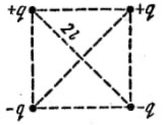
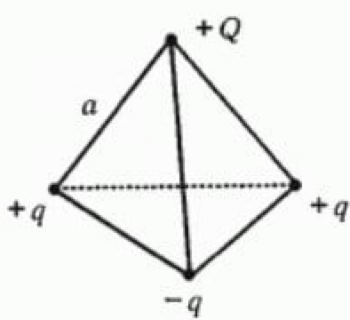

<head>
    
    
</head>

## [MainPage](../index.md)/[Physics](README.md)/HomeWork

## ДЗ1

### 1
В вершинах квадрата с диагональю $2l$ находятся точечные заряды $q$ и $-q$, как показано на рис 3.1. Найти модуль напряженности электрического поля в точке, отстоящей на расстояние $x$ от центра квадрата и раположенной симметрично относительно вершин квадрата.  
如图 3.1 所示，对角线为 $2l$ 的正方形的顶点是点电荷 $q$ 和 $-q$。 求距正方形中心距离 $x$ 且相对于正方形顶点对称的点处的电场强度模量。

$$E=k\frac{Q}{r^2}=\frac{1}{4\pi\varepsilon_0}\cdot\frac{Q}{r^2}\vec{r_0}$$

### 2

В вершинах тетраэдра расположены четыре заряда (см. рис.). Сторона тетраэдра $a$ Определить силу, действуюшую на заряд $Q$. Заряды считать известными.  
四面体的顶点有四个电荷（见图）。 四面体 $a$ 的一侧。 确定作用在电荷 $Q$ 上的力。 假定费用是已知的。

$$$$