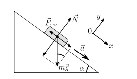

<head>
    
    
</head>

## [主页](../../index.md)/[物理](../README.md)/Lab1.02

# 
Лабораторная работа No 1.02

# 
Изучение скольжения тележки по наклонной плоскости

## Цель работы

1. Экспериментальная проверка равноускоренности движения тележки по наклонной плоскости.
2. Определение величины ускорения свободного падения $g$.

## Введение

Как известно, при поступательном равноускоренном движении тела вдоль оси 0𝑥 зависимость проекции его скорости $v_x$ от времени $t$ определяется выражением:

$$v_x(t)=v_{0x}+a_xt\qquad(1)$$

где  
- $v_{0x}$ - проекция скорости на ось $0x$ в момент времени $t = 0$
- 𝑎𝑥 - ускорение тела. Зависимость координаты тела $x$ от времени $t$ имеет вид:
$$x(t)=x_0+v_{0x}t+\frac{a_xt^2}{2}\qquad(2)$$

Здесь $x_0$ - начальная координата. Если начальная скорость тела равна нулю, то из $(2)$ следует:

$$x_2-x_1=\frac{a}{2}(t_2^2-t_1^2)\qquad(3)$$

Таким образом, существует линейная зависимость между перемещением  $\Delta x=x_2-x_1$ и полуразностью квадратов значений времени $\frac{t_2^2-t_1^2}{2}$ . Коэффициент пропорциональности этой зависимости равен ускорению тела. Если экспериментальный график этой зависимости будет представлять собой прямую линию, то это будет доказательством движения с постоянным ускорением.

В качестве объекта совершающего равнопеременное поступа- тельное движение рассмотрим тележку, скользящую по наклонной плоскости (см. рис.1). Второй закон Ньютона, описывающий ее движение, имеет вид:

$$m\vec{a}=m\vec{g}+\vec{N}+\vec{F_{тр}}\qquad(4)$$

где
- $\vec{a}$ – ускорение тележки
- $\vec{N}$ - сила реакции опоры, 
- а сила трения, возникающая при скольжения, по модулю равна произведению коэффициента трения на силу нормальной реакции: $F_{тр} = \mu N$. Проекции уравнения $(4)$ на координатные оси:

$$\begin{cases}
    0y : 0=N-mg\cos{\alpha}\\
    0x : ma=mg\sin{\alpha}-\mu mg\cos{\alpha}
\end{cases}\qquad(5)$$

где $\alpha$ - угол между наклонной плоскостью и горизонталью. Из $(5)$ следует выражение для модуля ускорения:

$$a=g\sin{\alpha}-\mu g\cos{\alpha}\qquad(6)$$

Pic. 1. Векторная диаграмма сил, действующих на тело, расположенное на наклонной плоскости

Поскольку в лабораторной установке коэффициент трения $\mu$ и угол $\alpha$ достаточно малы, то cos𝛼 в формуле $(6)$ можно заменить единицей. С учетом этого выражение для ускорения будет иметь вид:

$$a=g(\sin{\alpha-\mu})$$

Таким образом, теоретическая зависимость ускорения $\alpha$ от $sin{\alpha}$ является линейной и угловой коэффициент этой зависимости равен ускорению свободного падения $g$.

## Лабораторная установка

Схема экспериментальной установки представлена на Рис.2.

РИС. 2. Общий вид экспериментальной установки

1. Рельс с сантиметровой шкалой на лицевой стороне 
2. Тележка
3. Воздушный насос
4. Источник питания насоса ВС 4-12
5. Опоры рельса
6. Опорная плоскость (поверхность стола)
7. Фиксирующий электромагнит
8. Оптические ворота
9. Цифровой измерительный прибор ПКЦ-3
10. Пульт дистанционного управления прибором ПКЦ-3 11. Линейка – угольник

По рельсу «1» скользит тележка «2». Для уменьшения трения между поверхностями рельса и тележки создается воздушная подушка с помощью воздушного насоса «3», подключенного к источнику питания «4». Электрические провода, подключающие воздушный насос к источнику питания, на рисунке не показаны. Высота рельса над опорной плоскостью «6» регулируется с помощью винтовых ножек опор «5». Электромагнит «7» фиксирует тележку в начале шкалы. Тележка снабжена флажком с черными вертикальными рисками. Цифровой измерительный прибор «9» фиксирует момент времени, скорость и ускорение тележки при прохождении флажка через оптические ворота «8». Запуск тележки и изменение режимов осуществляется пультом дистанционного управления «10». Угольник «11» используется для измерения вертикальной координаты точек рельса.

Характеристики средств измерений приведены в Табл. 1.

Наименование|Предел измерений|Цена деления|Класс точности|$\Delta u$

 s | s | s | s | s 
---|---|---|---|---
Линейка на рельсе|1,3 м|1 см/дел|—|5 мм
Линейка на угольнике|250 мм|1 мм/дел|—|0,5 мм
ПКЦ-3 в режиме секундомера|100 с|0,1 с|—|0,1 с

Таблица 1: Измерительные приборы

## Указания по технике безопасности
1.Не разрешается включать установку в отсутствие преподавателя или лаборанта.
2. Нельзя оставлять без наблюдения лабораторную установку во включенном состоянии.
3. Воспрещается держать насос включённым дольше 2-3 минут. 4. Все электрические провода и кабели должны свободно лежать на столе и не должны быть натянуты.
5.В случае искрения, появления дыма немедленно обесточить установку и сообщить преподавателю или лаборанту.
6.После окончания работы все электроприборы должны быть выключены из сети.

## Порядок выполнения работы

### Задание 1. Измерение времени движения тележки по рельсу с фиксированным углом наклона
1. Установить направляющий рельс горизонтально. Для этого:
   - подключить вилку насоса к блоку питания, соблюдая полярность (положительный контакт насоса помечен белым), выставить рабочее напряжение 6 В, включить источник;
   - поместить тележку на рельс около точки с координатой 0,6 м (приблизительно в середине рельса);
   - вращая винт правой (одиночной) опоры, добиться неподвиж- ности тележки;
   - выключить насос.
2. Установив угольник вертикально на опорной плоскости, изме- рить с его помощью вертикальные координаты $h_0$ и $h_0'$ верхнего края линейки на рельсе, соответственно, в точках $x=0,22 м$ и $x'=1,0 м$. Координаты $x$ и $x'$, а также измеренные величины $h$ и $h_0'$ запишите в Табл. 2 с указанием приборных погрешностей их измерения $\Delta x=\Delta x'=5 мм, \Delta h_0=\Delta h_0'=0.5 мм$
3. Под обе ножки левой опоры подложите одну стандартную пластину толщиной $d\approx 1 см$.
4. Включить прибор ПКЦ-3 тумблером на правой боковой па- нели.
5. На дистанционном пульте управления нажать последовательно три кнопки: «режим работы: 0», «механика: сброс», «индикация: время $t_1, t_2$».

$x,м$ | $x',м$ | $h_0, мм$ | $h_0', мм$
---|---|---|---
 | | | 

6. Установить первые оптические ворота в точке с координатой $x_1 =0,15 м$, а вторые - $x_2 =0,40 м$.
7. Включить блок питания воздушного насоса ВС 4-15.
8. На дистанционном пульте управления нажать кнопку «механика: сброс» на цифровом приборе.
9. Тележку установить в крайнем левом положении и прижать к электромагниту.
10.На дистанционном пульте управления нажать кнопку «механика: пуск». Тележка начнет двигаться и последовательно пройдет левые и правые оптические ворота. На дисплее прибора ПКЦ-3 отразятся промежутки времени $t_1$ и $t_2$ от начала движения до прохождения ворот. Величины $x_1 , x_2 , t_1 , t_2$ внесите в Табл. 3 (см. Приложение 1).
11. Выключите блок питания воздушного насоса ВС 4-15.
12. Установить вторые оптические ворота последовательно в точках $x_2 = 0,50; 0,70; 0,90; 1,10 м$ и для каждого положения оптических ворот выполнить пункты 5–11.

### Задание 2. Измерение времени движения тележки по рельсу при разных углах наклона рельса к горизонту

1. Установить первые оптические ворота в точке с координатой $x_1 =0,15 м$, а вторые – $x_2 =1,10 м$.
2. Под ножки левой опоры положить одну стандартную пластину.
3. Установив угольник вертикально на опорной плоскости, измерить с его помощью вертикальные координаты $h$ и $h'$ верхнего края шкалы, соответственно, в точках $x = 0,22$ м и $x' = 1,00 м$. Значения вертикальных координат занести в Табл. 4 (см. Приложение).
4. Включить блок питания воздушного насоса ВС 4-15.
5. На дистанционном пульте управления нажать кнопку «механика: сброс» на цифровом приборе.
6. Тележку установить в крайнем левом положении и прижать к
электромагниту.
1. На дистанционном пульте управления нажать кнопку «механика: пуск». Тележка начнет двигаться, и последовательно пройдет левые и правые оптические ворота.
2. На дисплее прибора ПКЦ-3 отразятся промежутки времени $t_1$ и $t_2$ от начала движения до прохождения ворот. Величины $t_1$, $t_2$ занести в Табл. 4. Повторить еще четыре раза измерения $t_1$ и $t_2$. Результаты также занести в Табл. 4
3. Выключите блок питания воздушного насоса ВС 4-15.
4.  Последовательно увеличивая число пластин под ножками левой опоры до пяти, для каждого набора пластин выполнить пункты 3-9, записывая результаты в Табл. 4.
11. После окончания всех измерений выключить прибор ПКЦ-3 тумблером на правой боковой панели.

## Обработка результатов измерений

### Задание 1. Исследование движения тележки при фиксированном угле наклона рельса. Проверка равноускоренности движения тележки

1. По результатам прямых измерений из Табл. 3 рассчитайте величины $Y=x_2 − x_1$ и $Z = \frac{t_2^2-t_1^1}{2}$ и их погрешности (см. раздел «Погрешности косвенных измерений» в пособии «Обработка экспериментальных данных» из списка литературы). Запишите полученные значения и погрешности в ту же таблицу.
2. Теоретическая зависимость $Y$ от $Z$ в соответствии с формулой (3) должна иметь линейный вид $Y = aZ$, с угловым коэффициентом равным ускорению. Найденные точки экспериментальной зависимости ${Y_i; Z_i}$ и их погрешности нанесите на график. Правила построения графиков изложены в методическом пособии «Обработка экспериментальных данных» .
3. Найдите ускорение тележки методом наименьших квадратов (МНК). Основы данного метода также приведены в пособии «Об- работка экспериментальных данных».
– Так как теоретическая зависимость $Y=aZ$ проходит через начало координат, то коэффициент $a$ и его среднеквадратическое отклонение (СКО) $\sigma_a$ можно найти⎯по следующим формулам:

$$a=\frac{\sum^N_{i=1}Z_iY_i}{\sum^N_{i=1}Z_i^2};\quad \sigma_a=\sqrt{\frac{\sum^N_{i=1}(Y_i-aZ_i)^2}{(N-1)\sum^N_{i=1}Z_i^2}}$$

где $N$ – количество экспериментальных точек, в данной серии измерений $N = 5$.
– Рассчитайте абсолютную погрешность коэффициента $a$ для доверительной вероятности $\alpha = 0,90$ по формуле:

$$\Delta_a=2\sigma_a$$

– Найдите относительную погрешность ускорения:
$$\varepsilon_a=\frac{\Delta a}{a}\cdot 100%$$
– Полученный доверительный интервал для ускорения приведите в п.12 «Окончательные результаты» вашего отчета по лабораторной работе.
4. Используя найденное значение ускорения 𝑎, постройте график зависимости $Y(Z) = aZ$ на том же рисунке, что и экспериментальные точки ${Y_i; Z_i}$.
5. Сформулируйте и запишите в отчет вывод: можно ли считать движение тележки равноускоренным? В качестве обоснования вывода можно привести ссылку на характер полученного графика, а также на значения абсолютной и относительной погрешностей ускорения.

### Задание 2. Исследование зависмости ускорения тележки от угла наклона рельса к горизонту. Определение ускорения свободного падения

1. Для каждой серии измерений из Табл. 4 вычислите значение синуса угла наклона рельса к горизонту по формуле:

$$\sin{\alpha}=\frac{(h_0-h)-(h_0'-h')}{x'-x}$$

Результаты расчета запишите в Табл. 5 (см. Приложение).
2. Для каждой серии измерений вычислите средние значения времени $t_1$ и $t_2$ и их погрешности (см. раздел «Прямые многократные измерения» в пособии «Обработка экспериментальных данных»).
3. Вычислите значение ускорения и его погрешность для каждой серии измерений по формулам:

$$\langle a\rangle=\frac{2(x_2-x_1)}{\langle t_2\rangle^2-\langle t_1\rangle^2}$$

$$\Delta a=\langle a\rangle\cdot\sqrt{
\frac{(\Delta x_{и2})^2+(\delta x_{и1})^2}{(x_2-x_1)^2}+4\cdot\frac{(\langle t_1\rangle\Delta t_1)^2+(\langle t_2\rangle\Delta t_2)^2}{(\langle t_2\rangle^2-\langle t_1\rangle^2)^2}
}$$

## Контрольные вопросы

1. Дайте определения пути, перемещения, траектории. Каковы принципиальные различия этих понятий?
2. Изобразите графики зависимостей координаты $x(t)$ и проекции скорости $V_x(t)$ для случаев равномерного и равнопеременного прямолинейного движения.
3. В любой момент времени мгновенное и среднее значение скорости равны друг другу. Что в этом случае можно сказать о величине ускорения?
4. В первом случае некоторому телу придали начальную скорость параллельно шероховатой наклонной плоскости в направлении вверх, а во втором случае - вниз. В каком случае модуль ускорения тела будет больше и почему?
5. Изобразите качественный рисунок (чертеж) иллюстрирующий получение формулы (11) данных методических указаний.
6. Как зависит величина силы трения скольжения, действующая на тело находящееся на наклонной плоскости, от угла ее наклона при прочих равных условиях? Изобразите график соответствующей зависимости.
7. Как зависит ускорение свободного падения от географической широты?

    Powered by
    <a href="https://html5up.net">HTML</a>, 
    <a href="https://markdown.com.cn/">markdown</a>, 
    <a href="https://www.latex-project.org/">LaTeX</a>
     
    Copyright © 2022 | 
    <a href="https://tolia-gh.github.io">Tolia</a>
     
    All Rights Reserved.
     

