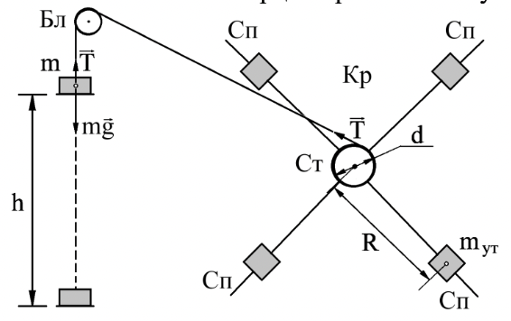
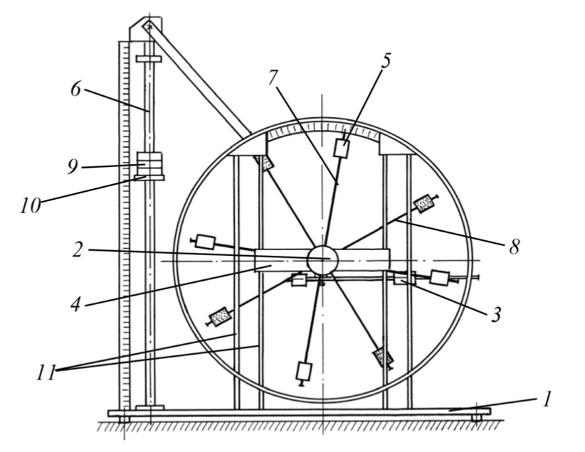
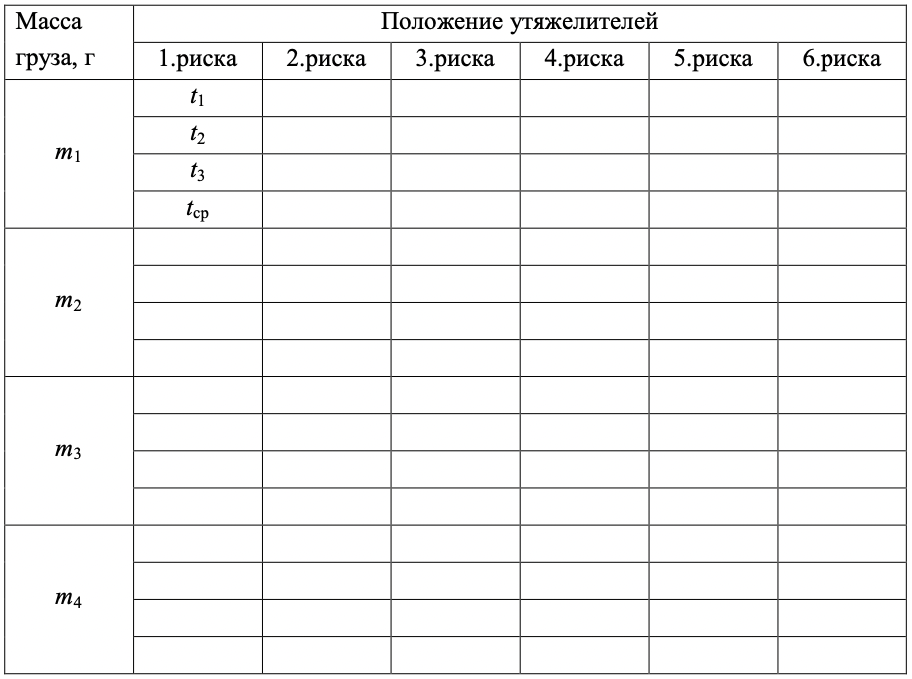
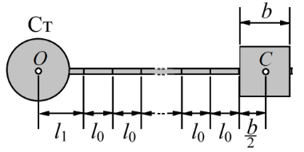

<head>
    
    
</head>

## [主页](../../index.md)/[物理](../README.md)/Lab1.04

# 
Лабораторная работа No 1.04

# 
ИССЛЕДОВАНИЕ РАВНОУСКОРЕННОГО ВРАЩЕТЕЛЬНОГО ДВИЖЕНИЯ (МАЯТНИК ОБЕРБЕКА)

## Цель работы

- Проверка основного закона динамики вращения.
- Проверка зависимости момента инерции от положения масс относительно оси вращения.

## Требуемое оборудование

1. Лабораторный стенд для исследования вращательного движения. 
2. Цифровой секундомер.

## Краткое теоретическое введение

Груз $m$ (см. рис. 1.) подвешен на нити, которая перекинута через неподвижный блок Бл и намотана на ступицу Ст крестовины Кр. В ступице закреплены четыре спицы Сп, на каждой из которых размещен груз– утяжелитель $m_ут$. Расстояние $R$ утяжелителей от оси вращения крестовины одинаково для всех утяжелителей. Это расстояние, можно изменять, изменяя тем самым момент инерции крестовины с утяжелителями.

Рис. 1. Схема измерительного стенда

Груз $m$, опускаясь, раскручивает крестовину. Если пренебречь силой сопротивления воздуха, то груз движется равноускорено под действием векторной суммы силы тяжести mg и силы $T$ натяжения нити. Его ускорение $a$ определяется вторым законом Ньютона:

$$ma=mg-T\qquad(1)$$

Это ускорение можно вычислить по формуле

$$a=\frac{2h}{t^2}\qquad(2)$$

где $h$ расстояние, пройденное грузом за время $t$ от начала движения.

Нить не проскальзывает по ступице, поэтому угловое ускорение $\varepsilon$ крестовины согласовано с линейным ускорением груза. Это угловое ускорение вычисляется по формуле

$$\varepsilon=\frac{2a}{d}\qquad(3)$$

где $d$ диаметр ступицы.

Используя уравнение$(1)$ выразим силу натяжения нити:

$$T=m(g-a)\qquad(4)$$

и найдем момент этой силы:

$$M=\frac{md}{2}(g-a)\qquad(5)$$

Предполагая, что кроме момента силы натяжения на раскручивание крестовины влияет тормозящий момент силы трения, запишем основной закон динамики вращения для крестовины в виде

$$I\varepsilon=M-M_{тр}\qquad(6)$$

Здесь $I$ момент инерции крестовины с утяжелителями.

В соответствии с теоремой Штейнера момент инерции крестовины зависит от расстояния между центрами грузов и осью вращения по формуле

$$I=I_0+4m_{уг}К^2\qquad(7)$$

где $I_0$ сумма моментов инерции стержней крестовины, момента инерции ступицы и собственных центральных моментов инерции утяжелителей.

## Порядок выполнения работы

1. Списать или сфотографировать данные об установке на рабочем месте.
2. Ознакомится с лабораторным стендом (см. рис.2). Отвернуть рукоятку 2 сцепления крестовин, так чтобы передняя крестовина вращалась независимо от задней.
3. Положение каждого утяжелителя на крестовине задается номером риски
(канавки на спице), по которой выравнивается грань утяжелителя, ближайшая к оси вращения. Установить все утяжелители на первую риску
4. Установить в качестве подвешенного груза каретку 10 с одной шайбой 9 . остальные три шайбы 9 закрепить наверху трубчатой направляющей 6. Измерить три раза время прохождения кареткой из неподвижного положения пути от отметки $h1 = 700мм$ до отметки $h2 = 0$. При этом $h = h1 – h2= 700мм$. Массу m1 каретки с одной шайбой и результаты измерения времени t1, t2, t3 занести в соответствующие ячейки таблицы 1.

Рис. 2. Стенд лаборатории механики(общий вид)

1.	основание
2.	рукоятка сцепления крестовин
3.	устройство принудительного трения
4.	поперечина
5.	груз крестовины
6.	трубчатая направляющая
7.	передняя крестовина
8.	задняя крестовина
9.	шайбы каретки
10.	каретка
11.	система передних стоек

Таблица 1. Протокол измерений времени падения груза при разной массе груза и разном положении утяжелителей на крестовине

5. Не изменяя положение утяжелителей крестовины повторить п. 4 для каретки с двумя шайбами (масса $m_2$), тремя шайбами (масса $m_3$) и четырьмя шайбами (масса $m_4$).
6. Повторить измерения пп. 4,5 при положении утяжелителей на второй, третьей, ..., шестой рисках.
7. Найти среднее время падения гири для всех масс гири и всех положениях утяжелителей на крестовине. Для первого значения $t_{ср}$ рассчитать погрешность среднего значения времени $\Delta t$ .
8. Используя найденные значения $t_{ср}$ рассчитать ускорение $a$ груза, угловое ускорение $\varepsilon$ крестовины и момент M силы натяжения нити. Результаты оформить в виде таблицы. Для первых значений $a$, $\varepsilon$ и $M$ вычислить их погрешности и записать соответствующие доверительные интервалы.
9. Для каждого положения утяжелителей на крестовине в координатах $M$(ордината) – $\varepsilon$(абсцисса) на одном рисунке нанести точки найденных зависимостей $M(\varepsilon)$. Отметить значения погрешностей $\Delta\varepsilon$ и $\Delta M$, вычисленные в п. 8, у тех точек, для которых они найдены.
10. Для каждого положения утяжелителей на основе таблицы $M$ и $\varepsilon$ по методу наименьших квадратов (МНК) рассчитать момент $I$ инерции крестовины с утяжелителями и момент силы трения $M_{тр}$. Из формулы $(6)$ следует, что теоретическая связь между моментом силы натяжения нити и угловым ускорением крестовины описывается уравнением

$$M=M_{тр}+I\varepsilon\qquad(8)$$

т.е. зависимость $M(\varepsilon)$ является линейной, а величины $I$ и $M_{тр}$ – коэффициенты этой зависимости. Формулы расчета коэффициентов линейной зависимости по МНК приведены в разделе «6.5. Обработка совместных измерений. Метод наименьших квадратов» пособия «Обработка экспериментальных данных» (см. список литературы).
11. Используя вычисленные в п. 10 значения $I$ и $M_{тр}$ , на том же рисунке , что и точки п. 9., построить графики зависимости (8) для всех положений утяжелителей.
12. Для каждого положения утяжелителей найти расстояние (см. рис.3 ) между осью $O$ вращения и центром $С$ утяжелителя по формуле

$$R=l_1+(n-1)l_0+\frac{1}{2}b\qquad(9)$$

Здесь 
- $l_1$ – расстояние от оси вращения до первой риски;
- $n$ – номер риски, на которой установлены утяжелители; 
- $l_0$ – расстояние между соседним рисками; 
- $b$ – размер утяжелителя вдоль спицы. Вычислить $R^2$.

Рис. 3. К определению расстояния от центра груза-утяжелителя до оси вращения.

13. Объединить значения $R, R^2, I$ в таблицу и на основе этой таблицы в координатах $I$(ордината) – $R^2$(абсцисса) отметить экспериментальные точки зависимости $I(R^2)$.
14. На основе найденных значений $I$ и $R^2$ с помощью МНК определить значения $I_0$ и $m_{ут}$ , а также их погрешности $\Delta I_0$ и $\Delta m_{ут}$. В соответствии с формулой $(7)$ величина $I_0$ –свободное слагаемое в линейной зависимости $I(R^2)$, $m_{ут}$ – четверть от углового коэффициента наклона этой зависимости. Формулы расчета по МНК коэффициентов линейной зависимости и их погрешностей приведены в разделе «6.5. Обработка совместных измерений. Метод наименьших квадратов» пособия «Обработка экспериментальных данных» (см. список литературы).
15. Построить график зависимости (7), используя значения $I_0$ и $m_{ут}$, вычисленные в п. 14, на том же рисунке, что и точки п. 13.

## Литература

1. Детлаф А. А., Яворский Б. М. Курс физики.— 8-е изд., стер. — М. : Издательский центр "Академия", 2009 .
2. Курепин В.В., Баранов И.В. Обработка экспериментальных данных: Методические указания к лабораторным работам. – СПб, 2003.–57 с.

    Powered by
    <a href="https://html5up.net">HTML</a>, 
    <a href="https://markdown.com.cn/">markdown</a>, 
    <a href="https://www.latex-project.org/">LaTeX</a>
     
    Copyright © 2022 | 
    <a href="https://tolia-gh.github.io">Tolia</a>
     
    All Rights Reserved.
     

