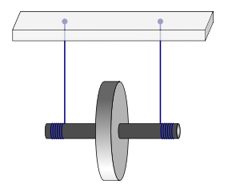
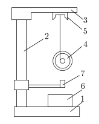
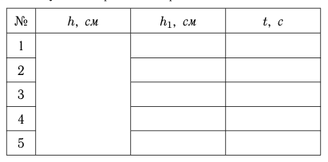

<head>
    
    
</head>

## [MainPage](../../index.md)/[物理](../README.md)/Lab1.07

# 
Лабораторная работа No 1.07

# 
Изучение движения маятника Максвелла

## Цель работы

Определение момента инерции твердого тела на основе законов равноускоренного движения.

## Введение

Маятник Максвелла состоит из массивного диска (маховика) и относительно тонкой оси. Маятник подвешивается на двух прочных нитях, концы которых закреплены на оси. Для наблюдения за движением маятника нити наматывают симметричным образом на ось. При этом маятник поднимается из нижнего положения на некоторую высоту $h$.

РИС. 1. Общий вид маятника Максвелла

Когда маятник опускается, его потенциальная энергия переходит в кинетическую. В нижней точке, если пренебречь потерями энергии на трение, имеем:

$$W_v+W_\omega+\Delta U=0\qquad(1)$$

где
- $\Delta U$ - изменение потенциальной энергии маятника в поле силы тяжести
- $W_v$ - кинетическая энергия, связанная с движением центра масс маятника
- $W_\omega$ - кинетическая энергия вращения вокруг оси симметрии.

Далее из нижней точки маятник за счет своей кинетической энергии опять поднимется на некоторую высоту $h1$. Таким образом, в течение некоторого времени его движение будет иметь квазипериодический характер.

Используя известные выражения для энергий $U$, $W_v$ и $W_\omega$ соотношение $(1)$ можно переписать в виде:

$$mgh=\frac{mv^2}{2}+\frac{I\omega^2}{2}\qquad(2)$$

где 
- $m$ – масса маятника
- $h$ - начальная высота подъема
- $g$ - ускорение свободного падения
- $I$ - момент инерции маятника относительно оси его вращательного движения
- $v$ - скорость в нижней точке
- $\omega$ - угловая скорость в нижней точке. 

Величина $I$ является аналогом массы при вращательном движении и зависит от распределения массы тела относительно оси вращения. По причине нерастяжимости нити линейная и угловая скорости связаны соотношением:

$$v=\omega r\qquad(3)$$

где
- $r$ - радиус оси маятника

Полагая, что маятник опускается с постоянным ускорением $a$, имеем:

$$v=at;\quad h=\frac{at^2}{2}\qquad(4)$$

Отсюда, исключая $a$, получаем:

$$v=\frac{2h}{t}\qquad(5)$$

Подставляя $(5)$ и $(3)$ в $(2)$, находим соотношение для $I$ через измеряемые величины:

$$I=mr^2(\frac{gt^2}{2h}-1)\qquad(6)$$

Более строгий подход к определению величины $I$ требует учета потерь энергии в системе за счет трения, а также других причин, в частности, неупругих процессов, связанных с растяжением нити. Если измерить высоту подъема $h_1$ маятника после однократного опускания, то из закона сохранения энергии имеем:

$$mgh-mgh_1=M(\varphi+\varphi_1)\qquad(7)$$

где
- $M - момент сил трения
- $\varphi$ и $\varphi_1$ - полные углы поворота маятника при спуске и подъеме

В левой части $(7)$ записана потеря полной энергии за первый цикл колебаний, а в правой - работа против сил сопротивления при спуске и подъеме маятника. Тогда (2) следует переписать в виде:

$$mgh=M\varphi+\frac{mv^2}{2}+\frac{I\omega^2}{2}\qquad(8)$$

Учитывая, что

$$\frac{\varphi}{\varphi+\varphi_1}=\frac{h}{h+h_1}\qquad(9)$$

из $(7)$ находим:

$$M\varphi=mgh\cdot\frac{h-h_1}{h+h_1}\qquad(10)$$

Подставляя $(10)$ в $(8)$ и используя $(3)$ и $(5)$, получаем более точное, по сравнению с $(6)$ выражение для расчета момента инерции маятника:

$$I=mr^2(\frac{gt^2}{h}\cdot\frac{h_1}{h+h_1}-1)\qquad(11)$$

## Лабораторная установка

Схема экспериментальной установки представлена на Рис.2.

РИС. 2. Схема лабораторной установки

1. Основание стенда
2. Опорная колонка
3. Кронштейн
4. Маятник Максвелла
5. Фиксирующий электромагнит 
6. Электронный секундомер
7. Фотоэлектрический датчик

На основании «1» закреплена колонка «2», на которой находится кронштейн «3», к нему подвешен маятник Максвелла «4». На кронштейне находится фиксирующий электромагнит «5», удерживающий маятник в поднятом положении. Высота подъема h измеряется по миллиметровой шкале, закрепленной на колонке «2». Время опускания фиксируется электронным секундомером «6». При нажатии на кнопку «ПУСК» маятник освобождается, и одновременно с этим запускается секундомер. Для остановки секундомера в момент прохождения маятником нижнего положения служит фотоэлектрический датчик «7».

## Порядок выполнения работы

1. Установите фотоэлектрический датчик так, чтобы маятник в нижнем положении перекрывал окно фотоэлемента.
2. Включив установку, нажмите клавишу «СБРОС». На ось маятника намотайте нити подвеса так, чтобы маятник в верхнем положении удерживался электромагнитом. Запишите значение $h$.
3. Нажмите клавишу «ПУСК». Наблюдая за движением маятника, зафиксируйте максимальную высоту $h_1$, на которую он поднимется после первого спуска. Запишите показания секундомера $t$.
4. Повторите пп. 2-3 пять раз, внося результаты измерений в Табл. 1 (см. Приложение).
5. Измерьте штангенциркулем диаметры оси $d = 2r$ и маховика маятника $D = 2R$ в нескольких точках и внесите в протокол измерений его массу $m$, указанную на установке.

## Обработка результатов измерений

1. При оформлении отчета рассчитайте момент инерции $I$ по формулам $(6)$ и $(11)$, используя усредненные данные прямых измерений.
2. Из формулы $(11)$ можно получить выражение для относительной погрешности значения момента инерции:

$$\frac{\Delta I}{I}=\sqrt{(\frac{\Delta m}{m})^2+(2\frac{\Delta r}{r})+(\frac{\Delta A}{A})}\qquad(12)$$

где

$$A=\frac{gt^2}{h}\cdot\frac{h_1}{h+h_1}-1\qquad(13)$$

Тогда, пренебрегая относительными погрешностями значений ускорения свободного падения $\frac{\Delta g}{g}$ и полного пройденного пути за первый цикл колебаний $\frac{\Delta(h+h_1)}{h+h_1}$, получаем:

$$\frac{\Delta A}{A}=\sqrt{(2\frac{\Delta t}{t})^2+(\frac{\Delta h}{h})+(\frac{\Delta h_1}{h_1})}\qquad(14)$$

3. Рассчитайте погрешность определения $I$ с помощью формул $(12)$ и $(14)$. При расчете следует учесть, что, из геометрических соображений, $\frac{\Delta R}{R}=\frac{\Delta d}{d}$. Величина $\Delta t$ оценивается по результатам многократных измерений $t$. В погрешность значения диаметра $\Delta d$ дают вклад как погрешность многократных прямых измерений, так и приборная погрешность штангенциркуля.

4. Из-за малости диаметра оси маятника по сравнению с диаметром его диска в первом приближении можно считать, что вся масса маятника сосредоточена в диске и, используя известное выражение для момента инерции однородного цилиндра

$$I=\frac{mR^2}{2}\qquad(15)$$

можно независимым образом оценить величину момента инерции маятника Максвелла. Сравните результат данного расчета со значением, полученным в результате обработки данных прямых измерений. Результат сравнения отразите в выводах по лабораторной работе.

## Результаты лабораторной работы

1. Значение момента инерции маятника, рассчитанное двумя способами, с помощью формул $(6)$ и $(11)$.
2. Доверительный интервал для значения $I$, полученного по формуле $(11)$, с указанием относительной погрешности.
3. Результат сравнения экспериментального и расчетного значения, полученного по формуле $(15)$.

## Контрольные вопросы

1. Что происходит с энергией системы в процессе движения маятника Максвелла?
2. Чем определяется момент сил, действующих на маятник Максвелла?
3. Как изменится ускорение маятника Максвелла, если увеличить радиус его оси?
4. Как изменится ускорение маятника Максвелла, если увеличить радиус его диска при неизменной массе?
5. Каким будет примерный вид графиков зависимости импульса и момента импульса маятника Максвелла от времени?

## Список литературы

1. Курепин В.В., Баранов И.В. **Обработка экспериментальных данных**: Учеб.-метод. пособие - СПб.: НИУИТМО; ИХиБТ, 2012.
2. Боярский К.К., Смирнов А.В., Прищепенок О.Б. **Механика. Ч.1: Кинематика, динамика**: Учеб.-метод. пособие - СПб.: Ун верситет ИТМО, 2019. [https://books.ifmo.ru/book/2223](https://books.ifmo.ru/book/2223)

## Приложение

Таблица 1: Результаты прямых измерений

    Powered by
    <a href="https://html5up.net">HTML</a>, 
    <a href="https://markdown.com.cn/">markdown</a>, 
    <a href="https://www.latex-project.org/">LaTeX</a>
     
    Copyright © 2022 | 
    <a href="https://tolia-gh.github.io">Tolia</a>
     
    All Rights Reserved.
     

