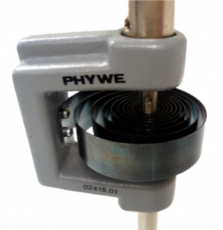
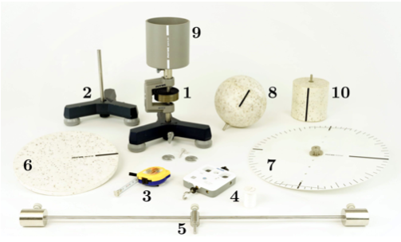
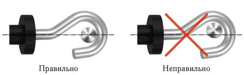
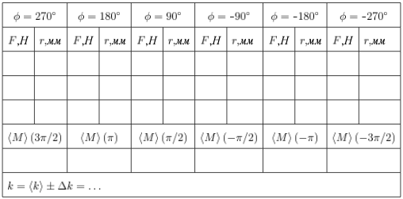

<head>
    
    
</head>

## [主页](../../index.md)/[物理](../README.md)/Lab1.09

# 
Лабораторная работа No 1.09

# 
Определение момента инерции методом крутильных колебаний

## Цель работы

1. Определение момента инерции различных твердых тел методом крутильных колебаний.
2. Проверка справедливости теоремы Гюйгенса-Штейнера.

## Задачи

1. Измерение коэффициента угловой жесткости спиральной пружины.
2. Прямые измерения периодов крутильных колебаний тел различной формы.
3. Расчет моментов инерции объектов измерения и сравнение их с теоретическими значениями.

## Введение

При описании динамики вращения твердых тел используется понятие момента инерции. Момент инерции тела – мера инертности твердых тел при вращательном движении. Данная физическая величина аналогична понятию массы при совершении телом поступательного движения. Если масса характеризует свойства объекта сохранять свою линейную скорость или сопротивляться ее изменению, то момент инерции определяет насколько быстро может изменяться угловая скорость тела при наличии внешнего момента сил. Строгое математическое определение этого понятия для системы из $n$ материальных точек звучит следующим образом: моментом инерции относительно некоторой оси называется скалярная физическая величина $I$, равная сумме произведений масс точек $m_i$ на квадраты расстояний от них до данной оси:

$$I=\sum^n_{i=1}m_ir_i^2\qquad(1)$$

В случае непрерывного распределении массы по объему 𝑉 некоторого твердого тела для вычисления момента инерции используется не суммирование по элементам системы, а интегрирование по объему:

$$I=\int_Vr^2_\perp{\rm d}m=\int_V\rho(\vec{r})r^2_\perp{\rm d}V\qquad(2)$$

где
- $\rho(\vec{r})$ — значение плотности тела в окрестности точки с радиус- вектором $\vec{r}$, а ${\rm d}m=\rho {\rm d}V$ масса малого элемента тела объемом ${\rm d}V$, отстоящего от выбранной оси на расстояние $r_\perp$.

Момент инерции зависит от распределения массы в пределах объема тела и является аддитивной величиной, т.е. полный момент инерции тела относительно некоторой оси равен сумме моментов инерции всех частей тела относительно той же оси.

Для нахождения момента инерции в определенных ситуациях удобно использовать теорему Гюйгенса-Штейнера, которая формулируется следующим образом: если момент инерции тела относительно некоторой оси вращения, проходящей через центр масс, имеет значение $I_c$, то относительно любой другой оси, находящейся на расстоянии $l$ от первой и параллельной ей, он будет равен

$$I=I_c+ml^2\qquad(3)$$

где $m$ - масса тела.

Для проверки теоремы Гюйгенса-Штейнера в данной лабораторной работе есть возможность изменять расстояние $l$, когда в качестве объекта измерений используется система из двух грузов на горизонтальной штанге или сплошной диск.

Экспериментальное определение момента инерции может быть выполнено с помощью крутильных колебаний — процесса, в котором объект периодически изменяет свое угловое положение относительно некоторой неподвижной оси под действием упругих сил.

РИС. 1. Спиральная пружина

Ключевым элементом лабораторной установки является спиральная пружина (см. Рис. 1) при деформации которой возникает необходимый для возникновения колебаний возвращающий момент сил. Один конец пружины прикреплен к неподвижному основанию, а другой к оси, которая может вращаться относительно основания. На оси можно устанавливать объекты исследования - тела различной формы (диск, шар, цилиндр и т.п.).

Чтобы вывести систему из положения равновесия нужно повернуть исследуемое тело на некоторый угол $\varphi_0$. Тогда спиральная пружина также закручивается на этот угол. Пружина создает возвращающий момент силы $\vec{M}$ , который стремится вернуть систему в состояние равновесия. Под действием этого момента система увеличивает свою угловую скорость и стремится приблизиться к положению равновесия, но по инерции проходит его с максимальной скоростью и отклоняется в противоположную сторону. Далее этот процесс периодически повторяется. Таким образом возникают слабо затухающие крутильные колебания. В данной лабораторной установке можно пренебречь действием диссипативных сил и считать, что потерь энергии в системе за первые несколько периодов колебаний практически нет.

Основное уравнение динамики вращательного движения твердого тела имеет следующий вид:

$$M=I\cdot \varepsilon\qquad(4)$$

где
- $M$ - проекция на ось вращения суммарного момента сил, действующих на тело
- $I$ - момент инерции тела
- $\varepsilon=\frac{ {\rm d}\omega}{ {\rm d}t}$ - его угловое ускорение.

В случае упругого закручивания спиральной пружины возвращающий момент силы 𝑀 прямо пропорционален углу $\varphi$:

$$M=-k\cdot\varphi\qquad(5)$$

где 
- $k$ - коэффициент угловой жесткости. Значение $k$ определяется параметрами самой пружины (ее геометрическими размерами и материалом).

С учетом $(5)$ и определения углового ускорения $\varepsilon=\frac{ {\rm d}^2\omega}{ {\rm d}t^2}$ уравнение $(4)$ примет вид:

$$\frac{ {\rm d}^2\varphi}{ {\rm d}t^2}+\frac{k}{I}\varphi=0\qquad(6)$$

Уравнение $(6)$ описывает незатухающие гарм√︂онические колебаний с собственной циклической частотой $\omega=\sqrt{\frac{k}{I}}$.Его общим решением является функция

$$\varphi(t)=\varphi_0\sin{(\omega t+\theta_0)}\qquad(7)$$

где 
- $\varphi_0$ - амплитуда колебаний
- $\theta_0$ - начальная фаза колебаний

  обе эти величины задаются начальными условиями колебательного процесса. Период колебаний определяется собственными параметрами колебательной системы $I$ и $k$:

$$T=\frac{2\pi}{\omega}=2\pi\sqrt{\frac{I}{k}}\qquad(8)$$

Таким образом, рабочая формула для определения момента инер- ции имеет вид:

$$I=\frac{kT^2}{4\pi^2}\qquad(9)$$

Численное значение параметра $k$ можно определить экспериментально путем измерения момента внешних сил $\vec{M}$, необходимого для создания статического угла закручивания $\varphi$. Закрепим на оси вращения штангу и приложим к ней внешнюю силу $\vec{F}$, в направлении перпендикулярном как к оси вращения, так и к самой штанге. Определим величину силы $F$ с помощью динамометра и измерим угол отклонения $\varphi$. С учетом общего определения момента силы $M=r_\perp\cdot F$, где $r_\perp$ - расстояние от оси вращения до линии действия силы, получим для коэффициента угловой жесткости рабочую формулу

$$k=\left|\frac{M}{\phi}\right|=\left|\frac{r_\perp\cdot F}{\phi}\right|\qquad(10)$$

Так как исследуемое тело является частью механической системы «тело + штанга», то для того, чтобы получить собственный момент инерции тела $I_0$, нужно вычесть из значения $I$ момент инерции самой штанги $I_{rod}$, который должен быть найден отдельно: $I_0 = I − I_{rod}$.

При получении рабочей формулы $(9)$ предполагалось, что ко- эффициент 𝑘 является некоторой постоянной величиной, которая не зависит от угла закручивания пружины. Но даже в случае, когда уравнение $(5)$ выполняется лишь приблизительно и связь между моментом возвращающей силы и углом закручивания пружины не является линейной, при колебаниях постоянной амплитуды квадрат их периода будет пропорционален моменту инерции. Покажем это, используя энергетический подход к рассмотрению процесса крутильных колебаний. Кинетическая энергия вращаю- щегося тела равна

$$E_K(\omega)=\frac{I\omega^2}{2}\qquad(11)$$

а потенциальная энергия деформации пружины:

$$E_P(\varphi)=\int_0^\varphi M(\tilde{\varphi}){\rm d}\tilde{\varphi}\qquad(12)$$

Если затухание достаточно мало, то в течение нескольких первых периодов колебаний будет выполняться закон сохране- ния энергии:

$$E_K{\omega}+E_P(\varphi)=E=Const\qquad(13)$$

где
- $E$ - полная механическая энергия колебательной системы. Из $(13)$ можно получить уравнение связи между угловой скоростью $\omega$ и углом поворота $\varphi$:

$$\omega(\varphi)=\sqrt{\frac{2(E-E_P(\varphi))}{I}}\qquad$$

Период колебаний найдем, вычисляя время поворота груза из положения равновесия в крайнее (амплитудное) положение:

$$T=4\int_0^{\varphi_0}{\rm d}t=4\int_0^{\varphi_0}\frac{ {\rm d}\varphi}{\omega(\varphi)}=\sqrt{I}\int_0^{\varphi_0}\frac{4{\rm d}\varphi}{\sqrt{2(E-E_P(\varphi))}}\qquad(15)$$

Подынтегральное выражение в $(15)$ зависит только от угла $\varphi$, обозначив $F$ его первообразную, получаем окончательное уравнение:

$$T=\sqrt{I}(F(\varphi_0)-F(0))\qquad(16)$$

Разность в скобках зависит только от амплитуды колебаний, следовательно, при фиксированной амплитуде квадрат периода колебаний строго пропорционален моменту инерции вращающегося тела, вне зависимости от линейности упругих свойств пружины.

## Экспериментальная установка

РИС. 2. Состав лабораторной установки

На Рис. 2 показан комплект оборудования, входящий в состав лабораторной установки.

1. штатив со спиральной пружиной 02415.01
2. штатив для крепления электронного динамометра 02002.55 3. рулетка 09936.00
4. электронный динамометр 12943.00
5. штанга с двумя подвижными грузами 02415.06
6. сплошной диск 02415.03
7. диск с отверстиями 02415.07
8. шар 02415.02
9. полый цилиндр 02415.04
10. сплошной цилиндр 02415.05

## Проведение измерений

Для получения данных от электронного динамометра в процессе проведения измерений необходимо наличие на вашем мобильном устройстве адаптера Bluetooth и специального программного обеспечения «PHYWE Measure APP». Загрузить его можно по следующим ссылкам:

При выполнении измерений следует строго соблюдать общие требования по технике безопасности и охране труда, а также указания по проведению данной работы, находящиеся на рабочем месте студента в лаборатории.

Измерьте на лабораторных весах массы всех объектов исследования (шар, два цилиндра, два диска, штанга, 2 съемных груза). С помощью рулетки определите диаметры всех объектов, длину штанги, расстояние между отверстиями на диске и высоту цилиндрических грузов. Результаты измерений внесите в рабочий протокол в раздел «Рабочие формулы и исходные данные».

## Определение коэффициента угловой жесткости пружины

1. Установите на штатив со спиральной пружиной штангу, так чтобы ось вращения находилась на равном расстоянии от ее концов. Закрепите электронный динамометр на свободном штативе так, чтобы осевая линия его крюка находилась в одной и той же горизонтальной плоскости с осью штанги (см. Рис. 3).

РИС. 3. Расположение крюка динамометра относительно штанги

2. Нажав кнопку управления питанием на корпусе электронного динамометра и, удерживая ее в нажатом состоянии в течении 5 секунд, включите его. После этого правый светодиод на корпусе должен начать мигать красным цветом, что означает готовность прибора к установлению Bluetooth-соединения.
3. Включите адаптер Bluetooth на своем мобильном устройстве. Запустите приложение «PHYWE Measure APP». Перейдите в приложении в раздел главного меню «Датчики» и в пункте «Устройства» выберите опцию «SMARTsense-331E-Force and Acceleration» (после установления соединения цвет индикаторного светодиода должен изменится на зеленый) и установите режим работы данного датчика как «**Force**».

РИС. 4. Внешний вид динамометра

4. В пункте меню «Конфигурация» установите частоту выборки данных равной **100 Гц** (**100 Hz**). В пункте «Среднее значение» установите слайдер на позицию **50**. Активируйте check-box в пункте «**Установить на ноль**». Тип измерения должен быть уста- новлен как «**Непрерывно**».

РИС. 5. Основное окно приложения «PHYWE MeasureAPPà»

5. В разделе главного меню «Настройки» в пункте «Знаки после запятой» установите значение «.000». В разделе «Измерения» выберите числовой режим отображения информации (см. Рис. 5).
6. Поверните штангу на штативе на три четверти полного оборота по часовой стрелке (угол закручивания пружины: 𝜑 = 270∘) и надвиньте на ее правую половину крюк динамометра, так чтобы он находился на расстоянии 1-2 см от ее торца. Проверьте точность установки динамометра по высоте на штативе (Рис. 3). Внесите показания динамометра с точностью до двух разрядов после десятичного разделителя в Таблицу 1 (см. Приложение). С помощью рулетки измерьте расстояние от оси вращения до точки приложения силы (плечо силы 𝑟⊥) и также внесите его в таблицу протокола измерений.
7. Аккуратно переместите штатив с динамометром ближе к оси примерно на треть исходного расстояния до нее, проведите измерения аналогично предыдущему пункту. Последовательно смещая динамометр к оси вращения, получите серию из трех измерений для различных значений плеча приложения силы.
8. Проведите подобные измерения для углов закручивания пружины 180∘, 90∘, −90∘, −180∘, −270∘. В последних трех случаях штанга поворачивается против часовой стрелки, а крюк динамометра размещается на ее левой половине. Полностью заполните Таблицу 1. Аккуратно снимите динамометр со штанги и выключите его, удерживая нажатой кнопку управления в течении 5 секунд.

## Проверка теоремы Гюйгенса-Штейнера. Моменты инерции тел различной формы.

1. Отклоните штангу на угол 180∘ относительно равновесного положения и отпустите ее. С помощью секундомера определите время, соответствующее трем полным периодам колебаний $\tau_3$. Найдите величину периода колебаний штанги без грузов $T_1=\frac{\tau_3}{3}$ и внесите ее в рабочий протокол.
2. Проведите серию из трех последовательных аналогичных запусков штанги и вычислите среднее значение периода колебаний $\langle T\rangle = \frac{T_1+T+T_3}{3}.$
3. Закрепите на штанге два подвижных груза так, чтобы их центры масс находились на равных расстояниях $l = 5\div7$ см от оси вращения. В этом случае полный момент инерции системы будет состоять из суммы центральных моментов инерции штанги и двух грузов $I_{rod}+2I_c$ и слагаемого из теоремы Гюйгенса-Штейнера $2ml^2$.
   
  $$I(l)=I_{rod}+2I_c+eml^2\qquad(17)$$
  
  Проведите измерение времени трех последовательных колебаний штанги с грузами. Расстояние от оси вращения и период колебания внесите в Таблицу 2.
4. Увеличивая расстояние от грузов на штанге от оси вращения приблизительно на $\Delta l = 2$ см проведите серию из 5-7 измерений для получения зависимости периода колебаний от положения грузов.
5. Выберите в качестве объекта измерений диск с отверстиями и, изменяя его положение на оси вращения, проведите серию измерений периода колебаний аналогично пп. 3-4. В Таблицу 3 вносите значения периода колебаний и расстояния между центром масс диска и осью вращения.
6. Для каждого тела сложной формы (сплошной и полый цилиндры, шар и сплошной диск) проведите серию из трех независимых измерений периода колебаний $T$, заполнив Таблицу 4. Как и в предыдущих случаях рекомендуется измерять время трех полных колебаний объектов $\tau_3$.

## Обработка результатов

1. Используя данные Таблицы 1, найдите среднее значение момента силы для каждого угла закручивания пружины:

$$\langle M(\phi)\rangle=\frac{1}{3}\sum^3_{i=1}F_i(\phi)r_i(\phi)\qquad(18)$$

  Для отрицательных значений угла поворота величину момента также следует считать отрицательной.
2. Добавив в имеющийся набор данных точку $M(0) = 0$, постройте график зависимости момента силы от угла закручивания пружины. Значение угла $\varphi$ на данном графике укажите в радианах. Визуально оцените линейность графика $M = M(\varphi)$.
3. С помощью любого известного вам метода нахождения параметров линейной зависимости (парных точек, МНК) найдите угловой коэффициент этого графика (как следует из соотношения (5) он равен коэффициенту угловой жесткости) и оцените его погрешность. Внесите значение найденного коэффициента с его погрешностью $𝑘\pm \Delta k$ в отчет по лабораторной работе.
4. С помощью рабочей формулы $(9)$, найденного ранее значения коэффициента угловой жесткости $k$ и измеренного периода колебаний штанги без грузов вычислите собственный центральный момент инерции штанги относительно оси вращения $I_{rod}$. Оцените величину его погрешности по следующей формуле:

$$\Delta I_{rod}=I_{rod}\sqrt{(\frac{\Delta k}{k})^2+(\frac{2\Delta T}{T})^2}\qquad(19)$$

где погрешность определения периода колебаний может быть оценена как полуразность между максимальным и минимальным значением в серии измерений периода колебаний $T_1,T_2,T_3$:

$$\Delta T=\frac{T_{max}-T_{min}}{2}\qquad(20)$$

Сравните полученное в эксперименте значение момента инерции штанги с его теоретическим значением (см. Таблицу 5 из Приложения).

5. По данным Таблицы 2 постройте график зависимости квадрата периода колебаний системы «штанга + грузы» $T^2$ от квадрата расстояния $l^2$. Убедитесь, что данная зависимость имеет линейный характер. Найдите параметры полученного графика: его угловой коэффициент:

$$\alpha=\frac{8\pi^2}{k}(I_{rod}+2I_c)\qquad(22)$$

6. Зная величины $\alpha,I_{rod},k$ и используя соотношения $(21)$ и $(22)$, найдите массу 𝑚 каждого из подвижных грузов (сравните ее значение с результатом прямых измерений) и их собственный центральный момент инерции $I_c$ относительно оси перпендикулярной к оси их симметрии. Сравните полученную величину момента $I_c$ с его теоретическим значением:

$$I_c=m(\frac{r^2}{4}+\frac{h^2}{12})\qquad(23)$$

где
- $r$ - радиус груза
- $h$ - его высота.

7. По данным Таблицы 3 для диска с отверстиями проведите аналогичные построения и вычисления. Найдите массу и собственный центральный момент инерции диска. Сравните значение массы диска с результатом прямых измерений, а величину момента с его теоретическим значением $I=\frac{mr^2}{2}$ (см. Таблицу 5).

8. Для всех остальных тел (шар, сплошной диск, полый и сплошной цилиндры) по данным Таблицы 4 найдите центральные моменты инерции с помощью соотношения $(9)$. Оцените погрешности полученных результатов. Вычислите теоретические моменты инерции всех тел, внесите их значения в последнюю колонку Таблицы 4 и сравните их с экспериментальными.

В отчет по лабораторной работе должны входить:

- заполненные рабочие таблицы 1-4,
- коэффициент угловой жесткости пружины с оценкой его погрешности,
- графики зависимостей квадрата периода колебаний для штанги с грузами и для диска с отверстиями,
- расчетные (теоретические) и экспериментальные значения центральных моментов инерции всех объектов работы с оценкой их погрешности,
- величины масс штанги и диска с отверстиями, как результаты их прямых и косвенных измерений,
- аргументированные выводы о линейности характера упругих свойств спиральной пружины и справедливости теоремы Гюйгенса-Штейнера.

## Контрольные вопросы

1. Что такое момент инерции твердого тела? В каких единицах он измеряется?
2. От каких параметров зависит момент инерции твердого тела?
3. Что называют крутильными колебаниями? От чего зависит их период?
4. Как формулируется основной закон динамики вращательного движения твердого тела?
5. Как соотносятся между собой средние значения кинетической энергии твердого тела и потенциальной энергии деформации пружины в процессе крутильных колебаний?
6. В каких единицах в данной работе измеряется модуль кручения пружины?
7. Какие физические законы использовались для вывода формулы $(6)$?
8. Выведите формулу для момента инерции однородного шара, используя соотношение для момента инерции тонкостенной сферы.
9. Сформулируйте теорему Гюйгенса-Штейнера.
10.Назовите примеры тел, момент инерции которых может меняться во время вращения.
11.Каков момент инерции однородного тонкого диска относительно оси, совпадающей с его диаметром?
12. На крутильный маятник устанавливают штангу (стержень) без грузов. В первом случае ось вращения проходит через ее середину, во втором – через один из концов. Во сколько раз будут отличаться периоды крутильных колебаний?

## Приложение

Таблица 1: Определение коэффициента угловой жесткости пружины

|$l, мм$ | $T_1, c$ | $T_2, c$ | $T_3, c$ | $l^2, м^2$ | $\langle T\rangle^2, с^2$| 
|---|---|---|---|---|---|
|-|-|-|-|-|-|
|-|-|-|-|-|-|
|-|-|-|-|-|-|
|-|-|-|-|-|-|
|-|-|-|-|-|-|
|-|-|-|-|-|-|
|-|-|-|-|-|-|

Таблица 2: Теорема Гюйгенса-Штейнера для штанги с грузами

|$l, мм$ | $T_1, c$ | $T_2, c$ | $T_3, c$ | $l^2, м^2$ | $\langle T\rangle^2, с^2$ |
|---|---|---|---|---|---|
|-|-|-|-|-|-|
|-|-|-|-|-|-|
|-|-|-|-|-|-|
|-|-|-|-|-|-|
|-|-|-|-|-|-|
|-|-|-|-|-|-|
|-|-|-|-|-|-|

Таблица 3: Теорема Гюйгенса-Штейнера для диска с отверстиями

Объект | $T_1, c$ | $T_2, c$ | $T_3, c$ | $\langle T\rangle, с$ | $I, кг\cdot м^2$ | $I_T, кг\cdotм^2$  
---|---|---|---|---|---|---
Сплошной диск | - | - | - | - | - | -
Полый цилиндр | - | - | - | - | - | -
Сплошной цилиндр | - | - | - | - | - | -
Шар | - | - | - | - | - | -

Таблица 4: Центральные моменты инерции объектов измерения

 s | s
---|---
Кольцо или цилиндр с тонкими стенками радиуса 𝑟. Ось вращения совпадает с осью симметрии.|$mr^2$
Однородный тонкий стержень длиной $l$. Ось вращения перпендикулярна стержню.|$\frac{ml^2}{12}$
Однородный сплошной диск (цилиндр) радиусом $r$ относительно оси симметрии.|$\frac{mr^2}{2}$
Полый толстостенный цилиндр с внешним радиусом $r_2$ и внутренним радиусом $r_1$ относительно оси симметрии.|$\frac{m}{2}(r_1^2+r_2^2)$
Полый тонкостенный цилиндр высоты h и радиуса $r$. Ось вращения перпендикулярна к оси симметрии.|$\frac{m}{2}(r^2+\frac{h^2}{6})$
Однородный сплошной цилиндр высоты h и радиуса $r$. Ось вращения перпендикулярна к оси симметрии.|$\frac{m}{4}(r^2+\frac{h^2}{3})$
Тонкостенная сфера радиуса $r$.|$\frac{2}{3}mr^2$
Однородный сплошной шар радиуса $r$.|$\frac{2}{5}mr^2$

Таблица 5: Осевые центральные моменты инерции некоторых тел (𝑚 - масса тела)

    Powered by
    <a href="https://html5up.net">HTML</a>, 
    <a href="https://markdown.com.cn/">markdown</a>, 
    <a href="https://www.latex-project.org/">LaTeX</a>
     
    Copyright © 2022 | 
    <a href="https://tolia-gh.github.io">Tolia</a>
     
    All Rights Reserved.
     

