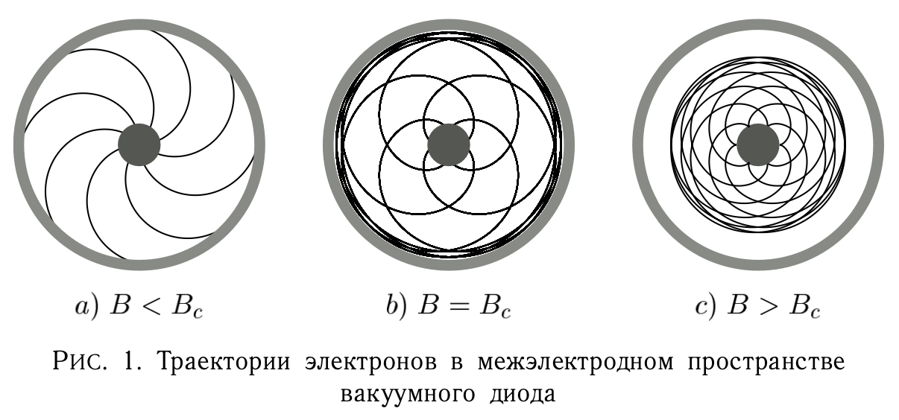
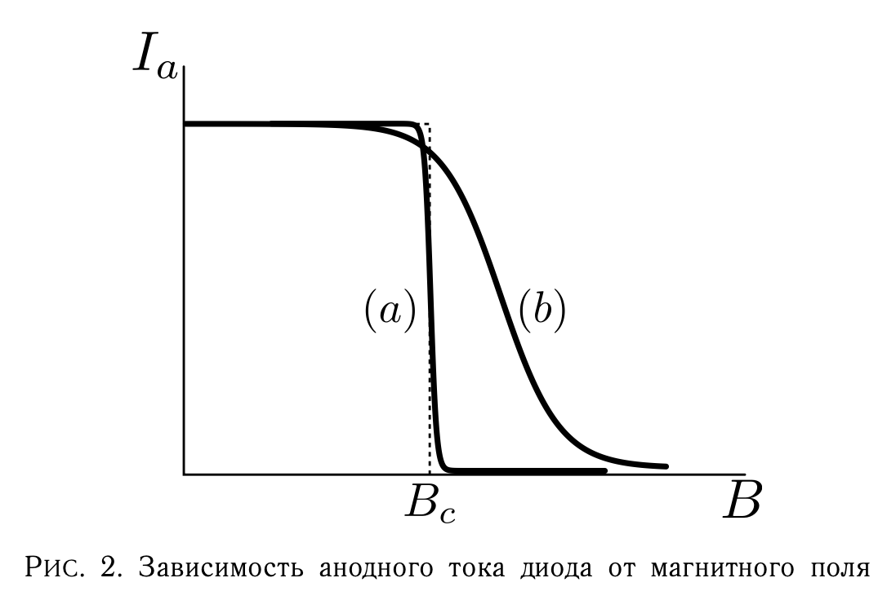
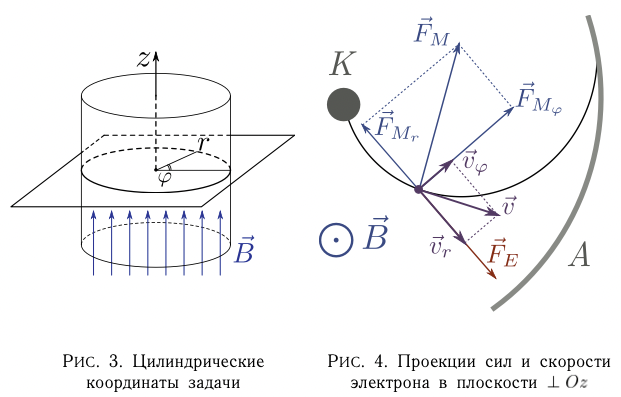
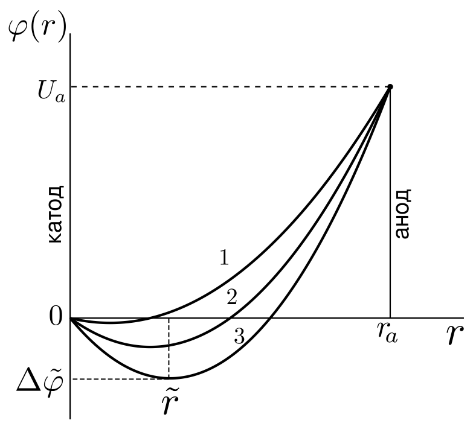
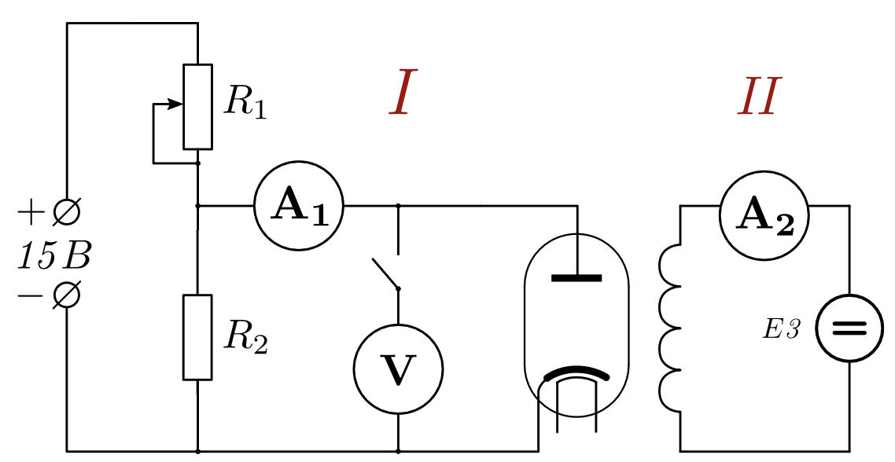

<head>
    
    
</head>

## [MainPage](../../index.md)/[Physics](../README.md)/Lab3.03

# Определение удельного заряда электрона

## Задачи

1. Провести измерения зависимости анодного тока $I_a$ вакуумного диода от величины тока в соленоиде при различных значениях анодного напряжения.
2. Найти значение коэффициента связи между током соленоида и магнитным полем $B$ внутри него.
3. Построить графики зависимостей $I_a$ от $B$ и определить по ним величины критических полей для каждого значения анодного напряжения.
4. По значениям критического поля найти величину удельного заряда электрона и оценить ее погрешность.

## Введение

Удельным зарядом электрона (или какой-либо частицы) называют отношение его заряда к массе: $e/m$. Для измерения $e/m$ методом магнетрона используют характерные особенности движения электронов в скрещенных (взаимно перпендикулярных) стационарных электрическом и магнитном полях. Действие полей на электрон описывается силой Лоренца:

$$\vec{F}_L=\vec{F}_E+\vec{F}_M=-e\vec{E}-e[\vec{v},\vec{B}],\qquad(1)$$

где
- где $\vec{E}$ - вектор напряженности электрического поля
- $\vec{v}$ скорость электрона
- $e$ - модуль его заряда
- $\vec{B}$ - вектор магнитной индукции.

Электрическая часть силы Лоренца изменяет кинетическую энергию электрона, магнитная часть перпендикулярна направлению движения электрона и, не меняя модуля его скорости, изменяет только ее направление.

В данной лабораторной работе движение электронов происходит в вакуумном диоде, в котором катод и анод представляют собой цилиндры с общей осью. Электрическое поле создается внешним источником, обеспечивающим разность потенциалов между катодом и анодом, а магнитное поле – соленоидом, внутрь которого помещен диод. При этом вектор индукции магнитного поля направлен параллельно оси электродов диода. Такая конфигурация электродов и полей является аналогом того, что реализуется в магнетронах – мощных генераторах СВЧ-колебаний, чем и объясняется название данного метода.

При малых значениях индукции магнитное поле слабо искривляет траектории электронов и практически не мешает достигать анода. При больших магнитных полях искривление траектории настолько велико, что электроны не достигают анода (рис.1). Значение магнитной индукции $B_c$, при котором траектория электронов становится касательной к поверхности анода называют критическим.

Значение $B_c$ можно связать с удельным зарядом электрона. При движении электрона от катода к аноду на него действует сила Лоренца (1). Для вычислений воспользуемся цилиндрической системой координат, т.е. будем характеризовать положение точки расстоянием $r$ от оси цилиндра, полярным углом $\varphi$ и смещением вдоль оси $z$ (рис. 3). Записав соотношение (1) в проекциях на оси координат, получим:

$$\begin{split}
    F_r&=e(E-v_\varphi B)\\
    F_\varphi&=ev_rB\\
    F_z&=0
\end{split}\qquad(2)$$

Скорости электрона, электрическая и магнитная составляющие силы и их проекции показаны на рис. 4 в плоскости, перпендикулярной оси $z$. Из (2) следует, что ни электрическая, ни магнитная силы не имеют составляющих по оси $z$. Таким образом, движение электрона вдоль оси $z$ является равномерным. Если начальной скоростью электрона пренебречь, то во всех точках траектории $v_z = 0$.

Магнитная сила совершает нулевую работу и кинетическую энергию электрон получает только от электрического поля. Если потенциал катода принять равной нулю и пренебречь начальной скоростью электронов, то в точке c потенциалом $\varphi$ энергия электрона равна:

$$e\varphi=\frac{mv^2}{2}=m\frac{v_r^2+v_\varphi^2}{2}\qquad(3)$$

Когда значение магнитной индукции достигнет $B_c$, вектор скорости электрона становится касательным к поверхности анода, т.е. $v_r=0$ и

$$eU=\frac{mv_\varphi^2}{2}\qquad(4)$$

где $U$ – потенциал анода относительно катода или анодное напряжение. Компонента $v_\varphi$ скорости электрона возникает за счет магнитного поля. Для нахождения зависимости $v_\varphi=0$ от $B$ решим уравнение моментов:

$$\frac{ {\rm d}\vec{L}}{ {\rm d}t}=\vec{M}\qquad(5)$$

где $\vec{L}=[\vec{r},\vec{p}]$ - момент импульса электрона, $\vec{M}=[\vec{r},\vec{F}]$ момент сил, действующих на него. Так как векторы $\vec{r},\vec{p},\vec{F}$ лежат в плоскости, перпендикулярной $z$, то их векторные произведения, т.е. $\vec{L}$ и $\vec{M}$ , коллинеарны оси $z$. Переходя в (5) к проекциям на ось $z$ и учитывая, что

$$\begin{split}
    L_z=mrv_\varphi\\
    M_z=F_{M_\varphi}=erv_rB\\
    v_r=\frac{ {\rm d}r}{ {\rm d}t}
\end{split}\qquad(6)$$

получим:

$$\frac{ {\rm d}}{ {\rm d}t}mrv_\varphi=eBr^2\frac{ {\rm d}r}{ {\rm d}t}=\frac{1}{2}eB\frac{ {\rm d}r^2}{ {\rm d}t}\qquad(7)$$

Интегрируя (7) по времени получим соотношение вида:

$$mr_\varphi=\frac{1}{2}eBr^2+Const\qquad(8)$$

где значение константы определяется из начальных условий. Если считать, что радиус катода мал по сравнению с расстоянием между катодом и анодом, что соответствует конструкции диода, а движение электроны начинают со скоростей, близких к нулю, то в (8) константу можно положить равной нулю и азимутальная скорость электрона $v_\varphi$ будет прямо пропорциональна расстоянию от катода:

$$v_\varphi=\frac{eB_r}{2m}$$

Подставив этот результат в (4) и имея в виду, что это соотношение выполняется при $r=r_a$ (радиус анода) и $B=B_c$, получим:

$$U=\frac{eB_c^2r_a^2}{8m}$$

что дает в итоге формулу для удельного заряда:

$$\frac{e}{m}=\frac{8U}{B_c^2r_a^2}\qquad(9)$$

Для определения $B_c$ надо исследовать зависимость анодного тока диода $I_a$ от магнитной индукции поля, в которое помещен диод. Из вышеприведенных рассуждений следует, что эта зависимость должна иметь вид ступеньки (рис. 2, пунктирная линия), и это означает, что при $B\lt B_c$ все электроны, вылетевшие из катода, попадают на анод, а при $B\ge B_c$ ток полностью прекращается.

На самом деле, такой строгой отсечки при $B=B_c$ не наблюдается. Можно указать как минимум две физические причины «размытия» ступеньки. Первая - электроны, вылетая из катода, уже имеют ненулевую скорость теплового движения. Различие начальных скоростей электронов обуславливает различные значения $B_c$ для каждого из них. Влияние этого фактора тем меньше, чем больше анодное напряжение и меньше радиус катода.

Вторая причина заключается в том, что при вышеприведенном анализе поведения электронов в скрещенных полях при $B\gt B_c$ мы не принимали в расчет местонахождение электронов, не достигших анода. Эти электроны, накапливаясь в межэлектродном пространстве, создают облако пространственного заряда, проявляющее себя двояко. С одной стороны, они отталкивают электроны, покидающие катод, и заставляют часть из них возвращаться на него, а с другой стороны, они выталкивают электроны из внешней части облака к аноду. Эти процессы совместно обуславливают некоторое ненулевое значение анодного тока при $B\gt B_c$. При $B\lt B_c$ пространственный заряд также существует, что приводит к уменьшению фактического значения тока. Увеличение анодного напряжения или уменьшение температуры катода снижает плотность электронного облака и уменьшает его влияние.

Рассмотрим подробнее влияние пространственного заряда на форму зависимости тока диода $I_a$ от магнитной индукции. Это влияние особенно велико при малых анодных напряжениях и проявляется в возникновении дополнительного потенциального барьера $\Delta\tilde{\varphi}$ для электронов, вылетающих с катода, на расстоянии $\tilde{r}$ от него. Если значение $\tilde{r}$ не является пренебрежимо малым, то константу в формуле (8) уже нельзя считать равной нулю: она будет равна $Const=-\frac{1}{2}eB\tilde{r}^2$ и соответственно:

$$\tilde{B}_c=\frac{1}{r_a^2-\tilde{r}_a^2}\sqrt{\frac{8mU}{e}}\qquad(10)$$

Нетрудно заметить, что при $\tilde{r}\ll r_a$ формула (10) становится идентичной формуле (9), а отличие $\tilde{B}_c$ от $B_c$ будет существенным (порядка 5%) при $\tilde{r}\ge 0.2r_a$. Отметим, что «прогиб» кривой распределения потенциала $\varphi(r)$ и, следовательно, высоты барьера $\Delta\tilde{\varphi}$ зависят не только от анодного напряжения $U$, но и от эмиссионного тока электронов (т.е. тока насыщения или, иначе говоря, от температуры катода). Влияние температуры катода показано на рис. 5). Кривым 1-3 соответствую различные температуры катода, причем $T_3\gt T_2\gt T_1$. Температуре $T_1$ соответствует режим насыщения, а $T_2$ и $T_3$ - режим объемного заряда, причем в этом случае роль потенциального барьера в случае 3 является значительной.

Объемный заряд между катодом и анодом можно увеличить не только за счет увеличения эмиссии электрода (т.е. накала катода), но и задерживая электроны магнитным полем. этом смысле кривые 2 и 3 на рис. 5 можно трактовать как отвечающие условию $B_3\gt B_2\gt B_1$ (при фиксированном напряжении $U$ и температуре катода $T$), а кривой 1 соответствует условие $B_1\lt B_c$.

Используем все эти соображения для объяснения характера зависимости $I_a(B)$ при разных режимах работы вакуумного диода. Рассмотрим сначала случай режима насыщения. В отсутствие магнитного поля распределение потенциала 𝜙(𝑟) не имеет минимума (кривая 1 на рис. 5), а ток диода практически не зависит от напряжения $U$. При увеличении магнитной индукции до $B\approx B_c$ объемный заряд между катодом и анодом увеличивается за счет электронов, не достигших анода, что приводит к «прогибанию» распределения $\varphi(r)$. Но барьер $\Delta\tilde{r}$ появляется не сразу, а при некотором $B\gt B_c$, когда количество электронов, задержанных полем, существенно возрастет. Кроме того, влияние появившегося барьера скажется не сразу, а лишь при $\tilde{r}\approx0.2r_a$. В результате размытие ступеньки на кривой $I_a(B)$ из-за объемного заряда скажется на «хвосте» характеристики $I_a(B)$ т.е. при больших значениях $B$ существенно превышающих $B_c$. Ожидаемый вид кривой $I_a(B)$ при этом соответствует случаю (a) на рис. 2.

>РИС. 5. Распределение потенциала $\varphi(r)$ в диоде при разных температурах катода

Благодаря более четкому спаду кривой $I_a(B)$ этот режим более подходит для достоверного нахождения $B$. Но он, во-первых, требует либо больших напряжений и, а значит, и больших магнитных полей, либо малых эмиссионных токов, что создает определенные технические трудности. И, во-вторых, для работы в режиме насыщения необходимо снять семейство вольт-амперных характеристик (ВАХ) диода для нахождения оптимальных условий эксперимента, что увеличивает объем производимых измерений.

В установке реализуется работа диода в режиме объемного (или пространственного) заряда. В этом случае даже при $B\lt B_c$ уже существует потенциальный барьер $\Delta\tilde{\varphi}$, создаваемый объемным зарядом электронов (рис. 5, кривая 1). При $B\ge B_c$ увеличение объемного заряда приводит к увеличению как $\Delta\tilde{\varphi}$, так и $\tilde{r}$ (кривые 2 и 3). В результате заметное размывание ступеньки начинается уже при $B\approx B_c$. При дальнейшем увеличении магнитной индукции и соответствующем увеличении $\tilde{r}$ в согласии с формулой (10) растет и критическое поле $B_c$, кривая $I_a(B)$ из-за этого все больше отклоняется вправо, в сторону больших 𝐵 и приобретает вид кривой ($b$) на рис. 2.

Проведенный анализ показывает, что заметное снижение тока кривая $I_a$ начинается, когда магнитная индукция достигает критического значения $B\approx B_c$. Это оправдывает рекомендованную методику нахождения $B_c$ (вернее, критического значения тока соленоида $I_L$ по началу спада тока на кривой $I=f(I_L)$.

Данные причины «размытия» ступеньки определяются физикой происходящих процессов и не могут быть полностью устранены. Кроме того, сильно влияют на форму зависимости $I_a(B)$ возможные отклонения от идеальности в геометрии прибора. Даже небольшая неточность в соосности катода и анода, их форме, в совпадении оси прибора с направлением магнитного поля приведет к существенному размытию ступеньки, поскольку электроны, вылетающие в разных направлениях, находятся не в равных условиях.

Все указанные причины приводят к тому, что реальная характеристика $I_a(B)$ имеет вид ($a$) или ($b$) на рис. 2, причем кривая (b) характерна для случая сильного влияния пространственного заряда. Как видно из рисунка, величину $B_c$ можно найти по пересечению продолжения горизонтальной части характеристики ($a$) с прямой, проведенной через наиболее крутой участок спадающей части.

## Лабораторная установка

В предлагаемой работе в качестве магнетрона используется электронная лампа – вакуумный диод с катодом косвенного накала. Лампа размещена в центре соленоида, где магнитное поле наиболее однородно. Радиус обмотки соленоида: $r_a=0.003$ м. Диод установлен внутри соленоида так, что ось анода лампы совпадает с осью соленоида. Схема электрической цепи установки приведена на рис. 6. Установка состоит из вакуумного диода, соленоида, внутрь которого помещен диод, источников питания и измерительных приборов.

>РИС. 6. Принципиальная электрическая схема измерительного стенда (цепь питания накала катода не показана)

## Порядок проведения измерений

1. Стенд подготавливается к проведению измерений инженером лабораторного зала. Перед включением экспериментальной установки, убедитесь, что соединение ее элементов между собой соответствует принципиальной электрической схеме (рис. 6).
2. Все соединительные проводники должны свободно лежать на лабораторном столе, не быть натянуты или перекручены между собой. При обнаружении любых отклонений от принципиальной схемы или при возникновении неисправностей в процессе проведения измерений следует незамедлительно обратиться к инженеру лабораторного зала.
3. На мультиметрах MY64 и MY65 выберите режим измерения постоянного тока в диапазоне $0\times10A$ и $0\times2 mA$, соответственно. Общим тумблером включите блок мультиметров, а затем включите каждый из мультиметров по отдельности кнопками «ON/OFF» на их лицевых панелях.
4. Найдите на лабораторном стенде месторасположение регуляторов анодного напряжения и величины силы тока в обмотке соленоида. Выведите данные регуляторы в положение, соответствующее минимальным значениям регулируемых параметров (крайнее левое, поворот против часовой стрелки). Включите источники анодного напряжения и тока в соленоиде тумблерами на их лицевых панелях.
5. Включите накал катода электронной лампы миниблока «Магнетрон». Тумблер включения расположен на торцевой части корпуса под разъемом кабеля питания данного миниблока. Время, которое необходимо для того, чтобы температура катода достигла стационарного рабочего значения составляет около 2 минут.
6. Переведите переключатель «ВНУТР-ВНЕШ» под вольтметром, измеряющим анодное напряжение, в положение «ВНЕШ». Ориентируясь на показания вольтметра V c помощью реостата 𝑅1 установите значение анодного напряжения на первое из набора используемых значений: $U_a=9B$. После того как значение напряжения будет установлено, отключите вольтметр, переведя переключатель «ВНУТР-ВНЕШ» в положение «ВНУТР».
7. Изменяя силу тока в соленоиде в диапазоне от $0 mA$ до $500 mA$ получите около $20\times25$ экспериментальных точек с шагом $\Delta I_c=20-30 mA$, одновременно изменяя ток соленоида $I_c$ и протоколируя значения анодного тока электронной лампы $I_a$. Для изменения силы тока соленоида используйте реостат источника $E3$. В области наиболее быстрого изменения анодного тока шаг по силе тока в соленоиде следует уменьшить до минимально возможного. Результаты измерений внесите в соответствующую группу колонок Таблицы 1.
8. Проведя цикл измерений при минимальном значении анодного напряжения, уменьшите ток соленоида до нуля и установите следующее значение анодного напряжения $U_a$ (предварительно переключив вольтметр измеряющий анодное напряжение в положение «ВНЕШ») и проделайте аналогичные измерения зависимости анодного тока от силы тока в соленоиде в соответствии с указаниями, приведенными выше. Повторите эту процедуру для всех требуемых значений $U_a$, полностью заполнив Таблицу 1.
9. При наличии возможности проведения дополнительных измерений, добавьте к имеющимся данным зависимости $I_a=I_a(I_c)$ для $U_a=10.5 B$ и $U_a=13.5 B$.