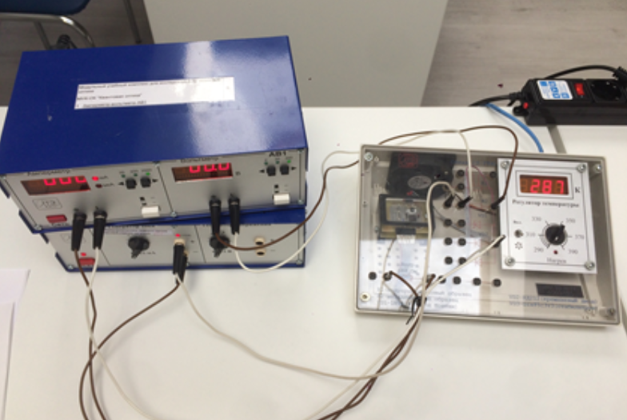
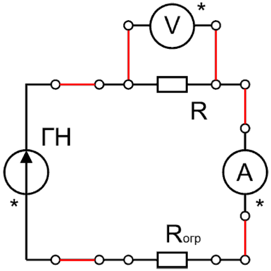

<head>
    
    
</head>

## [MainPage](../../index.md)/[Physics](../README.md)/Lab3.05

## Цель работы

1. Получить зависимость электрического сопротивления металлического и полупроводникового образцов в диапазоне температур от комнатной до $75^{\circ}C$.
2. По результатам п.1 вычислить температурный коэффициент сопротивления металла и ширину запрещенной зоны полупроводника.

## Введение

Электрический ток есть направленное движение заряженных частиц - свободных носителей заряда. Без внешнего электрического поля эти носители совершают хаотическое тепловое движение. Средний модуль скорости теплового движения электронов при комнатных температурах порядка $10^5$ м/с. Внешнее электрическое поле действует на носитель заряда с силой

$$\vec{F}=q\vec{E}\qquad(1)$$

где $q$ - заряд носителя, $\vec{E}$ - напряженность электрического поля. Таким образом, внешнее поле создает направленное движение носителей заряда - электрический ток с плотностью тока

$$\vec{j}=qn\vec{u}\qquad(2)$$

Здесь $n$ - концентрация носителей заряда, $\vec{u}$ - направленная(дрейфовая) скорость носителей. Если ток создается единственным типом носителей (например, электронами), формула (2) дает полную плотность тока в испытуемом образце.

В конденсированных средах носители заряда претерпевают частые столкновения с другими частицами. Это ведет к двум важным следствиям: дрейфовая скорость носителей много меньше средней скорости их теплового движения ($u\ll v$) и пропорциональна силе $\vec{F}$, следовательно, и напряженности поля:

$$\vec{u}=\mu\vec{E}\qquad(3)$$

Величину $\mu$ называют подвижностью носителей заряда. В итоге плотность тока оказывается пропорциональной напряженности поля: из (2) и (3) следует

$$\vec{j}=\sigma\vec{E}\qquad(4)$$

где $\sigma=qn\mu$ есть параметр конкретного материала - его удельная проводимость. Обратную величину $\rho=\sigma^{-1}$ называют удельным сопротивлением. Соотношение (4) представляет собой дифференциальную (векторную) форму закона Ома.

Зависимость проводимости от температуры принципиально различна для металлов и полупроводников. В металлах практически все валентные электроны свободны - не связаны с каким-либо конкретным атомом, поэтому температура не может заметно изменить концентрацию свободных носителей $n$. Изменение проводимости определяется температурной зависимостью подвижности электронов: $\sigma(T)\sim\mu(T)$.

Подвижность же тем больше, чем реже столкновения носителей со всякого рода дефектами кристаллической решетки. Таковыми являются атомы примеси, отклонения от идеального регулярного расположения атомов в узлах за счет, например, структурных дефектов кристалла или тепловых колебаний решетки. Увеличение с ростом температуры интенсивности тепловых колебаний атомов и хаотической скорости электронов увеличивает частоту столкновений между ними. Это ведет к уменьшению подвижности носителей заряда.

Для не слишком больших интервалов температуры (и не слишком низких температур) удельное сопротивление большинства металлов удовлетворительно описывается линейной зависимостью

$$\rho_M=\rho(1+\alpha t)\qquad(5)$$

где $\rho_0$ - удельное сопротивление при температуре $0^\circ C$, $\alpha$ - температурный коэффициент сопротивления. Естественно, так же зависит от температуры и сопротивление любого однородного металлического образца, если весь он имеет эту температуру:

$$R_M=R_0(1+\alpha t)\qquad(6)$$

где $R_0$ - сопротивление данного образца при при температуре $0^\circ C$. Пример данной зависимости приведен на рис.1 линией $R_M$.

По данным прямых измерений из формулы (6) легко найти температурный коэффициент сопротивления металла

$$\alpha=\frac{1}{R_0}\cdot\frac{\Delta R}{\Delta t}\qquad(7)$$

При этом коэффициент 𝑅0 определяют прямым измерением или экстраполяцией (продлением) линейной зависимости $R=R(t)$ к температуре $t=0^\circ C$.

В полупроводнике валентные электроны связаны с ядрами атомов значительно сильнее, чем в металле. «Оторваться» от атома и превратиться в электрон проводимости могут лишь те из них, которые обладают избыточной энергией, большей некоторого значения $E_g$, которое называют шириной запрещенной зоны. В т.н. собственном полупроводнике (без присутствия в кристаллической решетке примесных атомов иного химического элемента), который является объектом данной лабораторной работы, разрыв каждой связи приводит к образованию пары электрон-дырка (разорванная межатомная связь). Дырки, так как они являются свободными носителями положительного элементарного заряда ($+e$) в отличии от электронов, перемещаются в направлении внешнего электрического поля. Полная плотность тока в полупроводнике складывается из плотностей электронного и дырочного токов: $\vec{j}=\vec{j}_-+\vec{j}_+$ . Следовательно, удельная проводимость

$$\sigma_П=en(\mu_-+\mu_+)\qquad(8)$$

так как в собственном полупроводнике концентрации электронов и дырок одинаковы $(n_-=n_+=n)$, а подвижности $\mu_-$ и $\mu_+$ различны. Но подвижности носителей заряда зависят от температуры существенно слабее, чем их концентрации, и поэтому для полупроводника можно приближенно считать $\sigma_П(T)\sim n(T)$.

Разрыв связей (генерация свободных носителей) достигается за счет энергии тепловых колебаний атомов. Среднее ее значение порядка $kT$ ($k$ - постоянная Больцмана; при комнатной температуре $kT\approx4\cdot10^{-21} Дж \approx 2.5\cdot10^{-2} эВ$). Процесс генерации носителей сопровождается обратным процессом рекомбинации электронов проводимости с дырками. Равновесие наступает, когда средняя частота актов рекомбинации равна средней частоте актов генерации. Расчет дает, что равновесная концентрация свободных носителей при этом

$$n\sim \exp(-\frac{E_g}{2kT})\qquad(9)$$

Следовательно, удельная проводимость полупроводника зависит от температуры экспоненциальным образом:

$$\sigma_П\sim\exp(-\frac{E_g}{2kT})\qquad(10)$$

а удельное сопротивление будет равно

$$\rho_П=\frac{1}{\sigma_П}=\rho_m\exp(\frac{E_g}{2kT})\qquad(11)$$

где $\rho m$ - предел к которому стремится значение удельного сопротивления полупроводника при повышении температуры.

Если однородный полупроводниковый образец весь имеет температуру $T$, то зависимость его сопротивления от этой температуры можно описать формулой

$$R_П=R_m\exp(\frac{E_g}{2kT})\qquad(12)$$

Логарифмирование соотношения (12) позволяет представить зависимость сопротивления собственного полупроводника от температуры в более простом виде:

$$\ln(R_П)=\ln(R_m)+\frac{E_g}{2kT}\qquad(13)$$

>РИС. 1. Зависимость электрического сопротивления металла и собственного полупроводника от температуры

Хорошо видна разница между металлом и полупроводником: сопротивление металла по мере повышения температуры растет, сопротивление полупроводника - падает. Для металла сопротивление линейно зависит от температуры (формула (6), линия $R_M$ на рис.1), а для полупроводника линейно связаны логарифм сопротивления и величина, обратная температуре (формула (13)), следовательно по результатам измерений сопротивления образца из полупроводника можно найти ширину его запрещенной зоны, как угловой коэффициент в зависимости логарифма сопротивления от величины $(2kT)^{-1}$

$$E_g=2k\cdot\frac{\Delta\ln(R_П)}{\Delta(1/T)}\qquad(14)$$

## Лабораторная установка

Общий вид лабораторной установки показан на рис.2. Она состоит из стенда «С3-ТТ01» с объектами изучения - металлическим и полупроводниковым образцами, генератора ГН1 и амперметра-вольтметра АВ1, соединенных проводниками. На корпусе стенда схематично изображены элементы электрической цепи.

> РИС. 2. Общий вид лабораторной установки

Принципиальная электрическая схема установки представлена на рис. 3. Одновременно измеряя напряжение на объекте исследования и ток через него, можно найти его сопротивление с помощью закона Ома для участка цепи $R=U/I$.

>РИС. 3. Принципиальная электрическая схема установки

Нагреватель с системой термостабилизации и измерения текущей температуры объекта находится внутри стенда «С3-ТТ01». Также в корпусе стенда расположен вентилятор, необходимый для более быстрого охлаждения образца.

Дополнительный резистор $R_{огр}$ = 680 Ом, подключаемый последовательно с объектом, необходим в связи с тем, что при нагревании сопротивление полупроводникового образца может уменьшиться в несколько раз, и общее сопротивление схемы будет слишком малым по сравнению с постоянным по величине внутренним сопротивлением источника ЭДС. Для проведения измерений с металлическим образцом отсутствует необходимость подключения $R_{огр}$, но в схеме оно остается из соображений унификации.

## Проведение измерений

### Задание 1. Изучение полупроводникового образца

1. Перед включением проверьте правильность соединения элементов электрической схемы. В цепи должен находиться элемент $R_1$ - полупроводниковое сопротивление.
2. Обратите внимание, чтобы регуляторы выходного напряжения генератора (в левой части лицевой панели прибора) и температуры образца (на стенде) находились в крайнем левом положении (т.е. был повернуты против часовой стрелки до упора).
3. Кнопки выбора режима измерений на амперметре-вольтметре АВ1 должны находится в т.н. «отжатом» положении, в этом случае прибор обеспечивает измерение постоянных токов и напряжений. Кнопка подключения внутреннего сопротивления генератора ГН1 также должна находится в «отжатом» положении.
4. Включите приборы АВ1 и ГН1 с помощью красных кнопок «Сеть» на корпусах приборов. Установите на амперметре диапазон измеряемых токов 0 ÷ 2000 мкА, а на вольтметре диапазон измеряемых напряжений 0÷2 В.
5. Аккуратным поворотом по часовой стрелке регулятора выходного напряжения установите значение силы тока, протекающего через образец в интервале 1000÷1400 мкА.
6. Убедившись в стабильности показаний всех приборов (в т.ч. электронного термометра на стенде) запишите в Таблицу 1 значения: температуры (в кельвинах), силы тока (в мкА с точностью до единиц), напряжения (в вольтах, с точностью до тысячных долей). 
7. Включите подогрев образца, плавным поворотом по часовой стрелке установив регулятор температуры между делениями шкалы 370 K и 390 K. При этом должен начать светиться красный индикаторный светодиод «Нагрев» на панели стенда «С3-ТТ01». Нагрев образца при этом происходит в непрерывном режиме и его температура монотонно начнет расти.

### Задание 2. Изучение металлического образца

1. Не выключая нагрев, замените объект измерений - подключив элемент $R_2$ (металлический резистор) вместо элемента $R_1$. Для этого следует переключить провод идущий от ограничительного резистора $R_{огр}$ на одну позицию ниже и подключить вольтметр параллельно элементу $R_2$.
2. Рабочие диапазоны измерительных приборов остаются прежними.
3. Отрегулируйте выходное напряжение генератора так, чтобы ток через образец находился в диапазоне 1200÷1500 мкА.
4. Плавным поворотом регулятора температуры против часовой стрелки до упора выключите подогрев термостабилизируемой площадки с образцами. Ее температура начнет уменьшатся вследствие теплообмена с окружающей средой.
5. Начиная с $ = 350 ÷ 355$ K запишите в Таблицу 2 протокола текущие значения температуры, тока и напряжения на металлическом образце.
6. Выждав время, необходимое для уменьшения температуры на $\Delta T = 3÷5$ 𝐾, повторите действия из предыдущего пункта, заполняя таким образом рабочую таблицу до достижения температуры близкой к комнатной $T = 295 ÷ 300$ 𝐾.
7. До значения $\approx 340$ K температура образца будет опускаться в достаточно удобном темпе для того, чтобы успевать записывать показания приборов. При меньших температурах для ускорения процесса измерений можно тумблером на лицевой панели стенда кратковременно (на 5-10 сек) включать вентилятор для увеличения конвективного теплообмена. Обратите внимание, во время снятия показаний приборов вентилятор должен быть выключен.
8. После завершения процесса измерений следует в невыключенном состоянии сдать лабораторную установку дежурному инженеру и получить его подпись на стандартном бланке протоколотчета.

### Обработка результатов измерений

1. Рассчитайте и запишите в рабочие таблицы значения сопротивления объектов исследования при всех температурах.
2. По данным Таблицы 1 рассчитайте значения натурального логарифма сопротивления полупроводника и величину обратной абсолютной температуры. По результатам расчетов постройте график соответствующей зависимости $\ln(R)=\ln(R)(\frac{1}{T})$. Качественно оцените линейность полученного графика.
3. По данным Таблицы 2 постройте на масштабной миллиметровой бумаге график зависимости сопротивления металла от температуры в шкале Цельсия $R_M = R_M(t)$. Интервалы величин сопротивления и температуры на осях выберите в соответствии с диапазонами изменения этих величин в проведенных измерениях. Качественно оцените линейность полученного графика.
4. Для определения величины температурного коэффициента сопротивления металла разделите все точки в Таблице 2 на пары, в которых значения отстоят друг от друга на примерно одинаковое максимальное расстояние. Например, если в таблице имеется 12 независимых значений, то первая точка объединяется в пару с седьмой, вторая с восьмой, и так далее. Поскольку мы считаем, что зависимость сопротивления металла от температуры имеет линейный характер, то для каждой пары значений можно написать систему линейных уравнений:

  $$\begin{cases}
      R_i=R_0(1+\alpha\cdot t_i)\\
      R_j=R_0(1+\alpha\cdot t_j)
  \end{cases}$$

  После исключения неизвестной величины $R_0$ из этой системы получаем рабочую формулу для нахождения $\alpha$:

  $$\alpha_{ij}=\frac{R_i-R_j}{R_j\cdot t_i-R_i\cdot t_j}\qquad(16)$$

5. После проведения вычислений по формуле (16) со всеми парами значений из Таблицы 2 вы получите набор значений $\alpha$, по которому можно с помощью стандартных формул найти среднее значение $⟨\alpha⟩$ и оценить его погрешность $\Delta\alpha$.
6. Аналогичные действия следует провести и при вычислении ширины запрещенной зоны полупроводника. В соответствии с формулой (13) связь между натуральным логарифмом сопротивления полупроводника и обратной температурой является линейной. Разбивая весь массив экспериментальных данных на независимые пары, получаем рабочую формулу для оценки ширины запрещенной зоны полупроводника:
  
  $$E_{gij}=2k\frac{\ln R_i-\ln R_j}{\frac{1}{T_i}-\frac{1}{T_j}}=2k\frac{T_iT_j}{T_j-T_i}\ln(\frac{R_i}{R_j})\qquad(17)$$

7. Найдите среднее значение ширины запрещенной зоны $⟨𝐸𝑔⟩$ и его погрешность $\Delta E_g$. Окончательный результат представьте как в джоулях, так и в электрон-вольтах, учитывая что постоянная Больцмана имеет значение:
  
  $$k=1.380649\cdot10^{-23} Дж/К \approxeq 8.61733\cdot 10^{-5} эВ/К\qquad(18)$$

8. Результаты всех расчетов с указанием погрешностей представьте в отчете в стандартной форме.
9. По значению температурного коэффициента сопротивления металла и ширине запрещенной зоны полупроводника с помощью литературных данных идентифицируйте их.
10. Сформулируйте выводы по лабораторной работе и запишите их в отчет.

## Приложение

№|T, K|I, мкА|U, B|R, Ом|$\ln R$|$\frac{10^3}{T}, \frac{1}{K}$
-|-|-|-|-|-|-
1| | | | | | 
2| | | | | | 
...| | | | | | 
...| | | | | | 
...| | | | | | 
...| | | | | | 
...| | | | | | 
...| | | | | | 
...| | | | | | 
...| | | | | | 
...| | | | | | 
...| | | | | | 
...| | | | | | 
...| | | | | | 

>Таблица 1: Полупроводниковый образец

1) Цель работы: какие зависимости, величины хотим получить?
2) Какие величины измеряем, какими будут погрешности?
3) Чем обусловлена разная зависимость проводимости от температуры для металлов и проводников?
4) Какой объект (конденсатор, резистор и т.д.) исследуется?
