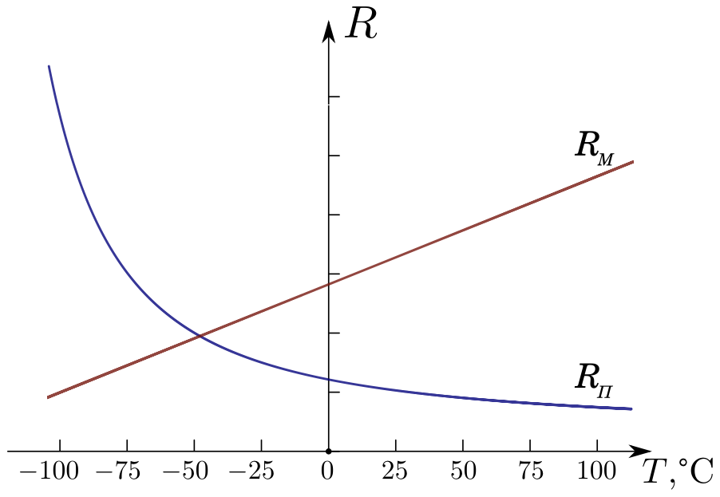

<head>
    
    
</head>

## [MainPage](../../index.md)/[Physics](../README.md)/Lab3.05

## Цель работы

1. Получить зависимость электрического сопротивления металличе- ского и полупроводникового образцов в диапазоне температур от комнатной до $75^{\circ}C$.
2. По результатам п.1 вычислить температурный коэффициент со- противления металла и ширину запрещенной зоны полупроводника.

## Введение

Электрический ток есть направленное движение заряженных частиц - свободных носителей заряда. Без внешнего электриче- ского поля эти носители совершают хаотическое тепловое дви- жение. Средний модуль скорости теплового движения электронов при комнатных температурах порядка $10^5$ м/с. Внешнее электри- ческое поле действует на носитель заряда с силой

$$\vec{F}=q\vec{E}\qquad(1)$$

где $q$ - заряд носителя, $\vec{E}$ - напряженность электрического по- ля. Таким образом, внешнее поле создает направленное движение носителей заряда - электрический ток с плотностью тока

$$\vec{j}=qn\vec{u}\qquad(2)$$

Здесь $n$ - концентрация носителей заряда, $\vec{u}$ - направленная(дрейфовая) скорость носителей. Если ток создается единственным типом носителей (например, электронами), формула (2) дает полную плотность тока в испытуемом образце.

В конденсированных средах носители заряда претерпевают частые столкновения с другими частицами. Это ведет к двум важным следствиям: дрейфовая скорость носителей много мень- ше средней скорости их теплового движения ($u\ll v$) и пропор- циональна силе $\vec{F}$, следовательно, и напряженности поля:

$$\vec{u}=\mu\vec{F}\qquad(3)$$

Величину $\mu$ называют подвижностью носителей заряда. В ито- ге плотность тока оказывается пропорциональной напряженности поля: из (2) и (3) следует

$$\vec{j}=\sigma\vec{E}\qquad(4)$$

где $\sigma=qn\mu$ есть параметр конкретного материала - его удельная проводимость. Обратную величину $\rho=\sigma^{-1}$ называют удельным сопротивлением. Соотношение (4) представляет собой дифферен- циальную (векторную) форму закона Ома.

Зависимость проводимости от температуры принципиально раз- лична для металлов и полупроводников. В металлах практически все валентные электроны свободны - не связаны с каким-либо конкретным атомом, поэтому температура не может заметно из- менить концентрацию свободных носителей $n$. Изменение прово- димости определяется температурной зависимостью подвижности электронов: $\sigma(T)\sim\mu(T)$.

Подвижность же тем больше, чем реже столкновения носите- лей со всякого рода дефектами кристаллической решетки. Тако- выми являются атомы примеси, отклонения от идеального регу- лярного расположения атомов в узлах за счет, например, струк- турных дефектов кристалла или тепловых колебаний решетки. Увеличение с ростом температуры интенсивности тепловых ко- лебаний атомов и хаотической скорости электронов увеличивает частоту столкновений между ними. Это ведет к уменьшению по- движности носителей заряда.

Для не слишком больших интервалов температуры (и не слиш- ком низких температур) удельное сопротивление большинства ме- таллов удовлетворительно описывается линейной зависимостью

$$\rho_M=\rho(1+\alpha t)\qquad(5)$$

где $\rho_0$ - удельное сопротивление при температуре $0^\circ C$, $\alpha$ - тем- пературный коэффициент сопротивления. Естественно, так же за- висит от температуры и сопротивление любого однородного ме- таллического образца, если весь он имеет эту температуру:

$$R_M=R_0(1+\alpha t)\qquad(6)$$

где $R_0$ - сопротивление данного образца при при температуре $0^\circ C$. Пример данной зависимости приведен на рис.1 линией $R_M$.

По данным прямых измерений из формулы (6) легко найти температурный коэффициент сопротивления металла

$$\alpha=\frac{1}{R_0}\cdot\frac{\Delta R}{\Delta t}\qquad(7)$$

При этом коэффициент 𝑅0 определяют прямым измерением или экстраполяцией (продлением) линейной зависимости $R=R(t)$ к температуре $t=0^\circ C$.

В полупроводнике валентные электроны связаны с ядрами атомов значительно сильнее, чем в металле. «Оторваться» от ато- ма и превратиться в электрон проводимости могут лишь те из них, которые обладают избыточной энергией, большей некоторо- го значения $E_g$, которое называют шириной запрещенной зоны. В т.н. собственном полупроводнике (без присутствия в кристалли- ческой решетке примесных атомов иного химического элемента), который является объектом данной лабораторной работы, раз- рыв каждой связи приводит к образованию пары электрон-дырка (разорванная межатомная связь). Дырки, так как они являют- ся свободными носителями положительного элементарного заря- да ($+e$) в отличии от электронов, перемещаются в направлении внешнего электрического поля. Полная плотность тока в полупроводнике складывается из плотностей электронного и дыроч- ного токов: $\vec{j}=\vec{j}_-+\vec{j}_+$ . Следовательно, удельная проводимость

$$\sigma_П=en(\mu_-+\mu_+)\qquad(8)$$

так как в собственном полупроводнике концентрации электро- нов и дырок одинаковы $(n_-=n_+=n)$, а подвижности $\mu_-$ и $\mu_+$ различны. Но подвижности носителей заряда зависят от темпе- ратуры существенно слабее, чем их концентрации, и поэтому для полупроводника можно приближенно считать $\sigma_П(T)\sim n(T)$.

Разрыв связей (генерация свободных носителей) достигается за счет энергии тепловых колебаний атомов. Среднее ее зна- чение порядка $kT$ ($k$ - постоянная Больцмана; при комнатной температуре $kT\approx4\cdot10^{-21} Дж \approx 2.5\cdot10^{-2} эВ$). Процесс генера- ции носителей сопровождается обратным процессом рекомбина- ции электронов проводимости с дырками. Равновесие наступает, когда средняя частота актов рекомбинации равна средней часто- те актов генерации. Расчет дает, что равновесная концентрация свободных носителей при этом

$$n\sim \exp(-\frac{E_g}{2kT})\qquad(9)$$

Следовательно, удельная проводимость полупроводника зави- сит от температуры экспоненциальным образом:

$$\sigma_П\sim\exp(-\frac{E_g}{2kT})\qquad(10)$$

а удельное сопротивление будет равно

$$\rho_П=\frac{1}{\sigma_П}=\rho_m\exp(\frac{E_g}{2kT})\qquad(11)$$

где $\rho m$ - предел к которому стремится значение удельного сопротивления полупроводника при повышении температуры.

Если однородный полупроводниковый образец весь имеет температуру $T$, то зависимость его сопротивления от этой температуры можно описать формулой

$$R_П=R_m\exp(\frac{E_g}{2kT})\qquad(12)$$

Логарифмирование соотношения (12) позволяет представить зависимость сопротивления собственного полупроводника от тем- пературы в более простом виде:

$$\ln(R_П)=\ln(R_m)+\frac{E_g}{2kT}\qquad(13)$$

>РИС. 1. Зависимость электрического сопротивления металла и собственного полупроводника от температуры

Хорошо видна разница между металлом и полупроводником: сопротивление металла по мере повышения температуры растет, сопротивление полупроводника - падает. Для металла сопротив- ление линейно зависит от температуры (формула (6), линия $R_M$ на рис.1), а для полупроводника линейно связаны логарифм со- противления и величина, обратная температуре (формула (13)), следовательно по результатам измерений сопротивления образца из полупроводника можно найти ширину его запрещенной зоны, как угловой коэффициент в зависимости логарифма сопротивле- ния от величины $(2kT)^{-1}$

$$E_g=2k\cdot\frac{\Delta\ln(R_П)}{\Delta(1/T)}\qquad(14)$$