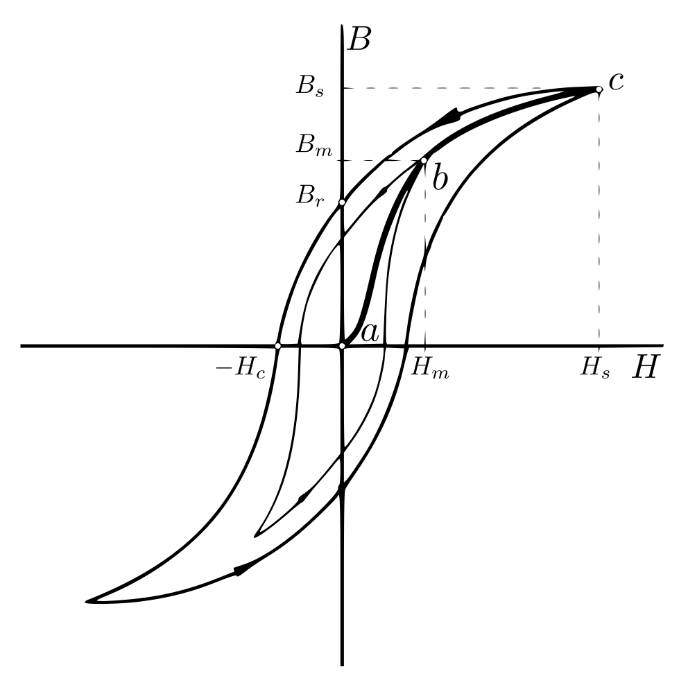
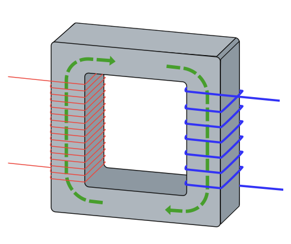
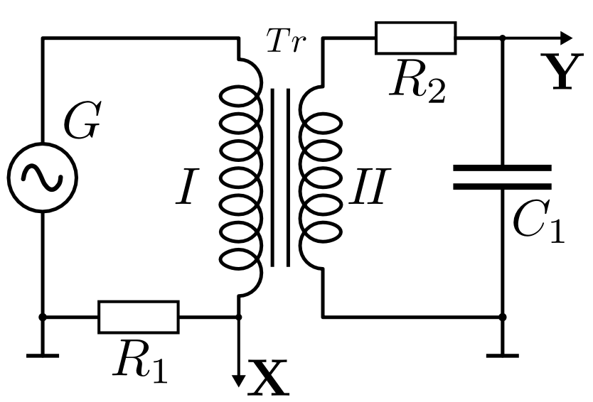
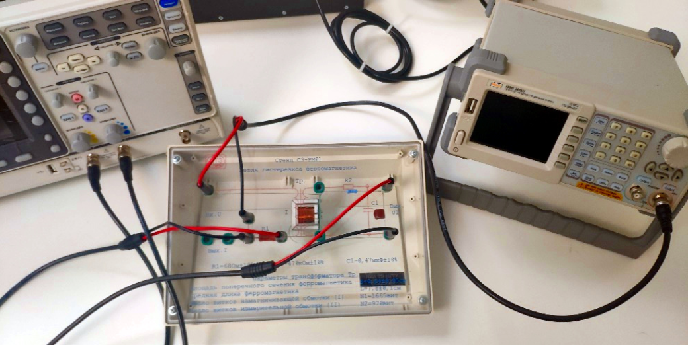
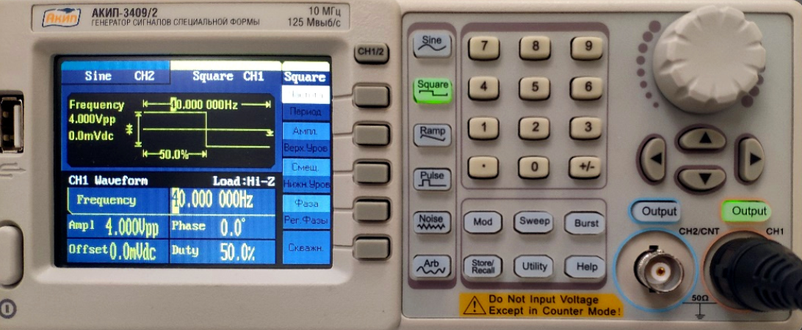
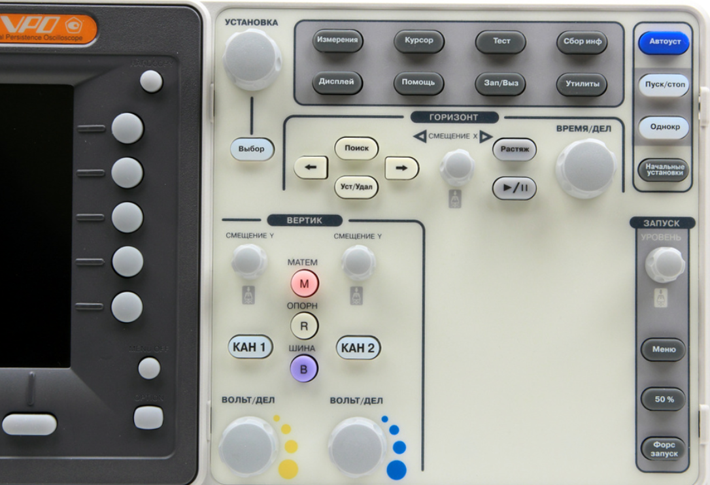

<head>
    
    
</head>

## [MainPage](../../index.md)/[Physics](../README.md)/Lab3.07

## Цель работы

1. Измерение зависимости магнитной индукции в ферромагнетике от напряженности магнитного поля 𝐵 = 𝐵(𝐻)
2. Определение по предельной петле гистерезиса индукции насыщения, остаточной индукции и коэрцитивной силы
3. Получение зависимости магнитной проницаемости от напряженности магнитного поля 𝜇 = 𝜇(𝐻) и оценка максимального значения величины магнитной проницаемости
4. Расчет мощности потерь энергии в ферромагнетике в процессе его перемагничивания
   
## Введение

Ферромагнетиками называют вещества с магнитной проницаемостью, много большей единицы. Типичными их представителями являются железо, никель, кобальт, их сплавы между собой и с некоторыми другими металлами.

Индукция $\vec{B}$ магнитного поля в некотором материале складывается из индукции $\mu_0\vec{H}$ поля, созданного макроскопическими токами, и индукции поля $\mu_0\vec{J}$, созданного самим материалом,

$$\vec{B}=\mu_0(\vec{H}+\vec{J})\qquad(1)$$

Здесь $\vec{H}$ - напряженность магнитного поля; $\vec{J}$ - намагниченность материала: отношение магнитного момента некоторого небольшого объема вещества к самому этому объему; $\mu_0=4\pi\cdot10^{-7}$ Гн/м - магнитная постоянная. Магнитной проницаемостью материала называют отношение индукции магнитного поля к части ее, созданной макроскопическими токами:

$$\mu=1+\frac{J}{H}=\frac{B}{\mu_0h}\qquad(2)$$

Значительная намагниченность, достигаемая в ферромагнетиках и соответственно большая их магнитная проницаемость обусловлены наличием так называемых магнитных доменов - областей самопроизвольного (спонтанного) намагничивания $J$. Их собственные магнитные моменты во много раз превосходят магнитные моменты молекул, так как размеры доменов обычно имеют порядок $10^{−6}$ м или больше.

РИС. 1. Зависимость магнитной индукции от напряженности магнитного поля в ферромагнетике (петля гистерезиса).

Магнитные поля отдельных доменов не обнаруживаются во внешнем пространстве, т.к. все они намагничены в разных направлениях. Величина самопроизвольного намагничивания доменов зависит от температуры и при абсолютном нуле достигает полного насыщения. Тепловое движение разрушает упорядоченную структуру и при некоторой температуре $T_c$, характерной для данного вещества, упорядоченное расположение полностью разрушается. Эта температура называется точкой Кюри. Выше точки Кюри вещество обладает свойствами парамагнетика.

Под влиянием внешнего поля состояние ферромагнитного вещества может изменяться двумя способами. Намагниченность может меняться либо за счет переориентации доменов, либо за счет смещения их границ в направлении области с меньшей составляющей намагниченности, совпадающей по направлению с внешним полем. Смещение границы домена совершается обратимо только до определенного предела, после чего часть или вся область необратимо переориентируется. При быстрой скачкообразной переориентации домена создаются вихревые токи, вызывающие потери энергии при перемагничивании.

После уменьшения напряженности внешнего магнитного поля до нуля часть доменов сохраняет новое направление преимущественного намагничивания, что проявляется как остаточная намагниченность.

Характер изменения магнитной индукции $B$ в зависимости от напряженности $H$ магнитного поля внутри типичного ферромагнетика показан на рис. 1. Если к первоначально размагниченному образцу прикладывать усиливающееся внешнее магнитное поле, то магнитная индукция изменяется в соответствии с кривой первоначального намагничивания $abc$. На начальном участке этой кривой магнитная индукция быстро и нелинейно возрастает с ростом магнитной напряженности. Затем в некоторой точке $(H_s, B_s)$ рост функции $B(H)$ сильно замедляется и становится линейным. Этот второй участок графика называется областью насыщения намагниченности. Если же после достижения некоторого значения напряженности, например, $H_m$ в точке $b$ начать уменьшать напряженность, то намагниченность образца и магнитная индукция внутри него уменьшаются с некоторым запаздыванием, не обращаясь в ноль при $H=0$. Такое запаздывание называется гистерезисом. Петля, которую описывает точка, изображающая состояние образца в координатах $(H,B)$ при периодическом изменении магнитной напряженности, называется петлей гистерезиса. На рис. 1 изображены две таких петли, одна – для колебаний напряженности с амплитудой $H_m$, другая – для колебаний с амплитудой $H_s$. Вершины множества частных петель гистерезиса образуют основную кривую намагничивания, она близка к изображенной на рис. 1 кривой первоначального намагничивания.

Важными характеристиками ферромагнетика являются остаточная магнитная индукция $B_r$ и коэрцитивная сила $H_c$. Остаточная магнитная индукция пропорциональна намагниченности, которую имеет ферромагнитный материал при напряжённости внешнего магнитного поля, равной нулю. Коэрцитивная сила это значение напряжённости магнитного поля, необходимое для полного размагничивания ферромагнитного вещества. Единица измерения коэрцитивной силы в СИ: ампер/метр. Чем большей коэрцитивной силой обладает магнитная среда, тем более она устойчива к размагничивающим факторам.

## Лабораторная установка

В лабораторной работе в качестве образца для изучения магнитных свойств ферромагнитного материала выбран сердечник (магнитопровод) трансформатора, размещенного на лабораторном стенде. Объект измерений имеет прямоугольную форму с прямоугольным же поперечным сечением (см. рис. 2).

РИС. 2. Магнитопровод (сердечник) трансформатора

Средняя длина $l$ и площадь поперечного сечения магнитопровода $S$ указаны на стенде. Принципиальная схема экспериментальной установки представлена на рис. 3.

РИС. 3. Принципиальная электрическая схема установки

На первичную обмотку подают сигнал от генератора синусоидального напряжения; частоту и амплитуду тока $I_1$ регулируют на панели генератора $G$. Намагничивающая (первичная) обмотка на образце имеет $N_1$ витков, и в соответствии с теоремой о циркуляции напряженности магнитного поля

$$\oint H{\rm d}l=N_1\cdot I_1\qquad(3)$$

при силе тока в ней $I_1$ создает в ферромагнетике поле с напряженностью

$$H=\frac{N_1}{l}\cdot I_1\qquad(4)$$

Последовательно с первичной обмоткой включен резистор $R_1$. Падение напряжения на нем $U_R=I_1R_1$ пропорционально силе тока катушки $I_1$, а значит, и напряженности магнитного поля $H$ (см. (4)). Это напряжение подается на вход усилителя горизонтальной развертки осциллографа, и поэтому амплитуда осциллограммы вдоль оси $OX$ пропорциональна силе тока $I$. По горизонтальному размеру осциллограммы легко вычислить напряженность магнитного поля. Для вычислений удобно использовать масштабирующий коэффициент $\alpha$:

$$H=\frac{N_1}{lR_1}\cdot K_x\cdot x=\alpha\cdot K_x\cdot x\qquad(5)$$

где $x$ - координата по горизонтальной оси 𝑂𝑋 экрана осциллографа относительно центра петли гистерезиса, а цена деления горизонтальной шкалы $K_x$ задается элементами управления осциллографа.

На магнитопровод, кроме первичной, намотана и вторичная обмотка с числом витков $N_2$. В ней индуцируется электродви- жущая сила $\mathscr{E}$, по закону Фарадея пропорциональная скорости изменения индукции магнитного поля:

$$\mathscr{E}=N_2\left\vert\frac{\partial\Phi}{\partial t}\right\vert=N_2S\left\vert\frac{ {\rm d}B}{ {\rm d}t}\right\vert\qquad(6)$$

где $\Phi=B\cdot S$ - магнитный поток через каждый виток: $B$ - индукция магнитного поля в образце. Из (6) следует что,

$$B=\frac{1}{N_2S}\int\mathscr{E}{\rm d}t\qquad(7)$$

Для отыскания индукции 𝐵 нужно интегрировать по времени ЭДС во вторичной обмотке испытуемого образца. В схеме данной лабораторной работы использована простейшая интегрирующая $RC$-цепочка, которая состоит из последовательно соединенных резистора сопротивлением $R_2$ и конденсатора емкостью $C_1$.

Напряжение на всей цепочке $U_{in} = \mathscr{E}$. Выходным сигналом служит напряжение на конденсаторе $U_{out}=U_c$. Этот сигнал с конденсатора $C_1$ подается на вход усилителя вертикальной развертки осциллографа. Интегрирование будет достигнуто при условии $U_{out}\ll U_{in}$ (т.е. $U_C\ll \mathscr{E}$ ). В самом деле, всегда

$$U_C=\frac{q}{C_1}=\frac{1}{C_1}\int I_2{\rm d}t\qquad(8)$$

где $q$ - заряд конденсатора. При названном условии $I_2=\frac{\mathscr{E}}{R_2}$. Поэтому

$$U_{out}=U_C\approx\frac{1}{R_2C_1}\int\mathscr{E}{\rm d}t\qquad(9)$$

Произведение $R\cdot C$ называют постоянной времени (временем релаксации) $RC$-цепи (убедитесь самостоятельно, что оно имеет размерность времени). Интегрирование будет тем точнее, чем значительнее постоянная времени превышает характерное время процесса, в данном случае - период колебаний $T$. Для интегрирования необходимо условие $RC\gg T$, или, что то же самое, $RCf\gg1$, где $f=\frac{1}{T}$ - частота сигнала генератора.

Из формул (7) и (9) получаем

$$U_C=\frac{N_2S}{R_2C_1}\cdot B\qquad(10)$$

Таким образом, на вход усилителя вертикального отклонения подан сигнал, напряжение которого пропорционально индукции магнитного поля в образце. Вертикальный размер осциллограммы в свою очередь пропорционально этому напряжению, а значит, и индукции.

Цена деления вертикального отклонения $K_y$ пятна задается элементами управления на панели осциллографа. По вертикаль- ному размеру осциллограммы $y$ можно вычислить индукцию:

$$B=\frac{R_2C_1}{N_2S}\cdot K_y\cdot y=\beta\cdot K_y\cdot y\qquad(11)$$

Коэффициент $\beta=\frac{R_2C_1}{N_2S}$ связывает между собой величину сигнала в канале $\bold{Y}$ и значение магнитной индукции.

Временное запаздывание магнитной индукции в образце относительно напряженности магнитного поля приводит к потерям энергии. При этом средняя мощность $P$, расходуемая внешним источником тока при циклическом перемагничивании ферромагнитного образца, пропорциональна площади 𝑆ПГ петли гистерезиса:

$$P=\chi\cdot S_{ПГ}\qquad(12)$$

где $S_{ПГ}$ - площадь петли гистерезиса, измеренная в делениях шкалы осциллографа, а коэффициент $\chi$ равен

$$\chi=K_xK_y\frac{N_1R_2C_1}{N_2R_1}f\qquad(13)$$

где $f$ частота сигнала, подаваемого на первичную обмотку трансформатора.

В справедливости формулы (12) можно убедиться следующим образом. Магнитное поле в ферромагнетике создается первичной обмоткой, по которой протекает ток $I_1$. Тогда работа источника питания, затрачиваемая на элементарное изменение магнитного потока во всем ферромагнетике равна

$${\rm d}A=I_{общ}{\rm d}\Phi=N_1I_1{\rm d}\Phi\qquad(14)$$

Введем в соотношение (14) объем ферромагнетика $V=lS$:

$${\rm d}A=V\frac{ {\rm d}A}{V}=V\cdot\frac{ {\rm d}A}{lS}=V\cdot\frac{N_1I_1}{l}{\rm d}(\frac{\Phi}{S})=V\cdot H{\rm d}B\qquad(15)$$

Графически элементарная работа по перемагничиванию единицы объема представляет собой площадь малой горизонтальной полоски петли гистерезиса. Полная работа по перемагничиванию единицы объема вещества за один цикл определяется в виде интеграла по области, ограниченной петлей гистерезиса и численно равна ее площади:

$$\frac{A}{V}=\frac{1}{V}\oint{\rm d}A=\oint H{\rm d}B\qquad(16)$$

Для нахождения мощности потерь энергии в ферромагнетике 𝑃 (по сути, работы по перемагничиванию за единицу времени) необходимо правую часть последнего равенства умножить на количество циклов в единицу времени, то есть на частоту. Учитывая полученные выше соотношения связи между полями $H$, $B$ и амплитудой сигналов в каналах $\bold{X}$ и $\bold{Y}$ можно получить рабочие формулы (12) и (13).

## Порядок проведения измерений

1. Занесите в бланк рабочего протокола (п. «Рабочие формулы и исходные данные») значения параметров указанные на стенде: $N_1,N_1,l,R_1,R_2,C_1,S$ необходимые для расчета коэффициентов $\alpha,\beta,\chi$.

РИС. 4. Общий вид лабораторной установки

2. Соберите лабораторную установку соединив коаксиальными кабелями выход **CH1** генератора сигналов АКИП-3409/2, стенд с образцом и цифровой запоминающий осциллограф (ЦЗО) в соответствии со схемой, изображенной на рис. 4.
3. Включите приборы. Выберите русский язык интерфейса генератора соответствующей кнопкой на его лицевой панели (см. рис. 5). Установите и запишите выходную частоту генератора в пределах $f=20\div40$ Гц. Для этого выберите режим «**Sine**», выберите на панели дисплея опцию «**Частота**» и на цифровой панели наберите требуемое значение, укажите единицу измерения: «**Гц**». Аналогичным образом следует установить начальную амплитуду выходного сигнала генератора 20 $V$ для режима $V_{pp}$. После задания параметров выходного сигнала подключите генератор к схеме, нажав кнопку «**Output**».

РИС. 5. Лицевая панель генератора сигналов АКИП-3409/2

4. Выберите на панели ЦЗО (рис. 6) режим «**Сбор инф**» и с помощью функциональных кнопок по периметру дисплея выберите опции «**XY**», «**включить XY**».

РИС. 6. Панель управления осциллографа GDS-71102B

5. Подберите такие значения коэффициентов усиления $K_x$, $K_y$ регуляторами «**ВОЛЬТ/ДЕЛ**», чтобы сигналы в каждом из ка- налов занимали по вертикали существенную часть экрана (при необходимости можно немного уменьшить амплитуду выходного сигнала генератора). Запишите установленные значения коэффи- циентов $K_x$, $K_y$ в рабочий протокол.
6. C помощью ручек смещения сигнала каналов по вертикали расположите петлю так, чтобы ее центр совпал с началом координат на экране. При правильном выборе масштабов по осям петля должна иметь максимальные размеры, но не выходить за пределы экрана.
7. Измерьте координаты $Y_c$, $Y_r$ пересечения петли гистерезиса с осями координат. Вычислите коэффициенты $\alpha$ и $\beta$. Определите коэрцитивную силу $H_c$ и остаточную индукцию 𝐵𝑟 для исследуемого образца. Результаты расчетов внесите в Таблицу 1 протокол-отчета.

    $X_c, del$|$Y_r, del$|$H_c,A/м$|$B_r, Tл$
    ---|---|---|---
     - | - | - | - 

    
Таблица 1

8. Измерьте координаты 𝑋𝑚 и 𝑌𝑚 вершины петли гистерезиса. Найдите соответствующие 𝐻𝑚 и 𝐵𝑚 и по формуле (2) опреде- лите значение магнитной проницаемости 𝜇, соответствующее со- стоянию насыщения. Заполните Таблицу 2.

    $X_m, del$|$Y_m, del$|$H_m,A/м$|$B_m, Tл$|$\mu_m$
    ---|---|---|---|---
     - | - | - | - | - 

9. Перенесите в протокол измерений изображение петли гистерезиса в масштабе 1 см/дел по каждой из осей. Измерьте в делениях шкалы площадь $S_{ПГ}$ петли, вычислите коэффициент $\chi$ и по формуле (12) определите среднюю мощность $P$, расходуемую на перемагничивание образца.
10. Устанавливая поочередно меньшие амплитуды напряжения генератора ($10\div15$ значений) с шагом $0.5÷1.0 В$, получите соответствующие им петли гистерезиса и повторите для каждой частной петли гистерезиса измерения амплитудных значений напряженности и индукции магнитного поля. Выбирайте на каждом шаге такие коэффициенты $K_x$, $K_y$, при которых петля занимает максимальную площадь экрана, записывая их значения в рабочую таблицу протокола (см. Приложение: Таблица 3).
11. По полученным данным постройте кривую начального намагничивания $B_m=B_m(Hm)$ и график зависимости магнитной проницаемости $\mu=\mu(Hm)$ от напряженности магнитного поля.
12. Графически найдите напряженность поля, соответствующую максимуму магнитной проницаемости материала. Вычислите максимальное значение магнитной проницаемости по формуле (2).

## Результаты лабораторной работы

1. Значение коэрцитивной силы, остаточной индукции и магнит- ной проницаемости в состоянии насыщения.
2. Мощность потерь на перемагничивание ферромагнетика (с оцен- кой величины ее погрешности).
3. Графики зависимостей магнитной индукции и проницаемости от напряженности: $B=B(H)$ и $\mu=\mu(H)$.
4. Максимальное значение проницаемости $\mu_{max}$ и напряженность поля, при которой она наблюдается.

## Приложение