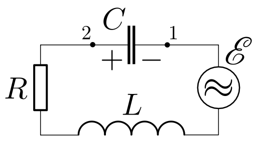

<head>
    
    
</head>

## [MainPage](../../index.md)/[Physics](../README.md)/Lab3.11

## Цель работы

1. Изучение вынужденных колебаний и явления резонанса напряже- ний в последовательном колебательном контуре.
2. Построениерезонанснойкривойиопределениерезонанснойчасто- ты.
3. Определение активного сопротивления и добротности колебатель- ного контура.

## Введение

### Вынужденные электромагнитные колебания

Рассмотрим цепь, состоящую из последовательно соединенных индуктивности, емкости и активного сопротивления в которую вклю- чен источник внешней электродвижущей силы (ЭДС), изменяю- щейся со временем по гармоническому закону:

$$\mathscr{E}(t)=\mathscr{E}_0\cos\Omega t\qquad(1)$$

>Рис. 1. Принципиальная электрическая схема лабораторной установки

Этот закон занимает особое положение благодаря свойствам са- мого колебательного контура сохранять гармонический вид колеба- ний при действии внешней гармонической ЭДС. Получим уравне- ние колебаний в контуре. По закону Ома для неоднородного участка цепи:

$$IR=\Delta\varphi+\mathscr{E}_{SI}+\mathscr{E}(t)\qquad(2)$$

где $\mathscr{E}_{SI}$ - ЭДС самоиндукции, возникающая в катушке индуктивно-
сти:

$$\mathscr{E}_{SI}=-L\frac{ {\rm d}I}{ {\rm d}t}\qquad(3)$$

а $\Delta\varphi=\varphi_1-\varphi_2$ - разность потенциалов между обкладками конденсатора:

$$\Delta\varphi=\varphi_1-\varphi_2=\frac{q}{C}\qquad(4)$$

Подставим (1), (3) и (4) в (2):

$$\frac{ {\rm d}^2q}{ {\rm d}t^2}+\frac{R}{L}\frac{ {\rm d}q}{ {\rm d}t}+\frac{q}{LC}=\frac{\mathscr{E}_0}{L}\cos\Omega t\qquad(5)$$

Используя новые обозначения: $\omega_0=\frac{1}{\sqrt{LC}}$ - частота собственных 𝐿𝐶
свободных колебаний в 𝐿𝐶-контуре без затухания (формула Томсона), $\beta=\frac{R}{2L}$ - коэффициент затухания, можем записать уравнение (5) в более компактном виде:

$$\frac{ {\rm d}^2q}{ {\rm d}t^2}+2\beta\frac{ {\rm d}q}{ {\rm d}t}+\omega_0^2q=\frac{\mathscr{E}_0}{L}\cos\Omega t\qquad(6)$$

Общее решение (6) может быть найдено как сумма общего ре- шения соответствующего однородного уравнения и частного реше- ния неоднородного уравнения. Но общее решение однородного урав- нения достаточно быстро (экспоненциально) затухает и по проше- ствии некоторого времени оно практически исчезнет, поэтому нас будут интересовать только установившиеся колебания, когда гла- венствующим является частное решение неоднородного уравнения.

Покажем, что установившиеся колебания заряда конденсатора будут определяться функцией вида:

$$q(t)=q_0\cos(\Omega t-\psi)\qquad(7)$$

где $q_0$ - амплитуда колебаний заряда на конденсаторе, а $\psi$ - разность фаз между колебаниями заряда на конденсаторе и внешней ЭДС.

Получим выражение для тока, взяв производную от заряда кон- денсатора (7) по времени $I(t)=\frac{ {\rm d}q}{ {\rm d}t}$:

$$I(t)=-\Omega q_0\sin(\Omega t-\psi)=I_0\cos(\Omega t-\psi+\frac{\pi}{2})=I_0\cos(\Omega t-\varphi)\qquad(8)$$

