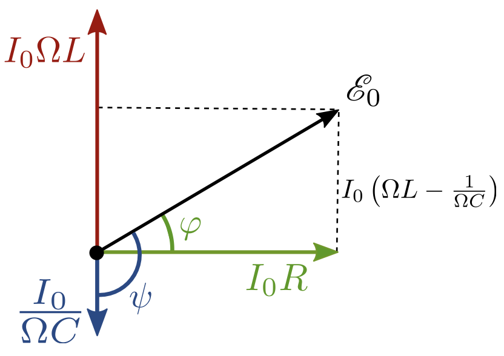
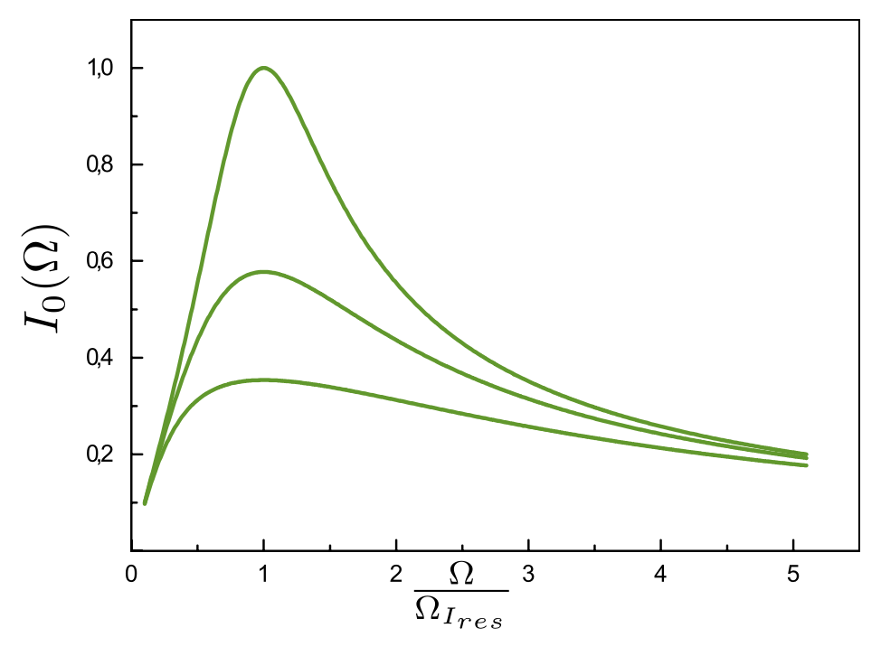
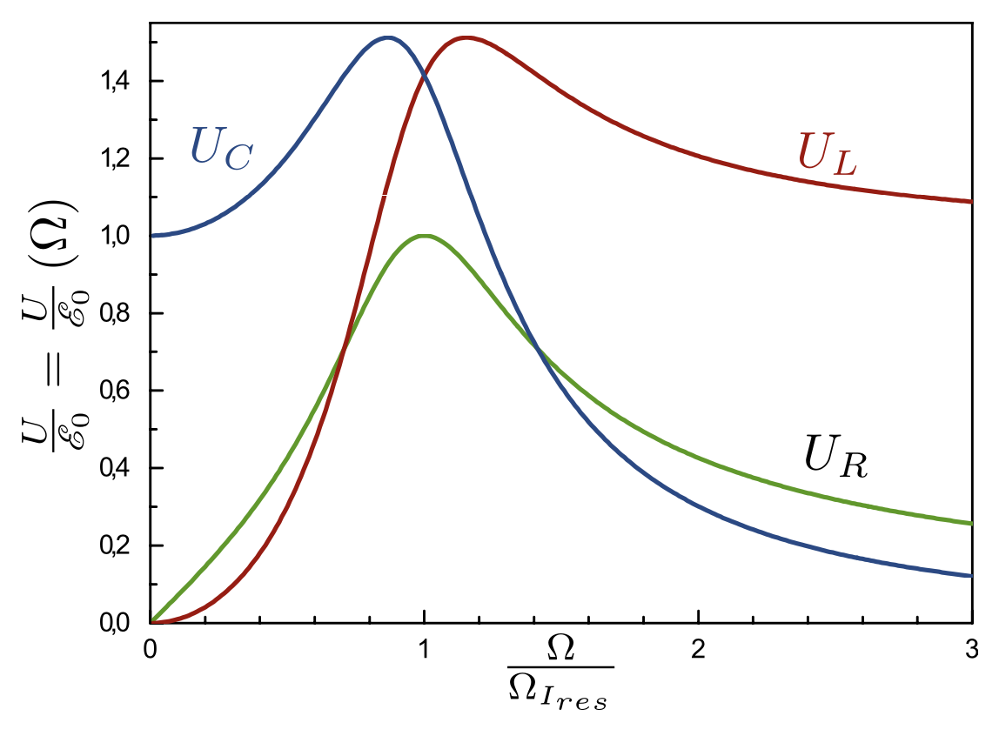
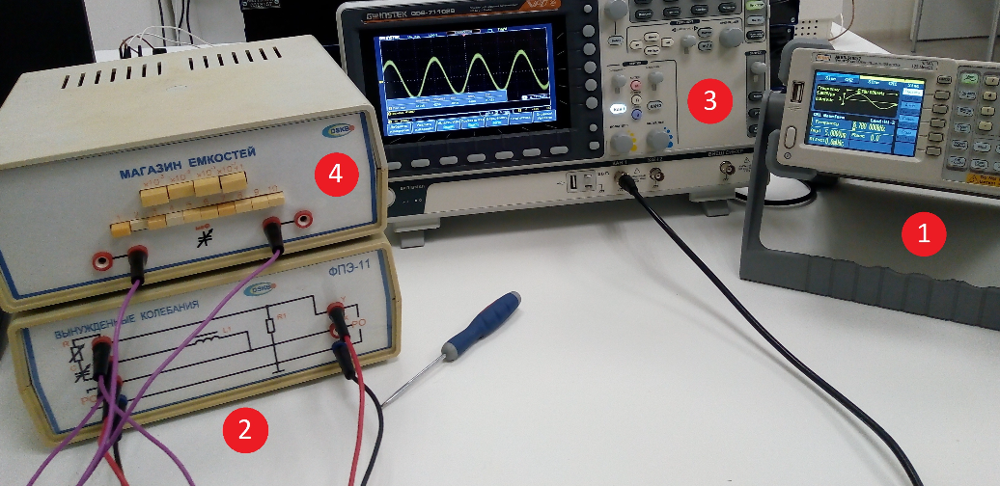
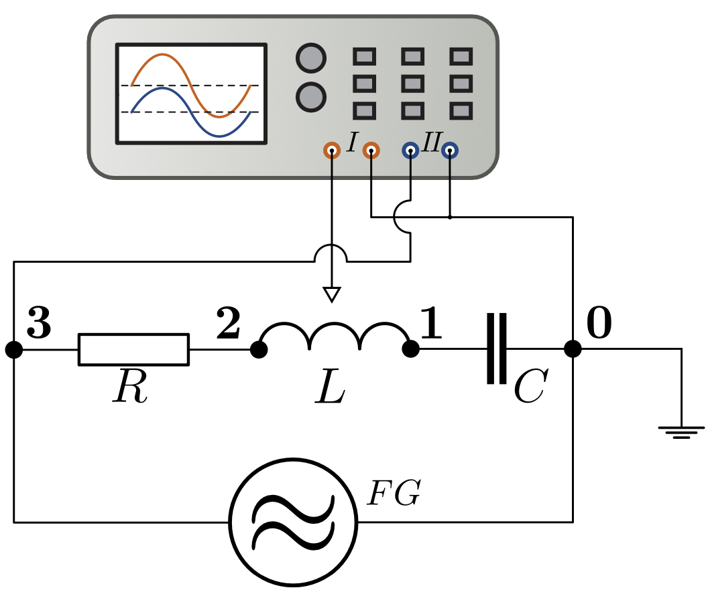

<head>
    
    
</head>

## [MainPage](../../index.md)/[Physics](../README.md)/Lab3.11

## Цель работы

1. Изучение вынужденных колебаний и явления резонанса напряжений в последовательном колебательном контуре.
2. Построениерезонанснойкривойиопределениерезонанснойчастоты.
3. Определение активного сопротивления и добротности колебательного контура.

## Введение

### Вынужденные электромагнитные колебания

Рассмотрим цепь, состоящую из последовательно соединенных индуктивности, емкости и активного сопротивления в которую включен источник внешней электродвижущей силы (ЭДС), изменяющейся со временем по гармоническому закону:

$$\mathscr{E}(t)=\mathscr{E}_0\cos\Omega t\qquad(1)$$

>Рис. 1. Принципиальная электрическая схема лабораторной установки

Этот закон занимает особое положение благодаря свойствам самого колебательного контура сохранять гармонический вид колебаний при действии внешней гармонической ЭДС. Получим уравнение колебаний в контуре. По закону Ома для неоднородного участка цепи:

$$IR=\Delta\varphi+\mathscr{E}_{SI}+\mathscr{E}(t)\qquad(2)$$

где $\mathscr{E}_{SI}$ - ЭДС самоиндукции, возникающая в катушке индуктивно-
сти:

$$\mathscr{E}_{SI}=-L\frac{ {\rm d}I}{ {\rm d}t}\qquad(3)$$

а $\Delta\varphi=\varphi_1-\varphi_2$ - разность потенциалов между обкладками конденсатора:

$$\Delta\varphi=\varphi_1-\varphi_2=\frac{q}{C}\qquad(4)$$

Подставим (1), (3) и (4) в (2):

$$\frac{ {\rm d}^2q}{ {\rm d}t^2}+\frac{R}{L}\frac{ {\rm d}q}{ {\rm d}t}+\frac{q}{LC}=\frac{\mathscr{E}_0}{L}\cos\Omega t\qquad(5)$$

Используя новые обозначения: $\omega_0=\frac{1}{\sqrt{LC}}$ - частота собственных 𝐿𝐶
свободных колебаний в 𝐿𝐶-контуре без затухания (формула Томсона), $\beta=\frac{R}{2L}$ - коэффициент затухания, можем записать уравнение (5) в более компактном виде:

$$\frac{ {\rm d}^2q}{ {\rm d}t^2}+2\beta\frac{ {\rm d}q}{ {\rm d}t}+\omega_0^2q=\frac{\mathscr{E}_0}{L}\cos\Omega t\qquad(6)$$

Общее решение (6) может быть найдено как сумма общего решения соответствующего однородного уравнения и частного решения неоднородного уравнения. Но общее решение однородного уравнения достаточно быстро (экспоненциально) затухает и по прошествии некоторого времени оно практически исчезнет, поэтому нас будут интересовать только установившиеся колебания, когда главенствующим является частное решение неоднородного уравнения.

Покажем, что установившиеся колебания заряда конденсатора будут определяться функцией вида:

$$q(t)=q_0\cos(\Omega t-\psi)\qquad(7)$$

где $q_0$ - амплитуда колебаний заряда на конденсаторе, а $\psi$ - разность фаз между колебаниями заряда на конденсаторе и внешней ЭДС.

Получим выражение для тока, взяв производную от заряда конденсатора (7) по времени $I(t)=\frac{ {\rm d}q}{ {\rm d}t}$:

$$I(t)=-\Omega q_0\sin(\Omega t-\psi)=I_0\cos(\Omega t-\psi+\frac{\pi}{2})=I_0\cos(\Omega t-\varphi)\qquad(8)$$

Здесь введены обозначения: 
- $\varphi=(\varphi-\pi)︀$ - сдвиг по фазе между током и внешней ЭДС
- $I_0=\Omega\cdot q_0$ - амплитуда силы тока.

Для нахождения явной зависимости $I_0$ и $\varphi$ от частоты изменения внешней ЭДС представим исходное уравнение (6) в виде

$$U_R(t)+U_C(t)+U_L(t)=\mathscr{E}_0\cos\Omega t\qquad(9)$$

В данном соотношении слева написана сумма напряжений на сопротивлении 𝑅, индуктивности $L$ и ёмкости $C$. Сумма этих напряжений в любой момент времени равна внешней ЭДС. Из (8) и закона Ома для участка цепи $U_R=IR$ напряжение на резисторе может быть представлено в виде:

$$U_R(t)=I_0 R\cos(\Omega t-\varphi)\qquad(10)$$

Оно изменяется синфазно силе тока в цепи.

Напряжение на конденсаторе пропорционально заряду на нем:

$$U(t)=\frac{q_0\cos(\Omega-\psi)}{C}=\frac{I_0}{\Omega C}\cos(\Omega t\varphi-\frac{\pi}{2})\qquad(11)$$

и отстает по фазе от силы тока на $\frac{\pi}{2}$.

Напряжение на катушке индуктивности

$$U_L(t)=L\frac{ {\rm d}I}{ {\rm d}t}=-\Omega LI_0\sin(\Omega t-\varphi)=\Omega LI_0\cos(\Omega t-\varphi+\frac{\pi}{2})\qquad(12)$$

опережает по фазе силу тока на $\frac{\pi}{2}$.

В соответствии с (10), (11) и (12), можно представить полное
сопротивление цепи (т.н. «импеданс») как сумму трёх сопротивлений: емкостного $X_C=(\Omega t)^{-1}$, индуктивного $X_L=\Omega L$ и активного сопротивления $R$. С учетом сдвига фаз между напряжениями на элементах цепи его можно записать в виде

$$X(\Omega)=\sqrt{R^2+(\Omega L-\frac{1}{\Omega C})^2}\qquad(12)$$

### Векторная диаграмма

Решение (6) удобно анализировать с помощью векторной диаграммы, изобразив амплитуды напряжений на активном сопротивлении, конденсаторе, индуктивности и их сумму, которая в соответствии c (5) равна амплитуде ЭДС источника $\mathscr{E}_0$. Эта диаграмма показана на рис. 2.

> Рис. 2. Векторная диаграмма

Из соотношений для сторон прямоугольного треугольника этой диаграммы непосредственно следуют выражения для амплитуды силы тока в цепи $I_0$ и величины фазового сдвига между током и ЭДС источника $\varphi$

$$I_0(\Omega)=\frac{\mathscr{E}_0}{\sqrt{R^2+(\Omega L-\frac{1}{\Omega C})^2}}\qquad(14)$$

$$\varphi(\Omega)=\arctan(\frac{\Omega L-\frac{1}{\Omega C}}{R})\qquad(15)$$

### Резонансные кривые для тока

> Рис. 3. Резонансные кривые для силы тока

Резонансными кривыми называют графики зависимости амплитуд силы тока $I_0$, заряда на конденсаторе $q_0$ и напряжений на конденсаторе, индуктивности и активном сопротивлении от частоты внешней ЭДС $\Omega$.

Резонансные кривые для силы тока при различных значениях коэффициента затухания (14) $I_0$ ($\Omega$) показаны на рис. 3.

Знаменатель (14) минимален при $\Omega L=\frac{1}{\Omega C}$ , следовательно, резонансная частота для силы тока совпадает с частотой собственных колебаний $LC$ контура в отсутствии затухания (активного сопротивления) $\Omega_{I_{res}}=\Omega_0=\frac{1}{\sqrt{LC}}$

Резонансная частота для тока не зависит от активного сопротивления контура $R$, но максимум при резонансе оказывается тем выше и острее, чем меньше коэффициент затухания $\beta=\frac{R}{2L}$

### Резонансные кривые для заряда конденсатора

Резонансные кривые для заряда на конденсаторе $q_0=q_0(\Omega)$ при различных коэффициентах затухания $\beta_1<\beta_2\beta_3$ показаны на рис. 4.

> Рис. 4. Резонансные кривые для заряда конденсатора

Резонансные кривые для напряжения на конденсаторе, поскольку $UC=\frac{q}{C}$, имеют аналогичный вид. Выполним преобразования, чтобы получить в явном виде зависимость $q_0$ от $\Omega$:

$$q_0(\Omega)=\frac{I_0(\Omega)}{\Omega}=\frac{\mathscr{E}_0}{\sqrt{(\Omega R)^2+(\Omega^2 L-\frac{1}{C})^2}}\qquad(16)$$

Приравняем производную подкоренного выражения знаменателя (16) к нулю и найдем резонансную частоту:

$$\frac{ {\rm d}((\Omega R)^2+(\Omega^2 L-\frac{1}{C})^2)}{ {\rm d}\Omega}=2\Omega R^2+2(\Omega^2L-\frac{1}{C})(2\Omega L)=0\qquad(17)$$

Из (17) непосредственно следует

$$\frac{R^2}{2}+\Omega_{q_{res}}^2L^2-\frac{L}{C}=0$$

$$\Omega_{q_{res}}=\sqrt{\frac{1}{LC}-\frac{R^2}{2L^2}}$$

Используя обозначения $\beta=\frac{R}{2L}$ для коэффициента затухания и $\Omega_0=\frac{1}{\sqrt{LC}}$ для собственной частоты незатухающих колебаний, запишем выражение для резонансной частоты:

$$\Omega_{q_{res}}=\sqrt{\Omega_0^2-2\beta^2}\qquad(18)$$

Резонансная частота для заряда конденсатора меньше собственной частоты контура и зависит от коэффициента затухания. Чем меньше коэффициент затухания, тем острее резонанс и тем ближе резонансная частота к собственной частоте колебаний контура.

Аналогично можно вычислить и резонансную частоту для напряжения на катушке индуктивности. Окажется, что эта частота несколько превышает собственную частоту колебаний контура $\Omega_0=\frac{1}{\sqrt{LC}}$ и приближается к ней по мере убывания коэффициента затухания.

На рис. 5. показаны зависимости амплитуд напряжений на активном сопротивлении $U_R$, конденсаторе $U_C$ и индуктивности $U_L$ от частоты внешней ЭДС. Соответствующие резонансные частоты имеют значения:

$$\begin{cases}
    \Omega_{R_{res}}=\Omega_0=\frac{1}{\sqrt{LC}}\\
    \Omega_{C_{res}}=\Omega_0\sqrt{1-2(\frac{\beta}{\Omega_0})^2}\\
    \Omega_{L_{res}}=\frac{\Omega_0}{\sqrt{1-2(\frac{\beta}{\Omega_0})^2}}\\
\end{cases}$$

> Рис. 5. Сравнение резонансных кривых

Чем меньше коэффициент затухания $\beta$, тем ближе резонансные частоты всех величин к собственной частоте контура $\Omega_0$.

### Резонансные кривые и добротность

Форма резонансных кривых определённым образом связана с добротностью контура $Q$. Особенно простой эта связь оказывается при малом затухании, когда $\beta\ll\Omega_0=\frac{1}{\sqrt{LC}}$. Тогда в (18) в подкоренном выражении можно пренебречь величиной $\beta$ и $\Omega_{C_{res}}\approxeq\Omega_0$. В этом случае

$$U_{C_{res}}=\frac{q_0}{C}=\frac{I_0}{\Omega_0C}=\frac{\mathscr{E}_0}{\Omega_0RC}\qquad(19)$$

$$\frac{U_{C_{res}}}{\mathscr{E_0}}=\frac{\sqrt{LC}}{RC}=\frac{1}{R}\sqrt{\frac{L}{C}}=Q\qquad(20)$$

Соотношение (20) совпадает с выражением для добротности контура при слабом затухании. То есть величина добротности контура показывает во сколько раз максимальное значение амплитуды напряжения на конденсаторе (и на индуктивности) превышает амплитуду внешней ЭДС.

Добротность связана и с другой важной характеристикой резонансной кривой – её шириной. Как несложно показать, при $\beta\ll\Omega_0$

$$Q=\frac{\Omega_0}{\Delta\Omega}\qquad(21)$$

где $\Omega_0$ - резонансная частота, $\Delta\Omega$ - ширина резонансной кривой на высоте равной $\frac{1}{\sqrt{2}}\approxeq0.7$ от максимальной (в резонансе). Это соответствует уменьшению мощности по сравнению с мощностью при резонансе в 2 раза.

### Примечание

При обработке результатов работы следует обратить внимание на то, что приборы измеряют частоту в Гц, а в формулах используется циклическая частота.

## Лабораторная установка

Схема экспериментальной установки представлена на Рис.6

> Рис. 6. Общий вид лабораторной установки

1. Синусоидальный сигнал с генератора (1) подается на блок ФПЭ-11 (2), содержащий катушку индуктивности.
2. Осциллограф (3) показывает выходное (измеряемое на конденсаторе) напряжение.
3. Блок "Магазин емкостей"(4) используется для выбора емкости конденсатора, включенного в колебательный контур.

## Указания по технике безопасности

1. Не разрешается включать установку в отсутствие преподавателя или лаборанта.
2. Нельзя оставлять без наблюдения лабораторную установку во включенном состоянии.
3. Все электрические провода и кабели должны свободно лежать на столе и не должны быть натянуты или перекручены.
4. В случае искрения, появления дыма или иных подобных явлений немедленно обесточить установку и сообщить преподавателю или инженеру.
5. После завершения проведения измерений и получения подписи инженера на бланке протокол-отчета все измерительные приборы и источники питания должны быть выключены.
6. ЗАПРЕЩАЕТСЯ одновременно нажимать более чем по одной клавише в каждом ряду магазина емкостей.

## Порядок выполнения работы

1. Соберите установку (см. рис. 7). Первый канал функционального генератора 𝐹 𝐺 «АКИП 3409/2» должен быть подключён к левым клеммам 𝑃𝑂 блока ФПЭ-11. Канал $I$ осциллографа подключается к правым клеммам 𝑃 𝑂 блока ФПЭ-11, чтобы измерять входное напряжение. Канал 𝐼𝐼 осциллографа подключается к правым клеммам 𝑃𝑂𝑌 блока ФПЭ-11, чтобы измерять выходное напряжение.
2. Установите на магазине емкостей емкость 0.1 мкФ.
3. Включите генератор и осциллограф. Установите на генераторе амплитуду синусоидального напряжения на первом канале равной 4,00 В. Установите режим одновременного наблюдения на экране осциллографа сигналов $I$ и $II$ каналов.

> Рис. 7. Общая схема лабораторной установки

4. Для известных значений ёмкости конденсатора $C$ и индуктивности катушки $L$ (индуктивность уточните у инженера) оцените резонансную частоту без учёта активного сопротивления катушки $f_{расч}$.
5. Плавно изменяя частоту генератора $FG$ в интервале от $f_{min}=f_{расч}-\Delta f$ до $f_{max} = f_{расч} + \Delta f$, где $\Delta f=500$ Гц, измерьте значения амплитуды выходного напряжения. Шаг по частоте следует выбирать таким образом, чтобы амплитуда выходного напряжения менялась не более чем на одно малое деление шкалы осциллографа. Результаты запишите в таблицу.
6. Последовательно устанавливая на магазине емкостей значения 1, 3, 10, 30, 100 и 300 нФ, найдите для этих величин емкости контура резонансные частоты. Для этого при неизменной амплитуде входного напряжения плавно изменяйте частоту до тех пор, пока выходное напряжение не достигнет максимума. Запишите полученные частоты.
7. Перед выключением установки сдайте ее во включенном состоянии дежурному инженеру.
8. Получите подпись на протоколе с результатами измерений.
9. Выключите генератор и осциллограф.

## Обработка результатов измерений

1. Постройте график зависимости амплитуды выходного напряжения от частоты входного. По графику определите резонансную частоту, при которой амплитуда колебаний напряжения на конденсаторе достигает наибольшего значения. Сравните результат прямых измерений с расчетным значением резонансной частоты. При наличии существенного расхождения объясните причины его появления в отчете по лабораторной работе.
2. По построенному графику, с помощью формулы (21) оцените величину добротности контура. Результат внесите в отчет.
3. Используя значения ЭДС генератора и напряжения на конденсаторе при резонансе, по формуле (20) оцените добротность контура контура $Q$. Результат внесите в отчет. Сравните результат с полученным по графику.
4. Постройте график зависимости квадрата резонансной частоты от обратной емкости. Аппроксимируйте график прямой. По углово- му коэффициенту графика найдите индуктивность, учитывая фор- мулу:

  $$\Omega_{res}^2=\frac{1}{LC}-\frac{R^2}{4L^2}$$

  Сравните найденную индуктивность с заданной индуктивностью.

5. По величине смещения графика относительно "0"и найденному в п.4 значению индуктивности оцените величину активного сопротивления контура $R$.
6. Результаты выполнения ЛР должны содержать:
   1. Расчетное и экспериментально полученное значение резонансной частоты для емкости $С=0.1$ мкФ
   2. Добротность контура для емкости $С=0.1$ мкФ, найденную по формулам (20) и (21).
   3. Значение активного сопротивления контура и экспериментально найденной индуктивности с указанием погрешности.

## Контрольные вопросы

1. Какие колебания называются вынужденными?
2. Запишите дифференциальное уравнение механических вынуж- денных колебаний.
3. Каков физический смысл добротности колебательной системы?
4. Чем обусловлена частота вынужденных колебаний?
5. Запишите общее решение дифференциального уравнения вы-
нужденных колебаний.
6. В чем заключается явление резонанса? Приведите примеры ис- пользования этого явления в природе и технике?
7. Как зависит емкостное сопротивление от частоты?
8. Как зависит индуктивное сопротивление от частоты?